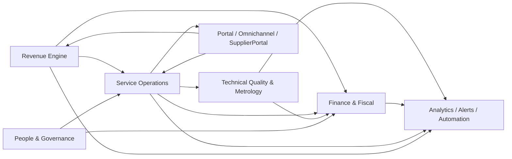

# PRD — Kalibrium ERP

> Documento mestre de produto para alinhamento entre Produto, Engenharia, Arquitetura, QA, Operações e liderança funcional.
>
> Este PRD descreve o **Kalibrium ERP** como plataforma SaaS vertical para empresas de calibração, metrologia, serviços técnicos de campo, operação recorrente e gestão corporativa integrada.

### Como usar este PRD

Este documento foi escrito para ser lido em três camadas:

- **camada executiva**: seções `1` a `7`, para entendimento de tese, posicionamento, oportunidade e diferenciais
- **camada produto/engenharia**: seções `8` a `24`, para entendimento de escopo, fluxos, arquitetura funcional, métricas, riscos, releases e governança
- **camada de referência**: apêndices, para navegação rápida por domínios, capacidades, stack e vocabulário

---

## 1. Resumo Executivo

O **Kalibrium ERP** é uma plataforma empresarial multi-tenant, modular e orientada a fluxos operacionais, criada para empresas que dependem de rastreabilidade, disciplina de execução e forte integração entre comercial, operação técnica, laboratório, financeiro, fiscal, RH, qualidade e analytics.

Seu papel não é apenas registrar transações administrativas. O Kalibrium foi concebido para operar como a espinha dorsal da empresa: transformar demanda em execução, execução em faturamento, faturamento em caixa, caixa em governança e governança em previsibilidade operacional e estratégica.

O produto substitui silos funcionais, planilhas paralelas, reconciliações manuais e sistemas desconectados por uma plataforma única, auditável e integrada, capaz de sustentar:

- geração e expansão de receita
- execução técnica de alto controle
- conformidade regulatória e trabalhista
- inteligência analítica acionável
- experiência conectada entre usuários internos, clientes, parceiros e fornecedores

### 1.1 Em uma frase

O Kalibrium é um **ERP vertical operacional** para empresas de serviços técnicos e metrologia que precisam integrar venda, campo, laboratório, compliance e finanças em um único sistema de verdade.

### 1.2 Resultado de negócio esperado

O resultado esperado é uma operação mais previsível, mais auditável, menos dependente de retrabalho manual e com maior capacidade de escalar receita, produtividade e governança sem multiplicar sistemas.

---

## 2. Visão, Missão e Posicionamento

### 2.1 Missão

Permitir que empresas de serviços técnicos, calibração, inspeção, manutenção, laboratório e operação de campo executem sua cadeia de valor inteira em uma única plataforma confiável, rastreável e preparada para crescimento.

### 2.2 Visão

Ser a plataforma operacional de referência para negócios que exigem profundidade de domínio, conformidade, mobilidade e integração ponta a ponta entre operação técnica e gestão corporativa.

### 2.3 Tese de Produto

Empresas desse segmento convivem com um problema estrutural: o fluxo real do negócio cruza comercial, agenda, campo, laboratório, estoque, financeiro, fiscal, RH e qualidade, enquanto a maioria dos sistemas trata essas áreas de forma fragmentada. Isso gera perda de contexto, inconsistência de dados, baixa governança, retrabalho e dificuldade para crescer com disciplina.

O Kalibrium resolve esse problema ao tratar as integrações entre domínios como parte do core do produto. Processos como orçamento, ordem de serviço, calibração, faturamento, certificação, cobrança, jornada de trabalho, auditoria e indicadores executivos compartilham contexto, regras e trilha de evidência.

### 2.4 Posicionamento

O Kalibrium é um **ERP vertical operacional com profundidade de domínio**, e não apenas um ERP administrativo acrescido de módulos acessórios. Seu posicionamento combina:

- profundidade operacional em serviços técnicos, campo e metrologia
- aderência regulatória e governança nativas
- execução móvel e offline-first
- arquitetura orientada a eventos para fluxos entre domínios
- visão contínua do cliente ao longo de todo o ciclo de vida

---

## 3. Contexto e Oportunidade

### 3.1 Problema estrutural

O mercado-alvo do Kalibrium opera com alta complexidade processual, mas frequentemente depende de:

- ERP financeiro genérico
- CRM desacoplado da operação
- controles em planilha
- sistemas setoriais isolados
- trabalho manual para conciliar status e documentos

Esse modelo provoca atraso, erro operacional, perda de margem, baixa previsibilidade, dificuldade de auditoria e baixa capacidade de expansão controlada.

### 3.2 Oportunidade

Existe uma oportunidade clara para uma plataforma que una:

- profundidade vertical
- fluidez operacional
- inteligência de negócio
- rastreabilidade de compliance
- padronização escalável por tenant

### 3.3 Timing estratégico

O produto torna-se especialmente relevante em organizações que já passaram do estágio inicial de operação e sofrem com crescimento desorganizado: aumento de equipe, aumento de tickets, aumento de contratos, aumento de exigências regulatórias e aumento de canais de atendimento sem backbone sistêmico equivalente.

### 3.4 Perfil de cliente prioritário

O ICP do Kalibrium inclui organizações que combinam ao menos parte importante dos seguintes fatores:

- operação técnica em campo ou laboratório
- necessidade de rastreabilidade documental e evidencial
- dependência de contratos recorrentes, SLAs ou ordens de serviço
- exigência de integração entre comercial, execução e financeiro
- exposição a requisitos regulatórios, trabalhistas, fiscais ou de qualidade
- dificuldade atual com sistemas fragmentados e reconciliação manual

### 3.5 Patrocinadores e compradores internos

O Kalibrium tende a ser patrocinado ou comprado por uma coalizão interna, não por uma única área. Os atores mais relevantes são:

- **CEO / Direção Geral**: busca previsibilidade operacional, escala e visibilidade da empresa como um todo
- **COO / Operações**: busca padronização de processo, produtividade, SLA e governança de execução
- **CFO / Financeiro**: busca faturamento disciplinado, cobrança, margem, reconciliação e controle
- **Diretoria Técnica / Qualidade**: busca rastreabilidade, conformidade, certificação e controle de evidências
- **TI / Engenharia / Arquitetura**: busca redução de acoplamento entre sistemas, governança de contratos e sustentabilidade tecnológica

### 3.6 Alavancas econômicas do produto

O Kalibrium gera valor econômico por cinco alavancas principais:

- redução de retrabalho administrativo e operacional
- redução do tempo entre execução e faturamento
- redução de perdas por erro, esquecimento, atraso ou inconsistência documental
- aumento de conversão, renovação e expansão de receita
- aumento da previsibilidade de caixa, produtividade e capacidade gerencial

---

## 4. Problemas de Negócio que o Produto Resolve

### 4.1 Fragmentação Operacional

- dados espalhados entre ERP, CRM, planilhas, sistemas fiscais e controles locais
- ausência de trilha única entre venda, execução, faturamento e cobrança
- retrabalho para digitação, conciliação e reconciliação de estados

### 4.2 Baixa Governança e Rastreabilidade

- dificuldade de provar conformidade em auditorias e certificações
- processos sem autoria, histórico, evidência ou vínculo entre etapas
- risco de inconsistência entre documentos fiscais, operacionais e financeiros

### 4.3 Ineficiência em Campo e Laboratório

- alocação ruim de agenda, rotas e técnicos
- execução sem evidência estruturada, assinatura, geolocalização ou checklist
- dependência de digitação manual em processos de calibração e medição

### 4.4 Perda de Receita e Controle

- orçamentos sem cadência de conversão
- contratos recorrentes sem esteira de renovação e cobrança disciplinada
- comissões, despesas, contas a receber e fluxo de caixa operando com baixa integração

### 4.5 Gestão Reativa

- pouca visibilidade sobre SLA, margem, churn, produtividade, risco fiscal e desvios operacionais
- incapacidade de antecipar problemas por alertas, analytics e automação

---

## 5. Objetivos Estratégicos do Produto

O Kalibrium deve:

1. centralizar a operação empresarial completa em uma plataforma única
2. conectar comercial, operação técnica, fiscal, financeiro, RH, qualidade e analytics em fluxos integrados
3. garantir isolamento multi-tenant, segurança e rastreabilidade como características nativas
4. suportar alta variabilidade de processos por tenant sem comprometer padronização arquitetural
5. reduzir retrabalho humano por meio de eventos, automação, integrações e consistência entre camadas
6. fornecer base confiável para escala operacional, expansão de receita e gestão por indicadores
7. transformar compliance e governança em capacidades de produto, e não em esforço lateral
8. sustentar uma visão contínua do cliente, do lead à renovação, expansão e retenção

---

## 6. Princípios de Produto

### 6.1 Fluxo acima de tela

Cada tela existe para servir um fluxo de negócio real. O produto privilegia jornadas completas, não funcionalidades isoladas.

### 6.2 Multi-tenant por desenho

O isolamento entre tenants é requisito estrutural. Segurança, filtragem de dados, permissões e configurabilidade devem nascer sensíveis ao contexto do tenant.

### 6.3 Compliance como produto, não acessório

Regras fiscais, trabalhistas, laboratoriais e de qualidade fazem parte do core do valor entregue.

### 6.4 Operação assistida por eventos

Mudanças de estado relevantes devem propagar ações e sincronizações para os módulos dependentes com previsibilidade e auditabilidade.

### 6.5 Mobilidade real

A experiência do técnico em campo e do operador fora do desktop é tratada como requisito principal, incluindo coleta de evidências, uso offline e sincronização.

### 6.6 Lead eterno e cliente contínuo

O relacionamento comercial não termina na venda. O cliente deve permanecer em jornadas estruturadas de retenção, renovação, expansão e valor recorrente.

### 6.7 Verdade única e consistente

O produto deve reduzir duplicidade de origem de dados e impedir divergências entre áreas por meio de contratos claros, modelos consistentes e integração entre camadas.

### 6.8 Produto como sistema de decisão

O Kalibrium deve servir não apenas para registrar o passado, mas para orientar a próxima ação operacional, comercial, técnica ou executiva.

---

## 7. Diferenciais Estratégicos

O Kalibrium se diferencia por combinar, em uma mesma plataforma:

### 7.1 Profundidade vertical

Não se limita a backoffice genérico. Trata com profundidade campo, metrologia, laboratório, logística reversa, fiscal, RH e qualidade.

### 7.2 Integração operacional real

Eventos de negócio atravessam módulos e geram efeitos controlados em financeiro, agenda, estoque, fiscal, qualidade e analytics.

### 7.3 Compliance incorporado

ISO 17025, ISO 9001, Portaria 671/2021, CLT, trilhas de auditoria, controles de vencimento e obrigações regulatórias são parte da arquitetura do produto.

### 7.4 Mobilidade com evidência

PWA, operação offline, GPS, assinatura, fotos, voz, geofence e workflows de campo não são complementos; são capacidades centrais.

### 7.5 Arquitetura preparada para escala governada

A combinação de modular monolith, multi-tenancy, contratos, eventos e serviços transversais permite crescimento sem perda completa de coesão.

---

## 8. Escopo do Produto

O produto cobre seis macrodomínios integrados.

### 8.1 Revenue Engine

Responsável por aquisição, relacionamento, monetização e expansão de receita.

**Módulos e capacidades incluídas**

- CRM
- Quotes
- Contracts
- Pricing
- Finance
- Fiscal
- Projects
- Innovation
- capacidades estruturantes de comissionamento, cobrança, renegociação comercial e governança de receita

**Resultado esperado**

Transformar leads em clientes, clientes em receita recorrente e receita em governança financeira completa, com visibilidade comercial e operacional contínua.

### 8.2 Service Operations

Responsável por triagem, agenda, execução, produtividade técnica e experiência em campo.

**Módulos e capacidades incluídas**

- Service-Calls
- Helpdesk
- Agenda
- WorkOrders
- Operational
- Mobile
- TvDashboard
- Alerts

**Resultado esperado**

Receber demanda, planejar atendimento, despachar execução, acompanhar SLA, capturar evidências e garantir fechamento operacional consistente.

### 8.3 Technical Quality & Metrology

Responsável pela profundidade técnica do negócio e pela conformidade laboratorial.

**Módulos e capacidades incluídas**

- Lab
- Inmetro
- WeightTool
- RepairSeals
- Quality
- Fleet
- Inventory
- Procurement
- Logistics
- FixedAssets
- IoT_Telemetry

**Resultado esperado**

Executar calibração, inspeção, medição, controle de instrumentos, rastreabilidade, gestão de ativos, logística reversa e suporte técnico com base auditável.

### 8.4 People, Governance & Corporate Backbone

Responsável pelo backbone corporativo, acesso, governança e obrigações internas.

**Módulos e capacidades incluídas**

- Core
- HR
- ESocial
- Recruitment
- Email
- capacidades estruturantes de IAM, segurança operacional, privacidade, busca, importação e relatórios

**Resultado esperado**

Operar a empresa com segurança, compliance trabalhista, onboarding, comunicação formal, relatórios gerenciais e controle de acesso estruturado.

### 8.5 Digital Experience & Relationship Channels

Responsável pelos pontos de contato externos e pela continuidade da comunicação com clientes e parceiros.

**Módulos e capacidades incluídas**

- Portal
- Omnichannel
- SupplierPortal
- Integrations
- capacidades de acesso convidado seguro, verificação pública e autosserviço contextual

**Resultado esperado**

Entregar autosserviço, relacionamento omnichannel, captura inteligente de mensagens e interoperabilidade com ecossistemas externos.

### 8.6 Intelligence, Automation & Decision Layer

Responsável pela leitura executiva e pela ativação de inteligência operacional.

**Módulos e capacidades incluídas**

- Analytics_BI
- Alerts
- capacidades de automação, IA aplicada, assistente conversacional e dashboards executivos

**Resultado esperado**

Consolidar sinais do sistema, gerar indicadores, detectar desvios, disparar ações automáticas e apoiar decisões com base em dados.

---

## 9. Personas e Jobs To Be Done

| Persona | Job principal | Como o Kalibrium ajuda |
|---|---|---|
| Diretoria / Gestão Executiva | Entender saúde do negócio e decidir rápido | painéis, KPIs, margem, risco, governança e visibilidade entre domínios |
| Produto / Operações | Padronizar processos e aumentar eficiência | configuração, automações, observabilidade, desenho de fluxo |
| Comercial / CRM | Converter, renovar e expandir receita | pipeline, propostas, contratos, forecast e campanhas |
| Atendimento / Helpdesk | Organizar demanda e cumprir SLA | triagem, priorização, escalonamento, histórico e omnichannel |
| Coordenação Técnica | Planejar agenda e garantir execução | roteirização, despacho, visibilidade de equipe, backlog e SLA |
| Técnico de Campo | Executar com velocidade e comprovação | PWA, offline, checklist, assinatura, foto, GPS, evidência e sincronização |
| Laboratório / Metrologia | Garantir confiabilidade técnica e documental | medições, cálculos, incerteza, certificados e rastreabilidade |
| Financeiro / Fiscal | Controlar caixa, cobrança e obrigação fiscal | AR/AP, faturamento, reconciliação, emissão fiscal e comissões |
| RH / DP | Cumprir regras trabalhistas com prova | ponto, jornada, violações, férias, eSocial e espelho |
| Qualidade / Compliance | Detectar desvios e garantir aderência | CAPA, auditorias, vencimentos, documentos e trilha de evidências |
| Cliente Final | Acompanhar serviços e documentos | portal, chamados, contratos, certificados e status |
| Fornecedor / Parceiro | Responder e operar com menos atrito | portal B2B, cotações, uploads, logística e documentos |

### 9.1 Condições de adoção bem-sucedida

Para gerar impacto real, a adoção do produto depende de:

- patrocínio executivo claro
- definição de owner funcional por macrodomínio
- comprometimento com substituição de controles paralelos
- disciplina de processo e uso do sistema como fonte de verdade
- onboarding progressivo por ondas, e não ativação caótica de tudo ao mesmo tempo

---

## 10. Estrutura Funcional por Domínio

### 10.1 Core Platform

O núcleo da plataforma oferece autenticação, autorização, isolamento por tenant, configurações globais, auditoria, notificações, preferências por usuário, estrutura organizacional com unidades, filiais e departamentos, sequências numéricas atômicas, busca transversal, importação e exportação assistidas, automações administrativas e serviços transversais. Essa camada também concentra governança de segurança e privacidade operacional, incluindo 2FA, gestão de sessões, políticas de senha, restrições de acesso por horário, consentimentos de privacidade, mascaramento de dados, marca d'água documental, backups imutáveis, varreduras de vulnerabilidade, trilhas de sessão, favoritos operacionais, políticas de acesso externo e governança de settings sensível ao tenant. Ela define a fundação operacional, regulatória e de confiabilidade sobre a qual todos os demais módulos operam.

### 10.2 Comercial, CRM e Receita

O Kalibrium deve permitir gestão completa de leads, contas, contatos, endereços, documentos, localizações operacionais, oportunidades, territórios, cadências de relacionamento, scoring comercial, forecast e acompanhamento de saúde da carteira. O domínio comercial estrutura uma visão 360 do cliente com ownership por vendedor, políticas de contato, quick notes, relatórios e surveys de visita, account plans, cobertura de carteira, forgotten clients, reclamações, segmentação RFM, score de saúde, histórico de preços, concorrentes por negócio, tracking de engajamento e inteligência de churn. A camada de receita deve incluir web forms, propostas interativas versionadas, rastreamento de visualização, aprovação pública segura, quotes, contratos pontuais e recorrentes, medições contratuais, aditivos, reajustes automáticos, renovação assistida, referral, gamificação, metas, campanhas de comissão, projetos com milestone billing, tabelas de preço, catálogos publicáveis e orçamento rápido em mobilidade. A plataforma deve preservar o cliente como entidade viva de expansão contínua, sustentando aquisição, conversão, retenção, recuperação e crescimento com o mesmo histórico operacional.

### 10.3 Atendimento, Chamados e Execução

A plataforma deve suportar múltiplos pontos de entrada de demanda, classificação, categorização, SLA por política e prioridade, triagem, escalonamento, atribuição inteligente, filas, regras de escalonamento, monitoramento de violações de SLA, reagendamento com histórico, criação de chamados, conversão em ordens de serviço, controle por status, apontamento de tempo, checklists, anexos, chat, assinatura, fotos, recorrência, agenda e acompanhamento em tempo real. O domínio deve contemplar service calls, tickets internos, tickets de portal, QR code contextual de equipamento, ocorrências e reclamações vinculadas ao atendimento, pesquisas de satisfação externas, ratings internos de execução, templates de atendimento, kits de peças, contratos recorrentes geradores de OS, aprovação operacional e reabertura controlada. A execução deve cobrir o ciclo completo da OS, incluindo despacho, deslocamento, chegada ao cliente, serviço, pausas, espera por peças, retorno, entrega, faturamento, sub-OS hierárquicas, consumo de materiais, avaliação pós-serviço e efeitos automáticos em financeiro, fiscal, estoque, agenda, qualidade e analytics. Cada atendimento precisa preservar timeline completa com autor, evidência, georreferência, comentários, anexos, histórico de status e vínculo com os objetos de origem e de destino do fluxo.

### 10.4 Campo e Mobilidade

O produto deve permitir que técnicos atuem com eficiência em ambiente de mobilidade, com PWA offline-first, fila de sincronização resiliente, geolocalização, evidências operacionais, captura multimídia, notificações push, biometria, impressão térmica, relatórios por voz, anotação em fotos, leitura térmica, consulta por código de barras, mapas offline, modo quiosque e experiência resiliente à instabilidade de rede. A camada móvel deve incluir preferências do usuário, jobs de impressão, notificações interativas, assinaturas digitais, anotações em foto, leituras térmicas, regiões de mapa offline, configurações biométricas e itens de fila com processamento FIFO, backoff exponencial, dead-letter e criptografia local. A experiência do técnico deve incluir consulta de OS, agenda, rota, mapa, chamados, orçamento rápido, caixa técnico, apontamentos, ponto, metas, feedback, resumo do dia, widget operacional, check-in veicular, estoque da van, inventário de ferramentas, solicitação de material, busca de equipamentos, leitura de QR, fluxo de ocorrência, chat contextual, fotos de evidência, sincronização entre abas e estratégias de baixo consumo de dados. A sincronização deve ser previsível, auditável e segura, com políticas claras de retry, resolução de conflitos orientada pelo servidor, reprocessamento controlado e rastreabilidade de tudo que foi capturado offline até a persistência definitiva.

### 10.5 Laboratório, Metrologia e Certificação

A plataforma deve suportar medições, leituras, cálculos, incerteza, instrumentos, padrões de referência, rastreabilidade metrológica, gráficos de controle, certificados, templates de certificado, histórico de calibração, validade, bloqueios por reprovação, inteligência INMETRO, monitoramento de vencimentos, atribuição de pesos padrão, calibração de ferramentas, predição de desgaste, controle de selos e lacres regulatórios, integração com PSEI e integração com qualidade. O domínio técnico deve estruturar checklist de recebimento, wizard de calibração, pré-preenchimento a partir da OS, controle de versões de certificado, validação de autenticidade documental, histórico de revisões, trilha de aprovação técnica e vínculo entre certificado, equipamento, cliente, técnico, padrão e ordem operacional. Também deve sustentar inteligência regulatória e comercial sobre o ecossistema metrológico, com concorrentes, proprietários, mapas de mercado, importações e eventos públicos integrados. O sistema deve estar apto a operar processos que exigem profundidade normativa, disciplina documental, rastreabilidade de garantia técnica e inteligência técnica aplicada ao negócio, incluindo operações de reparo regulado, gestão de lacres, dual sign-off e emissão documental verificável por QR, token ou consulta pública controlada.

### 10.6 Estoque, Ativos, Compras e Logística

O produto deve cobrir gestão de estoque multi-local, almoxarifados, kits, lotes, seriais, reservas, estoques de técnico, garantias, custódia de ferramentas com fluxo de checkout e checkin, inventário cíclico, contagem assistida por PWA, movimentação por QR, etiquetas, asset tags, inteligência de estoque, itens de uso controlado, ferramentas em campo, cadastro de fornecedores, requisições de material, cotações, comparação estruturada de fornecedores, pedidos, recebimentos, expedição, logística reversa, RMA, ativos fixos, depreciação, baixa patrimonial, CIAP, rastreio de remessas, despacho, planejamento de rotas, otimização logística, pneus, pool de veículos, seguros, pedágios, acidentes, inspeções, GPS em tempo real e integração com operações técnicas e fiscais. O domínio deve conectar reserva, separação, baixa, devolução, transferência, contagem, consolidação de saldo, manutenção de ativos, abastecimento, pneus, hodômetro, custos de frota, ciclo de vida patrimonial e documentação de compra em uma mesma malha operacional. A plataforma deve conectar abastecimento, patrimônio, garantia pós-serviço, frota e movimentação física de itens a WorkOrders, laboratório, fiscal e financeiro sem perda de rastreabilidade, preservando relação entre item, localização, custodiante, veículo, centro de custo, ordem operacional e evento financeiro associado.

### 10.7 Financeiro, Fiscal e Controladoria

A plataforma deve administrar invoices, contas a receber, contas a pagar, contas bancárias, métodos de pagamento, faturamento, cobrança, parcelas, fluxo de caixa, reconciliação bancária, inadimplência, renegociação, comissões, despesas, reembolsos, cheques, recibos de pagamento, contratos de fornecedores, adiantamentos a fornecedores, DRE, aging, projeções, simuladores de recebíveis, verificações financeiras, fundos operacionais, repasses a técnicos, milestones de projeto, emissão fiscal e eventos contábeis associados aos fluxos operacionais. O domínio financeiro deve incluir pagamentos parciais, régua e automação de cobrança, recibos em PDF, despesas com aprovação em múltiplos níveis, categorias com limite orçamentário, abastecimento com georreferência, transferências de fundos, caixa técnico, solicitações de fundo, score de risco de crédito, importação OFX/CNAB, reconciliação automática e manual, regras de reconciliação, cheques recebidos ou emitidos, contestação de comissão, aprovação em lote, fechamento de comissão, fechamento por período e suporte a cálculo tributário operacional. O motor de comissão deve suportar múltiplas fórmulas de cálculo, campanhas aceleradoras, eventos aprováveis, contestação, reversão e pagamento. A controladoria deve permitir leitura consolidada de caixa, margem e rentabilidade por cliente, contrato, OS, projeto, unidade, centro de custo, técnico, vendedor e carteira.

### 10.8 RH, Ponto e Compliance Trabalhista

O produto deve suportar ponto digital aderente à Portaria 671/2021, geofence, selfie, liveness, espelho de ponto, AFD com hash chain, banco de horas, ajustes de marcação, regras de jornada, folha, férias, rescisão, onboarding, organograma, recrutamento, avaliações, treinamentos, geração e transmissão de eventos eSocial e governança de conformidade trabalhista. O domínio deve contemplar admissões, contratos de trabalho, holerites, benefícios, trilhas de competência, matriz de habilidades técnicas, tabelas trabalhistas e tributárias, analytics de pessoas, alertas de indisponibilidade, auditoria de jornada, trilha fiscal de acesso, integração entre ponto automático gerado por OS e marcação manual, além de capacidade de conectar custos de pessoal a operações, centros de custo e produtividade. O domínio deve tratar SST, trilhas imutáveis de jornada e integração entre operação de campo, folha e obrigações legais.

### 10.9 Qualidade, Auditoria e Governança

O sistema deve estruturar não conformidades, CAPA, auditorias, documentos controlados, revisões gerenciais, vencimentos, revisão documental, trilhas de mudança, evidências, planos de ação, indicadores de recorrência e controles internos para assegurar governança operacional e qualidade contínua. A camada de qualidade deve suportar origem de não conformidade por OS, certificado, atendimento, fornecedor, ativo, documento, jornada ou integração externa, com classificação, severidade, causa raiz, plano corretivo, responsáveis, prazos, validação de eficácia e histórico de recorrência. Essa camada deve conectar laboratório, campo, frota, documentos, treinamentos e obrigações regulatórias em um mesmo modelo de evidência e tratamento, preservando governança de aprovação, revisão, publicação, expiração e substituição documental.

### 10.10 Experiência Externa e Portais

O produto deve oferecer experiência externa de autosserviço para clientes e fornecedores, com autenticação segregada, acesso contextual e capacidade de operar sem intermediação humana desnecessária. Isso inclui usuários próprios de portal, acompanhamento de OS, visualização detalhada de chamados e ordens, aprovação e rejeição de orçamentos, aprovação contextual rápida, links convidados seguros por token, consultas públicas contextuais quando aplicável, QR público para equipamentos e ordens, catálogo público compartilhável por slug, download individual ou em lote de certificados com verificação de autenticidade, consulta financeira, abertura de tickets, comentários, pesquisas de satisfação e rating por token, acompanhamento de equipamentos, autosserviço documental, assinatura contextual, consulta de fotos e evidências, dashboard executivo do cliente e experiência white-label quando necessário. O domínio externo também deve cobrir agendamento contextual, relatórios self-service, base de conhecimento, push subscriptions, aprovação em um clique, formulários de feedback pós-serviço e interação B2B com fornecedores para cotações, uploads fiscais, previsão de pagamento, confirmação de entrega e comunicação estruturada por evento.

### 10.11 Integrações, Comunicação e Orquestração Externa

O produto deve centralizar integração com e-mail, WhatsApp, calendários, webhooks, geocodificação, SSO, Auvo, sensores, governos, marketplaces, canais colaborativos, canais de notificação, gateways de pagamento e parceiros por meio de uma camada dedicada de integração. Essa camada deve suportar inbox de e-mail com regras, automações por mensagem recebida, templates, push, sincronização com Google Calendar, configuração e trilha operacional de canais conversacionais, importação bancária, callbacks públicos, integrações fiscais, conectores de telemetria, APIs para parceiros, plugins, exportações analíticas e interoperabilidade com motores de identidade corporativa. A camada deve oferecer adapters, anti-corruption layer, circuit breaker, retry, dead-letter, logs, health monitoring, manifests de plugin, contratos OpenAPI, cálculo de frete, webhooks fiscais e financeiros, sincronização com calendários e distribuição de eventos, evitando que módulos de domínio chamem serviços externos de forma acoplada ou inconsistente.

### 10.12 Analytics, Alertas e Automação

O produto deve consolidar KPIs, anomalias, painéis executivos, ETL, datasets configuráveis, dashboards embedados, alertas acionáveis, relatórios agendados, exportações, automações de rotina, wallboards operacionais e leituras analíticas entre domínios. A camada analítica deve cobrir funil comercial, produtividade, SLA, backlog, inadimplência, DRE, fluxo de caixa, rentabilidade, risco, NPS, churn, aging, recorrência, cobertura territorial, calibrações a vencer, estoque crítico, desempenho de frota, analytics de pessoas e conformidade trabalhista. A inteligência operacional deve incluir IA aplicada para manutenção preditiva, OCR de despesas, triagem assistida, análise de sentimento, precificação dinâmica, relatórios em linguagem natural, previsão de demanda, otimização de rotas, rotulação inteligente de tickets, predição de churn, resumo automatizado de serviços e assistente conversacional sensível ao contexto do tenant, com catálogo de ferramentas. Ela também deve permitir reconhecimento e resolução de alertas, thresholds por tenant, exportações assíncronas, recomendações acionáveis, cockpits executivos por perfil e distribuição de insights por e-mail, TV Dashboard, portal e automações orientadas a evento.

### 10.13 Matriz resumida de valor por macrodomínio

| Macrodomínio | Valor entregue | Persona primária | Resultado esperado |
|---|---|---|---|
| Revenue Engine | crescimento disciplinado de receita | Comercial / Diretoria | mais conversão, mais recorrência, mais expansão |
| Service Operations | eficiência de atendimento e execução | Operações / Coordenação Técnica | mais SLA cumprido, mais previsibilidade operacional |
| Technical Quality & Metrology | confiabilidade técnica e conformidade | Laboratório / Qualidade | mais rastreabilidade, menos falhas, mais evidência |
| People, Governance & Corporate Backbone | segurança organizacional e governança | RH / Gestão / TI | mais controle, mais conformidade, mais padronização |
| Digital Experience & Relationship Channels | continuidade da relação com externos | Cliente / Atendimento / Parceiros | menos atrito, mais transparência, mais velocidade |
| Intelligence, Automation & Decision Layer | capacidade de leitura e reação | Diretoria / Produto / Operações | mais decisão com dados, menos gestão reativa |

---

## 11. Fluxos End-to-End Prioritários

### 11.1 Lead to Revenue

1. captura de lead ou oportunidade
2. qualificação comercial e avanço em pipeline
3. elaboração e aprovação de orçamento
4. conversão em contrato e/ou ordem operacional
5. execução do serviço
6. faturamento
7. emissão fiscal
8. contas a receber e cobrança
9. reconhecimento de comissão
10. retenção, renovação e expansão

### 11.2 Demand to Field Execution

1. entrada de demanda por canal interno, portal, e-mail, integração ou omnichannel
2. classificação e priorização
3. definição de SLA e agenda
4. alocação de técnico e recursos
5. execução em campo com evidências
6. validação operacional
7. conclusão com efeitos em financeiro, qualidade e analytics

### 11.3 Quote to Work Order to Invoice

1. criação de proposta
2. aprovação por cliente e regras internas
3. criação de ordem de serviço
4. consumo de recursos, tempo e materiais
5. encerramento operacional
6. geração de invoice, títulos e eventos fiscais
7. liberação de cobrança, margem e comissão

### 11.4 Contract to Recurring Billing

1. criação e ativação de contrato
2. parametrização de recorrência, SLA e regras comerciais
3. geração automática de faturamento recorrente
4. emissão fiscal associada
5. títulos a receber, cobrança e renovação
6. reentrada do cliente em cadências de retenção e expansão

### 11.5 Calibration to Certificate

1. registro do ativo, instrumento ou item calibrável
2. abertura do processo de calibração
3. coleta de leituras manuais ou via IoT
4. cálculo de incerteza e conformidade
5. emissão de certificado
6. atualização de histórico e vencimento
7. acionamento de qualidade em caso de não conformidade

### 11.6 Repair Seal to PSEI Compliance

1. atribuição de selo de reparo e lacres ao técnico
2. uso do selo na ordem de serviço com evidência fotográfica
3. vinculação obrigatória entre OS, equipamento, selo e técnico responsável
4. submissão automática ou assistida ao PSEI
5. acompanhamento de prazo regulatório
6. bloqueio operacional em caso de pendência vencida

### 11.7 Time Clock to Payroll Compliance

1. registro de ponto com evidência contextual
2. validação de jornada, geofence e regras legais
3. apuração de horas, adicional, DSR e banco de horas
4. detecção de violação e alerta
5. integração com folha, obrigações eSocial e trilha de compliance

### 11.8 Inventory to Procurement to Delivery

1. consumo ou necessidade operacional detectada
2. reserva, baixa ou alerta de estoque
3. requisição e cotação de compra
4. emissão de pedido
5. recebimento e conferência
6. alocação para operação, ativo ou logística

### 11.9 Omnichannel to CRM or Helpdesk

1. recebimento de mensagem por canal externo
2. classificação e roteamento
3. criação ou enriquecimento de ticket, contato ou deal
4. continuidade da conversa com histórico unificado
5. conversão da interação em oportunidade ou atendimento

### 11.10 Signal to Insight to Action

1. captura de evento operacional
2. consolidação analítica
3. cálculo de indicador ou detecção de anomalia
4. alerta, dashboard ou automação
5. ação corretiva, preventiva ou comercial

### 11.11 Public Access to Verification, Approval and Feedback

1. geração de link, slug ou QR com escopo controlado
2. acesso externo com token, contexto público limitado ou autenticação segregada
3. visualização contextual de orçamento, OS, equipamento, catálogo ou certificado
4. execução de ação permitida, como aprovar, rejeitar, verificar autenticidade, avaliar atendimento ou registrar scan
5. consumo do evento pelo domínio responsável com trilha de auditoria e efeitos em CRM, Portal, WorkOrders, Lab ou Analytics_BI

### 11.12 Expense to Approval to Reimbursement

1. registro da despesa com categoria, evidência e vínculo operacional
2. conferência, revisão e aprovação conforme política financeira
3. geração de obrigação financeira, ajuste de caixa técnico ou integração em folha
4. pagamento, reembolso ou compensação com recibo rastreável
5. atualização de centro de custo, margem, comissão e indicadores gerenciais

### 11.13 Supplier Request to Purchase to Receipt

1. detecção da necessidade por estoque, operação, ativo ou manutenção
2. requisição de compra e cotação com fornecedores qualificados
3. comparação, negociação e aprovação comercial ou financeira
4. emissão de pedido, acompanhamento logístico e previsão de entrega
5. recebimento, conferência, vínculo fiscal e atualização de estoque ou patrimônio
6. liberação para uso operacional, pagamento e analytics de suprimentos

### 11.14 Portal Ticket to Resolution and Recovery Loop

1. autenticação segregada ou acesso por token contextual
2. abertura de ticket, comentário, upload e classificação inicial
3. roteamento para suporte, operação ou comercial conforme categoria
4. resolução, reabertura, auto-close e preservação do histórico conversacional
5. pesquisa de satisfação, NPS ou survey contextual
6. realimentação de CRM, retenção, qualidade ou backlog de melhoria

### 11.15 Offline Capture to Sync and Audit Trail

1. captura de ação em campo sem dependência imediata de conectividade
2. criptografia local e persistência em fila de sincronização
3. reprocessamento automático com retry, backoff e ordenação determinística
4. resolução de conflito, persistência no servidor e emissão de eventos de domínio
5. atualização de UI, timeline, auditoria e indicadores operacionais

### 11.16 Matriz de saídas e evidências por fluxo crítico

| Fluxo | Saída primária esperada | Evidência obrigatória | Indicadores diretamente impactados |
|---|---|---|---|
| Lead to Revenue | cliente convertido e receita registrada | histórico comercial, proposta, contrato, título financeiro, evento fiscal | conversão, ciclo comercial, receita ativa, churn |
| Demand to Field Execution | atendimento concluído com status validado | SLA, agenda, checklist, assinatura, fotos, geolocalização, timeline operacional | SLA, tempo de resolução, produtividade |
| Quote to Work Order to Invoice | execução convertida em faturamento | proposta aprovada, OS encerrada, invoice, AR, comissão | tempo até faturamento, margem, cobrança |
| Contract to Recurring Billing | cobrança recorrente disciplinada | contrato ativo, recorrência, títulos emitidos, renovação rastreada | MRR, renovação, inadimplência |
| Calibration to Certificate | certificado emitido com rastreabilidade | leituras, cálculos, certificado, validade, histórico técnico | certificados emitidos, conformidade, retrabalho |
| Repair Seal to PSEI Compliance | reparo regulatório comprovado | selo/lacre usado, foto, vínculo com técnico e OS, protocolo PSEI | conformidade regulatória, pendências vencidas |
| Time Clock to Payroll Compliance | jornada apurada e obrigação trabalhista atendida | marcação, geofence, selfie/liveness, espelho, AFD, evento eSocial | violações CLT, fechamento de folha, compliance |
| Inventory to Procurement to Delivery | abastecimento e movimentação concluídos | reserva, pedido, recebimento, rastreio, etiqueta ou baixa | ruptura, lead time de compra, acurácia de estoque |
| Omnichannel to CRM or Helpdesk | conversa convertida em entidade operacional ou comercial | histórico unificado, atribuição, mensagens, vínculo com deal/ticket | tempo de resposta, conversão, satisfação |
| Signal to Insight to Action | decisão acionável disparada | dataset, job analítico, alerta, dashboard ou automação executada | prevenção, tempo de reação, incidentes evitados |
| Public Access to Verification, Approval and Feedback | interação externa concluída com segurança e contexto | token ou slug emitido, acesso registrado, evidência de ação, trilha de auditoria | taxa de autosserviço, conversão pública, autenticidade consultada, satisfação |
| Expense to Approval to Reimbursement | gasto tratado com governança e liquidação correta | comprovante, trilha de aprovação, pagamento ou reembolso, centro de custo | despesas controladas, prazo de reembolso, margem líquida |
| Supplier Request to Purchase to Receipt | abastecimento comprado e recebido com rastreabilidade | requisição, cotação, pedido, recebimento, documento fiscal, saldo atualizado | lead time de compra, saving, ruptura, compliance de recebimento |
| Portal Ticket to Resolution and Recovery Loop | solicitação externa resolvida e retroalimentada | autenticação ou token, mensagens, status, resolução, survey, vínculo de feedback | tempo de resolução, satisfação, retenção, reincidência |
| Offline Capture to Sync and Audit Trail | ação de campo persistida de forma íntegra | item de fila, metadados de sync, auditoria, evento de domínio, atualização de timeline | perda de sincronização, tempo de reconciliação, continuidade operacional |

---

## 12. Arquitetura Funcional do Produto

O Kalibrium é concebido como um **modular monolith orientado a domínios**, com separação clara entre bounded contexts e contratos explícitos entre módulos. O produto privilegia consistência transacional quando necessária, desacoplamento por eventos quando conveniente e interfaces estáveis entre fronteiras.

### 12.1 Modelo Operacional

- backend Laravel como camada central de domínio, APIs, segurança, filas e eventos
- frontend React SPA como experiência principal de backoffice e operação web
- PWA e experiências móveis para técnicos, campo e workflows distribuídos
- MySQL como fonte transacional primária
- Redis para cache, filas, locks e pub/sub
- Reverb/WebSockets para painéis e atualização em tempo real

### 12.2 Camadas Lógicas

1. apresentação e experiência do usuário
2. API e contratos de entrada
3. serviços de domínio
4. modelos e persistência
5. eventos, listeners e jobs
6. integrações externas e anti-corruption layer
7. analytics, alertas e automação

### 12.3 Padrões Estruturantes

- API versionada e orientada a recursos
- validação via Form Requests no backend e schemas correlatos no frontend
- resposta paginada em listagens
- eager loading para leitura eficiente de relacionamentos
- atribuição de contexto sensível no backend, nunca no cliente
- comunicação entre domínios por events, contracts e listeners
- trilha de auditoria em mudanças relevantes
- configurabilidade por tenant sem ruptura de consistência do núcleo

### 12.4 Princípios de integração entre domínios

- um módulo não deve depender de acesso arbitrário ao estado interno de outro módulo
- eventos devem representar mudanças de negócio relevantes
- integrações externas devem ser encapsuladas por adapters e anti-corruption layers
- fluxos críticos devem combinar idempotência, observabilidade e políticas de retry

### 12.5 Mapa macro de orquestração do produto

### 12.6 Entidades mestras e fonte de verdade

| Entidade mestra | Módulo fonte de verdade | Consumidores principais | Papel no ecossistema |
|---|---|---|---|
| Tenant | Core | todos os módulos | delimitação de isolamento, identidade empresarial e configuração |
| User | Core / HR | todos os módulos | identidade operacional, permissões, vínculo organizacional e atuação em fluxo |
| Customer | CRM | Quotes, Contracts, WorkOrders, Portal, Finance, Fiscal | entidade contínua de relacionamento, receita e operação |
| Quote | Quotes | CRM, Portal, WorkOrders, Finance, Fiscal | proposta comercial rastreável e conversível |
| Contract | Contracts | CRM, WorkOrders, Finance, Alerts | formalização de receita, SLA, recorrência e renovação |
| ServiceCall | Service-Calls | Agenda, WorkOrders, Helpdesk | porta de entrada operacional estruturada |
| WorkOrder | WorkOrders | Mobile, Inventory, Finance, Fiscal, Portal, Analytics | unidade central de execução técnica e evidência operacional |
| Invoice / AccountReceivable | Finance | Fiscal, Contracts, Analytics | monetização, cobrança e previsibilidade de caixa |
| Expense | Finance | Commission, Payroll, Projects, Analytics | gasto operacional com aprovação, evidência e impacto em margem |
| BankAccount / CashFund | Finance | Payment, Reconciliation, Technician Operations, Analytics | liquidez, pagamentos, repasses e conciliação |
| FiscalNote | Fiscal | Finance, Portal, Integrations | materialização fiscal e trilha oficial de emissão |
| Instrumento / Ativo técnico | Lab / Inmetro / FixedAssets | WorkOrders, Quality, Portal, Analytics | objeto técnico rastreado ao longo do ciclo regulatório e operacional |
| AssetTag / FixedAsset | FixedAssets / Inventory | WorkOrders, Finance, Quality | patrimônio identificado, custodiante, localização e depreciação |
| Vehicle / Tool | Fleet / Inventory | WorkOrders, HR, Finance | mobilidade operacional, custódia, manutenção e custo de campo |
| Supplier | Procurement / SupplierPortal | AccountPayable, Logistics, Inventory | abastecimento, documentação e relacionamento B2B |
| Certificate | Lab | Portal, Quality, Analytics | evidência documental de calibração e conformidade |
| TimeClockEntry | HR | Finance, ESocial, Analytics | evidência trabalhista primária e base de apuração |
| ClientPortalUser | Portal | Quotes, WorkOrders, Finance, Surveys | identidade externa segregada para autosserviço e relacionamento seguro |
| Survey / Satisfaction | Portal / CRM / Quality | Analytics, CRM, WorkOrders | feedback estruturado, NPS, CSAT e retenção |
| SyncQueueItem | Mobile | WorkOrders, HR, Inventory, Analytics | continuidade offline e trilha de sincronização |
| Alert | Alerts | Operações, Finance, Qualidade, Diretoria | ativação de reação, governança e prevenção |
| OmniConversation | Omnichannel | CRM, Helpdesk, WorkOrders | continuidade do relacionamento por canais externos |

### 12.7 Integrações críticas entre domínios

| Origem | Destino | Resultado esperado |
|---|---|---|
| CRM / Quotes | Contracts / WorkOrders | conversão comercial sem perda de contexto |
| Contracts | Finance | faturamento recorrente idempotente e rastreável |
| Service-Calls | Agenda / WorkOrders | atendimento coordenado, executado e fechado em fluxo contínuo |
| WorkOrders | Finance / Fiscal / Commission | faturamento, títulos, nota fiscal e comissão coerentes com a execução |
| WorkOrders | Inventory / Logistics | consumo, reserva, movimentação e retorno de materiais com rastreabilidade |
| Mobile / Sync Engine | WorkOrders / HR / Inventory | operação offline reconciliada com fila auditável, retry e resolução de conflitos |
| HR | ESocial / Finance | jornada apurada, folha consistente e obrigação transmitida |
| Procurement / SupplierPortal | Inventory / Finance / Logistics | compra, recebimento, previsão de pagamento e entrega coordenados |
| Portal | CRM / Helpdesk / Finance / Lab | autosserviço convertido em ação interna, retenção e prova documental |
| Fleet / Mobile | WorkOrders / Finance / HR | deslocamento, abastecimento, km, custo de campo e prova de jornada |
| Quality / Compliance | WorkOrders / Lab / HR | não conformidades, CAPA e auditorias vinculadas aos processos de origem |
| Portal / Omnichannel / Email | CRM / Helpdesk / WorkOrders | canal convertido em oportunidade, ticket ou execução com histórico preservado |
| RepairSeals / Inmetro | PSEI / Quality | conformidade regulatória, prazo monitorado e bloqueio preventivo quando necessário |
| Finance | Analytics_BI / Alerts | margem, risco, aging, liquidez e exceções convertidos em decisão |
| Analytics_BI | Alerts / Email / TvDashboard | insight convertido em alerta, distribuição e ação operacional |

### 12.8 Arquitetura de evidências e trilhas

Para que a plataforma seja efetivamente auditável, o produto deve tratar evidência como parte do fluxo, e não como anexo eventual. Cada etapa relevante deve gerar ou consolidar evidências como histórico de status, assinatura digital, foto, geolocalização, protocolo externo, XML/PDF oficial, comentário, checklist, log de auditoria e relação com o usuário responsável.

Essa camada de evidência deve permitir responder rapidamente a quatro perguntas em qualquer processo crítico: o que aconteceu, quem executou, quando ocorreu e quais artefatos comprovam a ação. Esse princípio vale para venda, execução, laboratório, financeiro, fiscal, RH, qualidade, portais e integrações.

### 12.9 Configuração, políticas e parametrização por tenant

O produto deve separar claramente o que é núcleo de domínio do que é parametrização operacional por tenant. Regras como horários de negócio, políticas de SLA, templates, webhooks, branding, séries fiscais, parâmetros de integração, thresholds de alerta, índices de reajuste, preferências de portal, permissões, geofences e cadências de comunicação devem ser configuráveis sem abrir mão da semântica central do produto.

Essa parametrização deve ser governada por três princípios: ser auditável, ter escopo explícito de impacto e não permitir que o tenant quebre contratos estruturais da plataforma. Em termos práticos, o Kalibrium deve permitir variação controlada de comportamento sem gerar forks implícitos do produto.

### 12.10 Regras transversais de consistência do produto

Para preservar coerência sistêmica, o Kalibrium deve obedecer regras transversais independentes do módulo onde o fluxo se inicia:

- o `tenant` define sempre o limite máximo de visibilidade, escrita, automação e distribuição de eventos
- o `customer` permanece como âncora de relacionamento entre comercial, execução, financeiro, portal e analytics
- a `work order` representa a unidade primária de execução técnica, custo operacional, evidência de campo e gatilho para efeitos dependentes
- efeitos financeiros, fiscais, logísticos, analíticos e de qualidade só podem ser disparados a partir de fatos operacionais confirmados e auditáveis
- ações externas via portal, QR, slug, token ou link convidado devem operar com escopo mínimo, trilha de acesso e contexto explícito
- qualquer captura offline deve ser reconciliável, ordenável, reprocessável e explicável até a persistência final
- documentos críticos precisam carregar autenticidade, autoria, vínculo de origem e política clara de exposição
- parametrização por tenant pode ajustar comportamento operacional, mas não pode romper semântica central de estados, ownership, evidência ou segurança
- todo alerta relevante precisa ter severidade, owner, ação esperada e desfecho rastreável
- toda exceção relevante precisa poder ser explicada por evidência funcional, log técnico ou regra de negócio documentada

---

## 13. Requisitos Funcionais de Alto Nível

### 13.1 Gestão Comercial

- o sistema deve permitir pipeline completo de vendas e pós-venda
- o sistema deve manter visão 360 de customer, contatos, endereços, documentos, localizações, políticas de contato e histórico comercial
- o sistema deve suportar scoring, RFM, coortes, cobertura de carteira, compromissos comerciais, smart alerts, web forms, cadências, forecast, metas, concorrentes e inteligência de retenção
- o sistema deve transformar propostas aprovadas em entidades operacionais sem perda de contexto
- o sistema deve suportar receita transacional, recorrente e por marcos
- o sistema deve suportar gamificação, referral, campanhas comerciais, quick quotes e catálogos públicos controlados
- o sistema deve suportar retenção, renovação, cross-sell e up-sell como parte do ciclo comercial contínuo

### 13.2 Gestão Operacional

- o sistema deve orquestrar chamados, SLAs, agenda e ordens de serviço
- o sistema deve permitir categorias de ticket, regras de escalonamento e monitoramento de violações de SLA
- o sistema deve suportar máquinas de estado de atendimento e execução, incluindo pausas, espera por peças, retorno, reabertura e aprovação operacional
- o sistema deve suportar despacho, recomendação de técnico, mapas operacionais e roteirização como parte nativa da execução
- o sistema deve permitir execução assistida em campo com evidências digitais
- o sistema deve suportar templates, recorrência, sub-OS, chat, anexos, ratings e surveys associados à conclusão do atendimento
- o sistema deve refletir automaticamente impactos financeiros, logísticos e analíticos decorrentes da execução

### 13.3 Gestão Técnica e Laboratorial

- o sistema deve suportar processos de calibração e certificação com rastreabilidade técnica
- o sistema deve vincular ordens técnicas, instrumentos, padrões, checklist de recebimento, leituras, cálculos e certificados no mesmo fluxo documental
- o sistema deve suportar gráficos de controle, templates de certificado e inteligência regulatória aplicada ao processo técnico
- o sistema deve bloquear uso de instrumentos ou ativos fora de conformidade
- o sistema deve suportar controle regulatório de selos e lacres, autenticidade de certificado e integração com ecossistemas metrológicos
- o sistema deve preservar histórico técnico completo e consultável

### 13.4 Gestão Financeira e Fiscal

- o sistema deve administrar o ciclo financeiro completo da operação
- o sistema deve conectar títulos, pagamentos, comissões e emissão fiscal aos eventos de negócio
- o sistema deve suportar cenários de cobrança, inadimplência, renegociação, recibos, aprovação em lote, automação de cobrança e reconciliação
- o sistema deve suportar contas bancárias, métodos de pagamento, regras de reconciliação, simuladores de recebíveis e verificações financeiras como parte da operação
- o sistema deve suportar despesas com workflow de aprovação, reembolso, fundo de técnico, transferências, cheques, contratos e adiantamentos de fornecedor e análise de risco de crédito
- o sistema deve suportar múltiplos modelos de comissão, settlement, contestação, reversão e pagamento auditável

### 13.5 Gestão de Pessoas e Compliance

- o sistema deve registrar jornadas e evidências compatíveis com obrigações trabalhistas
- o sistema deve detectar violações e gerar governança, não silêncio operacional
- o sistema deve integrar processos de RH, recrutamento e obrigações legais
- o sistema deve conectar ponto, operação de campo, folha, benefícios, holerites, admissões, desligamentos, skills técnicas, analytics de pessoas e governança fiscal de acesso no mesmo backbone corporativo

### 13.6 Portais e Canais Externos

- o sistema deve oferecer portais segregados para clientes e fornecedores com contexto e autenticação próprios
- o sistema deve permitir aprovação, autosserviço documental, tickets, NPS, feedback pós-serviço, dashboard externo e acompanhamento operacional sem dependência de backoffice
- o sistema deve suportar links convidados e acessos públicos controlados por token para jornadas específicas, como aprovação comercial e consulta documental
- o sistema deve suportar superfícies públicas seguras por QR, slug ou token para catálogo, rastreio, verificação documental e feedback contextual
- o sistema deve unificar canais conversacionais em histórico contínuo com roteamento, templates e conversão em entidades de negócio
- o sistema deve suportar usuários de portal, comentários, downloads em lote, dashboard executivo, white-label e base de conhecimento contextual

### 13.7 Integrações e Comunicação

- o sistema deve operar integrações com canais, governos, calendários, sensores, gateways e parceiros por camada dedicada
- o sistema deve garantir retry, circuit breaker, dead-letter e observabilidade em integrações críticas
- o sistema não deve permitir integrações externas diretas fora da camada de orquestração e contratos
- o sistema deve suportar inbox de e-mail, WhatsApp, webhooks, OFX/CNAB, Google Calendar, SSO, push notifications, health monitoring e conectores operacionais ou regulatórios

### 13.8 Segurança, Busca, Importação e Inteligência Assistida

- o sistema deve oferecer 2FA, gestão de sessões, políticas de senha, restrições de acesso, consentimentos e proteção documental como capacidades de produto
- o sistema deve oferecer busca transversal e importações assistidas com preview, templates, histórico, rollback e governança sensível ao tenant
- o sistema deve disponibilizar IA aplicada e assistente conversacional para apoiar leitura executiva, triagem, análise e decisão operacional
- o sistema deve proteger identidades internas, identidades de portal, tokens convidados, dados biométricos, localização e anexos por políticas explícitas de exposição e retenção

### 13.9 Inteligência Operacional e Automação

- o sistema deve suportar datasets, ETL, exportações e dashboards para leitura entre domínios
- o sistema deve permitir alertas configuráveis por tenant com severidade, reconhecimento e resolução
- o sistema deve permitir automações disparadas por estado, evento, regra e janela operacional
- o sistema deve suportar leituras analíticas de comercial, operação, qualidade, finanças, frota, RH e portais no mesmo modelo de decisão
- o sistema deve suportar IA aplicada para OCR, sentimento, predição, recomendação, resumo operacional, cockpits executivos e classificação assistida

---

## 14. Requisitos Não Funcionais

### 14.1 Segurança

- isolamento absoluto entre tenants
- autenticação robusta para SPA e APIs
- suporte a autenticação forte com 2FA quando requerido pelo tenant
- autorização granular por papel, permissão e contexto
- gestão auditável de sessões, políticas de senha e restrições de acesso
- auditoria de ações críticas
- backups imutáveis, varreduras de vulnerabilidade e trilhas de hardening operacional
- proteção contra vazamento de dados cross-tenant

### 14.2 Confiabilidade

- transações para operações críticas de negócio
- idempotência em integrações e eventos sensíveis
- tratamento consistente de falhas assíncronas
- recuperação segura de jobs, listeners e webhooks

### 14.3 Performance e Escalabilidade

- paginação obrigatória em listagens amplas
- uso disciplinado de eager loading
- cache e filas para workloads intensivos
- desenho pronto para crescimento de tenants, usuários, ativos, eventos e integrações

### 14.4 Observabilidade

- logs estruturados
- monitoramento de filas, jobs, integrações e serviços críticos
- health checks operacionais
- visibilidade de erros, gargalos e desvios de SLA

### 14.5 Usabilidade

- consistência de interface entre módulos
- acessibilidade em formulários, botões e fluxos críticos
- feedback claro de loading, erro e sucesso
- experiência móvel e offline para operação de campo

### 14.6 Compliance e Rastreabilidade

- preservação de histórico operacional, técnico e regulatório
- suporte a obrigações fiscais, trabalhistas e laboratoriais
- evidência suficiente para auditoria, certificação e defesa operacional

### 14.7 Operabilidade

- capacidade de suporte, diagnóstico e troubleshooting sem perda de contexto
- rastreamento claro de jobs, webhooks, alertas e integrações críticas
- base suficiente para operação contínua, acompanhamento de incidentes e resposta rápida

### 14.8 Evolução sustentável

- crescimento funcional sem explosão de acoplamento
- documentação viva e coerente com a referência oficial do produto
- previsibilidade de manutenção, expansão e onboarding de times

### 14.9 Continuidade operacional

- operação resiliente a falhas de conectividade, especialmente em mobilidade e integrações externas
- contingência fiscal, retry seguro e tratamento de dead-letter para processos assíncronos críticos
- recuperação de filas, jobs, webhooks e sincronizações sem duplicidade de efeito
- capacidade de restauração, rotação de credenciais e continuidade de certificados digitais e integrações governamentais

### 14.10 Privacidade, LGPD e exposição mínima de dados

- exposição mínima de dados por persona, canal e contexto operacional
- mascaramento ou ocultação de dados sensíveis em portais, consultas limitadas e perfis de acesso restrito
- segregação clara entre identidade interna, identidade de portal e credenciais de integração
- gestão explícita de consentimentos, retenção e base legal quando aplicável
- proteção documental por marca d'água e controles equivalentes nos fluxos sensíveis
- retenção, anonimização e descarte compatíveis com obrigações legais, trabalhistas e de ciclo de vida de candidatos, clientes e usuários externos
- governança explícita para dados pessoais, evidências biométricas, localização e documentos anexados

### 14.11 Extensibilidade e modelo de customização

- personalizações devem preferir parametrização, templates, lookups, integrações e automações antes de qualquer desvio estrutural
- o núcleo transacional e os contratos entre domínios devem permanecer estáveis mesmo sob alto grau de configuração por tenant
- pontos de extensão devem ser explícitos, auditáveis e reversíveis
- customização não deve criar dependência silenciosa de comportamento fora da documentação oficial do produto
- a plataforma deve distinguir claramente o que é comportamento padrão, comportamento configurável e comportamento extensível

---

## 15. Premissas de Produto

O PRD parte das seguintes premissas:

- o produto será operado em ambiente multi-tenant
- diferentes tenants terão graus distintos de complexidade operacional
- a plataforma deverá suportar processos altamente configuráveis sem perder coerência de domínio
- integrações externas são componentes críticos da proposta de valor
- parte significativa da operação ocorrerá em contexto móvel ou distribuído
- compliance e prova documental não são opcionais no domínio alvo

### 15.1 Premissas de implantação

- a implantação pressupõe migração controlada de cadastros, contratos, saldos, documentos e parâmetros essenciais
- a ativação de cada macrodomínio depende de owner funcional nomeado e critérios mínimos de processo
- a plataforma deve conviver temporariamente com legados apenas como etapa de transição, não como estado permanente
- treinamento, governança de uso e gestão de mudança são parte do sucesso do produto, não atividade lateral do projeto

### 15.2 Premissas de migração e cutover

- o recorte de migração deve priorizar entidades mestras, saldos operacionais e histórico mínimo necessário para continuidade
- o cutover deve ser organizado por janela, responsabilidade, validação pós-carga e contingência de reversão
- dados migrados precisam ser reconciliados contra fonte anterior antes de liberar operação plena por domínio
- o tenant não deve entrar em go-live com ownership ambíguo sobre parametrização crítica, séries, integrações, usuários e permissões

---

## 16. Dependências Estratégicas

O sucesso do produto depende de:

- robustez do núcleo de autenticação, permissões e isolamento por tenant
- contratos estáveis de API e consistência entre frontend e backend
- infraestrutura confiável para filas, cache, webhooks e atualizações em tempo real
- qualidade dos modelos de domínio e das integrações entre domínios
- governança forte de documentação, versionamento e evolução arquitetural
- qualidade de dados para sustentar dashboards, alertas e analytics

### 16.1 Dependências externas de missão crítica

| Dependência externa | Papel na proposta de valor | Risco principal |
|---|---|---|
| provedores fiscais | emissão, retorno e contingência documental | interrupção de faturamento ou compliance fiscal |
| gov.br / eSocial | transmissão de obrigações trabalhistas | atraso ou rejeição de eventos legais |
| PSEI / ecossistema INMETRO | registro regulatório de selos e operações metrológicas | pendência regulatória e bloqueio operacional |
| provedores de mensageria e WhatsApp | relacionamento e comunicação transacional | perda de cadência, notificações e atendimento |
| provedores de e-mail e IMAP/SMTP | comunicação formal, inbox e automação | falha de comunicação e perda de rastreabilidade |
| Google Calendar / serviços de agenda | sincronização de compromissos e operação distribuída | desalinhamento de agenda e produtividade |
| geocodificação e mapas | endereço, geofence e contexto de campo | piora de evidência operacional e roteirização |
| gateways de telemetria / dispositivos | automação de leitura e captura técnica | retorno ao processo manual e perda de escala |

---

## 17. Riscos de Produto e Mitigações

| Risco | Impacto | Mitigação esperada |
|---|---|---|
| Crescimento excessivo de escopo | perda de foco e complexidade de manutenção | governança por domínios, critérios claros de prioridade e não objetivos explícitos |
| Integrações externas instáveis | falhas operacionais e inconsistência de estados | idempotência, retries, logs, filas, fallback e observabilidade |
| Complexidade regulatória | risco jurídico e operacional | modelagem explícita de compliance, rastreabilidade, auditoria e regras nativas |
| Fragmentação da experiência | adoção irregular e queda de produtividade | design system, padrões operacionais, contratos de UX e fluxos consistentes |
| Acoplamento indevido entre módulos | dificuldade de evolução | arquitetura orientada a contratos, eventos e bounded contexts |
| Crescimento de dados e eventos | degradação de performance | paginação, cache, jobs, observabilidade e disciplina de leitura/escrita |
| Implantação sem gestão de mudança | uso inconsistente, retorno a planilhas e sombra operacional | ativação por ondas, treinamento, owners funcionais e critérios de adoção |
| Parametrização inconsistente por tenant | comportamento imprevisível e suporte difícil | governança de settings, defaults seguros, trilha de mudança e escopo explícito |
| Migração de dados mal conduzida | inconsistência histórica e perda de confiança | reconciliação, validação pré-go-live, cutover controlado e rollback operacional |

---

## 18. Métricas de Sucesso

### 18.1 Métrica Norte

A métrica norte do Kalibrium é o **percentual de fluxos operacionais críticos concluídos ponta a ponta dentro do sistema, com evidência e sem reconciliação manual externa**.

### 18.2 Receita e Comercial

- taxa de conversão de lead para proposta
- taxa de aprovação de orçamento
- receita recorrente ativa
- renovação, expansão e churn
- tempo de ciclo comercial

### 18.3 Operação

- tempo médio de resposta e resolução
- percentual de SLA cumprido
- produtividade por técnico, equipe e rota
- tempo entre abertura e faturamento

### 18.4 Financeiro

- prazo médio de recebimento
- inadimplência
- margem por serviço, contrato, projeto ou cliente
- previsibilidade de caixa

### 18.5 Qualidade e Compliance

- número de não conformidades e reincidências
- vencimentos críticos monitorados
- violações trabalhistas detectadas e tratadas
- instrumentos bloqueados, certificados emitidos e rastreabilidade completa

### 18.6 Produto e Plataforma

- adoção por módulo
- frequência de uso por persona
- tempo para completar fluxos críticos
- incidentes operacionais por tenant
- cobertura de automações e alertas acionáveis

### 18.7 Sinais de valor econômico

Além das métricas funcionais, o produto deve demonstrar valor por sinais como:

- redução do tempo médio entre execução e faturamento
- redução de horas gastas em reconciliação manual
- redução de perdas operacionais por esquecimento, atraso ou inconsistência
- aumento de previsibilidade de renovação e cobrança
- redução de risco operacional em auditorias e fiscalizações

### 18.8 Cobertura operacional por tenant

- percentual de módulos operados com uso recorrente por tenant
- percentual de fluxos críticos operados sem apoio de planilhas ou canais paralelos
- taxa de autosserviço em portal e canais externos
- cobertura de alertas e automações sobre os fluxos mais relevantes do tenant
- tempo de ativação até primeira operação ponta a ponta concluída com evidência

### 18.9 Saúde operacional do produto

- tempo de detecção e resolução de incidentes por severidade
- taxa de reprocessamento bem-sucedido em filas, webhooks e integrações críticas
- percentual de jobs e sincronizações concluídos sem intervenção manual
- volume de exceções recorrentes por fluxo crítico
- percentual de tenants operando sem regressão de evidência, compliance ou faturamento após release

---

## 19. Critérios de Excelência do Produto

O Kalibrium será considerado excelente quando:

- o fluxo comercial ao financeiro operar sem rupturas manuais
- a execução em campo e em laboratório produzir evidência confiável por padrão
- compliance deixar de ser atividade reativa e passar a ser comportamento nativo da plataforma
- clientes, fornecedores e equipes internas conseguirem operar em canais dedicados sem perda de contexto
- o backoffice enxergar impacto financeiro, fiscal, operacional e humano a partir de uma mesma verdade de dados
- a liderança conseguir decidir com base em indicadores vivos, não em reconciliações tardias
- uma mudança de estado crítica em qualquer fluxo relevante gerar efeitos consistentes nos módulos dependentes
- a plataforma sustentar crescimento de complexidade sem perder clareza de operação

### 19.1 Critério objetivo de excelência da plataforma

Além da avaliação qualitativa, a plataforma deve demonstrar, de forma recorrente, quatro condições simultâneas: fluxos críticos operando com evidência, baixa dependência de reconciliação manual, canais externos coerentes com o backoffice e governança suficiente para troubleshooting e auditoria sem pesquisa forense artesanal.

### 19.2 Critérios objetivos de excelência por macrodomínio

| Macrodomínio | A plataforma demonstra excelência quando | Evidências mínimas esperadas |
|---|---|---|
| Revenue Engine | aquisição, proposta, contratação, cobrança, retenção e expansão operam sobre a mesma visão de cliente e receita | histórico comercial íntegro, proposta rastreável, contrato coerente, título financeiro vinculado, sinais de retenção e expansão |
| Service Operations | toda demanda relevante entra classificada, recebe SLA, percorre execução rastreável e fecha com efeito sistêmico consistente | ticket ou chamado identificado, timeline da OS, checklist, assinatura, fotos, geolocalização, status final e reflexos derivados |
| Technical Quality & Metrology | processos técnicos produzem certificado, conformidade, bloqueios e rastreabilidade sem ambiguidade documental | leituras, cálculos, aprovações, certificado verificável, validade, vínculo com equipamento e trilha regulatória |
| People, Governance & Corporate Backbone | identidade, jornada, compliance, segurança e ownership corporativo operam sem zonas cinzentas | permissões auditáveis, ponto e folha coerentes, trilha de consentimento, sessão controlada, owners funcionais nomeados |
| Digital Experience & Relationship Channels | clientes e parceiros operam com autonomia sem perda de contexto interno | autenticação segregada, tickets e mensagens coerentes, autosserviço documental, links rastreáveis, feedback retornando ao core |
| Intelligence, Automation & Decision Layer | alertas, dashboards e automações conseguem orientar ação e não apenas expor dados | indicadores vivos, owners de alerta, automações mensuráveis, drill-down por fluxo, recomendação acionável |

---

## 20. Escopo Fora do Objetivo

Para preservar foco estratégico, o produto não tem como objetivo principal:

- ser um ERP horizontal genérico sem profundidade de domínio
- competir por amplitude superficial com suites sem especialização operacional
- tratar fluxos regulados como customizações marginais
- privilegiar apenas camada financeira em detrimento da operação técnica real
- substituir ferramentas analíticas externas especializadas, e sim alimentá-las com contexto confiável

---

## 21. Prioridades Estruturais do Produto

O Kalibrium se organiza em cinco trilhas permanentes:

### 21.1 Excelência Operacional

Mais automação, menor retrabalho, mais previsibilidade de agenda, campo e faturamento.

### 21.2 Profundidade Vertical

Expansão contínua de recursos técnicos, laboratoriais, fiscais e regulatórios aderentes ao segmento.

### 21.3 Experiência Conectada

Melhor integração entre portal, mobile, omnichannel, fornecedores, clientes e parceiros.

### 21.4 Inteligência e Prevenção

Mais analytics, detecção de anomalias, alertas proativos e suporte à decisão.

### 21.5 Escala e Governança

Maior configurabilidade por tenant, maior robustez arquitetural e menor custo de evolução.

### 21.6 Critérios de priorização contínua

Iniciativas devem ser priorizadas quando contribuírem, em ordem, para:

1. proteção de receita
2. proteção de compliance e risco regulatório
3. redução de trabalho manual recorrente
4. aumento de fluidez em fluxos E2E críticos
5. aumento de capacidade analítica e de decisão
6. preservação da coerência arquitetural da plataforma

### 21.7 Gestão de mudança e operação assistida

O produto deve ser operado como mudança de sistema operacional da empresa, e não apenas como substituição de telas. Cada frente funcional deve contemplar onboarding, treinamento, revisão de papéis, desativação de controles paralelos, suporte assistido, estabilização operacional e critérios claros de uso consistente entre áreas internas e canais externos.

### 21.8 Hierarquia de decisão sob conflito

Quando houver conflito entre conveniência operacional local e coerência sistêmica do produto, a decisão correta deve respeitar a seguinte ordem:

1. proteção de segurança, isolamento tenant e identidade
2. proteção de compliance, obrigação legal e rastreabilidade regulatória
3. preservação de evidência, causalidade e integridade documental
4. continuidade operacional controlada com fallback explícito
5. proteção de receita, cobrança e previsibilidade financeira
6. ergonomia de uso, velocidade local e conveniência de interface

Essa hierarquia existe para evitar que ganhos locais de curto prazo degradem os fundamentos estruturais do sistema.

---

## 22. Gates Permanentes de Operação

### 22.1 Gate funcional

Fluxos críticos devem operar ponta a ponta sem ruptura manual relevante, com contratos entre módulos preservados e estados coerentes entre origem, processamento e resultado.

### 22.2 Gate de evidência

Estados, documentos, logs, assinaturas, fotos, geolocalização, XMLs, comprovantes, auditoria e artefatos exigidos para suporte, compliance e troubleshooting devem estar disponíveis com autoria e contexto.

### 22.3 Gate operacional

Observabilidade, filas, reprocessamento, fallback, parametrização sensível ao tenant, monitoramento de integrações e recuperação de exceções devem estar definidos para todos os fluxos críticos.

### 22.4 Gate de uso consistente

Owners funcionais, permissões, treinamento operacional, critérios de uso, suporte assistido e disciplina de processo devem garantir operação consistente entre áreas internas, clientes, técnicos e parceiros.

### 22.5 Gate de ativação por tenant

Cada tenant deve operar com dados mestres reconciliados, usuários e permissões validados, integrações indispensáveis configuradas, fluxos críticos executados com evidência e governança suficiente para estabilização sem retorno a controles paralelos.

### 22.6 Gate de fallback operacional

Todo fluxo crítico dependente de terceiro, conectividade, job assíncrono ou canal externo deve possuir caminho de fallback controlado. O sistema precisa deixar explícito:

- o que continua operando normalmente
- o que entra em fila, contingência ou processamento posterior
- qual evidência é preservada durante a degradação
- quem é o owner da recuperação
- quando o fluxo volta ao estado normal e como a reconciliação é concluída

Fallback operacional não significa comportamento indefinido. Significa degradação controlada, auditável e reversível.

---

## 23. Governança do Produto

### 23.1 Regras Estruturais

- toda entidade de tenant deve respeitar isolamento por contexto
- toda mudança de estado relevante deve ser auditável
- toda integração crítica deve ter política de reprocessamento e consistência
- toda interface de domínio deve preservar semântica clara entre entrada, processamento e saída

### 23.2 Governança de Evolução

- o produto deve crescer por domínios bem delimitados
- expansões devem preservar contratos existentes e consistência entre camadas
- breaking changes devem ser controladas por versionamento e estratégia explícita
- documentação arquitetural e de domínio deve acompanhar a evolução funcional

### 23.3 Cadência de gestão recomendada

- revisão periódica de métricas de fluxo
- revisão periódica de integrações críticas
- revisão periódica de riscos regulatórios e operacionais
- revisão contínua de aderência entre produto, engenharia, documentação e operação

### 23.4 Direitos de decisão

- **Produto** decide prioridade, escopo funcional, experiência e coerência de valor
- **Arquitetura/Engenharia** decide contratos técnicos, padrões estruturais, confiabilidade e evolução sustentável
- **Operações e áreas de negócio** validam aderência, risco operacional e necessidade de processo
- **Qualidade/Compliance** validam exigências normativas e capacidade de evidência

### 23.5 Artefatos obrigatórios de governança

- PRD de referência do produto
- documentação modular por bounded context
- contratos de API e versionamento explícito
- diagramas de fluxo e estado para jornadas críticas
- ADRs para decisões arquiteturais com impacto transversal
- notas de release e registro de mudanças relevantes por domínio

### 23.6 Ownership do documento e revisão contínua

O PRD deve possuir ownership explícito de Produto, com co-responsabilidade de Arquitetura e validação contínua das áreas operacionais e de compliance. Sua manutenção inclui revisão por mudança estrutural relevante, revisão periódica e atualização sempre que uma decisão de produto alterar fluxos, limites, responsabilidades, entidades mestras ou contratos entre domínios.

### 23.7 Ownership por macrodomínio

Cada macrodomínio do produto deve possuir owner funcional explícito e contraparte técnica responsável por contratos, confiabilidade e evolução sustentável.

| Macrodomínio | Owner funcional primário | Coparticipantes permanentes | Decisões críticas que exigem governança explícita |
|---|---|---|---|
| Revenue Engine | Produto + liderança comercial/receita | Financeiro, sucesso do cliente, pricing, CRM ops | pricing, aprovação comercial, renovação, cobrança, comissão, expansão |
| Service Operations | Operações + coordenação técnica | suporte, field ops, agenda, financeiro | SLA, roteirização, despacho, fechamento operacional, sub-OS, recorrência |
| Technical Quality & Metrology | Qualidade técnica / laboratório | operações, compliance, field, ativos | certificado, critérios técnicos, bloqueio de conformidade, selos/lacres, rastreabilidade |
| People, Governance & Corporate Backbone | RH / administração corporativa | TI, segurança, jurídico, compliance | jornada, eSocial, identidade, permissões, consentimento, política de acesso |
| Digital Experience & Relationship Channels | Produto + sucesso do cliente / atendimento | suporte, comercial, fornecedores, marketing operacional | autosserviço, jornadas externas, tokenização, portal, omnichannel, white-label |
| Intelligence, Automation & Decision Layer | Produto + BI/analytics | operações, financeiro, qualidade, diretoria | indicadores oficiais, thresholds, automações críticas, governança de alertas e IA |

---

## 24. Modelo de Operação do Produto

### 24.1 Produto

Responsável por visão, priorização, coerência de jornada, definição de valor, escopo e governança evolutiva.

### 24.2 Engenharia

Responsável por arquitetura, contratos, implementação, confiabilidade, segurança, performance e disciplina de entrega.

### 24.3 QA e Qualidade

Responsáveis por confiabilidade funcional, consistência de fluxo, integridade de contrato e prevenção de regressão.

### 24.4 Operações e Áreas de Negócio

Responsáveis por validar aderência operacional, necessidades regulatórias, eficiência de uso e impacto nos processos.

### 24.5 Rituais recomendados

- revisão mensal de métrica norte e KPIs por macrodomínio
- revisão quinzenal de prioridades e dependências críticas
- revisão contínua de fluxos quebrados, exceções operacionais e alertas recorrentes
- revisão trimestral de aderência entre PRD, operação e necessidades dos tenants

### 24.6 Suporte, sucesso do cliente e feedback loop

O modelo de operação do produto deve incluir um circuito contínuo entre uso, suporte, analytics, qualidade e evolução funcional. Incidentes recorrentes, gargalos de adoção, rejeições de orçamento, NPS baixo, falhas de integração e fluxos quebrados devem retornar ao backlog como sinal estruturado, e não apenas como ruído operacional.

Esse feedback loop é especialmente importante em um ERP vertical, porque boa parte da vantagem competitiva do produto nasce da capacidade de transformar exceções operacionais recorrentes em capacidades mais robustas de plataforma.

### 24.7 Modelo de severidade operacional e escalonamento

A operação do produto deve classificar incidentes por impacto em fluxo crítico, compliance, faturamento, segurança e amplitude tenant. Ocorrências que bloqueiem execução, emissão fiscal, obrigações legais, recebimento de caixa ou isolamento de dados devem ser tratadas como severidade máxima, com circuito de escalonamento imediato entre suporte, engenharia, produto e owner funcional do domínio afetado.

Essa disciplina de severidade é essencial para que o produto mantenha prioridade correta entre falhas cosméticas, desvios locais e eventos que ameaçam a continuidade operacional do cliente.

### 24.8 Cadência de leitura executiva e operacional

O produto deve permitir diferentes leituras do negócio conforme a cadência de decisão:

| Cadência | Foco principal | Leituras mínimas esperadas |
|---|---|---|
| diária | continuidade operacional | filas críticas, chamados vencendo SLA, OS em risco, incidentes severos, caixa imediato, integrações falhando |
| semanal | fluidez dos fluxos ponta a ponta | conversão, backlog, produtividade, aging financeiro, recorrência de exceções, não conformidades abertas |
| mensal | performance econômica e disciplina de execução | receita, margem, inadimplência, renovação, cumprimento de SLA, DRE, jornada e compliance |
| trimestral | evolução estrutural do produto e da operação | adoção por macrodomínio, redução de trabalho manual, cobertura de automações, exposição regulatória e estabilidade por tenant |

### 24.9 Matriz de leitura mínima por perfil

| Perfil | O sistema precisa responder com clareza | Horizonte dominante |
|---|---|---|
| diretoria | onde há risco, margem, crescimento, perda, exposição regulatória e gargalo estrutural | semanal, mensal e trimestral |
| produto | quais fluxos estão gerando valor, atrito, exceção recorrente e oportunidade de evolução | diário, semanal e mensal |
| operações | o que precisa ser atendido, despachado, replanejado, escalado ou recuperado agora | diário e semanal |
| financeiro e controladoria | o que foi faturado, recebido, renegociado, provisionado, reembolsado ou está em risco | diário, semanal e mensal |
| qualidade e compliance | quais evidências faltam, quais vencimentos se aproximam e quais desvios exigem tratamento | diário, semanal e mensal |
| suporte, implantação e sucesso do cliente | quais tenants estão em risco de adoção, quais exceções persistem e quais fluxos exigem estabilização assistida | diário e semanal |

---

## 25. Apêndice A — Mapa Consolidado de Módulos

| Domínio | Módulos e capacidades estruturantes |
|---|---|
| Core Platform | Core, IAM, configurações de tenant, estrutura organizacional, numeração sequencial, auditoria, notificações, busca, importação/exportação, segurança e privacidade |
| Revenue Engine | CRM, Quotes, Contracts, Pricing, Finance, Fiscal, Projects, Innovation, governança de receita |
| Service Operations | Service-Calls, Helpdesk, Agenda, WorkOrders, Operational, Mobile, TvDashboard, Alerts |
| Technical & Metrology | Lab, Inmetro, WeightTool, RepairSeals, Quality, Inventory, Procurement, Fleet, Logistics, FixedAssets, IoT_Telemetry, rastreabilidade de garantia, custódia de ferramentas, roteirização e telemetria |
| Corporate Backbone | HR, ESocial, Recruitment, Email, Reports, controles corporativos e people analytics |
| External Experience | Portal, acesso convidado seguro, Omnichannel, SupplierPortal, Integrations, catálogo público e superfícies verificáveis |
| Intelligence Layer | Analytics_BI, Alerts, insights por IA, assistente conversacional, cockpits executivos e painéis executivos |

> `INTEGRACOES-CROSS-MODULE` é um artefato arquitetural transversal e não um módulo funcional isolado.

---

## 26. Apêndice B — Capacidades-Chave por Macrodomínio

| Macrodomínio | Capacidades-chave |
|---|---|
| Revenue Engine | lead enrichment, scoring, territórios, cadências, quick notes, visitas, account plans, propostas versionadas, pricing, catálogos, contratos, billing recorrente, projetos, forecast, comissões, cobrança, renegociação, simulação financeira e expansão |
| Service Operations | chamados técnicos, helpdesk com SLA, agenda central, OS ponta a ponta, despacho, recomendação de técnico, rotas, checklists, evidências, ratings, QR contextual, PWA, wallboard e painel operacional |
| Technical & Metrology | calibração, certificação, gráficos de controle, rastreabilidade, inteligência INMETRO, selos e lacres, pesos padrão, estoque técnico, garantias, asset tags, custódia de ferramentas, compras, logística reversa, frota, ativos, roteirização e telemetria |
| Corporate Backbone | identidade, permissões, auditoria, estrutura organizacional, segurança operacional, privacidade, busca, importação, RH, REP-P, folha, eSocial, recrutamento, people analytics, comunicação por e-mail, relatórios e governança corporativa |
| External Experience | portal cliente, portal fornecedor, acesso convidado seguro, autosserviço documental, aprovação contextual, verificação pública, QR e catálogo público, dashboard externo, conversas unificadas, integrações externas, SSO e canais digitais |
| Intelligence Layer | ETL, datasets, dashboards, TV Dashboard, alertas configuráveis, automações, exportações, IA aplicada, assistente conversacional, cockpits executivos e analytics acionável |

---

## 27. Apêndice C — Stack de Referência

| Camada | Base tecnológica |
|---|---|
| Backend | Laravel 12 + PHP 8.4 |
| Frontend | React 19 + TypeScript + Vite |
| Banco de dados | MySQL 8 |
| Cache e filas | Redis 7 |
| Autenticação | Sanctum |
| Permissões | Spatie Permission |
| Real-time | Reverb |
| Formulários e validação | React Hook Form + Zod |
| Estado e dados remotos | Zustand + TanStack Query |
| Testes | Pest, PHPUnit, Vitest, Playwright |
| Infra | Docker, Nginx, Supervisor, GitHub Actions |

---

## 28. Apêndice D — Glossário Executivo-Técnico

| Termo | Definição |
|---|---|
| Tenant | Empresa ou unidade lógica isolada dentro da plataforma |
| Work Order | Ordem de serviço com ciclo operacional completo |
| Service Call | Demanda inicial ou chamado que pode originar execução |
| Quote | Proposta comercial passível de aprovação e conversão |
| Contract | Instrumento recorrente ou formal de prestação com regras de cobrança e SLA |
| Calibration | Processo técnico de medição e verificação com rastreabilidade |
| CAPA | Ação corretiva e preventiva no contexto de qualidade |
| Omnichannel | Consolidação de canais de comunicação em uma experiência operacional única |
| Lead Eterno | Princípio segundo o qual o cliente permanece em ciclos de retenção, expansão e renovação |
| Modular Monolith | arquitetura com domínios bem delimitados em uma base coesa única |
| Anti-Corruption Layer | camada de adaptação que protege o domínio de complexidades externas |

---

## 29. Apêndice E — Cobertura Completa dos Módulos Documentados

| Módulo | Macrodomínio | Função principal no produto |
|---|---|---|
| Core | Core Platform | identidade, tenant, permissões, estrutura organizacional, sequências e fundação sistêmica |
| CRM | Revenue Engine | pipeline comercial, oportunidades, relacionamento e expansão |
| Quotes | Revenue Engine | propostas, aprovação, versionamento e conversão |
| Contracts | Revenue Engine | contratos, recorrência, SLA, renovação e billing |
| Pricing | Revenue Engine | regras de preço, markup, descontos e monetização |
| Finance | Revenue Engine | contas, faturamento, caixa, cobrança, DRE e comissões |
| Fiscal | Revenue Engine | NF-e, NFS-e, contingência e governança fiscal |
| Projects | Revenue Engine | projetos, milestones, alocação e billing por etapa |
| Innovation | Revenue Engine | programas de crescimento, indicação, gamificação e expansão |
| Service-Calls | Service Operations | entrada operacional de demanda e triagem inicial |
| Helpdesk | Service Operations | tickets, filas, SLA, escalonamento e atendimento |
| Agenda | Service Operations | calendário operacional, conflitos, lembretes e sincronização |
| WorkOrders | Service Operations | ordens de serviço, execução, status, evidências e fechamento |
| Operational | Service Operations | checklists, rotas, rotinas de campo e operação diária |
| Mobile | Service Operations | PWA, offline, push, quiosque, captura resiliente e experiência de técnico |
| TvDashboard | Service Operations | wallboard operacional, câmeras e KPIs em tempo real |
| Alerts | Intelligence Layer | motor de alertas, severidade, reconhecimento e resolução |
| Lab | Technical & Metrology | calibração, medições, incerteza, gráficos de controle, certificados e histórico |
| Inmetro | Technical & Metrology | compliance metrológico, selos, PSEI, inteligência regulatória e mercado técnico |
| WeightTool | Technical & Metrology | pesos padrão, ferramentas e rastreabilidade técnica |
| RepairSeals | Technical & Metrology | ciclo de vida de selos e lacres, prazo PSEI e auditoria |
| Quality | Technical & Metrology | não conformidade, CAPA, auditorias e governança de qualidade |
| Inventory | Technical & Metrology | estoque, kardex, kits, lotes, seriais, inventário por QR e multi-almoxarifado |
| Procurement | Technical & Metrology | requisição, cotação, pedido e abastecimento |
| Fleet | Technical & Metrology | veículos, manutenção, combustível, pedágios, inspeções, GPS e score |
| Logistics | Technical & Metrology | expedição, despacho, logística reversa, remessa e etiquetas |
| FixedAssets | Technical & Metrology | imobilizado, depreciação, baixa patrimonial e CIAP |
| IoT_Telemetry | Technical & Metrology | captura de telemetria, serial/COM e integração com laboratório |
| HR | Corporate Backbone | ponto, jornada, férias, organograma, onboarding e people ops |
| ESocial | Corporate Backbone | eventos trabalhistas XML, transmissão gov.br e obrigação legal |
| Recruitment | Corporate Backbone | vagas, candidatos e pipeline de recrutamento |
| Email | Corporate Backbone | inbox IMAP, templates, automação e tracking |
| Reports | Corporate Backbone | relatórios operacionais, gerenciais e agendados |
| Portal | External Experience | autosserviço do cliente, documentos e acompanhamento |
| Omnichannel | External Experience | inbox unificada e roteamento conversacional |
| SupplierPortal | External Experience | autosserviço de fornecedor, cotações e documentos |
| Integrations | External Experience | conectores externos, APIs, gateways e serviços parceiros |
| Analytics_BI | Intelligence Layer | ETL, dashboards, BI, anomalias e leitura executiva |

### 29.1 Nota de cobertura

Este inventário foi consolidado a partir da pasta [docs/modules](C:\PROJETOS\sistema\docs\modules) e serve para garantir que o PRD cubra explicitamente todos os bounded contexts documentados do projeto. O apêndice seguinte aprofunda essa cobertura com capacidades funcionais de referência por módulo.

---

### 29.2 Capacidades estruturantes transversais

O produto também depende de capacidades transversais e superfícies funcionais que precisam permanecer cobertas pelo PRD:

- segurança operacional e privacidade sensíveis ao tenant, incluindo 2FA, sessões, políticas de senha, consentimento, mascaramento, backups imutáveis e varredura de vulnerabilidade
- busca transversal e importação assistida com preview, templates, histórico, rollback e integração com legados
- acessos externos seguros por token, links convidados, aprovações públicas e verificação pública de certificados
- analytics com IA aplicada, relatórios em linguagem natural e assistente conversacional
- rastreabilidade de garantia técnica, números de série, asset tags e custódia de ferramentas

---

## 30. Apêndice F — Capacidades Funcionais de Referência por Módulo

| Módulo | Capacidades de referência | Integrações-chave |
|---|---|---|
| Core | tenant, autenticação, permissões, auditoria, notificações, favoritos, sessões, 2FA, filiais, departamentos, sequências numéricas, busca transversal, importação assistida, consentimentos, automações administrativas, segurança e fundação sistêmica | todos os módulos |
| CRM | enriquecimento cadastral, fusão de clientes, lead scoring, pipeline, territórios, cadências, quick notes, visitas, surveys, account plans, coortes, RFM, cobertura de carteira, compromissos comerciais, políticas de contato, velocidade comercial, gestão de concorrentes, health score, inteligência de receita e relacionamento contínuo | Quotes, Contracts, Finance, Projects, Omnichannel, Inmetro |
| Quotes | propostas versionadas, limiares de aprovação, rastreamento de visualização, follow-up e conversão em execução | CRM, Portal, WorkOrders, Finance, Email |
| Contracts | contratos, recorrência, reajustes, aditivos, medições, renovação assistida, SLA e billing | CRM, Service-Calls, WorkOrders, Finance, Alerts |
| Pricing | regras de preço, tabelas de preço, histórico de preço, markup, descontos, catálogos publicáveis e monetização por cenário | Quotes, Finance, CRM |
| Finance | faturamento, AR/AP, contas bancárias, métodos de pagamento, parcelas, despesas, reembolsos, cheques, comissões, reconciliação, regras de reconciliação, fluxo de caixa, DRE, cobrança, automação de cobrança, renegociação, recibos, simuladores de recebíveis, verificações financeiras, contratos e adiantamentos de fornecedor, fundos operacionais e aprovação em lote | WorkOrders, Quotes, Fiscal, Contracts, Projects, Alerts |
| Fiscal | NF-e, NFS-e, CT-e, contingência, cancelamento, CC-e, lote e trilha fiscal | Finance, WorkOrders, Quotes, Integrations |
| Projects | projetos, milestones, alocação de recursos, horas, Gantt e faturamento por etapa | CRM, WorkOrders, Finance, HR |
| Innovation | referral, ROI calculator, temas por tenant, badges, ranking e hub de ideias | CRM, WorkOrders, Recruitment |
| Service-Calls | abertura multi-origem, SLA, atribuição inteligente, reagendamento e conversão para OS | Agenda, WorkOrders, Contracts, Helpdesk |
| Helpdesk | tickets, categorias, SLA de resposta e resolução, regras de escalonamento, violações de SLA, chat, QR code de equipamento e tratamento de reclamações | Portal, WorkOrders, Alerts, Omnichannel |
| Agenda | agenda central, tarefas, lembretes, watchers, subtarefas, recorrência e histórico append-only | WorkOrders, CRM, Helpdesk, Contracts, HR |
| WorkOrders | ciclo completo da OS, GPS, assinatura, chat, anexos, hierarquia, estoque, recorrência, aprovação operacional, deslocamento, templates, kits de peças, ratings, evidências e faturamento | Service-Calls, Inventory, Finance, Fiscal, Portal, Mobile |
| Operational | checklists, despacho, recomendação de técnico, otimização de rotas, agendamentos, NPS pós-serviço, execução expressa e fluxos operacionais derivados | WorkOrders, Fleet, HR, CRM, Quality |
| Mobile | PWA offline-first, sync queue, biometria, voz, foto anotada, leitura térmica, consulta por código de barras, impressão, quiosque, caixa técnico, resumo do dia, widget operacional, estoque da van, check-in veicular e solicitação de material | WorkOrders, HR, Inventory, Alerts |
| TvDashboard | wallboard operacional, KPIs em tempo real, mapa de técnicos, fila de chamados, câmeras e modo kiosk | WorkOrders, Service-Calls, Alerts, CRM, HR |
| Alerts | motor de alertas, thresholds por tenant, severidade, reconhecimento, resolução, resumo e exportação | Finance, WorkOrders, Contracts, CRM, Quality, Fleet |
| Lab | medições, incerteza, gráficos de controle, templates de certificado, certificados, histórico, validade, bloqueios e rastreabilidade laboratorial | Quality, WeightTool, IoT_Telemetry, Inmetro, Portal |
| Inmetro | inteligência metrológica pública, vencimentos, scoring territorial, concorrência, gestão de proprietários, mapas de mercado, webhooks e prospecção regulatória | CRM, Lab, RepairSeals, Alerts |
| WeightTool | pesos padrão, calibração de ferramentas, atribuição, vencimentos e predição de desgaste | Lab, Fleet, Alerts, Quality |
| RepairSeals | atribuição de selos e lacres, evidência fotográfica, prazo regulatório e integração PSEI | WorkOrders, Inmetro, Mobile, Alerts |
| Quality | não conformidades, CAPA, auditorias, documentos controlados, revisões gerenciais, revisão documental, vencimentos e governança de evidências | Lab, WorkOrders, Alerts, Analytics_BI |
| Inventory | multi-almoxarifado, lotes, seriais, kits, reservas, kardex, estoques técnicos, inventário PWA, inventário por QR, etiquetas, inteligência de estoque, itens de uso controlado, garantia, asset tags e custódia de ferramentas | WorkOrders, Procurement, Logistics, Finance |
| Procurement | fornecedores, requisição de material, cotação, pedido, aprovação, resposta de fornecedor e abastecimento orientado à demanda operacional | Inventory, SupplierPortal, Finance, Logistics |
| Fleet | veículos, manutenção, abastecimento, pneus, pool de veículos, seguros, documentos, multas, pedágios, acidentes, inspeções, GPS live, fuel comparison e score operacional | Operational, WorkOrders, HR, Alerts, FixedAssets |
| Logistics | remessas, despacho, roteirização, otimização de rotas, rastreio, etiquetas, picking, packing, warranty tracking e logística reversa com RMA | Inventory, WorkOrders, SupplierPortal, Portal |
| FixedAssets | cadastro patrimonial, depreciação, impairment, baixa, asset tags e crédito fiscal via CIAP/SPED | Finance, Fiscal, Fleet, Lab |
| IoT_Telemetry | captura serial/COM, telemetria de bancada, leituras automatizadas e integração com instrumentos | Lab, WorkOrders, Analytics_BI, Alerts |
| HR | ponto, jornada, banco de horas, ajustes, regras de jornada, folha, férias, rescisão, benefícios, analytics de pessoas, acesso fiscal, matriz de competências, organograma, SST e compliance trabalhista | ESocial, WorkOrders, Finance, Alerts |
| ESocial | geração de XML, lotes, transmissão gov.br, protocolos e acompanhamento de retorno | HR, Integrations |
| Recruitment | vagas, candidatos, entrevistas, onboarding, desempenho, treinamentos e matriz de competências | HR, Innovation, Email |
| Email | inbox IMAP, envio SMTP, classificação automática, regras, templates, assinatura, tracking e telemetria de engajamento | CRM, Helpdesk, Quotes, Portal, Integrations |
| Portal | autosserviço do cliente, dashboard executivo, acompanhamento de OS, visualização de chamados, orçamentos, certificados, financeiro, tickets, NPS, pesquisa de satisfação, links convidados seguros, QR público, catálogo compartilhável, fotos, assinatura e verificação documental | Quotes, WorkOrders, Lab, Finance, Helpdesk |
| Omnichannel | inbox unificada, roteamento, templates, atendimento em tempo real e conversão em deal, OS ou chamado | Integrations, Email, Portal, CRM, WorkOrders |
| SupplierPortal | acesso por magic link, resposta a cotações, upload de XML/CT-e e visibilidade de recebíveis | Procurement, Finance, Logistics |
| Integrations | webhooks, WhatsApp, calendários, sincronização com Google Calendar, Auvo, gov.br, geocoding, SSO, marketplaces, canais colaborativos, OpenAPI, cálculo de frete, webhooks fiscais e financeiros, Power BI export, plugin manifests, circuit breaker e health monitoring | todos os módulos |
| Analytics_BI | datasets, ETL, exportações, cache analítico, dashboards embedados, leitura executiva, cockpits por perfil, IA aplicada, OCR, análise de sentimento, relatórios em linguagem natural e assistente conversacional | Finance, CRM, WorkOrders, Quality, Alerts, Email |

### 30.1 Critério de uso deste apêndice

Este apêndice não substitui especificações detalhadas por módulo. Seu objetivo é oferecer uma camada de referência rápida para Produto, Engenharia, QA e Arquitetura validarem cobertura funcional coerente sobre todos os módulos documentados do ecossistema.

---

## 31. Apêndice G — Sistema de Registro e Consumo por Entidade

| Entidade | Sistema de registro primário | Principais consumidores | Risco se houver duplicidade de origem |
|---|---|---|---|
| Tenant | Core | todos os módulos | quebra de isolamento e configuração inconsistente |
| User | Core / HR | WorkOrders, Agenda, HR, Alerts, Analytics | permissão incorreta, rastreabilidade incompleta |
| Customer | CRM | Quotes, Contracts, Finance, Portal, WorkOrders | divergência comercial-operacional-financeira |
| Quote | Quotes | CRM, Portal, WorkOrders, Finance | perda de contexto de aprovação e margem |
| Contract | Contracts | Finance, WorkOrders, Alerts, CRM | recorrência incorreta, SLA inconsistente |
| ServiceCall | Service-Calls | Agenda, WorkOrders, Analytics | triagem desconectada da execução |
| WorkOrder | WorkOrders | Mobile, Inventory, Finance, Fiscal, Portal | execução sem trilha única e faturamento quebrado |
| AccountReceivable | Finance | Fiscal, Analytics, cobrança | caixa e inadimplência sem confiabilidade |
| FiscalNote | Fiscal | Finance, Portal, Integrations | exposição fiscal e inconsistência documental |
| Certificate | Lab | Portal, Quality, Analytics | perda de validade documental e rastreabilidade |
| PortalGuestLink | Portal | Quotes, WorkOrders, Auditoria | aceites externos sem trilha, links inseguros e perda de contexto |
| WarrantyTracking | Inventory / WorkOrders | Portal, Service Operations, Analytics_BI | perda de cobertura pós-serviço e promessa comercial inconsistente |
| PrivacyConsent | Core / Segurança | Portal, HR, Compliance | exposição jurídica e governança incompleta sobre dados pessoais |
| TimeClockEntry | HR | ESocial, Finance, Analytics | folha e compliance trabalhista comprometidos |
| Alert | Alerts | Operações, Diretoria, QA operacional | resposta tardia e baixa governança |
| Conversation | Omnichannel | CRM, Helpdesk, WorkOrders | histórico fragmentado e baixa conversão |

### 31.1 Uso prático deste apêndice

Este apêndice existe para orientar decisões de modelagem, integração, migração de dados, analytics e troubleshooting. Sempre que houver disputa sobre “qual módulo é dono do dado”, a referência deve começar por esta matriz e depois descer para a documentação detalhada do bounded context correspondente.

---

## 32. Apêndice H — Capacidades Transversais de Plataforma

| Capacidade transversal | Objetivo no produto | Domínios mais impactados |
|---|---|---|
| IAM e autorização granular | controlar acesso com contexto e segurança multi-tenant | Core, Portal, SupplierPortal, HR |
| Auditoria e trilha de mudança | tornar estados e decisões verificáveis | todos os domínios |
| Estrutura organizacional e identidade documental | alinhar unidades, departamentos, ownership e numeração rastreável | Core, Finance, Fiscal, HR, WorkOrders |
| Numeração sequencial atômica | garantir identidade rastreável de documentos e entidades | Quotes, WorkOrders, Finance, Fiscal |
| Notificações multi-canal | distribuir ação e contexto aos usuários certos | Alerts, CRM, WorkOrders, Portal |
| Parametrização por tenant | adaptar operação sem romper semântica do núcleo | Core, Integrations, Alerts, HR, Fiscal |
| Segurança operacional avançada | proteger identidade, sessão, acesso e continuidade com governança sensível ao tenant | Core, Portal, HR, Integrations |
| Privacidade operacional e proteção documental | controlar consentimento, mascaramento, marca d'água e exposição mínima | Core, Portal, HR, Quality |
| Importação e migração controlada | acelerar onboarding e reduzir dependência de legados | Core, CRM, Finance, Inventory, HR |
| Busca, histórico e descoberta | localizar rapidamente entidades, eventos e evidências | Core, CRM, WorkOrders, Portal |
| Tempo real e broadcasting | reduzir latência operacional e dar visibilidade viva | TvDashboard, Omnichannel, WorkOrders, Alerts |
| Jobs assíncronos e filas | absorver workloads intensivos e integrações críticas | Integrations, Analytics_BI, Fiscal, Email |
| Templates e automação | padronizar execução e reduzir trabalho manual recorrente | Quotes, Email, Agenda, Omnichannel, Alerts |
| Acesso externo seguro por token | permitir links convidados, aprovações contextuais e consultas públicas controladas | Portal, Quotes, WorkOrders, Lab |
| IA aplicada e linguagem natural | transformar dados em recomendações, previsões e interação assistida | Analytics_BI, CRM, Finance, WorkOrders, Helpdesk |

### 32.1 Intenção deste apêndice

Esta visão transversal existe para evitar que a plataforma seja interpretada apenas como soma de módulos. O Kalibrium também depende de capacidades horizontais que dão coesão, governança, escalabilidade e repetibilidade à operação como um todo.

---

## 33. Apêndice I — Capacidades Integradas por Perfil Operacional

| Perfil operacional | Ênfase funcional | Capacidades nucleares |
|---|---|---|
| Comercial e Receita | crescimento disciplinado | CRM, propostas, contratos, pricing, faturamento, comissões e cobrança |
| Operação Técnica | execução com evidência | chamados, agenda, OS, mobilidade, checklists, assinatura, fotos e estoque técnico |
| Compliance e Qualidade | rastreabilidade e conformidade | laboratório, qualidade, fiscal, RH, eSocial, selos/lacres e auditoria |
| Ecossistema Externo | continuidade de relacionamento | portal, supplier portal, acessos por token, catálogo público, integrações e omnichannel |
| Inteligência Operacional | leitura e reação | alertas, analytics, TV dashboard, ETL, IA aplicada e automação |

### 33.1 Uso deste apêndice

Este apêndice serve para orientar leitura executiva do produto por ênfase operacional, preservando a visão integrada entre receita, execução, compliance, relacionamento externo e inteligência.

---

## 34. Apêndice J — Critérios de Aceite por Macrodomínio

| Macrodomínio | Aceite mínimo de processo | Aceite mínimo de evidência | Aceite mínimo de integração | Aceite mínimo de leitura executiva |
|---|---|---|---|---|
| Revenue Engine | lead, proposta, contrato, cobrança e retenção operam como ciclo contínuo | histórico comercial, proposta aprovada, contrato, título financeiro e razão de perda ou ganho | CRM, Quotes, Contracts, Finance e Portal trocam contexto sem retrabalho | funil, receita ativa, renovação, churn e forecast estão legíveis por carteira e período |
| Service Operations | toda demanda crítica entra, é classificada, despachada, executada e fechada com status consistente | SLA, timeline, checklist, assinatura, anexos, geolocalização, rota e histórico de status | Service-Calls, Agenda, WorkOrders, Mobile, Inventory e Finance refletem o mesmo caso operacional | backlog, SLA, produtividade, aging e tempo até faturamento são visíveis sem reconciliação externa |
| Technical Quality & Metrology | calibração, inspeção, reparo regulado e certificação percorrem fluxo controlado | leituras, cálculos, gráfico de controle, aprovação técnica, certificado, validade e vínculo com ativo | Lab, Inmetro, RepairSeals, Quality, Portal e Alerts respondem ao mesmo estado técnico | vencimentos, bloqueios, conformidade e volume técnico estão disponíveis para decisão |
| People, Governance & Corporate Backbone | identidade, jornada, folha e obrigações legais operam sobre base única | sessão, permissão, ponto, espelho, AFD, evento legal e logs de acesso | Core, HR, ESocial, Finance e WorkOrders mantêm coerência trabalhista e operacional | compliance trabalhista, exposição de risco, severidade e ownership ficam claros para gestão |
| Digital Experience & Relationship Channels | cliente e parceiro conseguem operar autosserviço com contexto e segurança | autenticação segregada, link/token auditável, comentários, downloads, aprovação e feedback | Portal, SupplierPortal, Omnichannel, CRM, Helpdesk e Finance refletem a mesma interação | taxa de autosserviço, tempo de resposta, satisfação e conversão de canal são legíveis |
| Intelligence, Automation & Decision Layer | alertas, automações e dashboards produzem ação concreta | alerta com severidade, owner, data, ação esperada e resolução rastreável | Analytics_BI, Alerts, Email, TvDashboard e módulos de origem mantêm causalidade verificável | diretoria, operações e produto conseguem ver tendência, risco, desvio e impacto com drill-down |

---

## 35. Apêndice K — Regras Transversais do Sistema

| Regra transversal | Objetivo sistêmico | Aplicação obrigatória |
|---|---|---|
| Isolamento por tenant é absoluto | impedir vazamento e ambiguidade de contexto | todas as leituras, escritas, automações, links externos e integrações |
| Entidade mestra tem fonte de verdade explícita | evitar duplicidade de origem e disputa semântica | modelagem, APIs, migração, BI e integrações |
| Mudança de estado relevante é fato de negócio | garantir causalidade e efeitos coerentes | CRM, WorkOrders, Finance, Fiscal, HR, Portal, Quality |
| Fluxo crítico exige evidência nativa | assegurar operação auditável e defensável | serviço, certificado, cobrança, jornada, aprovação, portal |
| Efeito financeiro nasce de fato confirmado | impedir caixa e margem baseados em estimativa implícita | invoices, AR/AP, comissão, reembolso, renegociação, fundo técnico |
| Acesso externo opera com escopo mínimo | proteger dados e reduzir superfície de risco | portal, QR público, token, magic link, aprovação pública |
| Offline precisa ser reconciliável | garantir continuidade sem criar sombra operacional | mobile, PWA, captura de campo, sync queue, ponto distribuído |
| Parametrização não rompe semântica central | preservar coerência do produto sob customização | settings de tenant, SLA, branding, integrações, permissões |
| Alerta sem owner é ruído, não governança | transformar observabilidade em ação | Alerts, Analytics_BI, operações, financeiro, qualidade |
| Documento crítico precisa ser verificável | sustentar autenticidade e conformidade | certificados, notas, recibos, propostas, anexos sensíveis |
| Canal externo deve retroalimentar o core | impedir experiências paralelas desconectadas | portal, omnichannel, supplier portal, email, webhooks |
| Toda exceção deve ser explicável | reduzir troubleshooting artesanal e perda de confiança | logs, auditoria, filas, integrações, suporte operacional |

### 35.1 Como usar este apêndice

Este apêndice funciona como constituição operacional do produto. Sempre que houver dúvida sobre prioridade, modelagem, parametrização, desenho de fluxo, integração ou troubleshooting, a interpretação correta do sistema deve preservar primeiro estas regras transversais e depois o comportamento específico do módulo.

---

## 36. Apêndice L — Matriz de Responsabilidade por Persona nos Fluxos Críticos

| Fluxo crítico | Dono funcional primário | Executor operacional primário | Guardião de integridade | Consumidores permanentes do resultado |
|---|---|---|---|---|
| Lead to Revenue | liderança comercial / receita | vendedor, CRM ops, pricing | produto + financeiro | diretoria, contratos, cobrança, analytics |
| Demand to Field Execution | operações / coordenação técnica | atendimento, dispatcher, técnico | operações + qualidade | financeiro, portal, analytics, suporte |
| Calibration to Certificate | laboratório / qualidade técnica | analista técnico, metrologista, técnico responsável | qualidade + compliance | portal, cliente, operações, analytics |
| Time Clock to Payroll Compliance | RH / administração corporativa | colaborador, gestor imediato, DP | RH + compliance | financeiro, eSocial, diretoria |
| Inventory to Procurement to Delivery | suprimentos / operações | almoxarifado, comprador, logística | suprimentos + financeiro | operações, frota, patrimônio, analytics |
| Portal Ticket to Resolution and Recovery Loop | atendimento / sucesso do cliente | cliente, suporte, operação, comercial | suporte + produto | CRM, helpdesk, qualidade, analytics |
| Offline Capture to Sync and Audit Trail | field ops / produto operacional | técnico, mobile workflow, sincronização | engenharia + operações | work orders, RH, estoque, suporte |

### 36.1 Como usar este apêndice

Esta matriz existe para eliminar zonas cinzentas de ownership. Todo fluxo crítico precisa ter dono funcional explícito, executor reconhecido, guardião de integridade e consumidores definidos do resultado produzido.

---

## 37. Apêndice M — Exceções Operacionais e Resposta Esperada

| Fluxo crítico | Exceção relevante | Resposta esperada do sistema | Owner primário da resposta | Evidência mínima da exceção |
|---|---|---|---|---|
| Lead to Revenue | proposta aprovada sem conversão operacional | abrir pendência estruturada, preservar aceite, notificar owner e impedir perda de contexto | comercial + produto | proposta, aceite, timestamp, owner, motivo do bloqueio |
| Demand to Field Execution | OS sem conclusão por falta de peça, aprovação ou retorno | manter estado coerente, registrar pausa, replanejar e preservar SLA ajustável | coordenação técnica | timeline, motivo, responsável, próximo passo, impacto no SLA |
| Quote to Work Order to Invoice | execução concluída sem faturamento correspondente | gerar alerta financeiro, fila de reconciliação e leitura clara de margem pendente | financeiro + operações | OS concluída, trigger de faturamento, status financeiro, owner |
| Calibration to Certificate | certificado pendente por reprovação, revisão ou ausência de leitura | bloquear emissão indevida, registrar causa e encaminhar para trilha técnica apropriada | laboratório + qualidade | leituras, status técnico, motivo do bloqueio, responsável |
| Time Clock to Payroll Compliance | marcação inconsistente, fora de geofence ou sem evidência suficiente | classificar exceção, exigir tratamento e impedir fechamento silencioso da jornada | RH + gestor | marcação, contexto, motivo da exceção, tratativa, aprovador |
| Inventory to Procurement to Delivery | saldo divergente, recebimento incompleto ou item sem rastreabilidade | segregar exceção, impedir baixa indevida e abrir reconciliação formal | suprimentos + almoxarifado | item, local, quantidade, documento, responsável, desvio apurado |
| Portal Ticket to Resolution and Recovery Loop | ticket resolvido sem resposta aceita ou com contestação do cliente | permitir reabertura rastreada, manter conversa íntegra e retroalimentar operação ou CRM | suporte + sucesso do cliente | ticket, comentários, status, contestação, owner |
| Offline Capture to Sync and Audit Trail | conflito de sincronização ou fila excedendo retries | preservar captura, marcar conflito, informar owner e impedir perda silenciosa de evento | engenharia + field ops | payload, timestamp local, tentativa, motivo do conflito, ação de reconciliação |

### 37.1 Finalidade deste apêndice

Este apêndice transforma exceções em comportamento esperado do produto. O sistema não deve apenas registrar falhas; ele deve orientar resposta, ownership e preservação de evidência.

---

## 38. Apêndice N — Leituras Mínimas por Perfil Decisor

| Perfil decisor | Perguntas que o sistema deve responder | Recortes mínimos obrigatórios |
|---|---|---|
| diretoria | onde cresce, onde perde, onde corre risco e onde a operação está travando | tenant, unidade, carteira, período, macrodomínio e severidade |
| produto | quais jornadas geram atrito, quais exceções são recorrentes e onde há ganho estrutural de plataforma | fluxo, etapa, persona, tenant, frequência, impacto econômico |
| comercial e receita | quem converte, quem expande, quem renova, quem perde e por quê | vendedor, território, carteira, etapa, motivo de perda, aging comercial |
| operações | o que exige ação imediata, o que está em risco de SLA e o que precisa ser replanejado | fila, prioridade, técnico, rota, agenda, status operacional |
| financeiro e controladoria | o que está faturado, pendente, renegociado, contestado ou comprometendo caixa e margem | cliente, contrato, OS, centro de custo, vencimento, aging, unidade |
| qualidade e compliance | onde falta evidência, onde há desvio, onde há prazo regulatório e onde existe recorrência | certificado, ativo, OS, jornada, documento, severidade, vencimento |
| RH e administração corporativa | onde há desvio de jornada, passivo trabalhista, gargalo de admissão ou necessidade de competência | colaborador, equipe, período, regra legal, skill, evento pendente |
| suporte, implantação e sucesso do cliente | quais tenants precisam de estabilização, treinamento, correção de fluxo ou recuperação de confiança | tenant, macrodomínio, fluxo crítico, incidente, frequência, status de adoção |

### 38.1 Como interpretar esta matriz

Se uma dessas perguntas não puder ser respondida dentro do sistema com contexto, recorte e drill-down suficientes, o produto ainda não está cumprindo plenamente seu papel como sistema de decisão.

---

## 39. Conclusão

O Kalibrium ERP é uma plataforma empresarial integrada, especializada e auditável, desenhada para executar operações complexas com fluidez entre comercial, execução, qualidade, financeiro, fiscal, RH, logística, ativos, segurança, canais externos, analytics e inteligência operacional. Seu valor não está apenas no número de módulos, mas na coerência entre eles, na força de seus fluxos ponta a ponta e na capacidade de transformar controle operacional, proteção documental e decisão assistida em vantagem competitiva.

Este PRD estabelece a referência-mãe de alto nível para evolução do produto, preservando clareza estratégica para Produto e densidade suficiente para Engenharia, Arquitetura, QA e Operações trabalharem sobre uma mesma visão de sistema.
