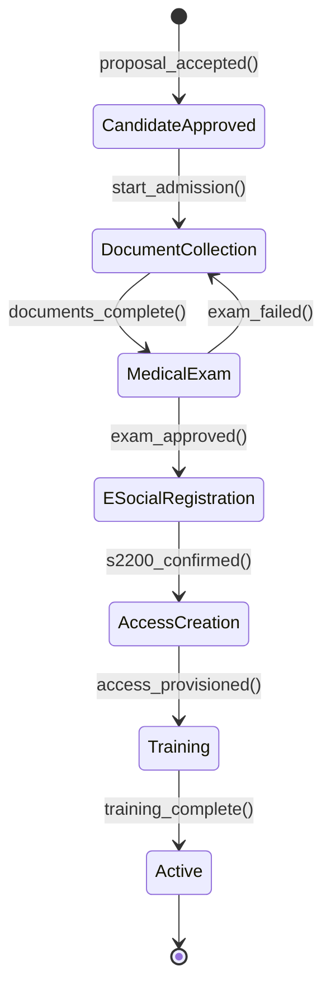

# Fluxo: Admissao de Funcionario

> Ciclo de integracao do novo colaborador: desde o candidato aprovado ate a entrada plena em operacao, com compliance eSocial e criacao de acessos.

---

## 1. Narrativa do Processo

1. **Candidato Aprovado**: Proposta aceita no fluxo de Recrutamento. Inicia processo de admissao.
2. **Coleta de Documentos**: RH solicita documentacao obrigatoria (CPF, RG, CTPS, comprovante de endereco, dados bancarios, foto 3x4).
3. **Exame Admissional**: ASO (Atestado de Saude Ocupacional) agendado e realizado. Aprovacao medica obrigatoria.
4. **Registro eSocial**: Evento S-2200 enviado ao governo. DEVE ser transmitido ate 1 dia util antes do inicio.
5. **Criacao de Acesso**: Usuario criado no sistema com role e permissions conforme cargo. Email corporativo provisionado.
6. **Treinamento Inicial**: Plano de onboarding atribuido com treinamentos obrigatorios (seguranca, sistema, processos).
7. **Ativo**: Colaborador integrado e operacional.

---

## 2. State Machine



---

## 3. Guards de Transicao `[AI_RULE]`

| Transicao | Guard | Motivo |
|-----------|-------|--------|
| `CandidateApproved → DocumentCollection` | `vacancy_id IS NOT NULL AND salary_confirmed = true` | Vaga e salario definidos |
| `DocumentCollection → MedicalExam` | `cpf AND rg AND ctps AND address AND bank_data` todos preenchidos | Documentos minimos obrigatorios |
| `MedicalExam → ESocialRegistration` | `aso_result = 'approved' AND aso_date <= 30_days_ago` | ASO aprovado e recente |
| `MedicalExam → DocumentCollection` | `aso_result = 'failed'` | Retorna para coleta; candidato pode enviar novo exame |
| `ESocialRegistration → AccessCreation` | `esocial_receipt IS NOT NULL AND start_date > NOW()` | S-2200 aceito pelo governo |
| `AccessCreation → Training` | `user_id IS NOT NULL AND email_provisioned = true AND role_assigned = true` | Acesso completo criado |
| `Training → Active` | `mandatory_trainings_completed = true AND training_plan.progress >= 100` | Todos treinamentos obrigatorios concluidos |

> **[AI_RULE_CRITICAL]** O evento eSocial S-2200 DEVE ser enviado ate 1 dia util antes da data de inicio. Se `start_date - NOW() < 1 business_day`, a transicao e BLOQUEADA e alerta critico e gerado.

> **[AI_RULE]** Dados bancarios sao criptografados em repouso (AES-256). Apenas o modulo Finance pode descriptografar para processamento de folha.

---

## 4. Eventos Emitidos

| Evento | Trigger | Payload | Consumidor |
|--------|---------|---------|------------|
| `AdmissionStarted` | `CandidateApproved → DocumentCollection` | `{employee_id, vacancy_id, start_date}` | Email (enviar checklist ao candidato) |
| `DocumentsCollected` | `DocumentCollection → MedicalExam` | `{employee_id, documents_hash}` | Core (log auditoria) |
| `MedicalExamApproved` | `MedicalExam → ESocialRegistration` | `{employee_id, aso_id, exam_date}` | HR (avancar fluxo) |
| `MedicalExamFailed` | `MedicalExam → DocumentCollection` | `{employee_id, reason, can_retry}` | Email (notificar candidato), HR (avaliar) |
| `ESocialS2200Sent` | `ESocialRegistration → AccessCreation` | `{employee_id, receipt_number, protocol}` | ESocial (registro), Core (log) |
| `AccessProvisioned` | `AccessCreation → Training` | `{employee_id, user_id, email, role}` | Core (criar usuario), Email (enviar credenciais) |
| `EmployeeActivated` | `Training → Active` | `{employee_id, department, role, start_date}` | HR (atualizar headcount), Finance (iniciar folha) |

---

## 5. Modulos Envolvidos

| Modulo | Responsabilidade | Link |
|--------|-----------------|------|
| **HR** | Modulo principal. Gerencia admissao, documentos, onboarding | [HR.md](file:///c:/PROJETOS/sistema/docs/modules/HR.md) |
| **ESocial** | Envio e acompanhamento do evento S-2200 | [ESocial.md](file:///c:/PROJETOS/sistema/docs/modules/ESocial.md) |
| **Core** | Criacao de usuario, roles, notifications | [Core.md](file:///c:/PROJETOS/sistema/docs/modules/Core.md) |
| **Email** | Notificacoes ao candidato e RH | [Email.md](file:///c:/PROJETOS/sistema/docs/modules/Email.md) |
| **Finance** | Inclusao na folha de pagamento | [Finance.md](file:///c:/PROJETOS/sistema/docs/modules/Finance.md) |

---

## 6. Cenarios de Excecao

| Cenario | Comportamento |
|---------|--------------|
| Candidato nao envia documentos em 15 dias | Alerta para RH. Apos 30 dias, admissao cancelada automaticamente |
| ASO reprovado | Avaliacao caso a caso. Se cargo permite remanejamento, oferecer alternativa |
| eSocial rejeitado | Corrigir dados e reenviar. Transicao bloqueada ate aceite |
| Candidato desiste antes do inicio | Cancelar admissao. Vaga retorna para `Published` no fluxo de Recrutamento |

---

## 7. Cenários BDD

```gherkin
Funcionalidade: Admissão de Funcionário (Fluxo Transversal)

  Cenário: Pipeline completo de admissão até ativação
    Dado que o candidato "Maria Santos" foi aprovado para a vaga "Técnico de Calibração"
    E que o salário foi definido como R$ 5.000,00
    Quando o RH inicia o processo de admissão
    E Maria envia todos os documentos obrigatórios (CPF, RG, CTPS, endereço, dados bancários)
    E o exame admissional (ASO) retorna resultado "approved"
    E o evento eSocial S-2200 é transmitido e aceito pelo gov.br
    E o sistema cria o usuário com role "tecnico" e provisiona email corporativo
    E Maria conclui todos os treinamentos obrigatórios do onboarding
    Então Maria deve ter status "Active" no módulo HR
    E o evento EmployeeActivated deve ser emitido
    E o Finance deve iniciar a inclusão na folha de pagamento

  Cenário: Admissão bloqueada por prazo eSocial
    Dado que a data de início do colaborador é amanhã
    E que o evento S-2200 ainda não foi enviado
    Quando o sistema tenta avançar para AccessCreation
    Então a transição é BLOQUEADA
    E um alerta crítico é gerado informando "S-2200 deve ser enviado até 1 dia útil antes do início"

  Cenário: Exame admissional reprovado retorna à coleta de documentos
    Dado que o candidato está no estado MedicalExam
    Quando o ASO retorna resultado "failed"
    Então o estado retorna para DocumentCollection
    E o evento MedicalExamFailed é emitido com can_retry=true
    E um email é enviado ao candidato informando a reprovação

  Cenário: Timeout de coleta de documentos cancela admissão
    Dado que o candidato está no estado DocumentCollection há 31 dias
    E nenhum documento foi enviado nos últimos 15 dias
    Quando o job de verificação de prazos executa
    Então a admissão é cancelada automaticamente
    E a vaga retorna para status "Published" no módulo Recruitment
```

---

## 8. Mapeamento Técnico

### Controllers

| Controller | Métodos Relevantes | Arquivo |
|---|---|---|
| `RecruitmentController` | `index`, `show`, `store`, `update`, `destroy`, `storeCandidate`, `updateCandidate`, `destroyCandidate` | `app/Http/Controllers/Api/V1/RecruitmentController.php` |
| `JobPostingController` | `index`, `store`, `show`, `update`, `destroy`, `candidates`, `storeCandidate`, `updateCandidate`, `destroyCandidate` | `app/Http/Controllers/Api/V1/JobPostingController.php` |
| `HRController` | `indexTrainings`, `storeTraining`, `updateTraining`, `showTraining`, `destroyTraining`, `dashboard` | `app/Http/Controllers/Api/V1/HRController.php` |
| `HrPeopleController` | `onboardingTemplates`, `storeOnboardingTemplate`, `startOnboarding`, `trainingCourses`, `storeTrainingCourse`, `enrollUser`, `completeTraining` | `app/Http/Controllers/Api/V1/HrPeopleController.php` |
| `HrAdvancedController` | `storeDocument`, `updateDocument`, `destroyDocument`, `expiringDocuments`, `indexTemplates`, `storeTemplate`, `startOnboarding`, `indexChecklists`, `updateChecklist`, `completeChecklistItem` | `app/Http/Controllers/Api/V1/HrAdvancedController.php` |
| `ESocialController` | `generate`, `sendBatch`, `checkBatch`, `show`, `dashboard` | `app/Http/Controllers/Api/V1/ESocialController.php` |

### Services

| Service | Responsabilidade | Arquivo |
|---|---|---|
| `ESocialService` | Geração e envio de eventos eSocial (S-2200) | `app/Services/ESocialService.php` |
| `PayrollService` | Inclusão do novo colaborador na folha de pagamento | `app/Services/PayrollService.php` |
| [SPEC] `AdmissionService` | Orquestração do fluxo de admissão (state machine, guards, coleta de documentos) | A ser criado |

### AdmissionService (`App\Services\HR\AdmissionService`)
- `create(CreateAdmissionData $dto): Admission`
- `approveDocuments(Admission $admission): void`
- `complete(Admission $admission): Employee`
- `rollback(Admission $admission, string $reason): void`

### Endpoints
| Método | Rota | Controller | Ação |
|--------|------|-----------|------|
| POST | /api/v1/hr/admissions | AdmissionController@store | Iniciar admissão |
| POST | /api/v1/hr/admissions/{id}/approve-documents | AdmissionController@approveDocuments | Aprovar documentos |
| GET | /api/v1/hr/admissions/{id}/checklist | AdmissionController@checklist | Ver checklist |

### Eventos
- `AdmissionInitiated` → HR (criar checklist), Alerts (notificar RH)
- `DocumentsApproved` → ESocial (preparar S-2200)
- `EmployeeAdmitted` → Finance (configurar folha), Core (criar user account)

### Fallback eSocial Offline
- Se transmissão S-2200 falhar: marcar admission como `pending_esocial`
- Job `RetryPendingESocialEvents` roda a cada 30 minutos
- Após 3 falhas: escalar para RH via `ESocialTransmissionFailed` event

### Models Envolvidos

| Model | Tabela | Arquivo |
|---|---|---|
| `User` | `users` | `app/Models/User.php` |
| `Candidate` | `candidates` | `app/Models/Candidate.php` |
| `JobPosting` | `job_postings` | `app/Models/JobPosting.php` |
| `Training` | `trainings` | `app/Models/Training.php` |
| `OnboardingTemplate` | `onboarding_templates` | `app/Models/OnboardingTemplate.php` |
| `OnboardingChecklist` | `onboarding_checklists` | `app/Models/OnboardingChecklist.php` |
| `OnboardingChecklistItem` | `onboarding_checklist_items` | `app/Models/OnboardingChecklistItem.php` |
| `EmployeeDocument` | `employee_documents` | `app/Models/EmployeeDocument.php` |
| `EmployeeBenefit` | `employee_benefits` | `app/Models/EmployeeBenefit.php` |

### Endpoints API

| Método | Endpoint | Descrição |
|---|---|---|
| `GET` | `/api/v1/hr/job-postings` | Listar vagas |
| `POST` | `/api/v1/hr/job-postings` | Criar vaga |
| `GET` | `/api/v1/hr/job-postings/{jobPosting}` | Detalhe da vaga |
| `PUT` | `/api/v1/hr/job-postings/{jobPosting}` | Atualizar vaga |
| `DELETE` | `/api/v1/hr/job-postings/{jobPosting}` | Remover vaga |
| `POST` | `/api/v1/hr/job-postings/{jobPosting}/candidates` | Registrar candidato |
| `PUT` | `/api/v1/hr/job-postings/{jobPosting}/candidates/{candidate}` | Atualizar candidato |
| `DELETE` | `/api/v1/hr/job-postings/{jobPosting}/candidates/{candidate}` | Remover candidato |
| `GET` | `/api/v1/hr/job-postings/{jobPosting}/candidates` | Listar candidatos da vaga |
| `GET` | `/api/v1/hr/trainings` | Listar treinamentos |
| `POST` | `/api/v1/hr/trainings` | Criar treinamento |
| `POST` | `/api/v1/hr/esocial/events/generate` | Gerar evento eSocial (S-2200) |
| `POST` | `/api/v1/hr/esocial/events/send-batch` | Enviar lote eSocial |
| `GET` | `/api/v1/hr/esocial/batches/{batchId}` | Verificar status do lote |
| `POST` | `/api/v1/hr/advanced/onboarding/start` | Iniciar onboarding do colaborador |
| `POST` | `/api/v1/hr/advanced/checklist-items/{itemId}/complete` | Completar item de checklist |
| `POST` | `/api/v1/hr/advanced/documents` | Upload de documento do funcionário |
| `GET` | `/api/v1/hr/advanced/documents/expiring` | Documentos próximos do vencimento |
| [SPEC] `POST` | `/api/v1/hr/admissions` | Iniciar processo de admissão |
| [SPEC] `PUT` | `/api/v1/hr/admissions/{id}/advance` | Avançar etapa da admissão |
| [SPEC] `GET` | `/api/v1/hr/admissions/{id}` | Detalhe do processo de admissão |

### Events/Listeners

| Evento | Arquivo |
|---|---|
| [SPEC] `AdmissionStarted` | A ser criado — `app/Events/AdmissionStarted.php` |
| [SPEC] `MedicalExamApproved` | A ser criado — `app/Events/MedicalExamApproved.php` |
| [SPEC] `EmployeeActivated` | A ser criado — `app/Events/EmployeeActivated.php` |

> **Nota:** O fluxo de admissão utiliza controllers e models existentes de Recruitment, HR e eSocial. A orquestração completa do state machine (AdmissionService) e os eventos específicos do fluxo ainda precisam ser implementados.
