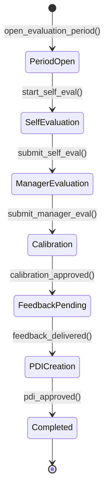

# Fluxo: Avaliacao de Desempenho

> Ciclo de avaliacao: desde a abertura do periodo avaliativo ate o feedback final e criacao do Plano de Desenvolvimento Individual (PDI).

---

## 1. Narrativa do Processo

1. **Abertura do Periodo**: RH configura periodo avaliativo (semestral/anual), criterios e escalas.
2. **Autoavaliacao**: Colaborador preenche sua autoavaliacao com evidencias e notas.
3. **Avaliacao do Gestor**: Gestor avalia o colaborador nos mesmos criterios, com possibilidade de adicionar observacoes.
4. **Calibracao**: Comite de calibracao equaliza avaliacoes entre departamentos para eliminar vieses.
5. **Feedback**: Gestor conduz reuniao de feedback com colaborador. Resultado final comunicado.
6. **PDI**: Plano de Desenvolvimento Individual criado com metas, treinamentos e prazos.

---

## 2. State Machine



---

## 3. Guards de Transicao `[AI_RULE]`

| Transicao | Guard |
|-----------|-------|
| `PeriodOpen → SelfEvaluation` | `evaluation_criteria.count > 0 AND period_end > NOW()` |
| `SelfEvaluation → ManagerEvaluation` | `self_eval.all_criteria_scored = true AND self_eval.comments.length >= 50` |
| `ManagerEvaluation → Calibration` | `manager_eval.all_criteria_scored = true AND manager_eval.submitted_by != employee_id` |
| `Calibration → FeedbackPending` | `calibrated_score IS NOT NULL AND calibration_committee.count >= 3` |
| `FeedbackPending → PDICreation` | `feedback_date IS NOT NULL AND feedback_notes IS NOT NULL` |
| `PDICreation → Completed` | `pdi.goals.count >= 1 AND pdi.deadline IS NOT NULL` |

> **[AI_RULE]** Gestor NAO pode avaliar a si mesmo. `manager_eval.submitted_by` DEVE ser diferente de `employee_id`.

> **[AI_RULE]** Calibracao exige comite com minimo 3 membros de departamentos diferentes para reduzir viés.

> **[AI_RULE]** Score final so e visivel ao colaborador APOS a reuniao de feedback ser registrada.

---

## 4. Eventos Emitidos

| Evento | Trigger | Consumidor |
|--------|---------|------------|
| `EvaluationPeriodOpened` | Periodo aberto | Email (notificar todos colaboradores), Core (agendar deadlines) |
| `SelfEvalSubmitted` | Autoavaliacao submetida | Email (notificar gestor) |
| `ManagerEvalSubmitted` | Avaliacao do gestor submetida | HR (agendar calibracao) |
| `CalibrationCompleted` | Calibracao aprovada | HR (liberar feedback) |
| `FeedbackDelivered` | Feedback registrado | Core (log), HR (liberar score ao colaborador) |
| `PDICreated` | PDI aprovado | HR (agendar acompanhamento), Core (criar tarefas) |

---

## 5. Modulos Envolvidos

| Modulo | Responsabilidade | Link |
|--------|-----------------|------|
| **HR** | Modulo principal. Criterios, periodos, calibracao, PDI | [HR.md](file:///c:/PROJETOS/sistema/docs/modules/HR.md) |
| **Core** | Notifications, agendamento de deadlines | [Core.md](file:///c:/PROJETOS/sistema/docs/modules/Core.md) |
| **Email** | Notificacoes de prazo e convites | [Email.md](file:///c:/PROJETOS/sistema/docs/modules/Email.md) |

---

## 6. Cenarios de Excecao

| Cenario | Comportamento |
|---------|--------------|
| Colaborador nao submete autoavaliacao no prazo | Lembrete automatico 3 dias antes. Apos prazo, gestor avalia sem autoavaliacao |
| Gestor nao avalia no prazo | Escalonamento para diretor. Bloqueio de outros processos de RH |
| Colaborador discorda da avaliacao | Pode registrar contestacao formal. Vai para reavaliacao por comite |
| Novo colaborador (< 3 meses) | Excluido do ciclo avaliativo. Avaliacao de experiencia separada |

---

## 7. Cenários BDD

```gherkin
Funcionalidade: Avaliação de Desempenho (Fluxo Transversal)

  Cenário: Ciclo completo de avaliação até PDI
    Dado que o período avaliativo Q1/2026 foi aberto pelo RH
    E que "João Silva" submeteu autoavaliação com score 8.5 e comentários >= 50 caracteres
    E que a gestora "Ana Costa" submeteu avaliação com score 7.0
    E que o comitê de calibração (3+ membros de departamentos diferentes) calibrou para 7.5
    Quando a gestora registra a reunião de feedback na data de hoje
    E o RH cria o PDI com pelo menos 1 meta e deadline
    Então o ciclo deve ter status "Completed"
    E João deve receber notificação com o score calibrado
    E o evento PDICreated deve ser emitido

  Cenário: Gestor NÃO pode avaliar a si mesmo
    Dado que "Ana" é colaboradora e gestora do departamento
    Quando "Ana" tenta submeter avaliação de gestor para si mesma
    Então o sistema bloqueia com erro "Gestor não pode avaliar a si mesmo"
    E manager_eval.submitted_by deve ser diferente de employee_id

  Cenário: Calibração exige comitê mínimo
    Dado que um ciclo de avaliação está em fase de calibração
    E que apenas 2 avaliadores do mesmo departamento participam
    Quando tentam aprovar a calibração
    Então o sistema bloqueia informando "Mínimo 3 membros de departamentos diferentes"

  Cenário: Colaborador contesta avaliação
    Dado que "Pedro" recebeu score calibrado 5.0 e discorda
    Quando Pedro registra contestação formal com justificativa >= 100 caracteres
    Então a avaliação vai para reavaliação por comitê independente
    E o status muda para "under_review"
    E o evento ContestationRegistered é emitido
```

---

## 8. Mapeamento Técnico

### Controllers

| Controller | Métodos Relevantes | Arquivo |
|---|---|---|
| `PerformanceReviewController` | `indexReviews`, `storeReview`, `showReview`, `updateReview`, `destroyReview`, `indexFeedback`, `storeFeedback` | `app/Http/Controllers/Api/V1/PerformanceReviewController.php` |
| `HrPeopleController` | `performanceReviews`, `storePerformanceReview` | `app/Http/Controllers/Api/V1/HrPeopleController.php` |
| `HRController` | `dashboard`, `analyticsHr` | `app/Http/Controllers/Api/V1/HRController.php` |

### Services

| Service | Responsabilidade | Arquivo |
|---|---|---|
| [SPEC] `PerformanceEvaluationService` | Orquestração do ciclo avaliativo: abertura de período, scoring, calibração, geração de PDI | A ser criado |

### PerformanceEvaluationService (`App\Services\HR\PerformanceEvaluationService`)
- `createCycle(CreateCycleData $dto): EvaluationCycle`
- `openEvaluation(EvaluationCycle $cycle, Employee $employee): Evaluation`
- `submit(Evaluation $eval, array $scores): void`
- `approve(Evaluation $eval, User $manager): void`
- `calibrate(EvaluationCycle $cycle, array $adjustments): void`
- `closeCycle(EvaluationCycle $cycle): void`
- `createPDI(Evaluation $eval, array $developmentItems): PDI`

### PDI Model (Plano de Desenvolvimento Individual)
- **Tabela:** `hr_pdis`
- **Campos:** id, tenant_id, employee_id (FK users), evaluation_id (FK), title, goals (json), actions (json array: [{action, deadline, status, evidence}]), mentor_id nullable (FK users), status (enum: draft, active, completed, cancelled), started_at, target_completion_at, completed_at nullable, timestamps

### Endpoints
| Método | Rota | Controller | Ação |
|--------|------|-----------|------|
| POST | /api/v1/hr/evaluation-cycles | EvaluationCycleController@store | Criar ciclo |
| POST | /api/v1/hr/evaluations | EvaluationController@store | Abrir avaliação |
| POST | /api/v1/hr/evaluations/{id}/submit | EvaluationController@submit | Submeter |
| POST | /api/v1/hr/evaluations/{id}/approve | EvaluationController@approve | Aprovar |
| GET | /api/v1/hr/evaluations/by-employee/{id} | EvaluationController@byEmployee | Por funcionário |
| POST | /api/v1/hr/evaluation-cycles/{id}/calibrate | EvaluationCycleController@calibrate | Calibrar |

### Eventos
- `EvaluationOpened` → Alerts (notificar avaliador e avaliado)
- `EvaluationSubmitted` → Alerts (notificar gestor para aprovação)
- `EvaluationApproved` → HR (atualizar score do funcionário)
- `PDICreated` → Alerts (notificar funcionário e mentor)

### Calibração
- **Método:** Distribuição forçada (opcional, configurável por tenant)
- **Setting:** `hr.evaluation.forced_distribution` (boolean)
- **Curva:** top 20% (exceeds), middle 70% (meets), bottom 10% (below)
- **Interface:** Comitê vê scatter plot dos scores e pode ajustar manualmente
- **Regra:** Ajuste máximo de ±1 ponto (escala 1-5) por avaliação na calibração

### Models Envolvidos

| Model | Tabela | Arquivo |
|---|---|---|
| `PerformanceReview` | `performance_reviews` | `app/Models/PerformanceReview.php` |
| `ContinuousFeedback` | `continuous_feedbacks` | `app/Models/ContinuousFeedback.php` |
| `User` | `users` | `app/Models/User.php` |
| `Training` | `trainings` | `app/Models/Training.php` |

### Endpoints API

| Método | Endpoint | Descrição |
|---|---|---|
| `GET` | `/api/v1/hr/reviews` | Listar avaliações de desempenho |
| `POST` | `/api/v1/hr/reviews` | Criar avaliação |
| `PUT` | `/api/v1/hr/reviews/{review}` | Atualizar avaliação |
| `GET` | `/api/v1/hr/performance-reviews` | Listar reviews (rota alternativa) |
| `GET` | `/api/v1/hr/performance-reviews/{review}` | Detalhe de review |
| `POST` | `/api/v1/hr/performance-reviews` | Criar review |
| `PUT` | `/api/v1/hr/performance-reviews/{review}` | Atualizar review |
| `DELETE` | `/api/v1/hr/performance-reviews/{review}` | Remover review |
| `GET` | `/api/v1/hr/continuous-feedback` | Listar feedbacks contínuos |
| `POST` | `/api/v1/hr/continuous-feedback` | Registrar feedback |
| `GET` | `/api/v1/hr/dashboard` | Dashboard RH com métricas |
| [SPEC] `POST` | `/api/v1/hr/evaluation-periods` | Abrir período avaliativo |
| [SPEC] `POST` | `/api/v1/hr/evaluations/{id}/self-eval` | Submeter autoavaliação |
| [SPEC] `POST` | `/api/v1/hr/evaluations/{id}/manager-eval` | Submeter avaliação do gestor |
| [SPEC] `POST` | `/api/v1/hr/evaluations/{id}/calibrate` | Calibrar avaliação |
| [SPEC] `POST` | `/api/v1/hr/evaluations/{id}/feedback` | Registrar feedback entregue |
| [SPEC] `POST` | `/api/v1/hr/evaluations/{id}/pdi` | Criar PDI |

### Events/Listeners

| Evento | Arquivo |
|---|---|
| [SPEC] `EvaluationPeriodOpened` | A ser criado — `app/Events/EvaluationPeriodOpened.php` |
| [SPEC] `SelfEvalSubmitted` | A ser criado — `app/Events/SelfEvalSubmitted.php` |
| [SPEC] `CalibrationCompleted` | A ser criado — `app/Events/CalibrationCompleted.php` |
| [SPEC] `PDICreated` | A ser criado — `app/Events/PDICreated.php` |

> **Nota:** O CRUD básico de PerformanceReview e ContinuousFeedback já existe. O ciclo completo com state machine (abertura de período, autoavaliação, calibração, PDI) ainda precisa de orquestração via service dedicado.
