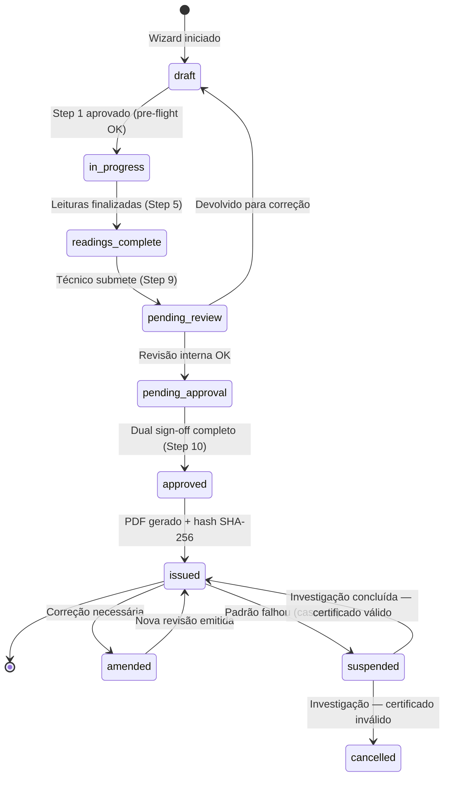

# Fluxo Completo — Certificado de Calibração

> **Princípio:** O sistema INDUZ o técnico a fazer correto. Cada step valida pré-requisitos, exibe orientações contextuais e BLOQUEIA avanço se algo estiver errado. Mesmo alguém que nunca emitiu um certificado consegue fazê-lo corretamente seguindo o wizard.

---

## 1. Visão Geral do Fluxo

```
┌─────────────────────────────────────────────────────────────────────┐
│                    CICLO DE VIDA DO CERTIFICADO                     │
│                                                                     │
│  Cliente         Ordem de        Calibração      Certificado        │
│  solicita   ──→  Serviço    ──→  (Wizard     ──→ (PDF ISO     ──→  │
│  calibração      criada          10 steps)        17025)            │
│                                                                     │
│  Aprovação       Portal do       Faturamento                       │
│  dual       ──→  Cliente    ──→  automático                        │
│  sign-off        (download)                                         │
└─────────────────────────────────────────────────────────────────────┘
```

### Máquina de Estados



---

## 2. Integração com Ordem de Serviço (OS)

### 2.1 Criação da OS de Calibração

| Campo da OS | Origem | Obrigatório |
|-------------|--------|-------------|
| `type` | `calibration` (enum) | Sim |
| `customer_id` | Cadastro do cliente | Sim |
| `equipment_id` | Equipamento do cliente | Sim |
| `priority` | SLA do contrato ou manual | Sim |
| `assigned_technician_id` | Agenda/Dispatch | Sim |
| `checklist_id` | Template "Recebimento de Calibração" | Sim |
| `estimated_completion` | Baseado no tipo + SLA | Sim |
| `work_order_number` | Auto-gerado | Sim |

### 2.2 Checklist de Recebimento (ISO 17025 §7.4)

> **Obrigatório antes de iniciar calibração.** Técnico preenche no recebimento do equipamento.

| Item | Tipo | Obrigatório |
|------|------|-------------|
| Equipamento identificado? (serial, tag) | Sim/Não | Sim |
| Condição visual do equipamento | Texto + Foto | Sim |
| Acessórios recebidos? (quais) | Checklist | Sim |
| Danos visíveis? | Sim/Não + Foto | Sim |
| Equipamento liga/funciona? | Sim/Não | Sim |
| Cliente informou restrições? | Texto | Não |
| Prazo acordado com cliente | Data | Sim |

### 2.3 Fluxo OS → Certificado → Faturamento

```
OS criada (status: open)
    ↓
Técnico recebe OS (status: assigned)
    ↓
Técnico preenche checklist de recebimento (status: in_progress)
    ↓
Técnico abre Wizard de Calibração vinculado à OS
    ↓ (auto-preenche cliente, equipamento, SLA da OS)
Calibração executada via Wizard (10 steps)
    ↓
Certificado gerado em draft (status OS: calibration_complete)
    ↓
Revisor aprova certificado (dual sign-off)
    ↓
PDF emitido com hash SHA-256 (status OS: certificate_issued)
    ↓
Cliente notificado (email + portal)
    ↓
OS finalizada (status: completed)
    ↓
Faturamento disparado automaticamente (AccountReceivable criado)
    ↓
Pesquisa de satisfação enviada 24h depois
```

### 2.4 Eventos e Listeners

| Evento | Listener | Ação |
|--------|----------|------|
| `CalibrationWizardStarted` | `LinkCalibrationToWorkOrder` | Vincula `work_order_id` ao `EquipmentCalibration` |
| `CalibrationReadingsCompleted` | `UpdateWorkOrderStatus` | OS → `calibration_complete` |
| `CertificateApproved` | `IssueCertificatePdf` | Gera PDF, calcula hash SHA-256, armazena |
| `CertificateIssued` | `CompleteWorkOrder` | OS → `certificate_issued` → `completed` |
| `CertificateIssued` | `NotifyCustomer` | Email + push + disponibiliza no portal |
| `CertificateIssued` | `CreateAccountReceivable` | Gera fatura/AR se configurado |
| `WorkOrderCompleted` | `SendSatisfactionSurvey` | Pesquisa NPS/CSAT 24h depois |

---

## 3. Wizard de Calibração — 10 Steps Guiados

> **Filosofia:** Cada step é um portão. O técnico SÓ avança quando o step atual está 100% correto. Indicadores visuais (verde/amarelo/vermelho) mostram o status em tempo real.

### Step 1: PRE-FLIGHT CHECK (Verificação Prévia)

**Objetivo:** Garantir que TODOS os pré-requisitos estão atendidos antes de começar.

| Verificação | Service | Resultado | Ação se Falhar |
|-------------|---------|-----------|----------------|
| Equipamento do cliente identificado | `Equipment::find()` | ✅/❌ | Cadastrar equipamento primeiro |
| Equipamento não está em quarentena | `Equipment.status != quarantine` | ✅/❌ | Resolver status do equipamento |
| Padrões de referência válidos | `StandardWeightLifecycleService::checkValidity()` | ✅/❌ | **BLOQUEIO HARD** — recalibrar padrão |
| Técnico com competência vigente | `UserCompetency::hasValid()` | ✅/❌ | **BLOQUEIO HARD** — atribuir técnico qualificado |
| Condições ambientais na faixa | `LabLogbookEntry::validateEnvironmental()` | ✅/⚠️/❌ | ⚠️ = alerta; ❌ = **BLOQUEIO** |
| Método de calibração definido | `CalibrationMethod::active()` | ✅/❌ | Selecionar método compatível |
| OS vinculada e aprovada | `WorkOrder::status = in_progress` | ✅/❌ | Vincular ou criar OS |

**Backend:** `PreFlightCheckService::run(Equipment $equipment, User $technician): PreFlightResult`

```php
// Retorno estruturado
class PreFlightResult {
    public bool $canProceed;           // true se TODOS os checks passaram
    public array $checks;              // [ { name, status: pass|warn|fail, message, action } ]
    public ?string $blockingReason;    // motivo do bloqueio (se houver)
}
```

**Frontend:** Card com lista de verificações, ícones de status, botão "Iniciar Calibração" habilitado APENAS quando `canProceed = true`.

**Ajuda contextual:**
> "Esta verificação garante que tudo está pronto para uma calibração válida segundo a ISO 17025. Padrões vencidos ou técnicos sem competência IMPEDEM o início — isso protege a validade do certificado que será emitido."

---

### Step 2: DADOS DO CLIENTE E EQUIPAMENTO

**Objetivo:** Identificar o cliente e o item a ser calibrado conforme §7.8.2.

| Campo | Origem | Editável | Obrigatório |
|-------|--------|----------|-------------|
| Nome do cliente | OS → Customer | Não | Sim |
| Endereço do cliente | OS → Customer.address | Não | Sim |
| CNPJ/CPF do cliente | OS → Customer.document | Não | Sim |
| Fabricante do equipamento | Equipment.brand | Não | Sim |
| Modelo | Equipment.model | Não | Sim |
| Número de série | Equipment.serial_number | Não | Sim |
| Tag/patrimônio | Equipment.tag | Não | Não |
| Capacidade/faixa | Equipment.capacity | Não | Sim |
| Resolução/divisão | Equipment.resolution | Não | Sim |
| Classe de precisão | Equipment.precision_class | Sim | Condicional |
| Localização da calibração | Manual ou padrão lab | Sim | Sim |
| Data de recebimento | OS.received_date ou manual | Sim | Sim |

**Auto-preenchimento:** ~95% dos campos vêm da OS e do cadastro do equipamento. Técnico confirma e complementa.

**Ajuda contextual:**
> "Estes dados identificam o cliente e o equipamento no certificado. São obrigatórios pela ISO 17025 §7.8.2. Verifique se o número de série confere com o equipamento físico em mãos."

---

### Step 3: SELEÇÃO DE MÉTODO E PADRÕES

**Objetivo:** Definir o procedimento de calibração e os padrões de referência (ISO 17025 §7.2 + §6.5).

| Campo | Lógica | Obrigatório |
|-------|--------|-------------|
| Método de calibração | Sugerido por `Equipment.type` → `CalibrationMethod` compatível | Sim |
| Referência normativa | `CalibrationMethod.code` (ex: "MET-CAL-001 rev.3") | Sim |
| Padrões selecionados | `StandardWeight` compatíveis com faixa, não vencidos | Sim (mín. 1) |
| Justificativa (se método diferente) | Texto livre | Condicional |

**Lógica de seleção de padrões:**
1. Sistema filtra padrões: `status = active`, `certificate_expiry > today`, faixa compatível
2. Ordena por: menor incerteza → melhor classe de precisão
3. Exibe para cada padrão: nome, serial, validade, incerteza, lab calibrador
4. **Padrão vencido = BLOQUEADO** (cinza, não-selecionável, mensagem: "Vencido em DD/MM/YYYY — recalibrar antes de usar")

**Rastreabilidade exibida:**
```
Padrão: Peso 1kg Classe E2 — S/N: PW-001
├── Certificado: CERT-2025-1234 (Lab ABC, Acreditado RBC)
├── Validade: 15/09/2026 (✅ 173 dias restantes)
├── Incerteza: ±0.030 mg (k=2, 95.45%)
└── Rastreável a: INMETRO via RBC nº CRL-0XXX
```

**Ajuda contextual:**
> "O método define COMO a calibração será realizada. Os padrões são as referências metrológicas que garantem a rastreabilidade do resultado. A ISO 17025 §6.5 exige que todos os padrões estejam calibrados por laboratório acreditado e dentro da validade."

---

### Step 4: CONDIÇÕES AMBIENTAIS

**Objetivo:** Registrar as condições do ambiente no momento da calibração (ISO 17025 §6.3).

| Variável | Unidade | Faixa Típica | Fonte | Obrigatório |
|----------|---------|-------------|-------|-------------|
| Temperatura | °C | 20 ± 2 (configurável) | `LabLogbookEntry` ou manual | Sim |
| Umidade relativa | %RH | 45–65 (configurável) | `LabLogbookEntry` ou manual | Sim |
| Pressão atmosférica | hPa | 1013 ± 30 (configurável) | `LabLogbookEntry` ou manual | Sim |

**Validação visual:**
- 🟢 **Verde:** Dentro da faixa ideal
- 🟡 **Amarelo:** Dentro da faixa aceitável mas perto do limite (±10% da tolerância)
- 🔴 **Vermelho:** FORA da faixa → **BLOQUEIO** (não avança)

**Se IoT integrado:** Valores pré-preenchidos automaticamente do sensor mais recente do `LabLogbookEntry`.

**Se manual:** Técnico insere valores lidos nos instrumentos do ambiente.

**Ajuda contextual:**
> "As condições ambientais afetam os resultados da calibração. A ISO 17025 §6.3 exige que sejam registradas e estejam dentro dos limites. Se a temperatura ou umidade estiverem fora da faixa, os resultados podem ser inválidos. O sistema bloqueia automaticamente para proteger a qualidade."

---

### Step 5: LEITURAS E MEDIÇÕES

**Objetivo:** Registrar as medições ponto a ponto com cálculo automático de conformidade.

#### 5.1 Pontos de Medição

| Configuração | Fonte | Editável |
|-------------|-------|----------|
| Pontos sugeridos | `CalibrationMethod.measurement_points` | Sim (pode add/remove) |
| Número de repetições por ponto | `CalibrationMethod.repetitions` (mín. 3) | Não |
| Unidade de medida | `CalibrationMethod.unit` | Não |
| EMA por ponto | `CalibrationMethod.ema_formula` ou tabela | Calculado |

#### 5.2 Entrada de Leituras

Para CADA ponto de medição, o técnico insere N leituras:

| Leitura | Valor indicado | Valor de referência | Erro | EMA | Conforme? |
|---------|---------------|--------------------:|-----:|----:|-----------|
| 1 | (técnico digita) | (do padrão) | (auto) | (auto) | ✅/❌ (auto) |
| 2 | (técnico digita) | (do padrão) | (auto) | (auto) | ✅/❌ (auto) |
| 3 | (técnico digita) | (do padrão) | (auto) | (auto) | ✅/❌ (auto) |
| **Média** | (auto) | (auto) | (auto) | — | — |

**Cálculos em tempo real:**
- `Erro = Valor indicado - Valor de referência`
- `Conforme = |Erro| ≤ EMA`
- Média, desvio padrão, amplitude (Range) calculados automaticamente

#### 5.3 Teste de Excentricidade (se aplicável)

Para balanças e instrumentos de pesagem — OIML R76-1:

```
Posições de carga excêntrica:
    ┌─────────┐
    │ 1     2 │
    │    5    │    5 posições: 4 cantos + centro
    │ 3     4 │    Carga: 1/3 da capacidade máxima (ou conforme norma)
    └─────────┘
```

| Posição | Valor indicado | Referência | Erro | EMA | Conforme |
|---------|---------------|-----------|------|-----|----------|
| Centro (5) | — | — | — | — | — |
| Pos 1 | — | — | — | — | — |
| Pos 2 | — | — | — | — | — |
| Pos 3 | — | — | — | — | — |
| Pos 4 | — | — | — | — | — |

#### 5.4 Teste de Repetibilidade

Mínimo de n medições (conforme método, tipicamente n=10) no MESMO ponto:

| Medição | Valor |
|---------|-------|
| 1 | — |
| 2 | — |
| ... | — |
| 10 | — |
| **Média** | (auto) |
| **Desvio padrão** | (auto) |
| **Incerteza Tipo A** | σ/√n (auto) |

**Ajuda contextual:**
> "Digite o valor EXATAMENTE como aparece no mostrador do equipamento. O sistema calcula automaticamente o erro, a conformidade com o EMA (Erro Máximo Admissível) e a incerteza. Se algum ponto estiver ❌ não-conforme, isso será reportado no certificado."

---

### Step 6: AJUSTE (Se Necessário)

**Objetivo:** Registrar ajustes realizados no equipamento, com dados ANTES e DEPOIS.

> **Este step é OPCIONAL.** Só aparece se o técnico indicar que ajuste foi necessário.

| Campo | Obrigatório (se ajuste) |
|-------|------------------------|
| Ajuste foi necessário? | Sim (toggle) |
| Justificativa do ajuste | Sim |
| Dados ANTES do ajuste | Sim (JSON: leituras pré-ajuste) |
| Dados DEPOIS do ajuste | Sim (JSON: leituras pós-ajuste) |
| Tipo de ajuste realizado | Sim (enum: mechanical, electronic, software, other) |

**Frontend:** Comparativo visual lado a lado (antes × depois) com destaque nas diferenças.

**Ajuda contextual:**
> "Se o equipamento precisou de ajuste, registre os dados ANTES e DEPOIS. Isso é importante porque o certificado pode reportar ambos os resultados. O cliente precisa saber se houve intervenção no instrumento."

---

### Step 7: CÁLCULO DE INCERTEZA (GUM)

**Objetivo:** Apresentar o balanço de incertezas calculado automaticamente conforme o GUM.

> **Todo o cálculo é automático.** O técnico apenas revisa e confirma.

#### 7.1 Budget de Incerteza

| Fonte de Incerteza | Tipo | Distribuição | Valor (u_i) | Coef. Sensibilidade (c_i) | Contribuição (c_i × u_i)² |
|--------------------|------|-------------|-------------|---------------------------|---------------------------|
| Repetibilidade das leituras | A | Normal | σ/√n | 1 | (auto) |
| Resolução do equipamento | B | Retangular | d/(2√3) | 1 | (auto) |
| Incerteza do padrão | B | Normal | U_padrão/k | 1 | (auto) |
| Efeito da temperatura | B | Retangular | (auto) | (auto) | (auto) |
| Efeito do empuxo do ar | B | Retangular | (auto) | (auto) | (auto) |
| **Incerteza combinada (u_c)** | | | **√(Σ contribuições)** | | |
| **Incerteza expandida (U)** | | | **k × u_c** | | |
| **Fator de abrangência (k)** | | | **2** | | |
| **Nível de confiança** | | | **95,45%** | | |

#### 7.2 Explicação em Linguagem Simples

O wizard exibe ao lado de cada componente:

| Componente | Explicação para o técnico |
|-----------|--------------------------|
| Repetibilidade | "Variação entre suas leituras repetidas. Quanto mais estáveis, menor este valor." |
| Resolução | "Menor valor que o equipamento consegue mostrar. Contribui porque não sabemos o valor exato entre dois dígitos." |
| Incerteza do padrão | "Incerteza que veio junto com o certificado do peso padrão que você está usando." |
| Temperatura | "Variação da temperatura do ambiente durante a calibração afeta os resultados." |
| Empuxo do ar | "O ar exerce uma força sobre os objetos (empuxo). Depende da temperatura, pressão e umidade." |

**Backend:** `UncertaintyCalculationService::calculate()` usando exclusivamente `bcmath` (NUNCA float).

**Ajuda contextual:**
> "A incerteza de medição expressa a faixa dentro da qual o valor verdadeiro provavelmente se encontra. É obrigatória no certificado pela ISO 17025 §7.6. O sistema calcula automaticamente — você só precisa revisar se os valores fazem sentido."

---

### Step 8: AVALIAÇÃO DE CONFORMIDADE

**Objetivo:** Aplicar a regra de decisão e declarar conformidade (ISO 17025 §7.8.3).

#### 8.1 Regras de Decisão Disponíveis

| Regra | Descrição | Quando Usar |
|-------|-----------|-------------|
| **Aceitação simples** | Conforme se `|erro| ≤ EMA`, sem considerar incerteza | Quando EMA >> U (incerteza muito menor que tolerância) |
| **Guard band** | Conforme se `|erro| + U ≤ EMA` (desconta incerteza) | Quando se deseja menor risco de aceitação incorreta |
| **Risco compartilhado** | Conforme se `|erro| ≤ EMA`, mesmo que `|erro| + U > EMA` | Quando cliente aceita o risco de estar na zona de incerteza |

#### 8.2 Resultado Automático

```
Para CADA ponto de medição:
├── Erro encontrado: X
├── EMA: Y
├── Incerteza expandida: U
├── Regra aplicada: [guard band]
├── Resultado: ✅ CONFORME / ❌ NÃO CONFORME / ⚠️ INCONCLUSIVO
└── Explicação: "O erro (X) somado à incerteza (U) é menor que o EMA (Y)"
```

**Resultado global:**
- ✅ **APROVADO** — Todos os pontos conformes
- ⚠️ **APROVADO COM RESTRIÇÃO** — Alguns pontos não-conformes mas dentro de faixa reduzida
- ❌ **REPROVADO** — Um ou mais pontos fora da tolerância

**Se REPROVADO:** Sistema obriga registro de ação:
- [ ] Notificar cliente sobre não-conformidade
- [ ] Abrir OS de reparo/manutenção
- [ ] Registrar RNC (Quality)
- [ ] Sugerir descarte/substituição do equipamento

**Ajuda contextual:**
> "A regra de decisão define como a incerteza de medição é considerada ao declarar se o equipamento está conforme. A ISO 17025 §7.8.6.1 exige que a regra utilizada seja informada no certificado. O método 'guard band' é mais conservador (protege o cliente), enquanto 'risco compartilhado' aceita mais risco."

---

### Step 9: REVISÃO FINAL (Checklist)

**Objetivo:** Verificar que TODOS os campos obrigatórios estão preenchidos antes de gerar o certificado.

> **Checklist automático — sistema verifica cada item e reporta.**

| # | Verificação (ISO 17025 §7.8.2) | Status | Campo |
|---|--------------------------------|--------|-------|
| 1 | Título do certificado presente | ✅/❌ | Template |
| 2 | Número de certificado gerado | ✅/❌ | `certificate_number` |
| 3 | Nome e endereço do laboratório | ✅/❌ | `laboratory_address` |
| 4 | Local da calibração identificado | ✅/❌ | `calibration_location` |
| 5 | Nome e endereço do cliente | ✅/❌ | Customer + address |
| 6 | Método identificado | ✅/❌ | `calibration_method_id` |
| 7 | Equipamento descrito (fab/mod/série) | ✅/❌ | Equipment fields |
| 8 | Data de recebimento | ✅/❌ | `received_date` |
| 9 | Data da calibração | ✅/❌ | `calibration_date` |
| 10 | Data de emissão | ✅/❌ | `issued_date` |
| 11 | Resultados com unidades | ✅/❌ | CalibrationReadings |
| 12 | Condições ambientais registradas | ✅/❌ | T/U/P |
| 13 | Incerteza de medição declarada | ✅/❌ | `expanded_uncertainty` |
| 14 | Fator de abrangência k declarado | ✅/❌ | `coverage_factor` |
| 15 | Padrões utilizados identificados | ✅/❌ | StandardWeights linked |
| 16 | Rastreabilidade dos padrões | ✅/❌ | Certificates válidos |
| 17 | Declaração de conformidade (se aplicável) | ✅/❌/➖ | `decision_rule` |
| 18 | Desvios do método (se houver) | ✅/❌/➖ | `method_deviations` |
| 19 | Observações do técnico | ✅/➖ | `technician_notes` |

**🔴 BLOQUEIO:** Certificado NÃO é gerado se qualquer item obrigatório estiver ❌.

**Campo adicional:** "Observações finais do técnico" (texto livre, opcional).

**Ajuda contextual:**
> "Esta é a verificação final antes de gerar o certificado. Todos os campos exigidos pela ISO 17025 §7.8.2 devem estar preenchidos. Se algum item estiver em vermelho, volte ao step correspondente para corrigir. O sistema não permite emitir um certificado incompleto."

---

### Step 10: ASSINATURA E APROVAÇÃO (Dual Sign-Off)

**Objetivo:** Garantir imparcialidade com dupla assinatura conforme ISO 17025 §4.1 e §7.8.

#### 10.1 Primeira Assinatura — Executor (Técnico)

| Campo | Detalhe |
|-------|---------|
| Nome do técnico | Auto-preenchido (`auth()->user()`) |
| Competência válida | Verificada automaticamente |
| Assinatura | Canvas digital ou hash de confirmação |
| Data/hora | Auto-registrada (`now()`) |
| IP | Registrado para auditoria |

#### 10.2 Segunda Assinatura — Aprovador (Supervisor)

> **OBRIGATÓRIO quando `strict_iso_17025` = true.** Aprovador DEVE ser pessoa DIFERENTE do executor.

| Campo | Detalhe |
|-------|---------|
| Nome do aprovador | Selecionado da lista de usuários com permission `lab.certificate.approve` |
| Competência válida | Verificada para o tipo de calibração |
| Assinatura | Canvas digital ou hash de confirmação |
| Data/hora | Auto-registrada |
| **Validação** | `approver_id ≠ performer_id` — **BLOQUEIO HARD** |

#### 10.3 Após Aprovação

1. **PDF gerado** com template `CertificateTemplate` configurado
2. **Hash SHA-256** calculado e armazenado (`pdf_hash`)
3. **Certificado imutável** — status transita para `issued`
4. **Número de certificado** finalizado (sequencial por tenant/ano)
5. **OS atualizada** → `completed`
6. **Cliente notificado** → email + portal
7. **Fatura criada** (se configurado)

**Ajuda contextual:**
> "A dupla assinatura garante que uma pessoa diferente revisa o trabalho do técnico. Isso é exigido pela ISO 17025 §4.1 (imparcialidade). O certificado se torna IMUTÁVEL após a emissão — qualquer correção futura gera uma nova revisão."

---

## 4. Certificado PDF — Layout Obrigatório

### 4.1 Estrutura do Documento

```
┌─────────────────────────────────────────────────────┐
│ LOGO DO LABORATÓRIO              Página 1 de N      │
│                                                     │
│         CERTIFICADO DE CALIBRAÇÃO                   │
│         Nº CERT-2026-XXXX                          │
│                                                     │
├─────────────────────────────────────────────────────┤
│ DADOS DO LABORATÓRIO                                │
│ Nome: [lab_name]                                    │
│ Endereço: [lab_address]                             │
│ Acreditação: [scope_declaration]                    │
├─────────────────────────────────────────────────────┤
│ DADOS DO CLIENTE                                    │
│ Nome: [customer_name]                               │
│ Endereço: [customer_address]                        │
│ CNPJ/CPF: [customer_document]                       │
├─────────────────────────────────────────────────────┤
│ DADOS DO EQUIPAMENTO                                │
│ Descrição: [equipment_description]                  │
│ Fabricante: [brand] | Modelo: [model]               │
│ Nº Série: [serial] | Resolução: [resolution]       │
│ Classe de Precisão: [precision_class]               │
├─────────────────────────────────────────────────────┤
│ INFORMAÇÕES DA CALIBRAÇÃO                           │
│ Método: [method_name] ([method_code])               │
│ Data de recebimento: [received_date]                │
│ Data da calibração: [calibration_date]              │
│ Data de emissão: [issued_date]                      │
│ Local: [calibration_location]                       │
├─────────────────────────────────────────────────────┤
│ CONDIÇÕES AMBIENTAIS                                │
│ Temperatura: [T]°C | Umidade: [U]%RH               │
│ Pressão: [P] hPa                                    │
├─────────────────────────────────────────────────────┤
│ PADRÕES UTILIZADOS                                  │
│ [padrão 1]: Serial, Cert, Lab, Validade, Incerteza │
│ [padrão 2]: ...                                     │
├─────────────────────────────────────────────────────┤
│ RESULTADOS                                          │
│ [tabela de leituras com erro, EMA, conformidade]    │
│                                                     │
│ TESTE DE EXCENTRICIDADE (se aplicável)              │
│ [tabela de posições]                                │
│                                                     │
│ TESTE DE REPETIBILIDADE (se aplicável)              │
│ [tabela de repetições + estatísticas]               │
├─────────────────────────────────────────────────────┤
│ INCERTEZA DE MEDIÇÃO                                │
│ Incerteza expandida: U = [valor] [unidade]          │
│ Fator de abrangência: k = [valor]                   │
│ Nível de confiança: [valor]%                        │
├─────────────────────────────────────────────────────┤
│ DECLARAÇÃO DE CONFORMIDADE (se aplicável)           │
│ Regra de decisão: [decision_rule]                   │
│ Resultado: [APROVADO/REPROVADO]                     │
├─────────────────────────────────────────────────────┤
│ OBSERVAÇÕES                                         │
│ [technician_notes]                                  │
│ [method_deviations]                                 │
├─────────────────────────────────────────────────────┤
│ Este certificado não pode ser reproduzido parcial-  │
│ mente sem autorização prévia do laboratório.        │
│                                                     │
│ Executor: _____________ Aprovador: _____________    │
│ Nome: [performer]       Nome: [approver]            │
│ Data: [date]            Data: [date]                │
│                                                     │
│ Hash de integridade: [SHA-256]                      │
└─────────────────────────────────────────────────────┘
```

---

## 5. Pós-Emissão

### 5.1 Imutabilidade

- Certificado com status `issued` **NÃO pode ser editado ou deletado**
- Qualquer correção gera nova **revisão** (`CalibrationCertificateRevision`)
- Revisão contém: `revision_number`, `reason`, `changed_by`, `changed_at`, `previous_status`
- PDF da revisão anterior é mantido no storage (nunca sobrescrito)

### 5.2 Suspensão por Falha de Padrão

Se um padrão usado neste certificado FALHA após a emissão:

1. **Identificação automática:** `StandardWeightLifecycleService::getCertificatesAffected(standardWeight, riskPeriod)`
2. **Suspensão:** Certificado → status `suspended`
3. **Notificação ao cliente:** "Certificado CERT-XXXX suspenso para investigação"
4. **Investigação:** CAPA aberto automaticamente
5. **Resolução:**
   - Se certificado válido → retorna para `issued`
   - Se certificado inválido → `cancelled` + recalibração gratuita

### 5.3 Portal do Cliente

- Cliente acessa `PortalCertificatesPage.tsx`
- Visualiza todos os certificados do seus equipamentos
- Download do PDF com verificação de hash
- Histórico de calibrações por equipamento
- Status em tempo real (emitido/suspenso/cancelado)

---

## 6. Models e Relationships

```
WorkOrder (OS)
    ├── hasMany → EquipmentCalibration (via work_order_id)
    ├── belongsTo → Customer
    └── hasMany → WorkOrderChecklistResponse

EquipmentCalibration (Calibração)
    ├── belongsTo → Equipment
    ├── belongsTo → WorkOrder (via work_order_id)
    ├── belongsTo → CalibrationMethod (via calibration_method_id) [NOVO]
    ├── belongsTo → User (performer)
    ├── belongsTo → User (approver)
    ├── belongsToMany → StandardWeight (pivot: calibration_standard_weight)
    ├── hasMany → CalibrationReading
    ├── hasMany → RepeatabilityTest
    ├── hasMany → CalibrationCertificateRevision
    └── belongsTo → CertificateTemplate

Equipment (Equipamento do cliente)
    ├── belongsTo → Customer
    ├── hasMany → EquipmentCalibration
    └── hasMany → EquipmentMaintenance

StandardWeight (Padrão de referência)
    ├── belongsToMany → EquipmentCalibration
    ├── hasMany → StandardWeightUsageLog [NOVO]
    └── belongsTo → User (custodian)

CalibrationMethod [NOVO]
    ├── belongsTo → EquipmentType
    └── hasMany → EquipmentCalibration

UserCompetency [NOVO]
    ├── belongsTo → User
    └── belongsTo → CalibrationType
```

---

## 7. Endpoints da API

| Método | Rota | Descrição |
|--------|------|-----------|
| GET | `/api/v1/calibrations/preflight/{equipment}` | Pre-flight check |
| POST | `/api/v1/calibrations/wizard/start` | Iniciar wizard (cria draft) |
| PUT | `/api/v1/calibrations/wizard/{id}/step/{n}` | Atualizar step N |
| GET | `/api/v1/calibrations/wizard/{id}/step/{n}/validate` | Validar step N |
| POST | `/api/v1/calibrations/{id}/readings` | Salvar leituras |
| GET | `/api/v1/calibrations/{id}/uncertainty` | Calcular incerteza |
| GET | `/api/v1/calibrations/{id}/conformity` | Avaliar conformidade |
| POST | `/api/v1/calibrations/{id}/sign` | Primeira assinatura |
| POST | `/api/v1/calibrations/{id}/approve` | Segunda assinatura (dual) |
| GET | `/api/v1/calibrations/{id}/certificate/pdf` | Download PDF |
| POST | `/api/v1/calibrations/{id}/certificate/send` | Enviar por email |
| GET | `/api/v1/calibrations/{id}/certificate/verify` | Verificar hash |
| GET | `/api/v1/portal/certificates` | Portal do cliente |

---

> **Este fluxo garante conformidade total com ISO 17025:2017 §7.8 e ISO 9001:2015 §8.5. O técnico é guiado passo a passo, com bloqueios automáticos que impedem emissão de certificados inválidos.**
