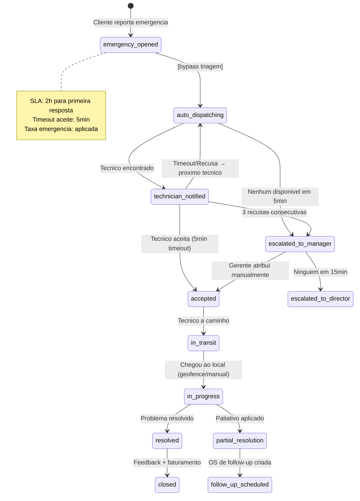
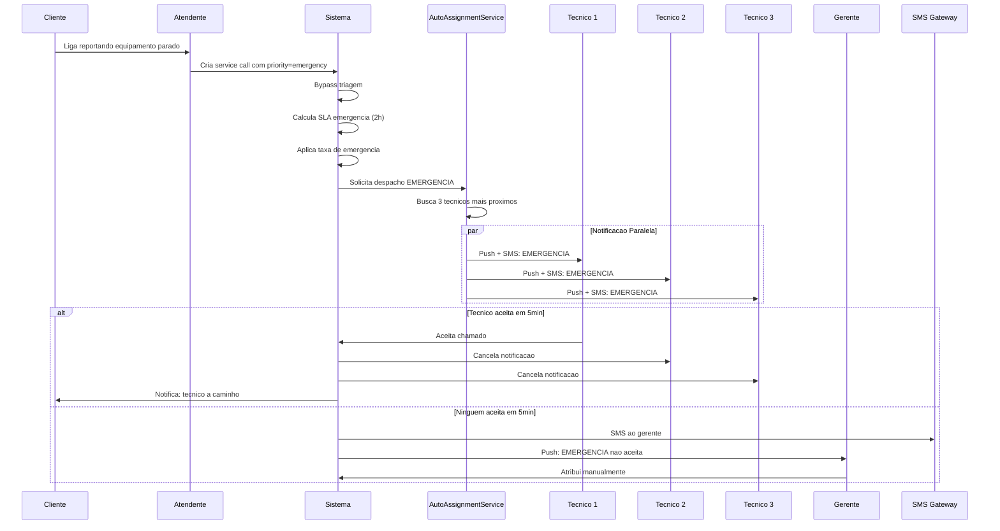

# Fluxo: Chamado de Emergencia

> **Modulo**: Service-Calls + Operational + SLA
> **Prioridade**: P1 — Impacta SLA critico e receita
> **[AI_RULE]** Documento prescritivo. Serve como contrato para implementacao.

## 1. Visao Geral

Quando um cliente liga com urgencia maxima (equipamento parado, producao afetada), o sistema oferece um fluxo diferenciado que:

1. Bypassa a triagem normal
2. Aplica SLA de emergencia (2h vs 24h padrao)
3. Reduz timeout de aceitacao (5min vs 30min)
4. Escala automaticamente se ninguem aceitar
5. Aplica taxa de emergencia

**Atores**: Cliente, Atendente, Coordenador, Tecnico, Gerente (escalonamento)

---

## 2. Maquina de Estados do Chamado de Emergencia



### 2.1 Diferencas vs Chamado Normal

| Aspecto | Normal | Emergencia |
|---------|--------|-----------|
| Triagem | Obrigatoria | Bypass automatico |
| SLA primeira resposta | 24h (low) / 8h (medium) | **2h** |
| Timeout de aceitacao | 30min | **5min** |
| Escalonamento | Apos SLA estourar | **Apos 5min sem aceite** |
| Canal de escalonamento | Email | **SMS + Push + Email** |
| Taxa | Normal | **Taxa de emergencia** |
| Prioridade na fila | Por ordem | **Topo da fila** |
| Re-tentativas | 1 tecnico por vez | **Paralelo: 3 tecnicos** |

---

## 3. Pipeline de Emergencia



---

## 4. Modelo de Dados

### 4.1 ServiceCall — Campos de Emergencia

| Campo | Tipo | Descricao |
|-------|------|-----------|
| `priority` | enum | Adicionar valor `emergency` (existente: `low`, `medium`, `high`, `critical`) |
| `is_emergency` | boolean | Flag rapida para queries |
| `emergency_reason` | text nullable | Motivo da emergencia (equipamento parado, producao afetada) |
| `emergency_fee_amount` | decimal(10,2) nullable | Valor da taxa de emergencia |
| `emergency_fee_applied` | boolean default false | Se a taxa foi aplicada |
| `escalation_level` | tinyint default 0 | 0=normal, 1=gerente, 2=diretor |
| `escalated_at` | datetime nullable | Quando foi escalonado |
| `acceptance_deadline` | datetime nullable | Deadline para aceite (created_at + 5min) |

### 4.2 EmergencyEscalation

| Campo | Tipo | Descricao |
|-------|------|-----------|
| `id` | bigint unsigned | PK |
| `tenant_id` | bigint unsigned | FK → tenants |
| `service_call_id` | bigint unsigned | FK → service_calls |
| `level` | tinyint | 1=gerente, 2=diretor, 3=CEO |
| `escalated_to` | bigint unsigned | FK → users |
| `escalated_at` | datetime | — |
| `response` | enum nullable | `accepted`, `delegated`, `no_response` |
| `responded_at` | datetime nullable | — |
| `notes` | text nullable | — |

### 4.3 EmergencyFeeConfig (Configuracao por Tenant)

| Campo | Tipo | Descricao |
|-------|------|-----------|
| `id` | bigint unsigned | PK |
| `tenant_id` | bigint unsigned | FK → tenants |
| `fee_type` | enum | `fixed`, `percentage`, `multiplier` |
| `fee_value` | decimal(10,2) | Valor ou percentual |
| `applies_after_hours` | boolean | Se aplica fora do horario comercial |
| `applies_weekends` | boolean | Se aplica em fins de semana |
| `applies_holidays` | boolean | Se aplica em feriados |
| `sla_hours` | integer default 2 | SLA em horas para emergencia |
| `acceptance_timeout_minutes` | integer default 5 | Timeout de aceitacao |
| `max_parallel_notifications` | integer default 3 | Quantos tecnicos notificar em paralelo |

---

## 5. Regras de Negocio

### 5.1 Classificacao de Emergencia

[AI_RULE_CRITICAL] Nem todo chamado "urgente" e emergencia. Criterios:

1. **Equipamento parado** com impacto em producao → EMERGENCIA
2. **Risco de seguranca** (vazamento, exposicao) → EMERGENCIA
3. **Prazo legal/regulatorio** iminente (< 24h) → EMERGENCIA
4. **Cliente VIP** com SLA premium → Pode tratar como emergencia
5. **Simples urgencia** do cliente → `priority=critical`, NAO emergencia

### 5.2 Despacho Paralelo

[AI_RULE] Diferente do despacho normal (sequencial), emergencia notifica N tecnicos simultaneamente:

- Primeiro a aceitar fica com o chamado
- Demais recebem cancelamento automatico
- Se ninguem aceitar em `acceptance_timeout_minutes`: escalonar

### 5.3 Taxa de Emergencia

| Tipo | Exemplo | Calculo |
|------|---------|---------|
| Fixa | R$ 150,00 | Adicionado ao total da OS |
| Percentual | 50% | Sobre o valor base da OS |
| Multiplicador | 1.5x | Valor da OS × multiplicador |

[AI_RULE] A taxa de emergencia DEVE:

- Ser informada ao cliente ANTES da aceitacao (transparencia)
- Constar na fatura com descricao separada
- Ser configuravel por tenant
- Poder ser isenta por gerente (com motivo registrado)

### 5.4 Escalonamento SMS

| Tempo sem aceite | Acao |
|-----------------|------|
| 5 min | SMS ao gerente da regiao |
| 15 min | SMS ao diretor de operacoes |
| 30 min | SMS ao CEO + email emergencia |
| 60 min | Alerta geral para todos os tecnicos |

---

## 6. Cenarios BDD

### Cenario 1: Emergencia com aceite rapido

```gherkin
Dado que o cliente "Industria ABC" liga com equipamento parado
  E existem 3 tecnicos na regiao
  E a taxa de emergencia do tenant e R$ 150.00 (fixa)
Quando o atendente cria service call com priority "emergency"
Entao o sistema bypassa triagem
  E notifica 3 tecnicos simultaneamente via push + SMS
  E define SLA de 2 horas
  E registra taxa de emergencia R$ 150.00
Quando o tecnico "Carlos" aceita em 2 minutos
Entao os outros 2 tecnicos recebem cancelamento
  E o cliente recebe "Tecnico Carlos a caminho — ETA 30min"
```

### Cenario 2: Ninguem aceita em 5 minutos

```gherkin
Dado que uma emergencia foi criada
  E 3 tecnicos foram notificados
  E nenhum aceitou em 5 minutos
Entao o gerente recebe SMS "EMERGENCIA: Chamado #123 sem tecnico"
  E o chamado e marcado como escalation_level = 1
Quando o gerente recebe o SMS
  E atribui manualmente o tecnico "Maria"
Entao Maria recebe push notification EMERGENCIA
  E o SLA continua contando (nao reinicia)
```

### Cenario 3: Resolucao parcial com follow-up

```gherkin
Dado que o tecnico chegou ao local da emergencia
  E aplicou solucao paliativa (equipamento funcionando parcialmente)
Quando o tecnico encerra com status "partial_resolution"
Entao o sistema cria OS de follow-up automaticamente
  E a OS original recebe status "resolved" (paliativo)
  E a OS de follow-up herda o contexto (fotos, notas, pecas)
  E o cliente e notificado sobre a visita de follow-up
```

### Cenario 4: Emergencia fora do horario comercial

```gherkin
Dado que sao 22h de sabado
  E o cliente liga reportando emergencia
  E o tenant tem taxa de emergencia "multiplier 2x" para fora do horario
Quando o atendente cria service call emergency
Entao o sistema aplica multiplicador 2x sobre o valor da OS
  E busca tecnicos de plantao (agenda de sobreaviso)
  E o SLA e calculado a partir do horario real (nao do proximo dia util)
```

### Cenario 5: Taxa de emergencia isenta por gerente

```gherkin
Dado que o cliente "Hospital XYZ" tem contrato premium
  E abriu chamado de emergencia
Quando o gerente decide isentar a taxa de emergencia
  E registra motivo "Cliente premium — contrato cobre emergencias"
Entao a taxa e zerada na OS
  E o motivo da isencao fica registrado no audit log
```

---

## 7. Integracao com Modulos Existentes

| Modulo | Integracao |
|--------|-----------|
| **ServiceCall** | Novo valor `emergency` no enum `priority` |
| **AutoAssignmentService** | Modo paralelo para emergencias (N tecnicos simultaneos) |
| **SLA/Escalonamento** | SLA diferenciado + escalonamento acelerado |
| **SMS Gateway** | Notificacao SMS para escalonamento |
| **ClientNotificationService** | Atualizacoes em tempo real para o cliente |
| **Finance** | Taxa de emergencia como item separado na fatura |
| **WorkOrder** | Criacao de OS de follow-up em resolucao parcial |
| **BusinessHour** | Verificacao se e fora do horario para taxa diferenciada |

---

## 8. API Endpoints

| Metodo | Rota | Descricao | Form Request |
|--------|------|-----------|--------------|
| POST | `/api/service-calls/emergency` | Criar chamado de emergencia | `CreateEmergencyCallRequest` |
| POST | `/api/service-calls/{id}/escalate` | Escalonar manualmente | `EscalateServiceCallRequest` |
| POST | `/api/service-calls/{id}/exempt-fee` | Isentar taxa de emergencia | `ExemptEmergencyFeeRequest` |
| GET | `/api/service-calls/emergencies/active` | Listar emergencias ativas | — |
| GET | `/api/emergency-config` | Config de emergencia do tenant | — |
| PUT | `/api/emergency-config` | Atualizar config | `UpdateEmergencyConfigRequest` |

---

## 8.1 Integração com EscalationService e WhatsApp

### EscalationService Integration
- **Service:** `App\Services\SLA\EscalationService`
- **Método chamado no breach:** `escalate(WorkOrder $wo, SlaPolicy $policy, string $breachType): void`
- **Ações do escalate():**
  1. Registrar breach em `sla_breaches` table
  2. Notificar chain: technician → coordinator → manager → director (progressivo)
  3. Se emergência: pular direto para coordinator + manager simultâneo

### WhatsApp para Emergência (Futuro)
- **Status:** Depende de INTEGRACOES-EXTERNAS WhatsApp API [SPEC]
- **Fallback atual:** SMS via provider configurado OU email com flag `[URGENTE]`
- **Nota:** Até WhatsApp estar implementado, usar `NotificationService::sendUrgent()` que tenta SMS → Email

---

## 9. Gaps e Melhorias Futuras

| # | Item | Status |
|---|------|--------|
| 1 | Integracao com central telefonica (auto-criar chamado) | Especificado abaixo (9.1) |
| 2 | Mapa em tempo real com tecnicos e emergencias | Especificado abaixo (9.2) |
| 3 | Escala de sobreaviso/plantao para emergencias noturnas | Especificado abaixo (9.3) |
| 4 | SLA diferenciado por tipo de equipamento | Especificado abaixo (9.4) |
| 5 | Historico de emergencias para analise de recorrencia | Especificado abaixo (9.5) |

### 9.1 Integracao com Central Telefonica (Auto-Criar Chamado)

**Webhook de Entrada**

| Item | Detalhe |
|------|---------|
| Rota | `POST /api/v1/phone/incoming` |
| Auth | API Key via header `X-Phone-Api-Key` (validada contra `TenantSetting::get('phone_api_key')`) |
| Middleware | `throttle:60,1` (max 60 chamadas/minuto) |
| FormRequest | `PhoneIncomingCallRequest` |

**Payload do Webhook (enviado pela central telefonica)**

```json
{
  "call_id": "PBX-20260325-001",
  "caller_number": "+5511999998888",
  "caller_name": "Industria ABC",
  "called_number": "+551130001000",
  "queue": "emergencia",
  "started_at": "2026-03-25T14:30:00-03:00",
  "ivr_selection": "1",
  "recording_url": "https://pbx.example.com/recordings/PBX-20260325-001.mp3",
  "metadata": {
    "wait_time_seconds": 12,
    "agent_extension": "2001"
  }
}
```

**Logica de Auto-Criacao (`PhoneCallIncomingListener`)**

1. Busca `Customer` por `phone` ou `phone2` matching `caller_number` (normalizado E.164)
2. Se `queue == 'emergencia'` OU `ivr_selection == '1'` (opcao emergencia na URA):
   - Cria `ServiceCall` com `priority = 'emergency'`, `is_emergency = true`, `source = 'phone'`
   - Vincula `recording_url` no campo `emergency_reason` como evidencia
3. Se cliente nao encontrado: cria `ServiceCall` com `customer_id = null`, `status = 'pending_identification'`
4. Emite evento `PhoneEmergencyReceived` para acionar `AutoAssignmentService` em modo paralelo
5. Retorna HTTP 200 com `{ "service_call_id": 123, "status": "created" }`

**Centrais Suportadas**

| Central | Protocolo | Adaptador |
|---------|-----------|-----------|
| Asterisk/FreePBX | Webhook HTTP | `AsteriskPhoneAdapter` |
| 3CX | REST API + Webhook | `ThreeCXPhoneAdapter` |
| Twilio | TwiML + Status Callback | `TwilioPhoneAdapter` |

**Interface (`PhoneProviderContract`)**

```php
interface PhoneProviderContract
{
    public function parseIncomingPayload(Request $request): PhoneCallDTO;
    public function validateSignature(Request $request): bool;
    public function getRecordingUrl(string $callId): ?string;
}
```

### 9.2 Mapa em Tempo Real com Tecnicos e Emergencias

**Endpoint REST**

| Item | Detalhe |
|------|---------|
| Rota | `GET /api/v1/technicians/live-map` |
| Permissao | `operational.live_map.view` |
| Cache | 10 segundos (Redis) |
| FormRequest | — (query params: `?region_id=&emergency_only=true`) |

**Response JSON**

```json
{
  "technicians": [
    {
      "id": 45,
      "name": "Carlos Silva",
      "status": "available",
      "latitude": -23.5505,
      "longitude": -46.6333,
      "last_location_at": "2026-03-25T14:30:00Z",
      "current_work_order_id": null,
      "skills": ["calibracao", "manutencao_preventiva"],
      "vehicle": "Van #05 - ABC-1234"
    }
  ],
  "emergencies": [
    {
      "service_call_id": 123,
      "customer_name": "Industria ABC",
      "latitude": -23.5610,
      "longitude": -46.6520,
      "priority": "emergency",
      "status": "auto_dispatching",
      "created_at": "2026-03-25T14:25:00Z",
      "sla_remaining_minutes": 95,
      "assigned_technicians": [45, 67, 89]
    }
  ],
  "updated_at": "2026-03-25T14:30:10Z"
}
```

**WebSocket (Broadcasting)**

| Item | Detalhe |
|------|---------|
| Canal | `private-tenant.{tenant_id}.live-map` |
| Evento | `TechnicianLocationUpdated` |
| Frequencia | A cada 30 segundos (batch de posicoes) |
| Auth | Laravel Echo com Sanctum token |

**Payload WebSocket**

```json
{
  "event": "TechnicianLocationUpdated",
  "data": {
    "technician_id": 45,
    "latitude": -23.5507,
    "longitude": -46.6335,
    "speed_kmh": 42,
    "heading": 180,
    "timestamp": "2026-03-25T14:30:30Z",
    "battery_level": 78
  }
}
```

**Frontend Hook**

```typescript
// hooks/useLiveMap.ts
interface TechnicianPosition {
  id: number;
  name: string;
  status: 'available' | 'on_field' | 'in_transit' | 'unavailable';
  latitude: number;
  longitude: number;
  lastLocationAt: string;
  currentWorkOrderId: number | null;
  skills: string[];
}

interface EmergencyMarker {
  serviceCallId: number;
  customerName: string;
  latitude: number;
  longitude: number;
  slaRemainingMinutes: number;
  assignedTechnicians: number[];
}

function useLiveMap(options?: { emergencyOnly?: boolean; regionId?: number }): {
  technicians: TechnicianPosition[];
  emergencies: EmergencyMarker[];
  isConnected: boolean;
  error: Error | null;
};
```

### 9.3 Escala de Sobreaviso/Plantao para Emergencias Noturnas

**Model: `OnCallSchedule`**

| Campo | Tipo | Descricao |
|-------|------|-----------|
| `id` | bigint unsigned | PK |
| `tenant_id` | bigint unsigned | FK → tenants |
| `user_id` | bigint unsigned | FK → users (tecnico de plantao) |
| `region_id` | bigint unsigned nullable | FK → crm_territories |
| `start_datetime` | datetime | Inicio do plantao |
| `end_datetime` | datetime | Fim do plantao |
| `is_primary` | boolean default true | Plantonista principal (vs backup) |
| `backup_user_id` | bigint unsigned nullable | FK → users (backup) |
| `status` | enum | `scheduled`, `active`, `completed`, `cancelled` |
| `notes` | text nullable | Observacoes |
| `created_by` | bigint unsigned | FK → users |

**CRUD Endpoints**

| Metodo | Rota | Descricao | FormRequest |
|--------|------|-----------|-------------|
| GET | `/api/v1/on-call-schedules` | Listar escalas (filtros: week, region) | — |
| POST | `/api/v1/on-call-schedules` | Criar escala de plantao | `CreateOnCallScheduleRequest` |
| PUT | `/api/v1/on-call-schedules/{id}` | Atualizar escala | `UpdateOnCallScheduleRequest` |
| DELETE | `/api/v1/on-call-schedules/{id}` | Cancelar escala | — |
| GET | `/api/v1/on-call-schedules/current` | Plantonista atual por regiao | — |
| POST | `/api/v1/on-call-schedules/generate-weekly` | Gerar escala semanal automatica | `GenerateWeeklyScheduleRequest` |

**Logica de Auto-Selecao em Emergencia Noturna**

```php
// AutoAssignmentService::resolveEmergencyTechnicians()
// 1. Verifica se horario atual esta fora do comercial (BusinessHour)
// 2. Se fora do horario:
//    a. Busca OnCallSchedule::where('status', 'active')
//       ->where('start_datetime', '<=', now())
//       ->where('end_datetime', '>=', now())
//       ->where('region_id', $serviceCall->region_id)
//       ->orderBy('is_primary', 'desc')
//       ->get();
//    b. Se plantonista principal indisponivel (TechnicianAvailability != available):
//       usa backup_user_id
//    c. Se nenhum plantonista na regiao: busca plantonistas de regioes adjacentes
//    d. Se nenhum plantonista em lugar algum: escalonar imediatamente para gerente
// 3. Se dentro do horario: usa algoritmo padrao de proximidade (3 tecnicos paralelo)
```

**Validacoes do `CreateOnCallScheduleRequest`**

- `user_id` deve ter role `technician` e estar ativo
- `start_datetime` < `end_datetime`
- Nao pode sobrepor outro plantao do mesmo tecnico
- `region_id` obrigatorio se tenant possui regioes configuradas
- Plantao minimo: 4 horas; maximo: 24 horas

### 9.4 SLA Diferenciado por Tipo de Equipamento

**Alteracao na tabela `sla_configs`**

| Campo novo | Tipo | Descricao |
|------------|------|-----------|
| `equipment_category_id` | bigint unsigned nullable | FK → equipment_categories |

**Hierarquia de Lookup (prioridade decrescente)**

```
1. sla_configs WHERE contract_id = X AND priority = Y AND equipment_category_id = Z
   → SLA especifico por contrato + prioridade + tipo de equipamento

2. sla_configs WHERE contract_id = X AND priority = Y AND equipment_category_id IS NULL
   → SLA por contrato + prioridade (sem filtro de equipamento)

3. sla_configs WHERE contract_id IS NULL AND priority = Y AND equipment_category_id = Z
   → SLA padrao do tenant por prioridade + tipo de equipamento

4. sla_configs WHERE contract_id IS NULL AND priority = Y AND equipment_category_id IS NULL
   → SLA padrao do tenant por prioridade (fallback geral)
```

**Implementacao no `SlaEscalationService`**

```php
public function resolveSlaConfig(WorkOrder $wo): ?SlaConfig
{
    $contractId = $wo->contract_id;
    $priority = $wo->priority;
    $categoryId = $wo->equipment?->equipment_category_id;

    return SlaConfig::where('tenant_id', $wo->tenant_id)
        ->orderByRaw('
            CASE
                WHEN contract_id = ? AND equipment_category_id = ? THEN 1
                WHEN contract_id = ? AND equipment_category_id IS NULL THEN 2
                WHEN contract_id IS NULL AND equipment_category_id = ? THEN 3
                WHEN contract_id IS NULL AND equipment_category_id IS NULL THEN 4
                ELSE 5
            END
        ', [$contractId, $categoryId, $contractId, $categoryId])
        ->where('priority', $priority)
        ->where(function ($q) use ($contractId) {
            $q->where('contract_id', $contractId)->orWhereNull('contract_id');
        })
        ->where(function ($q) use ($categoryId) {
            $q->where('equipment_category_id', $categoryId)->orWhereNull('equipment_category_id');
        })
        ->first();
}
```

**Exemplos de SLA por Tipo de Equipamento (Emergencia)**

| Categoria | Resposta | Resolucao | Justificativa |
|-----------|----------|-----------|---------------|
| Balanca industrial | 1h | 4h | Impacta producao diretamente |
| Termopar/sensor | 2h | 8h | Substituicao rapida possivel |
| Equipamento de seguranca | 30min | 2h | Risco a vida/seguranca |
| Instrumento de laboratorio | 2h | 12h | Pode ter substituto temporario |

### 9.5 Historico de Emergencias para Analise de Recorrencia

**Endpoint**

| Item | Detalhe |
|------|---------|
| Rota | `GET /api/v1/analytics/emergency-recurrence` |
| Permissao | `analytics.emergency.view` |
| Cache | 1 hora (Redis, invalidado por novo chamado de emergencia) |

**Query de Agrupamento**

```sql
SELECT
    sc.customer_id,
    c.name AS customer_name,
    sc.equipment_id,
    e.serial_number,
    e.model,
    ec.name AS equipment_category,
    COUNT(*) AS emergency_count,
    MIN(sc.created_at) AS first_emergency,
    MAX(sc.created_at) AS last_emergency,
    AVG(TIMESTAMPDIFF(MINUTE, sc.created_at, sc.resolved_at)) AS avg_resolution_minutes,
    GROUP_CONCAT(DISTINCT sc.emergency_reason SEPARATOR ' | ') AS reasons
FROM service_calls sc
JOIN customers c ON c.id = sc.customer_id
LEFT JOIN equipments e ON e.id = sc.equipment_id
LEFT JOIN equipment_categories ec ON ec.id = e.equipment_category_id
WHERE sc.is_emergency = true
  AND sc.tenant_id = :tenantId
  AND sc.created_at >= DATE_SUB(NOW(), INTERVAL 6 MONTH)
GROUP BY sc.customer_id, sc.equipment_id
HAVING COUNT(*) >= 3
ORDER BY emergency_count DESC
```

**Threshold de Recorrencia**: >= 3 emergencias no mesmo equipamento/cliente em 6 meses.

**Response JSON**

```json
{
  "recurrent_emergencies": [
    {
      "customer_id": 42,
      "customer_name": "Industria ABC",
      "equipment_id": 105,
      "serial_number": "BAL-2024-001",
      "model": "Balanca XYZ-500",
      "equipment_category": "Balanca Industrial",
      "emergency_count": 5,
      "first_emergency": "2025-10-15",
      "last_emergency": "2026-03-20",
      "avg_resolution_minutes": 145,
      "reasons": "equipamento parado | falha sensor | producao afetada",
      "suggestion": "preventive_maintenance_contract"
    }
  ],
  "summary": {
    "total_recurrent_groups": 8,
    "total_emergencies_in_groups": 31,
    "potential_revenue_from_preventive": 45000.00
  }
}
```

**Auto-Sugestao de Acao**

| Condicao | Sugestao Automatica | Campo `suggestion` |
|----------|--------------------|--------------------|
| >= 3 emergencias em 6 meses, mesmo equipamento | Propor contrato de manutencao preventiva | `preventive_maintenance_contract` |
| >= 3 emergencias em 6 meses, mesmo cliente, equipamentos diferentes | Propor auditoria tecnica geral | `technical_audit` |
| >= 5 emergencias em 6 meses, qualquer cenario | Reuniao comercial com cliente (flag critico) | `critical_client_meeting` |
| Emergencias concentradas em horario noturno (> 60%) | Propor extensao de horario de suporte | `extended_support_hours` |

**Evento**: Quando uma nova emergencia atinge o threshold, emite `RecurrentEmergencyDetected` com payload contendo customer_id, equipment_id, count e suggestion. Listener `NotifyRecurrentEmergency` envia alerta ao gerente comercial.

> **[AI_RULE]** Este documento mapeia o fluxo de emergencia. Interage com `ServiceCall`, `AutoAssignmentService`, `SlaPolicy`, `InvoicingService`, `ClientNotificationService`, `BusinessHour`.

---

## Módulos Envolvidos

| Módulo | Responsabilidade no Fluxo |
|--------|---------------------------|
| [Service-Calls](file:///c:/PROJETOS/sistema/docs/modules/Service-Calls.md) | Registro e classificação do chamado emergencial |
| [Lab](file:///c:/PROJETOS/sistema/docs/modules/Lab.md) | Diagnóstico técnico e execução do serviço de campo |
| [Email](file:///c:/PROJETOS/sistema/docs/modules/Email.md) | Notificações de alerta e escalação |
| [Agenda](file:///c:/PROJETOS/sistema/docs/modules/Agenda.md) | Alocação emergencial de técnicos disponíveis |
| [Finance](file:///c:/PROJETOS/sistema/docs/modules/Finance.md) | Apuração de custos emergenciais (hora extra, deslocamento) |
| [Operational](file:///c:/PROJETOS/sistema/docs/modules/Operational.md) | Despacho e acompanhamento do atendimento |
