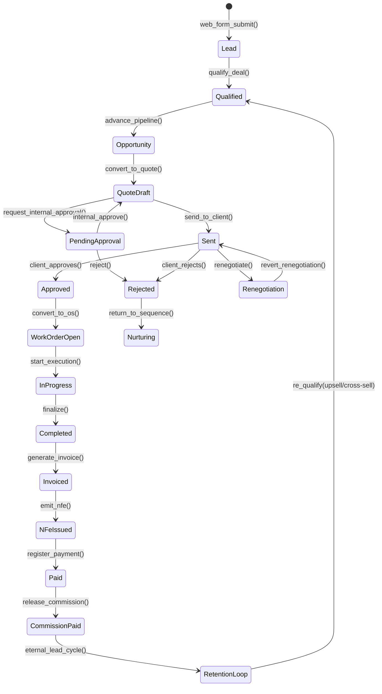
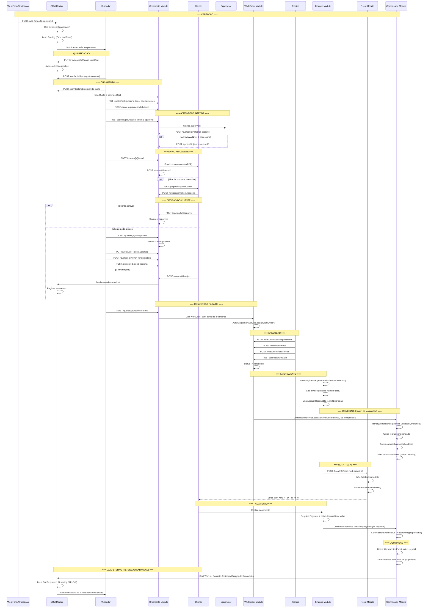

# Fluxo: Ciclo Comercial Completo

> **[AI_RULE]** Documento gerado por IA com base no codigo real do backend. Specs marcados com [SPEC] indicam funcionalidades planejadas.

## 1. Visao Geral

O ciclo comercial do Kalibrium ERP abrange desde a captacao de leads ate o recebimento do pagamento e calculo de comissoes. Envolve os modulos: **CRM**, **Orcamentos**, **Chamados**, **Ordens de Servico**, **Financeiro**, **Fiscal** e **Comissoes**.

---

## 2. State Machine — Ciclo Comercial



### Guards de Transição `[AI_RULE]`

| Transição | Guard |
|-----------|-------|
| `Lead → Qualified` | `lead_score >= minimum_score` |
| `Opportunity → QuoteDraft` | `customer_id IS NOT NULL` |
| `PendingApproval → QuoteDraft` | `approver.permission = 'quotes.quote.internal_approve'` |
| `QuoteDraft → Sent` | `items.count > 0 AND total > 0` |
| `Sent → Approved` | `client_signature OR proposal_response = 'accepted'` |
| `Approved → WorkOrderOpen` | `approved_at IS NOT NULL` |
| `Completed → Invoiced` | `total > 0 AND is_warranty = false` |
| `Invoiced → NFeIssued` | `invoice_id IS NOT NULL` |
| `NFeIssued → Paid` | `payment.amount >= account_receivable.amount` |
| `CommissionPaid → RetentionLoop` | `[AI_RULE_CRITICAL] eternal_lead = true` |

---

## 3. Etapas do Ciclo

```
Lead (CRM) -> Qualificacao -> Oportunidade -> Orcamento -> Envio -> Aprovacao
-> Contrato/OS -> Execucao -> Faturamento -> NF-e -> Pagamento -> Comissao
```

| Etapa | Modulo | Entidade | Status |
|-------|--------|----------|--------|
| 1. Captacao | CRM | `CrmDeal` | `new` |
| 2. Qualificacao | CRM | `CrmDeal` | Avanca no pipeline |
| 3. Oportunidade | CRM | `CrmDeal` | Stage de negociacao |
| 4. Orcamento | Quotes | `Quote` | `draft` |
| 5. Aprovacao Interna | Quotes | `Quote` | `pending_internal_approval` |
| 6. Envio ao Cliente | Quotes | `Quote` | `sent` |
| 7. Aprovacao do Cliente | Quotes | `Quote` | `approved` |
| 8. Renegociacao | Quotes | `Quote` | `renegotiation` |
| 9. Conversao para OS | OS | `WorkOrder` | `open` |
| 10. Execucao | OS | `WorkOrder` | `in_progress` -> `completed` |
| 11. Faturamento | Finance | `Invoice` + `AccountReceivable` | `issued` / `pending` |
| 12. Emissao NF-e | Fiscal | `FiscalNote` | `authorized` |
| 13. Pagamento | Finance | `Payment` | `paid` |
| 14. Comissao | Commission | `CommissionEvent` | `pending` -> `approved` -> `paid` |
| 15. Lead Eterno | CRM | `CrmSequence` / `CrmDeal` | `nurturing` / `renewal_pending` |

---

## 3. Diagrama de Sequencia Completo



---

## 4. Pontos de Decisao

### 4.1 Aprovacao Interna do Orcamento

```
Quote.status == 'draft'
  |
  v
request-internal-approval -> 'pending_internal_approval'
  |
  +-- internal-approve -> 'draft' (liberado para envio)
  |
  +-- approve-level2 -> 'draft' (aprovacao N2 para valores altos)
  |
  +-- reject -> 'rejected' (volta para vendedor ajustar)
```

Rotas implementadas:

- `POST /quotes/{id}/request-internal-approval` (permission: `quotes.quote.send`)
- `POST /quotes/{id}/internal-approve` (permission: `quotes.quote.internal_approve`)
- `POST /quotes/{id}/approve-level2` (permission: `quotes.quote.internal_approve`)

### 4.2 Decisao do Cliente

```
Quote.status == 'sent'
  |
  +-- approve -> 'approved' (pode converter para OS)
  |
  +-- reject -> 'rejected'
  |
  +-- renegotiate -> 'renegotiation' -> ajusta -> revert -> 'sent'
  |
  +-- approve-after-test -> 'approved' (aprovacao pos-teste de calibracao)
```

### 4.3 Triggers de Comissao

O `CommissionService` suporta tres triggers:

| Trigger | Quando | Uso Tipico |
|---------|--------|------------|
| `os_completed` | OS finalizada | Comissao tecnico |
| `os_invoiced` | OS faturada | Comissao vendedor |
| `installment_paid` | Parcela paga | Liberacao proporcional |

---

## 5. Metricas de Funil

### 5.1 Endpoints de Analytics CRM

| Metrica | Endpoint |
|---------|----------|
| Dashboard CRM | `GET /crm/dashboard` |
| Pipeline Velocity | `GET /crm-features/velocity` |
| Forecast | `GET /crm-features/forecast` |
| Loss Analytics | `GET /crm-features/loss-analytics` |
| Cohort Analysis | `GET /crm-features/cohort` |
| Revenue Intelligence | `GET /crm-features/revenue-intelligence` |
| Sales Goals | `GET /crm-features/goals/dashboard` |

### 5.2 Metricas por Etapa

| Etapa | Metrica | Calculo |
|-------|---------|---------|
| Lead -> Qualificacao | Taxa de qualificacao | Deals qualificados / Total leads |
| Qualificacao -> Orcamento | Taxa de conversao | Orcamentos gerados / Deals qualificados |
| Orcamento -> Aprovado | Taxa de aprovacao | Orcamentos aprovados / Enviados |
| Aprovado -> OS | Taxa de conversao | OS criadas / Orcamentos aprovados |
| OS -> Faturado | Taxa de conclusao | OS faturadas / OS criadas |
| Faturado -> Pago | Taxa de recebimento | Valor recebido / Valor faturado |

### 5.3 Orcamento Summary

```
GET /quotes-summary
GET /quotes-advanced-summary
```

Retorna totais por status, valores, taxa de conversao, tempo medio por etapa.

---

## 6. Conversoes Entre Modulos

### 6.1 Deal -> Quote

```
POST /crm/deals/{id}/convert-to-quote
Controller: CrmController::dealsConvertToQuote
```

### 6.2 Deal -> WorkOrder

```
POST /crm/deals/{id}/convert-to-work-order
Controller: CrmController::dealsConvertToWorkOrder
```

### 6.3 Quote -> WorkOrder

```
POST /quotes/{id}/convert-to-os
Controller: QuoteController::convertToWorkOrder
```

### 6.4 Quote -> ServiceCall

```
POST /quotes/{id}/convert-to-chamado
Controller: QuoteController::convertToServiceCall
```

### 6.5 ServiceCall -> WorkOrder

```
POST /service-calls/{id}/convert-to-os
Controller: ServiceCallController::convertToWorkOrder
```

---

## 7. Comissoes - Detalhamento

### 7.1 Beneficiarios

O `CommissionService::identifyBeneficiaries()` identifica:

1. **Tecnico principal** (`wo.assigned_to`) - role: `technician`
2. **Tecnicos auxiliares** (`wo.technicians` N:N) - role da pivot
3. **Vendedor** (`wo.seller_id`) - role: `seller`
4. **Motorista** (`wo.driver_id`) - role: `driver`

### 7.2 Regras de Negocio

- **GAP-05**: Tecnicos dividem comissao igualmente (`split_divisor = techCount`)
- **GAP-07**: Mesma pessoa nao recebe comissao de tecnico + vendedor na mesma OS
- **GAP-22**: Regras com `source_filter` filtram por origem do orcamento
- **Campanhas**: Multiplicadores temporais (`CommissionCampaign.multiplier`)
- **Calculo**: bcmath para precisao de centavos

### 7.3 Liberacao por Pagamento (GAP-04)

```php
// CommissionService::releaseByPayment()
$proportion = bcdiv($paymentAmount, (string) $wo->total, 4);
// Pagamento parcial = libera proporcional da comissao
// Pagamento total = libera 100%
```

---

## 8. Cenarios BDD

### Cenario 1: Happy Path Completo

```gherkin
Funcionalidade: Ciclo comercial completo

  Cenario: Lead ate pagamento com comissao
    Dado um web form de contato ativo
    Quando um prospect submete o formulario
    Entao um CrmDeal e criado com stage "new"

    Quando o vendedor qualifica o deal
    E converte o deal em orcamento
    E adiciona 2 itens ao orcamento
    E solicita aprovacao interna
    E o supervisor aprova internamente
    E o vendedor envia o orcamento ao cliente
    E o cliente aprova o orcamento
    Entao o Quote status e "approved"

    Quando o vendedor converte o orcamento em OS
    Entao uma WorkOrder e criada com os items do orcamento
    E o AutoAssignmentService atribui um tecnico

    Quando o tecnico executa e finaliza a OS
    Entao CommissionEvents sao gerados (trigger: os_completed)

    Quando a OS e faturada
    Entao uma Invoice e criada
    E AccountReceivables sao criados

    Quando o cliente paga
    Entao as comissoes sao liberadas proporcionalmente
```

### Cenario 2: Renegociacao

```gherkin
  Cenario: Cliente pede renegociacao do orcamento
    Dado um orcamento enviado ao cliente com total R$ 5.000
    Quando o cliente solicita desconto
    E o vendedor envia para renegociacao
    E ajusta o total para R$ 4.200
    E reverte da renegociacao
    E reenvia ao cliente
    E o cliente aprova
    Entao o Quote status e "approved"
    E o total e R$ 4.200
```

### Cenario 3: Rejeicao e Loss Reason

```gherkin
  Cenario: Cliente rejeita orcamento
    Dado um orcamento enviado ao cliente
    Quando o cliente rejeita
    Entao o Quote status e "rejected"
    E o CRM registra motivo de perda
    E o deal e marcado como "lost"
    E aparece nos loss analytics
```

### Cenario 4: Faturamento parcelado com comissao proporcional

```gherkin
  Cenario: OS faturada em 3 parcelas
    Dado uma OS completada com total R$ 9.000
    E comissao do tecnico de R$ 900 (10%)
    Quando a OS e faturada com 3 parcelas de R$ 3.000
    E o cliente paga a 1a parcela
    Entao R$ 300 da comissao e liberada (1/3)
    E R$ 600 permanece pendente
    Quando o cliente paga a 2a parcela
    Entao mais R$ 300 e liberada
    Quando o cliente paga a 3a parcela
    Entao a comissao total de R$ 900 esta liberada
```

### Cenario 5: Bloqueio de comissao duplica (GAP-07)

```gherkin
  Cenario: Vendedor que tambem e tecnico na OS
    Dado que o vendedor "Carlos" e tambem o tecnico atribuido a OS
    Quando a OS e completada
    Entao Carlos recebe apenas a comissao de tecnico
    E a comissao de vendedor e bloqueada
    E o log registra "Seller commission blocked (GAP-07)"
```

### Cenario 6: Proposta interativa

```gherkin
  Cenario: Cliente visualiza proposta interativa
    Dado um orcamento com proposta interativa gerada
    Quando o cliente acessa o link /proposals/{token}/view
    Entao ve a proposta completa sem necessidade de login
    Quando o cliente aceita via /proposals/{token}/respond
    Entao o orcamento e aprovado automaticamente
```

---

## 9. Modelo de Dados Resumido

```
CrmDeal
  -> convert-to-quote -> Quote
  -> convert-to-os    -> WorkOrder

Quote
  -> QuoteEquipment -> QuoteItem
  -> convert-to-os     -> WorkOrder
  -> convert-to-chamado -> ServiceCall

ServiceCall
  -> convert-to-os -> WorkOrder

WorkOrder
  -> WorkOrderItem (pecas + servicos)
  -> Invoice (faturamento)
  -> AccountReceivable (parcelas)
  -> CommissionEvent (comissoes)
  -> FiscalNote (NF-e / NFS-e)

CommissionRule
  -> CommissionEvent
  -> CommissionCampaign (multiplicador)
```

---

## 10. Regras e Mecanismos Complementares

### Regras de Comissão
- **Tabela:** `fin_commission_rules`
- **Campos:** id, tenant_id, name, type (enum: percentage, fixed, tiered), target (enum: sale, renewal, upsell), base_field (enum: total_value, margin, net_value), rate (decimal 5,4 — para percentage), fixed_amount nullable, tiers (json nullable — para tiered), is_active, timestamps
- **Tiers exemplo:** `[{"min": 0, "max": 10000, "rate": 0.03}, {"min": 10001, "max": 50000, "rate": 0.05}, {"min": 50001, "max": null, "rate": 0.07}]`
- **Service:** `CommissionService::calculate(WorkOrder|Contract $source, User $seller): CommissionEvent`
- **Trigger:** Listener `CalculateCommissionOnInvoicePaid` ouve `PaymentReceived`

### Guard Lead → Qualified
- **Requisitos mínimos:** customer.name, customer.document (CPF/CNPJ), customer.email OR customer.phone, pelo menos 1 contato registrado
- **Service:** `CrmPipelineService::canQualify(Lead $lead): bool`

### NF-e Failure Handling
- Se emissão NF-e falhar: invoice fica em status `pending_fiscal`
- Job `RetryPendingFiscalNotes` roda a cada 15 minutos
- Após 5 falhas: `FiscalNoteEmissionFailed` event → Alerts (notificar fiscal_manager)
- **Nunca bloquear:** A OS é concluída mesmo se NF falhar. NF é emitida assincronamente.

---

## 11. Gaps e Melhorias Futuras

| # | Gap | Status |
|---|-----|--------|
| 1 | Alerta automatico de orcamento sem resposta apos N dias | [SPEC] Job cron diario: buscar Quotes `sent` com updated_at < now()-N_dias. Notificar vendedor via push + email. Default: 7 dias |
| 2 | Automacao de follow-up via CRM sequences | Implementado (CrmSequenceStep) |
| 3 | Dashboard unificado do ciclo comercial (lead-to-cash) | [SPEC] Consolidar CRM leads → Quotes → WorkOrders → Invoices → Payments. Metricas: taxa conversao, ticket medio, ciclo medio |
| 4 | Metricas de tempo medio por etapa do funil | [SPEC] Calcular AVG entre: lead_created → quote_sent → quote_approved → wo_completed → invoice_paid. Segmentar por vendedor e tipo |
| 5 | Integracao NF-e automatica apos faturamento | Parcial (manual via rota) |
| 6 | Webhook de orcamento aprovado para integracao externa | [SPEC] Event `QuoteApproved` existe. Criar webhook configuravel por tenant: POST para URL com payload {quote_id, customer, total} |

---

> **[AI_RULE]** Este documento reflete o estado real dos controllers `CrmController`, `QuoteController`, `WorkOrderController`, `FiscalController`, e services `InvoicingService`, `CommissionService`. Specs marcados com [SPEC] indicam funcionalidades planejadas.

---

## Módulos Envolvidos

| Módulo | Responsabilidade no Fluxo |
|--------|---------------------------|
| [CRM](file:///c:/PROJETOS/sistema/docs/modules/CRM.md) | Gestão de leads, oportunidades e pipeline de vendas |
| [Quotes](file:///c:/PROJETOS/sistema/docs/modules/Quotes.md) | Geração e acompanhamento de propostas/orçamentos |
| [Finance](file:///c:/PROJETOS/sistema/docs/modules/Finance.md) | Faturamento e contas a receber após fechamento |
| [Fiscal](file:///c:/PROJETOS/sistema/docs/modules/Fiscal.md) | Emissão de NF-e/NFS-e pós-venda |
| [Email](file:///c:/PROJETOS/sistema/docs/modules/Email.md) | Comunicações com cliente durante negociação |
| [Core](file:///c:/PROJETOS/sistema/docs/modules/Core.md) | Gestão de usuários e permissões envolvidos no ciclo |
| [WorkOrders](file:///c:/PROJETOS/sistema/docs/modules/WorkOrders.md) | Geração de OS a partir de contrato fechado |
| [Service-Calls](file:///c:/PROJETOS/sistema/docs/modules/Service-Calls.md) | Abertura de chamado técnico pós-venda |
