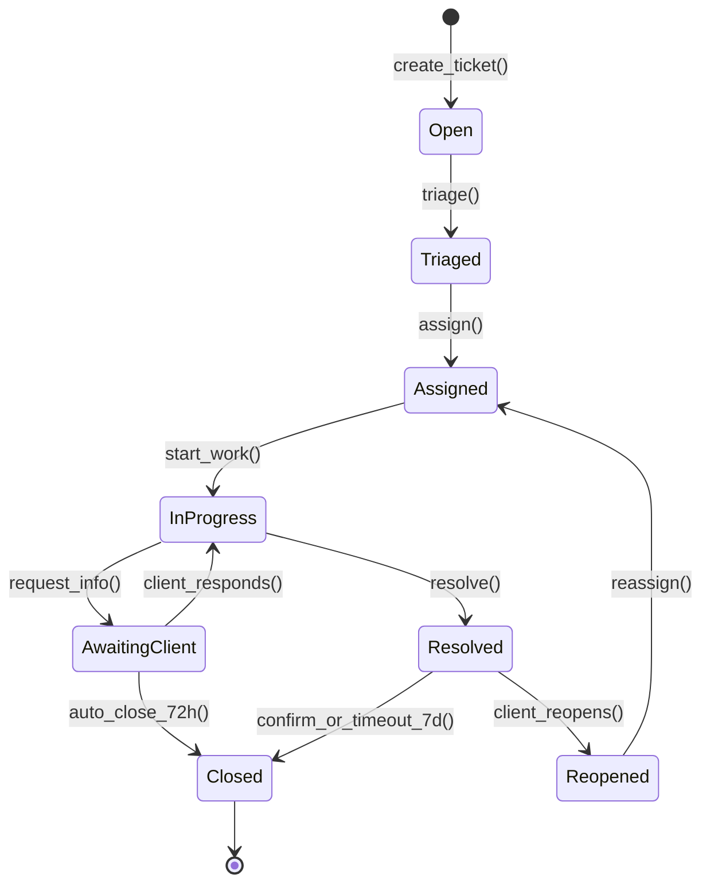
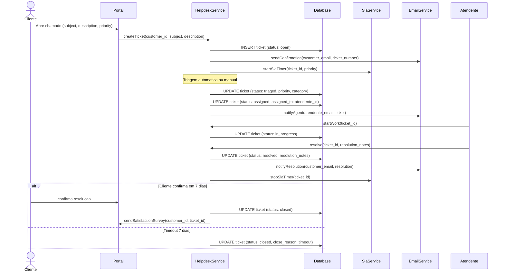

# Fluxo: Ciclo de Ticket de Suporte

> Ciclo completo de atendimento de chamados: desde a abertura pelo cliente (via portal ou email) ate a resolucao e pesquisa de satisfacao, com SLA automatizado e escalonamento por prioridade.

---

## 1. Narrativa do Processo

1. **Abertura**: Cliente abre chamado via Portal do Cliente ou email automaticamente classificado. Ticket recebe numero sequencial e prioridade inicial.
2. **Triagem**: Equipe de suporte avalia o ticket, classifica a prioridade final (low/medium/high/critical) e atribui categoria.
3. **Atribuicao**: Ticket e atribuido a um atendente com base na categoria, carga de trabalho e disponibilidade.
4. **Em Atendimento**: Atendente trabalha na resolucao. Pode solicitar informacoes ao cliente (muda para Aguardando Cliente).
5. **Aguardando Cliente**: Ticket pausado aguardando resposta do cliente. SLA pausado. Apos 72h sem resposta, fecha automaticamente.
6. **Resolvido**: Atendente marca como resolvido com descricao da solucao. Cliente pode reabrir em ate 7 dias.
7. **Reaberto**: Cliente reabre por insatisfacao. Incrementa contador de reaberturas. Se >= 3, escala para supervisor.
8. **Fechado**: Ticket finalizado definitivamente. Pesquisa de satisfacao enviada automaticamente.

---

## 2. State Machine — Ciclo de Vida do Ticket



---

## 3. Guards de Transicao `[AI_RULE]`

| Transicao | Guard | Motivo |
|-----------|-------|--------|
| `Open → Triaged` | `priority IS NOT NULL AND category IS NOT NULL` | Triagem obrigatoria antes de atribuir |
| `Triaged → Assigned` | `assigned_to IS NOT NULL AND assigned_to.is_active = true` | Atendente deve ser usuario ativo |
| `InProgress → AwaitingClient` | `last_message.is_internal = false AND last_message.requires_response = true` | Deve ter mensagem enviada ao cliente |
| `AwaitingClient → InProgress` | `client_response EXISTS` | Resposta do cliente registrada |
| `InProgress → Resolved` | `resolution_notes IS NOT NULL AND resolution_notes.length >= 20` | Descricao da resolucao obrigatoria (min 20 chars) |
| `Resolved → Reopened` | `days_since_resolved <= 7 AND reopened_count < 5` | Prazo de 7 dias e maximo 5 reaberturas |
| `Resolved → Closed` | `days_since_resolved > 7 OR client_confirmed_resolution = true` | Auto-fechamento por timeout ou confirmacao |
| `Reopened → Assigned` | Se `reopened_count >= 3`: atendente = supervisor | Escalonamento automatico apos 3 reaberturas |

> **[AI_RULE_CRITICAL]** Ticket com status `Closed` e IMUTAVEL. Nao pode ser reaberto. Se o cliente tiver novo problema, deve abrir novo ticket com referencia ao anterior.

> **[AI_RULE]** SLA e pausado durante `AwaitingClient` e retomado ao sair desse estado. O calculo de SLA deve descontar o tempo em espera do cliente.

> **[AI_RULE]** Tickets de prioridade `critical` devem ser atribuidos em ate 15 minutos. Se nao atribuidos, escalonamento automatico para o proximo nivel.

---

## 4. SLA por Prioridade

| Prioridade | Primeira Resposta | Resolucao | Escalonamento |
|-----------|-------------------|-----------|---------------|
| `critical` | 15 min | 4h | Apos 30 min sem atribuicao |
| `high` | 1h | 8h | Apos 2h sem resposta |
| `medium` | 4h | 24h | Apos 8h sem resposta |
| `low` | 8h | 72h | Apos 24h sem resposta |

> **[AI_RULE]** SLA violado gera `SlaBreached` event com dados do ticket e notificacao para supervisor. Reincidencia no mesmo atendente gera alerta de performance.

---

## 5. Eventos Emitidos

| Evento | Trigger | Payload | Consumidor |
|--------|---------|---------|------------|
| `TicketCreated` | `[*] → Open` | `{ticket_id, customer_id, subject, source, priority}` | Email (confirmacao ao cliente), Core (Notification) |
| `TicketTriaged` | `Open → Triaged` | `{ticket_id, priority, category, triaged_by}` | Core (log de auditoria) |
| `TicketAssigned` | `Triaged → Assigned` | `{ticket_id, assigned_to, sla_deadline}` | Email (notificacao ao atendente), Core (Notification) |
| `TicketAwaitingClient` | `InProgress → AwaitingClient` | `{ticket_id, message_id}` | Email (enviar mensagem ao cliente), SLA (pausar timer) |
| `ClientResponded` | `AwaitingClient → InProgress` | `{ticket_id, response_id}` | SLA (retomar timer), Core (Notification ao atendente) |
| `TicketResolved` | `InProgress → Resolved` | `{ticket_id, resolution_notes, resolved_by}` | Email (notificar cliente), Portal (atualizar status) |
| `TicketReopened` | `Resolved → Reopened` | `{ticket_id, reopened_count, reason}` | Core (alerta se count >= 3), Email (notificar supervisor) |
| `TicketClosed` | `* → Closed` | `{ticket_id, close_reason}` | Portal (pesquisa satisfacao), Core (atualizar metricas) |
| `SlaBreached` | Timer SLA expirado | `{ticket_id, sla_type, expected_at, breached_at}` | Core (Notification critica), Email (alertar supervisor) |

---

## 6. Modulos Envolvidos

| Modulo | Responsabilidade no Fluxo | Link |
|--------|--------------------------|------|
| **Helpdesk** | Modulo principal. Gerencia ciclo de vida do ticket, mensagens, SLA | [Helpdesk.md](file:///c:/PROJETOS/sistema/docs/modules/Helpdesk.md) |
| **Portal** | Canal de abertura de tickets pelo cliente. Exibe status e historico | [Portal.md](file:///c:/PROJETOS/sistema/docs/modules/Portal.md) |
| **Email** | Canal de abertura automatica (parsing de email). Notificacoes de status | [Email.md](file:///c:/PROJETOS/sistema/docs/modules/Email.md) |
| **Core** | Notifications, SystemAlerts, audit log | [Core.md](file:///c:/PROJETOS/sistema/docs/modules/Core.md) |

---

## 7. Diagrama de Sequencia — Abertura e Resolucao



---

## 8. Cenarios de Excecao

| Cenario | Comportamento Esperado |
|---------|----------------------|
| Cliente nao responde em 72h | Ticket fecha automaticamente com `close_reason = 'client_unresponsive'`. Email de aviso 24h antes |
| Ticket reaberto 3+ vezes | Escala para supervisor automaticamente. `reopened_count >= 3` atribui ao proximo nivel hierarquico |
| SLA de primeira resposta violado | `SlaBreached` emitido. Ticket fica highlighted no dashboard. Notificacao para supervisor |
| Atendente fica inativo/afastado | Tickets reatribuidos automaticamente pelo `TicketReassignmentService` |
| Email de cliente nao reconhecido | Ticket criado como `unidentified`. Requer triagem manual para vincular ao customer |
| Ticket duplicado detectado | Sistema sugere merge com ticket anterior. Requer confirmacao do atendente |
| Ticket critico sem atribuicao em 15 min | Escalonamento automatico: atribui ao atendente com menor carga. Se todos ocupados, alerta supervisor |
| Timeout de atribuicao + nenhum atendente aceita | Fluxo de recuperacao completo descrito na secao 8.1 |

### 8.1 Recuperacao: Timeout de Atribuicao + Nenhum Atendente Aceita

**Timer de Expiracao por Prioridade**

| Prioridade | Timeout sem aceite | Acao |
|-----------|-------------------|------|
| `critical` | 15 minutos | Escalonamento imediato + auto-assign |
| `high` | 1 hora | Notificacao supervisor + auto-assign apos 2h |
| `medium` | 4 horas | Notificacao supervisor apos 4h, auto-assign apos 8h |
| `low` | 8 horas | Auto-assign apos 24h |

**Listener: `EscalateUnassignedTicket`**

```php
class EscalateUnassignedTicket
{
    /**
     * Disparado pelo Scheduler a cada 5 minutos.
     * Verifica tickets em estado Triaged/Assigned sem atendimento efetivo.
     */
    public function handle(): void
    {
        $thresholds = [
            'critical' => 15,    // minutos
            'high'     => 60,
            'medium'   => 240,
            'low'      => 480,
        ];

        foreach (Tenant::active()->get() as $tenant) {
            $tickets = SupportTicket::where('tenant_id', $tenant->id)
                ->whereIn('status', ['triaged', 'assigned'])
                ->whereNull('first_response_at')
                ->get();

            foreach ($tickets as $ticket) {
                $threshold = $thresholds[$ticket->priority] ?? 240;
                $minutesSinceCreation = $ticket->created_at->diffInMinutes(now());

                if ($minutesSinceCreation < $threshold) {
                    continue;
                }

                // Fase 1: Notificar supervisor (no threshold)
                if (!$ticket->escalation_notified_at) {
                    $this->notifySupervisor($ticket);
                    $ticket->update(['escalation_notified_at' => now()]);
                }

                // Fase 2: Auto-assign ao atendente com menor carga (apos 2h ou 2x threshold)
                $autoAssignThreshold = max(120, $threshold * 2);
                if ($minutesSinceCreation >= $autoAssignThreshold && !$ticket->auto_assigned) {
                    $this->autoAssignLeastLoaded($ticket);
                }
            }
        }
    }

    private function autoAssignLeastLoaded(SupportTicket $ticket): void
    {
        // Busca atendente com menor quantidade de tickets abertos
        $leastLoaded = User::where('tenant_id', $ticket->tenant_id)
            ->where('is_active', true)
            ->whereHas('roles', fn($q) => $q->whereIn('name', ['support_agent', 'supervisor']))
            ->withCount(['assignedTickets' => fn($q) => $q->whereIn('status', ['assigned', 'in_progress'])])
            ->orderBy('assigned_tickets_count', 'asc')
            ->first();

        if ($leastLoaded) {
            $ticket->update([
                'assigned_to' => $leastLoaded->id,
                'status' => 'assigned',
                'auto_assigned' => true,
                'auto_assigned_at' => now(),
                'auto_assign_reason' => "Auto-atribuido por timeout ({$ticket->created_at->diffInMinutes(now())}min sem aceite)",
            ]);

            // Notifica o atendente atribuido
            event(new TicketAssigned($ticket));

            // Registra no audit log
            AuditLog::record('ticket_auto_assigned', [
                'ticket_id' => $ticket->id,
                'assigned_to' => $leastLoaded->id,
                'reason' => 'assignment_timeout',
                'minutes_waited' => $ticket->created_at->diffInMinutes(now()),
            ]);
        } else {
            // Nenhum atendente disponivel: alerta critico ao gerente
            SystemAlert::create([
                'tenant_id' => $ticket->tenant_id,
                'severity' => 'critical',
                'message' => "Ticket #{$ticket->id} ({$ticket->priority}) sem atendente ha {$ticket->created_at->diffInMinutes(now())}min. Nenhum agente disponivel.",
                'target_role' => 'manager',
            ]);
        }
    }

    private function notifySupervisor(SupportTicket $ticket): void
    {
        $supervisors = User::where('tenant_id', $ticket->tenant_id)
            ->whereHas('roles', fn($q) => $q->where('name', 'supervisor'))
            ->get();

        foreach ($supervisors as $supervisor) {
            Notification::notify(
                $ticket->tenant_id,
                $supervisor->id,
                'ticket_assignment_timeout',
                "Ticket #{$ticket->id} ({$ticket->priority}) sem atendente ha {$ticket->created_at->diffInMinutes(now())} minutos"
            );
        }
    }
}
```

**Campos Adicionais no Model `SupportTicket`**

| Campo | Tipo | Descricao |
|-------|------|-----------|
| `auto_assigned` | boolean default false | Se foi atribuido automaticamente por timeout |
| `auto_assigned_at` | datetime nullable | Quando foi auto-atribuido |
| `auto_assign_reason` | string nullable | Motivo da auto-atribuicao |
| `escalation_notified_at` | datetime nullable | Quando supervisor foi notificado |
| `first_response_at` | datetime nullable | Timestamp da primeira resposta ao cliente |

**Cenario BDD Adicional**

```gherkin
  Cenario: Ticket critical sem aceite apos 2h e auto-atribuido
    Dado um ticket "critical" criado ha 2 horas
    E que foi triado e atribuido ao atendente "Ana"
    E Ana nao iniciou atendimento (first_response_at IS NULL)
    E existem 3 outros atendentes ativos
    Quando o job EscalateUnassignedTicket executa
    Entao o ticket e re-atribuido ao atendente com menos tickets abertos
    E auto_assigned = true
    E o supervisor foi notificado (escalation_notified_at preenchido)
    E o audit log registra "ticket_auto_assigned" com motivo "assignment_timeout"
```

---

## 9. Endpoints Envolvidos

> Endpoints reais mapeados no codigo-fonte (`backend/routes/api/`). Todos sob prefixo `/api/v1/`.

### 9.1 Portal — Tickets (Portal do Cliente)

Registrados em `api.php` sob prefixo `portal/` com middleware `portal.access`:

| Metodo | Rota | Controller | Descricao |
|--------|------|------------|-----------|
| `GET` | `/api/v1/portal/tickets` | `PortalTicketController@index` | Listar tickets do cliente |
| `POST` | `/api/v1/portal/tickets` | `PortalTicketController@store` | Abrir novo ticket |
| `GET` | `/api/v1/portal/tickets/{id}` | `PortalTicketController@show` | Detalhes do ticket |
| `PUT` | `/api/v1/portal/tickets/{id}` | `PortalTicketController@update` | Atualizar ticket |
| `POST` | `/api/v1/portal/tickets/{id}/messages` | `PortalTicketController@addMessage` | Adicionar mensagem ao ticket |

### 9.2 Service Calls (Chamados Tecnicos)

Registrados em `quotes-service-calls.php`:

| Metodo | Rota | Controller | Descricao |
|--------|------|------------|-----------|
| `GET` | `/api/v1/service-calls` | `ServiceCallController@index` | Listar chamados |
| `POST` | `/api/v1/service-calls` | `ServiceCallController@store` | Criar chamado |
| `GET` | `/api/v1/service-calls/{serviceCall}` | `ServiceCallController@show` | Detalhes do chamado |
| `PUT` | `/api/v1/service-calls/{serviceCall}` | `ServiceCallController@update` | Atualizar chamado |
| `PUT` | `/api/v1/service-calls/{serviceCall}/status` | `ServiceCallController@updateStatus` | Atualizar status |
| `PUT` | `/api/v1/service-calls/{serviceCall}/assign` | `ServiceCallController@assignTechnician` | Atribuir tecnico |
| `GET` | `/api/v1/service-calls/{serviceCall}/comments` | `ServiceCallController@comments` | Comentarios do chamado |
| `POST` | `/api/v1/service-calls/{serviceCall}/comments` | `ServiceCallController@addComment` | Adicionar comentario |
| `GET` | `/api/v1/service-calls-kpi` | `ServiceCallController@dashboardKpi` | KPIs de chamados |

### 9.3 AI Analytics — Ticket Labeling

Registrado em `analytics-features.php`:

| Metodo | Rota | Controller | Descricao |
|--------|------|------------|-----------|
| `GET` | `/api/v1/smart-ticket-labeling` | `AIAnalyticsController@smartTicketLabeling` | Classificacao inteligente de tickets |

---

## 9.4 SLA Pause, Auto-Close e Satisfação

### SLA Pause (sla_pause_logs)
- **Tabela:** `help_sla_pause_logs`
- **Campos:** id, tenant_id, ticket_id (FK), paused_at, resumed_at nullable, reason (enum: waiting_customer, waiting_parts, waiting_approval, holiday), paused_by (FK users), timestamps
- **Cálculo SLA:** `effective_elapsed = total_elapsed - sum(pause_durations)`
- **Service:** `SlaTimerService::pause(Ticket $ticket, string $reason): void`
- **Service:** `SlaTimerService::resume(Ticket $ticket): void`
- **Service:** `SlaTimerService::getEffectiveElapsed(Ticket $ticket): int` (minutos)

### Auto-Close por Inatividade
- **Job:** `CloseInactiveTickets` — roda diariamente às 06:00
- **Regra:** Tickets em status `waiting_customer` há mais de 5 dias úteis (configurável: `helpdesk.auto_close_days`)
- **Ação:** Status → `auto_closed`, disparar `TicketAutoClosed` event
- **Notificação:** Email ao cliente informando fechamento automático

### Pesquisa de Satisfação
- **Trigger:** `TicketClosed` ou `TicketAutoClosed` event
- **Listener:** `SendSatisfactionSurveyOnTicketClosed`
- **Delay:** 2 horas após fechamento (queued job)
- **Canal:** Email com link para formulário no portal
- **Service:** `SatisfactionSurveyService::sendForTicket(Ticket $ticket): void`

---

## 10. KPIs do Fluxo

| KPI | Formula | Meta |
|-----|---------|------|
| MTTR (Mean Time To Resolution) | `avg(resolved_at - created_at)` | Varia por prioridade (ver SLA) |
| First Response Time | `avg(first_response_at - created_at)` | <= SLA por prioridade |
| SLA Compliance | `(tickets_within_sla / total_tickets) * 100` | >= 95% |
| Reopen Rate | `(tickets_reopened / total_resolved) * 100` | <= 5% |
| CSAT Score | `avg(satisfaction_score)` | >= 4.0 / 5.0 |
| Auto-close Rate | `(auto_closed / total_closed) * 100` | <= 10% |

---

## 11. Cenários BDD

```gherkin
Funcionalidade: Ciclo de Ticket de Suporte (Fluxo Transversal)

  Cenário: Ticket percorre ciclo completo até fechamento
    Dado que o cliente "Empresa ABC" abriu ticket via Portal com prioridade "medium"
    E que o SLA de primeira resposta é 4h e resolução é 24h
    Quando o suporte faz triagem e classifica como "hardware"
    E o ticket é atribuído ao atendente "Carlos"
    E Carlos inicia atendimento e resolve com nota >= 20 caracteres
    E o cliente confirma a resolução dentro de 7 dias
    Então o ticket deve ter status "Closed"
    E uma pesquisa de satisfação deve ser enviada automaticamente
    E o SLA de resolução deve estar dentro do prazo

  Cenário: SLA pausado durante Aguardando Cliente
    Dado um ticket "high" com SLA de resolução 8h
    E que 3h já se passaram desde a criação
    Quando o atendente solicita informações ao cliente (status → AwaitingClient)
    E o cliente demora 5h para responder
    Então o SLA utilizado deve ser 3h (antes da pausa) + tempo após retorno
    E as 5h de espera NÃO devem contar para o cálculo de SLA

  Cenário: Auto-close após 72h sem resposta do cliente
    Dado um ticket no estado "AwaitingClient"
    E que o cliente não respondeu há 73 horas
    Quando o job de auto-close executa
    Então o ticket deve ter status "Closed"
    E close_reason deve ser "client_unresponsive"
    E um email de aviso deve ter sido enviado 24h antes do fechamento

  Cenário: Escalonamento automático após 3 reaberturas
    Dado um ticket resolvido que foi reaberto 3 vezes
    Quando o cliente reabre pela 3ª vez
    Então o ticket deve ser atribuído ao supervisor (não ao atendente original)
    E o evento TicketReopened deve conter reopened_count = 3

  Cenário: SLA breach gera notificação crítica
    Dado um ticket "critical" com SLA de primeira resposta 15 minutos
    E que 20 minutos se passaram sem nenhuma resposta
    Quando o timer de SLA expira
    Então o evento SlaBreached deve ser emitido
    E o supervisor recebe notificação crítica
    E o ticket fica destacado no dashboard

  Cenário: Ticket fechado é imutável
    Dado um ticket com status "Closed"
    Quando o cliente tenta reabrir
    Então o sistema bloqueia informando "Ticket fechado é imutável. Abra um novo ticket."
    E o ticket permanece com status "Closed"
```
