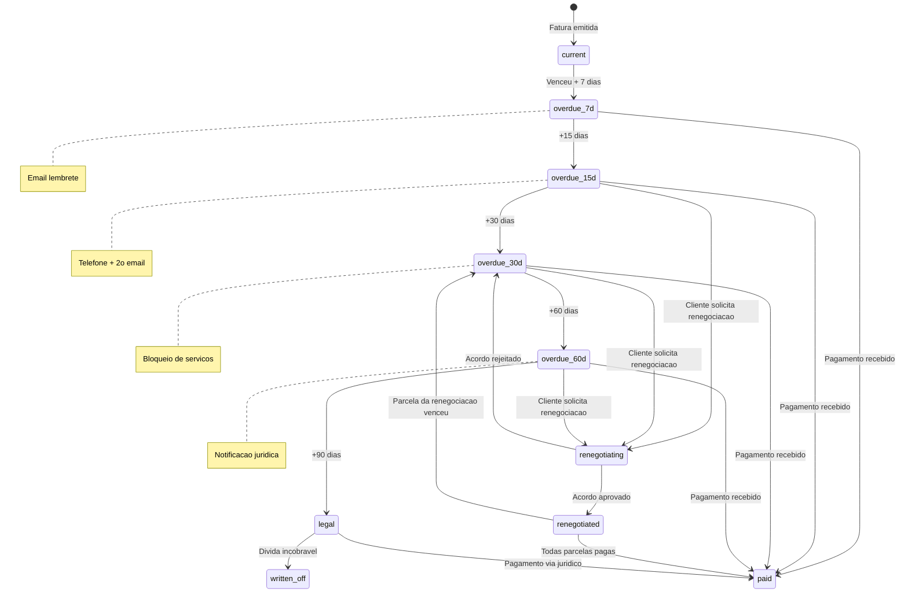
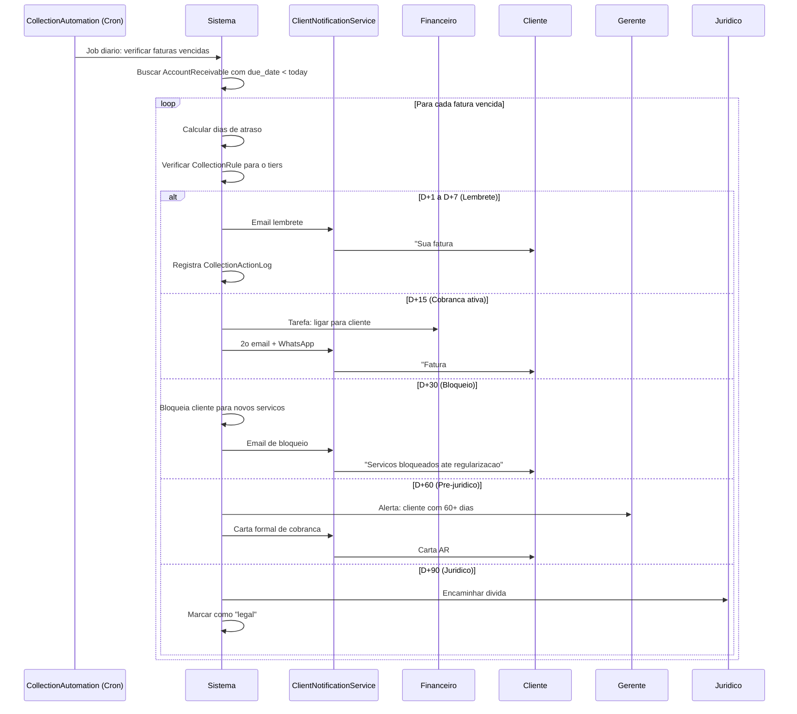

# Fluxo: Cobranca e Renegociacao de Divida

> **Modulo**: Finance + CRM
> **Prioridade**: P0 — Impacta receita e fluxo de caixa
> **[AI_RULE]** Documento prescritivo baseado em codigo existente: `CollectionAutomationService`, `DebtRenegotiationService`, `CollectionAction`, `CollectionRule`, `CollectionActionLog`. Verificar dados marcados com [SPEC] antes de usar em producao.

## 1. Visao Geral

Quando um cliente tem faturas vencidas, o sistema executa um workflow automatizado de cobranca progressiva, com possibilidade de renegociacao de divida:

1. **Lembrete automatico** (email/WhatsApp) apos vencimento
2. **Cobranca formal** com escalonamento progressivo
3. **Renegociacao/parcelamento** com controle de aprovacao
4. **Bloqueio de servicos** para inadimplentes
5. **Encaminhamento juridico** como ultimo recurso

**Atores**: Sistema (automatico), Financeiro, Gerente, Cliente, Juridico

---

## 2. Maquina de Estados da Cobranca



### 2.1 Acoes Automaticas por Faixa de Atraso

| Dias Vencido | Acao Automatica | Canal | Responsavel |
|-------------|-----------------|-------|-------------|
| **D+1** | Email lembrete amigavel | Email | Sistema |
| **D+7** | 2o lembrete + WhatsApp | Email + WhatsApp | Sistema |
| **D+15** | Ligacao de cobranca | Telefone | Financeiro |
| **D+30** | Bloqueio de novos servicos | Sistema | Sistema |
| **D+45** | Carta de cobranca formal | Email + Correios | Financeiro |
| **D+60** | Notificacao pre-juridica | Email + Carta AR | Gerente |
| **D+90** | Encaminhamento juridico | — | Juridico |

---

## 3. Pipeline de Cobranca Automatica



---

## 4. Modelo de Dados

### 4.1 Modelos Existentes

**CollectionRule** (regras configuráveis por tenant):

- `tenant_id` — FK
- `days_overdue_trigger` — Dias para disparar
- `action_type` — `email`, `sms`, `whatsapp`, `phone_call`, `block_services`, `legal`
- `template_id` — Template de mensagem
- `is_active` — Habilitado/desabilitado

**CollectionAction** (acoes planejadas):

- `tenant_id`, `account_receivable_id`
- `action_type`, `scheduled_date`, `executed_at`
- `status` — `pending`, `executed`, `skipped`, `failed`

**CollectionActionLog** (historico de acoes):

- `collection_action_id`, `user_id`
- `action`, `details`, `result`

### 4.2 DebtRenegotiation [Existente]

| Campo | Tipo | Descricao |
|-------|------|-----------|
| `id` | bigint unsigned | PK |
| `tenant_id` | bigint unsigned | FK |
| `customer_id` | bigint unsigned | FK → customers |
| `original_total` | decimal(10,2) | Valor total da divida |
| `negotiated_total` | decimal(10,2) | Valor acordado |
| `discount_percentage` | decimal(5,2) | Desconto aplicado |
| `installments` | integer | Numero de parcelas |
| `first_due_date` | date | Vencimento da 1a parcela |
| `status` | enum | `pending_approval`, `approved`, `active`, `completed`, `defaulted` |
| `approved_by` | bigint unsigned nullable | FK → users |
| `approved_at` | datetime nullable | — |
| `notes` | text nullable | — |

### 4.3 DebtRenegotiationInstallment [SPEC]

| Campo | Tipo | Descricao |
|-------|------|-----------|
| `id` | bigint unsigned | PK |
| `renegotiation_id` | bigint unsigned | FK |
| `installment_number` | integer | 1, 2, 3... |
| `amount` | decimal(10,2) | Valor da parcela |
| `due_date` | date | Vencimento |
| `paid_at` | datetime nullable | Quando foi pago |
| `payment_method` | string nullable | Forma de pagamento |
| `status` | enum | `pending`, `paid`, `overdue`, `written_off` |

---

## 5. Regras de Negocio

### 5.1 Bloqueio de Servicos

[AI_RULE_CRITICAL] Ao bloquear cliente inadimplente:

- Novas OS NAO podem ser criadas (exceto emergencia)
- Novos orcamentos NAO podem ser enviados
- OS em andamento NAO sao canceladas (finalizar o que esta aberto)
- Contratos de preventiva sao SUSPENSOS (nao cancelados)
- Portal do cliente exibe banner de inadimplencia

### 5.2 Renegociacao

| Regra | Valor |
|-------|-------|
| Desconto maximo sem aprovacao gerente | 10% |
| Desconto maximo com aprovacao gerente | 25% |
| Desconto maximo com aprovacao diretor | 50% |
| Parcelas maximas | 12x |
| Parcela minima | R$ 100,00 |
| Juros mora padrao | 2% a.m. |
| Multa atraso padrao | 2% |

[AI_RULE] Regras de desconto e parcelamento DEVEM ser configuraveis por tenant via `TenantSetting`.

### 5.3 Reversao de Comissao

[AI_RULE_CRITICAL] Quando fatura vencida > 30 dias:

- Comissao associada e marcada como `held` (retida)
- Comissao so e liberada quando pagamento e recebido
- Se divida for renegociada: comissao liberada proporcionalmente conforme parcelas pagas
- Se divida for dada como incobravel: comissao e revertida (estornada)

### 5.4 Dashboard de Aging

```
| Faixa       | Faturas | Valor Total | % do Total |
|-------------|---------|-------------|------------|
| Corrente    | 45      | R$ 125.000  | 65%        |
| 1-30 dias   | 12      | R$ 35.000   | 18%        |
| 31-60 dias  | 5       | R$ 18.000   | 9%         |
| 61-90 dias  | 3       | R$ 10.000   | 5%         |
| 90+ dias    | 2       | R$ 5.000    | 3%         |
```

---

## 6. Cenarios BDD

### Cenario 1: Cobranca automatica progressiva

```gherkin
Dado que o cliente "Empresa X" tem fatura de R$ 5.000 vencida
Quando passam 7 dias apos o vencimento
Entao o sistema envia email de lembrete automatico
  E registra CollectionActionLog
Quando passam 15 dias
Entao o sistema envia WhatsApp + cria tarefa de ligacao para o financeiro
Quando passam 30 dias
Entao o sistema bloqueia o cliente para novos servicos
  E envia email informando o bloqueio
```

### Cenario 2: Renegociacao com parcelamento

```gherkin
Dado que o cliente "Empresa Y" tem R$ 15.000 em dividas (3 faturas)
  E esta bloqueado ha 15 dias
Quando o financeiro inicia renegociacao
  E oferece 10% de desconto com 6 parcelas
Entao o valor acordado e R$ 13.500
  E 6 parcelas de R$ 2.250 sao geradas
  E o status muda para "pending_approval"
Quando o gerente aprova
Entao o cliente e desbloqueado
  E as faturas originais sao marcadas como "renegotiated"
  E as comissoes ficam retidas ate pagamento das parcelas
```

### Cenario 3: Parcela da renegociacao vence

```gherkin
Dado que o cliente tem renegociacao ativa com 6 parcelas
  E pagou 3 parcelas em dia
Quando a 4a parcela vence sem pagamento
Entao o sistema reinicia o ciclo de cobranca para a parcela
Quando passam 15 dias sem pagamento da parcela
Entao a renegociacao e marcada como "defaulted"
  E o saldo remanescente volta para cobranca normal
  E o cliente e bloqueado novamente
```

### Cenario 4: Bloqueio nao afeta OS em andamento

```gherkin
Dado que o cliente "Empresa Z" tem 2 OS em andamento
  E uma fatura vencida ha 30 dias
Quando o sistema bloqueia o cliente
Entao as 2 OS em andamento continuam normalmente
  E o tecnico pode finaliza-las
  E novas OS NAO podem ser criadas
  E o portal do cliente mostra banner de inadimplencia
```

### Cenario 5: Write-off de divida incobravel

```gherkin
Dado que o cliente "Empresa W" tem divida de R$ 8.000
  E esta em cobranca juridica ha 180 dias
  E o juridico informa que a divida e incobravel
Quando o diretor autoriza write-off
Entao a divida e baixada como prejuizo
  E as comissoes associadas sao estornadas
  E o lancamento contabil de provisao e criado
  E o cliente permanece bloqueado
```

### Cenario 6: Desconto requer aprovacao escalonada

```gherkin
Dado que o financeiro negocia desconto de 30% com o cliente
  E o limite sem aprovacao e 10%
  E o limite do gerente e 25%
Entao o sistema solicita aprovacao do diretor (30% > 25%)
Quando o diretor aprova
Entao a renegociacao prossegue com 30% de desconto
  E o motivo e registrado no audit log
```

---

## 7. Integracao com Modulos Existentes

| Modulo | Integracao |
|--------|-----------|
| **CollectionAutomationService** | Job cron diario para processar regras de cobranca |
| **DebtRenegotiationService** | Logica de parcelamento e calculo de desconto |
| **AccountReceivable** | Faturas vencidas — fonte da cobranca |
| **ClientNotificationService** | Envio de emails, WhatsApp, SMS |
| **CommissionService** | Retencao/estorno de comissoes |
| **WorkOrder** | Bloqueio de criacao de novas OS |
| **Contract** | Suspensao de contratos de preventiva |
| **Portal** | Banner de inadimplencia |
| **AuditLog** | Registro de todas as acoes de cobranca |

---

## 8. Endpoints Envolvidos

> Endpoints reais mapeados no codigo-fonte (`backend/routes/api/`). Todos sob prefixo `/api/v1/`.

### 8.1 Contas a Receber (Fonte da Cobranca)

Registrados em `financial.php`:

| Metodo | Rota | Controller | Descricao |
|--------|------|------------|-----------|
| `GET` | `/api/v1/accounts-receivable` | `AccountReceivableController@index` | Listar contas a receber |
| `GET` | `/api/v1/accounts-receivable/{account_receivable}` | `AccountReceivableController@show` | Detalhes da conta |
| `GET` | `/api/v1/accounts-receivable-summary` | `AccountReceivableController@summary` | Resumo financeiro |
| `POST` | `/api/v1/accounts-receivable` | `AccountReceivableController@store` | Criar conta a receber |
| `POST` | `/api/v1/accounts-receivable/{account_receivable}/pay` | `AccountReceivableController@pay` | Registrar pagamento |
| `PUT` | `/api/v1/accounts-receivable/{account_receivable}` | `AccountReceivableController@update` | Atualizar conta |
| `DELETE` | `/api/v1/accounts-receivable/{account_receivable}` | `AccountReceivableController@destroy` | Excluir conta |
| `POST` | `/api/v1/accounts-receivable/installments` | `AccountReceivableController@generateInstallments` | Gerar parcelas |

### 8.2 Regras de Cobranca

Registrados em `finance-advanced.php` (prefixo `finance-advanced/`):

| Metodo | Rota | Controller | Descricao |
|--------|------|------------|-----------|
| `GET` | `/api/v1/finance-advanced/collection-rules` | `FinanceAdvancedController@collectionRules` | Listar regras de cobranca |
| `POST` | `/api/v1/finance-advanced/collection-rules` | `FinanceAdvancedController@storeCollectionRule` | Criar regra |
| `PUT` | `/api/v1/finance-advanced/collection-rules/{rule}` | `FinanceAdvancedController@updateCollectionRule` | Atualizar regra |
| `DELETE` | `/api/v1/finance-advanced/collection-rules/{rule}` | `FinanceAdvancedController@deleteCollectionRule` | Excluir regra |

Registrados em `system-operations.php` (prefixo `system/`):

| Metodo | Rota | Controller | Descricao |
|--------|------|------------|-----------|
| `GET` | `/api/v1/system/collection-rules` | `SystemImprovementsController@collectionRules` | Listar regras (via system) |
| `GET` | `/api/v1/system/aging-report` | `SystemImprovementsController@agingReport` | Relatorio de aging |
| `POST` | `/api/v1/system/collection-rules` | `SystemImprovementsController@storeCollectionRule` | Criar regra |
| `PUT` | `/api/v1/system/collection-rules/{rule}` | `SystemImprovementsController@updateCollectionRule` | Atualizar regra |
| `DELETE` | `/api/v1/system/collection-rules/{rule}` | `SystemImprovementsController@destroyCollectionRule` | Excluir regra |

### 8.3 Renegociacao de Divida

Registrados em `advanced-lots.php`:

| Metodo | Rota | Controller | Descricao |
|--------|------|------------|-----------|
| `GET` | `/api/v1/debt-renegotiations` | `DebtRenegotiationController@index` | Listar renegociacoes |
| `GET` | `/api/v1/debt-renegotiations/{debtRenegotiation}` | `DebtRenegotiationController@show` | Detalhes da renegociacao |
| `POST` | `/api/v1/debt-renegotiations` | `DebtRenegotiationController@store` | Criar renegociacao |
| `POST` | `/api/v1/debt-renegotiations/{debtRenegotiation}/approve` | `DebtRenegotiationController@approve` | Aprovar renegociacao |
| `POST` | `/api/v1/debt-renegotiations/{debtRenegotiation}/cancel` | `DebtRenegotiationController@cancel` | Cancelar renegociacao |

Registrados em `analytics-features.php` (prefixo `renegotiations/`):

| Metodo | Rota | Controller | Descricao |
|--------|------|------------|-----------|
| `GET` | `/api/v1/renegotiations` | `RenegotiationController@indexRenegotiations` | Listar renegociacoes (analytics) |
| `POST` | `/api/v1/renegotiations` | `RenegotiationController@storeRenegotiation` | Criar renegociacao |
| `POST` | `/api/v1/renegotiations/{renegotiation}/approve` | `RenegotiationController@approveRenegotiation` | Aprovar |
| `POST` | `/api/v1/renegotiations/{renegotiation}/reject` | `RenegotiationController@rejectRenegotiation` | Rejeitar |

### 8.4 Inadimplencia e Parcelamento

Registrados em `finance-advanced.php`:

| Metodo | Rota | Controller | Descricao |
|--------|------|------------|-----------|
| `GET` | `/api/v1/finance-advanced/delinquency/dashboard` | `FinanceAdvancedController@delinquencyDashboard` | Dashboard de inadimplencia |
| `POST` | `/api/v1/finance-advanced/installment/simulate` | `FinanceAdvancedController@simulateInstallment` | Simular parcelamento |
| `POST` | `/api/v1/finance-advanced/installment/create` | `FinanceAdvancedController@createInstallment` | Criar parcelamento |
| `POST` | `/api/v1/finance-advanced/receivables/{receivable}/partial-payment` | `FinanceAdvancedController@partialPayment` | Pagamento parcial |

### 8.5 Comissoes (Retencao/Estorno)

Registrados em `financial.php`:

| Metodo | Rota | Controller | Descricao |
|--------|------|------------|-----------|
| `GET` | `/api/v1/commission-events` | `CommissionController@events` | Listar eventos de comissao |
| `PUT` | `/api/v1/commission-events/{commission_event}/status` | `CommissionController@updateEventStatus` | Atualizar status (hold/release) |
| `GET` | `/api/v1/commission-summary` | `CommissionController@summary` | Resumo de comissoes |

### 8.6 Endpoints Planejados [SPEC]

| Metodo | Rota | Descricao | Form Request |
|--------|------|-----------|--------------|
| `GET` | `/api/v1/collection/dashboard` | Dashboard de aging unificado | — |
| `GET` | `/api/v1/collection/overdue` | Faturas vencidas com acoes | — |
| `POST` | `/api/v1/collection/{ar_id}/action` | Registrar acao manual | `CreateCollectionActionRequest` |
| `POST` | `/api/v1/collection/{ar_id}/block` | Bloquear cliente manual | `BlockCustomerRequest` |
| `POST` | `/api/v1/collection/{ar_id}/unblock` | Desbloquear cliente | `UnblockCustomerRequest` |
| `POST` | `/api/v1/collection/{ar_id}/write-off` | Write-off de divida | `WriteOffRequest` |

---

## 8.7 Especificacoes Tecnicas

### Renegotiation Agreement Model
- **Tabela:** `fin_renegotiation_agreements`
- **Campos:** id, tenant_id, customer_id (FK), original_receivable_ids (json — array de IDs), total_original_debt, discount_percentage, discount_amount, new_total, installments_count, first_due_date, payment_method_id (FK), status (enum: draft, pending_signature, active, completed, defaulted, cancelled), negotiated_by (FK users), signed_at nullable, cancelled_at nullable, timestamps

### CustomerCreditService (`App\Services\Finance\CustomerCreditService`)
- `checkCredit(Customer $customer): CreditStatus` — retorna status e limite disponível
- `blockCredit(Customer $customer, string $reason): void` — bloqueia novas OS/vendas
- `unblockCredit(Customer $customer): void` — desbloqueia após regularização
- `isBlocked(Customer $customer): bool`
- **Auto-block:** Listener `BlockCreditOnDefault` ouve `PaymentOverdue` (>30 dias)
- **Auto-unblock:** Listener `UnblockCreditOnPayment` ouve `AllDebtsSettled`

### Integração Serasa (Futuro)
- **Status:** Planejado — não implementar agora
- **Service futuro:** `App\Services\Finance\CreditBureauService`
- **Ações planejadas:** `registerDefault()`, `removeDefault()`, `checkScore()`
- **Nota:** Requer contrato com Serasa Experian e certificado digital. Implementar quando contrato ativo.

---

## 9. Gaps e Melhorias Futuras

| # | Item | Status |
|---|------|--------|
| 1 | Integracao com bureau de credito (Serasa/SPC) | [SPEC] |
| 2 | Boleto de renegociacao com codigo de barras | [SPEC] |
| 3 | Score de risco de inadimplencia por cliente | Parcial — `CreditRiskAnalysisService` existe |
| 4 | Relatorio de provisao para devedores duvidosos (PDD) | [SPEC] |
| 5 | Workflow de aprovacao multi-nivel para descontos | [SPEC] |

> **[AI_RULE]** Este documento mapeia o fluxo de cobranca e renegociacao. Baseia-se em `CollectionAutomationService`, `DebtRenegotiationService`, `CollectionAction`, `CollectionRule`, `AccountReceivable`, `CommissionService`. Atualizar ao implementar os [SPEC].

---

## Módulos Envolvidos

| Módulo | Responsabilidade no Fluxo |
|--------|---------------------------|
| [Finance](file:///c:/PROJETOS/sistema/docs/modules/Finance.md) | Contas a receber, parcelas, juros e multas |
| [Email](file:///c:/PROJETOS/sistema/docs/modules/Email.md) | Envio de lembretes, boletos e notificações de cobrança |
| [CRM](file:///c:/PROJETOS/sistema/docs/modules/CRM.md) | Histórico do cliente e classificação de risco |
| [Portal](file:///c:/PROJETOS/sistema/docs/modules/Portal.md) | Autoatendimento do cliente para negociação e pagamento |
| [Lab](file:///c:/PROJETOS/sistema/docs/modules/Lab.md) | Consulta a serviços prestados vinculados à cobrança |
| [Core](file:///c:/PROJETOS/sistema/docs/modules/Core.md) | Configurações de regras de cobrança por tenant |
