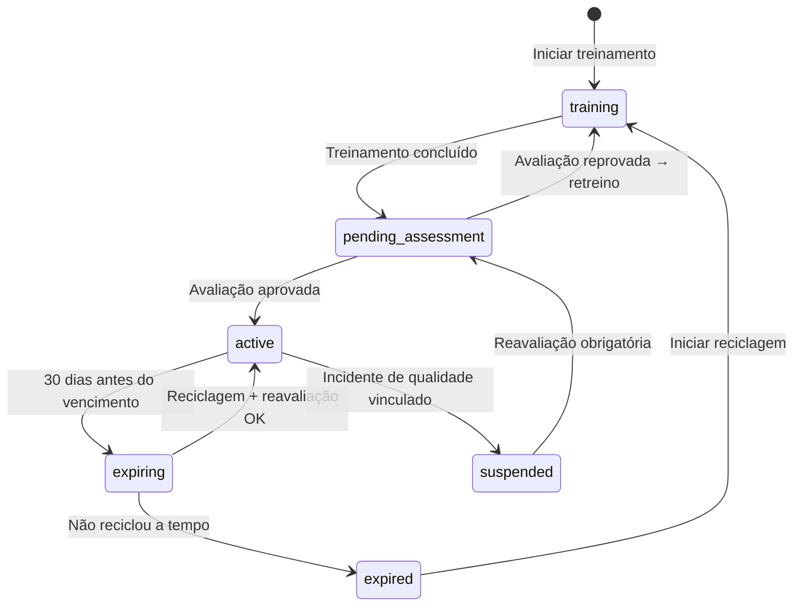

# Fluxo — Competência de Pessoal para Metrologia

> **Princípio:** Técnico só calibra se tiver competência documentada, vigente e compatível com o tipo de calibração. O sistema impede automaticamente que pessoal não-qualificado execute calibrações.

---

## 1. Visão Geral

```
┌─────────────────────────────────────────────────────────────────────┐
│               CICLO DE COMPETÊNCIA METROLÓGICA                      │
│                                                                     │
│  Treinamento  →  Avaliação  →  Competência  →  Execução  →         │
│  (curso/OJT)     formal        ativa           calibrações          │
│                                                                     │
│  Monitoramento  →  Vencimento  →  Reciclagem  →  Reavaliação       │
│  contínuo          alerta          obrigatória     nova vigência    │
│                                                                     │
│  ── Se não reciclar ──                                              │
│  Competência expira → BLOQUEIO → Não pode calibrar                 │
└─────────────────────────────────────────────────────────────────────┘
```

### Máquina de Estados



---

## 2. Model: UserCompetency

### 2.1 Campos

| Campo | Tipo | Descrição | Obrigatório |
|-------|------|-----------|-------------|
| `id` | bigint | PK | Sim |
| `tenant_id` | bigint FK | Tenant | Sim |
| `user_id` | bigint FK | Técnico | Sim |
| `calibration_type` | enum | Tipo de calibração autorizado | Sim |
| `qualification_level` | enum | Nível: trainee/junior/senior/specialist | Sim |
| `status` | enum | active/expired/suspended/training/pending_assessment | Sim |
| `valid_from` | date | Início da vigência | Sim |
| `valid_until` | date | Fim da vigência | Sim |
| `revalidation_interval_months` | integer | Intervalo de reciclagem (padrão: 12) | Sim |
| `evidence_file` | varchar(500) | Certificado de treinamento (PDF) | Sim |
| `training_hours` | integer | Horas de treinamento | Sim |
| `training_provider` | varchar(255) | Instituição/instrutor | Sim |
| `assessed_by` | bigint FK | Avaliador (diferente do técnico) | Sim |
| `assessment_date` | date | Data da avaliação | Sim |
| `assessment_score` | decimal(5,2) | Nota da avaliação (0-100) | Não |
| `assessment_method` | enum | Método: practical_exam/written_exam/observation/portfolio | Sim |
| `supervision_required` | boolean | Se requer supervisão (trainee) | Sim |
| `supervisor_user_id` | bigint FK | Supervisor obrigatório (se trainee) | Condicional |
| `notes` | text | Observações | Não |

### 2.2 Tipos de Calibração (enum `calibration_type`)

| Valor | Descrição |
|-------|-----------|
| `mass` | Calibração de massa (balanças, pesos) |
| `dimensional` | Calibração dimensional (réguas, paquímetros, micrômetros) |
| `electrical` | Calibração elétrica (multímetros, fontes) |
| `thermal` | Calibração térmica (termômetros, fornos) |
| `pressure` | Calibração de pressão (manômetros, transdutores) |
| `volume` | Calibração volumétrica (pipetas, buretas) |
| `force` | Calibração de força/torque |
| `flow` | Calibração de vazão |
| `time_frequency` | Calibração de tempo/frequência |

### 2.3 Níveis de Qualificação

| Nível | Descrição | Pode operar sozinho? | Pode aprovar? |
|-------|-----------|---------------------|---------------|
| `trainee` | Em treinamento | ❌ (supervisão obrigatória) | ❌ |
| `junior` | Qualificado para operações básicas | ✅ | ❌ |
| `senior` | Qualificado para todas operações do tipo | ✅ | ✅ (se permission) |
| `specialist` | Especialista, pode treinar outros | ✅ | ✅ |

---

## 3. Bloqueios Automáticos

### 3.1 Regras de Bloqueio

| Cenário | Bloqueio | Onde |
|---------|----------|------|
| Técnico sem `UserCompetency` para o tipo | ❌ Não aparece na lista de técnicos | Wizard Step 1 + Dispatch |
| Competência com `valid_until < today` | ❌ Bloqueado | Wizard Step 1 |
| Competência com `status = suspended` | ❌ Bloqueado | Wizard Step 1 |
| Trainee sem supervisor designado | ❌ Bloqueado (precisa co-assinatura) | Wizard Step 10 |
| Avaliador = Técnico avaliado | ❌ Inválido | Formulário de avaliação |

### 3.2 PreFlightCheckService — Verificação de Competência

```php
public function checkTechnicianCompetency(User $technician, string $calibrationType): CheckResult
{
    $competency = UserCompetency::where('user_id', $technician->id)
        ->where('calibration_type', $calibrationType)
        ->where('status', 'active')
        ->where('valid_until', '>=', today())
        ->first();

    if (!$competency) {
        return CheckResult::fail(
            "Técnico {$technician->name} NÃO possui competência ativa para calibração tipo '{$calibrationType}'. "
            . "ISO 17025 §6.2: Pessoal deve ser competente com base em educação, treinamento e experiência."
        );
    }

    if ($competency->supervision_required) {
        return CheckResult::warn(
            "Técnico {$technician->name} é TRAINEE — requer supervisão obrigatória. "
            . "Supervisor: {$competency->supervisor->name}"
        );
    }

    if ($competency->valid_until->diffInDays(today()) <= 30) {
        return CheckResult::warn(
            "Competência de {$technician->name} vence em {$competency->valid_until->diffInDays(today())} dias. "
            . "Agendar reciclagem."
        );
    }

    return CheckResult::pass("Competência válida até {$competency->valid_until->format('d/m/Y')}");
}
```

---

## 4. Alertas de Vencimento de Competência

| Dias antes | Alerta | Destinatário |
|-----------|--------|--------------|
| 60 dias | 📧 Email informativo | Técnico + RH |
| 30 dias | 📧 Email + 🔔 Push | Técnico + RH + Lab Manager |
| 15 dias | 📧 Email + ⚠️ Dashboard | Todos acima + Gerente |
| 7 dias | 🔴 Urgente + Dashboard | Todos + Admin |
| 0 (venceu) | 🚫 Bloqueio + Email | Todos + Sistema |

### Cron Job

```php
// App\Console\Commands\CheckCompetencyExpiry
// Execução: daily

$thresholds = [60, 30, 15, 7, 0];
foreach ($thresholds as $days) {
    $competencies = UserCompetency::where('status', 'active')
        ->whereDate('valid_until', now()->addDays($days)->toDateString())
        ->get();

    foreach ($competencies as $comp) {
        if ($days === 0) {
            $comp->update(['status' => 'expired']);
        }
        CompetencyExpiryNotification::dispatch($comp, $days);
    }
}
```

---

## 5. Fluxo de Treinamento e Avaliação

### 5.1 Novo Técnico

```
1. RH cadastra técnico no sistema (User)
2. Lab Manager identifica tipos de calibração necessários
3. Para CADA tipo:
   ├── Cria UserCompetency com status = training
   ├── Define plano de treinamento (horas, conteúdo)
   ├── Técnico realiza treinamento (curso, OJT, mentoria)
   ├── Evidência anexada (certificado, registro)
   ├── Avaliação formal por avaliador qualificado (≠ técnico)
   │   ├── Método: prático + teórico
   │   ├── Nota mínima: configurável por tenant (padrão: 70%)
   │   ├── Se aprovado → status = active, valid_from = today
   │   └── Se reprovado → permanece training, retenta em N dias
   └── Se trainee → supervision_required = true
```

### 5.2 Reciclagem (Revalidação)

```
1. Alerta de vencimento dispara (60 dias antes)
2. Lab Manager agenda reciclagem
3. Técnico realiza reciclagem (curso, prática supervisionada)
4. Nova avaliação formal
5. Se aprovado:
   ├── valid_from = today
   ├── valid_until = today + revalidation_interval
   └── status = active (renovado)
6. Se reprovado:
   ├── Status permanece expiring/expired
   ├── Nova tentativa agendada
   └── Técnico bloqueado para o tipo até aprovação
```

### 5.3 Suspensão por Incidente

```
1. Incidente de qualidade detectado (RNC vinculada ao técnico)
2. Lab Manager ou Quality suspende competência
   ├── status = suspended
   ├── Motivo registrado
   └── Técnico imediatamente bloqueado para o tipo
3. Investigação (CAPA)
4. Reavaliação obrigatória
5. Se aprovado → reativa
6. Se reprovado → retreino obrigatório
```

---

## 6. Matriz de Competências (Skill Matrix)

### 6.1 Visualização

| Técnico | Massa | Dimensional | Elétrica | Térmica | Pressão |
|---------|-------|------------|----------|---------|---------|
| João Silva | 🟢 Senior (até 12/2026) | 🟢 Junior (até 06/2026) | ❌ | 🟡 Trainee | ❌ |
| Maria Santos | 🟢 Specialist (até 03/2027) | 🟢 Senior (até 09/2026) | 🟢 Junior (até 11/2026) | ❌ | ❌ |
| Pedro Lima | 🟡 Expiring (15 dias) | ❌ | ❌ | ❌ | 🟢 Senior (até 01/2027) |

**Legenda:**
- 🟢 Ativo e válido
- 🟡 Vencendo em breve (≤ 30 dias) ou Trainee
- 🔴 Vencido ou Suspenso
- ❌ Sem competência

### 6.2 Dashboard de Competências

| KPI | Cálculo |
|-----|---------|
| Competências ativas | `COUNT(status = active)` |
| Vencendo em 30 dias | `COUNT(valid_until BETWEEN today AND +30d)` |
| Vencidas | `COUNT(status = expired)` |
| Suspensas | `COUNT(status = suspended)` |
| Em treinamento | `COUNT(status = training)` |
| Cobertura por tipo | `Para cada tipo: COUNT(ativos) / COUNT(necessários)` |
| Horas de treinamento (mês) | `SUM(training_hours WHERE assessment_date IN month)` |

---

## 7. Integração com Outros Módulos

| Módulo | Integração |
|--------|-----------|
| **Lab (Wizard)** | Pre-flight verifica competência; trainee obriga co-assinatura |
| **HR** | Vincula a `Employee`; treinamentos registrados no histórico do funcionário |
| **Quality** | RNC vinculada a técnico pode suspender competência; CAPA obriga reavaliação |
| **Agenda/Dispatch** | Técnico sem competência ativa não aparece para dispatch do tipo |
| **WorkOrder** | OS de calibração só pode ser atribuída a técnico com competência válida |

---

## 8. API Endpoints

| Método | Rota | Descrição |
|--------|------|-----------|
| GET | `/api/v1/lab/competencies` | Listar competências (filtros: user, type, status) |
| POST | `/api/v1/lab/competencies` | Criar nova competência (treinamento) |
| PUT | `/api/v1/lab/competencies/{id}` | Atualizar (avaliação, renovação) |
| POST | `/api/v1/lab/competencies/{id}/assess` | Registrar avaliação formal |
| POST | `/api/v1/lab/competencies/{id}/suspend` | Suspender por incidente |
| POST | `/api/v1/lab/competencies/{id}/reactivate` | Reativar após reavaliação |
| GET | `/api/v1/lab/competencies/matrix` | Skill matrix completa |
| GET | `/api/v1/lab/competencies/dashboard` | KPIs |
| GET | `/api/v1/lab/competencies/expiring` | Vencendo em N dias |
| GET | `/api/v1/lab/competencies/check/{userId}/{calibrationType}` | Verificar competência |

---

## 9. Testes Obrigatórios

| Teste | Cenário | Expectativa |
|-------|---------|-------------|
| `UserCompetencyTest::test_active_competency_allows_calibration` | Técnico com competência ativa | Pode executar calibração |
| `UserCompetencyTest::test_expired_competency_blocks_calibration` | Competência vencida | **BLOQUEIO** |
| `UserCompetencyTest::test_no_competency_blocks_calibration` | Sem competência para o tipo | **BLOQUEIO** |
| `UserCompetencyTest::test_suspended_competency_blocks` | Competência suspensa | **BLOQUEIO** |
| `UserCompetencyTest::test_trainee_requires_supervision` | Trainee sem supervisor | **BLOQUEIO** na assinatura |
| `UserCompetencyTest::test_trainee_with_supervisor_ok` | Trainee com supervisor designado | Permite com co-assinatura |
| `UserCompetencyTest::test_assessor_cannot_be_self` | Avaliador = técnico | Rejeita |
| `UserCompetencyTest::test_expiry_alerts` | Competência vencendo | Alertas nos thresholds |
| `UserCompetencyTest::test_auto_expire` | Competência atinge valid_until | Status → expired |
| `UserCompetencyTest::test_incident_suspension` | RNC vinculada ao técnico | Competência suspensa |
| `UserCompetencyTest::test_revalidation_renews` | Reavaliação aprovada | Novas datas, status active |
| `UserCompetencyTest::test_skill_matrix` | Múltiplos técnicos e tipos | Matriz correta |

---

> **Este fluxo garante conformidade com ISO 17025 §6.2 e ISO 9001 §7.2. Nenhum técnico sem competência documentada e vigente pode executar calibrações. A skill matrix fornece visibilidade gerencial sobre a capacidade do laboratório.**
