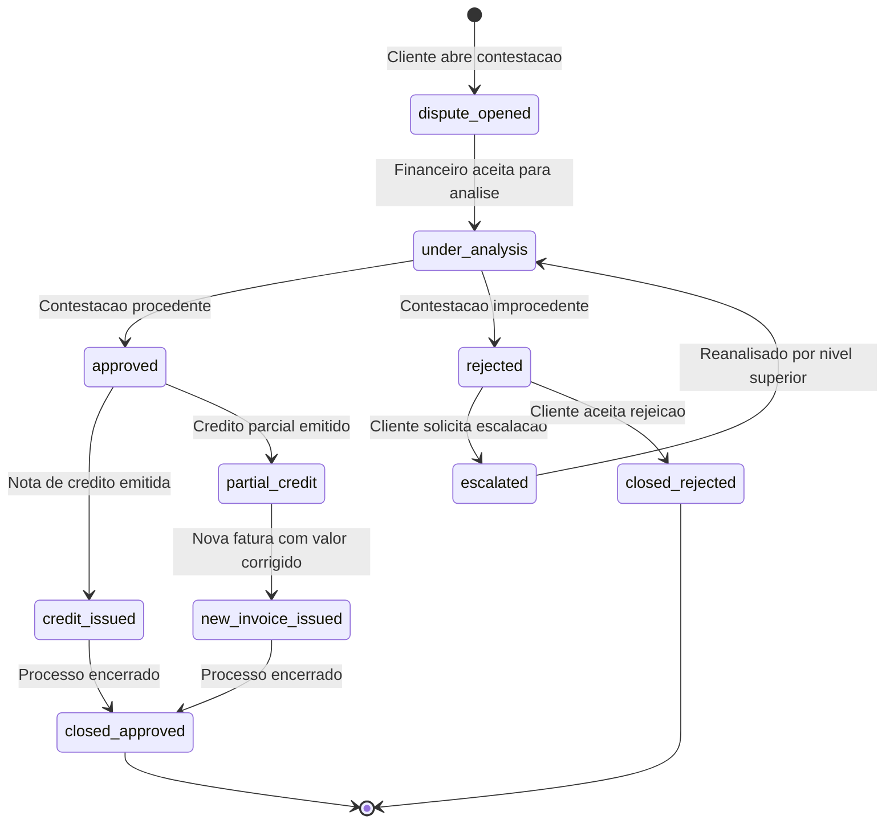
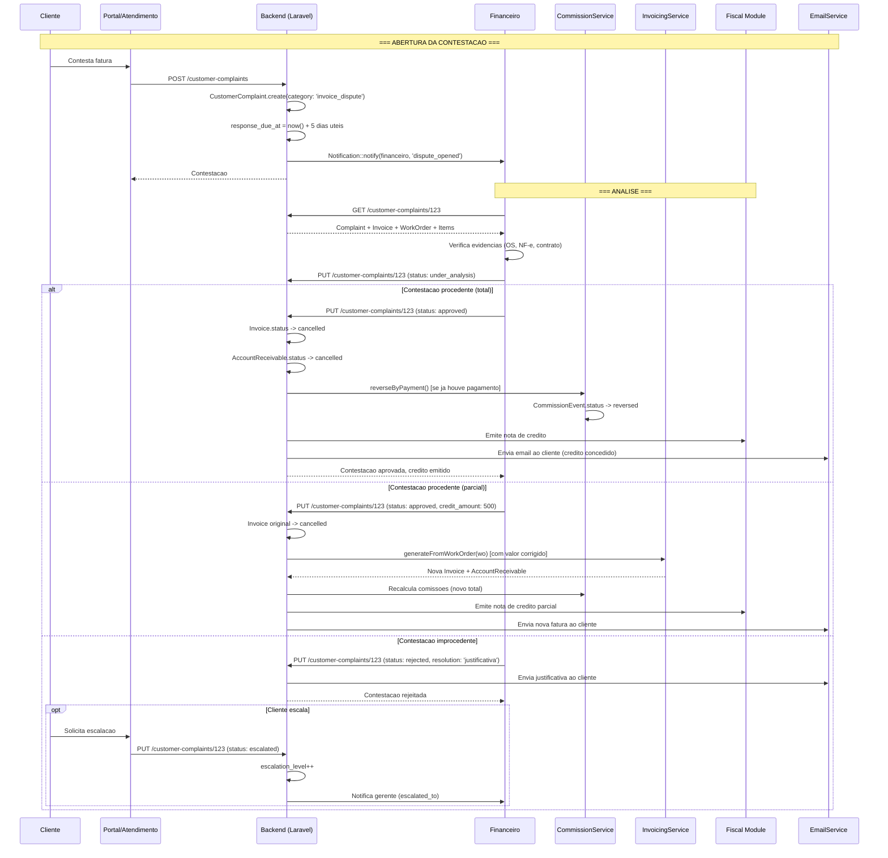

# Fluxo: Contestacao de Fatura

> **[AI_RULE]** Documento gerado por IA com base no codigo real do backend (`InvoicingService`, `CommissionService`, `CustomerComplaint`, `Invoice`, `AccountReceivable`). Specs marcados com [SPEC] indicam funcionalidades planejadas.

## 1. Visao Geral

A contestacao de fatura e o processo pelo qual um cliente questiona uma cobranca emitida pelo sistema. O fluxo envolve abertura da contestacao, analise interna, decisao (aprovacao ou rejeicao), e acoes financeiras decorrentes (nota de credito, estorno de comissao, relancamento).

> **[AI_RULE_CRITICAL]** Toda contestacao DEVE ser registrada como `CustomerComplaint` com `category = 'invoice_dispute'`. Nunca resolver uma contestacao sem registro formal — isso viola compliance e rastreabilidade.

> **[AI_RULE_CRITICAL]** Guard de Concorrencia: O sistema DEVE impedir multiplas contestacoes simultaneas na mesma fatura e limitar a 3 contestacoes por fatura no total (lifetime). Regras:
>
> 1. **Nao pode haver contestacao ABERTA** (status != `closed_approved` e `closed_rejected`) na mesma `invoice_id`
> 2. **Maximo 3 contestacoes lifetime** por fatura (`CustomerComplaint.where(invoice_id, X).count() < 3`)
> 3. Apos 3 contestacoes na mesma fatura: apenas gerente pode abrir nova (via override manual)

### 1.1 Guard: Prevencao de Contestacoes Concorrentes e Limite Lifetime

```php
// InvoiceDisputeService::validateNewDispute(int $invoiceId, int $customerId): void
public function validateNewDispute(int $invoiceId, int $customerId): void
{
    $invoice = Invoice::findOrFail($invoiceId);

    // Guard 1: Verificar contestacao aberta na mesma fatura
    $openDispute = CustomerComplaint::where('invoice_id', $invoiceId)
        ->where('category', 'invoice_dispute')
        ->whereNotIn('status', ['closed_approved', 'closed_rejected'])
        ->first();

    if ($openDispute) {
        throw ValidationException::withMessages([
            'invoice_id' => "Ja existe uma contestacao aberta para esta fatura (#{$openDispute->id}, status: {$openDispute->status}). Aguarde a resolucao antes de abrir nova contestacao."
        ]);
    }

    // Guard 2: Verificar limite lifetime (max 3 por fatura)
    $totalDisputes = CustomerComplaint::where('invoice_id', $invoiceId)
        ->where('category', 'invoice_dispute')
        ->count();

    if ($totalDisputes >= 3) {
        // Verifica se usuario tem permissao de override (gerente)
        $user = auth()->user();
        if (!$user->hasRole(['manager', 'admin', 'super-admin'])) {
            throw ValidationException::withMessages([
                'invoice_id' => "Limite de contestacoes atingido para esta fatura (3/3). Apenas um gerente pode abrir nova contestacao."
            ]);
        }

        // Gerente pode continuar, mas registra no audit log
        AuditLog::record('dispute_limit_override', [
            'invoice_id' => $invoiceId,
            'total_disputes' => $totalDisputes,
            'overridden_by' => $user->id,
        ]);
    }

    // Guard 3: Fatura ja cancelada nao pode ser contestada
    if ($invoice->status === 'cancelled') {
        throw ValidationException::withMessages([
            'invoice_id' => "Fatura ja cancelada. Nao e possivel contestar."
        ]);
    }
}
```

**Integracao no Controller**

```php
// CustomerComplaintController::store()
public function store(CreateDisputeRequest $request)
{
    if ($request->category === 'invoice_dispute' && $request->invoice_id) {
        app(InvoiceDisputeService::class)->validateNewDispute(
            $request->invoice_id,
            $request->customer_id
        );
    }

    // ... restante do fluxo de criacao
}
```

**Cenarios BDD Adicionais**

```gherkin
  Cenario: Bloqueio de contestacao duplicada na mesma fatura
    Dado uma Invoice #INV-0060 com contestacao #CC-200 em status "under_analysis"
    Quando o cliente tenta abrir nova contestacao para #INV-0060
    Entao o sistema retorna erro 422
    E mensagem contem "Ja existe uma contestacao aberta para esta fatura"

  Cenario: Limite de 3 contestacoes por fatura
    Dado uma Invoice #INV-0061 com 3 contestacoes encerradas (closed_approved e closed_rejected)
    Quando o cliente tenta abrir 4a contestacao
    Entao o sistema retorna erro 422
    E mensagem contem "Limite de contestacoes atingido (3/3)"

  Cenario: Gerente pode fazer override do limite
    Dado uma Invoice #INV-0061 com 3 contestacoes encerradas
    Quando o gerente financeiro abre nova contestacao (override)
    Entao a contestacao e criada normalmente
    E o audit log registra "dispute_limit_override"
```

---

## 2. Motivos de Contestacao

| Codigo | Motivo | Descricao |
|--------|--------|-----------|
| `incorrect_value` | Valor incorreto | Cliente alega que o valor cobrado diverge do combinado |
| `duplicate_charge` | Cobranca duplicada | Mesmo servico cobrado mais de uma vez |
| `service_not_delivered` | Servico nao prestado | OS faturada mas servico nao foi executado |
| `quality_issue` | Problema de qualidade | Servico prestado com defeito ou incompleto |
| `contract_disagreement` | Divergencia contratual | Valor nao confere com contrato vigente |
| `wrong_customer` | Cliente errado | Fatura emitida para cliente incorreto |

---

## 3. Maquina de Estados



### 3.1 Status e Transicoes

| Status | Descricao | Proximo |
|--------|-----------|---------|
| `dispute_opened` | Contestacao registrada pelo cliente ou operador | `under_analysis` |
| `under_analysis` | Em analise pelo setor financeiro/qualidade | `approved`, `rejected` |
| `approved` | Contestacao aceita (total ou parcial) | `credit_issued`, `partial_credit` |
| `rejected` | Contestacao negada com justificativa | `escalated`, `closed_rejected` |
| `escalated` | Cliente escalou para nivel gerencial | `under_analysis` |
| `credit_issued` | Nota de credito total emitida | `closed_approved` |
| `partial_credit` | Credito parcial + nova fatura | `new_invoice_issued` |
| `closed_approved` | Encerrado com credito | terminal |
| `closed_rejected` | Encerrado sem credito | terminal |

---

## 4. Pipeline de Contestacao

```
Cliente identifica problema na fatura
  |
  v
Abre contestacao (portal/telefone/email)
  |
  v
CustomerComplaint.create(category: 'invoice_dispute')
  |
  v
Sistema calcula SLA: response_due_at = now() + 5 dias uteis
  |
  v
Notifica financeiro (Notification::notify)
  |
  v
Analista busca evidencias:
  +-- Invoice (items, total, discount)
  +-- WorkOrder (items, technician_notes)
  +-- AccountReceivable (amount, amount_paid)
  +-- FiscalNote (se NF-e ja emitida)
  |
  v
Decisao: aprovada ou rejeitada?
  |
  +-- APROVADA (total):
  |     Invoice.status -> cancelled
  |     AccountReceivable.status -> cancelled
  |     CommissionEvent.status -> reversed
  |     Emite nota de credito (Invoice com total negativo)
  |
  +-- APROVADA (parcial):
  |     Invoice original cancelada
  |     Nova Invoice com valor corrigido
  |     AccountReceivable recalculado
  |     Comissao recalculada (CommissionService)
  |     Delta de credito emitido ao cliente
  |
  +-- REJEITADA:
        Cliente notificado com justificativa
        Opcao de escalar (escalated)
```

---

## 5. Modelo de Dados

### 5.1 CustomerComplaint (existente)

```php
// backend/app/Models/CustomerComplaint.php
CustomerComplaint {
    tenant_id, customer_id, work_order_id, equipment_id,
    description,           // Descricao detalhada da contestacao
    category,              // 'invoice_dispute'
    severity,              // 'low', 'medium', 'high', 'critical'
    status,                // dispute_opened -> under_analysis -> ...
    resolution,            // Texto da resolucao
    assigned_to,           // Analista financeiro responsavel
    resolved_at,           // Data de resolucao
    response_due_at,       // SLA: 5 dias uteis
    responded_at,          // Quando foi respondida
}

// Relacionamentos:
customer()    -> Customer
workOrder()   -> WorkOrder
equipment()   -> Equipment
assignedTo()  -> User
correctiveActions() -> CorrectiveAction (CAPA)
```

### 5.2 Campos Adicionais Necessarios [SPEC]

| Campo | Tipo | Descricao |
|-------|------|-----------|
| `invoice_id` | FK | Fatura contestada |
| `dispute_reason` | string | Codigo do motivo (tabela secao 2) |
| `disputed_amount` | decimal | Valor contestado |
| `credit_amount` | decimal | Valor do credito concedido |
| `credit_invoice_id` | FK | Invoice de credito gerada |
| `escalation_level` | int | Nivel de escalacao (0, 1, 2) |
| `escalated_to` | FK | Gerente que recebeu escalacao |

### Campos Adicionais em customer_complaints
| Campo | Tipo | Descrição |
|-------|------|-----------|
| resolution_type | enum('credit_note','discount','replacement','no_action') nullable | Tipo de resolução |
| credit_note_id | bigint unsigned nullable | FK credit_notes (se emitida) |
| financial_impact | decimal(15,2) default 0 | Impacto financeiro da contestação |
| days_to_resolve | integer nullable | Dias entre abertura e resolução (calculado) |
| reopened_at | timestamp nullable | Se reaberta, quando |
| reopen_reason | text nullable | Motivo da reabertura |
| customer_satisfaction | enum('satisfied','neutral','unsatisfied') nullable | Satisfação após resolução |

### Portal Endpoint
- `POST /api/v1/portal/complaints` — Cliente submete contestação (PortalComplaintController@store)
- **Auth:** Token do portal do cliente
- **FormRequest:** `StorePortalComplaintRequest` (invoice_id required, reason required, description required, attachments optional)

### Dashboard Endpoint
- `GET /api/v1/complaints/dashboard` — ComplaintDashboardController@index
- **Response:** total_open, total_resolved, avg_days_to_resolve, by_resolution_type, by_month, financial_impact_total

### Lógica de Credit Note
- **Trigger:** Quando complaint aprovada com `resolution_type = 'credit_note'`
- **Service:** `CreditNoteService::createFromComplaint(Complaint $complaint): CreditNote`
- **Contabilidade:** Débito em `Devoluções/Abatimentos`, Crédito em `Contas a Receber`
- **Fiscal:** Gerar NF de devolução/desconto via `FiscalService::generateCreditNote()`

### 5.3 Invoice (existente)

```php
// backend/app/Models/Invoice.php
Invoice {
    STATUS_DRAFT     = 'draft',
    STATUS_ISSUED    = 'issued',
    STATUS_SENT      = 'sent',
    STATUS_CANCELLED = 'cancelled',

    // Campos relevantes para contestacao:
    invoice_number,   // Identificador unico por tenant
    total,            // Valor total da fatura
    discount,         // Desconto aplicado
    items,            // JSON com itens (description, quantity, unit_price, total, type)
    work_order_id,    // OS relacionada
    customer_id,      // Cliente
}
```

---

## 6. Diagrama de Sequencia



---

## 7. Regras de Negocio

### 7.1 SLA de Resolucao

| Metrica | Valor | Descricao |
|---------|-------|-----------|
| Prazo de resposta | 5 dias uteis | `response_due_at` calculado excluindo fins de semana e feriados (`HolidayService`) |
| Prazo de escalacao | 3 dias uteis apos rejeicao | Cliente pode escalar ate 3 dias apos notificacao |
| Niveis de escalacao | 3 | Analista -> Coordenador -> Gerente |
| SLA estourado | Alerta critico | `SlaEscalationService` monitora `response_due_at` |

### 7.2 Impacto no Financeiro

> **[AI_RULE_CRITICAL]** Ao aprovar contestacao, o sistema DEVE executar TODAS as reversoes em uma unica transacao (DB::transaction). Nunca cancelar a fatura sem reverter comissoes e recebiveis.

```php
// Sequencia obrigatoria dentro de DB::transaction:
// 1. Invoice::cancel()
// 2. AccountReceivable::cancel() (todos vinculados)
// 3. CommissionService::reverseByPayment() (se aplicavel)
// 4. Gerar nota de credito (se NF-e ja emitida)
// 5. Se parcial: InvoicingService::generateFromWorkOrder() com novo total
```

### 7.3 Impacto nas Comissoes

O `CommissionService` ja possui logica de estorno:

```php
// CommissionService::reverseByPayment($ar, $payment)
// - Se comissao esta APPROVED: reverte para PENDING ou cria evento REVERSED
// - Se comissao esta PAID: bloqueia estorno (422)
//   "Nao e possivel estornar pagamento com comissao ja liquidada."
```

Para contestacao com comissao ja PAID:

1. Gerar `Expense` de estorno manual
2. Registrar no `CommissionEvent` com status `reversed` e nota explicativa
3. Descontar da proxima folha de comissoes

### 7.4 Nota de Credito

```php
// Nota de credito = Invoice com total negativo
Invoice::create([
    'total'          => -$creditAmount,
    'invoice_number' => Invoice::nextNumber($tenantId), // prefixo NC-
    'status'         => 'issued',
    'observations'   => "Credito ref. contestacao #CC-{$complaintId}",
    'work_order_id'  => $originalInvoice->work_order_id,
    'customer_id'    => $originalInvoice->customer_id,
]);
```

---

## 8. Dashboard de Contestacoes

### 8.1 Metricas Principais

| Metrica | Query Base |
|---------|-----------|
| Contestacoes abertas | `CustomerComplaint::where('category', 'invoice_dispute')->whereNotIn('status', ['closed_approved', 'closed_rejected'])->count()` |
| Taxa de resolucao | `(fechadas / total) * 100` |
| Tempo medio de resolucao | `AVG(resolved_at - created_at)` em dias |
| Taxa de aprovacao | `(aprovadas / decididas) * 100` |
| Valor total contestado | `SUM(disputed_amount)` |
| Valor total creditado | `SUM(credit_amount)` |
| SLA cumprido | `(respondidas_no_prazo / total) * 100` |

### 8.2 Agrupamentos

| Dimensao | Descricao |
|----------|-----------|
| Por motivo | `GROUP BY dispute_reason` |
| Por cliente | Identifica clientes recorrentes |
| Por tecnico | OS cujo tecnico gera mais contestacoes |
| Por periodo | Tendencia mensal |

---

## 9. Cenarios BDD

### Cenario 1: Contestacao total aprovada

```gherkin
Funcionalidade: Contestacao de Fatura

  Cenario: Cliente contesta fatura por servico nao prestado
    Dado uma Invoice #INV-0042 com total R$ 2.500 e status "issued"
    E um AccountReceivable vinculado com status "pending"
    E um CommissionEvent do tecnico com R$ 125 (pending)
    Quando o cliente abre contestacao com motivo "service_not_delivered"
    E o financeiro aprova a contestacao
    Entao a Invoice #INV-0042 muda para status "cancelled"
    E o AccountReceivable muda para status "cancelled"
    E o CommissionEvent muda para status "reversed"
    E uma nota de credito de R$ 2.500 e emitida
    E o cliente recebe email com a nota de credito
```

### Cenario 2: Contestacao parcial

```gherkin
  Cenario: Cliente contesta valor parcial da fatura
    Dado uma Invoice #INV-0043 com total R$ 5.000
    E 3 AccountReceivables de R$ 1.666,67 cada
    Quando o cliente contesta R$ 1.000 (peca cobrada a mais)
    E o financeiro aprova credito parcial de R$ 1.000
    Entao a Invoice original e cancelada
    E uma nova Invoice de R$ 4.000 e criada
    E novos AccountReceivables sao gerados (R$ 4.000 total)
    E as comissoes sao recalculadas sobre R$ 4.000
    E uma nota de credito de R$ 1.000 e emitida
```

### Cenario 3: Contestacao rejeitada com escalacao

```gherkin
  Cenario: Cliente nao aceita rejeicao e escala
    Dado uma contestacao #CC-123 com status "rejected"
    E justificativa "Valor confere com orcamento aprovado OS-789"
    Quando o cliente solicita escalacao dentro de 3 dias uteis
    Entao a contestacao muda para status "escalated"
    E o escalation_level incrementa para 1
    E o gerente financeiro e notificado
    E a contestacao volta para "under_analysis"
```

### Cenario 4: SLA estourado

```gherkin
  Cenario: Contestacao nao respondida no prazo
    Dado uma contestacao #CC-456 com response_due_at = ontem
    E status "under_analysis"
    Quando o SlaEscalationService roda a verificacao
    Entao um SystemAlert e criado com severity "critical"
    E o supervisor financeiro e notificado
```

### Cenario 5: Contestacao com comissao ja paga

```gherkin
  Cenario: Estorno bloqueado por comissao liquidada
    Dado uma Invoice #INV-0050 com total R$ 3.000
    E um CommissionEvent com status "paid" (ja liquidado na folha)
    Quando o financeiro tenta aprovar a contestacao
    Entao o sistema alerta que a comissao ja foi liquidada
    E exige criacao de Expense de estorno manual
    E registra nota no CommissionEvent
```

### Cenario 6: Cobranca duplicada detectada

```gherkin
  Cenario: Sistema detecta cobranca duplicada
    Dado duas Invoices para a mesma OS #WO-100
    E ambas com status "issued"
    Quando o cliente abre contestacao por "duplicate_charge"
    E o financeiro confirma a duplicidade
    Entao a Invoice duplicada e cancelada
    E o AccountReceivable duplicado e cancelado
    E nenhuma comissao adicional e revertida (ja era duplicata)
```

### Cenario 7: Contestacao via portal do cliente

```gherkin
  Cenario: Cliente abre contestacao pelo portal
    Dado um ClientPortalUser autenticado
    Quando acessa GET /portal/invoices e visualiza a fatura
    E clica em "Contestar" informando motivo e descricao
    Entao POST /portal/disputes cria CustomerComplaint
    E response_due_at e calculado (5 dias uteis)
    E o financeiro e notificado via WebPush e email
```

---

## 10. Integracao com Modulos Existentes

| Modulo | Integracao |
|--------|-----------|
| **Financeiro** | Invoice, AccountReceivable, Payment — cancelamento e recriacao |
| **Comissoes** | CommissionService — estorno via `reverseByPayment()` |
| **Fiscal** | FiscalModule — nota de credito, cancelamento de NF-e |
| **Portal** | ClientPortalUser — abertura de contestacao |
| **Qualidade** | CustomerComplaint, CorrectiveAction — rastreabilidade |
| **CAPA** | CapaRecord — acao corretiva se contestacao recorrente |
| **SLA** | SlaEscalationService — monitoramento de prazo |
| **Notificacoes** | Notification::notify, WebPushService, EmailService |

---

## 11. Gaps e Melhorias Futuras

| # | Gap | Status |
|---|-----|--------|
| 1 | Campo `invoice_id` na `CustomerComplaint` | [SPEC] Migration: `ALTER TABLE customer_complaints ADD invoice_id BIGINT NULL, ADD FOREIGN KEY (invoice_id) REFERENCES invoices(id)` |
| 2 | Campos `dispute_reason`, `disputed_amount`, `credit_amount` | [SPEC] Migration: 3 colunas na `customer_complaints` — varchar(50), decimal(15,2), decimal(15,2) |
| 3 | Nota de credito automatizada (Invoice negativa) | [SPEC] Secao 7.4 acima — `Invoice::create(['total' => -$creditAmount])` com prefixo NC- |
| 4 | Endpoint `POST /portal/disputes` no portal do cliente | [SPEC] Guard `client-portal`, cria `CustomerComplaint` com `category=invoice_dispute`, calcula SLA 5 dias |
| 5 | Dashboard de contestacoes no frontend | [SPEC] React component com metricas da secao 8.1 — abertas, taxa resolucao, tempo medio, valor contestado |
| 6 | Deteccao automatica de cobranca duplicada | [SPEC] Query: `Invoice::where('work_order_id', $woId)->where('status', 'issued')->count() > 1` — alerta automatico |
| 7 | Workflow automatizado de escalacao por tempo | [SPEC] Job cron: contestacoes `under_analysis` com `response_due_at < now()` → auto-escalar para nivel superior |
| 8 | Relatorio mensal de contestacoes por motivo | [SPEC] `GROUP BY dispute_reason, MONTH(created_at)` — integrar em RELATORIOS-GERENCIAIS |

---

> **[AI_RULE]** Este documento reflete o estado real de `CustomerComplaint.php`, `Invoice.php`, `InvoicingService.php`, `CommissionService.php`, `SlaEscalationService.php`. Specs marcados com [SPEC] indicam funcionalidades planejadas.

---

## Módulos Envolvidos

| Módulo | Responsabilidade no Fluxo |
|--------|---------------------------|
| [Finance](file:///c:/PROJETOS/sistema/docs/modules/Finance.md) | Gestão de faturas, créditos e estornos |
| [Portal](file:///c:/PROJETOS/sistema/docs/modules/Portal.md) | Interface do cliente para abertura de contestação |
| [Email](file:///c:/PROJETOS/sistema/docs/modules/Email.md) | Notificações de andamento da contestação |
| [Fiscal](file:///c:/PROJETOS/sistema/docs/modules/Fiscal.md) | Carta de correção ou nota de crédito quando aplicável |
| [Quality](file:///c:/PROJETOS/sistema/docs/modules/Quality.md) | Registro de não-conformidade quando procedente |
