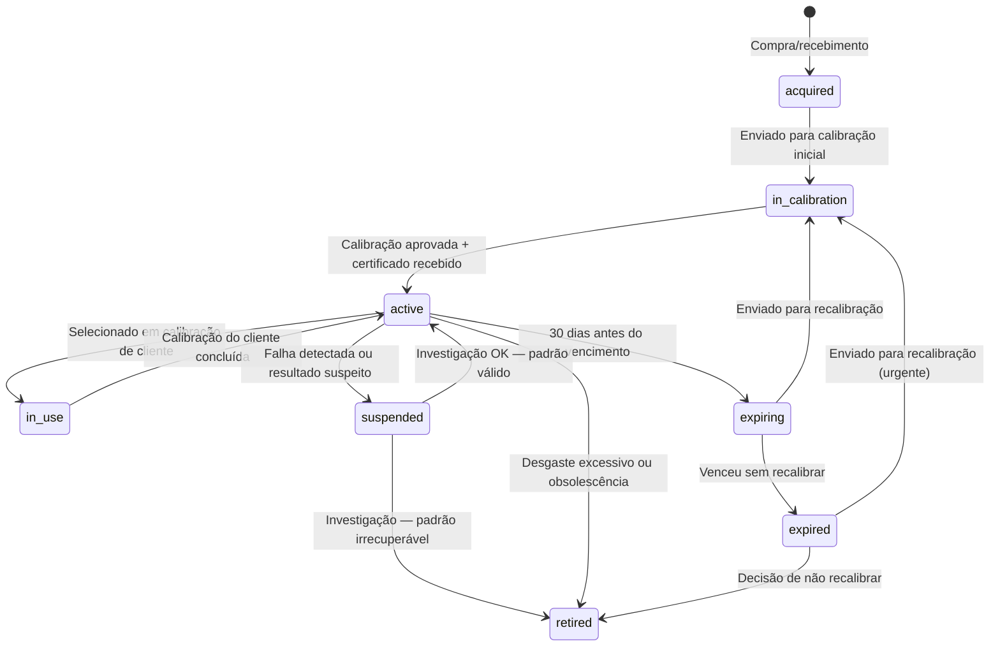

# Fluxo — Controle de Padrões de Referência

> **Princípio:** Padrão de referência é a BASE de toda calibração. Se o padrão está vencido, com falha, ou sem rastreabilidade — TODA calibração feita com ele pode ser invalidada. O sistema controla o lifecycle completo com bloqueios automáticos.

---

## 1. Visão Geral do Lifecycle

```
┌────────────────────────────────────────────────────────────────────┐
│              CICLO DE VIDA DO PADRÃO DE REFERÊNCIA                 │
│                                                                    │
│  Aquisição  →  Calibração  →  Ativo  →  Uso em  →  Vencimento    │
│  (compra)      inicial        (válido)  calibrações  da calibração│
│                                                                    │
│                    ↓                         ↓                     │
│              Recalibração  ←─────────  Alerta 30/15/7/1 dias      │
│                    ↓                                               │
│              Ativo novamente                                       │
│                                                                    │
│  ── Fluxos excepcionais ──                                        │
│                                                                    │
│  Falha detectada → Suspensão → Cascade (certificados afetados)    │
│  Desgaste excessivo → Aposentadoria                               │
│  Fora de serviço → Quarentena → Investigação                      │
└────────────────────────────────────────────────────────────────────┘
```

### Máquina de Estados



---

## 2. Dados do Padrão de Referência (StandardWeight)

### 2.1 Campos Obrigatórios

| Campo | Tipo | Descrição | ISO 17025 |
|-------|------|-----------|-----------|
| `id` | bigint | PK | — |
| `tenant_id` | bigint | FK tenants | — |
| `code` | varchar(50) | Código interno (ex: PW-001) | §6.4.9 |
| `serial_number` | varchar(100) | Número de série do fabricante | §6.4.9 |
| `nominal_value` | decimal(20,10) | Valor nominal (ex: 1.000000 kg) | §6.4 |
| `unit` | varchar(20) | Unidade (kg, g, mg, N, etc.) | §6.4 |
| `precision_class` | varchar(20) | Classe OIML R111 (E1, E2, F1, F2, M1...) | §6.4 |
| `manufacturer` | varchar(255) | Fabricante | §6.4 |
| `material` | varchar(100) | Material (aço inox, latão, etc.) | §6.5 |
| `density` | decimal(10,4) | Densidade do material (kg/m³) | §6.5 (empuxo) |
| `shape` | varchar(50) | Formato (cilíndrico, retangular, etc.) | — |
| `status` | enum | active/expired/in_calibration/suspended/retired/acquired | §6.4 |

### 2.2 Campos de Rastreabilidade (ISO 17025 §6.5)

| Campo | Tipo | Descrição | Obrigatório |
|-------|------|-----------|-------------|
| `certificate_number` | varchar(100) | Nº do certificado de calibração do padrão | Sim |
| `certificate_file` | varchar(500) | Path do PDF do certificado | Sim |
| `certificate_date` | date | Data da calibração do padrão | Sim |
| `certificate_expiry` | date | Vencimento da calibração | Sim |
| `traceability_lab` | varchar(255) | Laboratório que calibrou (nome completo) | Sim |
| `traceability_lab_accreditation` | varchar(100) | Nº acreditação RBC/Cgcre do lab | Sim |
| `traceability_certificate` | varchar(255) | Referência ao certificado do lab acreditado | Sim |
| `is_accredited_lab` | boolean | Se o lab calibrador é acreditado RBC/Cgcre | Sim |
| `conventional_mass_value` | decimal(20,10) | Valor convencional de massa (mc) | Sim |
| `uncertainty` | decimal(20,10) | Incerteza expandida do padrão | Sim |
| `coverage_factor` | decimal(5,2) | Fator k do certificado do padrão | Sim |
| `max_permissible_error` | decimal(20,10) | EMA conforme classe OIML R111 | Sim |

### 2.3 Campos de Gestão

| Campo | Tipo | Descrição |
|-------|------|-----------|
| `acquisition_date` | date | Data de aquisição |
| `acquisition_cost` | decimal(12,2) | Custo de aquisição |
| `location` | varchar(255) | Localização física (sala, armário) |
| `custodian_user_id` | bigint FK | Responsável pela custódia |
| `wear_rate_percentage` | decimal(5,2) | Taxa de desgaste anual estimada |
| `expected_failure_date` | date | Data estimada de fim de vida útil |
| `retirement_date` | date | Data de aposentadoria (se aplicável) |
| `retirement_reason` | text | Motivo da aposentadoria |
| `notes` | text | Observações gerais |

---

## 3. Alertas de Vencimento

### 3.1 Cronograma de Alertas

| Dias antes do vencimento | Tipo de alerta | Destinatário | Ação |
|--------------------------|---------------|--------------|------|
| 30 dias | 📧 Email + 🔔 Push | Custodian + Lab Manager | Informativo: "Padrão PW-001 vence em 30 dias" |
| 15 dias | 📧 Email + 🔔 Push + ⚠️ Dashboard | Custodian + Lab Manager + Admin | Alerta: "Agendar recalibração urgente" |
| 7 dias | 📧 Email + 🔔 Push + 🔴 Dashboard | Todos acima + Gerente Técnico | Urgente: "Padrão vence em 7 dias — bloquear uso se não recalibrar" |
| 1 dia | 📧 Email + 🔔 Push + 🔴 Banner | Todos acima | Crítico: "Último dia de validade" |
| 0 (venceu) | 📧 Email + 🔔 Push + 🚫 Bloqueio | Todos + Sistema | **BLOQUEIO AUTOMÁTICO: Padrão marcado como `expired`, impossível usar** |

### 3.2 Cron Job

```php
// App\Console\Commands\CheckStandardWeightExpiry
// Execução: daily via schedule:run

public function handle(): void
{
    $thresholds = [30, 15, 7, 1, 0];

    foreach ($thresholds as $days) {
        $standards = StandardWeight::where('status', 'active')
            ->whereDate('certificate_expiry', now()->addDays($days)->toDateString())
            ->get();

        foreach ($standards as $standard) {
            if ($days === 0) {
                $standard->update(['status' => 'expired']);
            }
            StandardWeightExpiryNotification::dispatch($standard, $days);
        }
    }
}
```

---

## 4. Bloqueio Hard — Padrão Vencido

### 4.1 Regra

> **INVIOLÁVEL:** Padrão com `status != active` ou `certificate_expiry < today` **NÃO PODE** ser selecionado para uso em calibração.

### 4.2 Pontos de Bloqueio

| Ponto | Verificação | Ação |
|-------|-------------|------|
| Wizard Step 1 (Pre-flight) | `PreFlightCheckService` verifica validade de todos os padrões disponíveis | ❌ se nenhum padrão válido disponível |
| Wizard Step 3 (Seleção) | Frontend filtra padrões com `status = active` e `certificate_expiry > today` | Padrão vencido aparece cinza/desabilitado |
| Backend (API) | `CalibrationWizardService::validateStandardWeights()` | Lança `ExpiredStandardException` se padrão vencido for selecionado |
| Certificado (geração) | `CalibrationCertificateService::generate()` | Revalida padrões antes de gerar PDF |

### 4.3 Service

```php
// App\Services\Lab\StandardWeightLifecycleService

public function checkValidity(StandardWeight $weight): ValidationResult
{
    if ($weight->status === 'expired') {
        return ValidationResult::fail("Padrão {$weight->code} está VENCIDO desde {$weight->certificate_expiry}");
    }
    if ($weight->status === 'suspended') {
        return ValidationResult::fail("Padrão {$weight->code} está SUSPENSO — investigação em andamento");
    }
    if ($weight->status !== 'active') {
        return ValidationResult::fail("Padrão {$weight->code} não está ativo (status: {$weight->status})");
    }
    if ($weight->certificate_expiry->isPast()) {
        $weight->update(['status' => 'expired']);
        return ValidationResult::fail("Padrão {$weight->code} acabou de vencer");
    }
    if ($weight->certificate_expiry->diffInDays(now()) <= 7) {
        return ValidationResult::warn("Padrão {$weight->code} vence em {$weight->certificate_expiry->diffInDays(now())} dias");
    }
    return ValidationResult::pass();
}
```

---

## 5. Registro de Uso (Usage Log)

### 5.1 Tabela: `standard_weight_usage_logs`

| Campo | Tipo | Descrição |
|-------|------|-----------|
| `id` | bigint | PK |
| `tenant_id` | bigint FK | Tenant |
| `standard_weight_id` | bigint FK | Padrão usado |
| `equipment_calibration_id` | bigint FK | Calibração onde foi usado |
| `used_at` | timestamp | Data/hora do uso |
| `used_by_user_id` | bigint FK | Técnico que usou |
| `temperature` | decimal(5,2) | Temperatura no momento do uso |
| `humidity` | decimal(5,2) | Umidade no momento |
| `pressure` | decimal(7,2) | Pressão no momento |

### 5.2 Rastreabilidade Reversa

> **Pergunta crítica:** "Quais calibrações foram feitas com o padrão PW-001 entre Jan e Mar/2026?"

```php
$usages = StandardWeightUsageLog::where('standard_weight_id', $weight->id)
    ->whereBetween('used_at', [$startDate, $endDate])
    ->with('equipmentCalibration.equipment.customer')
    ->get();
```

Esta query é fundamental para o **cascade de falha** (seção 6).

---

## 6. Cascade de Falha de Padrão

### 6.1 Cenário

> O laboratório descobre que o padrão PW-001 apresentou falha (ex: vistoria detectou corrosão, recalibração mostrou desvio fora da tolerância, dano durante uso).

### 6.2 Fluxo de Cascade

```
1. DETECÇÃO
   ├── Técnico registra falha no sistema
   ├── Padrão → status: `suspended`
   └── Motivo e data da detecção registrados

2. IDENTIFICAÇÃO DO PERÍODO DE RISCO
   ├── Data da última calibração válida do padrão
   ├── Data da detecção da falha
   └── Período de risco = [última calibração ... detecção]

3. RASTREABILIDADE REVERSA
   ├── Buscar TODOS os usage_logs no período de risco
   ├── Identificar TODAS as calibrações afetadas
   └── Listar TODOS os certificados emitidos com este padrão

4. SUSPENSÃO DE CERTIFICADOS
   ├── Para cada certificado identificado:
   │   ├── Status → `suspended`
   │   ├── Motivo: "Padrão {código} com falha detectada em {data}"
   │   └── Audit log registrado
   └── Contagem total de certificados afetados

5. NOTIFICAÇÃO AOS CLIENTES
   ├── Para cada cliente afetado:
   │   ├── Email: "Certificado CERT-XXXX suspenso para investigação"
   │   ├── Portal: status atualizado em tempo real
   │   └── Template com: nº certificado, motivo, próximos passos
   └── Log de notificações enviadas

6. CAPA (Ação Corretiva)
   ├── QualityCorrectiveAction criado automaticamente
   ├── Tipo: corrective
   ├── Prioridade: critical
   ├── Root cause analysis obrigatória (5 Porquês)
   └── Deadline: configurável (padrão 15 dias)

7. INVESTIGAÇÃO E RESOLUÇÃO
   ├── Se padrão recuperável:
   │   ├── Enviar para recalibração
   │   ├── Avaliar impacto nos certificados
   │   ├── Se impacto dentro da tolerância → restaurar certificados
   │   └── Se impacto fora da tolerância → cancelar + recalibrar grátis
   ├── Se padrão irrecuperável:
   │   ├── Padrão → `retired`
   │   ├── Cancelar todos os certificados afetados
   │   ├── Agendar recalibrações gratuitas para clientes
   │   └── Registrar lições aprendidas na CAPA
   └── Resolver CAPA com ações preventivas

8. RESOLUÇÃO DOS CERTIFICADOS
   ├── Certificados válidos → restaurar para `issued`
   ├── Certificados inválidos → `cancelled` + nova emissão
   └── Comunicar resolução aos clientes
```

### 6.3 Service

```php
// App\Services\Lab\StandardWeightLifecycleService

public function suspend(StandardWeight $weight, string $reason, Carbon $detectionDate): SuspensionResult
{
    // 1. Suspender o padrão
    $weight->update(['status' => 'suspended']);

    // 2. Identificar período de risco
    $riskStart = $weight->certificate_date; // última calibração válida
    $riskEnd = $detectionDate;

    // 3. Buscar certificados afetados
    $affectedCalibrations = $weight->usageLogs()
        ->whereBetween('used_at', [$riskStart, $riskEnd])
        ->with('equipmentCalibration')
        ->get()
        ->pluck('equipmentCalibration')
        ->unique('id');

    // 4. Suspender certificados
    foreach ($affectedCalibrations as $calibration) {
        $calibration->update(['status' => 'suspended']);
        CertificateSuspendedNotification::dispatch($calibration, $reason);
    }

    // 5. Criar CAPA
    $capa = QualityCorrectiveAction::create([
        'tenant_id' => $weight->tenant_id,
        'type' => 'corrective',
        'title' => "Falha no padrão {$weight->code}",
        'description' => $reason,
        'priority' => 'critical',
        'status' => 'draft',
        'deadline' => now()->addDays(15),
    ]);

    return new SuspensionResult(
        standardWeight: $weight,
        affectedCalibrations: $affectedCalibrations,
        capa: $capa,
        riskPeriod: [$riskStart, $riskEnd],
    );
}
```

---

## 7. Cadeia de Rastreabilidade Metrológica

### 7.1 Hierarquia

```
BIPM (Bureau International des Poids et Mesures)
    ↓
INMETRO (Instituto Nacional de Metrologia — Brasil)
    ↓
Laboratório Acreditado RBC/Cgcre (CRL-XXXX)
    ↓ (calibra os padrões de referência do lab)
Padrão de Referência do Laboratório (StandardWeight)
    ↓ (usado para calibrar equipamentos dos clientes)
Equipamento do Cliente (Equipment → EquipmentCalibration)
    ↓
Certificado de Calibração emitido
```

### 7.2 Verificação no Sistema

Para cada padrão, o sistema exibe e valida:

| Nível | Dado | Validação |
|-------|------|-----------|
| Lab que calibrou o padrão | `traceability_lab` | Não vazio |
| Acreditação do lab | `traceability_lab_accreditation` | Formato CRL-XXXX ou equivalente |
| É acreditado RBC/Cgcre? | `is_accredited_lab` | true para rastreabilidade completa |
| Certificado do padrão | `certificate_number` + `certificate_file` | Não vazio + PDF anexado |
| Validade | `certificate_expiry > today` | Bloqueio se vencido |
| Incerteza do padrão | `uncertainty` + `coverage_factor` | Não nulo, usado no cálculo GUM |

### 7.3 Exibição na Tela

```
🔗 Cadeia de Rastreabilidade — Peso PW-001 (1kg E2)
├── ✅ Certificado: CERT-LAB-2025-789
├── ✅ Laboratório: Laboratório ABC Metrologia Ltda.
├── ✅ Acreditação RBC: CRL-0123 (Cgcre/INMETRO)
├── ✅ Validade: 15/09/2026 (173 dias restantes)
├── ✅ Incerteza: ±0.030 mg (k=2, 95.45%)
└── ✅ Rastreável a: INMETRO → BIPM
```

---

## 8. Dashboard de Gestão de Padrões

### 8.1 Indicadores

| KPI | Cálculo | Alerta |
|-----|---------|--------|
| Padrões ativos | `COUNT(status = active)` | — |
| Vencendo em 30 dias | `COUNT(certificate_expiry BETWEEN today AND +30d)` | 🟡 se > 0 |
| Vencidos | `COUNT(status = expired)` | 🔴 se > 0 |
| Suspensos | `COUNT(status = suspended)` | 🔴 se > 0 |
| Em calibração | `COUNT(status = in_calibration)` | 🟡 se > 30 dias |
| Aposentados | `COUNT(status = retired)` | — |
| Uso nos últimos 30 dias | `COUNT(usage_logs WHERE used_at > -30d)` | — |
| Custo total em padrões ativos | `SUM(acquisition_cost WHERE status = active)` | — |

### 8.2 Timeline de Uso por Padrão

```
PW-001 — Peso 1kg E2
├── 2026-03-25: Usado em CERT-2026-0456 (Cliente: ABC Indústria)
├── 2026-03-20: Usado em CERT-2026-0449 (Cliente: XYZ Ltda.)
├── 2026-03-15: Usado em CERT-2026-0441 (Cliente: DEF S.A.)
├── 2026-02-28: Recalibrado — Cert LAB-2026-789 (Lab ABC)
└── 2025-09-15: Calibração anterior — Cert LAB-2025-456 (Lab ABC)
```

---

## 9. Frontend — Tela de Gestão

### 9.1 Páginas

| Página | Rota | Funcionalidade |
|--------|------|----------------|
| Lista de Padrões | `/lab/standards` | CRUD, filtros por status/classe/validade |
| Detalhe do Padrão | `/lab/standards/{id}` | Ficha completa, timeline, rastreabilidade |
| Dashboard | `/lab/standards/dashboard` | KPIs, calendário de vencimentos |
| Registrar Falha | `/lab/standards/{id}/failure` | Form de suspensão + cascade |

### 9.2 API Endpoints

| Método | Rota | Descrição |
|--------|------|-----------|
| GET | `/api/v1/lab/standards` | Listar padrões (filtros: status, class, expiry) |
| POST | `/api/v1/lab/standards` | Criar novo padrão |
| GET | `/api/v1/lab/standards/{id}` | Detalhes com rastreabilidade |
| PUT | `/api/v1/lab/standards/{id}` | Atualizar dados |
| POST | `/api/v1/lab/standards/{id}/suspend` | Suspender + cascade |
| POST | `/api/v1/lab/standards/{id}/retire` | Aposentar |
| POST | `/api/v1/lab/standards/{id}/send-to-calibration` | Enviar para recalibração |
| POST | `/api/v1/lab/standards/{id}/receive-calibration` | Receber de volta com novo cert |
| GET | `/api/v1/lab/standards/{id}/usage-log` | Histórico de uso |
| GET | `/api/v1/lab/standards/{id}/traceability` | Cadeia de rastreabilidade |
| GET | `/api/v1/lab/standards/dashboard` | KPIs e alertas |
| GET | `/api/v1/lab/standards/expiring` | Padrões vencendo em N dias |

---

## 10. Testes Obrigatórios

| Teste | Cenário | Expectativa |
|-------|---------|-------------|
| `StandardWeightLifecycleTest::test_active_weight_can_be_used` | Padrão ativo, válido | Pode ser selecionado |
| `StandardWeightLifecycleTest::test_expired_weight_blocked` | Padrão com `certificate_expiry < today` | **BLOQUEIO** — não pode selecionar |
| `StandardWeightLifecycleTest::test_suspended_weight_blocked` | Padrão suspenso | **BLOQUEIO** |
| `StandardWeightLifecycleTest::test_cascade_suspends_certificates` | Suspender padrão → certificados afetados suspensos | Todos certificados no período de risco → `suspended` |
| `StandardWeightLifecycleTest::test_cascade_notifies_customers` | Cascade → notificações | Cada cliente afetado recebe notification |
| `StandardWeightLifecycleTest::test_cascade_creates_capa` | Cascade → CAPA | `QualityCorrectiveAction` criado com prioridade critical |
| `StandardWeightLifecycleTest::test_expiry_alerts_30_15_7_1` | Padrão próximo do vencimento | Alertas enviados nos thresholds corretos |
| `StandardWeightLifecycleTest::test_auto_expire_on_due_date` | Padrão chega na data de vencimento | Status auto-atualiza para `expired` |
| `StandardWeightLifecycleTest::test_traceability_chain_valid` | Padrão com todos campos de rastreabilidade | Cadeia completa até lab acreditado |
| `StandardWeightLifecycleTest::test_traceability_chain_incomplete` | Padrão sem `traceability_lab_accreditation` | Warning: rastreabilidade incompleta |
| `StandardWeightLifecycleTest::test_usage_log_created` | Usar padrão em calibração | Log criado com condições ambientais |
| `StandardWeightLifecycleTest::test_reverse_traceability` | Consultar calibrações por padrão/período | Retorna lista correta |

---

> **Este fluxo garante conformidade com ISO 17025 §6.4 e §6.5. Nenhum padrão vencido ou suspenso pode ser utilizado. Falhas são rastreadas até cada certificado afetado, com notificação automática e CAPA obrigatória.**
