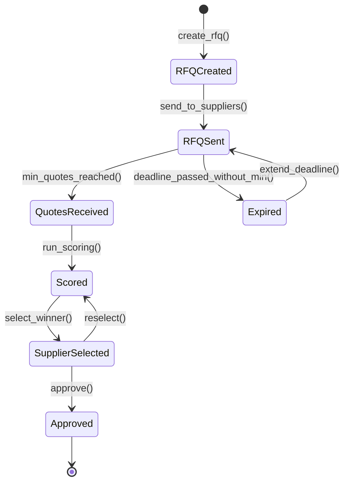

# Fluxo: Cotacao de Fornecedores

> Ciclo de cotacao: desde a solicitacao ate a selecao do fornecedor vencedor via scoring automatico e aprovacao.

---

## 1. Narrativa do Processo

1. **Solicitacao**: Comprador cria solicitacao de cotacao (RFQ) com itens, especificacoes e prazo de resposta.
2. **Envio**: RFQ enviada a fornecedores cadastrados da categoria. Minimo conforme alcada.
3. **Recebimento**: Fornecedores submetem propostas com precos, prazos e condicoes.
4. **Scoring**: Sistema calcula score automatico: preco (40%), qualidade (30%), prazo (20%), historico (10%).
5. **Selecao**: Comprador seleciona vencedor com base no ranking. Pode divergir com justificativa.
6. **Aprovacao**: Cotacao aprovada gera Purchase Order no fluxo de Requisicao de Compra.

---

## 2. State Machine



---

## 3. Guards de Transicao `[AI_RULE]`

| Transicao | Guard |
|-----------|-------|
| `RFQCreated → RFQSent` | `items.count > 0 AND suppliers_invited >= min_required` |
| `RFQSent → QuotesReceived` | `quotes_received >= min_quotes_for_value_range` |
| `QuotesReceived → Scored` | `all_quotes.valid = true AND scoring_weights_sum = 100 AND all_quotes.valid_until >= now()` |
| `Scored → SupplierSelected` | `selected_supplier.score_rank <= 3 OR justification IS NOT NULL` |
| `SupplierSelected → Approved` | `approver.role meets_value_threshold` |

> **[AI_RULE]** Se comprador selecionar fornecedor fora do top 3 do ranking, campo `justification` e OBRIGATORIO com minimo 50 caracteres.

> **[AI_RULE]** Fornecedores com status `blocked` ou `inactive` no cadastro nao recebem RFQ.

> **[AI_RULE_CRITICAL]** Antes de executar o scoring ou selecionar fornecedor, o sistema DEVE validar que `quote.valid_until >= now()` para todas as cotacoes em analise. Cotacoes expiradas sao excluidas automaticamente da comparacao. Se apos a exclusao o numero de cotacoes validas ficar abaixo do minimo exigido pela faixa de valor, o status retorna para `RFQSent` e os fornecedores sao notificados para atualizar suas propostas.

**Validacao de Vigencia da Cotacao**

```php
// QuoteScoringService::validateAndScore(array $quotes): array
public function validateAndScore(array $quotes): array
{
    // 1. Filtra cotacoes expiradas
    $validQuotes = collect($quotes)->filter(function ($quote) {
        if ($quote->valid_until && Carbon::parse($quote->valid_until)->isPast()) {
            Log::info("Cotacao #{$quote->id} do fornecedor {$quote->supplier_id} expirada em {$quote->valid_until}");
            $quote->update(['status' => 'expired']);
            return false;
        }
        return true;
    });

    // 2. Verifica minimo apos exclusao
    $minRequired = $this->getMinQuotesForValue($this->purchaseRequest->total_estimated);
    if ($validQuotes->count() < $minRequired) {
        throw ValidationException::withMessages([
            'quotes' => "Apenas {$validQuotes->count()} cotacoes validas (minimo: {$minRequired}). Cotacoes expiradas foram excluidas. Solicite atualizacao aos fornecedores."
        ]);
    }

    // 3. Executa scoring apenas com cotacoes validas
    return $this->calculateScores($validQuotes->all());
}
```

---

## 4. Eventos Emitidos

| Evento | Trigger | Consumidor |
|--------|---------|------------|
| `RFQSent` | Envio de RFQ | Email (notificar fornecedores) |
| `QuoteReceived` | Fornecedor submete | Core (log), Procurement (atualizar contador) |
| `ScoringCompleted` | Scoring executado | Core (log ranking) |
| `SupplierSelected` | Selecao do vencedor | Email (notificar vencedor e perdedores) |
| `QuotationApproved` | Aprovacao final | Procurement (gerar PO) |

---

## 5. Modulos Envolvidos

| Modulo | Responsabilidade | Link |
|--------|-----------------|------|
| **Procurement** | Modulo principal | [Procurement.md](file:///c:/PROJETOS/sistema/docs/modules/Procurement.md) |
| **Finance** | Validacao de orcamento | [Finance.md](file:///c:/PROJETOS/sistema/docs/modules/Finance.md) |
| **Email** | Notificacoes a fornecedores | [Email.md](file:///c:/PROJETOS/sistema/docs/modules/Email.md) |
| **Core** | Audit log | [Core.md](file:///c:/PROJETOS/sistema/docs/modules/Core.md) |

---

## 6. Cenarios de Excecao

| Cenario | Comportamento |
|---------|--------------|
| Nenhum fornecedor responde | Prazo estendido ou RFQ cancelada e reaberta com novos fornecedores |
| Empate no scoring | Criterio de desempate: historico > prazo > preco |
| Fornecedor vencedor recusa PO | Proximo do ranking e selecionado automaticamente |
| Valor cotado acima do orcamento | Alerta ao gestor. Pode aprovar excecao ou cancelar |

---

## 7. Cenários BDD

```gherkin
Funcionalidade: Cotação de Fornecedores (Fluxo Transversal)

  Cenário: Cotação completa com scoring e aprovação
    Dado que o comprador criou RFQ com 3 itens e convidou 5 fornecedores
    E que 4 fornecedores responderam dentro do prazo
    Quando o sistema executa o scoring (preço 40%, qualidade 30%, prazo 20%, histórico 10%)
    E o comprador seleciona o fornecedor com melhor score
    E o gerente aprova a cotação
    Então uma Purchase Order deve ser gerada no fluxo de Requisição de Compra
    E o evento QuotationApproved deve ser emitido
    E os fornecedores perdedores devem ser notificados por email

  Cenário: Seleção fora do top 3 exige justificativa
    Dado que o scoring ranqueou 5 fornecedores
    Quando o comprador seleciona o 4º colocado sem justificativa
    Então o sistema bloqueia informando "Justificativa obrigatória (mín. 50 caracteres)"
    Quando o comprador adiciona justificativa com 60 caracteres
    Então a seleção é aceita

  Cenário: Deadline expirada pode ser estendida
    Dado uma RFQ enviada a 4 fornecedores com deadline ontem
    E que apenas 1 fornecedor respondeu
    E que o mínimo exigido para o valor é 3
    Quando o comprador estende o prazo por mais 7 dias
    Então a RFQ retorna ao estado "RFQSent"
    E os fornecedores pendentes são notificados novamente

  Cenário: Fornecedor vencedor recusa PO
    Dado que o fornecedor "ABC" foi selecionado e aprovado
    Quando ABC recusa a Purchase Order
    Então o próximo do ranking é selecionado automaticamente
    E o evento SupplierDeclinedPO deve ser emitido
```

---

## 8. Mapeamento Técnico

### Controllers

| Controller | Métodos Relevantes | Arquivo |
|---|---|---|
| `StockAdvancedController` | `comparePurchaseQuotes` | `app/Http/Controllers/Api/V1/StockAdvancedController.php` |
| `FinancialAdvancedController` | `supplierContracts`, `storeSupplierContract`, `updateSupplierContract`, `destroySupplierContract`, `supplierAdvances`, `storeSupplierAdvance` | `app/Http/Controllers/Api/V1/Financial/FinancialAdvancedController.php` |
| `SupplierController` (Master) | `index`, `show`, `store`, `update`, `destroy` | `app/Http/Controllers/Api/V1/Master/SupplierController.php` |
| `FinancialLookupController` | `suppliers`, `supplierContractPaymentFrequencies` | `app/Http/Controllers/Api/V1/Financial/FinancialLookupController.php` |

### Models Necessários

**RFQ (Request for Quotation)**
- Tabela: `proc_rfqs`
- Campos: id, tenant_id, number (auto-generated), title, description, category, deadline_at, status (enum: draft, sent, evaluating, awarded, cancelled), created_by (FK users), approved_by nullable, timestamps

**RFQQuote (Resposta do Fornecedor)**
- Tabela: `proc_rfq_quotes`
- Campos: id, tenant_id, rfq_id (FK), supplier_id (FK), total_value, delivery_days, warranty_months, payment_terms, notes, score nullable, status (enum: submitted, evaluated, selected, rejected), submitted_at, timestamps

**PurchaseOrder**
- Tabela: `proc_purchase_orders`
- Campos: id, tenant_id, number, rfq_id nullable, supplier_id (FK), status (enum: draft, approved, sent, partial_received, received, cancelled), total_value, payment_condition, expected_delivery_at, approved_by nullable, timestamps

### Services

**RFQService** (`App\Services\Procurement\RFQService`)
- `create(CreateRFQData $dto): RFQ`
- `inviteSuppliers(RFQ $rfq, array $supplierIds): void` — envia convites via email
- `close(RFQ $rfq): void` — fecha para novas propostas

**QuoteScoringService** (`App\Services\Procurement\QuoteScoringService`)
- `score(RFQQuote $quote, array $weights): float` — pontuação ponderada
- `rank(RFQ $rfq): Collection` — ranking de propostas
- **Critérios:** preço (40%), prazo entrega (25%), garantia (15%), histórico fornecedor (10%), condição pagamento (10%)
- **Desempate:** menor preço. Se igual, menor prazo de entrega.

**PurchaseOrderService** (`App\Services\Procurement\PurchaseOrderService`)
- `createFromRFQ(RFQ $rfq, RFQQuote $winnerQuote): PurchaseOrder`
- `approve(PurchaseOrder $po, User $approver): void`
- `receive(PurchaseOrder $po, array $receivedItems): void`

### Endpoints
| Método | Rota | Controller | Ação |
|--------|------|-----------|------|
| POST | /api/v1/procurement/rfqs | RFQController@store | Criar RFQ |
| POST | /api/v1/procurement/rfqs/{id}/invite | RFQController@invite | Convidar fornecedores |
| POST | /api/v1/procurement/rfqs/{id}/quotes | RFQQuoteController@store | Submeter proposta |
| GET | /api/v1/procurement/rfqs/{id}/ranking | RFQController@ranking | Ver ranking |
| POST | /api/v1/procurement/rfqs/{id}/award | RFQController@award | Selecionar vencedor |
| POST | /api/v1/procurement/purchase-orders | PurchaseOrderController@store | Criar PO manual |

### Services (Legado/Existente)

| Service | Responsabilidade | Arquivo |
|---|---|---|
| `StockService` | Operações de estoque incluindo comparação de cotações | `app/Services/StockService.php` |

### Models Envolvidos

| Model | Tabela | Arquivo |
|---|---|---|
| `Supplier` | `suppliers` | `app/Models/Supplier.php` |
| `SupplierContract` | `supplier_contracts` | `app/Models/SupplierContract.php` |
| `Quote` | `quotes` | `app/Models/Quote.php` |
| `QuoteItem` | `quote_items` | `app/Models/QuoteItem.php` |
| [SPEC] `PurchaseOrder` | `purchase_orders` | A ser criado |
| [SPEC] `PurchaseRequest` | `purchase_requests` | A ser criado |
| [SPEC] `RFQ` | `rfqs` | A ser criado |
| [SPEC] `RFQQuote` | `rfq_quotes` | A ser criado |

### Endpoints API

| Método | Endpoint | Descrição |
|---|---|---|
| `GET` | `/api/v1/master/suppliers` | Listar fornecedores |
| `GET` | `/api/v1/master/suppliers/{supplier}` | Detalhe do fornecedor |
| `POST` | `/api/v1/master/suppliers` | Criar fornecedor |
| `POST` | `/api/v1/quotes/compare` | Comparar cotações de compra |
| `GET` | `/api/v1/financial/lookups/suppliers` | Lookup de fornecedores |
| `GET` | `/api/v1/financial/supplier-contracts` | Listar contratos de fornecedores |
| `POST` | `/api/v1/financial/supplier-contracts` | Criar contrato de fornecedor |
| `PUT` | `/api/v1/financial/supplier-contracts/{contract}` | Atualizar contrato |
| `DELETE` | `/api/v1/financial/supplier-contracts/{contract}` | Remover contrato |
| `GET` | `/api/v1/financial/supplier-advances` | Listar adiantamentos a fornecedores |
| `POST` | `/api/v1/financial/supplier-advances` | Criar adiantamento |
| [SPEC] `POST` | `/api/v1/procurement/rfqs` | Criar solicitação de cotação (RFQ) |
| [SPEC] `POST` | `/api/v1/procurement/rfqs/{id}/send` | Enviar RFQ aos fornecedores |
| [SPEC] `POST` | `/api/v1/procurement/rfqs/{id}/score` | Executar scoring automático |
| [SPEC] `POST` | `/api/v1/procurement/rfqs/{id}/select-winner` | Selecionar fornecedor vencedor |
| [SPEC] `POST` | `/api/v1/procurement/rfqs/{id}/approve` | Aprovar cotação e gerar PO |
| [SPEC] `POST` | `/api/v1/procurement/purchase-orders` | Criar Purchase Order |

### Events/Listeners

| Evento | Arquivo |
|---|---|
| `QuoteApproved` | `app/Events/QuoteApproved.php` |
| [SPEC] `RFQSent` | A ser criado — `app/Events/RFQSent.php` |
| [SPEC] `ScoringCompleted` | A ser criado — `app/Events/ScoringCompleted.php` |
| [SPEC] `QuotationApproved` | A ser criado — `app/Events/QuotationApproved.php` |

> **Nota:** O cadastro de fornecedores e a comparação de cotações já existem. O fluxo completo de RFQ (Request for Quotation) com state machine, scoring automático e geração de Purchase Order ainda precisa ser implementado como módulo Procurement dedicado.
