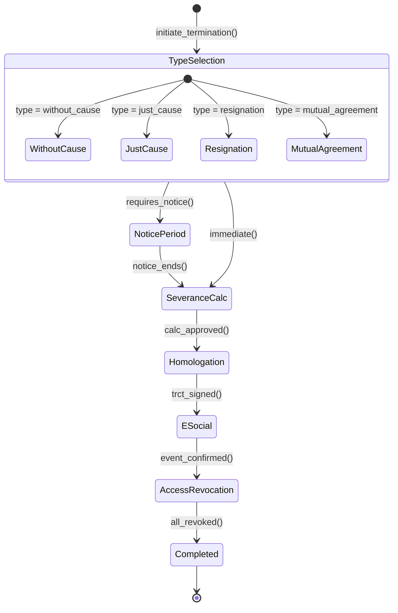

# Fluxo: Desligamento de Funcionario — Variantes por Tipo

> Detalhamento das variantes de desligamento: demissao sem justa causa, justa causa, pedido do funcionario e acordo mutuo. Cada variante possui guards e verbas especificas.

---

## 1. Variantes de Desligamento

### 1.1 Demissao Sem Justa Causa

| Verba | Inclui |
|-------|--------|
| Saldo de salario | Sim |
| Aviso previo (trabalhado ou indenizado) | Sim — 30 dias + 3 dias por ano trabalhado (max 90) |
| Ferias vencidas + 1/3 | Sim |
| Ferias proporcionais + 1/3 | Sim |
| 13o salario proporcional | Sim |
| Multa FGTS 40% | Sim |
| Guia FGTS (saque) | Sim |
| Seguro desemprego | Sim (se elegivel) |

### 1.2 Demissao por Justa Causa

| Verba | Inclui |
|-------|--------|
| Saldo de salario | Sim |
| Aviso previo | **NAO** |
| Ferias vencidas + 1/3 | Sim |
| Ferias proporcionais | **NAO** |
| 13o proporcional | **NAO** |
| Multa FGTS | **NAO** |
| Seguro desemprego | **NAO** |

### 1.3 Pedido de Demissao

| Verba | Inclui |
|-------|--------|
| Saldo de salario | Sim |
| Aviso previo (funcionario cumpre ou desconta) | Sim |
| Ferias vencidas + 1/3 | Sim |
| Ferias proporcionais + 1/3 | Sim |
| 13o proporcional | Sim |
| Multa FGTS | **NAO** |
| Seguro desemprego | **NAO** |

### 1.4 Acordo Mutuo (CLT Art. 484-A)

| Verba | Inclui |
|-------|--------|
| Saldo de salario | Sim |
| Aviso previo (50% se indenizado) | Sim |
| Ferias vencidas + 1/3 | Sim |
| Ferias proporcionais + 1/3 | Sim |
| 13o proporcional | Sim |
| Multa FGTS **20%** | Sim (metade) |
| Saque FGTS **80%** | Sim |
| Seguro desemprego | **NAO** |

---

## 2. State Machine — Variantes



---

## 3. Guards por Variante `[AI_RULE]`

| Tipo | Guard Adicional |
|------|----------------|
| `without_cause` | `employee.stability_protection = false` — funcionario NAO pode estar em estabilidade |
| `just_cause` | `infraction_record IS NOT NULL AND infraction_severity = 'grave'` — registro formal de infracao grave |
| `resignation` | `resignation_letter IS NOT NULL AND signed_date IS NOT NULL` — carta de pedido assinada |
| `mutual_agreement` | `both_parties_signed = true AND agreement_terms IS NOT NULL` — ambas partes assinaram |

> **[AI_RULE_CRITICAL]** Justa causa EXIGE registro formal de infracao com data, testemunhas e descricao. Art. 482 CLT. A IA NUNCA deve permitir justa causa sem `infraction_record`.

> **[AI_RULE]** Funcionarios com menos de 1 ano de servico e pedido de demissao: aviso previo de 30 dias. Cada ano adicional soma 3 dias (max 90 dias). Formula: `notice_days = 30 + (years_of_service * 3)`, capped at 90.

> **[AI_RULE]** eSocial: demissao sem justa causa = S-2299 `motivo_desligamento = '02'`. Justa causa = `'01'`. Pedido = `'06'`. Acordo = `'33'`. A IA DEVE mapear corretamente o codigo de motivo.

---

## 4. Eventos por Tipo

| Evento | Tipos Aplicaveis | Payload Extra |
|--------|-----------------|---------------|
| `StabilityCheckFailed` | `without_cause` | `{stability_type, protection_end_date}` |
| `NoticePeriodCalculated` | `without_cause`, `resignation` | `{days, type: 'worked'\|'indemnified'}` |
| `SeveranceBreakdown` | Todos | `{line_items[], fgts_penalty, total_gross, total_net}` |
| `ESocialEventSent` | Todos | `{event_type, motivo_desligamento_code}` |

---

## 5. Modulos Envolvidos

| Modulo | Responsabilidade | Link |
|--------|-----------------|------|
| **HR** | Gerencia tipo e fluxo de desligamento | [HR.md](file:///c:/PROJETOS/sistema/docs/modules/HR.md) |
| **ESocial** | S-2299 com codigo de motivo correto | [ESocial.md](file:///c:/PROJETOS/sistema/docs/modules/ESocial.md) |
| **Finance** | Calculo rescisorio diferenciado por tipo | [Finance.md](file:///c:/PROJETOS/sistema/docs/modules/Finance.md) |
| **Core** | Revogacao de acessos, notifications | [Core.md](file:///c:/PROJETOS/sistema/docs/modules/Core.md) |

---

## 6. Cenarios de Excecao

| Cenario | Comportamento |
|---------|--------------|
| Tentativa de justa causa sem infracao registrada | Guard bloqueia. RH deve registrar infracao primeiro |
| Funcionaria gestante — demissao sem justa causa | Guard `stability_protection` bloqueia. Somente pedido ou acordo mutuo permitidos |
| Acordo mutuo recusado por uma das partes | Retorna para `TypeSelection`. Pode mudar para outro tipo |
| Aviso previo nao cumprido por funcionario | Desconto no calculo rescisorio (Art. 487 §2 CLT) |

---

## 7. Cenários BDD

```gherkin
Funcionalidade: Desligamento de Funcionário — Variantes por Tipo (Fluxo Transversal)

  Cenário: Desligamento sem justa causa com todas as verbas
    Dado que "Ana" tem 5 anos de serviço, salário R$ 4.000,00 e sem estabilidade
    Quando o RH inicia desligamento tipo "without_cause"
    E o aviso prévio é calculado como 30 + (5 × 3) = 45 dias indenizado
    E o cálculo rescisório inclui saldo de salário, férias + 1/3, 13º, multa FGTS 40%
    E o TRCT é assinado e homologado
    E o eSocial S-2299 é enviado com motivo "02"
    E os acessos ao sistema são revogados
    Então o status do funcionário deve ser "Completed"
    E guia de saque do FGTS deve ser gerada
    E seguro desemprego deve estar disponível (se elegível)

  Cenário: Justa causa bloqueada sem registro de infração
    Dado que o RH tenta desligar "Carlos" por justa causa
    E que não existe infraction_record registrado
    Quando o sistema tenta avançar para SeveranceCalc
    Então a transição é BLOQUEADA
    E o sistema informa "Registro formal de infração grave obrigatório (Art. 482 CLT)"

  Cenário: Acordo mútuo calcula verbas proporcionais
    Dado que "Maria" e a empresa concordam com acordo mútuo (Art. 484-A CLT)
    E ambas partes assinaram o agreement_terms
    Quando o cálculo rescisório é executado
    Então a multa FGTS deve ser 20% (metade)
    E o saque FGTS deve ser 80%
    E o aviso prévio indenizado deve ser 50%
    E seguro desemprego NÃO deve estar disponível

  Cenário: Proteção de estabilidade bloqueia demissão sem justa causa
    Dado que "Juliana" está em período de estabilidade (gestante)
    Quando o RH tenta desligamento tipo "without_cause"
    Então o guard stability_protection bloqueia a transição
    E o sistema informa "Funcionária em estabilidade. Apenas pedido ou acordo mútuo permitidos"

  Cenário: Mapeamento correto de código eSocial por tipo
    Dado um desligamento de qualquer tipo
    Quando o evento S-2299 é enviado
    Então o código motivo_desligamento deve ser:
      | Tipo              | Código |
      | without_cause     | 02     |
      | just_cause        | 01     |
      | resignation       | 06     |
      | mutual_agreement  | 33     |
```

---

## 8. Mapeamento Técnico

### Controllers

| Controller | Métodos Relevantes | Arquivo |
|---|---|---|
| `RescissionController` | `index`, `store`, `show`, `approve`, `markAsPaid`, `generateTRCT` | `app/Http/Controllers/Api/V1/RescissionController.php` |
| `ESocialController` | `generate`, `sendBatch`, `checkBatch`, `show`, `excludeEvent` | `app/Http/Controllers/Api/V1/ESocialController.php` |
| `PayrollController` | `index`, `store`, `calculate`, `approve`, `markAsPaid` | `app/Http/Controllers/Api/V1/PayrollController.php` |
| `HrAdvancedController` | `indexDocuments`, `storeDocument`, `expiringDocuments` | `app/Http/Controllers/Api/V1/HrAdvancedController.php` |

### Services

| Service | Responsabilidade | Arquivo |
|---|---|---|
| `RescissionService` | Cálculo rescisório por tipo, aprovação, geração de TRCT HTML | `app/Services/RescissionService.php` |
| `LaborCalculationService` | Cálculos trabalhistas (verbas, FGTS, aviso prévio) | `app/Services/LaborCalculationService.php` |
| `ESocialService` | Geração e envio de eventos S-2299/S-2399 | `app/Services/ESocialService.php` |
| `PayrollService` | Processamento de folha e inclusão de verbas rescisórias | `app/Services/PayrollService.php` |

### Models Envolvidos

| Model | Tabela | Arquivo |
|---|---|---|
| `Rescission` | `rescissions` | `app/Models/Rescission.php` |
| `User` | `users` | `app/Models/User.php` |
| `Payroll` | `payrolls` | `app/Models/Payroll.php` |
| `PayrollLine` | `payroll_lines` | `app/Models/PayrollLine.php` |
| `VacationBalance` | `vacation_balances` | `app/Models/VacationBalance.php` |
| `EmployeeBenefit` | `employee_benefits` | `app/Models/EmployeeBenefit.php` |

### Endpoints API

| Método | Endpoint | Descrição |
|---|---|---|
| `GET` | `/api/v1/hr/rescissions` | Listar rescisões |
| `POST` | `/api/v1/hr/rescissions` | Criar rescisão (com tipo: without_cause, just_cause, resignation, mutual_agreement) |
| `GET` | `/api/v1/hr/rescissions/{id}` | Detalhe da rescisão |
| `POST` | `/api/v1/hr/rescissions/{id}/approve` | Aprovar cálculo rescisório |
| `POST` | `/api/v1/hr/rescissions/{id}/mark-paid` | Marcar como pago |
| `GET` | `/api/v1/hr/rescissions/{id}/trct` | Gerar documento TRCT |
| `POST` | `/api/v1/hr/esocial/events/generate` | Gerar evento eSocial S-2299 |
| `POST` | `/api/v1/hr/esocial/events/send-batch` | Enviar lote eSocial |
| `GET` | `/api/v1/hr/esocial/batches/{batchId}` | Verificar status do lote |
| `POST` | `/api/v1/hr/esocial/events/{id}/exclude` | Excluir evento (S-3000) |

### Events/Listeners

| Evento | Arquivo |
|---|---|
| `HrActionAudited` | `app/Events/HrActionAudited.php` |
| [SPEC] `TerminationInitiated` | A ser criado — `app/Events/TerminationInitiated.php` |
| [SPEC] `SeveranceCalculated` | A ser criado — `app/Events/SeveranceCalculated.php` |
| [SPEC] `EmployeeTerminated` | A ser criado — `app/Events/EmployeeTerminated.php` |

> **Nota:** O fluxo de rescisão (RescissionController + RescissionService) já implementa cálculo por tipo, aprovação, pagamento e geração de TRCT. A integração com eSocial (S-2299) usa o ESocialController existente. Eventos específicos de state machine (TerminationInitiated, EmployeeTerminated) ainda precisam ser criados para notificação automática e revogação de acessos.
