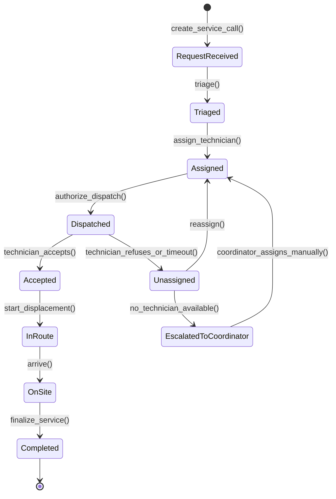
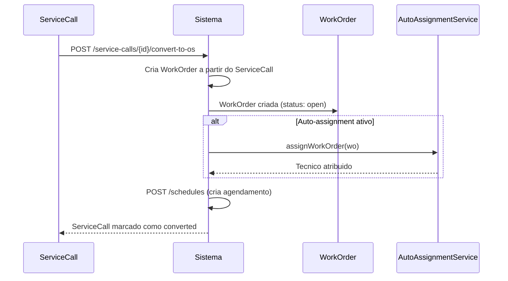

# Fluxo: Despacho e Atribuicao de Tecnicos

> **[AI_RULE]** Documento gerado por IA com base no codigo real do backend. Specs marcados com [SPEC] indicam funcionalidades planejadas.

## 1. Visao Geral

O fluxo de despacho conecta a criacao/triagem de chamados (ServiceCall) e ordens de servico (WorkOrder) a atribuicao do tecnico mais adequado. O sistema suporta tres modos de atribuicao:

| Modo | Descricao | Implementado |
|------|-----------|-------------|
| **Manual** | Coordenador seleciona tecnico no formulario da OS | Sim |
| **Sugerido** | Sistema recomenda tecnico; coordenador confirma | Sim (`TechnicianRecommendationController`) |
| **Automatico** | Regras executam sem intervencao humana | Sim (`AutoAssignmentService`) |

---

## 2. State Machine — Despacho e Atribuição



### Guards de Transição `[AI_RULE]`

| Transição | Guard |
|-----------|-------|
| `RequestReceived → Triaged` | `priority IS NOT NULL AND service_type IS NOT NULL` |
| `Triaged → Assigned` | `assigned_to IS NOT NULL AND tech.is_active = true AND tech.unavailable_until < NOW()` |
| `Assigned → Dispatched` | Se `require_dispatch_authorization`: `dispatch_authorized = true` |
| `Dispatched → Accepted` | `acceptance_response = 'accepted'` dentro do timeout por prioridade |
| `Dispatched → Unassigned` | `timeout_exceeded OR technician_refused = true` |
| `Accepted → InRoute` | `gps_enabled = true` |
| `OnSite → Completed` | `checklist_completed AND evidence_photos.count >= 1` |

---

## 3. Algoritmo de Auto-Atribuicao

### 2.1 Modelo de Regras (`AutoAssignmentRule`)

Cada regra possui:

| Campo | Tipo | Descricao |
|-------|------|-----------|
| `entity_type` | string | `work_order` ou `service_call` |
| `priority` | int | Ordem de avaliacao (menor = primeiro) |
| `is_active` | bool | Se a regra esta ativa |
| `conditions` | JSON | Filtros: `os_types`, `priorities`, `customer_ids`, `branch_ids` |
| `strategy` | string | `round_robin`, `least_loaded`, `skill_match`, `proximity` |
| `technician_ids` | JSON | Lista de tecnicos elegiveis (opcional) |
| `required_skills` | JSON | Skills obrigatorias para candidatos |

### 2.2 Estrategias Implementadas

```php
// AutoAssignmentService::findBestTechnician()
return match ($strategy) {
    'round_robin'  => $this->roundRobin($candidates, $wo->tenant_id),
    'least_loaded' => $this->leastLoaded($candidates, $wo->tenant_id),
    'skill_match'  => $this->skillMatch($candidates, $wo),
    'proximity'    => $this->proximity($candidates, $wo),
    default        => $candidates->first(),
};
```

#### Round Robin

Atribui ao tecnico cuja ultima atribuicao automatica e mais antiga:

```php
$candidates->sortBy(fn ($tech) =>
    WorkOrder::where('assigned_to', $tech->id)
        ->where('auto_assigned', true)
        ->max('created_at') ?? '2000-01-01'
)->first();
```

#### Least Loaded (Menor Carga)

Atribui ao tecnico com menos OS abertas:

```php
$candidates->sortBy(fn ($tech) =>
    WorkOrder::where('assigned_to', $tech->id)
        ->whereNotIn('status', ['completed', 'cancelled', 'invoiced'])
        ->count()
)->first();
```

#### Skill Match (Compatibilidade de Habilidades)

Ordena por intersecao entre skills do tecnico e skills requeridas pela OS:

```php
$candidates->sortByDesc(fn ($tech) =>
    count(array_intersect($techSkills, $requiredSkills))
)->first();
```

#### Proximidade (GPS)

Usa formula de Haversine para encontrar o tecnico mais proximo:

```php
// Haversine distance (km)
$r = 6371;
$dLat = deg2rad($lat2 - $lat1);
$dLon = deg2rad($lon2 - $lon1);
$a = sin($dLat/2)**2 + cos(deg2rad($lat1)) * cos(deg2rad($lat2)) * sin($dLon/2)**2;
return $r * 2 * atan2(sqrt($a), sqrt(1 - $a));
```

### 2.3 Filtros de Elegibilidade

Os candidatos sao filtrados por:

1. **Tenant** - mesmo `tenant_id`
2. **Ativo** - `is_active = true`
3. **Role** - possui role `tecnico` ou `technician`
4. **IDs especificos** - se `technician_ids` configurado na regra
5. **Skills** - se `required_skills` configurado, filtra por `skills LIKE %skill%`
6. **Disponibilidade** - exclui tecnicos com `unavailable_until > now()`

---

## 3. Criterios de Despacho

### 3.1 Prioridade da OS

| Prioridade | SLA Target | Cor |
|-----------|------------|-----|
| `critical` | 2h (configuravel via `SlaPolicy`) | Vermelho |
| `high` | 4h (configuravel via `SlaPolicy`) | Laranja |
| `medium` | 8h (configuravel via `SlaPolicy`) | Amarelo |
| `low` | 24h (configuravel via `SlaPolicy`) | Verde |

### 3.2 Capacidade por Tecnico [SPEC]

Limite `max_os_per_day` implementado como campo no `AutoAssignmentRule` ou `User`:

```php
// AutoAssignmentService: filtro de capacidade
$todayCount = WorkOrder::where('assigned_to', $tech->id)
    ->whereDate('scheduled_date', today())
    ->whereNotIn('status', ['cancelled'])
    ->count();
$maxPerDay = $tech->max_os_per_day ?? SystemSetting::get('default_max_os_per_day', 8);
if ($todayCount >= $maxPerDay) continue; // pula tecnico
```

[AI_RULE] Default: 8 OS/dia. Configuravel por tecnico e por tenant.

### 3.3 Mapa de Competencias

| Tipo de Servico | Skill Requerida | Certificacao |
|----------------|----------------|-------------|
| Calibracao | `calibration` | RBC/Inmetro |
| Manutencao Preventiva | `preventive_maintenance` | - |
| Manutencao Corretiva | `corrective_maintenance` | - |
| Instalacao | `installation` | Certificacao especifica do fabricante |
| Metrologia | `metrology` | RBC |

### 3.4 Zonas Geograficas

O sistema usa `CrmTerritory` para definir territorios/zonas. Cada territorio tem membros (`CrmTerritoryMember`). [SPEC] Integrar territorios CRM com auto-assignment para restringir tecnicos por zona:

```php
// AutoAssignmentService: filtro de territorio
if ($rule->use_territory_filter) {
    $customerTerritory = CrmTerritory::whereHas('customers', fn($q) => $q->where('id', $wo->customer_id))->first();
    if ($customerTerritory) {
        $candidates = $candidates->filter(fn($tech) =>
            CrmTerritoryMember::where('territory_id', $customerTerritory->id)
                ->where('user_id', $tech->id)->exists()
        );
    }
}
```

---

## 4. Fluxo de Re-atribuicao

```
Tecnico recusa OS
    |
    v
Sistema marca OS como 'unassigned'
    |
    v
AutoAssignmentService re-executa (exclui tecnico anterior)
    |
    v
Novo tecnico atribuido OU escala para coordenador
```

### 4.1 Timeout de Aceitacao [SPEC]

Mecanismo automatico de timeout apos notificacao push:

```php
// Job: CheckAcceptanceTimeout (cron: a cada 5 minutos)
// 1. Busca OS com status 'dispatched' e dispatched_at < now() - acceptance_timeout
// 2. Para cada OS expirada: marca como 'unassigned', re-executa AutoAssignment
// 3. Se nenhum tecnico disponivel: escalonar para coordenador
```

| Prioridade | Timeout |
|-----------|--------|
| `emergency` | 5 min (ver `docs/fluxos/CHAMADO-EMERGENCIA.md`) |
| `critical` | 15 min |
| `high` | 30 min |
| `medium` | 60 min |
| `low` | 120 min |

---

## 5. Autorizacao de Despacho (GAP-02)

Rota existente:

```
POST /api/v1/work-orders/{work_order}/authorize-dispatch
Middleware: check.permission:os.work_order.authorize_dispatch
```

Permite que um supervisor autorize o despacho antes do tecnico receber a OS. Util para OS de alto valor ou clientes VIP.

---

## 6. Recomendacao de Tecnicos

Endpoint dedicado para sugestao:

```
GET /api/v1/technicians/recommendation
Controller: TechnicianRecommendationController::recommend
```

Retorna lista ordenada de tecnicos recomendados com score, considerando:

- Carga de trabalho atual
- Proximidade geografica
- Historico com o cliente
- Skills compativeis

---

## 7. Dashboard do Coordenador

### Rotas Relevantes

| Endpoint | Descricao |
|----------|-----------|
| `GET /schedules-unified` | Visao unificada da agenda |
| `GET /schedules/conflicts` | Conflitos de agendamento |
| `GET /schedules/workload` | Resumo de carga por tecnico |
| `GET /schedules/suggest-routing` | Sugestao de roteirizacao |
| `GET /routing/daily-plan` | Plano diario de rotas |
| `GET /work-orders-dashboard-stats` | KPIs de OS |

---

## 8. Diagrama de Sequencia

```mermaid
sequenceDiagram
    participant CLI as Cliente
    participant ATD as Atendente
    participant SYS as Sistema (API)
    participant AAS as AutoAssignmentService
    participant TEC as Tecnico (PWA)
    participant COO as Coordenador

    CLI->>ATD: Abre chamado (telefone/portal)
    ATD->>SYS: POST /service-calls
    SYS->>SYS: Valida dados + cria ServiceCall

    alt Modo Automatico
        SYS->>AAS: assignServiceCall(call)
        AAS->>AAS: Carrega regras ativas (priority ASC)
        AAS->>AAS: Filtra candidatos (role, skills, disponibilidade)
        AAS->>AAS: Aplica estrategia (round_robin/least_loaded/etc)
        AAS-->>SYS: Tecnico selecionado
        SYS->>SYS: Atualiza assigned_to + auto_assigned=true
        SYS->>TEC: Push notification (WebPushService)
    else Modo Sugerido
        SYS->>COO: Notifica novo chamado
        COO->>SYS: GET /technicians/recommendation
        SYS-->>COO: Lista ordenada de tecnicos
        COO->>SYS: PUT /service-calls/{id}/assign
        SYS->>TEC: Push notification
    else Modo Manual
        COO->>SYS: PUT /service-calls/{id} (assigned_to)
        SYS->>TEC: Push notification
    end

    alt Tecnico aceita
        TEC->>SYS: Inicia deslocamento
        SYS-->>COO: Status atualizado no dashboard
    else Tecnico recusa / timeout
        TEC->>SYS: Recusa OS
        SYS->>AAS: Re-executa assignment (exclui tecnico)
        AAS-->>SYS: Novo tecnico ou null
        alt Nenhum tecnico disponivel
            SYS->>COO: Alerta: OS sem tecnico
        end
    end
```



---

## 9. Conversao Chamado para OS



---

## 10. Cenarios BDD

### Cenario 1: Atribuicao automatica por round-robin

```gherkin
Funcionalidade: Auto-atribuicao de OS

  Cenario: Round-robin distribui OS igualmente
    Dado que existem 3 tecnicos ativos: Ana, Bruno, Carlos
    E uma regra de auto-assignment com strategy "round_robin"
    E Ana recebeu a ultima OS ha 3 dias
    E Bruno recebeu a ultima OS ha 2 dias
    E Carlos recebeu a ultima OS ha 1 dia
    Quando uma nova OS e criada
    Entao o sistema atribui a OS para Ana
    E o campo auto_assigned e true
```

### Cenario 2: Atribuicao por proximidade

```gherkin
  Cenario: Tecnico mais proximo recebe a OS
    Dado que existem 2 tecnicos ativos com GPS ativo
    E tecnico Ana esta a 5km do cliente
    E tecnico Bruno esta a 15km do cliente
    E uma regra de auto-assignment com strategy "proximity"
    Quando uma nova OS e criada com latitude e longitude do cliente
    Entao o sistema atribui a OS para Ana
```

### Cenario 3: Filtro por skills

```gherkin
  Cenario: Apenas tecnico com skill compativel e atribuido
    Dado que existem 2 tecnicos: Ana (skills: calibration) e Bruno (skills: installation)
    E uma regra com required_skills: ["calibration"]
    Quando uma OS de calibracao e criada
    Entao o sistema atribui a OS para Ana
    E Bruno nao e considerado candidato
```

### Cenario 4: Nenhum tecnico disponivel

```gherkin
  Cenario: Todos tecnicos indisponiveis
    Dado que todos os tecnicos estao com unavailable_until > agora
    Quando o AutoAssignmentService tenta atribuir uma OS
    Entao retorna null
    E a OS permanece sem assigned_to
    E o coordenador e notificado
```

### Cenario 5: Autorizacao de despacho

```gherkin
  Cenario: OS de alto valor requer autorizacao
    Dado uma OS com total > R$10.000
    E a configuracao "require_dispatch_authorization" esta ativa
    Quando o coordenador autoriza o despacho
    Entao POST /work-orders/{id}/authorize-dispatch retorna 200
    E o tecnico recebe a notificacao push
```

### Cenario 6: Re-atribuicao apos recusa

```gherkin
  Cenario: Tecnico recusa e sistema re-atribui
    Dado uma OS atribuida ao tecnico Ana
    Quando Ana recusa a OS
    Entao o AutoAssignmentService re-executa
    E Ana e excluida da lista de candidatos
    E a OS e atribuida ao proximo tecnico elegivel
```

---

## 11. Modelo de Dados Relacionado

```
AutoAssignmentRule
  - id, tenant_id
  - entity_type (work_order | service_call)
  - priority (int)
  - is_active (bool)
  - conditions (JSON: os_types, priorities, customer_ids, branch_ids)
  - strategy (round_robin | least_loaded | skill_match | proximity)
  - technician_ids (JSON)
  - required_skills (JSON)

WorkOrder
  - assigned_to (FK -> users.id)
  - auto_assigned (bool)
  - auto_assignment_rule_id (FK -> auto_assignment_rules.id)
  - latitude, longitude
  - priority
  - service_type

User (Tecnico)
  - skills (JSON)
  - last_latitude, last_longitude
  - unavailable_until (datetime)
  - is_active (bool)

Schedule
  - technician_id (FK -> users.id)
  - work_order_id
  - scheduled_date, start_time, end_time
```

---

## 11.1 Especificacoes Tecnicas

### Algoritmos de Auto-Assignment

**Configuração por tenant:** Campo `dispatch_algorithm` em `tenant_settings`
- **Valores:** `round_robin`, `least_loaded`, `skill_based`, `nearest` (geolocalização)

**Round Robin:**
- Mantém contador `last_assigned_index` por tenant
- Cicla pela lista de técnicos disponíveis em ordem de ID

**Least Loaded:**
- Query: técnico com menos OS em status `in_progress` ou `scheduled` para a data
- Desempate: menor carga na semana

**Skill Based:**
- Campo necessário: `required_skills` (json) na tabela `work_orders`
- Migration: `ALTER TABLE work_orders ADD COLUMN required_skills JSON NULLABLE`
- Campo técnico: `skills` (json) na tabela `users` (ou tabela pivot `user_skills`)
- Match: técnico deve ter TODOS os skills requeridos
- Ranking: técnico com mais skills relevantes primeiro

**Nearest (Geolocalização):**
- Usa `last_latitude`, `last_longitude` do técnico (atualizado pelo app mobile)
- Calcula distância Haversine até o endereço do cliente
- Seleciona o mais próximo com skills compatíveis

### Limite de Rejeição
- **Máximo:** 3 rejeições por OS (configurável: `settings.dispatch.max_rejections`)
- **Após limite:** Status muda para `manual_dispatch`, notifica coordenador via `DispatchEscalated` event
- **Timeout de aceite:** 30 minutos. Se não aceitar, rejeição automática e próximo técnico

---

## 12. Gaps e Melhorias Futuras

| # | Gap | Status |
|---|-----|--------|
| 1 | Limite `max_os_per_day` por tecnico | [SPEC] Secao 3.2 acima |
| 2 | Timeout automatico de aceitacao com re-despacho | [SPEC] Secao 4.1 acima |
| 3 | Integracao de territorios CRM no auto-assignment | [SPEC] Secao 3.4 acima |
| 4 | Metricas de aceitacao/recusa por tecnico | [SPEC] Dashboard com taxa de aceite, tempo medio de resposta, recusas por motivo |
| 5 | Algoritmo de otimizacao multi-criterio (weighted score) | [SPEC] Score = (w1 *proximity) + (w2* skill_match) + (w3 *load_balance) + (w4* sla_urgency). Pesos configuraveis por tenant |
| 6 | Consideracao de SLA deadline no ranqueamento | [SPEC] OS com SLA proximo de estourar recebem boost no score de prioridade de despacho |
| 7 | Notificacao escalada para gerente apos N recusas | [SPEC] Apos 3 recusas consecutivas, escalonar via push + email ao gerente da regiao |

---

> **[AI_RULE]** Este documento reflete o estado real do codigo em `AutoAssignmentService.php`, `TechnicianRecommendationController.php` e rotas em `work-orders.php`. Specs marcados com [SPEC] indicam funcionalidades planejadas.

---

## Módulos Envolvidos

| Módulo | Responsabilidade no Fluxo |
|--------|---------------------------|
| [Service-Calls](file:///c:/PROJETOS/sistema/docs/modules/Service-Calls.md) | Chamados técnicos a serem despachados |
| [CRM](file:///c:/PROJETOS/sistema/docs/modules/CRM.md) | Dados do cliente e localização |
| [Agenda](file:///c:/PROJETOS/sistema/docs/modules/Agenda.md) | Disponibilidade de técnicos e slots de agenda |
| [Core](file:///c:/PROJETOS/sistema/docs/modules/Core.md) | Gestão de permissões de despacho e supervisão |
| [Lab](file:///c:/PROJETOS/sistema/docs/modules/Lab.md) | Verificação de competência técnica para o serviço |
| [Email](file:///c:/PROJETOS/sistema/docs/modules/Email.md) | Notificação ao técnico e ao cliente sobre atribuição |
| [Inmetro](file:///c:/PROJETOS/sistema/docs/modules/Inmetro.md) | Validação de certificação do técnico para serviço regulado |
| [Portal](file:///c:/PROJETOS/sistema/docs/modules/Portal.md) | Visibilidade do cliente sobre técnico atribuído |
