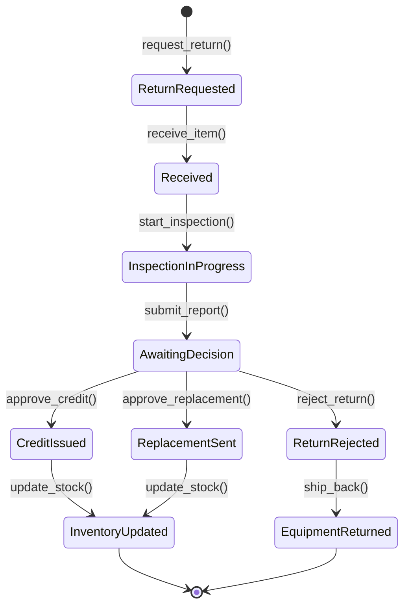

# Fluxo: Devolucao de Equipamento

> Ciclo de devolucao: desde a solicitacao do cliente ate o credito/substituicao, com inspecao tecnica e atualizacao de inventario.

---

## 1. Narrativa do Processo

1. **Solicitacao**: Cliente solicita devolucao via Portal ou atendente registra manualmente.
2. **Inspecao**: Equipe tecnica recebe e inspeciona equipamento. Classifica condicao (intacto, danificado, defeituoso).
3. **Laudo Tecnico**: Lab emite laudo com diagnostico e se defeito e coberto por garantia.
4. **Decisao**: Com base no laudo, decide-se: credito, substituicao, reparo ou recusa.
5. **Atualizacao Inventario**: Equipamento retorna ao estoque (se intacto) ou e baixado (se irrecuperavel).

---

## 2. State Machine



---

## 3. Guards de Transicao `[AI_RULE]`

| Transicao | Guard |
|-----------|-------|
| `ReturnRequested → Received` | `tracking_number IS NOT NULL OR in_person_receipt = true` |
| `Received → InspectionInProgress` | `inspector_id IS NOT NULL` |
| `InspectionInProgress → AwaitingDecision` | `report.condition IN ('intact','damaged','defective') AND report.warranty_covered IS NOT NULL` |
| `AwaitingDecision → CreditIssued` | `report.warranty_covered = true OR manager_approved_credit = true` |
| `AwaitingDecision → ReplacementSent` | `replacement_item_available = true AND report.warranty_covered = true` |
| `AwaitingDecision → ReturnRejected` | `report.warranty_covered = false AND damage_caused_by_customer = true` |

> **[AI_RULE]** Devolucoes dentro do prazo de garantia com defeito de fabricacao DEVEM ser aprovadas automaticamente sem aprovacao de gestor.

> **[AI_RULE]** Equipamento calibrado pelo Lab deve ter certificado invalidado ao retornar ao estoque. `Certificate::where('equipment_id', $id)->update(['status' => 'voided'])`.

---

## 4. Eventos Emitidos

| Evento | Trigger | Consumidor |
|--------|---------|------------|
| `ReturnRequested` | Solicitacao criada | Portal (atualizar status), Email (confirmar ao cliente) |
| `InspectionCompleted` | Laudo submetido | Core (log), Finance (se credito: provisionar) |
| `CreditIssued` | Credito aprovado | Finance (emitir nota de credito) |
| `ReplacementShipped` | Substituicao enviada | Inventory (baixa item, dar entrada devolvido) |
| `ReturnRejected` | Devolucao recusada | Email (notificar cliente com laudo) |

---

## 5. Modulos Envolvidos

| Modulo | Responsabilidade | Link |
|--------|-----------------|------|
| **Inventory** | Controle de estoque, entrada/saida | [Inventory.md](file:///c:/PROJETOS/sistema/docs/modules/Inventory.md) |
| **Lab** | Inspecao e laudo tecnico | [Lab.md](file:///c:/PROJETOS/sistema/docs/modules/Lab.md) |
| **Finance** | Notas de credito, reembolso | [Finance.md](file:///c:/PROJETOS/sistema/docs/modules/Finance.md) |
| **Core** | Audit log, notifications | [Core.md](file:///c:/PROJETOS/sistema/docs/modules/Core.md) |
| **Portal** | Canal de solicitacao pelo cliente | [Portal.md](file:///c:/PROJETOS/sistema/docs/modules/Portal.md) |

---

## 6. Cenarios de Excecao

| Cenario | Comportamento |
|---------|--------------|
| Equipamento nao encontrado no inventario | Inspecao manual requerida. Verificar serial |
| Garantia expirada mas defeito de fabrica | Decisao do gestor. Pode oferecer reparo com custo reduzido |
| Substituicao indisponivel | Oferecer credito ou prazo para envio futuro |
| Cliente discorda do laudo | Reinspecao por tecnico diferente. Decisao final do supervisor |

---

## 7. Cenários BDD

```gherkin
Funcionalidade: Devolução de Equipamento (Fluxo Transversal)

  Cenário: Devolução completa com crédito e atualização de inventário
    Dado que o cliente "Empresa XYZ" solicitou devolução do equipamento SN-12345
    E que o equipamento foi recebido com tracking_number "BR123456"
    E que o inspetor "João" classificou como "defective" com garantia = true
    Quando o gestor aprova crédito por defeito sob garantia
    E o inventário é atualizado (equipamento retorna ao estoque ou é baixado)
    Então o status da devolução deve ser "InventoryUpdated"
    E o Finance deve emitir nota de crédito
    E o evento CreditIssued deve ser emitido

  Cenário: Defeito de fabricação com garantia é aprovado automaticamente
    Dado que o laudo técnico indica "defective" e warranty_covered = true
    Quando a decisão é avaliada
    Então o crédito deve ser aprovado automaticamente sem aprovação de gestor
    E manager_approved_credit não deve ser necessário

  Cenário: Certificado de calibração invalidado ao retornar ao estoque
    Dado que o equipamento SN-12345 possui certificado de calibração ativo
    Quando o equipamento retorna ao estoque após devolução
    Então o certificado deve ter status "voided"
    E nenhum certificado ativo deve existir para o equipment_id

  Cenário: Cliente contesta laudo e solicita reinspecção
    Dado que o laudo retornou "damaged" com damage_caused_by_customer = true
    E a devolução foi rejeitada
    Quando o cliente contesta formalmente o resultado
    Então uma reinspecção deve ser agendada com inspetor diferente
    E a decisão final deve ser do supervisor
```

---

## 8. Mapeamento Técnico

### Controllers

| Controller | Métodos Relevantes | Arquivo |
|---|---|---|
| `EquipmentController` | `index`, `show`, `store`, `update`, `destroy`, `calibrationHistory`, `addCalibration`, `addMaintenance`, `uploadDocument`, `dashboard`, `alerts` | `app/Http/Controllers/Api/V1/EquipmentController.php` |
| `InventoryController` | `index`, `store`, `show`, `updateItem`, `complete`, `cancel` | `app/Http/Controllers/Api/V1/InventoryController.php` |
| `StockMovementController` | `index` | `app/Http/Controllers/Api/V1/StockMovementController.php` |
| `StockController` | `index`, `store` | `app/Http/Controllers/Api/V1/StockController.php` |
| `WarrantyTrackingController` | Gestão de garantias de equipamentos | `app/Http/Controllers/Api/V1/WarrantyTrackingController.php` |
| `ClientPortalController` | Canal de solicitação de devolução pelo cliente | `app/Http/Controllers/Api/V1/ClientPortalController.php` |

### Service

**EquipmentReturnService** (`App\Services\FixedAssets\EquipmentReturnService`)
- `create(CreateReturnData $dto): EquipmentReturn`
- `inspect(EquipmentReturn $return, InspectionData $dto): void`
- `approve(EquipmentReturn $return, User $approver): void`
- `processFinancialDeduction(EquipmentReturn $return): void` — cria lançamento em AccountReceivable se equipamento danificado/não devolvido

### Endpoints
| Método | Rota | Controller | Ação |
|--------|------|-----------|------|
| POST | /api/v1/fixed-assets/returns | EquipmentReturnController@store | Solicitar devolução |
| GET | /api/v1/fixed-assets/returns/{id} | EquipmentReturnController@show | Detalhe |
| PUT | /api/v1/fixed-assets/returns/{id}/inspect | EquipmentReturnController@inspect | Registrar inspeção |
| POST | /api/v1/fixed-assets/returns/{id}/approve | EquipmentReturnController@approve | Aprovar devolução |
| GET | /api/v1/fixed-assets/returns/report | EquipmentReturnController@report | Relatório |

### Eventos
- `ReturnRequested` → Alerts (notificar gestor de patrimônio)
- `ReturnInspected` → (aguardar aprovação)
- `ReturnApproved` → Inventory (atualizar localização), Lab (agendar recalibração se instrumento)
- `AssetWrittenOff` → Finance (registrar baixa contábil), Fiscal (gerar NF de baixa)

### Integração Lab (Recalibração)
- **Trigger:** `ReturnApproved` quando `asset.type = 'instrument'`
- **Listener:** `ScheduleRecalibrationOnReturnApproved`
- **Ação:** `CalibrationService::scheduleRecalibration(asset.instrument_id)`

### Dedução Financeira
- **Condição:** `inspection_result = 'damaged'` ou `inspection_result = 'missing'`
- **Ação:** Criar `AccountReceivable` com valor do bem (depreciado) vinculado ao funcionário
- **Cálculo:** `asset.acquisition_value - asset.accumulated_depreciation`

### Services (Legado/Existente)

| Service | Responsabilidade | Arquivo |
|---|---|---|
| `StockService` | Movimentação de estoque (entrada/saída de itens devolvidos) | `app/Services/StockService.php` |
| `CalibrationCertificateService` | Invalidação de certificados ao devolver equipamento | `app/Services/CalibrationCertificateService.php` |

### Models Envolvidos

| Model | Tabela | Arquivo |
|---|---|---|
| `Equipment` | `equipments` | `app/Models/Equipment.php` |
| `EquipmentCalibration` | `equipment_calibrations` | `app/Models/EquipmentCalibration.php` |
| `EquipmentMaintenance` | `equipment_maintenances` | `app/Models/EquipmentMaintenance.php` |
| `EquipmentDocument` | `equipment_documents` | `app/Models/EquipmentDocument.php` |
| `Inventory` | `inventories` | `app/Models/Inventory.php` |
| `InventoryItem` | `inventory_items` | `app/Models/InventoryItem.php` |
| `StockMovement` | `stock_movements` | `app/Models/StockMovement.php` |
| `WarrantyTracking` | `warranty_trackings` | `app/Models/WarrantyTracking.php` |

### Endpoints API

| Método | Endpoint | Descrição |
|---|---|---|
| `GET` | `/api/v1/equipments` | Listar equipamentos |
| `GET` | `/api/v1/equipments/{equipment}` | Detalhe do equipamento |
| `GET` | `/api/v1/equipments/{equipment}/calibrations` | Histórico de calibrações |
| `POST` | `/api/v1/equipments/{equipment}/calibrations` | Registrar calibração |
| `POST` | `/api/v1/equipments/{equipment}/maintenances` | Registrar manutenção |
| `GET` | `/api/v1/equipments-dashboard` | Dashboard de equipamentos |
| `GET` | `/api/v1/equipments-alerts` | Alertas de equipamentos |
| `GET` | `/api/v1/inventory` | Listar inventários |
| `POST` | `/api/v1/inventory` | Criar contagem de inventário |
| `POST` | `/api/v1/inventory/{inventory}/complete` | Completar inventário |
| `GET` | `/api/v1/stock-movements` | Listar movimentações de estoque |
| [SPEC] `POST` | `/api/v1/equipment-returns` | Solicitar devolução de equipamento |
| [SPEC] `POST` | `/api/v1/equipment-returns/{id}/receive` | Registrar recebimento |
| [SPEC] `POST` | `/api/v1/equipment-returns/{id}/inspect` | Submeter laudo de inspeção |
| [SPEC] `POST` | `/api/v1/equipment-returns/{id}/decide` | Registrar decisão (crédito/substituição/recusa) |
| [SPEC] `POST` | `/api/v1/equipment-returns/{id}/update-stock` | Atualizar inventário pós-devolução |

### Events/Listeners

| Evento | Arquivo |
|---|---|
| `StockEntryFromNF` | `app/Events/StockEntryFromNF.php` |
| [SPEC] `ReturnRequested` | A ser criado — `app/Events/ReturnRequested.php` |
| [SPEC] `InspectionCompleted` | A ser criado — `app/Events/InspectionCompleted.php` |
| [SPEC] `CreditIssued` | A ser criado — `app/Events/CreditIssued.php` |
| [SPEC] `ReturnRejected` | A ser criado — `app/Events/ReturnRejected.php` |

> **Nota:** Os controllers de Equipment, Inventory e StockMovement já existem para gestão de equipamentos e estoque. O fluxo completo de devolução com state machine (EquipmentReturnService) e integração com Lab para laudo técnico ainda precisa ser implementado.
