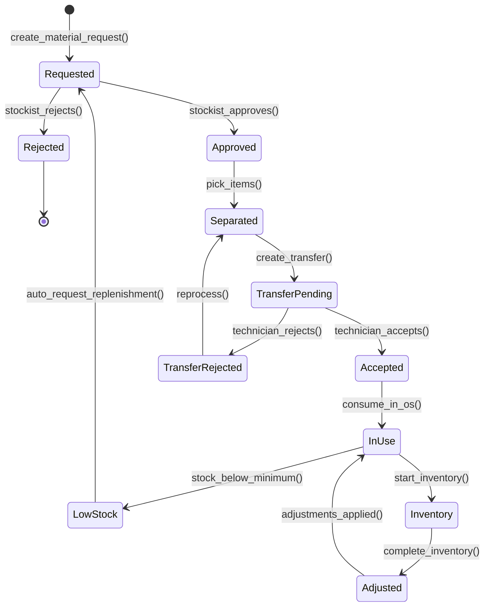
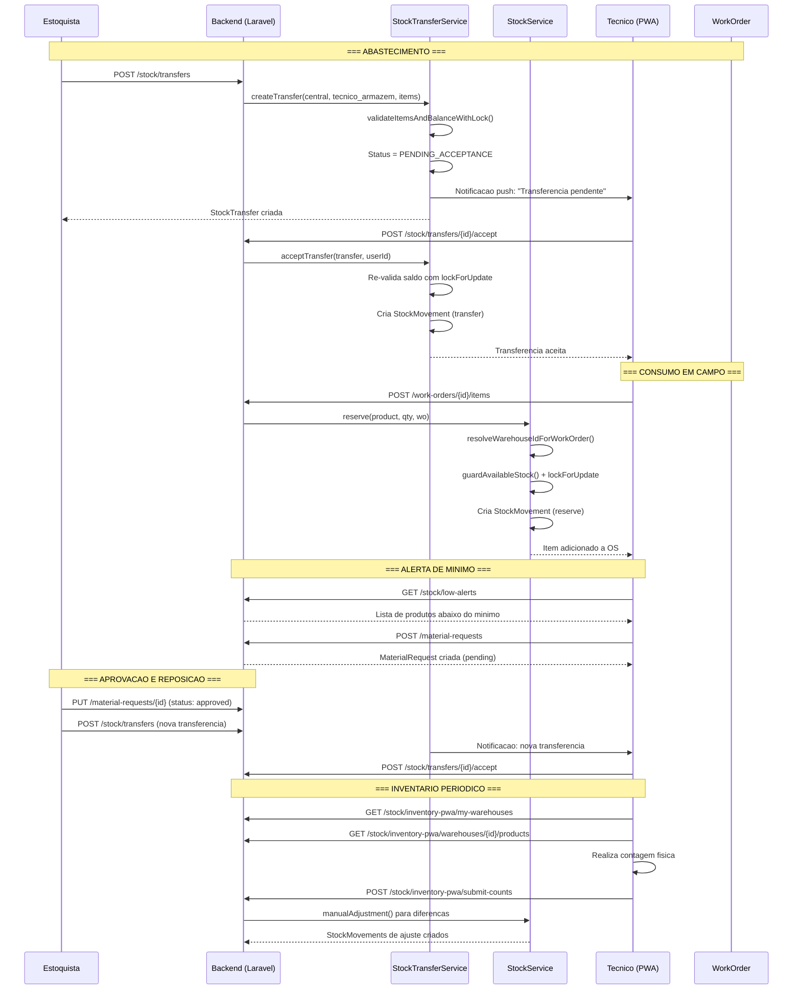

# Fluxo: Estoque Movel e Reposicao

> **[AI_RULE]** Documento gerado por IA com base no codigo real do backend. Specs marcados com [SPEC] indicam funcionalidades planejadas.

## 1. Visao Geral

O estoque movel permite que tecnicos carreguem pecas em seus veiculos ou armazens pessoais, consumam durante a execucao de OS, e solicitem reposicao quando o nivel atinge o minimo. O sistema suporta armazens por tipo (central, tecnico, veiculo), transferencias com aceite, inventario cego e rastreamento completo via Kardex.

---

## 2. State Machine — Estoque Móvel



### Guards de Transição `[AI_RULE]`

| Transição | Guard |
|-----------|-------|
| `Requested → Approved` | `items.count > 0 AND all_items_available_in_central = true` |
| `Separated → TransferPending` | `from_warehouse != to_warehouse AND same_tenant AND calibration_check_passed` |
| `TransferPending → Accepted` | `to_user_id = accepting_user_id OR user.role = 'stockist'` |
| `Accepted → InUse` | `lockForUpdate: available_stock >= requested_quantity` |
| `InUse → LowStock` | `warehouse_stock.quantity <= product.min_stock` |
| `Inventory → Adjusted` | `all_items_counted = true` |

---

## 3. Tipos de Armazem (`Warehouse`)

| Tipo | Constante | Descricao | Exemplo |
|------|-----------|-----------|---------|
| `fixed` | `TYPE_FIXED` | Armazem central/fisico | "Deposito Matriz" |
| `technician` | `TYPE_TECHNICIAN` | Armazem pessoal do tecnico | "Estoque - Ana" |
| `vehicle` | `TYPE_VEHICLE` | Estoque do veiculo | "Van #05 - Placa ABC" |

Metodos auxiliares: `$warehouse->isCentral()`, `$warehouse->isTechnician()`, `$warehouse->isVehicle()`.

### 2.1 Resolucao Automatica

O `StockService::resolveWarehouseIdForWorkOrder()` determina o armazem de consumo:

```php
// 1. Se OS tem tecnico atribuido -> armazem do tecnico
$w = Warehouse::where('type', 'technician')
    ->where('user_id', $wo->assigned_to)->first();

// 2. Senao -> armazem central
$central = Warehouse::where('type', 'fixed')
    ->whereNull('user_id')->whereNull('vehicle_id')->first();
```

---

## 3. Fluxo Principal

```
Armazem Central
  |
  v
Separacao (picking)
  |
  v
Transferencia para Veiculo/Tecnico (StockTransferService)
  |
  v
Tecnico aceita transferencia
  |
  v
Tecnico consome em OS (StockService.reserve/deduct)
  |
  v
Nivel minimo atingido -> Alerta
  |
  v
Solicitacao de reposicao (MaterialRequest)
  |
  v
Aprovacao do estoquista
  |
  v
Nova transferencia
```

---

## 4. Transferencias de Estoque

### 4.1 Criacao (`StockTransferService::createTransfer`)

```php
public function createTransfer(
    int $fromWarehouseId,
    int $toWarehouseId,
    array $items,        // [{product_id, quantity}]
    ?string $notes,
    ?int $createdBy
): StockTransfer
```

**Validacoes (dentro de transaction com lock):**

1. Origem e destino diferentes
2. Mesmo tenant
3. Saldo suficiente (com `lockForUpdate` para evitar race condition TOCTOU)
4. **Verificacao de calibracao** (guard de instrumentos controlados)

### 4.1.1 Guard: Bloqueio por Calibracao Vencida

> **[AI_RULE_CRITICAL]** Produtos que sao instrumentos de medicao (`product.requires_calibration = true`) com `calibration_due_date` expirada NAO podem ser movimentados, EXCETO quando o tipo de movimento e `to_calibration` (envio para re-calibracao).

```php
// StockTransferService::validateCalibrationStatus(array $items, string $movementType): void
private function validateCalibrationStatus(array $items, string $movementType): void
{
    if ($movementType === 'to_calibration') {
        return; // Permitido: esta sendo enviado PARA calibracao
    }

    foreach ($items as $item) {
        $product = Product::find($item['product_id']);
        if (!$product || !$product->requires_calibration) {
            continue;
        }

        // Verifica calibracao do instrumento especifico (por serial/batch)
        $equipment = Equipment::where('product_id', $product->id)
            ->where('serial_number', $item['serial_number'] ?? null)
            ->first();

        if ($equipment && $equipment->calibration_due_date && Carbon::parse($equipment->calibration_due_date)->isPast()) {
            throw ValidationException::withMessages([
                "items.{$item['product_id']}" => "Instrumento '{$product->name}' (S/N: {$equipment->serial_number}) com calibracao vencida em "
                    . Carbon::parse($equipment->calibration_due_date)->format('d/m/Y')
                    . ". Movimentacao bloqueada. Envie para re-calibracao (tipo: to_calibration) ou atualize o certificado."
            ]);
        }
    }
}
```

**Chamada no fluxo principal:**

```php
// StockTransferService::createTransfer()
public function createTransfer(...): StockTransfer
{
    return DB::transaction(function () use (...) {
        // ... validacoes existentes (1, 2, 3)

        // 4. Validacao de calibracao
        $this->validateCalibrationStatus($items, $notes ?? 'standard');

        // ... restante do fluxo
    });
}
```

**Cenario BDD:**

```gherkin
  Cenario: Bloqueio de transferencia de instrumento com calibracao vencida
    Dado um instrumento "Multimetro Fluke 87V" com calibracao vencida em 01/03/2026
    E hoje e 25/03/2026
    Quando o estoquista tenta transferir para o tecnico
    Entao o sistema bloqueia com mensagem "calibracao vencida"
    E sugere enviar para re-calibracao

  Cenario: Permitir envio para calibracao de instrumento vencido
    Dado um instrumento "Multimetro Fluke 87V" com calibracao vencida
    Quando o estoquista cria transferencia com tipo "to_calibration"
    Entao a transferencia e criada normalmente
    E o destino e o armazem do laboratorio de calibracao
```

### 4.2 Aceite Obrigatorio

O sistema requer aceite quando:

- Destino e armazem de tecnico (`to.isTechnician()` com `user_id`)
- Destino e armazem de veiculo (`to.isVehicle()`)
- Origem e veiculo retornando ao central (`from.isVehicle() && to.isCentral()`)

```php
$requiresAcceptance = $toUserId !== null || ($from->isVehicle() && $to->isCentral());
$status = $requiresAcceptance
    ? StockTransfer::STATUS_PENDING_ACCEPTANCE
    : StockTransfer::STATUS_ACCEPTED;
```

### 4.3 Aceitacao / Rejeicao

```php
// Aceitar
StockTransferService::acceptTransfer($transfer, $userId)
// - Verifica autorizacao (to_user_id == userId OU role estoquista)
// - Re-valida saldo com lock
// - Aplica transferencia (cria StockMovements)

// Rejeitar
StockTransferService::rejectTransfer($transfer, $userId, $reason)
// - Status -> rejected
// - Motivo registrado
```

### 4.4 Notificacoes

```php
// Tecnico destino recebe notificacao
Notification::notify(
    $tenantId, $toUserId,
    'stock_transfer_pending_acceptance',
    "Transferencia de estoque pendente de seu aceite (#{$transfer->id})"
);

// Estoquistas recebem notificacao em transferencias veiculo->tecnico
$this->notifyEstoquistas($transfer, $from, $to);
```

### 4.5 Rotas de Transferencia

| Endpoint | Metodo | Permissao |
|----------|--------|-----------|
| `GET /stock/transfers` | Listar | `estoque.view` |
| `GET /stock/transfers/{id}` | Detalhe | `estoque.view` |
| `POST /stock/transfers` | Criar | `estoque.transfer.create` |
| `POST /stock/transfers/{id}/accept` | Aceitar | `estoque.transfer.accept` |
| `POST /stock/transfers/{id}/reject` | Rejeitar | `estoque.transfer.accept` |

---

## 5. Consumo em OS

### 5.1 Adicionar Item

```
POST /work-orders/{id}/items
{
  "product_id": 123,
  "quantity": 2,
  "unit_price": 45.00,
  "type": "product"
}
```

### 5.2 Operacoes de Estoque

| Operacao | Tipo | Quando |
|----------|------|--------|
| `reserve()` | `StockMovementType::Reserve` | Item adicionado a OS |
| `deduct()` | `StockMovementType::Exit` | OS faturada |
| `returnStock()` | `StockMovementType::Return` | OS cancelada |

### 5.3 Validacao de Saldo

```php
// StockService::guardAvailableStock()
// Usa lockForUpdate para evitar race condition TOCTOU
$stock = WarehouseStock::lockForUpdate()->firstOrFail();
if ($available < $quantity) {
    throw ValidationException::withMessages([
        'quantity' => ["Saldo insuficiente. Disponivel: {$available}, solicitado: {$quantity}"]
    ]);
}
```

### 5.4 Explosao de Kits

Se o produto e um kit (`is_kit = true`), o `StockService` explode automaticamente em componentes:

```php
// explodeKit() - recursivo com limite de profundidade (5 niveis)
$items = $kit->kitItems()->with('child')->get();
foreach ($items as $item) {
    $childQty = bcmul($item->quantity, $quantity, 4);
    $this->createMovement(product: $item->child, ...);
}
```

---

## 6. Alertas de Estoque Baixo

### 6.1 Endpoint

```
GET /stock/low-alerts
GET /stock/low-stock-alerts (alias)
Controller: StockController::lowStockAlerts
```

### 6.2 Pontos de Reposicao Inteligentes

```
GET /stock/intelligence/reorder-points
POST /stock/intelligence/reorder-points/auto-request
Controller: StockIntelligenceController
```

O `auto-request` cria automaticamente uma solicitacao de material quando o ponto de reposicao e atingido.

---

## 7. Solicitacao de Material

### 7.1 Rotas

| Endpoint | Metodo | Descricao |
|----------|--------|-----------|
| `GET /material-requests` | Listar | Todas solicitacoes |
| `GET /material-requests/{id}` | Detalhe | Uma solicitacao |
| `POST /material-requests` | Criar | Nova solicitacao |
| `PUT /material-requests/{id}` | Atualizar | Status/aprovacao |
| `DELETE /material-requests/{id}` | Excluir | Cancelar |

### 7.2 Fluxo

```
Tecnico solicita material
  |
  v
MaterialRequest (status: pending)
  |
  v
Estoquista aprova
  |
  v
MaterialRequest (status: approved)
  |
  v
Estoquista cria StockTransfer
  |
  v
Tecnico aceita transferencia
```

---

## 8. Inventario

### 8.1 Inventario Cego (Contagem sem ver saldo)

| Endpoint | Descricao |
|----------|-----------|
| `GET /inventories` | Listar inventarios |
| `POST /inventories` | Criar novo inventario |
| `GET /inventories/{id}` | Ver detalhes + itens |
| `PUT /inventories/{id}/items/{item}` | Registrar contagem |
| `POST /inventories/{id}/complete` | Finalizar (gera ajustes) |
| `POST /inventories/{id}/cancel` | Cancelar |

### 8.2 Inventario PWA (Mobile)

Endpoints otimizados para operacao mobile/offline:

```
GET  /stock/inventory-pwa/my-warehouses           -> Armazens do tecnico
GET  /stock/inventory-pwa/warehouses/{id}/products -> Produtos com saldo
POST /stock/inventory-pwa/submit-counts            -> Envia contagens
```

### 8.3 Ajustes de Inventario

Ao completar inventario, diferencas geram `StockMovement` tipo `Adjustment`:

```php
// StockService::manualAdjustment()
// quantity pode ser positiva (sobra) ou negativa (falta)
StockMovement::create([
    'type' => StockMovementType::Adjustment,
    'quantity' => $difference,
    'reference' => 'Ajuste de inventario',
]);
```

---

## 9. Kardex (Historico de Movimentacao)

```
GET /products/{product}/kardex?warehouse_id=X&date_from=Y&date_to=Z
```

O `StockService::getKardex()` retorna movimentacoes com saldo progressivo:

```php
// Cada entrada retorna:
[
    'id', 'date', 'type', 'type_label',
    'quantity', 'batch', 'serial',
    'notes', 'user', 'balance'  // saldo acumulado
]
```

Tipos de movimento e impacto no saldo:

| Tipo | Impacto |
|------|---------|
| `entry` | +quantity |
| `exit` | -quantity |
| `reserve` | -quantity |
| `return` | +quantity |
| `adjustment` | +/- quantity |
| `transfer` (origem) | -quantity |
| `transfer` (destino) | +quantity |

---

## 10. Diagrama de Sequencia



---

## 11. Funcionalidades Avancadas

### 11.1 Inteligencia de Estoque

| Endpoint | Descricao |
|----------|-----------|
| `GET /stock/intelligence/abc-curve` | Curva ABC |
| `GET /stock/intelligence/turnover` | Giro de estoque |
| `GET /stock/intelligence/average-cost` | Custo medio |
| `GET /stock/intelligence/reorder-points` | Pontos de reposicao |
| `GET /stock/intelligence/reservations` | Reservas ativas |
| `GET /stock/intelligence/expiring-batches` | Lotes vencendo |
| `GET /stock/intelligence/stale-products` | Produtos parados |

### 11.2 Lotes e Numeros de Serie

```
GET  /batches
POST /batches
GET  /stock/serial-numbers
POST /stock/serial-numbers
```

### 11.3 Etiquetas

```
GET  /stock/labels/formats
GET  /stock/labels/preview
POST /stock/labels/generate
Service: LabelGeneratorService
```

### 11.4 Tags RFID/QR

```
GET  /asset-tags
POST /asset-tags
POST /asset-tags/{id}/scan
POST /stock/scan-qr
```

### 11.5 RMA (Devolucao)

```
GET  /rma
POST /rma
PUT  /rma/{id}
```

### 11.6 Pecas Usadas

```
GET  /stock/used-items
POST /stock/used-items/{id}/report
POST /stock/used-items/{id}/confirm-return
POST /stock/used-items/{id}/confirm-write-off
```

---

## 12. Cenarios BDD

### Cenario 1: Transferencia com aceite

```gherkin
Funcionalidade: Estoque movel

  Cenario: Estoquista transfere pecas para tecnico
    Dado um armazem central com 50 unidades de "Sensor PT100"
    E um armazem do tecnico "Ana"
    Quando o estoquista cria transferencia de 10 unidades
    Entao a transferencia fica com status "pending_acceptance"
    E Ana recebe notificacao push

    Quando Ana aceita a transferencia
    Entao um StockMovement tipo "transfer" e criado
    E o armazem central tem 40 unidades
    E o armazem de Ana tem 10 unidades
```

### Cenario 2: Transferencia rejeitada

```gherkin
  Cenario: Tecnico rejeita transferencia
    Dado uma transferencia pendente de aceite para tecnico "Bruno"
    Quando Bruno rejeita com motivo "Nao preciso dessas pecas"
    Entao a transferencia fica com status "rejected"
    E o saldo do armazem central nao muda
```

### Cenario 3: Consumo em OS com saldo insuficiente

```gherkin
  Cenario: Estoque insuficiente bloqueia consumo
    Dado que o tecnico tem 1 unidade de "Filtro XYZ" no armazem
    Quando tenta consumir 3 unidades na OS
    Entao o sistema retorna erro de validacao
    E a mensagem contem "Saldo insuficiente"
```

### Cenario 4: Alerta de estoque minimo

```gherkin
  Cenario: Produto atinge nivel minimo
    Dado um produto com estoque_minimo = 5
    E saldo atual = 3
    Quando GET /stock/low-alerts
    Entao o produto aparece na lista de alertas
    E o tecnico pode criar MaterialRequest
```

### Cenario 5: Inventario cego com ajuste

```gherkin
  Cenario: Inventario revela divergencia
    Dado um armazem com saldo registrado de 20 unidades de "Peca A"
    E o estoquista cria inventario cego
    Quando o tecnico conta 18 unidades
    E submete a contagem
    E o inventario e completado
    Entao um StockMovement de ajuste (-2) e criado
    E o saldo atualiza para 18
```

### Cenario 6: Race condition prevenida

```gherkin
  Cenario: Dois tecnicos tentam consumir a mesma peca simultaneamente
    Dado 1 unidade de "Sensor Unico" no armazem compartilhado
    Quando tecnico A e tecnico B tentam reservar simultaneamente
    Entao apenas 1 reserva e aceita (lockForUpdate)
    E a outra recebe erro "Saldo insuficiente"
```

### Cenario 7: Kit explodido automaticamente

```gherkin
  Cenario: Consumo de kit explode em componentes
    Dado um kit "Kit Manutencao" com componentes:
      | Filtro  | 2 unidades |
      | Oleo    | 1 litro    |
      | Vedacao | 3 unidades |
    Quando o tecnico consome 1 kit na OS
    Entao sao criados StockMovements para cada componente
    E 2 unidades de Filtro sao baixadas
    E 1 litro de Oleo e baixado
    E 3 unidades de Vedacao sao baixadas
```

---

## 13. Modelo de Dados

```
Warehouse
  - id, tenant_id, name
  - type: fixed | technician | vehicle
  - user_id (FK, para tipo technician)
  - vehicle_id (FK, para tipo vehicle)

WarehouseStock
  - warehouse_id, product_id, batch_id
  - quantity (saldo atual)

StockMovement
  - product_id, warehouse_id, target_warehouse_id
  - type: entry | exit | reserve | return | transfer | adjustment
  - quantity, unit_cost
  - work_order_id (FK, opcional)
  - reference, notes, created_by

StockTransfer
  - from_warehouse_id, to_warehouse_id
  - status: pending_acceptance | accepted | rejected
  - to_user_id (quem deve aceitar)
  - accepted_at, accepted_by
  - rejected_at, rejected_by, rejection_reason

StockTransferItem
  - stock_transfer_id, product_id, quantity

MaterialRequest
  - status: pending | approved | rejected | fulfilled
  - items (produtos solicitados)

Inventory
  - warehouse_id
  - status: open | completed | cancelled
  - items com contagem vs saldo
```

---

## 13.1 Offline, Conflitos e Replenishment

### Offline Stock (dependência PWA)
- **Status:** Bloqueado — depende de PWA-OFFLINE-SYNC
- **Fallback atual:** App mobile requer conexão para consumir estoque
- **Plano:** Quando PWA implementado, usar IndexedDB queue para operações offline

### Conflito de Consumo Simultâneo
- **Resolução:** Optimistic locking via campo `version` (integer) na tabela `stock_items`
- **Fluxo:**
  1. Técnico A lê stock_item (version=5)
  2. Técnico B lê stock_item (version=5)
  3. Técnico A consome → UPDATE WHERE version=5, SET version=6 → sucesso
  4. Técnico B consome → UPDATE WHERE version=5 → 0 rows affected → CONFLITO
  5. Retry: recarregar stock_item, verificar se quantidade ainda suficiente, tentar novamente
- **Máximo retries:** 3. Após: notificar técnico "estoque insuficiente, contate coordenador"

### Endpoint de Replenishment Request
- `POST /api/v1/mobile/stock-replenishment` — `MobileStockController@requestReplenishment`
- **Campos:** items (array de {stock_item_id, quantity_needed}), urgency (normal, urgent), notes
- **Ação:** Cria `StockReplenishmentRequest` → Inventory (notificar almoxarife)

---

## 14. Gaps e Melhorias Futuras

| # | Gap | Status |
|---|-----|--------|
| 1 | Alerta push automatico quando estoque atinge minimo | [SPEC] Job cron: verificar `WarehouseStock` onde `quantity <= min_stock` → `WebPushService::notify()` para tecnico |
| 2 | Reposicao automatica (auto-request ja existe parcialmente) | Parcial (`StockIntelligenceController::autoRequest`) |
| 3 | Inventario por QR code com scan via camera | Implementado (`QrCodeInventoryController`) |
| 4 | Dashboard de estoque do tecnico no PWA | [SPEC] Componente React com: saldo por produto, alertas de minimo, ultimas transferencias, botao de solicitacao |
| 5 | Historico de transferencias por tecnico com metricas | [SPEC] Endpoint `GET /stock/transfers/my-history` — total transferencias, aceitas, rejeitadas, tempo medio de aceite |
| 6 | Integracao com compras (PurchaseQuote -> StockTransfer) | Parcial |
| 7 | Controle de validade de lotes com alerta automatico | Implementado (`expiring-batches`) |
| 8 | Descarte ecologico integrado ao estoque | Implementado (`stock-disposals`) |

---

> **[AI_RULE]** Este documento reflete o estado real de `StockService.php`, `StockTransferService.php`, `WarehouseController`, `StockController`, `InventoryController`, `StockIntelligenceController` e rotas em `stock.php`. Specs marcados com [SPEC] indicam funcionalidades planejadas.

---

## Módulos Envolvidos

| Módulo | Responsabilidade no Fluxo |
|--------|---------------------------|
| [Inventory](file:///c:/PROJETOS/sistema/docs/modules/Inventory.md) | Controle de estoque: requisição, transferência e baixa |
| [Lab](file:///c:/PROJETOS/sistema/docs/modules/Lab.md) | Peças e insumos para calibração e serviço em campo |
| [HR](file:///c:/PROJETOS/sistema/docs/modules/HR.md) | Atribuição de responsável pelo estoque móvel (técnico) |
