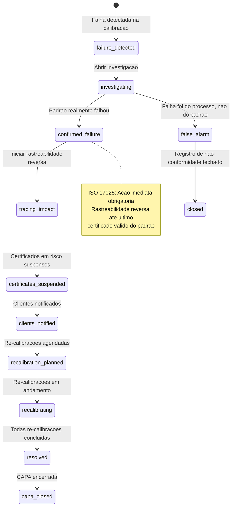
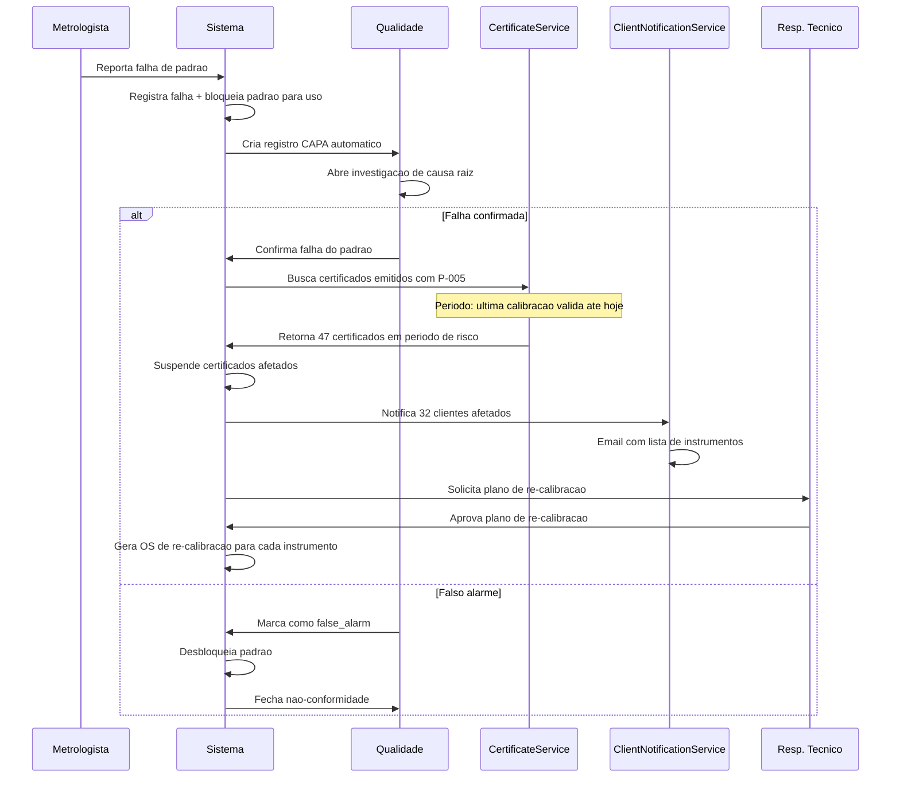

# Fluxo: Falha de Equipamento Padrao Durante Calibracao

> **Modulo**: Lab + Quality + Inmetro
> **Prioridade**: P2 — Impacta conformidade ISO 17025
> **[AI_RULE]** Documento prescritivo. Baseado em `CalibrationCertificateService`, `CapaRecord`, `Equipment`. Verificar dados marcados com [SPEC] antes de usar em producao.

## 1. Visao Geral

Quando um padrao de referencia (standard de medicao) falha durante calibracao de instrumento do cliente, o laboratorio enfrenta uma crise de rastreabilidade que pode invalidar todos os certificados emitidos com aquele padrao. O sistema deve:

1. Registrar a falha do padrao imediatamente
2. Identificar TODOS os certificados emitidos com aquele padrao (rastreabilidade reversa)
3. Suspender certificados em periodo de risco
4. Notificar todos os clientes afetados
5. Planejar re-calibracao dos instrumentos potencialmente impactados
6. Registrar acao corretiva (CAPA) conforme ISO 17025

**Atores**: Metrologista, Responsavel Tecnico, Gerente de Qualidade, Clientes afetados

---

## 2. Maquina de Estados da Falha de Padrao



---

## 3. Pipeline de Falha



---

## 4. Modelo de Dados

### 4.1 StandardFailureRecord [SPEC — Novo]

| Campo | Tipo | Descricao |
|-------|------|-----------|
| `id` | bigint unsigned | PK |
| `tenant_id` | bigint unsigned | FK |
| `equipment_id` | bigint unsigned | FK → equipments (padrao de referencia) |
| `detected_at` | datetime | Quando a falha foi detectada |
| `detected_by` | bigint unsigned | FK → users (metrologista) |
| `failure_type` | enum | `drift`, `out_of_tolerance`, `physical_damage`, `contamination`, `other` |
| `description` | text | Descricao detalhada da falha |
| `status` | enum | `detected`, `investigating`, `confirmed`, `false_alarm`, `tracing`, `suspended`, `recalibrating`, `resolved`, `closed` |
| `impact_period_start` | date nullable | Inicio do periodo de risco |
| `impact_period_end` | date nullable | Fim (data da falha) |
| `certificates_affected_count` | integer default 0 | Contagem de certificados |
| `clients_affected_count` | integer default 0 | Contagem de clientes |
| `capa_record_id` | bigint unsigned nullable | FK → capa_records |
| `resolution_notes` | text nullable | Como foi resolvido |
| `resolved_at` | datetime nullable | — |

### 4.2 CertificateSuspension [SPEC — Novo]

| Campo | Tipo | Descricao |
|-------|------|-----------|
| `id` | bigint unsigned | PK |
| `standard_failure_id` | bigint unsigned | FK |
| `calibration_certificate_id` | bigint unsigned | FK → calibration_certificates |
| `customer_id` | bigint unsigned | FK → customers |
| `instrument_equipment_id` | bigint unsigned | FK → equipments (instrumento do cliente) |
| `suspension_reason` | text | — |
| `suspended_at` | datetime | — |
| `recalibrated_at` | datetime nullable | Quando foi re-calibrado |
| `new_certificate_id` | bigint unsigned nullable | FK → novo certificado |
| `status` | enum | `suspended`, `recalibration_scheduled`, `recalibrated`, `waived` |

### 4.3 Modelos Existentes Relevantes

**Equipment** (padrao de referencia):

- `type = 'reference_standard'`
- `calibration_status` — `valid`, `expired`, `suspended`
- `last_calibration_at`, `next_calibration_at`
- `serial_number`, `model`, `manufacturer`

**CalibrationCertificate** (via `CalibrationCertificateService`):

- `reference_standard_id` — FK para o padrao usado
- `equipment_id` — Instrumento do cliente
- `customer_id` — Cliente dono do instrumento
- `issued_at` — Data de emissao

**CapaRecord** (acao corretiva):

- `type` — `corrective`, `preventive`
- `status`, `root_cause`, `action_plan`

---

## 5. Regras de Negocio

### 5.1 Rastreabilidade Reversa

[AI_RULE_CRITICAL] ISO 17025 exige rastreabilidade completa:

```
Padrao de Referencia (falhou)
  ├── Ultimo certificado valido do padrao: 01/01/2026
  ├── Data da falha: 24/03/2026
  └── Periodo de risco: 01/01/2026 a 24/03/2026
      ├── Certificado C-001 (Cliente A, Instrumento I-001) → SUSPENSO
      ├── Certificado C-002 (Cliente A, Instrumento I-003) → SUSPENSO
      ├── Certificado C-003 (Cliente B, Instrumento I-007) → SUSPENSO
      └── ... (47 certificados)
```

### 5.1.1 Guard: Verificar se Instrumento esta em OS Ativa

> **[AI_RULE_CRITICAL]** Antes de registrar falha de padrao, o sistema DEVE verificar se o padrao de referencia esta sendo usado em alguma WorkOrder ativa no momento. Se estiver, a OS deve ser **imediatamente interrompida** e o tecnico/metrologista notificado para nao prosseguir com medicoes usando aquele padrao.

```php
// StandardFailureService::registerFailure(int $equipmentId, ...)
public function registerFailure(int $equipmentId, string $failureType, string $description, int $detectedBy): StandardFailureRecord
{
    $equipment = Equipment::findOrFail($equipmentId);

    // Guard: verificar se padrao esta em OS ativa
    $activeWorkOrders = WorkOrder::where('tenant_id', $equipment->tenant_id)
        ->whereIn('status', ['in_progress', 'in_service', 'at_client', 'dispatched', 'accepted'])
        ->where(function ($query) use ($equipmentId) {
            // Padrao usado como referencia na OS
            $query->whereHas('calibrationItems', fn($q) => $q->where('reference_standard_id', $equipmentId))
                // Ou padrao listado como equipamento da OS
                ->orWhere('equipment_id', $equipmentId);
        })
        ->with(['assignee', 'customer'])
        ->get();

    if ($activeWorkOrders->isNotEmpty()) {
        // Acoes imediatas para cada OS ativa usando este padrao
        foreach ($activeWorkOrders as $wo) {
            // 1. Marca OS como interrompida
            $wo->update([
                'status' => 'service_paused',
                'pause_reason' => "Padrao de referencia #{$equipment->serial_number} com falha detectada. Medicoes devem ser suspensas.",
            ]);

            // 2. Notifica tecnico/metrologista IMEDIATAMENTE (push + SMS)
            if ($wo->assignee) {
                app(WebPushService::class)->send($wo->assignee, new Notification(
                    title: 'URGENTE: Padrao de Referencia com Falha',
                    body: "Padrao {$equipment->serial_number} falhou. Suspenda TODAS as medicoes na OS #{$wo->business_number} imediatamente.",
                    priority: 'high'
                ));
            }

            // 3. Pausa SLA da OS
            SlaPauseLog::create([
                'tenant_id' => $wo->tenant_id,
                'entity_type' => 'work_order',
                'entity_id' => $wo->id,
                'paused_at' => now(),
                'pause_reason' => 'reference_standard_failure',
                'paused_by' => $detectedBy,
            ]);

            // 4. Log de auditoria
            AuditLog::record('wo_paused_standard_failure', [
                'work_order_id' => $wo->id,
                'equipment_id' => $equipmentId,
                'standard_serial' => $equipment->serial_number,
            ]);
        }

        // Registra as OS impactadas no failure record
        $activeWoIds = $activeWorkOrders->pluck('id')->toArray();
    }

    // Prossegue com registro da falha (fluxo existente)
    $failure = StandardFailureRecord::create([
        'tenant_id' => $equipment->tenant_id,
        'equipment_id' => $equipmentId,
        'detected_at' => now(),
        'detected_by' => $detectedBy,
        'failure_type' => $failureType,
        'description' => $description,
        'status' => 'detected',
        'active_wo_ids_at_detection' => $activeWoIds ?? [],
    ]);

    // Bloqueia padrao para uso
    $equipment->update(['calibration_status' => 'suspended']);

    return $failure;
}
```

**Cenario BDD**

```gherkin
  Cenario: Falha detectada enquanto padrao esta em uso em OS ativa
    Dado que o padrao "P-005" esta sendo usado na OS #300 (status: in_progress)
    E o metrologista "Ana" esta calibrando instrumento do cliente
    Quando outro metrologista detecta que P-005 esta fora de tolerancia
    Entao a OS #300 e imediatamente pausada (status: service_paused)
    E Ana recebe push notification urgente para suspender medicoes
    E o SLA da OS #300 e pausado
    E o padrao P-005 e bloqueado para uso
    E a falha e registrada com referencia a OS #300
```

### 5.2 Determinacao do Periodo de Risco

| Informacao | Fonte |
|-----------|-------|
| Ultima data confiavel | Data da ultima calibracao valida do padrao |
| Data da falha | Data de deteccao |
| Periodo de risco | Entre ultima calibracao e deteccao |

[AI_RULE] Se o padrao tinha calibracao valida recente (< 30 dias), o responsavel tecnico pode optar por:

- Reduzir o periodo de risco baseado em dados de estabilidade historica
- Documentar justificativa tecnica para reducao do periodo

### 5.3 Notificacao aos Clientes

[AI_RULE] Email de notificacao DEVE conter:

- Identificacao do(s) instrumento(s) afetado(s) do cliente
- Numero(s) do(s) certificado(s) suspenso(s)
- Explicacao do motivo (sem expor detalhes internos)
- Plano de acao (re-calibracao gratuita)
- Prazo estimado para conclusao
- Contato direto do responsavel tecnico

### 5.4 Re-calibracao

[AI_RULE] Re-calibracao dos instrumentos afetados:

- DEVE ser gratuita para o cliente (custo absorvido pelo lab)
- DEVE gerar novo certificado vinculado a novo padrao valido
- DEVE ter prioridade maxima no agendamento
- Certificado suspenso NAO pode ser revalidado — novo certificado obrigatorio

### 5.5 CAPA (Acao Corretiva e Preventiva)

Conforme ISO 17025 clausula 8.7:

- **Acao imediata**: Bloquear padrao, suspender certificados
- **Investigacao**: Causa raiz (5 Porques / Ishikawa)
- **Acao corretiva**: Re-calibracao de instrumentos afetados
- **Acao preventiva**: Reduzir intervalo de calibracao do padrao, treinar equipe
- **Verificacao**: Confirmar eficacia das acoes

---

## 6. Cenarios BDD

### Cenario 1: Falha confirmada com rastreabilidade reversa

```gherkin
Dado que o padrao de referencia "P-005" (balanca 1mg) esta em uso
  E foi calibrado pela ultima vez em 01/01/2026
  E desde entao emitiu 47 certificados para 32 clientes
Quando o metrologista detecta que P-005 esta fora de tolerancia
  E a investigacao confirma falha real
Entao o sistema identifica 47 certificados no periodo de risco
  E suspende todos os 47 certificados
  E notifica 32 clientes por email
  E cria CAPA automatico com tipo "corrective"
  E gera 47 OS de re-calibracao gratuitas
```

### Cenario 2: Falso alarme

```gherkin
Dado que o metrologista reportou falha no padrao "P-010"
Quando a investigacao determina que o erro foi do operador
  E o padrao esta dentro da tolerancia
Entao o QC marca como "false_alarm"
  E o padrao e desbloqueado para uso
  E NENHUM certificado e suspenso
  E a nao-conformidade e fechada com acao de treinamento
```

### Cenario 3: Periodo de risco reduzido por evidencia tecnica

```gherkin
Dado que o padrao "P-003" falhou
  E a ultima calibracao valida foi ha 90 dias
  E dados historicos mostram estabilidade de 95% em 60 dias
Quando o responsavel tecnico justifica reducao do periodo
  E documenta analise de estabilidade
Entao o periodo de risco e reduzido de 90 para 60 dias
  E apenas 15 certificados (vs 47) sao suspensos
  E a justificativa fica anexada ao CAPA
```

### Cenario 4: Re-calibracao completa com novo certificado

```gherkin
Dado que 47 certificados foram suspensos
  E 47 OS de re-calibracao foram criadas
Quando todas as re-calibracoes sao concluidas
  E novos certificados sao emitidos com padrao P-005-novo
Entao os certificados suspensos ficam com status "recalibrated"
  E os novos certificados referenciam o CAPA original
  E o CAPA e fechado com verificacao de eficacia
```

---

## 7. Integracao com Modulos Existentes

| Modulo | Integracao |
|--------|-----------|
| **CalibrationCertificateService** | Rastreabilidade reversa (padrao → certificados) |
| **Equipment** | Bloquear padrao de referencia |
| **CapaRecord** | Criacao automatica de CAPA |
| **WorkOrder** | Gerar OS de re-calibracao gratuitas |
| **ClientNotificationService** | Notificar clientes afetados |
| **Quality** | Registro de nao-conformidade |
| **Agenda** | Agendar re-calibracoes com prioridade |

---

## 8. Endpoints Envolvidos

> Endpoints reais mapeados no codigo-fonte (`backend/routes/api/`). Todos sob prefixo `/api/v1/`.

### 8.1 Calibracao

Registrados em `analytics-features.php` (prefixo `calibration/`):

| Metodo | Rota | Controller | Descricao |
|--------|------|------------|-----------|
| `GET` | `/api/v1/calibration` | `FieldCalibrationController@listCalibrations` | Listar calibracoes |
| `GET` | `/api/v1/calibration/{calibration}/readings` | `FieldCalibrationController@getCalibrationReadings` | Leituras da calibracao |
| `POST` | `/api/v1/calibration/equipment/{equipment}/draft` | `FieldCalibrationController@createCalibrationDraft` | Criar rascunho de calibracao |
| `PUT` | `/api/v1/calibration/{calibration}/wizard` | `FieldCalibrationController@updateCalibrationWizard` | Atualizar via wizard |
| `POST` | `/api/v1/calibration/{calibration}/readings` | `FieldCalibrationController@storeCalibrationReadings` | Registrar leituras |
| `POST` | `/api/v1/calibration/{calibration}/generate-certificate` | `FieldCalibrationController@generateCertificate` | Gerar certificado |
| `POST` | `/api/v1/calibration/{calibration}/send-certificate-email` | `FieldCalibrationController@sendCertificateByEmail` | Enviar certificado por email |
| `GET` | `/api/v1/calibration/{calibration}/validate-iso17025` | `FieldCalibrationController@validateCalibrationIso17025` | Validar conformidade ISO 17025 |
| `GET` | `/api/v1/calibration/equipment/{equipment}/prefill` | `FieldCalibrationController@prefillCalibration` | Pre-preencher calibracao |

### 8.2 Certificados e Templates

Registrados em `analytics-features.php`:

| Metodo | Rota | Controller | Descricao |
|--------|------|------------|-----------|
| `GET` | `/api/v1/certificate-templates` | `FieldCalibrationController@indexCertificateTemplates` | Listar templates de certificado |
| `POST` | `/api/v1/certificate-templates` | `FieldCalibrationController@storeCertificateTemplate` | Criar template |
| `PUT` | `/api/v1/certificate-templates/{template}` | `FieldCalibrationController@updateCertificateTemplate` | Atualizar template |
| `DELETE` | `/api/v1/certificate-templates/{template}` | `FieldCalibrationController@destroyCertificateTemplate` | Excluir template |

### 8.3 Nao-Conformidades e Qualidade

Registrados em `advanced-lots.php`:

| Metodo | Rota | Controller | Descricao |
|--------|------|------------|-----------|
| `GET` | `/api/v1/non-conformances` | `MetrologyQualityController@nonConformances` | Listar nao-conformidades |
| `POST` | `/api/v1/non-conformances` | `MetrologyQualityController@storeNonConformance` | Criar nao-conformidade |
| `PUT` | `/api/v1/non-conformances/{id}` | `MetrologyQualityController@updateNonConformance` | Atualizar nao-conformidade |
| `GET` | `/api/v1/calibration-schedule` | `MetrologyQualityController@calibrationSchedule` | Agenda de calibracoes |
| `POST` | `/api/v1/calibration-schedule/recall` | `MetrologyQualityController@triggerRecall` | Disparar recall de calibracao |
| `GET` | `/api/v1/qa-alerts` | `MetrologyQualityController@qaAlerts` | Alertas de qualidade |

### 8.4 CAPA (Acao Corretiva e Preventiva)

Registrados em `system-operations.php` (prefixo `system/`):

| Metodo | Rota | Controller | Descricao |
|--------|------|------------|-----------|
| `GET` | `/api/v1/system/capa` | `SystemImprovementsController@capaRecords` | Listar registros CAPA |
| `POST` | `/api/v1/system/capa` | `SystemImprovementsController@storeCapaRecord` | Criar registro CAPA |
| `PUT` | `/api/v1/system/capa/{record}` | `SystemImprovementsController@updateCapaRecord` | Atualizar registro CAPA |
| `GET` | `/api/v1/system/quality-dashboard` | `SystemImprovementsController@qualityDashboard` | Dashboard de qualidade |

### 8.5 Equipamentos (Padrao de Referencia)

Registrados em `equipment-platform.php`:

| Metodo | Rota | Controller | Descricao |
|--------|------|------------|-----------|
| `GET` | `/api/v1/equipments/{equipment}/calibrations` | `EquipmentController@calibrationHistory` | Historico de calibracoes do equipamento |
| `POST` | `/api/v1/equipments/{equipment}/calibrations` | `EquipmentController@addCalibration` | Adicionar calibracao |
| `GET` | `/api/v1/control-charts/{equipment_id}` | `CalibrationControlChartController@show` | Grafico de controle do equipamento |

### 8.6 Verificacao Publica de Certificado

Registrado em `api.php` (publico, sem autenticacao):

| Metodo | Rota | Controller | Descricao |
|--------|------|------------|-----------|
| `GET` | `/api/v1/verify-certificate/{code}` | `MetrologyQualityController@verifyCertificate` | Verificar certificado por codigo QR |

### 8.7 Endpoints Planejados [SPEC]

| Metodo | Rota | Descricao | Form Request |
|--------|------|-----------|--------------|
| `POST` | `/api/v1/lab/standard-failures` | Registrar falha de padrao | `ReportStandardFailureRequest` |
| `PUT` | `/api/v1/lab/standard-failures/{id}/confirm` | Confirmar falha | `ConfirmFailureRequest` |
| `PUT` | `/api/v1/lab/standard-failures/{id}/false-alarm` | Marcar falso alarme | `FalseAlarmRequest` |
| `GET` | `/api/v1/lab/standard-failures/{id}/impact` | Rastreabilidade reversa | — |
| `POST` | `/api/v1/lab/standard-failures/{id}/suspend-certificates` | Suspender certificados | — |
| `POST` | `/api/v1/lab/standard-failures/{id}/notify-clients` | Notificar clientes | — |
| `POST` | `/api/v1/lab/standard-failures/{id}/plan-recalibration` | Planejar re-calibracoes | — |
| `GET` | `/api/v1/lab/standard-failures` | Listar falhas | — |

---

## 8.8 Models Necessários

**StandardFailureRecord**
- Tabela: `lab_standard_failure_records`
- Campos: id, tenant_id, instrument_id (FK), calibration_certificate_id nullable, failure_type (enum: drift, damage, contamination, environmental, software, unknown), description, detected_at, detected_by (FK users), severity (enum: minor, major, critical), root_cause nullable, corrective_action nullable, status (enum: open, investigating, resolved, closed), resolved_at nullable, timestamps

**CertificateSuspension**
- Tabela: `lab_certificate_suspensions`
- Campos: id, tenant_id, calibration_certificate_id (FK), failure_record_id (FK), suspended_at, reason, affected_certificates_count, notification_sent_to_cgcre (boolean default false), notification_sent_at nullable, reinstated_at nullable, reinstated_by nullable, status (enum: suspended, under_review, reinstated, revoked), timestamps

## 8.9 Endpoints Dedicados de Falha/Suspensão
| Método | Rota | Controller | Ação |
|--------|------|-----------|------|
| POST | /api/v1/lab/failures | StandardFailureController@store | Registrar falha |
| GET | /api/v1/lab/failures | StandardFailureController@index | Listar falhas |
| GET | /api/v1/lab/failures/{id} | StandardFailureController@show | Detalhe falha |
| PUT | /api/v1/lab/failures/{id}/investigate | StandardFailureController@investigate | Iniciar investigação |
| PUT | /api/v1/lab/failures/{id}/resolve | StandardFailureController@resolve | Resolver falha |
| POST | /api/v1/lab/certificates/{id}/suspend | CertificateSuspensionController@suspend | Suspender certificado |
| POST | /api/v1/lab/certificates/{id}/reinstate | CertificateSuspensionController@reinstate | Reinstaurar certificado |
| GET | /api/v1/lab/suspensions | CertificateSuspensionController@index | Listar suspensões |

## 8.10 Notificação CGCRE/INMETRO
- **Trigger:** Quando `CertificateSuspension` é criada com `severity: critical`
- **Canal:** Email para endereço configurável em `settings` (chave: `lab.cgcre_notification_email`)
- **Prazo:** Imediato (síncrono no fluxo de suspensão)
- **Template:** `CgcreNotificationMail` com dados do certificado, instrumento, e motivo

---

## 9. Gaps e Melhorias Futuras

| # | Item | Status |
|---|------|--------|
| 1 | Integracao com SGML (Sistema de Gestao em Metrologia Legal) | [SPEC] |
| 2 | Alerta automatico quando estabilidade do padrao cai | [SPEC] |
| 3 | Dashboard de padroes com score de confiabilidade | [SPEC] |
| 4 | ML para prever falha de padrao antes de ocorrer | [SPEC] |
| 5 | Exportacao de CAPA em formato ABNT/INMETRO | [SPEC] |

> **[AI_RULE]** Este documento mapeia o fluxo critico de falha de padrao de referencia. Interage com `CalibrationCertificateService`, `Equipment`, `CapaRecord`, `WorkOrder`, `ClientNotificationService`, `Quality`. Conformidade ISO 17025 clausula 8.7. Atualizar ao implementar os [SPEC].

---

## Módulos Envolvidos

| Módulo | Responsabilidade no Fluxo |
|--------|---------------------------|
| [Lab](file:///c:/PROJETOS/sistema/docs/modules/Lab.md) | Detecção de falha, re-calibração e laudo técnico |
| [Quality](file:///c:/PROJETOS/sistema/docs/modules/Quality.md) | Abertura de NCR (Não-Conformidade) e ação corretiva |
| [Email](file:///c:/PROJETOS/sistema/docs/modules/Email.md) | Alertas ao gestor e ao cliente sobre a falha |
| [Agenda](file:///c:/PROJETOS/sistema/docs/modules/Agenda.md) | Re-agendamento do serviço de calibração |
| [Inmetro](file:///c:/PROJETOS/sistema/docs/modules/Inmetro.md) | Verificação de impacto regulatório da falha |
| [Core](file:///c:/PROJETOS/sistema/docs/modules/Core.md) | Rastreabilidade e registro de auditoria |
