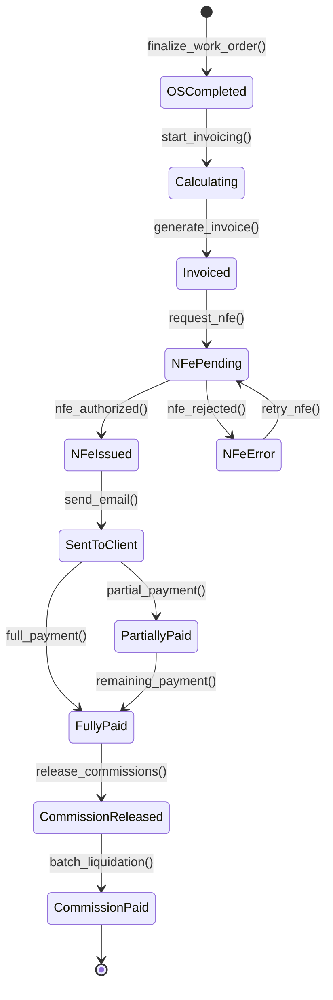
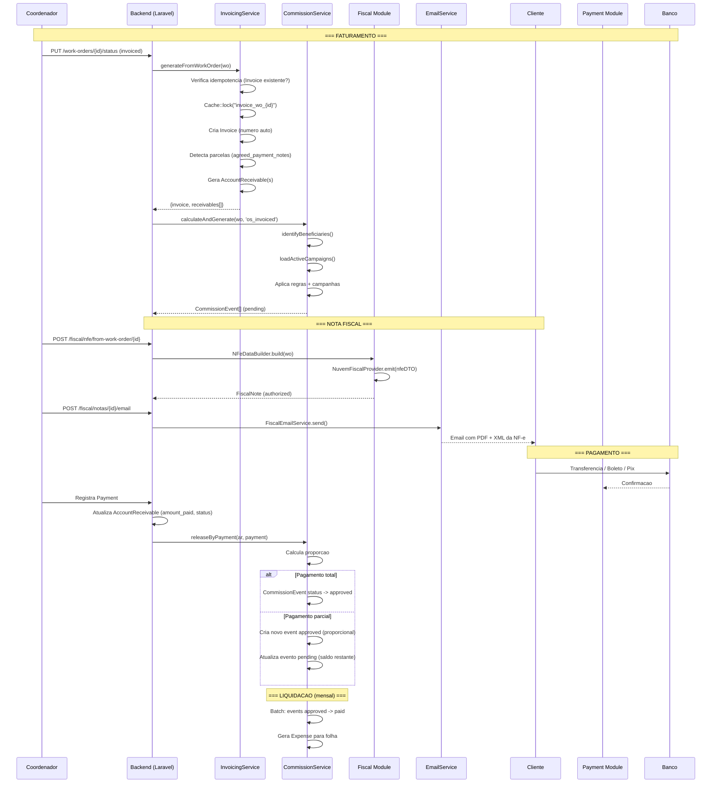

# Fluxo: Faturamento Pos-Servico

> **[AI_RULE]** Documento gerado por IA com base no codigo real do backend.

## 1. Visao Geral

O faturamento pos-servico transforma uma OS completada em registros financeiros, fiscais e de comissao. O fluxo envolve: calculo de valor, geracao de fatura, emissao de nota fiscal, cobranca e baixa financeira.

---

## 2. State Machine — Faturamento Pós-Serviço



### Guards de Transição `[AI_RULE]`

| Transição | Guard |
|-----------|-------|
| `OSCompleted → Calculating` | `wo.status = 'completed' AND wo.total > 0 AND wo.is_warranty = false` |
| `Calculating → Invoiced` | `idempotency_check: no_existing_invoice AND Cache::lock acquired` |
| `Invoiced → NFePending` | `invoice_id IS NOT NULL` |
| `NFePending → NFeIssued` | `fiscal_note.status = 'authorized' AND protocol IS NOT NULL` |
| `SentToClient → PartiallyPaid` | `payment.amount < account_receivable.amount` |
| `SentToClient → FullyPaid` | `payment.amount >= account_receivable.amount` |
| `FullyPaid → CommissionReleased` | `commission_events.where(status, 'pending').count > 0` |
| `CommissionReleased → CommissionPaid` | `batch_run = true AND all events approved` |

---

## 3. Pipeline de Faturamento

```
OS Completada
  |
  v
Calcula valor total (pecas + servicos + deslocamento - desconto)
  |
  v
InvoicingService.generateFromWorkOrder()
  |
  +-- Cria Invoice (numero automatico)
  |
  +-- Cria AccountReceivable (1 ou N parcelas)
  |
  v
Emissao de NF-e / NFS-e (manual via rota fiscal)
  |
  v
Envio ao cliente (email com PDF + XML)
  |
  v
Cliente paga (registro de Payment)
  |
  v
Baixa do AccountReceivable
  |
  v
Liberacao de comissoes (CommissionService.releaseByPayment)
```

---

## 3. Calculo do Valor da OS

### 3.1 Composicao

```
Total OS = SUM(items.total) + displacement_value - discount
         = (pecas + servicos + mao_de_obra) + deslocamento - desconto
```

### 3.2 Items da OS

Cada `WorkOrderItem` tem:

| Campo | Tipo | Descricao |
|-------|------|-----------|
| `type` | string | `product` ou `service` |
| `quantity` | decimal | Quantidade |
| `unit_price` | decimal | Preco unitario |
| `cost_price` | decimal | Custo (para margem) |
| `total` | decimal | quantity * unit_price |

### 3.3 Contexto de Calculo (CommissionService)

O `CommissionService::buildCalculationContext()` extrai:

```php
[
    'gross'           => $wo->total,
    'expenses'        => Expense::where('work_order_id', $wo->id)->sum('amount'),
    'displacement'    => $wo->displacement_value,
    'products_total'  => sum(items where type=product),
    'services_total'  => sum(items where type=service),
    'cost'            => sum(items.cost_price * items.quantity),
    'items_count'     => $wo->items->count(),
]
```

---

## 4. Geracao de Fatura (InvoicingService)

### 4.1 Fluxo Principal

```php
// InvoicingService::generateFromWorkOrder($wo, $userId, $installments)

// 1. Idempotencia: verifica se ja existe Invoice para a OS
$existing = Invoice::where('work_order_id', $wo->id)
    ->where('status', '!=', 'cancelled')->first();

// 2. Lock de concorrencia (Cache::lock)
$lock = Cache::lock("invoice_wo_{$wo->id}", 30);

// 3. Cria Invoice dentro de transaction
$invoice = Invoice::create([
    'invoice_number' => Invoice::nextNumber($tenantId),
    'total'          => $wo->total,
    'discount'       => $discountAmount,
    'status'         => 'issued',
    'issued_at'      => now(),
    'due_date'       => now()->addDays($paymentDays),
]);

// 4. Gera recebiveis (1 ou N parcelas)
$receivables = $this->generateReceivables($wo, $invoice, ...);
```

### 4.2 Deteccao Automatica de Parcelas

O sistema detecta parcelas a partir do campo `agreed_payment_notes`:

```php
// Patterns reconhecidos:
// "3x", "3X", "em 3x" -> 3 parcelas
// "3 parcelas", "5 Parcelas" -> N parcelas
// Limite: 1 a 24 parcelas
```

### 4.3 Geracao de Parcelas (bcmath)

```php
// Divisao precisa com bcmath
$installmentAmount = bcdiv($total, (string) $numInstallments, 2);
$remainder = bcsub($total, bcmul($installmentAmount, (string) $numInstallments, 2), 2);

// Primeira parcela absorve o centavo restante
// Vencimentos: D+paymentDays, D+paymentDays+30, D+paymentDays+60, ...
```

### 4.4 Prazo de Pagamento

Configuravel via `SystemSetting`:

```php
$paymentDays = SystemSetting::where('key', 'default_payment_days')->value('value') ?? 30;
```

---

## 5. Regras de Faturamento

### 5.1 Individual vs Agrupado

| Modo | Descricao | Implementacao |
|------|-----------|---------------|
| **Individual** | 1 Invoice por OS | `InvoicingService.generateFromWorkOrder()` |
| **Agrupado** | 1 Invoice para N OS do mesmo cliente | `InvoicingService.generateBatch()` |

#### Faturamento Agrupado — Especificacao Completa

**Endpoint**

| Item | Detalhe |
|------|---------|
| Rota | `POST /api/v1/invoices/batch` |
| Permissao | `finance.invoices.create` |
| FormRequest | `BatchInvoiceRequest` |

**FormRequest: `BatchInvoiceRequest`**

```php
class BatchInvoiceRequest extends FormRequest
{
    public function rules(): array
    {
        return [
            'customer_id' => 'required|exists:customers,id',
            'work_order_ids' => 'required|array|min:2|max:50',
            'work_order_ids.*' => 'required|integer|exists:work_orders,id',
            'installments' => 'nullable|integer|min:1|max:24',
            'payment_notes' => 'nullable|string|max:500',
            'discount' => 'nullable|numeric|min:0',
            'discount_reason' => 'required_with:discount|string|min:10|max:500',
        ];
    }
}
```

**Implementacao: `InvoicingService::generateBatch()`**

```php
public function generateBatch(int $customerId, array $workOrderIds, int $userId, ?int $installments = null): Invoice
{
    return DB::transaction(function () use ($customerId, $workOrderIds, $userId, $installments) {
        $tenantId = auth()->user()->current_tenant_id;

        // 1. Carrega e valida todas as OS
        $workOrders = WorkOrder::whereIn('id', $workOrderIds)
            ->where('tenant_id', $tenantId)
            ->lockForUpdate()
            ->get();

        // Validacoes
        if ($workOrders->count() !== count($workOrderIds)) {
            throw ValidationException::withMessages(['work_order_ids' => 'Uma ou mais OS nao encontradas']);
        }

        $invalidCustomer = $workOrders->where('customer_id', '!=', $customerId);
        if ($invalidCustomer->isNotEmpty()) {
            throw ValidationException::withMessages(['customer_id' => 'Todas as OS devem pertencer ao mesmo cliente']);
        }

        $alreadyInvoiced = $workOrders->filter(fn($wo) =>
            Invoice::where('work_order_id', $wo->id)->where('status', '!=', 'cancelled')->exists()
        );
        if ($alreadyInvoiced->isNotEmpty()) {
            throw ValidationException::withMessages([
                'work_order_ids' => "OS ja faturadas: " . $alreadyInvoiced->pluck('business_number')->join(', ')
            ]);
        }

        $warrantyOs = $workOrders->where('is_warranty', true);
        if ($warrantyOs->isNotEmpty()) {
            throw ValidationException::withMessages([
                'work_order_ids' => "OS de garantia nao podem ser faturadas: " . $warrantyOs->pluck('business_number')->join(', ')
            ]);
        }

        // 2. Calcula total consolidado
        $totalGross = $workOrders->sum('total');
        $totalDiscount = $workOrders->sum('discount');

        // 3. Aplica desconto SLA se aplicavel
        $slaPenalties = $workOrders->map(fn($wo) => SlaPolicy::calculatePenalty($wo))->filter();
        $slaDiscountTotal = $slaPenalties->sum(fn($p) => $p->penaltyAmount);

        $invoiceTotal = bcsub(bcsub((string) $totalGross, (string) $totalDiscount, 2), $slaDiscountTotal, 2);

        // 4. Monta items consolidados
        $items = [];
        foreach ($workOrders as $wo) {
            foreach ($wo->items as $item) {
                $items[] = [
                    'description' => "[OS #{$wo->business_number}] {$item->description}",
                    'quantity' => $item->quantity,
                    'unit_price' => $item->unit_price,
                    'total' => $item->total,
                    'type' => $item->type,
                    'work_order_id' => $wo->id,
                ];
            }
        }

        // 5. Cria Invoice
        $lock = Cache::lock("invoice_batch_{$customerId}_" . md5(implode(',', $workOrderIds)), 30);
        if (!$lock->get()) {
            throw new \RuntimeException('Faturamento em lote ja em processamento');
        }

        $invoice = Invoice::create([
            'tenant_id' => $tenantId,
            'customer_id' => $customerId,
            'invoice_number' => Invoice::nextNumber($tenantId),
            'total' => $invoiceTotal,
            'discount' => bcadd((string) $totalDiscount, $slaDiscountTotal, 2),
            'items' => $items,
            'status' => 'issued',
            'issued_at' => now(),
            'due_date' => now()->addDays($this->getPaymentDays()),
            'observations' => 'Fatura consolidada - OS: ' . $workOrders->pluck('business_number')->join(', '),
        ]);

        // 6. Vincula cada OS a Invoice
        foreach ($workOrders as $wo) {
            $wo->update(['invoice_id' => $invoice->id, 'status' => 'invoiced']);
        }

        // 7. Gera recebiveis
        $this->generateReceivables($workOrders->first(), $invoice, $installments);

        $lock->release();
        return $invoice;
    });
}
```

### 5.2 Contrato vs Ad-hoc

| Tipo | Descricao | Implementacao |
|------|-----------|---------------|
| **Ad-hoc** | OS avulsa, faturada individualmente | Sim |
| **Contrato** | OS recorrente via `RecurringContract` | Sim (gera OS automatica) |

Rotas de contratos recorrentes:

```
GET  /recurring-contracts
POST /recurring-contracts
POST /recurring-contracts/{id}/generate  (gera OS do periodo)
```

### 5.3 Desconto Automatico por Violacao de SLA

Quando o SLA e violado, o sistema aplica desconto automatico no faturamento via integracao com `SlaPolicy::calculatePenalty()` (especificado em `SLA-ESCALONAMENTO.md` secao 6.1).

| Violacao | Desconto | Base de Calculo |
|----------|----------|-----------------|
| SLA estourado ate 2h | 5% | Mao de obra (`services_total`) |
| SLA estourado 2-8h | 10% | Mao de obra (`services_total`) |
| SLA estourado > 8h | 15% | Mao de obra (`services_total`) |
| SLA critico/emergencia estourado | 20% | Total da OS |

**Integracao no `InvoicingService`**

```php
// InvoicingService::generateFromWorkOrder() — antes de criar Invoice
$slaPenalty = SlaPolicy::calculatePenalty($wo);
if ($slaPenalty) {
    $discountBase = ($wo->priority === 'emergency' || $wo->is_emergency)
        ? $wo->total
        : $wo->items()->where('type', 'service')->sum('total');

    $slaDiscount = bcmul((string) $discountBase, bcdiv((string) $slaPenalty->penaltyPercent, '100', 4), 2);

    // Item separado na Invoice para transparencia
    $invoiceItems[] = [
        'description' => "Desconto SLA ({$slaPenalty->penaltyPercent}% - atraso de {$slaPenalty->overtimeHours}h)",
        'quantity' => 1,
        'unit_price' => "-{$slaDiscount}",
        'total' => "-{$slaDiscount}",
        'type' => 'sla_discount',
    ];

    // Log para auditoria
    AuditLog::record('sla_discount_applied', [
        'work_order_id' => $wo->id,
        'discount_percent' => $slaPenalty->penaltyPercent,
        'discount_amount' => $slaDiscount,
        'overtime_hours' => $slaPenalty->overtimeHours,
    ]);
}
```

**Configuracao por Tenant**

```php
// TenantSetting keys:
// 'sla_penalty_enabled' => true (default: true)
// 'sla_penalty_rate_per_hour' => 5.0 (default: 5% por hora)
// 'sla_penalty_max_percent' => 20.0 (default: 20%)
// 'sla_penalty_base' => 'services' (default) ou 'total'
```

[AI_RULE] Desconto por SLA e configuravel por tenant via `TenantSetting`. Percentuais acima sao defaults. O desconto DEVE aparecer como linha separada na fatura para transparencia com o cliente.

### 5.4 OS de Garantia

```php
// CommissionService: nao gera comissao para OS de garantia
if ($wo->is_warranty || $wo->total <= 0) {
    return [];
}
```

---

## 6. Emissao de Nota Fiscal

### 6.1 Rotas Disponiceis

| Tipo | Rota | Descricao |
|------|------|-----------|
| NF-e (produto) | `POST /fiscal/nfe` | Emissao manual |
| NF-e da OS | `POST /fiscal/nfe/from-work-order/{id}` | Automatica a partir da OS |
| NFS-e (servico) | `POST /fiscal/nfse` | Emissao manual |
| NFS-e da OS | `POST /fiscal/nfse/from-work-order/{id}` | Automatica a partir da OS |
| NF-e do Orcamento | `POST /fiscal/nfe/from-quote/{id}` | A partir do orcamento |
| Batch | `POST /fiscal/batch` | Emissao em lote |

### 6.2 Providers Implementados

| Provider | Classe | Status |
|----------|--------|--------|
| Nuvem Fiscal | `NuvemFiscalProvider` | Implementado |
| Focus NF-e | `FocusNFeProvider` | Implementado |
| Externo | `ExternalNFeAdapter` | Implementado |

### 6.3 Data Builders

- `NFeDataBuilder` - Constroi payload para NF-e (ICMS, CFOP, etc)
- `NFSeDataBuilder` - Constroi payload para NFS-e (ISS, LC 116, etc)

### 6.4 Envio por Email

```
POST /fiscal/notas/{id}/email
Service: FiscalEmailService
```

Envia XML + PDF da nota fiscal ao cliente por email.

---

## 7. Cobranca e Pagamento

### 7.1 Automacao de Cobranca

| Servico | Descricao |
|---------|-----------|
| `CollectionAutomationService` | Regras de cobranca automatica |
| `CollectionRule` | Configuracao de regras |
| `CollectionAction` | Acoes executadas |
| `CollectionActionLog` | Log de acoes |

### 7.2 Baixa Financeira

Ao registrar pagamento:

1. `Payment` e criado
2. `AccountReceivable.amount_paid` atualizado
3. `AccountReceivable.status` -> `paid` (se total) ou `partial`
4. `CommissionService::releaseByPayment()` libera comissoes

### 7.3 Conciliacao Bancaria

```
POST /bank-reconciliation/import          (importa extrato OFX/CSV)
POST /bank-reconciliation/entries/{id}/match  (associa lancamento)
GET  /bank-reconciliation/entries/{id}/suggestions  (sugestoes automaticas)
```

O `ReconciliationRule` permite regras automaticas de associacao.

---

## 8. Comissoes Pos-Faturamento

### 8.1 Triggers

| Trigger | Momento | Acao |
|---------|---------|------|
| `os_completed` | OS finalizada | Gera CommissionEvent (pending) |
| `os_invoiced` | OS faturada | Gera CommissionEvent (pending) |
| `installment_paid` | Parcela paga | Libera proporcional |

### 8.2 Liberacao Proporcional

```php
// CommissionService::releaseByPayment()
// OS total: R$ 10.000 | Comissao: R$ 1.000
// Pagamento: R$ 5.000 -> libera R$ 500 (50%)

$proportion = bcdiv($paymentAmount, (string) $wo->total, 4);
$proportionalAmount = bcmul($event->commission_amount, $proportion, 2);
```

### 8.3 Estorno

```php
// CommissionService::reverseByPayment()
// Se pagamento e estornado, comissao volta para PENDING
// Se comissao ja foi PAID (liquidada), bloqueia estorno:
abort(422, 'Nao e possivel estornar pagamento com comissao ja liquidada.');
```

### 8.4 Simulacao

```php
// CommissionService::simulate($wo)
// Retorna preview sem salvar - para UI
// Inclui: user_name, rule_name, calculation_type, amount, campaign multiplier
```

---

## 9. Diagrama de Sequencia



---

## 10. Cenarios BDD

### Cenario 1: Faturamento simples

```gherkin
Funcionalidade: Faturamento pos-servico

  Cenario: OS simples faturada a vista
    Dado uma OS completada com total R$ 1.500
    E configuracao default_payment_days = 30
    Quando a OS e faturada
    Entao uma Invoice e criada com total R$ 1.500
    E um AccountReceivable e criado com due_date = hoje + 30 dias
    E o status do AccountReceivable e "pending"
```

### Cenario 2: Faturamento parcelado

```gherkin
  Cenario: OS faturada em 3 parcelas
    Dado uma OS completada com total R$ 10.000
    E agreed_payment_notes = "3x"
    Quando a OS e faturada
    Entao uma Invoice e criada com total R$ 10.000
    E 3 AccountReceivables sao criados
    E a 1a parcela e R$ 3.333,34 (absorve centavo)
    E as demais sao R$ 3.333,33
    E os vencimentos sao espa ados em 30 dias
```

### Cenario 3: Idempotencia

```gherkin
  Cenario: Faturamento duplicado e bloqueado
    Dado uma OS ja faturada com Invoice existente
    Quando o InvoicingService e chamado novamente
    Entao retorna a Invoice existente
    E nao cria duplicata
```

### Cenario 4: NF-e a partir da OS

```gherkin
  Cenario: Emissao de NF-e de servico
    Dado uma OS faturada do tipo servico
    Quando POST /fiscal/nfse/from-work-order/{id}
    Entao o NFSeDataBuilder constroi o payload
    E o NuvemFiscalProvider emite a nota
    E a FiscalNote e criada com status "authorized"
```

### Cenario 5: Comissao liberada por pagamento

```gherkin
  Cenario: Pagamento parcial libera comissao proporcional
    Dado uma OS com total R$ 10.000
    E comissao pendente do tecnico de R$ 500
    Quando o cliente paga R$ 5.000 (50%)
    Entao R$ 250 da comissao e liberada (approved)
    E R$ 250 permanece pendente
```

### Cenario 6: Estorno bloqueia comissao paga

```gherkin
  Cenario: Estorno de pagamento com comissao ja liquidada
    Dado um pagamento de R$ 5.000 com comissao PAID
    Quando tenta estornar o pagamento
    Entao o sistema retorna erro 422
    E mensagem "Nao e possivel estornar pagamento com comissao ja liquidada"
```

### Cenario 7: OS de garantia sem faturamento

```gherkin
  Cenario: OS de garantia nao gera comissao
    Dado uma OS com is_warranty = true
    Quando a OS e completada
    Entao CommissionService retorna array vazio
    E nenhum CommissionEvent e criado
```

---

## 11. Modelo de Dados

```
WorkOrder (status: completed -> invoiced)
  |
  +-- Invoice
  |     - invoice_number (auto-incremento por tenant)
  |     - total, discount
  |     - status: issued -> paid -> cancelled
  |     - items (JSON: description, quantity, unit_price, total, type)
  |
  +-- AccountReceivable (1..N)
  |     - amount, amount_paid
  |     - due_date
  |     - status: pending -> partial -> paid
  |     - invoice_id (FK)
  |
  +-- Payment (1..N por AccountReceivable)
  |     - amount
  |     - payment_method
  |
  +-- CommissionEvent (1..N)
  |     - commission_amount
  |     - base_amount
  |     - proportion
  |     - status: pending -> approved -> paid -> reversed
  |
  +-- FiscalNote
        - type: nfe | nfse
        - status: pending -> authorized -> cancelled
        - protocol, access_key
```

---

## 12. Gaps e Melhorias Futuras

| # | Gap | Status |
|---|-----|--------|
| 1 | Faturamento agrupado (N OS -> 1 Invoice) | Especificado na secao 5.1 — `InvoicingService::generateBatch()` completo |
| 2 | Desconto automatico por violacao de SLA | Especificado na secao 5.3 — integrado com `SlaPolicy::calculatePenalty()` |
| 3 | Emissao automatica de NF-e apos faturamento | Especificado abaixo (12.1) |
| 4 | Gateway de pagamento (Pix automatico, boleto) | Especificado abaixo (12.2) |
| 5 | Notificacao push ao cliente sobre fatura | Especificado abaixo (12.3) |
| 6 | Relatorio DRE por OS | Implementado (`DREService`) |
| 7 | Projecao de fluxo de caixa com parcelas | Implementado (`CashFlowProjectionService`) |

### 12.1 Emissao Automatica de NF-e Apos Faturamento

**Evento**: `InvoiceCreated`

**Listener**: `AutoEmitNFeOnInvoice`

```php
class AutoEmitNFeOnInvoice
{
    public function handle(InvoiceCreated $event): void
    {
        $invoice = $event->invoice;
        $tenant = Tenant::find($invoice->tenant_id);

        // Verifica se tenant tem emissao automatica habilitada
        if (!TenantSetting::get($invoice->tenant_id, 'auto_emit_nfe', false)) {
            return;
        }

        // Verifica se provider fiscal esta configurado
        if (!$tenant->fiscal_provider) {
            SystemAlert::create([
                'tenant_id' => $invoice->tenant_id,
                'severity' => 'warning',
                'message' => "NF-e automatica nao emitida para Invoice #{$invoice->invoice_number}: provider fiscal nao configurado",
            ]);
            return;
        }

        // Dispatch job com retry
        EmitNFeJob::dispatch($invoice->id)->onQueue('fiscal');
    }
}
```

**Job: `EmitNFeJob`**

```php
class EmitNFeJob implements ShouldQueue
{
    public int $tries = 3;
    public array $backoff = [60, 300, 900]; // 1min, 5min, 15min

    public function handle(FiscalService $fiscalService): void
    {
        $invoice = Invoice::findOrFail($this->invoiceId);
        $wo = $invoice->workOrder;

        if (!$wo) {
            Log::warning("EmitNFeJob: Invoice #{$invoice->id} sem WorkOrder vinculada");
            return;
        }

        // Determina tipo: NF-e (produto) ou NFS-e (servico)
        $hasProducts = collect($invoice->items)->where('type', 'product')->isNotEmpty();
        $hasServices = collect($invoice->items)->where('type', 'service')->isNotEmpty();

        if ($hasServices) {
            $fiscalService->emitNfseFromWorkOrder($wo);
        }
        if ($hasProducts) {
            $fiscalService->emitNfeFromWorkOrder($wo);
        }
    }

    public function failed(\Throwable $exception): void
    {
        $invoice = Invoice::find($this->invoiceId);
        SystemAlert::create([
            'tenant_id' => $invoice?->tenant_id,
            'severity' => 'critical',
            'message' => "Falha na emissao automatica de NF-e para Invoice #{$invoice?->invoice_number}: {$exception->getMessage()}",
        ]);

        // Notifica financeiro
        Notification::notify(
            $invoice->tenant_id,
            User::role('financial')->pluck('id'),
            'nfe_auto_emission_failed',
            "Emissao automatica de NF-e falhou apos 3 tentativas para fatura #{$invoice->invoice_number}"
        );
    }
}
```

**Procedimento de Rollback para Falha de NF-e**

```
FALHA DE NF-e DURANTE FATURAMENTO — PROCEDIMENTO DE ROLLBACK

1. NF-e rejeitada pela SEFAZ (codigo de rejeicao retornado):
   a. FiscalNote.status → 'rejected'
   b. FiscalNote.rejection_code e rejection_reason preenchidos
   c. SystemAlert criado com severity 'high'
   d. Invoice permanece com status 'issued' (fatura valida, NF-e pendente)
   e. Job EmitNFeJob re-enfileirado com backoff exponencial (1min, 5min, 15min)

2. Apos 3 tentativas falhadas:
   a. FiscalNote.status → 'failed'
   b. SystemAlert criado com severity 'critical'
   c. Financeiro notificado para emissao manual
   d. Invoice NAO e cancelada (cobranca prossegue, NF-e sera emitida manualmente)

3. Se o erro indica dados incorretos (CNPJ, endereco, CFOP):
   a. FiscalNote.status → 'data_error'
   b. Notificacao especifica ao financeiro com campo que precisa correcao
   c. Apos correcao manual: POST /fiscal/nfe/retry/{fiscal_note_id}

4. Se NF-e foi autorizada mas precisa ser cancelada (ex: Invoice cancelada por contestacao):
   a. POST /fiscal/notas/{id}/cancel
   b. FiscalNote.status → 'cancel_requested'
   c. Provider envia evento de cancelamento a SEFAZ
   d. Se SEFAZ aceita: FiscalNote.status → 'cancelled'
   e. Se SEFAZ rejeita cancelamento (> 24h): emitir NF-e de ajuste (entrada)
      → POST /fiscal/nfe/adjustment com referencia a NF-e original
```

### 12.2 Gateway de Pagamento (`PaymentGatewayContract`)

**Interface**

```php
interface PaymentGatewayContract
{
    /**
     * Criar cobranca (PIX, boleto ou cartao).
     */
    public function createCharge(ChargeDTO $charge): ChargeResult;

    /**
     * Consultar status de cobranca.
     */
    public function getChargeStatus(string $externalId): ChargeStatus;

    /**
     * Cancelar cobranca pendente.
     */
    public function cancelCharge(string $externalId): bool;

    /**
     * Processar estorno.
     */
    public function refund(string $externalId, ?string $amount = null): RefundResult;

    /**
     * Validar assinatura do webhook.
     */
    public function validateWebhookSignature(Request $request): bool;

    /**
     * Parsear payload do webhook.
     */
    public function parseWebhookPayload(Request $request): WebhookPayload;
}
```

**DTOs**

```php
class ChargeDTO
{
    public function __construct(
        public readonly string $method,       // 'pix', 'boleto', 'credit_card'
        public readonly string $amount,        // decimal string
        public readonly string $description,
        public readonly string $customerName,
        public readonly string $customerDocument, // CPF/CNPJ
        public readonly string $customerEmail,
        public readonly ?Carbon $dueDate = null,
        public readonly ?int $installments = null,
        public readonly array $metadata = [],
    ) {}
}

class ChargeResult
{
    public function __construct(
        public readonly string $externalId,
        public readonly string $status,       // 'pending', 'paid', 'failed'
        public readonly ?string $pixQrCode = null,
        public readonly ?string $pixCopyPaste = null,
        public readonly ?string $boletoUrl = null,
        public readonly ?string $boletoBarcode = null,
        public readonly ?string $paymentUrl = null,
    ) {}
}
```

**Adaptadores Implementados**

| Gateway | Classe | Metodos de Pagamento |
|---------|--------|---------------------|
| Asaas | `AsaasGatewayAdapter` | PIX, Boleto, Cartao |
| PagBank | `PagBankGatewayAdapter` | PIX, Boleto, Cartao |
| Efi (Gerencianet) | `EfiGatewayAdapter` | PIX, Boleto |
| Inter | `InterGatewayAdapter` | PIX, Boleto |
| Manual | `ManualGatewayAdapter` | Registro sem integracao |

**Configuracao por Tenant**

```php
// TenantSetting keys:
// 'payment_gateway' => 'asaas' (default)
// 'payment_gateway_api_key' => '...' (criptografado)
// 'payment_gateway_sandbox' => true/false
// 'payment_auto_generate_on_invoice' => true/false
// 'payment_default_method' => 'pix'
```

**Webhook Endpoint**

| Rota | `POST /api/v1/payments/webhook/{gateway}` |
|------|------------------------------------------|
| Auth | Validacao de assinatura por gateway (HMAC, IP whitelist) |
| Acao | Baixa automatica de `AccountReceivable`, liberacao de comissao |

### 12.3 Notificacao Push ao Cliente sobre Fatura (`ClientNotificationService`)

**Servico**

```php
class ClientNotificationService
{
    /**
     * Notifica cliente sobre fatura emitida.
     * Canais: Email (obrigatorio) + WhatsApp (se configurado) + FCM Push (se app instalado)
     */
    public function notifyInvoiceIssued(Invoice $invoice): void
    {
        $customer = $invoice->customer;
        $channels = $this->resolveChannels($customer);

        // 1. Email (sempre)
        Mail::to($customer->email)->queue(new InvoiceIssuedMail($invoice));

        // 2. WhatsApp (se configurado e ativo)
        if (in_array('whatsapp', $channels)) {
            app(WhatsAppService::class)->sendTemplate(
                $customer->phone,
                'fatura_emitida',
                [
                    'invoice_number' => $invoice->invoice_number,
                    'total' => number_format($invoice->total, 2, ',', '.'),
                    'due_date' => $invoice->due_date->format('d/m/Y'),
                    'payment_link' => route('portal.invoices.show', $invoice->id),
                ]
            );
        }

        // 3. FCM Push (se cliente tem app)
        if (in_array('push', $channels)) {
            app(FcmService::class)->sendToCustomer($customer->id, [
                'title' => "Fatura #{$invoice->invoice_number}",
                'body' => "Nova fatura de R$ " . number_format($invoice->total, 2, ',', '.') . " - vencimento " . $invoice->due_date->format('d/m'),
                'data' => ['type' => 'invoice_issued', 'invoice_id' => $invoice->id],
            ]);
        }

        // Log de envio
        MessageLog::create([
            'tenant_id' => $invoice->tenant_id,
            'customer_id' => $customer->id,
            'channels' => $channels,
            'template' => 'fatura_emitida',
            'reference_type' => 'invoice',
            'reference_id' => $invoice->id,
            'sent_at' => now(),
        ]);
    }

    /**
     * Notifica sobre vencimento proximo (D-3) e atraso (D+1, D+7, D+15, D+30).
     */
    public function notifyPaymentReminder(AccountReceivable $ar, string $type): void
    {
        // type: 'upcoming' | 'overdue_1d' | 'overdue_7d' | 'overdue_15d' | 'overdue_30d'
        $templates = [
            'upcoming' => 'fatura_vencendo',
            'overdue_1d' => 'fatura_vencida',
            'overdue_7d' => 'fatura_vencida_7d',
            'overdue_15d' => 'fatura_vencida_15d',
            'overdue_30d' => 'fatura_vencida_30d',
        ];
        // ... mesma logica multicanal
    }

    private function resolveChannels(Customer $customer): array
    {
        $channels = ['email']; // sempre
        if ($customer->phone && WhatsAppConfig::isActive($customer->tenant_id)) {
            $channels[] = 'whatsapp';
        }
        if (FcmDeviceToken::where('customer_id', $customer->id)->exists()) {
            $channels[] = 'push';
        }
        return $channels;
    }
}
```

---

> **[AI_RULE]** Este documento reflete o estado real de `InvoicingService.php`, `WorkOrderInvoicingService.php`, `CommissionService.php`, `FiscalController` e rotas em `financial.php`, `fiscal.php`.

---

## Módulos Envolvidos

| Módulo | Responsabilidade no Fluxo |
|--------|---------------------------|
| [Fiscal](file:///c:/PROJETOS/sistema/docs/modules/Fiscal.md) | Emissão de NF-e/NFS-e vinculada ao serviço |
| [Finance](file:///c:/PROJETOS/sistema/docs/modules/Finance.md) | Geração de contas a receber e conciliação |
| [Email](file:///c:/PROJETOS/sistema/docs/modules/Email.md) | Envio de DANFE e boleto ao cliente |
| [Contracts](file:///c:/PROJETOS/sistema/docs/modules/Contracts.md) | Validação de condições contratuais para faturamento |
