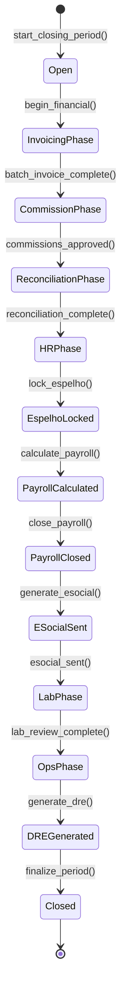
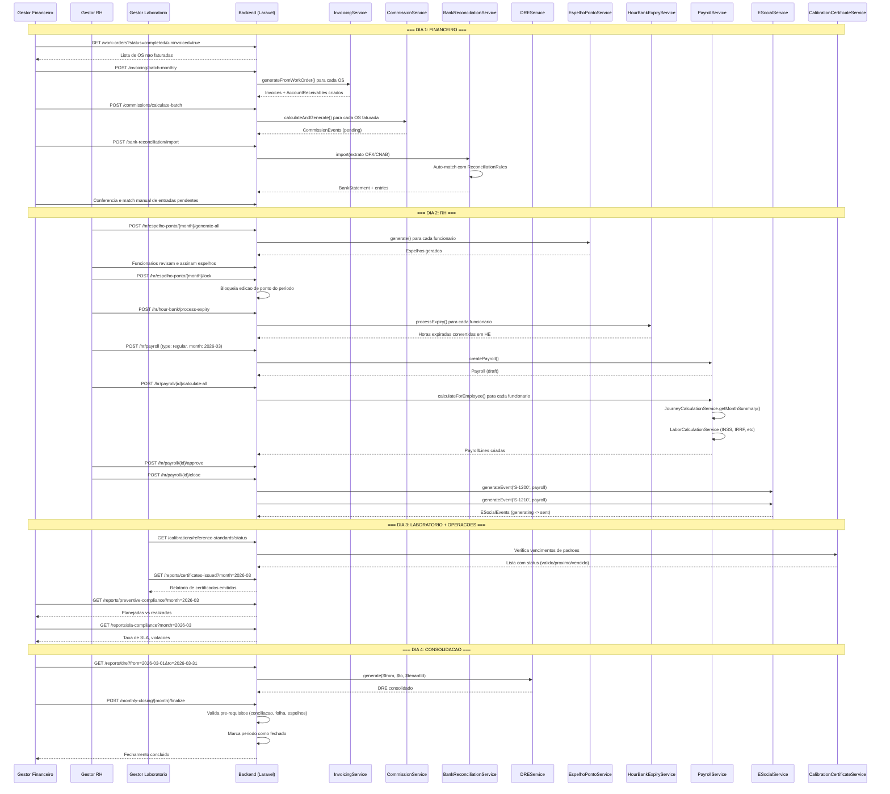

# Fluxo: Fechamento Mensal

> **[AI_RULE]** Documento gerado por IA com base no codigo real do backend. Specs marcados com [SPEC] indicam funcionalidades planejadas.

## 1. Visao Geral

O fechamento mensal consolida todas as areas operacionais do ERP no encerramento de cada periodo contabil. Envolve financeiro, RH/ponto digital, laboratorio de calibracao, e operacoes de campo. O processo segue uma ordem de dependencias para garantir integridade dos dados.

**Prazo padrao**: dia 1 ao dia 5 do mes seguinte (configuravel via `SystemSetting`).

---

## 2. State Machine — Fechamento Mensal



### Guards de Transição `[AI_RULE]`

| Transição | Guard |
|-----------|-------|
| `Open → InvoicingPhase` | `current_date >= closing_start_date (dia 1)` |
| `InvoicingPhase → CommissionPhase` | `wo.where(status, 'completed').uninvoiced.count = 0` |
| `CommissionPhase → ReconciliationPhase` | `commission_events.where(status, 'pending').count = 0` |
| `ReconciliationPhase → HRPhase` | `bank_statement_entries.where(status, 'pending').count = 0` |
| `EspelhoLocked → PayrollCalculated` | `hour_bank_expiry_processed = true` |
| `PayrollCalculated → PayrollClosed` | `payroll.status = 'approved'` |
| `PayrollClosed → ESocialSent` | `esocial_events S-1200 AND S-1210 generated` |
| `DREGenerated → Closed` | `all_prerequisites_met AND period_finalized` |

---

## 3. Checklist de Fechamento

| # | Area | Etapa | Servico Backend | Bloqueante |
|---|------|-------|-----------------|------------|
| 1 | Financeiro | Faturamento em lote de OS nao faturadas | `WorkOrderInvoicingService` | Sim |
| 2 | Financeiro | Calculo e aprovacao de comissoes | `CommissionService` | Sim |
| 3 | Financeiro | Revisao de aging de contas a receber | `CollectionAutomationService` | Nao |
| 4 | Financeiro | Conciliacao bancaria | `BankReconciliationService` | Sim |
| 5 | Financeiro | Geracao do DRE | `DREService` | Sim |
| 6 | RH | Travamento do espelho de ponto | `EspelhoPontoService` | Sim |
| 7 | RH | Verificacao de horas extras | `JourneyCalculationService` | Sim |
| 8 | RH | Expiracao de banco de horas | `HourBankExpiryService` | Sim |
| 9 | RH | Calculo da folha de pagamento | `PayrollService` | Sim |
| 10 | RH | Eventos mensais eSocial | `ESocialService` | Sim |
| 11 | Lab | Status de instrumentos padrao | `CalibrationCertificateService` | Nao |
| 12 | Lab | Padroes vencidos | Verificacao manual + alerta | Nao |
| 13 | Lab | Relatorio de certificados emitidos | `CalibrationCertificateService` | Nao |
| 14 | Operacoes | Preventivas planejadas vs realizadas | Relatorio gerencial | Nao |
| 15 | Operacoes | Relatorio de SLA compliance | `SlaEscalationService` | Nao |

---

## 3. Financeiro

### 3.1 Faturamento em Lote de OS Nao Faturadas

> **[AI_RULE]** Toda OS com status `completed` que nao possui Invoice associada DEVE ser faturada antes do fechamento. Nenhuma OS pode ficar "perdida".

```
Consulta:
  WorkOrder::where('status', 'completed')
    ->whereDoesntHave('invoice')
    ->where('is_warranty', false)
    ->where('total', '>', 0)
    ->get()

Para cada OS:
  WorkOrderInvoicingService::generateReceivableOnInvoice($wo)
  InvoicingService::generateFromWorkOrder($wo, $userId)
```

**Agrupamento por cliente** (batch invoicing):

- OS do mesmo `customer_id` no mesmo periodo podem ser agrupadas em uma unica Invoice
- Campo `Invoice.batch_reference_month` identifica o periodo
- [SPEC] Endpoint `POST /invoicing/batch-monthly` — agrupa OS por `customer_id`, gera Invoice unica por cliente com `batch_reference_month`, cria AccountReceivables correspondentes

### 3.2 Calculo e Aprovacao de Comissoes

```
Fluxo:
  1. CommissionService::calculateAndGenerate($wo, 'os_invoiced')
     -> Cria CommissionEvent (status: pending)

  2. Gestor revisa lista de comissoes pendentes
     GET /commissions?status=pending&month=2026-03

  3. Aprovacao individual ou em lote
     POST /commissions/approve-batch
     -> CommissionEvent.status -> approved

  4. Liquidacao (pagamento efetivo)
     POST /commissions/liquidate-batch
     -> CommissionEvent.status -> paid
     -> Gera Expense para contabilidade
```

> **[AI_RULE]** Comissoes so podem ser liquidadas APOS aprovacao. Comissoes de OS de garantia (`is_warranty=true`) ou valor zero NAO sao geradas (verificacao em `CommissionService`).

### 3.3 Revisao de Aging de Contas a Receber

```
Faixas de aging:
  0-30 dias   -> "current"
  31-60 dias  -> "overdue_30"
  61-90 dias  -> "overdue_60"
  91-120 dias -> "overdue_90"
  120+ dias   -> "overdue_120"

Consulta:
  AccountReceivable::whereIn('status', ['pending', 'overdue'])
    ->selectRaw('DATEDIFF(NOW(), due_date) as days_overdue')
    ->get()
    ->groupBy(fn($ar) => match(true) {
        $ar->days_overdue <= 30 => 'current',
        $ar->days_overdue <= 60 => 'overdue_30',
        $ar->days_overdue <= 90 => 'overdue_60',
        $ar->days_overdue <= 120 => 'overdue_90',
        default => 'overdue_120',
    })
```

Dashboard exibe: total por faixa, percentual de inadimplencia, top 10 devedores.

### 3.4 Conciliacao Bancaria

```
Fluxo:
  1. Importar extrato (OFX/CNAB 240/CNAB 400)
     POST /bank-reconciliation/import
     -> BankReconciliationService::import()

  2. Auto-match com regras existentes
     -> ReconciliationRule aplica matching automatico
     -> BankStatementEntry.status -> 'matched' ou 'pending'

  3. Conferencia manual das entradas nao conciliadas
     GET /bank-reconciliation/entries?status=pending

  4. Match manual
     POST /bank-reconciliation/entries/{id}/match
     -> Associa a AccountReceivable ou AccountPayable

  5. Fechamento do extrato
     POST /bank-reconciliation/statements/{id}/close
```

> **[AI_RULE]** O fechamento do DRE depende da conciliacao bancaria estar completa. Entradas pendentes geram alerta.

### 3.5 Geracao do DRE

```php
// DREService::generate($from, $to, $tenantId)
// Retorna:
[
    'receitas_brutas'          => string,  // Total de CR pagas no periodo
    'deducoes'                 => string,  // Devolucoes/cancelamentos
    'receitas_liquidas'        => string,  // Brutas - deducoes
    'custos_servicos'          => string,  // Expenses vinculadas a OS
    'lucro_bruto'              => string,  // Liquidas - custos
    'despesas_operacionais'    => string,  // Expenses operacionais
    'despesas_administrativas' => string,  // Expenses administrativas
    'despesas_financeiras'     => string,  // Juros, taxas bancarias
    'resultado_operacional'    => string,  // Bruto - despesas
    'resultado_liquido'        => string,  // Final
    'by_month'                 => array,   // Breakdown mensal (para comparativo)
]
```

---

## 4. RH / Ponto Digital

### 4.1 Travamento do Espelho de Ponto

> **[AI_RULE]** Apos o travamento, nenhuma alteracao de ponto e permitida sem autorizacao do gestor de RH. Portaria 671/2021.
> **[AI_RULE_CRITICAL] Travas Absolutas de Conformidade:**
> O espelho de ponto **NÃO PODE SER TRAVADO** (bloqueando a Folha) se:
> 1. Houver eventos de SST (S-2210, S-2220, S-2240) pendentes/rejeitados pelo eSocial no período.
> 2. Estagiários ou Menores Aprendizes possuírem horas extras ou adicional noturno registrados (violação CLT grave).
> 3. Terceirizados (`contract_type='third_party'`) não tiverem sido filtrados do Lote S-1200 da tomadora.

```
Fluxo:
  1. EspelhoPontoService::generate($userId, $year, $month)
     -> Compila: clock entries, journey entries, hour bank

  2. Funcionario revisa e assina digitalmente
     POST /hr/espelho-ponto/{userId}/{month}/approve

  3. Gestor RH confere e trava
     POST /hr/espelho-ponto/{month}/lock
     -> Bloqueia edicao de TimeClockEntry do periodo
     -> Registra audit log

  4. PDF gerado para arquivo
     GET /hr/espelho-ponto/{userId}/{month}/pdf
```

Dados do espelho:

```
- worked_hours (total trabalhado)
- overtime_50 (HE 50%)
- overtime_100 (HE 100%)
- night_hours (adicional noturno)
- absence_hours (faltas/atrasos)
- hour_bank_previous (saldo anterior)
- hour_bank_current (saldo atual)
```

### 4.2 Verificacao de Horas Extras

```
JourneyCalculationService::getMonthSummary($userId, $referenceMonth)
-> Retorna total_overtime_50, total_overtime_100

Verificacoes:
  - HE > 2h/dia -> alerta de violacao CLT (CltViolationService)
  - HE > 44h/mes -> alerta para gestor
  - Interjornada < 11h -> violacao (Art. 66 CLT)
  - Intrajornada < 1h (jornada > 6h) -> violacao (Art. 71 CLT)
```

### 4.3 Expiracao de Banco de Horas

```php
// HourBankExpiryService::processExpiry($userId, $tenantId)
// Art. 59 CLT:
//   §5 - Acordo individual: 6 meses maximo
//   §2 - Acordo coletivo: 12 meses maximo
//   §6 - Compensacao mensal: zera todo mes

// Saldo positivo expirado -> converte em HE 50% (pago)
// Saldo negativo -> empresa absorve (NAO expira)
```

> **[AI_RULE]** Banco de horas DEVE ser processado ANTES do calculo da folha. Horas expiradas viram proventos na PayrollLine.

### 4.4 Calculo da Folha de Pagamento

```
PayrollService::createPayroll($tenantId, '2026-03', 'regular')
-> Cria Payroll (status: draft)

PayrollService::calculateForEmployee($payroll, $user)
-> Usa JourneyCalculationService para dados do mes
-> Usa LaborCalculationService para calculos trabalhistas
-> Proventos: salario base, HE 50%, HE 100%, adicional noturno, DSR
-> Descontos: INSS, IRRF, faltas, vale transporte, beneficios
-> Cria PayrollLine com breakdown completo

Aprovacao:
  POST /hr/payroll/{id}/approve
  -> Payroll.status -> approved

Fechamento:
  POST /hr/payroll/{id}/close
  -> Payroll.status -> closed
  -> Gera Payslip para cada funcionario (PayslipPdfService)
  -> Gera eventos eSocial S-1200 e S-1210
```

### 4.5 Eventos Mensais eSocial

```php
// ESocialService::generateEvent($eventType, $related, $tenantId)
// Eventos mensais obrigatorios:

'S-1200' -> Remuneracao (vinculado a Payroll)
'S-1210' -> Pagamentos (vinculado a Payroll)
'S-2230' -> Afastamentos do mes (se houver)

// Fluxo:
// 1. Calcula folha (PayrollService)
// 2. Gera XML do S-1200 (remuneracao)
// 3. Gera XML do S-1210 (pagamento)
// 4. Envia ao portal eSocial (environment: production ou restricted)
// 5. Registra ESocialEvent com status de retorno
```

---

## 5. Laboratorio de Calibracao

### 5.1 Status de Instrumentos Padrao (Referencia)

```
Verificacao mensal:
  EquipmentCalibration::where('equipment_type', 'reference_standard')
    ->where('next_calibration_date', '<=', now()->addDays(30))
    ->get()

Resultado:
  - Instrumentos com calibracao em dia (validos)
  - Instrumentos proximos do vencimento (< 30 dias)
  - Instrumentos vencidos (bloqueio de uso)
```

> **[AI_RULE]** Instrumento padrao vencido impede emissao de certificados que o referenciem. ISO 17025.

### 5.2 Padroes Vencidos

```
Alerta automatico:
  AlertEngineService detecta instrumentos com next_calibration_date < now()
  -> Gera SystemAlert para gestor do laboratorio
  -> Bloqueia uso em novas calibracoes

Acao corretiva:
  - Enviar para calibracao externa (RBC/Inmetro)
  - Substituir por instrumento reserva
  - Registrar desvio no CAPA (CapaRecord)
```

### 5.3 Relatorio de Certificados Emitidos

```
Consulta mensal:
  EquipmentCalibration::where('status', 'approved')
    ->whereBetween('approved_at', [$startOfMonth, $endOfMonth])
    ->count()

Metricas:
  - Total de certificados emitidos
  - Tempo medio de emissao (created_at -> approved_at)
  - Certificados por tecnico
  - Certificados por tipo de equipamento
  - Taxa de rejeicao (calibracoes reprovadas)
```

---

## 6. Operacoes

### 6.1 Preventivas Planejadas vs Realizadas

```
Consulta:
  Planejadas: WorkOrder::where('type', 'preventive')
    ->whereBetween('scheduled_date', [$start, $end])
    ->count()

  Realizadas: WorkOrder::where('type', 'preventive')
    ->whereIn('status', ['completed', 'invoiced'])
    ->whereBetween('completed_at', [$start, $end])
    ->count()

  Taxa = Realizadas / Planejadas * 100

Dashboard:
  - % de cumprimento
  - Preventivas atrasadas (nao realizadas)
  - Motivos de nao realizacao
  - Comparativo com meses anteriores
```

### 6.2 Relatorio de SLA Compliance

```
SlaEscalationService::runSlaChecks($tenantId)
-> checked, escalated, breached

Metricas mensais:
  - Total de OS no periodo
  - OS dentro do SLA
  - OS com SLA violado (breached)
  - Tempo medio de atendimento vs SLA contratado
  - Top 5 clientes com mais violacoes
  - Taxa de SLA compliance = (Total - Breached) / Total * 100
```

---

## 7. Diagrama de Sequencia - Fechamento Mensal Completo



---

## 8. Cenarios BDD

### Cenario 1: Faturamento em lote mensal

```gherkin
Funcionalidade: Fechamento mensal - Faturamento

  Cenario: Faturamento em lote de OS completadas
    Dado 5 OS com status "completed" sem Invoice associada
    E 2 OS de garantia (is_warranty=true)
    Quando o faturamento em lote e executado
    Entao 5 Invoices sao criadas (apenas OS nao-garantia com valor > 0)
    E 5 AccountReceivables sao criados
    E as 2 OS de garantia permanecem sem Invoice
```

### Cenario 2: Comissoes mensais

```gherkin
  Cenario: Calculo e aprovacao de comissoes do mes
    Dado 10 OS faturadas no mes com comissoes pendentes
    E regras de comissao ativas para tecnicos e vendedores
    Quando o calculo em lote e executado
    Entao CommissionEvents sao criados para cada beneficiario
    E o status de cada evento e "pending"
    Quando o gestor aprova o lote
    Entao o status muda para "approved"
    Quando o gestor liquida o lote
    Entao o status muda para "paid"
    E Expenses sao geradas para a contabilidade
```

### Cenario 3: Conciliacao bancaria

```gherkin
  Cenario: Importacao e conciliacao de extrato
    Dado um extrato OFX com 50 lancamentos
    E 30 AccountReceivables pendentes no periodo
    Quando o extrato e importado
    Entao 50 BankStatementEntries sao criadas
    E o auto-match associa pelo menos 20 entradas
    E as entradas nao conciliadas ficam com status "pending"
```

### Cenario 4: Espelho de ponto e travamento

```gherkin
Funcionalidade: Fechamento mensal - RH

  Cenario: Travamento do espelho de ponto
    Dado espelhos de ponto gerados para 15 funcionarios
    E todos os funcionarios assinaram digitalmente
    Quando o gestor RH trava o mes
    Entao nenhuma alteracao de TimeClockEntry e permitida no periodo
    E um audit log e registrado
```

### Cenario 5: Banco de horas expirando

```gherkin
  Cenario: Expiracao de banco de horas (acordo individual 6 meses)
    Dado um funcionario com 20h positivas no banco de horas
    E as horas foram creditadas ha 7 meses
    E o acordo e individual (limite 6 meses - Art. 59 §5 CLT)
    Quando o processamento de expiracao e executado
    Entao as 20h sao convertidas em HE 50%
    E uma HourBankTransaction de debito e criada
    E o saldo do banco de horas e zerado
```

### Cenario 6: Folha de pagamento completa

```gherkin
  Cenario: Calculo da folha com horas extras e descontos
    Dado um funcionario com salario R$ 3.000
    E 20h extras a 50% no mes
    E 5h extras a 100% no mes
    E 3h de adicional noturno
    Quando a folha e calculada
    Entao o PayrollLine contem:
      | provento            | valor     |
      | Salario base        | 3.000,00  |
      | HE 50%              | 409,08    |
      | HE 100%             | 272,72    |
      | Adicional noturno   | 24,00     |
    E os descontos de INSS e IRRF sao aplicados corretamente
```

### Cenario 7: Padrao de referencia vencido

```gherkin
Funcionalidade: Fechamento mensal - Laboratorio

  Cenario: Bloqueio por padrao vencido
    Dado um instrumento padrao com next_calibration_date = ontem
    Quando o relatorio de status e gerado
    Entao o instrumento aparece como "vencido"
    E novas calibracoes que referenciem este padrao sao bloqueadas
    E um SystemAlert e gerado para o gestor do laboratorio
```

### Cenario 8: DRE consolidado

```gherkin
Funcionalidade: Fechamento mensal - Consolidacao

  Cenario: DRE depende de pre-requisitos
    Dado que a conciliacao bancaria esta incompleta
    E existem 5 entradas nao conciliadas
    Quando o DRE e solicitado
    Entao o DRE e gerado com alerta de pendencias
    E o campo "pendencias" lista as entradas nao conciliadas
```

### Cenario 9: eSocial mensal

```gherkin
  Cenario: Eventos eSocial apos fechamento da folha
    Dado uma folha aprovada e fechada para marco/2026
    Quando os eventos eSocial sao gerados
    Entao um ESocialEvent S-1200 (remuneracao) e criado
    E um ESocialEvent S-1210 (pagamentos) e criado
    E o XML segue o layout S-1.2
    E o status inicial e "generating"
```

---

## 8.1 Especificacoes Tecnicas

### Concorrência no Fechamento
- **Lock:** `Cache::lock("period_close:{$tenantId}:{$period}", 3600)` — lock de 1 hora
- **Se lock ocupado:** Retornar HTTP 409 Conflict com mensagem "Fechamento em andamento por outro usuário"
- **Audit trail:** Registrar em `fin_period_closings`: tenant_id, period (YYYY-MM), closed_by (FK users), closed_at, reopened_at nullable, reopen_reason nullable

### Rollback de Período Fechado
- **Permissão:** Apenas role `director` ou `admin`
- **Endpoint:** `POST /api/v1/finance/periods/{period}/reopen`
- **Ações:**
  1. Validar que período seguinte NÃO está fechado (só pode reabrir o último)
  2. Registrar motivo obrigatório em `reopen_reason`
  3. Marcar `reopened_at` com timestamp
  4. Disparar `PeriodReopened` event → Alerts (notificar todos finance_managers)
- **Nota:** SPED/EFD já transmitidos requerem retificação manual no portal gov.br

---

## 9. Regras de Negocio

> **[AI_RULE]** Regras inviolaveis do fechamento mensal:

1. **Ordem de dependencias**: Espelho de ponto ANTES da folha. Banco de horas ANTES da folha. Conciliacao ANTES do DRE.
2. **Idempotencia**: Executar o fechamento duas vezes nao deve duplicar dados.
3. **Auditoria**: Toda acao de fechamento gera audit log com usuario, timestamp e dados alterados.
4. **Travamento**: Periodo fechado nao aceita lancamentos retroativos sem autorizacao explicita.
5. **Multi-tenant**: Cada tenant tem seu proprio ciclo de fechamento independente.
6. **CLT compliance**: Horas extras, banco de horas e folha devem seguir legislacao trabalhista brasileira.
7. **ISO 17025**: Padroes vencidos bloqueiam certificados. Sem excecao.

---

## Módulos Envolvidos

| Módulo | Responsabilidade no Fluxo |
|--------|---------------------------|
| [Finance](file:///c:/PROJETOS/sistema/docs/modules/Finance.md) | Consolidação contábil, provisões e DRE |
| [HR](file:///c:/PROJETOS/sistema/docs/modules/HR.md) | Folha de pagamento, encargos e provisões trabalhistas |
| [ESocial](file:///c:/PROJETOS/sistema/docs/modules/ESocial.md) | Envio de eventos periódicos (S-1200, S-1210, S-1299) |
| [Lab](file:///c:/PROJETOS/sistema/docs/modules/Lab.md) | Fechamento de indicadores de performance laboratorial |
| [Portal](file:///c:/PROJETOS/sistema/docs/modules/Portal.md) | Publicação de relatórios para clientes |
| [Inmetro](file:///c:/PROJETOS/sistema/docs/modules/Inmetro.md) | Relatórios de conformidade do período |
