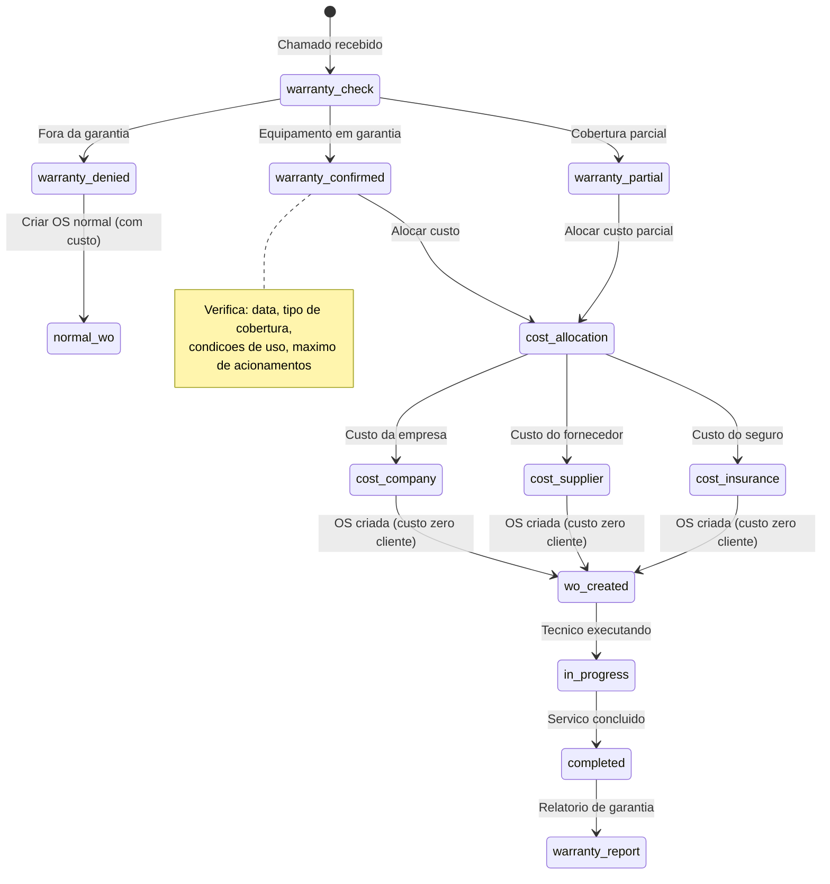
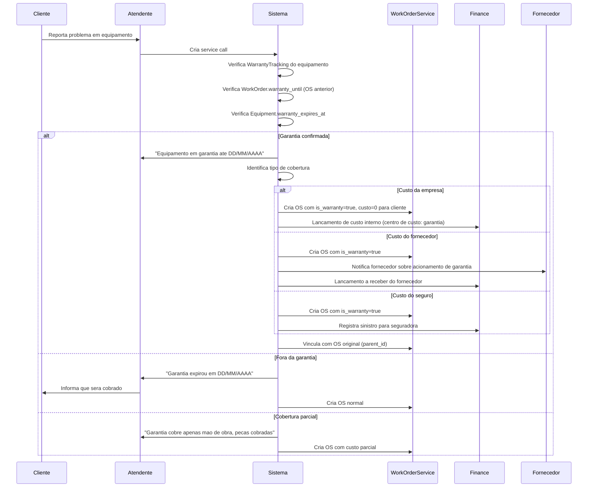

# Fluxo: Ordem de Servico de Garantia

> **Modulo**: WorkOrders + Finance + Contracts
> **Prioridade**: P2 — Impacta custo e satisfacao do cliente
> **[AI_RULE]** Documento prescritivo baseado em codigo existente: `WarrantyTracking`, `WorkOrder.is_warranty`, `Equipment.warranty_expires_at`. Verificar dados marcados com [SPEC] antes de usar em producao.

## 1. Visao Geral

Quando um cliente abre chamado para servico coberto por garantia, o sistema deve:

1. Verificar automaticamente se o equipamento/servico esta em garantia
2. Criar OS com custo zero para o cliente
3. Determinar quem assume o custo (empresa, fornecedor, seguro)
4. Vincular com a OS original que gerou a garantia
5. Gerar relatorios de custo de garantia

**Atores**: Cliente, Atendente, Coordenador, Tecnico, Fornecedor (quando custo repassado)

---

## 2. Maquina de Estados da OS de Garantia



---

## 3. Pipeline de Verificacao de Garantia



---

## 4. Modelo de Dados

### 4.1 WarrantyTracking (Existente)

| Campo | Tipo | Descricao |
|-------|------|-----------|
| `tenant_id` | bigint unsigned | FK |
| `equipment_id` | bigint unsigned | FK → equipments |
| `warranty_start_at` | date | Inicio da garantia |
| `warranty_end_at` | date | Fim da garantia |
| `warranty_type` | enum | `full`, `parts_only`, `labor_only`, `extended` |
| `coverage_details` | text nullable | Detalhes da cobertura |
| `max_claims` | integer nullable | Numero maximo de acionamentos |
| `claims_used` | integer default 0 | Acionamentos ja feitos |
| `source_work_order_id` | bigint unsigned nullable | OS que originou a garantia |

### 4.2 WorkOrder — Campos de Garantia (Existente)

| Campo | Tipo | Descricao |
|-------|------|-----------|
| `is_warranty` | boolean | Flag de OS de garantia |
| `parent_id` | bigint unsigned nullable | OS original |
| **Computed attributes:** | | |
| `warranty_until` | Carbon | `completed_at + warrantyDays()` |
| `is_under_warranty` | boolean | `warranty_until.isFuture()` |

### 4.3 WarrantyCostAllocation [SPEC — Novo]

| Campo | Tipo | Descricao |
|-------|------|-----------|
| `id` | bigint unsigned | PK |
| `tenant_id` | bigint unsigned | FK |
| `work_order_id` | bigint unsigned | FK → work_orders (OS de garantia) |
| `cost_bearer` | enum | `company`, `supplier`, `insurance`, `mixed` |
| `supplier_id` | bigint unsigned nullable | FK → suppliers |
| `insurance_policy_id` | string nullable | Numero da apolice |
| `total_cost` | decimal(10,2) | Custo total do servico |
| `parts_cost` | decimal(10,2) | Custo de pecas |
| `labor_cost` | decimal(10,2) | Custo de mao de obra |
| `travel_cost` | decimal(10,2) | Custo de deslocamento |
| `supplier_reimbursed` | boolean default false | Se fornecedor reembolsou |
| `supplier_reimbursed_at` | datetime nullable | — |
| `claim_number` | string nullable | Numero do acionamento |
| `notes` | text nullable | — |

### 4.4 Equipment — Campos Relevantes (Existente)

| Campo | Tipo |
|-------|------|
| `warranty_expires_at` | date nullable |
| `supplier_id` | bigint unsigned nullable |
| `purchase_date` | date nullable |

---

## 5. Regras de Negocio

### 5.1 Verificacao Automatica de Garantia

[AI_RULE_CRITICAL] O sistema verifica garantia em 3 niveis (OR), usando a **data de abertura do chamado** (`service_call.created_at`) como referencia — NAO a data atual:

```
1. WarrantyTracking.warranty_end_at >= service_call.created_at
   → Garantia dedicada (contrato de garantia estendida)

2. Equipment.warranty_expires_at >= service_call.created_at
   → Garantia de fabrica do equipamento

3. WorkOrder (original).warranty_until >= service_call.created_at
   → Garantia do servico anterior (ex: 90 dias)
```

> **[AI_RULE_CRITICAL]** A validacao de garantia DEVE comparar `warranty_end_date >= service_call.created_at` e NAO `warranty_end_date >= now()`. O direito a garantia e determinado pela data em que o cliente REPORTOU o problema, nao pela data em que o sistema processa a verificacao. Isso evita que atrasos no atendimento prejudiquem o cliente.

**Guard de Validacao**

```php
// WarrantyService::checkWarranty(Equipment $equipment, ServiceCall $serviceCall): WarrantyCheckResult
public function checkWarranty(Equipment $equipment, ServiceCall $serviceCall): WarrantyCheckResult
{
    $referenceDate = $serviceCall->created_at; // Data que o cliente reportou

    // Nivel 1: WarrantyTracking dedicado
    $tracking = WarrantyTracking::where('equipment_id', $equipment->id)
        ->where('warranty_end_at', '>=', $referenceDate)
        ->where(function ($q) {
            $q->whereNull('max_claims')
              ->orWhereColumn('claims_used', '<', 'max_claims');
        })
        ->latest('warranty_end_at')
        ->first();

    if ($tracking) {
        return new WarrantyCheckResult(
            covered: true,
            source: 'warranty_tracking',
            warrantyType: $tracking->warranty_type,
            expiresAt: $tracking->warranty_end_at,
            claimsRemaining: $tracking->max_claims ? ($tracking->max_claims - $tracking->claims_used) : null,
            tracking: $tracking,
        );
    }

    // Nivel 2: Garantia de fabrica
    if ($equipment->warranty_expires_at && Carbon::parse($equipment->warranty_expires_at)->gte($referenceDate)) {
        return new WarrantyCheckResult(
            covered: true,
            source: 'equipment_factory',
            warrantyType: 'full',
            expiresAt: $equipment->warranty_expires_at,
        );
    }

    // Nivel 3: Garantia de servico anterior
    $parentWo = WorkOrder::where('equipment_id', $equipment->id)
        ->where('status', 'completed')
        ->whereNotNull('completed_at')
        ->latest('completed_at')
        ->first();

    if ($parentWo && $parentWo->warranty_until && Carbon::parse($parentWo->warranty_until)->gte($referenceDate)) {
        return new WarrantyCheckResult(
            covered: true,
            source: 'previous_service',
            warrantyType: 'full',
            expiresAt: $parentWo->warranty_until,
            parentWorkOrderId: $parentWo->id,
        );
    }

    return new WarrantyCheckResult(
        covered: false,
        source: null,
        warrantyType: null,
        expiresAt: $this->getMostRecentExpiration($equipment),
    );
}
```

**Cenario BDD Adicional**

```gherkin
  Cenario: Garantia valida pela data do chamado, nao pela data atual
    Dado que o equipamento "Balanca XYZ" tem warranty_expires_at = 20/03/2026
    E o cliente abriu chamado em 19/03/2026 (service_call.created_at)
    E hoje e 25/03/2026 (processamento atrasado)
    Quando o sistema verifica a garantia
    Entao a garantia e CONFIRMADA (19/03 < 20/03)
    E a OS e criada com is_warranty = true
    E o cliente NAO e prejudicado pelo atraso no processamento
```

### 5.2 Condicoes de Exclusao

| Condicao | Resultado |
|----------|----------|
| Mau uso comprovado | Garantia NEGADA |
| Maximo de acionamentos atingido | Garantia NEGADA |
| Peca desgaste natural (excluida da cobertura) | Garantia NEGADA |
| Servico feito por terceiro nao autorizado | Garantia NEGADA |
| Condições ambientais fora do especificado | Garantia NEGADA |

### 5.3 Custo para o Cliente

[AI_RULE] Na OS de garantia:

- Custo para o cliente = R$ 0,00 (total ou parcial conforme cobertura)
- A OS NAO gera fatura para o cliente
- O custo real e rastreado internamente (centro de custo: garantia)
- `InvoicingService` DEVE verificar `is_warranty` antes de faturar

### 5.4 Vinculacao com OS Original

[AI_RULE] A OS de garantia DEVE:

- Ter `parent_id` apontando para a OS original
- Herdar contexto: equipamento, local, descricao do servico original
- Registrar se o problema e o mesmo ou diferente
- Manter historico de acionamentos no `WarrantyTracking`

### 5.5 Relatorios de Garantia

| Relatorio | Metricas |
|-----------|---------|
| Custo mensal de garantia | Total por tipo (empresa/fornecedor/seguro) |
| Top equipamentos com acionamento | Ranking por frequencia |
| % de garantia sobre faturamento | Custo garantia / faturamento total |
| Fornecedores com mais acionamentos | Ranking para negociacao |
| Tempo medio de resolucao em garantia | SLA interno |

---

## 6. Cenarios BDD

### Cenario 1: Garantia confirmada — custo empresa

```gherkin
Dado que o cliente "Fabrica A" tem equipamento "Balanca XYZ"
  E a WarrantyTracking indica garantia ate 30/06/2026
  E tipo "full" (cobertura total)
Quando o atendente cria service call para "Balanca XYZ"
Entao o sistema detecta garantia valida
  E cria OS com is_warranty=true
  E valor para cliente = R$ 0,00
  E custo interno registrado como centro de custo "garantia"
  E claims_used incrementa de 0 para 1
```

### Cenario 2: Garantia do servico anterior (90 dias)

```gherkin
Dado que a OS #100 foi concluida ha 60 dias
  E WorkOrder.warrantyDays() retorna 90
  E o cliente reporta o mesmo problema
Quando o sistema verifica warranty_until da OS #100
Entao detecta que esta dentro da garantia (60 < 90)
  E cria OS #200 com parent_id = 100 e is_warranty = true
```

### Cenario 3: Garantia expirada

```gherkin
Dado que o equipamento tem warranty_expires_at = 01/01/2026
  E hoje e 24/03/2026
Quando o atendente cria service call
Entao o sistema informa "Garantia expirou em 01/01/2026"
  E cria OS normal com faturamento ao cliente
```

### Cenario 4: Cobertura parcial (so mao de obra)

```gherkin
Dado que a WarrantyTracking tem tipo "labor_only"
  E a OS requer troca de peca (sensor R$ 500)
Quando o tecnico completa o servico
Entao o custo de mao de obra = R$ 0 para o cliente
  E o custo da peca (R$ 500) e faturado ao cliente
  E a fatura discrimina: "Peca: R$ 500 | Mao de obra: coberta por garantia"
```

### Cenario 5: Custo repassado ao fornecedor

```gherkin
Dado que o equipamento foi comprado do fornecedor "TecParts"
  E a garantia de fabrica esta vigente
  E o cost_bearer = "supplier"
Quando o tecnico completa a OS de garantia
Entao o sistema cria lancamento a receber do fornecedor
  E o fornecedor recebe notificacao de acionamento
  E o custo para o cliente continua R$ 0
```

### Cenario 6: Maximo de acionamentos atingido

```gherkin
Dado que a WarrantyTracking tem max_claims = 3
  E claims_used = 3
Quando o cliente tenta acionar garantia novamente
Entao o sistema informa "Limite de acionamentos atingido (3/3)"
  E a OS e criada como servico normal (com custo)
```

---

## 7. Integracao com Modulos Existentes

| Modulo | Integracao |
|--------|-----------|
| **WarrantyTracking** | Verificacao de vigencia e tipo de cobertura |
| **WorkOrder** | `is_warranty`, `parent_id`, `warranty_until` |
| **Equipment** | `warranty_expires_at`, `supplier_id` |
| **InvoicingService** | Nao faturar OS de garantia (ou faturar parcialmente) |
| **CommissionService** | Nao gerar comissao para OS de garantia |
| **Finance** | Centro de custo "garantia", lancamento ao fornecedor |
| **ServiceCall** | Trigger verificacao de garantia na criacao |

---

## 8. Endpoints Envolvidos

> Endpoints reais mapeados no codigo-fonte (`backend/routes/api/`). Todos sob prefixo `/api/v1/`.

### 8.1 Warranty Tracking

Registrados em `advanced-lots.php`:

| Metodo | Rota | Controller | Descricao |
|--------|------|------------|-----------|
| `GET` | `/api/v1/warranty-tracking` | `StockAdvancedController@warrantyTracking` | Listar rastreamentos de garantia |
| `GET` | `/api/v1/warranty/lookup` | `StockAdvancedController@warrantyLookup` | Consultar garantia de equipamento |

### 8.2 Service Calls (Abertura de Chamado de Garantia)

Registrados em `quotes-service-calls.php`:

| Metodo | Rota | Controller | Descricao |
|--------|------|------------|-----------|
| `GET` | `/api/v1/service-calls` | `ServiceCallController@index` | Listar chamados |
| `POST` | `/api/v1/service-calls` | `ServiceCallController@store` | Criar chamado |
| `POST` | `/api/v1/service-calls/{serviceCall}/convert-to-os` | `ServiceCallController@convertToWorkOrder` | Converter chamado em OS |

### 8.3 Equipamentos

Registrados em `equipment-platform.php`:

| Metodo | Rota | Controller | Descricao |
|--------|------|------------|-----------|
| `GET` | `/api/v1/equipments/{equipment}/calibrations` | `EquipmentController@calibrationHistory` | Historico de calibracoes |
| `GET` | `/api/v1/equipments/{equipment}/history` | `EquipmentHistoryController@history` | Historico completo do equipamento |
| `GET` | `/api/v1/equipments/{equipment}/work-orders` | `EquipmentHistoryController@workOrders` | OS do equipamento |

### 8.4 Comissoes (Nao gerar para OS de garantia)

Registrados em `financial.php`:

| Metodo | Rota | Controller | Descricao |
|--------|------|------------|-----------|
| `GET` | `/api/v1/commission-events` | `CommissionController@events` | Listar eventos de comissao |
| `POST` | `/api/v1/commission-events/generate` | `CommissionController@generateForWorkOrder` | Gerar comissao para OS |

### 8.5 Endpoints Planejados [SPEC]

| Metodo | Rota | Descricao | Form Request |
|--------|------|-----------|--------------|
| `GET` | `/api/v1/warranty/check/{equipment_id}` | Verifica garantia completa (3 niveis) | — |
| `POST` | `/api/v1/warranty/claim` | Registrar acionamento de garantia | `CreateWarrantyClaimRequest` |
| `GET` | `/api/v1/warranty/claims` | Listar acionamentos | — |
| `GET` | `/api/v1/warranty/reports/cost` | Relatorio de custo de garantia | — |
| `PUT` | `/api/v1/warranty/claims/{id}/allocate-cost` | Alocar custo (empresa/fornecedor/seguro) | `AllocateCostRequest` |
| `POST` | `/api/v1/warranty/deny` | Negar garantia com motivo | `DenyWarrantyRequest` |

---

## 8.6 Especificacoes Tecnicas

### Warranty Coverage Rules Model
- **Tabela:** `wo_warranty_rules`
- **Campos:** id, tenant_id, name, applies_to (enum: product_category, product, contract_type), applies_to_id nullable, duration_months, covers_parts (boolean), covers_labor (boolean), exclusions (json — lista de situações não cobertas), is_default (boolean), timestamps
- **Exclusions exemplo:** ["mau uso", "queda", "modificação não autorizada", "desgaste natural", "agente externo"]

### Cálculo de Expiração
- **Com serial number:** `warranty_expires_at = sale_date + warranty_rule.duration_months`
- **Sem serial number:** `warranty_expires_at = invoice_date + warranty_rule.duration_months`
- **Service:** `WarrantyService::isUnderWarranty(WorkOrder $wo): bool`
- **Guard na state machine:** Transição para `warranty_approved` requer `WarrantyService::isUnderWarranty() === true`

### Manufacturer Warranty Claim (Futuro)
- **Status:** Planejado — não implementar agora
- **Service futuro:** `App\Services\WorkOrders\ManufacturerClaimService`
- **Nota:** Requer API de cada fabricante. Implementar quando integração disponível.

---

## 9. Gaps e Melhorias Futuras

| # | Item | Status |
|---|------|--------|
| 1 | Contrato de garantia estendida como produto vendavel | [SPEC] |
| 2 | Integracao com fornecedores para acionamento automatico | [SPEC] |
| 3 | Calculo de provisao financeira para garantias futuras | [SPEC] |
| 4 | Dashboard de custos de garantia com graficos | [SPEC] |
| 5 | Auto-deteccao de padroes (equipamento com muitos acionamentos) | [SPEC] |

> **[AI_RULE]** Este documento mapeia o fluxo de OS de garantia. Baseia-se em `WarrantyTracking`, `WorkOrder.is_warranty`, `Equipment.warranty_expires_at`, `InvoicingService`, `CommissionService`. Atualizar ao implementar os [SPEC].

---

## Módulos Envolvidos

| Módulo | Responsabilidade no Fluxo |
|--------|---------------------------|
| [Lab](file:///c:/PROJETOS/sistema/docs/modules/Lab.md) | Análise técnica e laudo de garantia |
| [Finance](file:///c:/PROJETOS/sistema/docs/modules/Finance.md) | Apuração de custos e crédito/estorno ao cliente |
| [WorkOrders](file:///c:/PROJETOS/sistema/docs/modules/WorkOrders.md) | OS de serviço em garantia (sem cobrança) |
| [Contracts](file:///c:/PROJETOS/sistema/docs/modules/Contracts.md) | Verificação de vigência e cobertura contratual |
