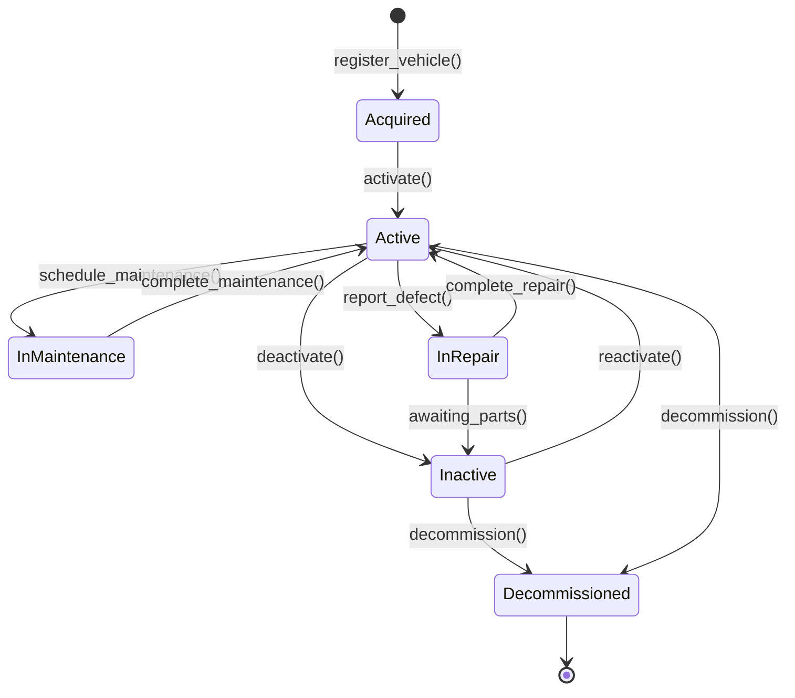
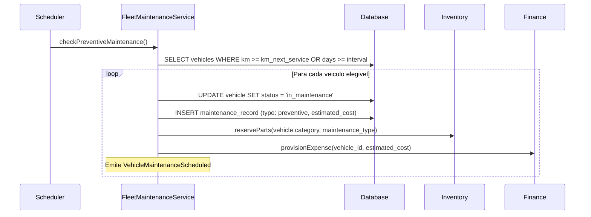

# Fluxo: Gestao de Frota

> Ciclo completo de vida de um veiculo na frota: desde a aquisicao ate a baixa definitiva, passando por manutencao preventiva, sinistros e reatribuicao de motoristas.

---

## 1. Narrativa do Processo

1. **Aquisicao**: Veiculo e adquirido (compra ou leasing). Registro no sistema com dados completos (placa, chassi, RENAVAM, categoria).
2. **Ativacao**: Veiculo recebe motorista atribuido, seguro ativo e documentacao em dia. Liberado para operacao.
3. **Em Operacao**: Veiculo em uso diario. Controle de quilometragem, abastecimento e custos operacionais.
4. **Manutencao Preventiva**: Ao atingir KM ou prazo configurado, veiculo e direcionado para manutencao. Pecas consumidas do Inventory.
5. **Manutencao Corretiva**: Veiculo apresenta defeito ou sinistro. Reparo com laudo tecnico obrigatorio.
6. **Inativo Temporario**: Veiculo fora de operacao por falta de motorista, seguro vencido ou documentacao pendente.
7. **Baixa**: Veiculo alienado, sucateado ou devolvido (leasing). Registro de baixa com motivo e valor residual.

---

## 2. State Machine — Ciclo de Vida do Veiculo



---

## 3. Guards de Transicao `[AI_RULE]`

| Transicao | Guard | Motivo |
|-----------|-------|--------|
| `Acquired → Active` | `driver_id IS NOT NULL AND insurance_expiry > NOW() AND documents_valid = true` | Veiculo sem motorista, seguro ou documentacao nao pode operar |
| `Active → InMaintenance` | `km_current >= km_next_service OR days_since_last_service >= service_interval_days` | Manutencao preventiva por KM ou tempo |
| `Active → InRepair` | `defect_report_id IS NOT NULL` | Obriga laudo de defeito antes de reparar |
| `InMaintenance → Active` | `maintenance_record.completed_at IS NOT NULL AND maintenance_record.cost > 0` | Manutencao concluida com custo registrado |
| `InRepair → Active` | `repair_record.completed_at IS NOT NULL AND repair_record.parts_used IS NOT EMPTY` | Reparo concluido com pecas documentadas |
| `Inactive → Active` | `driver_id IS NOT NULL AND insurance_expiry > NOW()` | Mesmos guards da ativacao |
| `* → Decommissioned` | `pending_maintenance_count = 0 AND fuel_tank_level = 'empty'` | Sem manutencoes pendentes, tanque vazio |

> **[AI_RULE_CRITICAL]** Veiculo com status `Decommissioned` e IMUTAVEL. Nao pode retornar a nenhum estado anterior. A IA NUNCA deve implementar transicao de retorno a partir de `Decommissioned`.

> **[AI_RULE]** Manutencao preventiva e calculada automaticamente pelo `FleetMaintenanceService` com base em `km_next_service` e `service_interval_days` configurados por categoria de veiculo.

---

## 4. Eventos Emitidos

| Evento | Trigger | Payload | Consumidor |
|--------|---------|---------|------------|
| `VehicleActivated` | `Acquired → Active` | `{vehicle_id, driver_id, plate}` | HR (vincular motorista), Operational (disponibilizar para despacho) |
| `MaintenanceScheduled` | `Active → InMaintenance` | `{vehicle_id, maintenance_type, estimated_cost}` | Finance (provisionar custo), Inventory (reservar pecas) |
| `MaintenanceCompleted` | `InMaintenance → Active` | `{vehicle_id, cost, parts_used[], km_at_service}` | Finance (lancar despesa), Inventory (baixar pecas) |
| `DefectReported` | `Active → InRepair` | `{vehicle_id, defect_description, severity}` | Operational (remover de rotas), HR (reatribuir motorista) |
| `RepairCompleted` | `InRepair → Active` | `{vehicle_id, repair_cost, parts_replaced[]}` | Finance (lancar despesa), Inventory (baixar pecas) |
| `VehicleDeactivated` | `Active → Inactive` | `{vehicle_id, reason}` | HR (liberar motorista), Operational (indisponibilizar) |
| `VehicleDecommissioned` | `* → Decommissioned` | `{vehicle_id, reason, residual_value}` | Finance (lancar baixa patrimonial), HR (desvincular motorista) |

---

## 5. Modulos Envolvidos

| Modulo | Responsabilidade no Fluxo | Link |
|--------|--------------------------|------|
| **Fleet** | Modulo principal. Gerencia ciclo de vida, KM, abastecimento, documentacao | [Fleet.md](file:///c:/PROJETOS/sistema/docs/modules/Fleet.md) |

> `[PENDENTE: rota POST /pool-requests/{id}/checkin deve ser criada]` — A rota de check-in de pool request nao existe. As rotas atuais de pool-requests (`fleet/pool-requests`) suportam CRUD + `PATCH /{request}/status` mas nao possuem endpoint de checkin dedicado. **Spec sugerida:** `POST /api/v1/fleet/pool-requests/{id}/checkin` no `VehiclePoolController::checkin()` — registra retirada fisica do veiculo pelo motorista, com GPS + km_inicial + foto. Deve validar que o pool-request esta com status `approved` antes de permitir checkin.
| **Finance** | Recebe custos de manutencao, abastecimento, seguro. Calcula depreciacao. Registra baixa patrimonial | [Finance.md](file:///c:/PROJETOS/sistema/docs/modules/Finance.md) |
| **HR** | Vincula/desvincula motorista. Controla habilitacao (categoria CNH) e validade | [HR.md](file:///c:/PROJETOS/sistema/docs/modules/HR.md) |
| **Inventory** | Fornece pecas para manutencao. Baixa automatica ao concluir servico | [Inventory.md](file:///c:/PROJETOS/sistema/docs/modules/Inventory.md) |
| **Operational** | Consome disponibilidade de veiculos para despacho e rotas | [Operational.md](file:///c:/PROJETOS/sistema/docs/modules/Operational.md) |

---

## 6. Diagrama de Sequencia — Manutencao Preventiva



---

## 7. Cenarios de Excecao

| Cenario | Comportamento Esperado |
|---------|----------------------|
| Motorista com CNH vencida | `activate()` bloqueado. Evento `DriverLicenseExpired` emitido. Veiculo permanece em `Acquired` ou `Inactive` |
| Seguro vencido durante operacao | Job diario detecta e transiciona para `Inactive`. Notificacao critica para gestor de frota |
| Manutencao atrasada (KM excedido em >10%) | Alerta critico. Se exceder 20%, veiculo automaticamente vai para `Inactive` |
| Sinistro com perda total | Transiciona direto para `Decommissioned` com `reason = 'total_loss'` e aciona seguradora |
| Peca em falta no Inventory | Veiculo permanece em `InRepair`. Evento `AwaitingParts` emitido para Procurement |
| Leasing com termino de contrato | 30 dias antes: alerta. Na data: transicionar para `Inactive`. Apos devolucao: `Decommissioned` |

---

## 8. KPIs do Fluxo

| KPI | Formula | Meta |
|-----|---------|------|
| Taxa de disponibilidade | `(veiculos_ativos / total_frota) * 100` | >= 85% |
| MTTR (Mean Time To Repair) | `avg(repair_completed_at - defect_reported_at)` | <= 48h |
| Custo por km | `total_custos_mes / total_km_rodados` | Benchmark por categoria |
| Conformidade preventiva | `(manutencoes_no_prazo / total_manutencoes) * 100` | >= 95% |
| Sinistros por mes | `count(defect_reports WHERE severity = 'accident')` | <= 2 |

---

## 9. Cenários BDD

```gherkin
Funcionalidade: Gestão de Frota (Fluxo Transversal)

  Cenário: Ciclo de vida completo do veículo (aquisição até baixa)
    Dado que o veículo placa "ABC-1234" foi registrado com RENAVAM e chassi
    E que motorista "Pedro" foi atribuído com CNH categoria "B" válida
    E que seguro está ativo com validade futura
    Quando o veículo é ativado para operação
    E opera normalmente até atingir km_next_service
    E a manutenção preventiva é agendada e concluída com custo registrado
    E após 10 anos o veículo é descomissionado com motivo "obsolescência"
    Então o veículo deve ter status "Decommissioned"
    E Finance deve registrar baixa patrimonial com valor residual
    E HR deve desvincular o motorista

  Cenário: Manutenção preventiva automática por KM
    Dado que o veículo "DEF-5678" tem km_next_service = 50.000
    E que km_current = 50.200
    Quando o job FleetMaintenanceService.checkPreventiveMaintenance() executa
    Então o veículo deve transicionar para "InMaintenance"
    E peças devem ser reservadas no Inventory
    E custo estimado deve ser provisionado no Finance

  Cenário: Motorista com CNH vencida bloqueia ativação
    Dado que o motorista "Carlos" tem CNH vencida há 15 dias
    Quando o gestor tenta ativar um veículo atribuído a Carlos
    Então o guard bloqueia informando "CNH vencida"
    E o evento DriverLicenseExpired deve ser emitido
    E o veículo permanece em "Acquired"

  Cenário: Veículo descomissionado é imutável
    Dado um veículo com status "Decommissioned"
    Quando qualquer tentativa de transição é feita (reactivate, repair, etc.)
    Então o sistema bloqueia informando "Veículo descomissionado é imutável"
    E nenhuma transição é permitida

  Cenário: Sinistro com perda total vai direto para Decommissioned
    Dado um veículo ativo com seguro
    Quando um sinistro com perda total é registrado
    Então o veículo transiciona direto para "Decommissioned" com reason = "total_loss"
    E a seguradora deve ser acionada automaticamente
    E o motorista deve ser desvinculado
```
