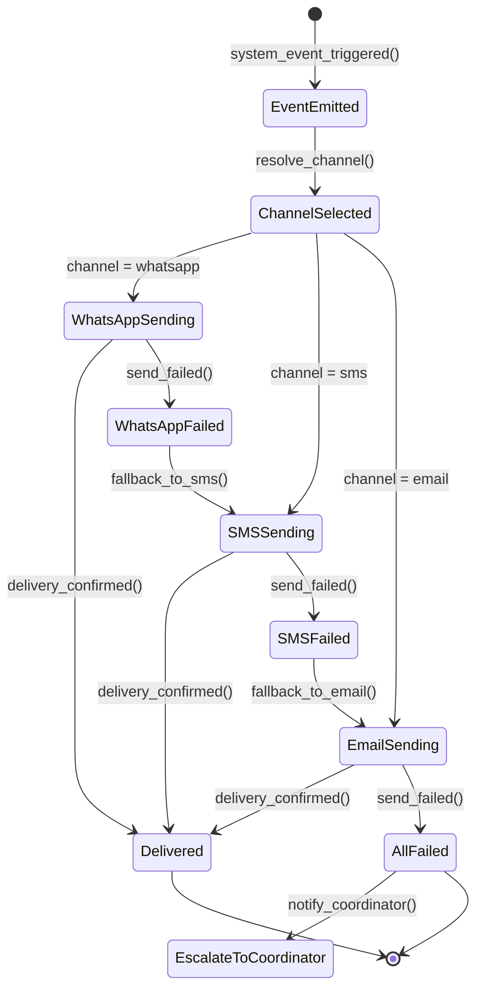
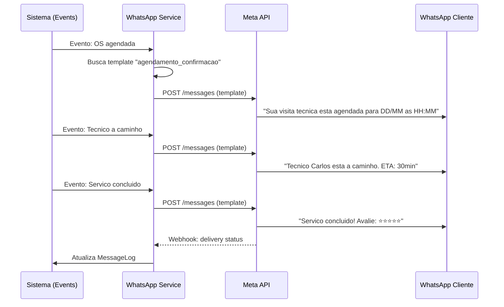
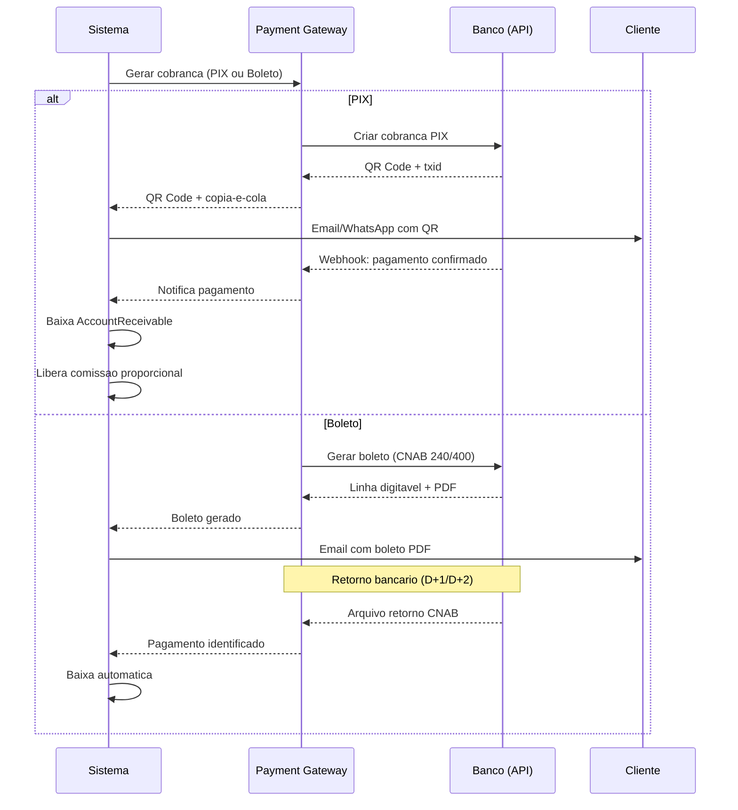
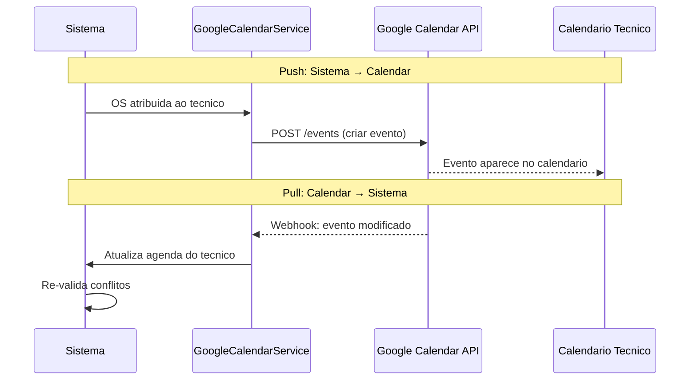
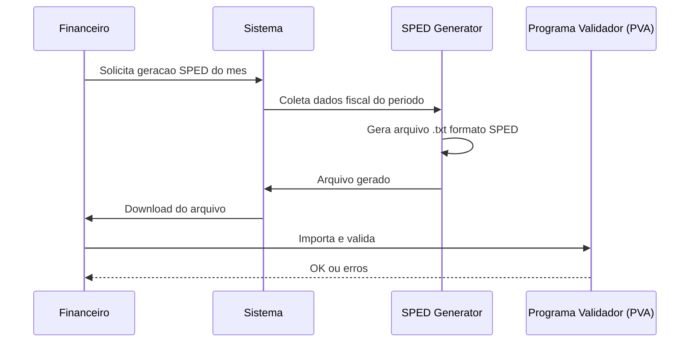
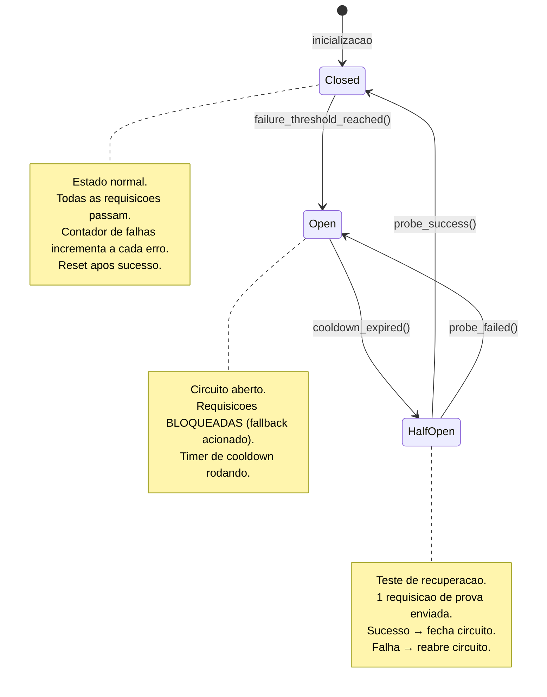

# Fluxo: Integracoes Externas

> **Modulo**: Integrations
> **Prioridade**: P1/P2 — Complementam operacao e receita
> **[AI_RULE]** Documento prescritivo baseado em codigo existente: `ExternalApiService`, `ClientNotificationService`, `GoogleCalendarService`, `CnabService`. Verificar dados marcados com [SPEC] antes de usar em producao.

## 1. Visao Geral

O sistema necessita de 5 integracoes externas para completar fluxos operacionais automatizados:

| Integracao | Prioridade | Status Backend | Impacto |
|-----------|-----------|---------------|---------|
| WhatsApp | P1 | Parcial (`MessageLog`, config existe) | SLA + UX cliente |
| PIX/Boleto | P1 | Parcial (`payment_method` existe) | Receita |
| Google Calendar | P2 | `GoogleCalendarService` existe | Produtividade tecnico |
| SPED/EFD | P2 | Nao existe | Conformidade fiscal |
| SMS | P2 | Nao existe | Fallback emergencias |

---

## 2. State Machine — Ciclo de Notificação Cross-Channel



### Guards de Transição `[AI_RULE]`

| Transição | Guard |
|-----------|-------|
| `EventEmitted → ChannelSelected` | `customer.notification_preferences IS NOT NULL` |
| `ChannelSelected → WhatsAppSending` | `whatsapp_config.is_active = true AND template_approved = true` |
| `WhatsAppFailed → SMSSending` | `sms_provider.is_configured = true AND retry_count < max_retries` |
| `SMSFailed → EmailSending` | `customer.email IS NOT NULL` |
| `AllFailed → EscalateToCoordinator` | `all_channels_exhausted = true` |

---

## 3. WhatsApp Business API

### 2.1 Estado Atual

| Componente | Status |
|-----------|--------|
| `WhatsAppConfig` (model) | Existe |
| `MessageLog` (model) | Existe |
| Envio manual de mensagem | Existe |
| Status updates automaticos | [SPEC] |
| Lembretes de SLA | [SPEC] |
| Templates aprovados | [SPEC] |

### 2.2 Fluxo de Notificacoes Automaticas



### 2.3 Templates Necessarios [SPEC]

| Template | Trigger | Conteudo |
|----------|---------|---------|
| `agendamento_confirmacao` | OS agendada | Data, hora, tecnico |
| `tecnico_a_caminho` | Status → in_transit | ETA, nome tecnico |
| `servico_concluido` | Status → completed | Link avaliacao NPS |
| `fatura_emitida` | Invoice created | Valor, vencimento, link pagamento |
| `fatura_vencida` | D+1 vencimento | Valor, dias atraso |
| `lembrete_preventiva` | D-7 preventiva | Data agendada, equipamento |
| `certificado_emitido` | Certificado pronto | Link download |
| `emergencia_aceita` | Emergencia aceita | Nome tecnico, ETA |

### 2.4 API Endpoints [SPEC]

| Metodo | Rota | Descricao |
|--------|------|-----------|
| GET | `/api/whatsapp/templates` | Listar templates cadastrados |
| POST | `/api/whatsapp/send` | Enviar mensagem manual |
| GET | `/api/whatsapp/messages` | Historico de mensagens |
| POST | `/api/whatsapp/webhook` | Receber status da Meta |
| PUT | `/api/whatsapp/config` | Configurar token/phone |

---

## 3. PIX e Boleto

### 3.1 Estado Atual

| Componente | Status |
|-----------|--------|
| `Invoice.payment_method` | Existe (campo) |
| `CnabService` | Existe (boleto via CNAB) |
| Geracao de QR PIX | [SPEC] |
| Webhook de confirmacao | [SPEC] |
| Retry automatico | [SPEC] |

### 3.2 Fluxo de Pagamento



### 3.3 Gateway Suportados [SPEC]

| Gateway | PIX | Boleto | Cartao | Status |
|---------|-----|--------|--------|--------|
| Asaas | ✅ | ✅ | ✅ | Recomendado |
| PagBank | ✅ | ✅ | ✅ | Alternativa |
| Gerencianet (Efí) | ✅ | ✅ | ❌ | PIX nativo |
| Inter (API Banking) | ✅ | ✅ | ❌ | Para clientes Banco Inter |

### 3.4 Modelo de Dados [SPEC]

**PaymentTransaction** (novo):

| Campo | Tipo | Descricao |
|-------|------|-----------|
| `id` | bigint unsigned | PK |
| `tenant_id` | bigint unsigned | FK |
| `invoice_id` | bigint unsigned | FK → invoices |
| `gateway` | enum | `asaas`, `pagbank`, `efi`, `inter`, `manual` |
| `method` | enum | `pix`, `boleto`, `credit_card`, `transfer`, `cash` |
| `external_id` | string | ID no gateway |
| `amount` | decimal(10,2) | Valor cobrado |
| `status` | enum | `pending`, `paid`, `failed`, `cancelled`, `refunded` |
| `pix_qr_code` | text nullable | QR code base64 |
| `pix_copy_paste` | string nullable | Codigo copia-e-cola |
| `boleto_url` | string nullable | URL do boleto PDF |
| `boleto_barcode` | string nullable | Linha digitavel |
| `paid_at` | datetime nullable | — |
| `webhook_received_at` | datetime nullable | — |
| `retry_count` | integer default 0 | Tentativas |
| `metadata` | json nullable | Dados extras do gateway |

### 3.5 API Endpoints [SPEC]

| Metodo | Rota | Descricao |
|--------|------|-----------|
| POST | `/api/payments/generate` | Gerar cobranca (PIX/Boleto) |
| POST | `/api/payments/webhook/{gateway}` | Receber confirmacao |
| GET | `/api/payments/{id}/status` | Consultar status |
| POST | `/api/payments/{id}/cancel` | Cancelar cobranca |
| POST | `/api/payments/{id}/refund` | Estornar pagamento |

---

## 4. Google Calendar

### 4.1 Estado Atual

| Componente | Status |
|-----------|--------|
| `GoogleCalendarService` | Existe |
| OAuth2 flow | [SPEC — verificar implementacao] |
| Sync bidirecional | [SPEC] |

### 4.2 Fluxo de Sincronizacao



### 4.3 Mapeamento OS ↔ Evento [SPEC]

| Campo OS | Campo Calendar |
|----------|----------------|
| `scheduled_start` | `start.dateTime` |
| `scheduled_end` | `end.dateTime` |
| `customer.address` | `location` |
| Descricao + OS# | `summary` |
| Detalhes do servico | `description` |
| `wo_number` | `extendedProperties.shared.wo_id` |

### 4.4 API Endpoints [SPEC]

| Metodo | Rota | Descricao |
|--------|------|-----------|
| POST | `/api/google-calendar/connect` | Iniciar OAuth2 |
| GET | `/api/google-calendar/callback` | Callback OAuth2 |
| POST | `/api/google-calendar/sync` | Forcar sync manual |
| GET | `/api/google-calendar/status` | Status da conexao |
| DELETE | `/api/google-calendar/disconnect` | Desconectar |

---

## 5. SPED/EFD (Escrituracao Fiscal Digital)

### 5.1 Escopo [SPEC]

| Obrigacao | Periodicidade | Conteudo |
|-----------|--------------|---------|
| EFD-Contribuicoes | Mensal | PIS/COFINS sobre faturamento |
| EFD-ICMS/IPI | Mensal | ICMS/IPI sobre vendas de pecas |
| ECD (Contabil) | Anual | Escrituracao contabil digital |

### 5.2 Dados Necessarios

| Fonte no Sistema | Registro SPED |
|-----------------|---------------|
| Invoices (faturas de servico) | Bloco A (servicos) |
| Pecas vendidas (Inventory) | Bloco C (mercadorias) |
| Contas a receber/pagar | Bloco F (demais documentos) |
| Lancamentos contabeis | ECD |

### 5.3 Fluxo de Exportacao [SPEC]



### 5.4 API Endpoints [SPEC]

| Metodo | Rota | Descricao |
|--------|------|-----------|
| POST | `/api/sped/generate` | Gerar arquivo SPED |
| GET | `/api/sped/files` | Listar arquivos gerados |
| GET | `/api/sped/files/{id}/download` | Download do arquivo |

---

## 6. SMS (Fallback)

### 6.1 Uso Planejado

| Cenario | Trigger | Conteudo |
|---------|---------|---------|
| Emergencia sem aceite | 5min sem resposta | "EMERGENCIA: Chamado #X sem tecnico" |
| WhatsApp falhou | Bounce detectado | Replica mensagem por SMS |
| Alerta critico SLA | SLA < 1h para estourar | "SLA CRITICO: OS #X expira em 1h" |
| Confirmacao de agendamento | D-1 da visita | "Visita amanha as HH:MM" |

### 6.2 Provedores Recomendados [SPEC]

| Provedor | Custo/SMS | Cobertura | Qualidade |
|----------|-----------|-----------|-----------|
| Twilio | ~R$ 0,20 | Global | Alta |
| Zenvia | ~R$ 0,08 | Brasil | Alta |
| Infobip | ~R$ 0,12 | Global | Alta |
| AWS SNS | ~R$ 0,05 | Global | Media |

### 6.3 API Endpoints [SPEC]

| Metodo | Rota | Descricao |
|--------|------|-----------|
| POST | `/api/sms/send` | Enviar SMS |
| GET | `/api/sms/messages` | Historico |
| PUT | `/api/sms/config` | Configurar provedor |

---

## 7. Cenarios BDD

### Cenario 1: Notificacao WhatsApp automatica ao agendar OS

```gherkin
Dado que o cliente "Fabrica A" tem WhatsApp configurado
  E o template "agendamento_confirmacao" esta aprovado na Meta
Quando uma OS e agendada para 25/03/2026 as 14:00
Entao o sistema envia WhatsApp com template
  E a mensagem contem: "Visita agendada para 25/03 as 14:00"
  E o status de entrega e rastreado via webhook
  E o MessageLog registra envio e delivery status
```

### Cenario 2: Pagamento PIX com baixa automatica

```gherkin
Dado que a fatura #INV-100 de R$ 2.500 foi emitida
  E o gateway e "asaas"
Quando o sistema gera cobranca PIX
Entao o QR code e enviado por email + WhatsApp
Quando o cliente paga via PIX
  E o webhook de confirmacao chega
Entao o AccountReceivable e baixado automaticamente
  E a comissao proporcional e liberada
  E o cliente recebe "Pagamento confirmado!"
```

### Cenario 3: SMS como fallback de emergencia

```gherkin
Dado que foi criado chamado de emergencia
  E 3 tecnicos foram notificados via push
  E nenhum aceitou em 5 minutos
Quando o sistema tenta escalonar via WhatsApp ao gerente
  E o WhatsApp falha (numero invalido)
Entao o sistema envia SMS como fallback
  E o SMS contem "EMERGENCIA: Chamado #123 sem tecnico ha 5min"
  E o MessageLog registra canal "sms" com status
```

### Cenario 4: Sync Google Calendar bidirecional

```gherkin
Dado que o tecnico "Carlos" conectou Google Calendar
  E tem OS #200 agendada para 25/03 as 10:00
Quando Carlos move o evento no Google Calendar para 14:00
Entao o sistema recebe webhook de alteracao
  E atualiza scheduled_start da OS #200 para 14:00
  E verifica conflitos com outras OS
  E notifica o coordenador sobre a mudanca
```

---

## 8. Integracao com Modulos Existentes

| Integracao | Modulos Impactados |
|-----------|-------------------|
| WhatsApp | ClientNotificationService, ServiceCall, WorkOrder, Invoice, Agenda |
| PIX/Boleto | InvoicingService, AccountReceivable, CommissionService, CnabService |
| Google Calendar | Agenda, WorkOrder, AutoAssignmentService |
| SPED/EFD | Finance, Invoice, Fiscal, Inventory |
| SMS | ClientNotificationService (fallback), EmergencyEscalation, SLA |

---

## 9. Gaps e Melhorias Futuras

| # | Item | Status |
|---|------|--------|
| 1 | WhatsApp: Chatbot para FAQ do cliente | [SPEC] |
| 2 | PIX: Cobranca recorrente automatica | [SPEC] |
| 3 | PIX: Split payment (tecnico + empresa) | [SPEC] |
| 4 | Google Calendar: Sync com Outlook 365 | [SPEC] |
| 5 | SPED: Validacao automatica antes de exportar | [SPEC] |
| 6 | SMS: Short code dedicado para a empresa | [SPEC] |

---

## 10. Circuit Breaker — Resiliencia de Integracoes

### 10.1 State Machine do Circuit Breaker



### 10.2 Tabela de Configuracao: `integration_circuit_breakers`

| Campo | Tipo | Descricao |
|-------|------|-----------|
| `id` | bigint unsigned | PK |
| `tenant_id` | bigint unsigned | FK |
| `integration_name` | string(50) | `whatsapp`, `sms`, `google_calendar`, `payment_gateway`, `fiscal_sefaz`, `email_smtp` |
| `state` | enum | `closed`, `open`, `half_open` |
| `failure_count` | integer default 0 | Falhas consecutivas desde ultimo sucesso |
| `failure_threshold` | integer default 5 | Falhas para abrir circuito |
| `success_count` | integer default 0 | Sucessos consecutivos em half_open |
| `success_threshold` | integer default 2 | Sucessos para fechar circuito |
| `cooldown_seconds` | integer default 60 | Tempo em Open antes de testar (Half-Open) |
| `last_failure_at` | datetime nullable | Ultima falha registrada |
| `last_success_at` | datetime nullable | Ultimo sucesso |
| `opened_at` | datetime nullable | Quando abriu o circuito |
| `half_opened_at` | datetime nullable | Quando entrou em half_open |
| `total_failures` | integer default 0 | Total historico de falhas |
| `total_requests` | integer default 0 | Total historico de requisicoes |
| `fallback_strategy` | enum | `queue_for_retry`, `use_alternative`, `skip_silently`, `alert_only` |
| `metadata` | json nullable | Config adicional (ex: URL alternativa) |

### 10.3 Implementacao: `CircuitBreakerService`

```php
class CircuitBreakerService
{
    public function execute(string $integrationName, int $tenantId, callable $action, ?callable $fallback = null): mixed
    {
        $cb = IntegrationCircuitBreaker::firstOrCreate(
            ['integration_name' => $integrationName, 'tenant_id' => $tenantId],
            ['state' => 'closed', 'failure_threshold' => 5, 'cooldown_seconds' => 60]
        );

        // Estado OPEN: verifica cooldown
        if ($cb->state === 'open') {
            if ($cb->opened_at->addSeconds($cb->cooldown_seconds)->isFuture()) {
                // Ainda em cooldown — executa fallback
                return $this->executeFallback($cb, $fallback);
            }
            // Cooldown expirou — transita para half_open
            $cb->update(['state' => 'half_open', 'half_opened_at' => now()]);
        }

        // Estado HALF_OPEN: permite 1 requisicao de teste
        if ($cb->state === 'half_open') {
            $lock = Cache::lock("cb_{$integrationName}_{$tenantId}_probe", 30);
            if (!$lock->get()) {
                return $this->executeFallback($cb, $fallback);
            }
        }

        try {
            $result = $action();
            $this->recordSuccess($cb);
            return $result;
        } catch (\Throwable $e) {
            $this->recordFailure($cb, $e);

            if ($cb->state === 'open') {
                return $this->executeFallback($cb, $fallback);
            }

            throw $e;
        }
    }

    private function recordSuccess(IntegrationCircuitBreaker $cb): void
    {
        $cb->increment('total_requests');
        $cb->update([
            'failure_count' => 0,
            'last_success_at' => now(),
        ]);

        if ($cb->state === 'half_open') {
            $cb->increment('success_count');
            if ($cb->success_count >= $cb->success_threshold) {
                $cb->update(['state' => 'closed', 'success_count' => 0]);
                Log::info("CircuitBreaker [{$cb->integration_name}]: CLOSED (recovered)");
            }
        }
    }

    private function recordFailure(IntegrationCircuitBreaker $cb, \Throwable $e): void
    {
        $cb->increment('failure_count');
        $cb->increment('total_failures');
        $cb->increment('total_requests');
        $cb->update(['last_failure_at' => now()]);

        if ($cb->failure_count >= $cb->failure_threshold) {
            $cb->update([
                'state' => 'open',
                'opened_at' => now(),
                'success_count' => 0,
            ]);

            Log::warning("CircuitBreaker [{$cb->integration_name}]: OPEN after {$cb->failure_count} failures");

            SystemAlert::create([
                'tenant_id' => $cb->tenant_id,
                'severity' => 'critical',
                'message' => "Integracao {$cb->integration_name} indisponivel (circuit breaker aberto). Ultima falha: {$e->getMessage()}",
            ]);
        }
    }

    private function executeFallback(IntegrationCircuitBreaker $cb, ?callable $fallback): mixed
    {
        return match ($cb->fallback_strategy) {
            'queue_for_retry' => $this->queueForRetry($cb),
            'use_alternative' => $fallback ? $fallback() : null,
            'skip_silently' => null,
            'alert_only' => $this->alertOnly($cb),
            default => null,
        };
    }
}
```

### 10.4 Configuracao por Integracao

| Integracao | `failure_threshold` | `cooldown_seconds` | `fallback_strategy` |
|-----------|--------------------|--------------------|---------------------|
| `whatsapp` | 5 | 60 | `use_alternative` (SMS) |
| `sms` | 3 | 120 | `use_alternative` (email) |
| `google_calendar` | 5 | 300 | `queue_for_retry` |
| `payment_gateway` | 3 | 60 | `alert_only` |
| `fiscal_sefaz` | 5 | 600 | `queue_for_retry` |
| `email_smtp` | 3 | 120 | `queue_for_retry` |

### 10.5 Uso nas Integracoes

```php
// Exemplo: envio de WhatsApp com circuit breaker
$circuitBreaker = app(CircuitBreakerService::class);

$result = $circuitBreaker->execute(
    'whatsapp',
    $tenantId,
    fn() => $this->whatsappService->sendTemplate($phone, $template, $params),
    fn() => $this->smsService->send($phone, $this->templateToSms($template, $params)) // fallback
);
```

> **[AI_RULE]** Este documento mapeia as 5 integracoes externas faltantes. Baseia-se em `ExternalApiService`, `ClientNotificationService`, `GoogleCalendarService`, `CnabService`, `MessageLog`, `WhatsAppConfig`. Atualizar ao implementar os [SPEC].

---

## Módulos Envolvidos

| Módulo | Responsabilidade no Fluxo |
|--------|---------------------------|
| [Integrations](file:///c:/PROJETOS/sistema/docs/modules/Integrations.md) | Configuração de conectores e providers externos |
| [Agenda](file:///c:/PROJETOS/sistema/docs/modules/Agenda.md) | Sincronização de calendários externos (Google, Outlook) |
| [Email](file:///c:/PROJETOS/sistema/docs/modules/Email.md) | Integração SMTP/IMAP e provedores de email |
| [Fiscal](file:///c:/PROJETOS/sistema/docs/modules/Fiscal.md) | Comunicação SEFAZ (NF-e, GNRE, MDFe) |
| [Finance](file:///c:/PROJETOS/sistema/docs/modules/Finance.md) | Integração bancária (CNAB, OFX, PIX API) |
| [Lab](file:///c:/PROJETOS/sistema/docs/modules/Lab.md) | Integração com equipamentos de medição e LIMS |
| [Inventory](file:///c:/PROJETOS/sistema/docs/modules/Inventory.md) | Integração ERP para sincronização de estoque |
