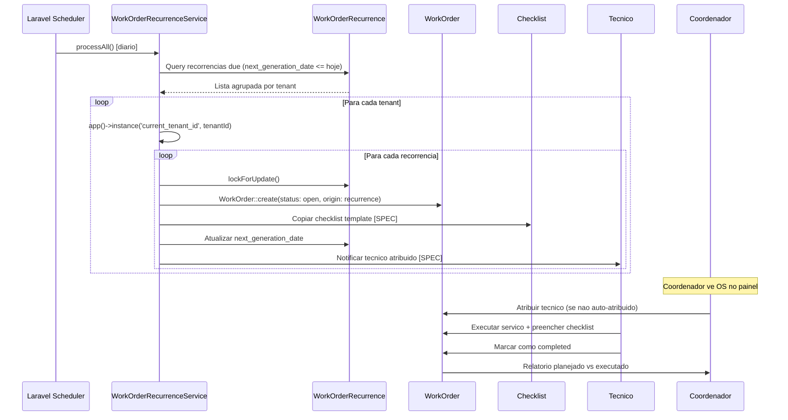
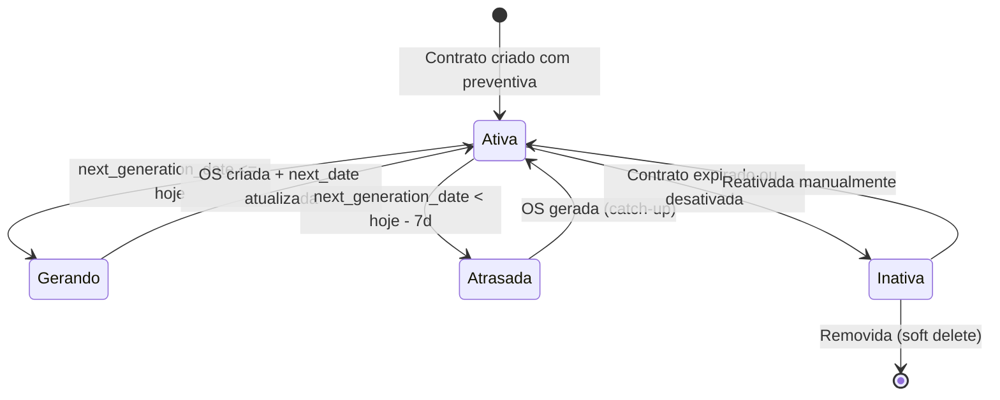

# Fluxo Cross-Domain: Manutencao Preventiva Automatica

> **Kalibrium ERP** -- Geracao automatica de OS preventivas a partir de contratos
> Versao: 1.0 | Data: 2026-03-24

---

## 1. Visao Geral

O sistema gera automaticamente Ordens de Servico preventivas com base em contratos que definem tipo, frequencia e equipamentos cobertos. O scheduler roda diariamente, verifica recorrencias pendentes e cria OS com checklist especifico.

**Modulos envolvidos:** Contratos, Recorrencia de OS, Ordem de Servico, Checklist, Equipamentos, Agendamento, Relatorios.

[AI_RULE] Preventivas NUNCA sao geradas para contratos inativos ou expirados. O tenant deve estar com status `active`. [/AI_RULE]

---

## 2. Configuracao no Contrato

### 2.1 Dados da Recorrencia (`work_order_recurrences`)

O model `WorkOrderRecurrence` (com trait `BelongsToTenant` + `SoftDeletes`) armazena:

| Campo | Tipo | Descricao |
|-------|------|-----------|
| `tenant_id` | bigint | Tenant owner |
| `customer_id` | bigint | Cliente vinculado |
| `service_id` | bigint | Tipo de servico (ex: "Calibracao Preventiva") |
| `name` | string | Nome descritivo ("Preventiva Mensal - Balancas") |
| `description` | text | Descricao gerada na OS |
| `frequency` | enum | `weekly`, `monthly`, `quarterly`, `semi_annually`, `annually` |
| `interval` | int | Multiplicador (ex: 2 = a cada 2 meses) |
| `day_of_month` | int | Dia preferencial do mes (nullable) |
| `day_of_week` | int | Dia preferencial da semana (nullable) |
| `start_date` | date | Inicio da vigencia |
| `end_date` | date | Fim da vigencia (nullable = indeterminado) |
| `next_generation_date` | date | Proxima data de geracao |
| `last_generated_at` | datetime | Ultima geracao |
| `is_active` | boolean | Ativa/inativa |
| `metadata` | json | Dados extras (checklist_id, equipamentos, etc.) |

### 2.2 Frequencias Suportadas

| Frequencia | Exemplo |
|------------|---------|
| `weekly` | Toda segunda-feira |
| `monthly` | Todo dia 15 de cada mes |
| `quarterly` | A cada 3 meses |
| `semi_annually` | A cada 6 meses |
| `annually` | Uma vez por ano |

---

## 3. Scheduler Job

### 3.1 Processamento (`WorkOrderRecurrenceService`)

O servico `WorkOrderRecurrenceService` (backend/app/Services/Search/WorkOrderRecurrenceService.php) executa:

```
1. Busca todos os tenants ativos
2. Query recorrencias com next_generation_date <= hoje E is_active = true
3. Agrupa por tenant_id para setar contexto correto
4. Para cada recorrencia:
   a. Lock FOR UPDATE (evita duplicacao por workers concorrentes)
   b. Cria WorkOrder com status 'open', origin 'recurrence'
   c. Atualiza next_generation_date com calculateNextDate()
   d. Salva last_generated_at
5. Restaura contexto de tenant anterior
```

### 3.2 Calculo da Proxima Data

O metodo `calculateNextDate()` avanca a data conforme frequencia e garante que nunca retorna data no passado (loop com safety limit de 52 iteracoes).

### 3.3 OS Gerada

```php
WorkOrder::create([
    'tenant_id'   => $recurrence->tenant_id,
    'customer_id' => $recurrence->customer_id,
    'service_id'  => $recurrence->service_id,
    'status'      => 'open',
    'description' => "Gerada automaticamente: {$recurrence->name}",
    'origin'      => 'recurrence',
    'metadata'    => $recurrence->metadata,
]);
```

[AI_RULE] A OS gerada fica com `origin = 'recurrence'` para diferenciar de OS manuais nos relatorios. [/AI_RULE]

---

## 4. Checklist Preventivo

[SPEC] Vincular `checklist_id` na recorrencia via campo `metadata.checklist_id`:

```json
{
  "checklist_id": 42,
  "equipment_ids": [101, 102, 103],
  "assigned_to": 7,
  "priority": "medium"
}
```

Ao gerar a OS, o sistema deve:

1. Copiar o template do `Checklist` (model existente) para a OS
2. Vincular os equipamentos listados em `equipment_ids`
3. Atribuir ao tecnico `assigned_to` (se definido)
4. Definir prioridade conforme metadata

[AI_RULE] Se o checklist template foi atualizado desde a ultima preventiva, a nova OS recebe a versao mais recente. [/AI_RULE]

---

## 5. Alertas de Preventiva Atrasada

[SPEC] Implementar verificacao no scheduler:

```
SE next_generation_date < hoje - 7 dias E is_active = true:
    - Criar SystemAlert com severity 'warning'
    - Notificar coordenador via WebPush
    - Marcar recorrencia com flag 'overdue'
```

| Atraso | Severidade | Acao |
|--------|-----------|------|
| 1-7 dias | `warning` | Alerta in-app |
| 8-30 dias | `high` | WebPush + email coordenador |
| 30+ dias | `critical` | Escalonamento para gerente |

---

## 6. Relatorio: Planejado vs Executado

### 6.1 Metricas

| Metrica | Calculo |
|---------|---------|
| Preventivas Planejadas | COUNT de recorrencias ativas com next_generation_date no periodo |
| Preventivas Geradas | COUNT de OS com origin='recurrence' no periodo |
| Preventivas Concluidas | COUNT de OS com origin='recurrence' E status IN (completed, delivered, invoiced) |
| Taxa de Execucao | (Concluidas / Planejadas) * 100 |
| Tempo Medio de Execucao | AVG(completed_at - started_at) das preventivas |
| Atrasadas | COUNT de recorrencias com next_generation_date < hoje E sem OS gerada |

### 6.2 Filtros

- Periodo (mes/trimestre/ano)
- Cliente
- Tipo de servico
- Tecnico responsavel
- Status da OS

---

## 7. Diagramas

### 7.1 Fluxo Completo



### 7.2 Ciclo de Vida da Recorrencia



---

## 8. BDD -- Cenarios

```gherkin
Funcionalidade: Manutencao Preventiva Automatica

  Cenario: Geracao automatica de OS preventiva mensal
    Dado uma recorrencia "Calibracao Mensal - Balancas" ativa
    E frequencia "monthly" com interval 1
    E next_generation_date e hoje
    Quando o scheduler executa processAll()
    Entao uma OS e criada com status "open" e origin "recurrence"
    E a next_generation_date avanca para o proximo mes
    E last_generated_at e atualizado para agora

  Cenario: Nao gerar OS para recorrencia inativa
    Dado uma recorrencia com is_active = false
    E next_generation_date e hoje
    Quando o scheduler executa processAll()
    Entao nenhuma OS e criada

  Cenario: Protecao contra duplicatas com lock
    Dado uma recorrencia pendente de geracao
    Quando dois workers executam processAll() simultaneamente
    Entao apenas uma OS e gerada (lockForUpdate)

  Cenario: Catch-up de datas passadas
    Dado uma recorrencia semanal com next_generation_date ha 3 semanas
    Quando o scheduler executa
    Entao a OS e gerada
    E a next_generation_date avanca para a proxima data futura

  Cenario: Alerta de preventiva atrasada
    Dado uma recorrencia com next_generation_date ha 10 dias
    E a OS ainda nao foi gerada
    Quando o verificador de atrasos executa
    Entao um SystemAlert com severity "high" e criado
    E o coordenador recebe notificacao

  Cenario: Relatorio planejado vs executado
    Dado 12 preventivas planejadas no trimestre
    E 10 foram geradas e concluidas
    E 2 estao atrasadas
    Quando consulto GET /api/v1/reports/preventive-maintenance
    Entao a taxa de execucao retorna 83.3%
    E as 2 atrasadas aparecem na lista de pendencias
```

---

## 9. Arquivos Relevantes

| Arquivo | Descricao |
|---------|-----------|
| `backend/app/Services/Search/WorkOrderRecurrenceService.php` | Servico de processamento de recorrencias |
| `backend/app/Models/WorkOrderRecurrence.php` | Model de recorrencia |
| `backend/app/Models/WorkOrder.php` | OS gerada (origin='recurrence') |
| `backend/app/Models/Checklist.php` | Template de checklist |
| `backend/app/Models/ChecklistSubmission.php` | Preenchimento do checklist |

---

## 9.1 Features Planejadas

**Checklist Template Linking**
- Campo `checklist_template_id` (FK nullable) na tabela `preventive_plans`
- Quando OS preventiva criada, copia itens do template para `checklist_submissions`

**Auto-Assign Técnico**
- Usa `AutoAssignmentService::assign()` com algoritmo do tenant
- Prioriza técnico que realizou última manutenção no mesmo equipamento

**Overdue Alert Job**
- **Job:** `AlertOverduePreventiveMaintenance` — roda diariamente às 07:00
- **Regra:** Planos com `next_due_date < today` e sem OS criada
- **Ação:** `PreventiveMaintenanceOverdue` event → Alerts + email ao operations_manager

**Report Endpoint**
- `GET /api/v1/preventive/report` — `PreventiveReportController@index`
- **Response:** compliance_rate, overdue_count, completed_this_month, by_equipment_type, by_technician

**Equipamento Perdeu Janela**
- Se `next_due_date` ultrapassar em > 7 dias sem execução: gerar OS corretiva automaticamente
- OS corretiva terá `type: corrective`, `origin: missed_preventive`, referência ao plano preventivo

---

## 10. Gaps Identificados

| # | Prio | Gap | Status |
|---|------|-----|--------|
| 1 | Alta | Vincular checklist_id automaticamente na OS gerada | [SPEC] Ler `metadata.checklist_id` da recorrencia, copiar template do `Checklist` para a OS |
| 2 | Alta | Auto-atribuir tecnico a partir de metadata | [SPEC] Ler `metadata.assigned_to`, setar `WorkOrder.assigned_to` na criacao |
| 3 | Media | Alertas de preventiva atrasada | [SPEC] Secao 5 acima — Job cron com 3 niveis: warning, high, critical |
| 4 | Media | Vincular equipamentos especificos na OS | [SPEC] Ler `metadata.equipment_ids`, criar `WorkOrderEquipment` para cada |
| 5 | Baixa | Relatorio planejado vs executado como endpoint dedicado | [SPEC] `GET /api/v1/reports/preventive-maintenance` — metricas da secao 6.1 |
| 6 | Baixa | Notificacao ao tecnico quando preventiva e gerada | [SPEC] `Notification::notify(tecnico, 'preventive_work_order_created', ...)` |

---

## Módulos Envolvidos

| Módulo | Responsabilidade no Fluxo |
|--------|---------------------------|
| [Lab](file:///c:/PROJETOS/sistema/docs/modules/Lab.md) | Planejamento e execução de calibração preventiva |
| [Agenda](file:///c:/PROJETOS/sistema/docs/modules/Agenda.md) | Agendamento recorrente de manutenções |
| [Email](file:///c:/PROJETOS/sistema/docs/modules/Email.md) | Lembretes automáticos de vencimento de manutenção |
