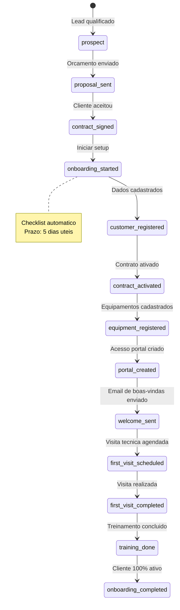
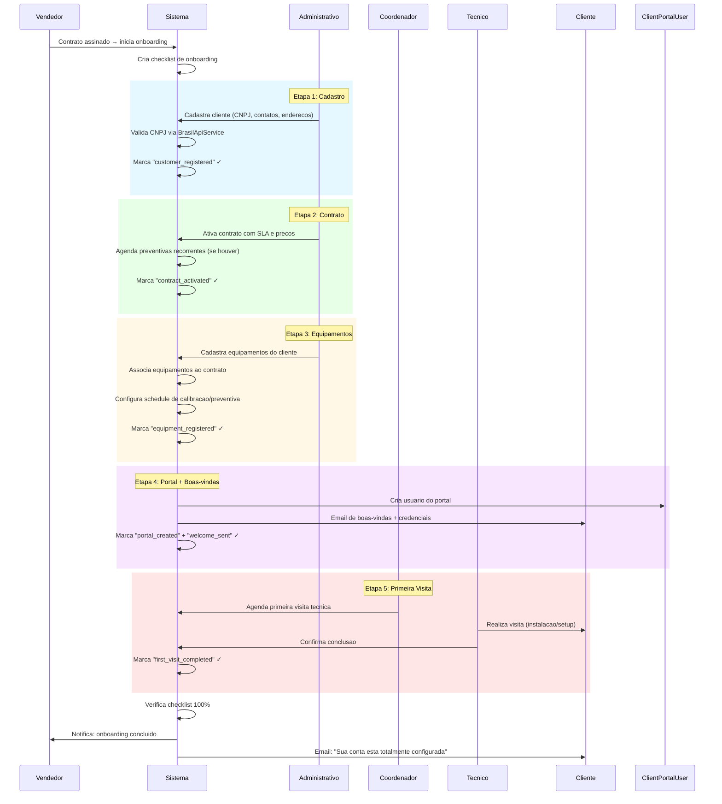

# Fluxo: Onboarding de Novo Cliente

> **Modulo**: CRM + Contracts + Portal + Operational
> **Prioridade**: P2 — Impacta experiencia do cliente e setup operacional
> **[AI_RULE]** Documento prescritivo. Baseado em `CustomerConversionService`, `ClientPortalUser`, `Contract`, `Equipment`. Verificar dados marcados com [SPEC] antes de usar em producao.

## 1. Visao Geral

Apos o vendedor fechar contrato com novo cliente, o sistema executa uma sequencia estruturada de configuracao:

1. **Cadastro completo** do cliente (dados fiscais, contatos, enderecos)
2. **Contrato ativado** com SLA, precos e termos de pagamento
3. **Equipamentos cadastrados** do cliente
4. **Portal de acesso** criado para o cliente
5. **Email de boas-vindas** automatico
6. **Primeira visita tecnica** agendada (instalacao/setup)
7. **Treinamento** registrado

**Atores**: Vendedor, Administrativo, Coordenador, Tecnico, Cliente

---

## 2. Maquina de Estados do Onboarding



---

## 3. Pipeline de Onboarding



---

## 4. Modelo de Dados

### CustomerOnboarding Model
- Tabela: `crm_customer_onboardings`
- Campos: id, tenant_id, customer_id (FK), assigned_to (FK users), status (enum: not_started, in_progress, completed, cancelled), started_at nullable, completed_at nullable, sla_deadline_at (7 dias úteis após criação), current_step (integer default 1), total_steps (integer), notes nullable, timestamps

### OnboardingChecklistItem
- Tabela: `crm_onboarding_checklist_items`
- Campos: id, tenant_id, onboarding_id (FK), step_number (integer), title, description nullable, is_required (boolean), completed_at nullable, completed_by nullable (FK users), evidence_path nullable (storage path para documentos), timestamps

### Checklist Padrão (Seeder)
1. Contrato assinado e cadastrado no sistema
2. Dados fiscais validados (CNPJ, IE, endereço)
3. Equipamentos cadastrados no inventário
4. Contato técnico definido
5. Portal do cliente configurado (login criado)
6. SLA definido e configurado
7. Primeira OS agendada
8. Kit de boas-vindas enviado

### SLA de Onboarding
- **Prazo padrão:** 7 dias úteis (configurável por tenant em `settings`)
- **Alerta:** Job `CheckOverdueOnboardings` roda diariamente, emite `OnboardingOverdue` se prazo excedido

### Endpoints
| Método | Rota | Controller | Ação |
|--------|------|-----------|------|
| POST | /api/v1/crm/onboardings | OnboardingController@store | Iniciar onboarding |
| PUT | /api/v1/crm/onboardings/{id}/steps/{step} | OnboardingController@completeStep | Completar etapa |
| GET | /api/v1/crm/onboardings/{id} | OnboardingController@show | Progresso |
| POST | /api/v1/crm/onboardings/{id}/welcome-kit | OnboardingController@sendWelcomeKit | Enviar kit |

### 4.1 CustomerOnboarding [SPEC — Novo] (legado/referência)

| Campo | Tipo | Descricao |
|-------|------|-----------|
| `id` | bigint unsigned | PK |
| `tenant_id` | bigint unsigned | FK |
| `customer_id` | bigint unsigned | FK → customers |
| `contract_id` | bigint unsigned nullable | FK → contracts |
| `assigned_to` | bigint unsigned | FK → users (responsavel pelo onboarding) |
| `status` | enum | `started`, `in_progress`, `completed`, `stalled` |
| `started_at` | datetime | — |
| `completed_at` | datetime nullable | — |
| `target_completion_at` | datetime | Prazo (started_at + 5 dias uteis) |
| `checklist` | json | Estado de cada etapa |
| `notes` | text nullable | — |

### 4.2 Checklist JSON [SPEC]

```json
{
  "customer_registered": { "completed": true, "completed_at": "2026-03-24T10:00:00", "completed_by": 5 },
  "contract_activated": { "completed": true, "completed_at": "2026-03-24T11:00:00", "completed_by": 5 },
  "equipment_registered": { "completed": false, "count": 0 },
  "portal_created": { "completed": false },
  "welcome_sent": { "completed": false },
  "first_visit_scheduled": { "completed": false },
  "first_visit_completed": { "completed": false },
  "training_done": { "completed": false }
}
```

### 4.3 Modelos Existentes Relevantes

**Customer**:

- `cnpj`, `company_name`, `trading_name`, `state_registration`
- Enderecos, contatos, dados fiscais

**ClientPortalUser** (existente):

- `customer_id`, `email`, `password`, `is_active`

**Contract** (existente):

- `customer_id`, `sla_policy_id`, `payment_terms`
- `status` → `draft`, `active`, `suspended`, `cancelled`

**Equipment** (existente):

- `customer_id`, `model`, `serial_number`, `calibration_interval`

---

## 5. Regras de Negocio

### 5.1 Prazo de Conclusao

[AI_RULE] O onboarding DEVE ser concluido em 5 dias uteis. Se estourar:

- Alerta ao gerente de vendas
- Marca como `stalled`
- Registra motivo do atraso

### 5.2 Email de Boas-vindas

[AI_RULE] O email de boas-vindas DEVE conter:

- Dados do contrato (resumo)
- Credenciais de acesso ao portal
- Contato do suporte tecnico
- Link para manual/FAQ
- Proximo passo: visita tecnica agendada

### 5.3 Primeira Visita Tecnica

| Tipo de Servico | Incluido na Primeira Visita |
|----------------|---------------------------|
| Calibracao | Calibracao inicial de equipamentos |
| Manutencao | Inspecao e setup de equipamentos |
| Preventiva | Configuracao do schedule de preventivas |
| Geral | Reconhecimento do local, fotos, mapeamento |

### 5.4 Portal do Cliente

[AI_RULE] Na criacao do acesso ao portal:

- Gerar senha temporaria com obrigatoriedade de troca no primeiro login
- Associar ao customer_id correto
- Enviar credenciais por email (com link seguro)
- Portal deve exibir: OS ativas, historico, faturas, certificados

### 5.5 Conversao Lead → Cliente

[AI_RULE] `CustomerConversionService` DEVE:

- Converter CrmLead/CrmOpportunity em Customer
- Preservar historico de contatos do CRM
- Vincular orcamento aprovado ao contrato
- Notificar vendedor sobre a conversao

---

## 6. Cenarios BDD

### Cenario 1: Onboarding completo em 3 dias

```gherkin
Dado que o vendedor fechou contrato com "Industria Nova"
Quando o onboarding e iniciado
  E o administrativo cadastra CNPJ, contatos e enderecos
  E ativa o contrato com SLA premium
  E cadastra 10 equipamentos
  E o sistema cria acesso ao portal
  E envia email de boas-vindas
  E o coordenador agenda primeira visita
  E o tecnico realiza visita em 2 dias
Entao o onboarding e concluido em 3 dias uteis
  E o cliente recebe email "Tudo pronto!"
  E o vendedor e notificado da conclusao
```

### Cenario 2: Onboarding estourou prazo

```gherkin
Dado que o onboarding de "Empresa Lenta" foi iniciado
  E estamos no 6o dia util sem conclusao
  E falta: portal + primeira visita
Entao o sistema marca como "stalled"
  E o gerente de vendas recebe alerta
  E o problema e registrado para analise
```

### Cenario 3: Conversao de lead para cliente

```gherkin
Dado que o CrmLead "Industria XYZ" tem orcamento #Q-050 aprovado
Quando o vendedor inicia conversao via CustomerConversionService
Entao o lead e convertido em Customer
  E o contrato e criado a partir do orcamento
  E o historico do CRM e preservado
  E o onboarding automatico e iniciado
```

### Cenario 4: Cliente com cadastro de equipamentos em lote

```gherkin
Dado que o novo cliente tem 50 equipamentos para cadastrar
Quando o administrativo importa planilha CSV de equipamentos
Entao os 50 equipamentos sao cadastrados automaticamente
  E cada equipamento recebe schedule de calibracao
  E o checklist item "equipment_registered" e marcado (count: 50)
```

### Cenario 5: Portal com senha temporaria

```gherkin
Dado que o onboarding concluiu etapa de portal
Quando o sistema cria ClientPortalUser
Entao uma senha temporaria e gerada
  E o email contem link seguro para primeiro acesso
  E no primeiro login o cliente e obrigado a trocar a senha
```

---

## 7. Integracao com Modulos Existentes

| Modulo | Integracao |
|--------|-----------|
| **CustomerConversionService** | Converte lead em cliente |
| **BrasilApiService** | Valida CNPJ automaticamente |
| **Contract** | Criacao e ativacao de contrato |
| **Equipment** | Cadastro de equipamentos e schedules |
| **ClientPortalUser** | Criacao de acesso ao portal |
| **ClientNotificationService** | Email de boas-vindas |
| **Agenda** | Agendamento da primeira visita |
| **CRM** | Historico de relacionamento |

---

## 8. Endpoints Envolvidos

> Endpoints reais mapeados no codigo-fonte (`backend/routes/api/`). Todos sob prefixo `/api/v1/`.

### 8.1 Customers (Cadastro de Cliente)

Registrados em `master.php`:

| Metodo | Rota | Controller | Descricao |
|--------|------|------------|-----------|
| `GET` | `/api/v1/customers` | `CustomerController@index` | Listar clientes |
| `POST` | `/api/v1/customers` | `CustomerController@store` | Criar cliente |
| `GET` | `/api/v1/customers/{customer}` | `CustomerController@show` | Detalhes do cliente |
| `PUT` | `/api/v1/customers/{customer}` | `CustomerController@update` | Atualizar cliente |
| `GET` | `/api/v1/customers/{customer}/stats` | `CustomerController@stats` | Estatisticas do cliente |

Registrados em `missing-routes.php`:

| Metodo | Rota | Controller | Descricao |
|--------|------|------------|-----------|
| `GET` | `/api/v1/customers/{customer}/addresses` | `CustomerController@addresses` | Enderecos do cliente |
| `POST` | `/api/v1/customers/{customer}/addresses` | `CustomerController@storeAddress` | Adicionar endereco |
| `GET` | `/api/v1/customers/{customer}/contacts` | `CustomerController@contacts` | Contatos do cliente |
| `POST` | `/api/v1/customers/{customer}/contacts` | `CustomerController@storeContact` | Adicionar contato |
| `GET` | `/api/v1/customers/{customer}/equipments` | `CustomerController@equipments` | Equipamentos do cliente |

### 8.2 Contratos

Registrados em `work-orders.php`:

| Metodo | Rota | Controller | Descricao |
|--------|------|------------|-----------|
| `GET` | `/api/v1/recurring-contracts` | `RecurringContractController@index` | Listar contratos recorrentes |
| `POST` | `/api/v1/recurring-contracts` | `RecurringContractController@store` | Criar contrato |
| `GET` | `/api/v1/recurring-contracts/{recurring_contract}` | `RecurringContractController@show` | Detalhes do contrato |
| `PUT` | `/api/v1/recurring-contracts/{recurring_contract}` | `RecurringContractController@update` | Atualizar contrato |
| `POST` | `/api/v1/recurring-contracts/{recurring_contract}/generate` | `RecurringContractController@generate` | Gerar OS do contrato |

### 8.3 Onboarding (HR — Templates e Checklists)

Registrados em `hr-quality-automation.php` (prefixo `hr/`):

| Metodo | Rota | Controller | Descricao |
|--------|------|------------|-----------|
| `GET` | `/api/v1/hr/onboarding/templates` | `HRAdvancedController@indexTemplates` | Listar templates de onboarding |
| `GET` | `/api/v1/hr/onboarding/checklists` | `HRAdvancedController@indexChecklists` | Listar checklists ativos |
| `POST` | `/api/v1/hr/onboarding/templates` | `HRAdvancedController@storeTemplate` | Criar template |
| `PUT` | `/api/v1/hr/onboarding/templates/{template}` | `HRAdvancedController@updateTemplate` | Atualizar template |
| `DELETE` | `/api/v1/hr/onboarding/templates/{template}` | `HRAdvancedController@destroyTemplate` | Excluir template |
| `POST` | `/api/v1/hr/onboarding/start` | `HRAdvancedController@startOnboarding` | Iniciar onboarding |
| `PUT` | `/api/v1/hr/onboarding/checklists/{checklist}` | `HRAdvancedController@updateChecklist` | Atualizar checklist |
| `DELETE` | `/api/v1/hr/onboarding/checklists/{checklist}` | `HRAdvancedController@destroyChecklist` | Excluir checklist |
| `POST` | `/api/v1/hr/onboarding/items/{itemId}/complete` | `HRAdvancedController@completeChecklistItem` | Marcar item como concluido |

### 8.4 Portal do Cliente

Registrados em `api.php` (prefixo `portal/`):

| Metodo | Rota | Controller | Descricao |
|--------|------|------------|-----------|
| `GET` | `/api/v1/portal/work-orders` | `PortalController@workOrders` | OS do cliente |
| `GET` | `/api/v1/portal/equipment` | `PortalController@equipment` | Equipamentos do cliente |
| `GET` | `/api/v1/portal/certificates` | `PortalController@certificates` | Certificados |
| `GET` | `/api/v1/portal/financials` | `PortalController@financials` | Financeiro |
| `POST` | `/api/v1/portal/service-calls` | `PortalController@newServiceCall` | Abrir chamado |

### 8.5 CRM — Visao 360 do Cliente

Registrados em `crm.php`:

| Metodo | Rota | Controller | Descricao |
|--------|------|------------|-----------|
| `GET` | `/api/v1/crm/customers/{customer}/360` | `CrmController@customer360` | Visao 360 do cliente |
| `GET` | `/api/v1/crm/customers/{customer}/360/pdf` | `CrmController@export360` | Exportar visao 360 em PDF |

### 8.6 Endpoints Planejados [SPEC]

| Metodo | Rota | Descricao | Form Request |
|--------|------|-----------|--------------|
| `POST` | `/api/v1/onboarding` | Iniciar onboarding de novo cliente (dedicado) | `StartOnboardingRequest` |
| `GET` | `/api/v1/onboarding/{id}` | Status do onboarding com checklist | — |
| `PUT` | `/api/v1/onboarding/{id}/step/{step}` | Marcar etapa como concluida | `CompleteStepRequest` |
| `GET` | `/api/v1/onboarding/active` | Listar onboardings em andamento | — |
| `GET` | `/api/v1/onboarding/stalled` | Listar onboardings atrasados | — |
| `POST` | `/api/v1/onboarding/{id}/complete` | Finalizar onboarding | — |

---

## 9. Gaps e Melhorias Futuras

| # | Item | Status |
|---|------|--------|
| 1 | Workflow automatizado por etapas (webhook entre etapas) | [SPEC] |
| 2 | Template de onboarding por tipo de servico | [SPEC] |
| 3 | Integracao com assinatura digital (DocuSign) | [SPEC] |
| 4 | Video de treinamento embutido no portal | [SPEC] |
| 5 | Metricas de tempo medio de onboarding por vendedor | [SPEC] |

> **[AI_RULE]** Este documento mapeia o fluxo de onboarding de novo cliente. Interage com `CustomerConversionService`, `BrasilApiService`, `ClientPortalUser`, `Contract`, `Equipment`, `Agenda`, `ClientNotificationService`. Atualizar ao implementar os [SPEC].

---

## Módulos Envolvidos

| Módulo | Responsabilidade no Fluxo |
|--------|---------------------------|
| [Portal](file:///c:/PROJETOS/sistema/docs/modules/Portal.md) | Criação de acesso e configuração do portal do cliente |
| [CRM](file:///c:/PROJETOS/sistema/docs/modules/CRM.md) | Cadastro completo e qualificação do cliente |
| [Email](file:///c:/PROJETOS/sistema/docs/modules/Email.md) | Welcome email e sequência de onboarding |
| [Contracts](file:///c:/PROJETOS/sistema/docs/modules/Contracts.md) | Assinatura e ativação de contrato |
| [Agenda](file:///c:/PROJETOS/sistema/docs/modules/Agenda.md) | Agendamento de visita técnica inicial |
| [Lab](file:///c:/PROJETOS/sistema/docs/modules/Lab.md) | Levantamento técnico de equipamentos do cliente |
| [Operational](file:///c:/PROJETOS/sistema/docs/modules/Operational.md) | Planejamento de operação recorrente |
