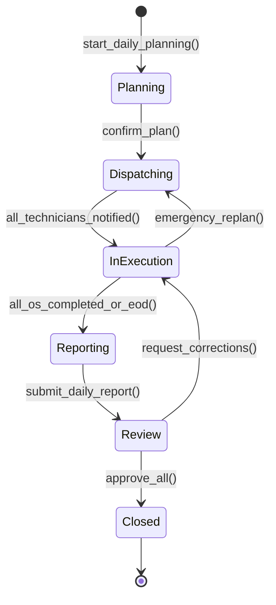
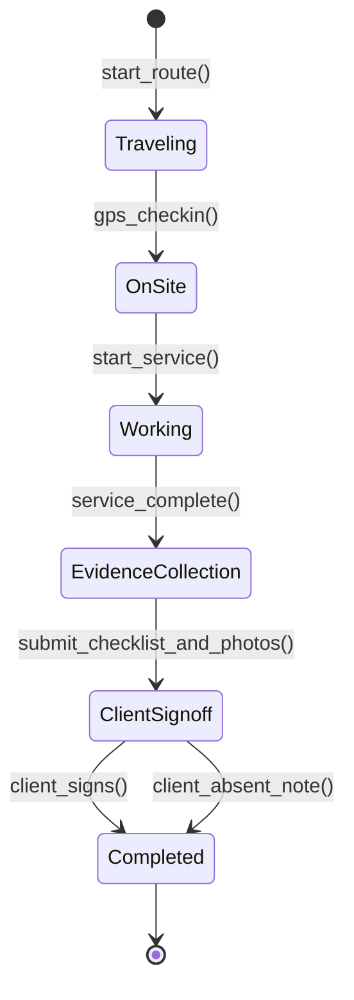
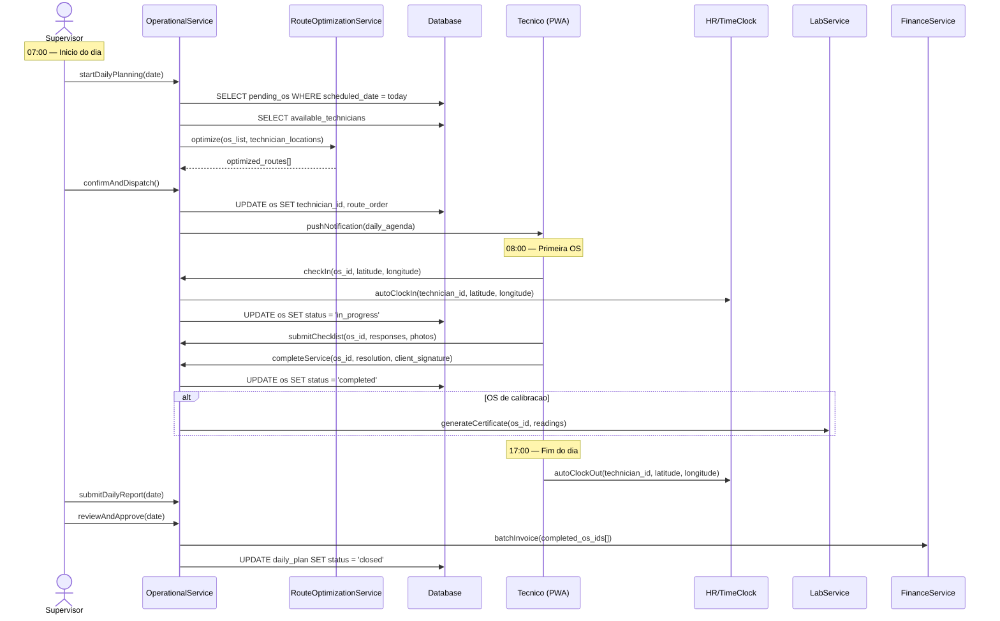

# Fluxo: Operacao Diaria

> Ciclo completo de um dia operacional: desde o planejamento matinal ate o fechamento noturno, coordenando despacho de tecnicos, execucao de ordens de servico, coleta de evidencias e reporte de resultados.

---

## 1. Narrativa do Processo

1. **Planejamento**: Supervisor revisa OS pendentes, verifica disponibilidade de tecnicos e veiculos. Algoritmo de otimizacao de rota sugere sequencia ideal.
2. **Despacho**: OS sao atribuidas aos tecnicos com rota otimizada. Tecnico recebe notificacao push com agenda do dia.
3. **Execucao**: Tecnico chega ao cliente, faz check-in GPS, executa servico, preenche checklist obrigatorio, coleta evidencias (fotos, medições).
4. **Reporte**: Tecnico finaliza OS no campo com laudo tecnico, assinatura digital do cliente, e faz clock-out.
5. **Revisao**: Supervisor revisa OS finalizadas, valida laudos e evidencias. Aprova ou solicita complemento.
6. **Fechamento**: OS aprovadas geram faturamento automatico. Dashboard operacional atualizado com metricas do dia.

---

## 2. State Machine — Ciclo Operacional Diario



---

## 3. Guards de Transicao `[AI_RULE]`

| Transicao | Guard | Motivo |
|-----------|-------|--------|
| `Planning → Dispatching` | `pending_os_count > 0 AND available_technicians > 0 AND routes_optimized = true` | Deve haver OS, tecnicos disponiveis e rotas calculadas |
| `Dispatching → InExecution` | `all_assigned_os.each { os.technician_id IS NOT NULL AND os.notification_sent = true }` | Todas OS atribuidas e notificadas |
| `InExecution → Reporting` | `time >= EOD_TIME OR all_os.status IN ('completed', 'cancelled', 'rescheduled')` | Fim do expediente ou todas OS concluidas |
| `InExecution → Dispatching` | `emergency_os_added = true` | OS emergencial adicionada requer replanejamento |
| `Reporting → Review` | `daily_report.submitted = true AND daily_report.os_count > 0` | Relatorio diario submetido |
| `Review → Closed` | `all_os.review_status = 'approved' AND pending_corrections = 0` | Todas OS aprovadas sem pendencias |
| `Review → InExecution` | `corrections_requested > 0` | Supervisor solicita correcao de laudo ou evidencia |

> **[AI_RULE]** OS emergenciais (`priority = 'emergency'`) inseridas apos o despacho forcam reotimizacao de rota via `RouteOptimizationService.reoptimize()`. O tecnico mais proximo (Haversine) e redirecionado.

> **[AI_RULE]** Tecnicos que nao fizerem check-in GPS ate 30 minutos apos o horario previsto geram alerta automatico `TechnicianDelayed` para o supervisor.

---

## 4. Sub-Fluxo: Execucao de OS Individual (dentro de InExecution)



### Guards da OS Individual

| Transicao | Guard |
|-----------|-------|
| `Traveling → OnSite` | `gps_distance_to_customer <= geofence_radius_meters` |
| `Working → EvidenceCollection` | `checklist_completed = true AND min_photos >= 1` |
| `EvidenceCollection → ClientSignoff` | `all_required_items_answered = true` |
| `ClientSignoff → Completed` | `signature_path IS NOT NULL OR absent_note IS NOT NULL` |

---

## 5. Eventos Emitidos

| Evento | Trigger | Payload | Consumidor |
|--------|---------|---------|------------|
| `DailyPlanCreated` | `[*] → Planning` | `{date, supervisor_id, os_count, technician_count}` | Agenda (bloquear slots), Fleet (reservar veiculos) |
| `RoutesDispatched` | `Planning → Dispatching` | `{routes[], technician_assignments[]}` | HR (registrar jornada prevista), Fleet (atribuir veiculo) |
| `TechnicianCheckedIn` | `Traveling → OnSite` | `{technician_id, os_id, latitude, longitude, timestamp}` | HR (clock-in automatico), Portal (status para cliente) |
| `ServiceCompleted` | `Working → Completed` | `{os_id, checklist_data, photos[], duration_minutes}` | Lab (se calibracao: gerar certificado), Finance (preparar faturamento) |
| `DailyReportSubmitted` | `Reporting → Review` | `{date, total_os, completed, cancelled, avg_duration}` | Core (dashboard), Quality (metricas) |
| `DayClosedSuccessfully` | `Review → Closed` | `{date, revenue_generated, os_completed, sla_compliance}` | Finance (faturar lote), Core (metricas diarias) |
| `EmergencyOsAdded` | Replanejamento | `{os_id, priority, customer_location}` | Operational (reotimizar rota), Fleet (verificar veiculo proximo) |
| `TechnicianDelayed` | Check-in atrasado >30min | `{technician_id, expected_at, current_location}` | Core (alerta supervisor) |

---

## 6. Modulos Envolvidos

| Modulo | Responsabilidade no Fluxo | Link |
|--------|--------------------------|------|
| **Operational** | Modulo principal. Checklists, otimizacao de rotas, NPS, agendamentos | [Operational.md](file:///c:/PROJETOS/sistema/docs/modules/Operational.md) |
| **Agenda** | Bloqueio de slots para OS agendadas. Verificacao de conflitos | [Agenda.md](file:///c:/PROJETOS/sistema/docs/modules/Agenda.md) |
| **WorkOrders** | Ciclo de vida da OS individual. Status, atribuicao, execucao | [WorkOrders.md](file:///c:/PROJETOS/sistema/docs/modules/WorkOrders.md) |
| **Lab** | Se OS envolve calibracao: gerar certificado e laudo tecnico | [Lab.md](file:///c:/PROJETOS/sistema/docs/modules/Lab.md) |
| **Fleet** | Disponibilidade de veiculos. Atribuicao de veiculo por tecnico | [Fleet.md](file:///c:/PROJETOS/sistema/docs/modules/Fleet.md) |
| **HR** | Clock-in/out automatico por GPS. Controle de jornada do tecnico | [HR.md](file:///c:/PROJETOS/sistema/docs/modules/HR.md) |
| **Finance** | Faturamento pos-servico. Calculo de comissoes por OS | [Finance.md](file:///c:/PROJETOS/sistema/docs/modules/Finance.md) |
| **Quality** | Metricas de qualidade. NPS por OS. Compliance de checklists | [Quality.md](file:///c:/PROJETOS/sistema/docs/modules/Quality.md) |

---

## 7. Diagrama de Sequencia — Dia Operacional Completo



---

## 8. Cenarios de Excecao

| Cenario | Comportamento Esperado |
|---------|----------------------|
| Tecnico sem veiculo disponivel | OS reagendada. Alerta para supervisor. Verificar Fleet para veiculo reserva |
| OS emergencial no meio do dia | Reotimizacao automatica. Tecnico mais proximo redirecionado. OS existentes reordenadas |
| Tecnico perde conexao (offline) | PWA opera em modo offline. Dados sincronizados ao recuperar conexao (ver PWA-OFFLINE-SYNC) |
| Cliente ausente no endereco | Tecnico registra `client_absent_note`. OS reagendada com prioridade elevada |
| Checklist com item reprovado | OS nao pode ser finalizada. Tecnico deve resolver ou escalar para supervisor |
| Laudo rejeitado na revisao | OS retorna para `InExecution`. Tecnico deve complementar evidencias |
| Todos tecnicos indisponiveis | Planejamento bloqueado. Alerta critico para gestor. OS reagendadas para proximo dia util |

---

## 9. KPIs do Fluxo

| KPI | Formula | Meta |
|-----|---------|------|
| OS completadas/dia | `count(os WHERE status = 'completed' AND date = today)` | >= 80% do planejado |
| Tempo medio por OS | `avg(completed_at - started_at)` | Varia por tipo de servico |
| Taxa de primeira visita | `(os_resolvidas_1a_visita / total_os) * 100` | >= 85% |
| Checklist compliance | `(checklists_completos / total_os) * 100` | 100% |
| Replanejamentos por dia | `count(emergency_replans)` | <= 2 |
| Faturamento no dia | `sum(os.valor WHERE status = 'closed' AND date = today)` | Meta financeira diaria |

---

## 10. Cenários BDD

```gherkin
Funcionalidade: Operação Diária (Fluxo Transversal)

  Cenário: Dia operacional completo do planejamento ao fechamento
    Dado que existem 15 OS pendentes para hoje
    E que 5 técnicos estão disponíveis com veículos atribuídos
    Quando o supervisor confirma o planejamento com rotas otimizadas
    E todas as OS são despachadas e técnicos notificados via push
    E cada técnico faz check-in GPS, executa serviço, preenche checklist e coleta fotos
    E cada técnico obtém assinatura digital do cliente
    E o supervisor revisa e aprova todos os laudos
    Então o dia operacional deve ter status "Closed"
    E faturamento em lote deve ser gerado para todas as OS aprovadas
    E o dashboard operacional deve exibir métricas atualizadas

  Cenário: OS emergencial força reotimização de rotas
    Dado que o despacho do dia já foi confirmado com 12 OS
    Quando uma OS emergencial (priority = "emergency") é adicionada
    Então o RouteOptimizationService.reoptimize() deve ser invocado
    E o técnico mais próximo (Haversine) deve ser redirecionado
    E as OS existentes do técnico devem ser reordenadas
    E o evento EmergencyOsAdded deve ser emitido

  Cenário: Check-in GPS exige proximidade do geofence
    Dado que o técnico "João" chegou ao endereço do cliente
    Quando João tenta fazer check-in com GPS a 50m do endereço
    E o geofence_radius_meters configurado é 100m
    Então o check-in deve ser aceito
    E o clock-in automático deve ser registrado no HR
    Quando outro técnico tenta check-in a 200m do endereço
    Então o check-in deve ser rejeitado

  Cenário: Técnico offline sincroniza dados ao reconectar
    Dado que o técnico "Maria" perdeu conexão durante execução de OS
    E que Maria completou o checklist e fotos em modo offline
    Quando a conexão é restabelecida
    Então todos os dados offline devem ser sincronizados automaticamente
    E nenhum dado deve ser perdido
    E a OS deve refletir os dados preenchidos offline

  Cenário: Técnico atrasado gera alerta automático
    Dado que o técnico "Carlos" deveria fazer check-in às 09:00
    E que são 09:35 e nenhum check-in foi registrado
    Quando o job de verificação de atrasos executa
    Então o evento TechnicianDelayed deve ser emitido
    E o supervisor deve receber alerta automático
    E a localização atual de Carlos deve ser incluída no payload
```

---

## 11. Mapeamento Técnico

### Controllers

| Controller | Métodos Relevantes | Arquivo |
|---|---|---|
| `WorkOrderController` | `index`, `store`, `show`, `update`, `updateStatus`, `storeItem`, `updateItem`, `destroyItem`, `storeSignature`, `uploadChecklistPhoto`, `storeAttachment`, `dashboardStats`, `authorizeDispatch`, `duplicate`, `reopen`, `exportCsv` | `app/Http/Controllers/Api/V1/Os/WorkOrderController.php` |
| `WorkOrderExecutionController` | `startDisplacement`, `pauseDisplacement`, `resumeDisplacement`, `arrive`, `startService`, `pauseService`, `resumeService`, `finalize`, `startReturn`, `pauseReturn`, `resumeReturn`, `arriveReturn`, `closeWithoutReturn`, `timeline` | `app/Http/Controllers/Api/V1/Os/WorkOrderExecutionController.php` |
| `RouteOptimizationController` | `optimize` | `app/Http/Controllers/Api/V1/Operational/RouteOptimizationController.php` |
| `ChecklistController` | `index`, `store`, `show`, `update`, `destroy` | `app/Http/Controllers/Api/V1/Operational/ChecklistController.php` |
| `ChecklistSubmissionController` | Submissão de checklists em campo | `app/Http/Controllers/Api/V1/Operational/ChecklistSubmissionController.php` |
| `NpsController` | `store`, `stats` | `app/Http/Controllers/Api/V1/Operational/NpsController.php` |
| `ExpressWorkOrderController` | `store` | `app/Http/Controllers/Api/V1/Operational/ExpressWorkOrderController.php` |
| `AgendaController` | `index`, `store`, `show`, `update`, `destroy`, `assign`, `complete`, `kpis`, `workload`, `summary` | `app/Http/Controllers/Api/V1/AgendaController.php` |
| `HRController` | `clockIn`, `clockOut`, `myClockHistory`, `allClockEntries` | `app/Http/Controllers/Api/V1/HRController.php` |
| `HrAdvancedController` | `advancedClockIn`, `advancedClockOut`, `currentClockStatus`, `indexGeofences` | `app/Http/Controllers/Api/V1/HrAdvancedController.php` |
| `FleetController` | `indexVehicles`, `showVehicle`, `dashboardFleet` | `app/Http/Controllers/Api/V1/FleetController.php` |
| `WorkOrderApprovalController` | Aprovação de OS pelo supervisor | `app/Http/Controllers/Api/V1/Os/WorkOrderApprovalController.php` |

### Services

| Service | Responsabilidade | Arquivo |
|---|---|---|
| `RouteOptimizationService` | Otimização de rotas (Haversine) e reotimização emergencial | `app/Services/RouteOptimizationService.php` |
| `ServiceCallService` | Gerenciamento de chamados de serviço | `app/Services/ServiceCallService.php` |
| `InvoicingService` | Faturamento pós-serviço de OS completadas | `app/Services/InvoicingService.php` |
| `WorkOrderInvoicingService` | Faturamento específico de OS | `app/Services/WorkOrderInvoicingService.php` |
| `TimeClockService` | Clock-in/out automático por GPS | `app/Services/TimeClockService.php` |
| `AgendaService` | Gestão de agenda e slots | `app/Services/AgendaService.php` |
| `AgendaAutomationService` | Automação de regras de agenda | `app/Services/AgendaAutomationService.php` |
| `TechnicianProductivityService` | Métricas de produtividade por técnico | `app/Services/TechnicianProductivityService.php` |
| `LocationValidationService` | Validação de geofence para check-in GPS | `app/Services/LocationValidationService.php` |
| `PostServiceSurveyService` | NPS e pesquisa pós-serviço | `app/Services/PostServiceSurveyService.php` |
| `CalibrationCertificateService` | Geração de certificado para OS de calibração | `app/Services/CalibrationCertificateService.php` |

### Models Envolvidos

| Model | Tabela | Arquivo |
|---|---|---|
| `WorkOrder` | `work_orders` | `app/Models/WorkOrder.php` |
| `WorkOrderItem` | `work_order_items` | `app/Models/WorkOrderItem.php` |
| `WorkOrderAttachment` | `work_order_attachments` | `app/Models/WorkOrderAttachment.php` |
| `WorkOrderSignature` | `work_order_signatures` | `app/Models/WorkOrderSignature.php` |
| `WorkOrderChecklistResponse` | `work_order_checklist_responses` | `app/Models/WorkOrderChecklistResponse.php` |
| `WorkOrderStatusHistory` | `work_order_status_histories` | `app/Models/WorkOrderStatusHistory.php` |
| `WorkOrderTimeLog` | `work_order_time_logs` | `app/Models/WorkOrderTimeLog.php` |
| `WorkOrderEvent` | `work_order_events` | `app/Models/WorkOrderEvent.php` |
| `WorkOrderDisplacementLocation` | `work_order_displacement_locations` | `app/Models/WorkOrderDisplacementLocation.php` |
| `WorkOrderDisplacementStop` | `work_order_displacement_stops` | `app/Models/WorkOrderDisplacementStop.php` |
| `Checklist` | `checklists` | `app/Models/Checklist.php` |
| `ChecklistSubmission` | `checklist_submissions` | `app/Models/ChecklistSubmission.php` |
| `AgendaItem` | `agenda_items` | `app/Models/AgendaItem.php` |
| `Schedule` | `schedules` | `app/Models/Schedule.php` |
| `TimeClockEntry` | `time_clock_entries` | `app/Models/TimeClockEntry.php` |
| `VisitCheckin` | `visit_checkins` | `app/Models/VisitCheckin.php` |
| `VisitRoute` | `visit_routes` | `app/Models/VisitRoute.php` |
| `ServiceCall` | `service_calls` | `app/Models/ServiceCall.php` |

### Endpoints API

| Método | Endpoint | Descrição |
|---|---|---|
| `GET` | `/api/v1/work-orders` | Listar OS do dia |
| `POST` | `/api/v1/work-orders` | Criar OS |
| `GET` | `/api/v1/work-orders/{id}` | Detalhe da OS |
| `PUT/POST` | `/api/v1/work-orders/{id}/status` | Atualizar status da OS |
| `POST` | `/api/v1/work-orders/{id}/authorize-dispatch` | Autorizar despacho |
| `POST` | `/api/v1/work-orders/{id}/execution/start-displacement` | Iniciar deslocamento |
| `POST` | `/api/v1/work-orders/{id}/execution/arrive` | Check-in GPS no cliente |
| `POST` | `/api/v1/work-orders/{id}/execution/start-service` | Iniciar serviço |
| `POST` | `/api/v1/work-orders/{id}/execution/finalize` | Finalizar OS |
| `POST` | `/api/v1/work-orders/{id}/execution/start-return` | Iniciar retorno |
| `POST` | `/api/v1/work-orders/{id}/execution/arrive-return` | Chegada de retorno |
| `POST` | `/api/v1/work-orders/{id}/execution/close-without-return` | Fechar sem retorno |
| `GET` | `/api/v1/work-orders/{id}/execution/timeline` | Timeline de execução |
| `POST` | `/api/v1/work-orders/{id}/signature` | Assinatura digital do cliente |
| `POST` | `/api/v1/work-orders/{id}/photo-checklist/upload` | Upload de fotos do checklist |
| `POST` | `/api/v1/work-orders/{id}/attachments` | Anexar evidências |
| `POST` | `/api/v1/operational/work-orders/express` | Criar OS expressa |
| `POST` | `/api/v1/operational/nps` | Registrar NPS |
| `GET` | `/api/v1/operational/nps/stats` | Estatísticas NPS |
| `POST` | `/api/v1/operational/route-optimization/optimize` | Otimizar rotas |
| `GET` | `/api/v1/work-orders-dashboard-stats` | Dashboard operacional |
| `POST` | `/api/v1/hr/clock/in` | Clock-in do técnico |
| `POST` | `/api/v1/hr/clock/out` | Clock-out do técnico |
| `POST` | `/api/v1/hr/advanced/clock-in` | Clock-in avançado com GPS |
| `GET` | `/api/v1/hr/advanced/clock/status` | Status atual do ponto |
| `GET` | `/api/v1/agenda-items` | Listar itens da agenda |
| `POST` | `/api/v1/agenda-items` | Criar item de agenda |

### Events/Listeners

| Evento | Arquivo |
|---|---|
| `WorkOrderStarted` | `app/Events/WorkOrderStarted.php` |
| `WorkOrderCompleted` | `app/Events/WorkOrderCompleted.php` |
| `WorkOrderCancelled` | `app/Events/WorkOrderCancelled.php` |
| `WorkOrderStatusChanged` | `app/Events/WorkOrderStatusChanged.php` |
| `WorkOrderInvoiced` | `app/Events/WorkOrderInvoiced.php` |
| `TechnicianLocationUpdated` | `app/Events/TechnicianLocationUpdated.php` |
| `ClockEntryRegistered` | `app/Events/ClockEntryRegistered.php` |
| `ServiceCallCreated` | `app/Events/ServiceCallCreated.php` |
| `ServiceCallStatusChanged` | `app/Events/ServiceCallStatusChanged.php` |
| [SPEC] `DailyPlanCreated` | A ser criado — `app/Events/DailyPlanCreated.php` |
| [SPEC] `TechnicianDelayed` | A ser criado — `app/Events/TechnicianDelayed.php` |
| [SPEC] `EmergencyOsAdded` | A ser criado — `app/Events/EmergencyOsAdded.php` |

### DailyBriefingService (`App\Services\Operational\DailyBriefingService`)
- `generate(int $tenantId, Carbon $date): DailyBriefing`
- **Dados agregados:**
  - OS agendadas para o dia (WorkOrders where scheduled_date = today)
  - OS atrasadas (overdue)
  - Técnicos disponíveis vs indisponíveis
  - Alertas pendentes (SLA próximo de breach)
  - Equipamentos com calibração vencendo em 7 dias
- **Endpoint:** `GET /api/v1/operational/daily-briefing`
- **Cache:** 15 minutos

### Algoritmo de Priorização de OS
- **Método:** Score ponderado, ordenação decrescente
- **Fórmula:** `score = (sla_urgency * 40) + (customer_priority * 25) + (revenue_impact * 20) + (age_days * 15)`
- **sla_urgency:** 0-100 baseado em % do SLA consumido (100 = prestes a estourar)
- **customer_priority:** Baseado no tier do contrato (platinum=100, gold=75, silver=50, basic=25)
- **revenue_impact:** Valor estimado da OS / maior valor de OS do tenant * 100
- **age_days:** min(dias desde criação * 5, 100)

### Reconciliação fim do dia
- **Job:** `DailyReconciliationJob` — roda às 22:00 (configurável via Scheduler)
- **Ações:**
  1. Marcar OS não atendidas como `overdue`
  2. Calcular métricas do dia (OS completadas, tempo médio, NPS)
  3. Gerar registro em `op_daily_summaries` (tabela de cache)
  4. Disparar `DailySummaryGenerated` event → Alerts (se metas não atingidas)

> **Nota:** Este é o fluxo com maior cobertura de código existente. WorkOrderController e WorkOrderExecutionController cobrem todo o ciclo de vida da OS individual. RouteOptimizationService implementa Haversine. Os eventos de OS já existem. Faltam apenas os eventos específicos do ciclo diário (DailyPlanCreated, TechnicianDelayed) e a coordenação de planejamento matinal como service dedicado.
