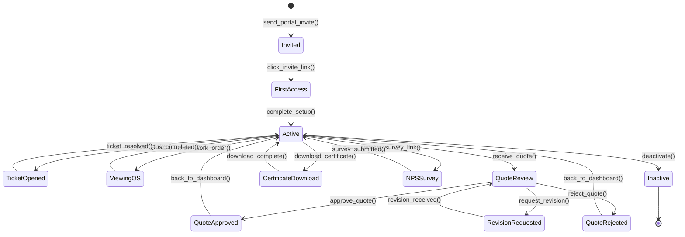
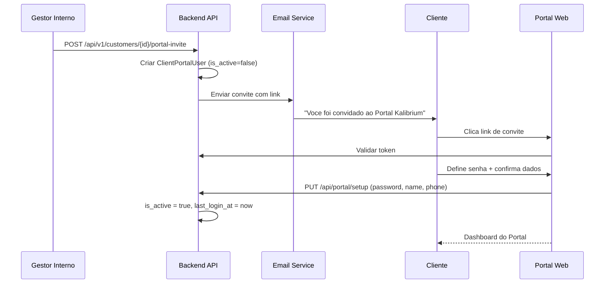
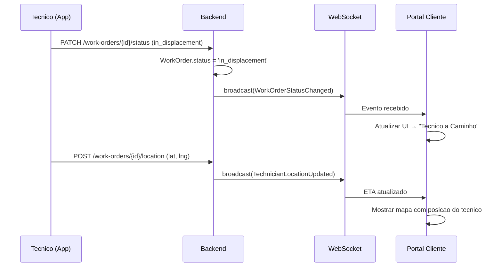
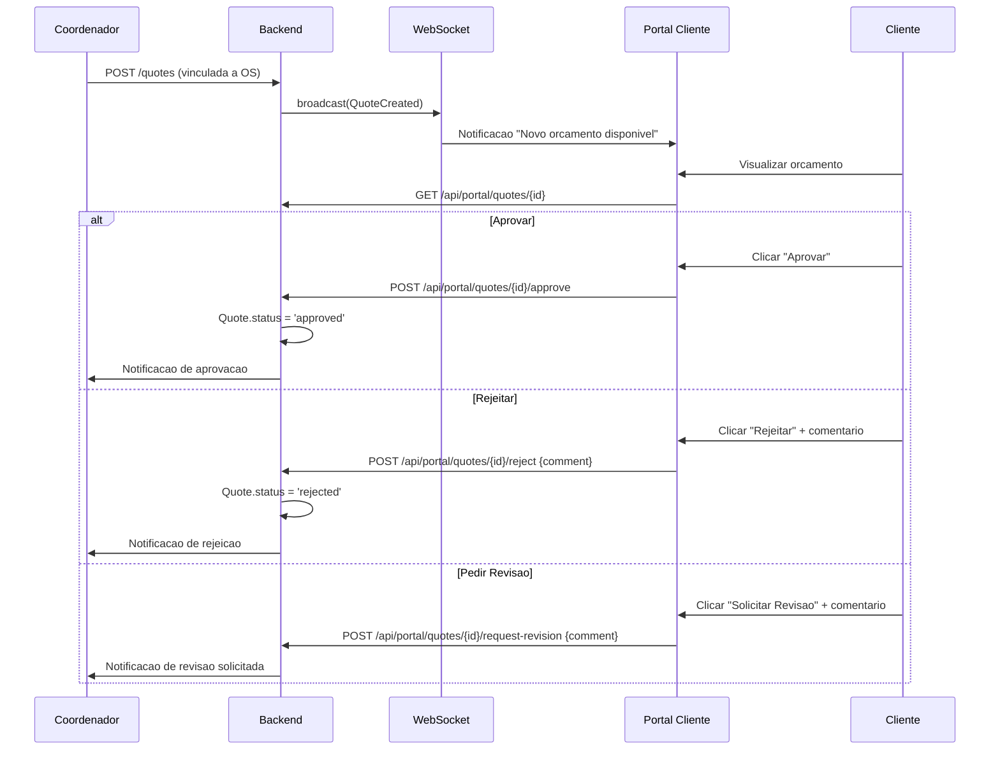
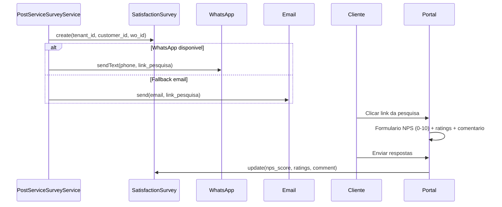

# Fluxo Cross-Domain: Portal do Cliente

> **Kalibrium ERP** -- Jornada completa do cliente no portal de autoatendimento
> Versao: 1.0 | Data: 2026-03-24

---

## 1. Visao Geral

O Portal do Cliente permite que clientes acompanhem OS, aprovem orcamentos, baixem certificados, consultem financeiro e respondam pesquisas NPS -- tudo via interface web dedicada com autenticacao propria.

**Modulos envolvidos:** Autenticacao Portal, Chamados/Tickets, Ordem de Servico, Orcamentos, Certificados, Financeiro, NPS, WebSocket.

[AI_RULE] O portal usa autenticacao separada via `ClientPortalUser` (Sanctum). NUNCA compartilha sessao com usuarios internos. Todas as queries sao filtradas por `customer_id` do portal user. [/AI_RULE]

---

## 2. State Machine — Jornada do Cliente no Portal



### Guards de Transição `[AI_RULE]`

| Transição | Guard |
|-----------|-------|
| `Invited → FirstAccess` | `invite_token.is_valid AND NOT expired` |
| `FirstAccess → Active` | `password_set AND terms_accepted AND is_active = true` |
| `Active → TicketOpened` | `portal_user.is_active = true AND customer_id IS NOT NULL` |
| `QuoteReview → QuoteRejected` | `rejection_comment IS NOT NULL AND comment.length > 0` |
| `Active → CertificateDownload` | `certificate.status = 'approved' AND customer_id matches` |
| `Active → Inactive` | `admin_action OR is_active = false` |

---

## 3. Onboarding do Cliente

### 2.1 Model Existente: `ClientPortalUser`

```php
// backend/app/Models/ClientPortalUser.php
class ClientPortalUser extends Authenticatable
{
    use HasApiTokens, HasFactory, Notifiable, BelongsToTenant;

    protected $fillable = [
        'tenant_id', 'customer_id', 'name', 'email',
        'password', 'is_active', 'last_login_at',
    ];
}
```

### 2.2 Fluxo de Convite

```
1. Gestor interno acessa Cadastro do Cliente > aba "Portal"
2. Clica "Convidar para Portal" → informa email
3. Sistema cria ClientPortalUser com password temporaria
4. Email de convite enviado com link de primeiro acesso
5. Cliente clica no link → define senha → completa perfil
6. last_login_at e atualizado
```

### 2.3 Primeiro Acesso

| Passo | Acao | Validacao |
|-------|------|-----------|
| 1 | Cliente clica link do email | Token valido e nao expirado |
| 2 | Define nova senha | Min 8 chars, 1 maiuscula, 1 numero |
| 3 | Confirma dados (nome, telefone) | Campos obrigatorios |
| 4 | Aceita termos de uso | Checkbox obrigatorio |
| 5 | Redirecionado ao dashboard | is_active = true |

[AI_RULE] Se o ClientPortalUser tem `is_active = false`, qualquer chamada de API retorna 403. [/AI_RULE]

---

## 3. Abertura de Ticket (Chamado)

### 3.1 Formulario

| Campo | Tipo | Obrigatorio |
|-------|------|-------------|
| `category` | select | Sim (Calibracao, Reparo, Instalacao, Duvida, Reclamacao) |
| `priority` | select | Sim (low, medium, high, critical) |
| `subject` | text | Sim (max 200 chars) |
| `description` | textarea | Sim (max 5000 chars) |
| `photos` | file[] | Nao (max 5 fotos, 5MB cada) |
| `equipment_id` | select | Nao (lista de equipamentos do cliente) |
| `preferred_date` | date | Nao |

### 3.2 Processamento

```
1. Cliente preenche formulario no portal
2. POST /api/portal/tickets → cria ServiceCall
3. ServiceCall.customer_id = ClientPortalUser.customer_id
4. ServiceCall.status = 'open'
5. Se prioridade critical → SLA de 30 min resposta
6. Coordenador recebe notificacao (WebPush + email)
7. Cliente recebe confirmacao com numero do chamado
```

[SPEC] Implementar endpoint `POST /api/portal/tickets` dedicado ao portal (guard `client-portal`). Criar `PortalTicketController` com `StorePortalTicketRequest` FormRequest.

---

## 4. Acompanhamento em Tempo Real

### 4.1 WebSocket (Laravel Echo + Pusher/Soketi)

```
Canal: private-portal.customer.{customerId}

Eventos:
- WorkOrderStatusChanged → {wo_id, old_status, new_status, timestamp}
- TechnicianLocationUpdated → {wo_id, lat, lng, eta_minutes}
- ServiceCallUpdated → {sc_id, status, message}
- QuoteCreated → {quote_id, total, items_count}
- CertificateReady → {certificate_id, download_url}
```

### 4.2 Status Visiveis no Portal

| Status Interno | Label no Portal | Icone |
|----------------|-----------------|-------|
| `open` | Aberta | circulo azul |
| `awaiting_dispatch` | Aguardando Despacho | relogio |
| `in_displacement` | Tecnico a Caminho | carro |
| `at_client` | Tecnico no Local | pin |
| `in_service` | Em Atendimento | ferramenta |
| `waiting_parts` | Aguardando Pecas | caixa |
| `waiting_approval` | Aguardando Aprovacao | exclamacao |
| `completed` | Concluida | check verde |
| `delivered` | Entregue | estrela |

[AI_RULE] Status internos como `service_paused`, `displacement_paused`, `return_paused` sao mapeados para labels amigaveis. O cliente NUNCA ve nomenclatura tecnica. [/AI_RULE]

---

## 5. Aprovacao de Orcamento

### 5.1 Fluxo

```
1. Tecnico/coordenador cria orcamento vinculado a OS
2. Portal recebe evento QuoteCreated via WebSocket
3. Cliente visualiza orcamento com:
   - Itens detalhados (servico, pecas, quantidades, valores)
   - Condicoes de pagamento
   - Prazo de validade
   - Versoes anteriores (se houver revisao)
4. Cliente pode:
   a. APROVAR → status = 'approved', assinatura digital [SPEC]
   b. REJEITAR → status = 'rejected', comentario obrigatorio
   c. SOLICITAR REVISAO → status = 'revision_requested', comentario
5. Coordenador e notificado da decisao
6. Se aprovado → OS prossegue para execucao
```

### 5.2 Comparacao de Versoes

[SPEC] Implementar versionamento de orcamentos:

```
QuoteVersion:
  - quote_id
  - version_number (1, 2, 3...)
  - items (JSON snapshot)
  - total
  - created_at
  - created_by

Portal exibe diff visual entre versoes:
  - Itens adicionados (verde)
  - Itens removidos (vermelho)
  - Valores alterados (amarelo)
```

---

## 6. Download de Certificados

### 6.1 Fluxo

```
1. Calibracao concluida → certificado gerado (PDF)
2. Portal recebe evento CertificateReady
3. Cliente acessa aba "Certificados"
4. Lista com filtros: periodo, equipamento, tipo
5. Download do PDF com QR Code de verificacao
6. QR Code aponta para URL publica: /verificar/{hash}
7. Qualquer pessoa com o QR pode validar autenticidade
```

### 6.2 Verificacao por QR Code

```
URL: https://{tenant}.kalibrium.com.br/verificar/{hash}
Retorna:
  - Numero do certificado
  - Data de emissao
  - Equipamento calibrado
  - Validade
  - Status: VALIDO / EXPIRADO / REVOGADO
  - Logo do laboratorio
```

[AI_RULE] A pagina de verificacao e publica (sem autenticacao). O hash e um UUID v4 gerado na emissao do certificado. [/AI_RULE]

---

## 7. Historico Financeiro

### 7.1 Dados Exibidos

| Secao | Dados | Fonte |
|-------|-------|-------|
| Faturas | Lista de AccountReceivable do cliente | `account_receivables` WHERE customer_id |
| Pagamentos | Historico de Payment vinculados | `payments` via AR |
| Boletos | Status + link 2a via | [SPEC] Integracao bancaria (CNAB/API gateway) |
| NF-e/NFS-e | Download XML/PDF | `fiscal_events` |

### 7.2 Status das Faturas

| Status | Label Portal | Cor |
|--------|-------------|-----|
| `pending` | Em Aberto | amarelo |
| `partial` | Parcialmente Pago | azul |
| `paid` | Pago | verde |
| `overdue` | Vencido | vermelho |
| `cancelled` | Cancelado | cinza |

### 7.3 Segunda Via de Boleto

[SPEC] Implementar:

```
1. Cliente clica "2a Via" na fatura pendente/vencida
2. Sistema consulta gateway bancario para gerar novo boleto
3. PDF do boleto e exibido inline + opcao de download
4. Codigo de barras/PIX QR code para pagamento
```

---

## 8. Pesquisa NPS Pos-Servico

### 8.1 Implementacao Existente

O `PostServiceSurveyService` envia pesquisa automaticamente:

```
1. OS muda para status 'completed'
2. Scheduler verifica OS concluidas nas ultimas 24h sem survey
3. Cria SatisfactionSurvey (tenant_id, customer_id, work_order_id)
4. Envia link via WhatsApp (primario) ou email (fallback)
5. Link: /portal/pesquisa/{surveyId}?token={encrypted}
```

### 8.2 Formulario da Pesquisa (`SatisfactionSurvey`)

| Campo | Tipo | Escala |
|-------|------|--------|
| `nps_score` | integer | 0-10 (Net Promoter Score) |
| `service_rating` | integer | 1-5 estrelas |
| `technician_rating` | integer | 1-5 estrelas |
| `timeliness_rating` | integer | 1-5 estrelas |
| `comment` | text | Livre (opcional) |

### 8.3 Classificacao NPS

| Score | Classificacao |
|-------|--------------|
| 0-6 | Detrator |
| 7-8 | Neutro |
| 9-10 | Promotor |

**NPS = %Promotores - %Detratores**

---

## 9. Diagramas

### 9.1 Jornada de Onboarding



### 9.2 Acompanhamento em Tempo Real



### 9.3 Aprovacao de Orcamento



### 9.4 Pesquisa NPS



---

## 10. BDD -- Cenarios

```gherkin
Funcionalidade: Portal do Cliente

  Cenario: Onboarding - convite e primeiro acesso
    Dado um cliente "Empresa ABC" cadastrado no sistema
    Quando o gestor clica "Convidar para Portal" com email "joao@abc.com"
    Entao um ClientPortalUser e criado com is_active=false
    E um email de convite e enviado para "joao@abc.com"
    Quando o cliente acessa o link e define sua senha
    Entao is_active muda para true
    E last_login_at e preenchido

  Cenario: Abertura de ticket pelo portal
    Dado o cliente "joao@abc.com" autenticado no portal
    Quando preenche o formulario de chamado com categoria "Calibracao" e prioridade "high"
    Entao um ServiceCall e criado com customer_id do portal user
    E o coordenador recebe notificacao WebPush

  Cenario: Acompanhamento em tempo real via WebSocket
    Dado uma OS #2001 do cliente "Empresa ABC"
    Quando o tecnico muda o status para "in_displacement"
    Entao o portal recebe evento WorkOrderStatusChanged
    E exibe "Tecnico a Caminho" com ETA estimado

  Cenario: Aprovacao de orcamento com comentario
    Dado um orcamento de R$ 5.000 para OS #2002
    Quando o cliente clica "Aprovar" no portal
    Entao o orcamento muda para status "approved"
    E o coordenador e notificado

  Cenario: Rejeicao de orcamento exige comentario
    Dado um orcamento pendente no portal
    Quando o cliente tenta rejeitar sem comentario
    Entao recebe erro de validacao "Comentario obrigatorio"

  Cenario: Download de certificado com QR
    Dado um certificado de calibracao emitido para equipamento #301
    Quando o cliente acessa "Certificados" no portal
    Entao o certificado aparece na lista
    E o PDF baixado contem QR code de verificacao
    E o QR aponta para URL publica de validacao

  Cenario: Historico financeiro mostra faturas
    Dado o cliente tem 3 faturas: 1 paga, 1 pendente, 1 vencida
    Quando acessa "Financeiro" no portal
    Entao ve 3 faturas com status corretos (Pago, Em Aberto, Vencido)

  Cenario: Pesquisa NPS apos servico
    Dado uma OS concluida do cliente "Empresa ABC"
    Quando o PostServiceSurveyService processa
    Entao um SatisfactionSurvey e criado
    E o cliente recebe link via WhatsApp
    Quando responde com NPS 9 e rating 5 estrelas
    Entao a survey e atualizada com os scores
```

---

## 10.1 Especificacoes Tecnicas

### Controllers Dedicados

**PortalDashboardController** (`App\Http\Controllers\Api\V1\Portal\PortalDashboardController`)
- `index()` — resumo: OS ativas, faturas pendentes, contratos, NPS

**PortalQuoteController** (`App\Http\Controllers\Api\V1\Portal\PortalQuoteController`)
- `index()` — listar orçamentos do cliente
- `show($id)` — detalhe com itens
- `approve($id)` — aprovar orçamento
- `reject($id)` — rejeitar com motivo
- `counterProposal($id)` — submeter contraproposta (cria nova versão)

**PortalInvoiceController** (`App\Http\Controllers\Api\V1\Portal\PortalInvoiceController`)
- `index()` — listar faturas
- `show($id)` — detalhe com PDF
- `downloadPdf($id)` — download do boleto/NF

### WebSocket (Laravel Reverb)
- **Canal:** `private-portal.customer.{customer_id}`
- **Eventos broadcast:**
  - `WorkOrderStatusUpdated` — quando OS muda de status
  - `InvoiceGenerated` — quando nova fatura é criada
  - `QuoteCreated` — quando novo orçamento disponível
- **Frontend:** Usar `laravel-echo` com Reverb driver

### Autenticação Portal
- **Guard:** `portal` (separado do guard `api`)
- **Token:** Sanctum com ability `portal:*`
- **Expiração:** 24 horas
- **Refresh:** `POST /api/v1/portal/auth/refresh` — emite novo token se atual ainda válido
- **Rate limit:** 60 requests/minuto por customer_id

### Quote Versioning
- Campo `version` (integer) na tabela `quotes`
- Campo `parent_quote_id` (FK nullable) para contraproposta
- `QuoteVersionService::createCounterProposal(Quote $original, array $changes): Quote`

---

## 11. Arquivos Relevantes

| Arquivo | Descricao |
|---------|-----------|
| `backend/app/Models/ClientPortalUser.php` | Model de usuario do portal |
| `backend/app/Services/PostServiceSurveyService.php` | Pesquisa NPS automatica |
| `backend/app/Models/SatisfactionSurvey.php` | Model da pesquisa (nps_score, ratings) |
| `backend/app/Services/ClientNotificationService.php` | Notificacoes para clientes |
| `backend/app/Services/WhatsAppService.php` | Envio WhatsApp |
| `backend/app/Services/WebPushService.php` | Push notifications |
| `backend/app/Models/WorkOrder.php` | OS com status tracking |

---

## 12. Gaps Identificados

| # | Prio | Gap | Status |
|---|------|-----|--------|
| 1 | Alta | Endpoints dedicados do portal (guard `client-portal`) | [SPEC] `PortalTicketController`, `PortalQuoteController`, `PortalFinanceController` com guard `client-portal` |
| 2 | Alta | WebSocket channels para portal | [SPEC] Canal `private-portal.customer.{customerId}` com eventos da secao 4.1 |
| 3 | Alta | Frontend React do portal (SPA separada ou rota dedicada) | [SPEC] SPA React com React Router em `/portal/*`, autenticacao Sanctum separada |
| 4 | Media | Versionamento de orcamentos com diff visual | [SPEC] Model `QuoteVersion` conforme secao 5.2 — snapshot JSON + diff visual |
| 5 | Media | 2a via de boleto via integracao bancaria | [SPEC] Endpoint `POST /portal/boleto/{arId}/segunda-via` — consulta gateway CNAB/API |
| 6 | Media | Assinatura digital na aprovacao de orcamento | [SPEC] Canvas de assinatura (SignaturePad.js), salvar como PNG em `quote_approvals.signature_path` |
| 7 | Baixa | Mapa com posicao do tecnico em tempo real | [SPEC] Leaflet/Google Maps com marcador atualizado via evento `TechnicianLocationUpdated` |
| 8 | Baixa | Pagina publica de verificacao de certificado via QR | [SPEC] Rota publica `GET /verificar/{hash}` — secao 6.2 acima |

---

## Módulos Envolvidos

| Módulo | Responsabilidade no Fluxo |
|--------|---------------------------|
| [Portal](file:///c:/PROJETOS/sistema/docs/modules/Portal.md) | Interface SPA do cliente: dashboard, OS, documentos |
| [Email](file:///c:/PROJETOS/sistema/docs/modules/Email.md) | Notificações transacionais (status OS, novas faturas) |
| [Finance](file:///c:/PROJETOS/sistema/docs/modules/Finance.md) | Consulta e pagamento de faturas pelo portal |
| [Core](file:///c:/PROJETOS/sistema/docs/modules/Core.md) | Autenticação e gestão de sessão do cliente |
| [Lab](file:///c:/PROJETOS/sistema/docs/modules/Lab.md) | Consulta de certificados e laudos de calibração |
| [Quotes](file:///c:/PROJETOS/sistema/docs/modules/Quotes.md) | Visualização e aprovação de orçamentos |
| [Fiscal](file:///c:/PROJETOS/sistema/docs/modules/Fiscal.md) | Download de DANFE e XML de NF-e |
| [WorkOrders](file:///c:/PROJETOS/sistema/docs/modules/WorkOrders.md) | Acompanhamento de ordens de serviço em tempo real |
