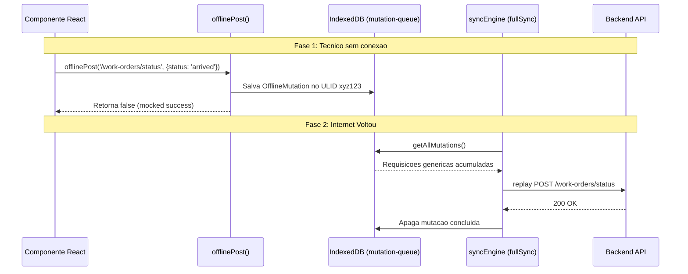
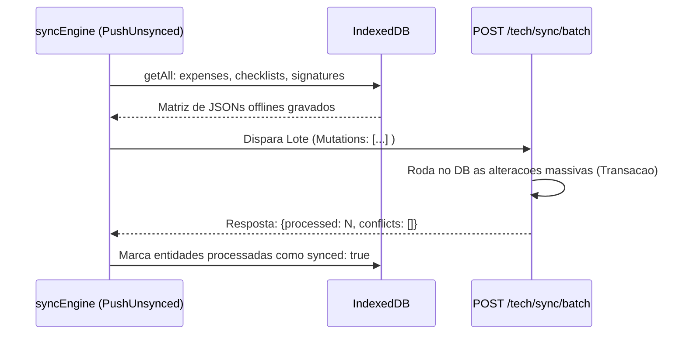

# Fluxo Cross-Domain: PWA e Modo Offline com Sincronizacao

> **Kalibrium ERP** -- Progressive Web App com operacao offline para tecnicos em campo
> Versao: 1.1 (Atualizada com Implementacao Real) | Data: 2026-03-26

---

## 1. Visao Geral

O PWA do Kalibrium permite que tecnicos em campo continuem operando mesmo sem conexao a internet. Acoes criticas (check-in/out, checklists, fotos, despesas) e contagens de inventario sao salvas localmente no IndexedDB (`kalibrium-offline`) e sincronizadas automaticamente em background ou sob demanda quando a conexao retorna.

**Modulos envolvidos:** PWA/Service Worker, Ordem de Servico, Checklist, Despesas, Fotos/Anexos, Inventario.

[AI_RULE] O modo offline e uma feature CRITICA para tecnicos em campo. O sistema DEVE funcionar sem internet para operacoes do dia, armazenando mutacoes na `mutation-queue` para eventual replay. [/AI_RULE]

---

## 2. Service Worker e Hook de PWA

O PWA utiliza o modulo `vite-plugin-pwa` no frontend. A deteccao de instalacao e atualizacao do Service Worker e gerenciada pelo hook real `usePWA.ts`.
A injecao do service worker controla o cache de assets estaticos, enquanto a logica de negocio offline e delegada ao `syncEngine.ts` e `offlineDb.ts`.

---

## 3. O Que Funciona Offline

### 3.1 Operacoes Disponiveis em Campo (OS)

| Operacao | Armazenamento (`kalibrium-offline`) | Prioridade / Fila |
|----------|--------------|-----------------|
| Visualizar OS do dia | `work-orders` (IndexedDB) | N/A (leitura) |
| Acoes dinamicas (check-in/out) | Fila generica `mutation-queue` | FIFO Replay |
| Preencher checklist | `checklist-responses` | Batch Sync |
| Registrar Despesa | `expenses` | Batch Sync |
| Coletar Assinatura | `signatures` | Batch Sync |
| Tirar fotos / anexar | `photos` (Blob) | Batch Sync (photo API) |
| Consultar detalhes (pesos) | `standard-weights`, `equipment` | N/A (leitura) |

### 3.2 Novo: Inventario PWA Offline

Os estoquistas e tecnicos possuem acesso ao modulo de contagem de inventario otimizado para celulares via PWA (`InventoryPwaListPage.tsx`, `InventoryPwaCountPage.tsx`).
- O sistema comunica-se com `InventoryPwaController.php`.
- Exibe itens esperados em cada armazem e coleta contagem agrupada, sincronizando os dados para deteccao de diferencas (discrepancias).
- **Nota técnica:** A api expoe sub-rotas associadas ao estoque para o fluxo do estoquista validar depositos remotos/veiculos.

### 3.3 Operacoes que NAO Funcionam Offline

| Operacao | Motivo |
|----------|--------|
| Criar nova OS | Requer validacao server-side e numero sequencial |
| Aprovar orcamento | Requer transacao financeira atomica |
| Emitir NF-e/NFS-e | Depende de comunicacao com SEFAZ/Prefeitura |
| Consultar historico completo | Volume de dados muito grande para cache local |

---

## 4. IndexedDB -- Schema Real Implementado

### 4.1 Database e Stores (`offlineDb.ts`)

A implementação utiliza a biblioteca `idb` com schema rigidamente tipado. O banco real chama-se `kalibrium-offline` (versao 2).

**Stores de Leitura (Cacheados no Pull):**
- `work-orders`: OS atribuidas, ordenadas por tempo e status.
- `equipment`: Equipamentos associados a OS ou cliente.
- `checklists`: Templates disponiveis.
- `standard-weights`: Catalogo de pesos padrao de calibracao.
- `customer-capsules`: Dados encapsulados do cliente.

**Stores de Escrita Offline (Filas de Sync):**
- `mutation-queue`: Fila generica (POST, PUT, PATCH, DELETE) de endpoints via wrappers `offlinePost` e `offlinePut`.
- `checklist-responses`: Respostas submetidas de checklists. (Indexadas como `synced: false/true`).
- `expenses`: Despesas cadastradas sem internet.
- `signatures`: Assinaturas digitais de conclusao.
- `photos`: Blobs binarios de imagens associadas as entidades.
- `sync-metadata`: Guarda a data do ultimo Pull para queries incrementais (`last_pulled_at`).

### 4.2 Estrutura de Mutacao Pendente Genérica (`mutation-queue`)

Qualquer chamada feita pela UI sem internet e salva pelo hook na fila de mutacao.

```typescript
export interface OfflineMutation {
    id: string;                 // ULID local
    method: 'POST' | 'PUT' | 'PATCH' | 'DELETE';
    url: string;                // Ex: /api/v1/work-orders/123/status
    body?: unknown;
    headers?: Record<string, string>;
    created_at: string;
    retries: number;            // Replicacao tenta ate 5 vezes
    last_error?: string | null; // Se erro definitivo, abandona a mutacao
}
```

---

## 5. Arquitetura de Sincronizacao Automatica (`syncEngine.ts`)

O arquivo **`syncEngine.ts`** centraliza toda a lógica de push e pull.

### 5.1 O Motor (SyncEngine)

A sincronizacao (`fullSync()`) funciona em 3 fases:

1. **Push Unsynced Data (Lote Especializado):**
   Coleta itens especificos offline (`checklist-responses`, `expenses`, `signatures`) e dispara num unico endpoint **`POST /tech/sync/batch`**. O backend processa todas as entidades em array buscando otimizacao transacional.
2. **Replay da Mutation Queue (Genérica):**
   Varre a `mutation-queue` (requisicoes interceptadas de offlinePost) e reenvia uma a uma. Erros HTTP `400-499` (permanente) abortam a mutacao. Erros transientes (ex `50x`) sobem o contador `retries`. Apos 5 falhas, bloqueia.
3. **Pull Data (Server → Client):**
   Realiza um **`GET /tech/sync?since=Y-m-dTH:I:SZ`**.
   Recebe todas as OS, Equipamentos, Checklists e Pesos Padrao que mudaram desde a ultima request salva em `sync-metadata`. Atualiza o IndexedDB.

### 5.2 Resolucao de Conflitos no Push

Se a API no backend detectar que o servidor contem dados mais novos do que a versão local a ser modificada pelo modulo, retorna um Array de `conflicts: []` e `errors: []` no SyncBatchResponse:

```json
{
   "processed": 10,
   "conflicts": [{"type": "checklist_response", "id": "ulid123", "server_updated_at": "2026-03-25T10..."}],
   "errors": []
}
```
O Client armazena o status de conflito marcando o registro offline com o `sync_error` recebido exibindo indicativo na UI para correcao manual do tecnico.

---

## 6. Indicador Visual (`SyncStatusPanel.tsx`)

O Painel Superior de Sync exibe de forma reativa os dados gravados pendentes da `mutation-queue` e falhas.
Exibe modal rico lendo a object store, apresentando:
- Metodo HTML (`POST`, `PUT`, `DELETE`).
- Endpoint que esta fila esperando envio (`url`).
- Timestamp amigavel ("há 4 minutos").
- Botao Manual de Sync ("Sincronizar" disparando chamada manual no `syncEngine`).

---

## 7. Diagramas de Implementacao Real

### 7.1 Fluxo de Action Generico (ex: Mudanca de Status via offlinePost)



### 7.2 Fluxo Misto de Payload Específico (Batch Syncing)



---

## 8. Arquivos Relevantes Validados

| Arquivo | Implementação Atualizada na Arquitetura |
|---------|-------------------------|
| `frontend/src/hooks/usePWA.ts` | Controle de PWA install e updates de Service Worker |
| `frontend/src/lib/offlineDb.ts` | O schema IndexedDB "`kalibrium-offline`", stores e queries. |
| `frontend/src/lib/syncEngine.ts` | Logica Master de Sync: API pull, push batch e replay queue. |
| `frontend/src/components/pwa/SyncStatusPanel.tsx` | Hub PWA superior de acompanhamento das requests |
| `backend/app/.../InventoryPwaController.php` | API hibrida para modulo estoquista operando offline e escaneando QR Code |

---

## 9. Status da Especificacao Arquitetural e Gap Resolvido

A arquitetura consolidou o esquema do IndexedDB na sua versao v2 (via `offlineDb.ts`) estabelecendo nivel arquitetural fortemente genérico e escalável que atua como barramento virtual entre o browser e o servidor.
**Incompatibilidade Curada:**
Ao invés de definir lojas soltas (ex: `pending_clock`), requisições tradicionais isoladas sem cache proprio caem silenciosamente e de modo limpo na store `mutation-queue`. Desta forma, envios de ponto (HR) ou telemetria simples efetuadas enquanto `!navigator.onLine` são abstraidas e reinjetadas com o payload na fase Replay, reduzindo estresse e centralizando tratativas de falhas REST em um só algoritmo global.
