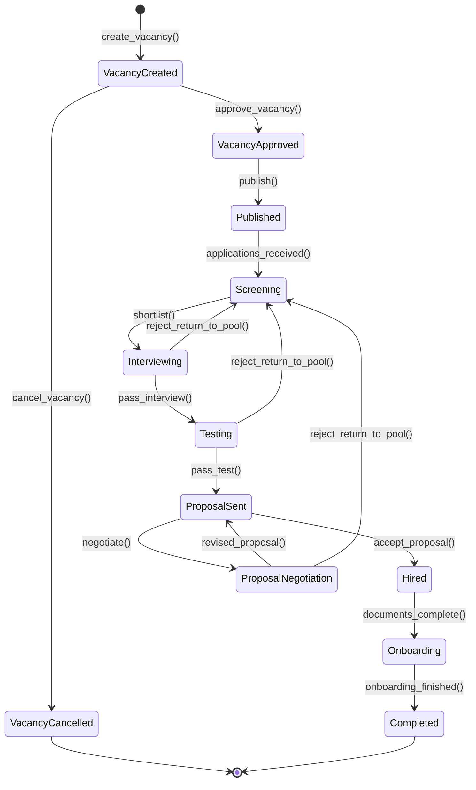
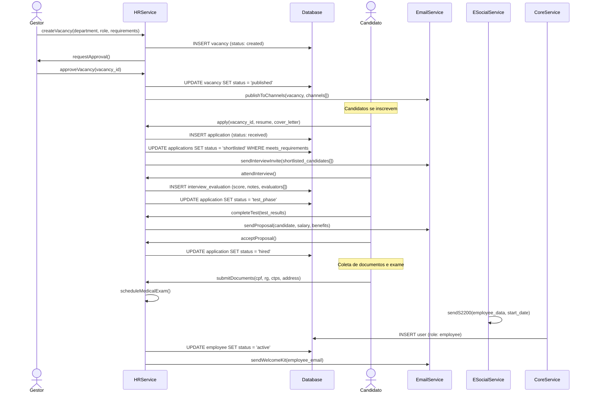

# Fluxo: Recrutamento e Selecao

> Ciclo completo de contratacao: desde a abertura da vaga ate o onboarding do novo colaborador, com integracao automatica ao eSocial e criacao de acessos.

---

## 1. Narrativa do Processo

1. **Abertura de Vaga**: Gestor cria requisicao de vaga com perfil, requisitos, faixa salarial e justificativa.
2. **Aprovacao**: RH e diretoria aprovam a vaga conforme orcamento de headcount.
3. **Divulgacao**: Vaga publicada em canais configurados (site, LinkedIn, portais).
4. **Triagem**: RH filtra candidaturas por requisitos minimos. Scoring automatico por aderencia ao perfil.
5. **Entrevista**: Candidatos selecionados passam por entrevista tecnica e comportamental. Avaliacao por rubrica padronizada.
6. **Teste**: Candidatos aprovados na entrevista fazem teste tecnico e/ou psicologico.
7. **Proposta**: RH elabora proposta salarial. Candidato aceita ou negocia.
8. **Contratacao**: Candidato aceita proposta. Inicia coleta de documentos e exame admissional.
9. **Onboarding**: Colaborador integrado: acesso ao sistema, treinamento, eSocial (S-2200), e atribuicao de equipamentos.

---

## 2. State Machine — Ciclo de Recrutamento

---

## 3. Guards de Transicao `[AI_RULE]`

| Transicao | Guard | Motivo |
|-----------|-------|--------|
| `VacancyCreated → VacancyApproved` | `budget_headcount_available = true AND salary_range IS NOT NULL` | Orcamento e faixa salarial obrigatorios |
| `VacancyApproved → Published` | `channels.count >= 1 AND job_description.length >= 100` | Ao menos 1 canal e descricao completa |
| `Published → Screening` | `applications.count >= 1` | Ao menos 1 candidatura recebida |
| `Screening → Interviewing` | `shortlisted_candidates.count >= 1 AND all_meet_minimum_requirements = true` | Candidatos atendem requisitos minimos |
| `Interviewing → Testing` | `interview_score >= minimum_interview_score AND evaluators.count >= 2` | Nota minima e avaliacao por 2 entrevistadores |
| `Testing → ProposalSent` | `test_score >= minimum_test_score` | Aprovacao no teste tecnico/psicologico |
| `ProposalSent → Hired` | `candidate_acceptance = true AND proposed_salary BETWEEN salary_range` | Candidato aceitou e salario dentro da faixa |
| `Hired → Onboarding` | `documents_submitted = true AND medical_exam_approved = true` | Documentos e exame admissional OK |
| `Onboarding → Completed` | `system_access_created = true AND esocial_s2200_sent = true AND training_plan_assigned = true` | Acesso, eSocial e treinamento configurados |

> **[AI_RULE_CRITICAL]** O evento eSocial S-2200 (Admissao) DEVE ser enviado ate 1 dia util antes do inicio do trabalho. A transicao `Onboarding → Completed` so e permitida apos confirmacao de envio. A IA NUNCA deve pular essa validacao.

> **[AI_RULE]** A faixa salarial proposta NUNCA pode exceder o teto definido na vaga (`proposed_salary <= vacancy.salary_max`). Se o candidato exigir acima do teto, a vaga deve retornar para aprovacao de diretoria com novo orcamento.

> **[AI_RULE]** Candidatos rejeitados devem receber email de agradecimento automatico via `EmailService`. LGPD: dados do candidato devem ser anonimizados apos 6 meses se nao contratado, exceto com consentimento explicito.

---

## 4. Eventos Emitidos

| Evento | Trigger | Payload | Consumidor |
|--------|---------|---------|------------|
| `VacancyCreated` | `[*] → VacancyCreated` | `{vacancy_id, department, role, salary_range}` | Core (Notification para RH) |
| `VacancyApproved` | `VacancyCreated → VacancyApproved` | `{vacancy_id, approved_by}` | Core (log auditoria) |
| `VacancyPublished` | `VacancyApproved → Published` | `{vacancy_id, channels[]}` | Email (notificar equipe), Portal (publicar) |
| `CandidateShortlisted` | `Screening → Interviewing` | `{vacancy_id, candidate_ids[], count}` | Email (convite entrevista) |
| `InterviewCompleted` | Avaliacao registrada | `{vacancy_id, candidate_id, score, evaluators[]}` | Core (log) |
| `TestCompleted` | Resultado de teste | `{vacancy_id, candidate_id, test_type, score}` | Core (log) |
| `ProposalSent` | `Testing → ProposalSent` | `{vacancy_id, candidate_id, salary, benefits}` | Email (enviar proposta formal) |
| `CandidateHired` | `ProposalSent → Hired` | `{vacancy_id, candidate_id, start_date, salary}` | HR (iniciar onboarding), ESocial (preparar S-2200) |
| `OnboardingCompleted` | `Onboarding → Completed` | `{employee_id, vacancy_id, access_created, training_plan}` | HR (ativar colaborador), Core (fechar vaga) |
| `CandidateRejected` | Rejeicao em qualquer etapa | `{vacancy_id, candidate_id, stage, reason}` | Email (agradecimento), Core (LGPD timer) |

---

## 5. Modulos Envolvidos

| Modulo | Responsabilidade no Fluxo | Link |
|--------|--------------------------|------|
| **HR** | Modulo principal. Vagas, candidatos, contratacao, onboarding | [HR.md](file:///c:/PROJETOS/sistema/docs/modules/HR.md) |
| **ESocial** | Envio de evento S-2200 (Admissao). Obrigatorio antes do 1o dia de trabalho | [ESocial.md](file:///c:/PROJETOS/sistema/docs/modules/ESocial.md) |
| **Email** | Notificacoes para candidatos (convite, proposta, rejeicao) | [Email.md](file:///c:/PROJETOS/sistema/docs/modules/Email.md) |
| **Core** | Notifications, audit log, controle de acessos (user creation) | [Core.md](file:///c:/PROJETOS/sistema/docs/modules/Core.md) |
| **Finance** | Orcamento de headcount. Provisao de salario | [Finance.md](file:///c:/PROJETOS/sistema/docs/modules/Finance.md) |

---

## 6. Diagrama de Sequencia — Contratacao Completa

---

## 7. Cenarios de Excecao

| Cenario | Comportamento Esperado |
|---------|----------------------|
| Nenhum candidato atende requisitos | Vaga permanece em `Published`. RH pode flexibilizar requisitos ou ampliar canais |
| Candidato desiste apos proposta | Vaga retorna para `Screening` para selecionar proximo candidato do ranking |
| Exame admissional reprova candidato | Contratacao cancelada. Candidato notificado. Vaga retorna para `Screening` |
| eSocial fora do ar | Onboarding bloqueado. Sistema tenta reenvio a cada 1h por 24h. Apos isso, alerta critico |
| Candidato negocia salario acima do teto | Proposta recusada automaticamente. Se gestor concordar, vaga retorna para aprovacao com novo teto |
| Vaga cancelada apos publicacao | Todos candidatos notificados por email. Dados retidos por 6 meses (LGPD) |
| Candidato contratado nao aparece no 1o dia | Status muda para `no_show`. RH decide: aguardar 48h ou cancelar contratacao |

---

## 8. Endpoints Envolvidos

> Endpoints reais mapeados no codigo-fonte (`backend/routes/api/`). Todos sob prefixo `/api/v1/`.

### 8.1 Recrutamento — Vagas e Candidatos

Registrados em `hr-quality-automation.php` (prefixo `hr/`):

| Metodo | Rota | Controller | Descricao |
|--------|------|------------|-----------|
| `GET` | `/api/v1/hr/job-postings` | `RecruitmentController@index` | Listar vagas |
| `GET` | `/api/v1/hr/job-postings/{jobPosting}` | `RecruitmentController@show` | Detalhes da vaga |
| `POST` | `/api/v1/hr/job-postings` | `RecruitmentController@store` | Criar vaga |
| `PUT` | `/api/v1/hr/job-postings/{jobPosting}` | `RecruitmentController@update` | Atualizar vaga |
| `DELETE` | `/api/v1/hr/job-postings/{jobPosting}` | `RecruitmentController@destroy` | Excluir vaga |
| `POST` | `/api/v1/hr/job-postings/{jobPosting}/candidates` | `RecruitmentController@storeCandidate` | Adicionar candidato |
| `PUT` | `/api/v1/hr/job-postings/{jobPosting}/candidates/{candidate}` | `RecruitmentController@updateCandidate` | Atualizar candidato |
| `DELETE` | `/api/v1/hr/job-postings/{jobPosting}/candidates/{candidate}` | `RecruitmentController@destroyCandidate` | Excluir candidato |

Registrados em `advanced-features.php`:

| Metodo | Rota | Controller | Descricao |
|--------|------|------------|-----------|
| `GET` | `/api/v1/hr/job-postings/{jobPosting}/candidates` | `JobPostingController@candidates` | Listar candidatos da vaga |
| `PUT` | `/api/v1/hr/candidates/{candidate}` | `JobPostingController@updateCandidate` | Atualizar candidato (direto) |
| `DELETE` | `/api/v1/hr/candidates/{candidate}` | `JobPostingController@destroyCandidate` | Excluir candidato (direto) |

### 8.2 eSocial (Admissao S-2200)

Registrados em `hr-quality-automation.php` (prefixo `hr/`):

| Metodo | Rota | Controller | Descricao |
|--------|------|------------|-----------|
| `GET` | `/api/v1/hr/esocial/events` | `ESocialController@index` | Listar eventos eSocial |
| `GET` | `/api/v1/hr/esocial/events/{id}` | `ESocialController@show` | Detalhes do evento |
| `GET` | `/api/v1/hr/esocial/batches/{batchId}` | `ESocialController@checkBatch` | Verificar lote |
| `GET` | `/api/v1/hr/esocial/certificates` | `ESocialController@certificates` | Certificados eSocial |
| `POST` | `/api/v1/hr/esocial/certificates` | `ESocialController@storeCertificate` | Enviar certificado |

### 8.3 Onboarding do Colaborador

Registrados em `hr-quality-automation.php` (prefixo `hr/`):

| Metodo | Rota | Controller | Descricao |
|--------|------|------------|-----------|
| `GET` | `/api/v1/hr/onboarding/templates` | `HRAdvancedController@indexTemplates` | Templates de onboarding |
| `POST` | `/api/v1/hr/onboarding/start` | `HRAdvancedController@startOnboarding` | Iniciar onboarding do colaborador |
| `POST` | `/api/v1/hr/onboarding/items/{itemId}/complete` | `HRAdvancedController@completeChecklistItem` | Marcar item do checklist |

---

## 8.4 Scoring e LGPD

### Scoring Automático
- **Service:** `CandidateScoreService::score(Candidate $c, Vacancy $v): float`
- **Critérios:**
  | Critério | Peso | Cálculo |
  |----------|------|---------|
  | Experiência (anos na área) | 30% | min(anos/requisito, 1.0) |
  | Formação (match com requisito) | 25% | 1.0 se exata, 0.7 se área relacionada, 0.3 se diferente |
  | Certificações | 20% | certificações_match / certificações_requeridas |
  | Pretensão salarial | 15% | 1.0 se dentro do range, decai linearmente até 0 em ±30% |
  | Distância (km) | 10% | max(1 - km/100, 0) |
- **Score final:** soma ponderada, escala 0-100

### LGPD Anonymization
- **Job:** `AnonymizeRejectedCandidates` — roda mensalmente
- **Regra:** Candidatos com `status = rejected` e `rejected_at < 6 meses atrás`
- **Ação:** Substituir nome por "Candidato Anonimizado #ID", limpar email, phone, address, CPF. Manter: vacancy_id, score, stage_reached (para analytics)
- **Nota:** Candidatos que consentiram em manter dados são excluídos (`consent_to_retain = true`)

---

## 9. KPIs do Fluxo

| KPI | Formula | Meta |
|-----|---------|------|
| Time to hire | `avg(hired_at - vacancy_created_at)` | <= 30 dias |
| Time to fill | `avg(onboarding_completed_at - vacancy_created_at)` | <= 45 dias |
| Candidatos por vaga | `avg(applications / vacancies)` | >= 10 |
| Taxa de aprovacao entrevista | `(aprovados_entrevista / total_entrevistados) * 100` | 30-50% |
| Offer acceptance rate | `(propostas_aceitas / propostas_enviadas) * 100` | >= 80% |
| Quality of hire (90 dias) | `avg(performance_score_90d)` | >= 3.5 / 5.0 |
| Cost per hire | `total_recruiting_cost / hires` | Benchmark do setor |
