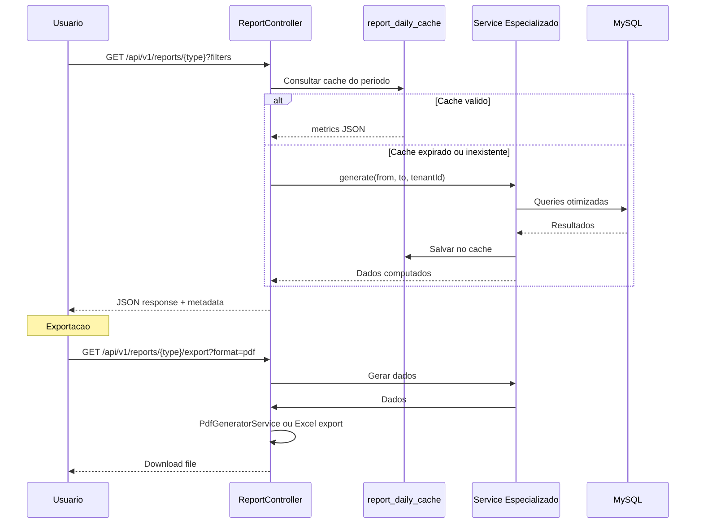
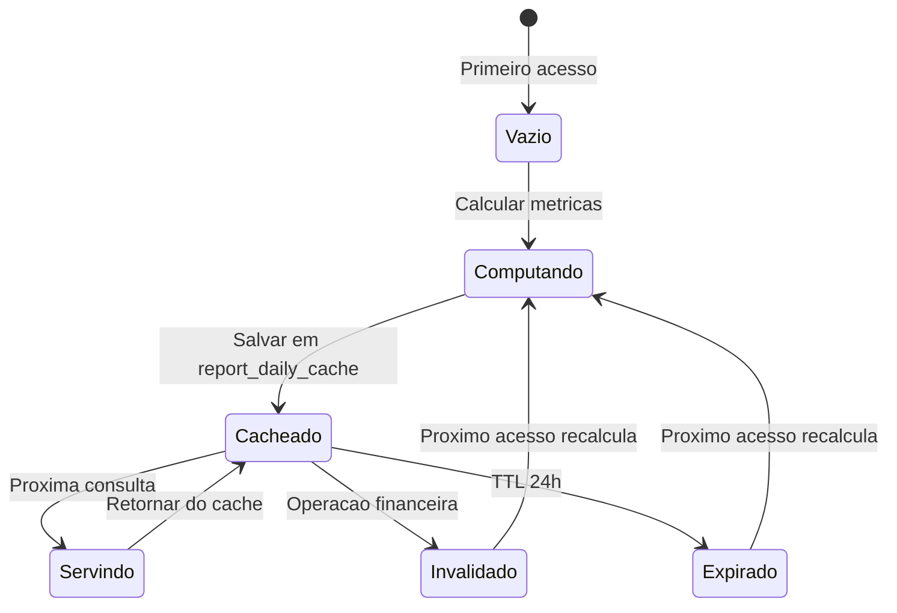

# Fluxo Cross-Domain: Relatorios Gerenciais

> **Kalibrium ERP** -- Relatorios por perfil de usuario com SQL otimizado
> Versao: 1.0 | Data: 2026-03-24

---

## 1. Visao Geral

O sistema oferece relatorios especializados por perfil (Dono/Diretor, Coordenador, Financeiro, Laboratorio, RH), cada um com metricas, filtros, graficos e exportacao relevantes ao seu papel.

**Modulos envolvidos:** Todos os modulos do ERP (OS, Financeiro, RH, Laboratorio, CRM, Frota).

[AI_RULE] Todos os relatorios DEVEM filtrar por `tenant_id`. Nenhum dado de outro tenant pode vazar, mesmo em queries agregadas. [/AI_RULE]

---

## 2. Relatorios do Dono/Diretor

### 2.1 Dashboard Executivo

| Metrica | Fonte | Query |
|---------|-------|-------|
| Receita Bruta Mensal | `AccountReceivable` | SUM(amount) WHERE status IN (paid, partial) GROUP BY month |
| Receita Liquida | `DREService::generate()` | Receita bruta - deducoes |
| Margem Bruta | `DREService` | (Receita - Custos) / Receita * 100 |
| Inadimplencia | `AccountReceivable` | SUM(amount) WHERE status = 'overdue' / SUM(total) * 100 |
| Forecast Proximo Mes | `CashFlowProjectionService::project()` | Entradas previstas - Saidas previstas |
| Comparativo Mensal | `AccountReceivable` + `AccountPayable` | YoY e MoM |

### 2.2 Graficos

| Grafico | Tipo | Dados |
|---------|------|-------|
| Receita x Despesa (12 meses) | Barras empilhadas | AR.amount vs AP.amount por mes |
| Margem Bruta Mensal | Linha | DRE.lucro_bruto / DRE.receitas_brutas |
| Top 10 Clientes (receita) | Barras horizontais | SUM(AR.amount) GROUP BY customer_id |
| Inadimplencia por Aging | Donut | 1-30d, 31-60d, 61-90d, 90d+ |

### 2.3 Filtros

- Periodo: mes, trimestre, semestre, ano, personalizado
- Filial/unidade (se multi-unidade)
- Centro de custo (`cost_centers`)
- Comparar com periodo anterior

### 2.4 Exportacao

- PDF (relatorio formatado com logo do tenant)
- Excel (dados brutos + abas por secao)
- Agendamento por email (diario/semanal/mensal) [SPEC] — Job `ScheduledReportJob` com cron por frequencia, email via `ReportMailService`

---

## 3. Relatorios do Coordenador

### 3.1 Produtividade por Tecnico

O `TechnicianProductivityService` (existente) calcula:

```php
// Metricas por tecnico:
'os_total'            => int,     // OS atribuidas no periodo
'os_completed'        => int,     // OS concluidas
'avg_execution_hours' => float,   // Media de horas por OS
'first_fix_rate'      => float,   // % resolvidas sem reabrir
'sla_compliance'      => float,   // % dentro do SLA
'nps_average'         => float,   // Media NPS do tecnico
'revenue_generated'   => float,   // Receita gerada
'hours_worked'        => float,   // Horas trabalhadas (TimeEntry)
'commissions_earned'  => float,   // Comissoes geradas
'productivity_index'  => float,   // Indice composto 0-100
```

Formula do indice de produtividade:

```
osPerHour = osCompleted / hoursWorked
osScore = min(100, osPerHour * 50)     // 2 OS/hora = 100
qualityScore = (firstFixRate * 0.5) + (slaRate * 0.5)
index = (osScore * 0.4) + (qualityScore * 0.6)
```

### 3.2 SLA Compliance

O `SlaEscalationService::getDashboard()` retorna:

```json
{
  "on_time": 45,
  "at_risk": 8,
  "breached": 3,
  "total": 56,
  "compliance_rate": 80.4
}
```

### 3.3 OS por Status

| Status | Contagem | Query |
|--------|----------|-------|
| `open` | N | WorkOrder WHERE status = 'open' |
| `in_service` | N | WorkOrder WHERE status = 'in_service' |
| `waiting_parts` | N | WorkOrder WHERE status = 'waiting_parts' |
| `waiting_approval` | N | WorkOrder WHERE status = 'waiting_approval' |
| `completed` | N | WorkOrder WHERE status = 'completed' |
| Total periodo | N | COUNT(*) no periodo |

### 3.4 Mapa de Calor

[SPEC] Implementar heatmap geografico:

```
- Eixo: regioes/cidades dos clientes
- Intensidade: quantidade de OS
- Dados: Customer.city + COUNT(WorkOrder)
- Visualizacao: mapa do Brasil com clusters
```

### 3.5 Graficos do Coordenador

| Grafico | Tipo | Dados |
|---------|------|-------|
| Ranking de Tecnicos | Barras horizontais | productivity_index DESC |
| OS por Status | Donut | COUNT GROUP BY status |
| SLA Compliance Trend | Linha | compliance_rate por semana |
| First Fix Rate Trend | Linha | first_fix_rate por mes |

---

## 4. Relatorios Financeiros

### 4.1 Fluxo de Caixa

O `CashFlowProjectionService::project()` (existente) retorna:

```php
[
    'period' => ['from' => '2026-03-01', 'to' => '2026-03-31'],
    'summary' => [
        'entradas_previstas'  => '150000.00',
        'entradas_realizadas' => '120000.00',
        'saidas_previstas'    => '80000.00',
        'saidas_realizadas'   => '65000.00',
        'saldo_previsto'      => '70000.00',
        'saldo_realizado'     => '55000.00',
    ],
    'daily' => [...],   // Projecao dia a dia
    'by_week' => [...],  // Agregado semanal
]
```

### 4.2 DRE Simplificado

O `DREService::generate()` (existente) retorna:

```php
[
    'receitas_brutas'          => '200000.00',
    'deducoes'                 => '15000.00',
    'receitas_liquidas'        => '185000.00',
    'custos_servicos'          => '80000.00',
    'lucro_bruto'              => '105000.00',
    'despesas_operacionais'    => '30000.00',
    'despesas_administrativas' => '20000.00',
    'despesas_financeiras'     => '5000.00',
    'resultado_operacional'    => '50000.00',
    'resultado_liquido'        => '50000.00',
    'by_month' => [...],
]
```

### 4.3 Aging de Recebiveis

```sql
-- Query otimizada para aging
SELECT
    CASE
        WHEN DATEDIFF(CURDATE(), due_date) BETWEEN 1 AND 30 THEN '1-30 dias'
        WHEN DATEDIFF(CURDATE(), due_date) BETWEEN 31 AND 60 THEN '31-60 dias'
        WHEN DATEDIFF(CURDATE(), due_date) BETWEEN 61 AND 90 THEN '61-90 dias'
        WHEN DATEDIFF(CURDATE(), due_date) > 90 THEN '90+ dias'
        ELSE 'A vencer'
    END AS faixa,
    COUNT(*) AS quantidade,
    SUM(amount - COALESCE(amount_paid, 0)) AS valor_total
FROM account_receivables
WHERE tenant_id = ? AND status IN ('pending', 'partial', 'overdue')
GROUP BY faixa
ORDER BY FIELD(faixa, 'A vencer', '1-30 dias', '31-60 dias', '61-90 dias', '90+ dias');
```

### 4.4 Comissoes

O `CommissionService` (existente) calcula comissoes por triggers:

| Trigger | Descricao |
|---------|-----------|
| `os_completed` | Ao concluir OS |
| `os_invoiced` | Ao faturar OS |
| `installment_paid` | Ao receber parcela |

Relatorio de comissoes:

```
- Comissoes por tecnico/vendedor
- Comissoes por periodo
- Comissoes pendentes vs pagas
- Disputas abertas (CommissionDispute model)
```

### 4.5 Graficos Financeiros

| Grafico | Tipo | Dados |
|---------|------|-------|
| Fluxo de Caixa (previsto vs realizado) | Area | daily entries/exits |
| DRE Mensal | Waterfall | receita → custos → despesas → lucro |
| Aging de Recebiveis | Barras empilhadas | por faixa de atraso |
| Top 10 Devedores | Barras horizontais | SUM(saldo_devedor) por cliente |

---

## 5. Relatorios do Laboratorio

### 5.1 Certificados Emitidos

```sql
SELECT
    DATE_FORMAT(issued_at, '%Y-%m') AS mes,
    COUNT(*) AS total_certificados,
    COUNT(DISTINCT equipment_id) AS equipamentos_unicos,
    COUNT(DISTINCT customer_id) AS clientes_atendidos
FROM calibration_certificates
WHERE tenant_id = ?
  AND issued_at BETWEEN ? AND ?
GROUP BY mes
ORDER BY mes;
```

### 5.2 Tempo Medio de Calibracao

```sql
SELECT
    s.name AS tipo_servico,
    AVG(TIMESTAMPDIFF(HOUR, wo.started_at, wo.completed_at)) AS horas_media,
    MIN(TIMESTAMPDIFF(HOUR, wo.started_at, wo.completed_at)) AS horas_min,
    MAX(TIMESTAMPDIFF(HOUR, wo.started_at, wo.completed_at)) AS horas_max,
    COUNT(*) AS total_os
FROM work_orders wo
JOIN services s ON s.id = wo.service_id
WHERE wo.tenant_id = ?
  AND wo.status IN ('completed', 'delivered', 'invoiced')
  AND wo.started_at IS NOT NULL
  AND wo.completed_at IS NOT NULL
  AND wo.created_at BETWEEN ? AND ?
GROUP BY s.id, s.name
ORDER BY horas_media DESC;
```

### 5.3 Padroes com Validade Proxima

```sql
-- Padroes de referencia com calibracao vencendo
SELECT
    ri.name AS padrao,
    ri.serial_number,
    ri.calibration_due_date,
    DATEDIFF(ri.calibration_due_date, CURDATE()) AS dias_restantes
FROM reference_instruments ri
WHERE ri.tenant_id = ?
  AND ri.calibration_due_date IS NOT NULL
  AND ri.calibration_due_date <= DATE_ADD(CURDATE(), INTERVAL 90 DAY)
ORDER BY ri.calibration_due_date ASC;
```

[AI_RULE] Padrao com calibracao vencida INVALIDA todos os certificados emitidos com ele apos a data de vencimento. Alerta critico obrigatorio. [/AI_RULE]

### 5.4 Graficos do Laboratorio

| Grafico | Tipo | Dados |
|---------|------|-------|
| Certificados por Mes | Barras | COUNT por mes |
| Tempo Medio por Tipo | Barras horizontais | AVG horas por servico |
| Padroes por Status | Donut | valido / vencendo / vencido |
| Capacidade vs Demanda | Linha | OS recebidas vs concluidas por semana |

---

## 6. Relatorios de RH

### 6.1 Horas Extras

```sql
SELECT
    u.name AS funcionario,
    SUM(te.overtime_minutes) / 60.0 AS horas_extras,
    SUM(te.night_overtime_minutes) / 60.0 AS horas_extras_noturnas,
    COUNT(DISTINCT DATE(te.clock_in)) AS dias_trabalhados
FROM time_entries te
JOIN users u ON u.id = te.user_id
WHERE te.tenant_id = ?
  AND te.clock_in BETWEEN ? AND ?
GROUP BY u.id, u.name
ORDER BY horas_extras DESC;
```

### 6.2 Banco de Horas

```sql
SELECT
    u.name AS funcionario,
    SUM(CASE WHEN te.balance_minutes > 0 THEN te.balance_minutes ELSE 0 END) / 60.0 AS credito_horas,
    SUM(CASE WHEN te.balance_minutes < 0 THEN ABS(te.balance_minutes) ELSE 0 END) / 60.0 AS debito_horas,
    SUM(te.balance_minutes) / 60.0 AS saldo_horas
FROM time_entries te
JOIN users u ON u.id = te.user_id
WHERE te.tenant_id = ?
GROUP BY u.id, u.name
ORDER BY saldo_horas DESC;
```

### 6.3 Violacoes CLT

O sistema ja possui `CltViolationService` que detecta:

| Violacao | Descricao | Base Legal |
|----------|-----------|------------|
| Jornada > 10h | Jornada diaria excede limite | CLT Art. 59 |
| Sem intervalo intrajornada | Menos de 1h de almoco em jornada > 6h | CLT Art. 71 |
| Interjornada < 11h | Menos de 11h entre jornadas | CLT Art. 66 |
| DSR nao concedido | Sem descanso semanal remunerado | CLT Art. 67 |
| Hora extra > 2h/dia | Mais de 2h extras por dia | CLT Art. 59 |

### 6.4 Absenteismo

```sql
SELECT
    u.name AS funcionario,
    COUNT(CASE WHEN a.type = 'absence' THEN 1 END) AS faltas,
    COUNT(CASE WHEN a.type = 'late' THEN 1 END) AS atrasos,
    COUNT(CASE WHEN a.type = 'medical' THEN 1 END) AS atestados,
    ROUND(
        COUNT(CASE WHEN a.type IN ('absence', 'late') THEN 1 END) * 100.0
        / GREATEST(COUNT(DISTINCT wd.work_date), 1),
        1
    ) AS taxa_absenteismo
FROM users u
LEFT JOIN absences a ON a.user_id = u.id AND a.date BETWEEN ? AND ?
CROSS JOIN work_days wd
WHERE u.tenant_id = ? AND u.is_active = true
GROUP BY u.id, u.name
ORDER BY taxa_absenteismo DESC;
```

### 6.5 Graficos de RH

| Grafico | Tipo | Dados |
|---------|------|-------|
| Horas Extras por Funcionario | Barras horizontais | Top 10 |
| Banco de Horas Consolidado | Waterfall | credito vs debito |
| Violacoes CLT por Tipo | Donut | COUNT por tipo |
| Absenteismo Mensal | Linha | taxa por mes |

---

## 7. Otimizacao SQL

### 7.1 Indices Recomendados

```sql
-- Financeiro
CREATE INDEX idx_ar_tenant_status_due ON account_receivables(tenant_id, status, due_date);
CREATE INDEX idx_ap_tenant_status_due ON account_payables(tenant_id, status, due_date);
CREATE INDEX idx_payments_ar ON payments(payable_type, payable_id, paid_at);

-- OS
CREATE INDEX idx_wo_tenant_status_assigned ON work_orders(tenant_id, status, assigned_to);
CREATE INDEX idx_wo_tenant_created ON work_orders(tenant_id, created_at);
CREATE INDEX idx_wo_sla ON work_orders(tenant_id, status, sla_due_at);

-- RH
CREATE INDEX idx_te_tenant_user_clock ON time_entries(tenant_id, user_id, clock_in);

-- Laboratorio
CREATE INDEX idx_cert_tenant_issued ON calibration_certificates(tenant_id, issued_at);
```

### 7.2 Materialized Views [SPEC]

Para relatorios pesados, implementar views materializadas via tabela cache:

```sql
-- Tabela de cache de metricas diarias
CREATE TABLE report_daily_cache (
    id BIGINT AUTO_INCREMENT PRIMARY KEY,
    tenant_id BIGINT NOT NULL,
    report_type VARCHAR(50) NOT NULL,
    report_date DATE NOT NULL,
    metrics JSON NOT NULL,
    computed_at TIMESTAMP NOT NULL,
    UNIQUE KEY uk_tenant_type_date (tenant_id, report_type, report_date)
);
```

Job diario recalcula metricas do dia anterior. Relatorios consultam cache primeiro, fallback para query ao vivo.

[AI_RULE] Cache de relatorios tem TTL de 24h. Qualquer operacao financeira (pagamento, faturamento) invalida o cache do dia. [/AI_RULE]

---

## 8. Diagramas

### 8.1 Arquitetura de Relatorios



### 8.2 Fluxo de Cache



---

## 9. BDD -- Cenarios

```gherkin
Funcionalidade: Relatorios Gerenciais por Perfil

  Cenario: Diretor ve dashboard executivo
    Dado o usuario "Diretor Ana" com role "admin"
    Quando acessa GET /api/v1/reports/executive?month=2026-03
    Entao recebe receita bruta, margem, inadimplencia e forecast
    E os dados sao filtrados pelo tenant_id do usuario

  Cenario: Coordenador ve ranking de tecnicos
    Dado o usuario "Coordenador Pedro" com role "supervisor"
    Quando acessa GET /api/v1/reports/technician-ranking?month=2026-03
    Entao recebe lista ordenada por productivity_index
    E cada tecnico tem os_completed, first_fix_rate, sla_compliance

  Cenario: Financeiro exporta DRE em Excel
    Dado o usuario "Financeiro Maria" com role "financial"
    Quando acessa GET /api/v1/reports/dre/export?format=xlsx&from=2026-01-01&to=2026-03-31
    Entao recebe arquivo Excel com abas por mes
    E os valores batem com DREService::generate()

  Cenario: Laboratorio ve padroes vencendo
    Dado 3 padroes de referencia com calibracao vencendo em 30 dias
    Quando o gerente do lab acessa GET /api/v1/reports/lab/expiring-standards
    Entao recebe lista com 3 padroes ordenados por dias_restantes
    E cada item tem nome, serial_number, calibration_due_date

  Cenario: RH ve violacoes CLT do mes
    Dado 5 violacoes de jornada > 10h no mes de marco
    Quando o gestor de RH acessa GET /api/v1/reports/hr/clt-violations?month=2026-03
    Entao recebe 5 registros com tipo "Jornada > 10h"
    E cada registro tem funcionario, data, minutos excedentes

  Cenario: Relatorio usa cache quando disponivel
    Dado que o relatorio executivo de 2026-03 ja foi computado hoje
    Quando o diretor acessa novamente
    Entao os dados vem do report_daily_cache (sem recalcular)
    E o header inclui X-Cache-Hit: true

  Cenario: Cache e invalidado apos pagamento
    Dado que o relatorio de fluxo de caixa esta em cache
    Quando um pagamento e registrado
    Entao o cache do dia e invalidado
    E a proxima consulta recalcula os dados

  Cenario: Filtro por centro de custo
    Dado receitas em 3 centros de custo diferentes
    Quando o diretor filtra por centro "Laboratorio"
    Entao so aparecem receitas do centro "Laboratorio"
```

---

## 9.1 Especificacoes Tecnicas

### Controller
**ReportController** (`App\Http\Controllers\Api\V1\Reports\ReportController`)
- `index()` — listar relatórios disponíveis por role
- `generate($type)` — gerar relatório (retorna JSON ou dispara export)
- `export($type, $format)` — exportar (xlsx, pdf, csv)

### Cache
- **Tabela:** `bi_report_daily_cache`
- **Campos:** id, tenant_id, report_type, parameters_hash, data (json), generated_at, expires_at, timestamps
- **TTL:** 24 horas para relatórios diários, 1 hora para dashboards
- **Invalidação:** Event `DataChangedInModule` limpa cache do módulo afetado

### Controle de Acesso
| Relatório | Roles permitidos |
|-----------|-----------------|
| Financeiro consolidado | admin, director, finance_manager |
| Performance técnicos | admin, director, operations_manager |
| SLA compliance | admin, director, operations_manager, customer (próprio) |
| Estoque valorizado | admin, director, inventory_manager |
| Comercial (pipeline) | admin, director, sales_manager |
| HR headcount | admin, director, hr_manager |
| Calibração ISO | admin, director, lab_manager, quality_manager |

### Excel Export
- **Package:** `maatwebsite/excel` (já no Bill of Materials)
- **Classes:** Uma classe Export por tipo de relatório (ex: `FinancialSummaryExport`, `TechnicianPerformanceExport`)
- **Async:** Relatórios grandes (>1000 linhas) via `ShouldQueue` — notificar por email quando pronto

---

## 10. Arquivos Relevantes

| Arquivo | Descricao |
|---------|-----------|
| `backend/app/Services/TechnicianProductivityService.php` | Produtividade por tecnico (existente) |
| `backend/app/Services/SlaEscalationService.php` | Dashboard de SLA (existente) |
| `backend/app/Services/CashFlowProjectionService.php` | Fluxo de caixa (existente) |
| `backend/app/Services/DREService.php` | DRE simplificado (existente) |
| `backend/app/Services/CommissionService.php` | Calculo de comissoes (existente) |
| `backend/app/Services/PdfGeneratorService.php` | Geracao de PDF (existente) |
| `backend/app/Models/AccountReceivable.php` | Contas a receber |
| `backend/app/Models/AccountPayable.php` | Contas a pagar |
| `backend/app/Models/CommissionEvent.php` | Eventos de comissao |
| `backend/app/Models/TimeEntry.php` | Registro de ponto |

---

## 11. Gaps Identificados

| # | Prio | Gap | Status |
|---|------|-----|--------|
| 1 | Alta | ReportController unificado com endpoints por tipo | [SPEC] Controller com metodos `daily()`, `weekly()`, `monthly()` + FormRequest |
| 2 | Alta | Tabela report_daily_cache + job de recalculo | [SPEC] Secao 7.2 acima — Job cron diario as 01:00 |
| 3 | Alta | Exportacao Excel (Laravel Excel package) | [SPEC] `maatwebsite/excel` — Export classes por tipo de relatorio |
| 4 | Media | Heatmap geografico de OS | [SPEC] Secao 3.4 acima — Lat/long das OS para clusters de densidade |
| 5 | Media | Relatorio de absenteismo (tabela absences) | [SPEC] Secao 6.4 acima — Cruzar TimeClockEntry com TechnicianAvailability |
| 6 | Media | Agendamento de relatorios por email | [SPEC] `ScheduledReport` model + Job cron — Secao 2.4 acima |
| 7 | Baixa | Graficos no frontend (Chart.js ou Recharts) | [SPEC] Recharts (ecossistema React) — BarChart, LineChart, PieChart, Heatmap |
| 8 | Baixa | Comparativo YoY automatico | [SPEC] Para cada metrica, calcular mesmo periodo do ano anterior e exibir delta % |

---

## Módulos Envolvidos

| Módulo | Responsabilidade no Fluxo |
|--------|---------------------------|
| [Finance](file:///c:/PROJETOS/sistema/docs/modules/Finance.md) | Relatórios financeiros: DRE, fluxo de caixa, aging |
| [Lab](file:///c:/PROJETOS/sistema/docs/modules/Lab.md) | Indicadores laboratoriais: TAT, produtividade, retrabalho |
| [Core](file:///c:/PROJETOS/sistema/docs/modules/Core.md) | Gestão de multi-tenant e consolidação de dados |
| [CRM](file:///c:/PROJETOS/sistema/docs/modules/CRM.md) | Relatórios de pipeline, conversão e forecast |
| [Agenda](file:///c:/PROJETOS/sistema/docs/modules/Agenda.md) | Relatórios de ocupação e utilização de recursos |
| [Email](file:///c:/PROJETOS/sistema/docs/modules/Email.md) | Relatórios de campanhas e entregas de email |
| [HR](file:///c:/PROJETOS/sistema/docs/modules/HR.md) | Relatórios de headcount, turnover, absenteísmo |
| [Quality](file:///c:/PROJETOS/sistema/docs/modules/Quality.md) | Relatórios de NCR, ações corretivas e auditorias |
