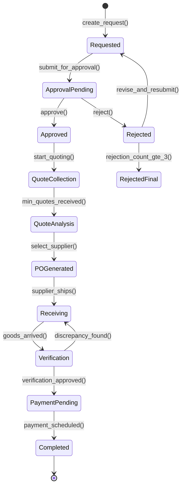
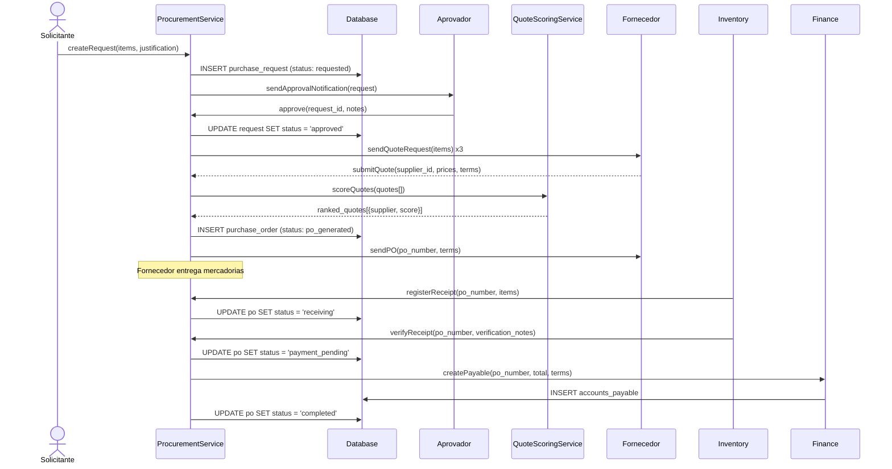
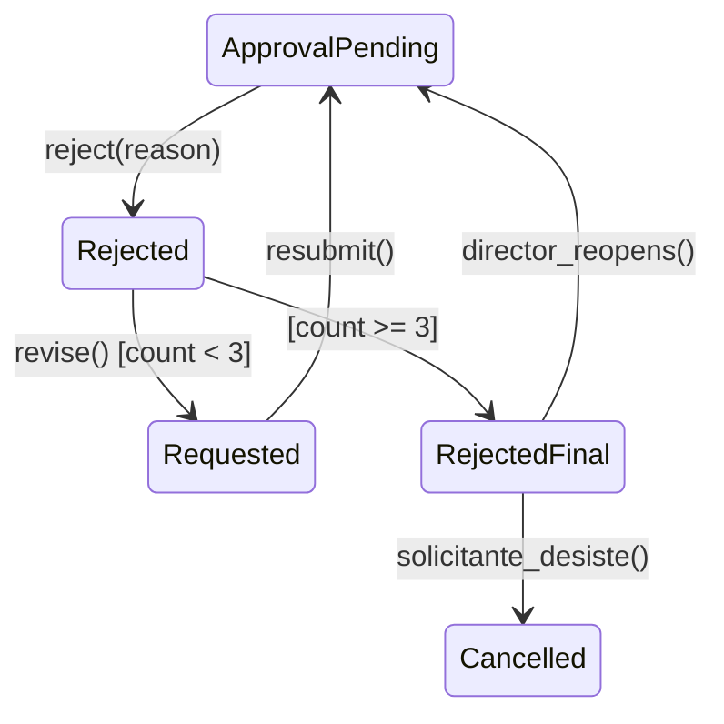

# Fluxo: Requisicao de Compra

> Ciclo completo de aquisicao: desde a requisicao interna ate o recebimento e pagamento, com regras de alcada, cotacao obrigatoria e conferencia de recebimento.

---

## 1. Narrativa do Processo

1. **Requisicao**: Funcionario cria solicitacao de compra com itens, quantidades e justificativa.
2. **Aprovacao Requisicao**: Gestor aprova ou rejeita. Valor > R$1.000 exige minimo 3 cotacoes. Valor > R$5.000 exige aprovacao de diretor.
3. **Cotacao**: Comprador envia solicitacao de cotacao a fornecedores. Minimo de fornecedores conforme faixa de valor.
4. **Analise de Cotacoes**: Scoring automatico (preco 40%, qualidade 30%, prazo 20%, historico 10%). Comprador seleciona vencedor.
5. **Ordem de Compra (PO)**: Gerado Purchase Order com termos, condicoes de pagamento e prazo de entrega.
6. **Recebimento**: Almoxarifado recebe mercadoria. Conferencia quantitativa e qualitativa obrigatoria.
7. **Conferencia**: Validacao contra PO. Divergencias geram nota de discrepancia.
8. **Pagamento**: Apos conferencia aprovada, gera contas a pagar no Finance com base nos termos da PO.

---

## 2. State Machine — Ciclo de Compra



---

## 3. Guards de Transicao `[AI_RULE]`

| Transicao | Guard | Motivo |
|-----------|-------|--------|
| `Requested → ApprovalPending` | `items.count > 0 AND justification.length >= 30` | Itens e justificativa obrigatorios |
| `ApprovalPending → Approved` | Se `total <= 1000`: gestor aprova. Se `total > 1000 AND total <= 5000`: gestor + 3 cotacoes. Se `total > 5000`: diretor | Alcadas por valor |
| `ApprovalPending → Rejected` | `rejection_reason IS NOT NULL AND rejection_reason.length >= 20` | Motivo obrigatorio (min 20 caracteres) |
| `Rejected → Requested` | `rejection_count < 3 AND revised_items.count > 0` | Pode revisar e resubmeter (max 3 rejeicoes) |
| `Rejected → RejectedFinal` | `rejection_count >= 3` | Apos 3 rejeicoes, requer aprovacao de nivel superior |
| `Approved → QuoteCollection` | `procurement_officer_id IS NOT NULL` | Comprador atribuido |
| `QuoteCollection → QuoteAnalysis` | Se `total <= 1000`: min 1 cotacao. Se `total > 1000`: min 3 cotacoes. Se `total > 10000`: min 5 cotacoes | Cotacoes minimas por faixa |
| `QuoteAnalysis → POGenerated` | `selected_supplier IS NOT NULL AND scoring_completed = true` | Fornecedor selecionado com scoring |
| `POGenerated → Receiving` | `po_number IS NOT NULL AND supplier_confirmed = true` | PO emitido e confirmado pelo fornecedor |
| `Receiving → Verification` | `received_items.count > 0 AND received_by IS NOT NULL` | Itens recebidos com responsavel |
| `Verification → PaymentPending` | `all_items_match_po = true AND quality_check_passed = true` | Conferencia quantitativa e qualitativa aprovadas |
| `Verification → Receiving` | `discrepancy_items.count > 0` | Itens com divergencia devem ser reprocessados |
| `PaymentPending → Completed` | `payment_entry_id IS NOT NULL` | Lancamento financeiro gerado |

> **[AI_RULE_CRITICAL]** Compras acima de R$5.000 EXIGEM aprovacao de diretor (`approver.role = 'director'`). A IA NUNCA deve implementar bypass de alcada. Se o aprovador nao for diretor e o valor exceder o limite, a transicao DEVE ser bloqueada.

> **[AI_RULE]** O scoring de cotacoes e calculado automaticamente pelo `QuoteScoringService` com pesos configuráveis por tenant: `preco` (default 40%), `qualidade` (30%), `prazo` (20%), `historico_fornecedor` (10%).

> **[AI_RULE]** Fornecedores com score de historico < 3.0 (de 5.0) nao podem ser selecionados para compras acima de R$5.000.

---

## 4. Regras de Alcada

| Faixa de Valor | Aprovador | Cotacoes Minimas | Prazo Aprovacao |
|---------------|-----------|-----------------|-----------------|
| <= R$1.000 | Gestor imediato | 1 | 24h |
| R$1.001 — R$5.000 | Gestor imediato | 3 | 48h |
| R$5.001 — R$20.000 | Diretor | 3 | 72h |
| > R$20.000 | Diretor + CFO | 5 | 5 dias uteis |

> **[AI_RULE]** Aprovacao que exceder o prazo sem resposta gera escalonamento automatico para o proximo nivel hierarquico.

---

## 5. Eventos Emitidos

| Evento | Trigger | Payload | Consumidor |
|--------|---------|---------|------------|
| `PurchaseRequested` | `[*] → Requested` | `{request_id, requester_id, items[], total_estimated}` | Core (Notification para gestor) |
| `PurchaseApproved` | `ApprovalPending → Approved` | `{request_id, approved_by, approval_level}` | Core (log auditoria), Procurement (iniciar cotacao) |
| `PurchaseRejected` | `ApprovalPending → Rejected` | `{request_id, rejected_by, reason}` | Email (notificar solicitante) |
| `QuotesCollected` | `QuoteCollection → QuoteAnalysis` | `{request_id, quotes[], supplier_count}` | Core (log) |
| `SupplierSelected` | `QuoteAnalysis → POGenerated` | `{request_id, supplier_id, po_number, total}` | Finance (provisionar), Email (notificar fornecedor) |
| `GoodsReceived` | `Receiving → Verification` | `{po_number, received_items[], received_by}` | Inventory (dar entrada), Core (log) |
| `VerificationApproved` | `Verification → PaymentPending` | `{po_number, verified_items[]}` | Finance (gerar contas a pagar) |
| `DiscrepancyFound` | `Verification → Receiving` | `{po_number, discrepant_items[], notes}` | Email (notificar fornecedor), Core (alerta comprador) |
| `PurchaseCompleted` | `PaymentPending → Completed` | `{po_number, total_paid, payment_entry_id}` | Finance (atualizar saldo), Core (metricas) |

---

## 6. Modulos Envolvidos

| Modulo | Responsabilidade no Fluxo | Link |
|--------|--------------------------|------|
| **Procurement** | Modulo principal. Requisicoes, cotacoes, PO, scoring | [Procurement.md](file:///c:/PROJETOS/sistema/docs/modules/Procurement.md) |
| **Finance** | Provisao de despesa, contas a pagar, pagamento | [Finance.md](file:///c:/PROJETOS/sistema/docs/modules/Finance.md) |
| **Inventory** | Entrada de mercadorias no estoque apos conferencia | [Inventory.md](file:///c:/PROJETOS/sistema/docs/modules/Inventory.md) |
| **Core** | Notifications, audit log, alcadas de aprovacao | [Core.md](file:///c:/PROJETOS/sistema/docs/modules/Core.md) |
| **Email** | Notificacoes para fornecedores e solicitantes | [Email.md](file:///c:/PROJETOS/sistema/docs/modules/Email.md) |

---

## 7. Diagrama de Sequencia — Compra com 3 Cotacoes



---

## 8. Cenarios de Excecao

| Cenario | Comportamento Esperado |
|---------|----------------------|
| Nenhum fornecedor responde cotacao | Apos prazo configurado (default 5 dias), alerta para comprador. Pode ampliar busca |
| Todos fornecedores com preco acima do orcamento | Requisicao retorna para `Approved` com nota de "orcamento insuficiente". Gestor decide |
| Divergencia no recebimento (quantidade) | Nota de discrepancia. Fornecedor deve enviar diferenca ou emitir credito |
| Divergencia no recebimento (qualidade) | Rejeicao parcial. Devolucao dos itens reprovados. Ver fluxo DEVOLUCAO-EQUIPAMENTO |
| Aprovacao expirada (prazo excedido) | Escalonamento para proximo nivel. Se diretor nao aprova em 72h, CFO e notificado |
| Fornecedor cancela PO | PO cancelado. Retorna para `QuoteAnalysis` para selecionar proximo fornecedor do ranking |
| Compra emergencial (sem cotacao) | Flag `is_emergency = true`. Bypass de cotacao, mas exige aprovacao de diretor E justificativa detalhada |
| Requisicao rejeitada | Solicitante pode revisar e resubmeter (max 3 vezes). Ver secao 8.1 |
| 3a rejeicao consecutiva | Requisicao bloqueada. Requer aprovacao de diretor para reabrir. Ver secao 8.1 |

### 8.1 Workflow de Rejeicao e Revisao

**Regras de Rejeicao**

1. `rejection_reason` e **obrigatorio** (minimo 20 caracteres) ao rejeitar uma requisicao
2. Status muda para `rejected`, mas o solicitante pode **revisar e resubmeter**
3. Ao resubmeter, status volta para `requested` (draft) e segue fluxo normal
4. Cada rejeicao incrementa `rejection_count` no `PurchaseRequest`
5. Apos **3 rejeicoes**, a requisicao entra em `rejected_final` e so pode ser reaberta com aprovacao de **diretor**

**Campos Adicionais no `PurchaseRequest`**

| Campo | Tipo | Descricao |
|-------|------|-----------|
| `rejection_count` | integer default 0 | Contador de rejeicoes |
| `rejection_reason` | text nullable | Motivo da ultima rejeicao |
| `rejected_by` | bigint unsigned nullable | FK → users |
| `rejected_at` | datetime nullable | Data da ultima rejeicao |
| `revision_notes` | text nullable | Notas do solicitante ao revisar |
| `requires_director_approval` | boolean default false | Flag para 3+ rejeicoes |

**Tabela de Historico: `purchase_request_rejections`**

| Campo | Tipo | Descricao |
|-------|------|-----------|
| `id` | bigint unsigned | PK |
| `purchase_request_id` | bigint unsigned | FK |
| `rejected_by` | bigint unsigned | FK → users |
| `rejection_reason` | text | Motivo detalhado |
| `rejected_at` | datetime | — |
| `revision_submitted_at` | datetime nullable | Quando o solicitante revisou |
| `revised_items` | json nullable | Snapshot dos itens revisados |

**Fluxo de Rejeicao**



**Logica de Negocio**

```php
// PurchaseRequestService::reject()
public function reject(PurchaseRequest $request, string $reason, int $rejectedBy): void
{
    DB::transaction(function () use ($request, $reason, $rejectedBy) {
        $request->increment('rejection_count');
        $request->update([
            'status' => $request->rejection_count >= 3 ? 'rejected_final' : 'rejected',
            'rejection_reason' => $reason,
            'rejected_by' => $rejectedBy,
            'rejected_at' => now(),
            'requires_director_approval' => $request->rejection_count >= 3,
        ]);

        PurchaseRequestRejection::create([
            'purchase_request_id' => $request->id,
            'rejected_by' => $rejectedBy,
            'rejection_reason' => $reason,
            'rejected_at' => now(),
        ]);

        // Notifica solicitante
        event(new PurchaseRejected($request));

        // Se 3a rejeicao, notifica diretor
        if ($request->rejection_count >= 3) {
            Notification::notify(
                $request->tenant_id,
                User::role('director')->pluck('id'),
                'purchase_request_max_rejections',
                "Requisicao #{$request->id} rejeitada {$request->rejection_count}x. Requer sua aprovacao para reabrir."
            );
        }
    });
}

// PurchaseRequestService::reviseAndResubmit()
public function reviseAndResubmit(PurchaseRequest $request, array $revisedItems, string $notes): void
{
    if ($request->rejection_count >= 3) {
        throw ValidationException::withMessages([
            'status' => 'Requisicao com 3+ rejeicoes requer aprovacao de diretor para reabrir'
        ]);
    }

    $request->update([
        'status' => 'requested',
        'items' => $revisedItems,
        'revision_notes' => $notes,
        'rejection_reason' => null,
    ]);

    // Registra revisao no historico
    PurchaseRequestRejection::where('purchase_request_id', $request->id)
        ->latest()
        ->first()
        ?->update([
            'revision_submitted_at' => now(),
            'revised_items' => $revisedItems,
        ]);

    event(new PurchaseRequestRevised($request));
}
```

**Cenarios BDD Adicionais**

```gherkin
  Cenario: Requisicao rejeitada com revisao e resubmissao
    Dado uma requisicao de compra #RC-001 com total R$ 3.000
    Quando o gestor rejeita com motivo "Fornecedor mais barato disponivel"
    Entao a requisicao muda para status "rejected"
    E o solicitante recebe notificacao por email
    Quando o solicitante revisa os itens e resubmete
    Entao a requisicao volta para status "requested"
    E o historico de rejeicao e mantido

  Cenario: 3a rejeicao bloqueia requisicao
    Dado uma requisicao #RC-002 com rejection_count = 2
    Quando o gestor rejeita pela 3a vez
    Entao a requisicao muda para status "rejected_final"
    E requires_director_approval = true
    E o diretor recebe notificacao
    E o solicitante NAO pode revisar e resubmeter diretamente

  Cenario: Diretor reabre requisicao apos 3 rejeicoes
    Dado uma requisicao #RC-002 com status "rejected_final"
    Quando o diretor aprova a reabertura
    Entao a requisicao volta para "approval_pending"
    E o aprovador passa a ser o proprio diretor (nivel superior)
```

---

## 9. Endpoints Envolvidos

> Endpoints reais mapeados no codigo-fonte (`backend/routes/api/`). Todos sob prefixo `/api/v1/`.

### 9.1 Cotacoes de Compra (Purchase Quotes)

Registrados em `stock.php`:

| Metodo | Rota | Controller | Descricao |
|--------|------|------------|-----------|
| `GET` | `/api/v1/purchase-quotes` | `StockIntegrationController@purchaseQuoteIndex` | Listar cotacoes de compra |
| `GET` | `/api/v1/purchase-quotes/{purchaseQuote}` | `StockIntegrationController@purchaseQuoteShow` | Detalhes da cotacao |
| `POST` | `/api/v1/purchase-quotes` | `StockIntegrationController@purchaseQuoteStore` | Criar cotacao |
| `PUT` | `/api/v1/purchase-quotes/{purchaseQuote}` | `StockIntegrationController@purchaseQuoteUpdate` | Atualizar cotacao |
| `DELETE` | `/api/v1/purchase-quotes/{purchaseQuote}` | `StockIntegrationController@purchaseQuoteDestroy` | Excluir cotacao |

Registrado em `advanced-lots.php`:

| Metodo | Rota | Controller | Descricao |
|--------|------|------------|-----------|
| `POST` | `/api/v1/quotes/compare` | `StockAdvancedController@comparePurchaseQuotes` | Comparar cotacoes de fornecedores |

### 9.2 Contas a Pagar (Pagamento apos Recebimento)

Registrados em `financial.php`:

| Metodo | Rota | Controller | Descricao |
|--------|------|------------|-----------|
| `GET` | `/api/v1/accounts-payable` | `AccountPayableController@index` | Listar contas a pagar |
| `POST` | `/api/v1/accounts-payable` | `AccountPayableController@store` | Criar conta a pagar |
| `GET` | `/api/v1/accounts-payable/{account_payable}` | `AccountPayableController@show` | Detalhes |
| `POST` | `/api/v1/accounts-payable/{account_payable}/pay` | `AccountPayableController@pay` | Registrar pagamento |
| `PUT` | `/api/v1/accounts-payable/{account_payable}` | `AccountPayableController@update` | Atualizar |
| `GET` | `/api/v1/accounts-payable-summary` | `AccountPayableController@summary` | Resumo |
| `GET` | `/api/v1/accounts-payable-export` | `AccountPayableController@export` | Exportar |

### 9.3 Fornecedores

Registrados em `financial.php`:

| Metodo | Rota | Controller | Descricao |
|--------|------|------------|-----------|
| `GET` | `/api/v1/financial/lookups/suppliers` | `FinancialLookupController@suppliers` | Listar fornecedores para selecao |

### 9.4 Contratos de Fornecedor

Registrados em `advanced-features.php`:

| Metodo | Rota | Controller | Descricao |
|--------|------|------------|-----------|
| `GET` | `/api/v1/supplier-contracts` | `FinancialAdvancedController@supplierContracts` | Listar contratos de fornecedor |
| `POST` | `/api/v1/supplier-contracts` | `FinancialAdvancedController@storeSupplierContract` | Criar contrato |
| `PUT` | `/api/v1/supplier-contracts/{contract}` | `FinancialAdvancedController@updateSupplierContract` | Atualizar contrato |
| `DELETE` | `/api/v1/supplier-contracts/{contract}` | `FinancialAdvancedController@destroySupplierContract` | Excluir contrato |

### 9.5 Endpoints Planejados [SPEC]

| Metodo | Rota | Descricao | Form Request |
|--------|------|-----------|--------------|
| `POST` | `/api/v1/purchase-requests` | Criar requisicao de compra | `CreatePurchaseRequest` |
| `GET` | `/api/v1/purchase-requests` | Listar requisicoes | — |
| `GET` | `/api/v1/purchase-requests/{id}` | Detalhes da requisicao | — |
| `POST` | `/api/v1/purchase-requests/{id}/approve` | Aprovar requisicao | `ApprovePurchaseRequest` |
| `POST` | `/api/v1/purchase-requests/{id}/reject` | Rejeitar requisicao | — |
| `POST` | `/api/v1/purchase-requests/{id}/revise` | Revisar e resubmeter | — |
| `POST` | `/api/v1/purchase-orders` | Gerar ordem de compra | `CreatePurchaseOrderRequest` |
| `POST` | `/api/v1/purchase-orders/{id}/receive` | Registrar recebimento | `ReceiveGoodsRequest` |
| `POST` | `/api/v1/purchase-orders/{id}/verify` | Verificar recebimento | `VerifyReceiptRequest` |

---

## 9.6 Especificacoes Tecnicas

### Service
**PurchaseRequestService** (`App\Services\Procurement\PurchaseRequestService`)
- `create(CreatePurchaseRequestData $dto): PurchaseRequest`
- `submit(PurchaseRequest $pr): void` — envia para aprovação
- `approve(PurchaseRequest $pr, User $approver): void`
- `reject(PurchaseRequest $pr, User $rejector, string $reason): void`
- `convertToPurchaseOrder(PurchaseRequest $pr): PurchaseOrder`

### Endpoints
| Método | Rota | Controller | Ação |
|--------|------|-----------|------|
| POST | /api/v1/procurement/requests | PurchaseRequestController@store | Criar requisição |
| GET | /api/v1/procurement/requests | PurchaseRequestController@index | Listar |
| GET | /api/v1/procurement/requests/{id} | PurchaseRequestController@show | Detalhe |
| POST | /api/v1/procurement/requests/{id}/submit | PurchaseRequestController@submit | Submeter aprovação |
| POST | /api/v1/procurement/requests/{id}/approve | PurchaseRequestController@approve | Aprovar |
| POST | /api/v1/procurement/requests/{id}/reject | PurchaseRequestController@reject | Rejeitar |
| POST | /api/v1/procurement/requests/{id}/convert | PurchaseRequestController@convert | Converter em PO |
| GET | /api/v1/procurement/requests/pending-approval | PurchaseRequestController@pendingApproval | Pendentes |

### Cadeia de Aprovação (configurável por tenant)
- **Tabela:** `proc_approval_thresholds`
- **Campos:** id, tenant_id, min_value, max_value, required_role (enum: manager, director, ceo), requires_budget_check (boolean)
- **Defaults:**
  | Faixa de Valor | Aprovador |
  |---------------|-----------|
  | Até R$ 5.000 | manager |
  | R$ 5.001 - R$ 50.000 | director |
  | Acima de R$ 50.000 | ceo |
- **Budget insuficiente + urgência:** Flag `is_urgent` permite aprovação com budget excedido, mas requer role `director` ou superior e gera alerta `BudgetExceededAlert`

---

## 10. KPIs do Fluxo

| KPI | Formula | Meta |
|-----|---------|------|
| Lead time medio | `avg(completed_at - requested_at)` | <= 15 dias uteis |
| Saving rate | `(preco_maximo_cotacao - preco_selecionado) / preco_maximo * 100` | >= 10% |
| Compliance de cotacoes | `(compras_com_min_cotacoes / total_compras) * 100` | >= 95% |
| Taxa de rejeicao | `(rejected / total_requests) * 100` | Monitorar tendencia |
| Discrepancia no recebimento | `(pos_com_discrepancia / total_pos) * 100` | <= 5% |
