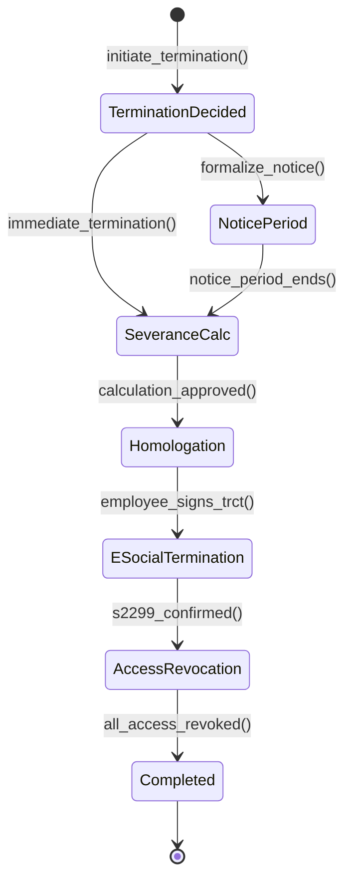

# Fluxo: Rescisao Contratual

> Ciclo de desligamento: desde a decisao ate a homologacao, calculo rescisorio e baixa de acessos, com compliance eSocial (S-2299/S-2399).

---

## 1. Narrativa do Processo

1. **Decisao**: Gestor ou funcionario inicia processo de desligamento com tipo (sem justa causa, justa causa, pedido, acordo mutuo).
2. **Notificacao**: Aviso previo formalizado. Prazo varia por tipo e tempo de servico.
3. **Calculo Rescisorio**: Finance calcula verbas (saldo salario, ferias proporcionais, 13o, multa FGTS se aplicavel).
4. **Homologacao**: RH revisa e homologa calculo. Colaborador assina TRCT (Termo de Rescisao).
5. **eSocial Desligamento**: Envio do evento S-2299 (desligamento) ou S-2399 (TSV). Prazo: 10 dias apos desligamento.
6. **Baixa de Acessos**: Revogacao de acessos ao sistema, email, e equipamentos. Devolucao de ativos.

---

## 2. State Machine

---

## 3. Guards de Transicao `[AI_RULE]`

| Transicao | Guard | Motivo |
|-----------|-------|--------|
| `TerminationDecided → NoticePeriod` | `termination_type IN ('without_cause', 'resignation') AND notice_days > 0` | Aviso previo obrigatorio exceto justa causa |
| `TerminationDecided → SeveranceCalc` | `termination_type = 'just_cause' OR notice_waived = true` | Justa causa ou dispensa de aviso |
| `NoticePeriod → SeveranceCalc` | `notice_end_date <= NOW() OR notice_worked_days >= notice_days` | Aviso cumprido ou indenizado |
| `SeveranceCalc → Homologation` | `severance_total > 0 AND calculation_reviewed_by IS NOT NULL` | Calculo revisado por pessoa diferente do calculista |
| `Homologation → ESocialTermination` | `trct_signed = true AND employee_acknowledged = true` | TRCT assinado pelo colaborador |
| `ESocialTermination → AccessRevocation` | `esocial_event IN ('S-2299','S-2399') AND receipt IS NOT NULL` | Evento aceito pelo governo |
| `AccessRevocation → Completed` | `system_access_revoked AND email_disabled AND equipment_returned` | Todos acessos revogados e ativos devolvidos |

> **[AI_RULE_CRITICAL]** O evento eSocial S-2299 DEVE ser enviado em ate 10 dias apos o desligamento efetivo. Atraso gera multa. A IA DEVE implementar job agendado para garantir envio antes do prazo.

> **[AI_RULE]** Justa causa (`termination_type = 'just_cause'`) REMOVE: multa FGTS (40%), aviso previo indenizado, ferias proporcionais +1/3 e 13o proporcional. A IA deve validar que o calculo rescisorio para justa causa NAO inclui essas verbas.

> **[AI_RULE]** Acesso ao sistema DEVE ser revogado no mesmo dia do desligamento efetivo. `User::where('employee_id', $id)->update(['is_active' => false])` deve ser executado automaticamente.

---

## 4. Eventos Emitidos

| Evento | Trigger | Payload | Consumidor |
|--------|---------|---------|------------|
| `TerminationInitiated` | `[*] → TerminationDecided` | `{employee_id, type, initiated_by, reason}` | Core (log auditoria), HR (bloquear ferias) |
| `NoticePeriodStarted` | `TerminationDecided → NoticePeriod` | `{employee_id, notice_start, notice_end, days}` | HR (atualizar status), Core (agendar) |
| `SeveranceCalculated` | `SeveranceCalc → Homologation` | `{employee_id, gross, deductions, net, breakdown{}}` | Finance (provisionar pagamento) |
| `TRCTSigned` | `Homologation → ESocialTermination` | `{employee_id, trct_id, signed_at}` | Core (log), Finance (liberar pagamento) |
| `ESocialS2299Sent` | `ESocialTermination → AccessRevocation` | `{employee_id, event_type, receipt}` | ESocial (registro), Core (log) |
| `EmployeeTerminated` | `AccessRevocation → Completed` | `{employee_id, termination_date, type}` | HR (atualizar headcount), Core (revogar acessos), Fleet (desvincular veiculo) |

---

## 5. Modulos Envolvidos

| Modulo | Responsabilidade | Link |
|--------|-----------------|------|
| **HR** | Modulo principal. Gestao do desligamento e homologacao | [HR.md](file:///c:/PROJETOS/sistema/docs/modules/HR.md) |
| **ESocial** | Envio S-2299/S-2399 dentro do prazo legal | [ESocial.md](file:///c:/PROJETOS/sistema/docs/modules/ESocial.md) |
| **Finance** | Calculo rescisorio, pagamento, multa FGTS | [Finance.md](file:///c:/PROJETOS/sistema/docs/modules/Finance.md) |
| **Core** | Revogacao de acessos, audit log | [Core.md](file:///c:/PROJETOS/sistema/docs/modules/Core.md) |

---

## 6. Cenarios de Excecao

| Cenario | Comportamento |
|---------|--------------|
| Funcionario em estabilidade (gestante, acidentado) | Bloqueio de rescisao sem justa causa. Guard impede transicao |
| eSocial rejeitado | Corrigir e reenviar. Prazo de 10 dias continua contando |
| Funcionario recusa assinar TRCT | RH registra recusa com testemunhas. Processo continua |
| Equipamento nao devolvido | AccessRevocation parcial. Cobranca do valor na rescisao |
| Rescisao retroativa (data passada) | Calculo recalculado com juros e correcao. eSocial aceita com justificativa |

---

## 7. Mapeamento Técnico

### Controllers

| Controller | Métodos Relevantes | Arquivo |
|---|---|---|
| `RescissionController` | `index`, `store`, `show`, `approve`, `markAsPaid`, `generateTRCT` | `app/Http/Controllers/Api/V1/RescissionController.php` |
| `ESocialController` | `generate`, `sendBatch`, `checkBatch`, `show`, `excludeEvent`, `dashboard` | `app/Http/Controllers/Api/V1/ESocialController.php` |
| `PayrollController` | `index`, `store`, `calculate`, `approve`, `markAsPaid`, `generatePayslips` | `app/Http/Controllers/Api/V1/PayrollController.php` |
| `HRController` | `dashboard`, `analyticsHr` | `app/Http/Controllers/Api/V1/HRController.php` |
| `HrAdvancedController` | `indexLeaves`, `vacationBalances`, `indexDocuments` | `app/Http/Controllers/Api/V1/HrAdvancedController.php` |

### Services

| Service | Responsabilidade | Arquivo |
|---|---|---|
| `RescissionService` | `calculate` (cálculo rescisório por tipo), `approve`, `markAsPaid`, `cancel`, `generateTRCTHtml` | `app/Services/RescissionService.php` |
| `LaborCalculationService` | Cálculos trabalhistas: saldo salário, férias proporcionais, 13º, multa FGTS, aviso prévio | `app/Services/LaborCalculationService.php` |
| `ESocialService` | Geração e envio de eventos S-2299 (desligamento) e S-2399 (TSV) | `app/Services/ESocialService.php` |
| `PayrollService` | Processamento de folha, inclusão de verbas rescisórias | `app/Services/PayrollService.php` |
| `VacationCalculationService` | Cálculo de férias vencidas e proporcionais para rescisão | `app/Services/VacationCalculationService.php` |

### Models Envolvidos

| Model | Tabela | Arquivo |
|---|---|---|
| `Rescission` | `rescissions` | `app/Models/Rescission.php` |
| `User` | `users` | `app/Models/User.php` |
| `Payroll` | `payrolls` | `app/Models/Payroll.php` |
| `PayrollLine` | `payroll_lines` | `app/Models/PayrollLine.php` |
| `VacationBalance` | `vacation_balances` | `app/Models/VacationBalance.php` |
| `EmployeeBenefit` | `employee_benefits` | `app/Models/EmployeeBenefit.php` |
| `EmployeeDependent` | `employee_dependents` | `app/Models/EmployeeDependent.php` |
| `TimeClockEntry` | `time_clock_entries` | `app/Models/TimeClockEntry.php` |

### Endpoints API

| Método | Endpoint | Descrição |
|---|---|---|
| `GET` | `/api/v1/hr/rescissions` | Listar rescisões |
| `POST` | `/api/v1/hr/rescissions` | Criar rescisão (tipo, data, motivo) |
| `GET` | `/api/v1/hr/rescissions/{id}` | Detalhe da rescisão com breakdown |
| `POST` | `/api/v1/hr/rescissions/{id}/approve` | Aprovar cálculo rescisório |
| `POST` | `/api/v1/hr/rescissions/{id}/mark-paid` | Marcar pagamento efetuado |
| `GET` | `/api/v1/hr/rescissions/{id}/trct` | Gerar TRCT (Termo de Rescisão) |
| `POST` | `/api/v1/hr/esocial/events/generate` | Gerar evento S-2299 ou S-2399 |
| `POST` | `/api/v1/hr/esocial/events/send-batch` | Enviar lote de eventos eSocial |
| `GET` | `/api/v1/hr/esocial/batches/{batchId}` | Verificar status do envio |
| `GET` | `/api/v1/hr/esocial/dashboard` | Dashboard eSocial |
| `POST` | `/api/v1/hr/esocial/events/{id}/exclude` | Excluir evento (S-3000) |
| `GET` | `/api/v1/hr/advanced/vacation-balances` | Saldos de férias para cálculo |
| `GET` | `/api/v1/hr/payrolls` | Listar folhas de pagamento |
| `POST` | `/api/v1/hr/payrolls/{id}/calculate` | Calcular folha com verbas rescisórias |

### Events/Listeners

| Evento | Arquivo |
|---|---|
| `HrActionAudited` | `app/Events/HrActionAudited.php` |
| `ClockEntryRegistered` | `app/Events/ClockEntryRegistered.php` |
| [SPEC] `TerminationInitiated` | A ser criado — `app/Events/TerminationInitiated.php` |
| [SPEC] `NoticePeriodStarted` | A ser criado — `app/Events/NoticePeriodStarted.php` |
| [SPEC] `SeveranceCalculated` | A ser criado — `app/Events/SeveranceCalculated.php` |
| [SPEC] `TRCTSigned` | A ser criado — `app/Events/TRCTSigned.php` |
| [SPEC] `ESocialS2299Sent` | A ser criado — `app/Events/ESocialS2299Sent.php` |
| [SPEC] `EmployeeTerminated` | A ser criado — `app/Events/EmployeeTerminated.php` |

### Eventos do State Machine
- `TerminationInitiated` → HR (criar checklist de desligamento), Alerts (notificar gestor)
- `NoticePeriodStarted` → (registrar data início aviso prévio)
- `SeveranceCalculated` → Finance (provisionar valores), Alerts (notificar financeiro)
- `TRCTSigned` → (registrar assinatura digital ou física)
- `ESocialS2299Sent` → (confirmar transmissão ao governo)
- `EmployeeTerminated` → Core (desativar user: `is_active = false`), HR (encerrar benefícios), Finance (gerar pagamento rescisório)

### Job de Deadline eSocial S-2299
- **Job:** `EnforceESocialS2299Deadline` — roda diariamente
- **Regra:** Rescisões com `termination_date` há mais de 8 dias sem S-2299 enviado
- **Ação:** `ESocialDeadlineApproaching` event → Alerts (notificar HR + fiscal com urgência CRITICAL)
- **Após 10 dias:** Escalação automática para `director` role

### Rescisão Retroativa
- **Service:** `SeveranceCalculationService::calculateWithCorrection(Termination $t): SeveranceResult`
- **Correção monetária:** Índice INPC do mês da rescisão até mês atual
- **Juros:** 1% ao mês pro-rata
- **Fórmula:** `valor_corrigido = valor_original * (1 + inpc_acumulado) * (1 + 0.01 * meses)`

> **Nota:** O fluxo de rescisão contratual tem boa cobertura: RescissionService calcula verbas por tipo (sem justa causa, justa causa, pedido, acordo mútuo), gera TRCT em HTML, e integra com LaborCalculationService. ESocialService envia S-2299/S-2399. Faltam os eventos de state machine para automação de revogação de acessos e notificações ao longo do pipeline.
