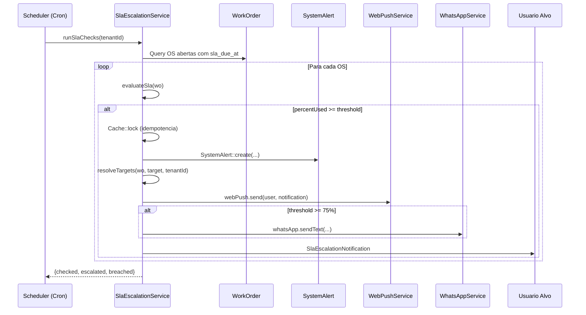
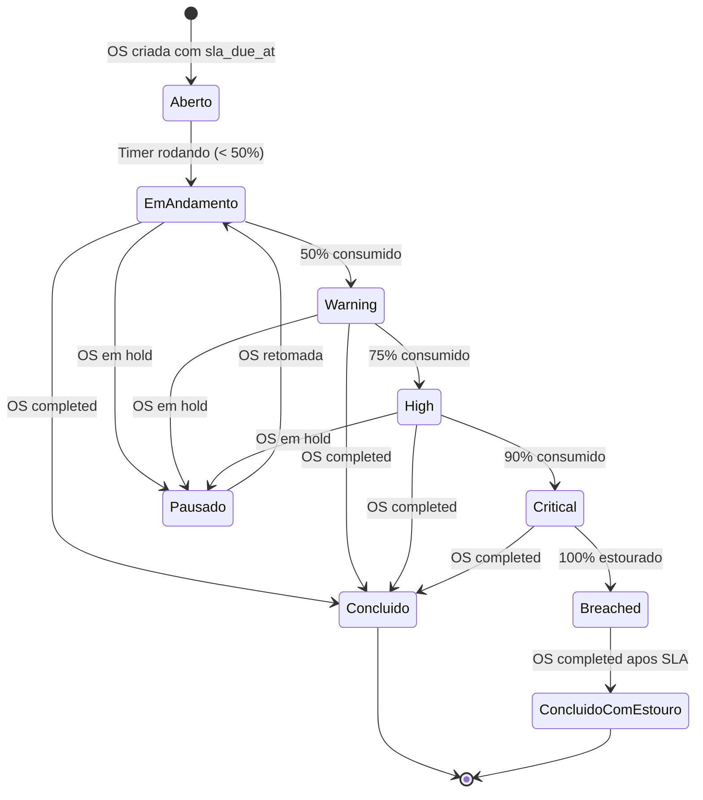

# Fluxo Cross-Domain: SLA e Escalonamento

> **Kalibrium ERP** -- Rastreamento de SLA e escalonamento automático multi-nível
> Versao: 1.0 | Data: 2026-03-24

---

## 1. Visao Geral

O fluxo de SLA garante que toda OS/Chamado com prazo contratual seja monitorado em tempo real,
com escalonamento progressivo quando o prazo se aproxima ou e estourado.

**Modulos envolvidos:** Contratos, Ordem de Servico, Chamados (ServiceCall), Notificacoes, Faturamento, Dashboard.

[AI_RULE] Todo SLA deve ser calculado descontando pausas (status `service_paused`, `waiting_parts`, `waiting_approval`). O timer NAO corre quando a OS esta em hold. [/AI_RULE]

---

## 2. Configuracao de SLA por Contrato

### 2.1 Tabela `sla_configs`

| Campo | Tipo | Descricao |
|-------|------|-----------|
| `tenant_id` | bigint | Tenant owner |
| `contract_id` | bigint | Contrato associado (nullable = SLA padrao do tenant) |
| `priority` | enum(`low`,`medium`,`high`,`critical`) | Prioridade da OS |
| `response_time_minutes` | int | Tempo maximo para primeiro atendimento |
| `resolution_time_minutes` | int | Tempo maximo para resolucao |
| `business_hours_only` | boolean | Conta apenas horario comercial |
| `penalty_type` | enum(`none`,`discount`,`credit`) | Tipo de penalidade |
| `penalty_percent` | decimal(5,2) | % de desconto na fatura por estouro |

[AI_RULE] SLA padrao (contract_id = NULL) e usado como fallback quando a OS nao tem contrato vinculado. [/AI_RULE]

### 2.2 Exemplo de SLA por Prioridade

| Prioridade | Resposta | Resolucao | Penalidade |
|------------|----------|-----------|------------|
| critical | 30 min | 4h | 15% desconto |
| high | 1h | 8h | 10% desconto |
| medium | 4h | 24h | 5% desconto |
| low | 8h | 48h | Nenhuma |

---

## 3. Timer Automatico

### 3.1 Regras do Timer

```
INICIO: Quando OS muda para status `open` ou `in_progress`
PAUSA:  Quando OS muda para `service_paused`, `waiting_parts`, `waiting_approval`
RESUME: Quando OS retorna para `in_service`, `in_progress`, `at_client`
STOP:   Quando OS atinge `completed`, `delivered`, `invoiced`, `cancelled`
```

### 3.2 Implementacao Existente

O campo `sla_due_at` na tabela `work_orders` armazena o deadline absoluto.
O servico `SlaEscalationService` (backend/app/Services/SlaEscalationService.php) calcula o percentual consumido:

```php
$totalMinutes = $created->diffInMinutes($deadline);
$elapsedMinutes = $created->diffInMinutes($now);
$percentUsed = ($elapsedMinutes / $totalMinutes) * 100;
```

[AI_RULE] O calculo atual NAO desconta pausas -- usa tempo corrido desde created_at. Implementar conforme especificacao abaixo. [/AI_RULE]

### 3.3 Tabela `sla_pause_logs` (Especificacao Completa)

**Migration**

```php
// create_sla_pause_logs_table.php
Schema::create('sla_pause_logs', function (Blueprint $table) {
    $table->id();
    $table->unsignedBigInteger('tenant_id');
    $table->string('entity_type', 50)->default('work_order')
        ->comment('work_order ou service_call');
    $table->unsignedBigInteger('entity_id')
        ->comment('FK para work_orders.id ou service_calls.id');
    $table->datetime('paused_at');
    $table->datetime('resumed_at')->nullable()
        ->comment('NULL = pausa ainda ativa');
    $table->string('pause_reason', 100)
        ->comment('Status que causou a pausa: service_paused, waiting_parts, waiting_approval, awaiting_client');
    $table->unsignedBigInteger('paused_by')->nullable()
        ->comment('FK → users (quem mudou o status)');
    $table->unsignedBigInteger('resumed_by')->nullable();
    $table->integer('pause_duration_minutes')->nullable()
        ->comment('Calculado ao resumir: TIMESTAMPDIFF(MINUTE, paused_at, resumed_at)');
    $table->timestamps();

    $table->index(['entity_type', 'entity_id'], 'idx_sla_pause_entity');
    $table->index(['tenant_id', 'entity_type'], 'idx_sla_pause_tenant');
    $table->foreign('tenant_id')->references('id')->on('tenants');
});
```

**Formula de Calculo com Pausas**

```php
// SlaEscalationService::evaluateSla(WorkOrder $wo)
public function evaluateSla(WorkOrder $wo): array
{
    $totalMinutes = $wo->created_at->diffInMinutes($wo->sla_due_at);

    // Soma total de pausas (concluidas + ativa)
    $pausedMinutes = SlaPauseLog::where('entity_type', 'work_order')
        ->where('entity_id', $wo->id)
        ->sum(DB::raw('COALESCE(pause_duration_minutes, TIMESTAMPDIFF(MINUTE, paused_at, NOW()))'));

    // Tempo efetivo = tempo total corrido - tempo pausado
    $elapsedRaw = $wo->created_at->diffInMinutes(now());
    $elapsedEffective = max(0, $elapsedRaw - $pausedMinutes);

    $percentUsed = ($totalMinutes > 0)
        ? ($elapsedEffective / $totalMinutes) * 100
        : 100;

    return [
        'percent_used' => round($percentUsed, 1),
        'elapsed_effective_minutes' => $elapsedEffective,
        'paused_minutes' => $pausedMinutes,
        'remaining_minutes' => max(0, $totalMinutes - $elapsedEffective),
        'is_paused' => SlaPauseLog::where('entity_type', 'work_order')
            ->where('entity_id', $wo->id)
            ->whereNull('resumed_at')
            ->exists(),
    ];
}
```

**Listeners para Criar/Fechar Pausas**

```php
// WorkOrderStatusChanged listener
if (in_array($newStatus, ['service_paused', 'waiting_parts', 'waiting_approval'])) {
    SlaPauseLog::create([
        'tenant_id' => $wo->tenant_id,
        'entity_type' => 'work_order',
        'entity_id' => $wo->id,
        'paused_at' => now(),
        'pause_reason' => $newStatus,
        'paused_by' => auth()->id(),
    ]);
}

if (in_array($newStatus, ['in_service', 'in_progress', 'at_client']) && $previousWasPaused) {
    $activePause = SlaPauseLog::where('entity_type', 'work_order')
        ->where('entity_id', $wo->id)
        ->whereNull('resumed_at')
        ->first();
    if ($activePause) {
        $activePause->update([
            'resumed_at' => now(),
            'resumed_by' => auth()->id(),
            'pause_duration_minutes' => $activePause->paused_at->diffInMinutes(now()),
        ]);
    }
}
```

---

## 4. Niveis de Escalonamento

O `SlaEscalationService` define 4 niveis (constante `ESCALATION_LEVELS`):

| Threshold | Nivel | Target | Acao |
|-----------|-------|--------|------|
| 50% | `warning` | `assigned` (tecnico) | WebPush + notificacao in-app |
| 75% | `high` | `supervisor` (coordenador) | WebPush + WhatsApp |
| 90% | `critical` | `manager` (gerente) | WebPush + WhatsApp + email |
| 100% | `breached` | `director` (diretor) | WebPush + WhatsApp + email + alerta critico |

### 4.1 Resolucao de Targets (codigo real)

```php
'assigned'   => [$wo->assignee]
'supervisor' => User::whereHas('roles', fn($q) => $q->where('name', 'supervisor'))
'manager'    => User::whereHas('roles', fn($q) => $q->whereIn('name', ['manager', 'admin']))
'director'   => User::whereHas('roles', fn($q) => $q->whereIn('name', ['admin', 'super-admin']))
```

### 4.2 Idempotencia

O sistema usa `Cache::lock` + verificacao de `SystemAlert` existente para evitar alertas duplicados em workers concorrentes. Alertas sao considerados duplicados se criados nas ultimas 24h para a mesma OS e nivel.

---

## 5. Notificacoes Proativas

### 5.1 Canais

| Canal | Servico | Quando |
|-------|---------|--------|
| WebPush | `WebPushService` | Todos os niveis |
| WhatsApp | `WhatsAppService` | A partir de 75% |
| Email | `SlaEscalationNotification` | A partir de 90% |
| In-App | `SystemAlert` model | Todos os niveis |

### 5.2 Conteudo do Alerta

```
Titulo: "SLA {level}: OS #{business_number}"
Mensagem: "OS #{business_number} atingiu {percent_used}% do SLA. Restam {minutes_remaining} minutos."
```

---

## 6. Penalidades (Desconto por Estouro)

### 6.1 Implementacao: `SlaPolicy::calculatePenalty()`

```php
class SlaPolicy
{
    /**
     * Calcula penalidade por estouro de SLA.
     * Aplica 5% por hora de atraso, maximo 20%.
     */
    public static function calculatePenalty(WorkOrder $wo): ?SlaPenaltyResult
    {
        $slaConfig = SlaEscalationService::resolveSlaConfig($wo);
        if (!$slaConfig || $slaConfig->penalty_type === 'none') {
            return null;
        }

        $slaData = app(SlaEscalationService::class)->evaluateSla($wo);
        if ($slaData['percent_used'] < 100) {
            return null; // SLA nao estourado
        }

        // Horas de atraso alem do SLA
        $overtimeMinutes = max(0, $slaData['elapsed_effective_minutes'] - $wo->created_at->diffInMinutes($wo->sla_due_at));
        $overtimeHours = ceil($overtimeMinutes / 60);

        // Calculo progressivo: 5% por hora, max 20%
        $penaltyPercent = min(20.0, $overtimeHours * 5.0);

        // Pode usar o percent do contrato se definido e for maior
        if ($slaConfig->penalty_percent > 0) {
            $penaltyPercent = min($penaltyPercent, (float) $slaConfig->penalty_percent);
        }

        $penaltyBase = match ($slaConfig->penalty_type) {
            'discount' => $wo->total,
            'credit' => $wo->total,
            default => 0,
        };

        $penaltyAmount = bcmul((string) $penaltyBase, bcdiv((string) $penaltyPercent, '100', 4), 2);

        return new SlaPenaltyResult(
            penaltyType: $slaConfig->penalty_type,
            penaltyPercent: $penaltyPercent,
            penaltyAmount: $penaltyAmount,
            overtimeHours: $overtimeHours,
            overtimeMinutes: $overtimeMinutes,
            slaConfig: $slaConfig,
        );
    }
}
```

**Integracao com `WorkOrderInvoicingService`**

```php
// WorkOrderInvoicingService::generateFromWorkOrder()
// Antes de criar Invoice:
$slaPenalty = SlaPolicy::calculatePenalty($wo);
if ($slaPenalty) {
    $discountAmount = bcadd($discountAmount, $slaPenalty->penaltyAmount, 2);
    $discountDescription = "Desconto SLA ({$slaPenalty->penaltyPercent}% - {$slaPenalty->overtimeHours}h atraso)";

    // Registrar na Invoice como item separado
    $invoiceItems[] = [
        'description' => $discountDescription,
        'quantity' => 1,
        'unit_price' => -$slaPenalty->penaltyAmount,
        'total' => -$slaPenalty->penaltyAmount,
        'type' => 'sla_penalty',
    ];
}

// Apos criar Invoice e AccountReceivable:
if ($slaPenalty) {
    $accountReceivable->update([
        'metadata' => array_merge($accountReceivable->metadata ?? [], [
            'sla_penalty_applied' => true,
            'sla_penalty_percent' => $slaPenalty->penaltyPercent,
            'sla_penalty_amount' => $slaPenalty->penaltyAmount,
            'sla_overtime_hours' => $slaPenalty->overtimeHours,
        ]),
    ]);

    // Notifica financeiro
    Notification::notify(
        $wo->tenant_id,
        User::role('financial')->pluck('id'),
        'sla_penalty_applied',
        "Desconto SLA de {$slaPenalty->penaltyPercent}% aplicado na OS #{$wo->business_number}"
    );
}
```

**DTO: `SlaPenaltyResult`**

```php
class SlaPenaltyResult
{
    public function __construct(
        public readonly string $penaltyType,
        public readonly float $penaltyPercent,
        public readonly string $penaltyAmount,
        public readonly int $overtimeHours,
        public readonly int $overtimeMinutes,
        public readonly SlaConfig $slaConfig,
    ) {}
}
```

[AI_RULE] Penalidade so e aplicada se o contrato define `penalty_type != 'none'`. O desconto aparece como linha separada na fatura. Progressao: 5%/hora de atraso, maximo 20%. [/AI_RULE]

---

## 7. Dashboard de SLA

O `SlaEscalationService::getDashboard()` retorna:

```json
{
  "on_time": 45,
  "at_risk": 8,
  "breached": 3,
  "total": 56,
  "compliance_rate": 80.4
}
```

### 7.1 Campos Adicionais do Dashboard

**Endpoint de Tendencia Mensal**

| Item | Detalhe |
|------|---------|
| Rota | `GET /api/v1/sla/trend?months=12` |
| Permissao | `sla.reports.view` |
| Cache | `Cache::remember("sla_trend_{$tenantId}", 3600, ...)` — 1 hora |

**Response JSON Completo do `getDashboard()`**

```json
{
  "on_time": 45,
  "at_risk": 8,
  "breached": 3,
  "total": 56,
  "compliance_rate": 80.4,
  "avg_resolution_minutes": 342,
  "by_technician": [
    {
      "user_id": 45,
      "name": "Carlos Silva",
      "total_os": 12,
      "on_time": 10,
      "breached": 2,
      "compliance_rate": 83.3,
      "avg_resolution_minutes": 280
    }
  ],
  "by_service_type": [
    {
      "service_id": 1,
      "service_name": "Calibracao",
      "total_os": 20,
      "on_time": 18,
      "breached": 2,
      "compliance_rate": 90.0
    }
  ],
  "monthly_trend": [
    {
      "month": "2026-03",
      "total": 56,
      "on_time": 45,
      "breached": 3,
      "compliance_rate": 80.4,
      "avg_resolution_minutes": 342,
      "penalty_total": 1250.00
    },
    {
      "month": "2026-02",
      "total": 62,
      "on_time": 55,
      "breached": 1,
      "compliance_rate": 88.7,
      "avg_resolution_minutes": 310,
      "penalty_total": 500.00
    }
  ]
}
```

**Query para Tendencia Mensal**

```sql
SELECT
    DATE_FORMAT(wo.created_at, '%Y-%m') AS month,
    COUNT(*) AS total,
    SUM(CASE WHEN wo.completed_at <= wo.sla_due_at THEN 1 ELSE 0 END) AS on_time,
    SUM(CASE WHEN wo.completed_at > wo.sla_due_at OR (wo.completed_at IS NULL AND wo.sla_due_at < NOW()) THEN 1 ELSE 0 END) AS breached,
    ROUND(
        SUM(CASE WHEN wo.completed_at <= wo.sla_due_at THEN 1 ELSE 0 END) * 100.0 / COUNT(*),
        1
    ) AS compliance_rate,
    ROUND(AVG(
        TIMESTAMPDIFF(MINUTE, wo.created_at, COALESCE(wo.completed_at, NOW()))
        - COALESCE((
            SELECT SUM(spl.pause_duration_minutes)
            FROM sla_pause_logs spl
            WHERE spl.entity_type = 'work_order' AND spl.entity_id = wo.id
        ), 0)
    )) AS avg_resolution_minutes
FROM work_orders wo
WHERE wo.tenant_id = :tenantId
  AND wo.sla_due_at IS NOT NULL
  AND wo.created_at >= DATE_SUB(NOW(), INTERVAL :months MONTH)
GROUP BY DATE_FORMAT(wo.created_at, '%Y-%m')
ORDER BY month DESC
```

---

## 8. Diagramas

### 8.1 Diagrama de Sequencia



### 8.2 Diagrama de Estados do SLA



---

## 9. BDD -- Cenarios

```gherkin
Funcionalidade: SLA e Escalonamento Automatico

  Cenario: Alerta de warning ao atingir 50% do SLA
    Dado uma OS #1001 com sla_due_at em 4 horas
    E o tecnico "Carlos" esta atribuido
    Quando passam 2 horas sem resolucao
    Entao o sistema cria um SystemAlert com severity "warning"
    E o tecnico "Carlos" recebe notificacao WebPush

  Cenario: Escalonamento para supervisor ao atingir 75%
    Dado uma OS #1002 com sla_due_at em 8 horas
    Quando passam 6 horas sem resolucao
    Entao o sistema cria um SystemAlert com severity "high"
    E todos os usuarios com role "supervisor" sao notificados
    E WhatsApp e enviado para o supervisor

  Cenario: SLA estourado com penalidade no faturamento
    Dado uma OS #1003 vinculada ao contrato "CT-2026-001"
    E o contrato define penalidade de 10% por estouro
    Quando a OS e concluida apos o prazo SLA
    Entao ao faturar, o sistema aplica desconto de 10% automaticamente
    E a linha "Desconto SLA" aparece na fatura

  Cenario: Timer pausa quando OS entra em espera
    Dado uma OS #1004 com SLA de 4 horas ja rodando ha 1 hora
    Quando o status muda para "waiting_parts"
    Entao o timer de SLA e pausado
    E ao retomar para "in_service", o timer continua de onde parou

  Cenario: Nao duplicar alertas em execucoes concorrentes
    Dado uma OS #1005 com 80% do SLA consumido
    E dois workers executam runSlaChecks simultaneamente
    Entao apenas um SystemAlert e criado (Cache::lock garante idempotencia)

  Cenario: Dashboard mostra compliance rate
    Dado 10 OS com SLA no mes atual
    E 8 foram concluidas dentro do prazo
    E 2 estouraram
    Quando consulto GET /api/v1/sla/dashboard
    Entao o compliance_rate retorna 80.0
```

---

## 10. Arquivos Relevantes

| Arquivo | Descricao |
|---------|-----------|
| `backend/app/Services/SlaEscalationService.php` | Servico principal de SLA |
| `backend/app/Models/WorkOrder.php` | Model com campo `sla_due_at` |
| `backend/app/Models/ServiceCall.php` | Chamados tambem monitorados |
| `backend/app/Models/SystemAlert.php` | Alertas gerados pelo escalonamento |
| `backend/app/Notifications/SlaEscalationNotification.php` | Notificacao Laravel |
| `backend/app/Services/WebPushService.php` | Push notifications |
| `backend/app/Services/WhatsAppService.php` | WhatsApp integration |

---

## 10.1 Schema Canônico, Penalty Service e Trend Endpoint

### sla_pause_logs (Schema Canônico)
- **Tabela:** `help_sla_pause_logs`
- (mesmo schema definido em CICLO-TICKET-SUPORTE — referência cruzada)
- **Nota:** Esta tabela é compartilhada entre Helpdesk e WorkOrders. O `ticket_id` é polimórfico via `pauseable_type` + `pauseable_id`.

### Penalty Calculation Service
- **Service:** `App\Services\SLA\SlaPenaltyService`
- `calculate(SlaPolicy $policy, WorkOrder $wo): PenaltyResult`
- **Fórmula:** `penalty = base_value * penalty_rate * breach_hours / sla_hours`
- **Cap:** Máximo 30% do valor da OS (configurável: `sla.max_penalty_percentage`)
- **Aplicação:** Desconto automático na fatura via `ApplySlaPenaltyOnInvoiceGenerated` listener

### Trend Endpoint
- `GET /api/v1/sla/trends` — `SlaTrendController@index`
- **Params:** period (last_30d, last_90d, last_12m), group_by (day, week, month)
- **Response:** compliance_rate_by_period, avg_response_time, avg_resolution_time, breach_count_by_priority, top_breach_reasons

---

## 11. Gaps Identificados

| # | Prio | Gap | Status |
|---|------|-----|--------|
| 1 | Alta | Timer nao desconta pausas | Especificado na secao 3.3 — tabela `sla_pause_logs` com `entity_type`/`entity_id`, formula de calculo com pausas no `evaluateSla()` |
| 2 | Alta | Penalidade automatica no faturamento | Especificado na secao 6.1 — `SlaPolicy::calculatePenalty()` com progressao 5%/hora max 20%, integrado ao `WorkOrderInvoicingService` |
| 3 | Media | SLA por tipo de servico (alem de prioridade) | Especificado abaixo (11.1) |
| 4 | Media | Relatorio de tendencia mensal de compliance | Especificado na secao 7.1 — `GET /api/v1/sla/trend?months=12` com cache de 1h |
| 5 | Baixa | SLA para Service Calls com mesma granularidade de pausas | Especificado abaixo (11.2) |

### 11.1 SLA por Tipo de Servico

**Alteracao na tabela `sla_configs`**

```php
// Migration: add_service_id_to_sla_configs
Schema::table('sla_configs', function (Blueprint $table) {
    $table->unsignedBigInteger('service_id')->nullable()->after('priority')
        ->comment('FK → services. NULL = aplica a todos os servicos');
    $table->foreign('service_id')->references('id')->on('services');

    // Indice composto para lookup eficiente
    $table->unique(
        ['tenant_id', 'contract_id', 'priority', 'service_id', 'equipment_category_id'],
        'uq_sla_config_lookup'
    );
});
```

**Hierarquia de Lookup Atualizada (prioridade decrescente)**

```
1. contract_id = X AND priority = Y AND service_id = Z AND equipment_category_id = W
2. contract_id = X AND priority = Y AND service_id = Z AND equipment_category_id IS NULL
3. contract_id = X AND priority = Y AND service_id IS NULL AND equipment_category_id IS NULL
4. contract_id IS NULL AND priority = Y AND service_id = Z AND equipment_category_id = W
5. contract_id IS NULL AND priority = Y AND service_id = Z AND equipment_category_id IS NULL
6. contract_id IS NULL AND priority = Y AND service_id IS NULL AND equipment_category_id IS NULL
```

**Exemplo de Configuracao**

| Servico | Prioridade | Resposta | Resolucao |
|---------|-----------|----------|-----------|
| Calibracao | high | 2h | 12h |
| Manutencao Preventiva | high | 4h | 24h |
| Instalacao | high | 8h | 48h |
| Emergencia em campo | critical | 30min | 4h |

### 11.2 SLA para Service Calls (Interface `SlaTimeable`)

**Interface Compartilhada**

```php
interface SlaTimeable
{
    public function getSlaEntityType(): string;  // 'work_order' ou 'service_call'
    public function getSlaEntityId(): int;
    public function getSlaCreatedAt(): Carbon;
    public function getSlaDeadline(): ?Carbon;
    public function getSlaCurrentStatus(): string;
    public function getSlaAssigneeId(): ?int;
    public function getSlaContractId(): ?int;
    public function getSlaServiceId(): ?int;
    public function getSlaPriority(): string;
}
```

**Implementacao no WorkOrder**

```php
class WorkOrder extends Model implements SlaTimeable
{
    public function getSlaEntityType(): string { return 'work_order'; }
    public function getSlaEntityId(): int { return $this->id; }
    public function getSlaCreatedAt(): Carbon { return $this->created_at; }
    public function getSlaDeadline(): ?Carbon { return $this->sla_due_at ? Carbon::parse($this->sla_due_at) : null; }
    public function getSlaCurrentStatus(): string { return $this->status; }
    public function getSlaAssigneeId(): ?int { return $this->assigned_to; }
    public function getSlaContractId(): ?int { return $this->contract_id; }
    public function getSlaServiceId(): ?int { return $this->service_id; }
    public function getSlaPriority(): string { return $this->priority ?? 'medium'; }
}
```

**Implementacao no ServiceCall**

```php
class ServiceCall extends Model implements SlaTimeable
{
    public function getSlaEntityType(): string { return 'service_call'; }
    public function getSlaEntityId(): int { return $this->id; }
    public function getSlaCreatedAt(): Carbon { return $this->created_at; }
    public function getSlaDeadline(): ?Carbon { return $this->sla_due_at ? Carbon::parse($this->sla_due_at) : null; }
    public function getSlaCurrentStatus(): string { return $this->status; }
    public function getSlaAssigneeId(): ?int { return $this->assigned_to; }
    public function getSlaContractId(): ?int { return $this->contract_id; }
    public function getSlaServiceId(): ?int { return null; }
    public function getSlaPriority(): string { return $this->priority ?? 'medium'; }
}
```

**Refatoracao do `SlaEscalationService`**

```php
// Antes: evaluateSla(WorkOrder $wo)
// Depois: evaluateSla(SlaTimeable $entity)

public function evaluateSla(SlaTimeable $entity): array
{
    $totalMinutes = $entity->getSlaCreatedAt()->diffInMinutes($entity->getSlaDeadline());

    $pausedMinutes = SlaPauseLog::where('entity_type', $entity->getSlaEntityType())
        ->where('entity_id', $entity->getSlaEntityId())
        ->sum(DB::raw('COALESCE(pause_duration_minutes, TIMESTAMPDIFF(MINUTE, paused_at, NOW()))'));

    // ... restante identico
}

// runSlaChecks agora processa ambos:
public function runSlaChecks(int $tenantId): array
{
    $workOrders = WorkOrder::where('tenant_id', $tenantId)
        ->whereNotNull('sla_due_at')
        ->whereNotIn('status', ['completed', 'delivered', 'invoiced', 'cancelled'])
        ->get();

    $serviceCalls = ServiceCall::where('tenant_id', $tenantId)
        ->whereNotNull('sla_due_at')
        ->whereNotIn('status', ['resolved', 'closed', 'cancelled'])
        ->get();

    $entities = $workOrders->merge($serviceCalls);

    foreach ($entities as $entity) {
        $this->evaluateAndEscalate($entity);
    }
}
```

---

## Módulos Envolvidos

| Módulo | Responsabilidade no Fluxo |
|--------|---------------------------|
| [Email](file:///c:/PROJETOS/sistema/docs/modules/Email.md) | Alertas automáticos de SLA em risco e violação |
| [HR](file:///c:/PROJETOS/sistema/docs/modules/HR.md) | Escalonamento hierárquico (técnico → supervisor → gerente) |
| [Lab](file:///c:/PROJETOS/sistema/docs/modules/Lab.md) | Monitoramento de SLA por tipo de serviço/calibração |
| [Finance](file:///c:/PROJETOS/sistema/docs/modules/Finance.md) | Cálculo de penalidades contratuais por violação de SLA |
