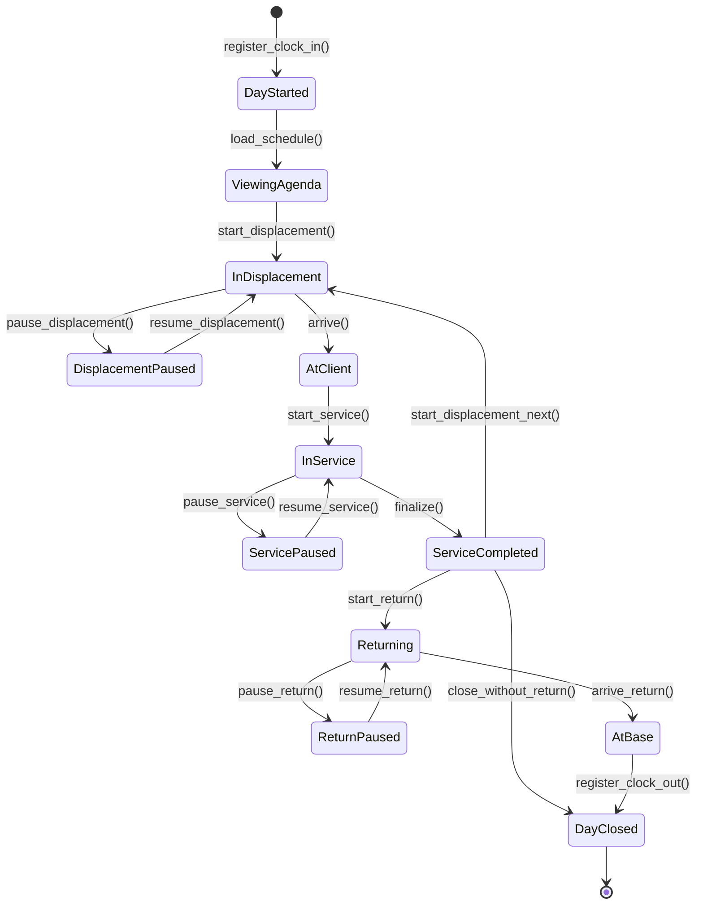
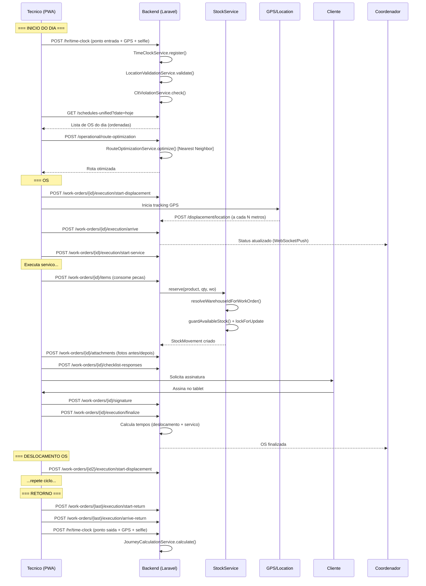

# Fluxo: Tecnico em Campo (Jornada Completa)

> **[AI_RULE]** Documento gerado por IA com base no codigo real do backend. Specs marcados com [SPEC] indicam funcionalidades planejadas.

## 1. Visao Geral

Este fluxo descreve a jornada completa de um tecnico de campo, desde o login matinal ate o retorno a base. O sistema Kalibrium suporta operacao via PWA com modo offline, integracao GPS, ponto digital (Portaria 671/2021) e consumo de pecas em tempo real.

---

## 2. State Machine — Jornada do Técnico em Campo



### Guards de Transição `[AI_RULE]`

| Transição | Guard |
|-----------|-------|
| `[*] → DayStarted` | `gps_enabled = true AND selfie_captured = true AND location_valid = true` |
| `InDisplacement → AtClient` | `latitude IS NOT NULL AND longitude IS NOT NULL` |
| `AtClient → InService` | `wo.status = 'at_client'` |
| `InService → ServiceCompleted` | `checklist_completed AND (signature_captured OR close_without_signature_authorized)` |
| `ServiceCompleted → InDisplacement` | `next_wo_id IS NOT NULL AND next_wo.status = 'scheduled'` |
| `Returning → AtBase` | `distance_to_base <= arrival_radius_meters` |
| `AtBase → DayClosed` | `gps_enabled = true AND selfie_captured = true` |

---

## 3. Timeline do Dia

```
07:00  Login no PWA
07:05  Registro de ponto (Portaria 671) com GPS + selfie
07:10  Visualiza agenda do dia (schedules-unified)
07:15  Inicia deslocamento para OS #1 (start-displacement)
07:45  Chega no cliente (arrive)
07:50  Inicia servico (start-service)
09:30  Consome pecas do estoque movel
09:45  Tira fotos antes/depois
10:00  Coleta assinatura do cliente
10:05  Finaliza servico (finalize)
10:10  Inicia deslocamento para OS #2 (start-displacement)
  ...repete ciclo...
17:00  Retorno a base (arrive-return)
17:05  Registro de ponto saida
```

---

## 3. Endpoints de Execucao em Campo

### 3.1 Fluxo de Execucao (`WorkOrderExecutionController`)

| Etapa | Endpoint | Metodo |
|-------|----------|--------|
| Iniciar deslocamento | `/work-orders/{id}/execution/start-displacement` | POST |
| Pausar deslocamento | `/work-orders/{id}/execution/pause-displacement` | POST |
| Retomar deslocamento | `/work-orders/{id}/execution/resume-displacement` | POST |
| Chegar no cliente | `/work-orders/{id}/execution/arrive` | POST |
| Iniciar servico | `/work-orders/{id}/execution/start-service` | POST |
| Pausar servico | `/work-orders/{id}/execution/pause-service` | POST |
| Retomar servico | `/work-orders/{id}/execution/resume-service` | POST |
| Finalizar servico | `/work-orders/{id}/execution/finalize` | POST |
| Iniciar retorno | `/work-orders/{id}/execution/start-return` | POST | `[VERIFICADO: rota existe em routes/api/work-orders.php]` |
| Pausar retorno | `/work-orders/{id}/execution/pause-return` | POST |
| Retomar retorno | `/work-orders/{id}/execution/resume-return` | POST |
| Chegar na base | `/work-orders/{id}/execution/arrive-return` | POST |
| Fechar sem retorno | `/work-orders/{id}/execution/close-without-return` | POST |

### 3.2 Deslocamento Detalhado (`WorkOrderDisplacementController`)

| Endpoint | Descricao |
|----------|-----------|
| `GET /work-orders/{id}/displacement` | Historico de deslocamento |
| `POST /work-orders/{id}/displacement/start` | Inicia tracking GPS |
| `POST /work-orders/{id}/displacement/arrive` | Registra chegada |
| `POST /work-orders/{id}/displacement/location` | Grava ponto GPS intermediario |
| `POST /work-orders/{id}/displacement/stops` | Adiciona parada (almoco, abastecimento) |
| `PATCH /work-orders/{id}/displacement/stops/{stop}` | Finaliza parada |

### 3.3 Timeline da Execucao

```
GET /work-orders/{id}/execution/timeline
```

Retorna todos os eventos da execucao em ordem cronologica com timestamps GPS.

---

## 4. Integracao GPS

### 4.1 Rastreamento de Localizacao

O tecnico envia coordenadas GPS em cada transicao de estado:

```json
{
  "latitude": -23.5505,
  "longitude": -46.6333,
  "accuracy": 15.5,
  "timestamp": "2026-03-24T07:15:00-03:00"
}
```

### 4.2 Atualizacao de Localizacao do Tecnico

```
POST /api/v1/iam/user-locations
Controller: UserLocationController
```

Campos do User atualizados: `last_latitude`, `last_longitude`.

### 4.3 Geolocalizacao do Cliente

O tecnico pode atualizar a geolocalizacao do cliente in-loco:

```
POST /technicians/customers/{customer}/geolocation
Controller: CustomerLocationController
```

### 4.4 Otimizacao de Rota

```
POST /operational/route-optimization
Controller: RouteOptimizationController
Service: RouteOptimizationService (Nearest Neighbor / Haversine)
```

O `RouteOptimizationService` implementa algoritmo Nearest Neighbor:

1. Parte da localizacao atual do tecnico
2. Encontra a OS mais proxima (Haversine)
3. Move para ela, repete ate visitar todas

---

## 5. Ponto Digital (Portaria 671/2021)

### 5.1 Registro de Ponto

O sistema implementa REP-P (Registrador Eletronico de Ponto via Programa) conforme Portaria 671:

- **GPS obrigatorio**: Coordenadas no momento do registro
- **Selfie obrigatoria**: Foto para validacao biometrica
- **Hash chain**: Cada registro gera hash encadeado (AFD)
- **Espelho de ponto**: Relatorio mensal exportavel

### 5.2 Servicos Relacionados

| Servico | Descricao |
|---------|-----------|
| `TimeClockService` | Registro de ponto com GPS + selfie |
| `LocationValidationService` | Valida distancia GPS do local de trabalho |
| `CltViolationService` | Detecta violacoes CLT (intervalo, jornada) |
| `JourneyCalculationService` | Calcula horas trabalhadas, extras, noturnas |

### 5.3 Validacao de Localizacao

O `LocationValidationService` verifica se o tecnico esta dentro do raio permitido do local de trabalho no momento do registro de ponto.

---

## 6. Consumo de Pecas (Estoque Movel)

### 6.1 Adicionar Item a OS

```
POST /work-orders/{id}/items
{
  "product_id": 123,
  "quantity": 2,
  "unit_price": 45.00,
  "type": "product"
}
```

### 6.2 Resolucao de Armazem

O `StockService::resolveWarehouseIdForWorkOrder()` resolve automaticamente:

1. Se OS tem `assigned_to` -> busca `Warehouse` tipo `technician` do tecnico
2. Senao -> busca armazem central (tipo `fixed`, sem `user_id`/`vehicle_id`)

```php
// StockService.php
if ($workOrder->assigned_to) {
    $w = Warehouse::where('type', Warehouse::TYPE_TECHNICIAN)
        ->where('user_id', $workOrder->assigned_to)
        ->first();
}
```

### 6.3 Reserva e Baixa

| Operacao | Metodo | Quando |
|----------|--------|--------|
| Reserva | `StockService::reserve()` | Tecnico adiciona item a OS |
| Baixa | `StockService::deduct()` | OS faturada |
| Devolucao | `StockService::returnStock()` | OS cancelada |

---

## 7. Fotos e Assinatura

### 7.1 Upload de Fotos

```
POST /work-orders/{id}/attachments
Content-Type: multipart/form-data
Fields: file, description, type (before|after|evidence)
```

### 7.2 Checklist com Fotos

```
POST /work-orders/{id}/photo-checklist/upload
```

### 7.3 Assinatura Digital do Cliente

```
POST /work-orders/{id}/signature
{
  "signature_data": "data:image/png;base64,...",
  "signer_name": "Joao Silva",
  "signer_role": "Responsavel Tecnico"
}
```

---

## 8. Modo Offline (PWA)

### 8.1 O que Funciona Offline

| Funcionalidade | Offline | Sincroniza ao Reconectar |
|---------------|---------|--------------------------|
| Ver OS do dia | Sim (cache) | Sim |
| Registrar inicio/fim de servico | Sim (queue local) | Sim |
| Tirar fotos | Sim (IndexedDB) | Sim |
| Coletar assinatura | Sim (canvas local) | Sim |
| Consumir pecas | Sim (queue local) | Sim |
| Preencher checklist | Sim (cache) | Sim |
| GPS tracking | Sim (buffer local) | Sim |
| Ver estoque em tempo real | Nao | - |
| Chat da OS | Nao | - |
| Consultar historico do cliente | Nao | - |

### 8.2 Estrategia de Sincronizacao

```
1. PWA detecta conexao perdida (navigator.onLine)
2. Acoes ficam em fila (IndexedDB / localStorage)
3. Ao reconectar, sync worker processa fila FIFO
4. Conflitos: servidor tem prioridade (last-write-wins com merge)
5. Notifica tecnico de itens sincronizados
```

### 8.3 Inventario PWA

Endpoints dedicados para operacao offline do inventario:

```
GET  /stock/inventory-pwa/my-warehouses
GET  /stock/inventory-pwa/warehouses/{id}/products
POST /stock/inventory-pwa/submit-counts
```

---

## 9. Diagrama de Sequencia Completo



---

## 10. Descricao das Telas Mobile (Wireframes)

### Tela 1: Agenda do Dia

```
+----------------------------------+
| Kalibrium          [avatar] [!3] |
|----------------------------------|
| Hoje, 24/03/2026   5 OS          |
|----------------------------------|
| [07:30] OS #1234 - Calibracao    |
|   Cliente: Laboratorio XYZ       |
|   Endereco: Rua A, 123           |
|   [>> Iniciar Deslocamento]      |
|----------------------------------|
| [09:00] OS #1235 - Manutencao    |
|   Cliente: Industria ABC         |
|   Endereco: Av. B, 456           |
|   Status: Aguardando             |
|----------------------------------|
| [10:30] OS #1236 - Instalacao    |
|   ...                            |
+----------------------------------+
| [Agenda] [Mapa] [Estoque] [+]   |
+----------------------------------+
```

### Tela 2: Execucao da OS

```
+----------------------------------+
| OS #1234 - Calibracao     [chat] |
|----------------------------------|
| Cliente: Laboratorio XYZ         |
| Contato: Maria - (11) 9999-0000  |
|----------------------------------|
| Timeline:                        |
|  * 07:15 Deslocamento iniciado   |
|  * 07:45 Chegou no cliente       |
|  * 07:50 Servico iniciado        |
|  > Em execucao: 01:15:23         |
|----------------------------------|
| Pecas usadas:                    |
|  - Sensor PT100 (2x) R$ 90.00   |
|  - [+ Adicionar Peca]           |
|----------------------------------|
| Checklist: 5/8 itens             |
|  [Continuar Checklist]           |
|----------------------------------|
| [Pausar] [Fotos] [Finalizar]    |
+----------------------------------+
```

### Tela 3: Finalizacao

```
+----------------------------------+
| Finalizar OS #1234               |
|----------------------------------|
| Resumo:                          |
|  Deslocamento: 30min             |
|  Servico: 2h 15min               |
|  Pecas: R$ 180.00                |
|  Servicos: R$ 350.00             |
|  Total: R$ 530.00                |
|----------------------------------|
| Observacoes:                     |
| [________________________]       |
|----------------------------------|
| Assinatura do cliente:           |
| [    canvas assinatura    ]      |
| Nome: [________________]        |
|----------------------------------|
| Fotos: 4 anexadas                |
| Checklist: 8/8 completo         |
|----------------------------------|
| [<< Voltar] [Finalizar OS >>]   |
+----------------------------------+
```

---

## 11. React Hooks Sugeridos

### useFieldExecution

```typescript
// [SPEC] Implementar no frontend — Hook useFieldExecution com estado da OS, timer, e acoes
interface UseFieldExecutionReturn {
  currentStep: 'idle' | 'displacement' | 'arrived' | 'service' | 'paused' | 'returning';
  timer: { hours: number; minutes: number; seconds: number };
  startDisplacement: (woId: number, coords: GeoCoords) => Promise<void>;
  arrive: (woId: number, coords: GeoCoords) => Promise<void>;
  startService: (woId: number) => Promise<void>;
  pauseService: (woId: number, reason: string) => Promise<void>;
  resumeService: (woId: number) => Promise<void>;
  finalize: (woId: number, data: FinalizePayload) => Promise<void>;
  startReturn: (woId: number) => Promise<void>;
  arriveReturn: (woId: number, coords: GeoCoords) => Promise<void>;
  timeline: TimelineEvent[];
}
```

### useOfflineSync

```typescript
// [SPEC] Implementar no frontend — Hook useOfflineSync com IndexedDB + service worker
interface UseOfflineSyncReturn {
  isOnline: boolean;
  pendingActions: number;
  syncStatus: 'idle' | 'syncing' | 'error';
  lastSyncAt: Date | null;
  queueAction: (action: OfflineAction) => void;
  forceSync: () => Promise<SyncResult>;
  conflicts: ConflictItem[];
  resolveConflict: (id: string, resolution: 'local' | 'server') => void;
}
```

---

## 12. Cenarios BDD

### Cenario 1: Jornada completa de campo

```gherkin
Funcionalidade: Tecnico em campo

  Cenario: Jornada completa com 2 OS
    Dado que o tecnico "Ana" esta logado no PWA
    E tem 2 OS agendadas para hoje
    Quando Ana registra ponto de entrada com GPS e selfie
    E inicia deslocamento para OS #1
    E chega no cliente
    E inicia o servico
    E consome 2 unidades do produto "Sensor PT100"
    E tira 3 fotos
    E coleta assinatura do cliente
    E finaliza o servico
    Entao a OS #1 esta com status "completed"
    E existem 2 StockMovements do tipo "reserve"
    E existem 3 attachments na OS
    E existe 1 signature na OS
```

### Cenario 2: Pausa no servico

```gherkin
  Cenario: Tecnico pausa e retoma servico
    Dado que o tecnico esta executando a OS #1234
    Quando pausa o servico com motivo "Aguardando peca"
    Entao o timer de servico para
    E o status da execucao e "paused"
    Quando retoma o servico
    Entao o timer continua de onde parou
```

### Cenario 3: Modo offline

```gherkin
  Cenario: Tecnico perde conexao durante servico
    Dado que o tecnico esta executando a OS #1234
    E a conexao com internet cai
    Quando o tecnico finaliza o servico offline
    E tira fotos offline
    E coleta assinatura offline
    Entao as acoes ficam na fila local
    Quando a conexao retorna
    Entao o sync worker processa a fila
    E todas as acoes sao enviadas ao servidor
    E o tecnico ve confirmacao de sincronizacao
```

### Cenario 4: Estoque insuficiente

```gherkin
  Cenario: Tecnico tenta consumir peca sem estoque
    Dado que o tecnico tem 1 unidade de "Sensor PT100" no armazem movel
    Quando tenta adicionar 3 unidades a OS
    Entao o sistema retorna erro "Saldo insuficiente no armazem"
    E sugere criar solicitacao de material
```

### Cenario 5: Deslocamento com paradas

```gherkin
  Cenario: Tecnico faz parada durante deslocamento
    Dado que o tecnico esta em deslocamento para OS #1234
    Quando registra uma parada de tipo "abastecimento"
    E permanece parado por 15 minutos
    E finaliza a parada
    Entao o tempo de parada e registrado separadamente
    E nao conta como tempo de deslocamento efetivo
```

### Cenario 6: Fechamento sem retorno

```gherkin
  Cenario: Tecnico encerra dia no ultimo cliente
    Dado que o tecnico finalizou a ultima OS do dia
    Quando seleciona "Fechar sem retorno"
    Entao POST /execution/close-without-return retorna 200
    E nao e necessario registrar deslocamento de retorno
```

### Cenario 7: Registro de ponto com validacao GPS

```gherkin
  Cenario: Ponto rejeitado por localizacao invalida
    Dado que o tecnico esta a 500m do local de trabalho cadastrado
    E o raio maximo permitido e 200m
    Quando tenta registrar ponto de entrada
    Entao o LocationValidationService rejeita o registro
    E retorna erro com distancia calculada
```

---

## 13. Fluxo de Dados (Entidades Tocadas)

```
WorkOrder
  -> WorkOrderExecution (timestamps de cada etapa)
  -> WorkOrderDisplacement (GPS tracking)
  -> WorkOrderItem (pecas consumidas)
  -> WorkOrderAttachment (fotos)
  -> WorkOrderSignature (assinatura)
  -> WorkOrderChecklistResponse (checklist)
  -> WorkOrderTimeLog (timer manual)
  -> WorkOrderChat (comunicacao interna)
  -> StockMovement (via StockService)
  -> Schedule (agendamento)
  -> TimeClock (ponto digital)
```

---

## 13.1 GPS, Geofence e Upload

### GPS Location Update
- **Endpoint:** `POST /api/v1/mobile/location` (chamado pelo app a cada 5 minutos quando em rota)
- **Campos:** `latitude`, `longitude`, `accuracy`, `timestamp`
- **Storage:** Atualiza `users.last_latitude`, `users.last_longitude`, `users.last_location_at`
- **Histórico:** Tabela `op_location_history` (id, user_id, latitude, longitude, accuracy, recorded_at) — retenção 30 dias

### Geofence Check-in/Check-out
- **Raio padrão:** 200 metros (configurável por tenant: `settings.operational.geofence_radius_meters`)
- **Raio por cliente:** Campo `geofence_radius` nullable na tabela `customers` — se presente, sobrescreve padrão
- **Validação:** `GeofenceService::isWithinRadius(float $lat, float $lng, Customer $customer): bool`

### Photo/Signature Upload
- **Formatos aceitos:** JPEG, PNG (photos), PNG (signatures)
- **Tamanho máximo:** 5MB por foto, 1MB por assinatura
- **Storage path:** `storage/app/work-orders/{tenant_id}/{work_order_id}/photos/` e `.../signatures/`
- **Validação FormRequest:** `'photos.*' => 'image|mimes:jpeg,png|max:5120'`, `'signature' => 'image|mimes:png|max:1024'`

---

## 14. Gaps e Melhorias Futuras

| # | Gap | Prio | Status |
|---|-----|------|--------|
| 1 | Hook `useFieldExecution` no frontend React | Alta | [SPEC] State machine da OS no frontend com tratamento de erros e otimistic updates |
| 2 | Hook `useOfflineSync` com service worker | Alta | [SPEC] Queue de operacoes offline com sync automatica ao reconectar (IndexedDB + Background Sync API) |
| 3 | Cache de dados da OS para offline (IndexedDB) | Alta | [SPEC] Pre-cache OS atribuidas ao tecnico com dados do cliente, equipamento e historico |
| 4 | Push notification para mensagens do chat | Media | [SPEC] WebPushService existente — usar para notificar mensagens do coordenador no chat da OS |
| 5 | Calculo automatico de km percorrido | Media | [SPEC] Acumular GPS points durante deslocamento, calcular distancia total via Haversine |
| 6 | Integracao Waze/Google Maps para navegacao | Baixa | [SPEC] Deep link `waze://` ou `google.navigation:` com lat/long do cliente; Ver `INTEGRACOES-EXTERNAS.md` secao 4 |
| 7 | Deteccao automatica de chegada por geofence | Media | [SPEC] Geolocation API com raio de 100m do endereco do cliente — auto-marcar `arrived_at` |
| 8 | Compressao automatica de fotos antes do upload | Alta | [SPEC] Canvas API para redimensionar para max 1920px e comprimir JPEG a 80% antes de enviar |

---

> **[AI_RULE]** Este documento reflete o estado real do codigo em `WorkOrderExecutionController`, `WorkOrderDisplacementController`, `StockService.php`, `TimeClockService.php` e rotas em `work-orders.php`. Specs marcados com [SPEC] indicam funcionalidades planejadas.

---

## Módulos Envolvidos

| Módulo | Responsabilidade no Fluxo |
|--------|---------------------------|
| [Agenda](file:///c:/PROJETOS/sistema/docs/modules/Agenda.md) | Roteirização e agenda diária do técnico |
| [Inventory](file:///c:/PROJETOS/sistema/docs/modules/Inventory.md) | Consumo de peças e insumos em campo |
| [Lab](file:///c:/PROJETOS/sistema/docs/modules/Lab.md) | Execução de calibração e coleta de evidências |
| [Operational](file:///c:/PROJETOS/sistema/docs/modules/Operational.md) | Check-in/out e acompanhamento em tempo real |
| [HR](file:///c:/PROJETOS/sistema/docs/modules/HR.md) | Dados do técnico, CNH, certificações |
| [WorkOrders](file:///c:/PROJETOS/sistema/docs/modules/WorkOrders.md) | Execução e finalização de ordens de serviço |
