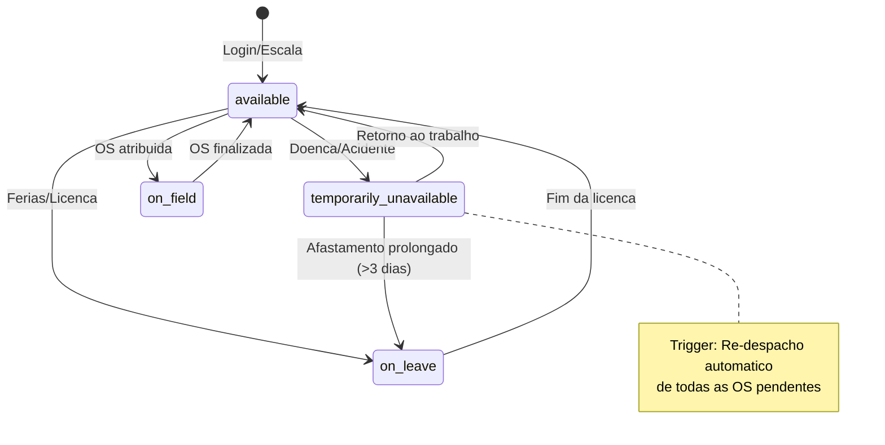
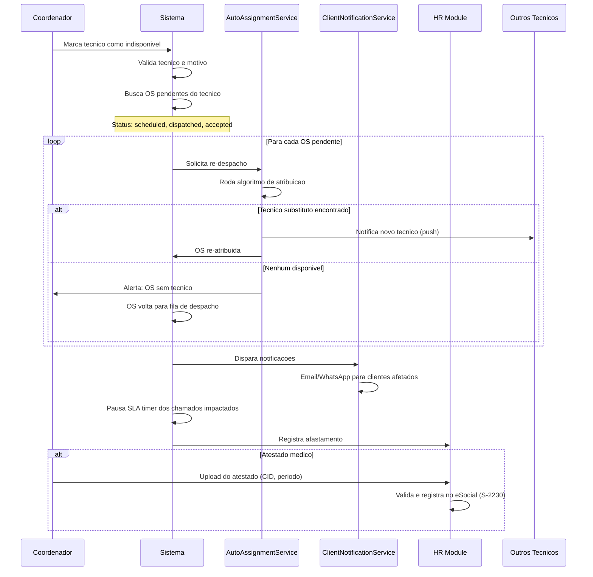

# Fluxo: Tecnico Fica Indisponivel (Doenca/Acidente)

> **Modulo**: Operational + HR + Agenda
> **Prioridade**: P1 — Impacta eficiencia operacional
> **[AI_RULE]** Documento prescritivo. Serve como contrato para implementacao.

## 1. Visao Geral

Quando um tecnico fica indisponivel (doenca, acidente, emergencia pessoal), o sistema precisa:

1. Marcar o tecnico como indisponivel
2. Re-despachar automaticamente todas as OS pendentes
3. Notificar clientes afetados sobre mudanca de agenda
4. Pausar ou ajustar SLA dos chamados impactados
5. Registrar no HR (atestado, tipo de afastamento)

**Atores**: Coordenador, Tecnico (se conseguir comunicar), RH, Clientes afetados

---

## 2. Maquina de Estados do Tecnico



### 2.1 Transicoes e Guards

| De | Para | Trigger | Guard | Side Effect |
|----|------|---------|-------|-------------|
| `available` | `temporarily_unavailable` | `markUnavailable()` | — | Re-despacho automatico, notificacao clientes |
| `temporarily_unavailable` | `available` | `markAvailable()` | Atestado registrado (se > 1 dia) | Reabilita para despacho |
| `temporarily_unavailable` | `on_leave` | `convertToLeave()` | Aprovacao RH | Transfere para controle de ferias/licenca |
| `available` | `on_leave` | `startLeave()` | Saldo de ferias positivo | Pre-despacho das OS futuras |

---

## 3. Pipeline de Indisponibilidade



---

## 4. Modelo de Dados

### 4.1 TechnicianAvailability

| Campo | Tipo | Descricao |
|-------|------|-----------|
| `id` | bigint unsigned | PK |
| `tenant_id` | bigint unsigned | FK → tenants |
| `user_id` | bigint unsigned | FK → users (tecnico) |
| `status` | enum | `available`, `temporarily_unavailable`, `on_leave`, `on_field` |
| `unavailable_reason` | enum | `sick`, `accident`, `personal`, `equipment_failure`, `other` |
| `unavailable_from` | datetime | Inicio da indisponibilidade |
| `unavailable_until` | datetime nullable | Previsao de retorno |
| `medical_certificate_path` | string nullable | Caminho do atestado |
| `cid_code` | string nullable | Codigo CID-10 |
| `notes` | text nullable | Observacoes |
| `marked_by` | bigint unsigned | FK → users (quem registrou) |
| `created_at` | timestamp | — |
| `updated_at` | timestamp | — |

### 4.2 Campos Existentes Relevantes

**User** (tecnico):

- `is_active` — campo existente, usado para desabilitar conta
- `role` — `technician`

**WorkOrder**:

- `assigned_technician_id` — FK para tecnico atribuido
- `status` — estados impactados: `scheduled`, `dispatched`, `accepted`

**AgendaItem**:

- `assigned_to` — tecnico com itens de agenda

---

## 5. Regras de Negocio

### 5.1 Re-despacho Automatico

[AI_RULE_CRITICAL] O re-despacho DEVE respeitar a mesma logica do `AutoAssignmentService`:

- Verificar `max_os_per_day` do tecnico substituto
- Respeitar zonas/territorios (`CrmTerritory`)
- Considerar skills requeridas pela OS
- Manter prioridade da OS original
- Se nenhum tecnico disponivel: escalonar para coordenador

### 5.2 Impacto no SLA

| Cenario | Acao no SLA |
|---------|-------------|
| Re-despacho imediato (< 1h) | SLA continua normalmente |
| Re-despacho com atraso (1-4h) | Adiciona tempo de re-despacho ao SLA |
| Sem tecnico disponivel | SLA pausado ate re-atribuicao |
| Cliente notificado e concorda | SLA reinicia com novo tecnico |

### 5.3 Registro HR

- **Afastamento ate 3 dias**: Registro interno, coordenador pode aprovar
- **Afastamento > 3 dias**: Obrigatorio atestado medico com CID
- **Afastamento > 15 dias**: Encaminhamento INSS (evento eSocial S-2230)
- **Acidente de trabalho**: CAT obrigatoria em 24h (evento eSocial S-2210)

### 5.4 Notificacao de Clientes

[AI_RULE] Clientes afetados DEVEM ser notificados com:

- Nome do novo tecnico (se ja re-atribuido)
- Nova janela de atendimento estimada
- Canal: email + WhatsApp (se configurado)
- Texto padrao configuravel por tenant

---

## 6. Cenarios BDD

### Cenario 1: Tecnico fica doente com 5 OS agendadas

```gherkin
Dado que o tecnico "Carlos" tem 5 OS agendadas para hoje
  E existem 3 outros tecnicos disponiveis na mesma regiao
Quando o coordenador marca Carlos como "temporarily_unavailable"
  E informa motivo "sick"
Entao as 5 OS sao re-distribuidas entre os tecnicos disponiveis
  E os 5 clientes recebem notificacao de reagendamento
  E o SLA de cada chamado e ajustado (+tempo de re-despacho)
  E um registro de afastamento e criado no HR
```

### Cenario 2: Nenhum tecnico substituto disponivel

```gherkin
Dado que o tecnico "Maria" e a unica na regiao Norte
  E tem 3 OS para hoje
Quando o coordenador marca Maria como "temporarily_unavailable"
Entao as 3 OS voltam para a fila de despacho manual
  E o coordenador recebe alerta "3 OS sem tecnico na regiao Norte"
  E o SLA dos chamados e pausado
  E os clientes recebem notificacao de atraso
```

### Cenario 3: Acidente de trabalho com CAT

```gherkin
Dado que o tecnico "Joao" sofreu acidente em campo
Quando o coordenador registra afastamento com motivo "accident"
Entao o sistema gera rascunho de CAT (S-2210)
  E exige preenchimento em ate 24h
  E alerta o RH sobre obrigatoriedade legal
  E todas as OS de Joao sao re-despachadas
```

### Cenario 4: Retorno ao trabalho apos afastamento

```gherkin
Dado que o tecnico "Carlos" esta "temporarily_unavailable" ha 3 dias
  E possui atestado medico registrado
Quando o coordenador marca Carlos como "available"
Entao Carlos volta a receber novas atribuicoes
  E o sistema verifica se ha OS pendentes na fila da regiao
  E sugere atribuicao das OS mais antigas primeiro
```

### Cenario 5: Afastamento prolongado vira licenca

```gherkin
Dado que o tecnico "Ana" esta "temporarily_unavailable" ha 15 dias
Quando o RH converte o afastamento para "on_leave"
Entao o evento eSocial S-2230 e gerado
  E a agenda de Ana e bloqueada ate o fim da licenca
  E preventivas atribuidas a Ana sao redistribuidas
```

---

## 7. Integracao com Modulos Existentes

| Modulo | Integracao |
|--------|-----------|
| **AutoAssignmentService** | Re-despacho automatico usa o mesmo algoritmo de round-robin/least-loaded |
| **Agenda** | Bloqueia agenda do tecnico indisponivel, reagenda itens |
| **SLA/Escalonamento** | Pausa timer de SLA durante re-despacho |
| **HR** | Registra afastamento, atestado, eventos eSocial |
| **ClientNotificationService** | Notificacao multicanal para clientes impactados |
| **WorkOrder** | Re-atribuicao de OS pendentes |
| **ServiceCall** | Chamados vinculados sao re-priorizados |

---

## 8. API Endpoints

| Metodo | Rota | Descricao | Form Request |
|--------|------|-----------|--------------|
| POST | `/api/technicians/{id}/unavailability` | Marcar tecnico indisponivel | `MarkUnavailableRequest` |
| PUT | `/api/technicians/{id}/availability` | Marcar tecnico disponivel | `MarkAvailableRequest` |
| GET | `/api/technicians/unavailable` | Listar tecnicos indisponiveis | — |
| POST | `/api/technicians/{id}/unavailability/{uid}/certificate` | Upload atestado | `UploadCertificateRequest` |
| POST | `/api/technicians/{id}/unavailability/{uid}/convert-to-leave` | Converter para licenca | `ConvertToLeaveRequest` |

---

## 9. Gaps e Melhorias Futuras

| # | Item | Status |
|---|------|--------|
| 1 | Campo `is_available` no Model User | Especificado abaixo (9.1) |
| 2 | Integracao com Google Calendar para bloquear agenda | Especificado abaixo (9.2) |
| 3 | Auto-deteccao de indisponibilidade (no-show em OS) | Especificado abaixo (9.3) |
| 4 | Dashboard de disponibilidade em tempo real | Especificado abaixo (9.4) |
| 5 | Push notification ao proprio tecnico confirmando afastamento | Especificado abaixo (9.5) |

### TechnicianAvailability Model
- **Tabela:** `op_technician_availabilities`
- **Campos:** id, tenant_id, user_id (FK), date, status (enum: available, unavailable, on_leave, sick, training, vacation, suspected_unavailable), reason nullable, start_time nullable, end_time nullable, reported_by (FK users), timestamps
- **Campo em users:** `is_available` (boolean default true) — cache denormalizado

### Enum Consistente de Status
- `available` — disponível para despacho
- `unavailable` — indisponível genérico
- `on_leave` — folga/abono
- `sick` — atestado médico
- `training` — em treinamento
- `vacation` — férias
- `suspected_unavailable` — detectado por no-show, aguardando confirmação

### DetectTechnicianNoShow Job
- **Schedule:** A cada 2 horas durante horário comercial (08:00-18:00)
- **Regra:** Técnico com OS agendada há > 1 hora sem check-in
- **Ação:**
  1. Marcar availability como `suspected_unavailable`
  2. Disparar `TechnicianNoShowDetected` event
  3. Notificar coordenador para confirmar
  4. Se confirmado: redistribuir OS para próximo técnico disponível

### eSocial S-2210 (CAT) Deadline
- **Job:** `EnforceS2210Deadline` — roda a cada 6 horas
- **Regra:** Registros de acidente com `accident_date` há mais de 20 horas sem CAT transmitida
- **Ação:** `CATDeadlineApproaching` event → Alerts (notificar HR + safety_manager com urgência CRITICAL)
- **Nota:** Prazo legal é 24 horas. Job dispara com 20h para dar 4h de margem.

### Availability Dashboard
- **Endpoint:** `GET /api/v1/technicians/availability-dashboard`
- **Controller:** `TechnicianAvailabilityController@dashboard`
- **Response:** total_technicians, available_count, unavailable_by_reason (breakdown), coverage_percentage, alerts (técnicos com muitas indisponibilidades no mês)

---

### 9.1 Campo `is_available` no Model User

**Migration**

```php
// create_add_is_available_to_users_table.php
Schema::table('users', function (Blueprint $table) {
    $table->boolean('is_available')->default(true)->after('is_active')
        ->comment('Disponibilidade operacional do tecnico para receber OS');
    $table->string('unavailability_reason', 50)->nullable()->after('is_available')
        ->comment('Motivo da indisponibilidade: sick, accident, personal, equipment_failure, on_leave');
    $table->datetime('unavailable_since')->nullable()->after('unavailability_reason');
    $table->datetime('expected_return_at')->nullable()->after('unavailable_since');

    $table->index(['is_available', 'is_active'], 'idx_user_availability');
});
```

**Impacto no Despacho (`AutoAssignmentService`)**

```php
// AutoAssignmentService::getAvailableTechnicians()
// Adicionar filtro obrigatorio:
User::where('is_active', true)
    ->where('is_available', true)  // NOVO: exclui tecnicos indisponiveis
    ->whereHas('roles', fn($q) => $q->where('name', 'technician'))
    ->where('current_tenant_id', $tenantId)
    // ... demais filtros (regiao, skills, max_os_per_day)
```

**Regras de Negocio**

- `is_available = false` impede o tecnico de aparecer no algoritmo de despacho
- `is_available` e independente de `is_active`: tecnico pode estar ativo (conta funcional) mas indisponivel (afastado)
- Ao marcar `is_available = false`, o sistema automaticamente executa re-despacho das OS pendentes
- Ao marcar `is_available = true`, o sistema verifica fila de OS pendentes na regiao e sugere atribuicao

### 9.2 Integracao com Google Calendar para Bloquear Agenda

**Fluxo OAuth2**

```
1. Tecnico acessa: GET /api/google-calendar/connect
   → Redireciona para Google OAuth2 consent screen
   → Scopes: calendar.events, calendar.readonly

2. Google retorna: GET /api/google-calendar/callback?code=AUTH_CODE
   → Sistema troca code por access_token + refresh_token
   → Armazena em google_calendar_tokens (user_id, access_token, refresh_token, expires_at)
   → Cria watch channel para receber webhooks de alteracao

3. Token refresh automatico via GoogleCalendarService::refreshTokenIfNeeded()
   → Se expires_at < now() + 5min: POST https://oauth2.googleapis.com/token
```

**Sincronizacao Bidirecional**

| Direcao | Trigger | Acao |
|---------|---------|------|
| Sistema → Google | `TechnicianMarkedUnavailable` event | Cria evento "Indisponivel - {motivo}" no calendario do tecnico, full-day ou periodo especifico |
| Sistema → Google | `WorkOrderAssigned` event | Cria evento com detalhes da OS (cliente, endereco, horario) |
| Google → Sistema | Webhook `PUSH` do Google Calendar API | `GoogleCalendarWebhookController` recebe notificacao, busca evento alterado, atualiza `AgendaItem` |
| Google → Sistema | Tecnico cria evento "Ferias" ou "Indisponivel" no Google | Sistema detecta via sync, marca `is_available = false` e notifica coordenador |

**Fallback quando Google API esta indisponivel**

1. Tentativa de sync falha → registra em `SyncFailureLog` com `retry_count`
2. Job `RetryGoogleCalendarSync` roda a cada 5 minutos, tenta reprocessar falhas com `retry_count < 5`
3. Apos 5 falhas: alerta ao coordenador via `SystemAlert` com sugestao de verificar conexao do tecnico
4. Agenda interna (`AgendaItem`) SEMPRE e a fonte da verdade — Google Calendar e espelho

**Tabela `google_calendar_tokens`**

| Campo | Tipo | Descricao |
|-------|------|-----------|
| `id` | bigint unsigned | PK |
| `tenant_id` | bigint unsigned | FK |
| `user_id` | bigint unsigned | FK → users |
| `access_token` | text | Token de acesso (criptografado) |
| `refresh_token` | text | Token de refresh (criptografado) |
| `expires_at` | datetime | Expiracao do access_token |
| `calendar_id` | string | ID do calendario sincronizado |
| `watch_channel_id` | string nullable | ID do canal de webhook do Google |
| `watch_expiration` | datetime nullable | Expiracao do canal de webhook |
| `last_sync_at` | datetime nullable | Ultima sincronizacao bem-sucedida |
| `sync_errors_count` | integer default 0 | Contador de erros consecutivos |

### 9.3 Auto-Deteccao de Indisponibilidade (No-Show em OS)

**Scheduled Job: `DetectTechnicianNoShow`**

| Item | Detalhe |
|------|---------|
| Comando | `php artisan technicians:detect-no-show` |
| Frequencia | A cada 15 minutos (`everyFifteenMinutes()`) |
| Queue | `default` |

**Regras de Deteccao**

```php
// DetectTechnicianNoShow::handle()
// Para cada tenant ativo:

// Regra 1: Tecnico nao fez check-in na OS apos 30min do horario agendado
$noShows = WorkOrder::where('status', 'dispatched')
    ->where('scheduled_start', '<=', now()->subMinutes(30))
    ->whereNull('started_at')
    ->whereHas('assignee', fn($q) => $q->where('is_available', true))
    ->get();

// Regra 2: Tecnico nao reportou posicao GPS ha mais de 60 minutos (durante horario comercial)
$gpsTimeout = User::where('is_available', true)
    ->whereHas('roles', fn($q) => $q->where('name', 'technician'))
    ->where('last_location_at', '<=', now()->subMinutes(60))
    ->whereHas('workOrders', fn($q) => $q->whereIn('status', ['dispatched', 'accepted']))
    ->get();

// Regra 3: Tecnico rejeitou/ignorou 3+ OS consecutivas no mesmo dia
$consecutiveRejects = WorkOrderDispatchLog::select('technician_id')
    ->where('response', 'rejected')
    ->whereDate('created_at', today())
    ->groupBy('technician_id')
    ->havingRaw('COUNT(*) >= 3')
    ->pluck('technician_id');
```

**Acoes por Regra**

| Regra | Acao Automatica |
|-------|----------------|
| No-show 30min | 1. Envia push ao tecnico: "Voce nao fez check-in na OS #{wo}. Tudo bem?" 2. Notifica coordenador: "Tecnico {nome} nao fez check-in" 3. Se nao responder em 15min adicionais: marca como `suspected_unavailable` |
| GPS timeout 60min | 1. Envia push ao tecnico: "Sem sinal de GPS ha 1h. Atualize sua posicao." 2. Notifica coordenador se persistir por 2h |
| 3+ rejeicoes | 1. Notifica coordenador: "Tecnico {nome} rejeitou 3 OS consecutivas hoje" 2. Sugere verificar disponibilidade |

**Status Intermediario: `suspected_unavailable`**

- Nao executa re-despacho automatico (pode ser falso positivo)
- Coordenador recebe alerta e pode confirmar ou descartar
- Se coordenador confirma: executa fluxo completo de `markUnavailable()`
- Se tecnico responde ao push: status volta para `available` automaticamente

### 9.4 Dashboard de Disponibilidade em Tempo Real

**Endpoint REST**

| Item | Detalhe |
|------|---------|
| Rota | `GET /api/v1/technicians/availability-dashboard` |
| Permissao | `operational.availability.view` |
| Cache | 30 segundos (Redis) |

**Response JSON**

```json
{
  "summary": {
    "total_technicians": 25,
    "available": 18,
    "on_field": 5,
    "temporarily_unavailable": 1,
    "on_leave": 1,
    "suspected_unavailable": 0
  },
  "by_region": [
    {
      "region_id": 1,
      "region_name": "Zona Sul",
      "available": 6,
      "total": 8,
      "unassigned_work_orders": 3
    }
  ],
  "technicians": [
    {
      "id": 45,
      "name": "Carlos Silva",
      "status": "available",
      "current_work_order_id": null,
      "os_completed_today": 3,
      "os_remaining_today": 2,
      "region": "Zona Sul",
      "last_location_at": "2026-03-25T14:30:00Z",
      "skills": ["calibracao", "manutencao"]
    }
  ],
  "alerts": [
    {
      "type": "region_understaffed",
      "region": "Zona Norte",
      "available": 0,
      "pending_os": 5,
      "message": "Regiao Norte sem tecnicos disponiveis com 5 OS pendentes"
    }
  ]
}
```

**WebSocket (Broadcasting)**

| Item | Detalhe |
|------|---------|
| Canal | `private-tenant.{tenant_id}.technician-availability` |
| Evento | `TechnicianAvailabilityChanged` |
| Auth | Laravel Echo com Sanctum |

**Payload WebSocket**

```json
{
  "event": "TechnicianAvailabilityChanged",
  "data": {
    "technician_id": 45,
    "previous_status": "available",
    "new_status": "temporarily_unavailable",
    "reason": "sick",
    "affected_work_orders": [101, 102, 103],
    "timestamp": "2026-03-25T14:35:00Z"
  }
}
```

**Frontend Hook**

```typescript
// hooks/useAvailabilityDashboard.ts
interface AvailabilitySummary {
  totalTechnicians: number;
  available: number;
  onField: number;
  temporarilyUnavailable: number;
  onLeave: number;
}

interface RegionAvailability {
  regionId: number;
  regionName: string;
  available: number;
  total: number;
  unassignedWorkOrders: number;
}

function useAvailabilityDashboard(): {
  summary: AvailabilitySummary;
  regions: RegionAvailability[];
  technicians: TechnicianStatus[];
  alerts: AvailabilityAlert[];
  isConnected: boolean;
};
```

### 9.5 Push Notification ao Proprio Tecnico Confirmando Afastamento

**Servico: Firebase Cloud Messaging (FCM)**

| Item | Detalhe |
|------|---------|
| Provider | Firebase Cloud Messaging v1 API |
| Auth | Service Account JSON (`FIREBASE_CREDENTIALS_PATH` em `.env`) |
| Tabela de tokens | `fcm_device_tokens` (user_id, device_token, platform, last_used_at) |

**Template de Notificacao**

```json
{
  "notification": {
    "title": "Afastamento Registrado",
    "body": "Seu afastamento por {reason_label} foi registrado. Previsao de retorno: {expected_return}. Se voce ja esta disponivel, clique para confirmar retorno."
  },
  "data": {
    "type": "unavailability_confirmation",
    "unavailability_id": "123",
    "action_url": "/api/technicians/{id}/availability",
    "actions": [
      { "key": "confirm", "label": "Confirmar afastamento" },
      { "key": "return", "label": "Estou disponivel" }
    ]
  },
  "android": {
    "priority": "high",
    "notification": {
      "click_action": "OPEN_UNAVAILABILITY_DETAIL",
      "channel_id": "unavailability"
    }
  },
  "apns": {
    "payload": {
      "aps": {
        "alert": { "title": "Afastamento Registrado", "body": "..." },
        "sound": "default",
        "category": "UNAVAILABILITY_ACTIONS"
      }
    }
  }
}
```

**Acao de Confirmacao via Push**

Quando o tecnico clica "Estou disponivel":

1. App mobile envia `PUT /api/technicians/{id}/availability` com body `{ "status": "available" }`
2. Backend valida que o tecnico autenticado e o proprio tecnico (`$request->user()->id == $id`)
3. Executa `markAvailable()`: `is_available = true`, `unavailability_reason = null`
4. Emite evento `TechnicianReturnedToWork`
5. Envia push de confirmacao: "Retorno registrado. Voce esta apto a receber novas OS."

**Labels de Motivo (`reason_label`)**

| Codigo | Label para notificacao |
|--------|----------------------|
| `sick` | "motivo de saude" |
| `accident` | "acidente" |
| `personal` | "motivo pessoal" |
| `equipment_failure` | "falha de equipamento" |
| `other` | "outro motivo" |

> **[AI_RULE]** Este documento mapeia o fluxo de indisponibilidade de tecnico. Interage com `AutoAssignmentService`, `WorkOrder`, `AgendaItem`, `ServiceCall`, `HR` e `ClientNotificationService`.

---

## Módulos Envolvidos

| Módulo | Responsabilidade no Fluxo |
|--------|---------------------------|
| [HR](file:///c:/PROJETOS/sistema/docs/modules/HR.md) | Gestão de ausências, férias, afastamentos e atestados |
| [Agenda](file:///c:/PROJETOS/sistema/docs/modules/Agenda.md) | Re-alocação automática de agenda do técnico ausente |
| [Lab](file:///c:/PROJETOS/sistema/docs/modules/Lab.md) | Redistribuição de serviços pendentes |
| [ESocial](file:///c:/PROJETOS/sistema/docs/modules/ESocial.md) | Registro de afastamento nos eventos obrigatórios |
| [Email](file:///c:/PROJETOS/sistema/docs/modules/Email.md) | Notificações de indisponibilidade e re-atribuição |
| [CRM](file:///c:/PROJETOS/sistema/docs/modules/CRM.md) | Comunicação ao cliente sobre troca de técnico |
| [Operational](file:///c:/PROJETOS/sistema/docs/modules/Operational.md) | Ajuste de despacho e rota diária |
