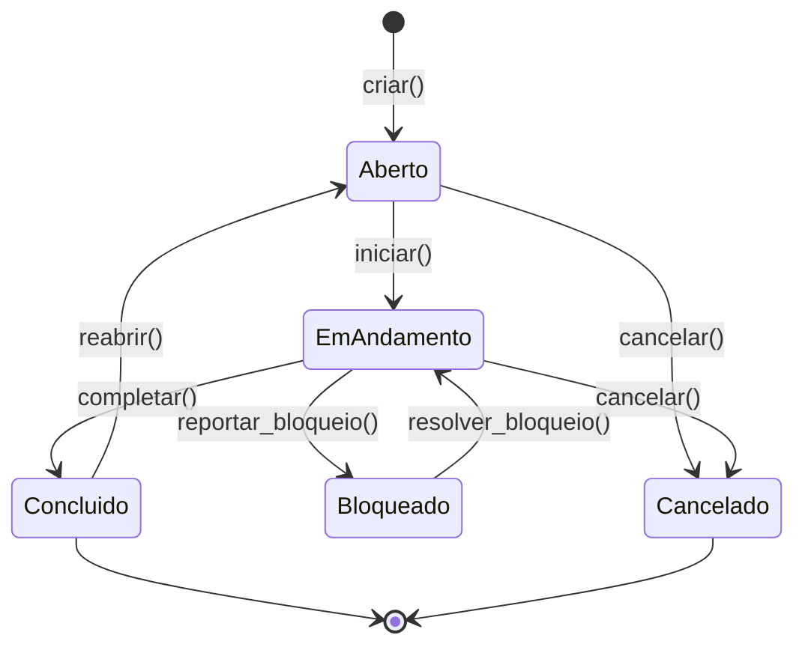
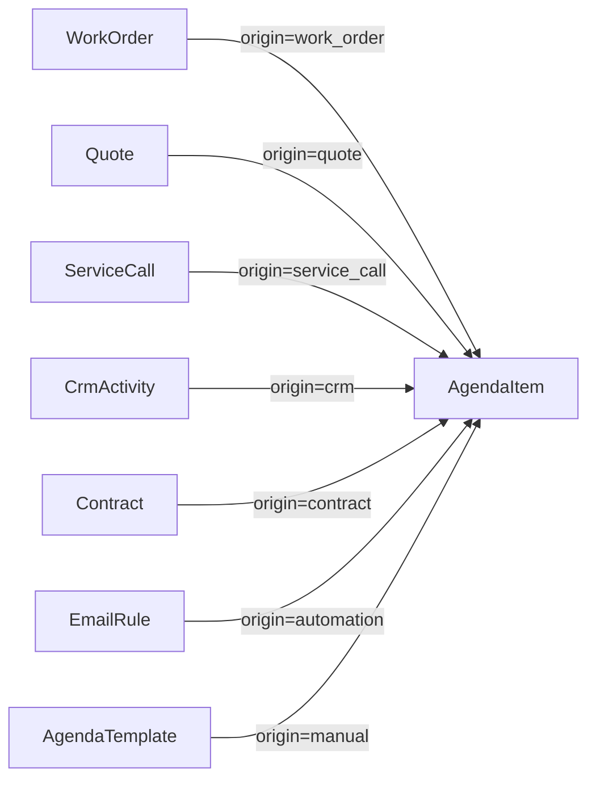

# Módulo: Agenda & Gestão de Tarefas

> **[AI_RULE]** Lista oficial de entidades (Models) associadas a este domínio no Laravel. Este módulo é o centro unificado de tarefas, eventos, lembretes e acompanhamento — alimentado automaticamente por WorkOrders, CRM, Helpdesk, Contracts, HR e Quotes. Tabela física: `central_items` (e relacionadas `central_*`).

---

## 1. Visão Geral

O módulo Agenda provê uma visão unificada de todas as atividades do ERP:

- **Tipos de item:** Tarefa (task), OS, Orçamento, Chamado, Lembrete, Calibração, Contrato
- **Origens:** Manual, WorkOrder, ServiceCall, CRM, Automation, Quote, Contract
- **Visibilidade:** Privada, Equipe (departamento), Pública
- **Subtarefas** com checklist e tracking de conclusão
- **Time Entries** com timestamps explícitos (sem duração manual)
- **Watchers** com preferências de notificação granulares
- **Regras de automação** event-driven (não cron)
- **Templates** reutilizáveis com subtarefas, watchers e tags pré-definidos
- **Histórico append-only** de todas as mudanças
- **SLA tracking** com `sla_due_at` e alertas
- **Recorrência** com `recurrence_next_at`

---

## 2. Entidades (Models)

### 2.1 `AgendaItem`

**Arquivo:** `backend/app/Models/AgendaItem.php`
**Tabela:** `central_items`
**Traits:** `HasFactory`, `SoftDeletes`, `BelongsToTenant`

| Campo | Tipo | Descrição |
|-------|------|-----------|
| `id` | int (PK) | Identificador |
| `tenant_id` | int (FK) | Tenant |
| `tipo` | enum `AgendaItemType` | Tipo do item |
| `titulo` | string\|null | Título |
| `descricao_curta` | string\|null | Descrição resumida |
| `status` | enum `AgendaItemStatus` | Status atual |
| `prioridade` | enum `AgendaItemPriority` | Prioridade |
| `origem` | enum `AgendaItemOrigin` | Origem do item |
| `visibilidade` | enum `AgendaItemVisibility` | Visibilidade |
| `due_at` | timestamp\|null | Prazo |
| `remind_at` | timestamp\|null | Lembrete agendado |
| `remind_notified_at` | timestamp\|null | Lembrete já disparado |
| `snooze_until` | timestamp\|null | Soneca até |
| `sla_due_at` | timestamp\|null | Prazo de SLA |
| `closed_at` | timestamp\|null | Data de conclusão |
| `recurrence_next_at` | timestamp\|null | Próxima recorrência |
| `responsavel_user_id` | int\|null (FK) | Responsável |
| `criado_por_user_id` | int\|null (FK) | Criador |
| `closed_by` | int\|null (FK) | Quem fechou |
| `ref_tipo` | string\|null | Tipo do model de origem (morph) |
| `ref_id` | int\|null | ID do model de origem (morph) |
| `contexto` | json\|null | Dados extras de contexto |
| `tags` | json\|null | Tags (cast `array`) |
| `visibility_users` | json\|null | IDs de usuários com acesso (cast `array`) |
| `visibility_departments` | json\|null | IDs de departamentos com acesso (cast `array`) |
| `deleted_at` | timestamp\|null | Soft delete |

**Enums:**

| Enum | Valores |
|------|---------|
| `AgendaItemStatus` | `aberto`, `em_andamento`, `concluido`, `cancelado`, `bloqueado` |
| `AgendaItemPriority` | `baixa`, `media`, `alta`, `urgente` |
| `AgendaItemType` | `tarefa`, `os`, `orcamento`, `chamado`, `lembrete`, `calibracao`, `contrato` |
| `AgendaItemOrigin` | `manual`, `work_order`, `service_call`, `crm`, `automation`, `quote`, `contract` |
| `AgendaItemVisibility` | `privada`, `equipe`, `publica` |

**Accessors/Mutators:**

- `tipo` — Resolve enum com fallback para `LEMBRETE` se `REUNIAO`
- `status` — Resolve enum case-insensitive
- `prioridade` — Resolve enum case-insensitive
- `origem` — Resolve enum case-insensitive
- `visibilidade` — Resolve enum case-insensitive
- `completed` — Getter: `status === concluido`. Setter: altera status + `closed_at`
- `completedAt` — Alias para `closed_at`
- `user_id` — Legacy alias para `responsavel_user_id` / `criado_por_user_id`

**Scopes:**

- `scopeVisivelPara($userId, $departmentId)` — Filtra por visibilidade (privada do próprio, equipe do departamento, pública)

**Relationships:**

- `responsavel(): BelongsTo → User`
- `criadoPor(): BelongsTo → User`
- `closedByUser(): BelongsTo → User`
- `source(): MorphTo` (ref_tipo/ref_id — `WorkOrder`, `Quote`, `ServiceCall`, `PreventiveMaintenance`, `CustomerVisit`, `InternalMeeting`, `Training`, `Delivery`)
- `comments(): HasMany → AgendaItemComment`
- `history(): HasMany → AgendaItemHistory`
- `subtasks(): HasMany → AgendaSubtask`
- `attachments(): HasMany → AgendaAttachment`
- `timeEntries(): HasMany → AgendaTimeEntry`
- `watchers(): HasMany → AgendaItemWatcher`
- `watcherUsers(): BelongsToMany → User` (via watchers)
- `dependsOn(): BelongsToMany → AgendaItem`
- `blockers(): BelongsToMany → AgendaItem`

---

### 2.2 `AgendaSubtask`

**Arquivo:** `backend/app/Models/AgendaSubtask.php`
**Tabela:** `central_subtasks`
**Traits:** `BelongsToTenant`

| Campo | Tipo | Descrição |
|-------|------|-----------|
| `id` | int (PK) | Identificador |
| `tenant_id` | int (FK) | Tenant |
| `agenda_item_id` | int (FK) | Item pai |
| `titulo` | string | Título da subtarefa |
| `concluido` | boolean | Concluída |
| `ordem` | int | Ordem de exibição |
| `completed_by` | int\|null (FK) | Quem concluiu |
| `completed_at` | timestamp\|null | Data de conclusão |

**Relationships:**

- `item(): BelongsTo → AgendaItem`
- `completedByUser(): BelongsTo → User`

---

### 2.3 `AgendaTimeEntry`

**Arquivo:** `backend/app/Models/AgendaTimeEntry.php`
**Tabela:** `central_time_entries`
**Traits:** `BelongsToTenant`

| Campo | Tipo | Descrição |
|-------|------|-----------|
| `id` | int (PK) | Identificador |
| `tenant_id` | int (FK) | Tenant |
| `agenda_item_id` | int (FK) | Item pai |
| `user_id` | int (FK) | Usuário que registrou |
| `started_at` | timestamp | Início |
| `stopped_at` | timestamp\|null | Fim (null = em andamento) |
| `duration_seconds` | int\|null | Duração calculada em segundos |
| `descricao` | string\|null | Descrição do trabalho |

**Relationships:**

- `item(): BelongsTo → AgendaItem`
- `user(): BelongsTo → User`

---

### 2.4 `AgendaItemComment`

**Arquivo:** `backend/app/Models/AgendaItemComment.php`
**Tabela:** `central_item_comments`

| Campo | Tipo | Descrição |
|-------|------|-----------|
| `id` | int (PK) | Identificador |
| `agenda_item_id` | int (FK) | Item pai |
| `user_id` | int (FK) | Autor |
| `body` | text | Conteúdo do comentário |
| `created_at` | timestamp | Data |
| `updated_at` | timestamp | Última edição |

**Relationships:**

- `item(): BelongsTo → AgendaItem`
- `user(): BelongsTo → User`

---

### 2.5 `AgendaItemHistory`

**Arquivo:** `backend/app/Models/AgendaItemHistory.php`
**Tabela:** `central_item_history`
**Timestamps:** `false` (append-only)

| Campo | Tipo | Descrição |
|-------|------|-----------|
| `id` | int (PK) | Identificador |
| `agenda_item_id` | int (FK) | Item pai |
| `user_id` | int\|null (FK) | Quem fez a mudança |
| `field` | string | Campo alterado (`status`, `prioridade`, `auto_assign`, `set_priority`, etc.) |
| `from_value` | string\|null | Valor anterior |
| `to_value` | string\|null | Novo valor |
| `created_at` | timestamp | Data da mudança |

**Relationships:**

- `item(): BelongsTo → AgendaItem`
- `user(): BelongsTo → User`

---

### 2.6 `AgendaItemWatcher`

**Arquivo:** `backend/app/Models/AgendaItemWatcher.php`
**Tabela:** `central_item_watchers`
**Traits:** `BelongsToTenant`

| Campo | Tipo | Descrição |
|-------|------|-----------|
| `id` | int (PK) | Identificador |
| `tenant_id` | int (FK) | Tenant |
| `agenda_item_id` / `central_item_id` | int (FK) | Item pai (detectado dinamicamente via `Schema::hasColumn`) |
| `user_id` | int (FK) | Usuário observador |
| `role` | string | Papel (`watcher`) — default `watcher` |
| `added_by_type` | string | Como foi adicionado (`manual`, `template`, `automation`) — default `manual` |
| `added_by_user_id` | int\|null (FK) | Quem adicionou |
| `notify_status_change` | boolean | Notificar mudanças de status |
| `notify_comment` | boolean | Notificar novos comentários |
| `notify_due_date` | boolean | Notificar prazos |
| `notify_assignment` | boolean | Notificar atribuições |

**Métodos estáticos:**

- `itemForeignKey(): string` — Detecta se a coluna FK é `agenda_item_id` ou `central_item_id`
- `itemForeignAttributes(int $itemId): array` — Retorna `[fk => $itemId]`

**Scopes:** `scopeNotifyOn($event)` — Filtra watchers que devem receber notificação para o evento

**Relationships:**

- `item(): BelongsTo → AgendaItem`
- `user(): BelongsTo → User`
- `addedBy(): BelongsTo → User`

---

### 2.7 `AgendaNotificationPreference`

**Arquivo:** `backend/app/Models/AgendaNotificationPreference.php`
**Tabela:** `central_notification_prefs`
**Traits:** `BelongsToTenant`

| Campo | Tipo | Descrição |
|-------|------|-----------|
| `id` | int (PK) | Identificador |
| `tenant_id` | int (FK) | Tenant |
| `user_id` | int (FK) | Usuário |
| `notify_assigned_to_me` | boolean | Notificar quando atribuído a mim |
| `notify_created_by_me` | boolean | Notificar mudanças em itens que criei |
| `notify_watching` | boolean | Notificar itens que estou observando |
| `notify_mentioned` | boolean | Notificar quando mencionado |
| `channel_in_app` | string | Canal in-app (`on`, `off`, `digest`) |
| `channel_email` | string | Canal email (`on`, `off`, `digest`) |
| `channel_push` | string | Canal push (`on`, `off`, `digest`) |
| `quiet_hours` | json\|null | Horário silencioso `{"start": "22:00", "end": "07:00"}` |
| `notify_types` | json\|null | Tipos de item a notificar (ex: `["OS", "TAREFA", "LEMBRETE"]`) |
| `pwa_mode` | string\|null | Modo PWA (`tecnico`, `vendedor`, `gestao`) |

**Métodos:**

- `forUser(int $userId, int $tenantId): self` — Cria ou retorna preferência com defaults
- `isChannelEnabled(string $channel): bool` — Verifica se canal está `on` ou `digest`
- `isInQuietHours(): bool` — Verifica se está em horário silencioso
- `shouldNotifyForType(string $itemType): bool` — Verifica se tipo está na lista

**Defaults por modo PWA:**

```php
'tecnico' => ['OS', 'CHAMADO', 'TAREFA', 'LEMBRETE', 'CALIBRACAO'],
'vendedor' => ['ORCAMENTO', 'TAREFA', 'LEMBRETE', 'CONTRATO'],
'gestao' => [], // recebe tudo
```

---

### 2.8 `AgendaRule`

**Arquivo:** `backend/app/Models/AgendaRule.php`
**Tabela:** `central_rules`
**Traits:** `BelongsToTenant`

| Campo | Tipo | Descrição |
|-------|------|-----------|
| `id` | int (PK) | Identificador |
| `tenant_id` | int (FK) | Tenant |
| `nome` | string | Nome da regra |
| `descricao` | string\|null | Descrição |
| `ativo` | boolean | Ativa |
| `evento_trigger` | string | Evento que dispara (ex: `status_changed`, `item_created`) |
| `tipo_item` | string\|null | Filtro por tipo de item |
| `status_trigger` | string\|null | Filtro por status |
| `prioridade_minima` | string\|null | Filtro por prioridade mínima |
| `acao_tipo` | string | Tipo de ação (`auto_assign`, `set_priority`, `set_due`, `notify`) |
| `acao_config` | json | Configuração da ação (ex: `{"prioridade": "alta"}`, `{"horas": 24}`) |
| `responsavel_user_id` | int\|null (FK) | Usuário alvo (para auto_assign) |
| `role_alvo` | string\|null | Role alvo (para auto_assign por role) |
| `created_by` | int\|null (FK) | Criador |

**Scopes:**

- `scopeAtivas` — Filtra regras ativas
- `scopeParaEvento($evento)` — Filtra por evento trigger

**Relationships:**

- `responsavel(): BelongsTo → User`
- `creator(): BelongsTo → User`

---

### 2.9 `AgendaTemplate`

**Arquivo:** `backend/app/Models/AgendaTemplate.php`
**Tabela:** `central_templates`
**Traits:** `BelongsToTenant`, `HasFactory`

| Campo | Tipo | Descrição |
|-------|------|-----------|
| `id` | int (PK) | Identificador |
| `tenant_id` | int (FK) | Tenant |
| `nome` | string | Nome do template |
| `descricao` | string\|null | Descrição |
| `tipo` | string | Tipo de item a criar |
| `prioridade` | string | Prioridade padrão |
| `visibilidade` | string | Visibilidade padrão |
| `subtasks` | json\|null | Lista de subtarefas pré-definidas (cast `array`) |
| `default_watchers` | json\|null | IDs de watchers padrão (cast `array`) |
| `tags` | json\|null | Tags padrão (cast `array`) |
| `due_days` | int\|null | Prazo em dias a partir da criação |
| `ativo` | boolean | Template ativo |
| `created_by` | int\|null (FK) | Criador |

**Método principal:**

```php
public function gerarItem(int $responsavelId, array $overrides = []): AgendaItem
```

Este método:

1. Cria `AgendaItem` com dados do template + overrides
2. Cria `AgendaSubtask` para cada subtask pré-definida
3. Cria `AgendaItemWatcher` para cada default_watcher + criador + responsável

---

### 2.10 `AgendaAttachment`

**Arquivo:** `backend/app/Models/AgendaAttachment.php`
**Tabela:** `central_attachments`
**Traits:** `BelongsToTenant`

| Campo | Tipo | Descrição |
|-------|------|-----------|
| `id` | int (PK) | Identificador |
| `tenant_id` | int (FK) | Tenant |
| `agenda_item_id` | int (FK) | Item pai |
| `nome` | string | Nome do arquivo |
| `path` | string | Caminho no storage |
| `mime_type` | string | Tipo MIME |
| `size` | int | Tamanho em bytes |
| `uploaded_by` | int\|null (FK) | Quem fez upload |

**Relationships:**

- `item(): BelongsTo → AgendaItem`
- `uploader(): BelongsTo → User`

---

## 3. Services

### 3.1 `AgendaService`

**Arquivo:** `backend/app/Services/AgendaService.php`

Service principal para CRUD e consultas da agenda.

**Métodos:**

- `listar(array $filters, int $perPage = 20): LengthAwarePaginator` — Listagem com filtros e visibilidade
- `resumo(): array` — Dashboard com contadores (total aberto, em andamento, taxa conclusão, avg atraso horas)
- `criar(array $data): AgendaItem`
- `atualizar(AgendaItem $item, array $data): AgendaItem`
- `completar(AgendaItem $item): AgendaItem`
- `comentar(AgendaItem $item, string $body): AgendaItemComment`

**Filtros suportados:**

- `search` — Busca em `titulo`, `descricao_curta`, `ref_id`
- `tipo` — Filtro por tipo enum
- `status` — Filtro por status (aceita array)
- `prioridade` — Filtro por prioridade
- `responsavel_user_id` / `responsavel` — Filtro por responsável
- `scope=minhas` / `only_mine` — Apenas do usuário
- `criado_por_user_id` — Filtro por criador
- `date_from`, `date_to` — Range de datas
- `sort_by`, `sort_dir` — Ordenação

### 3.2 `AgendaAutomationService`

**Arquivo:** `backend/app/Services/AgendaAutomationService.php`

Processa regras de automação quando eventos ocorrem em `AgendaItem`.

**Ações suportadas:**

| Ação | Descrição |
|------|-----------|
| `auto_assign` | Atribui responsável automaticamente (por user_id ou role) |
| `set_priority` | Define prioridade automaticamente |
| `set_due` | Define prazo (`due_at = now() + horas`) |
| `notify` | Envia notificação |

---

## 4. Ciclo de Vida de Tarefa



---

## 5. Sincronização Cross-Domain

Outros módulos criam/atualizam `AgendaItem` automaticamente:



**Mapeamento de status (Quote → AgendaItem):**

```php
QuoteStatus::DRAFT → AgendaItemStatus::ABERTO
QuoteStatus::SENT → AgendaItemStatus::EM_ANDAMENTO
QuoteStatus::APPROVED → AgendaItemStatus::CONCLUIDO
QuoteStatus::REJECTED → AgendaItemStatus::CANCELADO
```

---

## 6. Guard Rails de Negócio `[AI_RULE]`

> **[AI_RULE] Automação Event-Driven**
> As `AgendaRule` (regras de automação) DEVEM ser processadas via events/listeners, nunca por polling/cron. Cada regra define trigger (ex: `status_changed`), condição (tipo_item, status_trigger, prioridade_minima) e ação (`auto_assign`, `set_priority`, `set_due`, `notify`).

> **[AI_RULE] Time Entries Estruturados**
> `AgendaTimeEntry` DEVE possuir `started_at` (timestamp) e `stopped_at` (timestamp). O campo `duration_seconds` é calculado. A IA NÃO deve aceitar campo de "duração manual" sem timestamps explícitos. Se `stopped_at` é null, o timer está em andamento.

> **[AI_RULE] Histórico Append-Only**
> Toda mudança em `AgendaItem` gera registro em `AgendaItemHistory` via `registrarHistorico()`. Campos: `field`, `from_value`, `to_value`, `user_id`. Este histórico é **append-only** — registros NUNCA são editados ou deletados. `timestamps = false` — apenas `created_at`.

> **[AI_RULE] Watchers e Notificações Granulares**
> `AgendaItemWatcher` permite que usuários "sigam" tarefas com preferências individuais: `notify_status_change`, `notify_comment`, `notify_due_date`, `notify_assignment`. Mudanças disparam notificações conforme `AgendaNotificationPreference` do watcher (canais, quiet hours, tipos de item).

> **[AI_RULE] Visibilidade por Departamento**
> A `visibilidade` controla quem pode ver o item: `privada` (apenas responsável/criador/watchers), `equipe` (departamento), `publica` (todos do tenant). O scope `visivelPara` aplica esta lógica.

> **[AI_RULE] Tabela Física `central_items`**
> A tabela real é `central_items` (não `agenda_items`). FK podem ser `agenda_item_id` ou `central_item_id` dependendo da migration. O `AgendaItemWatcher` detecta dinamicamente via `Schema::hasColumn`.

### 6.1 Edge Cases e Tratamento de Erros `[CRITICAL]`

| Cenário de Falha | Prevenção / Tratamento | Guardrails de Código Esperados |
| :--- | :--- | :--- |
| **Loops de Automação Infinitos** | Regras do tipo "Se status mudar para A, defina priority=Alta" vs "Se priority=Alta, mude status para A". | `AgendaAutomationService` deve limitar a profundidade de recursão de eventos (max 3 triggers sequenciais). |
| **Time Entries Sobrepostos** | Técnico esquece timer anterior ligado e inicia outro na mesma tarefa. | `StoreTimeEntryRequest` bloqueia se existir um timer com `stopped_at = null` para o mesmo `user_id` e ticket. |
| **Watchers Duplicados** | Dois processos (automação e menção) tentam adicionar o mesmo usuário como watcher simultaneamente. | A tabela `central_item_watchers` DEVE ter chave única `(tenant_id, item_id, user_id)`. Usar `updateOrCreate()`. |
| **Mudança em Lote Parcialmente Falha** | `BulkUpdate` processa 10 itens, falha no 5º. O sistema deve abortar tudo ou aplicar sucessos e retornar falhas parciais informativas. | Padrão AIDD exige "Tudo ou Nada": envolver tudo em `DB::transaction()` no Service, revertendo em qualquer exception. |
| **Exclusão de Template em Uso** | Admin tenta deletar `AgendaTemplate` que tem itens ativos dependentes de suas automações invisíveis. | `AgendaTemplate` DEVE usar SoftDeletes (`deleted_at`), pois tarefas históricas podem apontar `created_by_template_id` (se existir). |

---

## 7. Comportamento Integrado (Cross-Domain)

| Módulo | Integração |
|--------|-----------|
| **WorkOrders** | OS criada/atualizada cria/atualiza `AgendaItem` com `origem = work_order`, `ref_tipo = WorkOrder`. Status mapeado automaticamente. |
| **Quotes** | Orçamento cria `AgendaItem` com `origem = quote`. Status mapeado via `centralSyncData()` no model Quote. |
| **Contracts** | Contratos com manutenção preventiva criam `AgendaItem` com `origem = contract` para agendar visitas. |
| **Helpdesk** | ServiceCall pode gerar tarefa de acompanhamento com `origem = service_call`. |
| **CRM** | `CrmFollowUpTask` é espelhado como `AgendaItem` com `origem = crm` para visão unificada do vendedor. |
| **HR** | Férias aprovadas criam lembrete na agenda. Entrevistas de recrutamento criam item com tipo adequado. |
| **Email** | `EmailRule` com ação `create_task` cria `AgendaItem` com `origem = automation`. |
| **Calibration** | Calibrações vencendo criam lembrete na agenda. |

---

## 8. Endpoints da API

### 8.1 Agenda Items

```json
{
  "GET /api/v1/agenda": { "query": "search, tipo, status[], prioridade, responsavel_user_id, scope, date_from, date_to, sort_by, sort_dir, per_page", "middleware": "check.permission:agenda.item.view", "status": 200 },
  "GET /api/v1/agenda/resumo": { "response": { "total_aberto": "int", "em_andamento": "int", "taxa_conclusao": "float", "avg_atraso_horas": "float" }, "middleware": "check.permission:agenda.item.view", "status": 200 },
  "POST /api/v1/agenda": { "body": "titulo, tipo, prioridade, responsavel_user_id, due_at, descricao_curta, visibilidade, tags", "middleware": "check.permission:agenda.create.task", "status": 201 },
  "GET /api/v1/agenda/{id}": { "middleware": "check.permission:agenda.item.view", "status": 200 },
  "PUT /api/v1/agenda/{id}": { "middleware": "check.permission:agenda.close.self", "status": 200 },
  "PUT /api/v1/agenda/{id}/complete": { "middleware": "check.permission:agenda.close.self|agenda.close.any", "status": 200 },
  "DELETE /api/v1/agenda/{id}": { "middleware": "check.permission:agenda.close.self", "status": 204 }
}
```

### 8.2 Agenda Items (rota alternativa)

```json
{
  "GET /api/v1/agenda-items": { "alias de GET /api/v1/agenda" },
  "GET /api/v1/agenda-items/summary": { "alias de GET /api/v1/agenda/resumo" },
  "POST /api/v1/agenda-items": { "alias de POST /api/v1/agenda" },
  "GET /api/v1/agenda-items/{id}": { "alias de GET /api/v1/agenda/{id}" },
  "POST /api/v1/agenda-items/{id}/comments": { "body": "body", "status": 201 },
  "POST /api/v1/agenda-items/{id}/subtasks": { "body": "titulo", "status": 201 },
  "PUT /api/v1/agenda-items/{id}/subtasks/{subtaskId}": { "body": "concluido", "status": 200 },
  "POST /api/v1/agenda-items/{id}/time-entries": { "body": "started_at, stopped_at, descricao", "status": 201 },
  "POST /api/v1/agenda-items/{id}/watchers": { "body": "user_id", "status": 201 },
  "DELETE /api/v1/agenda-items/{id}/watchers/{watcherId}": { "status": 204 }
}
```

---

## 9. Form Requests (Validacao de Entrada)

> **[AI_RULE]** Todo endpoint de criacao/atualizacao DEVE usar Form Request. Validacao inline em controllers e PROIBIDA. Tabela fisica: `central_items`.

### 9.1 StoreAgendaItemRequest

**Classe**: `App\Http\Requests\Agenda\StoreAgendaItemRequest`
**Endpoint**: `POST /api/v1/agenda`

```php
public function authorize(): bool
{
    return $this->user()->can('agenda.create.task');
}

public function rules(): array
{
    return [
        'titulo'              => ['required', 'string', 'max:255'],
        'tipo'                => ['required', 'string', Rule::in(AgendaItemType::values())],
        'prioridade'          => ['required', 'string', Rule::in(AgendaItemPriority::values())],
        'responsavel_user_id' => ['nullable', 'integer', 'exists:users,id'],
        'due_at'              => ['nullable', 'date', 'after:now'],
        'descricao_curta'     => ['nullable', 'string', 'max:1000'],
        'visibilidade'        => ['nullable', 'string', Rule::in(AgendaItemVisibility::values())],
        'tags'                => ['nullable', 'array'],
        'tags.*'              => ['string', 'max:50'],
    ];
}
```

### 9.2 UpdateAgendaItemRequest

**Classe**: `App\Http\Requests\Agenda\UpdateAgendaItemRequest`
**Endpoint**: `PUT /api/v1/agenda/{id}`

```php
public function authorize(): bool
{
    return $this->user()->can('agenda.close.self');
}

public function rules(): array
{
    return [
        'titulo'              => ['sometimes', 'string', 'max:255'],
        'prioridade'          => ['sometimes', 'string', Rule::in(AgendaItemPriority::values())],
        'status'              => ['sometimes', 'string', Rule::in(AgendaItemStatus::values())],
        'responsavel_user_id' => ['nullable', 'integer', 'exists:users,id'],
        'due_at'              => ['nullable', 'date'],
        'descricao_curta'     => ['nullable', 'string', 'max:1000'],
        'visibilidade'        => ['nullable', 'string', Rule::in(AgendaItemVisibility::values())],
        'tags'                => ['nullable', 'array'],
        'tags.*'              => ['string', 'max:50'],
    ];
}
```

> **[AI_RULE]** Toda alteracao de `status` e `prioridade` DEVE gerar registro em `AgendaItemHistory` via `registrarHistorico()`.

### 9.3 CompleteAgendaItemRequest

**Classe**: `App\Http\Requests\Agenda\CompleteAgendaItemRequest`
**Endpoint**: `PUT /api/v1/agenda/{id}/complete`

```php
public function authorize(): bool
{
    return $this->user()->can('agenda.close.self')
        || $this->user()->can('agenda.close.any');
}

public function rules(): array
{
    return [];
}
```

> **[AI_RULE]** Controller DEVE validar que o status atual permite conclusao (apenas `aberto` ou `em_andamento` → `concluido`). Status terminais (`concluido`, `cancelado`) NAO podem ser concluidos novamente.

### 9.4 StoreCommentRequest

**Classe**: `App\Http\Requests\Agenda\StoreCommentRequest`
**Endpoint**: `POST /api/v1/agenda-items/{id}/comments`

```php
public function authorize(): bool
{
    return $this->user() !== null;
}

public function rules(): array
{
    return [
        'body' => ['required', 'string', 'max:10000'],
    ];
}
```

### 9.5 StoreSubtaskRequest

**Classe**: `App\Http\Requests\Agenda\StoreSubtaskRequest`
**Endpoint**: `POST /api/v1/agenda-items/{id}/subtasks`

```php
public function authorize(): bool
{
    return $this->user() !== null;
}

public function rules(): array
{
    return [
        'titulo' => ['required', 'string', 'max:255'],
    ];
}
```

### 9.6 UpdateSubtaskRequest

**Classe**: `App\Http\Requests\Agenda\UpdateSubtaskRequest`
**Endpoint**: `PUT /api/v1/agenda-items/{id}/subtasks/{subtaskId}`

```php
public function authorize(): bool
{
    return $this->user() !== null;
}

public function rules(): array
{
    return [
        'concluido' => ['required', 'boolean'],
    ];
}
```

> **[AI_RULE]** Ao marcar `concluido = true`, o controller DEVE preencher `completed_by` e `completed_at` automaticamente.

### 9.7 StoreTimeEntryRequest

**Classe**: `App\Http\Requests\Agenda\StoreTimeEntryRequest`
**Endpoint**: `POST /api/v1/agenda-items/{id}/time-entries`

```php
public function authorize(): bool
{
    return $this->user() !== null;
}

public function rules(): array
{
    return [
        'started_at' => ['required', 'date'],
        'stopped_at' => ['nullable', 'date', 'after:started_at'],
        'descricao'  => ['nullable', 'string', 'max:500'],
    ];
}
```

> **[AI_RULE]** `duration_seconds` e calculado automaticamente pelo model. Se `stopped_at` e null, o timer esta em andamento. A IA NAO deve aceitar campo de duracao manual sem timestamps.

### 9.8 StoreWatcherRequest

**Classe**: `App\Http\Requests\Agenda\StoreWatcherRequest`
**Endpoint**: `POST /api/v1/agenda-items/{id}/watchers`

```php
public function authorize(): bool
{
    return $this->user() !== null;
}

public function rules(): array
{
    return [
        'user_id' => ['required', 'integer', 'exists:users,id'],
    ];
}
```

---

## 10. Stack Técnica

| Componente | Tecnologia |
|------------|-----------|
| **Tabela** | `central_items` (+ `central_subtasks`, `central_time_entries`, `central_item_comments`, `central_item_history`, `central_item_watchers`, `central_notification_prefs`, `central_rules`, `central_templates`, `central_attachments`) |
| **Enums** | `AgendaItemStatus`, `AgendaItemPriority`, `AgendaItemType`, `AgendaItemOrigin`, `AgendaItemVisibility` |
| **Automação** | `AgendaAutomationService` via Events/Listeners |
| **Notificações** | `AgendaItemWatcher` + `AgendaNotificationPreference` → `Notification` model |
| **Cross-domain** | Models de outros módulos implementam `centralSyncData()` para mapear status |

---

### Endpoints Rest (Extraídos do Backend)

| Método | Rota | Controller | Ação |
|--------|------|------------|------|
| `GET` | `/api/v1/agenda` | `AgendaController@index` | Listar |
| `GET` | `/api/v1/agenda/{id}` | `AgendaController@show` | Detalhes |
| `POST` | `/api/v1/agenda` | `AgendaController@store` | Criar |
| `PUT` | `/api/v1/agenda/{id}` | `AgendaController@update` | Atualizar |
| `DELETE` | `/api/v1/agenda/{id}` | `AgendaController@destroy` | Excluir |

## 11. Cenários BDD

### Cenário 1: CRUD de item na agenda

```gherkin
Funcionalidade: CRUD de Agenda Item

  Cenário: Criar tarefa manual com prioridade e prazo
    Dado que o usuario tem permissão "agenda.create.task"
    Quando faz POST /api/v1/agenda com titulo="Ligar para cliente", tipo="tarefa", prioridade="alta", due_at="2026-04-01T10:00:00"
    Então recebe status 201
    E AgendaItem é criado com status="aberto", origem="manual"
    E AgendaItemHistory registra field="status", to_value="aberto"

  Cenário: Completar tarefa muda status e preenche closed_at
    Dado que AgendaItem id=1 tem status="em_andamento"
    Quando faz PUT /api/v1/agenda/1/complete
    Então status muda para "concluido"
    E closed_at é preenchido com now()
    E closed_by é preenchido com user autenticado

  Cenário: Tentar completar tarefa já concluída retorna erro
    Dado que AgendaItem id=1 tem status="concluido"
    Quando faz PUT /api/v1/agenda/1/complete
    Então recebe status 422
    E a mensagem contém "status terminal não permite conclusão"
```

### Cenário 2: Visibilidade por departamento

```gherkin
Funcionalidade: Visibilidade de Agenda Item

  Cenário: Item privado visível apenas para responsável e criador
    Dado que AgendaItem id=1 tem visibilidade="privada" e responsavel_user_id=5
    Quando usuario id=10 (outro departamento) faz GET /api/v1/agenda
    Então AgendaItem id=1 NÃO aparece na listagem (scopeVisivelPara filtra)

  Cenário: Item equipe visível para mesmo departamento
    Dado que AgendaItem id=2 tem visibilidade="equipe" e visibility_departments=[3]
    E que usuario id=10 pertence ao departamento 3
    Quando faz GET /api/v1/agenda
    Então AgendaItem id=2 aparece na listagem
```

### Cenário 3: Subtarefas com checklist

```gherkin
Funcionalidade: Subtarefas da Agenda

  Cenário: Criar subtarefa e concluir
    Dado que AgendaItem id=1 existe
    Quando faz POST /api/v1/agenda-items/1/subtasks com titulo="Preparar relatório"
    Então AgendaSubtask é criada com concluido=false, ordem=1

    Quando faz PUT /api/v1/agenda-items/1/subtasks/{id} com concluido=true
    Então completed_by é preenchido automaticamente
    E completed_at é preenchido automaticamente
```

### Cenário 4: Time entries com timestamps obrigatórios

```gherkin
Funcionalidade: Time Entries Estruturados

  Cenário: Registrar tempo com start e stop
    Dado que AgendaItem id=1 existe
    Quando faz POST /api/v1/agenda-items/1/time-entries com started_at="2026-03-25T09:00:00", stopped_at="2026-03-25T10:30:00"
    Então AgendaTimeEntry é criado com duration_seconds=5400 (calculado)

  Cenário: Timer em andamento (sem stopped_at)
    Quando faz POST /api/v1/agenda-items/1/time-entries com started_at="2026-03-25T14:00:00", stopped_at=null
    Então AgendaTimeEntry é criado com stopped_at=null e duration_seconds=null
    E indica timer em andamento
```

### Cenário 5: Regras de automação event-driven

```gherkin
Funcionalidade: Automação de Agenda

  Cenário: Auto-assign ao criar item urgente
    Dado que existe AgendaRule ativa com evento_trigger="item_created", prioridade_minima="urgente", acao_tipo="auto_assign", responsavel_user_id=5
    Quando AgendaItem é criado com prioridade="urgente"
    Então AgendaAutomationService processa a regra
    E responsavel_user_id é automaticamente definido como 5
    E AgendaItemHistory registra field="auto_assign"

  Cenário: Set due automático
    Dado que existe AgendaRule com acao_tipo="set_due", acao_config={"horas": 24}
    Quando AgendaItem matcheia as condições da regra
    Então due_at é definido como now() + 24h
```

### Cenário 6: Sincronização cross-domain

```gherkin
Funcionalidade: Sincronização com Outros Módulos

  Cenário: WorkOrder cria AgendaItem automaticamente
    Dado que WorkOrder id=50 é criada com status="open"
    Quando trait SyncsWithAgenda é executado
    Então AgendaItem é criado com tipo="os", origem="work_order", ref_tipo="WorkOrder", ref_id=50

  Cenário: Quote muda status e sincroniza
    Dado que Quote id=10 muda status para APPROVED
    Quando centralSyncData() é chamado no model Quote
    Então AgendaItem vinculado muda status para "concluido"
    E AgendaItemHistory registra field="status", from="em_andamento", to="concluido"

  Cenário: Watchers notificados em mudança de status
    Dado que AgendaItem id=1 tem 3 watchers com notify_status_change=true
    Quando status muda de "aberto" para "em_andamento"
    Então 3 Notifications são criadas (uma por watcher)
    E watchers em quiet_hours NÃO recebem push (apenas in-app)
```

---

## Fluxos Relacionados

| Fluxo | Descrição |
|-------|-----------|
| [Chamado de Emergência](file:///c:/PROJETOS/sistema/docs/fluxos/CHAMADO-EMERGENCIA.md) | Processo documentado em `docs/fluxos/CHAMADO-EMERGENCIA.md` |
| [Despacho e Atribuição](file:///c:/PROJETOS/sistema/docs/fluxos/DESPACHO-ATRIBUICAO.md) | Processo documentado em `docs/fluxos/DESPACHO-ATRIBUICAO.md` |
| [Falha de Calibração](file:///c:/PROJETOS/sistema/docs/fluxos/FALHA-CALIBRACAO.md) | Processo documentado em `docs/fluxos/FALHA-CALIBRACAO.md` |
| [Integrações Externas](file:///c:/PROJETOS/sistema/docs/fluxos/INTEGRACOES-EXTERNAS.md) | Processo documentado em `docs/fluxos/INTEGRACOES-EXTERNAS.md` |
| [Manutenção Preventiva](file:///c:/PROJETOS/sistema/docs/fluxos/MANUTENCAO-PREVENTIVA.md) | Processo documentado em `docs/fluxos/MANUTENCAO-PREVENTIVA.md` |
| [Onboarding de Cliente](file:///c:/PROJETOS/sistema/docs/fluxos/ONBOARDING-CLIENTE.md) | Processo documentado em `docs/fluxos/ONBOARDING-CLIENTE.md` |
| [Operação Diária](file:///c:/PROJETOS/sistema/docs/fluxos/OPERACAO-DIARIA.md) | Processo documentado em `docs/fluxos/OPERACAO-DIARIA.md` |
| [PWA Offline Sync](file:///c:/PROJETOS/sistema/docs/fluxos/PWA-OFFLINE-SYNC.md) | Processo documentado em `docs/fluxos/PWA-OFFLINE-SYNC.md` |
| [Relatórios Gerenciais](file:///c:/PROJETOS/sistema/docs/fluxos/RELATORIOS-GERENCIAIS.md) | Processo documentado em `docs/fluxos/RELATORIOS-GERENCIAIS.md` |
| [Técnico Indisponível](file:///c:/PROJETOS/sistema/docs/fluxos/TECNICO-INDISPONIVEL.md) | Processo documentado em `docs/fluxos/TECNICO-INDISPONIVEL.md` |
| [Técnico em Campo](file:///c:/PROJETOS/sistema/docs/fluxos/TECNICO-EM-CAMPO.md) | Processo documentado em `docs/fluxos/TECNICO-EM-CAMPO.md` |

---

## Inventario Completo do Codigo

> **[AI_RULE]** Secao gerada automaticamente a partir do codigo-fonte. Lista todos os artefatos reais do modulo Agenda no repositorio.

### Listeners — CreateAgendaItem (6 arquivos)

| Arquivo | Classe | Evento Ouvido | Descricao |
|---------|--------|---------------|-----------|
| `backend/app/Listeners/CreateAgendaItemOnWorkOrder.php` | `CreateAgendaItemOnWorkOrder` | `WorkOrderStarted`, `WorkOrderCompleted` | Cria item de agenda quando OS inicia ou conclui |
| `backend/app/Listeners/CreateAgendaItemOnServiceCall.php` | `CreateAgendaItemOnServiceCall` | `ServiceCallCreated` | Cria item de agenda para chamado de servico |
| `backend/app/Listeners/CreateAgendaItemOnCalibration.php` | `CreateAgendaItemOnCalibration` | `CalibrationCreated` | Cria item de agenda para calibracao agendada |
| `backend/app/Listeners/CreateAgendaItemOnContract.php` | `CreateAgendaItemOnContract` | `ContractCreated` | Cria item de agenda para contrato novo |
| `backend/app/Listeners/CreateAgendaItemOnQuote.php` | `CreateAgendaItemOnQuote` | `QuoteApproved` | Cria item de agenda quando orcamento e aprovado |
| `backend/app/Listeners/CreateAgendaItemOnPayment.php` | `CreateAgendaItemOnPayment` | `PaymentReceived` | Cria item de agenda para pagamento recebido |

### Services (2 arquivos)

| Arquivo | Classe | Descricao |
|---------|--------|-----------|
| `backend/app/Services/AgendaService.php` | `AgendaService` | Logica de negocio central da agenda (CRUD, filtros, KPIs) |
| `backend/app/Services/AgendaAutomationService.php` | `AgendaAutomationService` | Motor de automacao event-driven para regras de agenda |

### Controller (1 arquivo)

**Arquivo:** `backend/app/Http/Controllers/Api/V1/AgendaController.php`
**Classe:** `AgendaController`

| Metodo | Descricao |
|--------|-----------|
| `index` | Listar itens com filtros (status, tipo, responsavel, periodo) |
| `store` | Criar item de agenda |
| `show` | Detalhar item |
| `update` | Atualizar item |
| `destroy` | Excluir item |
| `comment` | Adicionar comentario |
| `assign` | Atribuir responsavel |
| `complete` | Marcar como concluido |
| `constants` | Retornar enums (tipos, status, prioridades) |
| `summary` | Resumo quantitativo por status |
| `resumo` | Resumo simplificado |
| `kpis` | KPIs de produtividade |
| `workload` | Carga de trabalho por usuario |
| `overdueByTeam` | Atrasados por equipe |
| `rules` | Listar regras de automacao |
| `storeRule` | Criar regra |
| `updateRule` | Atualizar regra |
| `destroyRule` | Excluir regra |
| `bulkUpdate` | Atualizacao em lote |
| `export` | Exportar itens (CSV) |
| `subtasks` | Listar subtarefas |
| `storeSubtask` | Criar subtarefa |
| `updateSubtask` | Atualizar subtarefa |
| `destroySubtask` | Excluir subtarefa |
| `attachments` | Listar anexos |
| `storeAttachment` | Upload de anexo |
| `destroyAttachment` | Excluir anexo |
| `timeEntries` | Listar apontamentos de tempo |
| `startTimer` | Iniciar timer |
| `stopTimer` | Parar timer |
| `addDependency` | Adicionar dependencia entre itens |
| `removeDependency` | Remover dependencia |
| `listWatchers` | Listar observadores |
| `addWatchers` | Adicionar observadores |
| `updateWatcher` | Atualizar preferencias do observador |
| `destroyWatcher` | Remover observador |
| `toggleFollow` | Seguir/deixar de seguir item |
| `getNotificationPrefs` | Obter preferencias de notificacao |
| `updateNotificationPrefs` | Atualizar preferencias de notificacao |
| `listTemplates` | Listar templates |
| `storeTemplate` | Criar template |
| `updateTemplate` | Atualizar template |
| `destroyTemplate` | Excluir template |
| `useTemplate` | Gerar item a partir de template |
| `icalFeed` | Feed iCal para integracao com calendarios externos |

### FormRequests (18 arquivos)

| Arquivo | Classe |
|---------|--------|
| `backend/app/Http/Requests/Agenda/StoreAgendaItemRequest.php` | `StoreAgendaItemRequest` |
| `backend/app/Http/Requests/Agenda/UpdateAgendaItemRequest.php` | `UpdateAgendaItemRequest` |
| `backend/app/Http/Requests/Agenda/CommentAgendaItemRequest.php` | `CommentAgendaItemRequest` |
| `backend/app/Http/Requests/Agenda/AssignAgendaItemRequest.php` | `AssignAgendaItemRequest` |
| `backend/app/Http/Requests/Agenda/BulkUpdateAgendaItemsRequest.php` | `BulkUpdateAgendaItemsRequest` |
| `backend/app/Http/Requests/Agenda/StoreAgendaRuleRequest.php` | `StoreAgendaRuleRequest` |
| `backend/app/Http/Requests/Agenda/UpdateAgendaRuleRequest.php` | `UpdateAgendaRuleRequest` |
| `backend/app/Http/Requests/Agenda/StoreAgendaSubtaskRequest.php` | `StoreAgendaSubtaskRequest` |
| `backend/app/Http/Requests/Agenda/UpdateAgendaSubtaskRequest.php` | `UpdateAgendaSubtaskRequest` |
| `backend/app/Http/Requests/Agenda/StoreAgendaAttachmentRequest.php` | `StoreAgendaAttachmentRequest` |
| `backend/app/Http/Requests/Agenda/StoreAgendaTemplateRequest.php` | `StoreAgendaTemplateRequest` |
| `backend/app/Http/Requests/Agenda/UpdateAgendaTemplateRequest.php` | `UpdateAgendaTemplateRequest` |
| `backend/app/Http/Requests/Agenda/UseAgendaTemplateRequest.php` | `UseAgendaTemplateRequest` |
| `backend/app/Http/Requests/Agenda/AddAgendaDependencyRequest.php` | `AddAgendaDependencyRequest` |
| `backend/app/Http/Requests/Agenda/AddAgendaWatchersRequest.php` | `AddAgendaWatchersRequest` |
| `backend/app/Http/Requests/Agenda/UpdateAgendaWatcherRequest.php` | `UpdateAgendaWatcherRequest` |
| `backend/app/Http/Requests/Agenda/UpdateAgendaNotificationPrefsRequest.php` | `UpdateAgendaNotificationPrefsRequest` |
| `backend/app/Http/Requests/Agenda/StopAgendaTimerRequest.php` | `StopAgendaTimerRequest` |

### Models (10 arquivos)

| Arquivo | Classe | Relacionamentos/Metodos Principais |
|---------|--------|-----------------------------------|
| `backend/app/Models/AgendaItem.php` | `AgendaItem` | `responsavel`, `criadoPor`, `closedBy`, `comments`, `history`, `subtasks`, `attachments`, `timeEntries`, `watchers`, `watcherUsers`, `dependsOn`, `blockers`, `source`; Scopes: `atrasados`, `hoje`, `semPrazo`, `doUsuario`, `daEquipe`, `visivelPara`; Methods: `dispararPushSeNecessario`, `gerarNotificacao`, `registrarHistorico` |
| `backend/app/Models/AgendaItemComment.php` | `AgendaItemComment` | `item`, `user` |
| `backend/app/Models/AgendaItemHistory.php` | `AgendaItemHistory` | `item`, `user` |
| `backend/app/Models/AgendaItemWatcher.php` | `AgendaItemWatcher` | `item`, `user`, `addedBy`; Scope: `notifyOn`; Methods: `shouldNotify` |
| `backend/app/Models/AgendaSubtask.php` | `AgendaSubtask` | `item`, `completedByUser` |
| `backend/app/Models/AgendaAttachment.php` | `AgendaAttachment` | `item`, `uploader` |
| `backend/app/Models/AgendaTimeEntry.php` | `AgendaTimeEntry` | `item`, `user` |
| `backend/app/Models/AgendaNotificationPreference.php` | `AgendaNotificationPreference` | `user`, `tenant`; Methods: `isChannelEnabled`, `isInQuietHours`, `shouldNotifyForType` |
| `backend/app/Models/AgendaRule.php` | `AgendaRule` | `responsavel`, `creator`; Scopes: `ativas`, `paraEvento` |
| `backend/app/Models/AgendaTemplate.php` | `AgendaTemplate` | `creator`; Methods: `gerarItem` |

### Enums (5 arquivos)

| Arquivo | Enum | Valores |
|---------|------|---------|
| `backend/app/Enums/AgendaItemStatus.php` | `AgendaItemStatus` | `aberto`, `em_andamento`, `concluido`, `cancelado`, `bloqueado` |
| `backend/app/Enums/AgendaItemPriority.php` | `AgendaItemPriority` | `baixa`, `media`, `alta`, `urgente` |
| `backend/app/Enums/AgendaItemType.php` | `AgendaItemType` | `tarefa`, `os`, `orcamento`, `chamado`, `lembrete`, `calibracao`, `contrato` |
| `backend/app/Enums/AgendaItemOrigin.php` | `AgendaItemOrigin` | `manual`, `work_order`, `service_call`, `crm`, `automation`, `quote`, `contract` |
| `backend/app/Enums/AgendaItemVisibility.php` | `AgendaItemVisibility` | `privada`, `equipe`, `publica` |

### Rotas (arquivo: `backend/routes/api/missing-routes.php`)

| Metodo | Rota | Permissao | Controller Method |
|--------|------|-----------|-------------------|
| `GET` | `agenda` | `agenda.item.view` | `index` |
| `GET` | `agenda/resumo` | `agenda.item.view` | `resumo` |
| `POST` | `agenda` | `agenda.create.task` | `store` |
| `PUT` | `agenda/{agendaItem}/complete` | `agenda.close.self\|agenda.close.any` | `complete` |
| `GET` | `agenda/{agendaItem}` | `agenda.item.view` | `show` |
| `PUT` | `agenda/{agendaItem}` | `agenda.close.self` | `update` |
| `DELETE` | `agenda/{agendaItem}` | `agenda.close.self` | `destroy` |
| `GET` | `agenda-items` | `agenda.item.view` | `index` |
| `GET` | `agenda-items/summary` | `agenda.item.view` | `summary` |
| `POST` | `agenda-items` | `agenda.create.task` | `store` |
| `GET` | `agenda-items/{agendaItem}` | `agenda.item.view` | `show` |
| `POST` | `agenda-items/{agendaItem}/comments` | `agenda.item.view` | `comment` |
| `POST` | `agenda-items/{agendaItem}/assign` | `agenda.assign` | `assign` |
| `PUT` | `agenda-items/{agendaItem}` | `agenda.close.self` | `update` |
| `DELETE` | `agenda-items/{agendaItem}` | `agenda.close.self` | `destroy` |

> **Nota:** Rotas adicionais para subtasks, watchers, templates, time entries, dependencies, notification prefs, export e icalFeed estao definidas no mesmo arquivo de rotas com permissoes granulares.

## Checklist de Implementacao

- [ ] Model `Schedule`: Migrations com colunas `start_at`, `end_at` e timezone local.
- [ ] Trait Sincronizadora: Garantir que `SyncsWithAgenda` dispare eventos do Laravel (`saved`, `deleted`) criando cópias no modulo principal de calendário.
- [ ] Controle de Conflitos: O FormRequest de Agendamentos deve injetar regras SQL para `whereBetween` conferindo choques de horário do mesmo técnico/recurso.
- [ ] Notificações: Injetar Dispatch de `Job` assíncrono para enviar notificação aos usuários (`Email` ou `Push`) meia-hora antes da agenda.
