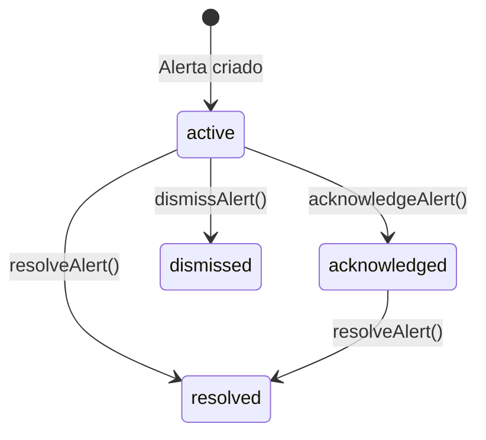

# Modulo: Alertas do Sistema

> **[AI_RULE]** Documentacao oficial do modulo de Alertas. Toda entidade, campo, estado e regra aqui descritos sao extraidos diretamente do codigo-fonte e devem ser respeitados por qualquer agente de IA.

---

## 1. Visao Geral

O modulo Alerts centraliza a gestao de alertas automaticos e manuais da plataforma. Qualquer modulo pode disparar alertas via `AlertEngineService`, que executa verificacoes periodicas e gera `SystemAlert` conforme regras configuradas por tenant. Inclui suporte a agrupamento, exportacao CSV, reconhecimento (acknowledge), resolucao e descarte de alertas.

### Principios Fundamentais

- **Cross-domain**: qualquer modulo pode disparar alertas via `AlertEngineService`
- **Configuravel por tenant**: cada tenant personaliza thresholds e severidades via `AlertConfiguration`
- **Rastreabilidade**: alertas registram quem reconheceu (`acknowledged_by`) e quando foi resolvido
- **Multi-tenant isolado**: toda query filtra por `tenant_id`

---

## 2. Entidades (Models) — Campos Completos

### 2.1 `SystemAlert`

Alerta gerado pelo sistema ou manualmente.

| Campo | Tipo | Descricao |
|---|---|---|
| `tenant_id` | bigint | Tenant |
| `alert_type` | string | Tipo do alerta (ex: `stock_low`, `overdue_invoice`, `sla_breach`) |
| `severity` | string | `critical`, `high`, `medium`, `low` |
| `title` | string | Titulo do alerta |
| `message` | text | Mensagem detalhada |
| `status` | string | `active`, `acknowledged`, `resolved`, `dismissed` |
| `alertable_type` | string | Tipo da entidade polimorfic (morph) |
| `alertable_id` | bigint | ID da entidade polimorfic |
| `acknowledged_by` | bigint FK | Usuario que reconheceu |
| `acknowledged_at` | datetime | Data/hora do reconhecimento |
| `resolved_at` | datetime | Data/hora da resolucao |
| `created_at` | datetime | Data de criacao |

**Scopes:**`active()`**Relacionamentos:**

- `morphTo` alertable (polimorfic — qualquer entidade)
- `belongsTo` User (acknowledged_by)

### 2.2 `AlertConfiguration`

Configuracao de regras de alerta por tenant e tipo.

| Campo | Tipo | Descricao |
|---|---|---|
| `tenant_id` | bigint | Tenant |
| `alert_type` | string | Tipo do alerta configurado |
| `enabled` | boolean | Habilitado/desabilitado |
| `threshold` | json | Thresholds customizados |
| `severity` | string | Severidade padrao |
| `notify_channels` | json | Canais de notificacao (email, push, sms) |
| `updated_at` | datetime | Ultima atualizacao |

---

## 3. Maquina de Estados — SystemAlert

> **[AI_RULE]** Status sempre em ingles lowercase. Transicoes invalidas devem ser rejeitadas.

| De | Para | Acao | Quem |
|---|---|---|---|
| `active` | `acknowledged` | `acknowledgeAlert()` | Usuario autenticado |
| `active` | `resolved` | `resolveAlert()` | Usuario autenticado |
| `active` | `dismissed` | `dismissAlert()` | Usuario autenticado |
| `acknowledged` | `resolved` | `resolveAlert()` | Usuario autenticado |

---

## 4. Endpoints

> **[AI_RULE]** Todos os endpoints requerem autenticacao. Tenant isolado via `$request->user()->current_tenant_id`.

### 4.1 Alertas

| Metodo | Rota | Controller | Descricao |
|---|---|---|---|
| `GET` | `/api/v1/alerts` | `AlertController@indexAlerts` | Listar alertas com filtros (status, type, severity) e agrupamento (group_by=alert_type ou entity) |
| `GET` | `/api/v1/alerts/export` | `AlertController@exportAlerts` | Exportar alertas em CSV com filtros (status, type, severity, from, to) |
| `GET` | `/api/v1/alerts/summary` | `AlertController@alertSummary` | Resumo: total_active, critical, high, by_type |
| `POST` | `/api/v1/alerts/{alert}/acknowledge` | `AlertController@acknowledgeAlert` | Reconhecer alerta (active → acknowledged) |
| `POST` | `/api/v1/alerts/{alert}/resolve` | `AlertController@resolveAlert` | Resolver alerta (active/acknowledged → resolved) |
| `POST` | `/api/v1/alerts/{alert}/dismiss` | `AlertController@dismissAlert` | Descartar alerta (active → dismissed) |
| `POST` | `/api/v1/alerts/run-engine` | `AlertController@runAlertEngine` | Executar motor de verificacao de alertas manualmente |

### 4.2 Configuracao de Alertas

| Metodo | Rota | Controller | Descricao |
|---|---|---|---|
| `GET` | `/api/v1/alert-configs` | `AlertController@indexAlertConfigs` | Listar configuracoes de alerta do tenant |
| `PUT` | `/api/v1/alert-configs/{alertType}` | `AlertController@updateAlertConfig` | Criar/atualizar configuracao de alerta por tipo |

---

## 5. Services

### 5.1 `AlertEngineService`

Motor de verificacao automatica de alertas. Executa `runAllChecks($tenantId)` que percorre todas as regras configuradas e gera `SystemAlert` para condicoes detectadas.

**Cross-domain triggers:**

- Estoque baixo (Inventory)
- Faturas vencidas (Finance)
- SLA violado (WorkOrders)
- Calibracoes vencendo (Lab)
- Certificados expirando (Quality)

---

## 6. Regras Cross-Domain

> **[AI_RULE]** Qualquer modulo pode disparar alertas. O AlertEngineService e o ponto central de integracao.

| Módulo Origem | Evento | Alerta Gerado | Severidade | Trigger / Job |
|---|---|---|---|---|
| Finance | Fatura (Contas a Receber) Vencida | `overdue_invoice` | High | `checkOverdueReceivables` |
| Finance | Despesa Pendente de Aprovação | `expense_pending` | Medium | `checkExpensePending` |
| Finance | Contas a Pagar Vencidas | `payable_overdue` | High | `checkOverduePayables` |
| Finance | Contas a Pagar Vencendo | `payable_expiring` | Medium | `checkExpiringPayables` |
| Inventory | Estoque abaixo do limite mínimo | `stock_low` | High | `StockMinimumAlertJob` |
| WorkOrders | OS SLA Violado | `sla_breach` | Critical | `createAlertForSla` |
| WorkOrders | OS Concluídas sem Faturamento | `unbilled_work_order` | High | `checkUnbilledWorkOrders` |
| WorkOrders | OS Agendada mas Não Iniciada | `scheduled_wo_not_started` | Medium | `checkScheduledWoNotStarted` |
| Contracts | Contrato de Cliente Vencendo | `contract_expiring` | High | `checkExpiringContracts` |
| Contracts | Renegociação Pendente | `renegotiation_pending` | Medium | `checkRenegotiationPending` |
| Contracts | Contrato de Fornecedor Vencendo | `supplier_contract_expiring` | Medium | `checkExpiringSupplierContracts` |
| CRM | Cliente Sem Contato Recente | `customer_no_contact` | Medium | `checkCustomerNoContact` |
| CRM | Follow-Up Atrasado | `overdue_follow_up` | High | `checkOverdueFollowUp` |
| CRM | Compromisso Atrasado | `commitment_overdue` | Medium | `checkCommitmentOverdue` |
| CRM | Concentração de Recebíveis (Risco) | `receivables_concentration` | High | `checkReceivablesConcentration` |
| Lab/Quality | Calibração Vencendo (Equipamento do Cliente) | `calibration_expiring` | High | `checkExpiringCalibrations` |
| Lab/Quality | Calibração Vencida (Equipamento do Cliente) | `calibration_overdue` | Critical | `checkCalibrationOverdue` |
| Lab/Quality | Calibração de Ferramenta Interna Vencendo | `tool_cal_expiring` | High | `checkExpiringToolCalibrations` |
| Lab/Quality | Calibração de Ferramenta Interna Vencida | `tool_cal_overdue` | Critical | `checkToolCalOverdue` |
| Lab/Quality | Certificado de Peso (Padrão) Vencendo | `weight_cert_expiring` | High | `checkExpiringWeightCerts` |
| Quotes | Orçamento Próximo ao Vencimento | `quote_expiring` | Medium | `QuoteExpirationAlertJob` |
| Quotes | Orçamento Vencido | `quote_expired` | Low | `checkQuoteExpired` |
| Core/HR | Data Importante Próxima | `important_date_upcoming` | Low | `checkImportantDateUpcoming` |
| HR | Documento/ASO Expirando | `document_expired` | Medium | `CheckExpiringDocuments` |
| HR | Férias Próximas | `vacation_upcoming` | Medium | `CheckVacationDeadlines` |
| Helpdesk | Chamado Técnico Não Atendido | `unattended_service_call` | Critical | `checkUnattendedServiceCalls` |
| Fleet | Seguro/Documento de Veículo Vencendo | `fleet_insurance_expiring` | High | `FleetDocExpirationAlertJob` |
| Fleet | Manutenção de Veículo Vencendo | `fleet_maintenance_expiring`| Medium | `FleetMaintenanceAlertJob` |

---

## 7. Observabilidade

### Metricas

| Metrica | Descricao | Threshold |
|---|---|---|
| `alerts.active_count` | Total de alertas ativos | > 50 → verificar motor |
| `alerts.critical_count` | Alertas criticos ativos | > 0 → atencao imediata |
| `alerts.engine_duration` | Duracao execucao do motor | > 30s → otimizar checks |

---

## Fluxos Relacionados

| Fluxo | Descricao |
|-------|-----------|
| [Operacao Diaria](file:///c:/PROJETOS/sistema/docs/fluxos/OPERACAO-DIARIA.md) | Processo documentado em `docs/fluxos/OPERACAO-DIARIA.md` |

---

## Inventario Completo do Codigo

> **[AI_RULE]** Secao gerada automaticamente a partir do codigo-fonte. Lista todos os artefatos reais do modulo Alerts no repositorio.

### Services (3 arquivos)

#### `AlertEngineService`

**Arquivo:** `backend/app/Services/AlertEngineService.php`

Motor central de verificacao de alertas. Executa `runAllChecks($tenantId)` que percorre todas as regras e gera `SystemAlert`.

| Metodo | Descricao |
|--------|-----------|
| `runAllChecks($tenantId)` | Executa todas as verificacoes para o tenant |
| `checkUnbilledWorkOrders` | OS concluidas sem faturamento |
| `checkExpiringContracts` | Contratos proximos do vencimento |
| `checkExpiringCalibrations` | Calibracoes vencendo |
| `checkCalibrationOverdue` | Calibracoes vencidas |
| `checkQuoteExpired` | Orcamentos expirados |
| `checkToolCalOverdue` | Ferramentas com calibracao vencida |
| `checkExpensePending` | Despesas pendentes de aprovacao |
| `checkLowStock` | Estoque abaixo do minimo |
| `checkOverduePayables` | Contas a pagar vencidas |
| `checkExpiringPayables` | Contas a pagar vencendo |
| `checkExpiringFleetInsurance` | Seguros de frota vencendo |
| `checkExpiringSupplierContracts` | Contratos de fornecedor vencendo |
| `checkCommitmentOverdue` | Compromissos atrasados |
| `checkImportantDateUpcoming` | Datas importantes proximas |
| `checkCustomerNoContact` | Clientes sem contato recente |
| `checkOverdueFollowUp` | Follow-ups atrasados |
| `checkUnattendedServiceCalls` | Chamados nao atendidos |
| `checkRenegotiationPending` | Renegociacoes pendentes |
| `checkReceivablesConcentration` | Concentracao de recebiveis |
| `checkScheduledWoNotStarted` | OS agendadas nao iniciadas |
| `checkExpiringWeightCerts` | Certificados de peso vencendo |
| `checkExpiringQuotes` | Orcamentos vencendo |
| `checkOverdueReceivables` | Recebiveis vencidos |
| `checkExpiringToolCalibrations` | Calibracoes de ferramentas vencendo |
| `getConfig` | Obter configuracao do alerta por tipo |
| `alertExists` | Verificar se alerta ja existe (dedup) |
| `isInBlackout` | Verificar periodo de blackout |
| `createAlert` | Criar SystemAlert |
| `createAlertForSla` | Criar alerta especifico de SLA |
| `runEscalationChecks` | Verificar escalonamento de alertas |
| `dispatchToChannels` | Despachar alerta para canais configurados |

#### `PeripheralAlertService`

**Arquivo:** `backend/app/Services/PeripheralAlertService.php`

Alertas perifericos para frota, ferias e qualidade.

| Metodo | Descricao |
|--------|-----------|
| `runAllAlerts($tenantId)` | Executa todas as verificacoes perifericas |
| `setAlertDays($days)` | Configurar antecedencia de dias |
| `checkFleetInspections($tenantId)` | Inspecoes de frota vencendo |
| `checkFleetCnh($tenantId)` | CNH de motoristas vencendo |
| `checkVacationAlerts($tenantId)` | Alertas de ferias proximas |
| `checkQualityProcedures($tenantId)` | Procedimentos de qualidade vencendo |
| `createAlert` | Criar notificacao de alerta |
| `iconForType` | Icone por tipo de alerta |
| `colorForType` | Cor por tipo de alerta |

#### `CrmSmartAlertGenerator`

**Arquivo:** `backend/app/Services/Crm/CrmSmartAlertGenerator.php`

| Metodo | Descricao |
|--------|-----------|
| `generateForTenant($tenantId)` | Gerar alertas inteligentes do CRM para o tenant |

### Jobs (7 arquivos)

| Arquivo | Classe | Descricao |
|---------|--------|-----------|
| `backend/app/Jobs/FleetDocExpirationAlertJob.php` | `FleetDocExpirationAlertJob` | Alerta de documentos de frota vencendo (CRLV, seguro, etc.) |
| `backend/app/Jobs/FleetMaintenanceAlertJob.php` | `FleetMaintenanceAlertJob` | Alerta de manutencao preventiva de frota vencendo |
| `backend/app/Jobs/StockMinimumAlertJob.php` | `StockMinimumAlertJob` | Alerta de estoque abaixo do minimo configurado |
| `backend/app/Jobs/QuoteExpirationAlertJob.php` | `QuoteExpirationAlertJob` | Alerta de orcamentos proximos da data de expiracao |
| `backend/app/Jobs/CheckVacationDeadlines.php` | `CheckVacationDeadlines` | Verifica prazos de ferias e gera alertas |
| `backend/app/Jobs/CheckExpiringDocuments.php` | `CheckExpiringDocuments` | Verifica documentos de funcionarios vencendo (EmployeeDocument) |
| `backend/app/Jobs/GenerateCrmSmartAlerts.php` | `GenerateCrmSmartAlerts` | Dispara CrmSmartAlertGenerator para gerar alertas do CRM |

### Controller (1 arquivo)

**Arquivo:** `backend/app/Http/Controllers/Api/V1/AlertController.php`

| Metodo | Descricao |
|--------|-----------|
| `indexAlerts` | Listar alertas com filtros (status, type, severity) e agrupamento |
| `exportAlerts` | Exportar alertas em CSV |
| `alertSummary` | Resumo: total_active, critical, high, by_type |
| `acknowledgeAlert` | Reconhecer alerta (active -> acknowledged) |
| `resolveAlert` | Resolver alerta (active/acknowledged -> resolved) |
| `dismissAlert` | Descartar alerta (active -> dismissed) |
| `runAlertEngine` | Executar motor de alertas manualmente |
| `indexAlertConfigs` | Listar configuracoes de alerta do tenant |
| `updateAlertConfig` | Criar/atualizar configuracao por tipo |

### Controller CRM (arquivo separado)

**Arquivo:** `backend/app/Http/Controllers/Api/V1/Crm/CrmAlertController.php`

| Metodo | Rota | Descricao |
|--------|------|-----------|
| `smartAlerts` | `GET /api/v1/crm/alerts` | Listar alertas inteligentes do CRM |
| `acknowledgeAlert` | `PUT /api/v1/crm/alerts/{alert}/acknowledge` | Reconhecer alerta CRM |
| `resolveAlert` | `PUT /api/v1/crm/alerts/{alert}/resolve` | Resolver alerta CRM |
| `dismissAlert` | `PUT /api/v1/crm/alerts/{alert}/dismiss` | Descartar alerta CRM |

### Models (2 arquivos)

| Arquivo | Classe | Descricao |
|---------|--------|-----------|
| `backend/app/Models/SystemAlert.php` | `SystemAlert` | Alerta gerado pelo sistema (morphTo alertable, belongsTo acknowledged_by) |
| `backend/app/Models/AlertConfiguration.php` | `AlertConfiguration` | Configuracao de regras por tenant e tipo |

### Rotas (arquivo: `backend/routes/api/analytics-features.php`)

| Metodo | Rota | Descricao |
|--------|------|-----------|
| `GET` | `/api/v1/alerts` | Listar alertas |
| `GET` | `/api/v1/alerts/export` | Exportar CSV |
| `GET` | `/api/v1/alerts/summary` | Resumo |
| `POST` | `/api/v1/alerts/{alert}/acknowledge` | Reconhecer |
| `POST` | `/api/v1/alerts/{alert}/resolve` | Resolver |
| `POST` | `/api/v1/alerts/{alert}/dismiss` | Descartar |
| `POST` | `/api/v1/alerts/run-engine` | Executar motor |
| `GET` | `/api/v1/alerts/configs` | Listar configs |
| `PUT` | `/api/v1/alerts/configs/{alertType}` | Atualizar config |

### Frontend (3 arquivos)

| Arquivo | Descricao |
|---------|-----------|
| `frontend/src/hooks/useTechAlerts.ts` | Hook `useTechAlerts` — alertas do tecnico em campo |
| `frontend/src/components/tech/TechAlertBanner.tsx` | Banner de alertas para modo tecnico |
| `frontend/src/pages/alertas/AlertsPage.tsx` | Pagina de gestao de alertas do sistema |

### Frontend — Componentes e Paginas Adicionais

| Arquivo | Descricao |
|---------|-----------|
| `frontend/src/components/tv/TvAlertPanel.tsx` | Painel de alertas para TV Dashboard |
| `frontend/src/pages/crm/CrmAlertsPage.tsx` | Pagina de alertas inteligentes do CRM |
| `frontend/src/__tests__/pages/AlertsPage.test.tsx` | Teste da pagina de alertas |

---

## Edge Cases e Tratamento de Erros

| Cenário | Comportamento Esperado | Regra |
| --------- | ---------------------- | ------- |
| **Falha de entrega** (canal retorna erro HTTP 5xx ou timeout > 30s) | Registrar `delivery_status = failed` + motivo. Retry automático com backoff exponencial (1min, 5min, 15min). Após 3 falhas: marcar `permanently_failed`, logar para auditoria e NÃO reprocessar. | `[AI_RULE_CRITICAL]` |
| **Alerta duplicado** (mesmo `type` + `alertable` + `tenant_id` em < 5min) | Deduplicar no `AlertService`. Verificar existência de alerta pendente (status `pending`/`sending`) para a mesma combinação. Se existir: retornar o existente sem criar novo. | `[AI_RULE]` |
| **Canal inválido** (tenant sem configuração do canal selecionado) | Verificar configuração do canal ANTES de enfileirar. Se canal não configurado: retornar 422 `channel_not_configured`. Não bloquear outros canais — enviar pelos disponíveis. | `[AI_RULE]` |
| **Destinatário sem contato** (user sem email/telefone para o canal) | Logar `recipient_missing_contact` com user_id e canal. Pular destinatário silenciosamente (não travar envio em massa). Incluir no relatório de falhas. | `[AI_RULE]` |
| **Paralisia de notificação** (> 100 alertas/hora para mesmo tenant) | Rate limiter: máximo 100 alertas/hora por tenant. Acima disso: enfileirar com prioridade reduzida. Alertas com `priority = critical` ignoram o rate limit. | `[AI_RULE]` |
| **Template com variáveis undefined** (merge tag sem valor correspondente) | Substituir variável não resolvida por string vazia `""`. Logar `unresolved_merge_tag` com nome da variável para debug. Nunca exibir `{{variable_name}}` no output final. | `[AI_RULE]` |

---

## Checklist de Implementacao

- [ ] Migration `create_alerts_system_alerts_table` com tenant_id, type, severity, title, message, is_read, read_at
- [ ] Migration `create_alerts_alert_configurations_table` com tenant_id, alert_type, channel, recipients, threshold, is_active
- [ ] Controller `NotificationController` em `App\Http\Controllers\Api\V1\Alerts\NotificationController`
- [ ] Routes registradas em `routes/api/alerts.php`
- [ ] Infraestrutura Reverb/Pusher: Controller `NotificationController` deve emitir via WebSockets em canais privados (ex: `tenant.{id}.alerts`).
- [ ] Regras de Rate Limit: FormRequest e middlewares blindando flood de notificações.
- [ ] Componente React: A `NotificationBell` deve existir no Frontend ouvindo os broadcasts de Laravel Echo globais.
