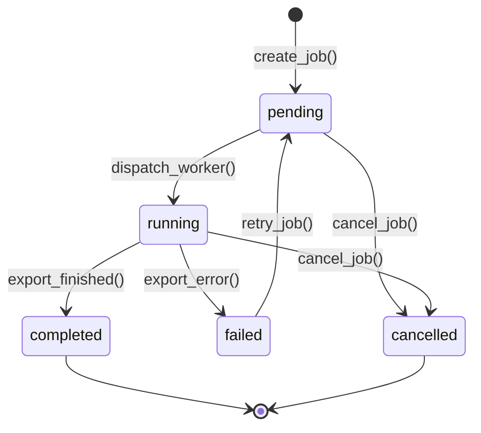
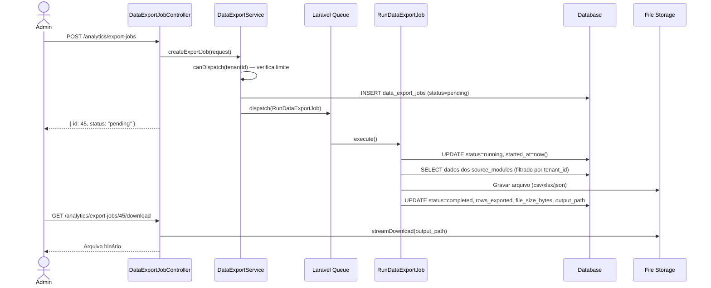

# Modulo: Analytics & BI (Data Lake & Custom Reports)

> **[AI_RULE]** Especificações arquiteturais da fase de Expansão. Módulo Analytics_BI.

---

## 1. Visão Geral

Motor de extração de dados e ETL. Responsável por puxar massas de dados pesados do tenant em background e organizar em Data Lake ou Data Warehouse (DW) otimizado, alimentando plataformas como Power BI ou Metabase embedded. Permite geração de relatórios cruzados (Drag-and-Drop) de KPIs híbridos.

**Escopo Funcional:**

- Definição de datasets customizáveis pelo admin do tenant
- Execução assíncrona de jobs de extração de dados (ETL)
- Agendamento recorrente de exportações (cron-based)
- Visualização de status de jobs e logs de execução
- Exportação em formatos CSV, XLSX e JSON
- Embeddings de dashboards externos (Metabase/Power BI URL)

---

## 2. Entidades (Models)

### 2.1 DataExportJob

| Campo | Tipo | Regra |
|-------|------|-------|
| `id` | bigint (PK) | Auto-increment |
| `tenant_id` | bigint (FK) | Obrigatório, isolamento multi-tenant |
| `analytics_dataset_id` | bigint (FK) | Referência ao dataset sendo exportado |
| `created_by` | bigint (FK → users) | Usuário que disparou o job |
| `name` | string(255) | Nome descritivo do job |
| `status` | enum | `pending`, `running`, `completed`, `failed`, `cancelled` |
| `source_modules` | json | Array de módulos fonte: `["hr","finance","crm","work_orders"]` |
| `filters` | json | Filtros aplicados: `{"date_from":"...","date_to":"...","status":"..."}` |
| `output_format` | enum | `csv`, `xlsx`, `json` |
| `output_path` | string(500) null | Caminho do arquivo gerado (Storage) |
| `file_size_bytes` | bigint null | Tamanho do arquivo gerado |
| `rows_exported` | integer null | Total de registros exportados |
| `started_at` | timestamp null | Início da execução |
| `completed_at` | timestamp null | Fim da execução |
| `error_message` | text null | Mensagem de erro em caso de falha |
| `scheduled_cron` | string(100) null | Expressão cron para agendamento recorrente |
| `last_scheduled_at` | timestamp null | Última execução agendada |
| `created_at` | timestamp | — |
| `updated_at` | timestamp | — |

### 2.2 AnalyticsDataset

| Campo | Tipo | Regra |
|-------|------|-------|
| `id` | bigint (PK) | Auto-increment |
| `tenant_id` | bigint (FK) | Obrigatório, isolamento multi-tenant |
| `name` | string(255) | Nome do dataset (ex: "Rentabilidade por Funcionário") |
| `description` | text null | Descrição livre |
| `source_modules` | json | Módulos envolvidos: `["finance","hr"]` |
| `query_definition` | json | Definição da query: colunas, joins, aggregations |
| `refresh_strategy` | enum | `manual`, `hourly`, `daily`, `weekly` |
| `last_refreshed_at` | timestamp null | Última atualização do cache |
| `cache_ttl_minutes` | integer | TTL do cache em minutos (default: 1440) |
| `is_active` | boolean | Default true |
| `created_by` | bigint (FK → users) | Criador do dataset |
| `created_at` | timestamp | — |
| `updated_at` | timestamp | — |

### 2.3 EmbeddedDashboard

| Campo | Tipo | Regra |
|-------|------|-------|
| `id` | bigint (PK) | Auto-increment |
| `tenant_id` | bigint (FK) | Obrigatório |
| `name` | string(255) | Nome do dashboard embedado |
| `provider` | enum | `metabase`, `power_bi`, `custom_url` |
| `embed_url` | text | URL de incorporação com token |
| `is_active` | boolean | Default true |
| `display_order` | integer | Ordenação na tela |
| `created_at` | timestamp | — |
| `updated_at` | timestamp | — |

---

## 3. Ciclos de Vida (State Machines)

### 3.1 Ciclo do DataExportJob



**Transições detalhadas:**

| De | Para | Trigger | Efeito |
|----|------|---------|--------|
| `[*]` | `pending` | `create_job()` | Valida permissões, cria registro no banco |
| `pending` | `running` | `dispatch_worker()` | Job entra na fila Laravel, seta `started_at` |
| `running` | `completed` | `export_finished()` | Seta `completed_at`, `rows_exported`, `file_size_bytes`, `output_path` |
| `running` | `failed` | `export_error()` | Seta `error_message`, notifica admin |
| `pending/running` | `cancelled` | `cancel_job()` | Cancela o job na fila se possível |
| `failed` | `pending` | `retry_job()` | Limpa erro, recoloca na fila |

---

## 4. Guard Rails de Negócio `[AI_RULE]`

> **[AI_RULE_CRITICAL] Isolamento de Dados por Tenant**
> Toda query de extração DEVE filtrar por `tenant_id`. O `DataExportService` NUNCA pode executar queries cross-tenant. Violação disso é falha de segurança crítica.

> **[AI_RULE_CRITICAL] Execução Assíncrona Obrigatória**
> Extrações de dados DEVEM rodar em background via Laravel Queue (Job `RunDataExportJob`). NUNCA executar ETL de forma síncrona no request HTTP. Timeout máximo do job: 30 minutos.

> **[AI_RULE] Limites de Exportação**
> Cada tenant tem limite de exportações simultâneas (default: 3). Se exceder, o job fica em `pending` aguardando slot. O `DataExportService::canDispatch()` verifica esse limite antes de enviar para a fila.

> **[AI_RULE] Retenção de Arquivos**
> Arquivos exportados são retidos por 7 dias no Storage do tenant. Job `CleanExpiredExports` roda daily e remove arquivos com `completed_at < now() - 7 days`.

> **[AI_RULE] Sanitização de Query Definition**
> O campo `query_definition` do `AnalyticsDataset` NÃO aceita SQL raw. Ele é um JSON estruturado que o `DatasetQueryBuilder` interpreta para montar queries seguras via Eloquent/QueryBuilder. Aceita apenas: `columns`, `joins`, `filters`, `group_by`, `order_by`, `aggregations`.

> **[AI_RULE] Permissão por Dataset**
> Apenas usuários com `analytics.dataset.manage` podem criar/editar datasets. Usuários com `analytics.export.create` podem disparar exportações de datasets já existentes.

### 4.1 Estratégia de Cache (Performance) `[CRITICAL]`

Para garantir que os Dashboards cruzados não saturem o banco de dados transacional:

- **Nível 1 (Result Cache):** O resultado bruto das queries executadas pelo `DatasetQueryBuilder` DEVE ser guardado em Redis usando chave `analytics:dataset:{tenant_id}:{dataset_id}:results`. O TTL é governado pelo campo `cache_ttl_minutes`.
- **Nível 2 (Pre-warming Assíncrono):** Job de CRON `RefreshAnalyticsDatasets` observa o `refresh_strategy` (`hourly`, `daily`, `weekly`). Ele processa os reports em background e SOBRESCREVE a chave no Redis, evitando que o usuário final sofra o painel do slow query.
- **Invalidação e Lock (Stampede Prevention):** Atualizações forçadas (refresh manual via UI) NUNCA processam na requisição HTTP. Fazem dispatch na fila de alta prioridade gerando um `Redis::lock('analytics:refresh:{dataset_id}', 120)` para impedir múltiplos requests paralelos simultâneos no mesmo dataset esgotando as conexões do MySQL.

---

## 5. Comportamento Integrado (Cross-Domain)

| Direção | Módulo | Integração |
|---------|--------|------------|
| ← | **HR** | Captura dados de horas trabalhadas, frequência, banco de horas para KPIs de produtividade |
| ← | **Finance** | Captura faturas, receitas, despesas para KPIs financeiros e rentabilidade |
| ← | **CRM** | Captura leads, conversões, pipeline para KPIs comerciais |
| ← | **WorkOrders** | Captura OS, lead-time, retrabalho para KPIs operacionais |
| ← | **Quality** | Captura calibrações, RNCs, CAPAs para KPIs de qualidade ISO 17025 |
| → | **Alerts** | Dispara alertas quando KPIs ultrapassam thresholds configurados |
| → | **Email** | Envia relatórios agendados por email aos stakeholders |

---

## 6. Contratos de API (JSON)

### 6.1 Criar Job de Exportação

```http
POST /api/v1/analytics/export-jobs
Authorization: Bearer {admin-token}
Content-Type: application/json
```

**Request:**

```json
{
  "name": "Exportação Mensal Financeiro",
  "analytics_dataset_id": 3,
  "filters": {
    "date_from": "2026-01-01",
    "date_to": "2026-01-31"
  },
  "output_format": "xlsx"
}
```

**Response (201):**

```json
{
  "success": true,
  "data": {
    "id": 45,
    "tenant_id": 1,
    "analytics_dataset_id": 3,
    "name": "Exportação Mensal Financeiro",
    "status": "pending",
    "output_format": "xlsx",
    "created_by": 7,
    "created_at": "2026-03-25T14:00:00Z"
  }
}
```

### 6.2 Listar Jobs de Exportação

```http
GET /api/v1/analytics/export-jobs?status=completed&per_page=20
Authorization: Bearer {admin-token}
```

**Response (200):**

```json
{
  "success": true,
  "data": [
    {
      "id": 45,
      "name": "Exportação Mensal Financeiro",
      "status": "completed",
      "rows_exported": 1250,
      "file_size_bytes": 524288,
      "completed_at": "2026-03-25T14:05:00Z"
    }
  ],
  "meta": { "current_page": 1, "per_page": 20, "total": 1 }
}
```

### 6.3 Download do Arquivo Exportado

```http
GET /api/v1/analytics/export-jobs/{id}/download
Authorization: Bearer {admin-token}
```

**Response:** Stream do arquivo (Content-Type conforme `output_format`).

### 6.4 CRUD de Datasets

```http
POST /api/v1/analytics/datasets
Authorization: Bearer {admin-token}
Content-Type: application/json
```

**Request:**

```json
{
  "name": "Rentabilidade por Funcionário",
  "source_modules": ["finance", "hr"],
  "query_definition": {
    "columns": ["users.name", "SUM(invoices.total) as revenue"],
    "joins": [{"table": "invoices", "on": "users.id = invoices.created_by"}],
    "group_by": ["users.id"],
    "order_by": [{"column": "revenue", "direction": "desc"}]
  },
  "refresh_strategy": "daily",
  "cache_ttl_minutes": 1440
}
```

### 6.5 CRUD de Dashboards Embedados

```http
POST /api/v1/analytics/dashboards
Authorization: Bearer {admin-token}
Content-Type: application/json
```

**Request:**

```json
{
  "name": "Dashboard Financeiro Q1",
  "provider": "metabase",
  "embed_url": "https://metabase.empresa.com/embed/dashboard/abc123",
  "display_order": 1
}
```

---

## 7. Permissões (RBAC)

| Permissão | Descrição |
|-----------|-----------|
| `analytics.dataset.view` | Visualizar datasets e resultados |
| `analytics.dataset.manage` | Criar, editar e excluir datasets |
| `analytics.export.create` | Disparar exportações de dados |
| `analytics.export.view` | Visualizar status e logs de jobs |
| `analytics.export.download` | Baixar arquivos exportados |
| `analytics.dashboard.view` | Visualizar dashboards embedados |
| `analytics.dashboard.manage` | Gerenciar dashboards embedados |

---

## 8. Rotas da API

### Export Jobs (`auth:sanctum` + `check.tenant`)

| Método | Rota | Controller | Ação |
|--------|------|------------|------|
| `GET` | `/api/v1/analytics/export-jobs` | `DataExportJobController@index` | Listar jobs |
| `POST` | `/api/v1/analytics/export-jobs` | `DataExportJobController@store` | Criar job |
| `GET` | `/api/v1/analytics/export-jobs/{id}` | `DataExportJobController@show` | Detalhes do job |
| `POST` | `/api/v1/analytics/export-jobs/{id}/retry` | `DataExportJobController@retry` | Reprocessar job falho |
| `POST` | `/api/v1/analytics/export-jobs/{id}/cancel` | `DataExportJobController@cancel` | Cancelar job |
| `GET` | `/api/v1/analytics/export-jobs/{id}/download` | `DataExportJobController@download` | Download do arquivo |

### Datasets (`auth:sanctum` + `check.tenant`)

| Método | Rota | Controller | Ação |
|--------|------|------------|------|
| `GET` | `/api/v1/analytics/datasets` | `AnalyticsDatasetController@index` | Listar datasets |
| `POST` | `/api/v1/analytics/datasets` | `AnalyticsDatasetController@store` | Criar dataset |
| `GET` | `/api/v1/analytics/datasets/{id}` | `AnalyticsDatasetController@show` | Detalhes do dataset |
| `PUT` | `/api/v1/analytics/datasets/{id}` | `AnalyticsDatasetController@update` | Atualizar dataset |
| `DELETE` | `/api/v1/analytics/datasets/{id}` | `AnalyticsDatasetController@destroy` | Excluir dataset |
| `POST` | `/api/v1/analytics/datasets/{id}/preview` | `AnalyticsDatasetController@preview` | Preview com limit 100 |

### Embedded Dashboards (`auth:sanctum` + `check.tenant`)

| Método | Rota | Controller | Ação |
|--------|------|------------|------|
| `GET` | `/api/v1/analytics/dashboards` | `EmbeddedDashboardController@index` | Listar dashboards |
| `POST` | `/api/v1/analytics/dashboards` | `EmbeddedDashboardController@store` | Criar dashboard |
| `PUT` | `/api/v1/analytics/dashboards/{id}` | `EmbeddedDashboardController@update` | Atualizar dashboard |
| `DELETE` | `/api/v1/analytics/dashboards/{id}` | `EmbeddedDashboardController@destroy` | Excluir dashboard |

---

## 9. Form Requests (Validação de Entrada)

> **[AI_RULE]** Todo endpoint de criação/atualização DEVE usar Form Request. Validação inline em controllers é PROIBIDA.

### 9.1 StoreDataExportJobRequest

**Classe**: `App\Http\Requests\Analytics\StoreDataExportJobRequest`

```php
public function rules(): array
{
    return [
        'name'                 => ['required', 'string', 'max:255'],
        'analytics_dataset_id' => ['required', 'integer', 'exists:analytics_datasets,id'],
        'filters'              => ['nullable', 'array'],
        'filters.date_from'    => ['nullable', 'date'],
        'filters.date_to'      => ['nullable', 'date', 'after_or_equal:filters.date_from'],
        'output_format'        => ['required', 'string', 'in:csv,xlsx,json'],
        'scheduled_cron'       => ['nullable', 'string', 'max:100'],
    ];
}
```

### 9.2 StoreAnalyticsDatasetRequest

**Classe**: `App\Http\Requests\Analytics\StoreAnalyticsDatasetRequest`

```php
public function rules(): array
{
    return [
        'name'              => ['required', 'string', 'max:255'],
        'description'       => ['nullable', 'string', 'max:2000'],
        'source_modules'    => ['required', 'array', 'min:1'],
        'source_modules.*'  => ['string', 'in:hr,finance,crm,work_orders,quality,inventory,fiscal'],
        'query_definition'  => ['required', 'array'],
        'refresh_strategy'  => ['required', 'string', 'in:manual,hourly,daily,weekly'],
        'cache_ttl_minutes' => ['sometimes', 'integer', 'min:60', 'max:10080'],
    ];
}
```

### 9.3 StoreEmbeddedDashboardRequest

**Classe**: `App\Http\Requests\Analytics\StoreEmbeddedDashboardRequest`

```php
public function rules(): array
{
    return [
        'name'          => ['required', 'string', 'max:255'],
        'provider'      => ['required', 'string', 'in:metabase,power_bi,custom_url'],
        'embed_url'     => ['required', 'url', 'max:2000'],
        'display_order' => ['sometimes', 'integer', 'min:0'],
    ];
}
```

---

## 10. Diagramas de Sequência

### 10.1 Fluxo: Exportação de Dados (ETL Assíncrono)



---

## 11. Testes Requeridos (BDD)

```gherkin
Funcionalidade: Analytics & BI — Exportação de Dados

  Cenário: Criar job de exportação com sucesso
    Dado que existe um AnalyticsDataset ativo para o tenant
    E estou autenticado como admin com permissão "analytics.export.create"
    Quando envio POST /analytics/export-jobs com dataset_id e format=xlsx
    Então o job é criado com status "pending"
    E o job é despachado para a fila

  Cenário: Limite de jobs simultâneos
    Dado que já existem 3 jobs com status "running" para o tenant
    Quando envio POST /analytics/export-jobs
    Então recebo status 422
    E a mensagem indica que o limite de exportações simultâneas foi atingido

  Cenário: Download de exportação completa
    Dado que existe um job com status "completed" e output_path preenchido
    Quando envio GET /analytics/export-jobs/{id}/download
    Então recebo o arquivo com Content-Type correto

  Cenário: Retry de job falho
    Dado que existe um job com status "failed"
    Quando envio POST /analytics/export-jobs/{id}/retry
    Então o status volta para "pending"
    E o error_message é limpo

  Cenário: Isolamento multi-tenant
    Dado que existem jobs do tenant_id=1 e tenant_id=2
    Quando admin do tenant_id=1 lista jobs
    Então recebe apenas jobs do tenant_id=1

  Cenário: CRUD de Dataset
    Quando envio POST /analytics/datasets com nome e source_modules
    Então o dataset é criado com status 201
    Quando envio PUT /analytics/datasets/{id}
    Então o dataset é atualizado
    Quando envio DELETE /analytics/datasets/{id}
    Então o dataset é removido

  Cenário: Limpeza automática de arquivos expirados
    Dado que existe um job com completed_at há 8 dias
    Quando o Job CleanExpiredExports executa
    Então o arquivo do Storage é removido
    E o output_path é setado para null
```

---

## 12. Inventário Completo do Código

> **[AI_RULE]** Seção define exatamente os artefatos a serem criados. Toda referência abaixo corresponde a arquivo que DEVE existir no repositório.

### Controllers (3 — namespace `App\Http\Controllers\Api\V1`)

| Controller | Arquivo | Métodos Públicos |
|------------|---------|-----------------|
| **DataExportJobController** | `Analytics/DataExportJobController.php` | `index`, `store`, `show`, `retry`, `cancel`, `download` |
| **AnalyticsDatasetController** | `Analytics/AnalyticsDatasetController.php` | `index`, `store`, `show`, `update`, `destroy`, `preview` |
| **EmbeddedDashboardController** | `Analytics/EmbeddedDashboardController.php` | `index`, `store`, `update`, `destroy` |

### Models (3 — namespace `App\Models`)

| Model | Tabela | Descrição |
|-------|--------|-----------|
| `DataExportJob` | `data_export_jobs` | Job de extração ETL assíncrono |
| `AnalyticsDataset` | `analytics_datasets` | Definição de dataset customizável |
| `EmbeddedDashboard` | `embedded_dashboards` | Dashboard externo embedado |

### Services (2 — namespace `App\Services`)

| Service | Métodos Públicos |
|---------|-----------------|
| `DataExportService` | `createExportJob()`, `canDispatch()`, `retryJob()`, `cancelJob()` |
| `DatasetQueryBuilder` | `buildQuery(AnalyticsDataset)`, `preview(AnalyticsDataset, limit)` |

### Jobs (2 — namespace `App\Jobs`)

| Job | Descrição |
|-----|-----------|
| `RunDataExportJob` | Executa a extração ETL e grava o arquivo |
| `CleanExpiredExports` | Remove arquivos com mais de 7 dias |

### Form Requests (5 — namespace `App\Http\Requests\Analytics`)

| FormRequest | Endpoint |
|-------------|----------|
| `StoreDataExportJobRequest` | `POST /analytics/export-jobs` |
| `StoreAnalyticsDatasetRequest` | `POST /analytics/datasets` |
| `UpdateAnalyticsDatasetRequest` | `PUT /analytics/datasets/{id}` |
| `StoreEmbeddedDashboardRequest` | `POST /analytics/dashboards` |
| `UpdateEmbeddedDashboardRequest` | `PUT /analytics/dashboards/{id}` |

---

## 13. Edge Cases e Tratamento de Erros

| Cenário | Comportamento Esperado | Regra |
| --------- | ---------------------- | ------- |
| **Timeout de Extração** (Job demora > 30min) | O `RunDataExportJob` deve ser abortado pelo Horizon/Queue. O status em `data_export_jobs` deve ser mudado para `failed` com `error_message` "Execution Timeout Exceeded". O Admin deve ser alertado via Notification/Email. | `[AI_RULE_CRITICAL]` |
| **Arquivo vazio** (Query não retorna dados) | O Job completa normalmente. `rows_exported = 0` e o arquivo é gerado contendo apenas o cabeçalho. O status fica como `completed`. | `[AI_RULE]` |
| **Limite de Concorrência Max-Out** | Se o tenant tentar disparar o 4º job de exportação com 3 já em `running`, a API retorna `201 Created` mas o job fica em `pending` na fila até que uma vaga seja liberada pelo rate limiter do Horizon ou lock transacional. | `[AI_RULE]` |
| **Invalid Query Definition JSON** | Se o dataset tentar rodar e o json do query_definition compilar SQL inválido: o catch bloqueia a query, marca o Job como `failed` e anota o erro (mascadando dados sensíveis de DB). Retorna `error_message="Invalid Query Specification"`. | `[AI_RULE]` |
| **Download de Arquivo Expirado** | Se o Admin tentar baixar um arquivo cujo `output_path` foi limpo pelo `CleanExpiredExports`, a API retorna `404 Not Found` (Arquivo expirado e deletado da lixeira). | `[AI_RULE]` |

---

## 14. Checklist de Implementação

- [ ] Migration `create_analytics_datasets_table` com campos completos e tenant_id (FK)
- [ ] Migration `create_data_export_jobs_table` com campos completos e tenant_id (FK)
- [ ] Migration `create_embedded_dashboards_table` com campos completos e tenant_id (FK)
- [ ] Model `DataExportJob` com fillable, casts (json), relationships (belongsTo tenant, dataset, user)
- [ ] Model `AnalyticsDataset` com fillable, casts (json), relationships
- [ ] Model `EmbeddedDashboard` com fillable, relationships
- [ ] `DataExportService` com lógica de criação, retry, cancel e limite de concorrência
- [ ] `DatasetQueryBuilder` com interpretação segura do query_definition JSON (sem SQL raw)
- [ ] Job `RunDataExportJob` — extração assíncrona com timeout 30min e tratamento de falha
- [ ] Job `CleanExpiredExports` — cleanup diário de arquivos expirados
- [ ] `DataExportJobController` com CRUD + download stream + retry + cancel
- [ ] `AnalyticsDatasetController` com CRUD + preview
- [ ] `EmbeddedDashboardController` com CRUD
- [ ] 5 Form Requests conforme especificação
- [ ] Rotas registradas em `routes/api.php` com middleware `auth:sanctum` + `check.tenant`
- [ ] Permissões RBAC registradas no seeder
- [ ] Testes Feature para CRUD de datasets, jobs, downloads, isolamento multi-tenant
- [ ] Frontend React: Página de Datasets, página de Export Jobs com status, página de Dashboards embedados
