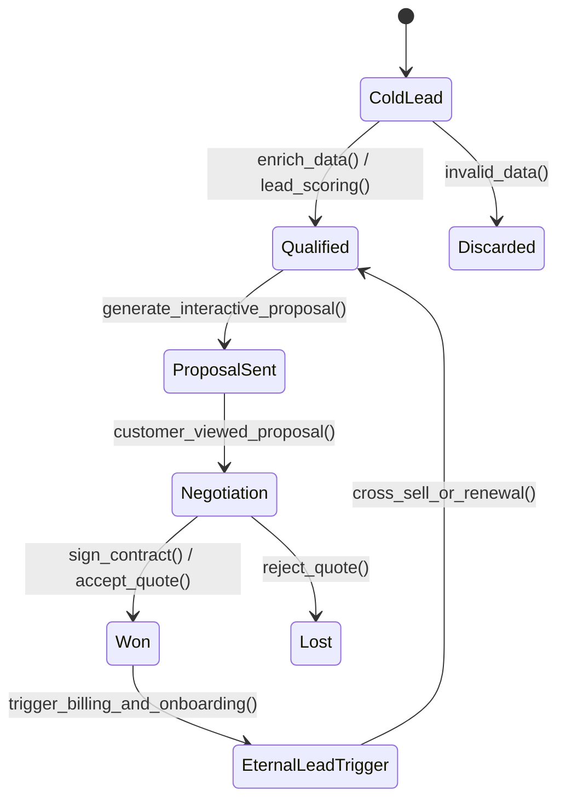
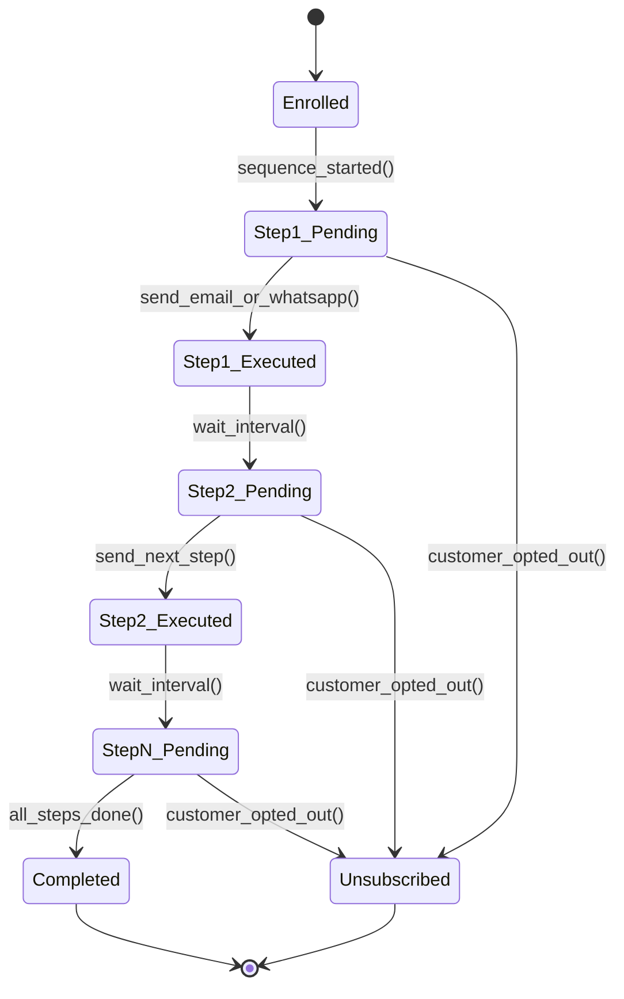
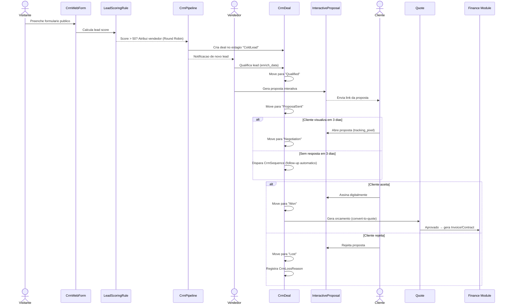

# Modulo: CRM

## 1. Visao Geral e State Machines

> **[AI_RULE]** A IA DEVE seguir os fluxos das Maquinas de Estados abaixo ao codificar Controllers e Services envolvendo CRM.

### 1.1 Pipeline Automatizado (State Machine do Deal)



### 1.2 Automacao de Sequences (Cadencias de Contato)



---

## 2. Entidades (Models) e Campos

### Customer (Cliente)

| Campo | Tipo | Descricao |
|---|---|---|
| `id` | bigint | PK |
| `tenant_id` | bigint | FK → tenants |
| `type` | string | Tipo: PF ou PJ |
| `name` | string | Razao social / Nome completo |
| `trade_name` | string | Nome fantasia |
| `document` | string | CPF ou CNPJ |
| `email` | string | Email principal |
| `phone` | string | Telefone principal |
| `phone2` | string | Telefone secundario |
| `notes` | text | Observacoes internas |
| `is_active` | boolean | Ativo/inativo |
| `address_zip` | string | CEP |
| `address_street` | string | Logradouro |
| `address_number` | string | Numero |
| `address_complement` | string | Complemento |
| `address_neighborhood` | string | Bairro |
| `address_city` | string | Cidade |
| `address_state` | string | UF (2 chars) |
| `latitude` | decimal(10,8) | Latitude GPS |
| `longitude` | decimal(11,8) | Longitude GPS |
| `google_maps_link` | string | Link direto Google Maps |
| `state_registration` | string | Inscricao estadual |
| `municipal_registration` | string | Inscricao municipal |
| `cnae_code` | string | Codigo CNAE principal |
| `cnae_description` | string | Descricao CNAE |
| `legal_nature` | string | Natureza juridica |
| `capital` | decimal | Capital social |
| `simples_nacional` | boolean | Optante Simples Nacional |
| `mei` | boolean | E MEI |
| `company_status` | string | Situacao cadastral |
| `opened_at` | date | Data de abertura |
| `is_rural_producer` | boolean | Produtor rural |
| `partners` | json | Socios (array de objetos) |
| `secondary_activities` | json | CNAEs secundarias |
| `enrichment_data` | json | Dados brutos do enriquecimento |
| `enriched_at` | datetime | Ultima data de enriquecimento |
| `source` | string | Origem do lead (prospeccao, retorno, contato_direto, indicacao) |
| `segment` | string | Segmento do cliente |
| `company_size` | string | Porte da empresa |
| `annual_revenue_estimate` | decimal | Estimativa de faturamento anual |
| `contract_type` | string | Tipo de contrato (avulso, recorrente, etc.) |
| `contract_start` | date | Inicio do contrato |
| `contract_end` | date | Fim do contrato |
| `health_score` | integer | Score de saude calculado (0-100) |
| `last_contact_at` | datetime | Ultimo contato registrado |
| `next_follow_up_at` | datetime | Proximo follow-up agendado |
| `assigned_seller_id` | bigint | FK → users (vendedor responsavel) |
| `tags` | json | Tags para segmentacao |
| `rating` | integer | Classificacao (1-5 estrelas) |

### CustomerContact (Contato do Cliente)

| Campo | Tipo | Descricao |
|---|---|---|
| `id` | bigint | PK |
| `tenant_id` | bigint | FK → tenants |
| `customer_id` | bigint | FK → customers |
| `name` | string | Nome do contato |
| `role` | string | Cargo/funcao |
| `phone` | string | Telefone direto |
| `email` | string | Email direto |
| `is_primary` | boolean | Contato principal |

### CustomerAddress (Endereco Adicional)

| Campo | Tipo | Descricao |
|---|---|---|
| `id` | bigint | PK |
| `tenant_id` | bigint | FK → tenants |
| `customer_id` | bigint | FK → customers |
| `type` | string | Tipo (comercial, residencial, entrega) |
| `street` | string | Logradouro |
| `number` | string | Numero |
| `complement` | string | Complemento |
| `district` | string | Bairro |
| `city` | string | Cidade |
| `state` | string | UF |
| `zip` | string | CEP |
| `country` | string | Pais |
| `is_main` | boolean | Endereco principal |
| `latitude` | decimal(10,8) | Latitude |
| `longitude` | decimal(11,8) | Longitude |

### CustomerDocument (Documento do Cliente)

| Campo | Tipo | Descricao |
|---|---|---|
| `id` | bigint | PK |
| `tenant_id` | bigint | FK → tenants |
| `customer_id` | bigint | FK → customers |
| `title` | string | Titulo do documento |
| `type` | string | Tipo (contrato, alvara, certidao, etc.) |
| `file_path` | string | Caminho do arquivo no storage |
| `file_name` | string | Nome original do arquivo |
| `file_size` | integer | Tamanho em bytes |
| `expiry_date` | date | Data de vencimento |
| `notes` | text | Observacoes |
| `uploaded_by` | bigint | FK → users |

### CustomerLocation (Localizacao/Propriedade)

| Campo | Tipo | Descricao |
|---|---|---|
| `id` | bigint | PK |
| `customer_id` | bigint | FK → customers |
| `latitude` | decimal(10,8) | Latitude |
| `longitude` | decimal(11,8) | Longitude |
| `source` | string | Origem do dado (gps, manual, importacao) |
| `source_id` | string | ID externo na origem |
| `label` | string | Rotulo |
| `collected_by` | bigint | FK → users |
| `inscricao_estadual` | string | IE da propriedade |
| `nome_propriedade` | string | Nome da propriedade |
| `tipo` | string | Tipo (fazenda, sede, filial) |
| `endereco` | string | Endereco |
| `bairro` | string | Bairro |
| `cidade` | string | Cidade |
| `uf` | string | UF |
| `cep` | string | CEP |

### CustomerRfmScore (Score RFM)

| Campo | Tipo | Descricao |
|---|---|---|
| `id` | bigint | PK |
| `tenant_id` | bigint | FK → tenants |
| `customer_id` | bigint | FK → customers |
| `recency_score` | integer | Score de recencia (1-5) |
| `frequency_score` | integer | Score de frequencia (1-5) |
| `monetary_score` | integer | Score monetario (1-5) |
| `rfm_segment` | string | Segmento calculado (champion, loyal, at_risk, lost, etc.) |
| `total_score` | integer | Score total combinado |
| `last_purchase_date` | date | Data da ultima compra |
| `purchase_count` | integer | Total de compras |
| `total_revenue` | decimal(12,2) | Receita total acumulada |
| `calculated_at` | datetime | Data do calculo |

### CustomerComplaint (Reclamacao)

| Campo | Tipo | Descricao |
|---|---|---|
| `id` | bigint | PK |
| `tenant_id` | bigint | FK → tenants |
| `customer_id` | bigint | FK → customers |
| `work_order_id` | bigint | FK → work_orders (opcional) |
| `equipment_id` | bigint | FK → equipments (opcional) |
| `description` | text | Descricao da reclamacao |
| `category` | string | Categoria (atraso, qualidade, atendimento, etc.) |
| `severity` | string | Severidade (low, medium, high, critical) |
| `status` | string | Status (open, in_progress, resolved, closed) |
| `resolution` | text | Descricao da resolucao |
| `assigned_to` | bigint | FK → users |
| `resolved_at` | date | Data da resolucao |
| `response_due_at` | date | Prazo para resposta |
| `responded_at` | datetime | Data da resposta |

### CrmDeal (Negocio/Oportunidade)

| Campo | Tipo | Descricao |
|---|---|---|
| `id` | bigint | PK |
| `tenant_id` | bigint | FK → tenants |
| `customer_id` | bigint | FK → customers |
| `pipeline_id` | bigint | FK → crm_pipelines |
| `stage_id` | bigint | FK → crm_pipeline_stages |
| `title` | string | Titulo do negocio |
| `value` | decimal(12,2) | Valor estimado |
| `status` | string | `open`, `won`, `lost` |
| `probability` | integer | Probabilidade de fechamento (0-100%) |
| `expected_close_date` | date | Data prevista de fechamento |
| `assigned_to` | bigint | FK → users (vendedor responsavel) |
| `loss_reason_id` | bigint | FK → crm_loss_reasons |
| `notes` | text | Observacoes |
| `won_at` | datetime | Data de ganho |
| `lost_at` | datetime | Data de perda |
| `source` | string | Origem (web_form, referral, cold_call, etc.) |

### CrmPipeline (Pipeline de Vendas)

| Campo | Tipo | Descricao |
|---|---|---|
| `id` | bigint | PK |
| `tenant_id` | bigint | FK → tenants |
| `name` | string | Nome do pipeline |
| `is_default` | boolean | Pipeline padrao |
| `is_active` | boolean | Ativo/inativo |

### CrmPipelineStage (Estagio do Pipeline)

| Campo | Tipo | Descricao |
|---|---|---|
| `id` | bigint | PK |
| `tenant_id` | bigint | FK → tenants |
| `pipeline_id` | bigint | FK → crm_pipelines |
| `name` | string | Nome do estagio |
| `color` | string | Cor hexadecimal |
| `position` | integer | Posicao na ordenacao |
| `probability` | integer | Probabilidade padrao (%) |
| `is_won` | boolean | Estagio de ganho |
| `is_lost` | boolean | Estagio de perda |

### CrmActivity (Atividade)

| Campo | Tipo | Descricao |
|---|---|---|
| `id` | bigint | PK |
| `tenant_id` | bigint | FK → tenants |
| `deal_id` | bigint | FK → crm_deals |
| `customer_id` | bigint | FK → customers |
| `user_id` | bigint | FK → users |
| `type` | string | Tipo (call, email, meeting, visit, note, task) |
| `title` | string | Titulo |
| `description` | text | Descricao |
| `scheduled_at` | datetime | Data/hora agendada |
| `completed_at` | datetime | Data/hora de conclusao |
| `is_completed` | boolean | Concluida |

### CrmSequence (Cadencia de Contato)

| Campo | Tipo | Descricao |
|---|---|---|
| `id` | bigint | PK |
| `tenant_id` | bigint | FK → tenants |
| `name` | string | Nome da cadencia |
| `description` | text | Descricao |
| `is_active` | boolean | Ativa |
| `created_by` | bigint | FK → users |

### CrmSequenceStep (Passo da Cadencia)

| Campo | Tipo | Descricao |
|---|---|---|
| `id` | bigint | PK |
| `sequence_id` | bigint | FK → crm_sequences |
| `position` | integer | Ordem do passo |
| `channel` | string | Canal (email, whatsapp, call, task) |
| `delay_days` | integer | Dias de espera apos passo anterior |
| `template_id` | bigint | FK → crm_message_templates |
| `subject` | string | Assunto |
| `body` | text | Corpo da mensagem |

### CrmSequenceEnrollment (Inscricao em Cadencia)

| Campo | Tipo | Descricao |
|---|---|---|
| `id` | bigint | PK |
| `sequence_id` | bigint | FK → crm_sequences |
| `customer_id` | bigint | FK → customers |
| `deal_id` | bigint | FK → crm_deals |
| `current_step` | integer | Passo atual |
| `status` | string | enrolled, completed, cancelled, unsubscribed |
| `enrolled_at` | datetime | Data de inscricao |
| `completed_at` | datetime | Data de conclusao |

### CrmTerritory (Territorio)

| Campo | Tipo | Descricao |
|---|---|---|
| `id` | bigint | PK |
| `tenant_id` | bigint | FK → tenants |
| `name` | string | Nome do territorio |
| `description` | text | Descricao |
| `region` | json | Definicao geografica (poligonos, CEP ranges) |
| `is_active` | boolean | Ativo |

### CrmTerritoryMember (Membro do Territorio)

| Campo | Tipo | Descricao |
|---|---|---|
| `id` | bigint | PK |
| `territory_id` | bigint | FK → crm_territories |
| `user_id` | bigint | FK → users (vendedor) |
| `role` | string | Papel (owner, member) |

### CrmLeadScore (Score do Lead)

| Campo | Tipo | Descricao |
|---|---|---|
| `id` | bigint | PK |
| `tenant_id` | bigint | FK → tenants |
| `customer_id` | bigint | FK → customers |
| `total_score` | integer | Pontuacao total |
| `breakdown` | json | Detalhamento por criterio |
| `calculated_at` | datetime | Data do calculo |

### CrmLeadScoringRule (Regra de Pontuacao)

| Campo | Tipo | Descricao |
|---|---|---|
| `id` | bigint | PK |
| `tenant_id` | bigint | FK → tenants |
| `name` | string | Nome da regra |
| `field` | string | Campo avaliado |
| `operator` | string | Operador (equals, contains, greater_than, etc.) |
| `value` | string | Valor de comparacao |
| `points` | integer | Pontos atribuidos |
| `is_active` | boolean | Ativa |

### CrmForecastSnapshot (Snapshot de Previsao)

| Campo | Tipo | Descricao |
|---|---|---|
| `id` | bigint | PK |
| `tenant_id` | bigint | FK → tenants |
| `period` | string | Periodo (YYYY-MM) |
| `total_pipeline` | decimal(12,2) | Valor total no pipeline |
| `weighted_value` | decimal(12,2) | Valor ponderado por probabilidade |
| `deals_count` | integer | Numero de deals |
| `snapshot_data` | json | Dados completos por estagio |
| `created_at` | datetime | Data do snapshot |

### CrmSalesGoal (Meta de Vendas)

| Campo | Tipo | Descricao |
|---|---|---|
| `id` | bigint | PK |
| `tenant_id` | bigint | FK → tenants |
| `user_id` | bigint | FK → users |
| `period` | string | Periodo (YYYY-MM) |
| `target_value` | decimal(12,2) | Meta em valor |
| `target_deals` | integer | Meta em quantidade |
| `achieved_value` | decimal(12,2) | Valor atingido |
| `achieved_deals` | integer | Deals fechados |

### CrmSmartAlert (Alerta Inteligente)

| Campo | Tipo | Descricao |
|---|---|---|
| `id` | bigint | PK |
| `tenant_id` | bigint | FK → tenants |
| `type` | string | Tipo (churn_risk, stale_deal, overdue_activity, etc.) |
| `severity` | string | Severidade (info, warning, critical) |
| `title` | string | Titulo do alerta |
| `message` | text | Descricao detalhada |
| `entity_type` | string | Tipo da entidade (Customer, CrmDeal) |
| `entity_id` | bigint | ID da entidade |
| `status` | string | pending, acknowledged, resolved, dismissed |
| `resolved_at` | datetime | Data de resolucao |

### CrmMessage (Mensagem)

| Campo | Tipo | Descricao |
|---|---|---|
| `id` | bigint | PK |
| `tenant_id` | bigint | FK → tenants |
| `customer_id` | bigint | FK → customers |
| `deal_id` | bigint | FK → crm_deals |
| `channel` | string | Canal (email, whatsapp, sms) |
| `direction` | string | inbound ou outbound |
| `subject` | string | Assunto |
| `body` | text | Corpo |
| `sent_by` | bigint | FK → users |
| `status` | string | queued, sent, delivered, read, failed |

### CrmMessageTemplate (Template de Mensagem)

| Campo | Tipo | Descricao |
|---|---|---|
| `id` | bigint | PK |
| `tenant_id` | bigint | FK → tenants |
| `name` | string | Nome do template |
| `channel` | string | Canal (email, whatsapp) |
| `subject` | string | Assunto |
| `body` | text | Corpo com placeholders |
| `is_active` | boolean | Ativo |

### CrmInteractiveProposal (Proposta Interativa)

| Campo | Tipo | Descricao |
|---|---|---|
| `id` | bigint | PK |
| `tenant_id` | bigint | FK → tenants |
| `deal_id` | bigint | FK → crm_deals |
| `token` | string | Token unico para acesso publico |
| `content` | json | Conteudo da proposta |
| `status` | string | draft, sent, viewed, accepted, rejected |
| `signed_at` | datetime | Data da assinatura digital |
| `viewed_at` | datetime | Data da primeira visualizacao |

### CrmFollowUpTask (Tarefa de Follow-up)

| Campo | Tipo | Descricao |
|---|---|---|
| `id` | bigint | PK |
| `tenant_id` | bigint | FK → tenants |
| `deal_id` | bigint | FK → crm_deals |
| `assigned_to` | bigint | FK → users |
| `title` | string | Titulo |
| `due_date` | date | Data limite |
| `completed_at` | datetime | Data de conclusao |
| `priority` | string | low, medium, high |

### CrmDealProduct (Produto do Negocio)

| Campo | Tipo | Descricao |
|---|---|---|
| `id` | bigint | PK |
| `deal_id` | bigint | FK → crm_deals |
| `product_id` | bigint | FK → products |
| `quantity` | decimal | Quantidade |
| `unit_price` | decimal(12,2) | Preco unitario |
| `total` | decimal(12,2) | Total |

### CrmDealStageHistory (Historico de Estagios)

| Campo | Tipo | Descricao |
|---|---|---|
| `id` | bigint | PK |
| `deal_id` | bigint | FK → crm_deals |
| `from_stage_id` | bigint | FK → crm_pipeline_stages |
| `to_stage_id` | bigint | FK → crm_pipeline_stages |
| `changed_by` | bigint | FK → users |
| `duration_hours` | integer | Horas no estagio anterior |

### CrmDealCompetitor (Concorrente no Negocio)

| Campo | Tipo | Descricao |
|---|---|---|
| `id` | bigint | PK |
| `deal_id` | bigint | FK → crm_deals |
| `competitor_name` | string | Nome do concorrente |
| `strengths` | text | Pontos fortes |
| `weaknesses` | text | Pontos fracos |
| `price_estimate` | decimal(12,2) | Estimativa de preco |

### CrmLossReason (Motivo de Perda)

| Campo | Tipo | Descricao |
|---|---|---|
| `id` | bigint | PK |
| `tenant_id` | bigint | FK → tenants |
| `name` | string | Nome do motivo |
| `is_active` | boolean | Ativo |

### CrmReferral (Indicacao)

| Campo | Tipo | Descricao |
|---|---|---|
| `id` | bigint | PK |
| `tenant_id` | bigint | FK → tenants |
| `referrer_customer_id` | bigint | FK → customers (quem indicou) |
| `referred_customer_id` | bigint | FK → customers (indicado) |
| `deal_id` | bigint | FK → crm_deals |
| `status` | string | pending, converted, expired |
| `reward_type` | string | Tipo de recompensa |
| `reward_value` | decimal(12,2) | Valor da recompensa |

### CrmWebForm (Formulario Web)

| Campo | Tipo | Descricao |
|---|---|---|
| `id` | bigint | PK |
| `tenant_id` | bigint | FK → tenants |
| `name` | string | Nome do formulario |
| `slug` | string | Slug para URL publica |
| `fields` | json | Definicao dos campos |
| `pipeline_id` | bigint | FK → crm_pipelines |
| `assigned_to` | bigint | FK → users |
| `is_active` | boolean | Ativo |

### CrmTrackingEvent (Evento de Rastreamento)

| Campo | Tipo | Descricao |
|---|---|---|
| `id` | bigint | PK |
| `tenant_id` | bigint | FK → tenants |
| `customer_id` | bigint | FK → customers |
| `event_type` | string | Tipo (email_opened, link_clicked, proposal_viewed) |
| `metadata` | json | Dados adicionais |

### FollowUp (Follow-up Generico)

| Campo | Tipo | Descricao |
|---|---|---|
| `id` | bigint | PK |
| `tenant_id` | bigint | FK → tenants |
| `followable_type` | string | Tipo da entidade (morph) |
| `followable_id` | bigint | ID da entidade |
| `assigned_to` | bigint | FK → users |
| `scheduled_at` | datetime | Data agendada |
| `completed_at` | datetime | Data de conclusao |
| `channel` | string | Canal (phone, email, whatsapp, visit) |
| `notes` | text | Anotacoes |
| `result` | string | Resultado |
| `status` | string | pending, completed, cancelled |

### NpsSurvey (Pesquisa NPS)

| Campo | Tipo | Descricao |
|---|---|---|
| `id` | bigint | PK |
| `tenant_id` | bigint | FK → tenants |
| `customer_id` | bigint | FK → customers |
| `work_order_id` | bigint | FK → work_orders |
| `score` | integer | Score NPS (0-10) |
| `feedback` | text | Feedback textual |
| `category` | string | Categoria (promoter, passive, detractor) |
| `responded_at` | datetime | Data da resposta |

### NpsResponse (Resposta NPS Individual)

| Campo | Tipo | Descricao |
|---|---|---|
| `id` | bigint | PK |
| `tenant_id` | bigint | FK → tenants |
| `work_order_id` | bigint | FK → work_orders |
| `customer_id` | bigint | FK → customers |
| `score` | integer | Score NPS (0-10) |
| `comment` | text | Comentario do cliente |

### SatisfactionSurvey (Pesquisa de Satisfacao)

| Campo | Tipo | Descricao |
|---|---|---|
| `id` | bigint | PK |
| `tenant_id` | bigint | FK → tenants |
| `customer_id` | bigint | FK → customers |
| `work_order_id` | bigint | FK → work_orders |
| `nps_score` | integer | Score NPS |
| `service_rating` | integer | Avaliacao do servico |
| `technician_rating` | integer | Avaliacao do tecnico |
| `timeliness_rating` | integer | Avaliacao de pontualidade |

### CrmCalendarEvent (Evento de Calendario CRM)

| Campo | Tipo | Descricao |
|---|---|---|
| `id` | bigint | PK |
| `tenant_id` | bigint | FK → tenants |
| `user_id` | bigint | FK → users |
| `title` | string | Titulo do evento |
| `description` | text | Descricao |
| `type` | string | Tipo do evento |
| `start_at` | datetime | Inicio |
| `end_at` | datetime | Fim |
| `all_day` | boolean | Dia inteiro |
| `location` | string | Localizacao |
| `customer_id` | bigint | FK → customers |
| `deal_id` | bigint | FK → crm_deals |

### CrmContractRenewal (Renovacao de Contrato CRM)

| Campo | Tipo | Descricao |
|---|---|---|
| `id` | bigint | PK |
| `tenant_id` | bigint | FK → tenants |
| `customer_id` | bigint | FK → customers |
| `deal_id` | bigint | FK → crm_deals |
| `contract_end_date` | date | Data fim do contrato |
| `alert_days_before` | integer | Dias de antecedencia para alerta |
| `status` | string | Status da renovacao |
| `current_value` | decimal(12,2) | Valor atual |
| `renewal_value` | decimal(12,2) | Valor de renovacao |

### CrmWebFormSubmission (Submissao de Formulario Web)

| Campo | Tipo | Descricao |
|---|---|---|
| `id` | bigint | PK |
| `form_id` | bigint | FK → crm_web_forms |
| `customer_id` | bigint | FK → customers (gerado apos processamento) |
| `deal_id` | bigint | FK → crm_deals (gerado apos processamento) |
| `data` | json | Dados submetidos |
| `ip_address` | string | IP do visitante |
| `user_agent` | string | User agent do navegador |
| `utm_source` | string | Origem UTM |

### ContactPolicy (Politica de Contato)

| Campo | Tipo | Descricao |
|---|---|---|
| `id` | bigint | PK |
| `tenant_id` | bigint | FK → tenants |
| `name` | string | Nome da politica |
| `target_type` | string | Tipo alvo |
| `target_value` | string | Valor alvo |
| `max_days_without_contact` | integer | Max dias sem contato |
| `warning_days_before` | integer | Dias antes para alerta |

### GamificationBadge (Badge de Gamificacao)

| Campo | Tipo | Descricao |
|---|---|---|
| `id` | bigint | PK |
| `tenant_id` | bigint | FK → tenants |
| `name` | string | Nome do badge |
| `slug` | string | Slug unico |
| `description` | text | Descricao |
| `icon` | string | Icone |
| `color` | string | Cor |
| `category` | string | Categoria |
| `metric` | string | Metrica avaliada |
| `threshold` | integer | Limite para conquista |
| `is_active` | boolean | Ativo |

### GamificationScore (Score de Gamificacao)

| Campo | Tipo | Descricao |
|---|---|---|
| `id` | bigint | PK |
| `tenant_id` | bigint | FK → tenants |
| `user_id` | bigint | FK → users |
| `period` | string | Periodo (YYYY-MM) |
| `period_type` | string | Tipo de periodo |
| `visits_count` | integer | Total de visitas |
| `deals_won` | integer | Deals ganhos |
| `deals_value` | decimal(12,2) | Valor de deals |
| `new_clients` | integer | Novos clientes |

### CommissionCampaign (Campanha de Comissao)

| Campo | Tipo | Descricao |
|---|---|---|
| `id` | bigint | PK |
| `tenant_id` | bigint | FK → tenants |
| `name` | string | Nome da campanha |
| `multiplier` | decimal | Multiplicador de comissao |
| `applies_to_role` | string | Cargo alvo |
| `applies_to_calculation_type` | string | Tipo de calculo |

### EmailActivity (Atividade de Email)

| Campo | Tipo | Descricao |
|---|---|---|
| `id` | bigint | PK |
| `tenant_id` | bigint | FK → tenants |
| `email_id` | bigint | FK → emails |
| `customer_id` | bigint | FK → customers |
| `deal_id` | bigint | FK → crm_deals |
| `type` | string | Tipo (sent, received, opened, clicked) |

---

## 3. Services

- **`CustomerConversionService`** — Converte lead CRM em cliente quando primeira OS e concluida. Marca deals como `won` automaticamente.
- **`CrmSmartAlertGenerator`** (`Services/Crm/`) — Gera alertas inteligentes baseados em padroes de inatividade, deals parados, atividades vencidas. Acionado pelo Job `GenerateCrmSmartAlerts`.
- **`ChurnCalculationService`** (`Services/Crm/`) — Calcula probabilidade de churn baseada em: dias sem OS, reducao de faturamento, NPS declinante. Alimenta `CrmSmartAlert` com tipo `churn_risk`.
- **`CommissionService`** — Calculo de comissoes de vendedores vinculadas a deals ganhos.
- **`SalesAnalyticsController`** — Analytics avancado: cohort analysis, revenue intelligence, pipeline velocity.

### 3.1 Controllers CRM (9 Controllers Especializados)

| Controller | Path | Responsabilidade |
|---|---|---|
| `CrmSalesPipelineController` | `Controllers/Api/V1/Crm/` | CRUD de Deals, Pipelines, Stages; Kanban; movimentacao de estagios |
| `CrmSequenceController` | `Controllers/Api/V1/Crm/` | Cadencias automaticas: CRUD de sequences, steps, enrollments |
| `CrmIntelligenceController` | `Controllers/Api/V1/Crm/` | Lead scoring, forecast snapshots, analytics, cohort, velocity |
| `CrmAlertController` | `Controllers/Api/V1/Crm/` | Smart alerts: listagem, acknowledge, resolve, dismiss |
| `CrmTerritoryGoalController` | `Controllers/Api/V1/Crm/` | Territorios, metas de vendas, cobertura geografica |
| `CrmEngagementController` | `Controllers/Api/V1/Crm/` | Mensagens, templates, NPS, satisfacao, gamificacao, RFM |
| `CrmContractController` | `Controllers/Api/V1/Crm/` | Renovacoes de contratos, account plans, commitments |
| `CrmProposalTrackingController` | `Controllers/Api/V1/Crm/` | Propostas interativas, tracking events, assinatura digital |
| `CrmWebFormController` | `Controllers/Api/V1/Crm/` | Web forms publicos, submissoes, rate limiting |

### 3.2 Events

| Event | Descricao | Payload |
|---|---|---|
| `CustomerCreated` | Disparado ao criar novo Customer | `Customer $customer` |

### 3.3 Listeners

| Listener | Event/Trigger | Acao |
|---|---|---|
| `HandleCustomerCreated` | `CustomerCreated` | Atribuicao de territorio, lead scoring inicial, notificacao ao vendedor |
| `CreateAgendaItemOnQuote` | Quote created | Cria item de agenda para follow-up de orcamento |
| `CreateAgendaItemOnContract` | Contract created | Cria item de agenda para acompanhamento de contrato |
| `CreateAgendaItemOnServiceCall` | ServiceCall created | Cria item de agenda para chamado de servico |
| `CreateAgendaItemOnWorkOrder` | WorkOrder created | Cria item de agenda para ordem de servico |
| `CreateAgendaItemOnPayment` | Payment created | Cria item de agenda para acompanhamento de pagamento |
| `CreateAgendaItemOnCalibration` | Calibration created | Cria item de agenda para calibracao |

### 3.4 Observers

| Observer | Model(s) | Descricao |
|---|---|---|
| `CustomerObserver` | `Customer` | Sync dados em contratos/portal, pausa sequences ao inativar, anonimiza ao excluir (LGPD) |
| `CrmObserver` | `CrmDeal` | Propaga transicoes de deal para Finance, WorkOrders, Forecast; registra stage history |
| `CrmDealAgendaObserver` | `CrmDeal` | Cria/atualiza itens de agenda automaticamente ao mover deals entre estagios |

### 3.5 Jobs (Background Processing)

| Job | Schedule | Descricao |
|---|---|---|
| `GenerateCrmSmartAlerts` | Diario | Analisa padroes de inatividade, deals parados, atividades vencidas e gera `CrmSmartAlert` |
| `ProcessCrmSequences` | Diario | Processa cadencias automaticas: executa steps pendentes, envia emails/WhatsApp, avanca enrollments |
| `QuoteFollowUpJob` | Diario | Follow-up automatico de orcamentos sem resposta; gera `FollowUp` e notificacoes |

### 3.6 FormRequests (69 arquivos)

**69 FormRequests** em `app/Http/Requests/Crm/` cobrindo validacao de entrada para todos os dominios CRM:

| Dominio | Requests | Exemplos |
|---|---|---|
| Deals & Pipeline | 12 | `StoreCrmDealRequest`, `BulkUpdateCrmDealsRequest`, `DealsUpdateStageRequest`, `DealsMarkLostRequest`, `ImportDealsCsvRequest` |
| Propostas | 3 | `CreateInteractiveProposalRequest`, `RespondToProposalRequest`, `SignQuoteRequest` |
| Sequences | 4 | `StoreCrmSequenceRequest`, `EnrollInSequenceRequest`, `StoreSequenceTraitRequest`, `UpdateSequenceTraitRequest` |
| Territorios & Metas | 4 | `StoreCrmTerritoryRequest`, `StoreCrmSalesGoalRequest`, `UpdateCrmTerritoryRequest`, `UpdateCrmSalesGoalRequest` |
| Mensagens & Templates | 4 | `SendCrmMessageRequest`, `StoreCrmMessageTemplateRequest`, `EmailWebhookRequest`, `WhatsAppWebhookRequest` |
| Atividades & Calendario | 4 | `StoreCrmActivityRequest`, `StoreCrmCalendarEventRequest`, `UpdateCrmActivityRequest`, `UpdateCrmCalendarEventRequest` |
| Web Forms | 3 | `StoreCrmWebFormRequest`, `SubmitCrmWebFormRequest`, `UpdateCrmWebFormRequest` |
| Visitas (Field) | 8 | `CheckinVisitRequest`, `CheckoutVisitRequest`, `StoreVisitReportRequest`, `StoreVisitRouteRequest`, `AnswerVisitSurveyRequest`, `SendVisitSurveyRequest` |
| Contratos & Account Plans | 8 | `StoreAccountPlanRequest`, `StoreCommitmentRequest`, `UpdateCrmContractRenewalRequest`, `StoreContactPolicyRequest` |
| Scoring & Automacao | 6 | `StoreScoringRuleRequest`, `StoreFunnelAutomationRequest`, `StoreLossReasonRequest`, `MergeLeadsRequest` |
| Referrals & Concorrentes | 4 | `StoreCrmReferralRequest`, `StoreCrmDealCompetitorRequest`, `UpdateCrmReferralRequest`, `UpdateCrmDealCompetitorRequest` |
| Outros | 9 | `CrmDashboardRequest`, `StoreQuickNoteRequest`, `StoreImportantDateRequest`, `StagesReorderRequest`, `CreatePipelineRequest` |

---

## 4. Guard Rails de Negocio `[AI_RULE]`

> **[AI_RULE_CRITICAL] O Lead Eterno (Ciclo Contínuo)**
> Todo cliente é um Lead Eterno. A esteira de vendas não acaba no "Won". O cliente entra imediatamente em réguas de retenção, cross-sell e expansão no `CrmSequence`. A flag de "Lead" nunca é descartada cognitivamente pelo CRM, fazendo com que o ciclo de vida reentre no funil perpetuamente como `Deal` do tipo "Expansion" ou "Renewal".

> **[AI_RULE_CRITICAL] Bloqueio de Faturamento Sem Aceite**
> A IA nunca deve permitir transitar o negocio para `Won` ou acionar integracoes no modulo `Finance` sem que exista um `CrmInteractiveProposal` assinado digitalmente associado ao `CrmDeal`.

> **[AI_RULE] Lead Scoring e Atribuicao Automatica**
> Ao processar um `CrmWebFormSubmission`, o sistema DEVE acionar o `CrmLeadScoringRule` para calcular pontos (ex: Industria, Tamanho da Frota, Regiao). Se > 50 pts, a entidade `CrmPipeline` designara um vendedor automaticamente usando Round Robin. Scoring e recalculado a cada interacao (`CrmTrackingEvent`).

> **[AI_RULE] Automacao de Messaging (Follow-up)**
> Sempre que `CrmDeal` ficar no estado `ProposalSent` por mais de 3 dias sem transicao, disparar evento atrelado ao `CrmSequenceStep` que agenda `CrmActivity` (WhatsApp ou Email) cobrando retorno.

> **[AI_RULE] Territorios e Geofencing**
> `CrmTerritory` define regioes geograficas por poligonos ou CEP range. Ao criar `Customer`, o sistema DEVE atribuir automaticamente ao territorio correspondente via `CrmTerritoryMember`. Vendedor herda os leads do territorio.

> **[AI_RULE] Smart Alerts e Churn**
> O `CrmSmartAlertGenerator` analisa padroes de inatividade do cliente para gerar alertas de churn risk. `ChurnCalculationService` calcula probabilidade baseada em: dias sem OS, reducao de faturamento, NPS declinante.

> **[AI_RULE] Web Forms Sanitizados**
> `CrmWebForm` gera formularios publicos. Todo input DEVE ser sanitizado contra XSS e SQL injection antes de criar `CrmWebFormSubmission`. Rate limiting obrigatorio (max 10 submissoes/minuto por IP).

> **[AI_RULE] Forecast Snapshots**
> `CrmForecastSnapshot` e gerado semanalmente (Job) com previsao de receita baseada em deals por estagio. Snapshots sao append-only para comparacao historica.

> **[AI_RULE] Deal Stage Imutavel**
> O `CrmDealStageHistory` registra TODA transicao de estagio. E proibido alterar historico. Cada movimentacao grava `from_stage_id`, `to_stage_id`, `changed_by` e `duration_hours`.

---

## 5. Comportamento Integrado (Cross-Domain)

- **CRM → Finance**: Quando `CrmDeal` = `Won`, dispara evento `DealWon`. Modulo Finance intercepta e cria `RecurringContract` ou `Invoice`.
- **CRM → WorkOrders**: Deal ganho gera OS inicial de Deployment/Instalacao via `POST /crm/deals/{deal}/convert-to-work-order`.
- **CRM → Quotes**: Deal pode gerar orcamento via `POST /crm/deals/{deal}/convert-to-quote`.
- **Portal → CRM**: NPS responses do portal alimentam `CustomerRfmScore`.
- **Email → CRM**: Emails vinculados automaticamente a `CrmActivity`.
- **Contracts → CRM**: Renovacao de contrato atualiza previsao de forecast.
- **INMETRO → CRM**: Owner de instrumento pode ser convertido em Customer via `CustomerConversionService`.
- **Web Forms → CRM**: Submissoes publicas criam leads automaticamente no pipeline.

---

## 6. Contratos JSON (API)

### GET /api/v1/crm/dashboard/kpis

```json
{
  "response_200": {
    "data": {
      "total_pipeline_value": 1500000.00,
      "weighted_pipeline_value": 850000.00,
      "won_deals_value": 320000.00,
      "win_rate_percentage": 45.2,
      "active_deals_count": 45,
      "new_leads_this_month": 12,
      "activities_overdue": 5
    }
  }
}
```

### POST /api/v1/crm/deals

```json
{
  "request": {
    "customer_id": 15,
    "pipeline_id": 1,
    "stage_id": 2,
    "title": "Calibracao anual - Empresa X",
    "value": 25000.00,
    "probability": 60,
    "expected_close_date": "2026-05-15",
    "assigned_to": 5,
    "source": "web_form",
    "notes": "Cliente indicado pelo parceiro Y"
  },
  "response_201": {
    "data": {
      "id": 42,
      "tenant_id": 1,
      "customer_id": 15,
      "pipeline_id": 1,
      "stage_id": 2,
      "title": "Calibracao anual - Empresa X",
      "value": 25000.00,
      "status": "open",
      "probability": 60,
      "expected_close_date": "2026-05-15",
      "created_at": "2026-03-24T10:30:00Z"
    }
  }
}
```

### PATCH /api/v1/crm/deals/{id}/stage (PUT deals/{deal}/stage)

```json
{
  "request": {
    "stage_id": 4,
    "notes": "Cliente visualizou proposta e pediu ajuste"
  },
  "response_200": {
    "data": {
      "id": 42,
      "stage_id": 4,
      "status": "open",
      "stage_history": [
        {"from": "Qualified", "to": "ProposalSent", "at": "2026-03-20"},
        {"from": "ProposalSent", "to": "Negotiation", "at": "2026-03-24"}
      ]
    }
  }
}
```

### GET /api/v1/crm/pipelines

```json
{
  "response_200": {
    "data": [
      {
        "id": 1,
        "name": "Pipeline Principal",
        "is_default": true,
        "stages": [
          {"id": 1, "name": "Lead Frio", "position": 1, "probability": 10, "deals_count": 8},
          {"id": 2, "name": "Qualificado", "position": 2, "probability": 30, "deals_count": 5},
          {"id": 3, "name": "Proposta Enviada", "position": 3, "probability": 50, "deals_count": 3},
          {"id": 4, "name": "Negociacao", "position": 4, "probability": 70, "deals_count": 2},
          {"id": 5, "name": "Ganho", "position": 5, "probability": 100, "is_won": true, "deals_count": 12}
        ]
      }
    ]
  }
}
```

### POST /api/v1/customers

```json
{
  "request": {
    "type": "PJ",
    "name": "Industria Acme Ltda",
    "trade_name": "Acme",
    "document": "12.345.678/0001-90",
    "email": "contato@acme.com.br",
    "phone": "(11) 99999-0000",
    "address_zip": "01310-100",
    "address_street": "Av Paulista",
    "address_number": "1000",
    "address_city": "Sao Paulo",
    "address_state": "SP",
    "source": "prospeccao",
    "segment": "industria",
    "assigned_seller_id": 5
  },
  "response_201": {
    "data": {
      "id": 100,
      "type": "PJ",
      "name": "Industria Acme Ltda",
      "document": "12.345.678/0001-90",
      "is_active": true,
      "health_score": 50,
      "created_at": "2026-03-24T10:00:00Z"
    }
  }
}
```

---

## 7. Regras de Validacao (FormRequests)

### StoreCustomerRequest / UpdateCustomerRequest

```php
'type'           => 'required|in:PF,PJ',
'name'           => 'required|string|max:255',
'trade_name'     => 'nullable|string|max:255',
'document'       => 'required|string|max:20|unique:customers,document,' . $id . ',id,tenant_id,' . $tenantId,
'email'          => 'nullable|email|max:255',
'phone'          => 'nullable|string|max:20',
'address_state'  => 'nullable|string|size:2',
'source'         => 'nullable|in:prospeccao,retorno,contato_direto,indicacao',
'segment'        => 'nullable|string|max:100',
'rating'         => 'nullable|integer|min:1|max:5',
'assigned_seller_id' => 'nullable|exists:users,id',
```

### StoreDealRequest

```php
'customer_id'         => 'required|exists:customers,id',
'pipeline_id'         => 'required|exists:crm_pipelines,id',
'stage_id'            => 'required|exists:crm_pipeline_stages,id',
'title'               => 'required|string|max:255',
'value'               => 'required|numeric|min:0',
'probability'         => 'nullable|integer|min:0|max:100',
'expected_close_date' => 'nullable|date|after:today',
'assigned_to'         => 'nullable|exists:users,id',
'source'              => 'nullable|string|max:50',
```

---

## 8. Permissoes (RBAC)

| Permissao | sales_rep | sales_manager | admin |
|---|:---:|:---:|:---:|
| `cadastros.customer.view` | x | x | x |
| `cadastros.customer.create` | x | x | x |
| `cadastros.customer.update` | x | x | x |
| `cadastros.customer.delete` | - | x | x |
| `crm.deal.view` | x | x | x |
| `crm.deal.create` | x | x | x |
| `crm.deal.update` | x | x | x |
| `crm.deal.delete` | - | x | x |
| `crm.pipeline.view` | x | x | x |
| `crm.pipeline.create` | - | x | x |
| `crm.pipeline.update` | - | x | x |
| `crm.pipeline.delete` | - | - | x |
| `crm.message.view` | x | x | x |
| `crm.message.send` | x | x | x |
| `crm.scoring.view` | x | x | x |
| `crm.scoring.manage` | - | x | x |
| `crm.sequence.view` | x | x | x |
| `crm.sequence.manage` | - | x | x |
| `crm.territory.view` | x | x | x |
| `crm.territory.manage` | - | x | x |
| `crm.forecast.view` | x | x | x |
| `crm.goal.view` | x | x | x |
| `crm.goal.manage` | - | x | x |
| `crm.form.view` | x | x | x |
| `crm.form.manage` | - | x | x |
| `crm.proposal.view` | x | x | x |
| `crm.proposal.manage` | x | x | x |
| `crm.referral.view` | x | x | x |
| `crm.referral.manage` | x | x | x |
| `crm.renewal.view` | x | x | x |
| `crm.renewal.manage` | - | x | x |
| `crm.manage` | - | x | x |
| `crm.view` | x | x | x |
| `customer.document.view` | x | x | x |
| `customer.document.manage` | x | x | x |
| `customer.nps.view` | x | x | x |
| `customer.satisfaction.view` | x | x | x |
| `customer.satisfaction.manage` | - | x | x |

---

## 9. Diagrama de Sequencia: Lead → Won



---

## 10. Exemplos de Codigo

### PHP: CustomerConversionService (trecho)

```php
class CustomerConversionService
{
    public function convertLeadIfFirstOS(WorkOrder $workOrder): void
    {
        if (!$workOrder->customer_id || !$workOrder->tenant_id) {
            return;
        }

        $completedOsCount = WorkOrder::where('tenant_id', $workOrder->tenant_id)
            ->where('customer_id', $workOrder->customer_id)
            ->where('status', WorkOrder::STATUS_COMPLETED)
            ->count();

        if ($completedOsCount > 1) {
            return; // Nao e a primeira OS
        }

        $openDeals = CrmDeal::where('tenant_id', $workOrder->tenant_id)
            ->where('customer_id', $workOrder->customer_id)
            ->where('status', CrmDeal::STATUS_OPEN)
            ->get();

        foreach ($openDeals as $deal) {
            $deal->update([
                'status' => CrmDeal::STATUS_WON,
                'won_at' => now(),
            ]);
            // Notifica vendedor
        }
    }
}
```

### React Hook: usePipeline (exemplo de contrato)

```tsx
interface PipelineStage {
  id: number;
  name: string;
  position: number;
  probability: number;
  is_won: boolean;
  is_lost: boolean;
  deals_count: number;
}

interface Pipeline {
  id: number;
  name: string;
  is_default: boolean;
  stages: PipelineStage[];
}

function usePipeline() {
  const { data, isLoading } = useQuery<Pipeline[]>({
    queryKey: ['crm', 'pipelines'],
    queryFn: () => api.get('/crm/pipelines').then(r => r.data.data),
  });

  const moveDeal = useMutation({
    mutationFn: ({ dealId, stageId }: { dealId: number; stageId: number }) =>
      api.put(`/crm/deals/${dealId}/stage`, { stage_id: stageId }),
    onSuccess: () => queryClient.invalidateQueries({ queryKey: ['crm'] }),
  });

  return { pipelines: data, isLoading, moveDeal };
}
```

---

### Endpoints Rest (Extraídos do Backend)

| Método | Rota | Controller | Ação |
|--------|------|------------|------|
| `GET` | `/api/v1/crm` | `CRMController@index` | Listar |
| `GET` | `/api/v1/crm/{id}` | `CRMController@show` | Detalhes |
| `POST` | `/api/v1/crm` | `CRMController@store` | Criar |
| `PUT` | `/api/v1/crm/{id}` | `CRMController@update` | Atualizar |
| `DELETE` | `/api/v1/crm/{id}` | `CRMController@destroy` | Excluir |

## 11. Cenarios BDD

### Cenario: Captura de lead via web form

```gherkin
Given um CrmWebForm ativo com slug "contato-2026"
  And regras de scoring configuradas (industria=30pts, frota>10=25pts)
When um visitante submete o formulario com dados validos
  And o score total e 55 (> 50)
Then o sistema cria um Customer com source "web_form"
  And cria um CrmDeal no pipeline padrao
  And atribui ao proximo vendedor via Round Robin
  And o vendedor recebe notificacao de novo lead
```

### Cenario: Qualificacao e envio de proposta

```gherkin
Given um CrmDeal no estagio "ColdLead" com customer_id=15
When o vendedor qualifica o lead e move para "Qualified"
  And gera uma CrmInteractiveProposal com token unico
  And envia ao cliente por email
Then o deal transita para "ProposalSent"
  And uma CrmActivity do tipo "email" e registrada
  And um CrmTrackingEvent e vinculado ao email
```

### Cenario: Follow-up automatico por inatividade

```gherkin
Given um CrmDeal no estagio "ProposalSent" ha 4 dias
  And o cliente NAO visualizou a proposta
When o cron job de sequences e executado
Then o sistema dispara o proximo CrmSequenceStep
  And agenda uma CrmActivity de follow-up (WhatsApp)
  And incrementa o followup_count do deal
```

### Cenario: Deal ganho com conversao

```gherkin
Given um CrmDeal no estagio "Negotiation" com valor 25000.00
  And uma CrmInteractiveProposal assinada digitalmente
When o vendedor marca o deal como "Won"
Then o deal.status muda para "won"
  And deal.won_at e preenchido com a data atual
  And o evento DealWon e disparado
  And o modulo Finance cria Invoice ou RecurringContract
  And o modulo WorkOrders pode criar OS de instalacao
```

### Cenario: Deal perdido com motivo

```gherkin
Given um CrmDeal no estagio "Negotiation"
When o vendedor marca como "Lost" com loss_reason_id=3 ("Preco alto")
Then o deal.status muda para "lost"
  And deal.lost_at e preenchido
  And o CrmLossReason e vinculado para analytics
  And o deal nao aparece mais no pipeline ativo
```

---

## 12. Checklist de Implementacao

- [x] Models: Customer, CustomerContact, CustomerAddress, CustomerDocument, CustomerLocation, CustomerRfmScore, CustomerComplaint
- [x] Models: CrmDeal, CrmPipeline, CrmPipelineStage, CrmActivity, CrmMessage, CrmMessageTemplate
- [x] Models: CrmSequence, CrmSequenceStep, CrmSequenceEnrollment
- [x] Models: CrmTerritory, CrmTerritoryMember
- [x] Models: CrmLeadScore, CrmLeadScoringRule
- [x] Models: CrmForecastSnapshot, CrmSalesGoal, CrmSmartAlert
- [x] Models: CrmInteractiveProposal, CrmDealProduct, CrmDealStageHistory, CrmDealCompetitor
- [x] Models: CrmLossReason, CrmReferral, CrmWebForm, CrmWebFormSubmission, CrmTrackingEvent
- [x] Models: CrmFollowUpTask, CrmCalendarEvent, CrmContractRenewal, FollowUp
- [x] Models: NpsSurvey, NpsResponse, SatisfactionSurvey
- [x] Models: GamificationBadge, GamificationScore, CommissionCampaign
- [x] Models: ContactPolicy, CrmWebFormSubmission, EmailActivity
- [x] Service: CustomerConversionService
- [x] Service: CrmSmartAlertGenerator
- [x] Service: ChurnCalculationService
- [x] Controllers: 9 controllers especializados em `Controllers/Api/V1/Crm/`
- [x] Event: CustomerCreated
- [x] Listeners: HandleCustomerCreated + 6 CreateAgendaItem listeners
- [x] Observers: CustomerObserver, CrmObserver, CrmDealAgendaObserver
- [x] Jobs: GenerateCrmSmartAlerts, ProcessCrmSequences, QuoteFollowUpJob
- [x] FormRequests: 69 arquivos em `Requests/Crm/`
- [x] Routes: /crm/deals CRUD + /crm/deals/{deal}/stage + /crm/deals/{deal}/won + /crm/deals/{deal}/lost
- [x] Routes: /crm/pipelines CRUD + stages CRUD + reorder
- [x] Routes: /crm/messages + /crm/message-templates CRUD
- [x] Routes: /crm-features/scoring + sequences + forecast + alerts + territories + goals
- [x] Routes: /crm-features/referrals + calendar + competitors + proposals + web-forms
- [x] Routes: /crm-field/checkins + routes + reports + rfm + coverage + productivity
- [x] Routes: Public endpoints (web form submit, proposal view, tracking pixel)
- [x] Permissions: 38 permissoes CRM no PermissionsSeeder
- [x] Migrations: crm_pipelines, crm_deals, crm_activities, crm_messages, crm_advanced_tables, crm_features_tables
- [x] Frontend: 40 paginas CRM (dashboard, pipeline kanban, visao 360, RFM, gamificacao, visitas, etc.)
- [x] Frontend: Hook usePipeline com drag-and-drop de deals entre estagios
- [x] Frontend: Dashboard CRM com metricas (deals por estagio, valor total, conversion rate)
- [x] Frontend: Visao 360 do cliente (CrmClientSummaryPage)
- [x] Jobs: GenerateCrmSmartAlerts (churn detection, stale deals)
- [x] Jobs: ProcessCrmSequences (cadencias automaticas)
- [x] Jobs: QuoteFollowUpJob (follow-up de orcamentos)
- [ ] Testes: Feature tests para CRUD de deals, pipeline, stages
- [ ] Testes: Unit tests para CustomerConversionService, ChurnCalculationService
- [ ] Testes: Unit tests para lead scoring calculation

---

## 13. Observers (Cross-Domain Event Propagation) `[AI_RULE]`

> Observers garantem consistência entre o módulo CRM e os domínios dependentes. Toda propagação é síncrona dentro de `DB::transaction`. Falhas de propagação DEVEM ser logadas via `Log::error()` e encaminhadas para Job de retry (`RetryFailedObserverJob`). Nenhum observer pode silenciar exceções.

### 13.1 CustomerObserver

| Evento | Ação | Módulo Destino | Dados Propagados | Falha |
|--------|------|----------------|-----------------|-------|
| `updated` (dados cadastrais) | Sincronizar dados em contratos ativos | **Contracts** | `customer_id`, `name`, `document`, `email`, `phone`, `address_*` | Log + retry. Contratos mantêm dados antigos até sync |
| `updated` (dados cadastrais) | Sincronizar dados no Portal do Cliente | **Portal** | `customer_id`, `name`, `email`, `trade_name` | Log + retry. Portal mostra dados cached até sync |
| `updated` (status → `inactive`) | Pausar sequências CRM ativas + alertar vendedor | **CRM (interno)** | `customer_id`, `active_sequences[]`, `assigned_seller_id` | Log + retry. Sequências continuam ativas até pausa confirmada |
| `deleted` (soft delete) | Anonimizar dados no Portal + cancelar deals abertos | **Portal**, **CRM (interno)** | `customer_id`, `open_deal_ids[]` | Log + alerta crítico. Anonimização é **obrigatória por LGPD** |

> **[AI_RULE_CRITICAL]** Ao excluir (soft delete) um `Customer`, o observer DEVE anonimizar dados pessoais no Portal (`PortalUser::anonymize()`) e cancelar todos os `CrmDeal` com `status=open`. Esta ação é obrigatória por LGPD e não pode falhar silenciosamente.

### 13.2 DealObserver

| Evento | Ação | Módulo Destino | Dados Propagados | Falha |
|--------|------|----------------|-----------------|-------|
| `updated` (status → `won`) | Criar Invoice ou RecurringContract | **Finance** | `deal_id`, `customer_id`, `value`, `products[]`, `tenant_id` | Log + retry. Deal fica `won` mas fatura `pending_creation` |
| `updated` (status → `won`) | Criar OS de instalação/deployment (se aplicável) | **WorkOrders** | `deal_id`, `customer_id`, `products[]`, `assigned_to` | Log + retry. OS criada como `draft` |
| `updated` (status → `won`) | Atualizar ForecastSnapshot | **CRM (interno)** | `deal_id`, `value`, `won_at`, `pipeline_id` | Log. Forecast atualizado no próximo snapshot semanal |
| `updated` (status → `lost`) | Registrar LossReason + atualizar analytics | **CRM (interno)** | `deal_id`, `loss_reason_id`, `lost_at`, `stage_id` | Log. Não bloqueia |
| `updated` (stage changed) | Registrar histórico em DealStageHistory | **CRM (interno)** | `deal_id`, `from_stage_id`, `to_stage_id`, `changed_by`, `duration_hours` | Log + retry. Histórico é obrigatório |

> **[AI_RULE]** O `DealObserver` ao transitar para `won` DEVE verificar que existe um `CrmInteractiveProposal` com `status=accepted` associado ao deal. Se não existir, o observer lança `MissingSignedProposalException` e impede a transição.

---

## Fluxos Relacionados

| Fluxo | Descrição |
|-------|-----------|
| [Ciclo Comercial](file:///c:/PROJETOS/sistema/docs/fluxos/CICLO-COMERCIAL.md) | Processo documentado em `docs/fluxos/CICLO-COMERCIAL.md` |
| [Cobrança e Renegociação](file:///c:/PROJETOS/sistema/docs/fluxos/COBRANCA-RENEGOCIACAO.md) | Processo documentado em `docs/fluxos/COBRANCA-RENEGOCIACAO.md` |
| [Despacho e Atribuição](file:///c:/PROJETOS/sistema/docs/fluxos/DESPACHO-ATRIBUICAO.md) | Processo documentado em `docs/fluxos/DESPACHO-ATRIBUICAO.md` |
| [Onboarding de Cliente](file:///c:/PROJETOS/sistema/docs/fluxos/ONBOARDING-CLIENTE.md) | Processo documentado em `docs/fluxos/ONBOARDING-CLIENTE.md` |
| [Relatórios Gerenciais](file:///c:/PROJETOS/sistema/docs/fluxos/RELATORIOS-GERENCIAIS.md) | Processo documentado em `docs/fluxos/RELATORIOS-GERENCIAIS.md` |
| [Técnico Indisponível](file:///c:/PROJETOS/sistema/docs/fluxos/TECNICO-INDISPONIVEL.md) | Processo documentado em `docs/fluxos/TECNICO-INDISPONIVEL.md` |

---

## Inventario Completo do Codigo

> Secao gerada automaticamente para sincronizar documentacao com codigo real. Atualizada em 2026-03-25.

### Models (45 arquivos CRM-related em `app/Models/`)

| # | Model | Arquivo | Dominio |
|---|---|---|---|
| 1 | `Customer` | `Customer.php` | Cliente principal |
| 2 | `CustomerAddress` | `CustomerAddress.php` | Enderecos adicionais |
| 3 | `CustomerComplaint` | `CustomerComplaint.php` | Reclamacoes |
| 4 | `CustomerContact` | `CustomerContact.php` | Contatos do cliente |
| 5 | `CustomerDocument` | `CustomerDocument.php` | Documentos anexados |
| 6 | `CustomerLocation` | `CustomerLocation.php` | Localizacoes/propriedades |
| 7 | `CustomerRfmScore` | `CustomerRfmScore.php` | Score RFM (Recency/Frequency/Monetary) |
| 8 | `CrmActivity` | `CrmActivity.php` | Atividades (call, email, meeting, visit) |
| 9 | `CrmCalendarEvent` | `CrmCalendarEvent.php` | Eventos de calendario CRM |
| 10 | `CrmContractRenewal` | `CrmContractRenewal.php` | Renovacoes de contrato |
| 11 | `CrmDeal` | `CrmDeal.php` | Negocios/oportunidades |
| 12 | `CrmDealCompetitor` | `CrmDealCompetitor.php` | Concorrentes no negocio |
| 13 | `CrmDealProduct` | `CrmDealProduct.php` | Produtos do negocio |
| 14 | `CrmDealStageHistory` | `CrmDealStageHistory.php` | Historico de transicoes de estagio |
| 15 | `CrmFollowUpTask` | `CrmFollowUpTask.php` | Tarefas de follow-up |
| 16 | `CrmForecastSnapshot` | `CrmForecastSnapshot.php` | Snapshots de previsao de receita |
| 17 | `CrmInteractiveProposal` | `CrmInteractiveProposal.php` | Propostas interativas com assinatura digital |
| 18 | `CrmLeadScore` | `CrmLeadScore.php` | Score calculado do lead |
| 19 | `CrmLeadScoringRule` | `CrmLeadScoringRule.php` | Regras de pontuacao de leads |
| 20 | `CrmLossReason` | `CrmLossReason.php` | Motivos de perda |
| 21 | `CrmMessage` | `CrmMessage.php` | Mensagens (email, WhatsApp, SMS) |
| 22 | `CrmMessageTemplate` | `CrmMessageTemplate.php` | Templates de mensagens |
| 23 | `CrmPipeline` | `CrmPipeline.php` | Pipelines de vendas |
| 24 | `CrmPipelineStage` | `CrmPipelineStage.php` | Estagios do pipeline |
| 25 | `CrmReferral` | `CrmReferral.php` | Indicacoes entre clientes |
| 26 | `CrmSalesGoal` | `CrmSalesGoal.php` | Metas de vendas |
| 27 | `CrmSequence` | `CrmSequence.php` | Cadencias de contato |
| 28 | `CrmSequenceEnrollment` | `CrmSequenceEnrollment.php` | Inscricoes em cadencias |
| 29 | `CrmSequenceStep` | `CrmSequenceStep.php` | Passos da cadencia |
| 30 | `CrmSmartAlert` | `CrmSmartAlert.php` | Alertas inteligentes |
| 31 | `CrmTerritory` | `CrmTerritory.php` | Territorios de venda |
| 32 | `CrmTerritoryMember` | `CrmTerritoryMember.php` | Membros do territorio |
| 33 | `CrmTrackingEvent` | `CrmTrackingEvent.php` | Eventos de rastreamento |
| 34 | `CrmWebForm` | `CrmWebForm.php` | Formularios web publicos |
| 35 | `CrmWebFormSubmission` | `CrmWebFormSubmission.php` | Submissoes de formularios web |
| 36 | `FollowUp` | `FollowUp.php` | Follow-up generico (morph) |
| 37 | `NpsSurvey` | `NpsSurvey.php` | Pesquisas NPS |
| 38 | `NpsResponse` | `NpsResponse.php` | Respostas NPS individuais |
| 39 | `SatisfactionSurvey` | `SatisfactionSurvey.php` | Pesquisas de satisfacao |
| 40 | `GamificationBadge` | `GamificationBadge.php` | Badges de gamificacao de vendas |
| 41 | `GamificationScore` | `GamificationScore.php` | Scores de gamificacao por periodo |
| 42 | `CommissionCampaign` | `CommissionCampaign.php` | Campanhas de comissao |
| 43 | `ContactPolicy` | `ContactPolicy.php` | Politicas de contato |
| 44 | `EmailActivity` | `EmailActivity.php` | Atividades de email vinculadas ao CRM |
| 45 | `InmetroLeadInteraction` | `InmetroLeadInteraction.php` | Interacoes de leads INMETRO no CRM |

### Services (2 arquivos em `app/Services/Crm/`)

| # | Service | Arquivo | Responsabilidade |
|---|---|---|---|
| 1 | `CrmSmartAlertGenerator` | `CrmSmartAlertGenerator.php` | Gera alertas inteligentes (churn risk, stale deals, overdue activities) |
| 2 | `ChurnCalculationService` | `ChurnCalculationService.php` | Calcula probabilidade de churn por cliente |

### Controllers (9 arquivos em `app/Http/Controllers/Api/V1/Crm/`)

| # | Controller | Arquivo |
|---|---|---|
| 1 | `CrmAlertController` | `CrmAlertController.php` |
| 2 | `CrmContractController` | `CrmContractController.php` |
| 3 | `CrmEngagementController` | `CrmEngagementController.php` |
| 4 | `CrmIntelligenceController` | `CrmIntelligenceController.php` |
| 5 | `CrmProposalTrackingController` | `CrmProposalTrackingController.php` |
| 6 | `CrmSalesPipelineController` | `CrmSalesPipelineController.php` |
| 7 | `CrmSequenceController` | `CrmSequenceController.php` |
| 8 | `CrmTerritoryGoalController` | `CrmTerritoryGoalController.php` |
| 9 | `CrmWebFormController` | `CrmWebFormController.php` |

### Events (1 arquivo)

| # | Event | Arquivo |
|---|---|---|
| 1 | `CustomerCreated` | `app/Events/CustomerCreated.php` |

### Listeners (7 arquivos)

| # | Listener | Arquivo |
|---|---|---|
| 1 | `HandleCustomerCreated` | `app/Listeners/HandleCustomerCreated.php` |
| 2 | `CreateAgendaItemOnCalibration` | `app/Listeners/CreateAgendaItemOnCalibration.php` |
| 3 | `CreateAgendaItemOnContract` | `app/Listeners/CreateAgendaItemOnContract.php` |
| 4 | `CreateAgendaItemOnPayment` | `app/Listeners/CreateAgendaItemOnPayment.php` |
| 5 | `CreateAgendaItemOnQuote` | `app/Listeners/CreateAgendaItemOnQuote.php` |
| 6 | `CreateAgendaItemOnServiceCall` | `app/Listeners/CreateAgendaItemOnServiceCall.php` |
| 7 | `CreateAgendaItemOnWorkOrder` | `app/Listeners/CreateAgendaItemOnWorkOrder.php` |

### Observers (3 arquivos)

| # | Observer | Arquivo |
|---|---|---|
| 1 | `CustomerObserver` | `app/Observers/CustomerObserver.php` |
| 2 | `CrmObserver` | `app/Observers/CrmObserver.php` |
| 3 | `CrmDealAgendaObserver` | `app/Observers/CrmDealAgendaObserver.php` |

### Jobs (3 arquivos)

| # | Job | Arquivo |
|---|---|---|
| 1 | `GenerateCrmSmartAlerts` | `app/Jobs/GenerateCrmSmartAlerts.php` |
| 2 | `ProcessCrmSequences` | `app/Jobs/ProcessCrmSequences.php` |
| 3 | `QuoteFollowUpJob` | `app/Jobs/QuoteFollowUpJob.php` |

### FormRequests (69 arquivos em `app/Http/Requests/Crm/`)

Total: **69 FormRequests** validando entrada em todos os dominios CRM. Veja secao 3.6 para detalhamento por dominio.

### Frontend (39 paginas CRM em `frontend/src/pages/`)

| # | Pagina | Arquivo | Funcionalidade |
|---|---|---|---|
| 1 | `CrmDashboardPage` | `pages/CrmDashboardPage.tsx` | Dashboard principal com KPIs |
| 2 | `CrmPipelinePage` | `pages/CrmPipelinePage.tsx` | Kanban de pipeline (drag-and-drop) |
| 3 | `CrmAccountPlansPage` | `pages/crm/CrmAccountPlansPage.tsx` | Planos de conta por cliente |
| 4 | `CrmAlertsPage` | `pages/crm/CrmAlertsPage.tsx` | Smart alerts e notificacoes |
| 5 | `CrmCalendarPage` | `pages/crm/CrmCalendarPage.tsx` | Calendario de atividades CRM |
| 6 | `CrmClientSummaryPage` | `pages/crm/CrmClientSummaryPage.tsx` | Visao 360 do cliente |
| 7 | `CrmCohortPage` | `pages/crm/CrmCohortPage.tsx` | Analise de cohort |
| 8 | `CrmCommitmentsPage` | `pages/crm/CrmCommitmentsPage.tsx` | Compromissos comerciais |
| 9 | `CrmCompetitorsPage` | `pages/crm/CrmCompetitorsPage.tsx` | Analise de concorrentes |
| 10 | `CrmContactPoliciesPage` | `pages/crm/CrmContactPoliciesPage.tsx` | Politicas de contato |
| 11 | `CrmCoveragePage` | `pages/crm/CrmCoveragePage.tsx` | Cobertura de carteira |
| 12 | `CrmForecastPage` | `pages/crm/CrmForecastPage.tsx` | Previsao de receita |
| 13 | `CrmForgottenClientsPage` | `pages/crm/CrmForgottenClientsPage.tsx` | Clientes esquecidos/sem contato |
| 14 | `CrmGamificationPage` | `pages/crm/CrmGamificationPage.tsx` | Gamificacao de vendas (badges, ranking) |
| 15 | `CrmGoalsPage` | `pages/crm/CrmGoalsPage.tsx` | Metas de vendas |
| 16 | `CrmImportantDatesPage` | `pages/crm/CrmImportantDatesPage.tsx` | Datas importantes dos clientes |
| 17 | `CrmLossAnalyticsPage` | `pages/crm/CrmLossAnalyticsPage.tsx` | Analytics de perdas |
| 18 | `CrmNegotiationHistoryPage` | `pages/crm/CrmNegotiationHistoryPage.tsx` | Historico de negociacoes |
| 19 | `CrmNpsDashboardPage` | `pages/crm/CrmNpsDashboardPage.tsx` | Dashboard NPS |
| 20 | `CrmOpportunitiesPage` | `pages/crm/CrmOpportunitiesPage.tsx` | Lista de oportunidades |
| 21 | `CrmPortfolioMapPage` | `pages/crm/CrmPortfolioMapPage.tsx` | Mapa geografico da carteira |
| 22 | `CrmPostVisitWorkflowPage` | `pages/crm/CrmPostVisitWorkflowPage.tsx` | Workflow pos-visita |
| 23 | `CrmProductivityPage` | `pages/crm/CrmProductivityPage.tsx` | Produtividade de vendedores |
| 24 | `CrmProposalsPage` | `pages/crm/CrmProposalsPage.tsx` | Propostas interativas |
| 25 | `CrmQuickNotesPage` | `pages/crm/CrmQuickNotesPage.tsx` | Notas rapidas |
| 26 | `CrmReferralsPage` | `pages/crm/CrmReferralsPage.tsx` | Programa de indicacoes |
| 27 | `CrmRenewalsPage` | `pages/crm/CrmRenewalsPage.tsx` | Renovacoes de contratos |
| 28 | `CrmRevenueIntelligencePage` | `pages/crm/CrmRevenueIntelligencePage.tsx` | Inteligencia de receita |
| 29 | `CrmRfmPage` | `pages/crm/CrmRfmPage.tsx` | Analise RFM |
| 30 | `CrmScoringPage` | `pages/crm/CrmScoringPage.tsx` | Lead scoring e regras |
| 31 | `CrmSequencesPage` | `pages/crm/CrmSequencesPage.tsx` | Cadencias de contato |
| 32 | `CrmSmartAgendaPage` | `pages/crm/CrmSmartAgendaPage.tsx` | Agenda inteligente |
| 33 | `CrmTerritoriesPage` | `pages/crm/CrmTerritoriesPage.tsx` | Territorios de venda |
| 34 | `CrmVelocityPage` | `pages/crm/CrmVelocityPage.tsx` | Velocidade do pipeline |
| 35 | `CrmVisitCheckinsPage` | `pages/crm/CrmVisitCheckinsPage.tsx` | Check-ins de visitas |
| 36 | `CrmVisitReportsPage` | `pages/crm/CrmVisitReportsPage.tsx` | Relatorios de visitas |
| 37 | `CrmVisitRoutesPage` | `pages/crm/CrmVisitRoutesPage.tsx` | Rotas de visitas |
| 38 | `CrmVisitSurveysPage` | `pages/crm/CrmVisitSurveysPage.tsx` | Pesquisas pos-visita |
| 39 | `CrmWebFormsPage` | `pages/crm/CrmWebFormsPage.tsx` | Formularios web |
| 40 | `CrmReportTab` | `pages/relatorios/tabs/CrmReportTab.tsx` | Aba de relatorios CRM |

### Resumo Quantitativo

| Camada | Quantidade |
|---|---|
| Models | 45 |
| Services | 2 |
| Controllers | 9 |
| Events | 1 |
| Listeners | 7 |
| Observers | 3 |
| Jobs | 3 |
| FormRequests | 69 |
| Frontend Pages | 40 |
| **Total de Arquivos CRM** | **179** |

---

## Edge Cases e Tratamento de Erros

> **[AI_RULE]** Todo Controller e Service do CRM DEVE implementar os tratamentos abaixo. Testes DEVEM cobrir cada cenário.

### Pipeline e Deals

| Cenário | Tratamento | Código Esperado |
|---------|-----------|-----------------|
| Tentativa de mover Deal para estado inválido (ex: ColdLead → Won) | `StateMachineException` — validar transição permitida antes de persistir | 422 |
| Deal sem customer vinculado | `ValidationException`: `'customer_id is required for deals'` | 422 |
| Tentativa de deletar Deal com Invoice gerada | Bloquear: `abort(409, 'Deal has associated invoices')` | 409 |
| Deal duplicado (mesmo customer + mesmo produto + mesmo período) | Warning ao usuário, mas PERMITIR criação (vendedor decide) — log `duplicate_deal_warning` | 200 + warning |
| Conversão Won → EternalLeadTrigger falha (billing error) | Rollback da transição de estado, manter em `Won`, disparar `DealBillingFailed` event | 500 → retry |

### Lead Scoring

| Cenário | Tratamento | Código Esperado |
|---------|-----------|-----------------|
| Score calculado < 0 ou > 100 | Clampar entre 0-100: `max(0, min(100, $score))` — log `warning` se fora do range | N/A |
| Dados insuficientes para scoring (lead sem email nem telefone) | Atribuir score `0` + flag `insufficient_data: true` | 200 |
| Regra de scoring referencia campo inexistente | `catch (InvalidArgumentException)` → log `error` + pular regra (não quebrar cálculo inteiro) | N/A |
| Recalcular score para > 10.000 leads | Job assíncrono `RecalculateLeadScoresJob` com chunking de 500 | 202 |

### Sequences (Cadências de Contato)

| Cenário | Tratamento | Código Esperado |
|---------|-----------|-----------------|
| Email de sequence retorna bounce | Marcar step como `bounced`, pausar sequence para esse lead, disparar `SequenceBounced` | N/A |
| Lead responde durante sequence ativa | Pausar sequence automaticamente, mover lead para `Qualified` | N/A |
| Template de email referencia variável inexistente | Substituir por string vazia + log `warning`: `'Missing variable {{var}} in template'` | N/A |
| Tentativa de enviar sequence para lead sem email | Pular lead, registrar em `sequence_skips` com motivo `missing_email` | N/A |
| Rate limit do provedor de email excedido | Requeue com backoff exponencial (1min, 5min, 15min, 1h) | N/A |

### NPS e Pesquisas

| Cenário | Tratamento | Código Esperado |
|---------|-----------|-----------------|
| NPS score fora do range 0-10 | `ValidationException`: `'nps_score must be between 0 and 10'` | 422 |
| Pesquisa enviada para customer sem email | Pular + registrar em `survey_delivery_failures` | N/A |
| Resposta duplicada (mesmo customer, mesma survey) | Aceitar apenas a primeira, retornar `409 Conflict` para duplicatas | 409 |
| NPS < 7 sem ticket de retenção gerado | `NpsDetractorReceived` event DEVE criar ticket no CRM automaticamente | N/A |

### Eternal Lead (Regra Core)

| Cenário | Tratamento | Código Esperado |
|---------|-----------|-----------------|
| Won → EternalLeadTrigger sem contrato gerado | Log `critical` + alerta ao gerente comercial: lead NUNCA deve sair do funil | N/A |
| Cross-sell/renewal falha no billing | Manter lead em `Qualified`, não reverter para `ColdLead` | N/A |
| Customer marcado como "churned" | Reentrar no pipeline como `ColdLead` com tag `win-back` — NUNCA deletar | N/A |
