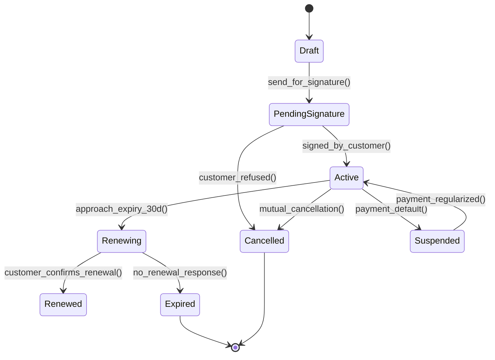
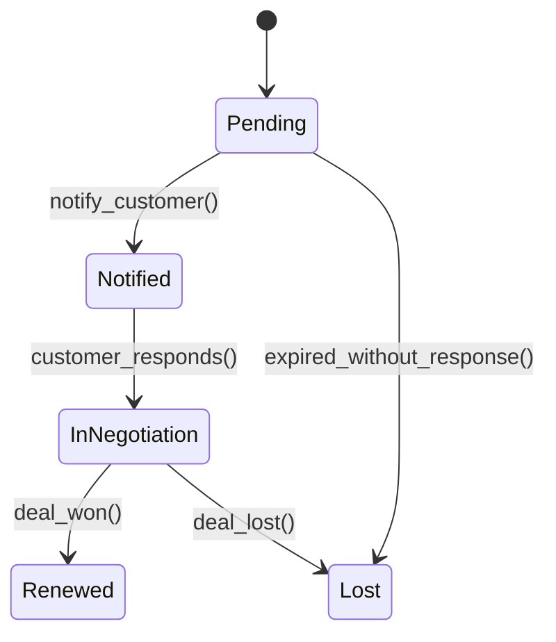
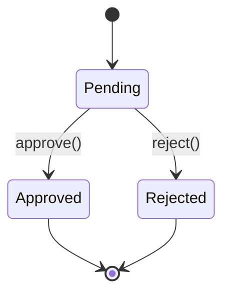

# Módulo: Contratos & Recorrência

> **[AI_RULE]** Documentação Level C Maximum — referência canônica para IA e desenvolvedores.

---

## 1. Visão Geral

O módulo de Contratos gerencia todo o ciclo de vida de contratos de prestação de serviço, desde a criação (via CRM/Orçamento ou manual) até a renovação ou cancelamento. Suporta:

- **Contratos pontuais** (`Contract`) — vínculo cliente + datas + status
- **Contratos recorrentes** (`RecurringContract`) — geração automática de OS e faturamento
- **Aditivos contratuais** (`contract_addendums`) — alteração de valor, escopo, prazo ou cancelamento
- **Medições** (`contract_measurements`) — aceite parcial com itens aceitos/rejeitados
- **Reajuste automático** (`contract_adjustments`) — índice IGPM/IPCA aplicado ao valor mensal
- **Renovação via CRM** (`CrmContractRenewal`) — acompanhamento de renovação como deal

---

## 2. Entidades (Models) — Campos Reais

### 2.1 `Contract`

| Campo | Tipo | Descrição |
|---|---|---|
| `id` | bigint PK | |
| `tenant_id` | bigint FK | Tenant (multi-tenant) |
| `customer_id` | bigint FK | Cliente vinculado |
| `number` | string(100), nullable | Número do contrato |
| `name` | string(255) | Nome/título do contrato |
| `description` | text, nullable | Descrição detalhada |
| `status` | string(50) | Estado atual (`draft`, `pending_signature`, `active`, `suspended`, `expired`, `cancelled`, `renewed`, `terminated`) |
| `start_date` | date, nullable | Início da vigência |
| `end_date` | date, nullable | Fim da vigência |
| `is_active` | boolean | Flag ativo/inativo |
| `created_at` / `updated_at` | timestamps | |
| `deleted_at` | timestamp, nullable | Soft delete |

**Traits:**`BelongsToTenant`, `SoftDeletes`, `Auditable`, `HasFactory`**Relationships:**

- `customer()` → `BelongsTo(Customer)`
- `serviceCalls()` → `HasMany(ServiceCall)`

---

### 2.2 `RecurringContract`

| Campo | Tipo | Descrição |
|---|---|---|
| `id` | bigint PK | |
| `tenant_id` | bigint FK | Tenant |
| `customer_id` | bigint FK, nullable | Cliente |
| `equipment_id` | bigint FK, nullable | Equipamento vinculado |
| `assigned_to` | bigint FK, nullable | Técnico responsável |
| `created_by` | bigint FK, nullable | Criado por (usuário) |
| `name` | string | Nome do contrato recorrente |
| `description` | text, nullable | Descrição |
| `frequency` | string, nullable | Frequência: `weekly`, `biweekly`, `monthly`, `bimonthly`, `quarterly`, `semiannual`, `annual` |
| `billing_type` | string, nullable | Tipo faturamento: `fixed_monthly`, `per_os`, `per_hour`, `per_visit`, `per_equipment`, `mixed` |
| `monthly_value` | decimal(10,2), nullable | Valor mensal fixo |
| `start_date` | date, nullable | Início |
| `end_date` | date, nullable | Término |
| `next_run_date` | date, nullable | Próxima geração de OS/billing |
| `priority` | string, nullable | Prioridade das OS geradas |
| `is_active` | boolean | Ativo |
| `generated_count` | integer | Quantidade de OS já geradas |
| `adjustment_index` | string, nullable | Índice de reajuste (IGPM, IPCA) |
| `next_adjustment_date` | date, nullable | Data do próximo reajuste |

**Traits:**`BelongsToTenant`, `SoftDeletes`, `Auditable`, `HasFactory`**Relationships:**

- `customer()` → `BelongsTo(Customer)`
- `equipment()` → `BelongsTo(Equipment)`
- `assignee()` → `BelongsTo(User, 'assigned_to')`
- `creator()` → `BelongsTo(User, 'created_by')`
- `items()` → `HasMany(RecurringContractItem)`

**Métodos de Negócio:**

- `advanceNextRunDate()` — avança `next_run_date` conforme `frequency`; desativa se ultrapassou `end_date`
- `generateWorkOrder()` → `WorkOrder` — cria OS com itens do template, registra status history, recalcula total
- `generateBilling()` → `AccountReceivable|null` — gera conta a receber para `fixed_monthly` (idempotente por período)

---

### 2.3 `RecurringContractItem`

| Campo | Tipo | Descrição |
|---|---|---|
| `id` | bigint PK | |
| `tenant_id` | bigint FK | Tenant |
| `recurring_contract_id` | bigint FK | Contrato recorrente pai |
| `type` | string | Tipo do item (service, product) |
| `description` | string | Descrição do item |
| `quantity` | decimal(10,2) | Quantidade |
| `unit_price` | decimal(10,2) | Preço unitário |

**Traits:**`BelongsToTenant`, `HasFactory`**Relationships:**

- `contract()` → `BelongsTo(RecurringContract, 'recurring_contract_id')`

---

### 2.4 `CrmContractRenewal`

| Campo | Tipo | Descrição |
|---|---|---|
| `id` | bigint PK | |
| `tenant_id` | bigint FK | Tenant |
| `customer_id` | bigint FK | Cliente |
| `deal_id` | bigint FK, nullable | Deal do CRM vinculado |
| `contract_end_date` | date | Data fim do contrato |
| `alert_days_before` | integer | Dias de antecedência para alerta |
| `status` | string | `pending`, `notified`, `in_negotiation`, `renewed`, `lost` |
| `current_value` | decimal(10,2) | Valor atual |
| `renewal_value` | decimal(10,2) | Valor proposto para renovação |
| `notes` | text, nullable | Observações |
| `notified_at` | datetime, nullable | Data da notificação |
| `renewed_at` | datetime, nullable | Data da renovação efetiva |

**Traits:**`BelongsToTenant`, `Auditable`**Scopes:**

- `scopePending($q)` — filtra status `pending`
- `scopeUpcoming($q, int $days = 60)` — contratos vencendo nos próximos N dias com status `pending` ou `notified`

**Relationships:**

- `customer()` → `BelongsTo(Customer)`
- `deal()` → `BelongsTo(CrmDeal, 'deal_id')`

---

### 2.5 `ContractType` (Lookup)

| Campo | Tipo | Descrição |
|---|---|---|
| `id` | bigint PK | |
| `name` | string | Nome do tipo (ex: Manutenção Preventiva, Suporte) |

Tabela: `contract_types`. Herda de `BaseLookup`.

---

### 2.6 Tabelas de Suporte (sem Model dedicado)

| Tabela | Campos Principais | Descrição |
|---|---|---|
| `contract_adjustments` | `contract_id`, `tenant_id`, `old_value`, `new_value`, `index_rate`, `effective_date`, `applied_by` | Histórico de reajustes |
| `contract_addendums` | `contract_id`, `tenant_id`, `type`, `description`, `new_value`, `new_end_date`, `effective_date`, `status`, `created_by`, `approved_by`, `approved_at` | Aditivos contratuais |
| `contract_measurements` | `contract_id`, `tenant_id`, `period`, `items` (JSON), `total_accepted`, `total_rejected`, `notes`, `status`, `created_by` | Medições periódicas |

---

## 3. Máquina de Estados

### 3.1 Contract (ciclo principal)



**Status válidos:** `draft` → `pending_signature` → `active` → `renewing` → `renewed` | `expired` | `suspended` → `active` | `cancelled`

### 3.2 CrmContractRenewal (ciclo de renovação)



**Status válidos:** `pending` → `notified` → `in_negotiation` → `renewed` | `lost`

### 3.3 Addendum (aditivo)



**Tipos de aditivo:** `value_change`, `scope_change`, `term_extension`, `cancellation`

---

## 4. Regras de Negócio `[AI_RULE]`

> **[AI_RULE] Renovação Automática**
> O sistema DEVE disparar verificação diária de contratos com `end_date` próximo. O Job `contracts:check-expiring` roda diariamente (registrado em `console.php`) e cria `CrmContractRenewal` para acompanhamento pelo CRM 30 dias antes do vencimento.

> **[AI_RULE] Cancelamento com Motivo**
> Cancelamento de contrato DEVE exigir campo `cancellation_reason` preenchido e aprovação gerencial para contratos com valor mensal > R$ 5.000,00. Aditivo tipo `cancellation` via `CreateAddendumRequest` com `effective_date` obrigatório.

> **[AI_RULE] Geração de Recorrência**
> `RecurringContract` gera `AccountReceivable` automaticamente no módulo Finance a cada período. O Job `contracts:bill-recurring` roda mensalmente no dia 1 às 06:00h. Os `RecurringContractItem` definem os serviços e valores de cada parcela. Billing é idempotente — chave `recurring_contract:{id}:{period}` impede duplicação.

> **[AI_RULE] Geração Automática de OS Preventiva**
> O comando `app:generate-recurring-work-orders` roda diariamente às 06:30h. Para cada `RecurringContract` ativo com `next_run_date <= hoje`, gera `WorkOrder` com `origin_type = ORIGIN_RECURRING`, copia itens, registra status history, e avança `next_run_date`.

> **[AI_RULE] Reajuste Automático de Contrato**
> Contratos com `adjustment_index` definido e `next_adjustment_date` dentro dos próximos 30 dias aparecem em `pendingAdjustments`. O `applyAdjustment` usa `bcmath` para cálculo preciso: `new_value = monthly_value * (1 + index_rate/100)`. Histórico salvo em `contract_adjustments`.

> **[AI_RULE] Aditivos com Aprovação**
> Aditivo criado com status `pending`. `approveAddendum` aplica alterações ao contrato: `new_value` atualiza `monthly_value`, `new_end_date` atualiza `end_date`, tipo `cancellation` desativa o contrato (`is_active = false`). Tudo em transação.

> **[AI_RULE] Medições com Aceite Parcial**
> `storeMeasurement` recebe array de itens com flag `accepted`. Calcula `total_accepted` e `total_rejected` usando `bcmath`. Medição criada com status `pending_approval`.

> **[AI_RULE] Churn Risk (Prevenção de Cancelamento)**
> Endpoint `churnRisk` classifica contratos por risco: `critical` (≤15 dias), `high` (≤30 dias), `medium` (≤60 dias). Retorna MRR at risk total e breakdown por nível.

> **[AI_RULE_CRITICAL] Tenant Isolation**
> Toda query DEVE filtrar por `tenant_id`. Models usam trait `BelongsToTenant` com global scope. Queries raw no `ContractsAdvancedController` incluem `where('tenant_id', $tenantId)` explicitamente.

> **[AI_RULE_CRITICAL] Eternal Lead (CRM Feedback Loop)**
> Todo Contrato que atingir o status `expired` ou `cancelled` DEVE disparar um evento `ContractEnded`. O CRM escuta este evento e cria automaticamente um `CrmLead` (pipeline de Win-back/Reativação) associado ao cliente, garantindo que nenhum cliente fique "esquecido" na base (regra Eternal Lead).

---

## 5. Comportamento Integrado (Cross-Domain)

| Direção | Domínio | Integração |
|---|---|---|
| → | **WorkOrders** | `RecurringContract.generateWorkOrder()` cria OS com `origin_type = ORIGIN_RECURRING`. Comando `app:generate-recurring-work-orders` roda diariamente. |
| → | **Finance** | `RecurringContract.generateBilling()` gera `AccountReceivable` com status `pending`. Comando `contracts:bill-recurring` roda mensalmente. |
| → | **ServiceCalls** | `Contract.serviceCalls()` vincula chamados técnicos ao contrato para cobertura de SLA. |
| → | **Helpdesk** | SLA do contrato define níveis de atendimento (prioridade, tempo resposta). |
| ← | **CRM** | `CrmContractRenewal` alimenta pipeline do CRM. Renovação bem-sucedida atualiza `CrmDeal` e `CrmForecastSnapshot`. |
| ← | **Quotes** | Orçamento aprovado pode ser convertido em contrato (fluxo manual via frontend). |
| ↔ | **Finance (Reajuste)** | `contract_adjustments` registra histórico de reajuste com `old_value`, `new_value`, `index_rate`. |

---

## 6. Contratos de API (JSON)

### 6.1 CRUD de Contratos

**`GET /api/v1/contracts`**

```text
Permission: contracts.contract.view
Query: ?per_page=20
Response: { data: Contract[], meta: Pagination }
Includes: customer:id,name
```

**`POST /api/v1/contracts`**

```text
Permission: contracts.contract.create
Body: { customer_id, number?, name, description?, status?, start_date?, end_date?, is_active? }
Validation: StoreContractRequest
Response: 201 { data: Contract }
```

**`GET /api/v1/contracts/{contract}`**

```text
Permission: contracts.contract.view
Response: { data: Contract }
Includes: customer:id,name
```

**`PUT /api/v1/contracts/{contract}`**

```text
Permission: contracts.contract.update
Body: campos parciais (sometimes)
Validation: UpdateContractRequest
Response: { data: Contract }
```

### 6.2 Contratos Recorrentes

**`GET /api/v1/recurring-contracts`**

```text
Permission: os.work_order.view
Response: { data: RecurringContract[], meta: Pagination }
```

**`POST /api/v1/recurring-contracts`**

```text
Permission: os.work_order.create
Body: { customer_id, equipment_id?, assigned_to?, name, description?, frequency, billing_type?, monthly_value?, start_date, end_date?, next_run_date, priority?, items: [] }
Response: 201 { data: RecurringContract }
```

**`POST /api/v1/recurring-contracts/{id}/generate`**

```text
Permission: os.work_order.create
Response: { data: WorkOrder } (OS gerada manualmente)
```

### 6.3 Operações Avançadas (contracts-advanced)

**`GET /api/v1/contracts-advanced/adjustments/pending`**

```text
Permission: contracts.contract.view
Response: { data: { pending_count, contracts[] } }
```

**`POST /api/v1/contracts-advanced/{contract}/adjust`**

```text
Permission: contracts.contract.update
Body: { index_rate: numeric(-50..100), effective_date: date }
Validation: ApplyContractAdjustmentRequest
Response: { data: { old_value, new_value, change_percent } }
```

**`GET /api/v1/contracts-advanced/churn-risk`**

```text
Permission: contracts.contract.view
Query: ?days=60
Response: { data: { total_at_risk, total_mrr_at_risk, by_risk_level: {critical, high, medium}, contracts[] } }
```

**`GET /api/v1/contracts-advanced/{contract}/addendums`**

```text
Permission: contracts.contract.view
Response: { data: Addendum[] }
```

**`POST /api/v1/contracts-advanced/{contract}/addendums`**

```text
Permission: contracts.contract.create
Body: { type: 'value_change'|'scope_change'|'term_extension'|'cancellation', description, new_value?, new_end_date?, effective_date }
Validation: CreateAddendumRequest
Response: 201 { data: { id, message } }
```

**`POST /api/v1/contracts-advanced/addendums/{addendum}/approve`**

```text
Permission: contracts.contract.update
Response: { message: 'Aditivo aprovado e aplicado.' }
```

**`GET /api/v1/contracts-advanced/{contract}/measurements`**

```text
Permission: contracts.contract.view
Response: { data: Measurement[], meta: Pagination }
```

**`POST /api/v1/contracts-advanced/{contract}/measurements`**

```text
Permission: contracts.contract.create
Body: { period, items: [{ description, quantity, unit_price, accepted? }], notes? }
Validation: StoreContractMeasurementRequest
Response: 201 { data: { id, total_accepted, total_rejected } }
```

---

## 7. Validação (FormRequests)

### `StoreContractRequest`

| Campo | Regras |
|---|---|
| `customer_id` | required, exists:customers,id (filtrado por tenant) |
| `number` | nullable, string, max:100 |
| `name` | required, string, max:255 (auto-preenchido da description se vazio) |
| `description` | nullable, string |
| `status` | nullable, string, max:50 (default: 'active') |
| `start_date` | nullable, date |
| `end_date` | nullable, date, after_or_equal:start_date |
| `is_active` | nullable, boolean (default: true) |
| `value` | nullable, numeric, min:0 |

### `UpdateContractRequest`

Mesmos campos com `sometimes` ao invés de `required`. Auto-preenche `name` da `description` se não enviado.

### `ApplyContractAdjustmentRequest`

| Campo | Regras |
|---|---|
| `index_rate` | required, numeric, min:-50, max:100 |
| `effective_date` | required, date |

### `CreateAddendumRequest`

| Campo | Regras |
|---|---|
| `type` | required, string, in:value_change,scope_change,term_extension,cancellation |
| `description` | required, string |
| `new_value` | nullable, numeric, min:0 |
| `new_end_date` | nullable, date |
| `effective_date` | required, date |

### `StoreContractMeasurementRequest`

| Campo | Regras |
|---|---|
| `period` | required, string |
| `items` | required, array, min:1 |
| `items.*.description` | required, string |
| `items.*.quantity` | required, numeric, min:0 |
| `items.*.unit_price` | required, numeric, min:0 |
| `items.*.accepted` | boolean |
| `notes` | nullable, string |

---

## 8. Permissões

### `ContractPolicy`

| Ação | Permissão | Verificação Tenant |
|---|---|---|
| `viewAny` | `contracts.contract.view` | — |
| `view` | `contracts.contract.view` | `current_tenant_id === model.tenant_id` |
| `create` | `contracts.contract.create` | — |
| `update` | `contracts.contract.update` | `current_tenant_id === model.tenant_id` |
| `delete` | `contracts.contract.delete` | `current_tenant_id === model.tenant_id` |

**Middleware nas rotas:**

- Contratos CRUD: `check.permission:contracts.contract.*`
- Contratos Recorrentes: `check.permission:os.work_order.*`
- Operações Avançadas: `check.permission:contracts.contract.*`

---

## 9. Fluxo Sequencial

### 9.1 Fluxo Principal: Venda → Contrato → Operação → Renovação

```text
1. [CRM/Quotes] Deal ganho ou Orçamento aprovado
       ↓
2. [Contracts] Criar Contract (status: draft)
       ↓
3. [Contracts] Enviar para assinatura (status: pending_signature)
       ↓
4. [Contracts] Cliente assina (status: active)
       ↓
5. [RecurringContract] Criar contrato recorrente com itens e frequência
       ↓
6. [Job diário 06:30] generateWorkOrder() → OS preventiva gerada
       ↓
7. [WorkOrders] Técnico executa OS → completa
       ↓
8. [Job mensal dia 1] generateBilling() → AccountReceivable criada
       ↓
9. [Finance] Faturamento e cobrança
       ↓
10. [30 dias antes do vencimento] CrmContractRenewal criada
       ↓
11. [CRM] Negociação de renovação
       ↓
12. [Contracts] Renovação efetivada (status: renewed) ou expirado
```

### 9.2 Fluxo de Reajuste

```text
1. [Job/Manual] Identificar contratos com next_adjustment_date próximo
2. [API] GET adjustments/pending
3. [API] POST {contract}/adjust com index_rate e effective_date
4. [Sistema] Calcula novo valor com bcmath, salva em contract_adjustments
5. [Sistema] Atualiza monthly_value e next_adjustment_date (+1 ano)
```

### 9.3 Fluxo de Aditivo

```text
1. [API] POST {contract}/addendums (tipo, descrição, valores)
2. [Sistema] Cria addendum com status pending
3. [Gestor] POST addendums/{id}/approve
4. [Sistema] Em transação: aprova addendum + aplica mudanças no contrato
```

---

## 10. Implementação Interna

### 10.1 Controllers

| Controller | Responsabilidade |
|---|---|
| `ContractController` | CRUD básico de `Contract` |
| `ContractsAdvancedController` | Reajuste, churn risk, aditivos, medições |
| `RecurringContractController` (em `Os/`) | CRUD e geração manual de OS para `RecurringContract` |

### 10.2 Métodos Chave — `RecurringContract`

```php
// Avança a data da próxima execução conforme frequência
advanceNextRunDate(): void

// Gera OS completa com itens, status history, recalcula total
generateWorkOrder(): WorkOrder

// Gera AccountReceivable para billing_type=fixed_monthly (idempotente)
generateBilling(): ?AccountReceivable
```

### 10.3 Jobs Agendados (`console.php`)

| Comando | Frequência | Descrição |
|---|---|---|
| `app:generate-recurring-work-orders` | Diário 06:30 | Gera OS para contratos recorrentes com `next_run_date` vencida |
| `contracts:bill-recurring` | Mensal dia 1, 06:00 | Gera `AccountReceivable` para contratos `fixed_monthly` |
| `contracts:check-expiring` | Diário | Verifica contratos próximos do vencimento e cria `CrmContractRenewal` |

### 10.4 Frontend (esperado)

- `useContracts()` — hook para CRUD de contratos
- `useRecurringContracts()` — hook para contratos recorrentes
- `ContractList` / `ContractForm` — componentes de listagem e formulário
- `ChurnRiskDashboard` — painel de risco de cancelamento
- `ContractAddendumDialog` — modal para criar/aprovar aditivos
- `ContractMeasurementForm` — formulário de medição

---

### Endpoints Rest (Extraídos do Backend)

| Método | Rota | Controller | Ação |
|--------|------|------------|------|
| `GET` | `/api/v1/contracts` | `ContractsController@index` | Listar |
| `GET` | `/api/v1/contracts/{id}` | `ContractsController@show` | Detalhes |
| `POST` | `/api/v1/contracts` | `ContractsController@store` | Criar |
| `PUT` | `/api/v1/contracts/{id}` | `ContractsController@update` | Atualizar |
| `DELETE` | `/api/v1/contracts/{id}` | `ContractsController@destroy` | Excluir |

## 11. Cenários BDD

### Cenário: Criar contrato a partir de orçamento aprovado

```gherkin
Dado que existe um orçamento aprovado para o cliente "Empresa ABC"
Quando o usuário cria um contrato com customer_id do "Empresa ABC"
  E preenche name "Manutenção Preventiva Anual"
  E define start_date "2026-04-01" e end_date "2027-03-31"
Então o contrato é criado com status "active"
  E o contrato aparece na listagem com customer.name "Empresa ABC"
```

### Cenário: Ativar contrato e gerar OS preventiva

```gherkin
Dado que existe um RecurringContract ativo
  E frequency "monthly" e next_run_date "2026-04-01"
  E possui 2 RecurringContractItems (serviço + produto)
Quando o Job app:generate-recurring-work-orders executa em "2026-04-01"
Então uma WorkOrder é criada com origin_type "recurring"
  E a OS possui 2 itens com quantity e unit_price corretos
  E next_run_date avança para "2026-05-01"
  E generated_count incrementa em 1
```

### Cenário: Gerar faturamento mensal automático

```gherkin
Dado que existe um RecurringContract com billing_type "fixed_monthly"
  E monthly_value 3500.00
Quando o Job contracts:bill-recurring executa
Então um AccountReceivable é criado com amount 3500.00
  E status "pending" e due_date +30 dias
  E notes contém "recurring_contract:{id}:{period}" para idempotência
Quando o Job executa novamente no mesmo período
Então nenhum novo AccountReceivable é criado (idempotente)
```

### Cenário: Renovar contrato via CRM

```gherkin
Dado que um Contract tem end_date em 25 dias
Quando o Job contracts:check-expiring executa
Então uma CrmContractRenewal é criada com status "pending"
  E contract_end_date reflete a data de vencimento
Quando o comercial muda status para "renewed"
Então renewed_at é preenchido com datetime atual
```

### Cenário: Aplicar reajuste contratual

```gherkin
Dado que existe um RecurringContract com monthly_value 5000.00
  E adjustment_index "IGPM" e next_adjustment_date <= hoje+30
Quando POST contracts-advanced/{id}/adjust com index_rate 8.5 e effective_date "2026-05-01"
Então monthly_value atualiza para 5425.00
  E contract_adjustments registra old_value=5000.00, new_value=5425.00, index_rate=8.5
  E next_adjustment_date avança para "2027-05-01"
```

### Cenário: Criar e aprovar aditivo de alteração de valor

```gherkin
Dado que existe um RecurringContract ativo com monthly_value 3000.00
Quando POST contracts-advanced/{id}/addendums com type "value_change", new_value 3500.00
Então addendum é criado com status "pending"
Quando POST addendums/{id}/approve
Então addendum.status = "approved" e approved_at preenchido
  E RecurringContract.monthly_value atualiza para 3500.00
```

### Cenário: Identificar risco de churn

```gherkin
Dado que existem 3 contratos vencendo nos próximos 60 dias
  E 1 com 10 dias restantes (monthly_value 2000.00)
  E 1 com 25 dias restantes (monthly_value 3000.00)
  E 1 com 50 dias restantes (monthly_value 1500.00)
Quando GET contracts-advanced/churn-risk?days=60
Então retorna total_at_risk=3, total_mrr_at_risk=6500.00
  E by_risk_level: critical=1, high=1, medium=1
```

### Cenário: Registrar medição com aceite parcial

```gherkin
Dado que existe um RecurringContract ativo
Quando POST contracts-advanced/{id}/measurements com period "2026-04"
  E items: [{ description: "Manutenção Ar", quantity: 1, unit_price: 500, accepted: true },
            { description: "Troca Filtro", quantity: 1, unit_price: 200, accepted: false }]
Então measurement é criada com total_accepted=500.00 e total_rejected=200.00
  E status "pending_approval"
```

---

---

## Edge Cases e Tratamento de Erros

| Cenário | Comportamento Esperado | Regra |
| --------- | ---------------------- | ------- |
| **Renovação duplicada** (job de renovação roda 2x no mesmo ciclo) | Idempotência obrigatória: verificar `renewed_contract_id` antes de criar. Se já existe contrato renovado para o ciclo atual → retornar o existente sem duplicar. Chave de idempotência: `parent_contract_id + period_start`. | `[AI_RULE_CRITICAL]` |
| **Billing em contrato cancelado** (job de faturamento processa contrato com status `cancelled`) | Verificar `status` antes de gerar fatura. Se `cancelled` ou `expired`: pular silenciosamente e logar `billing_skipped_inactive`. Apenas status `active` gera faturas. | `[AI_RULE_CRITICAL]` |
| **Reajuste retroativo** (índice IGPM publicado após data do reajuste) | Permitir reajuste retroativo com recálculo. Registrar `retroactive_adjustment = true` no log. Gerar nota de crédito/débito para diferença se faturas já foram emitidas no período. | `[AI_RULE]` |
| **Contrato sem itens** (contrato criado sem `ContractItem`) | Bloquear ativação (`draft → active`) se `items_count = 0`. Retornar 422 `contract_has_no_items`. Permitir salvar como draft sem itens. | `[AI_RULE]` |
| **SLA com meta impossível** (tempo de resposta < 0 ou > 720h) | Validar no FormRequest: `response_time_hours` entre 0.5 e 720. `resolution_time_hours` >= `response_time_hours`. Rejeitar com 422 se inválido. | `[AI_RULE]` |
| **Overlap de vigência** (2 contratos ativos para mesmo cliente no mesmo período) | Verificar sobreposição de `start_date/end_date` para mesmo `customer_id` + `tenant_id` ao ativar. Se overlap: alertar com warning (não bloquear) e registrar `overlapping_contract_id`. | `[AI_RULE]` |
| **Cálculo de valor com precisão** (arredondamento em billing parcial) | Usar `bcmath` com 4 casas decimais para cálculos intermediários. Arredondar para 2 casas apenas no resultado final. Nunca usar `float` nativo para valores monetários. | `[AI_RULE]` |

---

## 12. Checklist de Implementação

- [x] Model `Contract` com BelongsToTenant, SoftDeletes, Auditable
- [x] Model `RecurringContract` com geração de OS e billing
- [x] Model `RecurringContractItem` com campos type, description, quantity, unit_price
- [x] Model `CrmContractRenewal` com status machine e scopes
- [x] Lookup `ContractType`
- [x] `ContractController` — CRUD completo com Policy
- [x] `ContractsAdvancedController` — reajuste, churn, aditivos, medições
- [x] `ContractPolicy` com verificação de tenant ownership
- [x] `StoreContractRequest` / `UpdateContractRequest` com validação tenant-aware
- [x] `ApplyContractAdjustmentRequest` com limites min:-50 max:100
- [x] `CreateAddendumRequest` com tipos enum validados
- [x] `StoreContractMeasurementRequest` com items array
- [x] Job `app:generate-recurring-work-orders` — diário 06:30
- [x] Job `contracts:bill-recurring` — mensal dia 1
- [x] Job `contracts:check-expiring` — diário
- [x] Rotas CRUD em `missing-routes.php`
- [x] Rotas avançadas em `advanced-lots.php`
- [x] Rotas recorrentes em `work-orders.php`
- [ ] Frontend: componentes de listagem e formulário
- [ ] Frontend: dashboard de churn risk
- [ ] Frontend: modal de aditivos
- [ ] Frontend: formulário de medição
- [ ] Testes: ContractController CRUD
- [ ] Testes: RecurringContract geração de OS
- [ ] Testes: RecurringContract billing idempotente
- [ ] Testes: Reajuste com bcmath precision
- [ ] Testes: Aditivo aprovação com transação
- [ ] Testes: Medição com aceite parcial

---

## 13. Evento: ContractRenewing

**Classe**: `App\Events\ContractRenewing`
**Traits**: `Dispatchable`, `SerializesModels`

```php
public function __construct(
    public RecurringContract $contract,
    public int $daysUntilEnd,
) {}
```

**Disparado quando**: Contrato recorrente esta proximo do vencimento (`end_date`).

**Payload**:

- `RecurringContract $contract` — contrato recorrente que esta vencendo
- `int $daysUntilEnd` — dias restantes ate o fim do contrato

**Listeners potenciais**:

- Criar `CrmContractRenewal` para acompanhamento no CRM
- Enviar notificacao ao gestor comercial
- Disparar fluxo de renovacao automatica

---

## 14. Model: SupplierContract

> **Nota**: Este model pertence ao dominio Finance (contratos com fornecedores), mas esta documentado aqui por contexto.

**Classe**: `App\Models\SupplierContract`
**Tabela**: `supplier_contracts`
**Traits**: `BelongsToTenant`

| Campo | Tipo | Descricao |
|---|---|---|
| `id` | bigint PK | |
| `tenant_id` | bigint FK | Tenant (multi-tenant) |
| `supplier_id` | bigint FK | Fornecedor vinculado |
| `title` | string | Titulo do contrato |
| `description` | text, nullable | Descricao |
| `value` | decimal(10,2) | Valor do contrato |
| `start_date` | date | Inicio da vigencia |
| `end_date` | date | Fim da vigencia |
| `status` | string | Status do contrato |
| `auto_renew` | boolean | Renovacao automatica |
| `payment_frequency` | string, nullable | Frequencia: `monthly`, `quarterly`, `annual`, `one_time` |
| `alert_days_before` | integer | Dias de antecedencia para alerta |
| `notes` | text, nullable | Observacoes |

**Relationships**:

- `supplier()` → `BelongsTo(Supplier)`

**Accessor `paymentFrequency`**: Normaliza valor via `LookupValueResolver` usando `SupplierContractPaymentFrequency` lookup.

**Rotas** (em `routes/api/advanced-features.php`):

| Metodo | Rota | Permissao | Acao |
|---|---|---|---|
| GET | `supplier-contracts` | `financeiro.view\|finance.payable.view` | Listar |
| POST | `supplier-contracts` | `financeiro.payment.create\|finance.payable.create` | Criar |
| PUT | `supplier-contracts/{contract}` | `financeiro.payment.create\|finance.payable.update` | Atualizar |
| DELETE | `supplier-contracts/{contract}` | `financeiro.payment.create\|finance.payable.delete` | Excluir |

---

## 15. Inventario Completo do Codigo

### 15.1 Controllers (3 controllers, 16 endpoints)

| Controller | Namespace | Endpoints | Responsabilidade |
|---|---|---|---|
| `ContractController` | `Api\V1` | 4 | CRUD basico de `Contract` (`index`, `store`, `show`, `update`) |
| `ContractsAdvancedController` | `Api\V1` | 8 | Reajuste (`pendingAdjustments`, `applyAdjustment`), churn risk, aditivos (`contractAddendums`, `createAddendum`, `approveAddendum`), medicoes (`contractMeasurements`, `storeMeasurement`) |
| `RecurringContractController` | `Api\V1\Os` | 4 | CRUD de `RecurringContract` e geracao manual de OS (`generate`) |

### 15.2 Models (5 models)

| Model | Tabela | Traits |
|---|---|---|
| `Contract` | `contracts` | `BelongsToTenant`, `SoftDeletes`, `Auditable`, `HasFactory` |
| `RecurringContract` | `recurring_contracts` | `BelongsToTenant`, `SoftDeletes`, `Auditable`, `HasFactory` |
| `RecurringContractItem` | `recurring_contract_items` | `BelongsToTenant`, `HasFactory` |
| `CrmContractRenewal` | `crm_contract_renewals` | `BelongsToTenant`, `Auditable` |
| `SupplierContract` | `supplier_contracts` | `BelongsToTenant` |

**Tabelas de suporte (sem model dedicado)**:

- `contract_adjustments` — historico de reajustes
- `contract_addendums` — aditivos contratuais
- `contract_measurements` — medicoes periodicas
- `contract_types` — lookup de tipos (via `ContractType` / `BaseLookup`)

### 15.3 Events

| Evento | Classe | Payload | Descricao |
|---|---|---|---|
| `ContractRenewing` | `App\Events\ContractRenewing` | `RecurringContract $contract`, `int $daysUntilEnd` | Contrato recorrente proximo do vencimento |

### 15.4 FormRequests (5 arquivos)

| # | FormRequest | Endpoint |
|---|---|---|
| 1 | `StoreContractRequest` | `POST contracts` |
| 2 | `UpdateContractRequest` | `PUT contracts/{id}` |
| 3 | `ApplyContractAdjustmentRequest` | `POST contracts-advanced/{id}/adjust` |
| 4 | `CreateAddendumRequest` | `POST contracts-advanced/{id}/addendums` |
| 5 | `StoreContractMeasurementRequest` | `POST contracts-advanced/{id}/measurements` |

### 15.5 Policies

| Policy | Permissoes |
|---|---|
| `ContractPolicy` | `contracts.contract.view`, `contracts.contract.create`, `contracts.contract.update`, `contracts.contract.delete` |

### 15.6 Rotas Completas (por arquivo)

**`routes/api/missing-routes.php`** — CRUD de contratos:

| Metodo | Rota | Controller | Acao |
|---|---|---|---|
| GET | `contracts` | `ContractController@index` | Listar contratos |
| GET | `contracts/{id}` | `ContractController@show` | Detalhar contrato |
| POST | `contracts` | `ContractController@store` | Criar contrato |
| PUT | `contracts/{id}` | `ContractController@update` | Atualizar contrato |
| DELETE | `contracts/{id}` | `ContractController@destroy` | Excluir contrato |

**`routes/api/advanced-lots.php`** — Operacoes avancadas:

| Metodo | Rota | Controller | Acao |
|---|---|---|---|
| GET | `contracts-advanced/adjustments/pending` | `ContractsAdvancedController@pendingAdjustments` | Reajustes pendentes |
| POST | `contracts-advanced/{contract}/adjust` | `ContractsAdvancedController@applyAdjustment` | Aplicar reajuste |
| GET | `contracts-advanced/churn-risk` | `ContractsAdvancedController@churnRisk` | Risco de churn |
| GET | `contracts-advanced/{contract}/addendums` | `ContractsAdvancedController@contractAddendums` | Listar aditivos |
| POST | `contracts-advanced/{contract}/addendums` | `ContractsAdvancedController@createAddendum` | Criar aditivo |
| POST | `contracts-advanced/addendums/{addendum}/approve` | `ContractsAdvancedController@approveAddendum` | Aprovar aditivo |
| GET | `contracts-advanced/{contract}/measurements` | `ContractsAdvancedController@contractMeasurements` | Listar medicoes |
| POST | `contracts-advanced/{contract}/measurements` | `ContractsAdvancedController@storeMeasurement` | Registrar medicao |

**`routes/api/work-orders.php`** — Contratos recorrentes:

| Metodo | Rota | Controller | Acao |
|---|---|---|---|
| GET | `recurring-contracts` | `RecurringContractController@index` | Listar |
| POST | `recurring-contracts` | `RecurringContractController@store` | Criar |
| PUT | `recurring-contracts/{id}` | `RecurringContractController@update` | Atualizar |
| POST | `recurring-contracts/{id}/generate` | `RecurringContractController@generate` | Gerar OS manualmente |

**`routes/api/advanced-features.php`** — Contratos de fornecedor:

| Metodo | Rota | Controller | Acao |
|---|---|---|---|
| GET | `supplier-contracts` | `FinancialAdvancedController@supplierContracts` | Listar |
| POST | `supplier-contracts` | `FinancialAdvancedController@storeSupplierContract` | Criar |
| PUT | `supplier-contracts/{contract}` | `FinancialAdvancedController@updateSupplierContract` | Atualizar |
| DELETE | `supplier-contracts/{contract}` | `FinancialAdvancedController@destroySupplierContract` | Excluir |

### 15.7 Jobs Agendados (`console.php`)

| Comando | Frequencia | Descricao |
|---|---|---|
| `app:generate-recurring-work-orders` | Diario 06:30 | Gera OS para contratos recorrentes com `next_run_date` vencida |
| `contracts:bill-recurring` | Mensal dia 1, 06:00 | Gera `AccountReceivable` para contratos `fixed_monthly` |
| `contracts:check-expiring` | Diario | Verifica contratos proximos do vencimento e cria `CrmContractRenewal` |

### 15.8 Arvore de Arquivos

```text
backend/app/
  Events/
    ContractRenewing.php
  Http/
    Controllers/Api/V1/
      ContractController.php              (4 endpoints)
      ContractsAdvancedController.php     (8 endpoints)
      Os/
        RecurringContractController.php   (4 endpoints)
    Requests/
      ApplyContractAdjustmentRequest.php
      CreateAddendumRequest.php
      StoreContractMeasurementRequest.php
      StoreContractRequest.php
      UpdateContractRequest.php
  Models/
    Contract.php
    RecurringContract.php
    RecurringContractItem.php
    CrmContractRenewal.php
    SupplierContract.php
  Policies/
    ContractPolicy.php
backend/routes/
  api/missing-routes.php          (CRUD contracts)
  api/advanced-lots.php           (contracts-advanced)
  api/work-orders.php             (recurring-contracts)
  api/advanced-features.php       (supplier-contracts)
```

---

## Fluxos Relacionados

| Fluxo | Descrição |
|-------|-----------|
| [Faturamento Pós-Serviço](file:///c:/PROJETOS/sistema/docs/fluxos/FATURAMENTO-POS-SERVICO.md) | Processo documentado em `docs/fluxos/FATURAMENTO-POS-SERVICO.md` |
| [Garantia](file:///c:/PROJETOS/sistema/docs/fluxos/GARANTIA.md) | Processo documentado em `docs/fluxos/GARANTIA.md` |
| [Onboarding de Cliente](file:///c:/PROJETOS/sistema/docs/fluxos/ONBOARDING-CLIENTE.md) | Processo documentado em `docs/fluxos/ONBOARDING-CLIENTE.md` |
