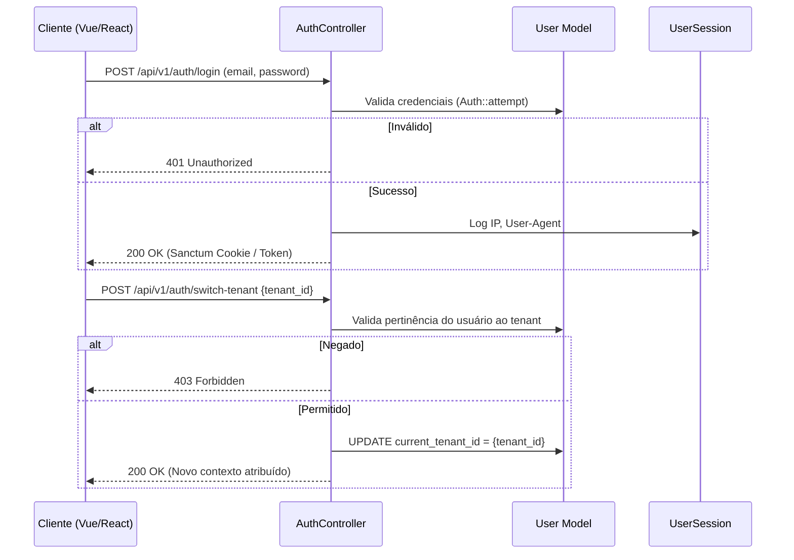
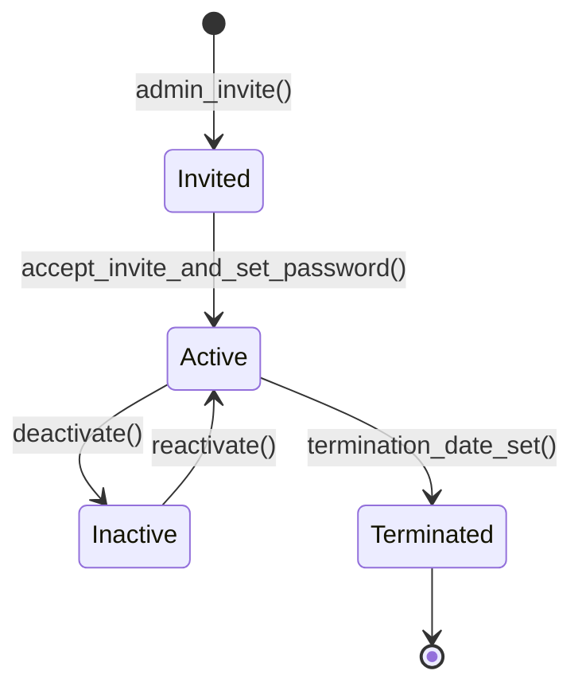
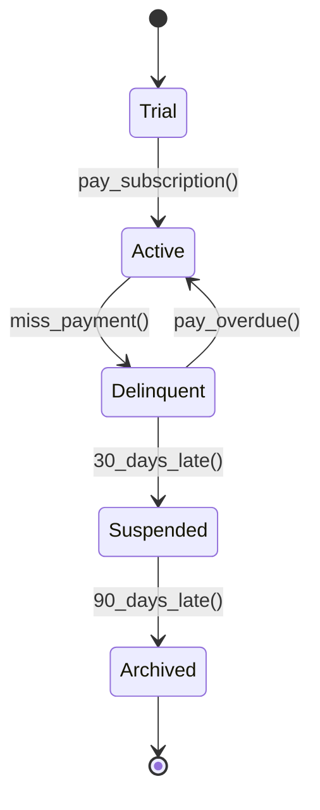
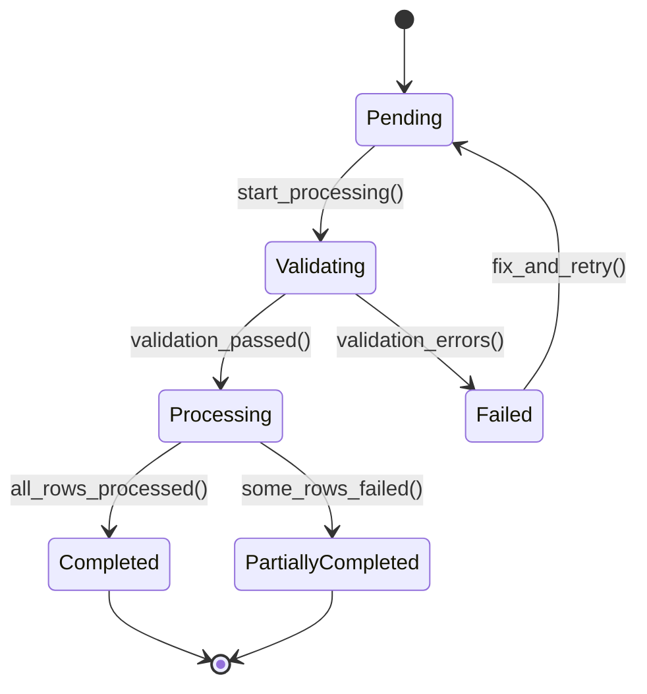

# Módulo: Core & Plataforma

> **[AI_RULE]** Este módulo é a fundação da plataforma Kalibrium ERP. Todas as demais módulos dependem dele para autenticação, autorização, multi-tenancy, auditoria e configurações. Lista oficial de entidades (Models) associadas a este domínio no Laravel.

---

## 1. Visão Geral

O módulo Core é o hub central do Kalibrium ERP SaaS. Ele provê:

- **Multi-tenancy** com isolamento total via `BelongsToTenant` trait (global scope automático)
- **IAM (Identity & Access Management)** com Spatie Permissions + Sanctum
- **Auditoria criptográfica** com hash chain (cadeia imutável de logs)
- **Notificações multi-canal** (in-app, email, push)
- **Configurações** por tenant e por sistema
- **Numeração sequencial** atômica (OS, NF, Orçamento) sem gaps
- **Import/Export** de dados em lote com validação e rollback
- **Busca globalizada** full-text via `SearchIndex`
- **Automação** de regras e relatórios agendados

---

## 2. Entidades Principais (Models)

### 2.1 `Tenant`

**Arquivo:** `backend/app/Models/Tenant.php`
**Tabela:** `tenants`
**Traits:** `HasFactory`, `Auditable`, `SoftDeletes`
**Observer:** `TenantObserver`

| Campo | Tipo | Descrição |
|-------|------|-----------|
| `id` | int (PK) | Identificador único |
| `name` | string | Razão social |
| `trade_name` | string\|null | Nome fantasia |
| `document` | string | CNPJ/CPF |
| `email` | string | Email principal |
| `phone` | string\|null | Telefone |
| `status` | enum(`active`, `inactive`, `trial`) | Status do tenant — cast `TenantStatus` |
| `website` | string\|null | Website |
| `slug` | string | Slug único para URLs |
| `is_active` | boolean | Flag de ativação |
| `signing_key` | string\|null | Chave de assinatura para hash chain |
| `state_registration` | string\|null | Inscrição estadual |
| `city_registration` | string\|null | Inscrição municipal |
| `address_street` | string\|null | Logradouro |
| `address_number` | string\|null | Número |
| `address_complement` | string\|null | Complemento |
| `address_neighborhood` | string\|null | Bairro |
| `address_city` | string\|null | Cidade |
| `address_state` | string\|null | UF |
| `address_zip` | string\|null | CEP |
| `inmetro_config` | json\|null | Configuração Inmetro |
| `logo_path` | string\|null | Caminho do logotipo |
| `fiscal_regime` | string\|null | Regime fiscal (`simples_nacional`, `lucro_presumido`, `lucro_real`, `mei`, `isento`) |
| `cnae_code` | string\|null | CNAE principal |
| `fiscal_certificate_path` | string\|null | Certificado digital A1 |
| `fiscal_certificate_password` | string\|null | Senha do certificado (encrypted) |
| `fiscal_certificate_expires_at` | date\|null | Validade do certificado |
| `fiscal_nfse_token` | string\|null | Token NFSe municipal |
| `fiscal_nfe_series` | string\|null | Série NFe |
| `fiscal_nfe_next_number` | int\|null | Próximo número NFe |
| `fiscal_nfse_rps_next_number` | int\|null | Próximo RPS NFSe |
| `deleted_at` | timestamp\|null | Soft delete |

**Constantes de status:**

```php
public const STATUS_ACTIVE = 'active';
public const STATUS_INACTIVE = 'inactive';
public const STATUS_TRIAL = 'trial';
```

**Relationships:**

- `branches(): HasMany → Branch`
- `users(): BelongsToMany → User` (via `user_tenants`)
- `settings(): HasMany → TenantSetting`
- `holidays(): HasMany → TenantHoliday`

---

### 2.2 `User`

**Arquivo:** `backend/app/Models/User.php`
**Tabela:** `users`
**Traits:** `HasFactory`, `Notifiable`, `HasApiTokens`, `Auditable`, `SoftDeletes`, `HasRoles` (Spatie)
**Guard:** `web`

| Campo | Tipo | Descrição |
|-------|------|-----------|
| `id` | int (PK) | Identificador único |
| `name` | string | Nome completo |
| `email` | string (unique) | Email de login |
| `email_verified_at` | timestamp\|null | Data de verificação do email |
| `phone` | string\|null | Telefone |
| `password` | string (hashed) | Senha |
| `is_active` | boolean | Ativo/inativo |
| `tenant_id` | int (FK) | Tenant padrão |
| `branch_id` | int\|null (FK) | Filial |
| `current_tenant_id` | int\|null (FK) | **Tenant ativo na sessão** — usado por toda a plataforma |
| `last_login_at` | timestamp\|null | Último login |
| `location_lat` | decimal\|null | Latitude GPS atual |
| `location_lng` | decimal\|null | Longitude GPS atual |
| `location_updated_at` | timestamp\|null | Última atualização de localização |
| `status` | string\|null | Status operacional |
| `denied_permissions` | json\|null | Permissões negadas explicitamente |
| `google_calendar_token` | string\|null | Token Google Calendar |
| `google_calendar_refresh_token` | string\|null | Refresh token Google Calendar |
| `google_calendar_email` | string\|null | Email Google Calendar |
| `google_calendar_synced_at` | timestamp\|null | Última sincronização |
| `termination_date` | date\|null | Data de desligamento (HR) |
| `dependents_count` | int\|null | Número de dependentes (HR) |
| `deleted_at` | timestamp\|null | Soft delete |

**Relationships:**

- `tenants(): BelongsToMany → Tenant` (via `user_tenants` com pivot `is_default`)
- `currentTenant(): BelongsTo → Tenant`
- `branch(): BelongsTo → Branch`
- `notifications(): HasMany → Notification`
- `sessions(): HasMany → UserSession`
- `favorites(): HasMany → UserFavorite`
- `roles(): MorphToMany → Role` (via Spatie `model_has_roles`)

**Spatie HasRoles Override:**

```php
use HasRoles {
    hasPermissionTo as spatieHasPermissionTo;
    assignRole as spatieAssignRole;
}
```

---

### 2.3 `Role`

**Arquivo:** `backend/app/Models/Role.php`
**Extends:** `Spatie\Permission\Models\Role`

| Campo | Tipo | Descrição |
|-------|------|-----------|
| `id` | int (PK) | Identificador |
| `name` | string | Nome técnico (`super_admin`, `admin`, etc.) |
| `display_name` | string\|null | Nome amigável |
| `description` | string\|null | Descrição |
| `guard_name` | string | Guard (`web`) |
| `tenant_id` | int\|null (FK) | Tenant (roles por tenant) |

**Constantes de Roles do Sistema:**

```php
public const SUPER_ADMIN = 'super_admin';
public const ADMIN = 'admin';
public const GERENTE = 'gerente';
public const COORDENADOR = 'coordenador';
public const TECNICO = 'tecnico';
public const FINANCEIRO = 'financeiro';
public const COMERCIAL = 'comercial';
public const ATENDENTE = 'atendente';
public const RH = 'rh';
public const ESTOQUISTA = 'estoquista';
public const QUALIDADE = 'qualidade';
public const VISUALIZADOR = 'visualizador';
public const MOTORISTA = 'motorista';
public const MONITOR = 'monitor';
```

**Relationships:**

- `tenant(): BelongsTo → Tenant`
- `users(): MorphToMany → User`

---

### 2.4 `AuditLog`

**Arquivo:** `backend/app/Models/AuditLog.php`
**Tabela:** `audit_logs`
**Traits:** `BelongsToTenant`, `HasFactory`
**Timestamps:** `false` (apenas `created_at`)

| Campo | Tipo | Descrição |
|-------|------|-----------|
| `id` | int (PK) | Identificador |
| `tenant_id` | int (FK) | Tenant |
| `user_id` | int\|null (FK) | Usuário que realizou ação |
| `action` | enum `AuditAction` | Ação (`created`, `updated`, `deleted`, `restored`, `login`, `logout`, `exported`, `imported`, `approved`, `rejected`) |
| `auditable_type` | string | Tipo do model (morph) |
| `auditable_id` | int | ID do model (morph) |
| `description` | string\|null | Descrição |
| `old_values` | json\|null | Valores antes da alteração |
| `new_values` | json\|null | Valores depois da alteração |
| `ip_address` | string\|null | IP do request |
| `user_agent` | string\|null | User agent |
| `created_at` | timestamp | Data/hora |

**Relationships:**

- `user(): BelongsTo → User`
- `auditable(): MorphTo` (qualquer model auditável)

---

### 2.5 `Notification`

**Arquivo:** `backend/app/Models/Notification.php`
**Tabela:** `notifications`
**Traits:** `BelongsToTenant`, `HasFactory`

| Campo | Tipo | Descrição |
|-------|------|-----------|
| `id` | int (PK) | Identificador |
| `tenant_id` | int (FK) | Tenant |
| `user_id` | int (FK) | Destinatário |
| `type` | string | Tipo (`calibration_due`, `crm_follow_up_due`, `crm_health_alert`, etc.) |
| `title` | string | Título da notificação |
| `message` | string\|null | Mensagem detalhada |
| `icon` | string\|null | Ícone (Lucide icon name) |
| `color` | string\|null | Cor (`red`, `amber`, `green`, etc.) |
| `link` | string\|null | URL de ação no frontend |
| `notifiable_type` | string\|null | Tipo do model vinculado (morph) |
| `notifiable_id` | int\|null | ID do model vinculado (morph) |
| `data` | json\|null | Dados extras |
| `read_at` | timestamp\|null | Data de leitura |

**Scopes:** `scopeUnread` — filtra notificações não lidas

**Factory Methods:**

- `Notification::notify($tenantId, $userId, $type, $title, $opts)`
- `Notification::calibrationDue($equipment, $userId, $daysRemaining)`

**Relationships:**

- `user(): BelongsTo → User`
- `notifiable(): MorphTo`

---

### 2.6 `TenantSetting`

**Arquivo:** `backend/app/Models/TenantSetting.php`
**Tabela:** `tenant_settings`
**Traits:** `BelongsToTenant`, `HasFactory`

| Campo | Tipo | Descrição |
|-------|------|-----------|
| `id` | int (PK) | Identificador |
| `tenant_id` | int (FK) | Tenant |
| `key` | string | Chave da configuração (ex: `sso_enabled`, `default_timezone`) |
| `value_json` | json | Valor (cast `array`) |

**Métodos estáticos:**

- `TenantSetting::getValue(int $tenantId, string $key, mixed $default)`
- `TenantSetting::setValue(int $tenantId, string $key, mixed $value)`

---

### 2.7 `SystemSetting`

**Arquivo:** `backend/app/Models/SystemSetting.php`
**Tabela:** `system_settings`
**Traits:** `BelongsToTenant`, `HasFactory`

| Campo | Tipo | Descrição |
|-------|------|-----------|
| `id` | int (PK) | Identificador |
| `tenant_id` | int (FK) | Tenant |
| `key` | string | Chave |
| `value` | string | Valor armazenado como string |
| `type` | enum `SettingType` | Tipo (`string`, `boolean`, `integer`, `json`) |
| `group` | enum `SettingGroup` | Grupo (`general`, `fiscal`, `operational`, `financial`, `hr`, `notification`, `integration`, `appearance`) |

**Métodos:**

- `getTypedValue(): mixed` — converte o `value` string para o tipo correto
- `SystemSetting::getValue(string $key, mixed $default)`
- `SystemSetting::setValue(string $key, mixed $value, SettingType $type, SettingGroup $group)`

---

### 2.8 `Branch`

**Arquivo:** `backend/app/Models/Branch.php`
**Tabela:** `branches`
**Traits:** `BelongsToTenant`, `HasFactory`, `Auditable`

| Campo | Tipo | Descrição |
|-------|------|-----------|
| `id` | int (PK) | Identificador |
| `tenant_id` | int (FK) | Tenant |
| `name` | string | Nome da filial |
| `code` | string\|null | Código interno |
| `address_street` | string\|null | Logradouro |
| `address_number` | string\|null | Número |
| `address_complement` | string\|null | Complemento |
| `address_neighborhood` | string\|null | Bairro |
| `address_city` | string\|null | Cidade |
| `address_state` | string\|null | UF |
| `address_zip` | string\|null | CEP |
| `phone` | string\|null | Telefone |
| `email` | string\|null | Email |

**Relationships:**

- `tenant(): BelongsTo → Tenant`
- `users(): HasMany → User`
- `numberingSequences(): HasMany → NumberingSequence`

---

### 2.9 `NumberingSequence`

**Arquivo:** `backend/app/Models/NumberingSequence.php`
**Tabela:** `numbering_sequences`
**Traits:** `BelongsToTenant`, `HasFactory`

| Campo | Tipo | Descrição |
|-------|------|-----------|
| `id` | int (PK) | Identificador |
| `tenant_id` | int (FK) | Tenant |
| `branch_id` | int\|null (FK) | Filial (numeração pode ser por filial) |
| `entity` | string | Tipo de entidade (`work_order`, `quote`, `invoice`, etc.) |
| `prefix` | string\|null | Prefixo (ex: `OS-`, `ORC-`) |
| `next_number` | int | Próximo número a ser reservado |
| `padding` | int | Zero-padding (ex: 5 → `00001`) |

**Método crítico:**

```php
public function reserveNext(): string // Usa DB::raw lock pessimista para atomicidade
```

**Relationships:**

- `tenant(): BelongsTo → Tenant`
- `branch(): BelongsTo → Branch`

---

### 2.10 `Import`

**Arquivo:** `backend/app/Models/Import.php`
**Tabela:** `imports`
**Traits:** `BelongsToTenant`, `HasFactory`

| Campo | Tipo | Descrição |
|-------|------|-----------|
| `id` | int (PK) | Identificador |
| `tenant_id` | int (FK) | Tenant |
| `user_id` | int (FK) | Quem iniciou |
| `entity_type` | string | Tipo de entidade importada |
| `file_name` | string | Nome do arquivo no storage |
| `original_name` | string | Nome original do upload |
| `status` | enum `ImportStatus` | `pending`, `processing`, `done`, `failed`, `rolled_back`, `partially_rolled_back` |
| `strategy` | string | Estratégia de duplicatas: `skip`, `update`, `create` |
| `total_rows` | int\|null | Total de linhas |
| `processed_rows` | int\|null | Linhas processadas |
| `error_rows` | int\|null | Linhas com erro |
| `errors` | json\|null | Detalhes dos erros |

**Constantes de estratégia:**

```php
public const STRATEGY_SKIP = 'skip';
public const STRATEGY_UPDATE = 'update';
public const STRATEGY_CREATE = 'create';
```

**Scopes:** `scopeByEntity`, `scopeSearch`

---

### 2.11 Entidades Complementares

| Model | Tabela | Descrição |
|-------|--------|-----------|
| `UserSession` | `user_sessions` | Sessões ativas do usuário (token, IP, user_agent) |
| `UserFavorite` | `user_favorites` | Itens favoritos (bookmarks) do usuário |
| `TenantHoliday` | `tenant_holidays` | Feriados customizados por tenant |
| `Holiday` | `holidays` | Feriados nacionais (compartilhados) |
| `Department` | `departments` | Departamentos da empresa |
| `Position` | `positions` | Cargos |
| `BusinessHour` | `business_hours` | Horários de funcionamento |
| `TwoFactorAuth` | `two_factor_auths` | Configuração 2FA por usuário |
| `SsoConfig` | `sso_configs` | Configuração SSO (SAML/OIDC) por tenant |
| `PermissionGroup` | `permission_groups` | Agrupamento visual de permissões |
| `SystemAlert` | `system_alerts` | Alertas de sistema |
| `SearchIndex` | `search_indices` | Tabela desnormalizada para busca full-text |
| `ImportTemplate` | `import_templates` | Templates de importação reutilizáveis |
| `ExportJob` | `export_jobs` | Jobs de exportação de dados |
| `PushSubscription` | `push_subscriptions` | Assinaturas push notification |
| `AccessRestriction` | `access_restrictions` | Restrições de acesso (IP whitelist, horário) |
| `ScheduledReport` | `scheduled_reports` | Relatórios agendados recorrentes |
| `QuickNote` | `quick_notes` | Notas rápidas do usuário |
| `AutomationRule` | `automation_rules` | Regras de automação do sistema |
| `AlertConfiguration` | `alert_configurations` | Configurações de alertas personalizados |

---

## 3. Entidades de Lookup (Taxonomia)

Todas herdam de `BaseLookup`. São configuráveis por tenant e usadas para evitar hardcoded values.

| Lookup | Módulo que Consome |
|--------|--------------------|
| `AccountReceivableCategory` | Finance |
| `AutomationReportFormat` | Core (Reports) |
| `AutomationReportFrequency` | Core (Reports) |
| `AutomationReportType` | Core (Reports) |
| `BankAccountType` | Finance |
| `CalibrationType` | Calibration |
| `CancellationReason` | WorkOrders, Quotes |
| `ContractType` | Contracts |
| `CustomerCompanySize` | CRM |
| `CustomerRating` | CRM |
| `CustomerSegment` | CRM |
| `DocumentType` | Core (Import/Export) |
| `EquipmentBrand` | Equipment |
| `EquipmentCategory` | Equipment |
| `EquipmentType` | Equipment |
| `FleetFuelType` | Fleet |
| `FleetVehicleStatus` | Fleet |
| `FleetVehicleType` | Fleet |
| `FollowUpChannel` | CRM |
| `FollowUpStatus` | CRM |
| `FuelingFuelType` | Fleet |
| `InmetroSealStatus` | Inmetro |
| `InmetroSealType` | Inmetro |
| `LeadSource` | CRM |
| `MaintenanceType` | Equipment, Fleet |
| `MeasurementUnit` | Calibration, Inventory |
| `OnboardingTemplateType` | HR |
| `PaymentTerm` | Finance, Quotes |
| `PriceTableAdjustmentType` | Pricing |
| `QuoteSource` | Quotes |
| `ServiceType` | WorkOrders |
| `SupplierContractPaymentFrequency` | Contracts |
| `TvCameraType` | TV Dashboard |

---

## 4. Services

### 4.1 `TenantService`

**Arquivo:** `backend/app/Services/TenantService.php`

Responsável por todo o ciclo de vida do tenant.

**Métodos principais:**

- `create(array $data): Tenant` — Cria tenant + settings iniciais + roles padrão
- `activate(Tenant $tenant): void` — Ativa tenant (`status → active`)
- `deactivate(Tenant $tenant): void` — Desativa tenant (`status → inactive`), verifica dependências
- `assignRoleToUser(User $user, string $roleName): void` — Atribui role ao usuário no tenant
- `sendPasswordReset(User $user): void` — Envia email de reset de senha
- `checkDependencies(Tenant $tenant): array` — Verifica tabelas dependentes antes de excluir

### 4.2 `HashChainService`

**Arquivo:** `backend/app/Services/HashChainService.php`

Garante integridade criptográfica da cadeia de audit logs.

**Métodos:**

- `computeHash(TimeClockEntry $entry): string` — Calcula hash SHA-256 do registro
- `getPreviousHash(int $tenantId): ?string` — Obtém hash do registro anterior na cadeia
- `verifyEntry(TimeClockEntry $entry): array` — Verifica hash individual (`is_valid`, `expected_hash`, `actual_hash`)
- `verifyChain(int $tenantId, $startDate, $endDate): array` — Verifica integridade de toda a cadeia (hashes, chain links, NSR gaps)

### 4.3 `HolidayService`

**Arquivo:** `backend/app/Services/HolidayService.php`

Gerencia feriados nacionais e customizados por tenant para cálculos de SLA e jornada de trabalho.

---

## 5. Ciclo de Vida do Usuário

### 5.1 Fluxo de Autenticação e Troca de Tenant



### 5.2 Máquina de Estados do Usuário



**Fluxo de autenticação:**

1. Login via `POST /api/v1/auth/login` (email + password)
2. Sanctum gera token com cookie SPA
3. `current_tenant_id` é definido no login ou via `POST /api/v1/auth/switch-tenant`
4. Middleware resolve `current_tenant_id` e registra em `app('current_tenant_id')`
5. `BelongsToTenant` filtra automaticamente todas as queries

---

## 6. Ciclo Multi-Tenant (Onboarding)



---

## 7. Import/Export de Dados



---

## 8. Guard Rails de Negócio `[AI_RULE]`

> **[AI_RULE_CRITICAL] O Isolamento Tenant**
> Qualquer endpoint de listagem, atualização ou que remova dados em TODOS os módulos deve estar sob o Middleware (ou Global Scope) `tenant_id`. Um tenant nunca pode acessar dados de outro sob nenhuma circunstância. A trait `BelongsToTenant` implementa:
>
> ```php
> static::addGlobalScope('tenant', function (Builder $builder) {
>     $tenantId = app()->bound('current_tenant_id') ? app('current_tenant_id') : null;
>     if ($tenantId) {
>         $builder->where($builder->getModel()->getTable() . '.tenant_id', $tenantId);
>     }
> });
> static::creating(function ($model) {
>     if (empty($model->tenant_id) && app()->bound('current_tenant_id')) {
>         $model->tenant_id = app('current_tenant_id');
>     }
> });
> ```

> **[AI_RULE_CRITICAL] Tenant ID via `current_tenant_id`**
> O tenant ativo SEMPRE vem de `$request->user()->current_tenant_id`. **NUNCA** usar `company_id`, `tenant_id` direto do user, ou qualquer outra fonte. O campo `current_tenant_id` é atualizado via switch-tenant.

> **[AI_RULE_CRITICAL] Trilhas de Auditoria (Hash Chain)**
> Entidades sensíveis requerem observers escutando `saved` e `deleted` no Eloquent para inserir registro no `AuditLog` com ação, payload JSON antigo/novo, `tenant_id` e IP. O `HashChainService` garante integridade criptográfica da cadeia de logs (cada log contém hash do anterior, criando cadeia imutável).

> **[AI_RULE_CRITICAL] RBAC Estrito (Spatie Permissions)**
> Ao criar Controllers, os endpoints devem incluir validação `@can('action')` ou policies `Gate::authorize`. O sistema usa Spatie Permissions com `HasRoles` trait no User. Roles são por tenant (`tenant_id` no Role). Permissões verificadas via middleware `check.permission:nome.permissao`. Liberação universal de rotas `api/` sem Token de Auth é quebra de segurança Nível 1.

> **[AI_RULE] SSO (Single Sign-On)**
> `SsoConfig` suporta SAML e OIDC por tenant. Quando SSO está ativo, login por senha local é desabilitado. A IA DEVE verificar `TenantSetting.sso_enabled` antes de implementar fluxos de autenticação.

> **[AI_RULE] Numeração Sequencial Sem Gaps**
> `NumberingSequence` garante IDs sequenciais por tipo de documento (OS, NF, Orçamento) por tenant/filial. Reserva atômica (DB lock pessimista) antes de qualquer criação. Gaps são proibidos.

> **[AI_RULE] Lookups Centralizados**
> Todas as entidades de Lookup herdam de `BaseLookup`. São configuráveis por tenant. A IA DEVE usar Lookups ao invés de hardcoded values para: tipos de equipamento, fontes de lead, tipos de veículo, etc.

> **[AI_RULE] Relatórios Agendados**
> `ScheduledReport` permite agendamento de relatórios recorrentes. O Job é idempotente e gera `ExportJob` com o arquivo resultante.

> **[AI_RULE] Busca Globalizada**
> `SearchIndex` é uma tabela desnormalizada para busca full-text. Todo model que implementa `Searchable` deve popular esta tabela via observer. O `SearchController` consulta apenas esta tabela.

---

## 9. Comportamento Integrado (Cross-Domain)

O módulo Core é o hub central — **todos os outros módulos dependem dele**:

| Módulo Dependente | Dependências do Core |
|-------------------|---------------------|
| **CRM** | `User` (vendedores), `Tenant`, `Branch`, `Notification`, `AuditLog`, Lookups (`CustomerSegment`, `LeadSource`, `CustomerRating`, `FollowUpChannel`, `FollowUpStatus`) |
| **Quotes** | `User`, `Tenant`, `NumberingSequence` (prefixo `ORC-`), `Notification`, Lookups (`QuoteSource`, `PaymentTerm`, `CancellationReason`) |
| **WorkOrders** | `User` (técnicos), `Tenant`, `Branch`, `NumberingSequence` (prefixo `OS-`), `Notification`, Lookups (`ServiceType`, `CancellationReason`) |
| **Finance** | `User`, `Tenant`, `NumberingSequence`, `AuditLog`, Lookups (`AccountReceivableCategory`, `BankAccountType`, `PaymentTerm`) |
| **Fiscal** | `Tenant` (certificado digital, regime fiscal), `AuditLog`, `NumberingSequence` |
| **HR** | `User` (employee), `Tenant`, `Department`, `Position`, `Holiday`, `Branch`, Lookups (`OnboardingTemplateType`) |
| **Equipment** | `Tenant`, Lookups (`EquipmentBrand`, `EquipmentCategory`, `EquipmentType`) |
| **Calibration** | `Tenant`, `User`, `AuditLog`, Lookups (`CalibrationType`, `MeasurementUnit`) |
| **Fleet** | `Tenant`, `User`, Lookups (`FleetFuelType`, `FleetVehicleStatus`, `FleetVehicleType`, `FuelingFuelType`) |
| **Contracts** | `Tenant`, Lookups (`ContractType`, `SupplierContractPaymentFrequency`) |
| **Helpdesk** | `User`, `Tenant`, `Notification`, `SlaPolicy` |
| **Email** | `User`, `Tenant`, `Notification` |
| **Agenda** | `User`, `Tenant`, `Notification`, `Department` |
| **Inmetro** | `Tenant`, Lookups (`InmetroSealStatus`, `InmetroSealType`) |
| **Pricing** | `Tenant`, Lookups (`PriceTableAdjustmentType`) |
| **Portal** | `Tenant`, `User`, `Notification` |
| **TV Dashboard** | `User`, `Tenant`, Lookups (`TvCameraType`) |
| **Inventory** | `Tenant`, Lookups (`MeasurementUnit`) |
| **Quality** | `Tenant`, `User`, `AuditLog` |

---

## 10. Endpoints da API

### 10.1 Autenticação (`/api/v1/auth`)

```json
{
  "POST /api/v1/auth/login": {
    "body": { "email": "string", "password": "string" },
    "response": { "token": "string", "user": "User", "tenant": "Tenant", "role_details": "object" },
    "status": 200
  },
  "POST /api/v1/auth/logout": {
    "response": { "message": "Logout realizado" },
    "status": 200
  },
  "GET /api/v1/auth/me": {
    "response": { "user": "User com roles e permissions" },
    "status": 200
  },
  "POST /api/v1/auth/switch-tenant": {
    "body": { "tenant_id": "int" },
    "response": { "tenant": "Tenant", "role_details": "object" },
    "status": 200
  },
  "PUT /api/v1/auth/password": {
    "body": { "current_password": "string", "password": "string", "password_confirmation": "string" },
    "status": 200
  },
  "POST /api/v1/auth/update-location": {
    "body": { "latitude": "float", "longitude": "float" },
    "status": 200
  }
}
```

### 10.2 Gestão de Usuários

```json
{
  "GET /api/v1/users": { "query": "search, role, is_active, per_page", "status": 200 },
  "POST /api/v1/users": { "body": "name, email, password, role, branch_id", "status": 201 },
  "GET /api/v1/users/{id}": { "status": 200 },
  "PUT /api/v1/users/{id}": { "status": 200 },
  "DELETE /api/v1/users/{id}": { "status": 204 }
}
```

### 10.3 Configurações do Tenant

```json
{
  "GET /api/v1/tenant/settings": { "status": 200 },
  "PUT /api/v1/tenant/settings": { "body": { "key": "string", "value_json": "mixed" }, "status": 200 },
  "GET /api/v1/tenant/profile": { "status": 200 },
  "PUT /api/v1/tenant/profile": { "body": "name, trade_name, document, address, etc.", "status": 200 }
}
```

### 10.4 Notificações

```json
{
  "GET /api/v1/notifications": { "query": "unread_only, per_page", "status": 200 },
  "GET /api/v1/notifications/unread-count": { "response": { "unread_count": "int" }, "status": 200 },
  "PUT /api/v1/notifications/{id}/read": { "status": 200 },
  "PUT /api/v1/notifications/mark-all-read": { "status": 200 }
}
```

### 10.5 Import/Export

```json
{
  "POST /api/v1/imports": { "body": "file (multipart), entity_type, strategy", "status": 201 },
  "GET /api/v1/imports": { "query": "entity_type, status", "status": 200 },
  "GET /api/v1/imports/{id}": { "status": 200 },
  "POST /api/v1/imports/{id}/rollback": { "status": 200 },
  "GET /api/v1/exports": { "status": 200 },
  "POST /api/v1/exports": { "body": "entity_type, filters, format", "status": 201 }
}
```

### 10.6 Lookups

```json
{
  "GET /api/v1/lookups/{type}": { "status": 200, "note": "Retorna lista de valores para o tipo de lookup" },
  "POST /api/v1/lookups/{type}": { "body": { "name": "string", "description": "string|null" }, "status": 201 },
  "PUT /api/v1/lookups/{type}/{id}": { "status": 200 },
  "DELETE /api/v1/lookups/{type}/{id}": { "status": 204 }
}
```

---

## 11. Form Requests (Validacao de Entrada)

> **[AI_RULE]** Todo endpoint de criacao/atualizacao DEVE usar Form Request. Validacao inline em controllers e PROIBIDA. Cada Form Request documenta `rules()`, `messages()` e `authorize()`.

### 11.1 LoginRequest

**Classe**: `App\Http\Requests\Auth\LoginRequest`
**Endpoint**: `POST /api/v1/auth/login`

```php
public function rules(): array
{
    return [
        'email'    => ['required', 'email', 'max:255'],
        'password' => ['required', 'string', 'max:255'],
    ];
}
```

> **[AI_RULE]** Endpoint publico — `authorize()` retorna `true`. Rate limit: 5 tentativas/minuto por IP.

### 11.2 SwitchTenantRequest

**Classe**: `App\Http\Requests\Auth\SwitchTenantRequest`
**Endpoint**: `POST /api/v1/auth/switch-tenant`

```php
public function authorize(): bool
{
    return $this->user() !== null;
}

public function rules(): array
{
    return [
        'tenant_id' => ['required', 'integer', 'exists:tenants,id'],
    ];
}
```

> **[AI_RULE]** Controller DEVE verificar se o usuario pertence ao tenant via `$user->tenants()->where('id', $tenantId)->exists()`.

### 11.3 ChangePasswordRequest

**Classe**: `App\Http\Requests\Auth\ChangePasswordRequest`
**Endpoint**: `PUT /api/v1/auth/password`

```php
public function authorize(): bool
{
    return $this->user() !== null;
}

public function rules(): array
{
    return [
        'current_password'      => ['required', 'string', 'current_password'],
        'password'              => ['required', 'string', 'min:8', 'confirmed'],
        'password_confirmation' => ['required', 'string'],
    ];
}
```

### 11.4 UpdateLocationRequest

**Classe**: `App\Http\Requests\Auth\UpdateLocationRequest`
**Endpoint**: `POST /api/v1/auth/update-location`

```php
public function authorize(): bool
{
    return $this->user() !== null;
}

public function rules(): array
{
    return [
        'latitude'  => ['required', 'numeric', 'between:-90,90'],
        'longitude' => ['required', 'numeric', 'between:-180,180'],
    ];
}
```

### 11.5 StoreUserRequest

**Classe**: `App\Http\Requests\User\StoreUserRequest`
**Endpoint**: `POST /api/v1/users`

```php
public function authorize(): bool
{
    return $this->user()->can('users.create');
}

public function rules(): array
{
    return [
        'name'      => ['required', 'string', 'max:255'],
        'email'     => ['required', 'email', 'max:255', 'unique:users,email'],
        'password'  => ['required', 'string', 'min:8'],
        'role'      => ['required', 'string', 'exists:roles,name'],
        'branch_id' => ['nullable', 'integer', 'exists:branches,id'],
        'phone'     => ['nullable', 'string', 'max:20'],
        'is_active' => ['nullable', 'boolean'],
    ];
}
```

### 11.6 UpdateUserRequest

**Classe**: `App\Http\Requests\User\UpdateUserRequest`
**Endpoint**: `PUT /api/v1/users/{id}`

```php
public function authorize(): bool
{
    return $this->user()->can('users.update');
}

public function rules(): array
{
    return [
        'name'      => ['sometimes', 'string', 'max:255'],
        'email'     => ['sometimes', 'email', 'max:255', 'unique:users,email,' . $this->route('id')],
        'password'  => ['sometimes', 'string', 'min:8'],
        'role'      => ['sometimes', 'string', 'exists:roles,name'],
        'branch_id' => ['nullable', 'integer', 'exists:branches,id'],
        'phone'     => ['nullable', 'string', 'max:20'],
        'is_active' => ['nullable', 'boolean'],
    ];
}
```

### 11.7 UpdateTenantSettingsRequest

**Classe**: `App\Http\Requests\Tenant\UpdateTenantSettingsRequest`
**Endpoint**: `PUT /api/v1/tenant/settings`

```php
public function authorize(): bool
{
    return $this->user()->can('platform.settings.manage');
}

public function rules(): array
{
    return [
        'key'        => ['required', 'string', 'max:255'],
        'value_json' => ['required'],
    ];
}
```

### 11.8 UpdateTenantProfileRequest

**Classe**: `App\Http\Requests\Tenant\UpdateTenantProfileRequest`
**Endpoint**: `PUT /api/v1/tenant/profile`

```php
public function authorize(): bool
{
    return $this->user()->can('platform.settings.manage');
}

public function rules(): array
{
    return [
        'name'                  => ['sometimes', 'string', 'max:255'],
        'trade_name'            => ['nullable', 'string', 'max:255'],
        'document'              => ['sometimes', 'string', 'max:20'],
        'email'                 => ['sometimes', 'email', 'max:255'],
        'phone'                 => ['nullable', 'string', 'max:20'],
        'website'               => ['nullable', 'url', 'max:255'],
        'address_street'        => ['nullable', 'string', 'max:255'],
        'address_number'        => ['nullable', 'string', 'max:20'],
        'address_complement'    => ['nullable', 'string', 'max:100'],
        'address_neighborhood'  => ['nullable', 'string', 'max:100'],
        'address_city'          => ['nullable', 'string', 'max:100'],
        'address_state'         => ['nullable', 'string', 'size:2'],
        'address_zip'           => ['nullable', 'string', 'max:10'],
        'state_registration'    => ['nullable', 'string', 'max:20'],
        'city_registration'     => ['nullable', 'string', 'max:20'],
        'cnae_code'             => ['nullable', 'string', 'max:10'],
        'fiscal_regime'         => ['nullable', 'string', 'in:simples,lucro_presumido,lucro_real'],
    ];
}
```

### 11.9 StoreImportRequest

**Classe**: `App\Http\Requests\Import\StoreImportRequest`
**Endpoint**: `POST /api/v1/imports`

```php
public function authorize(): bool
{
    return $this->user()->can('imports.create');
}

public function rules(): array
{
    return [
        'file'        => ['required', 'file', 'mimes:csv,xlsx,xls', 'max:20480'],
        'entity_type' => ['required', 'string', 'max:100'],
        'strategy'    => ['required', 'string', 'in:skip,update,create'],
    ];
}
```

### 11.10 RollbackImportRequest

**Classe**: `App\Http\Requests\Import\RollbackImportRequest`
**Endpoint**: `POST /api/v1/imports/{id}/rollback`

```php
public function authorize(): bool
{
    return $this->user()->can('imports.create');
}

public function rules(): array
{
    return [];
}
```

> **[AI_RULE]** Controller DEVE verificar se o import tem `status = done` antes de permitir rollback. Imports `failed` ou `rolled_back` nao podem sofrer rollback.

### 11.11 StoreExportRequest

**Classe**: `App\Http\Requests\Export\StoreExportRequest`
**Endpoint**: `POST /api/v1/exports`

```php
public function authorize(): bool
{
    return $this->user()->can('exports.create');
}

public function rules(): array
{
    return [
        'entity_type' => ['required', 'string', 'max:100'],
        'filters'     => ['nullable', 'array'],
        'format'      => ['required', 'string', 'in:csv,xlsx,pdf'],
    ];
}
```

### 11.12 StoreLookupRequest

**Classe**: `App\Http\Requests\Lookup\StoreLookupRequest`
**Endpoint**: `POST /api/v1/lookups/{type}`

```php
public function authorize(): bool
{
    return $this->user()->can('platform.settings.manage');
}

public function rules(): array
{
    return [
        'name'        => ['required', 'string', 'max:255'],
        'description' => ['nullable', 'string', 'max:500'],
    ];
}
```

### 11.13 UpdateLookupRequest

**Classe**: `App\Http\Requests\Lookup\UpdateLookupRequest`
**Endpoint**: `PUT /api/v1/lookups/{type}/{id}`

```php
public function authorize(): bool
{
    return $this->user()->can('platform.settings.manage');
}

public function rules(): array
{
    return [
        'name'        => ['sometimes', 'string', 'max:255'],
        'description' => ['nullable', 'string', 'max:500'],
    ];
}
```

---

## 12. Stack Técnica

| Componente | Tecnologia |
|------------|-----------|
| **Auth** | Laravel Sanctum (cookie SPA + token API) |
| **RBAC** | Spatie Laravel Permission (`model_has_roles`, `model_has_permissions`) |
| **Multi-tenancy** | `BelongsToTenant` trait com global scope + `current_tenant_id` |
| **Auditoria** | `Auditable` trait + `AuditLog` model + `HashChainService` |
| **Busca** | `SearchIndex` tabela desnormalizada + `SearchController` |
| **Import** | `Import` model + `ImportJob` (queue) com estratégias skip/update/create |
| **Export** | `ExportJob` model + `ExportService` (queue) |
| **Notificações** | `Notification` model + push via `PushSubscription` + WebSocket (Reverb) |
| **Cache** | Laravel Cache (Redis/file) para settings, permissions |

---

### Endpoints Rest (Extraídos do Backend)

| Método | Rota | Controller | Ação |
|--------|------|------------|------|
| `GET` | `/api/me` | `AuthController@me` | Listar |
| `GET` | `/api/auth/user` | `AuthController@me` | Listar |
| `POST` | `/api/logout` | `AuthController@logout` | Criar |
| `POST` | `/api/auth/logout` | `AuthController@logout` | Criar |
| `GET` | `/api/my-tenants` | `AuthController@myTenants` | Listar |
| `GET` | `/api/my_tenants` | `AuthController@myTenants` | Listar |
| `POST` | `/api/switch-tenant` | `AuthController@switchTenant` | Criar |
| `PUT` | `/api/users/{user}` | `UserController@update` | Atualizar |
| `POST` | `/api/users/{user}/toggle-active` | `UserController@toggleActive` | Criar |
| `POST` | `/api/users/{user}/roles` | `UserController@assignRoles` | Criar |
| `POST` | `/api/users/{user}/reset-password` | `UserController@resetPassword` | Criar |
| `POST` | `/api/users/{user}/force-logout` | `UserController@forceLogout` | Criar |
| `GET` | `/api/users/{user}/sessions` | `UserController@sessions` | Listar |
| `DELETE` | `/api/users/{user}/sessions/{token}` | `UserController@revokeSession` | Excluir |
| `GET` | `/api/users/{user}/permissions` | `UserController@directPermissions` | Listar |
| `POST` | `/api/users/{user}/permissions` | `UserController@grantPermissions` | Criar |
| `PUT` | `/api/users/{user}/permissions` | `UserController@syncDirectPermissions` | Atualizar |
| `DELETE` | `/api/users/{user}/permissions` | `UserController@revokePermissions` | Excluir |
| `GET` | `/api/users/{user}/denied-permissions` | `UserController@deniedPermissions` | Listar |
| `PUT` | `/api/users/{user}/denied-permissions` | `UserController@syncDeniedPermissions` | Atualizar |
| `GET` | `/api/roles/{role}/users` | `RoleController@users` | Listar |
| `GET` | `/api/permissions` | `PermissionController@index` | Listar |
| `GET` | `/api/permissions/matrix` | `PermissionController@matrix` | Listar |
| `POST` | `/api/roles` | `RoleController@store` | Criar |
| `POST` | `/api/roles/{role}/clone` | `RoleController@clone` | Criar |

## 13. Cenários BDD

### Cenário 1: Isolamento multi-tenant absoluto

```gherkin
Funcionalidade: Isolamento de Dados Multi-Tenant

  Cenário: Tenant A não acessa dados do Tenant B
    Dado que existe o tenant "Alfa" com id=1
    E que existe o tenant "Beta" com id=2
    E que o tenant "Alfa" tem 5 clientes cadastrados
    E que o tenant "Beta" tem 3 clientes cadastrados
    Quando o usuario do tenant "Alfa" faz GET /api/v1/customers
    Então recebe status 200
    E a resposta contém exatamente 5 clientes
    E nenhum cliente pertence ao tenant "Beta"

  Cenário: Criação automática de tenant_id
    Dado que o usuario está autenticado no tenant "Alfa" (id=1)
    Quando ele cria POST /api/v1/customers com name="Novo Cliente"
    Então o Customer criado tem tenant_id=1 automaticamente
    E o campo tenant_id NÃO foi enviado no body da requisição
```

### Cenário 2: Autenticação completa (Login → Switch → Logout)

```gherkin
Funcionalidade: Autenticação via Sanctum

  Cenário: Login com credenciais válidas
    Dado que existe o usuario "admin@alfa.com" com senha "Senha@123"
    Quando ele faz POST /api/v1/auth/login com email="admin@alfa.com" password="Senha@123"
    Então recebe status 200
    E a resposta contém "token", "user", "tenant", "role_details"
    E o cookie SPA do Sanctum é definido

  Cenário: Login com credenciais inválidas
    Quando alguém faz POST /api/v1/auth/login com email="admin@alfa.com" password="errada"
    Então recebe status 401
    E nenhum token é gerado

  Cenário: Rate limit de login
    Dado que houve 5 tentativas falhas do IP "192.168.1.1" no último minuto
    Quando o IP "192.168.1.1" faz POST /api/v1/auth/login
    Então recebe status 429 (Too Many Requests)

  Cenário: Switch tenant
    Dado que o usuario "admin@alfa.com" pertence aos tenants [1, 2]
    E que está autenticado no tenant 1
    Quando faz POST /api/v1/auth/switch-tenant com tenant_id=2
    Então recebe status 200
    E o current_tenant_id passa a ser 2
    E as queries Eloquent filtram por tenant_id=2

  Cenário: Switch para tenant não autorizado
    Dado que o usuario "admin@alfa.com" pertence apenas ao tenant [1]
    Quando faz POST /api/v1/auth/switch-tenant com tenant_id=99
    Então recebe status 403
```

### Cenário 3: RBAC estrito (Spatie Permissions)

```gherkin
Funcionalidade: Controle de Acesso Baseado em Roles

  Cenário: Usuário com permissão acessa recurso
    Dado que o usuario "tecnico@alfa.com" tem role "tecnico"
    E a role "tecnico" tem permissão "work_orders.view"
    Quando ele faz GET /api/v1/work-orders
    Então recebe status 200

  Cenário: Usuário sem permissão é bloqueado
    Dado que o usuario "tecnico@alfa.com" tem role "tecnico"
    E a role "tecnico" NÃO tem permissão "users.create"
    Quando ele faz POST /api/v1/users
    Então recebe status 403

  Cenário: Roles são isoladas por tenant
    Dado que existe role "gerente" no tenant 1 com permissão "finance.receivable.view"
    E que existe role "gerente" no tenant 2 SEM permissão "finance.receivable.view"
    Quando o usuario com role "gerente" do tenant 2 faz GET /api/v1/accounts-receivable
    Então recebe status 403
```

### Cenário 4: Trilha de auditoria com hash chain

```gherkin
Funcionalidade: Audit Log com Integridade Criptográfica

  Cenário: Registro automático de auditoria
    Dado que o model "Customer" usa trait "Auditable"
    Quando o usuario atualiza o campo "name" do Customer id=1 de "Antigo" para "Novo"
    Então um AuditLog é criado com action="updated"
    E o AuditLog contém old_values={"name":"Antigo"} e new_values={"name":"Novo"}
    E o AuditLog contém tenant_id, user_id e ip_address

  Cenário: Verificação de integridade da cadeia de hashes
    Dado que existem 100 registros de AuditLog com hash chain íntegra
    Quando o HashChainService.verifyChain() é executado
    Então todos os 100 registros são marcados como is_valid=true
    E nenhum gap de NSR é detectado

  Cenário: Detecção de adulteração
    Dado que o AuditLog id=50 foi adulterado externamente (hash modificado)
    Quando o HashChainService.verifyChain() é executado
    Então o registro id=50 é marcado como is_valid=false
    E o expected_hash difere do actual_hash
```

### Cenário 5: Numeração sequencial sem gaps

```gherkin
Funcionalidade: NumberingSequence Atômica

  Cenário: Reservar próximo número
    Dado que a NumberingSequence para "work_order" tem prefix="OS-", next_number=42, padding=5
    Quando o sistema chama reserveNext()
    Então retorna "OS-00042"
    E o next_number passa a ser 43

  Cenário: Concorrência sem gaps
    Dado que 10 requisições simultâneas chamam reserveNext() para "work_order"
    Quando todas completam
    Então os 10 números gerados são sequenciais e sem gaps
    E nenhum número foi duplicado (garantido por lock pessimista)

  Cenário: Numeração por filial
    Dado que o tenant 1 tem filiais "SP" (branch_id=1) e "RJ" (branch_id=2)
    E que "SP" tem NumberingSequence para "invoice" com next_number=100
    E que "RJ" tem NumberingSequence para "invoice" com next_number=50
    Quando a filial "SP" reserva próximo número
    Então retorna número 100
    E a sequência "RJ" permanece em 50
```

### Cenário 6: Import/Export com rollback

```gherkin
Funcionalidade: Importação de Dados com Rollback

  Cenário: Import bem-sucedido
    Dado que o usuario faz POST /api/v1/imports com file="clientes.csv", entity_type="customers", strategy="create"
    Quando o arquivo tem 50 linhas válidas
    Então Import.status passa de pending → validating → processing → done
    E Import.total_rows=50, processed_rows=50, error_rows=0
    E 50 novos Customer são criados no banco

  Cenário: Import com erros parciais
    Dado que o arquivo "clientes.csv" tem 50 linhas, 5 com email inválido
    Quando processado com strategy="skip"
    Então Import.status = done (ou partially_completed se error_rows > 0)
    E Import.processed_rows=45, error_rows=5
    E Import.errors contém detalhes das 5 linhas com erro

  Cenário: Rollback de importação
    Dado que Import id=10 tem status="done" e 50 registros importados
    Quando o usuario faz POST /api/v1/imports/10/rollback
    Então os 50 registros criados são removidos
    E Import.status = rolled_back

  Cenário: Rollback bloqueado para import não-done
    Dado que Import id=11 tem status="failed"
    Quando o usuario faz POST /api/v1/imports/11/rollback
    Então recebe status 422
    E a mensagem contém "apenas imports com status done podem ser revertidos"
```

### Cenário 7: Notificações em tempo real

```gherkin
Funcionalidade: Sistema de Notificações

  Cenário: Criar e ler notificação
    Dado que o usuario id=5 pertence ao tenant 1
    Quando o sistema dispara Notification::notify(1, 5, "calibration_due", "Calibração vencendo", [icon: "alert-triangle", color: "amber"])
    Então uma Notification é criada com read_at=null
    E GET /api/v1/notifications/unread-count retorna unread_count=1

  Cenário: Marcar todas como lidas
    Dado que o usuario tem 10 notificações não lidas
    Quando ele faz PUT /api/v1/notifications/mark-all-read
    Então todas as 10 notificações têm read_at preenchido
    E unread-count retorna 0
```

### Cenário 8: Ciclo de vida do Tenant

```gherkin
Funcionalidade: Onboarding e Lifecycle do Tenant

  Cenário: Criar tenant com setup automático
    Dado que o super-admin cria um novo tenant "Empresa XYZ"
    Quando TenantService.create() é chamado
    Então o Tenant é criado com status="trial"
    E roles padrão são criadas (admin, gerente, tecnico, vendedor)
    E TenantSettings iniciais são populadas (timezone, locale)

  Cenário: Desativar tenant com verificação de dependências
    Dado que o tenant "Empresa XYZ" tem 10 OS abertas
    Quando TenantService.deactivate() é chamado
    Então retorna array com dependências ["10 work orders abertas"]
    E o tenant NÃO é desativado

  Cenário: Ciclo trial → active → delinquent → suspended
    Dado que o tenant está com status="trial"
    Quando pay_subscription() é chamado
    Então status muda para "active"
    Quando miss_payment() ocorre
    Então status muda para "delinquent"
    Quando 30 dias se passam sem pagamento
    Então status muda para "suspended"
```

---

## Fluxos Relacionados

| Fluxo | Descrição |
|-------|-----------|
| [Admissão de Funcionário](file:///c:/PROJETOS/sistema/docs/fluxos/ADMISSAO-FUNCIONARIO.md) | Processo documentado em `docs/fluxos/ADMISSAO-FUNCIONARIO.md` |
| [Avaliação de Desempenho](file:///c:/PROJETOS/sistema/docs/fluxos/AVALIACAO-DESEMPENHO.md) | Processo documentado em `docs/fluxos/AVALIACAO-DESEMPENHO.md` |
| [Ciclo Comercial](file:///c:/PROJETOS/sistema/docs/fluxos/CICLO-COMERCIAL.md) | Processo documentado em `docs/fluxos/CICLO-COMERCIAL.md` |
| [Cobrança e Renegociação](file:///c:/PROJETOS/sistema/docs/fluxos/COBRANCA-RENEGOCIACAO.md) | Processo documentado em `docs/fluxos/COBRANCA-RENEGOCIACAO.md` |
| [Cotação de Fornecedores](file:///c:/PROJETOS/sistema/docs/fluxos/COTACAO-FORNECEDORES.md) | Processo documentado em `docs/fluxos/COTACAO-FORNECEDORES.md` |
| [Desligamento de Funcionário](file:///c:/PROJETOS/sistema/docs/fluxos/DESLIGAMENTO-FUNCIONARIO.md) | Processo documentado em `docs/fluxos/DESLIGAMENTO-FUNCIONARIO.md` |
| [Despacho e Atribuição](file:///c:/PROJETOS/sistema/docs/fluxos/DESPACHO-ATRIBUICAO.md) | Processo documentado em `docs/fluxos/DESPACHO-ATRIBUICAO.md` |
| [Falha de Calibração](file:///c:/PROJETOS/sistema/docs/fluxos/FALHA-CALIBRACAO.md) | Processo documentado em `docs/fluxos/FALHA-CALIBRACAO.md` |
| [Portal do Cliente](file:///c:/PROJETOS/sistema/docs/fluxos/PORTAL-CLIENTE.md) | Processo documentado em `docs/fluxos/PORTAL-CLIENTE.md` |
| [Recrutamento e Seleção](file:///c:/PROJETOS/sistema/docs/fluxos/RECRUTAMENTO-SELECAO.md) | Processo documentado em `docs/fluxos/RECRUTAMENTO-SELECAO.md` |
| [Relatórios Gerenciais](file:///c:/PROJETOS/sistema/docs/fluxos/RELATORIOS-GERENCIAIS.md) | Processo documentado em `docs/fluxos/RELATORIOS-GERENCIAIS.md` |
| [Requisição de Compra](file:///c:/PROJETOS/sistema/docs/fluxos/REQUISICAO-COMPRA.md) | Processo documentado em `docs/fluxos/REQUISICAO-COMPRA.md` |
| [Rescisão Contratual](file:///c:/PROJETOS/sistema/docs/fluxos/RESCISAO-CONTRATUAL.md) | Processo documentado em `docs/fluxos/RESCISAO-CONTRATUAL.md` |

---

## 14. Observers

### 14.1 `TenantObserver`

**Arquivo:** `backend/app/Observers/TenantObserver.php`

Escuta eventos do model `Tenant`. Responsavel por setup automatico ao criar tenant (roles padrao, settings iniciais) e limpeza ao excluir.

### 14.2 `CustomerObserver`

**Arquivo:** `backend/app/Observers/CustomerObserver.php`

Escuta eventos do model `Customer`. Responsavel por manter SearchIndex atualizado, disparar auditoria e atualizar contadores agregados.

---

## 15. Controllers Completos

### 15.1 Auth Controllers

| Controller | Arquivo | Metodos |
|------------|---------|---------|
| `AuthController` | `backend/app/Http/Controllers/Api/V1/Auth/AuthController.php` | `login`, `logout`, `me`, `myTenants`, `switchTenant` |
| `PasswordResetController` | `backend/app/Http/Controllers/Api/V1/Auth/PasswordResetController.php` | `sendResetLink`, `reset` |

### 15.2 IAM Controllers

| Controller | Arquivo | Metodos |
|------------|---------|---------|
| `UserController` (IAM) | `backend/app/Http/Controllers/Api/V1/Iam/UserController.php` | `index`, `show`, `store`, `update`, `stats`, `byRole`, `exportCsv`, `techniciansOptions`, `toggleActive`, `bulkToggleActive`, `assignRoles`, `resetPassword`, `forceLogout`, `sessions`, `revokeSession`, `directPermissions`, `grantPermissions`, `syncDirectPermissions`, `revokePermissions`, `deniedPermissions`, `syncDeniedPermissions` |
| `RoleController` (IAM) | `backend/app/Http/Controllers/Api/V1/Iam/RoleController.php` | `index`, `show`, `store`, `update`, `destroy`, `clone`, `users`, `togglePermission` |
| `PermissionController` (IAM) | `backend/app/Http/Controllers/Api/V1/Iam/PermissionController.php` | `index`, `matrix` |
| `UserLocationController` (IAM) | `backend/app/Http/Controllers/Api/V1/Iam/UserLocationController.php` | `update` |

### 15.3 Platform Controllers

| Controller | Arquivo | Metodos |
|------------|---------|---------|
| `TenantController` | `backend/app/Http/Controllers/Api/V1/TenantController.php` | CRUD + profile + invite |
| `TenantSettingsController` | `backend/app/Http/Controllers/Api/V1/TenantSettingsController.php` | `index`, `upsert` |
| `SettingsController` | `backend/app/Http/Controllers/Api/V1/SettingsController.php` | `index`, `update` |
| `BranchController` | `backend/app/Http/Controllers/Api/V1/BranchController.php` | CRUD |
| `LookupController` | `backend/app/Http/Controllers/Api/V1/LookupController.php` | `types`, `index`, `store`, `update`, `destroy` |
| `NotificationController` | `backend/app/Http/Controllers/Api/V1/NotificationController.php` | `index`, `unreadCount`, `markRead`, `markAllRead`, `respond` |
| `UserController` (legacy) | `backend/app/Http/Controllers/Api/V1/UserController.php` | Compat com rotas legadas |
| `UserFavoriteController` | `backend/app/Http/Controllers/Api/V1/UserFavoriteController.php` | CRUD favoritos do usuario |
| `DashboardController` | `backend/app/Http/Controllers/Api/V1/DashboardController.php` | `stats`, `teamStatus`, `activities` |

### 15.4 AI & Busca

| Controller | Arquivo | Metodos |
|------------|---------|---------|
| `AiAssistantController` | `backend/app/Http/Controllers/Api/V1/AiAssistantController.php` | `chat`, `tools` |
| `AIAnalyticsController` | `backend/app/Http/Controllers/Api/V1/AIAnalyticsController.php` | `predictiveMaintenance`, `expenseOcrAnalysis`, `triageSuggestions`, `sentimentAnalysis`, `dynamicPricing`, `financialAnomalies`, `voiceCommandSuggestions`, `naturalLanguageReport`, `customerClustering`, `equipmentImageAnalysis`, `demandForecast`, `aiRouteOptimization`, `smartTicketLabeling`, `churnPrediction`, `serviceSummary` |
| `SearchController` | `backend/app/Http/Controllers/Api/V1/SearchController.php` | Busca globalizada full-text |

---

## 16. Services Complementares

### 16.1 `ImportService` / `ImportJob`

**Arquivos:**

- `backend/app/Services/ImportService.php` (se existir como service dedicado)
- `backend/app/Jobs/ImportJob.php`
- `backend/app/Jobs/Middleware/SetTenantContext.php`

O `ImportJob` e executado em fila (queue) com middleware `SetTenantContext` para garantir isolamento de tenant durante processamento assincrono. Suporta estrategias `skip`, `update`, `create`.

### 16.2 `AiAssistantService`

**Arquivo:** `backend/app/Services/AiAssistantService.php`

Service que implementa o assistente conversacional com IA (tool calling). Usado pelo `AiAssistantController` para processar mensagens de chat e executar ferramentas disponiveis no contexto do tenant.

**Endpoints relacionados:**

- `POST /api/v1/ai/chat` — Envia mensagem ao assistente
- `GET /api/v1/ai/tools` — Lista ferramentas disponiveis

---

## 17. FormRequests Completos do Modulo Core

### 17.1 Auth

| FormRequest | Arquivo |
|-------------|---------|
| `LoginRequest` | `backend/app/Http/Requests/Auth/LoginRequest.php` |
| `SwitchTenantRequest` | `backend/app/Http/Requests/Auth/SwitchTenantRequest.php` |

### 17.2 IAM

| FormRequest | Arquivo |
|-------------|---------|
| `StoreUserRequest` | `backend/app/Http/Requests/Iam/StoreUserRequest.php` |
| `UpdateUserRequest` | `backend/app/Http/Requests/Iam/UpdateUserRequest.php` |
| `StoreRoleRequest` | `backend/app/Http/Requests/Iam/StoreRoleRequest.php` |
| `UpdateRoleRequest` | `backend/app/Http/Requests/Iam/UpdateRoleRequest.php` |
| `CloneRoleRequest` | `backend/app/Http/Requests/Iam/CloneRoleRequest.php` |
| `AssignRolesRequest` | `backend/app/Http/Requests/Iam/AssignRolesRequest.php` |
| `GrantPermissionsRequest` | `backend/app/Http/Requests/Iam/GrantPermissionsRequest.php` |
| `RevokePermissionsRequest` | `backend/app/Http/Requests/Iam/RevokePermissionsRequest.php` |
| `SyncDirectPermissionsRequest` | `backend/app/Http/Requests/Iam/SyncDirectPermissionsRequest.php` |
| `SyncDeniedPermissionsRequest` | `backend/app/Http/Requests/Iam/SyncDeniedPermissionsRequest.php` |
| `ToggleRolePermissionRequest` | `backend/app/Http/Requests/Iam/ToggleRolePermissionRequest.php` |
| `UpdateUserLocationRequest` | `backend/app/Http/Requests/Iam/UpdateUserLocationRequest.php` |

### 17.3 Tenant

| FormRequest | Arquivo |
|-------------|---------|
| `StoreTenantRequest` | `backend/app/Http/Requests/Tenant/StoreTenantRequest.php` |
| `UpdateTenantRequest` | `backend/app/Http/Requests/Tenant/UpdateTenantRequest.php` |
| `UpsertTenantSettingsRequest` | `backend/app/Http/Requests/Tenant/UpsertTenantSettingsRequest.php` |
| `InviteTenantUserRequest` | `backend/app/Http/Requests/Tenant/InviteTenantUserRequest.php` |
| `BulkStatusTenantRequest` | `backend/app/Http/Requests/Tenant/BulkStatusTenantRequest.php` |

### 17.4 Platform

| FormRequest | Arquivo |
|-------------|---------|
| `UpdateSettingsRequest` | `backend/app/Http/Requests/Settings/UpdateSettingsRequest.php` |
| `StoreBranchRequest` | `backend/app/Http/Requests/Platform/StoreBranchRequest.php` |
| `UpdateBranchRequest` | `backend/app/Http/Requests/Platform/UpdateBranchRequest.php` |
| `StoreLookupRequest` | `backend/app/Http/Requests/Lookup/StoreLookupRequest.php` |
| `UpdateLookupRequest` | `backend/app/Http/Requests/Lookup/UpdateLookupRequest.php` |
| `IndexNotificationRequest` | `backend/app/Http/Requests/Notification/IndexNotificationRequest.php` |
| `RespondToNotificationRequest` | `backend/app/Http/Requests/RemainingModules/RespondToNotificationRequest.php` |

### 17.5 User

| FormRequest | Arquivo |
|-------------|---------|
| `StoreUserRequest` | `backend/app/Http/Requests/User/StoreUserRequest.php` |
| `UpdateUserRequest` | `backend/app/Http/Requests/User/UpdateUserRequest.php` |

---

## 18. Rotas IAM Completas (Extraidas do Codigo)

### 18.1 Auth (publico)

| Metodo | Rota | Controller | Permissao |
|--------|------|------------|-----------|
| `POST` | `/api/v1/login` | `AuthController@login` | Publico (throttle:10,1) |
| `POST` | `/api/v1/auth/login` | `AuthController@login` | Publico (throttle:10,1) |
| `POST` | `/api/v1/forgot-password` | `PasswordResetController@sendResetLink` | Publico (throttle:5,1) |
| `POST` | `/api/v1/reset-password` | `PasswordResetController@reset` | Publico (throttle:5,1) |

### 18.2 Auth (autenticado)

| Metodo | Rota | Controller | Permissao |
|--------|------|------------|-----------|
| `GET` | `/api/v1/me` | `AuthController@me` | Autenticado |
| `GET` | `/api/v1/auth/user` | `AuthController@me` | Autenticado (compat legado) |
| `POST` | `/api/v1/logout` | `AuthController@logout` | Autenticado |
| `POST` | `/api/v1/auth/logout` | `AuthController@logout` | Autenticado (compat legado) |
| `GET` | `/api/v1/my-tenants` | `AuthController@myTenants` | Autenticado |
| `POST` | `/api/v1/switch-tenant` | `AuthController@switchTenant` | Autenticado |
| `POST` | `/api/v1/user/location` | `UserLocationController@update` | Autenticado (sem check.permission) |

### 18.3 Users (IAM)

| Metodo | Rota | Controller | Permissao |
|--------|------|------------|-----------|
| `GET` | `/api/v1/users` | `UserController@index` | `iam.user.view` |
| `GET` | `/api/v1/users/stats` | `UserController@stats` | `iam.user.view` |
| `GET` | `/api/v1/users/by-role/{role}` | `UserController@byRole` | `iam.user.view` |
| `GET` | `/api/v1/users/export` | `UserController@exportCsv` | `iam.user.export` |
| `GET` | `/api/v1/technicians/options` | `UserController@techniciansOptions` | `os.work_order.view` (ou correlatas) |
| `GET` | `/api/v1/users/{user}` | `UserController@show` | `iam.user.view` |
| `POST` | `/api/v1/users` | `UserController@store` | `iam.user.create` |
| `PUT` | `/api/v1/users/{user}` | `UserController@update` | `iam.user.update` |
| `POST` | `/api/v1/users/{user}/toggle-active` | `UserController@toggleActive` | `iam.user.update` |
| `POST` | `/api/v1/users/bulk-toggle-active` | `UserController@bulkToggleActive` | `iam.user.update` |
| `POST` | `/api/v1/users/{user}/roles` | `UserController@assignRoles` | `iam.user.update` |
| `POST` | `/api/v1/users/{user}/reset-password` | `UserController@resetPassword` | `iam.user.update` |
| `POST` | `/api/v1/users/{user}/force-logout` | `UserController@forceLogout` | `iam.user.update` |
| `GET` | `/api/v1/users/{user}/sessions` | `UserController@sessions` | `iam.user.view` |
| `DELETE` | `/api/v1/users/{user}/sessions/{token}` | `UserController@revokeSession` | `iam.user.update` |
| `GET` | `/api/v1/users/{user}/permissions` | `UserController@directPermissions` | `iam.user.view` |
| `POST` | `/api/v1/users/{user}/permissions` | `UserController@grantPermissions` | `iam.permission.manage` |
| `PUT` | `/api/v1/users/{user}/permissions` | `UserController@syncDirectPermissions` | `iam.permission.manage` |
| `DELETE` | `/api/v1/users/{user}/permissions` | `UserController@revokePermissions` | `iam.permission.manage` |
| `GET` | `/api/v1/users/{user}/denied-permissions` | `UserController@deniedPermissions` | `iam.user.view` |
| `PUT` | `/api/v1/users/{user}/denied-permissions` | `UserController@syncDeniedPermissions` | `iam.permission.manage` |

### 18.4 Roles & Permissions

| Metodo | Rota | Controller | Permissao |
|--------|------|------------|-----------|
| `GET` | `/api/v1/roles` | `RoleController@index` | `iam.role.view` |
| `GET` | `/api/v1/roles/{role}` | `RoleController@show` | `iam.role.view` |
| `POST` | `/api/v1/roles` | `RoleController@store` | `iam.role.create` |
| `PUT` | `/api/v1/roles/{role}` | `RoleController@update` | `iam.role.update` |
| `DELETE` | `/api/v1/roles/{role}` | `RoleController@destroy` | `iam.role.delete` |
| `POST` | `/api/v1/roles/{role}/clone` | `RoleController@clone` | `iam.role.create` |
| `GET` | `/api/v1/roles/{role}/users` | `RoleController@users` | `iam.role.view` |
| `POST` | `/api/v1/roles/{role}/toggle-permission` | `RoleController@togglePermission` | `iam.permission.manage` |
| `GET` | `/api/v1/permissions` | `PermissionController@index` | `iam.permission.view` |
| `GET` | `/api/v1/permissions/matrix` | `PermissionController@matrix` | `iam.permission.view` |

### 18.5 Dashboard

| Metodo | Rota | Controller | Permissao |
|--------|------|------------|-----------|
| `GET` | `/api/v1/dashboard-stats` | `DashboardController@stats` | `platform.dashboard.view` |
| `GET` | `/api/v1/dashboard/team-status` | `DashboardController@teamStatus` | `platform.dashboard.view` |
| `GET` | `/api/v1/dashboard/work-orders` | `WorkOrderController@dashboardStats` | `os.work_order.view` |
| `GET` | `/api/v1/dashboard/activities` | `DashboardController@activities` | `platform.dashboard.view` |

### 18.6 Lookups

| Metodo | Rota | Controller | Permissao |
|--------|------|------------|-----------|
| `GET` | `/api/v1/lookups/types` | `LookupController@types` | `lookups.view` |
| `GET` | `/api/v1/lookups/{type}` | `LookupController@index` | `lookups.view` |
| `POST` | `/api/v1/lookups/{type}` | `LookupController@store` | `lookups.create` |
| `PUT` | `/api/v1/lookups/{type}/{id}` | `LookupController@update` | `lookups.update` |
| `DELETE` | `/api/v1/lookups/{type}/{id}` | `LookupController@destroy` | `lookups.delete` |

### 18.7 AI Assistant

| Metodo | Rota | Controller | Permissao |
|--------|------|------------|-----------|
| `POST` | `/api/v1/ai/chat` | `AiAssistantController@chat` | `ai.analytics.view` |
| `GET` | `/api/v1/ai/tools` | `AiAssistantController@tools` | `ai.analytics.view` |

---

## 19. Inventario Completo do Codigo

### 19.1 Models

| Arquivo | Model |
|---------|-------|
| `backend/app/Models/User.php` | User |
| `backend/app/Models/Tenant.php` | Tenant |
| `backend/app/Models/Role.php` | Role |
| `backend/app/Models/AuditLog.php` | AuditLog |
| `backend/app/Models/Notification.php` | Notification |
| `backend/app/Models/TenantSetting.php` | TenantSetting |
| `backend/app/Models/SystemSetting.php` | SystemSetting |
| `backend/app/Models/Branch.php` | Branch |
| `backend/app/Models/NumberingSequence.php` | NumberingSequence |
| `backend/app/Models/Import.php` | Import |
| `backend/app/Models/Lookup.php` | Lookup (base) |
| `backend/app/Models/Department.php` | Department |
| `backend/app/Models/Position.php` | Position |
| `backend/app/Models/BusinessHour.php` | BusinessHour |
| `backend/app/Models/AccessRestriction.php` | AccessRestriction |
| `backend/app/Models/AutomationRule.php` | AutomationRule |
| `backend/app/Models/AlertConfiguration.php` | AlertConfiguration |

### 19.2 Controllers

| Arquivo | Controller |
|---------|------------|
| `backend/app/Http/Controllers/Api/V1/Auth/AuthController.php` | AuthController |
| `backend/app/Http/Controllers/Api/V1/Auth/PasswordResetController.php` | PasswordResetController |
| `backend/app/Http/Controllers/Api/V1/Iam/UserController.php` | UserController (IAM) |
| `backend/app/Http/Controllers/Api/V1/Iam/RoleController.php` | RoleController |
| `backend/app/Http/Controllers/Api/V1/Iam/PermissionController.php` | PermissionController |
| `backend/app/Http/Controllers/Api/V1/Iam/UserLocationController.php` | UserLocationController |
| `backend/app/Http/Controllers/Api/V1/TenantController.php` | TenantController |
| `backend/app/Http/Controllers/Api/V1/TenantSettingsController.php` | TenantSettingsController |
| `backend/app/Http/Controllers/Api/V1/SettingsController.php` | SettingsController |
| `backend/app/Http/Controllers/Api/V1/BranchController.php` | BranchController |
| `backend/app/Http/Controllers/Api/V1/LookupController.php` | LookupController |
| `backend/app/Http/Controllers/Api/V1/NotificationController.php` | NotificationController |
| `backend/app/Http/Controllers/Api/V1/UserController.php` | UserController (legacy) |
| `backend/app/Http/Controllers/Api/V1/UserFavoriteController.php` | UserFavoriteController |
| `backend/app/Http/Controllers/Api/V1/DashboardController.php` | DashboardController |
| `backend/app/Http/Controllers/Api/V1/AiAssistantController.php` | AiAssistantController |
| `backend/app/Http/Controllers/Api/V1/AIAnalyticsController.php` | AIAnalyticsController |
| `backend/app/Http/Controllers/Api/V1/SearchController.php` | SearchController |

### 19.3 Services

| Arquivo | Service |
|---------|---------|
| `backend/app/Services/TenantService.php` | TenantService |
| `backend/app/Services/HashChainService.php` | HashChainService |
| `backend/app/Services/HolidayService.php` | HolidayService |
| `backend/app/Services/AiAssistantService.php` | AiAssistantService |

### 19.4 Observers

| Arquivo | Observer |
|---------|----------|
| `backend/app/Observers/TenantObserver.php` | TenantObserver |
| `backend/app/Observers/CustomerObserver.php` | CustomerObserver |

### 19.5 Jobs

| Arquivo | Job |
|---------|-----|
| `backend/app/Jobs/ImportJob.php` | ImportJob |
| `backend/app/Jobs/Middleware/SetTenantContext.php` | SetTenantContext (job middleware) |

### 19.6 FormRequests

| Arquivo | FormRequest |
|---------|-------------|
| `backend/app/Http/Requests/Auth/LoginRequest.php` | LoginRequest |
| `backend/app/Http/Requests/Auth/SwitchTenantRequest.php` | SwitchTenantRequest |
| `backend/app/Http/Requests/Iam/StoreUserRequest.php` | StoreUserRequest |
| `backend/app/Http/Requests/Iam/UpdateUserRequest.php` | UpdateUserRequest |
| `backend/app/Http/Requests/Iam/StoreRoleRequest.php` | StoreRoleRequest |
| `backend/app/Http/Requests/Iam/UpdateRoleRequest.php` | UpdateRoleRequest |
| `backend/app/Http/Requests/Iam/CloneRoleRequest.php` | CloneRoleRequest |
| `backend/app/Http/Requests/Iam/AssignRolesRequest.php` | AssignRolesRequest |
| `backend/app/Http/Requests/Iam/GrantPermissionsRequest.php` | GrantPermissionsRequest |
| `backend/app/Http/Requests/Iam/RevokePermissionsRequest.php` | RevokePermissionsRequest |
| `backend/app/Http/Requests/Iam/SyncDirectPermissionsRequest.php` | SyncDirectPermissionsRequest |
| `backend/app/Http/Requests/Iam/SyncDeniedPermissionsRequest.php` | SyncDeniedPermissionsRequest |
| `backend/app/Http/Requests/Iam/ToggleRolePermissionRequest.php` | ToggleRolePermissionRequest |
| `backend/app/Http/Requests/Iam/UpdateUserLocationRequest.php` | UpdateUserLocationRequest |
| `backend/app/Http/Requests/Tenant/StoreTenantRequest.php` | StoreTenantRequest |
| `backend/app/Http/Requests/Tenant/UpdateTenantRequest.php` | UpdateTenantRequest |
| `backend/app/Http/Requests/Tenant/UpsertTenantSettingsRequest.php` | UpsertTenantSettingsRequest |
| `backend/app/Http/Requests/Tenant/InviteTenantUserRequest.php` | InviteTenantUserRequest |
| `backend/app/Http/Requests/Tenant/BulkStatusTenantRequest.php` | BulkStatusTenantRequest |
| `backend/app/Http/Requests/Settings/UpdateSettingsRequest.php` | UpdateSettingsRequest |
| `backend/app/Http/Requests/Platform/StoreBranchRequest.php` | StoreBranchRequest |
| `backend/app/Http/Requests/Platform/UpdateBranchRequest.php` | UpdateBranchRequest |
| `backend/app/Http/Requests/Lookup/StoreLookupRequest.php` | StoreLookupRequest |
| `backend/app/Http/Requests/Lookup/UpdateLookupRequest.php` | UpdateLookupRequest |
| `backend/app/Http/Requests/Notification/IndexNotificationRequest.php` | IndexNotificationRequest |
| `backend/app/Http/Requests/User/StoreUserRequest.php` | StoreUserRequest |
| `backend/app/Http/Requests/User/UpdateUserRequest.php` | UpdateUserRequest |

### 19.7 Lookups (Modelos em `backend/app/Models/Lookups/`)

| Arquivo | Lookup |
|---------|--------|
| `AccountReceivableCategory.php` | Categorias de contas a receber |
| `AutomationReportFormat.php` | Formatos de relatorio automatizado |
| `AutomationReportFrequency.php` | Frequencias de relatorio |
| `AutomationReportType.php` | Tipos de relatorio |
| `BankAccountType.php` | Tipos de conta bancaria |
| `CalibrationType.php` | Tipos de calibracao |
| `CancellationReason.php` | Motivos de cancelamento |
| `ContractType.php` | Tipos de contrato |
| `CustomerCompanySize.php` | Porte da empresa |
| `CustomerRating.php` | Rating do cliente |
| `CustomerSegment.php` | Segmento do cliente |
| `DocumentType.php` | Tipos de documento |
| `EquipmentBrand.php` | Marcas de equipamento |
| `EquipmentCategory.php` | Categorias de equipamento |
| `EquipmentType.php` | Tipos de equipamento |
| `FleetFuelType.php` | Tipos de combustivel |
| `FleetVehicleStatus.php` | Status de veiculo |
| `FleetVehicleType.php` | Tipos de veiculo |
| `FollowUpChannel.php` | Canais de follow-up |
| `FollowUpStatus.php` | Status de follow-up |
| `FuelingFuelType.php` | Tipos de abastecimento |
| `InmetroSealStatus.php` | Status de lacre Inmetro |
| `InmetroSealType.php` | Tipos de lacre Inmetro |
| `LeadSource.php` | Fontes de lead |
| `MaintenanceType.php` | Tipos de manutencao |
| `MeasurementUnit.php` | Unidades de medida |
| `OnboardingTemplateType.php` | Tipos de template onboarding |
| `PaymentTerm.php` | Condicoes de pagamento |
| `PriceTableAdjustmentType.php` | Tipos de ajuste de tabela |
| `QuoteSource.php` | Fontes de orcamento |
| `ServiceType.php` | Tipos de servico |
| `SupplierContractPaymentFrequency.php` | Frequencia de pagamento |
| `TvCameraType.php` | Tipos de camera TV |

### 19.8 Route Files

| Arquivo | Escopo |
|---------|--------|
| `backend/routes/api/dashboard_iam.php` | Auth, Dashboard, TV, IAM (users, roles, permissions), Audit Logs |
| `backend/routes/api/advanced-lots.php` | Lookups (prefixo `lookups/`) |
| `backend/routes/api/analytics-features.php` | AI Assistant, AI Analytics |

## Edge Cases e Tratamento de Erros

> **[AI_RULE]** Todo Controller e Service do Core DEVE implementar os tratamentos abaixo. Testes DEVEM cobrir cada cenário.

### Multi-Tenancy

| Cenário | Tratamento | Código Esperado |
|---------|-----------|-----------------|
| Request sem `tenant_id` no middleware | `abort(403, 'Tenant context required')` | 403 |
| `tenant_id` inválido ou `status != active` | `abort(403, 'Tenant inactive or not found')` | 403 |
| Tentativa de acesso cross-tenant via ID manipulation | `BelongsToTenant` scope DEVE filtrar silenciosamente — retorna 404 (não 403) para não vazar existência | 404 |
| Tenant em status `trial` acessando recurso pago | `abort(402, 'Feature requires active subscription')` | 402 |
| Criação de tenant com CNPJ duplicado | `ValidationException` com mensagem `document already registered` | 422 |
| Soft-delete de tenant com dados ativos (OS, faturas pendentes) | Bloquear exclusão: `throw new BusinessException('Tenant has active records')` | 409 |

### IAM (Identity & Access Management)

| Cenário | Tratamento | Código Esperado |
|---------|-----------|-----------------|
| Usuário sem permissão tenta ação privilegiada | `AuthorizationException` → 403 com `permission_required: <nome>` | 403 |
| Token Sanctum expirado ou revogado | `AuthenticationException` → 401, redirecionar para login | 401 |
| Tentativa de auto-remoção de role `admin` (último admin) | Bloquear: `'Cannot remove the last admin from tenant'` | 422 |
| Atribuição de permissão inexistente | `ValidationException` com `'Permission <name> does not exist'` | 422 |
| Login com credenciais corretas, mas tenant inativo | `abort(403, 'Your account tenant is currently inactive')` | 403 |
| Rate limit excedido no login (brute force) | `ThrottleRequestsException` → 429 com `Retry-After` header | 429 |

### Auditoria Criptográfica (Hash Chain)

| Cenário | Tratamento | Código Esperado |
|---------|-----------|-----------------|
| Falha na geração do hash (chain quebrada) | Log `critical` + retry 1x + se falhar, `abort(500)` — NUNCA prosseguir sem registro | 500 |
| Tentativa de editar `audit_log` existente | Model DEVE ser read-only (`$guarded = ['*']`, sem `update`) | 405 |
| Verificação de integridade detecta gap na chain | Dispara `AuditChainBroken` event + alerta ao admin do tenant | N/A (event) |
| Disk full durante gravação de log | `catch (QueryException)` → retry em queue `audit-fallback` com delay 60s | 503 |

### Import/Export

| Cenário | Tratamento | Código Esperado |
|---------|-----------|-----------------|
| Arquivo CSV com encoding inválido (não UTF-8) | Detectar encoding com `mb_detect_encoding()`, converter ou rejeitar com mensagem clara | 422 |
| Arquivo > limite de tamanho (10MB default) | `ValidationException` antes de processar: `'File exceeds maximum size of 10MB'` | 422 |
| Import com linha duplicada (unique constraint) | Coletar todas as violações, retornar relatório completo no final (não abortar na primeira) | 422 (parcial) |
| Rollback de import com registros já referenciados | Verificar foreign keys antes do rollback; se existir referência, informar quais registros impedem | 409 |
| Import timeout (> 5 min) | Processar via Job assíncrono (`ImportBatchJob`), retornar `202 Accepted` com polling endpoint | 202 |
| Export de dataset muito grande (> 50k registros) | Streaming response com `LazyCollection` + `StreamedResponse`, nunca carregar tudo em memória | 200 (stream) |

### Numeração Sequencial (OS, NF, Orçamento)

| Cenário | Tratamento | Código Esperado |
|---------|-----------|-----------------|
| Race condition em geração de número | `lockForUpdate()` com transação DB — garantir atomicidade | N/A |
| Gap no sequencial detectado | Log `warning` + alerta ao admin. NÃO renumerar (compliance fiscal) | N/A |
| Overflow do contador (> 999999) | Incrementar prefixo ou série. Documentar regra de rollover por tenant | N/A |

### Busca Global (SearchIndex)

| Cenário | Tratamento | Código Esperado |
|---------|-----------|-----------------|
| Índice corrompido ou desatualizado | Job `RebuildSearchIndex` idempotente, executável manualmente | N/A |
| Query com caracteres especiais (SQL injection via search) | Sanitizar input com `strip_tags()` + `htmlspecialchars()` antes de passar ao full-text | 422 se inválido |
| Busca sem resultados | Retornar `{ data: [], meta: { total: 0 } }` — NUNCA 404 para listagem vazia | 200 |

---

## Checklist de Implementacao

- [ ] Isolamento Master (Tenancy): Garantir middleware `TenantContextMiddleware` ativado e checando a rota atual.
- [ ] Sistema de Permissoes (Spatie): Auth Gates para papéis (Admin, Suporte, Cliente).
- [ ] Auditoria (ActivityLog): Models bases devem setar `LogsActivity`.
- [ ] API Rate Limit: Limites definidos no `RouteServiceProvider` por IP/Tenant.
