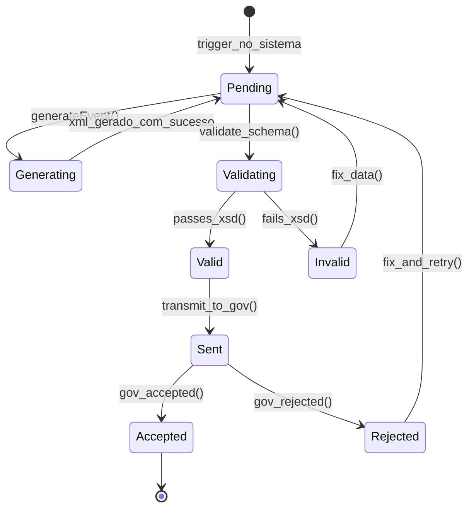
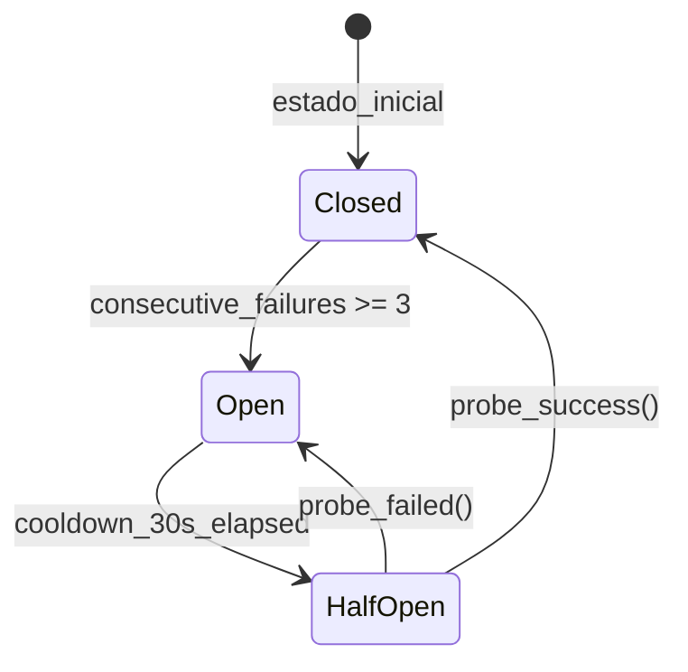
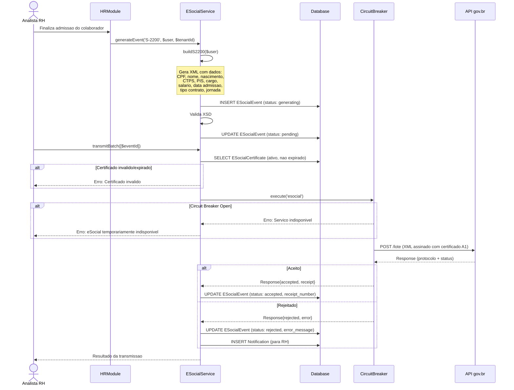
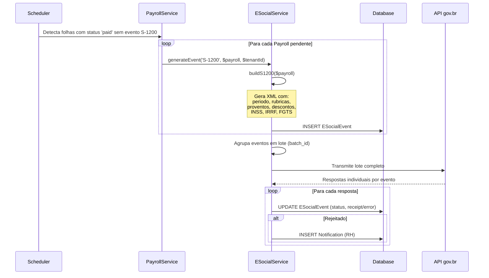

# Modulo: eSocial & Obrigacoes Trabalhistas

> Modulo de conformidade com o sistema eSocial do governo federal. Geracao automatica de eventos XML, transmissao em lote, circuit breaker, certificado digital A1, e rastreamento completo do ciclo de vida de cada evento.

---

## 1. Visao Geral

O modulo eSocial do Kalibrium ERP automatiza a geracao, validacao e transmissao de eventos trabalhistas ao sistema eSocial do governo brasileiro. Integrado diretamente com o modulo HR, garante que admissoes, afastamentos, remuneracoes e desligamentos gerem os eventos correspondentes sem intervencao manual.

### 1.1 Responsabilidades do Modulo

- Geracao automatica de XML para todos os eventos suportados
- Validacao XSD contra schemas oficiais do gov.br
- Transmissao em lote (batch) com circuit breaker
- Rastreamento de status: pending -> generating -> sent -> accepted/rejected
- Retificacao via novo evento (imutabilidade pos-submissao)
- Exclusao via evento S-3000
- Monitoramento de prazos legais com alertas
- Gerenciamento de certificado digital A1 (PFX)
- Rubricas eSocial configuráveis por tenant

### 1.2 Services Principais

| Service | Responsabilidade |
|---------|-----------------|
| `ESocialService` | Geracao de eventos XML, transmissao, processamento de respostas |
| `CircuitBreakerService` | Protecao contra falhas consecutivas na API gov.br |
| `IntegrationHealthService` | Monitoramento de saude das integracoes |

---

## 2. Entidades (Models)

### 2.1 `ESocialEvent` — Evento eSocial

| Campo | Tipo | Descricao |
|-------|------|-----------|
| `id` | bigint PK | Identificador unico |
| `tenant_id` | bigint FK | Tenant |
| `event_type` | string | Codigo do evento (S-1000, S-1200, etc.) |
| `related_type` | string | Tipo do model relacionado (morph) |
| `related_id` | bigint | ID do model relacionado (morph) |
| `xml_content` | text | Conteudo XML do evento |
| `protocol_number` | string | Numero do protocolo de envio |
| `receipt_number` | string | Numero do recibo de aceitacao |
| `status` | string | Status do evento (ver constantes) |
| `response_xml` | text | XML de resposta do gov.br |
| `sent_at` | datetime | Quando foi enviado |
| `response_at` | datetime | Quando recebeu resposta |
| `error_message` | text | Mensagem de erro (se rejeitado) |
| `batch_id` | string | ID do lote de envio |
| `environment` | string | Ambiente: `production`, `restricted` |
| `version` | string | Versao do layout eSocial (ex: S-1.2) |

**Constantes de Tipo:**

```php
EVENT_TYPES = [
    'S-1000' => 'Informacoes do Empregador',
    'S-1200' => 'Remuneracao de Trabalhador',
    'S-1210' => 'Pagamentos de Rendimentos do Trabalho',
    'S-2200' => 'Cadastramento Inicial / Admissao',
    'S-2205' => 'Alteracao de Dados Cadastrais',
    'S-2206' => 'Alteracao de Contrato de Trabalho',
    'S-2210' => 'Comunicacao de Acidente de Trabalho (CAT)',
    'S-2220' => 'Monitoramento da Saude do Trabalhador (ASO)',
    'S-2230' => 'Afastamento Temporario',
    'S-2299' => 'Desligamento',
    'S-3000' => 'Exclusao de Evento',
];
```

**Constantes de Status:**

```php
STATUSES = [
    'pending'    => 'Pendente',
    'generating' => 'Gerando XML',
    'sent'       => 'Enviado',
    'accepted'   => 'Aceito',
    'rejected'   => 'Rejeitado',
    'cancelled'  => 'Cancelado',
];
```

**Relationships:**

- `morphTo(related)` — model que originou o evento (User, Payroll, Rescission, Tenant, etc.)
- `belongsTo(Tenant)` — tenant

---

### 2.2 `ESocialCertificate` — Certificado Digital A1

| Campo | Tipo | Descricao |
|-------|------|-----------|
| `id` | bigint PK | Identificador unico |
| `tenant_id` | bigint FK | Tenant |
| `name` | string | Nome identificador do certificado |
| `pfx_path` | string | Caminho do arquivo PFX (encrypted storage) |
| `password` | string (encrypted) | Senha do certificado |
| `valid_from` | date | Inicio da validade |
| `valid_until` | date | Fim da validade |
| `is_active` | boolean | Se e o certificado ativo para transmissao |

> **[AI_RULE]** O sistema DEVE alertar 30 dias antes do vencimento do certificado via `SystemAlert` de prioridade critica.

---

### 2.3 `ESocialRubric` — Rubrica eSocial

| Campo | Tipo | Descricao |
|-------|------|-----------|
| `id` | bigint PK | Identificador unico |
| `tenant_id` | bigint FK | Tenant |
| `code` | string | Codigo da rubrica (ex: 1000, 1001) |
| `name` | string | Nome da rubrica (ex: "Salario Base") |
| `type` | string | Tipo: `provento`, `desconto`, `informativo` |
| `nature_code` | string | Codigo natureza eSocial (tabela 03) |
| `incidence_inss` | boolean | Incide INSS |
| `incidence_irrf` | boolean | Incide IRRF |
| `incidence_fgts` | boolean | Incide FGTS |

---

## 3. Maquinas de Estado

### 3.1 Ciclo de Vida do Evento eSocial



### 3.2 Circuit Breaker para API eSocial



**Comportamento:**

- **Closed**: Transmissao normal. Falhas sao contabilizadas.
- **Open**: Transmissao bloqueada. Retorna erro imediatamente. Cooldown de 30s.
- **HalfOpen**: Permite uma transmissao de teste. Se sucesso, volta a Closed. Se falha, volta a Open.

---

## 4. Regras de Negocio (Guard Rails) `[AI_RULE]`

### 4.1 Imutabilidade Pos-Submissao `[AI_RULE_CRITICAL]`

> **[AI_RULE_CRITICAL]** `ESocialEvent` com status `sent` ou `accepted` e IMUTAVEL. A IA NUNCA deve implementar UPDATE nesses registros. Correcoes sao feitas via novo evento retificador com referencia ao original. Para exclusao, utilizar evento S-3000.

### 4.2 Prazos Legais do Governo `[AI_RULE_CRITICAL]`

> **[AI_RULE_CRITICAL]** Cada tipo de evento tem prazo legal de transmissao:
>
> | Evento | Prazo Legal |
> |--------|------------|
> | S-2200 (Admissao) | Ate 1 dia antes do inicio do vinculo |
> | S-2299 (Desligamento) | Ate 10 dias apos a data do desligamento |
> | S-2230 (Afastamento) | Ate o dia 15 do mes seguinte ao inicio |
> | S-1200 (Remuneracao) | Ate o dia 15 do mes seguinte |
> | S-1000 (Empregador) | Antes de qualquer outro evento |
>
> Atrasos geram `SystemAlert` de prioridade critica e `Notification` para o RH.

### 4.3 Validacao XSD Obrigatoria `[AI_RULE]`

> **[AI_RULE]** Todo `ESocialEvent` DEVE passar por validacao XSD antes da transmissao. O `ESocialService` valida contra os schemas oficiais do gov.br. Eventos invalidos sao bloqueados com `status = 'rejected'` e `error_message` detalhado.

### 4.4 Certificado Digital A1 `[AI_RULE]`

> **[AI_RULE]** Transmissao ao gov.br exige `ESocialCertificate` (A1 PFX) valido e nao expirado. O sistema DEVE:
>
> - Alertar 30 dias antes do vencimento
> - Bloquear transmissao se certificado expirado
> - Suportar rotacao de certificado sem downtime

### 4.5 Consolidacao em Bloco `[AI_RULE]`

> **[AI_RULE]** Eventos nao podem ser fragmentados por edicao manual do BD. Qualquer calculo de pagamento, comissao de CRM ou insalubridade que caia no contracheque (`Payroll`) deve persistir o payload XML gerado, travando um Lock Digital (`ESocialEvent`). Se rejeitado pela Receita Federal, apenas estornos (reversals) sao aplicaveis.

### 4.6 Ordem de Eventos `[AI_RULE]`

> **[AI_RULE]** O evento S-1000 (Informacoes do Empregador) DEVE ser o primeiro evento enviado para um tenant. Nenhum outro evento pode ser transmitido antes do S-1000 ser aceito. O sistema valida esta dependencia automaticamente.

---

## 5. Integracao Cross-Domain

### 5.1 HR -> ESocial (Triggers Automaticos)

| Trigger no HR | Evento Gerado | Model Relacionado |
|--------------|---------------|-------------------|
| Cadastro/atualizacao do tenant | S-1000 | `Tenant` |
| Admissao de funcionario | S-2200 | `User` |
| Alteracao de dados cadastrais | S-2205 | `User` |
| Alteracao de contrato (cargo/salario) | S-2206 | `User` |
| Acidente de trabalho (CAT) | S-2210 | `User` |
| ASO (Atestado Saude Ocupacional) | S-2220 | `User` |
| Afastamento (ferias, licenca, atestado) | S-2230 | `TimeClockAdjustment` |
| Desligamento (rescisao) | S-2299 | `Rescission` |
| Fechamento de folha | S-1200 | `Payroll` |
| Pagamento de rendimentos | S-1210 | `PayrollLine` |

### 5.2 Finance -> ESocial

| Trigger Finance | Evento Gerado |
|----------------|---------------|
| Folha processada (`Payroll.status = paid`) | S-1200 (Remuneracao) |
| Pagamento finalizado (`PayrollLine`) | S-1210 (Pagamento) |

### 5.3 ESocial -> Core

| Trigger ESocial | Acao Core |
|----------------|-----------|
| Evento rejeitado pelo gov.br | `Notification` para usuario RH |
| Prazo legal proximo de vencer | `SystemAlert` de prioridade critica |
| Certificado proximo de expirar | `SystemAlert` de prioridade critica |
| Circuit breaker aberto (API gov.br down) | `IntegrationHealth` status `down` |

---

## 6. Contratos de API (JSON)

### 6.1 Gerar Evento eSocial

**POST** `/api/v1/hr/esocial/generate`

**Request:**

```json
{
  "event_type": "S-2200",
  "related_type": "App\\Models\\User",
  "related_id": 42
}
```

**Response 201:**

```json
{
  "data": {
    "id": 100,
    "event_type": "S-2200",
    "status": "generating",
    "xml_content": "<?xml version=\"1.0\"?><eSocial>...</eSocial>",
    "environment": "restricted",
    "version": "S-1.2",
    "created_at": "2026-03-24T10:00:00Z"
  }
}
```

### 6.2 Transmitir Lote

**POST** `/api/v1/hr/esocial/batch/transmit`

**Request:**

```json
{
  "event_ids": [100, 101, 102],
  "batch_id": "batch-2026-03-001"
}
```

**Response 200:**

```json
{
  "data": {
    "batch_id": "batch-2026-03-001",
    "total": 3,
    "sent": 3,
    "accepted": 0,
    "rejected": 0,
    "events": [
      {"id": 100, "event_type": "S-2200", "status": "sent", "error_message": null},
      {"id": 101, "event_type": "S-1200", "status": "sent", "error_message": null},
      {"id": 102, "event_type": "S-2299", "status": "sent", "error_message": null}
    ]
  }
}
```

### 6.3 Consultar Status do Lote

**GET** `/api/v1/hr/esocial/batch/{batchId}/status`

**Response 200:**

```json
{
  "data": {
    "batch_id": "batch-2026-03-001",
    "total": 3,
    "sent": 0,
    "accepted": 2,
    "rejected": 1,
    "events": [
      {"id": 100, "event_type": "S-2200", "status": "accepted", "error_message": null},
      {"id": 101, "event_type": "S-1200", "status": "accepted", "error_message": null},
      {"id": 102, "event_type": "S-2299", "status": "rejected", "error_message": "CPF invalido no campo trabalhador"}
    ]
  }
}
```

### 6.4 Gerar Evento de Exclusao (S-3000)

**POST** `/api/v1/hr/esocial/events/{id}/exclude`

**Request:**

```json
{
  "reason": "Dados incorretos no evento original. Sera retransmitido com correcoes."
}
```

**Response 201:**

```json
{
  "data": {
    "id": 200,
    "event_type": "S-3000",
    "status": "generating",
    "xml_content": "<?xml version=\"1.0\"?><eSocial><evtExclusao>...</evtExclusao></eSocial>"
  }
}
```

### 6.5 Listar Eventos por Periodo

**GET** `/api/v1/hr/esocial/events?start_date=2026-03-01&end_date=2026-03-31&status=rejected`

**Response 200:**

```json
{
  "data": [
    {
      "id": 102,
      "event_type": "S-2299",
      "status": "rejected",
      "error_message": "CPF invalido",
      "related_type": "App\\Models\\Rescission",
      "related_id": 15,
      "sent_at": "2026-03-24T10:05:00Z",
      "response_at": "2026-03-24T10:05:30Z"
    }
  ],
  "meta": {
    "total": 1,
    "summary": {
      "pending": 5,
      "sent": 2,
      "accepted": 45,
      "rejected": 1
    }
  }
}
```

### 6.6 Gerenciar Certificado Digital

**POST** `/api/v1/hr/esocial/certificates`

**Request (multipart/form-data):**

```
pfx_file: (arquivo .pfx)
password: "senha_do_certificado"
name: "Certificado A1 - 2026"
```

**Response 201:**

```json
{
  "data": {
    "id": 1,
    "name": "Certificado A1 - 2026",
    "valid_from": "2026-01-15",
    "valid_until": "2027-01-15",
    "is_active": true,
    "days_until_expiry": 297
  }
}
```

---

## 7. Validacao (FormRequests)

### 7.1 GenerateEventRequest

```php
public function rules(): array
{
    return [
        'event_type'   => 'required|in:S-1000,S-1200,S-1210,S-2200,S-2205,S-2206,S-2210,S-2220,S-2230,S-2299',
        'related_type' => 'required|string',
        'related_id'   => 'required|integer|min:1',
    ];
}
```

### 7.2 TransmitBatchRequest

```php
public function rules(): array
{
    return [
        'event_ids'   => 'required|array|min:1|max:50',
        'event_ids.*' => 'exists:esocial_events,id',
        'batch_id'    => 'nullable|string|max:100',
    ];
}
```

### 7.3 ExcludeEventRequest

```php
public function rules(): array
{
    return [
        'reason' => 'required|string|min:10|max:500',
    ];
}
```

### 7.4 CertificateUploadRequest

```php
public function rules(): array
{
    return [
        'pfx_file' => 'required|file|mimes:pfx|max:10240',
        'password' => 'required|string',
        'name'     => 'required|string|max:255',
    ];
}
```

---

## 8. Permissoes e Papeis

### 8.1 Permissoes do Modulo eSocial

| Permissao | Descricao |
|-----------|-----------|
| `hr.esocial.view` | Visualizar eventos eSocial |
| `hr.esocial.manage` | Gerar e gerenciar eventos |
| `hr.esocial.transmit` | Transmitir lotes ao gov.br |
| `hr.esocial.certificates` | Gerenciar certificados digitais |
| `hr.esocial.rubricas` | Gerenciar rubricas eSocial |

### 8.2 Matriz de Papeis

| Acao | hr_admin | payroll_admin | manager | employee |
|------|----------|---------------|---------|----------|
| Ver eventos | X | X | - | - |
| Gerar eventos | X | X | - | - |
| Transmitir lotes | X | - | - | - |
| Gerenciar certificados | X | - | - | - |
| Gerenciar rubricas | X | - | - | - |
| Ver status do lote | X | X | - | - |
| Excluir evento (S-3000) | X | - | - | - |

---

## 9. Diagramas de Sequencia

### 9.1 Geracao e Transmissao de Evento S-2200 (Admissao)



### 9.2 Processamento de Lote Mensal (S-1200)



### 9.3 Edge Cases e Tratamento de Erros `[CRITICAL]`

| Cenário de Falha | Prevenção / Tratamento | Guardrails de Código Esperados |
| :--- | :--- | :--- |
| **Recusa por Schema (XSD) Inválido** | A montagem do XML quebra regras de formatação (ex: tamanho de campo ou CPF inválido). | `ESocialService` DEVE validar todo XML contra o XSD oficial do eSocial ANTES de mandar para a fila de transmissão. Erros XSD não consomem quota do CircuitBreaker. |
| **Assinatura com Certificado Revogado/Expirado** | Assinatura gera rejeição imediata do lote no Gov.br. | Scheduler verifica validade diariamente. Se `valid_to < now()`, o `ESocialCertificate` é inativado e a submissão falha fast (sem bater no gov.br). |
| **Timeout vs Circuit Breaker no Gov.br** | A requisição bate e dá timeout, mas não sabemos se o evento foi processado do lado governamental. | Não reenviar automaticamente no timeout. Tratamento: Lote entra em status `checking`, o `batch_id` deve ser consultado ativamente horas depois via GET status. |
| **Alteração em Evento Aceito** | Usuário de RH edita cadastro de funcionário (ex: cargo) que já tem admissão transmitida com `receipt_number`. | Se alterado, o ESocial gerará um NOVO evento (`S-2206 - Alteração de Contrato`) ao invés de reenviar o S-2200. Eventos com recibo são IMUTÁVEIS no portal. |
| **Lote Enorme Causando OOM** | Folha de pagamento com 10.000 funcionários sendo gerada e submetida em RAM. | Processamento encadeado (chunking/batches). `GenerateESocialEventsJob` fatia lotes em grupos menores permitidos (ex: lotes de 50 eventos max) como estipulado pelo manual do eSocial. |

---

## 10. Implementacao de Referencia

### 10.1 ESocialService — Geracao de Evento (PHP)

```php
// backend/app/Services/ESocialService.php

public function generateEvent(string $eventType, Model $related, int $tenantId): ESocialEvent
{
    $xmlContent = $this->buildXml($eventType, $related);

    return ESocialEvent::create([
        'tenant_id'    => $tenantId,
        'event_type'   => $eventType,
        'related_type' => get_class($related),
        'related_id'   => $related->id,
        'xml_content'  => $xmlContent,
        'status'       => 'generating',
        'environment'  => config('esocial.environment', 'restricted'),
        'version'      => config('esocial.version', 'S-1.2'),
    ]);
}

private function buildXml(string $eventType, Model $related): string
{
    return match ($eventType) {
        'S-1000' => $this->buildS1000($related),
        'S-2200' => $this->buildS2200($related),
        'S-2206' => $this->buildS2206($related),
        'S-2299' => $this->buildS2299($related),
        'S-1200' => $this->buildS1200($related),
        'S-1210' => $this->buildS1210($related),
        'S-2205' => $this->buildS2205($related),
        'S-2210' => $this->buildS2210($related),
        'S-2220' => $this->buildS2220($related),
        'S-2230' => $this->buildS2230($related),
        default  => throw new \InvalidArgumentException("Evento nao suportado: {$eventType}"),
    };
}
```

### 10.2 Estrutura XML — Evento S-2200 (Admissao)

```xml
<?xml version="1.0" encoding="UTF-8"?>
<eSocial xmlns="http://www.esocial.gov.br/schema/evt/evtAdmissao/v_S_01_02_00">
  <evtAdmissao Id="ID1000000000000001">
    <ideEvento>
      <indRetif>1</indRetif>
      <tpAmb>2</tpAmb><!-- 1=producao, 2=restrito -->
      <procEmi>1</procEmi>
      <verProc>Kalibrium-1.0</verProc>
    </ideEvento>
    <ideEmpregador>
      <tpInsc>1</tpInsc>
      <nrInsc>12345678000190</nrInsc><!-- CNPJ -->
    </ideEmpregador>
    <trabalhador>
      <cpfTrab>12345678901</cpfTrab>
      <nmTrab>Joao da Silva</nmTrab>
      <sexo>M</sexo>
      <racaCor>1</racaCor>
      <estCiv>1</estCiv>
      <grauInstr>07</grauInstr>
      <nascimento>
        <dtNascto>1990-05-15</dtNascto>
      </nascimento>
      <documentos>
        <CTPS>
          <nrCtps>1234567</nrCtps>
          <serieCtps>00001</serieCtps>
          <ufCtps>SP</ufCtps>
        </CTPS>
      </documentos>
    </trabalhador>
    <vinculo>
      <matricula>EMP-042</matricula>
      <tpRegTrab>1</tpRegTrab><!-- CLT -->
      <tpRegPrev>1</tpRegPrev><!-- RGPS -->
      <cadIni>S</cadIni>
      <infoCeletista>
        <dtAdm>2026-03-24</dtAdm>
        <tpAdmissao>1</tpAdmissao>
        <indAdmissao>1</indAdmissao>
        <vrSalFx>5000.00</vrSalFx>
        <undSalFixo>5</undSalFixo><!-- Mensal -->
      </infoCeletista>
    </vinculo>
  </evtAdmissao>
</eSocial>
```

### 10.3 Estrutura XML — Evento S-1200 (Remuneracao)

```xml
<?xml version="1.0" encoding="UTF-8"?>
<eSocial xmlns="http://www.esocial.gov.br/schema/evt/evtRemun/v_S_01_02_00">
  <evtRemun Id="ID1200000000000001">
    <ideEvento>
      <indRetif>1</indRetif>
      <indApuracao>1</indApuracao><!-- Mensal -->
      <perApur>2026-03</perApur>
      <tpAmb>2</tpAmb>
      <procEmi>1</procEmi>
      <verProc>Kalibrium-1.0</verProc>
    </ideEvento>
    <ideEmpregador>
      <tpInsc>1</tpInsc>
      <nrInsc>12345678000190</nrInsc>
    </ideEmpregador>
    <dmDev>
      <ideDmDev>DM-2026-03-001</ideDmDev>
      <infoPerApur>
        <ideEstabLot>
          <tpInsc>1</tpInsc>
          <nrInsc>12345678000190</nrInsc>
          <remunPerApur>
            <matricula>EMP-042</matricula>
            <itensRemun>
              <codRubr>1000</codRubr>
              <ideTabRubr>Kalibrium</ideTabRubr>
              <vrRubr>5000.00</vrRubr>
            </itensRemun>
            <itensRemun>
              <codRubr>1050</codRubr>
              <ideTabRubr>Kalibrium</ideTabRubr>
              <vrRubr>500.00</vrRubr><!-- HE 50% -->
            </itensRemun>
            <itensRemun>
              <codRubr>9201</codRubr>
              <ideTabRubr>Kalibrium</ideTabRubr>
              <vrRubr>550.00</vrRubr><!-- INSS -->
            </itensRemun>
          </remunPerApur>
        </ideEstabLot>
      </infoPerApur>
    </dmDev>
  </evtRemun>
</eSocial>
```

### 10.4 Estrutura XML — Evento S-2299 (Desligamento)

```xml
<?xml version="1.0" encoding="UTF-8"?>
<eSocial xmlns="http://www.esocial.gov.br/schema/evt/evtDeslig/v_S_01_02_00">
  <evtDeslig Id="ID2299000000000001">
    <ideEvento>
      <indRetif>1</indRetif>
      <tpAmb>2</tpAmb>
      <procEmi>1</procEmi>
      <verProc>Kalibrium-1.0</verProc>
    </ideEvento>
    <ideEmpregador>
      <tpInsc>1</tpInsc>
      <nrInsc>12345678000190</nrInsc>
    </ideEmpregador>
    <ideVinculo>
      <cpfTrab>12345678901</cpfTrab>
      <matricula>EMP-042</matricula>
    </ideVinculo>
    <infoDeslig>
      <mtvDeslig>02</mtvDeslig><!-- Sem justa causa -->
      <dtDeslig>2026-03-24</dtDeslig>
      <indPagtoAPI>S</indPagtoAPI>
      <dtProjFimAPI>2026-04-23</dtProjFimAPI>
      <verbasResc>
        <dmDev>
          <ideDmDev>TRCT-2026-042</ideDmDev>
          <itensRemun>
            <codRubr>5001</codRubr><!-- Saldo salario -->
            <vrRubr>3333.33</vrRubr>
          </itensRemun>
          <itensRemun>
            <codRubr>5010</codRubr><!-- Ferias proporcionais -->
            <vrRubr>2500.00</vrRubr>
          </itensRemun>
          <itensRemun>
            <codRubr>5011</codRubr><!-- 1/3 ferias -->
            <vrRubr>833.33</vrRubr>
          </itensRemun>
          <itensRemun>
            <codRubr>5020</codRubr><!-- 13o proporcional -->
            <vrRubr>1250.00</vrRubr>
          </itensRemun>
        </dmDev>
      </verbasResc>
    </infoDeslig>
  </evtDeslig>
</eSocial>
```

### 10.5 Evento S-3000 (Exclusao)

```php
// backend/app/Services/ESocialService.php

public function generateExclusionEvent(int $originalEventId, string $reason): ESocialEvent
{
    $original = ESocialEvent::findOrFail($originalEventId);

    $xml = new \SimpleXMLElement(
        '<?xml version="1.0" encoding="UTF-8"?>'
        . '<eSocial xmlns="http://www.esocial.gov.br/schema/evt/evtExclusao/v_S_01_02_00"/>'
    );
    $evt = $xml->addChild('evtExclusao');

    $ideEvento = $evt->addChild('ideEvento');
    $ideEvento->addChild('tpAmb', config('esocial.environment') === 'production' ? '1' : '2');
    $ideEvento->addChild('procEmi', '1');
    $ideEvento->addChild('verProc', 'Kalibrium-1.0');

    $infoExclusao = $evt->addChild('infoExclusao');
    $infoExclusao->addChild('tpEvento', $original->event_type);
    $infoExclusao->addChild('nrRecEvt', $original->receipt_number);

    return ESocialEvent::create([
        'tenant_id'    => $original->tenant_id,
        'event_type'   => 'S-3000',
        'related_type' => get_class($original),
        'related_id'   => $original->id,
        'xml_content'  => $xml->asXML(),
        'status'       => 'pending',
        'environment'  => config('esocial.environment', 'restricted'),
        'version'      => config('esocial.version', 'S-1.2'),
    ]);
}
```

---

### Endpoints Rest (Extraídos do Backend)

| Método | Rota | Controller | Ação |
|--------|------|------------|------|
| `GET` | `/api/v1/esocial` | `ESocialController@index` | Listar |
| `GET` | `/api/v1/esocial/{id}` | `ESocialController@show` | Detalhes |
| `POST` | `/api/v1/esocial` | `ESocialController@store` | Criar |
| `PUT` | `/api/v1/esocial/{id}` | `ESocialController@update` | Atualizar |
| `DELETE` | `/api/v1/esocial/{id}` | `ESocialController@destroy` | Excluir |

## 11. Cenarios BDD

### 11.1 Geracao de Evento S-2200

```gherkin
Funcionalidade: Geracao Automatica de Evento eSocial S-2200

  Cenario: Admissao gera evento S-2200 automaticamente
    Dado que o tenant "Empresa X" tem certificado A1 ativo
    E que o colaborador "Joao Silva" foi admitido com data 2026-03-24
    Quando o sistema finaliza a admissao
    Entao um ESocialEvent com event_type "S-2200" deve ser criado
    E o XML deve conter o CPF "12345678901"
    E o XML deve conter a data de admissao "2026-03-24"
    E o status do evento deve ser "generating"

  Cenario: Evento rejeitado gera notificacao
    Dado que um evento S-2200 foi transmitido
    E que o gov.br retornou rejeicao com motivo "CPF invalido"
    Quando o ESocialService processa a resposta
    Entao o status do evento deve ser "rejected"
    E o error_message deve conter "CPF invalido"
    E uma Notification deve ser criada para o usuario RH
```

### 11.2 Transmissao em Lote

```gherkin
Funcionalidade: Transmissao em Lote de Eventos eSocial

  Cenario: Lote transmitido com sucesso
    Dado que existem 3 eventos pendentes (S-2200, S-1200, S-2299)
    E que o certificado A1 esta ativo e valido
    E que o circuit breaker esta no estado "closed"
    Quando o administrador transmite o lote
    Entao todos os 3 eventos devem ter status "sent"
    E o batch_id deve ser o mesmo para todos

  Cenario: Circuit breaker bloqueia transmissao
    Dado que houve 3 falhas consecutivas na API gov.br
    E que o circuit breaker esta no estado "open"
    Quando o administrador tenta transmitir um lote
    Entao a transmissao deve ser bloqueada
    E a mensagem deve informar "Servico temporariamente indisponivel"
    E o cooldown de 30 segundos deve ser respeitado
```

### 11.3 Exclusao de Evento (S-3000)

```gherkin
Funcionalidade: Exclusao de Evento via S-3000

  Cenario: Excluir evento aceito
    Dado que o evento S-2200 id=100 foi aceito (receipt_number: "REC123")
    Quando o administrador solicita exclusao com motivo "Dados incorretos"
    Entao um novo ESocialEvent com event_type "S-3000" deve ser criado
    E o XML deve referenciar o receipt_number "REC123"
    E o related_id deve ser 100
    E o evento original NAO deve ser alterado (imutabilidade)

  Cenario: Tentativa de editar evento aceito
    Dado que o evento S-1200 id=50 tem status "accepted"
    Quando alguem tenta fazer UPDATE no registro
    Entao a operacao deve ser bloqueada
    E a correcao deve ser feita via novo evento retificador
```

### 11.4 Certificado Digital

```gherkin
Funcionalidade: Gerenciamento de Certificado Digital A1

  Cenario: Alerta de vencimento proximo
    Dado que o certificado A1 vence em 25 dias
    Quando o job diario de verificacao executa
    Entao um SystemAlert de prioridade critica deve ser criado
    E uma Notification deve ser enviada ao administrador RH

  Cenario: Bloqueio por certificado expirado
    Dado que o certificado A1 expirou ontem
    Quando o administrador tenta transmitir um lote
    Entao a transmissao deve ser bloqueada
    E a mensagem deve informar "Certificado digital expirado"
```

---

## 12. Checklist de Completude

### 12.1 Backend

- [x] `ESocialEvent` model com morph relationships
- [x] `ESocialCertificate` model com criptografia de senha
- [x] `ESocialRubric` model configuravel por tenant
- [x] `ESocialService` com geracao de XML para S-1000, S-1200, S-1210, S-2200, S-2205, S-2206, S-2210, S-2220, S-2230, S-2299
- [x] `ESocialService.generateExclusionEvent()` para S-3000
- [x] `ESocialService.processResponse()` para processar respostas do gov.br
- [x] `ESocialService.getBatchStatus()` para rastreamento de lotes
- [x] `CircuitBreakerService` com estados closed/open/half_open
- [x] `IntegrationHealthService` monitorando status do eSocial
- [x] Validacao XSD contra schemas oficiais
- [x] Rotas API com middleware de permissao
- [x] FormRequests para geracao, transmissao e exclusao

### 12.2 Frontend

- [x] Tela de listagem de eventos eSocial com filtros
- [x] Tela de detalhes do evento com XML
- [x] Dashboard de status de lotes
- [x] Gerenciamento de certificados digitais
- [x] Gerenciamento de rubricas

### 12.3 Testes

- [x] `ESocialServiceTest` — geracao de todos os tipos de evento
- [x] Teste de imutabilidade pos-submissao
- [x] Teste de circuit breaker (falhas consecutivas)
- [x] Teste de validacao XSD
- [x] Teste de exclusao via S-3000

### 12.4 Compliance

- [x] Eventos S-1000 a S-2299 + S-3000 implementados
- [x] Validacao XSD obrigatoria antes de transmissao
- [x] Certificado A1 obrigatorio e monitorado
- [x] Prazos legais rastreados com alertas
- [x] Imutabilidade de eventos aceitos/enviados
- [x] Ambiente restrito para testes (`environment: restricted`)
- [x] Versionamento de layout eSocial (`version: S-1.2`)

---

## Fluxos Relacionados

| Fluxo | Descrição |
|-------|-----------|
| [Admissão de Funcionário](file:///c:/PROJETOS/sistema/docs/fluxos/ADMISSAO-FUNCIONARIO.md) | Processo documentado em `docs/fluxos/ADMISSAO-FUNCIONARIO.md` |
| [Desligamento de Funcionário](file:///c:/PROJETOS/sistema/docs/fluxos/DESLIGAMENTO-FUNCIONARIO.md) | Processo documentado em `docs/fluxos/DESLIGAMENTO-FUNCIONARIO.md` |
| [Fechamento Mensal](file:///c:/PROJETOS/sistema/docs/fluxos/FECHAMENTO-MENSAL.md) | Processo documentado em `docs/fluxos/FECHAMENTO-MENSAL.md` |
| [Recrutamento e Seleção](file:///c:/PROJETOS/sistema/docs/fluxos/RECRUTAMENTO-SELECAO.md) | Processo documentado em `docs/fluxos/RECRUTAMENTO-SELECAO.md` |
| [Rescisão Contratual](file:///c:/PROJETOS/sistema/docs/fluxos/RESCISAO-CONTRATUAL.md) | Processo documentado em `docs/fluxos/RESCISAO-CONTRATUAL.md` |
| [Técnico Indisponível](file:///c:/PROJETOS/sistema/docs/fluxos/TECNICO-INDISPONIVEL.md) | Processo documentado em `docs/fluxos/TECNICO-INDISPONIVEL.md` |

---

## Inventario Completo do Codigo

### Models

| Arquivo | Model |
|---------|-------|
| `backend/app/Models/ESocialEvent.php` | ESocialEvent — eventos eSocial gerados (XML) |
| `backend/app/Models/ESocialCertificate.php` | ESocialCertificate — certificados digitais A1 |
| `backend/app/Models/ESocialRubric.php` | ESocialRubric — tabela de rubricas S-1010 |

### Controllers

| Arquivo | Controller |
|---------|------------|
| `backend/app/Http/Controllers/Api/V1/ESocialController.php` | ESocialController |

### Services

| Arquivo | Service |
|---------|---------|
| `backend/app/Services/ESocialService.php` | ESocialService — geracao, validacao e transmissao de eventos eSocial |

### Jobs

| Arquivo | Job |
|---------|-----|
| `backend/app/Jobs/GenerateESocialEventsJob.php` | GenerateESocialEventsJob — geracao assincrona de eventos em lote |

### FormRequests

| Arquivo | FormRequest |
|---------|-------------|
| `backend/app/Http/Requests/ESocial/GenerateEventRequest.php` | GenerateEventRequest |
| `backend/app/Http/Requests/ESocial/SendBatchRequest.php` | SendBatchRequest |
| `backend/app/Http/Requests/ESocial/ExcludeEventRequest.php` | ExcludeEventRequest |
| `backend/app/Http/Requests/ESocial/StoreCertificateRequest.php` | StoreCertificateRequest |

### Frontend

| Arquivo | Pagina |
|---------|--------|
| `frontend/src/pages/rh/ESocialPage.tsx` | ESocialPage |

### Rotas Completas (extraidas de `routes/api/hr-quality-automation.php`)

#### Visualizacao (permissao: `hr.esocial.view`)

| Metodo | Rota | Controller | Acao |
|--------|------|------------|------|
| `GET` | `/api/v1/esocial/events` | `ESocialController@index` | Listar eventos |
| `GET` | `/api/v1/esocial/events/{id}` | `ESocialController@show` | Detalhe do evento |
| `GET` | `/api/v1/esocial/batches/{batchId}` | `ESocialController@checkBatch` | Status do lote |
| `GET` | `/api/v1/esocial/certificates` | `ESocialController@certificates` | Listar certificados |
| `GET` | `/api/v1/esocial/dashboard` | `ESocialController@dashboard` | Dashboard eSocial |

#### Gerenciamento (permissao: `hr.esocial.manage`)

| Metodo | Rota | Controller | Acao |
|--------|------|------------|------|
| `POST` | `/api/v1/esocial/events/generate` | `ESocialController@generate` | Gerar evento |
| `POST` | `/api/v1/esocial/events/send-batch` | `ESocialController@sendBatch` | Transmitir lote |
| `POST` | `/api/v1/esocial/certificates` | `ESocialController@storeCertificate` | Upload certificado A1 |
| `POST` | `/api/v1/esocial/events/{id}/exclude` | `ESocialController@excludeEvent` | Excluir evento (S-3000) |
| `POST` | `/api/v1/esocial/rubric-table` | `ESocialController@generateRubricTable` | Gerar tabela de rubricas (S-1010) |

### Route Files

| Arquivo | Escopo |
|---------|--------|
| `backend/routes/api/hr-quality-automation.php` | Rotas eSocial (dentro do prefixo HR) |

---

## Checklist de Implementação

### Backend
- [ ] Models com `BelongsToTenant`, `$fillable`, `$casts`, relationships
- [ ] Migrations com `tenant_id`, indexes, foreign keys
- [ ] Controllers seguem padrão Resource (index/store/show/update/destroy)
- [ ] FormRequests com validação completa (required, tipos, exists)
- [ ] Services encapsulam lógica de negócio e transições de estado
- [ ] Policies com permissões Spatie registradas
- [ ] Routes registradas em `routes/api/`
- [ ] Events/Listeners para integrações cross-domain
- [ ] ESocialService gera XML válido para eventos S-1000, S-1010, S-2200, S-2300, S-2206, S-2299, S-3000
- [ ] Validação XSD contra schemas oficiais do gov.br antes de transmissão
- [ ] CircuitBreakerService protege chamadas à API gov.br com backoff exponencial
- [ ] Transmissão em lote (batch) com rastreamento de status por evento
- [ ] Retificação via novo evento preservando imutabilidade pós-submissão
- [ ] Gerenciamento de certificado digital A1 (PFX) com upload seguro e validação de validade
- [ ] Rubricas eSocial (S-1010) configuráveis por tenant
- [ ] Monitoramento de prazos legais com alertas automáticos

### Frontend
- [ ] Páginas de listagem, criação, edição
- [ ] Tipos TypeScript espelhando response da API
- [ ] Componentes seguem Design System (tokens, componentes)
- [ ] Dashboard eSocial com status consolidado de eventos e lotes
- [ ] Upload de certificado A1 com feedback de validação
- [ ] Visualização de XML gerado para auditoria

### Testes
- [ ] Feature tests para cada endpoint (happy path + error + validation + auth)
- [ ] Unit tests para Services (lógica de negócio, state machine)
- [ ] Tenant isolation verificado em todos os endpoints
- [ ] Testes de geração XML para cada tipo de evento (S-2200, S-2299, S-3000, etc.)
- [ ] Testes de CircuitBreaker (abertura, fechamento, half-open)
- [ ] Testes de validação XSD com schemas oficiais

### Qualidade
- [ ] Zero `TODO` / `FIXME` no código
- [ ] Guard Rails `[AI_RULE]` implementados e testados
- [ ] Cross-domain integrations conectadas e funcionais (HR → eSocial automático)
