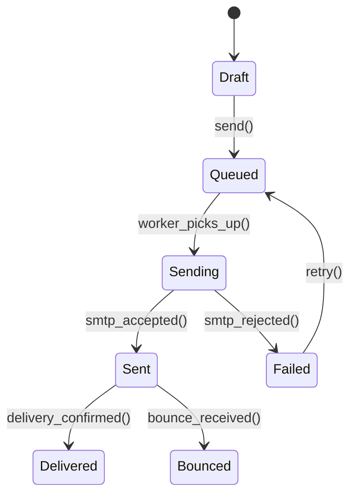
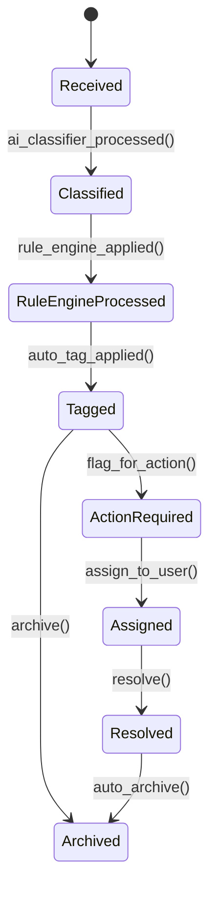

# Módulo: Email & Comunicação

> **[AI_RULE]** Lista oficial de entidades (Models) associadas a este domínio no Laravel. Este módulo gerencia todo o fluxo de email corporativo: envio, recebimento via IMAP, classificação automática (AI), regras de automação, templates com merge tags e integração cruzada com CRM, Helpdesk, Quotes e Portal.

---

## 1. Visão Geral

O módulo Email provê uma caixa de email corporativa integrada ao ERP:

- **Sincronização IMAP** somente-leitura com classificação automática por IA
- **Envio via SMTP** com fila, retry e tracking de status
- **Templates** com variáveis dinâmicas (`{{customer_name}}`, `{{quote_total}}`)
- **Regras de automação** em cascata (prioridade numérica) para classificar, taguear, criar tarefas
- **Assinaturas HTML** por conta/usuário
- **Tags e notas internas** para organização
- **Vínculo automático** com CRM (atividades), Helpdesk (tickets) e Quotes (tracking)

---

## 2. Entidades (Models)

### 2.1 `Email`

**Arquivo:**`backend/app/Models/Email.php`**Tabela:**`emails`**Traits:** `BelongsToTenant`

| Campo | Tipo | Descrição |
|-------|------|-----------|
| `id` | int (PK) | Identificador |
| `tenant_id` | int (FK) | Tenant |
| `email_account_id` | int\|null (FK) | Conta de email |
| `message_id` | string\|null | Message-ID do header (RFC 2822) |
| `thread_id` | string\|null | ID da thread para agrupamento |
| `folder` | string\|null | Pasta IMAP (`INBOX`, `Sent`, etc.) |
| `subject` | string\|null | Assunto |
| `from_name` | string\|null | Nome do remetente |
| `from_address` | string\|null | Email do remetente |
| `to_addresses` | json\|null | Lista de destinatários (cast `array`) |
| `cc_addresses` | json\|null | Lista de CC (cast `array`) |
| `snippet_text` | string\|null | Preview do corpo (primeiros 200 chars) |
| `body_text` | text\|null | Corpo em texto plano |
| `body_html` | text\|null | Corpo em HTML |
| `is_read` | boolean | Lido localmente |
| `is_starred` | boolean | Marcado como favorito |
| `is_archived` | boolean | Arquivado localmente |
| `has_attachments` | boolean | Possui anexos |
| `direction` | string | `inbound` ou `outbound` |
| `status` | string\|null | Status do envio (`draft`, `queued`, `sending`, `sent`, `failed`, `bounced`) |
| `date` | timestamp\|null | Data do email |
| `sent_at` | timestamp\|null | Data/hora de envio efetivo |
| `scheduled_at` | timestamp\|null | Agendamento de envio |
| `customer_id` | int\|null (FK) | Cliente vinculado automaticamente |
| `linked_type` | string\|null | Tipo do model vinculado (morph) |
| `linked_id` | int\|null | ID do model vinculado (morph) |
| `assigned_to_user_id` | int\|null (FK) | Atribuído a usuário |
| `assigned_at` | timestamp\|null | Data da atribuição |
| `snoozed_until` | timestamp\|null | Soneca até |
| `last_read_at` | timestamp\|null | Último tracking de abertura |
| `ai_category` | string\|null | Categoria classificada pela IA |
| `ai_summary` | string\|null | Resumo gerado pela IA |
| `ai_sentiment` | string\|null | Sentimento (`positive`, `neutral`, `negative`) |
| `ai_priority` | string\|null | Prioridade sugerida pela IA |
| `ai_suggested_action` | string\|null | Ação sugerida pela IA |
| `ai_confidence` | float\|null | Confiança da classificação (0-1) |
| `ai_classified_at` | timestamp\|null | Data da classificação IA |

**Relationships:**

- `account(): BelongsTo → EmailAccount`
- `customer(): BelongsTo → Customer`
- `assignedTo(): BelongsTo → User`
- `linked(): MorphTo` (WorkOrder, Quote, ServiceCall, etc.)
- `attachments(): HasMany → EmailAttachment`
- `activities(): HasMany → EmailActivity`
- `notes(): HasMany → EmailNote`
- `tags(): BelongsToMany → EmailTag` (via pivot `email_email_tag`)

---

### 2.2 `EmailAccount`

**Arquivo:**`backend/app/Models/EmailAccount.php`**Tabela:**`email_accounts`**Traits:** `BelongsToTenant`

| Campo | Tipo | Descrição |
|-------|------|-----------|
| `id` | int (PK) | Identificador |
| `tenant_id` | int (FK) | Tenant |
| `email_address` | string | Endereço de email da conta |
| `imap_host` | string | Host IMAP |
| `imap_port` | int | Porta IMAP |
| `imap_encryption` | string\|null | Criptografia (`ssl`, `tls`) |
| `imap_username` | string | Usuário IMAP |
| `imap_password` | string | Senha IMAP (**encrypted**, **hidden**) |
| `smtp_host` | string\|null | Host SMTP |
| `smtp_port` | int\|null | Porta SMTP |
| `is_active` | boolean | Conta ativa |
| `sync_status` | string\|null | Status de sync (`idle`, `syncing`, `error`) |
| `sync_error` | string\|null | Último erro de sync |
| `last_sync_at` | timestamp\|null | Última sincronização |
| `last_sync_uid` | int\|null | Último UID sincronizado |

**Métodos:**

- `markSyncing(): void` — Marca status como `syncing`
- `markSynced(int $lastUid): void` — Marca como `idle` com timestamp
- `markSyncError(string $error): void` — Registra erro de sync

**Scopes:**`scopeActive`**Relationships:**

- `emails(): HasMany → Email`

---

### 2.3 `EmailTemplate`

**Arquivo:**`backend/app/Models/EmailTemplate.php`**Tabela:**`email_templates`**Traits:** `HasFactory`, `BelongsToTenant`

| Campo | Tipo | Descrição |
|-------|------|-----------|
| `id` | int (PK) | Identificador |
| `tenant_id` | int (FK) | Tenant |
| `user_id` | int\|null (FK) | Criador |
| `name` | string | Nome do template |
| `subject` | string | Assunto (suporta merge tags) |
| `body` | text | Corpo HTML (suporta merge tags) |
| `is_shared` | boolean | Compartilhado com todos do tenant |

**Merge Tags suportadas:**

- `{{customer_name}}` — Nome do cliente
- `{{customer_email}}` — Email do cliente
- `{{quote_number}}` — Número do orçamento
- `{{quote_total}}` — Total do orçamento
- `{{work_order_number}}` — Número da OS
- `{{company_name}}` — Nome da empresa (tenant)
- `{{user_name}}` — Nome do usuário remetente

**Relationships:**

- `user(): BelongsTo → User`

---

### 2.4 `EmailRule`

**Arquivo:**`backend/app/Models/EmailRule.php`**Tabela:**`email_rules`**Traits:** `BelongsToTenant`

| Campo | Tipo | Descrição |
|-------|------|-----------|
| `id` | int (PK) | Identificador |
| `tenant_id` | int (FK) | Tenant |
| `name` | string | Nome da regra |
| `is_active` | boolean | Ativa |
| `priority` | int | Prioridade (menor = mais prioritária) |
| `conditions` | json (array) | Lista de condições |
| `actions` | json (array) | Lista de ações |

**Estrutura de condição:**

```json
{
  "field": "from_address|from_name|subject|body|ai_category|ai_priority|ai_sentiment|has_attachments|customer_id",
  "operator": "contains|not_contains|equals|not_equals|starts_with|ends_with|regex",
  "value": "string"
}
```

**Operadores suportados:**`contains`, `not_contains`, `equals`, `not_equals`, `starts_with`, `ends_with`, `regex`**Campos avaliáveis:**`from_address`, `from_name`, `subject`, `body`, `ai_category`, `ai_priority`, `ai_sentiment`, `has_attachments`, `customer_id`**Scopes:**`scopeActive` — filtra ativas, ordena por prioridade**Método:** `matchesEmail(Email $email): bool` — Avalia todas as condições (AND lógico)

---

### 2.5 `EmailSignature`

**Arquivo:**`backend/app/Models/EmailSignature.php`**Tabela:**`email_signatures`**Traits:** `HasFactory`, `BelongsToTenant`

| Campo | Tipo | Descrição |
|-------|------|-----------|
| `id` | int (PK) | Identificador |
| `tenant_id` | int (FK) | Tenant |
| `user_id` | int (FK) | Dono |
| `email_account_id` | int\|null (FK) | Conta associada |
| `name` | string | Nome da assinatura |
| `html_content` | text | HTML da assinatura |
| `is_default` | boolean | Assinatura padrão (uma por conta) |

**Relationships:**

- `user(): BelongsTo → User`
- `account(): BelongsTo → EmailAccount`

---

### 2.6 `EmailAttachment`

**Arquivo:**`backend/app/Models/EmailAttachment.php`**Tabela:** `email_attachments`

| Campo | Tipo | Descrição |
|-------|------|-----------|
| `id` | int (PK) | Identificador |
| `email_id` | int (FK) | Email pai |
| `filename` | string | Nome do arquivo |
| `mime_type` | string | Tipo MIME |
| `size_bytes` | int | Tamanho em bytes |
| `storage_path` | string | Caminho no storage (`email-attachments/{tenant_id}/{email_id}/`) |

**Accessor:**`getSizeFormattedAttribute()` — Retorna tamanho formatado (B, KB, MB)**Relationships:**

- `email(): BelongsTo → Email`

---

### 2.7 `EmailTag`

**Arquivo:**`backend/app/Models/EmailTag.php`**Tabela:**`email_tags`**Traits:** `HasFactory`, `BelongsToTenant`

| Campo | Tipo | Descrição |
|-------|------|-----------|
| `id` | int (PK) | Identificador |
| `tenant_id` | int (FK) | Tenant |
| `name` | string | Nome da tag |
| `color` | string\|null | Cor hex |

**Relationships:**

- `emails(): BelongsToMany → Email` (via pivot `email_email_tag`)

---

### 2.8 `EmailActivity`

**Arquivo:**`backend/app/Models/EmailActivity.php`**Tabela:**`email_activities`**Traits:** `HasFactory`, `BelongsToTenant`

| Campo | Tipo | Descrição |
|-------|------|-----------|
| `id` | int (PK) | Identificador |
| `tenant_id` | int (FK) | Tenant |
| `email_id` | int (FK) | Email |
| `user_id` | int\|null (FK) | Usuário que realizou |
| `type` | string | Tipo da atividade (`opened`, `replied`, `forwarded`, `tagged`, `assigned`, etc.) |
| `details` | json\|null | Dados extras |

**Relationships:**

- `email(): BelongsTo → Email`
- `user(): BelongsTo → User`

---

### 2.9 `EmailNote`

**Arquivo:**`backend/app/Models/EmailNote.php`**Tabela:**`email_notes`**Traits:** `HasFactory`, `BelongsToTenant`

| Campo | Tipo | Descrição |
|-------|------|-----------|
| `id` | int (PK) | Identificador |
| `tenant_id` | int (FK) | Tenant |
| `email_id` | int (FK) | Email |
| `user_id` | int (FK) | Autor |
| `content` | text | Conteúdo da nota interna |

**Relationships:**

- `email(): BelongsTo → Email`
- `user(): BelongsTo → User`

---

### 2.10 `EmailLog`

**Arquivo:**`backend/app/Models/EmailLog.php`**Tabela:**`email_logs`**Traits:** `BelongsToTenant`, `HasFactory`

| Campo | Tipo | Descrição |
|-------|------|-----------|
| `id` | int (PK) | Identificador |
| `tenant_id` | int (FK) | Tenant |
| `to` | string | Destinatário |
| `subject` | string | Assunto |
| `body` | text | Corpo |
| `status` | string | Status (`sent`, `failed`) |
| `sent_at` | timestamp\|null | Data de envio |
| `error` | string\|null | Mensagem de erro |
| `related_type` | string\|null | Tipo morph do model relacionado |
| `related_id` | int\|null | ID morph |

---

## 3. Services

### 3.1 `EmailSyncService`

**Arquivo:** `backend/app/Services/Email/EmailSyncService.php`

Sincroniza emails via IMAP em modo **somente leitura**. Busca novos emails a partir do `last_sync_uid`, cria registros `Email`, salva `EmailAttachment` no storage.

**Fluxo:**

1. `EmailAccount::markSyncing()`
2. Conecta IMAP, busca UIDs > `last_sync_uid`
3. Para cada email: cria `Email`, salva attachments em `email-attachments/{tenant_id}/{email_id}/`
4. `EmailAccount::markSynced($lastUid)`
5. Em caso de erro: `EmailAccount::markSyncError($error)`

### 3.2 `EmailSendService`

**Arquivo:** `backend/app/Services/Email/EmailSendService.php`

Envia emails via SMTP com suporte a attachments, CC, reply-to.

**Método principal:**

```php
public function send(EmailAccount $account, string $to, string $subject, string $body, array $options = []): Email
```

**Opções:** `cc`, `attachments`, `in_reply_to`, `thread_id`, `linked_type`, `linked_id`

### 3.3 `EmailClassifierService`

**Arquivo:** `backend/app/Services/Email/EmailClassifierService.php`

Classifica emails via IA (OpenAI) preenchendo: `ai_category`, `ai_summary`, `ai_sentiment`, `ai_priority`, `ai_suggested_action`, `ai_confidence`.

### 3.4 `EmailRuleEngine`

**Arquivo:** `backend/app/Services/Email/EmailRuleEngine.php`

Aplica regras de automação em cascata (por prioridade) sobre emails recebidos.

**Método:**

```php
public function apply(Email $email): array // Retorna lista de ações aplicadas
```

**Ações suportadas:**

| Tipo | Descrição |
|------|-----------|
| `assign_category` | Atribui categoria ao email |
| `create_task` | Cria `AgendaItem` a partir do email |
| `criar_os` | Cria Ordem de Serviço |
| `agendar_chamado` | Agenda chamado no Helpdesk |
| `vincular_orcamento` | Vincula a orçamento existente |
| `set_priority` | Define prioridade |

---

## 4. Ciclo de Vida de Email (Envio)



---

## 5. Ciclo de Vida de Email (Recebimento)



---

## 6. Guard Rails de Negócio `[AI_RULE]`

> **[AI_RULE_CRITICAL] Sincronização IMAP Read-Only**> O `EmailSyncService` opera em modo**somente leitura** no servidor IMAP. A IA NUNCA deve implementar operações que apaguem, movam ou modifiquem emails no servidor remoto. Todas as manipulações (tags, arquivamento, leitura) são locais no banco do Kalibrium. O campo `imap_password` é sempre `encrypted` e `hidden` da serialização.

> **[AI_RULE] Classificação Automática por IA**
> O `EmailClassifierService` usa OpenAI para classificar emails recebidos automaticamente (categoria, sentimento, prioridade, ação sugerida). O `ai_confidence` indica confiança da classificação (0-1). Campos AI são `ai_category`, `ai_summary`, `ai_sentiment`, `ai_priority`, `ai_suggested_action`, `ai_confidence`, `ai_classified_at`.

> **[AI_RULE] Regras em Cascata**
> O `EmailRuleEngine` avalia regras do model `EmailRule` (remetente, assunto, palavras-chave, campos AI) para classificar emails recebidos automaticamente. Regras são avaliadas em cascata (prioridade numérica, menor = primeiro). Primeira regra que casar executa todas as suas ações. Condições dentro de uma regra são AND lógico.

> **[AI_RULE] Templates com Merge Tags**
> `EmailTemplate` suporta variáveis dinâmicas (ex: `{{customer_name}}`, `{{quote_total}}`). A IA DEVE sanitizar contra XSS todo conteúdo dinâmico renderizado. Templates são isolados por tenant (`is_shared` controla visibilidade).

> **[AI_RULE] Assinaturas por Conta**
> Cada `EmailAccount` pode ter múltiplas `EmailSignature`. A assinatura padrão (`is_default = true`) é aplicada automaticamente. Ao definir nova assinatura padrão, as demais da mesma conta são resetadas. A IA deve garantir que a assinatura seja injetada no HTML do corpo do email antes do envio.

> **[AI_RULE] Storage de Attachments**
> Attachments são salvos em `email-attachments/{tenant_id}/{email_id}/{random}_filename`. O path completo é armazenado em `EmailAttachment.storage_path`. Nunca servir attachments diretamente — sempre via controller autenticado com verificação de tenant.

---

## 7. Comportamento Integrado (Cross-Domain)

| Módulo | Integração |
|--------|-----------|
| **CRM** | Emails enviados/recebidos são vinculados a `CrmActivity` automaticamente pelo `from_address`/`to_addresses`. Campo `customer_id` no Email vincula ao cliente. |
| **Helpdesk** | Email recebido pode criar `ServiceCall` automaticamente via `EmailRule` com ação `agendar_chamado`. |
| **Quotes** | `EmailRule` com ação `vincular_orcamento` vincula email a orçamento. Templates de envio de orçamento usam merge tags (`{{quote_number}}`, `{{quote_total}}`). |
| **WorkOrders** | `EmailRule` com ação `criar_os` cria OS a partir do email. |
| **Agenda** | `EmailRule` com ação `create_task` cria `AgendaItem` com `origem = email`. |
| **Portal** | Portal do cliente pode receber notificações por email via `EmailLog`. |
| **Finance** | Templates de cobrança (`payment_reminder`) e nota fiscal utilizam merge tags financeiras. |
| **HR** | Emails de processo seletivo (candidatos) podem ser classificados e tagueados automaticamente. |

---

## 8. Endpoints da API

### 8.1 Emails

```json
{
  "GET /api/v1/emails": { "query": "account_id, folder, is_read, is_starred, search, per_page", "status": 200 },
  "GET /api/v1/emails/{id}": { "status": 200 },
  "POST /api/v1/emails/send": { "body": "account_id, to, subject, body, cc, attachments, in_reply_to", "status": 201 },
  "PUT /api/v1/emails/{id}/read": { "status": 200 },
  "PUT /api/v1/emails/{id}/star": { "status": 200 },
  "PUT /api/v1/emails/{id}/archive": { "status": 200 },
  "PUT /api/v1/emails/{id}/assign": { "body": "user_id", "status": 200 },
  "PUT /api/v1/emails/{id}/snooze": { "body": "until", "status": 200 }
}
```

### 8.2 Contas de Email

```json
{
  "GET /api/v1/email-accounts": { "status": 200 },
  "POST /api/v1/email-accounts": { "body": "email_address, imap_host, imap_port, imap_username, imap_password, smtp_host, smtp_port", "status": 201 },
  "PUT /api/v1/email-accounts/{id}": { "status": 200 },
  "DELETE /api/v1/email-accounts/{id}": { "status": 204 },
  "POST /api/v1/email-accounts/{id}/sync": { "status": 200, "note": "Dispara sync manual" }
}
```

### 8.3 Regras, Templates, Tags, Assinaturas, Notas

```json
{
  "GET /api/v1/email-rules": { "status": 200 },
  "POST /api/v1/email-rules": { "body": "name, conditions, actions, priority, is_active", "status": 201 },
  "PUT /api/v1/email-rules/{id}": { "status": 200 },
  "DELETE /api/v1/email-rules/{id}": { "status": 204 },

  "GET /api/v1/email-templates": { "status": 200 },
  "POST /api/v1/email-templates": { "body": "name, subject, body, is_shared", "status": 201 },
  "PUT /api/v1/email-templates/{id}": { "status": 200 },
  "DELETE /api/v1/email-templates/{id}": { "status": 204 },

  "GET /api/v1/email-tags": { "status": 200 },
  "POST /api/v1/email-tags": { "body": "name, color", "status": 201 },
  "PUT /api/v1/email-tags/{id}": { "status": 200 },
  "DELETE /api/v1/email-tags/{id}": { "status": 204 },

  "GET /api/v1/email-signatures": { "status": 200 },
  "POST /api/v1/email-signatures": { "body": "name, html_content, email_account_id, is_default", "status": 201 },
  "PUT /api/v1/email-signatures/{id}": { "status": 200 },
  "DELETE /api/v1/email-signatures/{id}": { "status": 204 },

  "GET /api/v1/emails/{id}/notes": { "status": 200 },
  "POST /api/v1/emails/{id}/notes": { "body": "content", "status": 201 },
  "DELETE /api/v1/email-notes/{id}": { "status": 204, "note": "Apenas autor pode deletar" }
}
```

---

## 9. Form Requests (Validacao de Entrada)

> **[AI_RULE]** Todo endpoint de criacao/atualizacao DEVE usar Form Request. Validacao inline em controllers e PROIBIDA.

### 9.1 SendEmailRequest

**Classe**: `App\Http\Requests\Email\SendEmailRequest`
**Endpoint**: `POST /api/v1/emails/send`

```php
public function authorize(): bool
{
    return $this->user()->can('email.send');
}

public function rules(): array
{
    return [
        'account_id'   => ['required', 'integer', 'exists:email_accounts,id'],
        'to'           => ['required', 'email', 'max:255'],
        'subject'      => ['required', 'string', 'max:500'],
        'body'         => ['required', 'string'],
        'cc'           => ['nullable', 'array'],
        'cc.*'         => ['email', 'max:255'],
        'attachments'  => ['nullable', 'array'],
        'attachments.*'=> ['file', 'max:10240'], // 10MB max por arquivo
        'in_reply_to'  => ['nullable', 'integer', 'exists:emails,id'],
    ];
}
```

> **[AI_RULE]** O controller DEVE verificar que `account_id` pertence ao tenant do usuario. Body HTML DEVE ser sanitizado contra XSS antes do envio.

### 9.2 AssignEmailRequest

**Classe**: `App\Http\Requests\Email\AssignEmailRequest`
**Endpoint**: `PUT /api/v1/emails/{id}/assign`

```php
public function rules(): array
{
    return [
        'user_id' => ['required', 'integer', 'exists:users,id'],
    ];
}
```

### 9.3 SnoozeEmailRequest

**Classe**: `App\Http\Requests\Email\SnoozeEmailRequest`
**Endpoint**: `PUT /api/v1/emails/{id}/snooze`

```php
public function rules(): array
{
    return [
        'until' => ['required', 'date', 'after:now'],
    ];
}
```

### 9.4 StoreEmailAccountRequest

**Classe**: `App\Http\Requests\Email\StoreEmailAccountRequest`
**Endpoint**: `POST /api/v1/email-accounts`

```php
public function rules(): array
{
    return [
        'email_address'  => ['required', 'email', 'max:255'],
        'imap_host'      => ['required', 'string', 'max:255'],
        'imap_port'      => ['required', 'integer', 'between:1,65535'],
        'imap_username'  => ['required', 'string', 'max:255'],
        'imap_password'  => ['required', 'string', 'max:255'],
        'imap_encryption'=> ['nullable', 'string', 'in:ssl,tls'],
        'smtp_host'      => ['nullable', 'string', 'max:255'],
        'smtp_port'      => ['nullable', 'integer', 'between:1,65535'],
    ];
}
```

> **[AI_RULE]** `imap_password` DEVE ser armazenado com cast `encrypted`. Campo DEVE ser `hidden` na serializacao JSON.

### 9.5 UpdateEmailAccountRequest

**Classe**: `App\Http\Requests\Email\UpdateEmailAccountRequest`
**Endpoint**: `PUT /api/v1/email-accounts/{id}`

```php
public function rules(): array
{
    return [
        'email_address'  => ['sometimes', 'email', 'max:255'],
        'imap_host'      => ['sometimes', 'string', 'max:255'],
        'imap_port'      => ['sometimes', 'integer', 'between:1,65535'],
        'imap_username'  => ['sometimes', 'string', 'max:255'],
        'imap_password'  => ['sometimes', 'string', 'max:255'],
        'imap_encryption'=> ['nullable', 'string', 'in:ssl,tls'],
        'smtp_host'      => ['nullable', 'string', 'max:255'],
        'smtp_port'      => ['nullable', 'integer', 'between:1,65535'],
        'is_active'      => ['sometimes', 'boolean'],
    ];
}
```

### 9.6 StoreEmailRuleRequest

**Classe**: `App\Http\Requests\Email\StoreEmailRuleRequest`
**Endpoint**: `POST /api/v1/email-rules`

```php
public function rules(): array
{
    return [
        'name'                 => ['required', 'string', 'max:255'],
        'conditions'           => ['required', 'array', 'min:1'],
        'conditions.*.field'   => ['required', 'string', 'in:from_address,from_name,subject,body,ai_category,ai_priority,ai_sentiment,has_attachments,customer_id'],
        'conditions.*.operator'=> ['required', 'string', 'in:contains,not_contains,equals,not_equals,starts_with,ends_with,regex'],
        'conditions.*.value'   => ['required', 'string'],
        'actions'              => ['required', 'array', 'min:1'],
        'actions.*.type'       => ['required', 'string', 'in:assign_category,create_task,criar_os,agendar_chamado,vincular_orcamento,set_priority'],
        'actions.*.config'     => ['nullable', 'array'],
        'priority'             => ['required', 'integer', 'min:0'],
        'is_active'            => ['required', 'boolean'],
    ];
}
```

> **[AI_RULE]** Regras sao avaliadas em cascata (prioridade numerica, menor = primeiro). Condicoes dentro de uma regra sao AND logico.

### 9.7 UpdateEmailRuleRequest

**Classe**: `App\Http\Requests\Email\UpdateEmailRuleRequest`
**Endpoint**: `PUT /api/v1/email-rules/{id}`

```php
public function rules(): array
{
    return [
        'name'                 => ['sometimes', 'string', 'max:255'],
        'conditions'           => ['sometimes', 'array', 'min:1'],
        'conditions.*.field'   => ['required_with:conditions', 'string', 'in:from_address,from_name,subject,body,ai_category,ai_priority,ai_sentiment,has_attachments,customer_id'],
        'conditions.*.operator'=> ['required_with:conditions', 'string', 'in:contains,not_contains,equals,not_equals,starts_with,ends_with,regex'],
        'conditions.*.value'   => ['required_with:conditions', 'string'],
        'actions'              => ['sometimes', 'array', 'min:1'],
        'actions.*.type'       => ['required_with:actions', 'string', 'in:assign_category,create_task,criar_os,agendar_chamado,vincular_orcamento,set_priority'],
        'actions.*.config'     => ['nullable', 'array'],
        'priority'             => ['sometimes', 'integer', 'min:0'],
        'is_active'            => ['sometimes', 'boolean'],
    ];
}
```

### 9.8 StoreEmailTemplateRequest

**Classe**: `App\Http\Requests\Email\StoreEmailTemplateRequest`
**Endpoint**: `POST /api/v1/email-templates`

```php
public function rules(): array
{
    return [
        'name'      => ['required', 'string', 'max:255'],
        'subject'   => ['required', 'string', 'max:500'],
        'body'      => ['required', 'string'],
        'is_shared' => ['required', 'boolean'],
    ];
}
```

### 9.9 UpdateEmailTemplateRequest

**Classe**: `App\Http\Requests\Email\UpdateEmailTemplateRequest`
**Endpoint**: `PUT /api/v1/email-templates/{id}`

```php
public function rules(): array
{
    return [
        'name'      => ['sometimes', 'string', 'max:255'],
        'subject'   => ['sometimes', 'string', 'max:500'],
        'body'      => ['sometimes', 'string'],
        'is_shared' => ['sometimes', 'boolean'],
    ];
}
```

### 9.10 StoreEmailTagRequest

**Classe**: `App\Http\Requests\Email\StoreEmailTagRequest`
**Endpoint**: `POST /api/v1/email-tags`

```php
public function rules(): array
{
    return [
        'name'  => ['required', 'string', 'max:100'],
        'color' => ['nullable', 'string', 'regex:/^#[0-9A-Fa-f]{6}$/'],
    ];
}
```

### 9.11 UpdateEmailTagRequest

**Classe**: `App\Http\Requests\Email\UpdateEmailTagRequest`
**Endpoint**: `PUT /api/v1/email-tags/{id}`

```php
public function rules(): array
{
    return [
        'name'  => ['sometimes', 'string', 'max:100'],
        'color' => ['nullable', 'string', 'regex:/^#[0-9A-Fa-f]{6}$/'],
    ];
}
```

### 9.12 StoreEmailSignatureRequest

**Classe**: `App\Http\Requests\Email\StoreEmailSignatureRequest`
**Endpoint**: `POST /api/v1/email-signatures`

```php
public function rules(): array
{
    return [
        'name'             => ['required', 'string', 'max:255'],
        'html_content'     => ['required', 'string'],
        'email_account_id' => ['nullable', 'integer', 'exists:email_accounts,id'],
        'is_default'       => ['required', 'boolean'],
    ];
}
```

> **[AI_RULE]** Ao definir `is_default = true`, o controller DEVE resetar `is_default = false` nas demais assinaturas da mesma conta.

### 9.13 UpdateEmailSignatureRequest

**Classe**: `App\Http\Requests\Email\UpdateEmailSignatureRequest`
**Endpoint**: `PUT /api/v1/email-signatures/{id}`

```php
public function rules(): array
{
    return [
        'name'             => ['sometimes', 'string', 'max:255'],
        'html_content'     => ['sometimes', 'string'],
        'email_account_id' => ['nullable', 'integer', 'exists:email_accounts,id'],
        'is_default'       => ['sometimes', 'boolean'],
    ];
}
```

### 9.14 StoreEmailNoteRequest

**Classe**: `App\Http\Requests\Email\StoreEmailNoteRequest`
**Endpoint**: `POST /api/v1/emails/{id}/notes`

```php
public function rules(): array
{
    return [
        'content' => ['required', 'string', 'max:5000'],
    ];
}
```

> **[AI_RULE]** Apenas o autor (`user_id`) pode deletar a nota. DELETE nao precisa de FormRequest (verificacao no controller).

---

## 10. Permissoes e Papeis

### 10.1 Permissoes do Modulo Email

| Permissao | Descricao |
|-----------|-----------|
| `email.view` | Visualizar emails (proprios e da fila compartilhada) |
| `email.manage` | Enviar, responder, arquivar, marcar lido/estrela |
| `email.assign` | Reatribuir email a outro usuario |
| `email.delete` | Excluir emails (soft delete) |
| `email.accounts.view` | Visualizar contas de email configuradas |
| `email.accounts.manage` | Criar, editar e remover contas IMAP/SMTP |
| `email.rules.manage` | Criar e gerenciar regras de automacao |
| `email.templates.manage` | Criar e gerenciar templates de email |
| `email.tags.manage` | Criar e gerenciar tags |
| `email.signatures.manage` | Criar e gerenciar assinaturas |

> **[AI_RULE]** Permissao `email.accounts.manage` e restrita a administradores pois envolve credenciais IMAP/SMTP. Usuarios comuns so precisam de `email.manage` para operar no dia a dia.

### 10.2 Matriz de Papeis

| Acao | user | manager | email_admin | admin |
|------|------|---------|-------------|-------|
| Ver emails proprios | X | X | X | X |
| Ver emails da fila compartilhada | - | X | X | X |
| Enviar email | X | X | X | X |
| Responder/encaminhar | X | X | X | X |
| Arquivar/estrela/snooze | X | X | X | X |
| Atribuir email a outro usuario | - | X | X | X |
| Excluir email | - | - | X | X |
| Ver contas configuradas | - | - | X | X |
| Criar/editar conta IMAP/SMTP | - | - | X | X |
| Remover conta IMAP/SMTP | - | - | - | X |
| Criar/editar regras de automacao | - | X | X | X |
| Criar/editar templates | X | X | X | X |
| Criar templates compartilhados | - | X | X | X |
| Gerenciar tags | - | X | X | X |
| Gerenciar assinaturas | X | X | X | X |
| Forcar sync manual | - | - | X | X |
| Criar/excluir notas em email | X | X | X | X |

> **[AI_RULE]** Notas (`EmailNote`) sao deletaveis apenas pelo autor original, independente do papel. Middleware de Policy deve validar `$note->user_id === auth()->id()`.

---

## 11. Stack Técnica

| Componente | Tecnologia |
|------------|-----------|
| **IMAP Sync** | PHP IMAP extension (`imap_open`, `imap_search`) via `EmailSyncService` |
| **SMTP Send** | Laravel Mail + SMTP direto da `EmailAccount` |
| **AI Classification** | OpenAI API via `EmailClassifierService` |
| **Queue** | Laravel Queue para sync e envio assíncrono |
| **Storage** | Laravel Storage (S3/local) para attachments |
| **Criptografia** | `imap_password` com Laravel `encrypted` cast |

---

### Endpoints Rest (Extraídos do Backend)

| Método | Rota | Controller | Ação |
|--------|------|------------|------|
| `GET` | `/api/v1/email` | `EmailController@index` | Listar |
| `GET` | `/api/v1/email/{id}` | `EmailController@show` | Detalhes |
| `POST` | `/api/v1/email` | `EmailController@store` | Criar |
| `PUT` | `/api/v1/email/{id}` | `EmailController@update` | Atualizar |
| `DELETE` | `/api/v1/email/{id}` | `EmailController@destroy` | Excluir |

## 12. Cenários BDD

### Feature: Sincronização IMAP

```gherkin
Funcionalidade: Sincronização de Emails via IMAP

  Cenário: Sync inicial importa emails da Inbox
    Dado que existe uma EmailAccount com provider="imap" e credenciais válidas
    Quando o Job ImapSyncJob executa para a conta
    Então os emails da Inbox são importados como Email com direction="received"
    E cada attachment é salvo no S3 com path "emails/{tenant_id}/{email_id}/"
    E EmailAccount.last_sync_at é atualizado

  Cenário: Sync incremental busca apenas novos emails
    Dado que a EmailAccount já foi sincronizada com last_uid=500
    Quando o ImapSyncJob executa novamente
    Então apenas emails com UID > 500 são importados
    E emails já existentes não são duplicados

  Cenário: Falha de conexão IMAP
    Dado que o servidor IMAP está indisponível
    Quando o ImapSyncJob executa
    Então o job falha com exceção logada em "email.imap_sync_failed"
    E é re-enfileirado com backoff exponencial (3 tentativas)
    E o status da conta mantém last_sync_at inalterado
```

### Feature: Envio de Email via SMTP

```gherkin
Funcionalidade: Envio de Emails

  Cenário: Enviar email com sucesso
    Dado que estou autenticado e tenho permissão "email.send"
    Quando envio POST /api/v1/emails/send com to, subject e body
    Então o email é criado com status "sent" e direction="sent"
    E sent_at é preenchido
    E o destinatário recebe o email via SMTP

  Cenário: Envio falha e entra em retry
    Dado que o servidor SMTP retorna erro 5xx
    Quando o envio do email é processado
    Então o email fica com status "failed"
    E retry automático ocorre após backoff (1min, 5min, 15min)
    E após 3 falhas o email permanece "failed" definitivamente

  Cenário: Email com attachments
    Dado que envio um email com 3 arquivos anexos
    Quando envio POST /api/v1/emails/send com attachments[]
    Então cada arquivo é salvo no S3
    E EmailAttachment é criado para cada um com original_name e mime_type
    E o email total não excede 25MB (validação do FormRequest)
```

### Feature: Regras de Email (EmailRule)

```gherkin
Funcionalidade: Processamento de Regras de Email

  Cenário: Regra auto-classifica email recebido
    Dado que existe EmailRule com condition_type="from" e action="classify"
    E condition_value="nfe@sefaz.gov.br" e action_value="fiscal"
    Quando um email é recebido de "nfe@sefaz.gov.br"
    Então o email é classificado como folder="fiscal"
    E a tag "nfe" é adicionada automaticamente

  Cenário: Regras executam em ordem de prioridade
    Dado que existem 3 EmailRules com prioridades 1, 2, 3
    Quando um email é processado
    Então as regras são avaliadas na ordem 1 → 2 → 3
    E se a regra 1 aplica ação "move", as demais são ignoradas (stop=true)

  Cenário: Regra com condição inválida não bloqueia processamento
    Dado que existe EmailRule com condition_value regex inválido
    Quando um email é processado
    Então a regra com erro é ignorada
    E log "email.rule_evaluation_error" é registrado
    E as demais regras continuam normalmente
```

### Feature: Templates de Email

```gherkin
Funcionalidade: Templates com Merge Tags

  Cenário: Renderizar template com merge tags
    Dado que existe EmailTemplate com body contendo "{{customer_name}}"
    Quando renderizo o template para customer "João Silva"
    Então o HTML resultante contém "João Silva" no lugar de "{{customer_name}}"
    E nenhuma merge tag não resolvida permanece no HTML

  Cenário: Template com XSS é sanitizado
    Dado que um template contém "<script>alert('xss')</script>"
    Quando o template é salvo via POST /api/v1/email-templates
    Então o conteúdo "<script>" é sanitizado/removido
    E o template é salvo sem o código malicioso
```

### Feature: Isolamento Multi-Tenant

```gherkin
Funcionalidade: Isolamento de Dados de Email

  Cenário: Tenant A não vê emails do Tenant B
    Dado que existem emails do tenant_id=1 e tenant_id=2
    Quando usuário do tenant_id=1 lista emails
    Então recebe apenas emails com tenant_id=1
    E nenhum email do tenant_id=2 é retornado

  Cenário: EmailAccount isolada por tenant
    Dado que existem contas IMAP de tenants diferentes
    Quando o sync executa para tenant_id=1
    Então apenas emails da conta do tenant_id=1 são processados
```

---

## Fluxos Relacionados

| Fluxo | Descrição |
|-------|-----------|
| [Admissão de Funcionário](file:///c:/PROJETOS/sistema/docs/fluxos/ADMISSAO-FUNCIONARIO.md) | Processo documentado em `docs/fluxos/ADMISSAO-FUNCIONARIO.md` |
| [Avaliação de Desempenho](file:///c:/PROJETOS/sistema/docs/fluxos/AVALIACAO-DESEMPENHO.md) | Processo documentado em `docs/fluxos/AVALIACAO-DESEMPENHO.md` |
| [Chamado de Emergência](file:///c:/PROJETOS/sistema/docs/fluxos/CHAMADO-EMERGENCIA.md) | Processo documentado em `docs/fluxos/CHAMADO-EMERGENCIA.md` |
| [Ciclo Comercial](file:///c:/PROJETOS/sistema/docs/fluxos/CICLO-COMERCIAL.md) | Processo documentado em `docs/fluxos/CICLO-COMERCIAL.md` |
| [Ciclo de Ticket de Suporte](file:///c:/PROJETOS/sistema/docs/fluxos/CICLO-TICKET-SUPORTE.md) | Processo documentado em `docs/fluxos/CICLO-TICKET-SUPORTE.md` |
| [Cobrança e Renegociação](file:///c:/PROJETOS/sistema/docs/fluxos/COBRANCA-RENEGOCIACAO.md) | Processo documentado em `docs/fluxos/COBRANCA-RENEGOCIACAO.md` |
| [Contestação de Fatura](file:///c:/PROJETOS/sistema/docs/fluxos/CONTESTACAO-FATURA.md) | Processo documentado em `docs/fluxos/CONTESTACAO-FATURA.md` |
| [Cotação de Fornecedores](file:///c:/PROJETOS/sistema/docs/fluxos/COTACAO-FORNECEDORES.md) | Processo documentado em `docs/fluxos/COTACAO-FORNECEDORES.md` |
| [Despacho e Atribuição](file:///c:/PROJETOS/sistema/docs/fluxos/DESPACHO-ATRIBUICAO.md) | Processo documentado em `docs/fluxos/DESPACHO-ATRIBUICAO.md` |
| [Devolução de Equipamento](file:///c:/PROJETOS/sistema/docs/fluxos/DEVOLUCAO-EQUIPAMENTO.md) | Processo documentado em `docs/fluxos/DEVOLUCAO-EQUIPAMENTO.md` |
| [Falha de Calibração](file:///c:/PROJETOS/sistema/docs/fluxos/FALHA-CALIBRACAO.md) | Processo documentado em `docs/fluxos/FALHA-CALIBRACAO.md` |
| [Faturamento Pós-Serviço](file:///c:/PROJETOS/sistema/docs/fluxos/FATURAMENTO-POS-SERVICO.md) | Processo documentado em `docs/fluxos/FATURAMENTO-POS-SERVICO.md` |
| [Integrações Externas](file:///c:/PROJETOS/sistema/docs/fluxos/INTEGRACOES-EXTERNAS.md) | Processo documentado em `docs/fluxos/INTEGRACOES-EXTERNAS.md` |
| [Manutenção Preventiva](file:///c:/PROJETOS/sistema/docs/fluxos/MANUTENCAO-PREVENTIVA.md) | Processo documentado em `docs/fluxos/MANUTENCAO-PREVENTIVA.md` |
| [Onboarding de Cliente](file:///c:/PROJETOS/sistema/docs/fluxos/ONBOARDING-CLIENTE.md) | Processo documentado em `docs/fluxos/ONBOARDING-CLIENTE.md` |
| [Operação Diária](file:///c:/PROJETOS/sistema/docs/fluxos/OPERACAO-DIARIA.md) | Processo documentado em `docs/fluxos/OPERACAO-DIARIA.md` |
| [Portal do Cliente](file:///c:/PROJETOS/sistema/docs/fluxos/PORTAL-CLIENTE.md) | Processo documentado em `docs/fluxos/PORTAL-CLIENTE.md` |
| [Recrutamento e Seleção](file:///c:/PROJETOS/sistema/docs/fluxos/RECRUTAMENTO-SELECAO.md) | Processo documentado em `docs/fluxos/RECRUTAMENTO-SELECAO.md` |
| [Relatórios Gerenciais](file:///c:/PROJETOS/sistema/docs/fluxos/RELATORIOS-GERENCIAIS.md) | Processo documentado em `docs/fluxos/RELATORIOS-GERENCIAIS.md` |
| [Requisição de Compra](file:///c:/PROJETOS/sistema/docs/fluxos/REQUISICAO-COMPRA.md) | Processo documentado em `docs/fluxos/REQUISICAO-COMPRA.md` |
| [SLA e Escalonamento](file:///c:/PROJETOS/sistema/docs/fluxos/SLA-ESCALONAMENTO.md) | Processo documentado em `docs/fluxos/SLA-ESCALONAMENTO.md` |
| [Técnico Indisponível](file:///c:/PROJETOS/sistema/docs/fluxos/TECNICO-INDISPONIVEL.md) | Processo documentado em `docs/fluxos/TECNICO-INDISPONIVEL.md` |

---

## Inventario Completo do Codigo

> **[AI_RULE]** Secao gerada automaticamente a partir do codigo-fonte. Lista todos os artefatos reais do modulo Email no repositorio.

### Services (4 arquivos)

| Arquivo | Classe | Metodos Publicos |
|---------|--------|-----------------|
| `backend/app/Services/Email/EmailClassifierService.php` | `EmailClassifierService` | `classify()` |
| `backend/app/Services/Email/EmailRuleEngine.php` | `EmailRuleEngine` | `apply()` |
| `backend/app/Services/Email/EmailSendService.php` | `EmailSendService` | `send()`, `deliver()`, `compose()`, `reply()`, `forward()` |
| `backend/app/Services/Email/EmailSyncService.php` | `EmailSyncService` | `syncAccount()` |

### Controllers (8 arquivos)

| Arquivo | Classe | Metodos |
|---------|--------|---------|
| `backend/app/Http/Controllers/Api/V1/Email/EmailController.php` | `EmailController` | `index`, `show`, `toggleStar`, `markRead`, `markUnread`, `archive`, `reply`, `forward`, `compose`, `createTask`, `linkEntity`, `stats`, `assign`, `snooze`, `track`, `batchAction` |
| `backend/app/Http/Controllers/Api/V1/Email/EmailAccountController.php` | `EmailAccountController` | `index`, `show`, `store`, `update`, `destroy`, `syncNow`, `testConnection` |
| `backend/app/Http/Controllers/Api/V1/Email/EmailRuleController.php` | `EmailRuleController` | `index`, `show`, `store`, `update`, `destroy`, `toggleActive` |
| `backend/app/Http/Controllers/Api/V1/Email/EmailTemplateController.php` | `EmailTemplateController` | `index`, `show`, `store`, `update`, `destroy` |
| `backend/app/Http/Controllers/Api/V1/Email/EmailSignatureController.php` | `EmailSignatureController` | `index`, `store`, `update`, `destroy` |
| `backend/app/Http/Controllers/Api/V1/Email/EmailTagController.php` | `EmailTagController` | `index`, `store`, `update`, `destroy`, `toggleTag` |
| `backend/app/Http/Controllers/Api/V1/Email/EmailNoteController.php` | `EmailNoteController` | `index`, `store`, `destroy` |
| `backend/app/Http/Controllers/Api/V1/Email/EmailActivityController.php` | `EmailActivityController` | `index` |

### Jobs (4 arquivos)

| Arquivo | Descricao |
|---------|-----------|
| `backend/app/Jobs/ClassifyEmailJob.php` | Classifica email recebido via IA (EmailClassifierService) |
| `backend/app/Jobs/SyncEmailAccountJob.php` | Sincroniza conta IMAP via EmailSyncService |
| `backend/app/Jobs/SendScheduledEmails.php` | Envia emails agendados (scheduled_at <= now) |
| `backend/app/Jobs/SendQuoteEmailJob.php` | Envia email de orcamento ao cliente |

### FormRequests (19 arquivos)

| Arquivo | Classe |
|---------|--------|
| `backend/app/Http/Requests/Email/ComposeEmailRequest.php` | `ComposeEmailRequest` |
| `backend/app/Http/Requests/Email/ReplyEmailRequest.php` | `ReplyEmailRequest` |
| `backend/app/Http/Requests/Email/ForwardEmailRequest.php` | `ForwardEmailRequest` |
| `backend/app/Http/Requests/Email/AssignEmailRequest.php` | `AssignEmailRequest` |
| `backend/app/Http/Requests/Email/SnoozeEmailRequest.php` | `SnoozeEmailRequest` |
| `backend/app/Http/Requests/Email/BatchEmailActionRequest.php` | `BatchEmailActionRequest` |
| `backend/app/Http/Requests/Email/CreateEmailTaskRequest.php` | `CreateEmailTaskRequest` |
| `backend/app/Http/Requests/Email/LinkEmailRequest.php` | `LinkEmailRequest` |
| `backend/app/Http/Requests/Email/StoreEmailAccountRequest.php` | `StoreEmailAccountRequest` |
| `backend/app/Http/Requests/Email/UpdateEmailAccountRequest.php` | `UpdateEmailAccountRequest` |
| `backend/app/Http/Requests/Email/StoreEmailRuleRequest.php` | `StoreEmailRuleRequest` |
| `backend/app/Http/Requests/Email/UpdateEmailRuleRequest.php` | `UpdateEmailRuleRequest` |
| `backend/app/Http/Requests/Email/StoreEmailTemplateRequest.php` | `StoreEmailTemplateRequest` |
| `backend/app/Http/Requests/Email/UpdateEmailTemplateRequest.php` | `UpdateEmailTemplateRequest` |
| `backend/app/Http/Requests/Email/StoreEmailSignatureRequest.php` | `StoreEmailSignatureRequest` |
| `backend/app/Http/Requests/Email/UpdateEmailSignatureRequest.php` | `UpdateEmailSignatureRequest` |
| `backend/app/Http/Requests/Email/StoreEmailTagRequest.php` | `StoreEmailTagRequest` |
| `backend/app/Http/Requests/Email/UpdateEmailTagRequest.php` | `UpdateEmailTagRequest` |
| `backend/app/Http/Requests/Email/StoreEmailNoteRequest.php` | `StoreEmailNoteRequest` |

### Models (11 arquivos)

| Arquivo | Classe | Relacionamentos Principais |
|---------|--------|---------------------------|
| `backend/app/Models/Email.php` | `Email` | `account`, `assignedTo`, `notes`, `tags`, `activities`, `attachments`, `customer`, `linked`, `thread` |
| `backend/app/Models/EmailAccount.php` | `EmailAccount` | `emails`; Scopes: `active`; Methods: `markSyncing`, `markSynced`, `markSyncError` |
| `backend/app/Models/EmailActivity.php` | `EmailActivity` | `email`, `user` |
| `backend/app/Models/EmailAttachment.php` | `EmailAttachment` | `email`; Accessor: `getSizeFormattedAttribute` |
| `backend/app/Models/EmailLog.php` | `EmailLog` | (BelongsToTenant) |
| `backend/app/Models/EmailNote.php` | `EmailNote` | `email`, `user` |
| `backend/app/Models/EmailRule.php` | `EmailRule` | Scopes: `active`; Methods: `matchesEmail` |
| `backend/app/Models/EmailSignature.php` | `EmailSignature` | `user`, `account` |
| `backend/app/Models/EmailTag.php` | `EmailTag` | `emails` (BelongsToMany) |
| `backend/app/Models/EmailTemplate.php` | `EmailTemplate` | `user` |
| `backend/app/Models/QuoteEmail.php` | `QuoteEmail` | `quote`, `sender` |

### Rotas (arquivo: `backend/routes/api/email.php`)

| Grupo | Permissao | Endpoints |
|-------|-----------|-----------|
| Inbox (view) | `email.inbox.view` | `GET emails`, `GET emails/stats`, `GET emails/{email}` |
| Inbox (manage) | `email.inbox.manage` | `POST emails/{email}/toggle-star`, `mark-read`, `mark-unread`, `archive`, `link-entity`, `batch-action` |
| Send | `email.inbox.send` | `POST emails/compose`, `POST emails/{email}/reply`, `POST emails/{email}/forward` |
| Task | `email.inbox.create_task` | `POST emails/{email}/create-task` |
| Accounts (view) | `email.account.view` | `GET email-accounts`, `GET email-accounts/{emailAccount}` |
| Accounts (create) | `email.account.create` | `POST email-accounts` |
| Accounts (update) | `email.account.update` | `PUT email-accounts/{emailAccount}`, `POST email-accounts/{emailAccount}/test-connection` |
| Accounts (sync) | `email.account.sync` | `POST email-accounts/{emailAccount}/sync` |
| Accounts (delete) | `email.account.delete` | `DELETE email-accounts/{emailAccount}` |
| Rules (view) | `email.rule.view` | `GET email-rules`, `GET email-rules/{emailRule}` |
| Rules (create) | `email.rule.create` | `POST email-rules` |
| Rules (update) | `email.rule.update` | `PUT email-rules/{emailRule}`, `POST email-rules/{emailRule}/toggle-active` |
| Rules (delete) | `email.rule.delete` | `DELETE email-rules/{emailRule}` |
| Templates (view) | `email.template.view` | `GET email-templates`, `GET email-templates/{emailTemplate}` |
| Templates (create) | `email.template.create` | `POST email-templates` |
| Templates (update) | `email.template.update` | `PUT email-templates/{emailTemplate}` |
| Templates (delete) | `email.template.delete` | `DELETE email-templates/{emailTemplate}` |
| Signatures (view) | `email.signature.view` | `GET email-signatures` |
| Signatures (manage) | `email.signature.manage` | `POST email-signatures`, `PUT email-signatures/{sig}`, `DELETE email-signatures/{sig}` |
| Tags (view) | `email.tag.view` | `GET email-tags` |
| Tags (manage) | `email.tag.manage` | `POST email-tags`, `PUT email-tags/{tag}`, `DELETE email-tags/{tag}`, `POST emails/{email}/tags/{tag}` |
| Notes (view) | `email.inbox.view` | `GET emails/{email}/notes` |
| Notes (manage) | `email.inbox.manage` | `POST emails/{email}/notes`, `DELETE email-notes/{note}` |
| Activities | `email.inbox.view` | `GET emails/{email}/activities` |
| Assign/Snooze | `email.inbox.manage` | `POST emails/{email}/assign`, `POST emails/{email}/snooze` |

### Frontend — Hooks (3 arquivos)

| Arquivo | Hook |
|---------|------|
| `frontend/src/hooks/useEmailAccounts.ts` | `useEmailAccounts` — CRUD de contas de email |
| `frontend/src/hooks/useEmailRules.ts` | `useEmailRules` — CRUD de regras de automacao |
| `frontend/src/hooks/useEmails.ts` | `useEmails` — Listagem, leitura, acoes na inbox |

### Frontend — Paginas (3 arquivos)

| Arquivo | Descricao |
|---------|-----------|
| `frontend/src/pages/emails/EmailInboxPage.tsx` | Caixa de entrada com filtros, preview e acoes |
| `frontend/src/pages/emails/EmailComposePage.tsx` | Composicao de email com templates e assinaturas |
| `frontend/src/pages/emails/EmailSettingsPage.tsx` | Configuracoes de contas, regras e assinaturas |

### Frontend — Testes

| Arquivo |
|---------|
| `frontend/src/__tests__/hooks/useEmailAccounts.test.ts` |

---

## Edge Cases e Tratamento de Erros

| Cenário | Comportamento Esperado | Regra |
| --------- | ---------------------- | ------- |
| **Bounce handling** (email retorna como undeliverable) | Atualizar `Email.status = bounced`. Criar `EmailActivity` tipo `bounced` com detalhes do DSN. Se bounce permanente (5xx): marcar endereço em blacklist do tenant. Se temporário (4xx): retry após 30min, máximo 3 tentativas. | `[AI_RULE_CRITICAL]` |
| **Loop de email** (auto-reply gerando auto-reply infinito) | Detectar loop via headers `Auto-Submitted`, `X-Auto-Response-Suppress`, `Precedence: bulk`. Se detectado: marcar `is_auto_reply = true` e NÃO processar regras de automação. Máximo 5 respostas automáticas por thread/hora. | `[AI_RULE_CRITICAL]` |
| **SMTP timeout** (conexão SMTP falha após 30s) | Marcar `Email.status = failed` com `error = smtp_timeout`. Enfileirar para retry com backoff (1min, 5min, 15min). Após 3 falhas: manter `failed` e notificar usuário. Nunca perder o email — draft é preservado. | `[AI_RULE]` |
| **Attachment excede limite** (arquivo > 10MB ou total > 25MB) | Validar no `SendEmailRequest`: arquivo individual max 10MB, soma total max 25MB. Retornar 422 `attachment_too_large` com limites. Storage path usa `email-attachments/{tenant_id}/{email_id}/`. | `[AI_RULE]` |
| **IMAP sync parcial** (conexão cai durante sincronização) | Salvar `last_sync_uid` após CADA email processado (não em batch). Se sync falhar no email N: próxima sync retoma do UID N. Marcar conta como `sync_error` com mensagem específica. Não perder emails já sincronizados. | `[AI_RULE]` |
| **Classificação IA indisponível** (OpenAI retorna erro ou timeout) | Salvar email sem classificação (`ai_*` campos null). Enfileirar para reclassificação em job separado. Não bloquear recebimento de email por falha de IA. `ai_confidence = 0` para emails não classificados. | `[AI_RULE]` |
| **Template com XSS** (merge tag injeta HTML malicioso) | Sanitizar TODOS os valores de merge tags com `htmlspecialchars()` antes da renderização. Body do template é HTML confiável (editado pelo tenant). Valores dinâmicos são SEMPRE escapados. | `[AI_RULE]` |

---

## Checklist de Implementacao

- [ ] Migration `create_email_logs_table` com tenant_id, to, from, subject, body, status, sent_at, error_message
- [ ] Migration `create_email_templates_table` com tenant_id, name, slug, subject_template, body_template, variables
- [ ] Mailable classes: `WorkOrderCompletedMail`, `InvoiceGeneratedMail`, `PasswordResetMail`, `WelcomeMail`, `SurveyRequestMail`
- [ ] WebhookController: `App\Http\Controllers\Api\V1\Email\WebhookController` para SES/SMTP bounce/complaint
- [ ] Mailable Templates: Classes Laravel `Mailable` para Fatura, Recuperação de Senha, OS e Certificados.
- [ ] Filas Assíncronas: Controller deve disparar `$email->queue()`, jamais usando disparo sincrono na request do usuário.
- [ ] Relatórios de Envio (`EmailLogs`): Gravar `status` (queued, sent, failed) na base de dados conectada por SES/SMTP Webhook.
