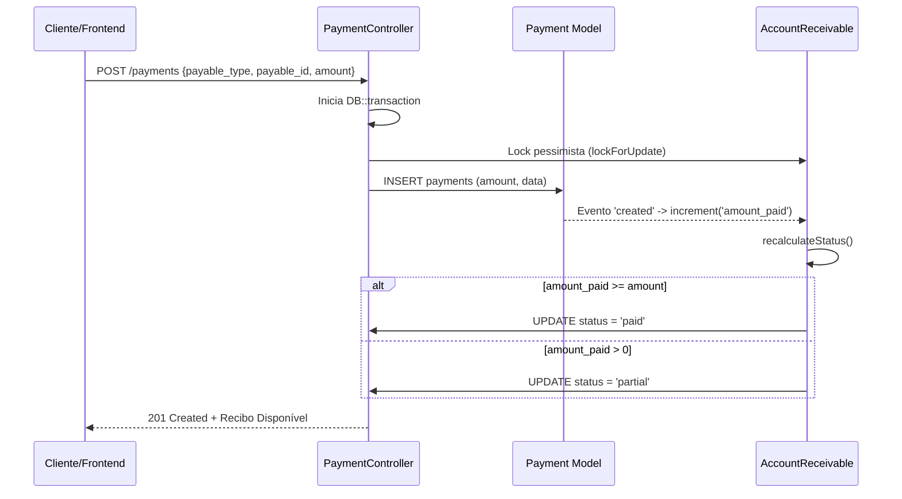
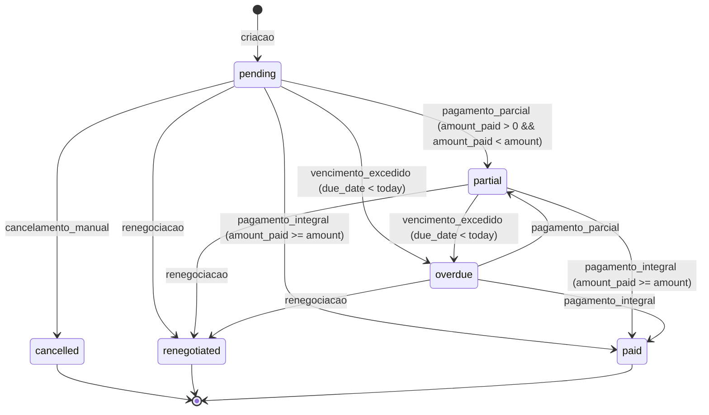
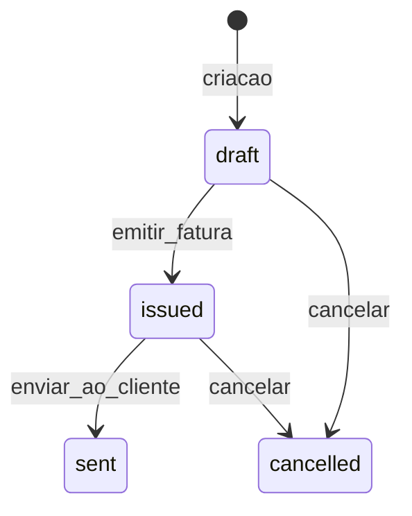
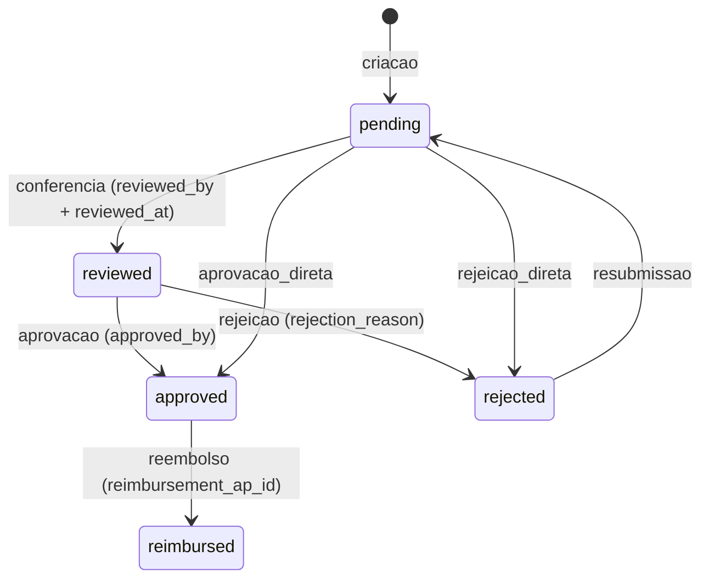
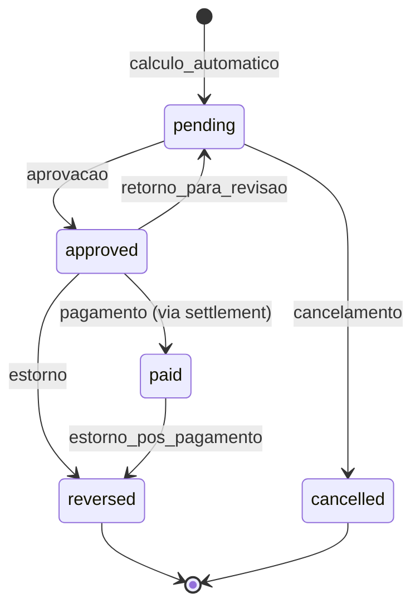
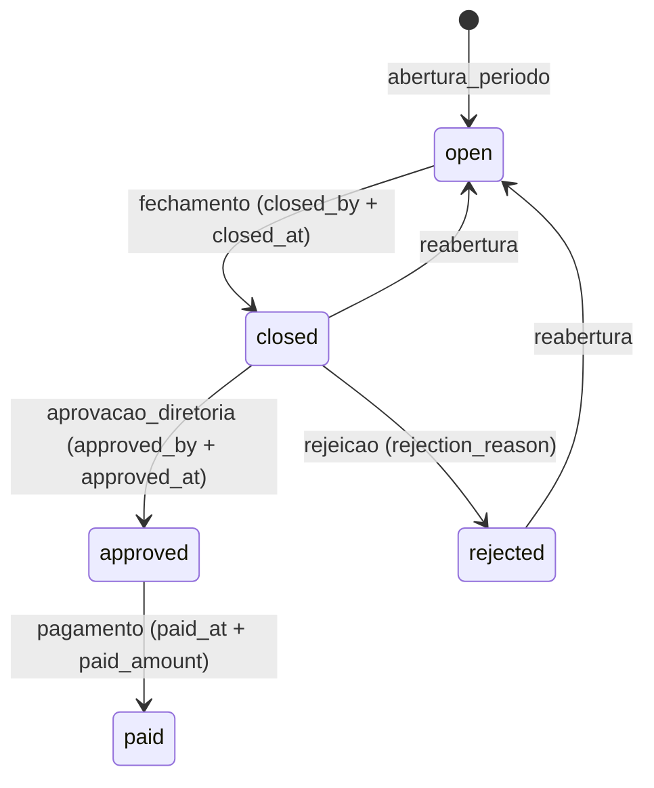
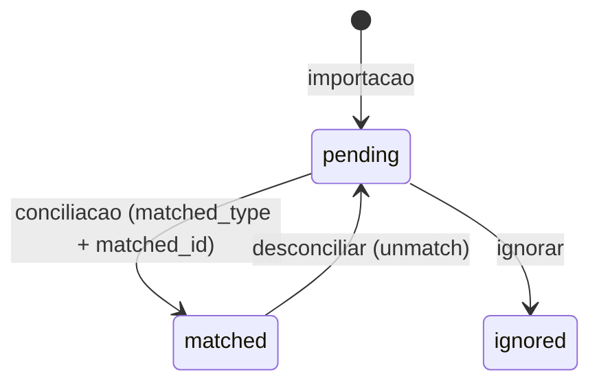
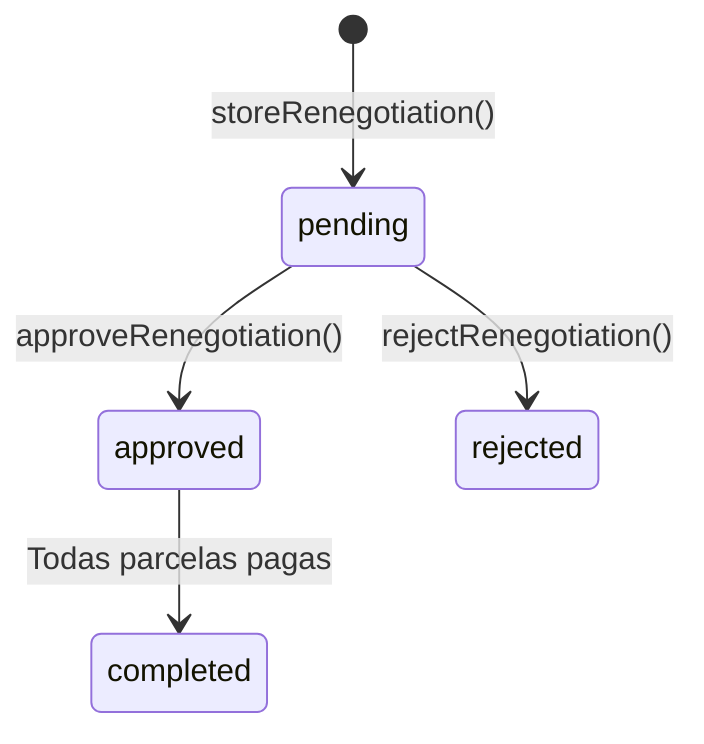

# Modulo: Finance

> **[AI_RULE]** Documentacao oficial Level C Maximum do dominio financeiro. Toda entidade, campo, estado e regra aqui descritos sao extraidos diretamente do codigo-fonte e devem ser respeitados por qualquer agente de IA.

---

## 1. Visao Geral

O modulo Finance e o nucleo financeiro do Kalibrium ERP, responsavel por todo o ciclo de vida monetario: faturamento, contas a receber, contas a pagar, comissoes, despesas, conciliacao bancaria e plano de contas. Opera como multi-tenant via `BelongsToTenant` com isolamento total por `tenant_id`.

### 1.1 Responsabilidades Principais

- Gestao completa de contas a receber (AR) e contas a pagar (AP)
- Faturamento vinculado a ordens de servico e orcamentos
- Motor de comissoes com 11 tipos de calculo e campanhas aceleradoras
- Controle de despesas com workflow de aprovacao em 3 niveis
- Conciliacao bancaria automatizada com regras inteligentes (OFX, CNAB 240, CNAB 400)
- Plano de contas hierarquico (receita, despesa, ativo, passivo)
- Centros de custo com estrutura pai-filho
- Integracao bidirecional com modulo Fiscal (NF-e/NFS-e)
- Exportacao OFX/CSV e relatorios contabeis
- Demonstracao de Resultado do Exercicio (DRE) com breakdown mensal
- Projecao de fluxo de caixa (entradas/saidas previstas vs realizadas)
- Analise de risco de credito por cliente (score 0-100)
- Gestao de cheques recebidos/emitidos com workflow de deposito/compensacao
- Caixa do tecnico (TechnicianCashFund) com transferencias e transacoes
- Transferencia de fundos entre contas bancarias e tecnicos
- Registros de abastecimento (FuelingLog) com geolocalizacao
- Renegociacao de dividas e regua de cobranca automatica
- Geracao de recibos e holerites em PDF

---

## 2. Entidades (Models) e Campos

### 2.1 Invoice

**Model**: `App\Models\Invoice`
**Tabela**: `invoices`
**Traits**: `BelongsToTenant`, `HasFactory`, `SoftDeletes`, `Auditable`

| Campo | Tipo | Descricao |
|---|---|---|
| `id` | `int` | PK |
| `tenant_id` | `int` | FK tenant |
| `work_order_id` | `int\|null` | FK para WorkOrder |
| `customer_id` | `int\|null` | FK para Customer |
| `created_by` | `int\|null` | FK para User criador |
| `invoice_number` | `string\|null` | Numero sequencial (NF-000001) |
| `nf_number` | `string\|null` | Numero da nota fiscal |
| `status` | `InvoiceStatus` | Enum: draft, issued, sent, cancelled |
| `total` | `decimal:2` | Valor total da fatura |
| `discount` | `decimal:2\|null` | Desconto aplicado |
| `issued_at` | `date\|null` | Data de emissao |
| `due_date` | `date\|null` | Data de vencimento |
| `observations` | `string\|null` | Observacoes |
| `items` | `array\|null` | Itens da fatura (JSON) |
| `fiscal_status` | `string\|null` | emitting, emitted, failed |
| `fiscal_note_key` | `string\|null` | Chave de acesso da NF-e |
| `fiscal_emitted_at` | `datetime\|null` | Quando a NF-e foi emitida |
| `fiscal_error` | `string\|null` | Erro de emissao fiscal |
| `deleted_at` | `datetime\|null` | Soft delete |

**Relacionamentos**:

- `workOrder()` → BelongsTo WorkOrder
- `customer()` → BelongsTo Customer
- `creator()` → BelongsTo User (created_by)
- `fiscalNote()` → HasOne FiscalNote (via work_order_id)
- `accountsReceivable()` → HasMany AccountReceivable (invoice_id)

**Metodos**:

- `nextNumber(int $tenantId): string` — Gera proximo numero com lock atomico (lockForUpdate)

### 2.2 AccountReceivable

**Model**: `App\Models\AccountReceivable`
**Tabela**: `accounts_receivable`
**Traits**: `BelongsToTenant`, `HasFactory`, `SoftDeletes`, `Auditable`, `SyncsWithAgenda`, `SetsCreatedBy`

| Campo | Tipo | Descricao |
|---|---|---|
| `id` | `int` | PK |
| `tenant_id` | `int` | FK tenant |
| `customer_id` | `int\|null` | FK para Customer |
| `work_order_id` | `int\|null` | FK para WorkOrder |
| `quote_id` | `int\|null` | FK para Quote |
| `invoice_id` | `int\|null` | FK para Invoice |
| `created_by` | `int\|null` | FK para User |
| `chart_of_account_id` | `int\|null` | FK para ChartOfAccount |
| `cost_center_id` | `int\|null` | FK para CostCenter |
| `origin_type` | `string\|null` | Tipo de origem (OS, orcamento, manual) |
| `description` | `string\|null` | Descricao do lancamento |
| `amount` | `decimal:2` | Valor total |
| `amount_paid` | `decimal:2` | Valor ja pago |
| `penalty_amount` | `decimal:2\|null` | Multa |
| `interest_amount` | `decimal:2\|null` | Juros |
| `discount_amount` | `decimal:2\|null` | Desconto |
| `due_date` | `date\|null` | Data de vencimento |
| `paid_at` | `date\|null` | Data do pagamento integral |
| `status` | `FinancialStatus` | Enum: pending, partial, paid, overdue, cancelled, renegotiated, received |
| `payment_method` | `string\|null` | Metodo: dinheiro, pix, cartao_credito, cartao_debito, boleto, transferencia |
| `notes` | `string\|null` | Observacoes |
| `nosso_numero` | `string\|null` | Nosso numero (boleto) |
| `numero_documento` | `string\|null` | Numero do documento |
| `deleted_at` | `datetime\|null` | Soft delete |

**Relacionamentos**:

- `customer()` → BelongsTo Customer
- `workOrder()` → BelongsTo WorkOrder
- `quote()` → BelongsTo Quote
- `invoice()` → BelongsTo Invoice
- `creator()` → BelongsTo User (created_by)
- `chartOfAccount()` → BelongsTo ChartOfAccount
- `costCenter()` → BelongsTo CostCenter
- `payments()` → MorphMany Payment (payable)

**Metodos**:

- `recalculateStatus(): void` — Recalcula status automaticamente baseado em amount vs amount_paid e due_date. Respeita status terminais (RENEGOTIATED, CANCELLED).
- `centralSyncData(): array` — Sincroniza status com Agenda Central

### 2.3 AccountPayable

**Model**: `App\Models\AccountPayable`
**Tabela**: `accounts_payable`
**Traits**: `BelongsToTenant`, `HasFactory`, `SoftDeletes`, `Auditable`, `SyncsWithAgenda`, `SetsCreatedBy`

| Campo | Tipo | Descricao |
|---|---|---|
| `id` | `int` | PK |
| `tenant_id` | `int` | FK tenant |
| `created_by` | `int\|null` | FK para User |
| `supplier_id` | `int\|null` | FK para Supplier |
| `category_id` | `int\|null` | FK para AccountPayableCategory |
| `chart_of_account_id` | `int\|null` | FK para ChartOfAccount |
| `cost_center_id` | `int\|null` | FK para CostCenter |
| `work_order_id` | `int\|null` | FK para WorkOrder |
| `description` | `string\|null` | Descricao |
| `amount` | `decimal:2` | Valor total |
| `amount_paid` | `decimal:2` | Valor pago |
| `penalty_amount` | `decimal:2\|null` | Multa |
| `interest_amount` | `decimal:2\|null` | Juros |
| `discount_amount` | `decimal:2\|null` | Desconto |
| `due_date` | `date\|null` | Vencimento |
| `paid_at` | `date\|null` | Data de pagamento |
| `status` | `FinancialStatus` | Enum: pending, partial, paid, overdue, cancelled, renegotiated |
| `payment_method` | `string\|null` | Metodo de pagamento |
| `notes` | `string\|null` | Observacoes |
| `deleted_at` | `datetime\|null` | Soft delete |

**Categorias Padrao**: fornecedor, aluguel, salario, imposto, servico, manutencao, outros

**Relacionamentos**:

- `creator()` → BelongsTo User (created_by)
- `supplierRelation()` → BelongsTo Supplier
- `categoryRelation()` → BelongsTo AccountPayableCategory
- `chartOfAccount()` → BelongsTo ChartOfAccount
- `costCenter()` → BelongsTo CostCenter
- `workOrder()` → BelongsTo WorkOrder
- `payments()` → MorphMany Payment (payable)

**Metodos**:

- `recalculateStatus(): void` — Identico ao AR. Recalcula com bcmath. Respeita status terminais.

### 2.4 AccountReceivableInstallment

**Model**: `App\Models\AccountReceivableInstallment`
**Tabela**: `account_receivable_installments`
**Traits**: `BelongsToTenant`, `HasFactory`

| Campo | Tipo | Descricao |
|---|---|---|
| `tenant_id` | `int` | FK tenant |
| `account_receivable_id` | `int` | FK para AccountReceivable |
| `installment_number` | `int` | Numero da parcela |
| `due_date` | `date` | Vencimento da parcela |
| `amount` | `decimal:2` | Valor da parcela |
| `paid_amount` | `decimal:2` | Valor pago |
| `status` | `string` | Status da parcela |
| `paid_at` | `date\|null` | Data de pagamento |

### 2.5 AccountPayableInstallment

**Model**: `App\Models\AccountPayableInstallment`
**Tabela**: `account_payable_installments`
**Traits**: `BelongsToTenant`, `HasFactory`

| Campo | Tipo | Descricao |
|---|---|---|
| `tenant_id` | `int` | FK tenant |
| `account_payable_id` | `int` | FK para AccountPayable |
| `installment_number` | `int` | Numero da parcela |
| `due_date` | `date` | Vencimento |
| `amount` | `decimal:2` | Valor |
| `paid_amount` | `decimal:2` | Valor pago |
| `status` | `string` | Status |
| `paid_at` | `date\|null` | Data de pagamento |

### 2.6 Payment

**Model**: `App\Models\Payment`
**Tabela**: `payments`
**Traits**: `BelongsToTenant`, `Auditable`, `HasFactory`

| Campo | Tipo | Descricao |
|---|---|---|
| `id` | `int` | PK |
| `tenant_id` | `int` | FK tenant |
| `payable_type` | `string\|null` | Morph type (AccountReceivable, AccountPayable) |
| `payable_id` | `int\|null` | Morph ID |
| `received_by` | `int\|null` | FK para User que recebeu |
| `amount` | `decimal:2` | Valor do pagamento |
| `payment_method` | `string\|null` | Metodo |
| `payment_date` | `date\|null` | Data do pagamento |
| `notes` | `string\|null` | Observacoes |

**Relacionamentos**:

- `payable()` → MorphTo (AccountReceivable ou AccountPayable)
- `receiver()` → BelongsTo User (received_by)

**Comportamento Automatico (booted)**:

- `created` → Dentro de DB::transaction com lockForUpdate, incrementa `amount_paid` do payable e chama `recalculateStatus()`
- `deleted` → Dentro de DB::transaction com lockForUpdate, decrementa `amount_paid` (clamped >= 0) e chama `recalculateStatus()`

### 2.7 PaymentMethod

**Model**: `App\Models\PaymentMethod`
**Tabela**: `payment_methods`
**Traits**: `BelongsToTenant`

| Campo | Tipo | Descricao |
|---|---|---|
| `tenant_id` | `int` | FK tenant |
| `name` | `string` | Nome do metodo |
| `code` | `string\|null` | Codigo interno |
| `is_active` | `boolean` | Se esta ativo |
| `sort_order` | `integer` | Ordem de exibicao |

### 2.8 PaymentReceipt

**Model**: `App\Models\PaymentReceipt`
**Tabela**: `payment_receipts`
**Traits**: `BelongsToTenant`

| Campo | Tipo | Descricao |
|---|---|---|
| `tenant_id` | `int` | FK tenant |
| `payment_id` | `int` | FK para Payment |
| `receipt_number` | `string` | Numero do recibo |
| `pdf_path` | `string\|null` | Caminho do PDF |
| `generated_by` | `int\|null` | FK User gerador |

**Relacionamentos**:

- `payment()` → BelongsTo Payment
- `generator()` → BelongsTo User (generated_by)

### 2.9 Expense

**Model**: `App\Models\Expense`
**Tabela**: `expenses`
**Traits**: `BelongsToTenant`, `HasFactory`, `SoftDeletes`, `Auditable`, `SetsCreatedBy`

| Campo | Tipo | Descricao |
|---|---|---|
| `id` | `int` | PK |
| `tenant_id` | `int` | FK tenant |
| `expense_category_id` | `int\|null` | FK para ExpenseCategory |
| `work_order_id` | `int\|null` | FK para WorkOrder |
| `created_by` | `int\|null` | FK para User criador |
| `approved_by` | `int\|null` | FK para User aprovador |
| `chart_of_account_id` | `int\|null` | FK para ChartOfAccount |
| `reviewed_by` | `int\|null` | FK para User conferente |
| `reimbursement_ap_id` | `int\|null` | FK para AP de reembolso |
| `description` | `string` | Descricao (default: 'Despesa sem descricao') |
| `amount` | `decimal:2` | Valor |
| `km_quantity` | `decimal:1\|null` | Quilometragem |
| `km_rate` | `decimal:4\|null` | Taxa por km |
| `km_billed_to_client` | `boolean` | Se km e cobrado do cliente |
| `expense_date` | `date\|null` | Data da despesa |
| `payment_method` | `string\|null` | Metodo de pagamento |
| `notes` | `string\|null` | Notas |
| `receipt_path` | `string\|null` | Caminho do comprovante |
| `affects_technician_cash` | `boolean` | Se afeta caixa do tecnico |
| `affects_net_value` | `boolean` | Se afeta valor liquido (para comissao) |
| `reviewed_at` | `datetime\|null` | Data da conferencia |
| `status` | `ExpenseStatus` | Enum: pending, reviewed, approved, rejected, reimbursed |
| `rejection_reason` | `string\|null` | Motivo da rejeicao |
| `payroll_id` | `int\|null` | FK para Payroll |
| `payroll_line_id` | `int\|null` | FK para PayrollLine |
| `deleted_at` | `datetime\|null` | Soft delete |

**Relacionamentos**:

- `category()` → BelongsTo ExpenseCategory (expense_category_id)
- `workOrder()` → BelongsTo WorkOrder
- `creator()` → BelongsTo User (created_by)
- `approver()` → BelongsTo User (approved_by)
- `reviewer()` → BelongsTo User (reviewed_by)
- `chartOfAccount()` → BelongsTo ChartOfAccount
- `statusHistory()` → HasMany ExpenseStatusHistory
- `payroll()` → BelongsTo Payroll
- `payrollLine()` → BelongsTo PayrollLine

### 2.10 ExpenseCategory

**Model**: `App\Models\ExpenseCategory`
**Tabela**: `expense_categories`
**Traits**: `BelongsToTenant`, `HasFactory`, `SoftDeletes`, `Auditable`

| Campo | Tipo | Descricao |
|---|---|---|
| `tenant_id` | `int` | FK tenant |
| `name` | `string` | Nome da categoria |
| `color` | `string\|null` | Cor para UI |
| `active` | `boolean` | Se esta ativa |
| `budget_limit` | `decimal:2\|null` | Limite orcamentario |
| `default_affects_net_value` | `boolean` | Padrao para affects_net_value |
| `default_affects_technician_cash` | `boolean` | Padrao para affects_technician_cash |

### 2.11 ExpenseStatusHistory

**Model**: `App\Models\ExpenseStatusHistory`
**Tabela**: `expense_status_history`
**Traits**: `BelongsToTenant`

| Campo | Tipo | Descricao |
|---|---|---|
| `tenant_id` | `int` | FK tenant |
| `expense_id` | `int` | FK para Expense |
| `changed_by` | `int` | FK para User |
| `from_status` | `ExpenseStatus` | Status anterior |
| `to_status` | `ExpenseStatus` | Novo status |
| `reason` | `string\|null` | Motivo da mudanca |

### 2.12 CommissionRule

**Model**: `App\Models\CommissionRule`
**Tabela**: `commission_rules`
**Traits**: `BelongsToTenant`, `HasFactory`, `Auditable`, `SoftDeletes`

| Campo | Tipo | Descricao |
|---|---|---|
| `tenant_id` | `int` | FK tenant |
| `user_id` | `int\|null` | FK para User (se regra individual) |
| `name` | `string` | Nome da regra |
| `type` | `string` | percentage ou fixed (legacy) |
| `value` | `decimal:2` | Percentual ou valor fixo |
| `applies_to` | `string` | all, products, services |
| `calculation_type` | `string` | Um dos 11 tipos de calculo |
| `applies_to_role` | `string\|null` | tecnico, vendedor, motorista |
| `applies_when` | `string\|null` | os_completed, installment_paid, os_invoiced |
| `tiers` | `array\|null` | Faixas escalonadas (JSON) |
| `priority` | `integer` | Prioridade de aplicacao |
| `active` | `boolean` | Se esta ativa |
| `source_filter` | `string\|null` | Filtro de origem |
| `percentage` | `decimal\|null` | Percentual alternativo |
| `fixed_amount` | `decimal\|null` | Valor fixo alternativo |

**11 Tipos de Calculo** (`calculation_type`):

1. `percent_gross` — % do Bruto
2. `percent_net` — % do Liquido (bruto - despesas - custo)
3. `percent_gross_minus_displacement` — % (Bruto - Deslocamento)
4. `percent_services_only` — % somente Servicos
5. `percent_products_only` — % somente Produtos
6. `percent_profit` — % do Lucro (bruto - custo)
7. `percent_gross_minus_expenses` — % (Bruto - Despesas OS)
8. `tiered_gross` — % Escalonado por faixa (usa campo `tiers`)
9. `fixed_per_os` — Valor fixo por OS
10. `fixed_per_item` — Valor fixo por item
11. `custom_formula` — Formula personalizada (safe evaluator sem eval)

**Roles suportadas**: tecnico/technician, vendedor/seller/salesperson, motorista/driver

**Triggers**: os_completed, installment_paid, os_invoiced

**Metodos**:

- `calculateCommission(float|string $baseAmount, array $context): string` — Motor principal de calculo com bcmath
- `calculate(WorkOrder $wo): string` — Bridge que extrai contexto da OS e delega para calculateCommission
- `calculateTiered(float|string $amount): string` — Calculo escalonado por faixas
- `calculateCustom(float|string $amount, array $context): string` — Formula customizada com parser seguro (sem eval)
- `safeEvaluate(string $expr): string` — Avaliador aritmetico seguro com tokenizador
- `normalizeRole(?string $role): ?string` — Normaliza alias de role

### 2.13 CommissionEvent

**Model**: `App\Models\CommissionEvent`
**Tabela**: `commission_events`
**Traits**: `BelongsToTenant`, `HasFactory`, `Auditable`, `SoftDeletes`

| Campo | Tipo | Descricao |
|---|---|---|
| `tenant_id` | `int` | FK tenant |
| `commission_rule_id` | `int` | FK para CommissionRule |
| `work_order_id` | `int\|null` | FK para WorkOrder |
| `account_receivable_id` | `int\|null` | FK para AccountReceivable |
| `user_id` | `int` | FK para User (beneficiario) |
| `settlement_id` | `int\|null` | FK para CommissionSettlement |
| `base_amount` | `decimal:2` | Valor base do calculo |
| `commission_amount` | `decimal:2` | Valor da comissao |
| `proportion` | `decimal:4` | Proporcao aplicada |
| `status` | `CommissionEventStatus` | Enum: pending, approved, paid, reversed, cancelled |
| `notes` | `string\|null` | Observacoes |

**Transicoes validas**:

- `pending` → approved, cancelled
- `approved` → paid, reversed, pending
- `paid` → reversed
- `reversed` → (terminal)
- `cancelled` → (terminal)

**Relacionamentos**:

- `rule()` → BelongsTo CommissionRule
- `workOrder()` → BelongsTo WorkOrder
- `user()` → BelongsTo User
- `accountReceivable()` → BelongsTo AccountReceivable
- `settlement()` → BelongsTo CommissionSettlement

### 2.14 CommissionSettlement

**Model**: `App\Models\CommissionSettlement`
**Tabela**: `commission_settlements`
**Traits**: `BelongsToTenant`, `HasFactory`, `Auditable`

| Campo | Tipo | Descricao |
|---|---|---|
| `tenant_id` | `int` | FK tenant |
| `user_id` | `int` | FK para User (beneficiario) |
| `period` | `string` | Periodo (YYYY-MM) |
| `total_amount` | `decimal:2` | Valor total do fechamento |
| `events_count` | `int` | Numero de eventos |
| `status` | `CommissionSettlementStatus` | Enum: open, closed, pending_approval, approved, rejected, paid |
| `closed_by` | `int\|null` | FK User que fechou |
| `closed_at` | `datetime\|null` | Data do fechamento |
| `approved_by` | `int\|null` | FK User que aprovou |
| `approved_at` | `datetime\|null` | Data da aprovacao |
| `rejection_reason` | `string\|null` | Motivo da rejeicao |
| `paid_at` | `date\|null` | Data do pagamento |
| `paid_amount` | `decimal:2\|null` | Valor pago |
| `payment_notes` | `string\|null` | Notas de pagamento |

**Atributos Computados**: `balance` (total_amount - paid_amount)

**Metodos**:

- `recalculateTotals(): self` — Recalcula total_amount e events_count a partir dos eventos vinculados (approved + paid)
- `eventsByPeriod(): HasMany` — Fallback para quando settlement_id nao esta preenchido

### 2.15 CommissionCampaign

**Model**: `App\Models\CommissionCampaign`
**Tabela**: `commission_campaigns`
**Traits**: `BelongsToTenant`, `HasFactory`, `Auditable`

| Campo | Tipo | Descricao |
|---|---|---|
| `tenant_id` | `int` | FK tenant |
| `name` | `string` | Nome da campanha |
| `multiplier` | `decimal:4` | Multiplicador (ex: 1.5 = 50% bonus) |
| `applies_to_role` | `string\|null` | Filtro por role |
| `applies_to_calculation_type` | `string\|null` | Filtro por tipo de calculo |
| `starts_at` | `date` | Inicio da campanha |
| `ends_at` | `date` | Fim da campanha |
| `active` | `boolean` | Se esta ativa |

**Metodos**:

- `scopeActive($query)` — Filtra campanhas ativas no periodo atual
- `isCurrentlyActive(): bool` — Verifica se campanha esta vigente

### 2.16 CommissionGoal

**Model**: `App\Models\CommissionGoal`
**Tabela**: `commission_goals`
**Traits**: `BelongsToTenant`, `HasFactory`, `Auditable`

| Campo | Tipo | Descricao |
|---|---|---|
| `tenant_id` | `int` | FK tenant |
| `user_id` | `int` | FK para User |
| `period` | `string` | Periodo (YYYY-MM) |
| `type` | `string` | revenue, os_count, new_clients |
| `target_amount` | `decimal:2` | Meta |
| `achieved_amount` | `decimal:2` | Realizado |
| `bonus_percentage` | `decimal:2` | % de bonus ao atingir |
| `bonus_amount` | `decimal:2` | Valor de bonus calculado |
| `notes` | `string\|null` | Observacoes |

**Tipos de Meta**: revenue (Faturamento), os_count (N de OS), new_clients (Novos Clientes)

**Atributos Computados**: `progress_percentage`, `is_achieved`

### 2.17 CommissionDispute

**Model**: `App\Models\CommissionDispute`
**Tabela**: `commission_disputes`
**Traits**: `BelongsToTenant`, `HasFactory`, `Auditable`

| Campo | Tipo | Descricao |
|---|---|---|
| `tenant_id` | `int` | FK tenant |
| `commission_event_id` | `int` | FK para CommissionEvent |
| `user_id` | `int` | FK para User contestador |
| `reason` | `string` | Motivo da contestacao |
| `status` | `CommissionDisputeStatus` | Enum: open, accepted, rejected |
| `resolution_notes` | `string\|null` | Notas de resolucao |
| `resolved_by` | `int\|null` | FK User resolvedor |
| `resolved_at` | `datetime\|null` | Data de resolucao |

### 2.18 RecurringCommission

**Model**: `App\Models\RecurringCommission`
**Tabela**: `recurring_commissions`
**Traits**: `BelongsToTenant`, `HasFactory`, `Auditable`

| Campo | Tipo | Descricao |
|---|---|---|
| `tenant_id` | `int` | FK tenant |
| `user_id` | `int` | FK para User |
| `recurring_contract_id` | `int` | FK para RecurringContract |
| `commission_rule_id` | `int` | FK para CommissionRule |
| `status` | `RecurringCommissionStatus` | Enum: active, paused, terminated |
| `last_generated_at` | `date\|null` | Ultimo processamento |

### 2.19 BankAccount

**Model**: `App\Models\BankAccount`
**Tabela**: `bank_accounts`
**Traits**: `BelongsToTenant`, `HasFactory`, `SoftDeletes`, `Auditable`

| Campo | Tipo | Descricao |
|---|---|---|
| `tenant_id` | `int` | FK tenant |
| `name` | `string` | Nome da conta |
| `bank_name` | `string\|null` | Nome do banco |
| `agency` | `string\|null` | Agencia |
| `account_number` | `string\|null` | Numero da conta |
| `account_type` | `string\|null` | corrente, poupanca, pagamento |
| `pix_key` | `string\|null` | Chave PIX |
| `balance` | `decimal:2` | Saldo atual |
| `initial_balance` | `decimal:2` | Saldo inicial |
| `is_active` | `boolean` | Se esta ativa |
| `created_by` | `int\|null` | FK User criador |

**Tipos**: corrente (Conta Corrente), poupanca (Poupanca), pagamento (Conta Pagamento)

### 2.20 BankStatement

**Model**: `App\Models\BankStatement`
**Tabela**: `bank_statements`
**Traits**: `BelongsToTenant`, `HasFactory`

| Campo | Tipo | Descricao |
|---|---|---|
| `tenant_id` | `int` | FK tenant |
| `bank_account_id` | `int` | FK para BankAccount |
| `filename` | `string` | Nome do arquivo importado |
| `format` | `string` | Formato (OFX, CSV) |
| `imported_at` | `datetime` | Data da importacao |
| `created_by` | `int\|null` | FK User |
| `total_entries` | `int` | Total de lancamentos |
| `matched_entries` | `int` | Lancamentos conciliados |

### 2.21 BankStatementEntry

**Model**: `App\Models\BankStatementEntry`
**Tabela**: `bank_statement_entries`
**Traits**: `BelongsToTenant`, `HasFactory`

| Campo | Tipo | Descricao |
|---|---|---|
| `bank_statement_id` | `int` | FK para BankStatement |
| `tenant_id` | `int` | FK tenant |
| `date` | `date` | Data do lancamento |
| `description` | `string` | Descricao do extrato |
| `amount` | `decimal:2` | Valor |
| `type` | `string` | Tipo (credito/debito) |
| `matched_type` | `string\|null` | Morph type do registro conciliado |
| `matched_id` | `int\|null` | Morph ID do registro conciliado |
| `status` | `string` | pending, matched, ignored |
| `possible_duplicate` | `boolean` | Flag de possivel duplicidade |
| `category` | `string\|null` | Categoria automatica |
| `reconciled_by` | `string\|null` | Metodo de conciliacao (auto/manual) |
| `reconciled_at` | `datetime\|null` | Data da conciliacao |
| `reconciled_by_user_id` | `int\|null` | FK User que conciliou |
| `rule_id` | `int\|null` | FK ReconciliationRule usada |
| `transaction_id` | `string\|null` | ID da transacao no banco |

**Relacionamentos**:

- `statement()` → BelongsTo BankStatement
- `matched()` → MorphTo (AccountReceivable, AccountPayable, etc.)
- `rule()` → BelongsTo ReconciliationRule
- `reconciledByUser()` → BelongsTo User

### 2.22 ChartOfAccount

**Model**: `App\Models\ChartOfAccount`
**Tabela**: `chart_of_accounts`
**Traits**: `BelongsToTenant`, `HasFactory`

| Campo | Tipo | Descricao |
|---|---|---|
| `tenant_id` | `int` | FK tenant |
| `parent_id` | `int\|null` | FK pai (hierarquico) |
| `code` | `string` | Codigo contabil |
| `name` | `string` | Nome da conta |
| `type` | `string` | revenue, expense, asset, liability |
| `is_system` | `boolean` | Se e conta do sistema |
| `is_active` | `boolean` | Se esta ativa |

**Tipos**: revenue (Receita), expense (Despesa), asset (Ativo), liability (Passivo)

**Relacionamentos**:

- `parent()` → BelongsTo ChartOfAccount
- `children()` → HasMany ChartOfAccount
- `receivables()` → HasMany AccountReceivable
- `payables()` → HasMany AccountPayable
- `expenses()` → HasMany Expense

### 2.23 CostCenter

**Model**: `App\Models\CostCenter`
**Tabela**: `cost_centers`
**Traits**: `SoftDeletes`, `BelongsToTenant`

| Campo | Tipo | Descricao |
|---|---|---|
| `tenant_id` | `int` | FK tenant |
| `name` | `string` | Nome |
| `code` | `string` | Codigo |
| `parent_id` | `int\|null` | FK pai (hierarquico) |
| `is_active` | `boolean` | Se esta ativo |

### 2.24 AccountPayableCategory

**Model**: `App\Models\AccountPayableCategory`
**Tabela**: `account_payable_categories`
**Traits**: `BelongsToTenant`, `HasFactory`, `SoftDeletes`

| Campo | Tipo | Descricao |
|---|---|---|
| `tenant_id` | `int` | FK tenant |
| `name` | `string` | Nome |
| `color` | `string\|null` | Cor para UI |
| `description` | `string\|null` | Descricao |
| `is_active` | `boolean` | Se esta ativa |

### 2.25 FinancialCheck

**Model**: `App\Models\FinancialCheck`
**Tabela**: `financial_checks`
**Traits**: `BelongsToTenant`, `SoftDeletes`

| Campo | Tipo | Descricao |
|---|---|---|
| `tenant_id` | `int` | FK tenant |
| `type` | `string` | Tipo: received (recebido), issued (emitido) |
| `number` | `string` | Numero do cheque |
| `bank` | `string` | Banco |
| `amount` | `decimal:2` | Valor |
| `due_date` | `date` | Data de vencimento |
| `issuer` | `string` | Emitente |
| `status` | `FinancialCheckStatus` | Enum: pending, deposited, compensated, returned, custody |
| `notes` | `string\|null` | Observacoes |

### 2.26 ReconciliationRule

**Model**: `App\Models\ReconciliationRule`
**Tabela**: `reconciliation_rules`
**Traits**: `BelongsToTenant`, `HasFactory`

| Campo | Tipo | Descricao |
|---|---|---|
| `tenant_id` | `int` | FK tenant |
| `name` | `string` | Nome da regra |
| `match_field` | `string\|null` | Campo para match (description, amount, etc.) |
| `match_operator` | `string\|null` | Operador (contains, equals, regex) |
| `match_value` | `string\|null` | Valor para match |
| `match_amount_min` | `decimal\|null` | Valor minimo |
| `match_amount_max` | `decimal\|null` | Valor maximo |
| `action` | `string\|null` | Acao (match, categorize, ignore) |
| `target_type` | `string\|null` | Morph type do alvo |
| `target_id` | `int\|null` | Morph ID do alvo |
| `category` | `string\|null` | Categoria automatica |
| `customer_id` | `int\|null` | FK Customer |
| `supplier_id` | `int\|null` | FK Supplier |
| `priority` | `int` | Prioridade de aplicacao |
| `is_active` | `boolean` | Se esta ativa |
| `times_applied` | `int` | Contador de aplicacoes |

### 2.27 FundTransfer

**Model**: `App\Models\FundTransfer`
**Tabela**: `fund_transfers`
**Traits**: `BelongsToTenant`, `HasFactory`, `SoftDeletes`, `Auditable`

| Campo | Tipo | Descricao |
|---|---|---|
| `tenant_id` | `int` | FK tenant |
| `bank_account_id` | `int` | FK para BankAccount (origem) |
| `to_user_id` | `int` | FK para User (tecnico destino) |
| `amount` | `decimal:2` | Valor transferido |
| `payment_method` | `string` | pix, ted, doc, dinheiro |
| `description` | `string\|null` | Descricao |
| `status` | `FundTransferStatus` | Enum: completed, cancelled |
| `created_by` | `int` | FK User criador |

**Constantes**: `STATUS_COMPLETED`, `STATUS_CANCELLED`, `PAYMENT_METHODS` (pix, ted, doc, dinheiro)

### 2.28 FuelingLog

**Model**: `App\Models\FuelingLog`
**Tabela**: `fueling_logs`
**Traits**: `BelongsToTenant`, `HasFactory`, `SoftDeletes`, `Auditable`

| Campo | Tipo | Descricao |
|---|---|---|
| `tenant_id` | `int` | FK tenant |
| `user_id` | `int\|null` | FK User (tecnico) |
| `work_order_id` | `int\|null` | FK WorkOrder |
| `fueling_date` | `date\|null` | Data do abastecimento |
| `vehicle_plate` | `string\|null` | Placa do veiculo |
| `odometer_km` | `decimal\|null` | Quilometragem |
| `gas_station_name` | `string\|null` | Nome do posto |
| `gas_station_lat` | `decimal\|null` | Latitude do posto |
| `gas_station_lng` | `decimal\|null` | Longitude do posto |
| `fuel_type` | `string\|null` | Tipo de combustivel |
| `liters` | `decimal\|null` | Litros abastecidos |
| `price_per_liter` | `decimal\|null` | Preco por litro |
| `total_amount` | `decimal\|null` | Valor total |
| `receipt_path` | `string\|null` | Caminho do comprovante |
| `notes` | `string\|null` | Observacoes |
| `status` | `FuelingLogStatus` | Status do registro |

### 2.29 TechnicianCashFund

**Model**: `App\Models\TechnicianCashFund`
**Tabela**: `technician_cash_funds`
**Traits**: `BelongsToTenant`, `HasFactory`

| Campo | Tipo | Descricao |
|---|---|---|
| `tenant_id` | `int` | FK tenant |
| `user_id` | `int` | FK User (tecnico) |
| `balance` | `decimal:2` | Saldo em dinheiro |
| `card_balance` | `decimal:2` | Saldo em cartao corporativo |
| `credit_limit` | `decimal:2\|null` | Limite de credito |
| `status` | `string\|null` | Status do caixa |

**Relacionamentos**:

- `technician()` → BelongsTo User (user_id)
- `transactions()` → HasMany TechnicianCashTransaction

### 2.30 TechnicianCashTransaction

**Model**: `App\Models\TechnicianCashTransaction`
**Tabela**: `technician_cash_transactions`
**Traits**: `BelongsToTenant`, `HasFactory`

| Campo | Tipo | Descricao |
|---|---|---|
| `tenant_id` | `int` | FK tenant |
| `fund_id` | `int` | FK para TechnicianCashFund |
| `type` | `string` | credit ou debit |
| `payment_method` | `string` | cash ou corporate_card |
| `amount` | `decimal:2` | Valor |
| `balance_after` | `decimal:2` | Saldo apos transacao |
| `expense_id` | `int\|null` | FK Expense vinculada |
| `work_order_id` | `int\|null` | FK WorkOrder |
| `created_by` | `int\|null` | FK User |
| `description` | `string\|null` | Descricao |
| `transaction_date` | `date\|null` | Data da transacao |

**Constantes**: `TYPE_CREDIT`, `TYPE_DEBIT`, `METHOD_CASH`, `METHOD_CORPORATE_CARD`

### 2.31 TechnicianFundRequest

**Model**: `App\Models\TechnicianFundRequest`
**Tabela**: `technician_fund_requests`
**Traits**: `BelongsToTenant`

| Campo | Tipo | Descricao |
|---|---|---|
| `tenant_id` | `int` | FK tenant |
| `user_id` | `int` | FK User (tecnico solicitante) |
| `amount` | `decimal:2` | Valor solicitado |
| `reason` | `string` | Motivo da solicitacao |
| `status` | `string` | Status da solicitacao |
| `approved_by` | `int\|null` | FK User aprovador |
| `approved_at` | `datetime\|null` | Data da aprovacao |
| `payment_method` | `string\|null` | Metodo de pagamento |

**Relacionamentos**:

- `technician()` → BelongsTo User (user_id)
- `approver()` → BelongsTo User (approved_by)

### 2.32 DebtRenegotiationItem

**Model**: `App\Models\DebtRenegotiationItem`
**Tabela**: `debt_renegotiation_items`
**Traits**: `BelongsToTenant`

| Campo | Tipo | Descricao |
|---|---|---|
| `tenant_id` | `int` | FK tenant |
| `debt_renegotiation_id` | `int` | FK para DebtRenegotiation |
| `account_receivable_id` | `int` | FK para AccountReceivable |
| `original_amount` | `decimal:2` | Valor original do recebivel |

### 2.33 CollectionRule

**Model**: `App\Models\CollectionRule`
**Tabela**: `collection_rules`
**Traits**: `BelongsToTenant`, `Auditable`

| Campo | Tipo | Descricao |
|---|---|---|
| `tenant_id` | `int` | FK tenant |
| `name` | `string` | Nome da regra |
| `days_offset` | `int` | Dias apos vencimento para disparar |
| `channel` | `string` | Canal: email, sms, whatsapp |
| `template_type` | `string\|null` | Tipo de template |
| `template_id` | `int\|null` | FK template |
| `message_body` | `string\|null` | Corpo da mensagem |
| `is_active` | `boolean` | Se esta ativa |
| `sort_order` | `int` | Ordem de execucao |

### 2.34 CollectionAction

**Model**: `App\Models\CollectionAction`
**Tabela**: `collection_actions`
**Traits**: `BelongsToTenant`

| Campo | Tipo | Descricao |
|---|---|---|
| `tenant_id` | `int` | FK tenant |
| `account_receivable_id` | `int` | FK para AccountReceivable |
| `collection_rule_id` | `int` | FK para CollectionRule |
| `step_index` | `int` | Indice do passo na regua |
| `channel` | `string` | Canal utilizado |
| `status` | `string` | Status da acao |
| `scheduled_at` | `datetime` | Data agendada |
| `sent_at` | `datetime\|null` | Data de envio |
| `response` | `string\|null` | Resposta do envio |

**Relacionamentos**:

- `accountReceivable()` → BelongsTo AccountReceivable
- `collectionRule()` → BelongsTo CollectionRule

### 2.35 CollectionActionLog

**Model**: `App\Models\CollectionActionLog`
**Tabela**: `collection_action_logs`
**Traits**: `BelongsToTenant`, `Auditable`

| Campo | Tipo | Descricao |
|---|---|---|
| `tenant_id` | `int` | FK tenant |
| `receivable_id` | `int` | FK para AccountReceivable |
| `rule_id` | `int` | FK para CollectionRule |
| `channel` | `string` | Canal |
| `status` | `string` | Status |
| `message` | `string\|null` | Mensagem enviada |
| `error` | `string\|null` | Erro (se falhou) |

### 2.36 Payslip

**Model**: `App\Models\Payslip`
**Tabela**: `payslips`
**Traits**: `BelongsToTenant`

| Campo | Tipo | Descricao |
|---|---|---|
| `tenant_id` | `int` | FK tenant |
| `payroll_line_id` | `int` | FK para PayrollLine |
| `user_id` | `int` | FK para User |
| `reference_month` | `string` | Mes de referencia (YYYY-MM) |
| `file_path` | `string\|null` | Caminho do PDF |
| `sent_at` | `datetime\|null` | Data de envio ao funcionario |
| `viewed_at` | `datetime\|null` | Data de visualizacao |
| `digital_signature_hash` | `string\|null` | Hash de assinatura digital |

**Relacionamentos**:

- `payrollLine()` → BelongsTo PayrollLine
- `user()` → BelongsTo User

---

## 3. Fluxos e Máquinas de Estado

### 3.0 Fluxo de Liquidação de Contas a Receber (Sequence)



### 3.1 AccountReceivable / AccountPayable (FinancialStatus)



**Regra**: Status `cancelled` e `renegotiated` sao terminais — `recalculateStatus()` ignora-os.

### 3.2 Invoice (InvoiceStatus)



**Regra**: Apenas `draft` e editavel (`isEditable()`).

### 3.3 Expense (ExpenseStatus)



### 3.4 CommissionEvent (CommissionEventStatus)



### 3.5 CommissionSettlement (CommissionSettlementStatus)



**Workflow de Aprovacao**: Nayara fecha → Roldao aprova (GAP-25)

### 3.6 BankStatementEntry (BankStatementEntryStatus)



---

## 4. Guard Rails de Negocio

> **[AI_RULE_CRITICAL] Atomicidade de Pagamentos**
> Todo `Payment` atualiza o `amount_paid` do payable dentro de `DB::transaction` com `lockForUpdate()`. O calculo usa `bcmath` (bcadd/bcsub) para precisao decimal. Apos atualizar amount_paid, chama `recalculateStatus()` automaticamente. A IA NUNCA deve atualizar amount_paid diretamente — deve criar/deletar um Payment.

> **[AI_RULE_CRITICAL] Imutabilidade de Faturamento**
> Uma vez que `Invoice` alcanca o status `issued` ou superior, a IA DEVE travar qualquer operacao de Update/Delete em seus itens. Correcoes so podem ser feitas via estorno ou emissao de nota de devolucao.

> **[AI_RULE_CRITICAL] Alcadas de Aprovacao Financeira**
> A criacao de um `AccountPayable` com valor > R$ 5.000,00 lanca o status inicial como `PendingApproval`. O fluxo tranca delegacao e aciona o modulo Core/Audit para notificar Diretores. Pagamento via API bancaria fica bloqueado ate flag booleana de aceite.

> **[AI_RULE_CRITICAL] Motor de Comissoes — Calculo com bcmath**
> Todo calculo de comissao usa bcmath (bcmul, bcdiv, bcsub, bcadd) com precisao de 2 a 6 casas decimais. A IA NUNCA deve usar operadores float (+, -, *, /) para calculos financeiros. O safe evaluator de formulas customizadas NUNCA usa eval().

> **[AI_RULE] Gateway e Split PIX**
> Todo `Payment` gerado via gateway deve escutar passivamente os webhooks. NENHUM model modela "Pagamento Efetivado" sincronamente; atualizacoes de status financeiro vem estritamente de `FiscalWebhook` ou jobs assincronos.

> **[AI_RULE] Status Terminais Inviolaveis**
> Os status `cancelled`, `renegotiated` (AR/AP) e `reversed`, `cancelled` (CommissionEvent) sao terminais. `recalculateStatus()` verifica e ignora-os. A IA NUNCA deve transicionar um status terminal.

> **[AI_RULE] Conciliacao Bancaria**
> BankStatementEntry usa MorphTo para vincular a qualquer registro financeiro. Regras de conciliacao automatica (ReconciliationRule) devem ser idempotentes. Flag `possible_duplicate` deve ser verificada antes de match automatico.

> **[AI_RULE] Despesas e Comissoes**
> Apenas despesas com `affects_net_value = true` sao deduzidas no calculo de comissao `percent_net` e `percent_gross_minus_expenses`. A IA deve sempre verificar este campo ao calcular comissoes.

> **[AI_RULE] Plano de Contas e Centro de Custo**
> ChartOfAccount e CostCenter sao hierarquicos (parent_id). AR, AP e Expense vinculam-se a ambos. Contas do sistema (`is_system = true`) nao podem ser excluidas.

---

## 5. Comportamento Integrado (Cross-Domain)

### 5.1 ← WorkOrders (Faturamento)

- Quando `WorkOrder.status = completed` → gera `Invoice` automaticamente
- `AccountReceivable` pode ser gerado a partir de OS via endpoint `accounts-receivable/generate-from-os`
- CommissionEvent e calculado automaticamente apos conclusao da OS (trigger `os_completed`)
- Despesas vinculadas a OS via `work_order_id` afetam calculo de comissao (se `affects_net_value`)

### 5.2 ← Quotes (Orcamentos)

- `AccountReceivable` pode referenciar `quote_id` como origem
- FiscalNote pode ser emitida a partir de Quote via `fiscal/nfe/from-quote/{quoteId}`

### 5.3 → Fiscal (NF-e/NFS-e)

- Invoice possui campos `fiscal_status`, `fiscal_note_key`, `fiscal_emitted_at`, `fiscal_error`
- Invoice tem relacionamento `fiscalNote()` → FiscalNote (via work_order_id)
- Quando Invoice e criada → Modulo Fiscal pode interceptar e submeter FiscalNote a SEFAZ
- `FiscalWebhook` recebe callbacks e dispara evento para atualizar Finance
- Reconciliacao fiscal-financeira via `fiscal/notas/{id}/reconcile`

### 5.4 ← CRM (Forecast)

- AccountPlan (CRM) rastreia revenue_target e revenue_current por cliente
- CommissionGoal tipo `new_clients` integra com dados de aquisicao do CRM

### 5.5 → HR (Folha de Pagamento)

- Expense possui `payroll_id` e `payroll_line_id` para integracao com folha
- CommissionSettlement quando `paid` pode gerar lancamento na folha
- Reembolso de despesa gera AccountPayable automaticamente (`reimbursement_ap_id`)

### 5.6 ← Inventory (Custo de Material)

- Custo de produtos usados na OS e considerado no calculo `percent_profit` e `percent_net`
- Contexto `cost` no calculateCommission() recebe custo de inventario

### 5.7 ← Contracts (Recorrentes)

- RecurringCommission vincula-se a RecurringContract para comissao automatica mensal
- Processamento via endpoint `recurring-commissions/process-monthly`

### 5.8 → Agenda Central

- AR e AP usam trait `SyncsWithAgenda` para sincronizar status com a Agenda Central
- Mapeamento: pending→ABERTO, partial→EM_ANDAMENTO, paid→CONCLUIDO, overdue→ABERTO, cancelled→CANCELADO

---

## 6. Contratos JSON (API)

### 6.1 AccountReceivable — Listagem

```
GET /api/v1/accounts-receivable
Permission: finance.receivable.view

Response 200:
{
  "data": [{
    "id": 1,
    "tenant_id": 1,
    "customer_id": 42,
    "work_order_id": 100,
    "invoice_id": 50,
    "chart_of_account_id": 5,
    "cost_center_id": 2,
    "description": "OS #100 - Calibracao",
    "amount": "1500.00",
    "amount_paid": "500.00",
    "penalty_amount": "0.00",
    "interest_amount": "0.00",
    "discount_amount": "0.00",
    "due_date": "2026-04-15",
    "paid_at": null,
    "status": "partial",
    "payment_method": "boleto",
    "nosso_numero": "00001234",
    "customer": { "id": 42, "name": "Empresa X" },
    "work_order": { "id": 100, "number": "OS-000100" }
  }],
  "meta": { "current_page": 1, "last_page": 5, "total": 48 }
}
```

### 6.2 AccountReceivable — Pagamento

```
POST /api/v1/accounts-receivable/{id}/pay
Permission: finance.receivable.settle

Request:
{
  "amount": "750.00",
  "payment_method": "pix",
  "payment_date": "2026-03-24",
  "notes": "Pagamento parcial via PIX"
}

Response 200:
{
  "data": {
    "id": 1,
    "amount_paid": "1250.00",
    "status": "partial",
    "payment": {
      "id": 99,
      "amount": "750.00",
      "payment_method": "pix",
      "payment_date": "2026-03-24"
    }
  }
}
```

### 6.3 Invoice — Criacao

```
POST /api/v1/invoices
Permission: finance.receivable.create

Request:
{
  "work_order_id": 100,
  "customer_id": 42,
  "due_date": "2026-04-15",
  "discount": "100.00",
  "observations": "Fatura referente OS 100",
  "items": [
    { "description": "Calibracao", "quantity": 1, "unit_price": "1500.00" }
  ]
}
```

### 6.4 CommissionEvent — Geracao

```
POST /api/v1/commission-events/generate
Permission: commissions.rule.create

Request:
{
  "work_order_id": 100
}

Response 200:
{
  "data": [{
    "id": 1,
    "user_id": 5,
    "commission_rule_id": 3,
    "work_order_id": 100,
    "base_amount": "1500.00",
    "commission_amount": "150.00",
    "proportion": "1.0000",
    "status": "pending"
  }]
}
```

### 6.5 CommissionSettlement — Fechamento

```
POST /api/v1/commission-settlements/close
Permission: commissions.settlement.create

Request:
{
  "user_id": 5,
  "period": "2026-03"
}
```

### 6.6 CommissionSettlement — Aprovacao

```
POST /api/v1/commission-settlements/{id}/approve
Permission: commissions.settlement.approve
```

### 6.7 BankReconciliation — Importacao

```
POST /api/v1/bank-reconciliation/import
Permission: finance.receivable.create | finance.payable.create

Request: multipart/form-data
- file: arquivo OFX ou CSV
- bank_account_id: 1
```

### 6.8 BankReconciliation — Match

```
POST /api/v1/bank-reconciliation/entries/{entry}/match
Permission: finance.receivable.create | finance.payable.create

Request:
{
  "matched_type": "App\\Models\\AccountReceivable",
  "matched_id": 42
}
```

### 6.9 Expense — Criacao

```
POST /api/v1/expenses
Permission: expenses.expense.create

Request:
{
  "expense_category_id": 3,
  "work_order_id": 100,
  "description": "Combustivel para deslocamento",
  "amount": "120.50",
  "expense_date": "2026-03-24",
  "payment_method": "pix",
  "affects_technician_cash": true,
  "affects_net_value": true,
  "km_quantity": 85.0,
  "km_rate": "1.42"
}
```

---

## 7. Endpoints da API

### 7.1 Contas a Receber

| Metodo | Rota | Permissao | Descricao |
|---|---|---|---|
| GET | `accounts-receivable` | finance.receivable.view | Listar |
| GET | `accounts-receivable/{id}` | finance.receivable.view | Detalhar |
| GET | `accounts-receivable-summary` | finance.receivable.view | Resumo |
| POST | `accounts-receivable` | finance.receivable.create | Criar |
| POST | `accounts-receivable/generate-from-os` | finance.receivable.create | Gerar a partir de OS |
| POST | `accounts-receivable/installments` | finance.receivable.create | Gerar parcelas |
| POST | `accounts-receivable/{id}/pay` | finance.receivable.settle | Registrar pagamento |
| PUT | `accounts-receivable/{id}` | finance.receivable.update | Atualizar |
| DELETE | `accounts-receivable/{id}` | finance.receivable.delete | Excluir |

### 7.2 Contas a Pagar

| Metodo | Rota | Permissao | Descricao |
|---|---|---|---|
| GET | `accounts-payable` | finance.payable.view | Listar |
| GET | `accounts-payable/{id}` | finance.payable.view | Detalhar |
| GET | `accounts-payable-summary` | finance.payable.view | Resumo |
| GET | `accounts-payable-export` | finance.payable.view | Exportar |
| POST | `accounts-payable` | finance.payable.create | Criar |
| POST | `accounts-payable/{id}/pay` | finance.payable.settle | Registrar pagamento |
| PUT | `accounts-payable/{id}` | finance.payable.update | Atualizar |
| DELETE | `accounts-payable/{id}` | finance.payable.delete | Excluir |

### 7.3 Invoices (Faturas)

| Metodo | Rota | Permissao | Descricao |
|---|---|---|---|
| GET | `invoices` | finance.receivable.view | Listar |
| GET | `invoices/metadata` | finance.receivable.view | Metadados |
| GET | `invoices/{id}` | finance.receivable.view | Detalhar |
| POST | `invoices` | finance.receivable.create | Criar |
| PUT | `invoices/{id}` | finance.receivable.update | Atualizar |
| DELETE | `invoices/{id}` | finance.receivable.delete | Excluir |

### 7.4 Comissoes

| Metodo | Rota | Permissao | Descricao |
|---|---|---|---|
| GET | `commission-rules` | commissions.rule.view | Listar regras |
| GET | `commission-rules/{id}` | commissions.rule.view | Detalhar regra |
| POST | `commission-rules` | commissions.rule.create | Criar regra |
| PUT | `commission-rules/{id}` | commissions.rule.update | Atualizar regra |
| DELETE | `commission-rules/{id}` | commissions.rule.delete | Excluir regra |
| GET | `commission-events` | commissions.event.view | Listar eventos |
| PUT | `commission-events/{id}/status` | commissions.event.update | Atualizar status |
| POST | `commission-events/generate` | commissions.rule.create | Gerar para OS |
| POST | `commission-events/batch-generate` | commissions.rule.create | Gerar em lote |
| POST | `commission-simulate` | commissions.rule.create | Simular |
| POST | `commission-events/batch-status` | commissions.event.update | Status em lote |
| POST | `commission-events/{id}/splits` | commissions.event.update | Dividir evento |
| GET | `commission-events/export` | commissions.event.view | Exportar |
| GET | `commission-summary` | commissions.event.view | Resumo |
| GET | `commission-settlements` | commissions.settlement.view | Listar fechamentos |
| POST | `commission-settlements/close` | commissions.settlement.create | Fechar periodo |
| POST | `commission-settlements/{id}/pay` | commissions.settlement.update | Pagar |
| POST | `commission-settlements/{id}/reopen` | commissions.settlement.update | Reabrir |
| POST | `commission-settlements/{id}/approve` | commissions.settlement.approve | Aprovar |
| POST | `commission-settlements/{id}/reject` | commissions.settlement.approve | Rejeitar |
| GET | `commission-settlements/balance-summary` | commissions.settlement.view | Saldo |
| GET | `commission-settlements/export` | commissions.settlement.view | Exportar |
| GET | `commission-statement/pdf` | commissions.settlement.view | PDF extrato |

### 7.5 Dashboard de Comissoes

| Metodo | Rota | Permissao | Descricao |
|---|---|---|---|
| GET | `commission-dashboard/overview` | commissions.rule.view | Visao geral |
| GET | `commission-dashboard/ranking` | commissions.rule.view | Ranking |
| GET | `commission-dashboard/evolution` | commissions.rule.view | Evolucao |
| GET | `commission-dashboard/by-rule` | commissions.rule.view | Por regra |
| GET | `commission-dashboard/by-role` | commissions.rule.view | Por cargo |

### 7.6 Contestacoes

| Metodo | Rota | Permissao | Descricao |
|---|---|---|---|
| GET | `commission-disputes` | commissions.dispute.view | Listar |
| GET | `commission-disputes/{id}` | commissions.dispute.view | Detalhar |
| POST | `commission-disputes` | commissions.dispute.create | Criar |
| POST/PUT | `commission-disputes/{id}/resolve` | commissions.dispute.resolve | Resolver |
| DELETE | `commission-disputes/{id}` | commissions.dispute.delete | Excluir |

### 7.7 Metas e Campanhas

| Metodo | Rota | Permissao | Descricao |
|---|---|---|---|
| GET | `commission-goals` | commissions.goal.view | Listar metas |
| POST | `commission-goals` | commissions.goal.create | Criar meta |
| POST | `commission-goals/{id}/refresh` | commissions.goal.create | Atualizar realizado |
| PUT | `commission-goals/{id}` | commissions.goal.update | Atualizar meta |
| DELETE | `commission-goals/{id}` | commissions.goal.delete | Excluir meta |
| GET | `commission-campaigns` | commissions.campaign.view | Listar campanhas |
| POST | `commission-campaigns` | commissions.campaign.create | Criar campanha |
| PUT | `commission-campaigns/{id}` | commissions.campaign.update | Atualizar |
| DELETE | `commission-campaigns/{id}` | commissions.campaign.delete | Excluir |

### 7.8 Comissoes Recorrentes

| Metodo | Rota | Permissao | Descricao |
|---|---|---|---|
| GET | `recurring-commissions` | commissions.recurring.view | Listar |
| POST | `recurring-commissions` | commissions.recurring.create | Criar |
| POST | `recurring-commissions/process-monthly` | commissions.recurring.create | Processar mensal |
| PUT | `recurring-commissions/{id}/status` | commissions.recurring.update | Atualizar status |
| DELETE | `recurring-commissions/{id}` | commissions.recurring.delete | Excluir |

### 7.9 Comissoes Pessoais (self-service)

| Metodo | Rota | Permissao | Descricao |
|---|---|---|---|
| GET | `my/commission-events` | (proprio usuario) | Meus eventos |
| GET | `my/commission-settlements` | (proprio usuario) | Meus fechamentos |
| GET | `my/commission-statements/download` | (proprio usuario) | Download extrato |
| GET | `my/commission-summary` | (proprio usuario) | Meu resumo |
| GET | `my/commission-disputes` | (proprio usuario) | Minhas contestacoes |

### 7.10 Despesas

| Metodo | Rota | Permissao | Descricao |
|---|---|---|---|
| GET | `expenses` | expenses.expense.view | Listar |
| GET | `expenses/{id}` | expenses.expense.view | Detalhar |
| GET | `expenses/{id}/history` | expenses.expense.view | Historico de status |
| GET | `expense-categories` | expenses.expense.view | Categorias |
| GET | `expense-summary` | expenses.expense.view | Resumo |
| GET | `expense-analytics` | expenses.expense.view | Analiticos |
| GET | `expenses-export` | expenses.expense.view | Exportar |
| POST | `expenses` | expenses.expense.create | Criar |
| POST | `expenses/{id}/duplicate` | expenses.expense.create | Duplicar |
| POST | `expense-categories` | expenses.expense.create | Criar categoria |
| PUT | `expenses/{id}` | expenses.expense.update | Atualizar |
| PUT | `expenses/{id}/status` | expenses.expense.approve | Mudar status |
| POST | `expenses/{id}/approve` | expenses.expense.approve | Aprovar |
| POST | `expenses/batch-status` | expenses.expense.approve | Status em lote |
| POST | `expenses/{id}/review` | expenses.expense.review | Conferir |
| DELETE | `expenses/{id}` | expenses.expense.delete | Excluir |

### 7.11 Conciliacao Bancaria

| Metodo | Rota | Permissao | Descricao |
|---|---|---|---|
| GET | `bank-reconciliation/summary` | finance.receivable.view\|finance.payable.view | Resumo |
| GET | `bank-reconciliation/statements` | finance.receivable.view\|finance.payable.view | Extratos |
| GET | `bank-reconciliation/statements/{id}/entries` | finance.receivable.view\|finance.payable.view | Lancamentos |
| GET | `bank-reconciliation/entries/{id}/suggestions` | finance.receivable.view\|finance.payable.view | Sugestoes |
| GET | `bank-reconciliation/entries/{id}/history` | finance.receivable.view\|finance.payable.view | Historico |
| GET | `bank-reconciliation/search-financials` | finance.receivable.view\|finance.payable.view | Buscar financeiros |
| GET | `bank-reconciliation/dashboard` | finance.receivable.view\|finance.payable.view | Dashboard |
| POST | `bank-reconciliation/import` | finance.receivable.create\|finance.payable.create | Importar extrato |
| POST | `bank-reconciliation/entries/{id}/match` | finance.receivable.create\|finance.payable.create | Conciliar |
| POST | `bank-reconciliation/entries/{id}/ignore` | finance.receivable.create\|finance.payable.create | Ignorar |
| POST | `bank-reconciliation/entries/{id}/unmatch` | finance.receivable.create\|finance.payable.create | Desconciliar |
| POST | `bank-reconciliation/entries/{id}/suggest-rule` | finance.receivable.create\|finance.payable.create | Sugerir regra |
| POST | `bank-reconciliation/bulk-action` | finance.receivable.create\|finance.payable.create | Acao em lote |

### 7.12 Metodos de Pagamento e Contas Bancarias

| Metodo | Rota | Permissao | Descricao |
|---|---|---|---|
| GET | `payment-methods` | finance.payable.view\|finance.receivable.view | Listar metodos |
| POST | `payment-methods` | finance.payable.create | Criar metodo |
| PUT | `payment-methods/{id}` | finance.payable.update | Atualizar |
| DELETE | `payment-methods/{id}` | finance.payable.delete | Excluir |
| GET | `bank-accounts` | financial.bank_account.view | Listar contas |
| GET | `bank-accounts/{id}` | financial.bank_account.view | Detalhar |
| POST | `bank-accounts` | financial.bank_account.create | Criar |
| PUT | `bank-accounts/{id}` | financial.bank_account.update | Atualizar |

---

## 8. Enums

### 8.1 InvoiceStatus

```php
enum InvoiceStatus: string {
    case DRAFT = 'draft';           // Rascunho
    case ISSUED = 'issued';         // Emitida
    case SENT = 'sent';             // Enviada
    case CANCELLED = 'cancelled';   // Cancelada
}
```

### 8.2 FinancialStatus (AR/AP)

```php
enum FinancialStatus: string {
    case PENDING = 'pending';           // Pendente
    case PARTIAL = 'partial';           // Parcial
    case PAID = 'paid';                 // Pago
    case OVERDUE = 'overdue';           // Vencido
    case CANCELLED = 'cancelled';       // Cancelado
    case RENEGOTIATED = 'renegotiated'; // Renegociado
    case RECEIVED = 'received';         // Recebido
}
// isOpen(): pending, partial, overdue
// isSettled(): paid, cancelled, renegotiated, received
```

### 8.3 ExpenseStatus

```php
enum ExpenseStatus: string {
    case PENDING = 'pending';       // Pendente
    case REVIEWED = 'reviewed';     // Conferido
    case APPROVED = 'approved';     // Aprovado
    case REJECTED = 'rejected';     // Rejeitado
    case REIMBURSED = 'reimbursed'; // Reembolsado
}
// isApproved(): approved, reimbursed
```

### 8.4 CommissionEventStatus

```php
enum CommissionEventStatus: string {
    case PENDING = 'pending';     // Pendente
    case APPROVED = 'approved';   // Aprovado
    case PAID = 'paid';           // Pago
    case REVERSED = 'reversed';   // Estornado
    case CANCELLED = 'cancelled'; // Cancelado
}
// allowedTransitions() define maquina de estado
// canTransitionTo(self $target): bool
```

### 8.5 CommissionSettlementStatus

```php
enum CommissionSettlementStatus: string {
    case OPEN = 'open';                       // Aberto
    case CLOSED = 'closed';                   // Fechado
    case PENDING_APPROVAL = 'pending_approval'; // Aguard. Aprovacao (legado)
    case APPROVED = 'approved';               // Aprovado
    case REJECTED = 'rejected';               // Rejeitado
    case PAID = 'paid';                       // Pago
}
// normalizeFilter(): closed e pending_approval sao equivalentes
// canonicalValue(): pending_approval → closed
```

### 8.6 CommissionDisputeStatus

```php
enum CommissionDisputeStatus: string {
    case OPEN = 'open';         // Aberta
    case ACCEPTED = 'accepted'; // Aceita
    case REJECTED = 'rejected'; // Rejeitada
}
```

### 8.7 BankStatementEntryStatus

```php
enum BankStatementEntryStatus: string {
    case PENDING = 'pending'; // Pendente
    case MATCHED = 'matched'; // Conciliado
    case IGNORED = 'ignored'; // Ignorado
}
```

### 8.8 RecurringCommissionStatus

```php
enum RecurringCommissionStatus: string {
    case ACTIVE = 'active';         // Ativa
    case PAUSED = 'paused';         // Pausada
    case TERMINATED = 'terminated'; // Encerrada
}
```

### 8.9 FinancialCheckStatus

```php
enum FinancialCheckStatus: string {
    case PENDING = 'pending';           // Pendente
    case DEPOSITED = 'deposited';       // Depositado
    case COMPENSATED = 'compensated';   // Compensado
    case RETURNED = 'returned';         // Devolvido
    case CUSTODY = 'custody';           // Em Custodia
}
// label(): retorna nome em portugues
// color(): retorna cor para UI (warning, info, success, danger, amber)
```

### 8.10 FundTransferStatus

```php
enum FundTransferStatus: string {
    case COMPLETED = 'completed'; // Concluida
    case CANCELLED = 'cancelled'; // Cancelada
}
// label(): retorna nome em portugues
// color(): retorna cor para UI (success, danger)
```

### 8.11 DebtRenegotiationStatus

```php
enum DebtRenegotiationStatus: string {
    case PENDING = 'pending';     // Pendente
    case APPROVED = 'approved';   // Aprovada
    case REJECTED = 'rejected';   // Rejeitada
    case COMPLETED = 'completed'; // Concluida
}
```

---

## 9. Services

| Service | Namespace | Responsabilidade |
|---|---|---|
| `CommissionService` | `App\Services` | Motor de calculo, geracao de eventos, fechamento de settlements, simulacao |
| `ExpenseService` | `App\Services` | Validacao de limites orcamentarios por categoria, alertas de estouro |
| `BankReconciliationService` | `App\Services` | Importacao OFX/CNAB240/CNAB400, parse de extratos, auto-match com regras, deteccao de duplicatas |
| `CashFlowProjectionService` | `App\Services` | Projecao de fluxo de caixa (entradas/saidas previstas vs realizadas), agrupamento diario/semanal |
| `DREService` | `App\Services` | Demonstracao de Resultado do Exercicio — receitas brutas, deducoes, custos, despesas operacionais/administrativas/financeiras, resultado liquido, breakdown mensal |
| `CreditRiskAnalysisService` | `App\Services` | Analise de risco de credito por cliente (score 0-100), historico de inadimplencia, taxa de atraso medio |
| `PdfGeneratorService` | `App\Services` | Geracao de PDFs (recibos, orcamentos, OS, calibracoes) via DomPDF com logo/tagline do tenant |
| `PayslipPdfService` | `App\Services` | Geracao de holerites (payslips) em HTML/PDF — proventos, descontos, INSS, IRRF, FGTS |
| `FundTransferService` | `App\Services\Financial` | Transferencia de fundos de conta bancaria para caixa do tecnico — debita banco, cria AP, credita TechnicianCashFund |

### 9.1 Controllers Financeiros

| Controller | Namespace | Metodos | Responsabilidade |
|---|---|---|---|
| `AccountReceivableController` | `Financial` | 9 | CRUD de contas a receber, pagamento, geracao a partir de OS, parcelas |
| `AccountPayableController` | `Financial` | 8 | CRUD de contas a pagar, pagamento, resumo |
| `AccountPayableCategoryController` | `Financial` | 4 | CRUD de categorias de contas a pagar |
| `BankAccountController` | `Financial` | 5 | CRUD de contas bancarias |
| `CommissionController` | `Financial` | 24 | Eventos, settlements, simulacao, batch, splits, exportacao, PDF extrato |
| `CommissionRuleController` | `Financial` | 7 | CRUD de regras de comissao |
| `CommissionCampaignController` | `Financial` | 4 | CRUD de campanhas aceleradoras |
| `CommissionGoalController` | `Financial` | 5 | CRUD de metas, refresh de realizado |
| `CommissionDashboardController` | `Financial` | 5 | Overview, ranking, evolucao, por regra, por cargo |
| `CommissionDisputeController` | `Financial` | 6 | CRUD de contestacoes, resolucao |
| `RecurringCommissionController` | `Financial` | 5 | CRUD de comissoes recorrentes, processamento mensal |
| `ExpenseController` | `Financial` | 18 | CRUD de despesas, categorias, aprovacao, review, batch, duplicacao, analytics |
| `FuelingLogController` | `Financial` | 7 | CRUD de registros de abastecimento, aprovacao |
| `PaymentController` | `Financial` | 4 | Listagem e filtros de pagamentos |
| `PaymentReceiptController` | `Financial` | 3 | Geracao e download de recibos PDF |
| `DebtRenegotiationController` | `Financial` | 5 | Renegociacao de dividas, aprovacao/rejeicao |
| `FundTransferController` | `Financial` | 5 | Transferencia de fundos para tecnicos |
| `ConsolidatedFinancialController` | `Financial` | 1 | Visao consolidada financeira (AR + AP + Expenses) |
| `FinancialAdvancedController` | `Financial` | 14 | Reembolso, contratos de fornecedor, cheques, adiantamentos, caixa do tecnico |
| `FinancialAnalyticsController` | `Financial` | 7 | DRE, fluxo de caixa, analise de risco, alocacao de despesas |
| `FinancialExportController` | `Financial` | 2 | Exportacao OFX/CSV |
| `FinancialExtraController` | `Financial` | 6 | Plano de contas, centros de custo, regras de conciliacao |
| `FinancialLookupController` | `Financial` | 6 | Lookups de fornecedores, clientes, OS, metodos de pagamento, contas bancarias |

---

## 10. Form Requests (Validacao de Entrada)

> **[AI_RULE]** Todo endpoint de criacao/atualizacao DEVE usar Form Request. Validacao inline em controllers e PROIBIDA. Cada Form Request documenta `rules()`, `messages()` e `authorize()`.

### 10.1 StoreAccountReceivableRequest

**Classe**: `App\Http\Requests\Finance\StoreAccountReceivableRequest`
**Endpoint**: `POST /api/v1/accounts-receivable`

```php
public function authorize(): bool
{
    return $this->user()->can('finance.receivable.create');
}

public function rules(): array
{
    return [
        'customer_id'         => ['required', 'integer', 'exists:customers,id'],
        'description'         => ['required', 'string', 'max:500'],
        'amount'              => ['required', 'numeric', 'min:0.01', 'max:99999999.99'],
        'due_date'            => ['required', 'date', 'after_or_equal:today'],
        'payment_method'      => ['nullable', 'string', 'in:dinheiro,pix,cartao_credito,cartao_debito,boleto,transferencia'],
        'work_order_id'       => ['nullable', 'integer', 'exists:work_orders,id'],
        'quote_id'            => ['nullable', 'integer', 'exists:quotes,id'],
        'invoice_id'          => ['nullable', 'integer', 'exists:invoices,id'],
        'chart_of_account_id' => ['nullable', 'integer', 'exists:chart_of_accounts,id'],
        'cost_center_id'      => ['nullable', 'integer', 'exists:cost_centers,id'],
        'origin_type'         => ['nullable', 'string', 'in:os,orcamento,manual'],
        'nosso_numero'        => ['nullable', 'string', 'max:50'],
        'numero_documento'    => ['nullable', 'string', 'max:50'],
        'notes'               => ['nullable', 'string', 'max:1000'],
    ];
}
```

### 10.2 UpdateAccountReceivableRequest

**Classe**: `App\Http\Requests\Finance\UpdateAccountReceivableRequest`
**Endpoint**: `PUT /api/v1/accounts-receivable/{id}`

```php
public function authorize(): bool
{
    return $this->user()->can('finance.receivable.update');
}

public function rules(): array
{
    return [
        'customer_id'         => ['sometimes', 'integer', 'exists:customers,id'],
        'description'         => ['sometimes', 'string', 'max:500'],
        'amount'              => ['sometimes', 'numeric', 'min:0.01', 'max:99999999.99'],
        'due_date'            => ['sometimes', 'date'],
        'payment_method'      => ['nullable', 'string', 'in:dinheiro,pix,cartao_credito,cartao_debito,boleto,transferencia'],
        'chart_of_account_id' => ['nullable', 'integer', 'exists:chart_of_accounts,id'],
        'cost_center_id'      => ['nullable', 'integer', 'exists:cost_centers,id'],
        'notes'               => ['nullable', 'string', 'max:1000'],
    ];
}
```

### 10.3 PayAccountReceivableRequest

**Classe**: `App\Http\Requests\Finance\PayAccountReceivableRequest`
**Endpoint**: `POST /api/v1/accounts-receivable/{id}/pay`

```php
public function authorize(): bool
{
    return $this->user()->can('finance.receivable.settle');
}

public function rules(): array
{
    return [
        'amount'         => ['required', 'numeric', 'min:0.01', 'max:99999999.99'],
        'payment_method' => ['required', 'string', 'in:dinheiro,pix,cartao_credito,cartao_debito,boleto,transferencia'],
        'payment_date'   => ['required', 'date', 'before_or_equal:today'],
        'notes'          => ['nullable', 'string', 'max:500'],
    ];
}
```

### 10.4 StoreAccountPayableRequest

**Classe**: `App\Http\Requests\Finance\StoreAccountPayableRequest`
**Endpoint**: `POST /api/v1/accounts-payable`

```php
public function authorize(): bool
{
    return $this->user()->can('finance.payable.create');
}

public function rules(): array
{
    return [
        'description'         => ['required', 'string', 'max:500'],
        'amount'              => ['required', 'numeric', 'min:0.01', 'max:99999999.99'],
        'due_date'            => ['required', 'date'],
        'supplier_id'         => ['nullable', 'integer', 'exists:suppliers,id'],
        'category_id'         => ['nullable', 'integer', 'exists:account_payable_categories,id'],
        'chart_of_account_id' => ['nullable', 'integer', 'exists:chart_of_accounts,id'],
        'cost_center_id'      => ['nullable', 'integer', 'exists:cost_centers,id'],
        'work_order_id'       => ['nullable', 'integer', 'exists:work_orders,id'],
        'payment_method'      => ['nullable', 'string', 'in:dinheiro,pix,cartao_credito,cartao_debito,boleto,transferencia'],
        'notes'               => ['nullable', 'string', 'max:1000'],
    ];
}
```

> **[AI_RULE]** Se `amount > 5000.00`, status inicial DEVE ser `pending_approval` (alcada de Diretor).

### 10.5 PayAccountPayableRequest

**Classe**: `App\Http\Requests\Finance\PayAccountPayableRequest`
**Endpoint**: `POST /api/v1/accounts-payable/{id}/pay`

```php
public function authorize(): bool
{
    return $this->user()->can('finance.payable.settle');
}

public function rules(): array
{
    return [
        'amount'         => ['required', 'numeric', 'min:0.01', 'max:99999999.99'],
        'payment_method' => ['required', 'string', 'in:dinheiro,pix,cartao_credito,cartao_debito,boleto,transferencia'],
        'payment_date'   => ['required', 'date', 'before_or_equal:today'],
        'notes'          => ['nullable', 'string', 'max:500'],
    ];
}
```

### 10.6 StoreInvoiceRequest

**Classe**: `App\Http\Requests\Finance\StoreInvoiceRequest`
**Endpoint**: `POST /api/v1/invoices`

```php
public function authorize(): bool
{
    return $this->user()->can('finance.receivable.create');
}

public function rules(): array
{
    return [
        'work_order_id'          => ['nullable', 'integer', 'exists:work_orders,id'],
        'customer_id'            => ['required', 'integer', 'exists:customers,id'],
        'due_date'               => ['required', 'date', 'after_or_equal:today'],
        'discount'               => ['nullable', 'numeric', 'min:0', 'max:99999999.99'],
        'observations'           => ['nullable', 'string', 'max:2000'],
        'items'                  => ['required', 'array', 'min:1'],
        'items.*.description'    => ['required', 'string', 'max:255'],
        'items.*.quantity'       => ['required', 'numeric', 'min:0.01'],
        'items.*.unit_price'     => ['required', 'numeric', 'min:0.01', 'max:99999999.99'],
    ];
}
```

### 10.7 StoreExpenseRequest

**Classe**: `App\Http\Requests\Finance\StoreExpenseRequest`
**Endpoint**: `POST /api/v1/expenses`

```php
public function authorize(): bool
{
    return $this->user()->can('expenses.expense.create');
}

public function rules(): array
{
    return [
        'expense_category_id'      => ['required', 'integer', 'exists:expense_categories,id'],
        'description'              => ['required', 'string', 'max:500'],
        'amount'                   => ['required', 'numeric', 'min:0.01', 'max:99999999.99'],
        'expense_date'             => ['required', 'date', 'before_or_equal:today'],
        'payment_method'           => ['nullable', 'string', 'in:dinheiro,pix,cartao_credito,cartao_debito,boleto,transferencia'],
        'work_order_id'            => ['nullable', 'integer', 'exists:work_orders,id'],
        'chart_of_account_id'      => ['nullable', 'integer', 'exists:chart_of_accounts,id'],
        'affects_technician_cash'  => ['nullable', 'boolean'],
        'affects_net_value'        => ['nullable', 'boolean'],
        'km_quantity'              => ['nullable', 'numeric', 'min:0'],
        'km_rate'                  => ['nullable', 'numeric', 'min:0'],
        'km_billed_to_client'      => ['nullable', 'boolean'],
        'receipt_path'             => ['nullable', 'string', 'max:500'],
        'notes'                    => ['nullable', 'string', 'max:1000'],
    ];
}
```

### 10.8 UpdateExpenseStatusRequest

**Classe**: `App\Http\Requests\Finance\UpdateExpenseStatusRequest`
**Endpoints**: `PUT /api/v1/expenses/{id}/status`, `POST /api/v1/expenses/{id}/approve`, `POST /api/v1/expenses/{id}/review`

```php
public function authorize(): bool
{
    return $this->user()->can('expenses.expense.approve')
        || $this->user()->can('expenses.expense.review');
}

public function rules(): array
{
    return [
        'status'           => ['required', 'string', 'in:reviewed,approved,rejected,reimbursed'],
        'rejection_reason' => ['required_if:status,rejected', 'nullable', 'string', 'max:500'],
    ];
}
```

### 10.9 StoreCommissionRuleRequest

**Classe**: `App\Http\Requests\Finance\StoreCommissionRuleRequest`
**Endpoint**: `POST /api/v1/commission-rules`

```php
public function authorize(): bool
{
    return $this->user()->can('commissions.rule.create');
}

public function rules(): array
{
    return [
        'name'             => ['required', 'string', 'max:255'],
        'type'             => ['required', 'string', 'in:percentage,fixed'],
        'value'            => ['required', 'numeric', 'min:0'],
        'calculation_type' => ['required', 'string', 'in:percent_gross,percent_net,percent_gross_minus_displacement,percent_services_only,percent_products_only,percent_profit,percent_gross_minus_expenses,tiered_gross,fixed_per_os,fixed_per_item,custom_formula'],
        'applies_to'       => ['required', 'string', 'in:all,products,services'],
        'applies_to_role'  => ['nullable', 'string', 'in:tecnico,technician,vendedor,seller,salesperson,motorista,driver'],
        'applies_when'     => ['nullable', 'string', 'in:os_completed,installment_paid,os_invoiced'],
        'tiers'            => ['nullable', 'array', 'required_if:calculation_type,tiered_gross'],
        'tiers.*.up_to'    => ['nullable', 'numeric', 'min:0'],
        'tiers.*.percent'  => ['required', 'numeric', 'min:0', 'max:100'],
        'user_id'          => ['nullable', 'integer', 'exists:users,id'],
        'priority'         => ['nullable', 'integer', 'min:0'],
        'active'           => ['nullable', 'boolean'],
        'source_filter'    => ['nullable', 'string', 'max:100'],
    ];
}
```

### 10.10 CloseCommissionSettlementRequest

**Classe**: `App\Http\Requests\Finance\CloseCommissionSettlementRequest`
**Endpoint**: `POST /api/v1/commission-settlements/close`

```php
public function authorize(): bool
{
    return $this->user()->can('commissions.settlement.create');
}

public function rules(): array
{
    return [
        'user_id' => ['required', 'integer', 'exists:users,id'],
        'period'  => ['required', 'string', 'regex:/^\d{4}-\d{2}$/'],
    ];
}
```

### 10.11 ResolveCommissionDisputeRequest

**Classe**: `App\Http\Requests\Finance\ResolveCommissionDisputeRequest`
**Endpoint**: `POST /api/v1/commission-disputes/{id}/resolve`

```php
public function authorize(): bool
{
    return $this->user()->can('commissions.dispute.resolve');
}

public function rules(): array
{
    return [
        'status'           => ['required', 'string', 'in:accepted,rejected'],
        'resolution_notes' => ['required', 'string', 'max:1000'],
    ];
}
```

### 10.12 StoreCommissionGoalRequest

**Classe**: `App\Http\Requests\Finance\StoreCommissionGoalRequest`
**Endpoint**: `POST /api/v1/commission-goals`

```php
public function authorize(): bool
{
    return $this->user()->can('commissions.goal.create');
}

public function rules(): array
{
    return [
        'user_id'          => ['required', 'integer', 'exists:users,id'],
        'period'           => ['required', 'string', 'regex:/^\d{4}-\d{2}$/'],
        'type'             => ['required', 'string', 'in:revenue,os_count,new_clients'],
        'target_amount'    => ['required', 'numeric', 'min:0.01'],
        'bonus_percentage' => ['required', 'numeric', 'min:0', 'max:100'],
        'notes'            => ['nullable', 'string', 'max:500'],
    ];
}
```

### 10.13 StoreCommissionCampaignRequest

**Classe**: `App\Http\Requests\Finance\StoreCommissionCampaignRequest`
**Endpoint**: `POST /api/v1/commission-campaigns`

```php
public function authorize(): bool
{
    return $this->user()->can('commissions.campaign.create');
}

public function rules(): array
{
    return [
        'name'                        => ['required', 'string', 'max:255'],
        'multiplier'                  => ['required', 'numeric', 'min:0.01', 'max:10'],
        'applies_to_role'             => ['nullable', 'string', 'in:tecnico,technician,vendedor,seller,salesperson,motorista,driver'],
        'applies_to_calculation_type' => ['nullable', 'string', 'in:percent_gross,percent_net,percent_gross_minus_displacement,percent_services_only,percent_products_only,percent_profit,percent_gross_minus_expenses,tiered_gross,fixed_per_os,fixed_per_item,custom_formula'],
        'starts_at'                   => ['required', 'date'],
        'ends_at'                     => ['required', 'date', 'after:starts_at'],
        'active'                      => ['nullable', 'boolean'],
    ];
}
```

### 10.14 ImportBankStatementRequest

**Classe**: `App\Http\Requests\Finance\ImportBankStatementRequest`
**Endpoint**: `POST /api/v1/bank-reconciliation/import`

```php
public function authorize(): bool
{
    return $this->user()->can('finance.receivable.create')
        || $this->user()->can('finance.payable.create');
}

public function rules(): array
{
    return [
        'file'            => ['required', 'file', 'mimes:ofx,csv,txt', 'max:10240'],
        'bank_account_id' => ['required', 'integer', 'exists:bank_accounts,id'],
    ];
}
```

### 10.15 MatchBankStatementEntryRequest

**Classe**: `App\Http\Requests\Finance\MatchBankStatementEntryRequest`
**Endpoint**: `POST /api/v1/bank-reconciliation/entries/{entry}/match`

```php
public function authorize(): bool
{
    return $this->user()->can('finance.receivable.create')
        || $this->user()->can('finance.payable.create');
}

public function rules(): array
{
    return [
        'matched_type' => ['required', 'string', 'in:App\\Models\\AccountReceivable,App\\Models\\AccountPayable'],
        'matched_id'   => ['required', 'integer', 'min:1'],
    ];
}
```

### 10.16 StoreBankAccountRequest

**Classe**: `App\Http\Requests\Finance\StoreBankAccountRequest`
**Endpoint**: `POST /api/v1/bank-accounts`

```php
public function authorize(): bool
{
    return $this->user()->can('financial.bank_account.create');
}

public function rules(): array
{
    return [
        'name'            => ['required', 'string', 'max:255'],
        'bank_name'       => ['nullable', 'string', 'max:100'],
        'agency'          => ['nullable', 'string', 'max:20'],
        'account_number'  => ['nullable', 'string', 'max:30'],
        'account_type'    => ['nullable', 'string', 'in:corrente,poupanca,pagamento'],
        'pix_key'         => ['nullable', 'string', 'max:100'],
        'initial_balance' => ['nullable', 'numeric', 'min:0'],
        'is_active'       => ['nullable', 'boolean'],
    ];
}
```

### 10.17 StorePaymentMethodRequest

**Classe**: `App\Http\Requests\Finance\StorePaymentMethodRequest`
**Endpoint**: `POST /api/v1/payment-methods`

```php
public function authorize(): bool
{
    return $this->user()->can('finance.payable.create');
}

public function rules(): array
{
    return [
        'name'       => ['required', 'string', 'max:100'],
        'code'       => ['nullable', 'string', 'max:50', 'unique:payment_methods,code'],
        'is_active'  => ['nullable', 'boolean'],
        'sort_order' => ['nullable', 'integer', 'min:0'],
    ];
}
```

---

## 11. Permissoes

### 11.1 Financeiro

- `finance.receivable.view`, `finance.receivable.create`, `finance.receivable.update`, `finance.receivable.settle`, `finance.receivable.delete`
- `finance.payable.view`, `finance.payable.create`, `finance.payable.update`, `finance.payable.settle`, `finance.payable.delete`
- `finance.cost_center.view`
- `financial.bank_account.view`, `financial.bank_account.create`, `financial.bank_account.update`
- `financial.fund_transfer.create`
- `financeiro.view`, `financeiro.approve`, `financeiro.payment.create`

### 10.2 Despesas

- `expenses.expense.view`, `expenses.expense.create`, `expenses.expense.update`, `expenses.expense.approve`, `expenses.expense.review`, `expenses.expense.delete`
- `expenses.fueling_log.view`, `expenses.fueling_log.create`, `expenses.fueling_log.update`, `expenses.fueling_log.approve`, `expenses.fueling_log.delete`

### 10.3 Comissoes

- `commissions.rule.view`, `commissions.rule.create`, `commissions.rule.update`, `commissions.rule.delete`
- `commissions.event.view`, `commissions.event.update`
- `commissions.settlement.view`, `commissions.settlement.create`, `commissions.settlement.update`, `commissions.settlement.approve`
- `commissions.dispute.view`, `commissions.dispute.create`, `commissions.dispute.resolve`, `commissions.dispute.delete`
- `commissions.goal.view`, `commissions.goal.create`, `commissions.goal.update`, `commissions.goal.delete`
- `commissions.campaign.view`, `commissions.campaign.create`, `commissions.campaign.update`, `commissions.campaign.delete`
- `commissions.recurring.view`, `commissions.recurring.create`, `commissions.recurring.update`, `commissions.recurring.delete`

---

## 12. Observabilidade

### 11.1 Audit Trail

Todos os models financeiros principais usam trait `Auditable`, que registra create/update/delete no log de auditoria.

### 11.2 Agenda Central

AR e AP sincronizam automaticamente com a Agenda Central via `SyncsWithAgenda`. Mapeamento de status:

- pending/overdue → ABERTO
- partial → EM_ANDAMENTO
- paid → CONCLUIDO
- cancelled/renegotiated → CANCELADO

### 11.3 Scheduled Tasks

- `notify:upcoming-payments` — Diario as 08:00, notifica pagamentos proximos do vencimento

---

## 13. Decisoes Arquiteturais

### 13.1 Morph Payment

Payment usa relacao polimorfica (`payable_type`/`payable_id`) para funcionar tanto com AR quanto AP. Isso permite um unico fluxo de pagamento para ambos.

### 13.2 bcmath Obrigatorio

Todo calculo monetario usa bcmath para evitar erros de ponto flutuante. O Motor de comissoes opera com precisao de ate 6 casas intermediarias e 2 casas no resultado final.

### 13.3 Safe Expression Evaluator

Formulas customizadas de comissao (`custom_formula`) usam um parser aritmetico proprio com tokenizacao. NUNCA usa `eval()`. Suporta variaveis: gross, net, products, services, expenses, displacement, cost, percent.

### 13.4 Lock Pessimista

Payment usa `lockForUpdate()` dentro de transacao para prevenir race conditions em pagamentos concorrentes ao mesmo payable.

### 13.5 Status Terminais

Design choice: status `cancelled`, `renegotiated` (AR/AP) e `reversed`, `cancelled` (CommissionEvent) sao imutaveis. `recalculateStatus()` os ignora explicitamente.

### 13.6 Hierarquia Contabil

ChartOfAccount e CostCenter suportam estrutura hierarquica via `parent_id` para permitir plano de contas multinivel e centros de custo aninhados.

### 13.7 Comissao Escalonada

O calculo `tiered_gross` processa faixas incrementalmente: cada faixa se aplica apenas ao valor dentro dela. Formato do JSON tiers: `[{ "up_to": 5000, "percent": 5 }, { "up_to": 10000, "percent": 8 }, { "up_to": null, "percent": 10 }]`.

---

## 14. Observers `[AI_RULE]`

> **[AI_RULE]** Observers garantem consistência entre o domínio Finance e módulos dependentes. Toda propagação é síncrona dentro da transação (ou via Job async quando especificado). Falhas NÃO devem silenciar — devem logar e re-lançar para rollback.

### 14.1 InvoiceObserver

| Aspecto | Detalhe |
| --- | --- |
| **Trigger** | `Invoice::created` (evento Eloquent) |
| **Ação** | Gerar NF-e/NFS-e via `FiscalNoteService::generateFromInvoice($invoice)` |
| **Módulo Destino** | Fiscal |
| **Dados Propagados** | `invoice_id`, `tenant_id`, `customer_id`, `total`, `items[]`, `service_type` |
| **Falha** | Log `fiscal.nfe_generation_failed` + `SystemAlert` para gestor fiscal. Invoice permanece criada mas campo `fiscal_note_id` fica null. Retry via Job `RetryNfeGenerationJob`. |

### 14.2 PaymentObserver

| Aspecto | Detalhe |
| --- | --- |
| **Trigger** | `Payment::created` com `status = 'confirmed'` |
| **Ação** | 1) Atualizar `AccountReceivable.status` via `recalculateStatus()`. 2) Calcular comissão via `CommissionService::calculateAndGenerate($wo, 'payment_received')` |
| **Módulo Destino** | Finance (self — AR), Commission |
| **Dados Propagados** | `payment_id`, `payable_type/id`, `amount`, `work_order_id` (se aplicável) |
| **Falha** | Transação com rollback. Payment não é confirmado se AR não puder ser atualizado. Comissão é calculada via Job async (`CalculateCommissionJob`) para não bloquear pagamento. |

### 14.3 ExpenseObserver

| Aspecto | Detalhe |
| --- | --- |
| **Trigger** | `Expense::created` ou `Expense::updated` (quando `status` muda para `approved`) |
| **Ação** | Atualizar saldo do `Budget` associado via `BudgetService::deductExpense($expense)` |
| **Módulo Destino** | Finance (self — Budget) |
| **Dados Propagados** | `expense_id`, `category_id`, `cost_center_id`, `amount`, `period` |
| **Falha** | Se Budget não existir para o período, cria automaticamente com saldo zero e registra `SystemAlert`. Se saldo insuficiente, `Expense` é criada mas `Budget.over_budget_flag = true` e alerta é gerado. |

### 14.4 AccountReceivableObserver

| Aspecto | Detalhe |
| --- | --- |
| **Classe** | `App\Observers\AccountReceivableObserver` |
| **Trigger** | `AccountReceivable::updated` (quando `status` muda para `cancelled`) |
| **Acao** | Cancela todos os `CommissionEvent` vinculados ao AR cancelado — muda status para `cancelled` com nota "AR cancelado" |
| **Modulo Destino** | Finance (self — Commissions) |
| **Dados Propagados** | `account_receivable_id`, lista de `CommissionEvent` IDs afetados |
| **Falha** | Loga erro mas nao bloqueia o cancelamento do AR |

### 14.5 PriceTrackingObserver

| Aspecto | Detalhe |
| --- | --- |
| **Classe** | `App\Observers\PriceTrackingObserver` |
| **Trigger** | `Product::updating` ou `Service::updating` (quando `cost_price` ou `sell_price`/`default_price` muda) |
| **Acao** | Registra `PriceHistory` com valores antigos e novos, calcula margem percentual |
| **Modulo Destino** | Inventory/Services → Finance (historico de precos) |
| **Dados Propagados** | `entity_type`, `entity_id`, `old_cost`, `new_cost`, `old_sell`, `new_sell`, `margin_percent`, `changed_by` |
| **Falha** | Loga erro, nao impede a atualizacao de preco |

---

## 15. Cenários BDD

### Cenário 1: Criar e baixar conta a receber

```gherkin
Funcionalidade: Contas a Receber (AR)

  Cenário: Criar conta a receber vinculada a OS
    Dado que o usuario tem permissão "finance.receivable.create"
    E que existe o Customer id=10 e WorkOrder id=50 com status="completed"
    Quando faz POST /api/v1/accounts-receivable com customer_id=10, amount=1500.00, due_date="2026-04-15", work_order_id=50
    Então recebe status 201
    E AccountReceivable é criado com status="pending"
    E AgendaItem é sincronizado com status="ABERTO"

  Cenário: Registrar pagamento parcial
    Dado que AccountReceivable id=1 tem amount=1500.00 e status="pending"
    Quando faz POST /api/v1/accounts-receivable/1/pay com amount=500.00, payment_method="pix", payment_date="2026-04-01"
    Então recebe status 200
    E Payment é criado com amount=500.00
    E AccountReceivable.status muda para "partial"
    E saldo pendente é R$ 1000.00

  Cenário: Pagamento total muda status para paid
    Dado que AccountReceivable id=1 tem saldo pendente de R$ 1000.00
    Quando faz POST /api/v1/accounts-receivable/1/pay com amount=1000.00
    Então AccountReceivable.status muda para "paid"
    E AgendaItem sincronizado muda para "CONCLUIDO"

  Cenário: Conta vencida gera alerta
    Dado que AccountReceivable id=2 tem due_date="2026-03-01" e status="pending"
    E que hoje é 2026-03-25
    Quando o job notify:upcoming-payments executa
    Então status muda para "overdue"
    E Notification é criada para o gestor financeiro
```

### Cenário 2: Contas a pagar com alçada de aprovação

```gherkin
Funcionalidade: Contas a Pagar (AP Alcada)

  Cenário: AP acima de R$ 5000 requer aprovação
    Dado que o usuario tem permissão "finance.payable.create"
    Quando faz POST /api/v1/accounts-payable com amount=7500.00, description="Compra de equipamento"
    Então recebe status 201
    E AccountPayable é criado com status="pending_approval"
    E Notification é criada para usuario com permissão "financeiro.approve"

  Cenário: AP abaixo de R$ 5000 vai direto para pending
    Quando faz POST /api/v1/accounts-payable com amount=3000.00
    Então AccountPayable é criado com status="pending"
```

### Cenário 3: Invoice com itens e NF-e automática

```gherkin
Funcionalidade: Faturamento (Invoice → NF-e)

  Cenário: Criar invoice com itens gera NF-e
    Dado que o usuario tem permissão "finance.receivable.create"
    Quando faz POST /api/v1/invoices com customer_id=10, due_date="2026-04-15", items=[{description: "Calibração", quantity: 1, unit_price: 800.00}]
    Então recebe status 201
    E Invoice é criado com status="draft"
    E InvoiceObserver dispara FiscalNoteService.generateFromInvoice()
    E NFS-e é gerada automaticamente no módulo Fiscal

  Cenário: Invoice sem itens é rejeitada
    Quando faz POST /api/v1/invoices com customer_id=10, items=[]
    Então recebe status 422
    E a mensagem contém "items deve ter pelo menos 1 item"
```

### Cenário 4: Motor de comissões

```gherkin
Funcionalidade: Comissões por OS

  Cenário: Gerar comissão percentual ao completar OS
    Dado que existe CommissionRule com calculation_type="percent_gross", value=10, applies_to_role="tecnico"
    E que WorkOrder id=50 tem gross_total=2000.00 e technician_id=5
    Quando faz POST /api/v1/commission-events/generate com work_order_id=50
    Então CommissionEvent é criado com amount=200.00 (10% de 2000) e status="pending"

  Cenário: Comissão escalonada (tiered_gross)
    Dado que existe CommissionRule com calculation_type="tiered_gross" e tiers=[{up_to: 5000, percent: 5}, {up_to: 10000, percent: 8}, {up_to: null, percent: 10}]
    E que WorkOrder tem gross_total=8000.00
    Quando comissão é calculada
    Então faixa 1: 5000 × 5% = R$ 250.00
    E faixa 2: 3000 × 8% = R$ 240.00
    E total = R$ 490.00

  Cenário: Fechamento de período de comissão
    Dado que o tecnico id=5 tem 10 CommissionEvents com status="approved" no período "2026-03"
    Quando faz POST /api/v1/commission-settlements/close com user_id=5, period="2026-03"
    Então CommissionSettlement é criado com status="closed"
    E total_amount é a soma dos 10 eventos
```

### Cenário 5: Conciliação bancária

```gherkin
Funcionalidade: Conciliação Bancária

  Cenário: Importar extrato OFX e conciliar
    Dado que o usuario tem permissão "finance.receivable.create"
    Quando faz POST /api/v1/bank-reconciliation/import com file="extrato.ofx", bank_account_id=1
    Então BankStatement é criado com entries parseadas do OFX
    E cada BankStatementEntry tem status="pending"

  Cenário: Match de entry com conta a receber
    Dado que BankStatementEntry id=100 tem amount=1500.00 e description="PIX CLIENTE XYZ"
    E que AccountReceivable id=1 tem amount=1500.00 e customer="Cliente XYZ"
    Quando faz POST /api/v1/bank-reconciliation/entries/100/match com matched_type="App\\Models\\AccountReceivable", matched_id=1
    Então BankStatementEntry.status muda para "matched"
    E Payment é registrado automaticamente no AR

  Cenário: Sugestão automática de match
    Dado que BankStatementEntry tem description contendo "SENSOR PT100" e amount=2000.00
    Quando faz GET /api/v1/bank-reconciliation/entries/{id}/suggestions
    Então retorna lista de AR/AP com valores próximos e descrições similares
```

### Cenário 6: Despesas com workflow de aprovação

```gherkin
Funcionalidade: Gestão de Despesas

  Cenário: Criar despesa e aprovar
    Dado que o tecnico tem permissão "expenses.expense.create"
    Quando faz POST /api/v1/expenses com amount=150.00, description="Combustível", expense_date="2026-03-24"
    Então Expense é criada com status="pending"
    Quando o gestor faz POST /api/v1/expenses/{id}/review
    Então status muda para "reviewed"
    Quando o diretor faz POST /api/v1/expenses/{id}/approve
    Então status muda para "approved"
    E Budget do período é atualizado via BudgetService.deductExpense()

  Cenário: Rejeitar despesa com motivo obrigatório
    Quando faz PUT /api/v1/expenses/{id}/status com status="rejected" sem rejection_reason
    Então recebe status 422
    E a mensagem contém "rejection_reason é obrigatório quando status é rejected"
```

### Cenário 7: Precisão monetária (bcmath)

```gherkin
Funcionalidade: Cálculos Monetários Precisos

  Cenário: Divisão de parcelas sem perda de centavos
    Dado que Invoice tem total=100.00 e deve ser dividida em 3 parcelas
    Quando o sistema calcula as parcelas
    Então parcela 1 = R$ 33.34
    E parcela 2 = R$ 33.33
    E parcela 3 = R$ 33.33
    E soma das parcelas = R$ 100.00 (sem diferença)

  Cenário: Lock pessimista previne pagamento duplicado
    Dado que AccountReceivable id=1 tem saldo pendente de R$ 500.00
    Quando 2 requisições simultâneas tentam pagar R$ 500.00 cada
    Então apenas 1 pagamento é registrado (lockForUpdate)
    E a segunda requisição recebe erro "saldo insuficiente"
```

---

## Renegociacao e Cobranca

> **[AI_RULE]** Renegociacao so pode ser aprovada/rejeitada se status atual for `pending`. Aprovacao gera novas parcelas e notifica cliente por e-mail.

### Entidades

#### `DebtRenegotiation`

Renegociacao de divida de cliente.

| Campo | Tipo | Descricao |
|---|---|---|
| `tenant_id` | bigint | Tenant |
| `customer_id` | bigint FK | Cliente devedor |
| `status` | string | `pending`, `approved`, `rejected`, `completed` |
| `original_amount` | decimal | Valor original da divida |
| `new_amount` | decimal | Valor renegociado |
| `installments` | integer | Numero de parcelas |
| `created_by` | bigint FK | Usuario que criou |
| `approved_by` | bigint FK | Usuario que aprovou |
| `created_at` | datetime | Data de criacao |

**Relacionamentos:**

- `belongsTo` Customer (customer_id)
- `belongsTo` User (created_by) — alias `creator`

#### `PaymentReceipt`

Recibo de pagamento gerado para comprovacao.

| Campo | Tipo | Descricao |
|---|---|---|
| `tenant_id` | bigint | Tenant |
| `payment_id` | bigint FK | Pagamento associado |
| `receipt_number` | string | Numero do recibo (REC-000001) |
| `generated_by` | bigint FK | Usuario que gerou |

#### `CollectionAction`

Acao de cobranca automatica (regua de cobranca).

| Campo | Tipo | Descricao |
|---|---|---|
| `tenant_id` | bigint | Tenant |
| `receivable_id` | bigint FK | Conta a receber associada |
| `action_type` | string | Tipo da acao (email, sms, whatsapp, bloqueio) |
| `created_at` | datetime | Data da acao |

**Relacionamentos:**

- `belongsTo` AccountReceivable (receivable_id) — alias `receivable`

### Maquina de Estados — DebtRenegotiation



| De | Para | Acao | Regra |
|---|---|---|---|
| `pending` | `approved` | `approveRenegotiation()` | Gera novas parcelas; notifica cliente por e-mail |
| `pending` | `rejected` | `rejectRenegotiation()` | Divida original permanece |
| `approved` | `completed` | Pagamento total | Todas as parcelas quitadas |

### Endpoints — Renegociacao e Cobranca

| Metodo | Rota | Controller | Descricao |
|---|---|---|---|
| `GET` | `/api/v1/renegotiations` | `RenegotiationController@indexRenegotiations` | Listar renegociacoes com customer e creator |
| `POST` | `/api/v1/renegotiations` | `RenegotiationController@storeRenegotiation` | Criar renegociacao (requer `receivable_ids`) |
| `POST` | `/api/v1/renegotiations/{renegotiation}/approve` | `RenegotiationController@approveRenegotiation` | Aprovar renegociacao (gera parcelas + email) |
| `POST` | `/api/v1/renegotiations/{renegotiation}/reject` | `RenegotiationController@rejectRenegotiation` | Rejeitar renegociacao |
| `POST` | `/api/v1/payments/{payment}/receipt` | `RenegotiationController@generateReceipt` | Gerar recibo de pagamento (REC-NNNNNN) |
| `POST` | `/api/v1/collection/run` | `RenegotiationController@runCollectionEngine` | Executar regua de cobranca automatica |
| `GET` | `/api/v1/collection/summary` | `RenegotiationController@collectionSummary` | Resumo: inadimplentes, total vencido, acoes recentes |
| `GET` | `/api/v1/collection/actions` | `RenegotiationController@collectionActions` | Listar acoes de cobranca (filtro por tipo) |

### Services

- **`DebtRenegotiationService`**: cria renegociacao vinculando recebiveis, aprova gerando parcelas, rejeita
- **`CollectionAutomationService`**: executa regua de cobranca automatica por tenant (emails, SMS, WhatsApp)

---

## Event Listeners `[AI_RULE]`

> **[AI_RULE]** Todos os eventos financeiros devem ser despachados dentro da transacao que os origina. Listeners queued sao processados apos commit. Listeners sync participam do rollback.

### Eventos Financeiros (codigo-fonte)

| Evento | Classe | Payload | Descricao |
|--------|--------|---------|-----------|
| `PaymentMade` | `App\Events\PaymentMade` | `AccountPayable $accountPayable`, `?Payment $payment` | Disparado apos pagamento de conta a pagar |
| `PaymentReceived` | `App\Events\PaymentReceived` | `AccountReceivable $accountReceivable`, `?Payment $payment` | Disparado apos recebimento de conta a receber |
| `CommissionGenerated` | `App\Events\CommissionGenerated` | `CommissionEvent $commission` | Disparado apos calculo de comissao |
| `ExpenseApproved` | `App\Events\ExpenseApproved` | `Expense $expense` | Disparado apos aprovacao de despesa |
| `ExpenseLimitExceeded` | `App\Events\ExpenseLimitExceeded` | `Expense $expense`, `float $limit`, `float $currentTotal` | Disparado quando despesa excede limite orcamentario da categoria |
| `ReconciliationUpdated` | `App\Events\ReconciliationUpdated` | `int $tenantId`, `string $action`, `array $summary` | Broadcast via WebSocket para atualizar dashboard de conciliacao em tempo real |
| `WorkOrderInvoiced` | `App\Events\WorkOrderInvoiced` | `WorkOrder $workOrder`, `User $user`, `string $fromStatus` | Disparado apos faturamento de OS |

### Listeners (codigo-fonte)

| Listener | Classe | Evento | Acao | Queue |
|----------|--------|--------|------|-------|
| `HandlePaymentMade` | `App\Listeners\HandlePaymentMade` | `PaymentMade` | Notifica responsavel sobre pagamento de AP realizado | queued |
| `HandlePaymentReceived` | `App\Listeners\HandlePaymentReceived` | `PaymentReceived` | Libera comissoes vinculadas via CommissionService, notifica responsavel, push notification | queued |
| `CreateAgendaItemOnPayment` | `App\Listeners\CreateAgendaItemOnPayment` | `PaymentReceived` | Cria item na Agenda Central do tipo FINANCEIRO com valor do pagamento | queued |
| `NotifyBeneficiaryOnCommission` | `App\Listeners\NotifyBeneficiaryOnCommission` | `CommissionGenerated` | Notifica tecnico/vendedor sobre comissao gerada, push notification | queued |
| `GenerateAccountPayableFromExpense` | `App\Listeners\GenerateAccountPayableFromExpense` | `ExpenseApproved` | Gera AP automatico para despesa aprovada (com idempotencia via lock + marker) | queued |
| `NotifyManagerOnExpenseLimit` | `App\Listeners\NotifyManagerOnExpenseLimit` | `ExpenseLimitExceeded` | Notifica gestor quando categoria estoura limite orcamentario, com percentual de uso | queued |
| `GenerateAccountPayableFromStockEntry` | `App\Listeners\GenerateAccountPayableFromStockEntry` | `StockEntryFromNF` | Gera AP automatico para entrada de estoque via NF (cross-domain Inventory→Finance) | queued |
| `CreateWarrantyTrackingOnWorkOrderInvoiced` | `App\Listeners\CreateWarrantyTrackingOnWorkOrderInvoiced` | `WorkOrderInvoiced` | Cria registros de garantia para itens da OS faturada (default 90 dias) | queued |

---

## Fluxos Relacionados

| Fluxo | Descrição |
|-------|-----------|
| [Chamado de Emergência](file:///c:/PROJETOS/sistema/docs/fluxos/CHAMADO-EMERGENCIA.md) | Processo documentado em `docs/fluxos/CHAMADO-EMERGENCIA.md` |
| [Ciclo Comercial](file:///c:/PROJETOS/sistema/docs/fluxos/CICLO-COMERCIAL.md) | Processo documentado em `docs/fluxos/CICLO-COMERCIAL.md` |
| [Cobrança e Renegociação](file:///c:/PROJETOS/sistema/docs/fluxos/COBRANCA-RENEGOCIACAO.md) | Processo documentado em `docs/fluxos/COBRANCA-RENEGOCIACAO.md` |
| [Contestação de Fatura](file:///c:/PROJETOS/sistema/docs/fluxos/CONTESTACAO-FATURA.md) | Processo documentado em `docs/fluxos/CONTESTACAO-FATURA.md` |
| [Cotação de Fornecedores](file:///c:/PROJETOS/sistema/docs/fluxos/COTACAO-FORNECEDORES.md) | Processo documentado em `docs/fluxos/COTACAO-FORNECEDORES.md` |
| [Desligamento de Funcionário](file:///c:/PROJETOS/sistema/docs/fluxos/DESLIGAMENTO-FUNCIONARIO.md) | Processo documentado em `docs/fluxos/DESLIGAMENTO-FUNCIONARIO.md` |
| [Devolução de Equipamento](file:///c:/PROJETOS/sistema/docs/fluxos/DEVOLUCAO-EQUIPAMENTO.md) | Processo documentado em `docs/fluxos/DEVOLUCAO-EQUIPAMENTO.md` |
| [Faturamento Pós-Serviço](file:///c:/PROJETOS/sistema/docs/fluxos/FATURAMENTO-POS-SERVICO.md) | Processo documentado em `docs/fluxos/FATURAMENTO-POS-SERVICO.md` |
| [Fechamento Mensal](file:///c:/PROJETOS/sistema/docs/fluxos/FECHAMENTO-MENSAL.md) | Processo documentado em `docs/fluxos/FECHAMENTO-MENSAL.md` |
| [Garantia](file:///c:/PROJETOS/sistema/docs/fluxos/GARANTIA.md) | Processo documentado em `docs/fluxos/GARANTIA.md` |
| [Gestão de Frota](file:///c:/PROJETOS/sistema/docs/fluxos/GESTAO-FROTA.md) | Processo documentado em `docs/fluxos/GESTAO-FROTA.md` |
| [Integrações Externas](file:///c:/PROJETOS/sistema/docs/fluxos/INTEGRACOES-EXTERNAS.md) | Processo documentado em `docs/fluxos/INTEGRACOES-EXTERNAS.md` |
| [Operação Diária](file:///c:/PROJETOS/sistema/docs/fluxos/OPERACAO-DIARIA.md) | Processo documentado em `docs/fluxos/OPERACAO-DIARIA.md` |
| [PWA Offline Sync](file:///c:/PROJETOS/sistema/docs/fluxos/PWA-OFFLINE-SYNC.md) | Processo documentado em `docs/fluxos/PWA-OFFLINE-SYNC.md` |
| [Portal do Cliente](file:///c:/PROJETOS/sistema/docs/fluxos/PORTAL-CLIENTE.md) | Processo documentado em `docs/fluxos/PORTAL-CLIENTE.md` |
| [Relatórios Gerenciais](file:///c:/PROJETOS/sistema/docs/fluxos/RELATORIOS-GERENCIAIS.md) | Processo documentado em `docs/fluxos/RELATORIOS-GERENCIAIS.md` |
| [Requisição de Compra](file:///c:/PROJETOS/sistema/docs/fluxos/REQUISICAO-COMPRA.md) | Processo documentado em `docs/fluxos/REQUISICAO-COMPRA.md` |
| [Rescisão Contratual](file:///c:/PROJETOS/sistema/docs/fluxos/RESCISAO-CONTRATUAL.md) | Processo documentado em `docs/fluxos/RESCISAO-CONTRATUAL.md` |
| [SLA e Escalonamento](file:///c:/PROJETOS/sistema/docs/fluxos/SLA-ESCALONAMENTO.md) | Processo documentado em `docs/fluxos/SLA-ESCALONAMENTO.md` |

---

## Inventario Completo do Codigo

> **[AI_RULE]** Esta secao lista TODOS os artefatos de codigo do dominio Finance. Qualquer novo arquivo criado deve ser adicionado aqui. Gerado automaticamente a partir do codigo-fonte em 2026-03-25.

### Models (36 models financeiros)

| # | Model | Tabela | Traits | Campos-Chave |
|---|-------|--------|--------|--------------|
| 1 | `Invoice` | `invoices` | BelongsToTenant, HasFactory, SoftDeletes, Auditable | status (InvoiceStatus), total, fiscal_status, fiscal_note_key |
| 2 | `AccountReceivable` | `accounts_receivable` | BelongsToTenant, HasFactory, SoftDeletes, Auditable, SyncsWithAgenda, SetsCreatedBy | amount, amount_paid, status (FinancialStatus), due_date |
| 3 | `AccountPayable` | `accounts_payable` | BelongsToTenant, HasFactory, SoftDeletes, Auditable, SyncsWithAgenda, SetsCreatedBy | amount, amount_paid, status (FinancialStatus), due_date |
| 4 | `AccountReceivableInstallment` | `account_receivable_installments` | BelongsToTenant, HasFactory | installment_number, amount, paid_amount, status |
| 5 | `AccountPayableInstallment` | `account_payable_installments` | BelongsToTenant, HasFactory | installment_number, amount, paid_amount, status |
| 6 | `Payment` | `payments` | BelongsToTenant, Auditable, HasFactory | payable_type/id (morph), amount, payment_method, payment_date |
| 7 | `PaymentMethod` | `payment_methods` | BelongsToTenant | name, code, is_active, sort_order |
| 8 | `PaymentReceipt` | `payment_receipts` | BelongsToTenant | payment_id, receipt_number, pdf_path |
| 9 | `Expense` | `expenses` | BelongsToTenant, HasFactory, SoftDeletes, Auditable, SetsCreatedBy | amount, status (ExpenseStatus), affects_net_value, km_quantity |
| 10 | `ExpenseCategory` | `expense_categories` | BelongsToTenant, HasFactory, SoftDeletes, Auditable | name, budget_limit, default_affects_net_value |
| 11 | `ExpenseStatusHistory` | `expense_status_history` | BelongsToTenant | from_status, to_status, reason |
| 12 | `CommissionRule` | `commission_rules` | BelongsToTenant, HasFactory, Auditable, SoftDeletes | calculation_type (11 tipos), value, tiers, applies_to_role |
| 13 | `CommissionEvent` | `commission_events` | BelongsToTenant, HasFactory, Auditable, SoftDeletes | base_amount, commission_amount, status (CommissionEventStatus) |
| 14 | `CommissionSettlement` | `commission_settlements` | BelongsToTenant, HasFactory, Auditable | period, total_amount, status (CommissionSettlementStatus) |
| 15 | `CommissionCampaign` | `commission_campaigns` | BelongsToTenant, HasFactory, Auditable | multiplier, starts_at, ends_at |
| 16 | `CommissionGoal` | `commission_goals` | BelongsToTenant, HasFactory, Auditable | type (revenue/os_count/new_clients), target_amount, achieved_amount |
| 17 | `CommissionDispute` | `commission_disputes` | BelongsToTenant, HasFactory, Auditable | status (CommissionDisputeStatus), reason |
| 18 | `RecurringCommission` | `recurring_commissions` | BelongsToTenant, HasFactory, Auditable | status (RecurringCommissionStatus), recurring_contract_id |
| 19 | `BankAccount` | `bank_accounts` | BelongsToTenant, HasFactory, SoftDeletes, Auditable | balance, initial_balance, account_type, pix_key |
| 20 | `BankStatement` | `bank_statements` | BelongsToTenant, HasFactory | format (OFX/CSV), total_entries, matched_entries |
| 21 | `BankStatementEntry` | `bank_statement_entries` | BelongsToTenant, HasFactory | amount, matched_type/id (morph), status, possible_duplicate |
| 22 | `ChartOfAccount` | `chart_of_accounts` | BelongsToTenant, HasFactory | code, type (revenue/expense/asset/liability), parent_id |
| 23 | `CostCenter` | `cost_centers` | SoftDeletes, BelongsToTenant | code, parent_id, is_active |
| 24 | `AccountPayableCategory` | `account_payable_categories` | BelongsToTenant, HasFactory, SoftDeletes | name, color, is_active |
| 25 | `FinancialCheck` | `financial_checks` | BelongsToTenant, SoftDeletes | type (received/issued), number, bank, status (FinancialCheckStatus) |
| 26 | `ReconciliationRule` | `reconciliation_rules` | BelongsToTenant, HasFactory | match_field, match_operator, match_value, priority, times_applied |
| 27 | `FundTransfer` | `fund_transfers` | BelongsToTenant, HasFactory, SoftDeletes, Auditable | amount, status (FundTransferStatus), bank_account_id, to_user_id |
| 28 | `FuelingLog` | `fueling_logs` | BelongsToTenant, HasFactory, SoftDeletes, Auditable | vehicle_plate, liters, price_per_liter, total_amount, gas_station_lat/lng |
| 29 | `TechnicianCashFund` | `technician_cash_funds` | BelongsToTenant, HasFactory | balance, card_balance, credit_limit |
| 30 | `TechnicianCashTransaction` | `technician_cash_transactions` | BelongsToTenant, HasFactory | type (credit/debit), payment_method (cash/corporate_card), amount, balance_after |
| 31 | `TechnicianFundRequest` | `technician_fund_requests` | BelongsToTenant | amount, reason, status, approved_by |
| 32 | `DebtRenegotiation` | `debt_renegotiations` | BelongsToTenant | original_total, negotiated_total, status (DebtRenegotiationStatus) |
| 33 | `DebtRenegotiationItem` | `debt_renegotiation_items` | BelongsToTenant | debt_renegotiation_id, account_receivable_id, original_amount |
| 34 | `CollectionRule` | `collection_rules` | BelongsToTenant, Auditable | days_offset, channel, is_active, sort_order |
| 35 | `CollectionAction` | `collection_actions` | BelongsToTenant | account_receivable_id, channel, status, scheduled_at, sent_at |
| 36 | `CollectionActionLog` | `collection_action_logs` | BelongsToTenant, Auditable | receivable_id, rule_id, channel, status, error |
| 37 | `Payslip` | `payslips` | BelongsToTenant | payroll_line_id, reference_month, file_path, digital_signature_hash |
| 38 | `FiscalInvoice` | `fiscal_invoices` | BelongsToTenant, HasFactory, SoftDeletes | number (unique per tenant), items (HasMany FiscalInvoiceItem) |
| 39 | `FiscalInvoiceItem` | `fiscal_invoice_items` | BelongsToTenant | fiscal_invoice_id, description, quantity, unit_price |

### Services (10 services)

| # | Service | Namespace | Responsabilidade |
|---|---------|-----------|-----------------|
| 1 | `CommissionService` | `App\Services` | Motor de calculo com 11 tipos, geracao de eventos, fechamento, simulacao |
| 2 | `ExpenseService` | `App\Services` | Validacao de limites orcamentarios, alertas de estouro |
| 3 | `BankReconciliationService` | `App\Services` | Importacao OFX/CNAB240/CNAB400, auto-match, deteccao de duplicatas |
| 4 | `CashFlowProjectionService` | `App\Services` | Projecao de fluxo de caixa, agrupamento diario/semanal |
| 5 | `DREService` | `App\Services` | DRE completo: receitas, custos, despesas, resultado liquido |
| 6 | `CreditRiskAnalysisService` | `App\Services` | Score de risco 0-100, historico de inadimplencia |
| 7 | `PdfGeneratorService` | `App\Services` | PDFs via DomPDF: recibos, OS, orcamentos, calibracoes |
| 8 | `PayslipPdfService` | `App\Services` | Holerites HTML/PDF: proventos, descontos, INSS, IRRF, FGTS |
| 9 | `FundTransferService` | `App\Services\Financial` | Transferencia banco→tecnico com lockForUpdate e transacao |
| 10 | `DebtRenegotiationService` | (inline/controller) | Renegociacao de dividas, geracao de parcelas |

### Controllers (23 controllers, 158 metodos publicos)

| # | Controller | Metodos | Dominio |
|---|-----------|---------|---------|
| 1 | `AccountReceivableController` | 9 | Contas a Receber |
| 2 | `AccountPayableController` | 8 | Contas a Pagar |
| 3 | `AccountPayableCategoryController` | 4 | Categorias de AP |
| 4 | `BankAccountController` | 5 | Contas Bancarias |
| 5 | `CommissionController` | 24 | Eventos, Settlements, Batch, PDF |
| 6 | `CommissionRuleController` | 7 | Regras de Comissao |
| 7 | `CommissionCampaignController` | 4 | Campanhas Aceleradoras |
| 8 | `CommissionGoalController` | 5 | Metas |
| 9 | `CommissionDashboardController` | 5 | Dashboard de Comissoes |
| 10 | `CommissionDisputeController` | 6 | Contestacoes |
| 11 | `RecurringCommissionController` | 5 | Comissoes Recorrentes |
| 12 | `ExpenseController` | 18 | Despesas, Categorias, Analytics |
| 13 | `FuelingLogController` | 7 | Registros de Abastecimento |
| 14 | `PaymentController` | 4 | Pagamentos |
| 15 | `PaymentReceiptController` | 3 | Recibos PDF |
| 16 | `DebtRenegotiationController` | 5 | Renegociacao de Dividas |
| 17 | `FundTransferController` | 5 | Transferencia de Fundos |
| 18 | `ConsolidatedFinancialController` | 1 | Visao Consolidada |
| 19 | `FinancialAdvancedController` | 14 | Cheques, Adiantamentos, Caixa Tecnico |
| 20 | `FinancialAnalyticsController` | 7 | DRE, Fluxo de Caixa, Risco |
| 21 | `FinancialExportController` | 2 | Exportacao OFX/CSV |
| 22 | `FinancialExtraController` | 6 | Plano de Contas, Centros de Custo |
| 23 | `FinancialLookupController` | 6 | Lookups |

### Eventos → Listeners (7 eventos, 8 listeners)

| # | Evento | Listener(s) | Queue |
|---|--------|-------------|-------|
| 1 | `PaymentMade` | `HandlePaymentMade` | queued |
| 2 | `PaymentReceived` | `HandlePaymentReceived`, `CreateAgendaItemOnPayment` | queued |
| 3 | `CommissionGenerated` | `NotifyBeneficiaryOnCommission` | queued |
| 4 | `ExpenseApproved` | `GenerateAccountPayableFromExpense` | queued |
| 5 | `ExpenseLimitExceeded` | `NotifyManagerOnExpenseLimit` | queued |
| 6 | `ReconciliationUpdated` | (broadcast via WebSocket) | broadcast |
| 7 | `WorkOrderInvoiced` | `CreateWarrantyTrackingOnWorkOrderInvoiced` | queued |

### Observers (5 observers)

| # | Observer | Model(s) | Trigger |
|---|---------|----------|---------|
| 1 | `InvoiceObserver` | `Invoice` | created → gera NF-e via FiscalNoteService |
| 2 | `PaymentObserver` | `Payment` | created → recalcula AR + calcula comissao async |
| 3 | `ExpenseObserver` | `Expense` | updated (status→approved) → gera AccountPayable |
| 4 | `AccountReceivableObserver` | `AccountReceivable` | updated (status→cancelled) → cancela CommissionEvents |
| 5 | `PriceTrackingObserver` | `Product`, `Service` | updating → registra PriceHistory |

### Enums (11 enums financeiros)

| # | Enum | Valores |
|---|------|---------|
| 1 | `InvoiceStatus` | draft, issued, sent, cancelled |
| 2 | `FinancialStatus` | pending, partial, paid, overdue, cancelled, renegotiated, received |
| 3 | `ExpenseStatus` | pending, reviewed, approved, rejected, reimbursed |
| 4 | `CommissionEventStatus` | pending, approved, paid, reversed, cancelled |
| 5 | `CommissionSettlementStatus` | open, closed, pending_approval, approved, rejected, paid |
| 6 | `CommissionDisputeStatus` | open, accepted, rejected |
| 7 | `BankStatementEntryStatus` | pending, matched, ignored |
| 8 | `RecurringCommissionStatus` | active, paused, terminated |
| 9 | `FinancialCheckStatus` | pending, deposited, compensated, returned, custody |
| 10 | `FundTransferStatus` | completed, cancelled |
| 11 | `DebtRenegotiationStatus` | pending, approved, rejected, completed |

### Form Requests (69 arquivos)

| Dominio | Quantidade | Exemplos |
|---------|-----------|----------|
| Contas a Receber | 5 | Store, Update, Pay, GenerateFromWorkOrder, GenerateInstallments |
| Contas a Pagar | 4 | Store, Update, Pay, StoreCategory |
| Invoices | 1 | StoreInvoice |
| Comissoes | 13 | StoreRule, UpdateRule, CloseSettlement, MarkPaid, RejectSettlement, StoreDispute, Resolve, StoreGoal, UpdateGoal, StoreCampaign, UpdateCampaign, BatchGenerate, SplitEvent |
| Despesas | 7 | Store, Update, StoreCategory, UpdateCategory, UpdateStatus, BatchUpdate, UpdateFuelingLog |
| Conciliacao Bancaria | 6 | Import, Match, BulkAction, SuggestRule, StoreReconciliationRule, TestRule |
| Contas Bancarias | 3 | Store, Update, StoreFundTransfer |
| Pagamentos | 3 | StorePaymentMethod, UpdatePaymentMethod, PaymentFilter |
| Financeiro Avancado | 8 | StoreCheck, UpdateCheckStatus, StoreSupplierContract, UpdateContract, StoreSupplierAdvance, StoreFuelingLog, ApproveFueling, ApproveBatchPayment |
| Analytics | 4 | DreReport, CashFlowIndex, ReceivablesSimulator, TaxCalculation |
| Plano de Contas | 3 | StoreChartOfAccount, UpdateChartOfAccount, IndexChartOfAccount |
| Renegociacao | 1 | StoreDebtRenegotiation |
| Exportacao | 1 | FinancialExport |
| Comissoes Pessoais | 2 | MyStatementPeriod, CommissionStatement |
| **Total** | **69** | |

### Rotas API

**Arquivo**: `backend/routes/api/financial.php`
**Total de linhas Route::**: 276
**Prefixo**: `/api/v1/`
**Middleware**: `auth:sanctum`, `ensure.tenant`

## Edge Cases e Tratamento de Erros

> **[AI_RULE]** Todo Controller e Service financeiro DEVE implementar os tratamentos abaixo. Aritmética DEVE usar BCMath. Testes DEVEM cobrir cada cenário.

### Faturamento (Invoice)

| Cenário | Tratamento | Código Esperado |
|---------|-----------|-----------------|
| Geração de invoice com WorkOrder não finalizada | `ValidationException`: `'WorkOrder must be in status completed or delivered'` | 422 |
| Invoice com total <= 0 após descontos | `ValidationException`: `'Invoice total must be greater than zero'` | 422 |
| Cancelamento de invoice já enviada ao cliente | Permitir apenas se `status != cancelled` e não houver pagamento vinculado. Se houver, exigir estorno primeiro | 409 |
| Emissão de NF-e falha (fiscal_status = failed) | Manter invoice em `issued`, registrar `fiscal_error`, disparar `InvoiceFiscalFailed` event para retry | 200 (retry async) |
| Race condition na geração de `invoice_number` | `lockForUpdate()` com transação — NUNCA gerar número fora de lock | N/A |
| Invoice duplicada (mesma OS, mesmo período) | Warning + permitir (pode haver faturamento parcial). Flag `possible_duplicate: true` | 200 + warning |

### Contas a Receber (AccountReceivable)

| Cenário | Tratamento | Código Esperado |
|---------|-----------|-----------------|
| Pagamento parcial com valor > saldo restante | `ValidationException`: `'Payment amount exceeds remaining balance'` | 422 |
| Pagamento em moeda/método não aceito pelo tenant | Validar contra `payment_methods` configurados no tenant | 422 |
| Baixa de parcela já paga | `abort(409, 'Installment already paid')` | 409 |
| Geração de parcelas com data retroativa | Permitir com flag `retroactive: true` + log `warning` | 200 |
| Estorno de pagamento após conciliação bancária | Bloquear: `'Payment is already reconciled. Unreconcile first.'` | 409 |
| Cálculo de juros/multa por atraso | Usar `BCMath` com precisão 4 casas. Fórmula: `principal * (daily_rate * days_late) + fine_percentage * principal` | N/A |

### Contas a Pagar (AccountPayable)

| Cenário | Tratamento | Código Esperado |
|---------|-----------|-----------------|
| Pagamento sem aprovação (workflow 3 níveis) | `abort(403, 'Payment requires approval from level X')` | 403 |
| Pagamento duplicado (mesmo fornecedor, mesmo valor, mesma data) | Alert ao operador + exigir confirmação explícita `force_duplicate: true` | 422 (sem force) |
| Saldo insuficiente na conta bancária para pagamento | Warning (não bloquear) — conta pode ter limite. Log `insufficient_balance_warning` | 200 + warning |
| `lockForUpdate()` timeout em pagamento concorrente | Retry 2x com delay 500ms. Se persistir, `abort(423, 'Resource locked')` | 423 |

### Comissões

| Cenário | Tratamento | Código Esperado |
|---------|-----------|-----------------|
| Cálculo de comissão com aritmética float (sem BCMath) | **PROIBIDO** — lint rule deve bloquear. Sempre `bcmul()`, `bcadd()`, `bcsub()`, `bcdiv()` com scale 4 | N/A |
| Regra de comissão sem vendedor associado | `ValidationException`: `'Commission rule must have at least one salesperson'` | 422 |
| Settlement com comissão negativa (estorno > valor) | Permitir valor negativo no settlement, mas exigir aprovação gerencial | 403 (sem aprovação) |
| Disputa de comissão sem resolução em 30 dias | Job `EscalateCommissionDispute` auto-escalona para gerente de vendas | N/A |
| Campanha aceleradora com período sobreposto | `ValidationException`: `'Campaign period overlaps with existing campaign'` | 422 |

### Conciliação Bancária

| Cenário | Tratamento | Código Esperado |
|---------|-----------|-----------------|
| Arquivo OFX/CNAB com formato inválido | `ValidationException` com detalhes da linha/posição do erro de parsing | 422 |
| Transação bancária sem match automático | Marcar como `pending` para conciliação manual. NUNCA criar match automático com confiança < 85% | N/A |
| Match automático com múltiplos candidatos | Apresentar todos ao operador, não escolher automaticamente | N/A |
| Import OFX com transações duplicadas (mesmo `fitid`) | Ignorar duplicatas silenciosamente, retornar count de novos vs ignorados | 200 |
| Desconciliação de transação já usada em DRE | Bloquear: `'Transaction is part of a closed accounting period'` | 409 |

### DRE e Fluxo de Caixa

| Cenário | Tratamento | Código Esperado |
|---------|-----------|-----------------|
| DRE solicitado para período sem lançamentos | Retornar estrutura completa com todos os valores zerados — NUNCA 404 | 200 |
| Projeção de fluxo de caixa com dados insuficientes (< 3 meses histórico) | Retornar projeção com `confidence: low` + warning `'Insufficient historical data'` | 200 + warning |
| Cálculo de DRE com centros de custo inconsistentes | Log `warning` + apresentar breakdown com linha `unclassified` para valores sem centro | 200 |

### Cheques

| Cenário | Tratamento | Código Esperado |
|---------|-----------|-----------------|
| Depósito de cheque já compensado | `abort(409, 'Check already compensated')` | 409 |
| Cheque devolvido (returned) sem motivo | `ValidationException`: `'return_reason is required when status is returned'` | 422 |
| Cheque em custódia > 180 dias | Job `AlertStaleChecks` notifica tesouraria semanalmente | N/A |

---

## Checklist de Implementacao

> **[AI_RULE]** O agente designado OBRIGATORIAMENTE deve construir os Controllers para os 34 models definidos acima usando as Leis do Iron Protocol (Completes + Testes Sagrados).

- [ ] Validar Migrations: Garantir chaves estrangeiras com `$table->foreignId('tenant_id')` em TODOS os 34 models financeiros.
- [ ] Controller `AccountReceivableController`: Endpoint RESTful estrito com FormRequests de locatário isolado.
- [ ] Controller `AccountPayableController`: Implementar com bloqueio de concorrência (`lockForUpdate`) nos pagamentos parciais.
- [ ] Submódulo Comissões: Construir o algoritmo de cálculo no Observer/Service `CommissionCalculator` utilizando a lib BCMath do PHP (proibido aritmetica comum).
- [ ] Traits Mandatórios: Incluir `BelongsToTenant` em `Expense`, `Invoice`, `FinancialCheck` e afins.
- [ ] Cobertura de Testes API: `test_invoice_creation_fails_without_authentication_or_tenant`, `test_commission_math_is_accurate`.
