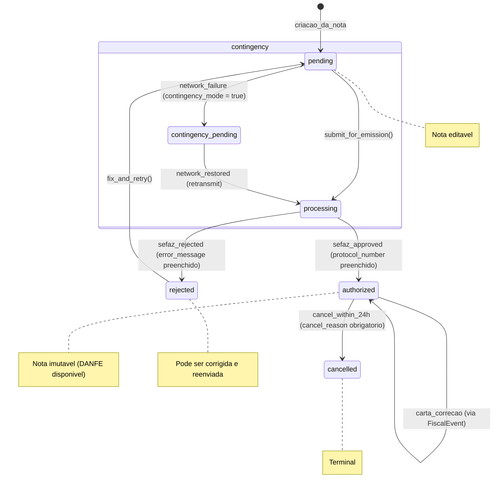
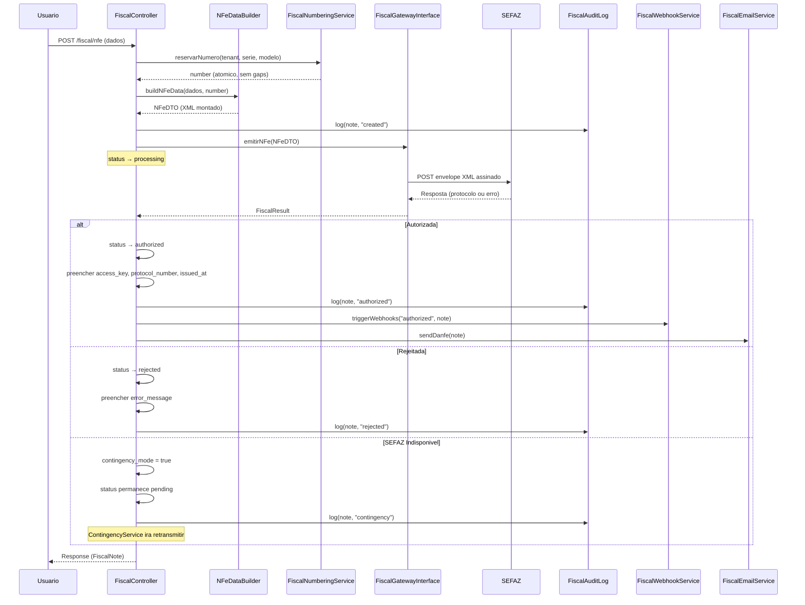

# Modulo: Fiscal (NF-e / NFS-e)

> **[AI_RULE]** Documentacao oficial Level C Maximum do dominio fiscal. Toda entidade, campo, estado e regra aqui descritos sao extraidos diretamente do codigo-fonte e devem ser respeitados por qualquer agente de IA.

---

## 1. Visao Geral

O modulo Fiscal e responsavel pela emissao, gestao e compliance de documentos fiscais eletronicos (NF-e, NFS-e, CT-e) junto a SEFAZ. Opera com abstracacao de provider (Focus NFe, Nuvem Fiscal) e suporte a contingencia offline, numeracao atomica e audit trail completo.

### 1.1 Responsabilidades Principais

- Emissao de NF-e, NFS-e, CT-e, NF-e de devolucao, complementar, remessa e retorno
- Cancelamento dentro do prazo legal (24h para NF-e)
- Carta de correcao (CC-e)
- Modo contingencia (DPEC/SVC) com retransmissao automatica
- Agendamento de emissao programada
- Templates reutilizaveis para emissao recorrente
- Webhooks para integracao com sistemas externos
- Audit log de todas as operacoes fiscais
- Relatorios: SPED Fiscal, Dashboard tributario, Previsao fiscal, Livro razao
- Emissao em lote (batch)
- Validacao de documentos e regime tributario
- Manifestacao do destinatario
- Inutilizacao de numeracao

---

## 2. Entidades (Models) e Campos

### 2.1 FiscalNote

**Model**: `App\Models\FiscalNote`
**Tabela**: `fiscal_notes`
**Traits**: `HasFactory`, `BelongsToTenant`, `SoftDeletes`, `Auditable`

| Campo | Tipo | Descricao |
|---|---|---|
| `id` | `int` | PK |
| `tenant_id` | `int` | FK tenant |
| `type` | `string` | nfe, nfse, nfe_devolucao, nfe_complementar, nfe_remessa, nfe_retorno, cte |
| `work_order_id` | `int\|null` | FK para WorkOrder |
| `quote_id` | `int\|null` | FK para Quote |
| `parent_note_id` | `int\|null` | FK para FiscalNote pai (devolucao/complementar) |
| `customer_id` | `int\|null` | FK para Customer |
| `number` | `string\|null` | Numero da nota fiscal |
| `series` | `string\|null` | Serie da nota |
| `access_key` | `string\|null` | Chave de acesso SEFAZ (44 digitos) |
| `reference` | `string\|null` | Referencia unica para API do provider |
| `status` | `FiscalNoteStatus` | Enum: pending, processing, authorized, cancelled, rejected |
| `provider` | `string\|null` | Nome do provider (focus_nfe, nuvem_fiscal) |
| `provider_id` | `string\|null` | ID no provider externo |
| `total_amount` | `decimal:2` | Valor total da nota |
| `nature_of_operation` | `string\|null` | Natureza da operacao (ex: "Prestacao de Servico") |
| `cfop` | `string\|null` | Codigo Fiscal de Operacao (ex: "5933") |
| `items_data` | `array\|null` | Itens da nota (JSON) |
| `payment_data` | `array\|null` | Dados de pagamento (JSON) |
| `protocol_number` | `string\|null` | Protocolo de autorizacao SEFAZ |
| `environment` | `string\|null` | production ou homologation |
| `contingency_mode` | `boolean` | Se foi emitida em contingencia |
| `email_retry_count` | `integer` | Contador de tentativas de envio de email |
| `last_email_sent_at` | `datetime\|null` | Ultimo envio de email |
| `verification_code` | `string\|null` | Codigo de verificacao |
| `issued_at` | `datetime\|null` | Data/hora de autorizacao |
| `cancelled_at` | `datetime\|null` | Data/hora de cancelamento |
| `cancel_reason` | `string\|null` | Motivo do cancelamento |
| `pdf_url` | `string\|null` | URL do DANFE (PDF) |
| `pdf_path` | `string\|null` | Caminho local do PDF |
| `xml_url` | `string\|null` | URL do XML |
| `xml_path` | `string\|null` | Caminho local do XML |
| `error_message` | `string\|null` | Mensagem de erro da SEFAZ |
| `raw_response` | `array\|null` | Resposta bruta do provider (JSON) |
| `created_by` | `int\|null` | FK para User criador |
| `deleted_at` | `datetime\|null` | Soft delete |

**Tipos de Nota**:

- `nfe` — NF-e (produto/mercadoria)
- `nfse` — NFS-e (servico)
- `nfe_devolucao` — NF-e de devolucao
- `nfe_complementar` — NF-e complementar
- `nfe_remessa` — NF-e de remessa
- `nfe_retorno` — NF-e de retorno
- `cte` — CT-e (transporte)

**Relacionamentos**:

- `tenant()` → BelongsTo Tenant
- `customer()` → BelongsTo Customer
- `workOrder()` → BelongsTo WorkOrder
- `quote()` → BelongsTo Quote
- `creator()` → BelongsTo User (created_by)
- `events()` → HasMany FiscalEvent (orderByDesc created_at)
- `parentNote()` → BelongsTo FiscalNote (parent_note_id)
- `childNotes()` → HasMany FiscalNote (parent_note_id)
- `invoice()` → HasOne Invoice (via work_order_id)
- `auditLogs()` → HasMany FiscalAuditLog

**Metodos**:

- `hasPdf(): bool` — Verifica se PDF existe (path ou url)
- `hasXml(): bool` — Verifica se XML existe (path ou url)
- `isPending(): bool` — Status pending ou processing
- `isAuthorized(): bool` — Status authorized
- `isCancelled(): bool` — Status cancelled
- `canCancel(): bool` — Verifica se cancelamento e permitido (authorized + NF-e < 24h)
- `cancelDeniedReason(): ?string` — Motivo pelo qual cancelamento nao e permitido
- `canCorrect(): bool` — NF-e + authorized
- `isNFe(): bool` / `isNFSe(): bool` — Type check
- `generateReference(string $type, int $tenantId): string` — Referencia unica para API

**Scopes**:

- `scopeForTenant($query, int $tenantId)`
- `scopeOfType($query, string $type)`
- `scopeAuthorized($query)`

### 2.2 FiscalInvoice

**Model**: `App\Models\FiscalInvoice`
**Tabela**: `fiscal_invoices`
**Traits**: `BelongsToTenant`, `HasFactory`, `SoftDeletes`

| Campo | Tipo | Descricao |
|---|---|---|
| `tenant_id` | `int` | FK tenant |
| `number` | `string` | Numero (unico por tenant — validado no booted) |
| `series` | `string\|null` | Serie |
| `type` | `string` | Tipo |
| `customer_id` | `int\|null` | FK Customer |
| `work_order_id` | `int\|null` | FK WorkOrder |
| `total` | `decimal:2` | Valor total |
| `status` | `string` | Status |
| `issued_at` | `datetime\|null` | Data de emissao |
| `xml` | `string\|null` | Conteudo XML |
| `pdf_url` | `string\|null` | URL do PDF |

**Validacao**: No `booted()`, `creating` verifica unicidade de `number` por `tenant_id` e lanca QueryException se duplicado.

**Relacionamentos**:

- `items()` → HasMany FiscalInvoiceItem

### 2.3 FiscalInvoiceItem

**Model**: `App\Models\FiscalInvoiceItem`
**Tabela**: `fiscal_invoice_items`
**Traits**: `BelongsToTenant`, `HasFactory`

| Campo | Tipo | Descricao |
|---|---|---|
| `tenant_id` | `int` | FK tenant |
| `fiscal_invoice_id` | `int` | FK para FiscalInvoice |
| `description` | `string` | Descricao do item |
| `quantity` | `decimal:2` | Quantidade |
| `unit_price` | `decimal:2` | Preco unitario |
| `total` | `decimal:2` | Total do item |
| `product_id` | `int\|null` | FK para Product |
| `service_id` | `int\|null` | FK para Service |

### 2.4 FiscalEvent

**Model**: `App\Models\FiscalEvent`
**Tabela**: `fiscal_events`
**Traits**: `BelongsToTenant`

| Campo | Tipo | Descricao |
|---|---|---|
| `fiscal_note_id` | `int` | FK para FiscalNote |
| `tenant_id` | `int` | FK tenant |
| `event_type` | `string` | Tipo do evento (emissao, cancelamento, correcao, etc.) |
| `protocol_number` | `string\|null` | Protocolo SEFAZ |
| `description` | `string\|null` | Descricao do evento |
| `request_payload` | `array\|null` | Payload enviado (JSON) |
| `response_payload` | `array\|null` | Resposta recebida (JSON) |
| `status` | `string\|null` | Status do evento |
| `error_message` | `string\|null` | Mensagem de erro |
| `user_id` | `int\|null` | FK User que executou |

**Relacionamentos**:

- `fiscalNote()` → BelongsTo FiscalNote
- `tenant()` → BelongsTo Tenant
- `user()` → BelongsTo User

### 2.5 FiscalTemplate

**Model**: `App\Models\FiscalTemplate`
**Tabela**: `fiscal_templates`
**Traits**: `BelongsToTenant`

| Campo | Tipo | Descricao |
|---|---|---|
| `tenant_id` | `int` | FK tenant |
| `name` | `string` | Nome do template |
| `type` | `string` | Tipo (nfe, nfse) |
| `template_data` | `array` | Dados do template (JSON) |
| `usage_count` | `int` | Contador de uso |
| `created_by` | `int\|null` | FK User criador |

**Metodos**:

- `incrementUsage(): void` — Incrementa contador de uso

### 2.6 FiscalWebhook

**Model**: `App\Models\FiscalWebhook`
**Tabela**: `fiscal_webhooks`
**Traits**: `BelongsToTenant`

| Campo | Tipo | Descricao |
|---|---|---|
| `tenant_id` | `int` | FK tenant |
| `url` | `string` | URL de callback |
| `events` | `array` | Eventos subscritos (default: ["authorized","cancelled","rejected"]) |
| `secret` | `string` | Secret para validacao HMAC (hidden) |
| `active` | `boolean` | Se esta ativo |
| `failure_count` | `int` | Contador de falhas consecutivas |
| `last_triggered_at` | `datetime\|null` | Ultimo disparo |

### 2.7 FiscalScheduledEmission

**Model**: `App\Models\FiscalScheduledEmission`
**Tabela**: `fiscal_scheduled_emissions`
**Traits**: `BelongsToTenant`

| Campo | Tipo | Descricao |
|---|---|---|
| `tenant_id` | `int` | FK tenant |
| `type` | `string` | Tipo (nfe, nfse) |
| `work_order_id` | `int\|null` | FK WorkOrder |
| `quote_id` | `int\|null` | FK Quote |
| `customer_id` | `int\|null` | FK Customer |
| `payload` | `array` | Dados para emissao (JSON) |
| `scheduled_at` | `datetime` | Data/hora agendada |
| `status` | `string` | pending, processing, completed, failed |
| `fiscal_note_id` | `int\|null` | FK FiscalNote gerada |
| `error_message` | `string\|null` | Erro de processamento |
| `created_by` | `int\|null` | FK User |

**Scopes**:

- `scopePending($q)` — status = pending
- `scopeReady($q)` — pending + scheduled_at <= now

### 2.8 FiscalAuditLog

**Model**: `App\Models\FiscalAuditLog`
**Tabela**: `fiscal_audit_logs`
**Traits**: `BelongsToTenant`

| Campo | Tipo | Descricao |
|---|---|---|
| `tenant_id` | `int` | FK tenant |
| `fiscal_note_id` | `int` | FK para FiscalNote |
| `action` | `string` | Acao executada (create, authorize, cancel, etc.) |
| `user_id` | `int\|null` | FK User |
| `user_name` | `string\|null` | Nome do usuario (desnormalizado) |
| `ip_address` | `string\|null` | IP de origem |
| `metadata` | `array\|null` | Dados adicionais (JSON) |

**Metodo Estatico**:

- `log(FiscalNote $note, string $action, ?int $userId, ?array $meta): self` — Cria registro de auditoria automaticamente com dados do usuario autenticado e IP

### 2.9 TaxCalculation

**Model**: `App\Models\TaxCalculation`
**Tabela**: `tax_calculations`
**Traits**: `BelongsToTenant`

| Campo | Tipo | Descricao |
|---|---|---|
| `tenant_id` | `int` | FK tenant |
| `work_order_id` | `int\|null` | FK WorkOrder |
| `invoice_id` | `int\|null` | FK Invoice |
| `tax_type` | `string` | Tipo de imposto (`ISS`, `ICMS`, `PIS`, `COFINS`, `CSLL`, `IRPJ`, `IPI`, `ICMS_ST`, `DIFAL`) |
| `base_amount` | `decimal:2` | Base de calculo |
| `rate` | `decimal:4` | Aliquota |
| `tax_amount` | `decimal:2` | Valor do imposto |
| `regime` | `string\|null` | Regime tributario |
| `calculated_by` | `string\|null` | Quem/o que calculou |

---

## 3. Maquina de Estado — Ciclo de Vida NF-e/NFS-e

### 3.1 FiscalNote (FiscalNoteStatus)



**Status do Enum**:

```php
enum FiscalNoteStatus: string {
    case PENDING = 'pending';       // Pendente — nota editavel
    case PROCESSING = 'processing'; // Processando — enviada a SEFAZ
    case AUTHORIZED = 'authorized'; // Autorizada — imutavel
    case CANCELLED = 'cancelled';   // Cancelada — terminal
    case REJECTED = 'rejected';     // Rejeitada — pode corrigir e reenviar
}
// isPending(): pending ou processing
// isFinal(): authorized ou cancelled
```

### 3.2 Regras de Transicao

- `pending → processing`: Somente quando todos os dados obrigatorios estao preenchidos
- `processing → authorized`: SEFAZ retorna protocolo de autorizacao
- `processing → rejected`: SEFAZ retorna codigo de erro
- `rejected → pending`: Usuario corrige dados e nota volta a editavel
- `authorized → cancelled`: Apenas dentro de 24h da autorizacao (NF-e). Exige `cancel_reason`
- Carta de correcao: Nao muda status, registra FiscalEvent com tipo `correcao`

---

## 4. Guard Rails de Negocio

> **[AI_RULE_CRITICAL] Imutabilidade Pos-Autorizacao**
> Uma vez que a `FiscalNote` alcanca o status `authorized`, a IA DEVE travar qualquer operacao de UPDATE ou DELETE nos itens (`FiscalInvoiceItem`) e campos de dados (`items_data`, `payment_data`, `total_amount`, `cfop`, `nature_of_operation`). Correcoes permitidas apenas via Carta de Correcao ou Nota de Devolucao. O `FiscalAuditLog` deve registrar toda tentativa bloqueada.

> **[AI_RULE_CRITICAL] Contingencia Offline**
> O `ContingencyService` DEVE operar quando a SEFAZ estiver indisponivel. Notas emitidas em contingencia (`contingency_mode = true`) recebem numeracao provisoria e DEVEM ser retransmitidas automaticamente quando a conexao for restaurada. A IA nunca pode permitir gap na numeracao.

> **[AI_RULE_CRITICAL] Integracao SEFAZ — Assinatura XML**
> Todo XML enviado a SEFAZ deve ser assinado digitalmente com certificado A1 (PFX). O `CertificateService` gerencia upload, validacao de validade e alerta de expiracao. A IA NUNCA deve enviar XML sem assinatura.

> **[AI_RULE_CRITICAL] DANFE — Geracao**
> O DANFE (PDF) e gerado automaticamente apos autorizacao da nota. Disponivel via `pdf_url` ou `pdf_path`. O envio por email e feito pelo `FiscalEmailService` com retry automatico (`email_retry_count`).

> **[AI_RULE] Numeracao Sequencial**
> O `FiscalNumberingService` garante sequencia sem gaps. O numero da nota e reservado atomicamente (DB lock) antes do envio a SEFAZ. Numeracao e por serie/modelo/tenant. A IA NUNCA deve pular numeracao.

> **[AI_RULE] Abstracao de Provider**
> O sistema usa o `FiscalGatewayInterface` com implementacoes `FocusNFeProvider` e `NuvemFiscalProvider`. A IA DEVE codificar contra a interface, nunca contra um provider especifico. A selecao do provider e feita via `TenantSetting`.

> **[AI_RULE] Agendamento de Emissao**
> `FiscalScheduledEmission` permite emissao programada (ex: todo dia 1). O Job deve ser idempotente e verificar se a nota ja foi emitida (`fiscal_note_id != null`) antes de duplicar.

> **[AI_RULE] Prazo de Cancelamento NF-e**
> `canCancel()` verifica: status == authorized + (NF-e → issued_at < 24h). Apos 24h, unica opcao e NF-e de devolucao ou Carta de Correcao. `cancelDeniedReason()` retorna motivo legivel.

> **[AI_RULE] Webhook Security**
> `FiscalWebhook` possui campo `secret` (hidden) para validacao HMAC. O middleware `verify.fiscal_webhook` valida a assinatura antes de processar. `failure_count` incrementa a cada falha — apos limite, webhook e desativado.

---

## 5. Comportamento Integrado (Cross-Domain)

### 5.1 ← Finance (Invoice → NF-e)

- Quando `Invoice` e criada no modulo Finance, modulo Fiscal pode interceptar e submeter `FiscalNote` a SEFAZ
- Invoice possui campos `fiscal_status`, `fiscal_note_key`, `fiscal_emitted_at` que sao atualizados pelo modulo Fiscal
- FiscalNote tem `invoice()` → HasOne Invoice (via work_order_id)
- Reconciliacao fiscal-financeira via `fiscal/notas/{id}/reconcile`
- Split de pagamento via `fiscal/notas/{id}/split-payment`
- Confirmacao de pagamento via `fiscal/payment-confirmed`
- Calculo de retencoes (ISS, IR, PIS, COFINS) via `fiscal/retentions`
- Geracao de boleto via `fiscal/notas/{id}/boleto`

### 5.2 ← WorkOrders (OS → NF-e/NFS-e Automatica)

- Quando `WorkOrder.status = completed` → Modulo Fiscal recebe evento e pode gerar NFS-e automaticamente
- Endpoint direto: `fiscal/nfe/from-work-order/{workOrderId}` e `fiscal/nfse/from-work-order/{workOrderId}`
- NF-e de quote: `fiscal/nfe/from-quote/{quoteId}`

### 5.3 → Email (Envio DANFE)

- `FiscalEmailService` envia DANFE (PDF) por email ao cliente
- Retry automatico com `email_retry_count` e `last_email_sent_at`
- Endpoint: `fiscal/notas/{id}/email`
- Re-envio: `fiscal/notas/{id}/retry-email`

### 5.4 → FiscalWebhook (Callbacks)

- `FiscalWebhookCallbackService` processa callbacks da SEFAZ
- Dispara eventos para atualizar modulo Finance (status do pagamento)
- Endpoint publico: `POST /api/v1/fiscal/webhook` (com middleware `verify.fiscal_webhook`)

### 5.5 → Contabilidade

- Exportacao para contador: `fiscal/reports/export-accountant`
- SPED Fiscal: `fiscal/reports/sped`
- Livro Razao: `fiscal/reports/ledger`

---

## 6. Contratos JSON (API)

### 6.1 Emissao de NF-e

```
POST /api/v1/fiscal/nfe
Permission: fiscal.note.create

Request:
{
  "customer_id": 42,
  "nature_of_operation": "Venda de mercadoria",
  "cfop": "5102",
  "items": [
    {
      "description": "Sensor de temperatura",
      "quantity": 2,
      "unit_price": "350.00",
      "ncm": "90251100",
      "cfop": "5102"
    }
  ],
  "payment": {
    "method": "boleto",
    "installments": 1,
    "due_date": "2026-04-24"
  }
}

Response 200:
{
  "data": {
    "id": 1,
    "type": "nfe",
    "number": "000001",
    "series": "1",
    "status": "processing",
    "reference": "nfe_1_20260324120000_a1b2c3d4",
    "total_amount": "700.00",
    "provider": "focus_nfe"
  }
}
```

### 6.2 Emissao de NFS-e a partir de OS

```
POST /api/v1/fiscal/nfse/from-work-order/{workOrderId}
Permission: fiscal.note.create

Response 200:
{
  "data": {
    "id": 2,
    "type": "nfse",
    "work_order_id": 100,
    "customer_id": 42,
    "status": "processing",
    "total_amount": "1500.00"
  }
}
```

### 6.3 Cancelamento

```
POST /api/v1/fiscal/notas/{id}/cancelar
Permission: fiscal.note.cancel

Request:
{
  "motivo": "Erro na emissao - dados do cliente incorretos"
}

Response 200:
{
  "data": {
    "id": 1,
    "status": "cancelled",
    "cancelled_at": "2026-03-24T14:30:00Z",
    "cancel_reason": "Erro na emissao - dados do cliente incorretos"
  }
}

Response 422 (prazo expirado):
{
  "message": "Prazo de cancelamento de NF-e expirado (24h). Utilize Carta de Correcao ou emita uma NF-e de devolucao."
}
```

### 6.4 Carta de Correcao

```
POST /api/v1/fiscal/notas/{id}/carta-correcao
Permission: fiscal.note.create

Request:
{
  "correcao": "Razao social correta: Empresa XYZ Ltda"
}
```

### 6.5 Consulta de Status

```
GET /api/v1/fiscal/status/{protocolo}
Permission: fiscal.note.view

Response 200:
{
  "data": {
    "protocolo": "143260000012345",
    "status": "authorized",
    "access_key": "35260324...",
    "protocol_number": "143260000012345"
  }
}
```

### 6.6 Emissao em Lote

```
POST /api/v1/fiscal/batch
Permission: fiscal.note.create

Request:
{
  "notes": [
    { "work_order_id": 100, "type": "nfse" },
    { "work_order_id": 101, "type": "nfse" },
    { "work_order_id": 102, "type": "nfe" }
  ]
}
```

### 6.7 Agendamento

```
POST /api/v1/fiscal/schedule
Permission: fiscal.note.create

Request:
{
  "type": "nfse",
  "work_order_id": 100,
  "scheduled_at": "2026-04-01T08:00:00Z"
}
```

---

## 7. Endpoints da API

### 7.1 CRUD e Consultas

| Metodo | Rota | Permissao | Descricao |
|---|---|---|---|
| GET | `fiscal/notas` | fiscal.note.view | Listar notas |
| GET | `fiscal/notas/{id}` | fiscal.note.view | Detalhar nota |
| GET | `fiscal/status/{protocolo}` | fiscal.note.view | Consultar status SEFAZ |
| GET | `fiscal/notas/{id}/pdf` | fiscal.note.view | Download DANFE (PDF) |
| GET | `fiscal/notas/{id}/xml` | fiscal.note.view | Download XML |
| GET | `fiscal/notas/{id}/events` | fiscal.note.view | Eventos da nota |
| GET | `fiscal/stats` | fiscal.note.view | Estatisticas |
| GET | `fiscal/contingency/status` | fiscal.note.view | Status contingencia |

### 7.2 Emissao

| Metodo | Rota | Permissao | Descricao |
|---|---|---|---|
| POST | `fiscal/nfe` | fiscal.note.create | Emitir NF-e |
| POST | `fiscal/nfse` | fiscal.note.create | Emitir NFS-e |
| POST | `fiscal/nfe/from-work-order/{id}` | fiscal.note.create | NF-e a partir de OS |
| POST | `fiscal/nfse/from-work-order/{id}` | fiscal.note.create | NFS-e a partir de OS |
| POST | `fiscal/nfe/from-quote/{id}` | fiscal.note.create | NF-e a partir de orcamento |
| POST | `fiscal/inutilizar` | fiscal.note.create | Inutilizar numeracao |
| POST | `fiscal/batch` | fiscal.note.create | Emissao em lote |
| POST | `fiscal/schedule` | fiscal.note.create | Agendar emissao |

### 7.3 Eventos Fiscais

| Metodo | Rota | Permissao | Descricao |
|---|---|---|---|
| POST | `fiscal/notas/{id}/cancelar` | fiscal.note.cancel | Cancelar nota |
| POST | `fiscal/notas/{id}/carta-correcao` | fiscal.note.create | Carta de correcao |
| POST | `fiscal/notas/{id}/email` | fiscal.note.view | Enviar DANFE por email |
| POST | `fiscal/notas/{id}/retry-email` | fiscal.note.create | Re-enviar email |
| POST | `fiscal/contingency/retransmit` | fiscal.note.create | Retransmitir contingencia |
| POST | `fiscal/contingency/retransmit/{id}` | fiscal.note.create | Retransmitir nota unica |

### 7.4 NF-e Avancado

| Metodo | Rota | Permissao | Descricao |
|---|---|---|---|
| POST | `fiscal/notas/{id}/devolucao` | fiscal.note.create | NF-e de devolucao |
| POST | `fiscal/notas/{id}/complementar` | fiscal.note.create | NF-e complementar |
| POST | `fiscal/remessa` | fiscal.note.create | NF-e de remessa |
| POST | `fiscal/notas/{id}/retorno` | fiscal.note.create | NF-e de retorno |
| POST | `fiscal/manifestacao` | fiscal.note.create | Manifestacao destinatario |
| POST | `fiscal/cte` | fiscal.note.create | Emitir CT-e |

### 7.5 Compliance e Auditoria

| Metodo | Rota | Permissao | Descricao |
|---|---|---|---|
| GET | `fiscal/certificate-alert` | fiscal.note.view | Alerta de certificado |
| GET | `fiscal/notas/{id}/audit` | fiscal.note.view | Log de auditoria da nota |
| GET | `fiscal/audit-report` | fiscal.note.view | Relatorio de auditoria geral |
| POST | `fiscal/validate-document` | fiscal.note.view | Validar documento |
| GET | `fiscal/check-regime` | fiscal.note.view | Verificar regime tributario |

### 7.6 Relatorios

| Metodo | Rota | Permissao | Descricao |
|---|---|---|---|
| GET | `fiscal/reports/sped` | fiscal.note.view | SPED Fiscal |
| GET | `fiscal/reports/tax-dashboard` | fiscal.note.view | Dashboard tributario |
| GET | `fiscal/reports/export-accountant` | fiscal.note.view | Exportar para contador |
| GET | `fiscal/reports/ledger` | fiscal.note.view | Livro razao |
| GET | `fiscal/reports/tax-forecast` | fiscal.note.view | Previsao fiscal |

### 7.7 Financeiro-Fiscal

| Metodo | Rota | Permissao | Descricao |
|---|---|---|---|
| POST | `fiscal/notas/{id}/reconcile` | fiscal.note.create | Reconciliar com financeiro |
| POST | `fiscal/notas/{id}/boleto` | fiscal.note.create | Gerar boleto |
| POST | `fiscal/notas/{id}/split-payment` | fiscal.note.create | Split de pagamento |
| POST | `fiscal/retentions` | fiscal.note.create | Calcular retencoes |
| POST | `fiscal/payment-confirmed` | fiscal.note.create | Confirmar pagamento |

### 7.8 Templates

| Metodo | Rota | Permissao | Descricao |
|---|---|---|---|
| GET | `fiscal/templates` | fiscal.note.view | Listar templates |
| POST | `fiscal/templates` | fiscal.note.view | Criar template |
| POST | `fiscal/notas/{id}/save-template` | fiscal.note.view | Salvar nota como template |
| GET | `fiscal/templates/{id}/apply` | fiscal.note.view | Aplicar template |
| DELETE | `fiscal/templates/{id}` | fiscal.note.view | Excluir template |
| GET | `fiscal/notas/{id}/duplicate` | fiscal.note.view | Duplicar nota |
| GET | `fiscal/search-key` | fiscal.note.view | Buscar por chave de acesso |

### 7.9 Webhooks

| Metodo | Rota | Permissao | Descricao |
|---|---|---|---|
| GET | `fiscal/webhooks` | platform.settings.manage | Listar webhooks |
| POST | `fiscal/webhooks` | platform.settings.manage | Criar webhook |
| DELETE | `fiscal/webhooks/{id}` | platform.settings.manage | Excluir webhook |
| POST | `v1/fiscal/webhook` | (publico + verify.fiscal_webhook) | Callback SEFAZ |

### 7.10 Configuracao

| Metodo | Rota | Permissao | Descricao |
|---|---|---|---|
| GET | `fiscal/config` | platform.settings.view | Ver configuracao |
| PUT | `fiscal/config` | platform.settings.manage | Atualizar config |
| POST | `fiscal/config/certificate` | platform.settings.manage | Upload certificado A1 |
| DELETE | `fiscal/config/certificate` | platform.settings.manage | Remover certificado |
| GET | `fiscal/config/certificate/status` | platform.settings.view | Status do certificado |
| GET | `fiscal/config/cfop-options` | platform.settings.view | Opcoes de CFOP |
| GET | `fiscal/config/csosn-options` | platform.settings.view | Opcoes de CSOSN |
| GET | `fiscal/config/iss-exigibilidade-options` | platform.settings.view | ISS exigibilidade |
| GET | `fiscal/config/lc116-options` | platform.settings.view | Opcoes LC 116 |
| GET | `fiscal/consulta-publica` | (publico, throttle:60) | Consulta publica |

---

## 8. Services

| Service | Responsabilidade |
|---|---|
| `FiscalAdvancedService` | NF-e devolucao, complementar, remessa, retorno, manifestacao, CT-e |
| `FiscalComplianceService` | Validacao de documentos, verificacao de regime, alertas de certificado |
| `FiscalAutomationService` | Emissao em lote, agendamento, retry de email |
| `FiscalEmailService` | Envio de DANFE por email com retry |
| `FiscalFinanceService` | Reconciliacao fiscal-financeira, boleto, split, retencoes |
| `FiscalNumberingService` | Numeracao sequencial atomica por serie/modelo/tenant |
| `FiscalReportService` | SPED, dashboard tributario, exportacao contador, livro razao, previsao |
| `FiscalTemplateService` | CRUD de templates, aplicacao, duplicacao |
| `FiscalWebhookService` | Gestao de webhooks (CRUD, ativacao, desativacao) |
| `FiscalWebhookCallbackService` | Processamento de callbacks da SEFAZ |
| `CertificateService` | Upload, validacao e alerta de certificado digital A1 |
| `ContingencyService` | Modo contingencia, numeracao provisoria, retransmissao |
| `NFeDataBuilder` | Montagem de dados para NF-e |
| `NFSeDataBuilder` | Montagem de dados para NFS-e |
| `FocusNFeProvider` | Implementacao FiscalGatewayInterface para Focus NFe |
| `NuvemFiscalProvider` | Implementacao FiscalGatewayInterface para Nuvem Fiscal |
| `FiscalProvider` | Provider base/factory |
| `FiscalResult` | Value Object para resultado de operacoes fiscais |
| `NFeDTO` | Data Transfer Object para dados de NF-e |
| `ExternalNFeAdapter` | Adapter para NF-e externas |

### 8.1 FiscalGatewayInterface

```php
interface FiscalGatewayInterface {
    public function emitirNFe(NFeDTO $data): FiscalResult;
    public function consultarStatus(string $protocolo): FiscalResult;
}
```

---

## 9. Diagrama de Sequencia — Emissao SEFAZ



---

## 10. Form Requests (Validacao de Entrada)

> **[AI_RULE]** Todo endpoint de criacao/atualizacao DEVE usar Form Request. Validacao inline em controllers e PROIBIDA. Cada Form Request documenta `rules()`, `messages()` e `authorize()`.

### 10.1 StoreNFeRequest

**Classe**: `App\Http\Requests\Fiscal\StoreNFeRequest`
**Endpoint**: `POST /api/v1/fiscal/nfe`

```php
public function authorize(): bool
{
    return $this->user()->can('fiscal.note.create');
}

public function rules(): array
{
    return [
        'customer_id'            => ['required', 'integer', 'exists:customers,id'],
        'nature_of_operation'    => ['required', 'string', 'max:255'],
        'cfop'                   => ['required', 'string', 'regex:/^\d{4}$/'],
        'items'                  => ['required', 'array', 'min:1'],
        'items.*.description'    => ['required', 'string', 'max:255'],
        'items.*.quantity'       => ['required', 'numeric', 'min:0.01'],
        'items.*.unit_price'     => ['required', 'numeric', 'min:0.01', 'max:99999999.99'],
        'items.*.ncm'            => ['required', 'string', 'regex:/^\d{8}$/'],
        'items.*.cfop'           => ['required', 'string', 'regex:/^\d{4}$/'],
        'payment'                => ['required', 'array'],
        'payment.method'         => ['required', 'string', 'in:dinheiro,pix,cartao_credito,cartao_debito,boleto,transferencia'],
        'payment.installments'   => ['required', 'integer', 'min:1', 'max:48'],
        'payment.due_date'       => ['required', 'date', 'after_or_equal:today'],
        'work_order_id'          => ['nullable', 'integer', 'exists:work_orders,id'],
        'quote_id'               => ['nullable', 'integer', 'exists:quotes,id'],
    ];
}
```

### 10.2 StoreNFSeRequest

**Classe**: `App\Http\Requests\Fiscal\StoreNFSeRequest`
**Endpoint**: `POST /api/v1/fiscal/nfse`

```php
public function authorize(): bool
{
    return $this->user()->can('fiscal.note.create');
}

public function rules(): array
{
    return [
        'customer_id'                 => ['required', 'integer', 'exists:customers,id'],
        'nature_of_operation'         => ['required', 'string', 'max:255'],
        'items'                       => ['required', 'array', 'min:1'],
        'items.*.description'         => ['required', 'string', 'max:255'],
        'items.*.quantity'            => ['required', 'numeric', 'min:0.01'],
        'items.*.unit_price'          => ['required', 'numeric', 'min:0.01', 'max:99999999.99'],
        'items.*.codigo_servico'      => ['required', 'string', 'max:10'],
        'iss_retido'                  => ['nullable', 'boolean'],
        'aliquota_iss'                => ['nullable', 'numeric', 'min:0', 'max:5'],
        'codigo_tributacao_municipio' => ['nullable', 'string', 'max:20'],
        'work_order_id'               => ['nullable', 'integer', 'exists:work_orders,id'],
    ];
}
```

### 10.3 CancelFiscalNoteRequest

**Classe**: `App\Http\Requests\Fiscal\CancelFiscalNoteRequest`
**Endpoint**: `POST /api/v1/fiscal/notas/{id}/cancelar`

```php
public function authorize(): bool
{
    return $this->user()->can('fiscal.note.cancel');
}

public function rules(): array
{
    return [
        'motivo' => ['required', 'string', 'min:15', 'max:255'],
    ];
}
```

> **[AI_RULE]** `motivo` DEVE ter no minimo 15 caracteres (exigencia SEFAZ). O Controller DEVE verificar `$note->canCancel()` antes de prosseguir.

### 10.4 CartaCorrecaoRequest

**Classe**: `App\Http\Requests\Fiscal\CartaCorrecaoRequest`
**Endpoint**: `POST /api/v1/fiscal/notas/{id}/carta-correcao`

```php
public function authorize(): bool
{
    return $this->user()->can('fiscal.note.create');
}

public function rules(): array
{
    return [
        'correcao' => ['required', 'string', 'min:15', 'max:1000'],
    ];
}
```

> **[AI_RULE]** Carta de Correcao SEFAZ exige texto com minimo de 15 caracteres. Somente NF-e `authorized` pode receber CC-e.

### 10.5 BatchEmissionRequest

**Classe**: `App\Http\Requests\Fiscal\BatchEmissionRequest`
**Endpoint**: `POST /api/v1/fiscal/batch`

```php
public function authorize(): bool
{
    return $this->user()->can('fiscal.note.create');
}

public function rules(): array
{
    return [
        'notes'                  => ['required', 'array', 'min:1', 'max:50'],
        'notes.*.work_order_id'  => ['required_without:notes.*.quote_id', 'nullable', 'integer', 'exists:work_orders,id'],
        'notes.*.quote_id'       => ['required_without:notes.*.work_order_id', 'nullable', 'integer', 'exists:quotes,id'],
        'notes.*.type'           => ['required', 'string', 'in:nfe,nfse'],
    ];
}
```

### 10.6 ScheduleEmissionRequest

**Classe**: `App\Http\Requests\Fiscal\ScheduleEmissionRequest`
**Endpoint**: `POST /api/v1/fiscal/schedule`

```php
public function authorize(): bool
{
    return $this->user()->can('fiscal.note.create');
}

public function rules(): array
{
    return [
        'type'            => ['required', 'string', 'in:nfe,nfse'],
        'work_order_id'   => ['required_without:quote_id', 'nullable', 'integer', 'exists:work_orders,id'],
        'quote_id'        => ['required_without:work_order_id', 'nullable', 'integer', 'exists:quotes,id'],
        'customer_id'     => ['nullable', 'integer', 'exists:customers,id'],
        'scheduled_at'    => ['required', 'date', 'after:now'],
    ];
}
```

### 10.7 StoreWebhookRequest

**Classe**: `App\Http\Requests\Fiscal\StoreWebhookRequest`
**Endpoint**: `POST /api/v1/fiscal/webhooks`

```php
public function authorize(): bool
{
    return $this->user()->can('platform.settings.manage');
}

public function rules(): array
{
    return [
        'url'    => ['required', 'url', 'max:500'],
        'events' => ['required', 'array', 'min:1'],
        'events.*' => ['string', 'in:authorized,cancelled,rejected,correction'],
        'active' => ['nullable', 'boolean'],
    ];
}
```

### 10.8 StoreTemplateRequest

**Classe**: `App\Http\Requests\Fiscal\StoreTemplateRequest`
**Endpoint**: `POST /api/v1/fiscal/templates`

```php
public function authorize(): bool
{
    return $this->user()->can('fiscal.note.view');
}

public function rules(): array
{
    return [
        'name'                  => ['required', 'string', 'max:255'],
        'type'                  => ['required', 'string', 'in:nfe,nfse'],
        'template_data'         => ['required', 'array'],
        'template_data.cfop'    => ['nullable', 'string', 'regex:/^\d{4}$/'],
        'template_data.nature_of_operation' => ['nullable', 'string', 'max:255'],
        'template_data.items'   => ['nullable', 'array'],
    ];
}
```

### 10.9 UpdateFiscalConfigRequest

**Classe**: `App\Http\Requests\Fiscal\UpdateFiscalConfigRequest`
**Endpoint**: `PUT /api/v1/fiscal/config`

```php
public function authorize(): bool
{
    return $this->user()->can('platform.settings.manage');
}

public function rules(): array
{
    return [
        'provider'                      => ['sometimes', 'string', 'in:focus_nfe,nuvem_fiscal'],
        'environment'                   => ['sometimes', 'string', 'in:production,homologation'],
        'default_series'                => ['sometimes', 'string', 'max:5'],
        'default_nature_of_operation'   => ['sometimes', 'string', 'max:255'],
        'default_cfop'                  => ['sometimes', 'string', 'regex:/^\d{4}$/'],
        'auto_emit_on_os_complete'      => ['sometimes', 'boolean'],
        'auto_emit_type'                => ['sometimes', 'string', 'in:nfe,nfse'],
        'regime_tributario'             => ['sometimes', 'string', 'in:simples,lucro_presumido,lucro_real'],
    ];
}
```

### 10.10 UploadCertificateRequest

**Classe**: `App\Http\Requests\Fiscal\UploadCertificateRequest`
**Endpoint**: `POST /api/v1/fiscal/config/certificate`

```php
public function authorize(): bool
{
    return $this->user()->can('platform.settings.manage');
}

public function rules(): array
{
    return [
        'certificate' => ['required', 'file', 'mimes:pfx,p12', 'max:10240'],
        'password'    => ['required', 'string', 'max:100'],
    ];
}
```

> **[AI_RULE]** `CertificateService` DEVE validar validade do certificado apos upload e rejeitar certificados expirados.

### 10.11 InutilizarNumeracaoRequest

**Classe**: `App\Http\Requests\Fiscal\InutilizarNumeracaoRequest`
**Endpoint**: `POST /api/v1/fiscal/inutilizar`

```php
public function authorize(): bool
{
    return $this->user()->can('fiscal.note.create');
}

public function rules(): array
{
    return [
        'serie'          => ['required', 'string', 'max:5'],
        'numero_inicial' => ['required', 'integer', 'min:1'],
        'numero_final'   => ['required', 'integer', 'min:1', 'gte:numero_inicial'],
        'justificativa'  => ['required', 'string', 'min:15', 'max:255'],
    ];
}
```

### 10.12 ReconcileRequest

**Classe**: `App\Http\Requests\Fiscal\ReconcileRequest`
**Endpoint**: `POST /api/v1/fiscal/notas/{id}/reconcile`

```php
public function authorize(): bool
{
    return $this->user()->can('fiscal.note.create');
}

public function rules(): array
{
    return [
        'invoice_id'     => ['required', 'integer', 'exists:invoices,id'],
        'reconcile_type' => ['required', 'string', 'in:full,partial'],
        'amount'         => ['required_if:reconcile_type,partial', 'nullable', 'numeric', 'min:0.01'],
    ];
}
```

### 10.13 RetentionCalculationRequest

**Classe**: `App\Http\Requests\Fiscal\RetentionCalculationRequest`
**Endpoint**: `POST /api/v1/fiscal/retentions`

```php
public function authorize(): bool
{
    return $this->user()->can('fiscal.note.create');
}

public function rules(): array
{
    return [
        'fiscal_note_id' => ['required', 'integer', 'exists:fiscal_notes,id'],
        'retentions'     => ['required', 'array', 'min:1'],
        'retentions.*.tax_type' => ['required', 'string', 'in:ISS,IR,PIS,COFINS,CSLL,INSS'],
        'retentions.*.rate'     => ['required', 'numeric', 'min:0', 'max:100'],
        'retentions.*.base_amount' => ['nullable', 'numeric', 'min:0'],
    ];
}
```

### 10.14 DevolucaoRequest

**Classe**: `App\Http\Requests\Fiscal\DevolucaoRequest`
**Endpoint**: `POST /api/v1/fiscal/notas/{id}/devolucao`

```php
public function authorize(): bool
{
    return $this->user()->can('fiscal.note.create');
}

public function rules(): array
{
    return [
        'motivo'             => ['required', 'string', 'min:15', 'max:255'],
        'items'              => ['required', 'array', 'min:1'],
        'items.*.description' => ['required', 'string', 'max:255'],
        'items.*.quantity'    => ['required', 'numeric', 'min:0.01'],
        'items.*.unit_price'  => ['required', 'numeric', 'min:0.01'],
    ];
}
```

### 10.15 ComplementarRequest

**Classe**: `App\Http\Requests\Fiscal\ComplementarRequest`
**Endpoint**: `POST /api/v1/fiscal/notas/{id}/complementar`

```php
public function authorize(): bool
{
    return $this->user()->can('fiscal.note.create');
}

public function rules(): array
{
    return [
        'complemento_type' => ['required', 'string', 'in:valor,quantidade,imposto'],
        'valor_complemento' => ['required', 'numeric', 'min:0.01'],
        'justificativa'     => ['required', 'string', 'min:15', 'max:255'],
    ];
}
```

### 10.16 ManifestacaoRequest

**Classe**: `App\Http\Requests\Fiscal\ManifestacaoRequest`
**Endpoint**: `POST /api/v1/fiscal/manifestacao`

```php
public function authorize(): bool
{
    return $this->user()->can('fiscal.note.create');
}

public function rules(): array
{
    return [
        'access_key'  => ['required', 'string', 'size:44'],
        'event_type'  => ['required', 'string', 'in:ciencia,confirmacao,desconhecimento,nao_realizada'],
        'justificativa' => ['required_if:event_type,desconhecimento,nao_realizada', 'nullable', 'string', 'min:15', 'max:255'],
    ];
}
```

---

## 11. Permissoes

### 11.1 Notas Fiscais

- `fiscal.note.view` — Visualizar notas, PDF, XML, eventos, stats, auditoria
- `fiscal.note.create` — Emitir, carta de correcao, agendamento, batch, templates
- `fiscal.note.cancel` — Cancelar notas

### 11.2 Configuracao

- `platform.settings.view` — Ver configuracao fiscal, CFOP, CSOSN, certificado
- `platform.settings.manage` — Alterar config, upload/remover certificado, webhooks

---

## 12. Observabilidade

### 12.1 FiscalAuditLog

Toda operacao sobre FiscalNote gera um registro em `FiscalAuditLog` com:

- Acao executada (created, authorized, cancelled, rejected, contingency, correction, etc.)
- Usuario responsavel e IP
- Metadata adicional em JSON
- Metodo estatico `FiscalAuditLog::log()` simplifica o registro

### 12.2 FiscalEvent

Cada interacao com a SEFAZ gera um `FiscalEvent` contendo:

- Payload de request e response completos (JSON)
- Protocolo SEFAZ
- Status e mensagem de erro

### 12.3 FiscalWebhook

Webhooks disparam eventos para sistemas externos em cada mudanca de status. `failure_count` permite monitorar saude dos endpoints. `last_triggered_at` permite auditar ultimo disparo.

### 12.4 Alertas

- `fiscal/certificate-alert` — Alerta de certificado A1 proximo de expirar
- Contingencia automatica detecta SEFAZ offline

---

## 13. Decisoes Arquiteturais

### 13.1 Abstracao de Provider

O sistema usa o padrao Strategy via `FiscalGatewayInterface`. Implementacoes concretas (`FocusNFeProvider`, `NuvemFiscalProvider`) sao selecionadas via `TenantSetting`. Isso permite trocar de provider sem alterar logica de negocio.

### 13.2 Numeracao Atomica

`FiscalNumberingService` usa lock de banco de dados para garantir numeracao sequencial sem gaps. Numeracao e segmentada por `tenant_id` + `serie` + `modelo`.

### 13.3 Contingencia Resiliente

Quando a SEFAZ esta indisponivel, `ContingencyService` marca notas com `contingency_mode = true` e armazena localmente. Um job periodico tenta retransmitir. Numeracao provisoria e convertida para definitiva apos autorizacao.

### 13.4 Eventos Imutaveis

`FiscalEvent` e append-only — nunca e atualizado ou deletado. Cada interacao gera um novo registro. Isso garante rastreabilidade completa de todas as comunicacoes com a SEFAZ.

### 13.5 Webhook com HMAC

`FiscalWebhook` armazena um `secret` (campo hidden) para validacao HMAC. O middleware `verify.fiscal_webhook` verifica a assinatura do payload antes de processar callbacks. `failure_count` desativa webhooks apos falhas consecutivas.

### 13.6 Template Reuse

`FiscalTemplate` permite reutilizar configuracoes de nota (natureza da operacao, CFOP, itens padrao). `usage_count` permite identificar templates mais utilizados. Templates podem ser criados manualmente ou a partir de uma nota existente.

### 13.7 Prazo Legal NF-e

A regra de 24h para cancelamento de NF-e e enforced no Model (`canCancel()`, `cancelDeniedReason()`) e nao apenas no controller. Apos 24h, a IA deve sugerir NF-e de devolucao ou Carta de Correcao.

### 13.8 Idempotencia de Agendamento

`FiscalScheduledEmission` verifica `fiscal_note_id != null` antes de processar. Se a nota ja foi gerada, o job ignora o agendamento. Scope `scopeReady()` filtra apenas pendentes com data <= now.

---

## 14. Observers `[AI_RULE]`

> **[AI_RULE]** Observers garantem propagação de eventos fiscais para módulos dependentes. Toda falha de observer deve ser logada e opcionalmente retentada via Job.

### 14.1 NfeObserver

| Aspecto | Detalhe |
| --- | --- |
| **Trigger** | `FiscalNote::updated` quando `status` muda para `authorized` (SEFAZ retornou autorização) |
| **Ação** | Atualizar status da Invoice associada: `Invoice.fiscal_status = 'authorized'`, `Invoice.fiscal_note_id = $note->id` |
| **Módulo Destino** | Finance |
| **Dados Propagados** | `fiscal_note_id`, `invoice_id`, `nfe_number`, `nfe_key`, `authorized_at` |
| **Falha** | Log `finance.invoice_fiscal_sync_failed`. Invoice mantém `fiscal_status = 'pending'`. Retry automático na próxima tentativa de consulta SEFAZ. |

### 14.2 FiscalReportObserver

| Aspecto | Detalhe |
| --- | --- |
| **Trigger** | `FiscalReport::created` (relatório SPED/EFD gerado) |
| **Ação** | Enviar notificação por email ao contador/contabilidade via `NotificationService::notifyAccountant($report)` |
| **Módulo Destino** | Email |
| **Dados Propagados** | `report_id`, `report_type` (EFD-Contribuições, EFD-ICMS/IPI, ECD), `period`, `file_path`, `tenant_id` |
| **Falha** | Log `email.fiscal_report_notification_failed`. Email entra na fila de retry (3 tentativas, backoff exponencial). Relatório permanece disponível para download manual. |

---

## 15. Cenários BDD

### Feature: Emissão de NF-e

```gherkin
Funcionalidade: Emissão de Nota Fiscal Eletrônica

  Cenário: Emitir NF-e com sucesso
    Dado que existe uma Invoice com status "approved" e fiscal_status "pending"
    E o tenant tem certificado A1 válido e configuração SEFAZ ativa
    Quando envio POST /api/v1/fiscal/notes com invoice_id
    Então o XML é gerado conforme layout 4.00
    E o XML é assinado com certificado A1
    E o XML é transmitido à SEFAZ via NfeService
    E a resposta retorna status "authorized" com nfe_key (44 dígitos)
    E cStat = 100 (Autorizado o uso da NF-e)

  Cenário: Rejeição pela SEFAZ
    Dado que o XML contém CNPJ do destinatário inválido
    Quando transmito à SEFAZ
    Então a FiscalNote recebe status "rejected"
    E rejection_reason é preenchido com a mensagem da SEFAZ
    E o log "fiscal.nfe_rejected" é registrado
    E a Invoice mantém fiscal_status = "pending" para nova tentativa

  Cenário: Timeout na comunicação com SEFAZ
    Dado que o serviço da SEFAZ está indisponível
    Quando tento transmitir a NF-e
    Então a FiscalNote entra em status "contingency"
    E o XML é armazenado para retransmissão
    E o Job RetransmitNfeJob é enfileirado com backoff exponencial
```

### Feature: Cancelamento de NF-e

```gherkin
Funcionalidade: Cancelamento de NFe Autorizada

  Cenário: Cancelar NF-e dentro do prazo (24h)
    Dado que existe uma FiscalNote com status "authorized" emitida há 2 horas
    Quando envio DELETE /api/v1/fiscal/notes/{id}/cancel com justification
    Então o evento de cancelamento é transmitido à SEFAZ
    E a FiscalNote recebe status "cancelled"
    E cancelled_at é preenchido
    E a Invoice associada retorna fiscal_status para "pending"

  Cenário: Cancelar NF-e fora do prazo
    Dado que a FiscalNote foi autorizada há 48 horas
    Quando tento cancelar
    Então recebo status 422
    E a mensagem indica "prazo de cancelamento expirado (24h)"
    E a nota permanece com status "authorized"
```

### Feature: Inutilização de Numeração

```gherkin
Funcionalidade: Inutilização de Faixa de Numeração

  Cenário: Inutilizar faixa de números não utilizados
    Dado que os números 100 a 105 da série 1 não foram utilizados
    Quando envio POST /api/v1/fiscal/void-range com start=100, end=105, series=1
    Então a SEFAZ retorna protocolo de inutilização
    E os números 100-105 são registrados como inutilizados
    E não podem ser usados para novas NF-e

  Cenário: Faixa já utilizada
    Dado que o número 102 já foi usado em NF-e autorizada
    Quando tento inutilizar faixa 100-105
    Então recebo status 422
    E a mensagem indica conflito na numeração
```

### Feature: Emissão Agendada

```gherkin
Funcionalidade: Emissão Agendada de NF-e

  Cenário: Agendar emissão futura
    Dado que existe uma Invoice aprovada
    Quando crio FiscalScheduledEmission com scheduled_at = amanhã 08:00
    Então o agendamento é criado com status "pending"
    E o Job ProcessScheduledEmissions executará na data/hora agendada

  Cenário: Emissão agendada duplicada é ignorada
    Dado que já existe uma FiscalNote gerada para o agendamento
    Quando o Job ProcessScheduledEmissions executa
    Então o agendamento é ignorado (fiscal_note_id != null)
    E nenhuma NF-e duplicada é gerada
```

### Feature: Carta de Correção (CCe)

```gherkin
Funcionalidade: Carta de Correção Eletrônica

  Cenário: Emitir CCe para NF-e autorizada
    Dado que existe FiscalNote com status "authorized"
    Quando envio POST /api/v1/fiscal/notes/{id}/correction com correction_text
    Então o evento de CCe é transmitido à SEFAZ
    E o número de sequência da correção incrementa
    E o texto não altera valores monetários (guard rail fiscal)

  Cenário: Limite de 20 CCe por NF-e
    Dado que a FiscalNote já tem 20 CCe registradas
    Quando tento enviar a 21ª CCe
    Então recebo status 422
    E a mensagem indica "limite máximo de correções atingido"
```

### Feature: Isolamento e Certificado

```gherkin
Funcionalidade: Isolamento Fiscal Multi-Tenant

  Cenário: Tenant A não vê notas do Tenant B
    Dado que existem FiscalNotes dos tenant_id=1 e tenant_id=2
    Quando usuário do tenant_id=1 lista notas fiscais
    Então recebe apenas notas do tenant_id=1

  Cenário: Certificado A1 é exclusivo por tenant
    Dado que tenant_id=1 tem certificado A1 diferente de tenant_id=2
    Quando tenant_id=1 emite NF-e
    Então o XML é assinado com o certificado do tenant_id=1
    E o CNPJ do emissor corresponde ao tenant_id=1
```

---

## 16. Job: EmitFiscalNoteJob

**Classe**: `App\Jobs\EmitFiscalNoteJob`
**Implements**: `ShouldQueue`, `ShouldBeUnique`
**Traits**: `Dispatchable`, `InteractsWithQueue`, `Queueable`, `SerializesModels`

| Propriedade | Valor | Descricao |
|---|---|---|
| `$tries` | 3 | Maximo de tentativas |
| `$timeout` | 120 | Timeout em segundos |
| `$backoff` | 60 | Intervalo entre retries (segundos) |
| `$uniqueFor` | 900 | Lock de unicidade (15 minutos) |

**Construtor**: `__construct(int $tenantId, int $invoiceId, string $noteType)`

**Fluxo de Execucao**:

1. Adquire lock via `Cache::lock("fiscal_emit:{uniqueId}", 900)` — bloqueia execucoes duplicadas
2. Carrega `Invoice` com `workOrder.customer` e `workOrder.tenant` (eager loading)
3. Ignora se Invoice nao encontrada ou cancelada
4. Atualiza `fiscal_status` para `EMITTING`
5. Monta dados da nota via `FiscalProvider`
6. Em caso de sucesso: atualiza `fiscal_status = EMITTED`, `fiscal_note_key`, `fiscal_emitted_at`
7. Em caso de falha: registra `fiscal_error`, deixa para retry automatico

**Metodo `failed()`**: Atualiza `fiscal_status = FAILED` com mensagem definitiva apos esgotar tentativas.

**Metodo `uniqueId()`**: `"{tenantId}:{invoiceId}:{noteType}"` — garante um Job por nota/invoice.

**Middleware**: `SetTenantContext` — configura contexto multi-tenant no worker.

---

## 17. Evento: FiscalNoteAuthorized

**Classe**: `App\Events\FiscalNoteAuthorized`
**Traits**: `Dispatchable`, `SerializesModels`

```php
public function __construct(
    public FiscalNote $fiscalNote,
) {}
```

**Disparado quando**: Nota fiscal e autorizada via webhook assincrono da API externa (SEFAZ).

**Listeners potenciais**:

- Liberar Ordem de Servico (status Faturada)
- Disparar envio do Certificado de Calibracao
- Atualizar `Invoice.fiscal_status` para `authorized`

---

## 18. Rotas Publicas (sem autenticacao)

| Metodo | Rota | Controller | Middleware | Descricao |
|---|---|---|---|---|
| POST | `v1/fiscal/consulta-publica` | `FiscalPublicController@consultaPublica` | `throttle:60,1` | Consulta publica de nota fiscal por chave de acesso |
| POST | `v1/fiscal/webhook` | `FiscalWebhookCallbackController@__invoke` | `throttle:120,1`, `verify.fiscal_webhook` | Callback SEFAZ (webhook assincrono) |

> **[AI_RULE]** Rotas publicas NAO passam por autenticacao JWT. `consulta-publica` e protegida apenas por throttle. O webhook SEFAZ e protegido por middleware `verify.fiscal_webhook` que valida assinatura HMAC.

---

## 19. Inventario Completo do Codigo

### 19.1 Controllers (7 controllers, 69 endpoints)

| Controller | Namespace | Endpoints | Responsabilidade |
|---|---|---|---|
| `FiscalController` | `Api\V1` | 20 | CRUD notas, emissao NF-e/NFS-e, cancelamento, inutilizacao, CC-e, PDF/XML, email, contingencia, stats |
| `FiscalExpandedController` | `Api\V1` | 28 | Batch, agendamento, webhooks, NF-e avancado (devolucao/complementar/remessa/retorno), manifestacao, CT-e, compliance, finance, templates, UX |
| `FiscalReportController` | `Api\V1` | 5 | SPED Fiscal, dashboard tributario, exportacao contador, livro razao, previsao fiscal |
| `FiscalConfigController` | `Api\V1` | 9 | Config fiscal, certificado A1 (upload/status/remover), CFOP, CSOSN, ISS exigibilidade, LC 116 |
| `FiscalInvoiceController` | `Api\V1` | 5 | CRUD de FiscalInvoice (listagem, criacao, detalhe, atualizacao, exclusao) |
| `FiscalPublicController` | `Api\V1` | 1 | Consulta publica de nota fiscal (sem autenticacao) |
| `FiscalWebhookCallbackController` | `Api\V1` | 1 | Processamento de callback SEFAZ via webhook (invocavel, `__invoke`) |

### 19.2 Services (21 arquivos)

| Service | Arquivo | Metodos Publicos | Responsabilidade |
|---|---|---|---|
| `CertificateService` | `Services/Fiscal/CertificateService.php` | `upload()`, `extractInfo()`, `status()`, `remove()` | Gestao de certificado digital A1 (PFX) |
| `ContingencyService` | `Services/Fiscal/ContingencyService.php` | `saveOffline()`, `retransmitPending()`, `retransmitNote()`, `isSefazAvailable()`, `pendingCount()` | Modo contingencia SEFAZ |
| `FiscalAdvancedService` | `Services/Fiscal/FiscalAdvancedService.php` | `emitirDevolucao()`, `emitirComplementar()`, `emitirRemessa()`, `emitirRetorno()`, `manifestarDestinatario()`, `emitirCTe()` | Operacoes fiscais avancadas |
| `FiscalAutomationService` | `Services/Fiscal/FiscalAutomationService.php` | `emitOnWorkOrderClosed()`, `emitBatch()`, `scheduleEmission()`, `processScheduledEmissions()`, `retryEmail()` | Automacao de emissao e agendamento |
| `FiscalComplianceService` | `Services/Fiscal/FiscalComplianceService.php` | `checkCertificateExpiry()`, `validateDocument()`, `consultaPublica()`, `blockIncompatibleEmission()`, `getAuditLog()`, `auditReport()` | Compliance e auditoria fiscal |
| `FiscalEmailService` | `Services/Fiscal/FiscalEmailService.php` | `send()` | Envio de DANFE por email com retry |
| `FiscalFinanceService` | `Services/Fiscal/FiscalFinanceService.php` | `reconcileWithReceivables()`, `generateBoletoData()`, `applySplitPayment()`, `calculateRetentions()`, `onPaymentConfirmed()` | Integracao fiscal-financeira |
| `FiscalNumberingService` | `Services/Fiscal/FiscalNumberingService.php` | `nextNFeNumber()`, `nextNFSeRpsNumber()`, `hasGap()`, `setNFeNextNumber()`, `nextCTeNumber()`, `setCTeNextNumber()`, `setNFSeNextNumber()` | Numeracao sequencial atomica |
| `FiscalReportService` | `Services/Fiscal/FiscalReportService.php` | `generateSpedFiscal()`, `taxDashboard()`, `exportForAccountant()`, `ledgerReport()`, `taxForecast()` | Relatorios fiscais e SPED |
| `FiscalTemplateService` | `Services/Fiscal/FiscalTemplateService.php` | `saveTemplate()`, `saveFromNote()`, `listTemplates()`, `applyTemplate()`, `deleteTemplate()`, `duplicateNote()`, `searchByAccessKey()` | Templates reutilizaveis |
| `FiscalWebhookService` | `Services/Fiscal/FiscalWebhookService.php` | `dispatch()`, `listForTenant()`, `createWebhook()`, `deleteWebhook()` | Gestao de webhooks |
| `FiscalWebhookCallbackService` | `Services/Fiscal/FiscalWebhookCallbackService.php` | `process()` | Processamento de callbacks SEFAZ |
| `NFeDataBuilder` | `Services/Fiscal/NFeDataBuilder.php` | `build()` | Montagem de dados XML para NF-e |
| `NFSeDataBuilder` | `Services/Fiscal/NFSeDataBuilder.php` | `build()` | Montagem de dados XML para NFS-e |
| `FocusNFeProvider` | `Services/Fiscal/FocusNFeProvider.php` | `emitirNFe()`, `emitirNFSe()`, `consultarStatus()`, `cancelar()`, `inutilizar()`, `cartaCorrecao()`, `consultarStatusServico()`, `downloadPdf()`, `downloadXml()`, `consultarNFSe()`, `cancelarNFSe()`, `isCircuitOpen()` | Provider Focus NFe (12 metodos) |
| `NuvemFiscalProvider` | `Services/Fiscal/NuvemFiscalProvider.php` | `emitirNFe()`, `emitirNFSe()`, `consultarStatus()`, `cancelar()`, `downloadPdf()`, `downloadXml()`, `inutilizar()`, `cartaCorrecao()`, `consultarStatusServico()` | Provider Nuvem Fiscal (9 metodos) |
| `FiscalProvider` (interface) | `Services/Fiscal/FiscalProvider.php` | `emitirNFe()`, `emitirNFSe()`, `consultarStatus()`, `cancelar()`, `inutilizar()`, `cartaCorrecao()`, `consultarStatusServico()`, `downloadPdf()`, `downloadXml()` | Interface Strategy para providers |
| `FiscalResult` (VO) | `Services/Fiscal/FiscalResult.php` | — | Value Object para resultado de operacoes |
| `FiscalGatewayInterface` | `Services/Fiscal/Contracts/FiscalGatewayInterface.php` | `emitirNFe(NFeDTO)`, `consultarStatus(string)` | Interface gateway (usado pelo ExternalNFeAdapter) |
| `NFeDTO` | `Services/Fiscal/DTO/NFeDTO.php` | `fromBuiltPayload()`, `toArray()` | Data Transfer Object para NF-e |
| `ExternalNFeAdapter` | `Services/Fiscal/Adapters/ExternalNFeAdapter.php` | `emitirNFe(NFeDTO)`, `consultarStatus(string)` | Adapter para NF-e externas (implementa FiscalGatewayInterface) |

### 19.3 FormRequests (32 arquivos)

| # | FormRequest | Endpoint |
|---|---|---|
| 1 | `CalculateRetentionsRequest` | `POST fiscal/retentions` |
| 2 | `CancelarNotaRequest` | `POST fiscal/notas/{id}/cancelar` |
| 3 | `CartaCorrecaoRequest` | `POST fiscal/notas/{id}/carta-correcao` |
| 4 | `CheckRegimeRequest` | `GET fiscal/check-regime` |
| 5 | `ConsultaPublicaRequest` | `POST v1/fiscal/consulta-publica` |
| 6 | `CreateWebhookRequest` | `POST fiscal/webhooks` |
| 7 | `EmitBatchRequest` | `POST fiscal/batch` |
| 8 | `EmitirCTeRequest` | `POST fiscal/cte` |
| 9 | `EmitNfeRequest` | `POST fiscal/nfe` |
| 10 | `EmitNfseRequest` | `POST fiscal/nfse` |
| 11 | `EmitirComplementarRequest` | `POST fiscal/notas/{id}/complementar` |
| 12 | `EmitirDevolucaoRequest` | `POST fiscal/notas/{id}/devolucao` |
| 13 | `EmitirRemessaRequest` | `POST fiscal/remessa` |
| 14 | `EmitirRetornoRequest` | `POST fiscal/notas/{id}/retorno` |
| 15 | `ExportAccountantRequest` | `GET fiscal/reports/export-accountant` |
| 16 | `FiscalWebhookCallbackRequest` | `POST v1/fiscal/webhook` |
| 17 | `InutilizarRequest` | `POST fiscal/inutilizar` |
| 18 | `LedgerReportRequest` | `GET fiscal/reports/ledger` |
| 19 | `ManifestarDestinatarioRequest` | `POST fiscal/manifestacao` |
| 20 | `PaymentConfirmedRequest` | `POST fiscal/payment-confirmed` |
| 21 | `SaveTemplateFromNoteRequest` | `POST fiscal/notas/{id}/save-template` |
| 22 | `SaveTemplateRequest` | `POST fiscal/templates` |
| 23 | `ScheduleEmissionRequest` | `POST fiscal/schedule` |
| 24 | `SearchByAccessKeyRequest` | `GET fiscal/search-key` |
| 25 | `SendFiscalEmailRequest` | `POST fiscal/notas/{id}/email` |
| 26 | `SpedFiscalReportRequest` | `GET fiscal/reports/sped` |
| 27 | `SplitPaymentRequest` | `POST fiscal/notas/{id}/split-payment` |
| 28 | `StoreFiscalInvoiceRequest` | `POST fiscal-invoices` |
| 29 | `UpdateFiscalConfigRequest` | `PUT fiscal/config` |
| 30 | `UpdateFiscalInvoiceRequest` | `PUT fiscal-invoices/{id}` |
| 31 | `UploadCertificateRequest` | `POST fiscal/config/certificate` |
| 32 | `ValidateDocumentRequest` | `POST fiscal/validate-document` |

### 19.4 Jobs

| Job | Classe | Tipo | Descricao |
|---|---|---|---|
| `EmitFiscalNoteJob` | `App\Jobs\EmitFiscalNoteJob` | Queue (ShouldBeUnique) | Emissao assincrona de nota fiscal a partir de Invoice. 3 tentativas, backoff 60s, lock 15min. |

### 19.5 Events

| Evento | Classe | Payload | Descricao |
|---|---|---|---|
| `FiscalNoteAuthorized` | `App\Events\FiscalNoteAuthorized` | `FiscalNote $fiscalNote` | Disparado quando nota e autorizada via webhook SEFAZ. Listeners atualizam Invoice e liberam OS. |

### 19.6 Models (9 models)

| Model | Tabela | Traits |
|---|---|---|
| `FiscalNote` | `fiscal_notes` | `HasFactory`, `BelongsToTenant`, `SoftDeletes`, `Auditable` |
| `FiscalInvoice` | `fiscal_invoices` | `BelongsToTenant`, `HasFactory`, `SoftDeletes` |
| `FiscalInvoiceItem` | `fiscal_invoice_items` | `BelongsToTenant`, `HasFactory` |
| `FiscalEvent` | `fiscal_events` | `BelongsToTenant` |
| `FiscalTemplate` | `fiscal_templates` | `BelongsToTenant` |
| `FiscalWebhook` | `fiscal_webhooks` | `BelongsToTenant` |
| `FiscalScheduledEmission` | `fiscal_scheduled_emissions` | `BelongsToTenant` |
| `FiscalAuditLog` | `fiscal_audit_logs` | `BelongsToTenant` |
| `TaxCalculation` | `tax_calculations` | `BelongsToTenant` |

### 19.7 Rotas Completas (por arquivo)

**`routes/api/fiscal.php`** — 55+ rotas autenticadas:

- 8 rotas GET (consultas e visualizacao) — `FiscalController`
- 6 rotas POST (emissao NF-e/NFS-e) — `FiscalController`
- 5 rotas POST (eventos: cancelar, CC-e, email, contingencia) — `FiscalController`
- 3 rotas (config leitura) — `FiscalConfigController`
- 3 rotas (config escrita) — `FiscalConfigController`
- 6 rotas GET (config opcoes: CFOP, CSOSN, ISS, LC116) — `FiscalConfigController`
- 5 rotas GET (relatorios) — `FiscalReportController`
- 3 rotas POST (automacao: batch, schedule, retry-email) — `FiscalExpandedController`
- 3 rotas (webhooks CRUD) — `FiscalExpandedController`
- 6 rotas POST (NF-e avancado: devolucao, complementar, remessa, retorno, manifestacao, CT-e) — `FiscalExpandedController`
- 5 rotas (compliance: certificado, auditoria, validacao, regime) — `FiscalExpandedController`
- 5 rotas POST (finance: reconcile, boleto, split, retentions, payment-confirmed) — `FiscalExpandedController`
- 7 rotas (templates e UX) — `FiscalExpandedController`

**`routes/api/missing-routes.php`** — 5 rotas FiscalInvoice:

- `GET fiscal-invoices` — listar
- `POST fiscal-invoices` — criar
- `GET fiscal-invoices/{id}` — detalhar
- `PUT fiscal-invoices/{id}` — atualizar
- `DELETE fiscal-invoices/{id}` — excluir

**`routes/api.php`** — 2 rotas publicas:

- `POST v1/fiscal/consulta-publica` — consulta publica (throttle:60)
- `POST v1/fiscal/webhook` — callback SEFAZ (throttle:120 + verify.fiscal_webhook)

### 19.8 Enums

| Enum | Valores |
|---|---|
| `FiscalNoteStatus` | `pending`, `processing`, `authorized`, `cancelled`, `rejected` |

### 19.9 Arvore de Arquivos

```
backend/app/
  Events/
    FiscalNoteAuthorized.php
  Http/
    Controllers/Api/V1/
      FiscalController.php              (20 endpoints)
      FiscalExpandedController.php      (28 endpoints)
      FiscalReportController.php        (5 endpoints)
      FiscalConfigController.php        (9 endpoints)
      FiscalInvoiceController.php       (5 endpoints)
      FiscalPublicController.php        (1 endpoint)
      FiscalWebhookCallbackController.php (1 endpoint)
    Requests/Fiscal/
      CalculateRetentionsRequest.php
      CancelarNotaRequest.php
      CartaCorrecaoRequest.php
      CheckRegimeRequest.php
      ConsultaPublicaRequest.php
      CreateWebhookRequest.php
      EmitBatchRequest.php
      EmitirCTeRequest.php
      EmitNfeRequest.php
      EmitNfseRequest.php
      EmitirComplementarRequest.php
      EmitirDevolucaoRequest.php
      EmitirRemessaRequest.php
      EmitirRetornoRequest.php
      ExportAccountantRequest.php
      FiscalWebhookCallbackRequest.php
      InutilizarRequest.php
      LedgerReportRequest.php
      ManifestarDestinatarioRequest.php
      PaymentConfirmedRequest.php
      SaveTemplateFromNoteRequest.php
      SaveTemplateRequest.php
      ScheduleEmissionRequest.php
      SearchByAccessKeyRequest.php
      SendFiscalEmailRequest.php
      SpedFiscalReportRequest.php
      SplitPaymentRequest.php
      StoreFiscalInvoiceRequest.php
      UpdateFiscalConfigRequest.php
      UpdateFiscalInvoiceRequest.php
      UploadCertificateRequest.php
      ValidateDocumentRequest.php
  Jobs/
    EmitFiscalNoteJob.php
  Models/
    FiscalNote.php
    FiscalInvoice.php
    FiscalInvoiceItem.php
    FiscalEvent.php
    FiscalTemplate.php
    FiscalWebhook.php
    FiscalScheduledEmission.php
    FiscalAuditLog.php
    TaxCalculation.php
  Services/Fiscal/
    Adapters/
      ExternalNFeAdapter.php
    Contracts/
      FiscalGatewayInterface.php
    DTO/
      NFeDTO.php
    CertificateService.php
    ContingencyService.php
    FiscalAdvancedService.php
    FiscalAutomationService.php
    FiscalComplianceService.php
    FiscalEmailService.php
    FiscalFinanceService.php
    FiscalNumberingService.php
    FiscalProvider.php               (interface)
    FiscalReportService.php
    FiscalResult.php                 (Value Object)
    FiscalTemplateService.php
    FiscalWebhookCallbackService.php
    FiscalWebhookService.php
    FocusNFeProvider.php
    NFeDataBuilder.php
    NFSeDataBuilder.php
    NuvemFiscalProvider.php
backend/routes/
  api/fiscal.php                     (55+ rotas)
  api/missing-routes.php             (5 rotas FiscalInvoice)
  api.php                            (2 rotas publicas)
```

---

## Fluxos Relacionados

| Fluxo | Descrição |
|-------|-----------|
| [Ciclo Comercial](file:///c:/PROJETOS/sistema/docs/fluxos/CICLO-COMERCIAL.md) | Processo documentado em `docs/fluxos/CICLO-COMERCIAL.md` |
| [Contestação de Fatura](file:///c:/PROJETOS/sistema/docs/fluxos/CONTESTACAO-FATURA.md) | Processo documentado em `docs/fluxos/CONTESTACAO-FATURA.md` |
| [Faturamento Pós-Serviço](file:///c:/PROJETOS/sistema/docs/fluxos/FATURAMENTO-POS-SERVICO.md) | Processo documentado em `docs/fluxos/FATURAMENTO-POS-SERVICO.md` |
| [Integrações Externas](file:///c:/PROJETOS/sistema/docs/fluxos/INTEGRACOES-EXTERNAS.md) | Processo documentado em `docs/fluxos/INTEGRACOES-EXTERNAS.md` |
| [Portal do Cliente](file:///c:/PROJETOS/sistema/docs/fluxos/PORTAL-CLIENTE.md) | Processo documentado em `docs/fluxos/PORTAL-CLIENTE.md` |

---

## Edge Cases e Tratamento de Erros

> **[AI_RULE]** Todo Controller e Service fiscal DEVE implementar os tratamentos abaixo. Falhas de comunicação com SEFAZ são esperadas e DEVEM ser tratadas deterministicamente.

### Emissão de NF-e

| Cenário | Tratamento | Código Esperado |
|---------|-----------|-----------------|
| SEFAZ indisponível (timeout > 30s) | Ativar modo contingência EPEC/SVC automaticamente. Registrar em `fiscal_events` | 200 (contingência) |
| Rejeição SEFAZ (código 301-999) | Mapear código de rejeição para mensagem legível. Salvar `rejection_code` + `rejection_message` no FiscalNote | 422 |
| Certificado digital expirado | `CertificateExpiredException` → bloquear TODA emissão do tenant. Alerta `critical` ao admin | 403 |
| Certificado digital próximo ao vencimento (< 30 dias) | Job `CertificateExpirationCheck` diário → alerta ao admin sem bloquear | N/A |
| XML da NF-e com tamanho > 500KB (muitos itens) | Dividir em múltiplas NF-e com referência cruzada. Log `warning` | N/A |
| Chave de acesso duplicada | `abort(409, 'Access key already exists in SEFAZ')` — possível reemissão em contingência | 409 |
| Cancelamento de NF-e após 24h | Bloquear: SEFAZ não aceita. Sugerir carta de correção ou NF-e complementar | 422 |

### Emissão de NFS-e

| Cenário | Tratamento | Código Esperado |
|---------|-----------|-----------------|
| Prefeitura indisponível (API municipal offline) | Queue para retry com backoff: 5min, 15min, 1h, 6h. Notificar operador após 3 falhas | 202 (queued) |
| Município sem integração configurada | `ValidationException`: `'Municipal integration not configured for city code X'` | 422 |
| RPS fora de sequência | Log `critical` + corrigir numeração na próxima emissão. Alertar admin | N/A |

### Contingência

| Cenário | Tratamento | Código Esperado |
|---------|-----------|-----------------|
| Transição para contingência | Registrar `ContingencyActivated` event com motivo, timestamp, operador | N/A |
| Retorno da contingência (SEFAZ volta) | Processar fila de NF-e pendentes em ordem cronológica. Conciliar com EPEC/SVC | N/A |
| NF-e em contingência rejeitada no retorno | Marcar como `rejected_post_contingency`, gerar NF-e substituta, alertar operador | N/A |

### Provider Agnostic (FocusNFe / NuvemFiscal)

| Cenário | Tratamento | Código Esperado |
|---------|-----------|-----------------|
| Provider primário indisponível | Fallback para provider secundário se configurado. Log `error` do primário | 200 (fallback) |
| Resposta do provider com formato inesperado | `FiscalProviderException` com payload original para debug. NUNCA persistir XML malformado | 500 |
| Webhook de callback duplicado | Idempotência: verificar `webhook_id` único. Ignorar duplicatas. Retornar `200 OK` | 200 |
| Webhook timeout (provider não recebe ACK) | Provider fará retry automático. Nossa API DEVE responder em < 5s | N/A |

### Emissão Agendada

| Cenário | Tratamento | Código Esperado |
|---------|-----------|-----------------|
| Agendamento para data passada | `ValidationException`: `'Scheduled date must be in the future'` | 422 |
| Agendamento com dados incompletos (customer sem IE/CNPJ) | Validar TODOS os dados no momento do agendamento, não na emissão | 422 |
| Job de emissão agendada falha | Retry 3x com backoff. Após 3 falhas: marcar como `failed`, notificar operador | N/A |

---

## Checklist de Implementação

> **[AI_RULE]** Validação de completude do módulo Fiscal. Cada item deve ser verificado durante a implementação.

### Models e Migrations

- [ ] Migration `fiscal_notes` contém `tenant_id` (bigint, FK) — Model `FiscalNote` usa trait `BelongsToTenant`
- [ ] Migration `fiscal_invoices` contém `tenant_id` (bigint, FK) — Model `FiscalInvoice` usa trait `BelongsToTenant`
- [ ] Migration `fiscal_invoice_items` contém `tenant_id` (bigint, FK) — Model `FiscalInvoiceItem` usa trait `BelongsToTenant`
- [ ] Migration `fiscal_events` contém `tenant_id` (bigint, FK) — Model `FiscalEvent` usa trait `BelongsToTenant`
- [ ] Migration `fiscal_templates` contém `tenant_id` (bigint, FK) — Model `FiscalTemplate` usa trait `BelongsToTenant`
- [ ] Migration `fiscal_webhooks` contém `tenant_id` (bigint, FK) — Model `FiscalWebhook` usa trait `BelongsToTenant`
- [ ] Migration `fiscal_scheduled_emissions` contém `tenant_id` (bigint, FK) — Model `FiscalScheduledEmission` usa trait `BelongsToTenant`
- [ ] Migration `fiscal_audit_logs` contém `tenant_id` (bigint, FK) — Model `FiscalAuditLog` usa trait `BelongsToTenant`
- [ ] Migration `tax_calculations` contém `tenant_id` (bigint, FK) — Model `TaxCalculation` usa trait `BelongsToTenant`
- [ ] Enum `FiscalNoteStatus` implementado com valores: `pending`, `processing`, `authorized`, `cancelled`, `rejected`
- [ ] Event `FiscalNoteAuthorized` registrado e funcional

### Controllers e Routes

- [ ] `FiscalController` (20 endpoints): `index`, `show`, `consultarStatus`, `downloadPdf`, `downloadXml`, `events`, `stats`, `contingencyStatus`, `emitirNFe`, `emitirNFSe`, `emitirNFeFromWorkOrder`, `emitirNFSeFromWorkOrder`, `cancelar`, `cartaCorrecao`, `inutilizar`, `enviarEmail`, `toggleContingency`, `searchByAccessKey`, `emitirNFeProduto`, `emitirNFSeProduto`
- [ ] `FiscalExpandedController` (28 endpoints): `emitBatch`, `scheduleEmission`, `retryEmail`, `listWebhooks`, `createWebhook`, `deleteWebhook`, `emitirDevolucao`, `emitirComplementar`, `emitirRemessa`, `emitirRetorno`, `manifestarDestinatario`, `emitirCTe`, `certificateStatus`, `auditReport`, `validateDocument`, `checkRegime`, `reconcileFinance`, `generateBoleto`, `splitPayment`, `calculateRetentions`, `paymentConfirmed`, `listTemplates`, `showTemplate`, `saveTemplate`, `saveTemplateFromNote`, `deleteTemplate`, `lastEmissions`, `quickStats`
- [ ] `FiscalReportController` (5 endpoints): `spedFiscal`, `taxDashboard`, `exportAccountant`, `ledger`, `taxForecast`
- [ ] `FiscalConfigController` (9 endpoints): `show`, `update`, `uploadCertificate`, `certificateStatus`, `removeCertificate`, `cfopOptions`, `csosnOptions`, `issExigibilidadeOptions`, `lc116Options`
- [ ] `FiscalInvoiceController` (5 endpoints): `index`, `store`, `show`, `update`, `destroy`
- [ ] `FiscalPublicController` (1 endpoint): `consultaPublica`
- [ ] `FiscalWebhookCallbackController` (1 endpoint): `__invoke` (callback SEFAZ)
- [ ] Rotas em `routes/api/fiscal.php` — 55+ rotas autenticadas registradas
- [ ] Rotas públicas em `routes/api.php` — `consulta-publica` (throttle:60) e `webhook` (throttle:120)
- [ ] Rotas `fiscal-invoices` em `routes/api/missing-routes.php` — CRUD completo

### Services (21 services)

- [ ] `CertificateService` — Gestão de certificado digital A1 (upload, extractInfo, status, remove)
- [ ] `ContingencyService` — Modo contingência SEFAZ (saveOffline, retransmitPending, retransmitNote, isSefazAvailable, pendingCount)
- [ ] `FiscalAdvancedService` — NF-e avançado (devolução, complementar, remessa, retorno)
- [ ] `FiscalAutomationService` — Batch e agendamento de emissões
- [ ] `FiscalComplianceService` — Compliance fiscal (validação de documentos, regime tributário, auditoria)
- [ ] `FiscalEmailService` — Envio de notas fiscais por email
- [ ] `FiscalFinanceService` — Integração financeira (reconciliação, boleto, split, retenções)
- [ ] `FiscalNumberingService` — Numeração sequencial atômica de notas
- [ ] `FiscalProvider` — Interface (contrato) para providers de emissão
- [ ] `FiscalReportService` — Relatórios fiscais (SPED, dashboard tributário, livro razão)
- [ ] `FiscalResult` — Value Object para resultado de emissão
- [ ] `FiscalTemplateService` — CRUD de templates de notas fiscais
- [ ] `FiscalWebhookCallbackService` — Processamento de callbacks SEFAZ
- [ ] `FiscalWebhookService` — CRUD de webhooks configurados
- [ ] `FocusNFeProvider` — Provider FocusNFe (implementa FiscalProvider)
- [ ] `NFeDataBuilder` — Construção do payload NF-e para provider
- [ ] `NFSeDataBuilder` — Construção do payload NFS-e para provider
- [ ] `NuvemFiscalProvider` — Provider NuvemFiscal (implementa FiscalProvider)
- [ ] `ExternalNFeAdapter` — Adapter para integração externa de NF-e
- [ ] `FiscalGatewayInterface` — Contrato para gateway fiscal
- [ ] `NFeDTO` — Data Transfer Object para dados de NF-e

### Validação e FormRequests (32 arquivos)

- [ ] `CalculateRetentionsRequest` — Validação de cálculo de retenções
- [ ] `CancelarNotaRequest` — Validação de cancelamento de nota
- [ ] `CartaCorrecaoRequest` — Validação de carta de correção
- [ ] `CheckRegimeRequest` — Validação de consulta de regime tributário
- [ ] `ConsultaPublicaRequest` — Validação de consulta pública
- [ ] `CreateWebhookRequest` — Validação de criação de webhook
- [ ] `EmitBatchRequest` — Validação de emissão em lote
- [ ] `EmitirCTeRequest` — Validação de emissão de CT-e
- [ ] `EmitNfeRequest` — Validação de emissão de NF-e
- [ ] `EmitNfseRequest` — Validação de emissão de NFS-e
- [ ] `EmitirComplementarRequest` — Validação de NF-e complementar
- [ ] `EmitirDevolucaoRequest` — Validação de NF-e de devolução
- [ ] `EmitirRemessaRequest` — Validação de NF-e de remessa
- [ ] `EmitirRetornoRequest` — Validação de NF-e de retorno
- [ ] `ExportAccountantRequest` — Validação de exportação para contador
- [ ] `FiscalWebhookCallbackRequest` — Validação de callback de webhook
- [ ] `InutilizarRequest` — Validação de inutilização de numeração
- [ ] `LedgerReportRequest` — Validação de relatório livro razão
- [ ] `ManifestarDestinatarioRequest` — Validação de manifestação do destinatário
- [ ] `PaymentConfirmedRequest` — Validação de confirmação de pagamento
- [ ] `SaveTemplateFromNoteRequest` — Validação de salvar template a partir de nota
- [ ] `SaveTemplateRequest` — Validação de salvar template
- [ ] `ScheduleEmissionRequest` — Validação de agendamento de emissão
- [ ] `SearchByAccessKeyRequest` — Validação de busca por chave de acesso
- [ ] `SendFiscalEmailRequest` — Validação de envio de email fiscal
- [ ] `SpedFiscalReportRequest` — Validação de relatório SPED Fiscal
- [ ] `SplitPaymentRequest` — Validação de split de pagamento
- [ ] `StoreFiscalInvoiceRequest` — Validação de criação de FiscalInvoice
- [ ] `UpdateFiscalConfigRequest` — Validação de atualização de config fiscal
- [ ] `UpdateFiscalInvoiceRequest` — Validação de atualização de FiscalInvoice
- [ ] `UploadCertificateRequest` — Validação de upload de certificado A1
- [ ] `ValidateDocumentRequest` — Validação de documento fiscal

### Jobs

- [ ] `EmitFiscalNoteJob` — Emissão assíncrona de nota fiscal via provider

### Testes

- [ ] Feature tests para cada endpoint do `FiscalController` (20 endpoints)
- [ ] Feature tests para cada endpoint do `FiscalExpandedController` (28 endpoints)
- [ ] Feature tests para cada endpoint do `FiscalReportController` (5 endpoints)
- [ ] Feature tests para cada endpoint do `FiscalConfigController` (9 endpoints)
- [ ] Feature tests para cada endpoint do `FiscalInvoiceController` (5 endpoints)
- [ ] Feature tests para `FiscalPublicController` e `FiscalWebhookCallbackController`
- [ ] Unit tests para `CertificateService` (upload, validação, expiração)
- [ ] Unit tests para `ContingencyService` (ativação, retransmissão, status SEFAZ)
- [ ] Unit tests para `FiscalAdvancedService` (devolução, complementar, remessa, retorno)
- [ ] Unit tests para `FiscalFinanceService` (reconciliação, split, retenções)
- [ ] Unit tests para `FiscalReportService` (SPED, dashboard, livro razão)
- [ ] Unit tests para `NFeDataBuilder` e `NFSeDataBuilder` (construção de payload)
- [ ] Unit tests para `FocusNFeProvider` e `NuvemFiscalProvider` (integração com providers)
- [ ] Unit tests para `FiscalNumberingService` (sequenciamento atômico sem gaps)
- [ ] Testes de edge cases: SEFAZ indisponível, certificado expirado, contingência, XML > 500KB
- [ ] Testes de isolamento multi-tenant (notas de um tenant não visíveis para outro)
