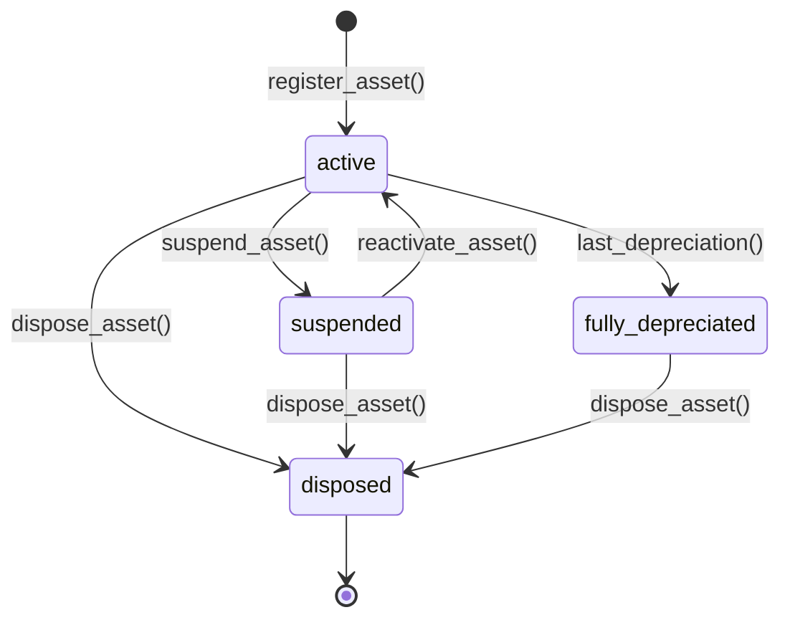
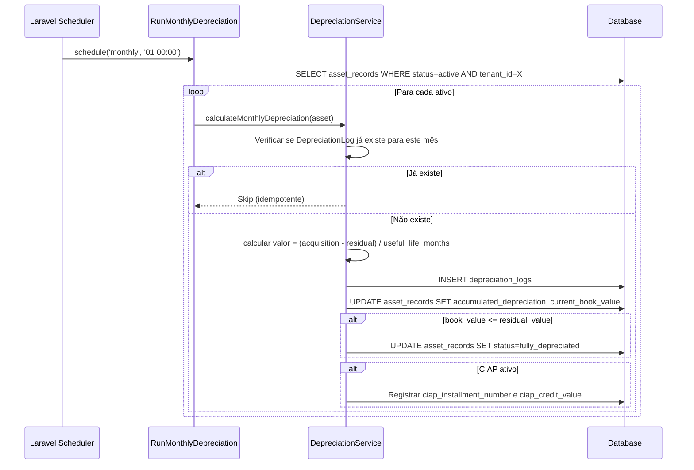

# Modulo: FixedAssets (Ativo Imobilizado e CIAP)

> **[AI_RULE]** Especificações arquiteturais da fase de Expansão. Módulo FixedAssets.

---

## 1. Visão Geral

Gestão contábil e depreciação mensal de ativos imobilizados. Inclui controle da Frota (FleetVehicle) e Equipamentos Padrões (ToolCalibration do Laboratório). Mantém rastreabilidade para SPED e gestão de crédito de impostos (CIAP).

**Escopo Funcional:**

- Cadastro categorizado de ativos (máquinas, veículos, equipamentos, móveis, TI)
- Cálculo automático de depreciação mensal (linear, acelerada, por unidades produzidas)
- Registro de baixas patrimoniais (venda, perda, sucata, doação)
- Geração de registros do Bloco G do SPED Fiscal (CIAP)
- Reavaliação e teste de impairment
- Dashboard com valor patrimonial do tenant

---

## 2. Entidades (Models)

### 2.1 AssetRecord

| Campo | Tipo | Regra |
|-------|------|-------|
| `id` | bigint (PK) | Auto-increment |
| `tenant_id` | bigint (FK) | Obrigatório, isolamento multi-tenant |
| `code` | string(50) | Código único do ativo por tenant, gerado via `NumberingSequence` (prefixo `AT-`, padding 5) |
| `name` | string(255) | Nome descritivo do ativo |
| `description` | text null | Descrição detalhada |
| `category` | enum | `machinery`, `vehicle`, `equipment`, `furniture`, `it`, `tooling`, `other` |
| `acquisition_date` | date | Data de aquisição |
| `acquisition_value` | decimal(15,2) | Valor de compra |
| `residual_value` | decimal(15,2) | Valor residual estimado |
| `useful_life_months` | integer | Vida útil em meses |
| `depreciation_method` | enum | `linear`, `accelerated`, `units_produced` |
| `depreciation_rate` | decimal(8,4) | Taxa de depreciação anual (%) |
| `accumulated_depreciation` | decimal(15,2) | Depreciação acumulada até o momento |
| `current_book_value` | decimal(15,2) | Valor contábil corrente (aquisição - depreciação acumulada) |
| `status` | enum | `active`, `suspended`, `disposed`, `fully_depreciated` |
| `location` | string(255) null | Localização física |
| `responsible_user_id` | bigint (FK → users) null | Responsável pelo ativo |
| `nf_number` | string(50) null | Número da NF de aquisição |
| `nf_serie` | string(10) null | Série da NF |
| `supplier_id` | bigint (FK → contacts) null | Fornecedor |
| `fleet_vehicle_id` | bigint (FK → fleet_vehicles) null | Se o ativo for um veículo |
| `ciap_credit_type` | enum null | `icms_full`, `icms_48`, `none` — tipo de crédito CIAP |
| `ciap_total_installments` | integer null | Parcelas totais do CIAP (48 para ICMS padrão) |
| `ciap_installments_taken` | integer null | Parcelas já apropriadas |
| `last_depreciation_at` | date null | Data da última depreciação executada |
| `disposed_at` | date null | Data da baixa |
| `disposal_reason` | enum null | `sale`, `loss`, `scrap`, `donation`, `theft` |
| `disposal_value` | decimal(15,2) null | Valor obtido na baixa (se venda) |
| `created_at` | timestamp | — |
| `updated_at` | timestamp | — |

### 2.2 DepreciationLog

| Campo | Tipo | Regra |
|-------|------|-------|
| `id` | bigint (PK) | Auto-increment |
| `tenant_id` | bigint (FK) | Obrigatório |
| `asset_record_id` | bigint (FK) | Ativo depreciado |
| `reference_month` | date | Mês de referência (YYYY-MM-01) |
| `depreciation_amount` | decimal(15,2) | Valor depreciado neste mês |
| `accumulated_before` | decimal(15,2) | Acumulado ANTES desta depreciação |
| `accumulated_after` | decimal(15,2) | Acumulado APÓS esta depreciação |
| `book_value_after` | decimal(15,2) | Valor contábil após depreciação |
| `method_used` | enum | `linear`, `accelerated`, `units_produced` |
| `ciap_installment_number` | integer null | Nº da parcela CIAP (se aplicável) |
| `ciap_credit_value` | decimal(15,2) null | Valor do crédito CIAP apropriado |
| `generated_by` | enum | `automatic_job`, `manual` |
| `created_at` | timestamp | — |

### 2.3 AssetDisposal

| Campo | Tipo | Regra |
|-------|------|-------|
| `id` | bigint (PK) | Auto-increment |
| `tenant_id` | bigint (FK) | Obrigatório |
| `asset_record_id` | bigint (FK) | Ativo sendo baixado |
| `disposal_date` | date | Data da baixa |
| `reason` | enum | `sale`, `loss`, `scrap`, `donation`, `theft` |
| `disposal_value` | decimal(15,2) null | Valor de venda (se aplicável) |
| `book_value_at_disposal` | decimal(15,2) | Valor contábil na data da baixa |
| `gain_loss` | decimal(15,2) | Lucro/prejuízo (disposal_value - book_value) |
| `fiscal_note_id` | bigint (FK) null | NF de saída vinculada (se venda) |
| `notes` | text null | Observações (ex: laudo de perda) |
| `approved_by` | bigint (FK → users) | Aprovador da baixa |
| `created_by` | bigint (FK → users) | Quem registrou |
| `created_at` | timestamp | — |

---

## 3. Ciclos de Vida (State Machines)

### 3.1 Ciclo do Ativo



| De | Para | Trigger | Efeito |
|----|------|---------|--------|
| `[*]` | `active` | `register_asset()` | Calcula `depreciation_rate`, inicia CIAP se aplicável |
| `active` | `suspended` | `suspend_asset()` | Pausa depreciação mensal (ex: ativo em manutenção) |
| `suspended` | `active` | `reactivate_asset()` | Retoma depreciação |
| `active` | `fully_depreciated` | `last_depreciation()` | `current_book_value = residual_value`, depreciação cessa |
| `active/suspended/fully_depreciated` | `disposed` | `dispose_asset()` | Gera `AssetDisposal`, calcula gain/loss, emite NF se venda |

---

## 4. Guard Rails de Negócio `[AI_RULE]`

> **[AI_RULE_CRITICAL] Idempotência de Depreciação**
> O Job `RunMonthlyDepreciation` DEVE verificar se já existe `DepreciationLog` para o `reference_month` + `asset_record_id` antes de criar novo registro. Depreciação duplicada é uma falha contábil grave.

> **[AI_RULE_CRITICAL] Depreciação Mínima**
> A depreciação mensal NUNCA pode fazer o `current_book_value` ficar abaixo do `residual_value`. O cálculo deve truncar o valor ao atingir o residual e marcar o ativo como `fully_depreciated`.

> **[AI_RULE_CRITICAL] Baixa Requer Aprovação**
> `AssetDisposal` requer preenchimento de `approved_by` (usuário diferente do `created_by`). Baixas de ativos acima de R$ 10.000 de valor contábil exigem permissão `fixed_assets.disposal.approve_high_value`.

> **[AI_RULE] CIAP — 48 Parcelas**
> Ativos com `ciap_credit_type = icms_48` devem ter o crédito de ICMS apropriado em 48 parcelas mensais proporcionais. Cada `DepreciationLog` com CIAP deve registrar `ciap_installment_number` e `ciap_credit_value`.

> **[AI_RULE] Geração SPED Bloco G**
> O service `SpedBlockGService` gera os registros G110, G125, G130 e G140 a partir dos `DepreciationLog` do mês de referência filtrados por tenant.

> **[AI_RULE] Numeração Sequencial**
> Código do ativo gerado via `NumberingSequence` com prefixo `AT-` e padding 5 (ex: `AT-00001`). Sequência é por tenant.

### 4.1 Edge Cases e Tratamento de Erros `[CRITICAL]`

| Cenário de Falha | Prevenção / Tratamento | Guardrails de Código Esperados |
| :--- | :--- | :--- |
| **Depreciação Duplicada no Mês** | O Job de depreciação acionado múltiplas vezes manualmente ou por erro de CRON não deve gerar dupla despesa. | Criar índice único ou validação rígida na inserção de `DepreciationLog`: `(tenant_id, asset_record_id, reference_month)`. |
| **Baixa de Ativo Totalmente Depreciado** | Valor contábil zero pode causar erro matemático de divisão. Valor do lucro na venda deve ser 100% da receita. | `gain_loss` passa a ser = `disposal_value` quando `book_value` == 0. |
| **Aquisição Retroativa** | Cadastro de ativo adquirido meses ou anos antes e que não teve depreciação lançada no sistema ainda. | `RunMonthlyDepreciation` apenas calcula do *mês de referência* adiante; saldo inicial retroativo deve vir como `accumulated_depreciation` inserido manualmente no cadastro. |
| **Cancelamento de Baixa** | Usuário errou a data da baixa e tenta deletar o registro para refazer. | Reverter uma baixa recria/recupera o status do ativo para ativo se e somente se nenhuma depreciação posterior ocorreu. Bloquear caso contrário. |
| **CIAP Superior à Vida Útil** | Ativo com vida de < 48 meses não deve prever recebimento total de CIAP (exigiria auditoria fiscal específica). | Form Request `StoreAssetRecordRequest` deve disparar aviso se `ciap_credit_type`='icms_48' E `useful_life_months` < 48. |

---

## 5. Comportamento Integrado (Cross-Domain)

| Direção | Módulo | Integração |
|---------|--------|------------|
| → | **Fiscal** | SPED Bloco G, emissão de NF de baixa patrimonial |
| → | **Finance** | Lançamentos contábeis de depreciação e crédito CIAP no balanço |
| ← | **Fleet** | `FleetVehicle` pode ser vinculado como tipo de ativo (category=vehicle) |
| ← | **Quality / Lab** | Equipamentos de calibração podem ser ativos depreciáveis |
| ← | **Procurement** | Nota de compra (purchase) pode gerar automaticamente um `AssetRecord` |

---

## 6. Contratos de API (JSON)

### 6.1 Cadastrar Ativo

```http
POST /api/v1/fixed-assets
Authorization: Bearer {admin-token}
Content-Type: application/json
```

**Request:**

```json
{
  "name": "Balança de Precisão XR-500",
  "category": "equipment",
  "acquisition_date": "2026-01-15",
  "acquisition_value": 45000.00,
  "residual_value": 5000.00,
  "useful_life_months": 120,
  "depreciation_method": "linear",
  "nf_number": "000123456",
  "supplier_id": 42,
  "ciap_credit_type": "icms_48"
}
```

**Response (201):**

```json
{
  "success": true,
  "data": {
    "id": 10,
    "code": "AT-00010",
    "name": "Balança de Precisão XR-500",
    "category": "equipment",
    "status": "active",
    "acquisition_value": 45000.00,
    "current_book_value": 45000.00,
    "depreciation_rate": 10.00,
    "ciap_credit_type": "icms_48",
    "ciap_total_installments": 48
  }
}
```

### 6.2 Listar Ativos

```http
GET /api/v1/fixed-assets?category=equipment&status=active&per_page=20
Authorization: Bearer {admin-token}
```

### 6.3 Registrar Baixa

```http
POST /api/v1/fixed-assets/{id}/dispose
Authorization: Bearer {admin-token}
Content-Type: application/json
```

**Request:**

```json
{
  "disposal_date": "2026-03-25",
  "reason": "sale",
  "disposal_value": 15000.00,
  "notes": "Venda para empresa parceira"
}
```

### 6.4 Executar Depreciação Mensal (Manual Trigger)

```http
POST /api/v1/fixed-assets/run-depreciation
Authorization: Bearer {admin-token}
Content-Type: application/json
```

**Request:**

```json
{
  "reference_month": "2026-03"
}
```

### 6.5 Dashboard Patrimonial

```http
GET /api/v1/fixed-assets/dashboard
Authorization: Bearer {admin-token}
```

**Response (200):**

```json
{
  "success": true,
  "data": {
    "total_assets": 85,
    "total_acquisition_value": 1250000.00,
    "total_current_book_value": 890000.00,
    "total_accumulated_depreciation": 360000.00,
    "by_category": {
      "equipment": { "count": 30, "book_value": 450000.00 },
      "vehicle": { "count": 12, "book_value": 280000.00 },
      "it": { "count": 25, "book_value": 80000.00 },
      "furniture": { "count": 18, "book_value": 80000.00 }
    },
    "disposals_this_year": 3,
    "ciap_credits_pending": 15
  }
}
```

---

## 7. Permissões (RBAC)

| Permissão | Descrição |
|-----------|-----------|
| `fixed_assets.asset.view` | Visualizar ativos |
| `fixed_assets.asset.create` | Cadastrar novo ativo |
| `fixed_assets.asset.update` | Editar ativo |
| `fixed_assets.asset.dispose` | Registrar baixa patrimonial |
| `fixed_assets.disposal.approve_high_value` | Aprovar baixas acima de R$ 10.000 |
| `fixed_assets.depreciation.run` | Executar depreciação mensal |
| `fixed_assets.depreciation.view` | Visualizar logs de depreciação |
| `fixed_assets.dashboard.view` | Visualizar dashboard patrimonial |

---

## 8. Rotas da API

### Fixed Assets (`auth:sanctum` + `check.tenant`)

| Método | Rota | Controller | Ação |
|--------|------|------------|------|
| `GET` | `/api/v1/fixed-assets` | `AssetRecordController@index` | Listar ativos |
| `POST` | `/api/v1/fixed-assets` | `AssetRecordController@store` | Cadastrar ativo |
| `GET` | `/api/v1/fixed-assets/{id}` | `AssetRecordController@show` | Detalhes do ativo |
| `PUT` | `/api/v1/fixed-assets/{id}` | `AssetRecordController@update` | Atualizar ativo |
| `POST` | `/api/v1/fixed-assets/{id}/dispose` | `AssetRecordController@dispose` | Baixa patrimonial |
| `POST` | `/api/v1/fixed-assets/{id}/suspend` | `AssetRecordController@suspend` | Suspender depreciação |
| `POST` | `/api/v1/fixed-assets/{id}/reactivate` | `AssetRecordController@reactivate` | Reativar depreciação |
| `POST` | `/api/v1/fixed-assets/run-depreciation` | `DepreciationController@runMonthly` | Rodar depreciação mensal |
| `GET` | `/api/v1/fixed-assets/{id}/depreciation-logs` | `DepreciationController@logs` | Logs de depreciação do ativo |
| `GET` | `/api/v1/fixed-assets/dashboard` | `AssetRecordController@dashboard` | Dashboard patrimonial |

---

## 9. Form Requests (Validação de Entrada)

> **[AI_RULE]** Todo endpoint de criação/atualização DEVE usar Form Request.

### 9.1 StoreAssetRecordRequest

**Classe**: `App\Http\Requests\FixedAssets\StoreAssetRecordRequest`

```php
public function rules(): array
{
    return [
        'name'                => ['required', 'string', 'max:255'],
        'category'            => ['required', 'string', 'in:machinery,vehicle,equipment,furniture,it,tooling,other'],
        'acquisition_date'    => ['required', 'date'],
        'acquisition_value'   => ['required', 'numeric', 'min:0.01'],
        'residual_value'      => ['required', 'numeric', 'min:0', 'lt:acquisition_value'],
        'useful_life_months'  => ['required', 'integer', 'min:1', 'max:600'],
        'depreciation_method' => ['required', 'string', 'in:linear,accelerated,units_produced'],
        'location'            => ['nullable', 'string', 'max:255'],
        'nf_number'           => ['nullable', 'string', 'max:50'],
        'supplier_id'         => ['nullable', 'integer', 'exists:contacts,id'],
        'ciap_credit_type'    => ['nullable', 'string', 'in:icms_full,icms_48,none'],
    ];
}
```

### 9.2 DisposeAssetRequest

**Classe**: `App\Http\Requests\FixedAssets\DisposeAssetRequest`

```php
public function rules(): array
{
    return [
        'disposal_date'  => ['required', 'date'],
        'reason'         => ['required', 'string', 'in:sale,loss,scrap,donation,theft'],
        'disposal_value' => ['nullable', 'numeric', 'min:0', 'required_if:reason,sale'],
        'notes'          => ['nullable', 'string', 'max:2000'],
    ];
}
```

---

## 10. Diagramas de Sequência

### 10.1 Fluxo: Depreciação Mensal Automática



---

## 11. Testes Requeridos (BDD)

```gherkin
Funcionalidade: Ativo Imobilizado e Depreciação

  Cenário: Cadastrar ativo com depreciação linear
    Dado que estou autenticado como admin
    Quando envio POST /fixed-assets com acquisition_value=120000, residual_value=12000, useful_life_months=120
    Então o ativo é criado com depreciation_rate=10% e status "active"

  Cenário: Depreciação mensal idempotente
    Dado que existe um ativo ativo com useful_life=120 meses
    Quando o Job de depreciação executa para 2026-03
    Então é criado DepreciationLog com depreciation_amount=900.00
    Quando o Job executa novamente para 2026-03
    Então nenhum novo registro é criado (idempotente)

  Cenário: Ativo atinge depreciação completa
    Dado que accumulated_depreciation está a R$900 do limite
    Quando o Job executa a última depreciação
    Então current_book_value = residual_value
    E status muda para "fully_depreciated"

  Cenário: Baixa com aprovação obrigatória
    Dado que o ativo tem book_value > R$10.000
    Quando envio POST /fixed-assets/{id}/dispose sem approved_by
    Então recebo status 422

  Cenário: Isolamento multi-tenant
    Dado que existem ativos do tenant_id=1 e tenant_id=2
    Quando admin do tenant_id=1 lista ativos
    Então recebe apenas ativos do tenant_id=1
```

---

## 12. Inventário Completo do Código

> **[AI_RULE]** Todos os artefatos listados DEVEM ser criados.

### Controllers (2 — namespace `App\Http\Controllers\Api\V1`)

| Controller | Arquivo | Métodos Públicos |
|------------|---------|-----------------|
| **AssetRecordController** | `FixedAssets/AssetRecordController.php` | `index`, `store`, `show`, `update`, `dispose`, `suspend`, `reactivate`, `dashboard` |
| **DepreciationController** | `FixedAssets/DepreciationController.php` | `runMonthly`, `logs` |

### Models (3 — namespace `App\Models`)

| Model | Tabela | Descrição |
|-------|--------|-----------|
| `AssetRecord` | `asset_records` | Cadastro do ativo imobilizado |
| `DepreciationLog` | `depreciation_logs` | Registro mensal de depreciação |
| `AssetDisposal` | `asset_disposals` | Baixa patrimonial |

### Services (2 — namespace `App\Services`)

| Service | Métodos Públicos |
|---------|-----------------|
| `DepreciationService` | `calculateMonthlyDepreciation(AssetRecord)`, `runForAllAssets(tenantId, referenceMonth)` |
| `SpedBlockGService` | `generateBlockG(tenantId, referenceMonth)` — gera registros do Bloco G |

### Jobs (1 — namespace `App\Jobs`)

| Job | Descrição |
|-----|-----------|
| `RunMonthlyDepreciation` | Executa depreciação para todos ativos ativos do tenant |

### Form Requests (3 — namespace `App\Http\Requests\FixedAssets`)

| FormRequest | Endpoint |
|-------------|----------|
| `StoreAssetRecordRequest` | `POST /fixed-assets` |
| `UpdateAssetRecordRequest` | `PUT /fixed-assets/{id}` |
| `DisposeAssetRequest` | `POST /fixed-assets/{id}/dispose` |

---

## Checklist de Implementação

- [ ] Migration `create_asset_records_table` com campos completos e tenant_id (FK)
- [ ] Migration `create_depreciation_logs_table` com unique constraint (asset_record_id, reference_month)
- [ ] Migration `create_asset_disposals_table` com campos completos
- [ ] Model `AssetRecord` com fillable, casts, relationships (belongsTo tenant/user/supplier, hasMany depreciationLogs/disposals)
- [ ] Model `DepreciationLog` com fillable, casts, relationship belongsTo AssetRecord
- [ ] Model `AssetDisposal` com fillable, casts, relationships
- [ ] `DepreciationService` com cálculo linear, idempotência e CIAP
- [ ] `SpedBlockGService` com geração de registros G110/G125/G130/G140
- [ ] Job `RunMonthlyDepreciation` — agendado mensalmente
- [ ] `AssetRecordController` com CRUD + dispose + suspend/reactivate + dashboard
- [ ] `DepreciationController` com runMonthly + logs
- [ ] 3 Form Requests conforme especificação
- [ ] Rotas em `routes/api.php` com middleware
- [ ] Permissões RBAC no seeder
- [ ] Testes Feature: CRUD, depreciação idempotente, baixa com aprovação, CIAP, isolamento
- [ ] Frontend React: Cadastro de ativos, tela de depreciação mensal, dashboard patrimonial
