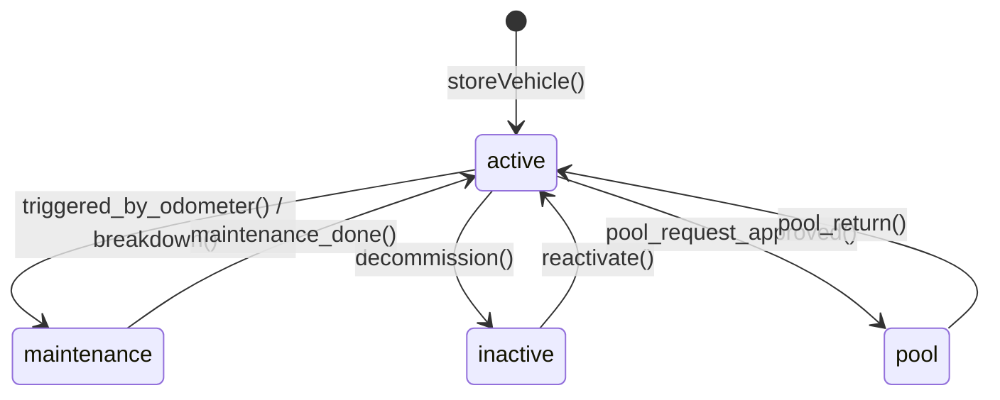
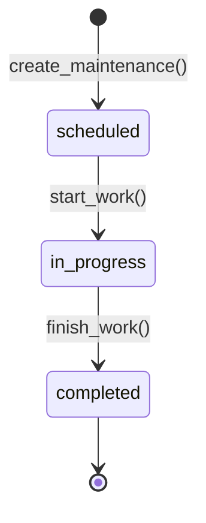
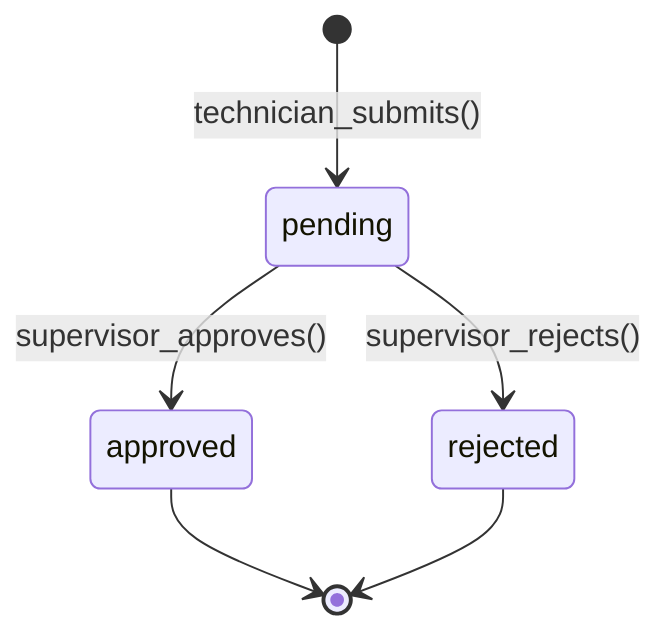
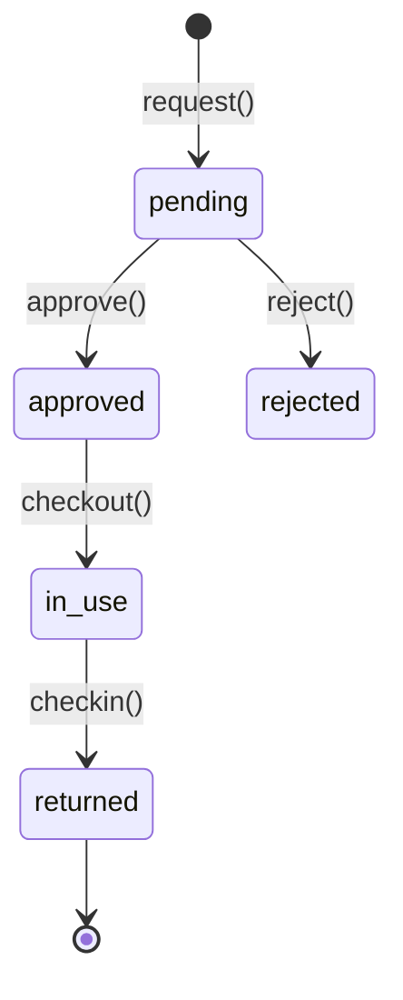
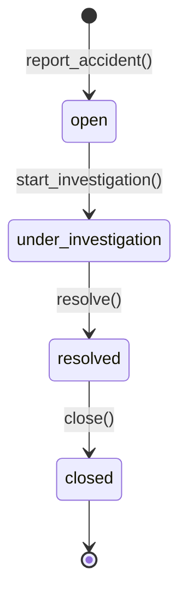
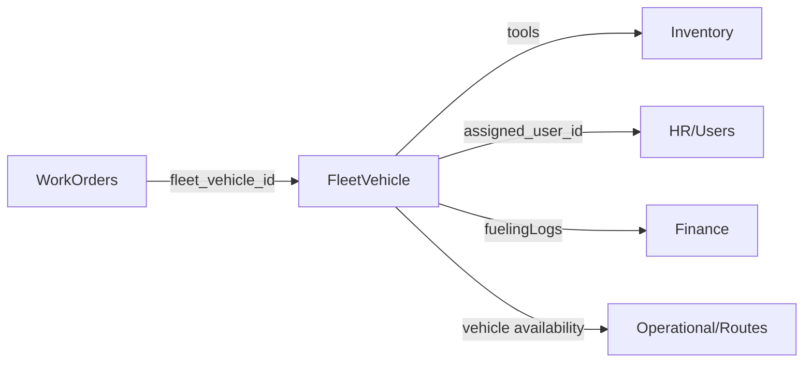
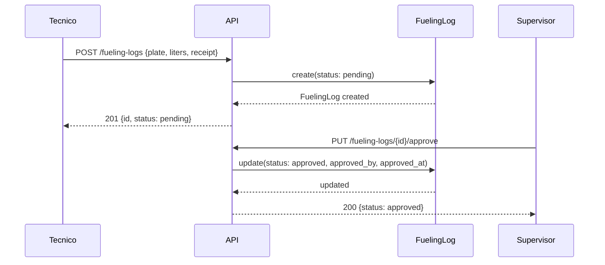
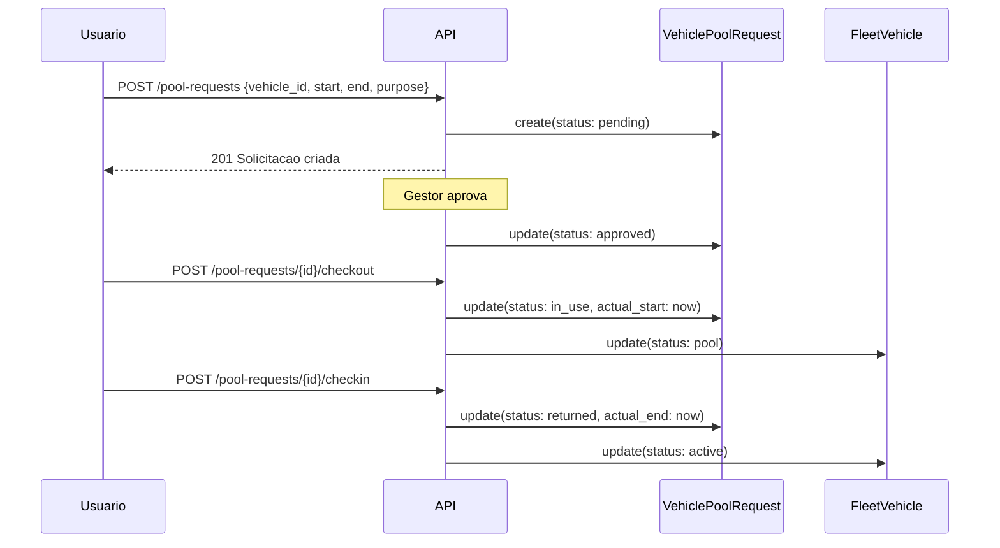

# Modulo: Fleet (Gestao de Frota)

> **[AI_RULE]** Documentacao Level C Maximum do dominio Fleet. Todas as entidades, campos, regras de negocio, contratos JSON, permissoes, diagramas e BDD extraidos do codigo-fonte real.

---

## 1. Visao Geral

O modulo Fleet gerencia todo o ciclo de vida dos veiculos da empresa: cadastro, abastecimento, manutencao preventiva/corretiva, insspecoes, multas, pneus, seguros, sinistros, pool de veiculos e analytics avancados. Integra-se com WorkOrders (veiculo da OS), HR (motorista/tecnico), Finance (custo de frota) e Inventory (estoque movel).

### Arquivos-chave

| Camada | Arquivo |
|--------|---------|
| Models | `FleetVehicle`, `Fleet`, `FleetMaintenance`, `FleetFuelEntry`, `FleetTrip`, `TrafficFine`, `VehicleInspection`, `Fleet\FuelLog`, `Fleet\VehicleAccident`, `Fleet\VehicleInsurance`, `Fleet\VehiclePoolRequest`, `Fleet\VehicleTire`, `FuelingLog` |
| Controllers | `FleetController`, `Fleet\FleetAdvancedController`, `Fleet\FuelLogController`, `Fleet\GpsTrackingController`, `Fleet\TollIntegrationController`, `Fleet\VehicleAccidentController`, `Fleet\VehicleInspectionController`, `Fleet\VehicleInsuranceController`, `Fleet\VehiclePoolController`, `Fleet\VehicleTireController`, `Financial\FuelingLogController` |
| Services | (logica inline nos controllers — `FleetAdvancedController` contem dashboard, fuel comparison, trip simulation, driver scoring) |
| Jobs | `FleetDocExpirationAlertJob`, `FleetMaintenanceAlertJob` |
| Requests | `Fleet\StoreVehicleRequest`, `Fleet\UpdateVehicleRequest`, `Fleet\StoreVehicleInspectionRequest`, `Fleet\UpdateVehicleInspectionRequest`, `Fleet\StoreFuelLogRequest`, `Fleet\UpdateFuelLogRequest`, `Fleet\FuelComparisonRequest`, `Fleet\TripSimulationRequest`, `Fleet\StoreFineRequest`, `Fleet\UpdateFineRequest`, `Fleet\StoreToolRequest`, `Fleet\UpdateToolRequest`, `Fleet\StoreVehicleAccidentRequest`, `Fleet\UpdateVehicleAccidentRequest`, `Fleet\StoreVehicleInsuranceRequest`, `Fleet\UpdateVehicleInsuranceRequest`, `Fleet\StoreVehicleTireRequest`, `Fleet\UpdateVehicleTireRequest`, `Fleet\StoreVehiclePoolRequest`, `Fleet\UpdateVehiclePoolStatusRequest`, `Fleet\StoreTollRecordRequest`, `Fleet\UpdateGpsPositionRequest`, `Fleet\StoreInspectionRequest` |
| Lookups | `FleetVehicleStatus`, `FleetVehicleType`, `FleetFuelType`, `FuelingFuelType` |
| Enums | `FuelingLogStatus` |
| Frontend | `FleetPage`, `FleetDashboardTab`, `FleetFuelTab`, `FleetFinesTab`, `FleetInspectionsTab`, `FleetInsuranceTab`, `FleetAccidentsTab`, `FleetPoolTab`, `FleetTiresTab` |
| Hooks | `useDisplacementTracking` (rastreamento de deslocamento em tempo real) |
| Types | `frontend/src/types/fleet.ts` |
| Routes | `routes/api/hr-quality-automation.php` (secao FLEET — veiculos, inspecoes, multas, ferramentas, acidentes, dashboard), `routes/api/financial.php` (tires, fuel-logs, pool, accidents, insurances, GPS, toll, fueling-logs) |

---

## 2. Entidades (Models) e Campos

### 2.1 FleetVehicle
>
> Model principal de veiculos. Suporta SoftDeletes.

| Campo | Tipo | Descricao |
|-------|------|-----------|
| `id` | bigint PK | Identificador |
| `tenant_id` | bigint FK | Tenant (multi-tenant) |
| `plate` | string | Placa do veiculo |
| `brand` | string | Marca (ex: Fiat, VW) |
| `model` | string | Modelo (ex: Strada, Saveiro) |
| `year` | integer | Ano de fabricacao |
| `color` | string | Cor |
| `type` | string | Tipo (carro, van, caminhao) |
| `fuel_type` | string | Tipo de combustivel |
| `odometer_km` | integer | Quilometragem atual |
| `renavam` | string | Codigo RENAVAM |
| `chassis` | string | Numero do chassi |
| `crlv_expiry` | date | Vencimento do CRLV |
| `insurance_expiry` | date | Vencimento do seguro |
| `next_maintenance` | date | Data da proxima manutencao |
| `tire_change_date` | date | Data da ultima troca de pneus |
| `purchase_value` | decimal(10,2) | Valor de compra |
| `assigned_user_id` | bigint FK | Motorista/tecnico atribuido |
| `status` | string | Status (active, maintenance, inactive) |
| `notes` | text | Observacoes |
| `avg_fuel_consumption` | decimal(8,2) | Consumo medio km/L |
| `cost_per_km` | decimal(10,4) | Custo por km |
| `cnh_expiry_driver` | date | Vencimento da CNH do motorista |

**Relationships:**

- `assignedUser()` -> BelongsTo User
- `inspections()` -> HasMany VehicleInspection
- `fines()` -> HasMany TrafficFine
- `fuelingLogs()` -> HasMany FuelingLog
- `workOrders()` -> HasMany WorkOrder
- `tools()` -> HasMany ToolInventory
- `tires()` -> HasMany VehicleTire
- `fuelLogs()` -> HasMany FuelLog
- `poolRequests()` -> HasMany VehiclePoolRequest
- `accidents()` -> HasMany VehicleAccident

**Computed:** `getAverageConsumptionAttribute()` — calcula media das ultimas 10 entradas de combustivel.

### 2.2 Fleet (Legado)
>
> Model legado simplificado. Usado por FleetFuelEntry, FleetMaintenance, FleetTrip.

| Campo | Tipo | Descricao |
|-------|------|-----------|
| `tenant_id` | bigint FK | Tenant |
| `plate` | string | Placa |
| `brand` | string | Marca |
| `model` | string | Modelo |
| `year` | integer | Ano |
| `color` | string | Cor |
| `type` | string | Tipo |
| `status` | string | Status |
| `mileage` | integer | Quilometragem |
| `is_active` | boolean | Ativo |

### 2.3 FleetMaintenance

| Campo | Tipo | Descricao |
|-------|------|-----------|
| `tenant_id` | bigint FK | Tenant |
| `fleet_id` | bigint FK | Veiculo (Fleet legado) |
| `type` | string | Tipo (preventive, corrective) |
| `description` | text | Descricao do servico |
| `date` | date | Data da manutencao |
| `cost` | decimal(10,2) | Custo |
| `odometer` | integer | Km no momento |
| `next_date` | date | Proxima manutencao agendada |
| `status` | string | Status (scheduled, in_progress, completed) |
| `notes` | text | Observacoes |

### 2.4 FleetFuelEntry (Legado)

| Campo | Tipo | Descricao |
|-------|------|-----------|
| `tenant_id` | bigint FK | Tenant |
| `fleet_id` | bigint FK | Veiculo (Fleet legado) |
| `date` | date | Data |
| `fuel_type` | string | Tipo de combustivel |
| `liters` | decimal(8,2) | Litros abastecidos |
| `cost` | decimal(10,2) | Custo total |
| `odometer` | integer | Km no momento |
| `station` | string | Posto de combustivel |
| `notes` | text | Observacoes |

### 2.5 FleetTrip

| Campo | Tipo | Descricao |
|-------|------|-----------|
| `tenant_id` | bigint FK | Tenant |
| `fleet_id` | bigint FK | Veiculo (Fleet legado) |
| `driver_user_id` | bigint FK | Motorista (User) |
| `date` | date | Data da viagem |
| `origin` | string | Origem |
| `destination` | string | Destino |
| `distance_km` | decimal(8,2) | Distancia percorrida |
| `purpose` | string | Finalidade |
| `odometer_start` | integer | Km inicio |
| `odometer_end` | integer | Km fim |
| `notes` | text | Observacoes |

### 2.6 FuelLog (Fleet\FuelLog) — Moderno

| Campo | Tipo | Descricao |
|-------|------|-----------|
| `tenant_id` | bigint FK | Tenant |
| `fleet_vehicle_id` | bigint FK | Veiculo (FleetVehicle) |
| `driver_id` | bigint FK | Motorista (User) |
| `date` | date | Data |
| `odometer_km` | integer | Km no momento |
| `liters` | decimal(8,2) | Litros |
| `price_per_liter` | decimal(10,4) | Preco por litro |
| `total_value` | decimal(10,2) | Valor total |
| `fuel_type` | string | Tipo combustivel |
| `gas_station` | string | Posto |
| `consumption_km_l` | decimal(8,2) | Consumo km/L calculado |
| `receipt_path` | string | Path do comprovante |

### 2.7 FuelingLog — Abastecimento vinculado a OS

| Campo | Tipo | Descricao |
|-------|------|-----------|
| `tenant_id` | bigint FK | Tenant |
| `user_id` | bigint FK | Tecnico que abasteceu |
| `work_order_id` | bigint FK | OS vinculada |
| `fueling_date` | date | Data |
| `vehicle_plate` | string | Placa |
| `odometer_km` | decimal(10,1) | Km |
| `gas_station_name` | string | Nome do posto |
| `gas_station_lat` | decimal(15,7) | Latitude GPS |
| `gas_station_lng` | decimal(15,7) | Longitude GPS |
| `fuel_type` | string | Tipo (diesel, diesel_s10, gasolina, etanol) |
| `liters` | decimal(8,2) | Litros |
| `price_per_liter` | decimal(10,4) | Preco/litro |
| `total_amount` | decimal(10,2) | Total (auto-calculado) |
| `receipt_path` | string | Foto do comprovante |
| `notes` | text | Observacoes |
| `status` | FuelingLogStatus | pending, approved, rejected |
| `approved_by` | bigint FK | Aprovador |
| `approved_at` | datetime | Data aprovacao |
| `rejection_reason` | string | Motivo rejeicao |
| `affects_technician_cash` | boolean | Impacta caixa do tecnico |

**Enum FuelingLogStatus:** `pending`, `approved`, `rejected`
**FUEL_TYPES:** `diesel`, `diesel_s10`, `gasolina`, `etanol`
**Auto-calculo:** `total_amount = liters * price_per_liter` (hook no `updating`)

### 2.8 TrafficFine

| Campo | Tipo | Descricao |
|-------|------|-----------|
| `tenant_id` | bigint FK | Tenant |
| `fleet_vehicle_id` | bigint FK | Veiculo |
| `driver_id` | bigint FK | Motorista infrator |
| `fine_date` | date | Data da infracao |
| `infraction_code` | string | Codigo da infracao |
| `description` | text | Descricao |
| `amount` | decimal(10,2) | Valor da multa |
| `points` | integer | Pontos na CNH |
| `status` | string | Status (pending, paid, contested, cancelled) |
| `due_date` | date | Vencimento |

### 2.9 VehicleInspection

| Campo | Tipo | Descricao |
|-------|------|-----------|
| `tenant_id` | bigint FK | Tenant |
| `fleet_vehicle_id` | bigint FK | Veiculo |
| `inspector_id` | bigint FK | Inspetor (User) |
| `inspection_date` | date | Data |
| `odometer_km` | integer | Km no momento |
| `checklist_data` | json | Dados do checklist 360 |
| `status` | string | Status (pending, approved, rejected) |
| `observations` | text | Observacoes |

### 2.10 VehicleInsurance

| Campo | Tipo | Descricao |
|-------|------|-----------|
| `tenant_id` | bigint FK | Tenant |
| `fleet_vehicle_id` | bigint FK | Veiculo |
| `insurer` | string | Seguradora |
| `policy_number` | string | Numero da apolice |
| `coverage_type` | string | Tipo de cobertura |
| `premium_value` | decimal(10,2) | Valor do premio |
| `deductible_value` | decimal(10,2) | Valor da franquia |
| `start_date` | date | Inicio vigencia |
| `end_date` | date | Fim vigencia |
| `broker_name` | string | Corretor |
| `broker_phone` | string | Telefone corretor |
| `status` | string | Status (active, expired, cancelled) |
| `notes` | text | Observacoes |

**Metodos:** `isExpired()`, `isExpiringSoon(int $days = 30)`

### 2.11 VehicleAccident

| Campo | Tipo | Descricao |
|-------|------|-----------|
| `tenant_id` | bigint FK | Tenant |
| `fleet_vehicle_id` | bigint FK | Veiculo |
| `driver_id` | bigint FK | Motorista |
| `occurrence_date` | date | Data do sinistro |
| `location` | string | Local |
| `description` | text | Descricao |
| `third_party_involved` | boolean | Terceiro envolvido |
| `third_party_info` | text | Info do terceiro |
| `police_report_number` | string | BO policial |
| `photos` | json/array | Fotos do sinistro |
| `estimated_cost` | decimal(10,2) | Custo estimado |
| `status` | string | Status (open, under_investigation, resolved, closed) |

### 2.12 VehiclePoolRequest

| Campo | Tipo | Descricao |
|-------|------|-----------|
| `tenant_id` | bigint FK | Tenant |
| `user_id` | bigint FK | Solicitante |
| `fleet_vehicle_id` | bigint FK | Veiculo solicitado |
| `requested_start` | datetime | Inicio solicitado |
| `requested_end` | datetime | Fim solicitado |
| `actual_start` | datetime | Inicio real |
| `actual_end` | datetime | Fim real |
| `purpose` | string | Finalidade |
| `status` | string | Status (pending, approved, rejected, in_use, returned) |

### 2.13 VehicleTire

| Campo | Tipo | Descricao |
|-------|------|-----------|
| `tenant_id` | bigint FK | Tenant |
| `fleet_vehicle_id` | bigint FK | Veiculo |
| `serial_number` | string | Numero de serie |
| `brand` | string | Marca |
| `model` | string | Modelo |
| `position` | string | Posicao (DE, DD, TE, TD, estepe) |
| `tread_depth` | decimal(4,2) | Profundidade da banda (mm) |
| `retread_count` | integer | Recapagens |
| `installed_at` | date | Data instalacao |
| `installed_km` | integer | Km na instalacao |
| `status` | string | Status (active, worn, replaced, retreaded) |

---

## 3. Maquina de Estados

### 3.1 Ciclo de Vida do Veiculo (FleetVehicle)



### 3.2 Ciclo de Manutencao (FleetMaintenance)



### 3.3 Ciclo de Abastecimento (FuelingLog)



### 3.4 Ciclo de Pool (VehiclePoolRequest)



### 3.5 Ciclo de Sinistro (VehicleAccident)



---

## 4. Regras de Negocio (Guard Rails) `[AI_RULE]`

> **[AI_RULE_CRITICAL] Bloqueio Hodometrico Magico**
> O campo `odometer_km` no `VehicleInspection`, `FleetTrip`, `FuelLog` ou `FuelingLog` JAMAIS pode ser menor que a ultima quilometragem historica registrada no banco de dados para o veiculo (validacao de regressao). Isso previne fraude de hodometro.

> **[AI_RULE] Checklist de Avaria Obrigatorio**
> O `FleetTrip` so pode transitar de `InUse` para `Idle` se a API receber um `VehicleInspection` preenchido contendo as `Photos` de checklist 360 do carro, protegendo contra culpas de avarias nao rastreaveis.

> **[AI_RULE] Alertas de Vencimento Automaticos**
> O `FleetDashboardService` gera alertas automaticos para:
>
> - CRLV vencendo em 60 dias (severity: warning) ou 15 dias (severity: critical)
> - Seguro vencendo em 30 dias (warning) ou 7 dias (critical)
> - Manutencao preventiva em 15 dias ou atrasada (critical)

> **[AI_RULE] Aprovacao de Abastecimento**
> `FuelingLog` segue fluxo de aprovacao: tecnico submete com comprovante (receipt_path), supervisor aprova/rejeita. Se `affects_technician_cash = true`, impacta o caixa do tecnico.

> **[AI_RULE] Auto-Calculo de Total**
> No `FuelingLog`, o `total_amount` e auto-calculado via hook `updating`: `total_amount = liters * price_per_liter`.

> **[AI_RULE] Comparacao de Combustivel**
> O `FuelComparisonService` calcula a relacao etanol/gasolina. Se ratio < 0.7, recomenda etanol. Threshold padrao: 70%.

> **[AI_RULE] Consumo Medio Automatico**
> `FleetVehicle::getAverageConsumptionAttribute()` calcula a media de consumo baseada nas ultimas 10 entradas de `FuelingLog`.

---

## 5. Integracao Cross-Domain

| Direcao | Dominio | Integracao |
|---------|---------|------------|
| <- | **WorkOrders** | `FleetVehicle.workOrders()` — veiculo atribuido a OS. OS referencia `fleet_vehicle_id`. |
| -> | **Inventory** | `FleetVehicle.tools()` -> ToolInventory — estoque movel de ferramentas no veiculo. |
| -> | **HR** | `FleetVehicle.assignedUser()` — motorista/tecnico. `FleetTrip.driver()`, `TrafficFine.driver()`. |
| -> | **Finance** | `FuelingLog` — custo de combustivel por OS. `FleetMaintenance.cost` — custo manutencao. `TrafficFine.amount` — custo multas. |
| -> | **Operational** | `RoutePlan` considera veiculos disponiveis. Rota otimizada leva em conta veiculo do tecnico. |



---

## 6. Endpoints da API

### 6.1 Veiculos (CRUD)

| Metodo | Rota | Controller | Permissao |
|--------|------|-----------|-----------|
| GET | `/api/v1/fleet/vehicles` | `FleetController@indexVehicles` | `fleet.vehicle.view` |
| GET | `/api/v1/fleet/vehicles/{vehicle}` | `FleetController@showVehicle` | `fleet.vehicle.view` |
| POST | `/api/v1/fleet/vehicles` | `FleetController@storeVehicle` | `fleet.vehicle.create` |
| PUT | `/api/v1/fleet/vehicles/{vehicle}` | `FleetController@updateVehicle` | `fleet.vehicle.update` |
| DELETE | `/api/v1/fleet/vehicles/{vehicle}` | `FleetController@destroyVehicle` | `fleet.vehicle.delete` |

### 6.2 Inspecoes

| Metodo | Rota | Controller | Permissao |
|--------|------|-----------|-----------|
| GET | `/api/v1/fleet/vehicles/{vehicle}/inspections` | `FleetController@indexInspections` | `fleet.vehicle.view` |
| POST | `/api/v1/fleet/vehicles/{vehicle}/inspections` | `FleetController@storeInspection` | `fleet.inspection.create` |

### 6.3 Multas

| Metodo | Rota | Controller | Permissao |
|--------|------|-----------|-----------|
| GET | `/api/v1/fleet/fines` | `FleetController@indexFines` | `fleet.fine.view` |
| POST | `/api/v1/fleet/fines` | `FleetController@storeFine` | `fleet.fine.create` |
| PUT | `/api/v1/fleet/fines/{fine}` | `FleetController@updateFine` | `fleet.fine.update` |

### 6.4 Ferramentas (Tool Inventory)

| Metodo | Rota | Controller | Permissao |
|--------|------|-----------|-----------|
| GET | `/api/v1/fleet/tools` | `FleetController@indexTools` | `fleet.tool_inventory.view` |
| POST | `/api/v1/fleet/tools` | `FleetController@storeTool` | `fleet.tool_inventory.manage` |
| PUT | `/api/v1/fleet/tools/{tool}` | `FleetController@updateTool` | `fleet.tool_inventory.manage` |
| DELETE | `/api/v1/fleet/tools/{tool}` | `FleetController@destroyTool` | `fleet.tool_inventory.manage` |

### 6.5 Combustivel (Fuel Logs)

| Metodo | Rota | Controller | Permissao |
|--------|------|-----------|-----------|
| GET | `/api/v1/fleet/fuel-logs` | `FuelLogController@index` | `fleet.vehicle.view` |
| GET | `/api/v1/fleet/fuel-logs/{log}` | `FuelLogController@show` | `fleet.vehicle.view` |
| POST | `/api/v1/fleet/fuel-logs` | `FuelLogController@store` | `fleet.vehicle.create` |
| PUT | `/api/v1/fleet/fuel-logs/{log}` | `FuelLogController@update` | `fleet.vehicle.update` |

### 6.6 Sinistros (Accidents)

| Metodo | Rota | Controller | Permissao |
|--------|------|-----------|-----------|
| GET | `/api/v1/fleet/accidents` | `VehicleAccidentController@index` | `fleet.vehicle.view` |
| GET | `/api/v1/fleet/accidents/{accident}` | `VehicleAccidentController@show` | `fleet.vehicle.view` |
| POST | `/api/v1/fleet/accidents` | `VehicleAccidentController@store` | `fleet.vehicle.create` |
| PUT | `/api/v1/fleet/accidents/{accident}` | `VehicleAccidentController@update` | `fleet.vehicle.update` |

### 6.7 Pneus, Seguros, Pool, Inspecoes Avancadas

| Metodo | Rota | Controller | Permissao |
|--------|------|-----------|-----------|
| GET/POST/PUT/DELETE | `/api/v1/fleet/tires/*` | `VehicleTireController` | `fleet.vehicle.*` |
| GET/POST/PUT | `/api/v1/fleet/insurances/*` | `VehicleInsuranceController` | `fleet.vehicle.*` |
| GET/POST/PUT | `/api/v1/fleet/pool-requests/*` | `VehiclePoolController` | `fleet.vehicle.*` |
| GET/POST/PUT | `/api/v1/fleet/inspections/*` | `VehicleInspectionController` | `fleet.vehicle.*` |

### 6.8 Dashboard e Analytics

| Metodo | Rota | Controller | Permissao |
|--------|------|-----------|-----------|
| GET | `/api/v1/fleet/dashboard` | `FleetController@dashboardFleet` | `fleet.vehicle.view` |
| GET | `/api/v1/fleet/analytics` | `FleetController@analyticsFleet` | `fleet.vehicle.view` |

### 6.9 Fleet Avancado (GPS, Pedagio, Rotas)

| Metodo | Rota | Controller | Permissao |
|--------|------|-----------|-----------|
| GET | `/api/v1/fleet-advanced/tolls` | `RemainingModulesController@tollTransactions` | `fleet.vehicle.view` |
| GET | `/api/v1/fleet-advanced/gps` | `RemainingModulesController@gpsTracking` | `fleet.vehicle.view` |
| GET | `/api/v1/fleet-advanced/route-analysis` | `RemainingModulesController@routeAnalysis` | `fleet.vehicle.view` |
| POST | `/api/v1/fleet-advanced/tolls` | `RemainingModulesController@storeTollTransaction` | `fleet.vehicle.create` |
| POST | `/api/v1/fleet-advanced/gps` | `RemainingModulesController@storeGpsPosition` | `fleet.vehicle.create` |

### 6.10 Comparacao de Combustivel e Simulacao

| Metodo | Rota | Controller | Permissao |
|--------|------|-----------|-----------|
| POST | `/api/v1/fleet-advanced/fuel-comparison` | `FleetAdvancedController@fuelComparison` | `fleet.vehicle.view` |
| POST | `/api/v1/fleet-advanced/trip-simulation` | `FleetAdvancedController@tripSimulation` | `fleet.vehicle.view` |
| GET | `/api/v1/fleet-advanced/dashboard` | `FleetAdvancedController@dashboard` | `fleet.vehicle.view` |

---

## 7. Contratos JSON

### 7.1 POST /api/v1/fleet/vehicles — Criar Veiculo

```json
// Request
{
  "plate": "ABC-1234",
  "brand": "Fiat",
  "model": "Strada",
  "year": 2024,
  "color": "Branco",
  "type": "pickup",
  "fuel_type": "diesel",
  "odometer_km": 15000,
  "renavam": "00123456789",
  "chassis": "9BWZZZ377VT004251",
  "crlv_expiry": "2027-03-15",
  "insurance_expiry": "2026-12-01",
  "next_maintenance": "2026-06-01",
  "purchase_value": 95000.00,
  "assigned_user_id": 42,
  "status": "active"
}

// Response 201
{
  "data": {
    "id": 1,
    "plate": "ABC-1234",
    "brand": "Fiat",
    "model": "Strada",
    "year": 2024,
    "status": "active",
    "odometer_km": 15000,
    "assigned_user": { "id": 42, "name": "Joao Silva" },
    "created_at": "2026-03-24T10:00:00Z"
  },
  "message": "Veiculo cadastrado"
}
```

### 7.2 POST /api/v1/fleet/fuel-logs — Registrar Abastecimento

```json
// Request
{
  "fleet_vehicle_id": 1,
  "driver_id": 42,
  "date": "2026-03-24",
  "odometer_km": 16500,
  "liters": 45.5,
  "price_per_liter": 6.299,
  "fuel_type": "diesel",
  "gas_station": "Posto Shell BR-101",
  "receipt_path": "receipts/fuel/2026-03-24-abc.jpg"
}

// Response 201
{
  "data": {
    "id": 15,
    "fleet_vehicle_id": 1,
    "total_value": "286.60",
    "consumption_km_l": "7.50"
  }
}
```

### 7.3 POST /api/v1/fleet-advanced/fuel-comparison

```json
// Request
{
  "gasoline_price": 6.29,
  "ethanol_price": 4.19,
  "diesel_price": 5.89
}

// Response 200
{
  "data": {
    "gasoline_price": "6.290",
    "ethanol_price": "4.190",
    "ratio": "0.666",
    "recommendation": "ethanol",
    "recommendation_label": "Abasteca com Etanol",
    "savings_percent": 33.4,
    "threshold": 0.7,
    "diesel_price": "5.890",
    "diesel_cost_per_km": "0.7362",
    "gasoline_cost_per_km": "0.6290",
    "ethanol_cost_per_km": "0.5985"
  }
}
```

### 7.4 GET /api/v1/fleet/analytics — Analytics Avancado

```json
// Response 200
{
  "data": {
    "cost_per_vehicle": [
      { "plate": "ABC-1234", "vehicle_name": "Fiat Strada", "total_fuel_cost": 12500.00 }
    ],
    "avg_consumption": [
      { "plate": "ABC-1234", "km_per_liter": 8.5 }
    ],
    "fines_by_month": [
      { "month": "2026-03", "count": 2, "total_amount": 580.00 }
    ],
    "fuel_cost_trend": [
      { "month": "2026-03", "total_cost": 15000.00, "total_liters": 2380.5 }
    ],
    "urgent_alerts": [
      { "plate": "XYZ-5678", "crlv_expiry": "2026-03-25", "insurance_expiry": null }
    ],
    "period_months": 6
  }
}
```

---

## 8. Validacoes (FormRequests)

### StoreVehicleRequest

```php
'plate'             => 'required|string|max:10',
'brand'             => 'required|string|max:100',
'model'             => 'required|string|max:100',
'year'              => 'required|integer|min:1990|max:' . (date('Y') + 1),
'type'              => 'required|string|in:car,van,truck,pickup,motorcycle',
'fuel_type'         => 'required|string|in:diesel,diesel_s10,gasolina,etanol,flex',
'odometer_km'       => 'required|integer|min:0',
'status'            => 'required|string|in:active,maintenance,inactive',
'assigned_user_id'  => 'nullable|exists:users,id',
'purchase_value'    => 'nullable|numeric|min:0',
```

### StoreFuelLogRequest

```php
'fleet_vehicle_id' => 'required|exists:fleet_vehicles,id',
'driver_id'        => 'required|exists:users,id',
'date'             => 'required|date',
'odometer_km'      => 'required|integer|min:0',
'liters'           => 'required|numeric|min:0.1',
'price_per_liter'  => 'required|numeric|min:0.01',
'fuel_type'        => 'required|string|in:diesel,diesel_s10,gasolina,etanol',
```

---

## 9. Permissoes

| Permissao | Descricao |
|-----------|-----------|
| `fleet.vehicle.view` | Visualizar veiculos, dashboard, analytics, fuel-logs, accidents |
| `fleet.vehicle.create` | Criar veiculo, fuel-log, accident, GPS position, toll |
| `fleet.vehicle.update` | Atualizar veiculo, fuel-log, accident |
| `fleet.vehicle.delete` | Remover veiculo |
| `fleet.inspection.create` | Criar inspecao veicular |
| `fleet.fine.view` | Visualizar multas |
| `fleet.fine.create` | Registrar multa |
| `fleet.fine.update` | Atualizar multa |
| `fleet.tool_inventory.view` | Visualizar ferramentas |
| `fleet.tool_inventory.manage` | CRUD ferramentas |

---

## 10. Diagramas de Sequencia

### 10.1 Abastecimento com Aprovacao



### 10.2 Fluxo de Pool de Veiculos



---

## 11. Exemplos de Codigo

### 11.1 FleetDashboardService — Alertas

```php
// FleetDashboardService::getAlerts()
// CRLV vencendo em 60 dias
$crlvAlerts = FleetVehicle::where('tenant_id', $tenantId)
    ->whereNotNull('crlv_expiry')
    ->where('crlv_expiry', '<=', now()->addDays(60))
    ->where('crlv_expiry', '>=', now())
    ->get();

foreach ($crlvAlerts as $v) {
    $daysLeft = now()->diffInDays($v->crlv_expiry);
    $alerts[] = [
        'title' => "CRLV vencendo: {$v->plate}",
        'severity' => $daysLeft <= 15 ? 'critical' : 'warning',
        'days_left' => $daysLeft,
        'type' => 'crlv',
    ];
}
```

### 11.2 FuelComparisonService

```php
// Recomendacao: se ratio etanol/gasolina < 0.7, use etanol
$ratio = $ethanolPrice / $gasolinePrice;
$recommendation = $ratio < 0.7 ? 'ethanol' : 'gasoline';
```

### 11.3 Consumo Medio (FleetVehicle accessor)

```php
public function getAverageConsumptionAttribute(): ?float
{
    $logs = $this->fuelingLogs()->orderBy('created_at', 'desc')->take(10)->get();
    if ($logs->count() < 2) return null;
    $totalKm = $logs->first()->odometer_km - $logs->last()->odometer_km;
    $totalLiters = $logs->sum('liters');
    return $totalLiters > 0 ? round($totalKm / $totalLiters, 2) : null;
}
```

---

## 12. BDD (Behavior-Driven Development)

### Feature: Gestao de Veiculos

```gherkin
Funcionalidade: CRUD de Veiculos da Frota

  Cenario: Cadastrar novo veiculo
    Dado que estou autenticado como usuario com permissao "fleet.vehicle.create"
    Quando envio POST /api/v1/fleet/vehicles com placa "ABC-1234"
    Entao recebo status 201
    E o veiculo aparece na listagem

  Cenario: Bloquear hodometro regressivo
    Dado que o veiculo "ABC-1234" tem odometer_km = 15000
    Quando envio POST /api/v1/fleet/fuel-logs com odometer_km = 14000
    Entao recebo status 422
    E a mensagem contem "hodometro nao pode ser menor"

  Cenario: Alerta de CRLV vencendo
    Dado que o veiculo "ABC-1234" tem crlv_expiry = hoje + 10 dias
    Quando acesso GET /api/v1/fleet/dashboard
    Entao vejo um alerta com severity "critical" e type "crlv"
```

### Feature: Abastecimento com Aprovacao

```gherkin
  Cenario: Tecnico registra abastecimento
    Dado que estou autenticado como tecnico
    Quando envio POST /api/v1/fleet/fuel-logs com liters=45.5 e price_per_liter=6.29
    Entao recebo status 201
    E o total_value e calculado como "286.60"

  Cenario: Supervisor aprova abastecimento
    Dado que existe um FuelingLog com status "pending"
    Quando o supervisor envia PUT /api/v1/fueling-logs/{id}/approve
    Entao o status muda para "approved"
    E approved_by registra o ID do supervisor
```

### Feature: Comparacao de Combustivel

```gherkin
  Cenario: Recomendacao de etanol
    Dado gasolina a R$ 6.29 e etanol a R$ 4.19
    Quando envio POST /api/v1/fleet-advanced/fuel-comparison
    Entao a recommendation e "ethanol"
    E o ratio e menor que 0.7

  Cenario: Recomendacao de gasolina
    Dado gasolina a R$ 5.50 e etanol a R$ 4.20
    Quando envio POST /api/v1/fleet-advanced/fuel-comparison
    Entao a recommendation e "gasoline"
    E o ratio e maior que 0.7
```

### Feature: Pool de Veiculos

```gherkin
  Cenario: Solicitar veiculo do pool
    Dado que estou autenticado e o veiculo esta "active"
    Quando envio POST /api/v1/fleet/pool-requests
    Entao recebo status 201 com status "pending"

  Cenario: Checkout do pool
    Dado que minha solicitacao foi aprovada
    Quando faco checkout
    Entao o veiculo muda para status "pool"
    E actual_start e registrado
```

---

## 13. Observers (Cross-Domain Event Propagation) `[AI_RULE]`

> Observers garantem consistência entre o módulo Fleet e os domínios dependentes. Toda propagação é síncrona dentro de `DB::transaction`. Falhas de propagação DEVEM ser logadas via `Log::error()` e encaminhadas para Job de retry (`RetryFailedObserverJob`). Nenhum observer pode silenciar exceções.

### 13.1 VehicleObserver

| Evento | Ação | Módulo Destino | Dados Propagados | Falha |
|--------|------|----------------|-----------------|-------|
| `updated` (assigned_user_id changed) | Atualizar atribuição de motorista no HR | **HR** | `vehicle_id`, `old_user_id`, `new_user_id`, `plate` | Log + retry. Veículo atualiza mas HR mantém atribuição anterior até sync |
| `updated` (status → inactive) | Registrar baixa contábil (depreciação) | **Finance** | `vehicle_id`, `plate`, `purchase_value`, `decommission_date`, `depreciated_value` | Log + retry. Lançamento contábil criado como `pending` |
| `updated` (status → inactive) | Transferir ferramentas do veículo para armazém central | **Inventory** | `vehicle_id`, `tool_ids[]`, `central_warehouse_id` | Log + retry. Ferramentas mantidas no veículo até transferência confirmada |
| `updated` (status → maintenance) | Criar FleetMaintenance automática (se preventiva) | **Fleet (interno)** | `vehicle_id`, `maintenance_type`, `scheduled_date` | Log. Manutenção criada como `scheduled` |
| `created` | Criar Warehouse tipo `vehicle` vinculado | **Inventory** | `vehicle_id`, `plate`, `tenant_id` | Log + retry. Veículo funciona sem warehouse, mas estoque móvel fica indisponível |

> **[AI_RULE_CRITICAL]** Ao desativar um veículo (`status=inactive`), o observer DEVE verificar que não existem OS abertas (`WorkOrder.fleet_vehicle_id = vehicle_id AND status NOT IN (completed, cancelled)`). Se existirem, lança `VehicleHasOpenWorkOrdersException` e impede a desativação.

### 13.2 FuelingLogObserver

| Evento | Ação | Módulo Destino | Dados Propagados | Falha |
|--------|------|----------------|-----------------|-------|
| `updated` (status → approved) | Lançar despesa de combustível | **Finance** | `fueling_id`, `total_amount`, `vehicle_id`, `work_order_id`, `tenant_id` | Log + retry. Despesa criada como `pending` |
| `updated` (status → approved, affects_technician_cash=true) | Debitar caixa do técnico | **Finance** | `fueling_id`, `user_id`, `total_amount` | Log + retry. Caixa do técnico atualizado no próximo fechamento |
| `created` | Atualizar odometer_km do veículo | **Fleet (interno)** | `vehicle_id`, `odometer_km` | Log. Veículo atualiza km se novo valor > atual |
| `created` | Recalcular consumo médio (avg_fuel_consumption) | **Fleet (interno)** | `vehicle_id`, `new_consumption_km_l` | Log. Média recalculada com últimas 10 entradas |

> **[AI_RULE]** O `FuelingLogObserver` ao atualizar o `odometer_km` do veículo DEVE validar que o novo valor é maior que o atual (`FleetVehicle.odometer_km`). Se menor, o observer registra alerta de possível fraude de hodômetro e NÃO atualiza o odometer.

---

## Fluxos Relacionados

| Fluxo | Descrição |
|-------|-----------|
| [Gestão de Frota](file:///c:/PROJETOS/sistema/docs/fluxos/GESTAO-FROTA.md) | Processo documentado em `docs/fluxos/GESTAO-FROTA.md` |
| [Operação Diária](file:///c:/PROJETOS/sistema/docs/fluxos/OPERACAO-DIARIA.md) | Processo documentado em `docs/fluxos/OPERACAO-DIARIA.md` |

---

## 14. Inventario Completo do Codigo

> Secao gerada por auditoria automatizada do codigo-fonte. Lista exaustiva de todos os artefatos backend e frontend que pertencem ao dominio Fleet.

### 14.1 Models (15 models)

| Model | Path | Descricao |
|-------|------|-----------|
| `FleetVehicle` | `backend/app/Models/FleetVehicle.php` | Model principal de veiculos (moderno) |
| `Fleet` | `backend/app/Models/Fleet.php` | Model legado de veiculos |
| `FleetMaintenance` | `backend/app/Models/FleetMaintenance.php` | Manutencoes preventivas/corretivas |
| `FleetFuelEntry` | `backend/app/Models/FleetFuelEntry.php` | Abastecimentos (legado) |
| `FleetTrip` | `backend/app/Models/FleetTrip.php` | Viagens registradas |
| `TrafficFine` | `backend/app/Models/TrafficFine.php` | Multas de transito |
| `VehicleInspection` | `backend/app/Models/VehicleInspection.php` | Inspecoes veiculares |
| `FuelingLog` | `backend/app/Models/FuelingLog.php` | Abastecimento vinculado a OS |
| `ToolInventory` | `backend/app/Models/ToolInventory.php` | Ferramentas de campo |
| `Fleet\FuelLog` | `backend/app/Models/Fleet/FuelLog.php` | Abastecimento moderno (FleetVehicle) |
| `Fleet\VehicleAccident` | `backend/app/Models/Fleet/VehicleAccident.php` | Sinistros/acidentes |
| `Fleet\VehicleInsurance` | `backend/app/Models/Fleet/VehicleInsurance.php` | Seguros veiculares |
| `Fleet\VehiclePoolRequest` | `backend/app/Models/Fleet/VehiclePoolRequest.php` | Requisicoes de pool de veiculos |
| `Fleet\VehicleTire` | `backend/app/Models/Fleet/VehicleTire.php` | Gestao de pneus |
| `EquipmentMaintenance` | `backend/app/Models/EquipmentMaintenance.php` | Manutencao de equipamentos (compartilhado) |

### 14.2 Controllers (10 controllers)

| Controller | Path | Metodos |
|------------|------|---------|
| `FleetController` | `backend/app/Http/Controllers/Api/V1/FleetController.php` | `indexVehicles`, `storeVehicle`, `showVehicle`, `updateVehicle`, `destroyVehicle`, `dashboardFleet`, `analyticsFleet`, `indexInspections`, `storeInspection`, `indexFines`, `storeFine`, `updateFine`, `indexTools`, `storeTool`, `updateTool`, `destroyTool` (16 metodos) |
| `Fleet\FleetAdvancedController` | `backend/app/Http/Controllers/Api/V1/Fleet/FleetAdvancedController.php` | `dashboard`, `fuelComparison`, `tripSimulation`, `driverScore`, `driverRanking` (5 metodos) |
| `Fleet\FuelLogController` | `backend/app/Http/Controllers/Api/V1/Fleet/FuelLogController.php` | `index`, `store`, `show`, `update`, `destroy` |
| `Fleet\GpsTrackingController` | `backend/app/Http/Controllers/Api/V1/Fleet/GpsTrackingController.php` | `livePositions`, `updatePosition`, `history` |
| `Fleet\TollIntegrationController` | `backend/app/Http/Controllers/Api/V1/Fleet/TollIntegrationController.php` | `index`, `store`, `show`, `update`, `destroy` |
| `Fleet\VehicleAccidentController` | `backend/app/Http/Controllers/Api/V1/Fleet/VehicleAccidentController.php` | `index`, `store`, `show`, `update`, `destroy` |
| `Fleet\VehicleInspectionController` | `backend/app/Http/Controllers/Api/V1/Fleet/VehicleInspectionController.php` | `index`, `store`, `show`, `update`, `destroy` |
| `Fleet\VehicleInsuranceController` | `backend/app/Http/Controllers/Api/V1/Fleet/VehicleInsuranceController.php` | `index`, `store`, `show`, `update`, `destroy`, `expiring` |
| `Fleet\VehiclePoolController` | `backend/app/Http/Controllers/Api/V1/Fleet/VehiclePoolController.php` | `index`, `store`, `show`, `updateStatus`, `destroy` |
| `Fleet\VehicleTireController` | `backend/app/Http/Controllers/Api/V1/Fleet/VehicleTireController.php` | `index`, `store`, `show`, `update`, `destroy` |

**Controller externo relacionado:** `Financial\FuelingLogController` — `index`, `store`, `show`, `update`, `approve`, `resubmit`, `destroy` (7 metodos, em `routes/api/financial.php`)

### 14.3 Services

Nao ha services dedicados em `backend/app/Services/Fleet/`. A logica de dashboard, fuel comparison, trip simulation e driver scoring esta diretamente no `FleetAdvancedController` (injeta dependencias inline).

### 14.4 Jobs (2 jobs)

| Job | Path | Descricao |
|-----|------|-----------|
| `FleetDocExpirationAlertJob` | `backend/app/Jobs/FleetDocExpirationAlertJob.php` | Verifica documentos veiculares proximos do vencimento (CRLV, seguro, CNH) e gera alertas |
| `FleetMaintenanceAlertJob` | `backend/app/Jobs/FleetMaintenanceAlertJob.php` | Verifica manutencoes preventivas proximas e gera alertas |

### 14.5 Observers

Nao ha observers dedicados no diretorio `backend/app/Observers/` para Fleet. Os hooks de dominio (odometro, consumo medio, status) sao implementados via boot events nos proprios Models.

### 14.6 Events / Listeners

Nao ha events ou listeners dedicados ao dominio Fleet em `backend/app/Events/` ou `backend/app/Listeners/`.

### 14.7 FormRequests (23 requests)

| FormRequest | Path |
|-------------|------|
| `Fleet\StoreVehicleRequest` | `backend/app/Http/Requests/Fleet/StoreVehicleRequest.php` |
| `Fleet\UpdateVehicleRequest` | `backend/app/Http/Requests/Fleet/UpdateVehicleRequest.php` |
| `Fleet\StoreInspectionRequest` | `backend/app/Http/Requests/Fleet/StoreInspectionRequest.php` |
| `Fleet\StoreVehicleInspectionRequest` | `backend/app/Http/Requests/Fleet/StoreVehicleInspectionRequest.php` |
| `Fleet\UpdateVehicleInspectionRequest` | `backend/app/Http/Requests/Fleet/UpdateVehicleInspectionRequest.php` |
| `Fleet\StoreFuelLogRequest` | `backend/app/Http/Requests/Fleet/StoreFuelLogRequest.php` |
| `Fleet\UpdateFuelLogRequest` | `backend/app/Http/Requests/Fleet/UpdateFuelLogRequest.php` |
| `Fleet\FuelComparisonRequest` | `backend/app/Http/Requests/Fleet/FuelComparisonRequest.php` |
| `Fleet\TripSimulationRequest` | `backend/app/Http/Requests/Fleet/TripSimulationRequest.php` |
| `Fleet\StoreFineRequest` | `backend/app/Http/Requests/Fleet/StoreFineRequest.php` |
| `Fleet\UpdateFineRequest` | `backend/app/Http/Requests/Fleet/UpdateFineRequest.php` |
| `Fleet\StoreToolRequest` | `backend/app/Http/Requests/Fleet/StoreToolRequest.php` |
| `Fleet\UpdateToolRequest` | `backend/app/Http/Requests/Fleet/UpdateToolRequest.php` |
| `Fleet\StoreVehicleAccidentRequest` | `backend/app/Http/Requests/Fleet/StoreVehicleAccidentRequest.php` |
| `Fleet\UpdateVehicleAccidentRequest` | `backend/app/Http/Requests/Fleet/UpdateVehicleAccidentRequest.php` |
| `Fleet\StoreVehicleInsuranceRequest` | `backend/app/Http/Requests/Fleet/StoreVehicleInsuranceRequest.php` |
| `Fleet\UpdateVehicleInsuranceRequest` | `backend/app/Http/Requests/Fleet/UpdateVehicleInsuranceRequest.php` |
| `Fleet\StoreVehicleTireRequest` | `backend/app/Http/Requests/Fleet/StoreVehicleTireRequest.php` |
| `Fleet\UpdateVehicleTireRequest` | `backend/app/Http/Requests/Fleet/UpdateVehicleTireRequest.php` |
| `Fleet\StoreVehiclePoolRequest` | `backend/app/Http/Requests/Fleet/StoreVehiclePoolRequest.php` |
| `Fleet\UpdateVehiclePoolStatusRequest` | `backend/app/Http/Requests/Fleet/UpdateVehiclePoolStatusRequest.php` |
| `Fleet\StoreTollRecordRequest` | `backend/app/Http/Requests/Fleet/StoreTollRecordRequest.php` |
| `Fleet\UpdateGpsPositionRequest` | `backend/app/Http/Requests/Fleet/UpdateGpsPositionRequest.php` |

### 14.8 Rotas

| Arquivo de Rotas | Rotas do dominio | Descricao |
|------------------|------------------|-----------|
| `backend/routes/api/hr-quality-automation.php` | ~30 rotas | CRUD veiculos, inspecoes, multas, ferramentas, acidentes, dashboard, analytics (prefix `fleet/`) |
| `backend/routes/api/financial.php` | ~20 rotas | Tires, Fuel logs, Pool requests, Accidents, Insurances, GPS tracking, Toll, Fueling logs (prefix `fleet/`) |

### 14.9 Frontend

| Artefato | Path | Descricao |
|----------|------|-----------|
| `FleetPage` | `frontend/src/pages/fleet/FleetPage.tsx` | Pagina principal do modulo Fleet |
| `FleetDashboardTab` | `frontend/src/pages/fleet/components/FleetDashboardTab.tsx` | Tab de dashboard |
| `FleetFuelTab` | `frontend/src/pages/fleet/components/FleetFuelTab.tsx` | Tab de combustivel |
| `FleetFinesTab` | `frontend/src/pages/fleet/components/FleetFinesTab.tsx` | Tab de multas |
| `FleetInspectionsTab` | `frontend/src/pages/fleet/components/FleetInspectionsTab.tsx` | Tab de inspecoes |
| `FleetInsuranceTab` | `frontend/src/pages/fleet/components/FleetInsuranceTab.tsx` | Tab de seguros |
| `FleetAccidentsTab` | `frontend/src/pages/fleet/components/FleetAccidentsTab.tsx` | Tab de sinistros |
| `FleetPoolTab` | `frontend/src/pages/fleet/components/FleetPoolTab.tsx` | Tab de pool de veiculos |
| `FleetTiresTab` | `frontend/src/pages/fleet/components/FleetTiresTab.tsx` | Tab de pneus |
| `useDisplacementTracking` | `frontend/src/hooks/useDisplacementTracking.ts` | Hook de rastreamento de deslocamento em tempo real |
| `fleet.ts` (types) | `frontend/src/types/fleet.ts` | Tipos TypeScript do dominio Fleet |

### 14.10 Resumo Quantitativo

| Artefato | Quantidade |
|----------|-----------|
| Models | 15 |
| Controllers | 10 (+1 externo FuelingLogController) |
| Services | 0 (logica inline nos controllers) |
| Jobs | 2 |
| Observers | 0 (hooks nos models) |
| Events / Listeners | 0 |
| FormRequests | 23 |
| Arquivos de Rotas | 2 (~50 rotas) |
| Frontend (pages/components) | 9 |
| Frontend (hooks) | 1 |
| Frontend (types) | 1 |
| **Total de artefatos** | **64** |

---

## Edge Cases e Tratamento de Erros `[AI_RULE_CRITICAL]`

> **[AI_RULE_CRITICAL]** Ao implementar o módulo **Fleet**, a IA DEVE evitar corrupção na métrica de odômetro, fraude de combustível e gerir pool de veículos atomicamente.

| Cenário de Borda | Tratamento Obrigatório (Guard Rail) | Código / Validação Esperada |
|-----------------|--------------------------------------|---------------------------|
| **Hodômetro Regressivo (Fraude)** | Inserção de `FuelingLog` com KM menor que a última leitura registrada do veículo. | `FuelingLogObserver` lança `InvalidOdometerException` e bloqueia transação caso `new_km < vehicle.odometer_km`. |
| **Abastecimento Categórico Incorreto** | Veículo Flex abastecido com Etanol, mas a configuração não autoriza. | Validar enum de combustível tolerado do `FleetVehicle` contra o request do log. |
| **Check-out Simultâneo (Pool Race Condition)** | Dois técnicos solicitam o mesmo veículo no mesmo minuto. | O `VehiclePoolController` DEVE usar `DB::transaction()` com `lockForUpdate()` no recurso do veículo antes do status `in_use`. |
| **Toll Integration Spam (Pedágio Duplicado)** | Webhook de tag de pedágio envia a mesma passagem 2 vezes por timeout de rede. | Identificador do pedágio (`external_transaction_id`) DEVE ter chave `UNIQUE` na tabela `toll_records`. |
| **Manutenção Vencida Ignorada** | Veículo atingiu KM da manutenção preventiva, mas técnico tenta iniciar rota. | O `RouteValidationService` deve emitir *WARN* ou *BLOQUEAR* o dispatch se alert de manutenção estiver classificado como `critical`. |

---

## Checklist de Implementacao

- [ ] Migration `create_fleet_vehicles_table` com tenant_id, plate, brand, model, year, vin, status, mileage
- [ ] Migration `create_fleet_maintenances_table` com tenant_id, vehicle_id, type, description, cost, scheduled_at, completed_at
- [ ] Migration `create_fleet_drivers_table` com tenant_id, user_id, license_number, license_category, license_expiry
- [ ] Migration `create_fleet_fuel_logs_table` com tenant_id, vehicle_id, driver_id, liters, cost, mileage_at_fill, station
- [ ] Controllers: VehicleController, MaintenanceController, DriverController, FuelLogController
- [ ] Controllers: Criar rotas protegidas em `routes/api/fleet.php` e Controllers p/ `Vehicle`, `Maintenance`, `Driver`.
- [ ] Migration `vehicles`: Com campos `plate`, `model`, `odometer`, geolocalização bruta.
- [ ] Checklist Diário de Frota: Estruturar Models de inspeção com relacionamento Polymorphic (`inspectable`).
- [ ] Telemetria API: Preparar FormRequest de entrada contínua de pings de GPS rodando na queue `high`.
