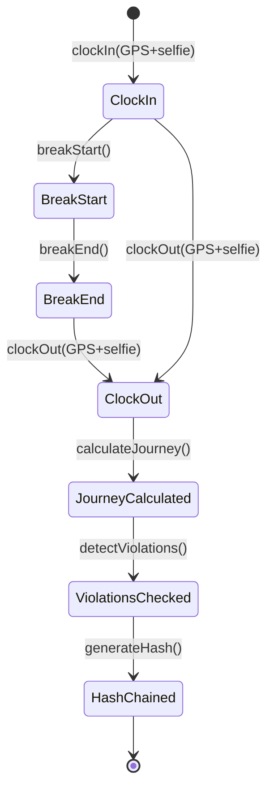
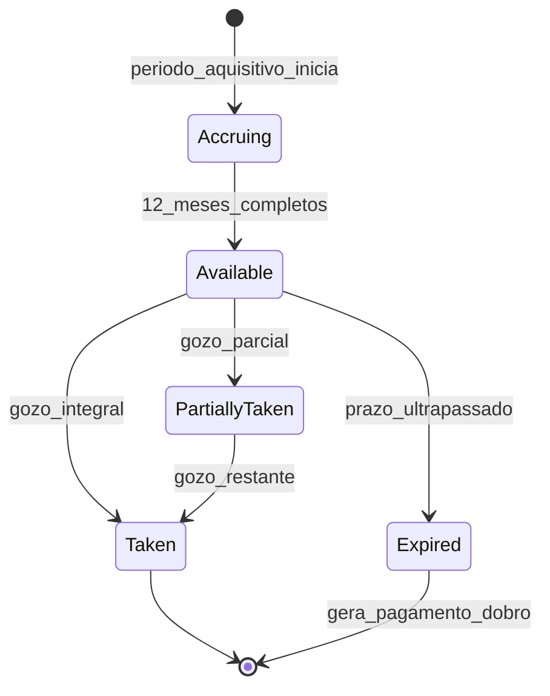
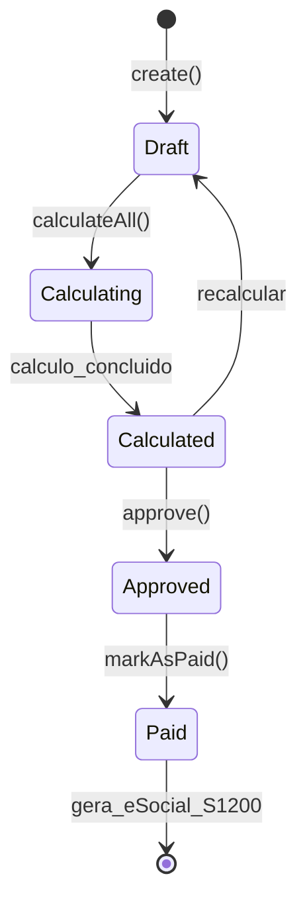
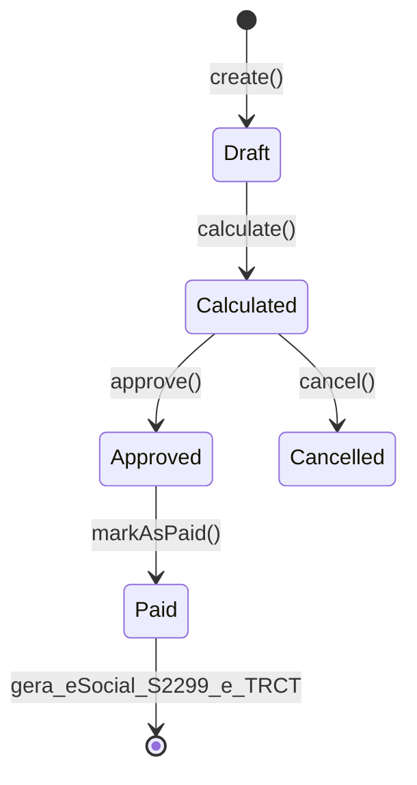
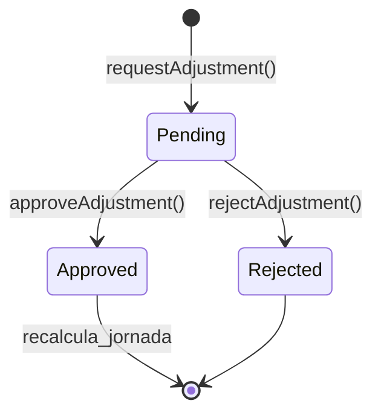
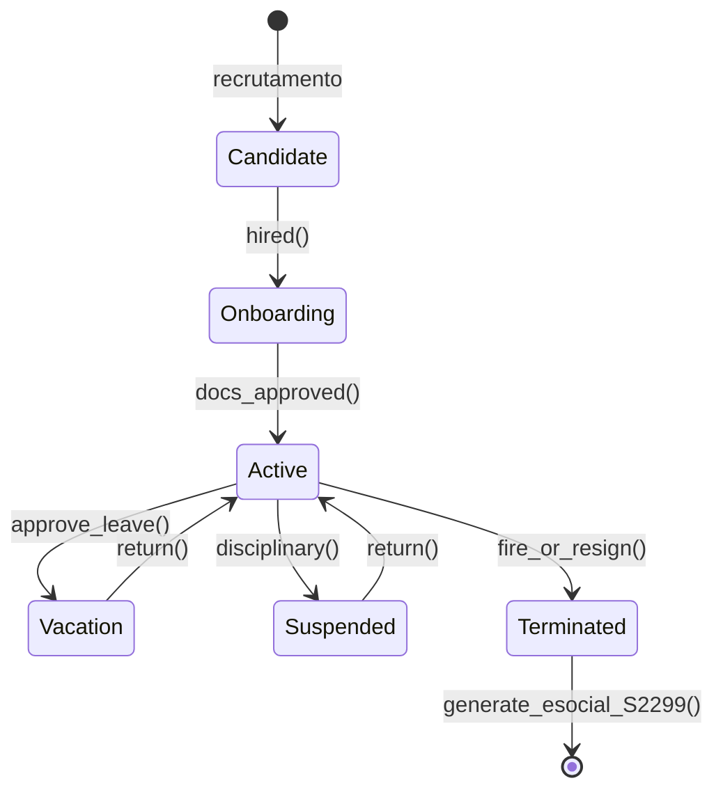
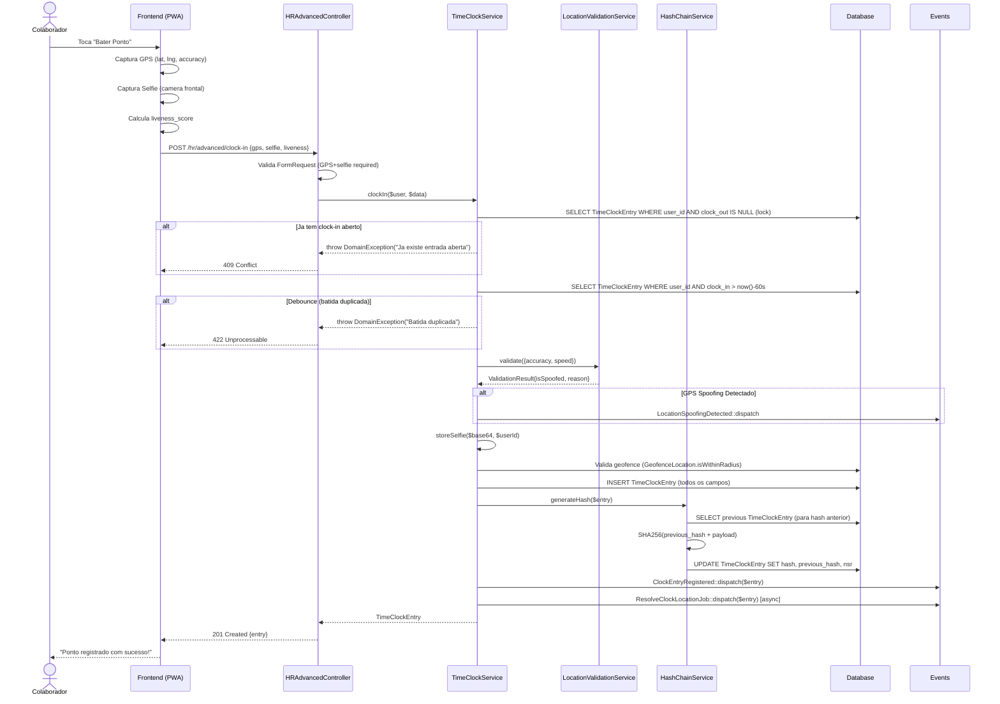
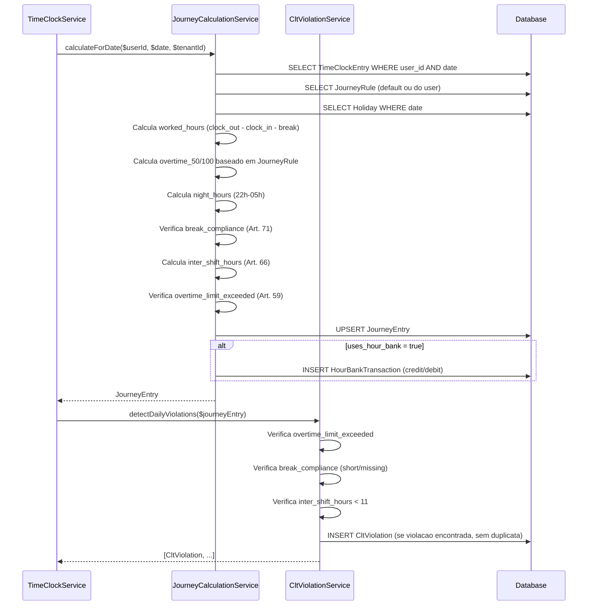
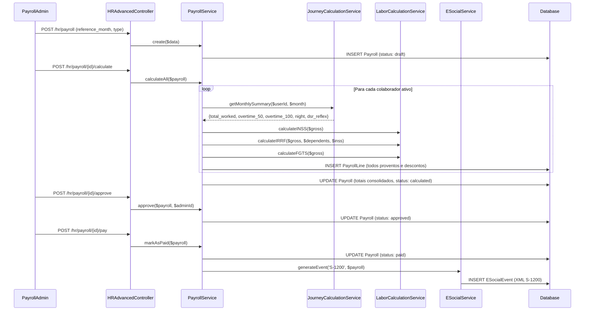

# Modulo: HR (Recursos Humanos)

> Modulo completo de gestao de pessoas: ponto digital (REP-P Portaria 671/2021), jornada, ferias, folha de pagamento, rescisao, beneficios, banco de horas, violacoes CLT, eSocial e espelho de ponto.
> **[COMPLIANCE]** Ver documentação de conformidade legal: [Portaria 671](../compliance/PORTARIA-671.md)

---

## 1. Visao Geral

O modulo HR do Kalibrium ERP implementa o ciclo completo de gestao de colaboradores, desde a admissao ate a rescisao, com conformidade total a legislacao trabalhista brasileira (CLT, Portaria 671/2021, eSocial).

### 1.1 Responsabilidades do Modulo

- Registro de ponto digital com GPS + selfie via Web e App nativo (REP-P nativo)
- Gestão de múltiplos tipos de contrato: CLT, Menor Aprendiz, Estagiário e Terceirizados (BPO/PJ)
- Calculo automatico de jornada, horas extras, adicional noturno e banco de horas
- Deteccao automatica de violacoes CLT e bloqueios operacionais preventivos
- Conformidade estrita com SST (Saúde e Segurança do Trabalho) e eSocial (S-2210, S-2220, S-2240)
- Gestão de ferias proporcionais, coletivas e recesso de estagiário
- Rescisao contratual completa (TRCT) e encerramento de vínculo
- Aplicação ativa da regra de negócio corporativa "Eternal Lead"
- Espelho de ponto imutável com assinatura digital
- AFD (Arquivo Fonte de Dados) criptografado com hash chain SHA-256

### 1.2 Services Principais

| Service | Responsabilidade |
|---------|-----------------|
| `TimeClockService` | Clock-in/out, GPS+selfie, geofencing, hash chain, ajustes |
| `JourneyCalculationService` | Calculo de jornada, HE 50%/100%, noturno, DSR reflexo |
| `CltViolationService` | Deteccao de violacoes CLT (interjornada, intrajornada, HE) |
| `LocationValidationService` | Validacao de geolocation, Haversine, anti-spoofing |
| `HashChainService` | Hash chain SHA-256 para integridade do ponto (Portaria 671) |
| `AFDExportService` | Exportacao AFD com layout MTE oficial |
| `PayrollService` | Calculo de folha, 13o, ferias, INSS, IRRF, FGTS |
| `VacationCalculationService` | Calculo de ferias CLT Arts. 130-145, abono pecuniario |
| `RescissionService` | Calculo de rescisao (TRCT), verbas rescisorias |
| `LaborCalculationService` | Tabelas INSS/IRRF, calculo de encargos |
| `ESocialService` | Geracao de eventos eSocial (XML), transmissao, lote |
| `ClockComprovanteService` | Geracao do comprovante de batida (dados do empregado, NSR, horarios, local) |
| `EspelhoPontoService` | Geracao do espelho de ponto mensal com totais, jornadas, banco de horas |
| `HourBankExpiryService` | Expiracao de banco de horas (Art. 59 §5/§2/§6 CLT), payout automatico |
| `PayslipPdfService` | Geracao de holerite em HTML/PDF (dompdf) com proventos e descontos |
| `ReverseGeocodingService` | Conversao de GPS para endereco via Nominatim (OpenStreetMap), com cache |
| `TimeClockService` | Clock-in/out, GPS+selfie, geofencing, hash chain, debounce, ajustes |

---

## 2. Entidades (Models)

### 2.0 `EmploymentContract` — Contrato de Trabalho

> **[AI_RULE_CRITICAL] Eternal Lead**: Todo colaborador mantem um registro perene (`user_id`). Demitido, muda o status. Readmitido ou convertido a terceirizado, mantém-se o rastro.

| Campo | Tipo | Descricao |
|-------|------|-----------|
| `id` | bigint PK | Identificador unico |
| `tenant_id` | bigint FK | Tenant |
| `user_id` | bigint FK | Colaborador (Lead Eterno) |
| `contract_type` | enum | `clt`, `apprentice` (Menor Aprendiz), `intern` (Estagiario), `third_party` (Terceirizado/PJ) |
| `start_date` | date | Inicio do contrato |
| `end_date` | date | Fim previsto (para estagio/aprendiz/temporario) |
| `salary` | decimal(10,2) | Salario base ou bolsa auxilio |
| `work_schedule_id` | bigint FK | Jornada padrao vinculada |
| `third_party_company` | string | CNPJ/Nome da empresa interposta (terceirizados) |
| `status` | string | `active`, `suspended`, `terminated` |

---

### 2.1 `TimeClockEntry` — Batida de Ponto (Web/App)

> **[AI_RULE_CRITICAL]** Usa trait `Immutable`. NUNCA pode ser editado ou excluido. Ajustes via `TimeClockAdjustment`.

| Campo | Tipo | Descricao |
|-------|------|-----------|
| `id` | bigint PK | Identificador unico |
| `tenant_id` | bigint FK | Tenant (multi-tenant) |
| `user_id` | bigint FK | Colaborador |
| `clock_in` | datetime | Hora de entrada |
| `clock_out` | datetime | Hora de saida |
| `break_start` | datetime | Inicio do intervalo |
| `break_end` | datetime | Fim do intervalo |
| `latitude_in` | decimal(10,7) | Latitude GPS entrada |
| `longitude_in` | decimal(10,7) | Longitude GPS entrada |
| `latitude_out` | decimal(10,7) | Latitude GPS saida |
| `longitude_out` | decimal(10,7) | Longitude GPS saida |
| `selfie_path` | string | Caminho da selfie (storage) |
| `liveness_score` | decimal | Score de liveness (0-1) |
| `liveness_passed` | boolean | Se passou no liveness check |
| `geofence_location_id` | bigint FK | Local de geofence vinculado |
| `geofence_distance_meters` | decimal | Distancia do geofence em metros |
| `type` | string | Tipo: `regular`, `overtime`, `on_call` |
| `clock_method` | string | Metodo: `selfie`, `auto_os`, `manual` |
| `device_info` | string | User-agent do dispositivo |
| `ip_address` | string | IP do dispositivo |
| `nsr` | integer | Numero Sequencial de Registro (Portaria 671) |
| `hash` | string | Hash SHA-256 encadeado |
| `previous_hash` | string | Hash da entrada anterior (chain) |
| `work_order_id` | bigint FK | OS vinculada (clock via OS) |
| `accuracy_in` | decimal(10,2) | Precisao GPS entrada (metros) |
| `accuracy_out` | decimal(10,2) | Precisao GPS saida (metros) |
| `accuracy_break` | decimal(10,2) | Precisao GPS intervalo |
| `address_in` | string | Endereco reverso GPS entrada |
| `address_out` | string | Endereco reverso GPS saida |
| `address_break` | string | Endereco reverso GPS intervalo |
| `altitude_in` | decimal(10,2) | Altitude GPS entrada |
| `altitude_out` | decimal(10,2) | Altitude GPS saida |
| `speed_in` | decimal | Velocidade GPS entrada |
| `location_spoofing_detected` | boolean | Flag de GPS spoofing detectado |
| `employee_confirmation_hash` | string | Hash de confirmacao do espelho |
| `confirmed_at` | datetime | Quando o colaborador confirmou |
| `confirmation_method` | string | Metodo de confirmacao |
| `notes` | text | Observacoes |

**Relationships:**

- `belongsTo(User)` — colaborador
- `hasMany(TimeClockAdjustment)` — ajustes vinculados

**Traits:** `BelongsToTenant`, `HasFactory`, `Immutable`

---

### 2.2 `TimeClockAdjustment` — Ajuste de Ponto

| Campo | Tipo | Descricao |
|-------|------|-----------|
| `id` | bigint PK | Identificador unico |
| `tenant_id` | bigint FK | Tenant |
| `time_clock_entry_id` | bigint FK | Batida original referenciada |
| `requested_by` | bigint FK | Quem solicitou o ajuste |
| `approved_by` | bigint FK | Quem aprovou/rejeitou |
| `original_clock_in` | datetime | Clock-in original (snapshot) |
| `original_clock_out` | datetime | Clock-out original (snapshot) |
| `adjusted_clock_in` | datetime | Novo clock-in proposto |
| `adjusted_clock_out` | datetime | Novo clock-out proposto |
| `reason` | enum | Motivo: `forgot_to_clock`, `system_error`, `wrong_entry`, `other` |
| `status` | string | Status: `pending`, `approved`, `rejected` |
| `justification` | text | Justificativa textual obrigatoria |

**Relationships:**

- `belongsTo(TimeClockEntry)` — batida original
- `belongsTo(User, 'requested_by')` — solicitante
- `belongsTo(User, 'approved_by')` — aprovador

---

### 2.3 `JourneyEntry` — Registro de Jornada Diaria

| Campo | Tipo | Descricao |
|-------|------|-----------|
| `id` | bigint PK | Identificador unico |
| `tenant_id` | bigint FK | Tenant |
| `user_id` | bigint FK | Colaborador |
| `date` | date | Data da jornada |
| `journey_rule_id` | bigint FK | Regra de jornada aplicada |
| `scheduled_hours` | decimal(5,2) | Horas previstas na escala |
| `worked_hours` | decimal(5,2) | Horas efetivamente trabalhadas |
| `overtime_hours_50` | decimal(5,2) | Horas extras 50% (dia util) |
| `overtime_hours_100` | decimal(5,2) | Horas extras 100% (domingo/feriado) |
| `night_hours` | decimal(5,2) | Horas noturnas (22h-05h) |
| `absence_hours` | decimal(5,2) | Horas de ausencia |
| `hour_bank_balance` | decimal(8,2) | Saldo do banco de horas apos este dia |
| `overtime_limit_exceeded` | boolean | Art. 59 CLT: excedeu 2h extras |
| `tolerance_applied` | boolean | Tolerancia de 5/10 min aplicada |
| `break_compliance` | string | Status intervalo: `compliant`, `short_break`, `missing_break` |
| `inter_shift_hours` | decimal(5,2) | Horas entre jornadas (interjornada) |
| `is_holiday` | boolean | Se e feriado |
| `is_dsr` | boolean | Se e dia de DSR (domingo) |
| `status` | string | Status: `open`, `locked` |
| `notes` | text | Observacoes |

**Relationships:**

- `belongsTo(User)` — colaborador
- `belongsTo(JourneyRule)` — regra de jornada

**Computed:**

- `total_overtime` (accessor) — soma de `overtime_hours_50 + overtime_hours_100`

---

### 2.4 `JourneyRule` — Regra de Jornada

| Campo | Tipo | Descricao |
|-------|------|-----------|
| `id` | bigint PK | Identificador unico |
| `tenant_id` | bigint FK | Tenant |
| `name` | string | Nome da regra (ex: "CLT 44h", "12x36") |
| `daily_hours` | decimal(4,2) | Horas diarias contratuais |
| `weekly_hours` | decimal(5,2) | Horas semanais contratuais |
| `overtime_weekday_pct` | integer | % hora extra dia util (padrao: 50) |
| `overtime_weekend_pct` | integer | % hora extra fim de semana (padrao: 100) |
| `overtime_holiday_pct` | integer | % hora extra feriado (padrao: 100) |
| `night_shift_pct` | integer | % adicional noturno (padrao: 20) |
| `night_start` | time | Inicio periodo noturno (padrao: 22:00) |
| `night_end` | time | Fim periodo noturno (padrao: 05:00) |
| `uses_hour_bank` | boolean | Se usa banco de horas |
| `hour_bank_expiry_months` | integer | Meses para expirar banco de horas |
| `agreement_type` | string | Tipo de acordo (individual, coletivo) |
| `is_default` | boolean | Se e a regra padrao do tenant |
| `allow_negative_hour_bank_deduction` | boolean | Permite saldo negativo no banco |

**Scopes:** `scopeDefault` — filtra regra padrao

---

### 2.5 `VacationBalance` — Saldo de Ferias

| Campo | Tipo | Descricao |
|-------|------|-----------|
| `id` | bigint PK | Identificador unico |
| `tenant_id` | bigint FK | Tenant |
| `user_id` | bigint FK | Colaborador |
| `acquisition_start` | date | Inicio do periodo aquisitivo |
| `acquisition_end` | date | Fim do periodo aquisitivo |
| `total_days` | integer | Total de dias de direito (padrao: 30) |
| `taken_days` | integer | Dias ja gozados |
| `sold_days` | integer | Dias vendidos (abono pecuniario) |
| `remaining_days` | integer | Dias restantes |
| `deadline` | date | Prazo limite para gozo |
| `status` | string | Status: `accruing`, `available`, `partially_taken`, `taken`, `expired` |

---

### 2.6 `Payroll` — Folha de Pagamento

| Campo | Tipo | Descricao |
|-------|------|-----------|
| `id` | bigint PK | Identificador unico |
| `tenant_id` | bigint FK | Tenant |
| `reference_month` | string | Mes referencia (YYYY-MM) |
| `type` | string | Tipo: `regular`, `thirteenth`, `vacation`, `rescission` |
| `status` | string | Status: `draft`, `calculating`, `calculated`, `approved`, `paid` |
| `total_gross` | decimal(12,2) | Total bruto |
| `total_deductions` | decimal(12,2) | Total descontos |
| `total_net` | decimal(12,2) | Total liquido |
| `total_fgts` | decimal(12,2) | Total FGTS |
| `total_inss_employer` | decimal(12,2) | Total INSS patronal |
| `employee_count` | integer | Quantidade de colaboradores |
| `calculated_by` | bigint FK | Quem calculou |
| `approved_by` | bigint FK | Quem aprovou |
| `calculated_at` | datetime | Quando foi calculada |
| `approved_at` | datetime | Quando foi aprovada |
| `paid_at` | datetime | Quando foi paga |
| `notes` | text | Observacoes |

**Relationships:**

- `hasMany(PayrollLine)` — linhas da folha por colaborador
- `hasMany(HourBankTransaction, 'payout_payroll_id')` — pagamentos de banco de horas
- `hasMany(Expense)` — despesas geradas
- `belongsTo(User, 'calculated_by')` — calculador
- `belongsTo(User, 'approved_by')` — aprovador

**Scopes:** `scopeForMonth($month)`

---

### 2.7 `PayrollLine` — Linha da Folha (por Colaborador)

| Campo | Tipo | Descricao |
|-------|------|-----------|
| `id` | bigint PK | Identificador unico |
| `payroll_id` | bigint FK | Folha pai |
| `user_id` | bigint FK | Colaborador |
| `tenant_id` | bigint FK | Tenant |
| `base_salary` | decimal(10,2) | Salario base |
| `gross_salary` | decimal(10,2) | Salario bruto |
| `net_salary` | decimal(10,2) | Salario liquido |
| `overtime_50_hours` | decimal(5,2) | Horas extras 50% |
| `overtime_50_value` | decimal(10,2) | Valor HE 50% |
| `overtime_100_hours` | decimal(5,2) | Horas extras 100% |
| `overtime_100_value` | decimal(10,2) | Valor HE 100% |
| `night_hours` | decimal(5,2) | Horas noturnas |
| `night_shift_value` | decimal(10,2) | Valor adicional noturno |
| `dsr_value` | decimal(10,2) | Valor DSR reflexo |
| `commission_value` | decimal(10,2) | Valor comissoes |
| `bonus_value` | decimal(10,2) | Valor bonus |
| `other_earnings` | decimal(10,2) | Outros proventos |
| `inss_employee` | decimal(10,2) | Desconto INSS empregado |
| `irrf` | decimal(10,2) | Desconto IRRF |
| `fgts_value` | decimal(10,2) | Valor FGTS (8%) |
| `inss_employer_value` | decimal(10,2) | INSS patronal (20%) |
| `transportation_discount` | decimal(10,2) | Desconto vale-transporte |
| `meal_discount` | decimal(10,2) | Desconto vale-refeicao |
| `health_insurance_discount` | decimal(10,2) | Desconto plano de saude |
| `other_deductions` | decimal(10,2) | Outros descontos |
| `advance_discount` | decimal(10,2) | Desconto de adiantamento |
| `worked_days` | integer | Dias trabalhados |
| `absence_days` | integer | Dias de ausencia |
| `absence_value` | decimal(10,2) | Valor descontado por ausencia |
| `vacation_days` | integer | Dias de ferias (se folha de ferias) |
| `vacation_value` | decimal(10,2) | Valor ferias |
| `vacation_bonus` | decimal(10,2) | 1/3 constitucional |
| `thirteenth_value` | decimal(10,2) | Valor 13o salario |
| `thirteenth_months` | integer | Meses proporcionais do 13o |
| `hour_bank_payout_hours` | decimal(5,2) | Horas pagas do banco |
| `hour_bank_payout_value` | decimal(10,2) | Valor pago do banco |
| `vt_deduction` | decimal(10,2) | Desconto VT (6% do salario) |
| `vr_deduction` | decimal(10,2) | Desconto VR |
| `status` | string | Status da linha |
| `notes` | text | Observacoes |

**Relationships:**

- `belongsTo(Payroll)` — folha pai
- `belongsTo(User)` — colaborador
- `hasOne(Payslip)` — holerite gerado
- `hasOne(Expense)` — despesa gerada

**Computed Accessors:**

- `total_earnings` — soma de todos os proventos
- `total_deductions` — soma de todos os descontos

---

### 2.8 `Rescission` — Rescisao Contratual (TRCT)

| Campo | Tipo | Descricao |
|-------|------|-----------|
| `id` | bigint PK | Identificador unico |
| `tenant_id` | bigint FK | Tenant |
| `user_id` | bigint FK | Colaborador |
| `type` | enum | Tipo rescisao (ver constantes abaixo) |
| `notice_date` | date | Data do aviso previo |
| `termination_date` | date | Data do desligamento |
| `last_work_day` | date | Ultimo dia de trabalho |
| `notice_type` | enum | Tipo aviso: `worked`, `indemnified`, `waived` |
| `notice_days` | integer | Dias de aviso previo |
| `notice_value` | decimal(10,2) | Valor do aviso previo |
| `salary_balance_days` | integer | Dias de saldo de salario |
| `salary_balance_value` | decimal(10,2) | Valor saldo de salario |
| `vacation_proportional_days` | integer | Dias ferias proporcionais |
| `vacation_proportional_value` | decimal(10,2) | Valor ferias proporcionais |
| `vacation_bonus_value` | decimal(10,2) | 1/3 sobre ferias proporcionais |
| `vacation_overdue_days` | integer | Dias ferias vencidas |
| `vacation_overdue_value` | decimal(10,2) | Valor ferias vencidas |
| `vacation_overdue_bonus_value` | decimal(10,2) | 1/3 sobre ferias vencidas |
| `thirteenth_proportional_months` | integer | Meses do 13o proporcional |
| `thirteenth_proportional_value` | decimal(10,2) | Valor 13o proporcional |
| `fgts_balance` | decimal(12,2) | Saldo FGTS acumulado |
| `fgts_penalty_value` | decimal(12,2) | Multa FGTS |
| `fgts_penalty_rate` | decimal(4,2) | Taxa multa FGTS (40% ou 20%) |
| `advance_deductions` | decimal(10,2) | Desconto de adiantamentos |
| `hour_bank_payout` | decimal(10,2) | Pagamento banco de horas |
| `other_earnings` | decimal(10,2) | Outros proventos |
| `other_deductions` | decimal(10,2) | Outros descontos |
| `inss_deduction` | decimal(10,2) | Desconto INSS |
| `irrf_deduction` | decimal(10,2) | Desconto IRRF |
| `total_gross` | decimal(12,2) | Total bruto |
| `total_deductions` | decimal(12,2) | Total descontos |
| `total_net` | decimal(12,2) | Valor liquido final |
| `status` | enum | Status: `draft`, `calculated`, `approved`, `paid`, `cancelled` |
| `calculated_by` | bigint FK | Quem calculou |
| `approved_by` | bigint FK | Quem aprovou |
| `calculated_at` | datetime | Quando foi calculada |
| `approved_at` | datetime | Quando foi aprovada |
| `paid_at` | datetime | Quando foi paga |
| `trct_file_path` | string | Caminho do TRCT em PDF |
| `notes` | text | Observacoes |

**Constantes de Tipo:**

```php
TYPE_SEM_JUSTA_CAUSA    = 'sem_justa_causa'    // Demissao sem Justa Causa
TYPE_JUSTA_CAUSA        = 'justa_causa'        // Demissao por Justa Causa
TYPE_PEDIDO_DEMISSAO    = 'pedido_demissao'    // Pedido de Demissao
TYPE_ACORDO_MUTUO       = 'acordo_mutuo'       // Acordo Mutuo (Reforma Trabalhista)
TYPE_TERMINO_CONTRATO   = 'termino_contrato'   // Termino de Contrato
```

**Constantes de Aviso Previo:**

```php
NOTICE_WORKED      = 'worked'       // Trabalhado
NOTICE_INDEMNIFIED = 'indemnified'  // Indenizado
NOTICE_WAIVED      = 'waived'       // Dispensado
```

**Relationships:**

- `belongsTo(User)` — colaborador
- `belongsTo(User, 'calculated_by')` — calculador
- `belongsTo(User, 'approved_by')` — aprovador

---

### 2.9 `CltViolation` — Violacao Trabalhista

| Campo | Tipo | Descricao |
|-------|------|-----------|
| `id` | bigint PK | Identificador unico |
| `tenant_id` | bigint FK | Tenant |
| `user_id` | bigint FK | Colaborador |
| `date` | date | Data da violacao |
| `violation_type` | string | Tipo (ver tabela abaixo) |
| `severity` | string | Severidade: `low`, `medium`, `high`, `critical` |
| `description` | string | Descricao legivel da violacao |
| `resolved` | boolean | Se foi resolvida |
| `resolved_at` | datetime | Quando foi resolvida |
| `resolved_by` | bigint FK | Quem resolveu |
| `metadata` | json | Dados adicionais (horas extras, etc) |

**Tipos de Violacao:**

| Tipo | Artigo CLT | Descricao |
|------|-----------|-----------|
| `overtime_limit_exceeded` | Art. 59 | Horas extras excedem 2h/dia |
| `intra_shift_short` | Art. 71 | Intervalo intrajornada curto |
| `intra_shift_missing` | Art. 71 | Intervalo intrajornada ausente |
| `inter_shift_short` | Art. 66 | Interjornada inferior a 11h |
| `night_irregular` | Art. 73 | Trabalho noturno sem adicional |
| `minor_overtime` | Art. 413 | Hora extra para menor de idade |

**Relationships:**

- `belongsTo(User)` — colaborador violado
- `belongsTo(User, 'resolved_by')` — quem resolveu

---

### 2.10 `HourBankTransaction` — Movimentacao Banco de Horas

| Campo | Tipo | Descricao |
|-------|------|-----------|
| `id` | bigint PK | Identificador unico |
| `tenant_id` | bigint FK | Tenant |
| `user_id` | bigint FK | Colaborador |
| `journey_entry_id` | bigint FK | Jornada que gerou a movimentacao |
| `type` | string | Tipo: `credit`, `debit`, `expiry`, `payout` |
| `hours` | decimal(8,2) | Horas da movimentacao |
| `balance_before` | decimal(8,2) | Saldo antes |
| `balance_after` | decimal(8,2) | Saldo depois |
| `reference_date` | date | Data de referencia |
| `expired_at` | datetime | Data de expiracao (se type=expiry) |
| `payout_payroll_id` | bigint FK | Folha do pagamento (se type=payout) |
| `notes` | text | Observacoes |

**Relationships:**

- `belongsTo(User)` — colaborador
- `belongsTo(JourneyEntry)` — jornada vinculada
- `belongsTo(Payroll, 'payout_payroll_id')` — folha de pagamento

**Scopes:** `scopeForUser($userId)`, `scopeOfType($type)`, `scopeExpiries`

---

### 2.11 `EmployeeBenefit` — Beneficio do Colaborador

| Campo | Tipo | Descricao |
|-------|------|-----------|
| `id` | bigint PK | Identificador unico |
| `tenant_id` | bigint FK | Tenant |
| `user_id` | bigint FK | Colaborador |
| `type` | string | Tipo: `vt`, `vr`, `va`, `health`, `dental`, `life_insurance`, `other` |
| `provider` | string | Operadora/fornecedor |
| `plan_name` | string | Nome do plano |
| `employee_cost` | decimal(10,2) | Custo para o colaborador |
| `employer_cost` | decimal(10,2) | Custo para a empresa |
| `start_date` | date | Data de inicio |
| `end_date` | date | Data de fim |
| `is_active` | boolean | Se esta ativo |

---

### 2.12 `EmployeeDependent` — Dependente do Colaborador

| Campo | Tipo | Descricao |
|-------|------|-----------|
| `id` | bigint PK | Identificador unico |
| `tenant_id` | bigint FK | Tenant |
| `user_id` | bigint FK | Colaborador |
| `name` | string | Nome do dependente |
| `relationship` | string | Parentesco: `spouse`, `child`, `parent`, `other` |
| `birth_date` | date | Data de nascimento |
| `cpf` | string | CPF do dependente |
| `is_irrf_dependent` | boolean | Se e dependente para IRRF |
| `is_health_plan` | boolean | Se esta no plano de saude |

---

### 2.13 `EmployeeDocument` — Documento do Colaborador

| Campo | Tipo | Descricao |
|-------|------|-----------|
| `id` | bigint PK | Identificador unico |
| `tenant_id` | bigint FK | Tenant |
| `user_id` | bigint FK | Colaborador |
| `type` | string | Tipo: `rg`, `cpf`, `ctps`, `pis`, `titulo_eleitor`, `reservista`, `cnh`, `certidao`, `comprovante_endereco`, `foto`, `other` |
| `file_path` | string | Caminho do arquivo |
| `status` | string | Status: `pending`, `approved`, `rejected` |
| `notes` | text | Observacoes |

---

### 2.14 `TimeClockAuditLog` — Log de Auditoria do Ponto

| Campo | Tipo | Descricao |
|-------|------|-----------|
| `id` | bigint PK | Identificador unico |
| `tenant_id` | bigint FK | Tenant |
| `time_clock_entry_id` | bigint FK | Batida referenciada |
| `action` | string | Acao: `created`, `adjusted`, `flagged`, `confirmed` |
| `performed_by` | bigint FK | Quem realizou a acao |
| `details` | json | Detalhes da acao |

---

### 2.15 `ESocialCertificate` — Certificado Digital A1

| Campo | Tipo | Descricao |
|-------|------|-----------|
| `id` | bigint PK | Identificador unico |
| `tenant_id` | bigint FK | Tenant |
| `name` | string | Nome do certificado |
| `pfx_path` | string | Caminho do arquivo PFX |
| `password` | string (encrypted) | Senha do certificado |
| `valid_from` | date | Data inicio validade |
| `valid_until` | date | Data fim validade |
| `is_active` | boolean | Se e o certificado ativo |

---

### 2.16 `ESocialEvent` — Evento eSocial

Veja detalhes completos em `docs/modules/ESocial.md`.

---

### 2.17 `ESocialRubric` — Rubrica eSocial

| Campo | Tipo | Descricao |
|-------|------|-----------|
| `id` | bigint PK | Identificador unico |
| `tenant_id` | bigint FK | Tenant |
| `code` | string | Codigo da rubrica |
| `name` | string | Nome da rubrica |
| `type` | string | Tipo: `provento`, `desconto`, `informativo` |
| `nature_code` | string | Codigo natureza eSocial |
| `incidence_inss` | boolean | Incide INSS |
| `incidence_irrf` | boolean | Incide IRRF |
| `incidence_fgts` | boolean | Incide FGTS |

---

### 2.18 `Payslip` — Holerite

| Campo | Tipo | Descricao |
|-------|------|-----------|
| `id` | bigint PK | Identificador unico |
| `payroll_line_id` | bigint FK | Linha da folha vinculada |
| `user_id` | bigint FK | Colaborador |
| `tenant_id` | bigint FK | Tenant |
| `reference_month` | string | Mes referencia (YYYY-MM) |
| `file_path` | string | Caminho do PDF do holerite |
| `sent_at` | datetime | Quando foi enviado ao colaborador |
| `viewed_at` | datetime | Quando o colaborador visualizou |
| `digital_signature_hash` | string | Hash de assinatura digital |

**Relationships:**

- `belongsTo(PayrollLine)` — linha da folha
- `belongsTo(User)` — colaborador

**Traits:** `BelongsToTenant`

---

### 2.19 `Holiday` — Feriado

| Campo | Tipo | Descricao |
|-------|------|-----------|
| `id` | bigint PK | Identificador unico |
| `tenant_id` | bigint FK | Tenant |
| `name` | string | Nome do feriado |
| `date` | date | Data do feriado |
| `is_national` | boolean | Se e feriado nacional |
| `is_recurring` | boolean | Se repete todo ano |

**Traits:** `BelongsToTenant`

---

### 2.20 `TenantHoliday` — Feriado Customizado do Tenant

| Campo | Tipo | Descricao |
|-------|------|-----------|
| `id` | bigint PK | Identificador unico |
| `tenant_id` | bigint FK | Tenant |
| `date` | date | Data do feriado |
| `name` | string | Nome do feriado customizado |

---

### 2.20.1 `SstExam` — Atestado de Saúde Ocupacional (ASO)

> **[AI_RULE]** Gera evento eSocial S-2220.

| Campo | Tipo | Descricao |
|-------|------|-----------|
| `id` | bigint PK | Identificador unico |
| `tenant_id` | bigint FK | Tenant |
| `user_id` | bigint FK | Colaborador |
| `exam_type` | enum | `admissional`, `periodico`, `retorno`, `mudanca_risco`, `demissional` |
| `date` | date | Data do exame |
| `doctor_name` | string | Nome do medico examinador |
| `crm` | string | CRM do medico com UF |
| `result` | enum | `apto`, `inapto` |
| `esocial_event_id` | bigint FK | Evento S-2220 gerado |

---

### 2.20.2 `SstAccident` — Comunicação de Acidente de Trabalho (CAT)

> **[AI_RULE]** Gera evento eSocial S-2210.

| Campo | Tipo | Descricao |
|-------|------|-----------|
| `id` | bigint PK | Identificador unico |
| `tenant_id` | bigint FK | Tenant |
| `user_id` | bigint FK | Colaborador acidentado |
| `date` | datetime | Data e hora do acidente |
| `type` | enum | `tipico`, `trajeto`, `doenca_ocupacional` |
| `description` | text | Descricao detalhada do acidente e partes atingidas |
| `has_police_report` | boolean | Boletim de ocorrencia registrado? |
| `esocial_event_id` | bigint FK | Evento S-2210 gerado |

---

### 2.21 `Department` — Departamento

| Campo | Tipo | Descricao |
|-------|------|-----------|
| `id` | bigint PK | Identificador unico |
| `tenant_id` | bigint FK | Tenant |
| `name` | string | Nome do departamento |
| `parent_id` | bigint FK | Departamento pai (hierarquia) |
| `manager_id` | bigint FK | Gestor do departamento |
| `cost_center` | string | Centro de custo |
| `is_active` | boolean | Se esta ativo |

**Relationships:**

- `belongsTo(Department, 'parent_id')` — departamento pai
- `hasMany(Department, 'parent_id')` — subdepartamentos
- `belongsTo(User, 'manager_id')` — gestor

**Traits:** `BelongsToTenant`, `HasFactory`

---

### 2.22 `Skill` — Competencia

| Campo | Tipo | Descricao |
|-------|------|-----------|
| `id` | bigint PK | Identificador unico |
| `tenant_id` | bigint FK | Tenant |
| `name` | string | Nome da competencia |
| `category` | string | Categoria |
| `description` | string | Descricao |

**Relationships:**

- `hasMany(SkillRequirement)` — requisitos de cargo
- `hasMany(UserSkill)` — avaliacoes de usuarios
- `belongsToMany(Service, 'service_skills')` — servicos vinculados

**Traits:** `BelongsToTenant`, `HasFactory`

---

### 2.23 `SkillRequirement` — Requisito de Competencia por Cargo

| Campo | Tipo | Descricao |
|-------|------|-----------|
| `id` | bigint PK | Identificador unico |
| `tenant_id` | bigint FK | Tenant |
| `position_id` | bigint FK | Cargo |
| `skill_id` | bigint FK | Competencia |
| `required_level` | integer | Nivel exigido |

**Relationships:**

- `belongsTo(Position)` — cargo
- `belongsTo(Skill)` — competencia

**Traits:** `BelongsToTenant`, `HasFactory`

---

### 2.24 `UserSkill` — Competencia do Colaborador

| Campo | Tipo | Descricao |
|-------|------|-----------|
| `id` | bigint PK | Identificador unico |
| `tenant_id` | bigint FK | Tenant |
| `user_id` | bigint FK | Colaborador |
| `skill_id` | bigint FK | Competencia |
| `current_level` | integer | Nivel atual |
| `assessed_at` | date | Data da avaliacao |
| `assessed_by` | bigint FK | Quem avaliou |

**Relationships:**

- `belongsTo(User)` — colaborador
- `belongsTo(Skill)` — competencia
- `belongsTo(User, 'assessed_by')` — avaliador

**Traits:** `BelongsToTenant`, `HasFactory`

---

### 2.25 `TechnicianSkill` — Competencia Tecnica (Tecnico de Campo)

| Campo | Tipo | Descricao |
|-------|------|-----------|
| `id` | bigint PK | Identificador unico |
| `tenant_id` | bigint FK | Tenant |
| `user_id` | bigint FK | Tecnico |
| `skill_name` | string | Nome da competencia |
| `category` | string | Categoria: `equipment_type`, `service_type`, `brand`, `certification`, `general` |
| `proficiency_level` | integer | Nivel: 1 (Basico) a 5 (Master) |
| `certification` | string | Certificacao |
| `certified_at` | date | Data da certificacao |
| `expires_at` | date | Data de expiracao |

**Constantes:**

```php
CATEGORIES = ['equipment_type', 'service_type', 'brand', 'certification', 'general']
LEVELS = [1 => 'Basico', 2 => 'Intermediario', 3 => 'Avancado', 4 => 'Especialista', 5 => 'Master']
```

**Relationships:**

- `belongsTo(User)` — tecnico

**Traits:** `BelongsToTenant`, `Auditable`

---

### 2.26 `OnboardingTemplate` — Template de Onboarding

| Campo | Tipo | Descricao |
|-------|------|-----------|
| `id` | bigint PK | Identificador unico |
| `tenant_id` | bigint FK | Tenant |
| `name` | string | Nome do template |
| `type` | string | Tipo de onboarding |
| `default_tasks` | json | Tarefas padrao do template |
| `is_active` | boolean | Se esta ativo |

**Relationships:**

- `hasMany(OnboardingChecklist)` — checklists gerados a partir deste template

**Scopes:** `scopeActive` — filtra templates ativos

**Traits:** `BelongsToTenant`, `HasFactory`

---

### 2.27 `OnboardingChecklist` — Checklist de Onboarding

| Campo | Tipo | Descricao |
|-------|------|-----------|
| `id` | bigint PK | Identificador unico |
| `tenant_id` | bigint FK | Tenant |
| `user_id` | bigint FK | Colaborador em onboarding |
| `onboarding_template_id` | bigint FK | Template usado |
| `started_at` | datetime | Quando iniciou |
| `completed_at` | datetime | Quando completou |
| `status` | string | Status do onboarding |

**Relationships:**

- `belongsTo(User)` — colaborador
- `belongsTo(OnboardingTemplate)` — template
- `hasMany(OnboardingChecklistItem)` — itens do checklist

**Computed:** `progress` (accessor) — percentual de conclusao (0-100)

**Traits:** `BelongsToTenant`, `HasFactory`

---

### 2.28 `OnboardingChecklistItem` — Item do Checklist de Onboarding

| Campo | Tipo | Descricao |
|-------|------|-----------|
| `id` | bigint PK | Identificador unico |
| `tenant_id` | bigint FK | Tenant |
| `onboarding_checklist_id` | bigint FK | Checklist pai |
| `title` | string | Titulo da tarefa |
| `description` | string | Descricao detalhada |
| `responsible_id` | bigint FK | Responsavel pela tarefa |
| `is_completed` | boolean | Se esta completa |
| `completed_at` | datetime | Quando foi completada |
| `completed_by` | bigint FK | Quem completou |
| `order` | integer | Ordem de exibicao |

**Relationships:**

- `belongsTo(OnboardingChecklist)` — checklist pai
- `belongsTo(User, 'responsible_id')` — responsavel
- `belongsTo(User, 'completed_by')` — quem completou

**Traits:** `BelongsToTenant`, `HasFactory`

---

### 2.29 `EspelhoConfirmation` — Confirmacao do Espelho de Ponto

| Campo | Tipo | Descricao |
|-------|------|-----------|
| `id` | bigint PK | Identificador unico |
| `tenant_id` | bigint FK | Tenant |
| `user_id` | bigint FK | Colaborador |
| `year` | integer | Ano de referencia |
| `month` | integer | Mes de referencia |
| `confirmation_hash` | string | Hash de confirmacao |
| `confirmed_at` | datetime | Quando confirmou |
| `confirmation_method` | string | Metodo de confirmacao |
| `ip_address` | string | IP do dispositivo |
| `device_info` | json | Informacoes do dispositivo |
| `espelho_snapshot` | json | Snapshot completo do espelho no momento da confirmacao |

**Relationships:**

- `belongsTo(User)` — colaborador

**Traits:** `BelongsToTenant`, `HasFactory`

---

### 2.30 `Training` — Treinamento/Capacitacao

| Campo | Tipo | Descricao |
|-------|------|-----------|
| `id` | bigint PK | Identificador unico |
| `tenant_id` | bigint FK | Tenant |
| `user_id` | bigint FK | Colaborador |
| `title` | string | Titulo do treinamento |
| `institution` | string | Instituicao |
| `certificate_number` | string | Numero do certificado |
| `completion_date` | date | Data de conclusao |
| `expiry_date` | date | Data de expiracao |
| `category` | string | Categoria |
| `hours` | integer | Carga horaria |
| `status` | string | Status |
| `notes` | text | Observacoes |
| `is_mandatory` | boolean | Se e obrigatorio |
| `skill_area` | string | Area de competencia |
| `level` | string | Nivel |
| `cost` | decimal(10,2) | Custo do treinamento |
| `instructor` | string | Instrutor |

**Relationships:**

- `belongsTo(User)` — colaborador

**Computed:** `is_expired` (accessor) — se o treinamento expirou

**Traits:** `BelongsToTenant`

---

### 2.31 `LeaveRequest` — Solicitacao de Afastamento

| Campo | Tipo | Descricao |
|-------|------|-----------|
| `id` | bigint PK | Identificador unico |
| `tenant_id` | bigint FK | Tenant |
| `user_id` | bigint FK | Colaborador |
| `type` | string | Tipo: `vacation`, `medical`, `maternity`, `paternity`, `bereavement`, `other` |
| `start_date` | date | Data de inicio |
| `end_date` | date | Data de fim |
| `days_count` | integer | Quantidade de dias |
| `reason` | text | Motivo |
| `document_path` | string | Caminho do documento comprobatorio |
| `status` | string | Status: `pending`, `approved`, `rejected`, `cancelled` |
| `approved_by` | bigint FK | Quem aprovou/rejeitou |
| `approved_at` | datetime | Quando foi aprovado/rejeitado |
| `rejection_reason` | text | Motivo da rejeicao |

**Relationships:**

- `belongsTo(User)` — colaborador
- `belongsTo(User, 'approved_by')` — aprovador

**Scopes:** `scopePending`, `scopeApproved`, `scopeOverlapping($userId, $startDate, $endDate)`

**Traits:** `BelongsToTenant`, `HasFactory`

---

### 2.32 `TimeEntry` — Registro de Tempo (OS/Tecnico)

> **Nota:** Este model pertence ao dominio de Ordens de Servico, mas integra-se com HR via observer e status de tecnico.

| Campo | Tipo | Descricao |
|-------|------|-----------|
| `id` | bigint PK | Identificador unico |
| `tenant_id` | bigint FK | Tenant |
| `work_order_id` | bigint FK | Ordem de servico |
| `technician_id` | bigint FK | Tecnico |
| `schedule_id` | bigint FK | Agendamento |
| `started_at` | datetime | Inicio |
| `ended_at` | datetime | Fim |
| `duration_minutes` | integer | Duracao em minutos (calculado automaticamente) |
| `type` | string | Tipo: `work`, `travel`, `waiting` |
| `description` | text | Descricao da atividade |

**Constantes:**

```php
TYPE_WORK    = 'work'     // Trabalho
TYPE_TRAVEL  = 'travel'   // Deslocamento
TYPE_WAITING = 'waiting'  // Espera
```

**Relationships:**

- `belongsTo(WorkOrder)` — ordem de servico
- `belongsTo(User, 'technician_id')` — tecnico
- `belongsTo(Schedule)` — agendamento

**Traits:** `BelongsToTenant`, `HasFactory`, `SoftDeletes`

---

### 2.33 `GeofenceLocation` — Local de Geofence

| Campo | Tipo | Descricao |
|-------|------|-----------|
| `id` | bigint PK | Identificador unico |
| `tenant_id` | bigint FK | Tenant |
| `name` | string | Nome do local |
| `latitude` | decimal(10,7) | Latitude do centro |
| `longitude` | decimal(10,7) | Longitude do centro |
| `radius_meters` | integer | Raio em metros |
| `is_active` | boolean | Se esta ativo |
| `linked_entity_type` | string | Tipo da entidade vinculada (polymorphic) |
| `linked_entity_id` | bigint | ID da entidade vinculada |
| `notes` | text | Observacoes |

**Relationships:**

- `morphTo(linkedEntity)` — entidade vinculada (polimorfismo)

**Scopes:** `scopeActive` — filtra locais ativos

**Methods:** `distanceFrom($lat, $lng)` — calcula distancia em metros via Haversine

**Traits:** `BelongsToTenant`

---

### 2.34 `WorkSchedule` — Escala de Trabalho

| Campo | Tipo | Descricao |
|-------|------|-----------|
| `id` | bigint PK | Identificador unico |
| `tenant_id` | bigint FK | Tenant |
| `user_id` | bigint FK | Colaborador |
| `date` | date | Data da escala |
| `shift_type` | string | Tipo de turno |
| `start_time` | time | Hora de inicio |
| `end_time` | time | Hora de fim |
| `region` | string | Regiao |
| `notes` | text | Observacoes |

**Relationships:**

- `belongsTo(User)` — colaborador

**Traits:** `BelongsToTenant`

---

## 3. Maquinas de Estado

### 3.1 TimeClockEntry — Ciclo de Batida



### 3.2 VacationBalance — Ciclo de Ferias



### 3.3 Payroll — Ciclo da Folha de Pagamento



### 3.4 Rescission — Ciclo de Rescisao



### 3.5 TimeClockAdjustment — Ciclo de Ajuste



### 3.6 Colaborador — Ciclo de Vida HR



---

## 4. Regras de Negocio (Guard Rails) `[AI_RULE]`

### 4.1 Portaria 671/2021 — REP-P `[AI_RULE_CRITICAL]`

> **[AI_RULE_CRITICAL] Imutabilidade do Ponto**
> `TimeClockEntry` usa trait `Immutable`. E CRIME apagar, alterar timestamp, ou ocultar batida real. Route/Controller de exclusao/update e BANIDA. Correcoes sao feitas via `TimeClockAdjustment` com `reason` obrigatorio. Ambos registros permanecem para auditoria do Fiscal do Trabalho.

> **[AI_RULE_CRITICAL] GPS + Selfie Obrigatorios**
> Toda batida de ponto exige `latitude`, `longitude` e `selfie_path`. Batidas sem GPS ou selfie sao rejeitadas com erro 422 pelo `TimeClockService`. O `liveness_score` deve ser >= `config('hr.portaria671.liveness_min_score')`.

> **[AI_RULE_CRITICAL] Hash Chain SHA-256 (AFD)**
> Cada `TimeClockEntry` recebe hash encadeado para garantir a imutabilidade absoluta de acordo com a norma federal.
> Algoritmo obrigatório: `hash_n = hash('sha256', previous_hash + user_id + clock_in + clock_out + nsr)`.
> O `HashChainService` atua como guardião dessa estrutura. Qualquer alteração direta no banco (UPDATE/DELETE) quebra a cadeia criptográfica instantaneamente, invalidando o espelho de ponto para fins da Justiça do Trabalho.
> O NSR (Número Sequencial de Registro) é sequencial, único por tenant, e não permite gaps. Lacunas no NSR disparam alertas críticos de conformidade.
> **Exportação AFD (Anexo IX Portaria 671):** O `AFDExportService` deve ser programado para gerar estritamente o arquivo de texto fixo-posicional contendo os 5 blocos: Cabeçalho (Tipo 1), Empresa (Tipo 2), Marcações (Tipo 3), Ajustes (Tipo 4) e Trailer (Tipo 5).

> **[AI_RULE_CRITICAL] Anti-Spoofing GPS**
> O `LocationValidationService` valida: accuracy GPS, velocidade, e detecta mock locations. Flag `location_spoofing_detected = true` gera evento `LocationSpoofingDetected` e alerta ao gestor.

### 4.2 Interjornada — Art. 66 CLT `[AI_RULE_CRITICAL]`

> **[AI_RULE_CRITICAL]** Minimo 11 horas entre o fim de uma jornada e o inicio da proxima. O `CltViolationService.detectDailyViolations()` compara `clock_out` do dia anterior com `clock_in` do dia atual. Violacao gera `CltViolation` com `violation_type = 'inter_shift_short'` e `severity = 'high'`.

### 4.3 Intrajornada — Art. 71 CLT `[AI_RULE_CRITICAL]`

> **[AI_RULE_CRITICAL]** Intervalo minimo de 1h para jornada > 6h (15min para 4-6h). O campo `break_compliance` do `JourneyEntry` indica: `compliant`, `short_break`, `missing_break`. Violacao gera `CltViolation` com `severity = 'high'`.

### 4.4 Hora Extra — Art. 59 CLT `[AI_RULE]`

> **[AI_RULE]** Maximo 2 horas extras por dia (exceto feriados/DSR). Percentuais: dia util 50%, domingo/feriado 100%. Configuravel via `JourneyRule.overtime_weekday_pct` e `overtime_weekend_pct`. O campo `overtime_limit_exceeded` da `JourneyEntry` sinaliza violacao Art. 59.

### 4.5 Banco de Horas e Ledger de Transações `[AI_RULE_CRITICAL]`

> **[AI_RULE_CRITICAL] Lógica de Ledger (Double-Entry)**
> O Banco de Horas exige precisão fiscal e rastreabilidade total:
>
> 1. Ativação via `JourneyRule.uses_hour_bank = true`. Horas não entram na folha de pagamento de imediato, mas alimentam a Tabela de Transações (`HourBankTransaction`).
> 2. O `JourneyCalculationService` insere créditos (horas extras, `type='credit'`) e débitos (atrasos, `type='debit'`).
> 3. O saldo dinâmico deve refletir sempre a somatória de todas as transações válidas do empregado no tenant.
> 4. Expiração e Acerto Contábil: Dependendo da regra (`hour_bank_expiry_months`), um cronjob ou worker varrerá horas positivas expiradas, criando um evento de baixa (`type='payout'`) e enviando o montante para pagamento ("Overtime Hours") no `PayrollLine` mais recente. Saldos negativos na rescisão devem ser deduzidos de acordo com as flags de tolerância (`allow_negative_hour_bank_deduction`).

### 4.6 DSR Reflexo — Sumula TST 172 e OJ 60 `[AI_RULE]`

> **[AI_RULE]** Horas extras habituais refletem no DSR. Formula: `(total_HE_mes / dias_uteis_trabalhados) * quantidade_DSR_no_mes`. Adicional noturno habitual tambem integra DSR (Sumula TST 60). Calculado pelo `JourneyCalculationService.calculateDsrReflex()`.

### 4.7 Ferias CLT — Arts. 130-145 `[AI_RULE]`

> **[AI_RULE]** 30 dias para 12 meses com ate 5 faltas injustificadas. 1/3 constitucional obrigatorio. Abono pecuniario (venda de ate 10 dias — Art. 143). Fracionamento em ate 3 periodos, nenhum inferior a 5 dias (Art. 134 §1). Ferias vencidas pagas em dobro (Art. 137). Calculo via `VacationCalculationService`.

### 4.8 13o Salario `[AI_RULE]`

> **[AI_RULE]** Proporcional a 1/12 por mes trabalhado (>15 dias no mes conta como mes inteiro). 1a parcela ate 30/nov, 2a parcela ate 20/dez. Calculo com reflexo de HE habitual, adicional noturno e DSR.

### 4.9 Folha de Pagamento `[AI_RULE]`

> **[AI_RULE]** Geracao de `Payroll` + `PayrollLine` DEVE consolidar `JourneyEntry` do mes respeitando `JourneyRule`. Calculo inclui INSS (tabela progressiva), IRRF (tabela progressiva), FGTS (8%). Evento eSocial S-1200 gerado apos fechamento.

### 4.10 Bloqueio de Ferias/Demissao `[AI_RULE]`

> **[AI_RULE]** Bloquear demissao ou marcacao de ferias em funcionario com Onboarding incompleto (`EmployeeDocument` faltantes). Rescisao bloqueada se houver `TimeClockAdjustment` pendentes.

### 4.11 Geofencing `[AI_RULE]`

> **[AI_RULE]** Validacao via formula de Haversine: distancia entre GPS da batida e centro do local de trabalho (`GeofenceLocation`). Batidas fora do raio registradas com `geofence_distance_meters > radius_meters` e geram alerta ao gestor. Raio padrao configuravel em `config('hr.default_geofence_radius')`.

### 4.12 Concorrencia e Debounce `[AI_RULE]`

> **[AI_RULE]** `TimeClockService` usa locks otimistas para evitar batidas duplicadas (debounce de 60 segundos configuravel em `config('hr.portaria671.debounce_seconds')`). Transactions garantem atomicidade entre criacao da `TimeClockEntry` e calculos derivados.

### 4.13 Regras Específicas: Estagiário (Lei 11.788/08) `[AI_RULE_CRITICAL]`

> **[AI_RULE]**
>
> - **Jornada Restrita:** Limite rigoroso de 6h diárias e 30h semanais.
> - **Ponto Web/App:** O `TimeClockService` bloqueia sumariamente registro de hora extra para `contract_type = 'intern'`. Não existe banco de horas nem adicional noturno para estagiário.
> - **Férias (Recesso):** Possuem 30 dias de *recesso remunerado* a cada 12 meses, sem terço (1/3) constitucional e sem abono pecuniário (venda). Duração gerida pelo `VacationCalculationService` mas liquidada sob provento de "Recesso".

### 4.14 Regras Específicas: Menor Aprendiz (CLT Art. 428+) `[AI_RULE_CRITICAL]`

> **[AI_RULE]**
>
> - **Jornada Restrita:** 6h diárias limite (8h se com Ensino Médio concluído e incluindo teoria).
> - **Proibições Invioláveis:** Bloqueio severo de hora extra (Art. 432 CLT) e trabalho noturno (Constituição Federal Art. 7, XXXIII, 22h-05h). Batida web/app após as 22h por menor aprendiz gera bloqueio na UI e violação `critical` com alerta ao gestor.
> - **FGTS:** Alíquota devida reduzida para 2% (`LaborCalculationService`).

### 4.15 Regras Específicas: Terceirizados / PJ `[AI_RULE_CRITICAL]`

> **[AI_RULE]**
>
> - **Isolamento Fiscal:** Terceirizados (`contract_type = 'third_party'`) não entram na Folha de Pagamento base (S-1200) da tomadora de serviços (Tenant Kalibrium) para evitar configuração de vínculo empregatício dissimulado.
> - **Controle de Ponto Web/App:** Eles utilizam os aplicativos para bater ponto para fins de faturamento da Ordem de Serviço (`TimeEntry`) e conformidade de SLA, e não obrigatoriamente para a Portaria 671 (a menos que seja requerido em contrato).
> - **SST Integrado:** Exigência mandatória de upload de ASO e treinamentos das NRs antes da liberação e check-in em campo de técnicos terceirizados.

### 4.16 Faltas Justificadas (CLT Art. 473 e Faltas Simples) `[AI_RULE_CRITICAL]`

> **[AI_RULE]** Uma falta não justificada causa o desconto daquele dia + o desconto proporcional do DSR (Descanso Semanal Remunerado). Além disso, >5 faltas não justificadas impactam progressivamente nos dias de férias ao fim de 12 meses (Art. 130). Contudo, o sistema processa automaticamente ausências fundamentais (Art. 473): Doação de sangue (1 dia), Casamento (3 dias consecutivos), Serviço militar, Doença comprovada (até 15 dias). O `JourneyCalculationService` ignora tais ausências dos redutores de férias e DSR.

### 4.17 A Regra Perene: "Eternal Lead" `[AI_RULE_CRITICAL]`

> **[AI_RULE_CRITICAL]** As pessoas não são deletadas do ERP. Se um funcionário for demitido, ele apenas transita para `status = terminated` no `EmploymentContract`. Arquivos, assinaturas nos espelhos de ponto e log de violações seguem intocados em read-only mode, garantindo a prova digital perante a justiça por no mínimo 5 anos. Se a pessoa retornar no futuro (readmissão ou como terceirizado), o sistema cria um *novo contrato*, mas associa à mesma master API key (perfil imutável).

---

## 5. Integracao Cross-Domain

### 5.1 HR -> ESocial

| Trigger HR | Evento eSocial | Service |
|-----------|----------------|---------|
| Admissao de colaborador | S-2200 | `ESocialService::generateEvent('S-2200', $user)` |
| Afastamento (ferias, licenca) | S-2230 | `ESocialService::generateEvent('S-2230', $adjustment)` |
| Rescisao contratual | S-2299 | `ESocialService::generateEvent('S-2299', $rescission)` |
| Folha de pagamento fechada | S-1200 | `ESocialService::generateEvent('S-1200', $payroll)` |
| Cadastro/atualizacao empresa | S-1000 | `ESocialService::generateEvent('S-1000', $tenant)` |

### 5.2 HR -> Finance

| Trigger HR | Acao Finance |
|-----------|-------------|
| `Payroll` com status `paid` | Gera `Expense` automatica para cada `PayrollLine` |
| `Rescission` com status `paid` | Gera `Expense` com verbas rescisorias |
| Beneficios (`EmployeeBenefit`) | Consolida custos mensais em `Expense` |

### 5.3 WorkOrders -> HR

| Trigger OS | Acao HR |
|-----------|--------|
| Tecnico inicia OS no campo | `TimeClockService::clockInFromWorkOrder()` — auto clock-in com GPS da OS |
| Tecnico finaliza OS | `TimeClockService::clockOutFromWorkOrder()` — auto clock-out |

### 5.4 HR -> Recruitment

| Trigger HR | Acao Recruitment |
|-----------|-----------------|
| Colaborador `Terminated` | Pode gerar nova `JobPosting` para substituicao |
| Processo de admissao | `Candidate` com status `Hired` migra para modulo HR |

### 5.5 Operational -> HR (GPS)

| Trigger Operational | Acao HR |
|--------------------|--------|
| GPS do dispositivo de campo | Alimenta `latitude/longitude` na `TimeClockEntry` |
| Geofence configurado | Validacao automatica de local de trabalho |

---

## 6. Contratos de API (JSON)

### 6.1 Clock-In

**POST** `/api/v1/hr/advanced/clock-in`

**Request:**

```json
{
  "latitude": -23.5505199,
  "longitude": -46.6333094,
  "accuracy": 10.5,
  "speed": 0.0,
  "altitude": 760.2,
  "selfie": "data:image/jpeg;base64,...",
  "liveness_score": 0.95,
  "device_info": "Mozilla/5.0 (Linux; Android 14)",
  "geofence_location_id": 5,
  "type": "regular",
  "clock_method": "selfie"
}
```

**Response 201:**

```json
{
  "data": {
    "id": 1234,
    "user_id": 42,
    "clock_in": "2026-03-24T08:00:05Z",
    "clock_out": null,
    "latitude_in": -23.5505199,
    "longitude_in": -46.6333094,
    "selfie_path": "clock-selfies/42/2026-03-24-080005.jpg",
    "liveness_passed": true,
    "geofence_distance_meters": 15.3,
    "location_spoofing_detected": false,
    "type": "regular",
    "nsr": 5678,
    "hash": "a3f2b8c9d1e4f5..."
  }
}
```

**Erros:**

- `422` — GPS ou selfie ausente, liveness falhou, batida duplicada (debounce)
- `409` — Ja existe clock-in aberto para este usuario

### 6.2 Clock-Out

**POST** `/api/v1/hr/advanced/clock-out`

**Request:**

```json
{
  "latitude": -23.5506100,
  "longitude": -46.6334200,
  "accuracy": 8.0,
  "selfie": "data:image/jpeg;base64,...",
  "liveness_score": 0.92
}
```

**Response 200:**

```json
{
  "data": {
    "id": 1234,
    "clock_in": "2026-03-24T08:00:05Z",
    "clock_out": "2026-03-24T17:15:30Z",
    "worked_hours": 8.25,
    "overtime_hours": 0.25,
    "journey": {
      "scheduled_hours": 8.00,
      "worked_hours": 8.25,
      "overtime_hours_50": 0.25,
      "overtime_hours_100": 0,
      "break_compliance": "compliant"
    }
  }
}
```

### 6.3 Solicitar Ajuste de Ponto

**POST** `/api/v1/hr/advanced/clock/{id}/adjustment`

**Request:**

```json
{
  "adjusted_clock_in": "2026-03-24T08:00:00Z",
  "adjusted_clock_out": "2026-03-24T17:00:00Z",
  "reason": "wrong_entry",
  "justification": "Esqueci de bater o ponto na hora correta."
}
```

**Response 201:**

```json
{
  "data": {
    "id": 56,
    "time_clock_entry_id": 1234,
    "status": "pending",
    "reason": "wrong_entry",
    "original_clock_in": "2026-03-24T08:00:05Z",
    "adjusted_clock_in": "2026-03-24T08:00:00Z"
  }
}
```

### 6.4 Espelho de Ponto

**GET** `/api/v1/hr/clock/espelho?month=2026-03`

**Response 200:**

```json
{
  "data": {
    "user_id": 42,
    "year_month": "2026-03",
    "total_scheduled": 176.00,
    "total_worked": 180.50,
    "total_overtime_50": 4.50,
    "total_overtime_100": 0.00,
    "total_night": 0.00,
    "total_absence": 0.00,
    "hour_bank_balance": 4.50,
    "days_worked": 22,
    "days_absent": 0,
    "holidays": 1,
    "dsr_reflex": {
      "overtime_value": 45.00,
      "night_value": 0.00,
      "total": 45.00
    },
    "entries": [
      {
        "date": "2026-03-03",
        "clock_in": "08:00",
        "break_start": "12:00",
        "break_end": "13:00",
        "clock_out": "17:00",
        "worked_hours": 8.00,
        "overtime_50": 0.00,
        "status": "locked"
      }
    ]
  }
}
```

### 6.5 Folha de Pagamento — Calculo

**POST** `/api/v1/hr/payroll/{id}/calculate`

**Response 200:**

```json
{
  "data": {
    "id": 10,
    "reference_month": "2026-03",
    "type": "regular",
    "status": "calculated",
    "total_gross": 125000.00,
    "total_deductions": 28750.00,
    "total_net": 96250.00,
    "total_fgts": 10000.00,
    "employee_count": 15,
    "lines_count": 15
  }
}
```

### 6.6 Violacoes CLT — Dashboard

**GET** `/api/v1/hr/clt-violations?period=2026-03`

**Response 200:**

```json
{
  "data": [
    {
      "id": 1,
      "user_id": 42,
      "user_name": "Joao Silva",
      "date": "2026-03-15",
      "violation_type": "inter_shift_short",
      "severity": "high",
      "description": "Interjornada inferior a 11h. Descanso: 9.5h.",
      "resolved": false,
      "metadata": {"inter_shift_hours": 9.5}
    }
  ],
  "summary": {
    "total": 5,
    "by_type": {
      "overtime_limit_exceeded": 2,
      "inter_shift_short": 1,
      "intra_shift_short": 2
    },
    "by_severity": {
      "high": 3,
      "medium": 2
    }
  }
}
```

---

## 7. Validacao (FormRequests)

### 7.1 ClockInRequest

```php
public function rules(): array
{
    return [
        'latitude'            => 'required|numeric|between:-90,90',
        'longitude'           => 'required|numeric|between:-180,180',
        'accuracy'            => 'nullable|numeric|min:0',
        'speed'               => 'nullable|numeric|min:0',
        'altitude'            => 'nullable|numeric',
        'selfie'              => 'required|string', // base64
        'liveness_score'      => 'required|numeric|between:0,1',
        'device_info'         => 'nullable|string|max:500',
        'geofence_location_id'=> 'nullable|exists:geofence_locations,id',
        'type'                => 'nullable|in:regular,overtime,on_call',
        'clock_method'        => 'nullable|in:selfie,auto_os,manual',
        'work_order_id'       => 'nullable|exists:work_orders,id',
    ];
}
```

### 7.2 ClockAdjustmentRequest

```php
public function rules(): array
{
    return [
        'adjusted_clock_in'  => 'nullable|date',
        'adjusted_clock_out' => 'nullable|date|after_or_equal:adjusted_clock_in',
        'reason'             => 'required|in:forgot_to_clock,system_error,wrong_entry,other',
        'justification'      => 'required|string|min:10|max:500',
    ];
}
```

### 7.3 PayrollCreateRequest

```php
public function rules(): array
{
    return [
        'reference_month' => 'required|date_format:Y-m',
        'type'            => 'required|in:regular,thirteenth,vacation,rescission',
        'notes'           => 'nullable|string|max:1000',
    ];
}
```

### 7.4 RescissionRequest

```php
public function rules(): array
{
    return [
        'user_id'          => 'required|exists:users,id',
        'type'             => 'required|in:sem_justa_causa,justa_causa,pedido_demissao,acordo_mutuo,termino_contrato',
        'termination_date' => 'required|date|after_or_equal:today',
        'notice_type'      => 'nullable|in:worked,indemnified,waived',
        'notes'            => 'nullable|string|max:2000',
    ];
}
```

---

## 8. Permissoes e Papeis

### 8.1 Permissoes do Modulo HR

| Permissao | Descricao |
|-----------|-----------|
| `hr.clock.view` | Visualizar batidas de ponto (proprias) |
| `hr.clock.manage` | Registrar clock-in/out |
| `hr.clock.approve` | Aprovar/rejeitar ajustes de ponto |
| `hr.clock.export` | Exportar AFD e espelho de ponto |
| `hr.journey.view` | Visualizar jornadas |
| `hr.journey.manage` | Gerenciar regras de jornada |
| `hr.payroll.view` | Visualizar folha de pagamento |
| `hr.payroll.manage` | Calcular e gerenciar folha |
| `hr.payroll.approve` | Aprovar folha de pagamento |
| `hr.vacation.view` | Visualizar ferias |
| `hr.vacation.manage` | Solicitar e gerenciar ferias |
| `hr.vacation.approve` | Aprovar ferias |
| `hr.rescission.view` | Visualizar rescisoes |
| `hr.rescission.manage` | Calcular e gerenciar rescisoes |
| `hr.rescission.approve` | Aprovar rescisoes |
| `hr.violations.view` | Visualizar violacoes CLT |
| `hr.violations.manage` | Resolver violacoes |
| `hr.benefits.manage` | Gerenciar beneficios |
| `hr.esocial.manage` | Gerenciar eventos eSocial |
| `hr.reports.view` | Visualizar relatorios HR |

### 8.2 Matriz de Papeis

| Acao | employee | manager | hr_admin | payroll_admin |
|------|----------|---------|----------|---------------|
| Ver proprio ponto | X | X | X | X |
| Registrar clock-in/out | X | X | X | X |
| Ver ponto do time | - | X | X | X |
| Aprovar ajuste de ponto | - | X | X | - |
| Exportar AFD/espelho | - | - | X | X |
| Ver propria folha (holerite) | X | X | X | X |
| Calcular folha | - | - | - | X |
| Aprovar folha | - | - | X | - |
| Solicitar ferias | X | X | X | X |
| Aprovar ferias | - | X | X | - |
| Calcular rescisao | - | - | - | X |
| Aprovar rescisao | - | - | X | - |
| Ver violacoes CLT | - | X | X | X |
| Resolver violacoes | - | - | X | - |
| Gerenciar beneficios | - | - | X | - |
| Gerenciar eSocial | - | - | X | - |
| Gerenciar regras de jornada | - | - | X | - |
| Ver relatorios HR | - | X | X | X |

---

## 9. Diagramas de Sequencia

### 9.1 Clock-In Completo (Portaria 671)



### 9.2 Calculo de Jornada e Deteccao de Violacoes



### 9.3 Folha de Pagamento Completa



---

## 10. Implementacao de Referencia

### 10.1 TimeClockService — Clock-In (PHP)

```php
// backend/app/Services/TimeClockService.php

public function clockIn(User $user, array $data): TimeClockEntry
{
    return DB::transaction(function () use ($user, $data) {
        // 1. Verifica clock-in aberto (lock otimista)
        $openEntry = TimeClockEntry::where('user_id', $user->id)
            ->whereNull('clock_out')
            ->lockForUpdate()
            ->first();

        if ($openEntry) {
            throw new \DomainException('Ja existe uma entrada aberta.');
        }

        // 2. Debounce — evita batida duplicada (60s)
        $debounce = config('hr.portaria671.debounce_seconds', 60);
        $recentEntry = TimeClockEntry::where('user_id', $user->id)
            ->where('clock_in', '>=', now()->subSeconds($debounce))
            ->first();

        if ($recentEntry) {
            throw new \DomainException('Batida duplicada detectada.');
        }

        // 3. Anti-spoofing GPS
        $spoofingDetected = false;
        if (!empty($data['latitude']) && !empty($data['longitude'])) {
            $validationResult = $this->locationValidation->validate([
                'accuracy' => $data['accuracy'] ?? null,
                'speed' => $data['speed'] ?? null,
            ]);
            $spoofingDetected = $validationResult->isSpoofed;
        }

        // 4. Cria a entrada
        $entry = TimeClockEntry::create([
            'tenant_id' => $user->current_tenant_id,
            'user_id' => $user->id,
            'clock_in' => now(),
            'latitude_in' => $data['latitude'],
            'longitude_in' => $data['longitude'],
            'selfie_path' => $this->storeSelfie($data['selfie'], $user->id),
            'liveness_score' => $data['liveness_score'] ?? null,
            'liveness_passed' => ($data['liveness_score'] ?? 0)
                >= config('hr.portaria671.liveness_min_score'),
            'location_spoofing_detected' => $spoofingDetected,
            'type' => $data['type'] ?? 'regular',
            // ... demais campos
        ]);

        // 5. Hash chain (Portaria 671)
        $this->hashChainService->applyHash($entry);

        // 6. Eventos
        ClockEntryRegistered::dispatch($entry);

        return $entry;
    });
}
```

### 10.2 CltViolationService — Deteccao de Violacoes (PHP)

```php
// backend/app/Services/CltViolationService.php

public function detectDailyViolations(JourneyEntry $entry): array
{
    $violations = [];

    // Art. 59: Limite de 2h extras/dia
    if ($entry->overtime_limit_exceeded) {
        $violations[] = $this->recordViolation(
            $entry, 'overtime_limit_exceeded', 'medium',
            "Horas extras excedem limite de 2h/dia. Total: {$entry->overtime_hours_50}h.",
            ['overtime' => $entry->overtime_hours_50]
        );
    }

    // Art. 71: Intrajornada
    if ($entry->break_compliance === 'short_break') {
        $violations[] = $this->recordViolation(
            $entry, 'intra_shift_short', 'high',
            "Intervalo intrajornada inferior ao previsto por lei."
        );
    } elseif ($entry->break_compliance === 'missing_break') {
        $violations[] = $this->recordViolation(
            $entry, 'intra_shift_missing', 'high',
            "Trabalhador nao realizou intervalo intrajornada."
        );
    }

    // Art. 66: Interjornada < 11h
    if ($entry->inter_shift_hours !== null && $entry->inter_shift_hours < 11) {
        $violations[] = $this->recordViolation(
            $entry, 'inter_shift_short', 'high',
            "Interjornada inferior a 11h. Descanso: {$entry->inter_shift_hours}h.",
            ['inter_shift_hours' => $entry->inter_shift_hours]
        );
    }

    return array_filter($violations);
}
```

### 10.3 Frontend — useTimeClock Hook (TypeScript)

```typescript
// frontend/src/hooks/useTimeClock.ts

interface ClockInPayload {
  latitude: number;
  longitude: number;
  accuracy: number;
  speed: number;
  altitude?: number;
  selfie: string;          // base64
  liveness_score: number;
  device_info: string;
  geofence_location_id?: number;
  type: 'regular' | 'overtime' | 'on_call';
  clock_method: 'selfie' | 'auto_os' | 'manual';
}

interface TimeClockEntry {
  id: number;
  user_id: number;
  clock_in: string;
  clock_out: string | null;
  latitude_in: number;
  longitude_in: number;
  selfie_path: string;
  liveness_passed: boolean;
  geofence_distance_meters: number;
  location_spoofing_detected: boolean;
  type: string;
  nsr: number;
  hash: string;
}

export function useTimeClock() {
  const clockIn = async (payload: ClockInPayload): Promise<TimeClockEntry> => {
    const response = await api.post('/hr/advanced/clock-in', payload);
    return response.data.data;
  };

  const clockOut = async (payload: Partial<ClockInPayload>): Promise<TimeClockEntry> => {
    const response = await api.post('/hr/advanced/clock-out', payload);
    return response.data.data;
  };

  const getEspelho = async (month: string) => {
    const response = await api.get(`/hr/clock/espelho?month=${month}`);
    return response.data.data;
  };

  const requestAdjustment = async (entryId: number, data: {
    adjusted_clock_in?: string;
    adjusted_clock_out?: string;
    reason: 'forgot_to_clock' | 'system_error' | 'wrong_entry' | 'other';
    justification: string;
  }) => {
    const response = await api.post(`/hr/advanced/clock/${entryId}/adjustment`, data);
    return response.data.data;
  };

  return { clockIn, clockOut, getEspelho, requestAdjustment };
}
```

---

### Endpoints Rest (Extraídos do Backend)

| Método | Rota | Controller | Ação |
|--------|------|------------|------|
| `GET` | `/api/v1/hr` | `HRController@index` | Listar |
| `GET` | `/api/v1/hr/{id}` | `HRController@show` | Detalhes |
| `POST` | `/api/v1/hr` | `HRController@store` | Criar |
| `PUT` | `/api/v1/hr/{id}` | `HRController@update` | Atualizar |
| `DELETE` | `/api/v1/hr/{id}` | `HRController@destroy` | Excluir |

## 11. Cenarios BDD

### 11.1 Clock-In com GPS e Selfie

```gherkin
Funcionalidade: Registro de Ponto Digital (Portaria 671/2021)

  Cenario: Clock-in bem-sucedido com GPS e selfie
    Dado que o colaborador "Joao" esta autenticado
    E que ele esta dentro do raio de geofence do escritorio
    Quando ele envia POST /hr/advanced/clock-in com:
      | latitude       | -23.5505199 |
      | longitude      | -46.6333094 |
      | selfie         | base64_valido |
      | liveness_score | 0.95 |
    Entao o status da resposta deve ser 201
    E a TimeClockEntry deve ter clock_in preenchido
    E a TimeClockEntry deve ter hash SHA-256 encadeado
    E a TimeClockEntry deve ter nsr sequencial
    E a TimeClockEntry deve ter liveness_passed = true

  Cenario: Clock-in rejeitado sem selfie
    Dado que o colaborador "Maria" esta autenticada
    Quando ela envia POST /hr/advanced/clock-in sem o campo selfie
    Entao o status da resposta deve ser 422
    E a mensagem de erro deve conter "selfie"

  Cenario: Clock-in com GPS spoofing detectado
    Dado que o colaborador "Pedro" esta autenticado
    E que ele esta enviando coordenadas com accuracy > 1000m
    Quando ele envia POST /hr/advanced/clock-in
    Entao a TimeClockEntry deve ter location_spoofing_detected = true
    E um alerta deve ser enviado ao gestor
```

### 11.2 Deteccao de Hora Extra

```gherkin
Funcionalidade: Deteccao Automatica de Horas Extras (Art. 59 CLT)

  Cenario: Hora extra dentro do limite (2h)
    Dado que "Joao" tem jornada de 8h diarias (JourneyRule)
    E que ele trabalhou das 08:00 as 18:00 (10h com 1h almoco = 9h)
    Quando o JourneyCalculationService calcula a jornada
    Entao a JourneyEntry deve ter overtime_hours_50 = 1.00
    E overtime_limit_exceeded deve ser false

  Cenario: Hora extra excede limite de 2h
    Dado que "Maria" tem jornada de 8h diarias
    E que ela trabalhou das 08:00 as 21:00 (13h com 1h almoco = 12h)
    Quando o JourneyCalculationService calcula a jornada
    Entao a JourneyEntry deve ter overtime_hours_50 = 4.00
    E overtime_limit_exceeded deve ser true
    E uma CltViolation tipo "overtime_limit_exceeded" deve ser criada
```

### 11.3 Violacao de Interjornada

```gherkin
Funcionalidade: Deteccao de Violacao de Interjornada (Art. 66 CLT)

  Cenario: Interjornada inferior a 11h
    Dado que "Pedro" fez clock-out ontem as 23:00
    E que ele fez clock-in hoje as 07:00 (8h de descanso)
    Quando o JourneyCalculationService calcula a jornada
    Entao a JourneyEntry deve ter inter_shift_hours = 8.00
    E uma CltViolation tipo "inter_shift_short" deve ser criada com severity "high"

  Cenario: Interjornada dentro do limite
    Dado que "Ana" fez clock-out ontem as 18:00
    E que ela fez clock-in hoje as 08:00 (14h de descanso)
    Quando o JourneyCalculationService calcula a jornada
    Entao a JourneyEntry deve ter inter_shift_hours = 14.00
    E nenhuma CltViolation deve ser criada
```

### 11.4 Solicitacao de Ferias

```gherkin
Funcionalidade: Solicitacao e Calculo de Ferias (CLT Arts. 130-145)

  Cenario: Ferias de 30 dias com 1/3 constitucional
    Dado que "Joao" tem salario base de R$ 5.000,00
    E que ele completou 12 meses de periodo aquisitivo
    E que ele tem 0 faltas injustificadas
    Quando o VacationCalculationService calcula as ferias
    Entao os dias proporcionais devem ser 30
    E o valor das ferias deve ser R$ 5.000,00
    E o 1/3 constitucional deve ser R$ 1.666,67
    E o total deve ser R$ 6.666,67

  Cenario: Ferias com abono pecuniario (venda de 10 dias)
    Dado que "Maria" tem salario base de R$ 3.000,00
    E que ela solicita venda de 10 dias (abono pecuniario Art. 143)
    Quando o VacationCalculationService calcula
    Entao o abono deve ser R$ 1.333,33 (10/30 * 3000 * 4/3)
    E o gozo deve ser de 20 dias

  Cenario: Fracionamento invalido (periodo < 5 dias)
    Dado que "Pedro" solicita fracionar ferias em 3 periodos: 20, 6, 4
    Quando o VacationCalculationService valida
    Entao deve retornar erro "Nenhum periodo pode ser inferior a 5 dias corridos"
```

### 11.5 Exportacao AFD

```gherkin
Funcionalidade: Exportacao AFD com Hash Chain (Portaria 671)

  Cenario: Exportar AFD do mes com integridade verificada
    Dado que existem 500 batidas de ponto no mes 2026-03
    E que todas possuem hash SHA-256 encadeado
    Quando o AFDExportService exporta o periodo
    Entao o arquivo deve seguir layout oficial MTE
    E cada linha deve conter: NSR | Tipo | DataHora | PIS | CPF | Nome | Hash
    E a cadeia de hashes deve ser integra (verificacao antes do download)
    E o arquivo deve estar disponivel para download

  Cenario: AFD com cadeia de hash comprometida
    Dado que uma TimeClockEntry teve seu hash adulterado
    Quando o HashChainService verifica a integridade
    Entao deve retornar erro indicando a linha comprometida
    E a exportacao deve ser bloqueada
```

---

## 12. Checklist de Completude

### 12.1 Backend

- [x] `TimeClockEntry` model com trait `Immutable` e `BelongsToTenant`
- [x] `TimeClockAdjustment` model com fluxo pending -> approved/rejected
- [x] `JourneyEntry` model com calculo diario
- [x] `JourneyRule` model configuravel por tenant
- [x] `VacationBalance` model com ciclo de vida
- [x] `Payroll` + `PayrollLine` models com calculo completo
- [x] `Rescission` model com verbas rescisorias
- [x] `CltViolation` model com deteccao automatica
- [x] `HourBankTransaction` model com expiracao
- [x] `EmployeeBenefit`, `EmployeeDependent`, `EmployeeDocument` models
- [x] `ESocialCertificate`, `ESocialEvent`, `ESocialRubric` models
- [x] `TimeClockAuditLog` model
- [x] `Payslip` model com assinatura digital
- [x] `Holiday` e `TenantHoliday` models
- [x] `Department` model com hierarquia (parent_id)
- [x] `Skill`, `SkillRequirement`, `UserSkill`, `TechnicianSkill` models
- [x] `OnboardingTemplate`, `OnboardingChecklist`, `OnboardingChecklistItem` models
- [x] `EspelhoConfirmation` model com snapshot e hash
- [x] `Training` model com expiracao e custo
- [x] `LeaveRequest` model com fluxo pending -> approved/rejected
- [x] `GeofenceLocation` model com Haversine
- [x] `WorkSchedule` model (escala de trabalho)
- [x] `TimeClockService` com clockIn/clockOut, GPS+selfie, geofencing, hash chain
- [x] `JourneyCalculationService` com HE 50%/100%, noturno, DSR reflexo
- [x] `CltViolationService` com deteccao automatica de violacoes
- [x] `LocationValidationService` com Haversine e anti-spoofing
- [x] `HashChainService` com SHA-256 encadeado
- [x] `AFDExportService` com layout MTE oficial
- [x] `PayrollService` com INSS, IRRF, FGTS, 13o, ferias
- [x] `VacationCalculationService` com CLT Arts. 130-145
- [x] `RescissionService` com TRCT completo
- [x] `ESocialService` com eventos S-1000 a S-2299
- [x] `ClockComprovanteService` com geracao de comprovante de batida
- [x] `EspelhoPontoService` com geracao de espelho mensal
- [x] `HourBankExpiryService` com expiracao Art. 59 CLT
- [x] `PayslipPdfService` com geracao de holerite HTML/PDF
- [x] `ReverseGeocodingService` com Nominatim + cache
- [x] Rotas API v1 com middleware de permissao
- [x] FormRequests com validacao completa (58 arquivos)
- [x] Events: ClockEntryRegistered, ClockAdjustmentRequested, ClockAdjustmentDecided, ClockEntryFlagged, CltViolationDetected, HourBankExpiring, HrActionAudited, LeaveRequested, LeaveDecided, VacationDeadlineApproaching
- [x] Listeners: SendClockComprovante, NotifyManagerOnClockFlag, NotifyManagerOnLeave, NotifyEmployeeOnLeaveDecision, AuditHrActionListener, SendVacationDeadlineAlert
- [x] Observers: TimeClockEntryObserver, TimeClockAdjustmentObserver, TimeEntryObserver
- [x] Jobs: ResolveClockLocationJob, ArchiveExpiredClockDataJob, MonthlyEspelhoDeliveryJob, CheckVacationDeadlines
- [x] Config: `config/hr.php` com parametros configuráveis

### 12.2 Frontend

- [x] Hook `useTimeClock` com clockIn/clockOut/getEspelho/requestAdjustment
- [x] Interface TypeScript para TimeClockEntry
- [x] Componente de captura GPS + selfie
- [x] Dashboard de violacoes CLT
- [x] Espelho de ponto mensal
- [x] Tela de folha de pagamento
- [x] Tela de holerite individual

### 12.3 Testes

- [x] `TimeClockServiceTest` — clock-in/out, debounce, GPS obrigatorio
- [x] `CltViolationServiceTest` — deteccao de violacoes
- [x] `JourneyCalculationServiceTest` — calculo de jornada e HE
- [x] `HashChainServiceTest` — integridade da cadeia
- [x] `AFDExportServiceTest` — formato AFD e hash chain
- [x] `ESocialServiceTest` — geracao de eventos XML
- [x] `RescissionServiceTest` — calculo de rescisao
- [x] `CltViolationControllerTest` — endpoints de violacao
- [x] `TimeClockConcurrencyTest` — batidas simultaneas

### 12.4 Compliance

- [x] Portaria 671/2021 — REP-P com GPS+selfie
- [x] CLT Art. 59 — Limite de horas extras
- [x] CLT Art. 66 — Interjornada minima 11h
- [x] CLT Art. 71 — Intrajornada minima
- [x] CLT Art. 73 — Adicional noturno 20%
- [x] CLT Arts. 130-145 — Ferias com 1/3 constitucional
- [x] TST Sumula 172 — DSR reflexo sobre HE habitual
- [x] TST OJ 60 — Adicional noturno habitual integra DSR
- [x] eSocial — Eventos S-1000, S-1200, S-2200, S-2230, S-2299
- [x] AFD — Hash chain SHA-256 com NSR sequencial
- [x] LGPD — Dados biometricos (selfie) armazenados com seguranca

---

## 13. Observers (Cross-Domain Event Propagation) `[AI_RULE]`

> Observers garantem consistência entre o módulo HR e os domínios dependentes. Toda propagação é síncrona dentro de `DB::transaction`. Falhas de propagação DEVEM ser logadas via `Log::error()` e encaminhadas para Job de retry (`RetryFailedObserverJob`). Nenhum observer pode silenciar exceções.

### 14.1 EmployeeObserver

| Evento | Ação | Módulo Destino | Dados Propagados | Falha |
|--------|------|----------------|-----------------|-------|
| `created` | Gerar evento eSocial S-2200 (Admissão) | **eSocial/Fiscal** | `employee_id`, `cpf`, `admission_date`, `job_title`, `salary`, `tenant_id` | Log + retry em 5 min. Não bloqueia criação do funcionário |
| `updated` (dados cadastrais) | Gerar evento eSocial S-2205 (Alteração Cadastral) | **eSocial/Fiscal** | `employee_id`, `changed_fields[]`, `effective_date` | Log + retry. Não bloqueia atualização |
| `updated` (status → `terminated`) | Gerar evento eSocial S-2299 (Desligamento) + revogar acessos | **eSocial/Fiscal**, **Auth/Access** | `employee_id`, `termination_date`, `termination_reason`, `user_id` | Log + alerta crítico ao RH. Revogação de acesso é **síncrona e obrigatória** |
| `updated` (department changed) | Atualizar permissões e grupos de acesso | **Auth/Access** | `employee_id`, `old_department_id`, `new_department_id` | Log + retry. Permissões antigas mantidas até retry com sucesso |

> **[AI_RULE_CRITICAL]** Ao demitir funcionário (`status=terminated`), o observer DEVE revogar todas as sessões ativas (`PersonalAccessToken::where('tokenable_id', $user_id)->delete()`) e desativar o `User` associado (`is_active=false`). Esta ação é **síncrona** e não pode falhar silenciosamente.

### 14.2 PayrollObserver

| Evento | Ação | Módulo Destino | Dados Propagados | Falha |
|--------|------|----------------|-----------------|-------|
| `payroll.closed` | Gerar lançamento contábil (débito folha, crédito provisão) | **Finance** | `payroll_id`, `period`, `total_gross`, `total_net`, `total_taxes`, `tenant_id` | Log + retry. Folha fecha mas lançamento fica `pending` |
| `payroll.closed` | Gerar evento eSocial S-1200 (Remuneração) | **eSocial/Fiscal** | `payroll_id`, `employee_ids[]`, `period`, `remuneration_data[]` | Log + retry em 5 min. eSocial tem window de envio |
| `overtime.approved` | Atualizar provisão de horas extras no Finance | **Finance** | `employee_id`, `period`, `overtime_hours`, `overtime_value` | Log + retry |
| `vacation.scheduled` | Reservar slot na Agenda + provisionar 1/3 constitucional | **Agenda**, **Finance** | `employee_id`, `start_date`, `end_date`, `vacation_pay_value` | Log + retry |

> **[AI_RULE]** O lançamento contábil gerado pelo `PayrollObserver` DEVE usar o plano de contas configurado pelo tenant (`TenantAccountingConfig`). Se o plano de contas não estiver configurado, o observer lança `MissingAccountingConfigException` e a folha NÃO fecha.

---

## Event Listeners

| Evento | Listener | Acao | Queue |
|--------|----------|------|-------|
| `CltViolationDetected` | `NotifyManagerOnCltViolation` | Notifica gestor imediato sobre violacao CLT detectada | sync |
| `CltViolationDetected` | `AuditCltViolation` | Registra violacao no log de auditoria trabalhista | sync |
| `LeaveApproved` | `TransmitESocialS2230` | Transmite evento S-2230 (Afastamento) ao eSocial | queued |
| `AdmissionCompleted` | `TransmitESocialS2200` | Transmite evento S-2200 (Admissao) ao eSocial | queued |
| `TerminationProcessed` | `TransmitESocialS2299` | Transmite evento S-2299 (Desligamento) ao eSocial | queued |
| `ClockEntryFlagged` | `NotifyManagerOnClockFlag` | Notifica gestor sobre batida de ponto com flag (spoofing, geofence) | sync |

---

## Fluxos Relacionados

| Fluxo | Descrição |
|-------|-----------|
| [Admissão de Funcionário](file:///c:/PROJETOS/sistema/docs/fluxos/ADMISSAO-FUNCIONARIO.md) | Processo documentado em `docs/fluxos/ADMISSAO-FUNCIONARIO.md` |
| [Avaliação de Desempenho](file:///c:/PROJETOS/sistema/docs/fluxos/AVALIACAO-DESEMPENHO.md) | Processo documentado em `docs/fluxos/AVALIACAO-DESEMPENHO.md` |
| [Desligamento de Funcionário](file:///c:/PROJETOS/sistema/docs/fluxos/DESLIGAMENTO-FUNCIONARIO.md) | Processo documentado em `docs/fluxos/DESLIGAMENTO-FUNCIONARIO.md` |
| [Estoque Móvel](file:///c:/PROJETOS/sistema/docs/fluxos/ESTOQUE-MOVEL.md) | Processo documentado em `docs/fluxos/ESTOQUE-MOVEL.md` |
| [Fechamento Mensal](file:///c:/PROJETOS/sistema/docs/fluxos/FECHAMENTO-MENSAL.md) | Processo documentado em `docs/fluxos/FECHAMENTO-MENSAL.md` |
| [Gestão de Frota](file:///c:/PROJETOS/sistema/docs/fluxos/GESTAO-FROTA.md) | Processo documentado em `docs/fluxos/GESTAO-FROTA.md` |
| [PWA Offline Sync](file:///c:/PROJETOS/sistema/docs/fluxos/PWA-OFFLINE-SYNC.md) | Processo documentado em `docs/fluxos/PWA-OFFLINE-SYNC.md` |
| [Recrutamento e Seleção](file:///c:/PROJETOS/sistema/docs/fluxos/RECRUTAMENTO-SELECAO.md) | Processo documentado em `docs/fluxos/RECRUTAMENTO-SELECAO.md` |
| [Relatórios Gerenciais](file:///c:/PROJETOS/sistema/docs/fluxos/RELATORIOS-GERENCIAIS.md) | Processo documentado em `docs/fluxos/RELATORIOS-GERENCIAIS.md` |
| [Rescisão Contratual](file:///c:/PROJETOS/sistema/docs/fluxos/RESCISAO-CONTRATUAL.md) | Processo documentado em `docs/fluxos/RESCISAO-CONTRATUAL.md` |
| [SLA e Escalonamento](file:///c:/PROJETOS/sistema/docs/fluxos/SLA-ESCALONAMENTO.md) | Processo documentado em `docs/fluxos/SLA-ESCALONAMENTO.md` |
| [Técnico Indisponível](file:///c:/PROJETOS/sistema/docs/fluxos/TECNICO-INDISPONIVEL.md) | Processo documentado em `docs/fluxos/TECNICO-INDISPONIVEL.md` |
| [Técnico em Campo](file:///c:/PROJETOS/sistema/docs/fluxos/TECNICO-EM-CAMPO.md) | Processo documentado em `docs/fluxos/TECNICO-EM-CAMPO.md` |

---

## Inventario Completo do Codigo

> Inventario gerado a partir do codigo-fonte real em `backend/`. Ultima atualizacao: 2026-03-25.

### Models (24 models HR-related)

| # | Model | Arquivo | Traits | Descricao |
|---|-------|---------|--------|-----------|
| 1 | `TimeClockEntry` | `app/Models/TimeClockEntry.php` | `BelongsToTenant`, `HasFactory`, `Immutable` | Batida de ponto digital (REP-P Portaria 671) |
| 2 | `TimeClockAdjustment` | `app/Models/TimeClockAdjustment.php` | `BelongsToTenant` | Ajuste de ponto (pending/approved/rejected) |
| 3 | `TimeClockAuditLog` | `app/Models/TimeClockAuditLog.php` | `BelongsToTenant` | Log de auditoria do ponto |
| 4 | `TimeEntry` | `app/Models/TimeEntry.php` | `BelongsToTenant`, `HasFactory`, `SoftDeletes` | Registro de tempo em OS (work/travel/waiting) |
| 5 | `AgendaTimeEntry` | `app/Models/AgendaTimeEntry.php` | `BelongsToTenant` | Registro de tempo em itens da agenda central |
| 6 | `CltViolation` | `app/Models/CltViolation.php` | `BelongsToTenant` | Violacao trabalhista detectada automaticamente |
| 7 | `EspelhoConfirmation` | `app/Models/EspelhoConfirmation.php` | `BelongsToTenant`, `HasFactory` | Confirmacao do espelho de ponto pelo colaborador |
| 8 | `Payslip` | `app/Models/Payslip.php` | `BelongsToTenant` | Holerite com assinatura digital |
| 9 | `Holiday` | `app/Models/Holiday.php` | `BelongsToTenant` | Feriado (nacional/recorrente) |
| 10 | `TenantHoliday` | `app/Models/TenantHoliday.php` | — | Feriado customizado do tenant |
| 11 | `Department` | `app/Models/Department.php` | `BelongsToTenant`, `HasFactory` | Departamento com hierarquia |
| 12 | `Skill` | `app/Models/Skill.php` | `BelongsToTenant`, `HasFactory` | Competencia catalogada |
| 13 | `SkillRequirement` | `app/Models/SkillRequirement.php` | `BelongsToTenant`, `HasFactory` | Requisito de competencia por cargo |
| 14 | `UserSkill` | `app/Models/UserSkill.php` | `BelongsToTenant`, `HasFactory` | Competencia avaliada do colaborador |
| 15 | `TechnicianSkill` | `app/Models/TechnicianSkill.php` | `BelongsToTenant`, `Auditable` | Competencia tecnica de campo (5 niveis) |
| 16 | `OnboardingTemplate` | `app/Models/OnboardingTemplate.php` | `BelongsToTenant`, `HasFactory` | Template de onboarding com tarefas padrao |
| 17 | `OnboardingChecklist` | `app/Models/OnboardingChecklist.php` | `BelongsToTenant`, `HasFactory` | Checklist de onboarding do colaborador |
| 18 | `OnboardingChecklistItem` | `app/Models/OnboardingChecklistItem.php` | `BelongsToTenant`, `HasFactory` | Item individual do checklist |
| 19 | `Training` | `app/Models/Training.php` | `BelongsToTenant` | Treinamento/capacitacao com expiracao |
| 20 | `LeaveRequest` | `app/Models/LeaveRequest.php` | `BelongsToTenant`, `HasFactory` | Solicitacao de afastamento |
| 21 | `VacationBalance` | `app/Models/VacationBalance.php` | `BelongsToTenant` | Saldo de ferias (periodo aquisitivo) |
| 22 | `EmployeeBenefit` | `app/Models/EmployeeBenefit.php` | `BelongsToTenant` | Beneficio do colaborador |
| 23 | `EmployeeDependent` | `app/Models/EmployeeDependent.php` | `BelongsToTenant` | Dependente do colaborador |
| 24 | `EmployeeDocument` | `app/Models/EmployeeDocument.php` | `BelongsToTenant` | Documento do colaborador |
| 25 | `GeofenceLocation` | `app/Models/GeofenceLocation.php` | `BelongsToTenant` | Local de geofence com Haversine |
| 26 | `WorkSchedule` | `app/Models/WorkSchedule.php` | `BelongsToTenant` | Escala de trabalho |

### Services (13 services)

| # | Service | Arquivo | Responsabilidade |
|---|---------|---------|-----------------|
| 1 | `TimeClockService` | `app/Services/TimeClockService.php` | Clock-in/out, GPS+selfie, geofencing, hash chain, debounce, ajustes |
| 2 | `JourneyCalculationService` | `app/Services/JourneyCalculationService.php` | Calculo de jornada, HE 50%/100%, noturno, DSR reflexo, banco de horas |
| 3 | `CltViolationService` | `app/Services/CltViolationService.php` | Deteccao automatica de violacoes CLT (Arts. 59, 66, 71, 73, 413) |
| 4 | `ClockComprovanteService` | `app/Services/ClockComprovanteService.php` | Geracao de comprovante de batida (nome, PIS, CPF, NSR, horarios) |
| 5 | `EspelhoPontoService` | `app/Services/EspelhoPontoService.php` | Geracao do espelho de ponto mensal com jornadas e banco de horas |
| 6 | `HourBankExpiryService` | `app/Services/HourBankExpiryService.php` | Expiracao de banco de horas (Art. 59 §2/§5/§6 CLT), payout automatico |
| 7 | `LocationValidationService` | `app/Services/LocationValidationService.php` | Validacao GPS, Haversine, anti-spoofing |
| 8 | `HashChainService` | `app/Services/HashChainService.php` | Hash chain SHA-256 para integridade do ponto (Portaria 671) |
| 9 | `AFDExportService` | `app/Services/AFDExportService.php` | Exportacao AFD com layout MTE oficial (Anexo IX Portaria 671) |
| 10 | `PayrollService` | `app/Services/PayrollService.php` | Calculo de folha, 13o, ferias, INSS, IRRF, FGTS |
| 11 | `PayslipPdfService` | `app/Services/PayslipPdfService.php` | Geracao de holerite HTML/PDF via dompdf |
| 12 | `VacationCalculationService` | `app/Services/VacationCalculationService.php` | Calculo de ferias CLT Arts. 130-145, abono pecuniario |
| 13 | `RescissionService` | `app/Services/RescissionService.php` | Calculo de rescisao (TRCT), verbas rescisorias |
| 14 | `LaborCalculationService` | `app/Services/LaborCalculationService.php` | Tabelas INSS/IRRF progressivas, calculo de encargos |
| 15 | `ESocialService` | `app/Services/ESocialService.php` | Geracao de eventos eSocial (XML), transmissao, lote |
| 16 | `ReverseGeocodingService` | `app/Services/ReverseGeocodingService.php` | Conversao GPS para endereco via Nominatim (OpenStreetMap) com cache |

### Controllers (13 controllers)

| # | Controller | Arquivo | Proposito |
|---|-----------|---------|-----------|
| 1 | `HRAdvancedController` | `app/Http/Controllers/Api/V1/HRAdvancedController.php` | Ponto avancado (clock-in/out com GPS+selfie), ajustes, geofences, holidays, onboarding, jornada, espelho, documentos |
| 2 | `HRController` | `app/Http/Controllers/Api/V1/HRController.php` | Ponto basico (clock-in/out), escalas, treinamentos, performance reviews |
| 3 | `HrPeopleController` | `app/Http/Controllers/Api/V1/HrPeopleController.php` | Portal de pessoas: treinamentos, cursos, on-call, performance reviews, onboarding templates |
| 4 | `PayrollController` | `app/Http/Controllers/Api/V1/PayrollController.php` | Folha de pagamento: CRUD, calculo, aprovacao, holerites |
| 5 | `DepartmentController` | `app/Http/Controllers/Api/V1/DepartmentController.php` | CRUD de departamentos |
| 6 | `EmployeeBenefitController` | `app/Http/Controllers/Api/V1/EmployeeBenefitController.php` | CRUD de beneficios do colaborador |
| 7 | `SkillsController` | `app/Http/Controllers/Api/V1/SkillsController.php` | CRUD de competencias e avaliacao de usuarios |
| 8 | `CltViolationController` | `app/Http/Controllers/Api/V1/Hr/CltViolationController.php` | Listagem, resolucao e dashboard de violacoes CLT |
| 9 | `DashboardController` | `app/Http/Controllers/Api/V1/Hr/DashboardController.php` | Widgets do dashboard HR (ponto, ferias, ajustes, documentos, banco horas) |
| 10 | `FiscalAccessController` | `app/Http/Controllers/Api/V1/Hr/FiscalAccessController.php` | Acesso fiscal Portaria 671 (auditoria em 48h), AFD, comprovantes, integridade |
| 11 | `HrPortalController` | `app/Http/Controllers/Api/V1/Hr/HrPortalController.php` | Portal do empregado (dados pessoais, ponto, ferias, holerites, EPIs) |
| 12 | `ReportsController` | `app/Http/Controllers/Api/V1/Hr/ReportsController.php` | Relatorios HR: tendencia de HE, resumo de jornada, banco de horas, folha |
| 13 | `WorkScheduleController` | `app/Http/Controllers/Api/V1/Hr/WorkScheduleController.php` | CRUD de escalas de trabalho |

### Events (10 events)

| # | Event | Arquivo | Payload | Broadcast |
|---|-------|---------|---------|-----------|
| 1 | `ClockEntryRegistered` | `app/Events/ClockEntryRegistered.php` | `TimeClockEntry $entry`, `string $type` | `ShouldBroadcastNow` (PrivateChannel) |
| 2 | `ClockEntryFlagged` | `app/Events/ClockEntryFlagged.php` | `TimeClockEntry $entry`, `string $reason` | `ShouldBroadcastNow` (PrivateChannel) |
| 3 | `ClockAdjustmentRequested` | `app/Events/ClockAdjustmentRequested.php` | `TimeClockAdjustment $adjustment` | — |
| 4 | `ClockAdjustmentDecided` | `app/Events/ClockAdjustmentDecided.php` | `TimeClockAdjustment $adjustment`, `string $decision` | — |
| 5 | `CltViolationDetected` | `app/Events/CltViolationDetected.php` | `CltViolation $violation` | — |
| 6 | `HourBankExpiring` | `app/Events/HourBankExpiring.php` | `User $user`, `float $hours`, `string $expiryDate` | — |
| 7 | `HrActionAudited` | `app/Events/HrActionAudited.php` | `string $action`, `string $modelType`, `int $modelId`, `?array $oldValues`, `?array $newValues`, `int $userId` | — |
| 8 | `LeaveRequested` | `app/Events/LeaveRequested.php` | `LeaveRequest $leave` | — |
| 9 | `LeaveDecided` | `app/Events/LeaveDecided.php` | `LeaveRequest $leave`, `string $decision` | — |
| 10 | `VacationDeadlineApproaching` | `app/Events/VacationDeadlineApproaching.php` | `VacationBalance $balance`, `int $daysUntilDeadline` | — |

### Listeners (6 listeners)

| # | Listener | Arquivo | Evento | Queue | Acao |
|---|----------|---------|--------|-------|------|
| 1 | `SendClockComprovante` | `app/Listeners/SendClockComprovante.php` | `ClockEntryRegistered` | `ShouldQueue` | Envia notificacao de comprovante de batida ao colaborador |
| 2 | `NotifyManagerOnClockFlag` | `app/Listeners/NotifyManagerOnClockFlag.php` | `ClockEntryFlagged` | `ShouldQueue` | Notifica gestor sobre batida flagada (spoofing, geofence) |
| 3 | `NotifyManagerOnLeave` | `app/Listeners/NotifyManagerOnLeave.php` | `LeaveRequested` | `ShouldQueue` | Notifica gestor sobre solicitacao de afastamento |
| 4 | `NotifyEmployeeOnLeaveDecision` | `app/Listeners/NotifyEmployeeOnLeaveDecision.php` | `LeaveDecided` | `ShouldQueue` | Notifica colaborador sobre decisao de afastamento |
| 5 | `AuditHrActionListener` | `app/Listeners/AuditHrActionListener.php` | `HrActionAudited` | sync | Registra acao HR na tabela `audit_logs` |
| 6 | `SendVacationDeadlineAlert` | `app/Listeners/SendVacationDeadlineAlert.php` | `VacationDeadlineApproaching` | `ShouldQueue` | Alerta sobre prazo de ferias se aproximando (60/30 dias) |

### Observers (3 observers)

| # | Observer | Arquivo | Model Observado | Eventos | Acao |
|---|----------|---------|-----------------|---------|------|
| 1 | `TimeClockEntryObserver` | `app/Observers/TimeClockEntryObserver.php` | `TimeClockEntry` | `created`, `updated` | Log de auditoria via `TimeClockAuditLog::log()` (criacao, aprovacao) |
| 2 | `TimeClockAdjustmentObserver` | `app/Observers/TimeClockAdjustmentObserver.php` | `TimeClockAdjustment` | `created`, `updated` | Log de auditoria de ajustes (solicitacao, aprovacao, rejeicao) |
| 3 | `TimeEntryObserver` | `app/Observers/TimeEntryObserver.php` | `TimeEntry` | `created`, `updated` | Atualiza status do tecnico (working/available) baseado em entries abertas |

### Jobs (4 jobs)

| # | Job | Arquivo | Queue | Descricao |
|---|-----|---------|-------|-----------|
| 1 | `ResolveClockLocationJob` | `app/Jobs/ResolveClockLocationJob.php` | queued | Reverse geocoding async (GPS -> endereco) via `ReverseGeocodingService` |
| 2 | `ArchiveExpiredClockDataJob` | `app/Jobs/ArchiveExpiredClockDataJob.php` | queued | Arquiva dados de ponto > 5 anos (Portaria 671 Art. 96). Nao deleta, apenas marca |
| 3 | `MonthlyEspelhoDeliveryJob` | `app/Jobs/MonthlyEspelhoDeliveryJob.php` | queued | Gera e envia espelho de ponto mensal para todos os colaboradores do tenant |
| 4 | `CheckVacationDeadlines` | `app/Jobs/CheckVacationDeadlines.php` | queued | Verifica prazos de ferias (60/30 dias) e dispara `VacationDeadlineApproaching` |

### FormRequests (58 arquivos)

**Diretorio:** `app/Http/Requests/Hr/` (tambem referenciado como `HR/`)

| Dominio | Quantidade | Arquivos |
|---------|------------|----------|
| **Ponto Digital** | 7 | `AdvancedClockInRequest`, `AdvancedClockOutRequest`, `BreakStartRequest`, `BreakEndRequest`, `ClockInRequest`, `ClockOutRequest`, `StoreAdjustmentRequest` |
| **Jornada** | 3 | `JourneyUserMonthRequest`, `StoreJourneyRuleRequest`, `UpdateJourneyRuleRequest` |
| **Escala/Agenda** | 4 | `StoreScheduleEntryRequest`, `BatchScheduleEntryRequest`, `StoreWorkScheduleRequest`, `UpdateWorkScheduleRequest` |
| **Folha/Payroll** | 3 | `StorePayrollRequest`, `ApprovePayrollRequest`, `StoreTaxTableRequest`, `UpdateTaxTableRequest` |
| **Ferias/Afastamento** | 3 | `StoreLeaveRequest`, `RejectLeaveRequest`, `RejectReasonRequest` |
| **Rescisao** | 1 | `StoreRescissionRequest` |
| **Onboarding** | 6 | `StartOnboardingRequest`, `StartHrPeopleOnboardingRequest`, `CompleteChecklistItemRequest`, `StoreOnboardingTemplateRequest`, `StoreHrPeopleOnboardingTemplateRequest`, `UpdateOnboardingTemplateRequest` |
| **Beneficios** | 2 | `StoreEmployeeBenefitRequest`, `UpdateEmployeeBenefitRequest` |
| **Documentos** | 2 | `StoreDocumentRequest`, `UpdateDocumentRequest` |
| **Competencias** | 3 | `StoreSkillRequest`, `UpdateSkillRequest`, `AssessUserSkillRequest` |
| **Treinamento** | 4 | `StoreTrainingRequest`, `UpdateTrainingRequest`, `StoreTrainingCourseRequest`, `CompleteTrainingRequest` |
| **Feriados** | 3 | `StoreHolidayRequest`, `UpdateHolidayRequest`, `ImportNationalHolidaysRequest` |
| **Geofence** | 2 | `StoreGeofenceRequest`, `UpdateGeofenceRequest` |
| **Recrutamento** | 4 | `StoreCandidateRequest`, `UpdateCandidateRequest`, `StoreJobPostingRequest`, `UpdateJobPostingRequest` |
| **Performance** | 2 | `StorePerformanceReviewRequest`, `UpdatePerformanceReviewRequest` |
| **Feedback** | 1 | `StoreContinuousFeedbackRequest` |
| **Espelho** | 1 | `ConfirmEspelhoRequest` |
| **Fiscal** | 2 | `FiscalVerifyIntegrityRequest`, `VerifyIntegrityRequest` |
| **Exportacao** | 1 | `ExportDateRangeRequest` |
| **Plantao** | 2 | `StoreOnCallScheduleRequest`, `EnrollUserRequest` |
| **Checklist** | 1 | `UpdateChecklistRequest` |

---

## Edge Cases e Tratamento de Erros

> **[AI_RULE]** Todo Controller e Service de RH DEVE implementar os tratamentos abaixo. Compliance com Portaria 671 é OBRIGATÓRIO.

### Ponto Digital (Portaria 671)

| Cenário | Tratamento | Código Esperado |
|---------|-----------|-----------------|
| Batida de ponto fora da geofence configurada | Registrar batida com flag `outside_geofence: true`. Disparar `ClockEntryFlagged` event para o gestor | 200 + flag |
| GPS indisponível no momento da batida (indoor/sem sinal) | Aceitar batida SEM coordenadas + flag `gps_unavailable: true`. Log `warning` | 200 + flag |
| Tentativa de batida duplicada (< 1 min da anterior) | Rejeitar: `'Minimum interval between clock entries is 1 minute'` | 422 |
| Colaborador tenta alterar batida registrada | **PROIBIDO** pela Portaria 671. Somente AJUSTE com justificativa + aprovação do gestor | 403 |
| Spoofing de localização (mock GPS detectado) | Flag `spoofing_detected: true` + `ClockEntryFlagged` event. NÃO bloquear a batida (registro é inviolável) | 200 + flag |
| Relógio do dispositivo dessincronizado (> 5 min do servidor) | Usar horário do SERVIDOR como SOT. Registrar `device_time` e `server_time` para auditoria | N/A |
| Espelho de ponto solicitado para mês não encerrado | Permitir como "prévia" com watermark `PRÉVIO - NÃO OFICIAL`. Portaria exige espelho apenas após fechamento | 200 |

### Jornada e Horas Extras

| Cenário | Tratamento | Código Esperado |
|---------|-----------|-----------------|
| Horas extras > 2h/dia sem acordo de compensação | Log `clt_violation_warning` + alerta ao gestor. CLT Art. 59 limita a 2h | N/A |
| Interjornada < 11h (CLT Art. 66) | Detectar automaticamente e registrar violação. Alertar RH + gestor | N/A |
| Intervalo intrajornada < 1h para jornada > 6h | Registrar violação CLT Art. 71. Calcular pagamento como hora extra | N/A |
| Banco de horas excede limite de 6 meses | Alertar sobre necessidade de acordo individual escrito (CLT Art. 59 §5) | N/A |
| Cálculo de DSR com feriado em dia útil | Incluir no cálculo de DSR reflexo. Usar lookup `holidays` do tenant | N/A |

### Férias

| Cenário | Tratamento | Código Esperado |
|---------|-----------|-----------------|
| Concessão de férias após período concessivo (> 12 meses) | Log `critical` + férias em DOBRO conforme CLT Art. 137. Calcular automaticamente | N/A |
| Fracionamento de férias em > 3 períodos | Bloquear: CLT Art. 134 §1 permite máximo 3 frações | 422 |
| Período de férias < 5 dias corridos | Bloquear: CLT Art. 134 §1 exige mínimo 5 dias | 422 |
| Abono pecuniário (venda de 1/3 das férias) | Solicitar com antecedência mínima de 15 dias. Calcular 1/3 constitucional + abono | 200 |
| Férias coletivas sem comunicação ao sindicato/MTE | Bloquear: `'Must notify MTE and union at least 15 days before collective vacation'` | 422 |

### Folha de Pagamento (Payroll)

| Cenário | Tratamento | Código Esperado |
|---------|-----------|-----------------|
| Cálculo com tabela INSS/IRRF desatualizada | Verificar vigência antes de calcular. Se expirada: `'Tax table expired. Update required.'` | 422 |
| Folha já aprovada sendo recalculada | Exigir REABERTURA explícita com justificativa + log de auditoria | 403 |
| Salário mínimo do colaborador abaixo do piso da categoria | Alerta `critical` + bloquear aprovação da folha | 422 |
| FGTS com arredondamento incorreto (float vs BCMath) | **PROIBIDO** aritmética float. Usar `BCMath` com scale 2 para INSS/IRRF/FGTS | N/A |
| Holerite com dados de saúde expostos (LGPD) | Mascarar campos sensíveis no PDF. Apenas colaborador e RH têm acesso full | N/A |

### Rescisão

| Cenário | Tratamento | Código Esperado |
|---------|-----------|-----------------|
| Rescisão sem pagamento de verbas em 10 dias úteis | Alerta `critical` após 7 dias úteis. CLT Art. 477 §6 | N/A |
| Rescisão de gestante (estabilidade provisória) | Bloquear: `'Employee has pregnancy stability protection'` | 422 |
| Cálculo de multa FGTS 40% com saldo inconsistente | Consultar saldo via conectividade social antes. Se indisponível, calcular sobre somatório local com flag `estimated` | 200 + flag |

### Geofencing e Biometria

| Cenário | Tratamento | Código Esperado |
|---------|-----------|-----------------|
| Geofence com raio < 50m (GPS impreciso) | Warning: `'Geofence radius below 50m may cause false positives'` | 200 + warning |
| Novo local de trabalho sem geofence | Bloquear batidas na localidade: `'No geofence configured for this work location'` | 422 |
| Reverse geocoding falha (serviço externo offline) | Queue para retry. Salvar coordenadas brutas. Resolver endereço assincronamente | N/A |

---

## Checklist de Implementação

> **[AI_RULE]** Validação de completude do módulo HR. Cada item deve ser verificado durante a implementação.

### Models e Migrations

- [ ] Migration `time_clock_entries` contém `tenant_id` (bigint, FK) — Model `TimeClockEntry` usa traits `BelongsToTenant`, `HasFactory`, `Immutable`
- [ ] Migration `time_clock_adjustments` contém `tenant_id` (bigint, FK) — Model `TimeClockAdjustment` usa trait `BelongsToTenant`
- [ ] Migration `time_clock_audit_logs` contém `tenant_id` (bigint, FK) — Model `TimeClockAuditLog` usa trait `BelongsToTenant`
- [ ] Migration `time_entries` contém `tenant_id` (bigint, FK) — Model `TimeEntry` usa traits `BelongsToTenant`, `HasFactory`, `SoftDeletes`
- [ ] Migration `agenda_time_entries` contém `tenant_id` (bigint, FK) — Model `AgendaTimeEntry` usa trait `BelongsToTenant`
- [ ] Migration `clt_violations` contém `tenant_id` (bigint, FK) — Model `CltViolation` usa trait `BelongsToTenant`
- [ ] Migration `espelho_confirmations` contém `tenant_id` (bigint, FK) — Model `EspelhoConfirmation` usa traits `BelongsToTenant`, `HasFactory`
- [ ] Migration `payslips` contém `tenant_id` (bigint, FK) — Model `Payslip` usa trait `BelongsToTenant`
- [ ] Migration `holidays` contém `tenant_id` (bigint, FK) — Model `Holiday` usa trait `BelongsToTenant`
- [ ] Migration `tenant_holidays` — Model `TenantHoliday` (feriado customizado do tenant)
- [ ] Migration `departments` contém `tenant_id` (bigint, FK) — Model `Department` usa traits `BelongsToTenant`, `HasFactory`
- [ ] Migration `skills` contém `tenant_id` (bigint, FK) — Model `Skill` usa traits `BelongsToTenant`, `HasFactory`
- [ ] Migration `skill_requirements` contém `tenant_id` (bigint, FK) — Model `SkillRequirement` usa traits `BelongsToTenant`, `HasFactory`
- [ ] Migration `user_skills` contém `tenant_id` (bigint, FK) — Model `UserSkill` usa traits `BelongsToTenant`, `HasFactory`
- [ ] Migration `technician_skills` contém `tenant_id` (bigint, FK) — Model `TechnicianSkill` usa traits `BelongsToTenant`, `Auditable`
- [ ] Migration `onboarding_templates` contém `tenant_id` (bigint, FK) — Model `OnboardingTemplate` usa traits `BelongsToTenant`, `HasFactory`
- [ ] Migration `onboarding_checklists` contém `tenant_id` (bigint, FK) — Model `OnboardingChecklist` usa traits `BelongsToTenant`, `HasFactory`
- [ ] Migration `onboarding_checklist_items` contém `tenant_id` (bigint, FK) — Model `OnboardingChecklistItem` usa traits `BelongsToTenant`, `HasFactory`
- [ ] Migration `trainings` contém `tenant_id` (bigint, FK) — Model `Training` usa trait `BelongsToTenant`
- [ ] Migration `leave_requests` contém `tenant_id` (bigint, FK) — Model `LeaveRequest` usa traits `BelongsToTenant`, `HasFactory`
- [ ] Migration `vacation_balances` contém `tenant_id` (bigint, FK) — Model `VacationBalance` usa trait `BelongsToTenant`
- [ ] Migration `employee_benefits` contém `tenant_id` (bigint, FK) — Model `EmployeeBenefit` usa trait `BelongsToTenant`
- [ ] Migration `employee_dependents` contém `tenant_id` (bigint, FK) — Model `EmployeeDependent` usa trait `BelongsToTenant`
- [ ] Migration `employee_documents` contém `tenant_id` (bigint, FK) — Model `EmployeeDocument` usa trait `BelongsToTenant`
- [ ] Migration `geofence_locations` contém `tenant_id` (bigint, FK) — Model `GeofenceLocation` usa trait `BelongsToTenant`
- [ ] Migration `work_schedules` contém `tenant_id` (bigint, FK) — Model `WorkSchedule` usa trait `BelongsToTenant`

### Controllers e Routes

- [ ] `HRAdvancedController` — Ponto avançado (clock-in/out com GPS+selfie), ajustes, geofences, holidays, onboarding, jornada, espelho, documentos, compliance (Portaria 671), tax tables admin, eSocial extended
- [ ] `HRController` — Ponto básico (clock-in/out), escalas, treinamentos, performance reviews
- [ ] `HrPeopleController` — Portal de pessoas: treinamentos, cursos, on-call, performance reviews, onboarding templates
- [ ] `PayrollController` — Folha de pagamento: CRUD, cálculo, aprovação, holerites
- [ ] `DepartmentController` — CRUD de departamentos
- [ ] `EmployeeBenefitController` — CRUD de benefícios do colaborador
- [ ] `SkillsController` — CRUD de competências e avaliação de usuários
- [ ] `CltViolationController` (`Hr/`) — Listagem, resolução e dashboard de violações CLT
- [ ] `DashboardController` (`Hr/`) — Widgets do dashboard HR (ponto, férias, ajustes, documentos, banco horas)
- [ ] `FiscalAccessController` (`Hr/`) — Acesso fiscal Portaria 671 (auditoria em 48h), AFD, comprovantes, integridade
- [ ] `HrPortalController` (`Hr/`) — Portal do empregado (dados pessoais, ponto, férias, holerites, EPIs)
- [ ] `ReportsController` (`Hr/`) — Relatórios HR: tendência de HE, resumo de jornada, banco de horas, folha
- [ ] `WorkScheduleController` (`Hr/`) — CRUD de escalas de trabalho
- [ ] Rotas HR registradas em `routes/api/hr.php` com permissões `hr.*`
- [ ] Rotas de recrutamento com permissões `hr.recruitment.*`
- [ ] Rotas de analytics com permissão `hr.analytics.view`
- [ ] Rotas de compliance/audit-trail com permissão `hr.clock.view`

### Services (16 services)

- [ ] `TimeClockService` — Clock-in/out, GPS+selfie, geofencing, hash chain, debounce, ajustes
- [ ] `JourneyCalculationService` — Cálculo de jornada, HE 50%/100%, noturno, DSR reflexo, banco de horas
- [ ] `CltViolationService` — Detecção automática de violações CLT (Arts. 59, 66, 71, 73, 413)
- [ ] `ClockComprovanteService` — Geração de comprovante de batida (nome, PIS, CPF, NSR, horários)
- [ ] `EspelhoPontoService` — Geração do espelho de ponto mensal com jornadas e banco de horas
- [ ] `HourBankExpiryService` — Expiração de banco de horas (Art. 59 §2/§5/§6 CLT), payout automático
- [ ] `LocationValidationService` — Validação GPS, Haversine, anti-spoofing
- [ ] `HashChainService` — Hash chain SHA-256 para integridade do ponto (Portaria 671)
- [ ] `AFDExportService` — Exportação AFD com layout MTE oficial (Anexo IX Portaria 671)
- [ ] `PayrollService` — Cálculo de folha, 13º, férias, INSS, IRRF, FGTS
- [ ] `PayslipPdfService` — Geração de holerite HTML/PDF via dompdf
- [ ] `VacationCalculationService` — Cálculo de férias CLT Arts. 130-145, abono pecuniário
- [ ] `RescissionService` — Cálculo de rescisão (TRCT), verbas rescisórias
- [ ] `LaborCalculationService` — Tabelas INSS/IRRF progressivas, cálculo de encargos
- [ ] `ESocialService` — Geração de eventos eSocial (XML), transmissão, lote
- [ ] `ReverseGeocodingService` — Conversão GPS para endereço via Nominatim (OpenStreetMap) com cache

### Validação e FormRequests (58 arquivos)

- [ ] **Ponto Digital** (7): `AdvancedClockInRequest`, `AdvancedClockOutRequest`, `BreakStartRequest`, `BreakEndRequest`, `ClockInRequest`, `ClockOutRequest`, `StoreAdjustmentRequest`
- [ ] **Jornada** (3): `JourneyUserMonthRequest`, `StoreJourneyRuleRequest`, `UpdateJourneyRuleRequest`
- [ ] **Escala/Agenda** (4): `StoreScheduleEntryRequest`, `BatchScheduleEntryRequest`, `StoreWorkScheduleRequest`, `UpdateWorkScheduleRequest`
- [ ] **Folha/Payroll** (4): `StorePayrollRequest`, `ApprovePayrollRequest`, `StoreTaxTableRequest`, `UpdateTaxTableRequest`
- [ ] **Férias/Afastamento** (3): `StoreLeaveRequest`, `RejectLeaveRequest`, `RejectReasonRequest`
- [ ] **Rescisão** (1): `StoreRescissionRequest`
- [ ] **Onboarding** (6): `StartOnboardingRequest`, `StartHrPeopleOnboardingRequest`, `CompleteChecklistItemRequest`, `StoreOnboardingTemplateRequest`, `StoreHrPeopleOnboardingTemplateRequest`, `UpdateOnboardingTemplateRequest`
- [ ] **Benefícios** (2): `StoreEmployeeBenefitRequest`, `UpdateEmployeeBenefitRequest`
- [ ] **Documentos** (2): `StoreDocumentRequest`, `UpdateDocumentRequest`
- [ ] **Competências** (3): `StoreSkillRequest`, `UpdateSkillRequest`, `AssessUserSkillRequest`
- [ ] **Treinamento** (4): `StoreTrainingRequest`, `UpdateTrainingRequest`, `StoreTrainingCourseRequest`, `CompleteTrainingRequest`
- [ ] **Feriados** (3): `StoreHolidayRequest`, `UpdateHolidayRequest`, `ImportNationalHolidaysRequest`
- [ ] **Geofence** (2): `StoreGeofenceRequest`, `UpdateGeofenceRequest`
- [ ] **Recrutamento** (4): `StoreCandidateRequest`, `UpdateCandidateRequest`, `StoreJobPostingRequest`, `UpdateJobPostingRequest`
- [ ] **Performance** (2): `StorePerformanceReviewRequest`, `UpdatePerformanceReviewRequest`
- [ ] **Feedback** (1): `StoreContinuousFeedbackRequest`
- [ ] **Espelho** (1): `ConfirmEspelhoRequest`
- [ ] **Fiscal** (2): `FiscalVerifyIntegrityRequest`, `VerifyIntegrityRequest`
- [ ] **Exportação** (1): `ExportDateRangeRequest`
- [ ] **Plantão** (2): `StoreOnCallScheduleRequest`, `EnrollUserRequest`
- [ ] **Checklist** (1): `UpdateChecklistRequest`

### Events e Listeners

- [ ] `ClockEntryRegistered` → `SendClockComprovante` (queued)
- [ ] `ClockEntryFlagged` → `NotifyManagerOnClockFlag` (queued)
- [ ] `ClockAdjustmentRequested` — Event registrado
- [ ] `ClockAdjustmentDecided` — Event registrado
- [ ] `CltViolationDetected` → `NotifyManagerOnCltViolation` (sync) + `AuditCltViolation` (sync)
- [ ] `HourBankExpiring` — Event registrado
- [ ] `HrActionAudited` → `AuditHrActionListener` (sync)
- [ ] `LeaveRequested` → `NotifyManagerOnLeave` (queued)
- [ ] `LeaveDecided` → `NotifyEmployeeOnLeaveDecision` (queued)
- [ ] `VacationDeadlineApproaching` → `SendVacationDeadlineAlert` (queued)

### Observers

- [ ] `TimeClockEntryObserver` — Log de auditoria via `TimeClockAuditLog::log()` (created, updated)
- [ ] `TimeClockAdjustmentObserver` — Log de auditoria de ajustes (created, updated)
- [ ] `TimeEntryObserver` — Atualiza status do técnico baseado em entries abertas (created, updated)

### Jobs

- [ ] `ResolveClockLocationJob` — Reverse geocoding async (GPS → endereço)
- [ ] `ArchiveExpiredClockDataJob` — Arquiva dados de ponto > 5 anos (Portaria 671 Art. 96)
- [ ] `MonthlyEspelhoDeliveryJob` — Gera e envia espelho de ponto mensal
- [ ] `CheckVacationDeadlines` — Verifica prazos de férias (60/30 dias)

### Testes

- [ ] Feature tests para `HRController` (ponto básico, escalas, treinamentos)
- [ ] Feature tests para `HRAdvancedController` (ponto avançado, ajustes, geofences, holidays, onboarding, jornada, espelho, compliance)
- [ ] Feature tests para `HrPeopleController` (portal de pessoas)
- [ ] Feature tests para `PayrollController` (folha, cálculo, aprovação, holerites)
- [ ] Feature tests para `DepartmentController` (CRUD departamentos)
- [ ] Feature tests para `EmployeeBenefitController` (CRUD benefícios)
- [ ] Feature tests para `SkillsController` (CRUD competências)
- [ ] Feature tests para `CltViolationController` (violações CLT)
- [ ] Feature tests para `DashboardController` (widgets HR)
- [ ] Feature tests para `FiscalAccessController` (Portaria 671, AFD, integridade)
- [ ] Feature tests para `HrPortalController` (portal do empregado)
- [ ] Feature tests para `ReportsController` (relatórios HR)
- [ ] Feature tests para `WorkScheduleController` (CRUD escalas)
- [ ] Unit tests para `TimeClockService` (clock-in/out, geofencing, hash chain, debounce)
- [ ] Unit tests para `JourneyCalculationService` (HE, noturno, DSR, banco de horas)
- [ ] Unit tests para `CltViolationService` (detecção de violações CLT)
- [ ] Unit tests para `PayrollService` (folha, INSS, IRRF, FGTS, 13º)
- [ ] Unit tests para `VacationCalculationService` (férias CLT, abono pecuniário)
- [ ] Unit tests para `RescissionService` (rescisão, TRCT, verbas rescisórias)
- [ ] Unit tests para `HashChainService` (integridade SHA-256)
- [ ] Unit tests para `AFDExportService` (layout MTE oficial)
- [ ] Unit tests para `LaborCalculationService` (tabelas INSS/IRRF progressivas)
- [ ] Testes de edge cases: batida duplicada, GPS indisponível, spoofing, relógio dessincronizado
- [ ] Testes de compliance Portaria 671: imutabilidade de batidas, comprovante, AFD, espelho
- [ ] Testes de isolamento multi-tenant (dados de ponto de um tenant não visíveis para outro)
