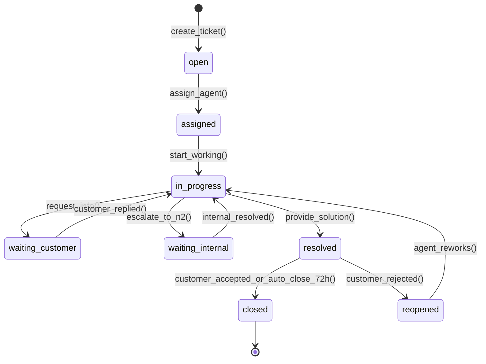
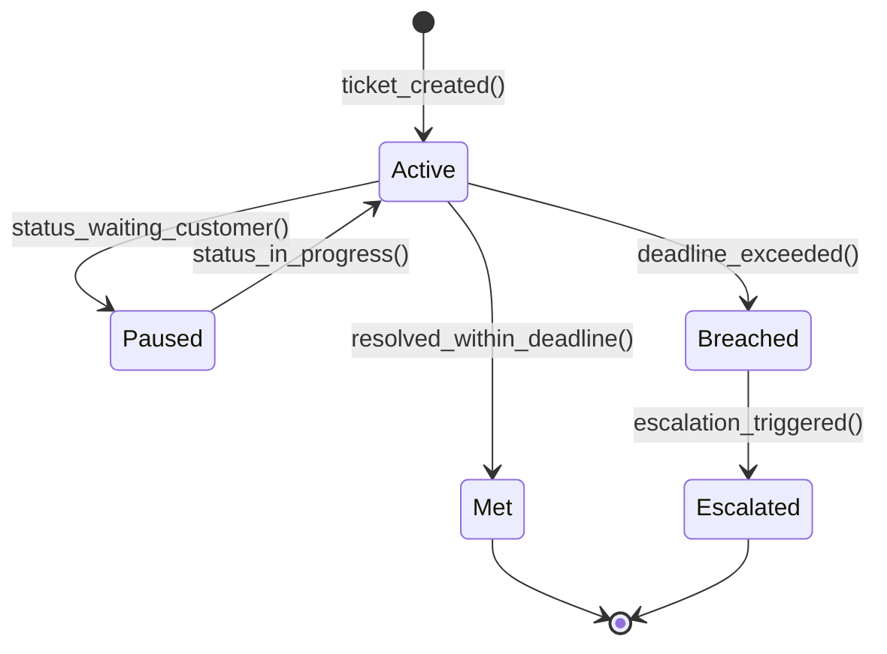
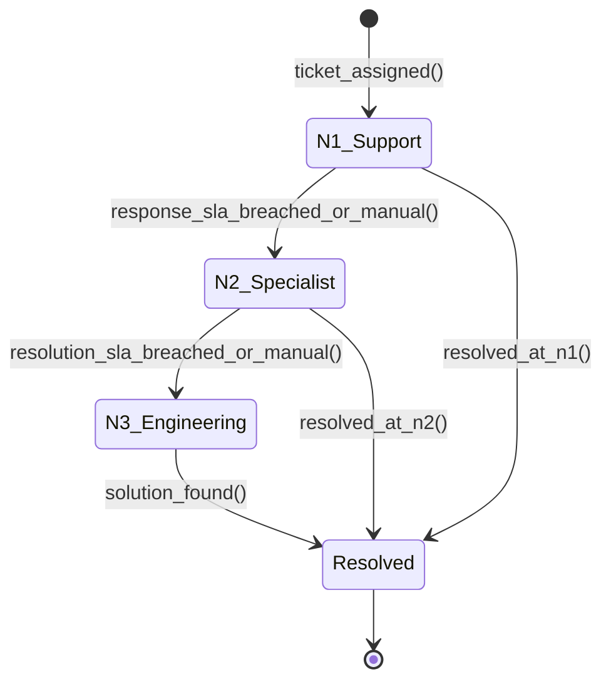
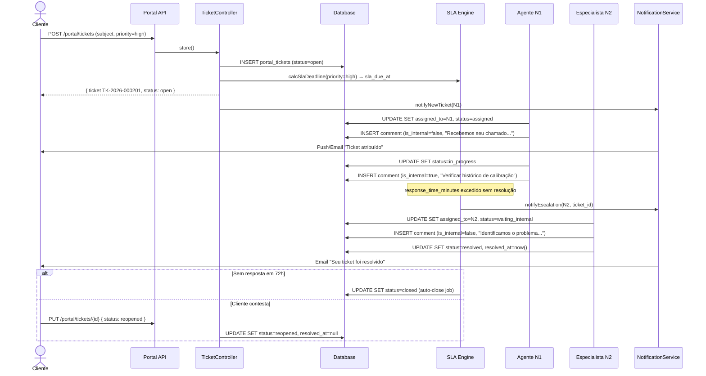
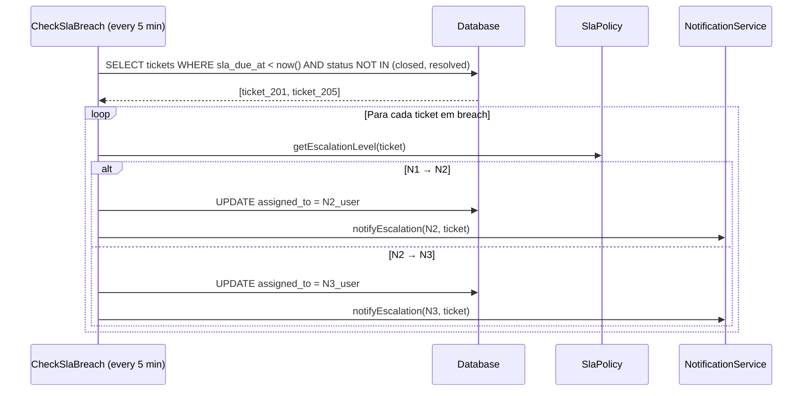

# Módulo: Helpdesk

> **[AI_RULE]** Documentação oficial do módulo Helpdesk. Gerencia o ciclo de vida completo de chamados técnicos (tickets), políticas de SLA, escalação multinível e métricas de atendimento. Integrado com Portal do Cliente e Ordens de Serviço.

---

## 1. Visão Geral

O módulo Helpdesk centraliza o atendimento técnico ao cliente com:

- **Ticketing completo**: abertura, atribuição, acompanhamento e resolução de chamados
- **SLA por prioridade/contrato**: tempos de resposta e resolução configuráveis
- **Escalação multinível**: N1 → N2 → N3 com regras automáticas
- **Métricas de atendimento**: primeiro tempo de resposta, tempo de resolução, taxa de reabertura
- **Auto-close**: tickets resolvidos sem interação são fechados automaticamente
- **Chat em tempo real**: mensagens entre agente e cliente no ticket
- **QR Code**: abertura de ticket via leitura de QR code do equipamento

---

## 2. Entidades (Models)

### Entidades Principais

| Model | Tabela | Descrição |
|-------|--------|-----------|
| `PortalTicket` | `portal_tickets` | Ticket/chamado principal |
| `PortalTicketComment` | `portal_ticket_comments` | Mensagens e comentários do ticket |
| `SlaPolicy` | `sla_policies` | Política de SLA com tempos de resposta/resolução |

### Campos Chave — `PortalTicket`

```php
protected $fillable = [
    'tenant_id', 'customer_id', 'created_by', 'equipment_id',
    'ticket_number', 'subject', 'description', 'priority', 'status',
    'category', 'source', 'assigned_to', 'resolved_at', 'qr_code',
];

protected $casts = [
    'resolved_at' => 'datetime',
];
```

**Campos detalhados:**

| Campo | Tipo | Descrição |
|-------|------|-----------|
| `tenant_id` | `unsignedBigInteger` | Tenant (multi-tenant) |
| `customer_id` | `unsignedBigInteger` | Cliente que abriu o ticket |
| `created_by` | `unsignedBigInteger` | ID do `ClientPortalUser` ou `User` que criou |
| `equipment_id` | `unsignedBigInteger?` | Equipamento relacionado (opcional) |
| `ticket_number` | `string` | Número sequencial (ex: `TK-2026-000042`) |
| `subject` | `string` | Assunto/título do ticket |
| `description` | `text` | Descrição detalhada do problema |
| `priority` | `string` | `low`, `medium`, `high`, `critical` |
| `status` | `string` | Estado atual do ticket (ver ciclo de vida) |
| `category` | `string?` | Categoria do ticket (`manutencao`, `calibracao`, `instalacao`, `consultoria`, `garantia`, `treinamento`, `suporte_remoto`, `emergencia`) |
| `source` | `string?` | Origem: `portal`, `email`, `phone`, `qr_code` |
| `assigned_to` | `unsignedBigInteger?` | Agente/técnico atribuído |
| `resolved_at` | `datetime?` | Data/hora da resolução |
| `qr_code` | `string?` | QR code do equipamento (abertura via scan) |

**Relacionamentos:**

- `customer()` → `BelongsTo(Customer::class)`
- `assignee()` → `BelongsTo(User::class, 'assigned_to')`
- `comments()` → `HasMany(PortalTicketComment::class)`

### Campos Chave — `PortalTicketComment` (tabela: `portal_ticket_comments`)

```php
protected $fillable = [
    'tenant_id', 'portal_ticket_id', 'user_id', 'content', 'is_internal',
];

protected $casts = [
    'is_internal' => 'boolean',
];
```

| Campo | Tipo | Descrição |
|-------|------|-----------|
| `tenant_id` | bigint FK | Tenant (multi-tenant) |
| `portal_ticket_id` | bigint FK | Ticket pai |
| `user_id` | bigint FK | Autor do comentário |
| `content` | text | Conteúdo da mensagem |
| `is_internal` | boolean | Nota interna (não visível ao cliente) |

**Relacionamentos:**

- `ticket()` → `BelongsTo(PortalTicket::class, 'portal_ticket_id')`
- `user()` → `BelongsTo(User::class)`

### Campos Chave — `SlaPolicy` (tabela: `sla_policies`)

```php
protected $fillable = [
    'tenant_id', 'name', 'response_time_minutes',
    'resolution_time_minutes', 'priority', 'is_active',
];

protected $casts = [
    'response_time_minutes' => 'integer',
    'resolution_time_minutes' => 'integer',
    'is_active' => 'boolean',
];
```

| Campo | Tipo | Descrição |
|-------|------|-----------|
| `tenant_id` | bigint FK | Tenant (multi-tenant) |
| `name` | string | Nome da política SLA |
| `response_time_minutes` | integer | Tempo máximo para primeira resposta (min) |
| `resolution_time_minutes` | integer | Tempo máximo para resolução (min) |
| `priority` | string | Prioridade: `low`, `medium`, `high`, `critical` |
| `is_active` | boolean | Se a política está ativa |

**Constantes de prioridade:**

- `PRIORITY_LOW = 'low'`
- `PRIORITY_MEDIUM = 'medium'`
- `PRIORITY_HIGH = 'high'`
- `PRIORITY_CRITICAL = 'critical'`

**Exemplos de configuração SLA:**

| Prioridade | Resposta | Resolução |
|------------|----------|-----------|
| `critical` | 30 min | 4 horas |
| `high` | 1 hora | 8 horas |
| `medium` | 4 horas | 24 horas |
| `low` | 8 horas | 72 horas |

---

## 3. Ciclos de Vida (State Machines)

### 3.1 Fluxo de Vida do Chamado (Ticketing)



**Transições detalhadas:**

| De | Para | Trigger | Efeito |
|----|------|---------|--------|
| `[*]` | `open` | `create_ticket()` | Calcula `sla_due_at` com base na prioridade |
| `open` | `assigned` | `assign_agent()` | Define `assigned_to`, registra `first_response_at` |
| `assigned` | `in_progress` | `start_working()` | Agente inicia trabalho |
| `in_progress` | `waiting_customer` | `request_info()` | **Pausa contagem SLA** |
| `waiting_customer` | `in_progress` | `customer_replied()` | **Retoma contagem SLA** |
| `in_progress` | `waiting_internal` | `escalate_to_n2()` | Escalação interna, notifica N2 |
| `waiting_internal` | `in_progress` | `internal_resolved()` | Retorno do N2 com solução |
| `in_progress` | `resolved` | `provide_solution()` | Define `resolved_at = now()` |
| `resolved` | `closed` | Auto-close 72h ou aceite | Estado terminal |
| `resolved` | `reopened` | `customer_rejected()` | Limpa `resolved_at`, incrementa reopen_count |
| `reopened` | `in_progress` | `agent_reworks()` | Novo ciclo de trabalho |

### 3.2 Ciclo de SLA



**Regras de contagem SLA:**

- Timer inicia quando o ticket é criado
- Timer **pausa** quando status transiciona para `waiting_customer`
- Timer **retoma** quando cliente responde (volta para `in_progress`)
- `sla_due_at` é recalculado descontando o tempo em pausa
- Se `now() > sla_due_at` → SLA breached → disparar escalação

### 3.3 Escalação Multinível



**Regras de escalação:**

| Nível | Condição de Escalação | Notificação |
|-------|----------------------|-------------|
| N1 → N2 | SLA de resposta expirado OU escalação manual | Email + push para supervisor |
| N2 → N3 | SLA de resolução expirado OU complexidade técnica | Email + push para gerente |
| N3 (final) | Sem escalação automática | Alerta para diretoria se não resolvido em 2x SLA |

---

## 4. Guard Rails de Negócio `[AI_RULE]`

> **[AI_RULE_CRITICAL] Acionamento de SLA**
> Todo `PortalTicket` criado DEVE calcular imediatamente o `sla_due_at` baseado na sua `priority` cruzada com a `SlaPolicy` ativa do tenant. A contagem do tempo de SLA DEVE ser suspensa (pausada) sempre que o ticket transitar para o estado `waiting_customer`. Ao retornar para `in_progress`, recalcular `sla_due_at` descontando o tempo pausado. Job `CheckSlaBreach` deve rodar a cada 5 minutos verificando tickets com `sla_due_at < now()`.

> **[AI_RULE_CRITICAL] Imutabilidade Pós-Resolução**
> Um ticket em estado `closed` NÃO pode receber novas `PortalTicketComment`. Se o cliente responder a um ticket fechado, o sistema DEVE abrir um novo `PortalTicket` referenciando (`parent_id`) o ticket anterior. Isso garante rastreabilidade e evita reabertura infinita.

> **[AI_RULE_CRITICAL] Isolamento por Customer**
> Tickets são filtrados por `customer_id` + `tenant_id`. Um cliente NUNCA pode ver tickets de outro cliente. O `PortalTicketController` valida `customer_id` em toda operação (index, show, update, addMessage).

> **[AI_RULE] Escalação Automática por SLA**
> Se o `response_time_minutes` da `SlaPolicy` for excedido sem atribuição de agente, o sistema DEVE escalar automaticamente para N2. Se o `resolution_time_minutes` for excedido, escalar para N3. Cada escalação gera notificação push + email para o nível superior.

> **[AI_RULE] Métricas de Atendimento**
> O sistema DEVE registrar e calcular automaticamente:
>
> - **First Response Time**: tempo entre `created_at` e primeiro `PortalTicketComment` não-interno
> - **Resolution Time**: tempo entre `created_at` e `resolved_at` (descontando tempo em `waiting_customer`)
> - **Reopen Rate**: percentual de tickets reabertos sobre total resolvido
> - **SLA Compliance**: percentual de tickets resolvidos dentro do SLA

> **[AI_RULE] Auto-Close de Tickets Resolvidos**
> Tickets com status `resolved` DEVEM ser automaticamente fechados (`closed`) após 72 horas sem nova atividade do cliente. O Job de auto-close DEVE ser idempotente. Antes de fechar, enviar notificação avisando que o ticket será fechado em 24h (aviso com 48h).

> **[AI_RULE] Comentários Internos**
> `PortalTicketComment` com `is_internal = true` são visíveis APENAS para agentes/admin no painel. O portal do cliente NUNCA retorna comentários internos. Útil para notas internas entre agentes durante o atendimento.

> **[AI_RULE] QR Code para Abertura de Ticket**
> Endpoint `POST /portal/tickets/qr-code` permite que um cliente escaneie o QR code do equipamento e abra um ticket pré-preenchido com `equipment_id` e dados do equipamento. O `qr_code` é validado contra a base de equipamentos do tenant.

> **[AI_RULE] Priorização Inteligente**
> Tickets criados via portal recebem prioridade `medium` por padrão. AI Analytics (`smartTicketLabeling`) pode sugerir reclassificação baseado no conteúdo textual (NLP). Tickets mencionando palavras como "parado", "urgente", "produção" são candidatos a `high` ou `critical`.

> **[AI_RULE_CRITICAL] Eternal Lead (CRM Feedback Loop)**
> Todo Chamado de Helpdesk que for encerrado (`closed` ou `resolved`) com avaliação negativa de satisfação (CSAT baixo) ou que demonstre intenção de cancelamento (churn risk), DEVE acionar automaticamente o módulo CRM, criando um `CrmLead` focado em retenção (Customer Success). Nenhuma oportunidade de reverter atrito pode ser perdida.

### 4.1 Edge Cases e Tratamento de Erros `[CRITICAL]`

| Cenário de Falha | Prevenção / Tratamento | Guardrails de Código Esperados |
| :--- | :--- | :--- |
| **Pausa de SLA Simultânea** (Múltiplas requisições de info) | Estado `waiting_customer` não tem "níveis". Pausar um ticket já pausado é idempotente, mas logar aviso. | DB Transações no update de status. Não atualizar `paused_at` se já estiver pausado. |
| **Resolução Fora do Horário Comercial** | SLA pausa automaticamente se houver política de horário comercial (Quiet Hours). | `SlaCalculatorService` usa calendários de feriados e fuso horário do tenant para descontar horas não úteis. |
| **Escalação em Loop (N1->N2->N1)** | O sistema impede rebaixamento de nível (downgrade) automático por SLA, apenas subida (N1->N2->N3). | `SlaEscalationService::alreadyEscalated(ticket, N2)` bloqueia re-escalação. |
| **Resposta de Ticket via Email "Antigo"** | Resumo de um ticket "closed" por reply no email. O sistema recusa reabertura se `now() > closed_at + 72h`. | `MailReceiverJob` verifica status e timestamp gerando um NOVO ticket com referência (`parent_id`) ao antigo. |
| **QR Code Inválido ou Adulterado** | Scans de QR codes de equipamentos que não pertencem ao `tenant_id` atual abortam silenciosamente. | Validação rígida `where('tenant_id', auth()->user()->tenant_id)` no `OpenTicketByQrCodeRequest`. |

---

## 5. Comportamento Integrado (Cross-Domain)

| Direção | Módulo | Integração |
|---------|--------|------------|
| ← | **Service-Calls** | Ticket pode gerar `ServiceCall` automaticamente quando requer visita técnica |
| → | **WorkOrders** | Ticket resolvido com visita gera `WorkOrder` para execução em campo |
| ← | **Portal** | Clientes abrem e acompanham tickets pelo Portal; mensagens em tempo real |
| → | **Email** | Notificações de status do ticket enviadas por email; respostas por email criam `PortalTicketComment` |
| ← | **Integrations** | WhatsApp para notificação de atualizações de ticket |
| → | **AI Analytics** | `smartTicketLabeling` para classificação automática de tickets |
| ← | **SLA Dashboard** | Dashboard de métricas SLA com overview, breached, by-policy, by-technician, trends |

---

## 6. Contratos de API (JSON)

### 6.1 Criar Ticket

```http
POST /api/v1/portal/tickets
Authorization: Bearer {portal-token}
Content-Type: application/json
```

**Request:**

```json
{
  "subject": "Balança fora de calibração",
  "description": "Equipamento apresentando erro de 0.5g acima do tolerável.",
  "priority": "high",
  "category": "calibracao",
  "equipment_id": 456
}
```

**Response (201):**

```json
{
  "success": true,
  "data": {
    "id": 201,
    "ticket_number": "TK-2026-000201",
    "tenant_id": 1,
    "customer_id": 15,
    "created_by": 42,
    "equipment_id": 456,
    "subject": "Balança fora de calibração",
    "description": "Equipamento apresentando erro de 0.5g acima do tolerável.",
    "priority": "high",
    "status": "open",
    "category": "calibracao",
    "source": "portal",
    "assigned_to": null,
    "resolved_at": null,
    "qr_code": null,
    "created_at": "2026-03-24T14:00:00Z",
    "updated_at": "2026-03-24T14:00:00Z"
  }
}
```

### 6.2 Listar Tickets (com filtros)

```http
GET /api/v1/portal/tickets?status=open&priority=high&search=balança&per_page=20
Authorization: Bearer {portal-token}
```

**Response (200):**

```json
{
  "success": true,
  "data": [
    {
      "id": 201,
      "ticket_number": "TK-2026-000201",
      "subject": "Balança fora de calibração",
      "priority": "high",
      "status": "open",
      "category": "calibracao",
      "assigned_to": null,
      "created_at": "2026-03-24T14:00:00Z"
    }
  ],
  "meta": {
    "current_page": 1,
    "per_page": 20,
    "total": 1
  }
}
```

### 6.3 Adicionar Mensagem ao Ticket

```http
POST /api/v1/portal/tickets/{id}/messages
Authorization: Bearer {portal-token}
Content-Type: application/json
```

**Request:**

```json
{
  "message": "Segue foto do visor com o erro de leitura."
}
```

**Response (201):**

```json
{
  "success": true,
  "data": {
    "id": 512,
    "portal_ticket_id": 201,
    "user_id": 42,
    "message": "Segue foto do visor com o erro de leitura.",
    "is_internal": false,
    "created_at": "2026-03-24T14:10:00Z"
  }
}
```

### 6.4 Chat de Ticket (Admin)

```http
GET /api/v1/portal/chat/{ticketId}/messages
Authorization: Bearer {admin-token}
```

**Response (200):**

```json
{
  "success": true,
  "data": [
    {
      "id": 512,
      "portal_ticket_id": 201,
      "user_id": 42,
      "message": "Segue foto do visor com o erro de leitura.",
      "is_internal": false,
      "created_at": "2026-03-24T14:10:00Z"
    },
    {
      "id": 513,
      "portal_ticket_id": 201,
      "user_id": 7,
      "message": "Nota interna: verificar se está na garantia.",
      "is_internal": true,
      "created_at": "2026-03-24T14:15:00Z"
    }
  ]
}
```

### 6.5 SLA Policy CRUD

```http
POST /api/v1/sla-policies
Authorization: Bearer {admin-token}
Content-Type: application/json
```

**Request:**

```json
{
  "name": "SLA Premium - Crítico",
  "priority": "critical",
  "response_time_minutes": 30,
  "resolution_time_minutes": 240,
  "is_active": true
}
```

**Response (201):**

```json
{
  "success": true,
  "data": {
    "id": 5,
    "tenant_id": 1,
    "name": "SLA Premium - Crítico",
    "priority": "critical",
    "response_time_minutes": 30,
    "resolution_time_minutes": 240,
    "is_active": true,
    "created_at": "2026-03-24T15:00:00Z"
  }
}
```

### 6.6 SLA Dashboard

```http
GET /api/v1/sla-dashboard/overview
Authorization: Bearer {admin-token}
```

**Response (200):**

```json
{
  "success": true,
  "data": {
    "total_tickets": 150,
    "open_tickets": 23,
    "sla_compliant": 127,
    "sla_breached": 12,
    "sla_at_risk": 11,
    "compliance_rate": 84.7,
    "avg_first_response_minutes": 45,
    "avg_resolution_minutes": 480
  }
}
```

---

## 7. Permissões (RBAC)

| Permissão | Descrição | Usado em |
|-----------|-----------|----------|
| `service_calls.service_call.view` | Visualizar chamados e tickets | PortalClienteController |
| `os.work_order.view` | Visualizar OS, SLA dashboard, chat | ServiceOpsController, SlaDashboardController |
| `os.work_order.update` | Executar checks de SLA | ServiceOpsController@runSlaChecks |
| `portal.client.view` | Visualizar dados do portal (admin) | ClientPortalController |
| `portal.client.create` | Criar chamados via portal (admin) | ClientPortalController |

### SLA Policies

| Permissão | Descrição |
|-----------|-----------|
| `viewAny(SlaPolicy)` | Listar políticas SLA (via Policy class) |
| `create(SlaPolicy)` | Criar política SLA |
| `update(SlaPolicy)` | Atualizar política SLA |
| `delete(SlaPolicy)` | Excluir política SLA |

---

## 8. Rotas da API

### Tickets (Portal — `auth:sanctum` + `portal.access`)

| Método | Rota | Controller | Ação |
|--------|------|------------|------|
| `GET` | `/api/v1/portal/tickets` | `PortalTicketController@index` | Listar tickets do cliente |
| `POST` | `/api/v1/portal/tickets` | `PortalTicketController@store` | Criar ticket |
| `GET` | `/api/v1/portal/tickets/{id}` | `PortalTicketController@show` | Detalhes do ticket |
| `PUT` | `/api/v1/portal/tickets/{id}` | `PortalTicketController@update` | Atualizar ticket |
| `POST` | `/api/v1/portal/tickets/{id}/messages` | `PortalTicketController@addMessage` | Adicionar mensagem |
| `POST` | `/api/v1/portal/tickets/qr-code` | `PortalClienteController@openTicketByQrCode` | Abrir via QR |

### Tickets (Admin — `auth:sanctum` + `check.tenant`)

| Método | Rota | Controller | Ação |
|--------|------|------------|------|
| `GET` | `/api/v1/portal/chat/{ticketId}/messages` | `PortalClienteController@chatMessages` | Mensagens do chat |
| `POST` | `/api/v1/portal/chat/{ticketId}/messages` | `PortalClienteController@sendChatMessage` | Enviar mensagem (admin) |

### SLA Policies (Admin)

| Método | Rota | Controller | Ação |
|--------|------|------------|------|
| `GET` | `/api/v1/sla-policies` | `SlaPolicyController@index` | Listar políticas SLA |
| `POST` | `/api/v1/sla-policies` | `SlaPolicyController@store` | Criar política |
| `GET` | `/api/v1/sla-policies/{id}` | `SlaPolicyController@show` | Detalhes da política |
| `PUT` | `/api/v1/sla-policies/{id}` | `SlaPolicyController@update` | Atualizar política |
| `DELETE` | `/api/v1/sla-policies/{id}` | `SlaPolicyController@destroy` | Excluir política |

### SLA Dashboard (Admin)

| Método | Rota | Controller | Ação |
|--------|------|------------|------|
| `GET` | `/api/v1/sla-dashboard/overview` | `SlaDashboardController@overview` | Visão geral SLA |
| `GET` | `/api/v1/sla-dashboard/breached` | `SlaDashboardController@breachedOrders` | OS em breach |
| `GET` | `/api/v1/sla-dashboard/by-policy` | `SlaDashboardController@byPolicy` | Métricas por política |
| `GET` | `/api/v1/sla-dashboard/by-technician` | `SlaDashboardController@byTechnician` | Métricas por técnico |
| `GET` | `/api/v1/sla-dashboard/trends` | `SlaDashboardController@trends` | Tendências |

### SLA Operacional

| Método | Rota | Controller | Ação |
|--------|------|------------|------|
| `GET` | `/api/v1/sla/dashboard` | `ServiceOpsController@slaDashboard` | Dashboard ops |
| `POST` | `/api/v1/sla/run-checks` | `ServiceOpsController@runSlaChecks` | Executar verificações |
| `GET` | `/api/v1/sla/status/{workOrder}` | `ServiceOpsController@slaStatus` | Status SLA de OS |

---

## 9. Form Requests (Validacao de Entrada)

> **[AI_RULE]** Todo endpoint de criacao/atualizacao DEVE usar Form Request. Validacao inline em controllers e PROIBIDA.

### 9.1 StorePortalTicketRequest

**Classe**: `App\Http\Requests\Helpdesk\StorePortalTicketRequest`
**Endpoint**: `POST /api/v1/portal/tickets`

```php
public function authorize(): bool
{
    return $this->user()->tokenCan('portal:access');
}

public function rules(): array
{
    return [
        'subject'      => ['required', 'string', 'max:255'],
        'description'  => ['required', 'string', 'min:10'],
        'priority'     => ['required', 'string', 'in:low,medium,high,critical'],
        'category'     => ['nullable', 'string', 'max:100'],
        'equipment_id' => ['nullable', 'integer', 'exists:equipment,id'],
    ];
}
```

> **[AI_RULE]** `customer_id` e `created_by` sao preenchidos automaticamente pelo controller a partir do token Sanctum. O cliente nao pode especificar esses campos.

### 9.2 UpdatePortalTicketRequest

**Classe**: `App\Http\Requests\Helpdesk\UpdatePortalTicketRequest`
**Endpoint**: `PUT /api/v1/portal/tickets/{id}`

```php
public function rules(): array
{
    return [
        'status'       => ['sometimes', 'string', 'in:reopened'],
        'priority'     => ['sometimes', 'string', 'in:low,medium,high,critical'],
    ];
}
```

> **[AI_RULE]** O cliente so pode transitar para `reopened` (de `resolved`). Transicoes internas (`assigned`, `in_progress`, `closed`) sao exclusivas de agentes admin.

### 9.3 AddTicketMessageRequest

**Classe**: `App\Http\Requests\Helpdesk\AddTicketMessageRequest`
**Endpoint**: `POST /api/v1/portal/tickets/{id}/messages`

```php
public function rules(): array
{
    return [
        'message'     => ['required', 'string', 'max:5000'],
        'is_internal' => ['sometimes', 'boolean'],
    ];
}
```

> **[AI_RULE]** Se o token e `portal:access` (cliente), `is_internal` e forcado para `false`. Comentarios internos sao exclusivos de agentes admin.

### 9.4 StoreSlaPolicyRequest

**Classe**: `App\Http\Requests\Helpdesk\StoreSlaPolicyRequest`
**Endpoint**: `POST /api/v1/sla-policies`

```php
public function authorize(): bool
{
    return $this->user()->can('create', SlaPolicy::class);
}

public function rules(): array
{
    return [
        'name'                     => ['required', 'string', 'max:255'],
        'priority'                 => ['required', 'string', 'in:low,medium,high,critical'],
        'response_time_minutes'    => ['required', 'integer', 'min:1'],
        'resolution_time_minutes'  => ['required', 'integer', 'min:1', 'gt:response_time_minutes'],
        'is_active'                => ['required', 'boolean'],
    ];
}
```

> **[AI_RULE]** `resolution_time_minutes` DEVE ser maior que `response_time_minutes`. Apenas uma SlaPolicy ativa por prioridade por tenant.

### 9.5 UpdateSlaPolicyRequest

**Classe**: `App\Http\Requests\Helpdesk\UpdateSlaPolicyRequest`
**Endpoint**: `PUT /api/v1/sla-policies/{id}`

```php
public function rules(): array
{
    return [
        'name'                     => ['sometimes', 'string', 'max:255'],
        'priority'                 => ['sometimes', 'string', 'in:low,medium,high,critical'],
        'response_time_minutes'    => ['sometimes', 'integer', 'min:1'],
        'resolution_time_minutes'  => ['sometimes', 'integer', 'min:1'],
        'is_active'                => ['sometimes', 'boolean'],
    ];
}
```

---

## 10. Diagramas de Sequência

### 9.1 Fluxo Completo: Cliente Abre Ticket → Resolução com Escalação



### 9.2 Fluxo: Verificação de SLA (Job)



---

## 11. Testes Requeridos (BDD)

### 10.1 Ciclo de Vida do Ticket

```gherkin
Funcionalidade: Ciclo de Vida de Ticket

  Cenário: Criar ticket com SLA calculado
    Dado que existe uma SlaPolicy ativa para prioridade "high" com resolution_time=480
    E estou autenticado como ClientPortalUser
    Quando envio POST /portal/tickets com priority="high"
    Então o ticket é criado com status "open"
    E o sla_due_at está calculado como created_at + 480 minutos

  Cenário: Transição open → in_progress → resolved → closed
    Dado que tenho um ticket com status "open"
    Quando o agente atribui e inicia trabalho
    E o agente resolve o ticket
    Então resolved_at é preenchido
    E após 72h sem atividade, status transiciona para "closed"

  Cenário: Reabertura de ticket resolvido
    Dado que tenho um ticket com status "resolved"
    Quando envio PUT com status="reopened"
    Então resolved_at é limpo (null)
    E o ticket volta para o fluxo de trabalho

  Cenário: Impedir mensagem em ticket fechado
    Dado que tenho um ticket com status "closed"
    Quando envio POST /tickets/{id}/messages
    Então recebo status 422
    E a resposta indica que tickets fechados não aceitam mensagens
```

### 10.2 SLA

```gherkin
Funcionalidade: Gestão de SLA

  Cenário: CRUD de SlaPolicy
    Quando envio POST /sla-policies com name, priority, tempos
    Então a política é criada com status 201
    Quando envio PUT /sla-policies/{id}
    Então a política é atualizada
    Quando envio DELETE /sla-policies/{id}
    Então a política é removida

  Cenário: SLA pausado durante waiting_customer
    Dado que tenho ticket com sla_due_at em 4 horas
    E 2 horas se passaram
    Quando o status muda para "waiting_customer"
    E o cliente responde após 3 horas
    Então o sla_due_at é recalculado com +3 horas (tempo pausado)
    E o ticket ainda tem 2 horas restantes de SLA

  Cenário: Violação de SLA gera escalação
    Dado que tenho ticket com sla_due_at expirado
    Quando o Job CheckSlaBreach executa
    Então o ticket é escalado para o próximo nível
    E notificação é enviada ao supervisor
```

### 10.3 Isolamento

```gherkin
Funcionalidade: Isolamento de Dados

  Cenário: Cliente não vê tickets de outro customer
    Dado que existem tickets do customer_id=15 e customer_id=20 no mesmo tenant
    Quando ClientPortalUser do customer_id=15 lista tickets
    Então recebe apenas tickets com customer_id=15

  Cenário: Comentários internos invisíveis no portal
    Dado que ticket tem comments com is_internal=true e is_internal=false
    Quando ClientPortalUser visualiza o ticket
    Então vê apenas comentários com is_internal=false
```

---

## 12. Migrations Relacionadas

| Migration | Descrição |
|-----------|-----------|
| `2026_02_09_400002_create_sla_tables` | Tabela `sla_policies` e estruturas SLA |
| `2026_02_18_500003_create_central_dependencies_and_escalation` | Escalação e dependências centrais |
| `2026_02_23_100000_add_sla_due_at_to_service_calls` | Campo `sla_due_at` em service_calls |
| `2026_03_16_500000_create_portal_tickets_table` | Tabela `portal_tickets` |
| `2026_03_16_500001_create_portal_ticket_messages_table` | Tabela `portal_ticket_messages` |
| `2026_03_21_100001_add_sla_breach_fields_to_service_calls` | Campos de breach em service_calls |

---

## 13. Observabilidade e Métricas

### Métricas Chave

| Métrica | Descrição | Alerta |
|---------|-----------|--------|
| `helpdesk.tickets.created_per_day` | Volume de tickets criados | > 2x média → investigar |
| `helpdesk.tickets.open_count` | Tickets abertos no momento | > 50 → alocar mais agentes |
| `helpdesk.sla.compliance_rate` | % de tickets resolvidos dentro do SLA | < 80% → alerta gerencial |
| `helpdesk.sla.breached_count` | Tickets em breach ativo | > 0 para `critical` → alerta imediato |
| `helpdesk.first_response_time_avg` | Tempo médio de primeira resposta | > SLA médio → otimizar triagem |
| `helpdesk.resolution_time_avg` | Tempo médio de resolução | > 24h → analisar gargalos |
| `helpdesk.reopen_rate` | Taxa de reabertura de tickets | > 15% → qualidade de resolução baixa |
| `helpdesk.escalation_rate` | % de tickets escalados para N2/N3 | > 30% → capacitar N1 |
| `helpdesk.customer_satisfaction_avg` | NPS médio pós-ticket | < 7 → investigar atendimento |

### Dashboard SLA (Endpoints)

| Endpoint | Métrica |
|----------|---------|
| `/sla-dashboard/overview` | Visão geral: total, compliance, breach, at-risk |
| `/sla-dashboard/breached` | Lista de OS/tickets em breach com detalhes |
| `/sla-dashboard/by-policy` | Métricas agrupadas por política SLA |
| `/sla-dashboard/by-technician` | Performance por técnico |
| `/sla-dashboard/trends` | Tendências temporais (diário, semanal, mensal) |

### Logs Estruturados

```
[Helpdesk] ticket_created ticket_id=201 customer_id=15 priority=high sla_due_at=2026-03-24T22:00:00Z
[Helpdesk] ticket_assigned ticket_id=201 agent_id=7 level=N1
[Helpdesk] ticket_status_changed ticket_id=201 from=open to=in_progress
[Helpdesk] sla_paused ticket_id=201 status=waiting_customer paused_at=2026-03-24T16:00:00Z
[Helpdesk] sla_resumed ticket_id=201 status=in_progress resumed_at=2026-03-24T19:00:00Z paused_duration=180min
[Helpdesk] sla_breached ticket_id=201 policy_id=5 breach_type=resolution
[Helpdesk] ticket_escalated ticket_id=201 from=N1 to=N2 reason=sla_breach
[Helpdesk] ticket_resolved ticket_id=201 resolution_time=720min within_sla=false
[Helpdesk] ticket_auto_closed ticket_id=201 idle_hours=72
```

---

## Event Listeners

| Evento | Listener | Acao | Queue |
|--------|----------|------|-------|
| `SlaBreached` | `NotifyManagerOnSlaBreach` | Notifica gestor/supervisor sobre violacao de SLA | sync |
| `SlaBreached` | `ApplySlaPenalty` | Aplica penalidade contratual por violacao de SLA | queued |
| `TicketEscalated` | `NotifyEscalationTarget` | Notifica o agente/equipe do nivel de escalacao destino | sync |
| `TicketResolved` | `SendSatisfactionSurvey` | Envia pesquisa de satisfacao ao cliente 24h apos resolucao | queued (delay 24h) |
| `TicketClosed` | `UpdateSlaMetrics` | Atualiza metricas de SLA (compliance rate, avg resolution time) | queued |

---

## Fluxos Relacionados

| Fluxo | Descrição |
|-------|-----------|
| [Ciclo de Ticket de Suporte](file:///c:/PROJETOS/sistema/docs/fluxos/CICLO-TICKET-SUPORTE.md) | Processo documentado em `docs/fluxos/CICLO-TICKET-SUPORTE.md` |

---

## Inventario Completo do Codigo

> **[AI_RULE]** Secao gerada a partir do codigo-fonte real. Toda referencia abaixo corresponde a arquivo existente no repositorio.

### Controllers (3 — namespace `App\Http\Controllers\Api\V1`)

| Controller | Arquivo | Metodos Publicos |
|------------|---------|-----------------|
| **PortalTicketController** | `Portal/PortalTicketController.php` | `index`, `store`, `show`, `update`, `addMessage` |
| **SlaPolicyController** | `SlaPolicyController.php` | `index`, `store`, `show`, `update`, `destroy` |
| **SlaDashboardController** | `SlaDashboardController.php` | `overview`, `breachedOrders`, `byTechnician`, `trends`, `byPolicy` |

### Models (6 — namespace `App\Models`)

| Model | Tabela | Descricao |
|-------|--------|-----------|
| `PortalTicket` | `portal_tickets` | Ticket/chamado principal do helpdesk |
| `PortalTicketComment` | `portal_ticket_comments` | Mensagens e comentarios do ticket |
| `SlaPolicy` | `sla_policies` | Politica de SLA com tempos de resposta/resolucao por prioridade |
| `NpsSurvey` | `nps_surveys` | Pesquisa NPS vinculada a OS |
| `NpsResponse` | `nps_responses` | Resposta individual de pesquisa NPS |
| `SatisfactionSurvey` | `satisfaction_surveys` | Pesquisa de satisfacao externa (cliente via portal/email) |

### Services (1 — namespace `App\Services`)

| Service | Arquivo | Metodos Publicos |
|---------|---------|-----------------|
| `SlaEscalationService` | `Services/SlaEscalationService.php` | `runSlaChecks(tenantId)` — verifica todos os SLAs pendentes; `evaluateSla(WorkOrder)` — avalia SLA de OS individual; `evaluateServiceCallSla(ServiceCall)` — avalia SLA de chamado; `getDashboard(tenantId)` — dados consolidados do dashboard de SLA |

**Metodos privados relevantes:**

- `escalate()` — executa escalacao de OS (notifica targets, atualiza status)
- `escalateServiceCall()` — executa escalacao de chamado tecnico
- `resolveTargets()` — resolve destinatarios da escalacao (gestor, supervisor, equipe)
- `alreadyEscalated()` / `alreadyEscalatedServiceCall()` — evita escalacoes duplicadas

### FormRequests (10)

| FormRequest | Namespace | Descricao |
|-------------|-----------|-----------|
| `StorePortalTicketRequest` | Portal | Criar ticket pelo portal |
| `UpdatePortalTicketRequest` | Portal | Atualizar ticket pelo portal |
| `AddPortalTicketMessageRequest` | Portal | Adicionar mensagem ao ticket |
| `OpenTicketByQrCodeRequest` | Portal | Abrir ticket via QR code do equipamento |
| `SubmitNpsRequest` | Portal | Submeter resposta NPS |
| `SubmitSatisfactionSurveyResponseRequest` | Portal | Submeter resposta de pesquisa de satisfacao |
| `StoreSlaPolicyRequest` | Os | Criar politica de SLA |
| `UpdateSlaPolicyRequest` | Os | Atualizar politica de SLA |
| `StoreNpsResponseRequest` | Operational | Registrar resposta NPS |
| `StoreSatisfactionSurveyRequest` | Quality | Criar pesquisa de satisfacao |

### Integracao NPS/Satisfacao

O modulo Helpdesk integra-se com o subsistema de qualidade para medir satisfacao do cliente:

- **NpsSurvey** — pesquisa NPS vinculada a OS completada. Disparada automaticamente pelo listener `TriggerNpsSurvey`
- **NpsResponse** — respostas individuais coletadas (score 0-10, comentario)
- **SatisfactionSurvey** — pesquisa de satisfacao mais ampla enviada via portal/email
- **NpsController** (`Operational/NpsController.php`) — endpoints `store` (registrar resposta) e `stats` (metricas agregadas)
- **PostServiceSurveyService** — servico que orquestra envio de pesquisas pos-atendimento

## Checklist de Implementacao

- [ ] Entidades de SLA: Implementar a engine de cálculo de SLA (regras de expiração horas úteis) em classe isolada `SlaCalculatorService`.
- [ ] Ticket Controller: CRUD com trait de upload via Spatie MediaLibrary obrigatoria nas respostas (comprovantes).
- [ ] Frontend React: Tela Kanban e tela de log em thread/timeline para interação com cliente final.
