# Integracoes Cross-Module

> **[AI_RULE]** Este documento descreve as 15 integracoes criticas entre modulos do Kalibrium ERP, mais 9 modulos com integracao indireta. Cada integracao define endpoints, services, eventos e diagramas de sequencia. Qualquer agente de IA DEVE respeitar estas regras ao modificar modulos integrados.

---

## 1. Finance x Contracts — Billing Recorrente

O `RecurringBillingService` gera faturas automaticamente para contratos ativos com cobranca recorrente.

### 1.1 Diagrama de Sequencia

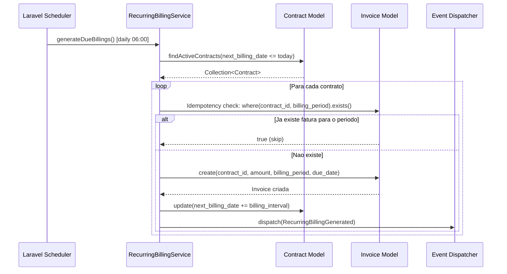

### 1.2 Endpoints

| Metodo | Rota | Descricao |
|--------|------|-----------|
| — | Scheduled Command (daily 06:00) | `RecurringBillingService::generateDueBillings()` |
| `GET` | `/api/v1/contracts/{id}/billings` | Lista faturas geradas para o contrato |

### 1.3 Services

| Service | Metodo | Responsabilidade |
|---------|--------|-----------------|
| `RecurringBillingService` | `generateDueBillings()` | Busca contratos com `next_billing_date <= today`, gera Invoice por contrato |

### 1.4 Eventos

| Evento | Payload | Descricao |
|--------|---------|-----------|
| `RecurringBillingGenerated` | `contract_id`, `invoice_id`, `billing_period`, `amount` | Disparado apos criacao de cada fatura recorrente |

### 1.5 Regras

> **[AI_RULE]** Idempotencia obrigatoria: antes de gerar uma fatura, o service DEVE verificar `Invoice::where('contract_id', $id)->where('billing_period', $period)->exists()`. Se ja existir, pular sem erro. Isso garante que re-execucoes do scheduler nao dupliquem faturas.

> **[AI_RULE]** O campo `next_billing_date` do contrato DEVE ser atualizado atomicamente (dentro da mesma transaction) junto com a criacao da Invoice.

---

## 2. Contracts x WorkOrders — Aceitacao de Medicao

O fluxo de medicao permite registrar e validar medicoes de servicos realizados contra regras definidas no contrato.

### 2.1 Diagrama de Sequencia

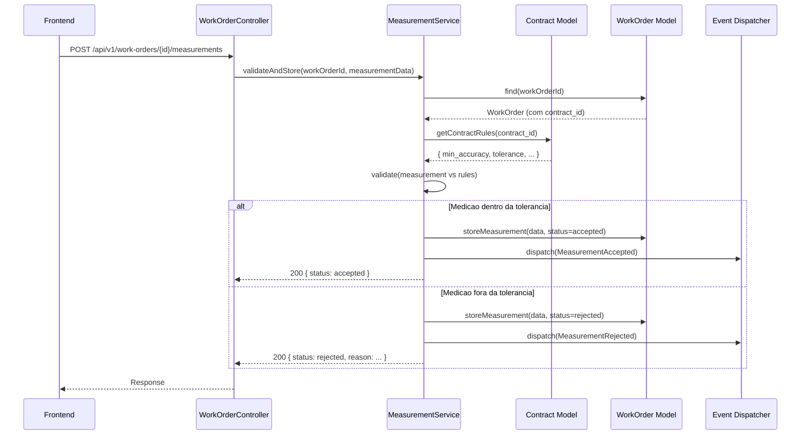

### 2.2 Endpoints

| Metodo | Rota | Descricao |
|--------|------|-----------|
| `POST` | `/api/v1/work-orders/{id}/measurements` | Registrar medicao para a OS |
| `GET` | `/api/v1/work-orders/{id}/measurements` | Listar medicoes da OS |

### 2.3 Services

| Service | Metodo | Responsabilidade |
|---------|--------|-----------------|
| `MeasurementService` | `validateAndStore()` | Valida medicao contra regras do contrato (min_accuracy, tolerance) |

### 2.4 Eventos

| Evento | Payload | Descricao |
|--------|---------|-----------|
| `MeasurementAccepted` | `work_order_id`, `measurement_id`, `contract_id`, `accuracy` | Medicao aprovada dentro da tolerancia |
| `MeasurementRejected` | `work_order_id`, `measurement_id`, `contract_id`, `accuracy`, `reason` | Medicao rejeitada — fora da tolerancia contratual |

### 2.5 Regras

> **[AI_RULE]** O `MeasurementService` DEVE buscar as regras de tolerancia diretamente do contrato vinculado a OS. Se a OS nao tiver contrato vinculado, usar configuracoes padrao do tenant (`config/measurements.php`).

---

## 3. HR x Finance — Comissao de Folha

O calculo de comissoes integra dados de OS concluidas (WorkOrders) com a folha de pagamento, aplicando regras escalonadas e penalidades por SLA violado.

### 3.1 Diagrama de Sequencia

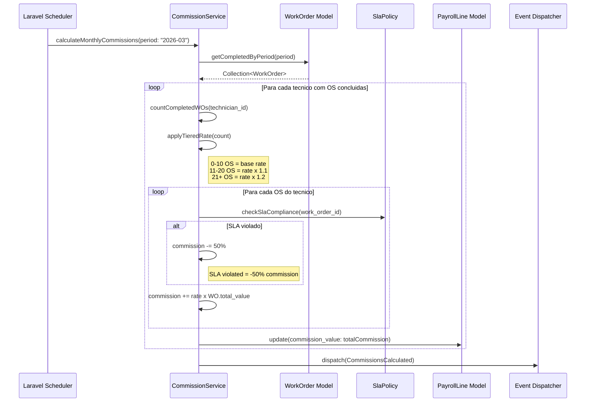

### 3.2 Endpoints

| Metodo | Rota | Descricao |
|--------|------|-----------|
| `POST` | `/api/v1/commissions/calculate` | Dispara calculo de comissoes para o periodo |
| `GET` | `/api/v1/commissions/preview/{period}` | Pre-visualiza comissoes antes de aprovar |

### 3.3 Services

| Service | Metodo | Responsabilidade |
|---------|--------|-----------------|
| `CommissionService` | `calculateMonthlyCommissions(period)` | Calcula comissoes com regras escalonadas e penalidade SLA |

### 3.4 Eventos

| Evento | Payload | Descricao |
|--------|---------|-----------|
| `CommissionsCalculated` | `period`, `technician_count`, `total_commission_value`, `sla_penalties_applied` | Disparado apos calculo completo de comissoes do periodo |

### 3.5 Regras

> **[AI_RULE]** Regras de escalonamento (tiered):
>
> - 0 a 10 OS concluidas: `commission_rate` base
> - 11 a 20 OS concluidas: `commission_rate x 1.1`
> - 21+ OS concluidas: `commission_rate x 1.2`

> **[AI_RULE]** OS com SLA violado DEVE ter a comissao reduzida em 50%. O tecnico recebe apenas metade da comissao daquela OS especifica.

---

## 4. Fiscal x Finance — Webhook NF-e

Webhooks recebidos do provedor fiscal (Sefaz/intermediario) atualizam o status da nota fiscal e habilitam ou bloqueiam o pagamento da fatura associada.

### 4.1 Diagrama de Sequencia

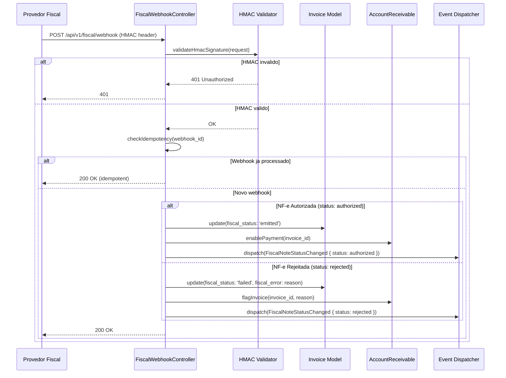

### 4.2 Endpoints

| Metodo | Rota | Descricao |
|--------|------|-----------|
| `POST` | `/api/v1/fiscal/webhook` | Recebe webhook do provedor fiscal (HMAC auth) |

### 4.3 Services

| Service | Metodo | Responsabilidade |
|---------|--------|-----------------|
| `FiscalWebhookService` | `processWebhook(payload)` | Processa webhook, atualiza Invoice e AR |
| `HmacValidator` | `validate(request)` | Valida assinatura HMAC do webhook |

### 4.4 Eventos

| Evento | Payload | Descricao |
|--------|---------|-----------|
| `FiscalNoteStatusChanged` | `invoice_id`, `fiscal_note_key`, `status` (authorized/rejected), `error` | Status da NF-e mudou no provedor fiscal |

### 4.5 Regras

> **[AI_RULE_CRITICAL]** Webhook MUST be idempotent. Cada webhook recebido DEVE ser registrado com seu `webhook_id` unico. Se o mesmo `webhook_id` for recebido novamente, retornar `200 OK` sem reprocessar. Usar tabela `fiscal_webhook_logs` com unique constraint em `webhook_id`.

> **[AI_RULE]** Autenticacao via HMAC-SHA256. O header `X-Webhook-Signature` contem o hash do body usando o `webhook_secret` configurado no tenant. Rejeitar com 401 se invalido.

> **[AI_RULE]** NF-e rejeitada DEVE criar alerta no painel financeiro e impedir pagamento da fatura ate regularizacao fiscal.

---

## 5. Helpdesk x Contracts — Calculo de SLA

O SLA de um ticket e determinado pela configuracao do contrato do cliente, com fallback para prioridade padrao e config global.

### 5.1 Diagrama de Sequencia

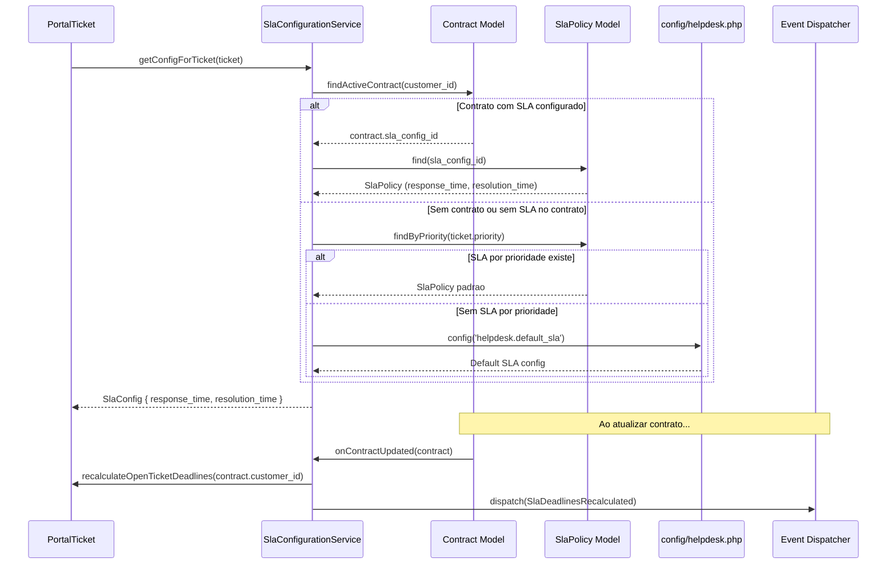

### 5.2 Endpoints

| Metodo | Rota | Descricao |
|--------|------|-----------|
| `GET` | `/api/v1/sla/config/{ticketId}` | Retorna configuracao SLA aplicavel ao ticket |
| `POST` | `/api/v1/contracts/{id}/sla-config` | Associar configuracao SLA ao contrato |

### 5.3 Services

| Service | Metodo | Responsabilidade |
|---------|--------|-----------------|
| `SlaConfigurationService` | `getConfigForTicket(ticket)` | Resolve SLA: contrato → prioridade → config global |
| `SlaConfigurationService` | `recalculateOpenTicketDeadlines(customerId)` | Recalcula deadlines de tickets abertos ao atualizar contrato |

### 5.4 Eventos

| Evento | Payload | Descricao |
|--------|---------|-----------|
| `SlaDeadlinesRecalculated` | `contract_id`, `customer_id`, `affected_ticket_count` | Deadlines de SLA recalculados apos atualizacao de contrato |

### 5.5 Regras

> **[AI_RULE]** Hierarquia de resolucao SLA (em ordem de prioridade):
>
> 1. `contract.sla_config_id` — SLA especifico do contrato do cliente
> 2. `SlaPolicy::where('priority', ticket.priority)` — SLA padrao por prioridade
> 3. `config('helpdesk.default_sla')` — Configuracao global fallback

> **[AI_RULE]** Ao atualizar a configuracao SLA de um contrato, o sistema DEVE recalcular os deadlines de TODOS os tickets abertos daquele cliente. Tickets ja fechados nao sao afetados.

---

## 6. Lab x Quality — Certificado de Calibracao

O fluxo de calibracao no laboratorio gera certificados com calculo de incerteza (GUM) e integra com o modulo de qualidade para bloqueio de instrumentos reprovados.

### 6.1 Diagrama de Sequencia

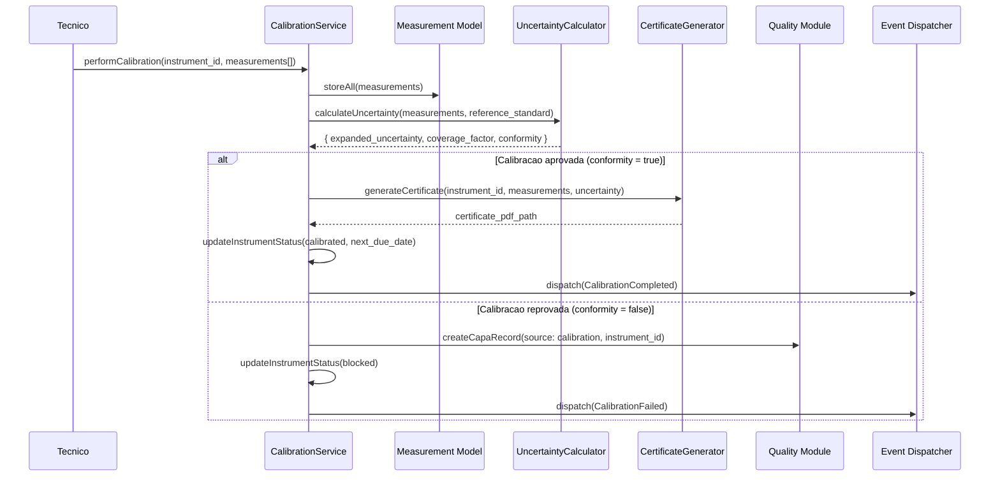

### 6.2 Endpoints

| Metodo | Rota | Descricao |
|--------|------|-----------|
| `POST` | `/api/v1/calibrations` | Registrar calibracao com medicoes |
| `GET` | `/api/v1/calibrations/{id}/certificate` | Baixar certificado de calibracao (PDF) |
| `GET` | `/api/v1/instruments/{id}/calibration-history` | Historico de calibracoes do instrumento |

### 6.3 Services

| Service | Metodo | Responsabilidade |
|---------|--------|-----------------|
| `CalibrationService` | `performCalibration()` | Executa calibracao, valida medicoes, gera certificado |
| `UncertaintyCalculator` | `calculateUncertainty()` | Calculo de incerteza expandida conforme GUM (Guide to Uncertainty in Measurement) |
| `CertificateGenerator` | `generateCertificate()` | Gera PDF do certificado de calibracao com dados rastreavies |

### 6.4 Eventos

| Evento | Payload | Descricao |
|--------|---------|-----------|
| `CalibrationCompleted` | `instrument_id`, `calibration_id`, `certificate_path`, `next_due_date` | Calibracao aprovada com certificado gerado |
| `CalibrationFailed` | `instrument_id`, `calibration_id`, `failure_reason`, `capa_record_id` | Calibracao reprovada — instrumento bloqueado |

### 6.5 Regras

> **[AI_RULE_CRITICAL]** Failed calibration MUST block instrument usage. Quando uma calibracao falha (`conformity = false`), o instrumento DEVE ser imediatamente bloqueado (`status = blocked`). Nenhuma OS ou medicao pode utilizar um instrumento bloqueado. O desbloqueio so ocorre apos nova calibracao aprovada.

> **[AI_RULE]** Certificados de calibracao DEVEM incluir: numero do certificado, data de calibracao, data de validade, incerteza expandida (U), fator de abrangencia (k), padrao de referencia utilizado, condicoes ambientais (temperatura, umidade), e assinatura do responsavel tecnico.

> **[AI_RULE]** Calibracao reprovada DEVE gerar automaticamente um `CapaRecord` no modulo Quality com `source = 'calibration'` e `type = 'corrective'`.

---

## 7. IoT_Telemetry x Lab — Captura Automatica (ISO-17025)

A integracao garante que valores genericos de portas COM/Serial preencham as calibracoes do Lab sem erro humano. O IoT Agent captura leituras do dispositivo e injeta diretamente no fluxo de calibracao.

### 7.1 Diagrama de Sequencia

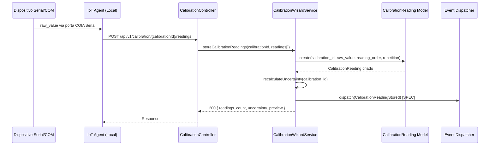

### 7.2 Endpoints

| Metodo | Rota | Descricao |
|--------|------|-----------|
| `POST` | `/api/v1/calibration/{calibration}/readings` | Armazenar leituras de calibracao (bulk) |
| `GET` | `/api/v1/calibration/{calibration}/readings` | Listar leituras de uma calibracao |
| `POST` | `/api/v1/calibration/{calibration}/repeatability` | Registrar teste de repetitividade |
| `POST` | `/api/v1/calibration/{calibration}/excentricity` | Registrar teste de excentricidade |
| `POST` | `/api/v1/calibration/calculate-ema` | Calcular EMA (Erro Maximo Admissivel) |

### 7.3 Services

| Service | Metodo | Responsabilidade |
|---------|--------|-----------------|
| `CalibrationWizardService` | `storeCalibrationReadings()` | Armazena leituras e recalcula incerteza |
| `EmaCalculator` | `calculate()` | Calcula Erro Maximo Admissivel conforme classe do instrumento |

### 7.4 Eventos

| Evento | Payload | Descricao |
|--------|---------|-----------|
| `CalibrationCompleted` | `workOrder`, `calibration_id`, `certificate_path` | Calibracao concluida com leituras IoT — certificado gerado |
| `CalibrationReadingStored` [SPEC] | `calibration_id`, `device_id`, `readings_count` | Leituras recebidas do dispositivo IoT |

### 7.5 Regras

> **[AI_RULE_CRITICAL]** O Payload do IoT Agent envia `device_id` e `raw_value`. O backend identifica a OS de calibracao atrelada e injeta o `CalibrationReading` autonomamente.

> **[AI_RULE]** Leituras vindas do IoT Agent DEVEM conter `reading_order` e `repetition` para garantir rastreabilidade ISO-17025. Leituras duplicadas (mesmo `calibration_id` + `reading_order` + `repetition`) devem ser rejeitadas.

---

## 8. Logistics x Fiscal — Notas de Remessa e Retorno

A integracao entre Logistics e Fiscal garante que toda movimentacao de RMA (Return Merchandise Authorization) gere as notas fiscais obrigatorias de remessa e retorno via NuvemFiscal.

### 8.1 Diagrama de Sequencia

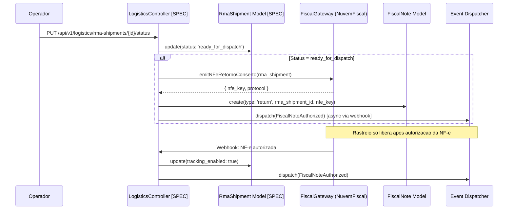

### 8.2 Endpoints

| Metodo | Rota | Descricao |
|--------|------|-----------|
| `POST` | `/api/v1/fiscal/notes/emit` | Emitir NF-e/NFS-e (usado internamente para RMA) |
| `POST` | `/api/v1/fiscal/webhook` | Webhook de retorno do provedor fiscal |
| `PUT` | `/api/v1/logistics/rma-shipments/{id}/status` [SPEC] | Atualizar status da remessa RMA |

### 8.3 Services

| Service | Metodo | Responsabilidade |
|---------|--------|-----------------|
| `NuvemFiscalProvider` | `emit()` | Emite NF-e via API NuvemFiscal |
| `FiscalGateway` | `emitNFe()` | Abstrai emissao fiscal (NuvemFiscal / FocusNFe) via interface `FiscalGatewayInterface` |
| `NFeDataBuilder` | `build()` | Constroi DTO da NF-e com dados da remessa |

### 8.4 Eventos

| Evento | Payload | Descricao |
|--------|---------|-----------|
| `FiscalNoteAuthorized` | `FiscalNote $fiscalNote` | NF-e autorizada pelo provedor fiscal — libera rastreio |
| `StockEntryFromNF` | `StockMovement $movement`, `nfNumber`, `supplierId` | Entrada de estoque vinculada a nota fiscal de retorno |

### 8.5 Regras

> **[AI_RULE_CRITICAL]** Ao mudar status do `RmaShipment` para `ready_for_dispatch`, dispara obrigatoriamente NF-e de Retorno de Conserto via NuvemFiscal. Rastreio so libera apos a autorizacao da nota.

> **[AI_RULE]** O listener `ReleaseWorkOrderOnFiscalNoteAuthorized` escuta `FiscalNoteAuthorized` e libera a OS vinculada, permitindo o envio do certificado de calibracao ao cliente.

---

## 9. WorkOrders x Finance — OS para Faturamento

O fechamento de uma OS com itens faturaveis dispara a geracao automatica de Invoice, AccountReceivable, deducao de estoque e emissao fiscal. O fluxo completo e orquestrado pelo listener `HandleWorkOrderInvoicing`.

### 9.1 Diagrama de Sequencia

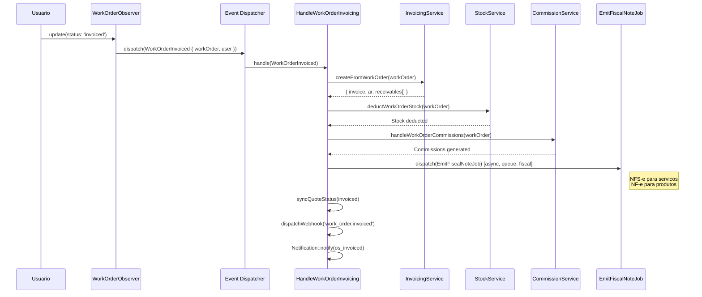

### 9.2 Endpoints

| Metodo | Rota | Descricao |
|--------|------|-----------|
| `PUT` | `/api/v1/work-orders/{workOrder}/status` | Atualizar status da OS (inclui transicao para `invoiced`) |
| `GET` | `/api/v1/work-orders/{workOrder}/items` | Listar itens faturaveis da OS |
| `GET` | `/api/v1/invoices` | Listar faturas geradas |
| `GET` | `/api/v1/accounts-receivable` | Listar contas a receber |

### 9.3 Services

| Service | Metodo | Responsabilidade |
|---------|--------|-----------------|
| `InvoicingService` | `createFromWorkOrder()` | Cria Invoice + AccountReceivable a partir da OS |
| `StockService` | `deduct()` | Deduz estoque de produtos utilizados na OS |
| `CommissionService` | `handleWorkOrderCommissions()` | Gera comissoes para tecnico e vendedor |

### 9.4 Eventos e Listeners

| Evento | Listener | Descricao |
|--------|----------|-----------|
| `WorkOrderInvoiced` | `HandleWorkOrderInvoicing` | Gera Invoice, deduz estoque, calcula comissoes, emite NF-e |
| `WorkOrderInvoiced` | `CreateWarrantyTrackingOnWorkOrderInvoiced` | Cria registros de garantia para produtos da OS |
| `WorkOrderCompleted` | `HandleWorkOrderCompletion` | Registra historico, recalcula health score, notifica cliente, dispara webhooks |
| `WorkOrderCompleted` | `TriggerNpsSurvey` | Envia pesquisa NPS ao cliente via email |
| `FiscalNoteAuthorized` | `ReleaseWorkOrderOnFiscalNoteAuthorized` | Libera OS vinculada apos autorizacao da NF-e |

### 9.5 Regras

> **[AI_RULE_CRITICAL]** Ao mudar o status da OS para `invoiced`, o listener `HandleWorkOrderInvoicing` executa em ordem: (1) cria Invoice + AccountReceivable via `InvoicingService`, (2) deduz estoque via `StockService`, (3) calcula comissoes via `CommissionService`, (4) emite NF-e/NFS-e via `EmitFiscalNoteJob`. Se a deducao de estoque falha, o faturamento inteiro e revertido (Invoice cancelada, AR cancelado, OS volta para `delivered`).

> **[AI_RULE]** O listener tem retry com backoff progressivo (`[10, 60, 300]` segundos). Apos 3 falhas, a OS e revertida para `delivered` e uma notificacao critica e enviada ao usuario.

> **[AI_RULE]** Se `fiscal_auto_emit` estiver habilitado no tenant, `EmitFiscalNoteJob` e despachado automaticamente: NFS-e para itens de servico, NF-e para itens de produto.

---

## 10. Inventory x Procurement — Inventario Negativo para Requisicao

A deducao de estoque abaixo do ponto de pedido (min_stock) dispara alerta automatico. O `StockMinimumAlertJob` roda diariamente e notifica administradores.

### 10.1 Diagrama de Sequencia

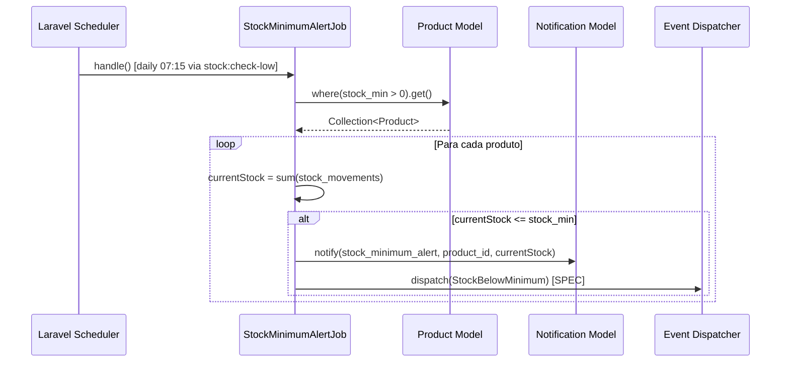

### 10.2 Endpoints

| Metodo | Rota | Descricao |
|--------|------|-----------|
| — | Scheduled Command `stock:check-low` (daily 07:15) | `StockMinimumAlertJob` verifica estoques minimos |
| `GET` | `/api/v1/stock/intelligence/reorder-points` | Pontos de reposicao com sugestao de compra |
| `GET` | `/api/v1/stock/intelligence/abc-curve` | Curva ABC de estoque |
| `GET` | `/api/v1/stock/dashboard` | Dashboard de estoque com alertas |
| `GET` | `/api/v1/stock/reserves` | Reservas de estoque ativas |

### 10.3 Services

| Service | Metodo | Responsabilidade |
|---------|--------|-----------------|
| `StockService` | `deduct()` | Deduz estoque e verifica ponto minimo |
| `StockIntelligenceController` | `reorderPoints()` | Calcula pontos de reposicao e sugere quantidades |

### 10.4 Eventos

| Evento | Payload | Descricao |
|--------|---------|-----------|
| `StockBelowMinimum` [SPEC] | `product_id`, `current_qty`, `min_stock`, `tenant_id` | Estoque abaixo do minimo — dispara alerta e requisicao |
| `StockEntryFromNF` | `StockMovement $movement`, `nfNumber`, `supplierId` | Entrada de estoque via nota fiscal de compra |

### 10.5 Regras

> **[AI_RULE_CRITICAL]** O `StockMinimumAlertJob` roda diariamente as 07:15 e verifica `current_qty <= stock_min` para todos os produtos com `stock_min > 0`. Envia `Notification` do tipo `stock_minimum_alert` para usuarios com permissao `estoque.manage`.

> **[AI_RULE]** O `StockService::deduct()` deve verificar `current_qty <= min_stock`. Caso verdadeiro, despachar evento `StockBelowMinimum` [SPEC]. O `ProcurementService` escuta e gera um `PurchaseRequisition` com status `draft` [SPEC].

> **[AI_RULE]** O job opera com retry (`tries = 2`, `backoff = 60s`) e loga erros por tenant sem interromper o processamento dos demais.

---

## 11. Contracts x Alerts x CRM — Contrato Vencendo

Contratos proximos ao vencimento disparam alertas via `ContractRenewing` event e criam notificacoes para o responsavel. O scheduler roda diariamente o comando `contracts:check-expiring`.

### 11.1 Diagrama de Sequencia

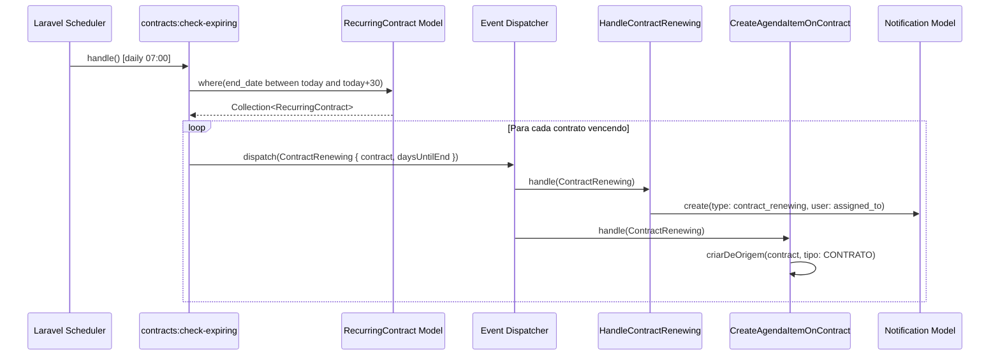

### 11.2 Endpoints

| Metodo | Rota | Descricao |
|--------|------|-----------|
| — | Scheduled Command `contracts:check-expiring` (daily 07:00) | Varre contratos vencendo em 30, 15 e 7 dias |
| `GET` | `/api/v1/contracts` | Lista contratos com filtro por status e vencimento |
| `GET` | `/api/v1/crm/deals` | Lista deals CRM (inclui pipeline de renovacao) |
| `GET` | `/api/v1/alerts` | Lista alertas do sistema incluindo contratos vencendo |

### 11.3 Services

| Service | Metodo | Responsabilidade |
|---------|--------|-----------------|
| `AlertEngineService` | `runAlertEngine()` | Motor de alertas que inclui contratos vencendo |
| `CrmSmartAlertGenerator` | `generate()` | Gera alertas inteligentes CRM incluindo churn e renovacao |

### 11.4 Eventos e Listeners

| Evento | Listener | Descricao |
|--------|----------|-----------|
| `ContractRenewing` | `HandleContractRenewing` | Cria `Notification` tipo `contract_renewing` para o responsavel (assigned_to ou created_by) |
| `ContractRenewing` | `CreateAgendaItemOnContract` | Cria item na Agenda vinculado ao contrato |

### 11.5 Regras

> **[AI_RULE_CRITICAL]** Job diario `contracts:check-expiring` varre `end_date` em 30, 15 e 7 dias. Dispara evento `ContractRenewing` com payload `{ contract, daysUntilEnd }`. O listener `HandleContractRenewing` cria notificacao para o responsavel.

> **[AI_RULE]** A geracao automatica de `CrmDeal` no Pipeline de Renovacao quando faltam 30 dias e uma funcionalidade [SPEC] — atualmente o sistema apenas notifica o responsavel.

---

## 12. Service-Calls x WorkOrders — Chamado para OS

Conversao direta de um chamado tecnico (ServiceCall) em uma Ordem de Servico acionavel para tecnicos de campo. A conversao e feita pelo `ServiceCallController::convertToWorkOrder()`.

### 12.1 Diagrama de Sequencia

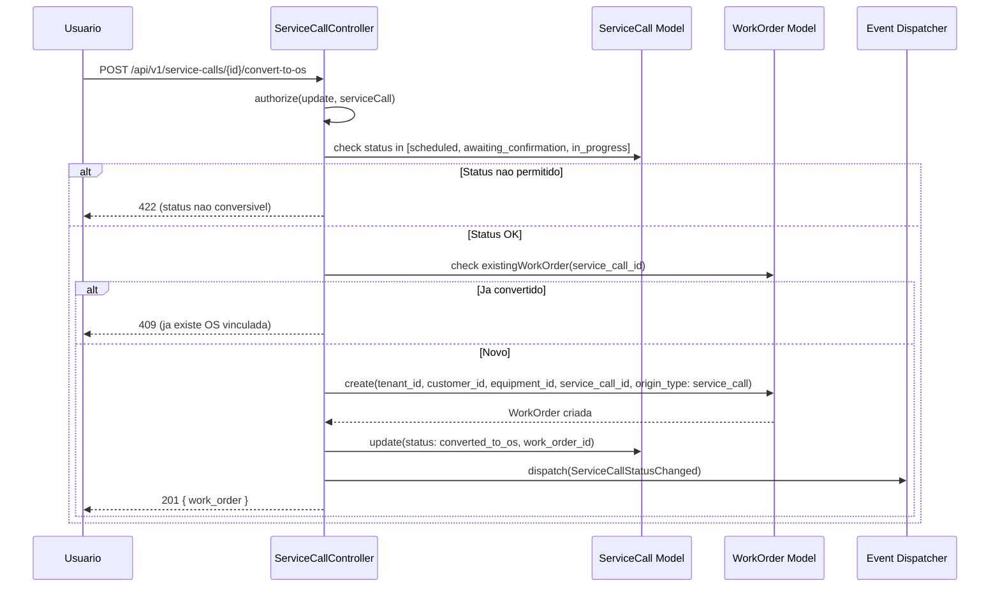

### 12.2 Endpoints

| Metodo | Rota | Descricao |
|--------|------|-----------|
| `POST` | `/api/v1/service-calls/{serviceCall}/convert-to-os` | Converter chamado em OS |
| `GET` | `/api/v1/service-calls` | Listar chamados tecnicos |
| `GET` | `/api/v1/service-calls/{serviceCall}` | Detalhe do chamado |
| `POST` | `/api/v1/service-calls` | Criar novo chamado |

### 12.3 Services

| Service | Metodo | Responsabilidade |
|---------|--------|-----------------|
| `ServiceCallController` | `convertToWorkOrder()` | Cria WorkOrder a partir do ServiceCall dentro de `DB::transaction` |
| `AutoAssignmentService` | `assign()` [SPEC] | Auto-atribuicao de tecnico baseado em disponibilidade |

### 12.4 Eventos e Listeners

| Evento | Listener | Descricao |
|--------|----------|-----------|
| `ServiceCallCreated` | `HandleServiceCallCreated` | Push notification para coordenador e atendimento |
| `ServiceCallCreated` | `CreateAgendaItemOnServiceCall` | Cria item na Agenda vinculado ao chamado |
| `ServiceCallStatusChanged` | — | Evento disparado na mudanca de status (inclui conversao para OS) |

### 12.5 Regras

> **[AI_RULE_CRITICAL]** A acao `convertToWorkOrder` copia `customer_id`, `equipment_id` (primeiro equipamento), `quote_id`, `technician_id` e `driver_id` do chamado. Cria a OS com `origin_type = 'service_call'` e `service_call_id = serviceCall.id`. O chamado entra no status `converted_to_os`.

> **[AI_RULE]** Status conversiveis: `scheduled`, `awaiting_confirmation`, `in_progress`. Se o chamado ja foi convertido (existe WO com mesmo `service_call_id`), retornar 409.

> **[AI_RULE]** A conversao ocorre dentro de `DB::transaction` para garantir atomicidade entre criacao da OS, atualizacao do chamado e registro de historico de status.

---

## 13. Operational x CRM — Retencao por Baixo NPS

Pesquisas de satisfacao (NPS/CSAT) com notas baixas (Detratores) acionam fluxo de retencao. O `TriggerNpsSurvey` listener envia a pesquisa apos conclusao da OS, e o modelo `SatisfactionSurvey` classifica automaticamente em promoter/passive/detractor.

### 13.1 Diagrama de Sequencia

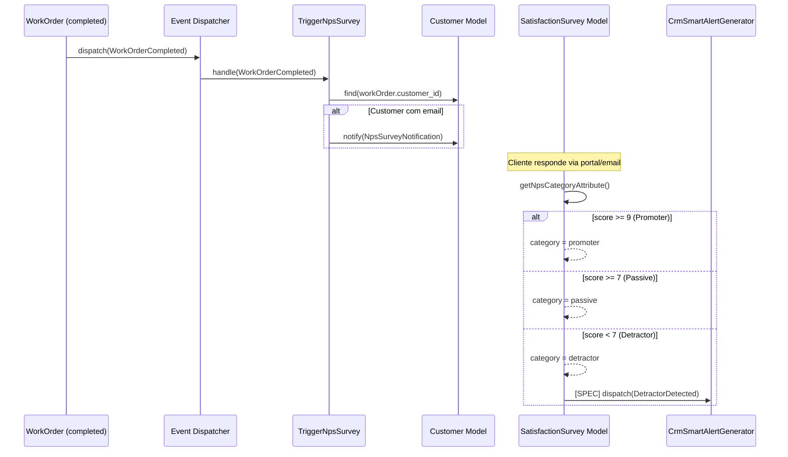

### 13.2 Endpoints

| Metodo | Rota | Descricao |
|--------|------|-----------|
| — | Scheduled Command `surveys:send-post-os` (daily 10:00) | Envia pesquisas de satisfacao pos-OS |
| `GET` | `/api/v1/satisfaction-surveys` | Listar pesquisas de satisfacao |
| `POST` | `/api/v1/satisfaction-surveys` | Registrar resposta de pesquisa |
| `GET` | `/api/v1/crm-features/alerts` | Alertas inteligentes CRM (inclui detratores) |

### 13.3 Services

| Service | Metodo | Responsabilidade |
|---------|--------|-----------------|
| `ChurnCalculationService` | `calculate()` | Calcula risco de churn baseado em NPS, frequencia e recencia |
| `CrmSmartAlertGenerator` | `generate()` | Gera alertas inteligentes incluindo detratores NPS |

### 13.4 Eventos e Listeners

| Evento | Listener | Descricao |
|--------|----------|-----------|
| `WorkOrderCompleted` | `TriggerNpsSurvey` | Envia pesquisa NPS ao cliente via `NpsSurveyNotification` |
| `DetractorDetected` [SPEC] | `CreateRetentionDeal` [SPEC] | Cria deal de retencao no CRM com prioridade alta |

### 13.5 Regras

> **[AI_RULE_CRITICAL]** Se uma resposta de `SatisfactionSurvey` tiver `nps_score < 7` (Detractor via `getNpsCategoryAttribute()`), o sistema deve disparar evento `DetractorDetected` [SPEC]. O CRM escuta e abre um deal de Retencao com prioridade Alta para o time de Customer Success.

> **[AI_RULE]** O `TriggerNpsSurvey` e um listener assincrono (`ShouldQueue`) que escuta `WorkOrderCompleted`. So envia a pesquisa se o cliente tiver email cadastrado.

> **[AI_RULE]** Classificacao NPS: score >= 9 = promoter, score >= 7 = passive, score < 7 = detractor. Calculada automaticamente pelo accessor `getNpsCategoryAttribute` no model `SatisfactionSurvey`.

---

## 14. HR x ESocial — Admissao (S-2200)

O processo de admissao no RH transmite os dados iniciais do vinculo ao eSocial. O `ESocialService` gera XML para diversos tipos de eventos (S-1000, S-2200, S-2206, S-2299, S-1200, S-1210, etc.) e o `GenerateESocialEventsJob` processa assincronamente.

### 14.1 Diagrama de Sequencia

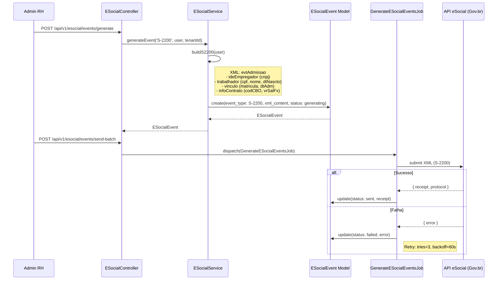

### 14.2 Endpoints

| Metodo | Rota | Descricao |
|--------|------|-----------|
| `POST` | `/api/v1/esocial/events/generate` | Gerar eventos eSocial (S-2200 e outros) |
| `POST` | `/api/v1/esocial/events/send-batch` | Enviar lote de eventos ao eSocial |
| `GET` | `/api/v1/esocial/events` | Listar eventos eSocial |
| `GET` | `/api/v1/esocial/events/{id}` | Detalhe de um evento |
| `GET` | `/api/v1/esocial/batches/{batchId}` | Consultar status de um lote |
| `GET` | `/api/v1/esocial/dashboard` | Dashboard eSocial com metricas |
| `GET` | `/api/v1/esocial/certificates` | Certificados digitais configurados |
| `POST` | `/api/v1/esocial/certificates` | Cadastrar certificado digital |
| `POST` | `/api/v1/esocial/events/{id}/exclude` | Excluir evento eSocial |
| `POST` | `/api/v1/esocial/rubric-table` | Gerar tabela de rubricas |

### 14.3 Services

| Service | Metodo | Responsabilidade |
|---------|--------|-----------------|
| `ESocialService` | `generateEvent(eventType, related, tenantId)` | Gera XML e cria `ESocialEvent` |
| `ESocialService` | `buildS2200(user)` | Constroi XML S-2200 (Admissao) com dados do trabalhador |
| `ESocialService` | `generatePayrollEvents(payroll)` | Gera eventos S-1200/S-1210 a partir da folha |
| `ESocialService` | `sendBatch(eventIds)` | Envia lote de eventos ao Gov.br |

### 14.4 Eventos e Listeners

| Evento | Listener | Descricao |
|--------|----------|-----------|
| `HrActionAudited` | `AuditHrActionListener` | Registra auditoria de acoes RH (inclui admissao) |
| — | `GenerateESocialEventsJob` | Job assincrono que processa envio de eventos ao eSocial (tries=3, backoff=60s) |

### 14.5 Regras

> **[AI_RULE_CRITICAL]** Ao aprovar a admissao (`status='hired'`), cria evento `ESocialEvent` tipo `S-2200`. O `GenerateESocialEventsJob` submete o XML ao eSocial via Gov.br, com retentativas (tries=3, backoff=60s). Eventos suportados: S-1000 (Empregador), S-2200 (Admissao), S-2206 (Alteracao contratual), S-2299 (Desligamento), S-1200 (Remuneracao), S-1210 (Pagamentos), S-2210 (CAT), S-2220 (ASO), S-2230 (Afastamento), S-2240 (Condicoes ambientais).

> **[AI_RULE]** O XML S-2200 DEVE conter: `ideEmpregador` (CNPJ do tenant), `trabalhador` (CPF, nome, data nascimento), `vinculo` (matricula, data admissao), `infoContrato` (CBO, salario fixo, undSalFixo, tpContr).

> **[AI_RULE]** O ambiente (`production` ou `restricted`) e controlado por `config('esocial.environment')`. A versao do layout e definida por `config('esocial.version')`.

---

## 15. Fleet x Alerts — Manutencao de Frota Vencida

Veiculos com data de revisao expirando precisam notificar o gestor de frota para evitar perda de garantia ou acidentes. O `FleetMaintenanceAlertJob` e o `FleetDocExpirationAlertJob` rodam diariamente verificando prazos.

### 15.1 Diagrama de Sequencia

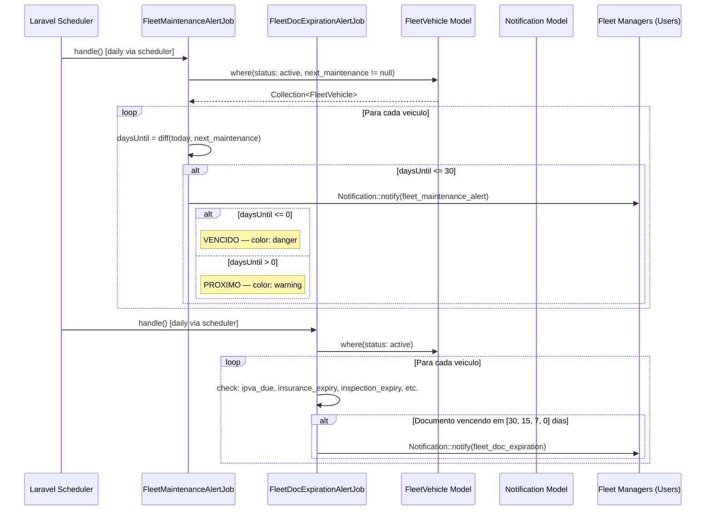

### 15.2 Endpoints

| Metodo | Rota | Descricao |
|--------|------|-----------|
| `GET` | `/api/v1/fleet/vehicles` | Listar veiculos da frota |
| `GET` | `/api/v1/fleet/vehicles/{vehicle}` | Detalhe do veiculo |
| `GET` | `/api/v1/fleet/vehicles/{vehicle}/inspections` | Inspecoes do veiculo |
| `POST` | `/api/v1/fleet/vehicles/{vehicle}/inspections` | Registrar nova inspecao |
| `GET` | `/api/v1/fleet/dashboard` | Dashboard da frota |
| `GET` | `/api/v1/fleet/analytics` | Analytics da frota |
| `GET` | `/api/v1/alerts` | Alertas do sistema (inclui fleet_maintenance_alert) |

### 15.3 Services

| Service | Metodo | Responsabilidade |
|---------|--------|-----------------|
| `FleetDashboardService` | `getDashboardData()` | Agrega metricas da frota incluindo alertas de manutencao |
| `DriverScoringService` | `calculate()` | Calcula score do motorista baseado em inspecoes e incidentes |
| `FuelComparisonService` | `compare()` | Compara consumo de combustivel entre veiculos |

### 15.4 Eventos

| Evento | Payload | Descricao |
|--------|---------|-----------|
| — | `FleetMaintenanceAlertJob` (Job) | Job diario que verifica `next_maintenance` e notifica gestores |
| — | `FleetDocExpirationAlertJob` (Job) | Job diario que verifica vencimento de IPVA, seguro, inspecao |
| `DocumentExpiring` | `document_type`, `expiry_date`, `entity` | Documento prestes a vencer (generico, usado tambem por Fleet) |

### 15.5 Regras

> **[AI_RULE_CRITICAL]** `FleetMaintenanceAlertJob` compara `next_maintenance` com `today()`. Se `daysUntilMaintenance <= 30`, emite alerta via `Notification::notify()` para todos os usuarios com permissao `fleet.vehicle.view`. Se `<= 0`, o alerta e critico (cor `danger`).

> **[AI_RULE_CRITICAL]** `FleetDocExpirationAlertJob` verifica documentos (IPVA, seguro, inspecao) nos marcos de 30, 15, 7 e 0 dias. Alerta com severidade escalonada.

> **[AI_RULE]** Ambos os jobs operam com `tries = 2`, `timeout = 120s`, `backoff = 60s` e rodam na fila `alerts`. Erros por tenant sao logados sem interromper o processamento dos demais tenants.

---

## 16. Matriz de Dependencias Cross-Module

| Modulo Origem | Modulo Destino | Tipo | Evento Principal |
|---------------|----------------|------|-----------------|
| Finance | Contracts | Scheduled Job | `RecurringBillingGenerated` |
| Contracts | WorkOrders | API Sync | `MeasurementAccepted` / `MeasurementRejected` |
| HR | Finance | Scheduled Job | `CommissionsCalculated` |
| Fiscal | Finance | Webhook | `FiscalNoteStatusChanged` |
| Helpdesk | Contracts | Service Lookup | `SlaDeadlinesRecalculated` |
| Lab | Quality | Service Sync | `CalibrationCompleted` / `CalibrationFailed` |
| IoT_Telemetry | Lab | API/Serial | `TelemetryDataReceived` |
| Logistics | Fiscal | Service Sync | `RmaShipmentCreated` |
| WorkOrders | Finance | Observer | `WorkOrderInvoiced` → `AccountReceivable` criado |
| WorkOrders | Inventory | Observer | `WorkOrderCompleted` → `StockService::deduct()` |
| WorkOrders | Lab | Observer | `WorkOrderCompleted` → `EquipmentCalibration.status` updated |
| WorkOrders | Agenda | Trait/Observer | `SyncsWithAgenda` → `AgendaItem` criado/atualizado |
| WorkOrders | CRM | Controller | Deal convertido em OS via `CrmController::dealsConvertToWorkOrder()` |
| Quotes | WorkOrders | Controller | Orçamento aprovado gera OS (`origin_type='quote'`) |
| ServiceCalls | WorkOrders | Controller | Chamado convertido em OS (`origin_type='service_call'`) |
| Contracts | WorkOrders | Scheduled Job | `RecurringContractService` gera OS periódicas |
| CRM | Innovation | Service | Referral convertido gera `CrmLead` via `Eternal Lead` rule |
| CRM | Quotes | Controller | Lead qualificado gera Quote via pipeline |
| Quality | WorkOrders | Observer | `RncCreated` quando rework detect em OS |
| SupplierPortal | Purchasing | Service | `PurchaseQuoteResponse` matched com `PurchaseOrder` |
| Analytics | All Modules | Read-only | Dashboards agregam dados de todos os módulos via queries read-only |
| FixedAssets | Finance | Observer/Job | `AssetDisposed` → AR (venda) ou lancamento de perda + NF-e |
| FixedAssets | Fiscal | Async Job | `RunMonthlyDepreciationJob` → SPED Bloco G via `SpedBlockGService` |
| Projects | Finance | Service Sync | `MilestoneInvoiced` → Invoice + AccountReceivable |
| Projects | Alerts | Observer | `ProjectBudgetExceeded` → SystemAlert para gerente |
| Omnichannel | CRM | Service Sync | `InboundMessageRouter` → CrmDeal via classificacao de intent |
| Omnichannel | Helpdesk | Service Sync | `InboundMessageRouter` → PortalTicket via classificacao de intent |

---

## 17. Analytics_BI x All Modules — ETL Read-Only e Extracao de Dados

O modulo Analytics/BI agrega dados de TODOS os demais modulos em modo read-only para dashboards, KPIs, deteccao de anomalias e relatorios agendados. Opera como consumer puro — nunca escreve em modulos de origem.

### 17.1 Diagrama de Sequencia

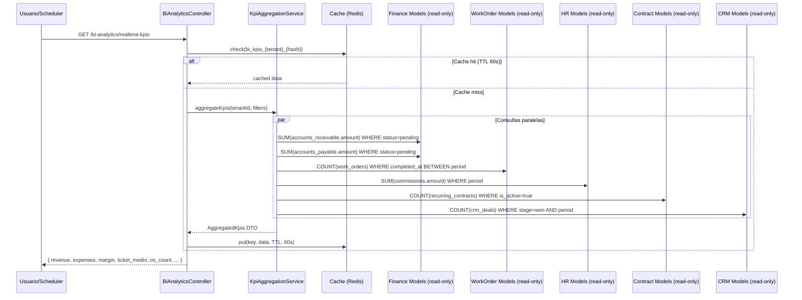

### 17.2 Endpoints

| Metodo | Rota | Descricao |
|--------|------|-----------|
| `GET` | `/api/v1/bi-analytics/realtime-kpis` | KPIs em tempo real (receita, inadimplencia, ticket medio) |
| `GET` | `/api/v1/bi-analytics/profitability-by-os` | Rentabilidade por OS com comissoes e despesas |
| `GET` | `/api/v1/bi-analytics/anomaly-detection` | Deteccao de anomalias financeiras |
| `GET` | `/api/v1/bi-analytics/period-comparison` | Comparacao entre periodos |
| `GET` | `/api/v1/bi-analytics/scheduled-exports` | Exportacoes agendadas |
| `POST` | `/api/v1/bi-analytics/scheduled-exports` | Criar exportacao agendada |
| `GET` | `/api/v1/bi-analytics/contract-revenue` | Receita por contrato com projecao |
| `GET` | `/api/v1/bi-analytics/churn-risk` | Score de risco de churn por cliente |

### 17.3 Services

| Service | Metodo | Responsabilidade |
|---------|--------|-----------------|
| `KpiAggregationService` | `aggregateKpis(tenantId, filters)` | Agrega receita, inadimplencia, ticket medio em tempo real |
| `ProfitabilityService` | `calculateByWorkOrder(tenantId, period)` | Calcula rentabilidade cruzando OS, comissoes e despesas |
| `AnomalyDetectionService` | `detect(tenantId, period)` | Detecta outliers em recebimentos usando desvio padrao (z-score > 2) |
| `ScheduledExportService` | `run(exportConfig)` | Gera exportacoes agendadas (CSV/XLSX) e envia por email |

### 17.4 Modulos Consultados (Fronteira de Extracao)

| Modulo Origem | Models Lidos | Dados Extraidos | Cache TTL |
|---------------|-------------|-----------------|-----------|
| **Finance** | `AccountReceivable`, `AccountPayable`, `Invoice`, `Expense` | Receita, despesas, inadimplencia, fluxo de caixa | 60s |
| **WorkOrders** | `WorkOrder`, `WorkOrderItem` | OS concluidas, tempo medio, valor medio | 60s |
| **HR** | `Commission`, `PayrollLine` | Comissoes pagas, custo de mao de obra | 120s |
| **Contracts** | `RecurringContract`, `Contract` | Contratos ativos, MRR, churn, renovacoes | 120s |
| **CRM** | `CrmDeal`, `Customer`, `SatisfactionSurvey` | Deals won/lost, NPS, pipeline value | 120s |
| **Inventory** | `Product`, `StockMovement` | Giro de estoque, curva ABC, valor imobilizado | 300s |
| **Helpdesk** | `PortalTicket`, `SlaPolicy` | SLA compliance, tempo resposta medio, backlog | 120s |
| **Lab** | `Calibration`, `CalibrationReading` | Calibracoes/mes, taxa aprovacao, incerteza media | 300s |
| **Fleet** | `FleetVehicle`, `FuelLog` | Custo de frota, consumo medio, km rodados | 300s |

### 17.5 Eventos

| Evento | Payload | Descricao |
|--------|---------|-----------|
| `ScheduledExportCompleted` | `export_id`, `tenant_id`, `file_path`, `format`, `rows_count` | Exportacao agendada finalizada — notifica solicitante |
| `AnomalyDetected` | `tenant_id`, `metric`, `expected_value`, `actual_value`, `z_score` | Anomalia financeira detectada — cria SystemAlert |

### 17.6 Regras

> **[AI_RULE_CRITICAL]** Analytics NUNCA escreve dados em outros modulos. Todas as queries sao read-only e filtradas por `tenant_id` via `BelongsToTenant`. Nenhuma mutation, nenhum INSERT, nenhum UPDATE em tabelas de outros modulos.

> **[AI_RULE]** Todas as queries BI DEVEM usar `Cache::remember()` com TTL adequado ao tipo de dado (ver tabela acima). Queries pesadas (anomaly detection, curva ABC) DEVEM rodar em Job assincrono com resultado cacheado.

> **[AI_RULE]** Sync vs Async: endpoints de KPI sao sync com cache. Exportacoes agendadas sao async (`ScheduledExportJob`, fila `exports`). Deteccao de anomalias roda via Job diario `RunAnomalyDetectionJob` (07:30). Retry: `[10, 60, 300]`.

> **[AI_RULE]** Chave de idempotencia para exportacoes: `tenant_id + export_config_id + reference_date`. Nao gerar exportacao duplicada para o mesmo periodo.

---

## 18. Inmetro — Inteligencia Comercial e Lacres

O modulo Inmetro integra dados de instrumentos verificados pelo INMETRO com o CRM para geracao de leads e com o modulo de Qualidade para controle de lacres/selos.

### 18.1 Endpoints Principais

| Metodo | Rota | Descricao |
|--------|------|-----------|
| `GET` | `/api/v1/inmetro/dashboard` | Dashboard de inteligencia INMETRO |
| `GET` | `/api/v1/inmetro/owners` | Proprietarios de instrumentos |
| `GET` | `/api/v1/inmetro/instruments` | Instrumentos verificados |
| `GET` | `/api/v1/inmetro/leads` | Leads gerados a partir de dados INMETRO |
| `POST` | `/api/v1/inmetro/convert/{ownerId}` | Converter proprietario em Customer |
| `GET` | `/api/v1/inmetro/seals` | Lacres/selos INMETRO |
| `POST` | `/api/v1/inmetro/seals/batch` | Cadastrar lote de lacres |
| `POST` | `/api/v1/inmetro/seals/{id}/use` | Aplicar lacre a instrumento |
| `POST` | `/api/v1/inmetro/seals/assign` | Atribuir lacres a tecnico |

### 18.2 Integracoes Cross-Module

| Modulo Destino | Tipo | Descricao |
|----------------|------|-----------|
| CRM | Conversao | `convertToCustomer()` transforma proprietario INMETRO em `Customer` |
| Lab | Vinculacao | `linkInstrument()` vincula instrumento INMETRO a equipamento do Lab |
| Quality | Compliance | Checklists de conformidade INMETRO |
| Scheduler | Sync | `inmetro:sync` roda 4x/dia, `inmetro:check-rejections` a cada 4h, `inmetro:generate-leads` diario as 07:45 |

---

## 19. FixedAssets x Finance — Depreciacao e Baixa Patrimonial

O modulo FixedAssets integra com Finance para depreciacao mensal automatica, geracao de lancamentos contabeis e controle de baixas patrimoniais. A `dispose_asset()` gera AccountPayable ou AccountReceivable conforme o tipo de baixa, alem de nota fiscal quando aplicavel.

### 19.1 Diagrama de Sequencia

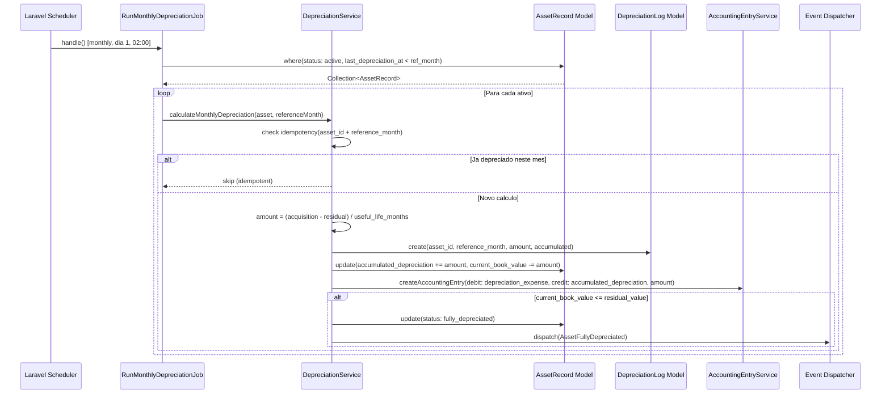

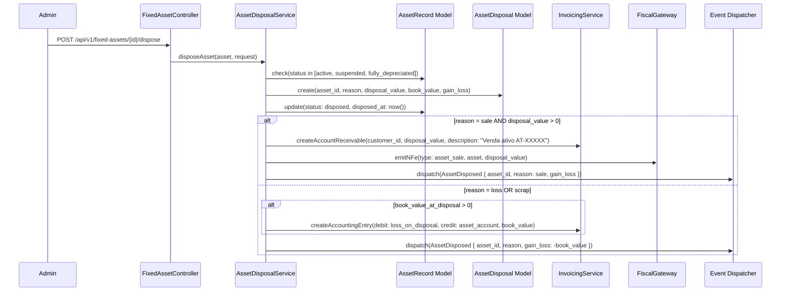

### 19.2 Endpoints

| Metodo | Rota | Descricao |
|--------|------|-----------|
| `POST` | `/api/v1/fixed-assets` | Cadastrar ativo imobilizado |
| `GET` | `/api/v1/fixed-assets` | Listar ativos com filtros (category, status) |
| `GET` | `/api/v1/fixed-assets/{id}` | Detalhe do ativo com historico de depreciacao |
| `PUT` | `/api/v1/fixed-assets/{id}` | Atualizar ativo |
| `POST` | `/api/v1/fixed-assets/{id}/dispose` | Registrar baixa patrimonial (venda, perda, sucata, doacao) |
| `POST` | `/api/v1/fixed-assets/depreciation/run` | Executar depreciacao mensal (trigger manual) |
| `GET` | `/api/v1/fixed-assets/depreciation/logs` | Historico de depreciacoes |
| `GET` | `/api/v1/fixed-assets/dashboard` | Dashboard patrimonial (valor total, depreciado, CIAP) |
| — | Scheduled Job `RunMonthlyDepreciationJob` (monthly dia 1, 02:00) | Depreciacao automatica |

### 19.3 Services

| Service | Metodo | Responsabilidade |
|---------|--------|-----------------|
| `DepreciationService` | `calculateMonthlyDepreciation(asset, month)` | Calcula depreciacao linear/acelerada, cria DepreciationLog e lancamento contabil |
| `AssetDisposalService` | `disposeAsset(asset, request)` | Registra baixa, calcula gain/loss, gera AR (venda) ou lancamento de perda, emite NF-e |
| `AccountingEntryService` | `createAccountingEntry(debit, credit, amount)` | Gera lancamento contabil (depreciacao ou baixa) |
| `SpedBlockGService` | `generate(tenantId, referenceMonth)` | Gera registros G110, G125, G130, G140 para SPED Fiscal |

### 19.4 Eventos e Listeners

| Evento | Listener | Descricao |
|--------|----------|-----------|
| `AssetDisposed` | `HandleAssetDisposal` | Gera AR (se venda), cria lancamento contabil de baixa, emite NF-e via `EmitFiscalNoteJob` |
| `AssetDisposed` | `NotifyAssetManagers` | Notifica gestores patrimoniais sobre baixa realizada |
| `AssetFullyDepreciated` | `HandleFullyDepreciatedAsset` | Marca ativo como totalmente depreciado, notifica gestor |

### 19.5 Payload — `AssetDisposed`

```json
{
  "asset_id": 10,
  "asset_code": "AT-00010",
  "tenant_id": 1,
  "reason": "sale",
  "disposal_value": 15000.00,
  "book_value_at_disposal": 12000.00,
  "gain_loss": 3000.00,
  "fiscal_note_id": null,
  "disposed_by": 7,
  "disposed_at": "2026-03-25T14:00:00Z"
}
```

### 19.6 Regras

> **[AI_RULE_CRITICAL]** `RunMonthlyDepreciationJob` DEVE verificar `DepreciationLog::where('asset_record_id', $id)->where('reference_month', $month)->exists()` antes de criar novo registro. Depreciacao duplicada e falha contabil grave. Chave de idempotencia: `asset_record_id + reference_month`.

> **[AI_RULE_CRITICAL]** `AssetDisposalService::disposeAsset()` ao registrar baixa por venda (`reason=sale`) DEVE criar `AccountReceivable` com valor de `disposal_value` e emitir NF-e de saida via `FiscalGateway`. Para baixas por perda/sucata, gerar lancamento de perda (debit: loss_on_disposal).

> **[AI_RULE]** Depreciacao mensal NUNCA pode fazer `current_book_value` ficar abaixo de `residual_value`. O calculo trunca ao atingir o residual e marca ativo como `fully_depreciated`.

> **[AI_RULE]** Sync vs Async: depreciacao mensal e async (Job na fila `accounting`). Baixa patrimonial e sync (dentro de `DB::transaction`). Emissao fiscal de venda e async (`EmitFiscalNoteJob`, fila `fiscal`). Retry policy: `[10, 60, 300]` para jobs async.

---

## 20. SupplierPortal — Portal do Fornecedor

O modulo SupplierPortal permite que fornecedores respondam cotacoes e acompanhem pedidos de compra.

### 20.1 Integracoes Cross-Module

| Modulo Destino | Tipo | Descricao |
|----------------|------|-----------|
| Procurement | Service [SPEC] | `PurchaseQuoteResponse` matched com `PurchaseOrder` |
| Inventory | Recebimento [SPEC] | Confirmacao de recebimento atualiza estoque via `StockEntryFromNF` |
| Fiscal | NF-e [SPEC] | Nota fiscal de entrada vinculada ao pedido de compra |

> **[AI_RULE]** Modulo planejado. A integracao com Procurement para cotacoes e com Inventory para recebimento serao implementadas conforme roadmap.

---

## 21. TvDashboard — Painel TV Operacional

O TvDashboard agrega dados em tempo real de WorkOrders, ServiceCalls, tecnicos e cameras para exibicao em telas de monitoramento.

### 21.1 Endpoints

| Metodo | Rota | Descricao |
|--------|------|-----------|
| `GET` | `/api/v1/tv/dashboard` | Dashboard completo (cameras, tecnicos, OS, chamados, KPIs) |
| `GET` | `/api/v1/tv/kpis` | KPIs operacionais (chamados hoje, OS em execucao, tecnicos online) |
| `GET` | `/api/v1/tv/kpis/trend` | Tendencia de KPIs por hora (ultimas 8 horas) |
| `GET` | `/api/v1/tv/map-data` | Dados de mapa (tecnicos e OS geolocalizadas) |
| `GET` | `/api/v1/tv/alerts` | Alertas ativos (tecnicos offline, chamados sem atendimento, OS longas) |
| `GET` | `/api/v1/tv/alerts/history` | Historico de alertas (ultimas 24 horas) |
| `GET` | `/api/v1/tv/productivity` | Ranking de produtividade dos tecnicos (hoje) |

### 21.2 Modulos Consultados (Read-only)

| Modulo | Dados | Cache |
|--------|-------|-------|
| WorkOrders | OS ativas, finalizadas hoje, tempo medio execucao | 30s |
| ServiceCalls | Chamados hoje, sem atendimento, tempo medio resposta | 30s |
| HR (Technicians) | Tecnicos online, em campo, status de localizacao | 30s |
| Core (Cameras) | Streams RTSP/HLS configuradas | — |

> **[AI_RULE]** TvDashboard usa `Cache::remember()` com TTL curto (30-120s) para evitar sobrecarga. Todas as queries sao read-only e filtradas por `tenant_id`.

---

## 22. WeightTool — Gestao de Pesos-Padrao e Ferramentas

O modulo WeightTool gerencia atribuicao de pesos-padrao a tecnicos e controla calibracoes de ferramentas, integrando com Lab e Inventory.

### 22.1 Endpoints

| Metodo | Rota | Descricao |
|--------|------|-----------|
| `GET` | `/api/v1/weight-assignments` | Listar atribuicoes de pesos-padrao |
| `POST` | `/api/v1/weight-assignments` | Atribuir peso-padrao a tecnico |
| `PUT` | `/api/v1/weight-assignments/{assignment}/return` | Devolver peso-padrao |
| `GET` | `/api/v1/tool-calibrations` | Listar calibracoes de ferramentas |
| `GET` | `/api/v1/tool-calibrations/expiring` | Ferramentas com calibracao vencendo |
| `POST` | `/api/v1/tool-calibrations` | Registrar calibracao de ferramenta |
| `GET` | `/api/v1/standard-weights` | Listar pesos-padrao disponiveis |
| `GET` | `/api/v1/standard-weights/{weight}/wear-history` | Historico de desgaste do peso-padrao |

### 22.2 Integracoes Cross-Module

| Modulo Destino | Tipo | Descricao |
|----------------|------|-----------|
| Lab | Calibracao | Pesos-padrao usados como referencia em calibracoes de balancas |
| Inventory | Rastreabilidade | Ferramentas rastreadas como itens de estoque com checkout/checkin |
| WorkOrders | Vinculacao | Ferramentas atribuidas ao tecnico para uso em OS de campo |

---

## 23. Omnichannel x CRM x Helpdesk — Roteamento de Mensagens Inbound

O modulo Omnichannel unifica canais de comunicacao (WhatsApp, Email, Portal) e roteia mensagens inbound para CRM (contatos/deals) ou Helpdesk (tickets). O `InboundMessageRouter` classifica a mensagem e cria ou atualiza a entidade correta.

### 23.1 Diagrama de Sequencia

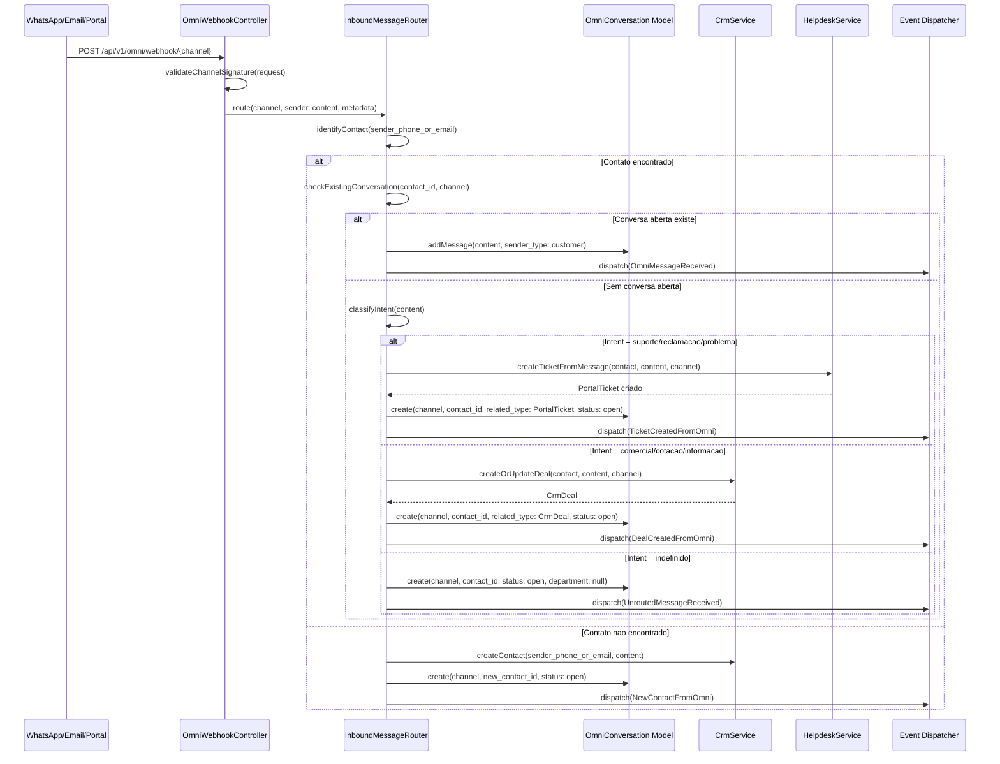

### 23.2 Endpoints

| Metodo | Rota | Descricao |
|--------|------|-----------|
| `POST` | `/api/v1/omni/webhook/{channel}` | Webhook inbound (WhatsApp, Email, Portal) |
| `GET` | `/api/v1/omni/conversations` | Listar conversas (inbox unificada) |
| `GET` | `/api/v1/omni/conversations/{id}` | Detalhe da conversa com mensagens |
| `POST` | `/api/v1/omni/conversations/{id}/messages` | Enviar mensagem na conversa |
| `POST` | `/api/v1/omni/conversations/{id}/assign` | Atribuir conversa a agente |
| `POST` | `/api/v1/omni/conversations/{id}/convert-to-ticket` | Converter conversa em ticket Helpdesk |
| `POST` | `/api/v1/omni/conversations/{id}/convert-to-deal` | Converter conversa em deal CRM |
| `GET` | `/api/v1/whatsapp/config` | Configuracao do WhatsApp |
| `POST` | `/api/v1/whatsapp/send` | Enviar mensagem WhatsApp |
| `POST` | `/api/v1/whatsapp/test` | Testar conexao WhatsApp |
| `GET` | `/api/v1/emails` | Caixa de entrada de emails |
| `POST` | `/api/v1/emails/send` | Enviar email |
| `POST` | `/api/v1/push-subscriptions` | Registrar subscription push |

### 23.3 Services

| Service | Metodo | Responsabilidade |
|---------|--------|-----------------|
| `InboundMessageRouter` | `route(channel, sender, content, metadata)` | Classifica mensagem inbound e roteia para CRM ou Helpdesk |
| `InboundMessageRouter` | `identifyContact(senderIdentifier)` | Busca contato por telefone ou email em `contacts` e `customers` |
| `InboundMessageRouter` | `classifyIntent(content)` | Classifica intencao: suporte, comercial, indefinido (keywords + IA) |
| `OmniConversationService` | `convertToTicket(conversation)` | Cria `PortalTicket` a partir de conversa, vincula via morph |
| `OmniConversationService` | `convertToDeal(conversation)` | Cria `CrmDeal` a partir de conversa, vincula via morph |

### 23.4 Eventos e Listeners

| Evento | Listener | Descricao |
|--------|----------|-----------|
| `OmniMessageReceived` | `NotifyAssignedAgent` | Push notification para agente atribuido a conversa |
| `TicketCreatedFromOmni` | `HandleTicketFromOmni` | Aplica SLA ao ticket, notifica equipe de suporte |
| `DealCreatedFromOmni` | `HandleDealFromOmni` | Insere deal no pipeline CRM, notifica vendedor |
| `NewContactFromOmni` | `HandleNewOmniContact` | Cria contato basico, envia auto-reply de boas-vindas |
| `UnroutedMessageReceived` | `NotifyOmniSupervisor` | Mensagem sem classificacao — notifica supervisor para triagem manual |

### 23.5 Payload — `OmniMessageReceived`

```json
{
  "conversation_id": 234,
  "tenant_id": 1,
  "channel": "whatsapp",
  "contact_id": 42,
  "sender_identifier": "+5511999998888",
  "content": "Bom dia, preciso agendar uma calibracao",
  "content_type": "text",
  "external_id": "wamid.HBgLNTUxMTk5OTk4ODg4FQIAEhgUM0",
  "received_at": "2026-03-25T09:15:00Z"
}
```

### 23.6 Regras

> **[AI_RULE_CRITICAL]** Identificacao de contato usa busca fuzzy: primeiro por `phone` (normalizado), depois por `email`. Se o mesmo remetente ja tem conversa aberta no mesmo canal, a mensagem e adicionada a conversa existente — NUNCA criar conversa duplicada. Chave de idempotencia: `tenant_id + channel + source_id (external_id)`.

> **[AI_RULE]** Classificacao de intent e feita por keywords + IA (opcional). Keywords de suporte: "problema", "erro", "defeito", "reclamacao", "chamado", "nao funciona". Keywords comerciais: "orcamento", "preco", "cotacao", "proposta", "contratar". Se nenhum match, intent = indefinido e mensagem vai para fila de triagem.

> **[AI_RULE]** Sync vs Async: webhook inbound e sync (responde 200 rapido). Classificacao de intent e async se usar IA (`ClassifyOmniIntentJob`, fila `omni`). Criacao de ticket/deal e sync dentro do handler. Retry policy para webhook processing: `[5, 30, 120]`.

> **[AI_RULE]** Integracoes cross-module adicionais mantidas:
> - WorkOrders: Push notification ao tecnico via `HandleWorkOrderStatusChanged`
> - ServiceCalls: Push para coordenador via `HandleServiceCallCreated`
> - CRM: `ProcessCrmSequences` envia emails automaticos de prospeccao
> - Email: `SyncEmailAccountJob` sincroniza IMAP a cada 2 min, `ClassifyEmailJob` classifica com IA
> - HR: Comprovantes de ponto, alertas de ferias, decisoes de ajuste

---

## 24. Innovation — Motor de Leads Eternos

O modulo Innovation implementa o conceito de "Eternal Lead" — referrals e indicacoes que geram leads perpetuos no CRM.

### 24.1 Integracoes Cross-Module

| Modulo Destino | Tipo | Descricao |
|----------------|------|-----------|
| CRM | Conversao | Referral convertido gera `CrmLead` via regra de "Eternal Lead" |
| Inmetro | Leads | Dados de instrumentos INMETRO alimentam pipeline de inovacao comercial |
| Analytics | Metricas [SPEC] | Dashboard de ROI de inovacao e taxa de conversao de referrals |

> **[AI_RULE]** Modulo em fase de implementacao. A integracao principal com CRM via referrals ja esta no roadmap.

---

## 25. IoT_Telemetry — Dispositivos e Sensores

O modulo IoT_Telemetry gerencia dispositivos conectados (balancas, sensores de temperatura/umidade) para captura automatica de dados em calibracoes e monitoramento ambiental.

### 25.1 Integracoes Cross-Module

| Modulo Destino | Tipo | Descricao |
|----------------|------|-----------|
| Lab | Leituras | Captura automatica de leituras de calibracao via porta COM/Serial (secao 7) |
| Quality | Ambiente | Monitoramento de condicoes ambientais (temperatura, umidade) para conformidade ISO-17025 [SPEC] |
| Alerts | Monitoramento | Alertas quando sensor detecta condicoes fora de especificacao [SPEC] |
| WorkOrders | Telemetria | Dados de sensores vinculados a OS de manutencao preditiva [SPEC] |

> **[AI_RULE]** Dispositivos IoT sao identificados por `device_id`. O mapeamento `device_id -> instrument_id` e feito na configuracao do tenant. Dados brutos sao armazenados em `telemetry_readings` [SPEC] com timestamp, device_id e raw_value.

---

## 26. Projects x Finance — Milestone Billing e Controle Orcamentario

O modulo Projects integra com Finance para faturamento por milestone, rastreamento de orcamento e alerta de estouro. Cada milestone completado pode gerar automaticamente uma Invoice. O `ProjectBudgetService` monitora gastos e dispara `ProjectBudgetExceeded` quando o `spent` ultrapassa o `budget`.

### 26.1 Diagrama de Sequencia

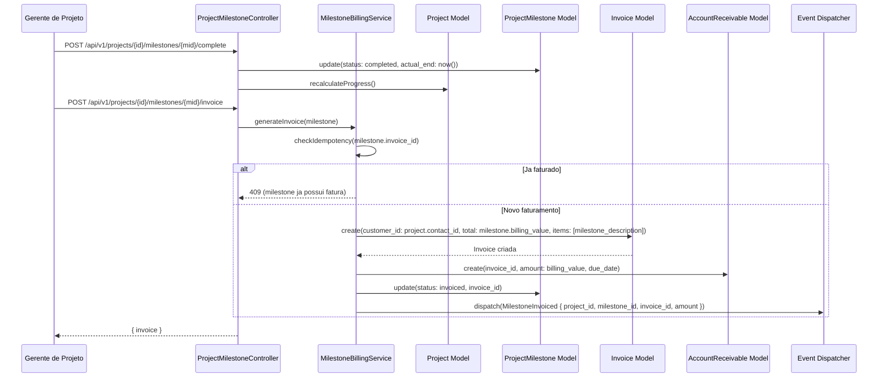

```mermaid
sequenceDiagram
    participant TimeEntry as ProjectTimeEntry (created)
    participant Observer as ProjectTimeEntryObserver
    participant Budget as ProjectBudgetService
    participant Project as Project Model
    participant Event as Event Dispatcher
    participant Notif as Notification

    TimeEntry->>Observer: created(timeEntry)
    Observer->>Budget: updateSpent(project_id)
    Budget->>Project: spent += hours * hourly_rate (se billable)
    Budget->>Budget: checkBudgetThreshold(project)
    alt spent > budget
        Budget->>Event: dispatch(ProjectBudgetExceeded { project_id, budget, spent, overage_percent })
        Budget->>Notif: notify(project.manager_id, budget_exceeded)
    else spent > budget * 0.80
        Budget->>Notif: notify(project.manager_id, budget_warning_80_percent)
    end
```

### 26.2 Endpoints

| Metodo | Rota | Descricao |
|--------|------|-----------|
| `POST` | `/api/v1/projects/{id}/milestones/{mid}/complete` | Marcar milestone como concluido |
| `POST` | `/api/v1/projects/{id}/milestones/{mid}/invoice` | Gerar fatura do milestone |
| `GET` | `/api/v1/projects/{id}/budget` | Resumo orcamentario (budget, spent, remaining, % consumed) |
| `GET` | `/api/v1/projects/{id}/cost-breakdown` | Breakdown de custos (mao de obra, materiais, terceiros) |
| `POST` | `/api/v1/projects/{id}/time-entries` | Registrar horas (incrementa spent se billable) |
| `GET` | `/api/v1/projects/dashboard` | Dashboard portfolio com saude financeira dos projetos |

### 26.3 Services

| Service | Metodo | Responsabilidade |
|---------|--------|-----------------|
| `MilestoneBillingService` | `generateInvoice(milestone)` | Cria Invoice + AccountReceivable a partir do milestone. Herda `contact_id` do projeto |
| `ProjectBudgetService` | `updateSpent(projectId)` | Recalcula `spent` somando `hours * hourly_rate` de TimeEntries billable |
| `ProjectBudgetService` | `checkBudgetThreshold(project)` | Verifica se spent > budget (100%) ou > 80%. Dispara alertas |
| `ProjectBudgetService` | `getCostBreakdown(projectId)` | Retorna breakdown: labor, materials, external |

### 26.4 Eventos e Listeners

| Evento | Listener | Descricao |
|--------|----------|-----------|
| `MilestoneInvoiced` | `HandleMilestoneInvoiced` | Sincroniza status do milestone, atualiza metricas do projeto |
| `ProjectBudgetExceeded` | `HandleProjectBudgetExceeded` | Notifica gerente e stakeholders, cria `SystemAlert` tipo `project_budget_exceeded` |
| `ProjectBudgetExceeded` | `PauseProjectOnCriticalOverage` | Se overage > 120%, sugere pausar projeto (nao pausa automaticamente — requer decisao humana) |
| `ProjectCompleted` | `HandleProjectCompletion` | Verifica milestones nao faturados, gera relatorio final de custos |

### 26.5 Payload — `ProjectBudgetExceeded`

```json
{
  "project_id": 15,
  "project_code": "PRJ-00015",
  "tenant_id": 1,
  "budget": 50000.00,
  "spent": 52500.00,
  "overage_percent": 5.0,
  "manager_id": 7,
  "top_cost_categories": [
    {"category": "labor", "amount": 38000.00},
    {"category": "materials", "amount": 14500.00}
  ],
  "exceeded_at": "2026-03-25T16:00:00Z"
}
```

### 26.6 Payload — `MilestoneInvoiced`

```json
{
  "project_id": 15,
  "milestone_id": 42,
  "milestone_name": "Fase 2 — Calibracao em Campo",
  "invoice_id": 890,
  "amount": 15000.00,
  "contact_id": 42,
  "tenant_id": 1,
  "invoiced_at": "2026-03-25T14:30:00Z"
}
```

### 26.7 Regras

> **[AI_RULE_CRITICAL]** Milestone so pode ser faturado se `status = completed`. Idempotencia: se `milestone.invoice_id` ja esta preenchido, retornar 409 sem criar fatura duplicada. Chave de idempotencia: `milestone_id`.

> **[AI_RULE_CRITICAL]** `ProjectBudgetExceeded` DEVE ser disparado quando `project.spent > project.budget`. O gerente recebe notificacao imediata. Warning preventivo em 80% do orcamento via `Notification`.

> **[AI_RULE]** Invoice de milestone herda `contact_id` (customer) do `Project`. Itens da fatura incluem nome do milestone e descricao dos entregaveis. Se `billing_type = hourly`, a fatura e baseada em horas logadas * hourly_rate. Se `billing_type = milestone`, usa `milestone.billing_value`.

> **[AI_RULE]** Sync vs Async: faturamento de milestone e sync (dentro de `DB::transaction`). Verificacao de orcamento e sync (no observer de TimeEntry). Notificacoes de budget exceeded sao async (fila `notifications`). Retry policy: N/A para sync.

> **[AI_RULE]** `ProjectTimeEntry` com `billable = true` incrementa `project.spent` em `hours * resource.hourly_rate`. Entries com `billable = false` sao rastreadas mas nao afetam o orcamento.

---

## 27. Registro Mestre de Eventos

Mapa completo de todos os eventos, listeners e modulos do sistema.

| Evento | Classe | Listener(s) | Modulo Origem | Modulo(s) Destino |
|--------|--------|-------------|---------------|-------------------|
| WorkOrderStarted | `App\Events\WorkOrderStarted` | `LogWorkOrderStartActivity`, `CreateAgendaItemOnWorkOrder` | WorkOrders | Agenda, Audit |
| WorkOrderCompleted | `App\Events\WorkOrderCompleted` | `HandleWorkOrderCompletion`, `TriggerNpsSurvey`, `CreateWarrantyTrackingOnWorkOrderInvoiced`, `CreateAgendaItemOnWorkOrder` | WorkOrders | Finance, CRM, Quality, Agenda |
| WorkOrderInvoiced | `App\Events\WorkOrderInvoiced` | `HandleWorkOrderInvoicing`, `CreateWarrantyTrackingOnWorkOrderInvoiced` | WorkOrders | Finance, Inventory, Fiscal |
| WorkOrderCancelled | `App\Events\WorkOrderCancelled` | `HandleWorkOrderCancellation` | WorkOrders | Finance |
| WorkOrderStatusChanged | `App\Events\WorkOrderStatusChanged` | `HandleWorkOrderStatusChanged` | WorkOrders | Mobile (Push) |
| FiscalNoteAuthorized | `App\Events\FiscalNoteAuthorized` | `ReleaseWorkOrderOnFiscalNoteAuthorized`, `SendCalibrationCertificateNotification` | Fiscal | WorkOrders, Lab |
| QuoteApproved | `App\Events\QuoteApproved` | `HandleQuoteApproval`, `CreateAgendaItemOnQuote` | Quotes | WorkOrders, Agenda |
| PaymentReceived | `App\Events\PaymentReceived` | `HandlePaymentReceived`, `CreateAgendaItemOnPayment` | Finance | Agenda |
| PaymentMade | `App\Events\PaymentMade` | `HandlePaymentMade` | Finance | Audit |
| CalibrationExpiring | `App\Events\CalibrationExpiring` | `HandleCalibrationExpiring`, `CreateAgendaItemOnCalibration` | Lab | Alerts, Agenda |
| CalibrationCompleted | `App\Events\CalibrationCompleted` | `TriggerCertificateGeneration` | Lab | Quality |
| ContractRenewing | `App\Events\ContractRenewing` | `HandleContractRenewing`, `CreateAgendaItemOnContract` | Contracts | Alerts, Agenda, CRM |
| CustomerCreated | `App\Events\CustomerCreated` | `HandleCustomerCreated` | CRM | Core |
| ServiceCallCreated | `App\Events\ServiceCallCreated` | `HandleServiceCallCreated`, `CreateAgendaItemOnServiceCall` | ServiceCalls | Mobile (Push), Agenda |
| ServiceCallStatusChanged | `App\Events\ServiceCallStatusChanged` | — | ServiceCalls | Audit |
| StockEntryFromNF | `App\Events\StockEntryFromNF` | `GenerateAccountPayableFromStockEntry` | Inventory | Finance |
| CommissionGenerated | `App\Events\CommissionGenerated` | `NotifyBeneficiaryOnCommission` | HR | Finance |
| CltViolationDetected | `App\Events\CltViolationDetected` | `NotifyManagerOfViolation` | HR | Alerts |
| ClockEntryRegistered | `App\Events\ClockEntryRegistered` | `SendClockComprovante` | HR | Omnichannel |
| ClockEntryFlagged | `App\Events\ClockEntryFlagged` | `NotifyManagerOnClockFlag` | HR | Alerts |
| ClockAdjustmentRequested | `App\Events\ClockAdjustmentRequested` | `NotifyManagerOnAdjustment` | HR | Alerts |
| ClockAdjustmentDecided | `App\Events\ClockAdjustmentDecided` | `NotifyEmployeeOnAdjustmentDecision` | HR | Omnichannel |
| LeaveRequested | `App\Events\LeaveRequested` | `NotifyManagerOnLeave` | HR | Alerts |
| LeaveDecided | `App\Events\LeaveDecided` | `NotifyEmployeeOnLeaveDecision` | HR | Omnichannel |
| DocumentExpiring | `App\Events\DocumentExpiring` | `SendDocumentExpiryAlert` | HR/Fleet | Alerts |
| VacationDeadlineApproaching | `App\Events\VacationDeadlineApproaching` | `SendVacationDeadlineAlert` | HR | Alerts |
| HrActionAudited | `App\Events\HrActionAudited` | `AuditHrActionListener` | HR | Audit |
| ExpenseApproved | `App\Events\ExpenseApproved` | `GenerateAccountPayableFromExpense` | Finance | Finance |
| ExpenseLimitExceeded | `App\Events\ExpenseLimitExceeded` | `NotifyManagerOnExpenseLimit` | Finance | Alerts |
| NotificationSent | `App\Events\NotificationSent` | — | Core | Omnichannel |
| ReconciliationUpdated | `App\Events\ReconciliationUpdated` | — | Finance | Audit |
| TechnicianLocationUpdated | `App\Events\TechnicianLocationUpdated` | — | Mobile | TvDashboard |
| LocationSpoofingDetected | `App\Events\LocationSpoofingDetected` | — | Mobile | Alerts, HR |
| EspelhoConfirmed | `App\Events\EspelhoConfirmed` | — | HR | Finance |
| HourBankExpiring | `App\Events\HourBankExpiring` | — | HR | Alerts |
| AssetAcquired | `App\Events\FixedAssets\AssetAcquired` | `CreateAccountPayableFromAsset`, `RegisterAssetInInventory` | FixedAssets | Finance, Inventory |
| AssetDisposed | `App\Events\FixedAssets\AssetDisposed` | `CreateDisposalJournalEntry`, `GenerateDisposalFiscalNote` | FixedAssets | Finance, Fiscal |
| AssetDepreciationCalculated | `App\Events\FixedAssets\AssetDepreciationCalculated` | `PostDepreciationJournalEntry` | FixedAssets | Finance |
| AssetTransferred | `App\Events\FixedAssets\AssetTransferred` | `UpdateAssetLocationRecord` | FixedAssets | FixedAssets (internal) |
| DataExportCompleted | `App\Events\Analytics\DataExportCompleted` | `SendDataExportNotification` | Analytics_BI | Email |
| DashboardRefreshed | `App\Events\Analytics\DashboardRefreshed` | `UpdateDashboardCache` | Analytics_BI | Analytics_BI (internal) |
| InboundMessageReceived | `App\Events\Omnichannel\InboundMessageReceived` | `CreateOrUpdateHelpdeskTicket`, `UpdateCrmContactTimeline` | Omnichannel | Helpdesk, CRM |
| OutboundMessageSent | `App\Events\Omnichannel\OutboundMessageSent` | `LogCommunicationHistory` | Omnichannel | CRM |
| ChannelDisconnected | `App\Events\Omnichannel\ChannelDisconnected` | `NotifyAdminOnChannelDisconnect` | Omnichannel | Alerts |
| ShipmentCreated | `App\Events\Logistics\ShipmentCreated` | `ReserveStockForShipment`, `EstimateFreightCost` | Logistics | Inventory, Finance |
| ShipmentDelivered | `App\Events\Logistics\ShipmentDelivered` | `ConfirmStockTransferOnDelivery`, `UpdateWorkOrderDeliveryStatus` | Logistics | Inventory, WorkOrders |
| RmaCreated | `App\Events\Logistics\RmaCreated` | `ExpectReturnInInventory`, `CreateCreditNoteForRma` | Logistics | Inventory, Finance |
| TelemetryReadingStored | `App\Events\IoT\TelemetryReadingStored` | `ProcessCalibrationReading`, `CheckTelemetryThresholds` | IoT_Telemetry | Lab, Alerts |
| DeviceOffline | `App\Events\IoT\DeviceOffline` | `NotifyTechnicianOnDeviceOffline`, `CreateMaintenanceTaskForDevice` | IoT_Telemetry | Alerts, Operational |
| ThresholdExceeded | `App\Events\IoT\ThresholdExceeded` | `SendCriticalTelemetryAlert`, `AutoCreateCorrectiveWorkOrder` | IoT_Telemetry | Alerts, WorkOrders |
| PurchaseRequisitionApproved | `App\Events\Procurement\PurchaseRequisitionApproved` | `ReserveBudgetOnRequisitionApproval` | Procurement | Finance |
| PurchaseOrderPlaced | `App\Events\Procurement\PurchaseOrderPlaced` | `ExpectIncomingStockFromPO`, `CreateAccountPayableFromPO` | Procurement | Inventory, Finance |
| PurchaseOrderReceived | `App\Events\Procurement\PurchaseOrderReceived` | `AddStockFromPurchaseOrder`, `TriggerQualityInspectionIfRequired` | Procurement | Inventory, Quality |
| SupplierQuoteSubmitted | `App\Events\SupplierPortal\SupplierQuoteSubmitted` | `EvaluateSupplierQuote` | SupplierPortal | Procurement |
| SupplierDocumentUploaded | `App\Events\SupplierPortal\SupplierDocumentUploaded` | `VerifySupplierDocument`, `UpdateSupplierComplianceStatus` | SupplierPortal | Quality, Procurement |
| ProjectCreated | `App\Events\Projects\ProjectCreated` | `CreateCostCenterForProject` | Projects | Finance |
| MilestoneCompleted | `App\Events\Projects\MilestoneCompleted` | `TriggerMilestoneBilling`, `NotifyProjectStakeholders` | Projects | Finance, Alerts |
| ProjectBudgetExceeded | `App\Events\Projects\ProjectBudgetExceeded` | `FreezeProjectSpending`, `NotifyProjectManagerAndDirector` | Projects | Finance, Alerts |
| VacancyOpened | `App\Events\Recruitment\VacancyOpened` | `NotifyDepartmentHeadsOnVacancy` | Recruitment | HR |
| CandidateHired | `App\Events\Recruitment\CandidateHired` | `StartEmployeeAdmissionFlow` | Recruitment | HR |
| CandidateRejected | `App\Events\Recruitment\CandidateRejected` | `ScheduleLgpdAnonymization` | Recruitment | HR (LGPD) |
| FeatureSuggestionSubmitted | `App\Events\Innovation\FeatureSuggestionSubmitted` | `NotifyProductTeamOnSuggestion` | Innovation | Alerts |
| ExperimentCompleted | `App\Events\Innovation\ExperimentCompleted` | `LogExperimentResultsToBI` | Innovation | Analytics_BI |
| WeightReadingCaptured | `App\Events\WeightTool\WeightReadingCaptured` | `AssociateReadingWithCalibration`, `UpdateWorkOrderWeightData` | WeightTool | Lab, WorkOrders |
| ScaleCalibrationRequired | `App\Events\WeightTool\ScaleCalibrationRequired` | `CreateScaleCalibrationRequest`, `NotifyOnScaleCalibrationRequired` | WeightTool | Lab, Alerts |
| DashboardConfigUpdated | `App\Events\TvDashboard\DashboardConfigUpdated` | `BroadcastDashboardConfigToTvs` | TvDashboard | TvDashboard (Reverb broadcast) |
| AssetDisposed | `App\Events\AssetDisposed` | `HandleAssetDisposal`, `NotifyAssetManagers` | FixedAssets | Finance, Fiscal |
| AssetFullyDepreciated | `App\Events\AssetFullyDepreciated` | `HandleFullyDepreciatedAsset` | FixedAssets | Alerts |
| MilestoneInvoiced | `App\Events\MilestoneInvoiced` | `HandleMilestoneInvoiced` | Projects | Finance |
| ProjectBudgetExceeded | `App\Events\ProjectBudgetExceeded` | `HandleProjectBudgetExceeded`, `PauseProjectOnCriticalOverage` | Projects | Alerts, Finance |
| ProjectCompleted | `App\Events\ProjectCompleted` | `HandleProjectCompletion` | Projects | Finance |
| OmniMessageReceived | `App\Events\OmniMessageReceived` | `NotifyAssignedAgent` | Omnichannel | CRM, Helpdesk |
| TicketCreatedFromOmni | `App\Events\TicketCreatedFromOmni` | `HandleTicketFromOmni` | Omnichannel | Helpdesk |
| DealCreatedFromOmni | `App\Events\DealCreatedFromOmni` | `HandleDealFromOmni` | Omnichannel | CRM |
| NewContactFromOmni | `App\Events\NewContactFromOmni` | `HandleNewOmniContact` | Omnichannel | CRM |
| UnroutedMessageReceived | `App\Events\UnroutedMessageReceived` | `NotifyOmniSupervisor` | Omnichannel | Alerts |
| ScheduledExportCompleted | `App\Events\ScheduledExportCompleted` | — | Analytics_BI | Core |
| AnomalyDetected | `App\Events\AnomalyDetected` | — | Analytics_BI | Alerts |

---

## 16. RepairSeals x WorkOrders x Inmetro — Selos de Reparo e Integracao PSEI

O modulo `RepairSeals` controla o ciclo de vida completo de selos de reparo Inmetro e lacres, desde o recebimento em lotes ate a submissao automatica ao portal PSEI.

### 16.1 Diagrama de Sequencia

```mermaid
sequenceDiagram
    participant Tech as Tecnico (Mobile)
    participant WO as WorkOrder Module
    participant RS as RepairSeals Module
    participant PSEI as PSEI Portal (gov.br)
    participant Alert as Alert System

    Tech->>RS: POST /repair-seals/use {seal_id, wo_id, equipment_id, photo}
    RS->>RS: Valida selo pertence ao tecnico + status assigned
    RS->>RS: Status: assigned → used, deadline_at = used_at + 5 dias uteis
    RS-->>Tech: 200 OK {seal, deadline_at}

    Tech->>WO: PATCH /work-orders/{id}/status {status: completed}
    WO->>RS: Verifica: selo_reparo + lacre vinculados?
    alt Sem selo/lacre
        RS-->>WO: false
        WO-->>Tech: 422 "Vincule selo e lacre antes de concluir"
    else Selo + lacre OK
        RS-->>WO: true
        WO-->>Tech: 200 OS concluida
    end

    RS->>RS: Dispatch SubmitSealToPseiJob (async, queue: repair-seals)
    RS->>PSEI: POST submit seal (HTTP scraping, session gov.br)
    alt Sucesso
        PSEI-->>RS: Protocolo confirmado
        RS->>RS: psei_status = confirmed, deadline resolved
    else Falha/CAPTCHA
        PSEI-->>RS: Error
        RS->>RS: psei_status = failed, next_retry_at = backoff
        RS->>RS: Retry ate 3 tentativas
    end

    Note over Alert: Job diario 08:00
    Alert->>RS: CheckSealDeadlinesJob
    RS->>RS: Busca selos com deadline proximo
    alt 3 dias
        RS->>Tech: Alerta warning
    else 4 dias
        RS->>Tech: Alerta critical + gerente notificado
    else 5+ dias
        RS->>RS: Bloqueia tecnico (nao recebe novos selos)
        RS->>Alert: NotifyAdministration
    end
```

### 16.2 Endpoints

| Metodo | Rota | Descricao |
|--------|------|-----------|
| `POST` | `/api/v1/repair-seals/use` | Registrar uso de selo/lacre em OS |
| `POST` | `/api/v1/repair-seals/assign` | Atribuir selos a tecnico |
| `POST` | `/api/v1/repair-seal-batches` | Registrar lote recebido |
| `GET` | `/api/v1/repair-seals/dashboard` | Dashboard com stats |
| `GET` | `/api/v1/repair-seals/overdue` | Selos com prazo vencido |
| `GET` | `/api/v1/repair-seals/pending-psei` | Aguardando envio PSEI |
| `POST` | `/api/v1/psei-submissions/{sealId}/retry` | Reenviar ao PSEI manualmente |

### 16.3 Services

| Service | Metodo | Responsabilidade |
|---------|--------|-----------------|
| `RepairSealService` | `registerUsage()` | Registra uso, calcula deadline, dispatcha job PSEI |
| `RepairSealService` | `assignToTechnician()` | Atribui com auditoria, verifica bloqueio |
| `PseiSealSubmissionService` | `submitSeal()` | HTTP scraping para enviar selo ao portal PSEI |
| `RepairSealDeadlineService` | `checkAllDeadlines()` | Verifica prazos, cria alertas, bloqueia tecnicos |

### 16.4 Eventos

| Evento | Listener | Descricao |
|--------|----------|-----------|
| `SealUsedOnWorkOrder` | `DispatchPseiSubmission`, `StartDeadlineCountdown` | Selo usado em OS |
| `SealPseiSubmitted` | `UpdateSealPseiStatus`, `ResolveDeadlineAlert` | Selo confirmado no PSEI |
| `SealDeadlineWarning` | `NotifyTechnician` | 3 dias sem registro PSEI |
| `SealDeadlineEscalation` | `NotifyManager` | 4 dias — escalacao |
| `SealDeadlineOverdue` | `BlockTechnician`, `NotifyAdministration` | 5+ dias — bloqueio |
| `SealBatchReceived` | `LogBatchReceipt` | Lote de selos recebido |

### 16.5 Guardrails

> **[AI_RULE_CRITICAL]** OS de calibracao/reparo NAO pode transicionar para `completed` sem pelo menos 1 selo_reparo + 1 lacre vinculados com foto.

> **[AI_RULE]** Tecnico com selo vencido (>5 dias uteis sem registro PSEI) e BLOQUEADO: nao recebe novos selos e nao pode completar novas OS ate regularizar.

> **[AI_RULE]** Submissao ao PSEI e via HTTP scraping (sem API oficial). Usar session/cookie persistence, exponential backoff, e CAPTCHA detection. Se CAPTCHA: alertar admin para intervencao manual.

---

## Checklist de Implementacao

- [ ] Event Driven Architecture: Onde a OS fecha (`WorkOrderClosed`), o modulo de Qualidade e Finance devem somente reagir (`Listeners`), sem forte acoplamento no Controller da OS.
- [ ] Transacoes Criticas de Negocio: Os `Listeners` responsaveis por cobrar fatura ou diminuir estoque devem operar com `DB::transaction()` e gerenciar logs de fallback de consistencia.
- [ ] [SPEC] `StockBelowMinimum` event + `ProcurementService` listener para geracao automatica de `PurchaseRequisition`.
- [ ] [SPEC] `DetractorDetected` event + `CreateRetentionDeal` listener para fluxo de retencao CRM.
- [ ] [SPEC] `CrmDeal` automatico no pipeline de Renovacao quando contrato esta a 30 dias do vencimento.
- [ ] [SPEC] IoT_Telemetry: `CalibrationReadingStored` event para rastreabilidade de leituras automaticas.
- [ ] [SPEC] Logistics: Controllers e Models para `RmaShipment` com integracao fiscal completa.
- [ ] FixedAssets x Finance: `AssetDisposalService` gerando AR (venda) ou lancamento de perda + NF-e.
- [ ] FixedAssets x Finance: `RunMonthlyDepreciationJob` com lancamentos contabeis e SPED Bloco G.
- [ ] Projects x Finance: `MilestoneBillingService` gerando Invoice + AR por milestone completado.
- [ ] Projects x Finance: `ProjectBudgetService` com `ProjectBudgetExceeded` event e notificacoes.
- [ ] Omnichannel x CRM x Helpdesk: `InboundMessageRouter` classificando mensagens para CRM ou Helpdesk.
- [ ] Omnichannel x CRM x Helpdesk: Conversao de conversa em ticket ou deal via endpoints dedicados.
- [ ] Analytics_BI x All Modules: `KpiAggregationService` com fronteira de extracao e cache por modulo.
- [ ] Analytics_BI x All Modules: `AnomalyDetectionService` com `AnomalyDetected` event e SystemAlert.
