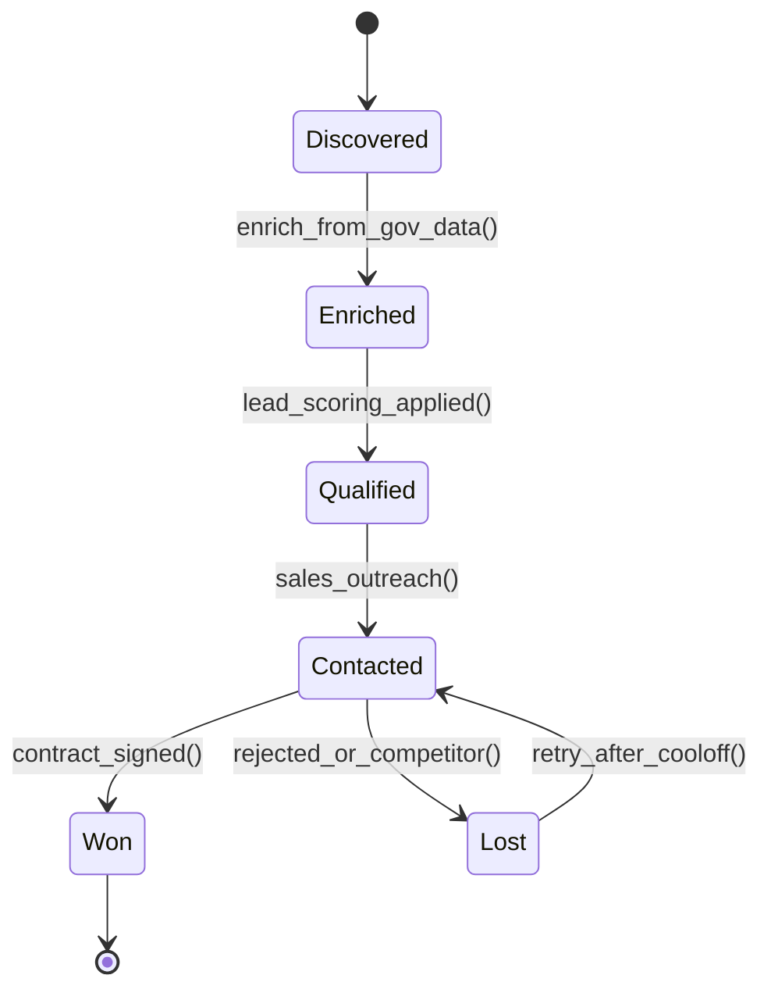
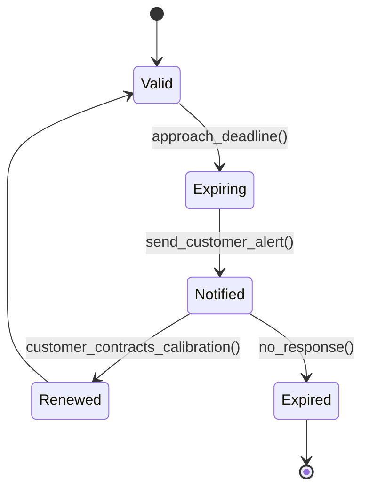
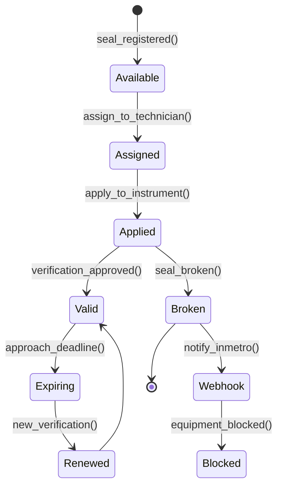
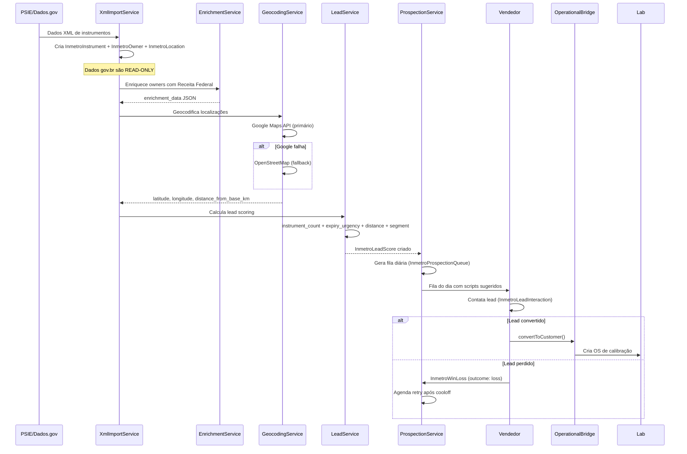

# Módulo: INMETRO & Inteligência Metrológica

> **[AI_RULE]** Lista oficial de entidades (Models) associadas a este domínio no Laravel.

---

## 1. Visão Geral

O módulo INMETRO é um sistema de inteligência metrológica que combina dados públicos do PSIE/INMETRO (dados.gov.br) com enriquecimento comercial para prospecção de clientes. Abrange o ciclo completo de verificação legal de instrumentos, monitoramento de concorrentes, inteligência territorial com geocoding, pipeline de prospecção com lead scoring, e integração operacional com o módulo Lab.

> **[AI_RULE] Selos e Lacres — Módulo Dedicado:** A gestão operacional de selos de reparo e lacres (recebimento, atribuição a técnicos, uso em OS, prazo de 5 dias, integração PSEI) foi movida para o módulo dedicado **RepairSeals** (`docs/modules/RepairSeals.md`). Este módulo (Inmetro) mantém a tabela `inmetro_seals` e o modelo `InmetroSeal`, mas toda a lógica de negócio, controllers avançados, jobs e integração PSEI de escrita pertencem ao RepairSeals.

### Princípios Fundamentais

- **Dados Gov.br são read-only**: registros importados do governo NUNCA são sobrescritos
- **Enriquecimento separado**: scoring e geocoding em tabelas próprias (`InmetroLeadScore`, `InmetroSnapshot`)
- **Lead scoring independente**: separado do CRM, critérios específicos do mercado metrológico
- **Geocoding com fallback**: Google Maps API → OpenStreetMap como contingência
- **Snapshots append-only**: `InmetroCompetitorSnapshot` nunca sobrescreve dados históricos

---

## 2. Entidades (Models) — Campos Completos

### 2.1 `InmetroInstrument`

Instrumento registrado no INMETRO (dados públicos).

| Campo | Tipo | Descrição |
|---|---|---|
| `location_id` | bigint FK | Localização do instrumento |
| `inmetro_number` | string | Número INMETRO oficial |
| `serial_number` | string | Número de série |
| `brand` | string | Marca/fabricante |
| `model` | string | Modelo |
| `capacity` | string | Capacidade (ex: "30kg") |
| `instrument_type` | string | Tipo: balança, medidor, etc. |
| `current_status` | string | `approved`, `rejected`, `repaired` |
| `last_verification_at` | date | Última verificação |
| `next_verification_at` | date | Próxima verificação |
| `last_executor` | string | Último executor da verificação |
| `source` | string | Fonte dos dados (psie, manual, xml) |
| `last_scrape_status` | string | Status do Deep Scrape (success, failed) |
| `next_deep_scrape_at` | datetime | Próxima varredura profunda (Rate Limiting) |

**Accessors:**

- `days_until_due` — dias até o vencimento (negativo = vencido)
- `priority` — `overdue`, `urgent`, `high`, `normal`, `low`, `unknown`
- `status_badge` — label traduzido em português

**Scopes:** `expiringSoon($days)`, `overdue()`, `byCity($city)`

**Relacionamentos:**

- `belongsTo` InmetroLocation
- `hasOneThrough` InmetroOwner (via InmetroLocation)
- `hasMany` InmetroHistory

### 2.2 `InmetroSeal`

Lacre (selo) INMETRO para instrumentos verificados.

| Campo | Tipo | Descrição |
|---|---|---|
| `tenant_id` | bigint | Tenant |
| `type` | string | Tipo de lacre |
| `number` | string | Número do lacre |
| `status` | string | Status: `available`, `applied`, `broken`, `void` |
| `assigned_to` | bigint FK | Técnico atribuído |
| `work_order_id` | bigint FK | OS vinculada |
| `equipment_id` | bigint FK | Equipamento lacrado |
| `photo_path` | string | Foto do lacre aplicado |
| `used_at` | datetime | Data/hora de utilização |
| `notes` | text | Observações |

**Relacionamentos:**

- `belongsTo` Tenant, User (assigned_to), WorkOrder, Equipment

### 2.3 `SealApplication`

Registro de aplicação de lacre com rastreabilidade completa.

| Campo | Tipo | Descrição |
|---|---|---|
| `tenant_id` | bigint | Tenant |
| `seal_id` | bigint FK | Lacre aplicado |
| `instrument_id` | bigint FK | Instrumento |
| `work_order_id` | bigint FK | OS vinculada |
| `applied_by` | bigint FK | Técnico aplicador |
| `applied_at` | datetime | Data/hora da aplicação |
| `removed_at` | datetime | Data/hora da remoção (se removido) |
| `removal_reason` | string | Motivo da remoção |
| `photo_before` | string | Foto antes da aplicação |
| `photo_after` | string | Foto após a aplicação |
| `notes` | text | Observações |

### 2.4 `InmetroOwner`

Proprietário de instrumentos INMETRO (potencial cliente).

| Campo | Tipo | Descrição |
|---|---|---|
| `cnpj` | string | CNPJ do proprietário |
| `company_name` | string | Razão social |
| `trade_name` | string | Nome fantasia |
| `contact_name` | string | Contato principal |
| `phone` | string | Telefone |
| `email` | string | Email |
| `segment` | string | Segmento de mercado |
| `total_instruments` | integer | Total de instrumentos |
| `total_expiring` | integer | Instrumentos vencendo |
| `total_expired` | integer | Instrumentos vencidos |
| `lead_status` | string | Status do lead: `new`, `contacted`, `qualified`, `converted`, `lost` |
| `customer_id` | bigint FK | Cliente convertido (se houver) |
| `enrichment_data` | json | Dados de enriquecimento (Receita Federal, etc.) |
| `enriched_at` | datetime | Data do último enriquecimento |
| `notes` | text | Observações |

**Relacionamentos:**

- `hasMany` InmetroLocation, InmetroLeadInteraction, InmetroLeadScore

### 2.5 `InmetroLocation`

Localização/filial do proprietário de instrumentos.

| Campo | Tipo | Descrição |
|---|---|---|
| `owner_id` | bigint FK | Proprietário |
| `state_registration` | string | Inscrição estadual |
| `farm_name` | string | Nome da fazenda/filial |
| `address_street` | string | Logradouro |
| `address_number` | string | Número |
| `address_complement` | string | Complemento |
| `address_neighborhood` | string | Bairro |
| `address_city` | string | Cidade |
| `address_state` | string | UF |
| `address_zip` | string | CEP |
| `phone_local` | string | Telefone local |
| `email_local` | string | Email local |
| `latitude` | float | Latitude (geocoding) |
| `longitude` | float | Longitude (geocoding) |
| `distance_from_base_km` | float | Distância da base (km) |

**Accessor:** `full_address` — endereço formatado completo

**Relacionamentos:**

- `belongsTo` InmetroOwner
- `hasMany` InmetroInstrument

### 2.6 `InmetroLeadScore`

Pontuação de lead específica do mercado metrológico.

| Campo | Tipo | Descrição |
|---|---|---|
| `tenant_id` | bigint | Tenant |
| `owner_id` | bigint FK | Proprietário |
| `score` | integer | Pontuação total |
| `instrument_count_score` | integer | Pontos por quantidade de instrumentos |
| `expiry_urgency_score` | integer | Pontos por urgência de vencimento |
| `distance_score` | integer | Pontos por proximidade |
| `segment_score` | integer | Pontos por segmento |
| `interaction_score` | integer | Pontos por interações |
| `calculated_at` | datetime | Data do cálculo |

> **[AI_RULE]** Este scoring é INDEPENDENTE do `CrmLeadScore`. Critérios específicos: tipo de instrumento, região, volume de selos, urgência de vencimento.

### 2.7 `InmetroCompetitor`

Concorrente mapeado no mercado metrológico.

| Campo | Tipo | Descrição |
|---|---|---|
| `tenant_id` | bigint | Tenant |
| `name` | string | Nome do concorrente |
| `cnpj` | string | CNPJ |
| `authorization_number` | string | Número de autorização INMETRO |
| `phone` | string | Telefone |
| `email` | string | Email |
| `address` | string | Endereço |
| `city` | string | Cidade |
| `state` | string | UF |
| `authorized_species` | json/array | Espécies autorizadas |
| `mechanics` | json/array | Mecânicos/técnicos |
| `max_capacity` | string | Capacidade máxima |
| `accuracy_classes` | json/array | Classes de exatidão |
| `authorization_valid_until` | date | Validade da autorização |
| `total_repairs_done` | integer | Total de reparos realizados |
| `last_repair_date` | date | Data do último reparo |
| `website` | string | Website |

**Relacionamentos:**

- `hasMany` CompetitorInstrumentRepair, InmetroHistory, InmetroCompetitorSnapshot
- `belongsToMany` InmetroInstrument (via `competitor_instrument_repairs`)

### 2.8 `InmetroCompetitorSnapshot`

Snapshot periódico do estado do concorrente (append-only).

### 2.9 `InmetroHistory`

Histórico de eventos de um instrumento.

| Campo | Tipo | Descrição |
|---|---|---|
| `instrument_id` | bigint FK | Instrumento |
| `event_type` | string | `verification`, `repair`, `rejection`, `initial` |
| `event_date` | date | Data do evento |
| `result` | string | `approved`, `rejected`, `repaired` |
| `executor` | string | Executor da verificação/reparo |
| `executor_document` | string | CNPJ/CPF do executor capturado no PSIE |
| `competitor_id` | bigint FK | Concorrente vinculado automaticamente |
| `osint_threat_level` | string | Risco do executor (safe, high, medium) OSINT |
| `validity_date` | date | Nova data de validade |
| `notes` | text | Observações |
| `source` | string | Fonte dos dados |

**Accessors:** `event_type_label`, `result_label` (labels traduzidos)

### 2.10 `InmetroProspectionQueue`

Fila diária de prospecção para contato comercial.

| Campo | Tipo | Descrição |
|---|---|---|
| `owner_id` | bigint FK | Proprietário a contactar |
| `tenant_id` | bigint | Tenant |
| `assigned_to` | bigint FK | Vendedor atribuído |
| `queue_date` | date | Data da fila |
| `position` | integer | Posição na fila |
| `reason` | string | Motivo do contato |
| `suggested_script` | text | Script sugerido para o vendedor |
| `status` | string | `pending`, `contacted`, `scheduled`, `skipped` |
| `contacted_at` | datetime | Data/hora do contato |

**Scopes:** `forDate($date)`, `pending()`

### 2.11 `InmetroLeadInteraction`

Registro de interações com leads INMETRO.

| Campo | Tipo | Descrição |
|---|---|---|
| `tenant_id` | bigint | Tenant |
| `owner_id` | bigint FK | Proprietário |
| `user_id` | bigint FK | Vendedor |
| `type` | string | Tipo: `call`, `email`, `whatsapp`, `visit` |
| `notes` | text | Notas da interação |
| `outcome` | string | Resultado |
| `next_action` | string | Próxima ação |
| `next_action_date` | date | Data da próxima ação |

### 2.12 `InmetroWinLoss`

Registro de vitórias/derrotas comerciais.

| Campo | Tipo | Descrição |
|---|---|---|
| `tenant_id` | bigint | Tenant |
| `owner_id` | bigint FK | Proprietário |
| `competitor_id` | bigint FK | Concorrente |
| `outcome` | string | `win` ou `loss` |
| `reason` | string | Motivo |
| `estimated_value` | decimal:2 | Valor estimado (R$) |
| `notes` | text | Observações |
| `outcome_date` | date | Data do resultado |

**Scopes:** `wins()`, `losses()`

### 2.13 `InmetroWebhook`

Configuração de webhooks para notificações INMETRO.

### 2.14 `InmetroSnapshot`

Snapshot de dados INMETRO (append-only, ponto-no-tempo).

### 2.15 `InmetroBaseConfig`

Configuração base do módulo INMETRO por tenant.

| Campo | Tipo | Descrição |
|---|---|---|
| `tenant_id` | bigint | Tenant |
| `base_lat` | decimal:7 | Latitude da base |
| `base_lng` | decimal:7 | Longitude da base |
| `base_address` | string | Endereço da base |
| `base_city` | string | Cidade da base |
| `base_state` | string | UF da base |
| `max_distance_km` | integer | Raio máximo de prospecção (km) |
| `enrichment_sources` | json/array | Fontes de enriquecimento habilitadas |
| `last_enrichment_at` | datetime | Último enriquecimento |
| `psie_username` | string | Usuário PSIE (credencial) |
| `psie_password` | encrypted | Senha PSIE (criptografada) |
| `last_rejection_check_at` | datetime | Última verificação de reprovações |
| `notification_roles` | json/array | Papéis que recebem notificações |
| `whatsapp_message_template` | text | Template de mensagem WhatsApp |
| `email_subject_template` | string | Template de assunto de email |
| `email_body_template` | text | Template de corpo de email |

### 2.16 `CompetitorInstrumentRepair`

Registro de reparos feitos por concorrentes em instrumentos.

---

## 3. Services

### `InmetroProspectionService`

Gerencia pipeline de prospecção: cria filas diárias, prioriza leads por scoring, atribui a vendedores.

### `InmetroComplianceService`

Verifica conformidade de instrumentos com regulamentação INMETRO: selos válidos, verificações em dia, checklists de conformidade.

### `InmetroDadosGovService`

Importa dados do Portal de Dados Abertos do Governo (dados.gov.br): instrumentos, proprietários, histórico de verificações.

### `InmetroEnrichmentService`

Enriquece dados de proprietários com informações comerciais: CNPJ (Receita Federal), segmento, porte, contatos.

### `InmetroGeocodingService`

Geocodificação de endereços com fallback:

1. Google Maps Geocoding API (primário)
2. OpenStreetMap Nominatim (fallback)
Calcula `distance_from_base_km` para cada localização.

### `InmetroLeadService`

Calcula lead scoring INMETRO (independente do CRM): pontuação por quantidade de instrumentos, urgência, distância, segmento.

### `InmetroMarketIntelService`

Inteligência de mercado: market share, movimentações de concorrentes, análise de preços, tendências.

### `InmetroNotificationService`

Notificações automáticas: instrumentos vencendo, rejeições detectadas, novos registros na região.

### `InmetroOperationalBridgeService`

Ponte operacional entre dados INMETRO e módulo Lab: instrumento com selo vencido aciona fila de recalibração.

### `InmetroReportingService`

Relatórios: leads por região, conversões, revenue ranking, exportação CSV/PDF.

### `InmetroTerritorialService`

Inteligência territorial: mapa de calor, zonas de concorrentes, cobertura vs. potencial, leads próximos.

### `InmetroWebhookService`

Gerencia webhooks de eventos INMETRO (selos quebrados, reprovações).

### `InmetroXmlImportService`

Importa dados INMETRO via arquivos XML.

### `InmetroPsieScraperService`

Scraper autenticado do PSIE (Portal de Serviços do INMETRO) operando em dois níveis: busca em grade e "Deep Scrape" (histórico pormenorizado do instrumento).

### `InmetroIpemCrawlerFactory`

Factory (Design Pattern) para instanciar scrapers delegados ao portal IPEM específico de cada estado (SGI IPEM-SP, IPEM-MG). Age como roteador regional.

### `OsintIntelligenceService`

Módulo OSINT avançado que busca ativamente na "Dark Web", Jusbrasil e listas de PROCON o `threat_level` (grau de ameaça) de um CNPJ assistente, detectando oficinas piratas ou fraude em selos.

### `InmetroCompetitorTrackingService`

Rastreamento de concorrentes: snapshots periódicos, movimentações, market share e **Auto-Discovery**. Se um reparo for identificado via Deep Scrape com um CNPJ desconhecido, o serviço automaticamente descobre e cadastra o novo concorrente no banco.

### Job: `ScrapeInstrumentDetailsJob`

Motor de extração assíncrono escalável. Navega instrumento por instrumento para buscar reprovações ocultas na grade de busca primária e identificar TÉCNICOS/Assistências que operam o reparo (criação automática de tracking).

---

## 4. Fluxo de Prospecção de Instrumentos (Lead Pipeline)



## 4.1 Ciclo de Verificação de Instrumentos



---

## 5. Fluxo de Lacres (Selos) INMETRO



---

## 6. Contratos JSON (API Endpoints)

### `GET /api/v1/inmetro/dashboard`

Dashboard consolidado do módulo INMETRO.

```json
{
  "data": {
    "total_owners": 1250,
    "total_instruments": 8400,
    "expiring_30_days": 320,
    "expired": 145,
    "leads_contacted_this_month": 85,
    "conversion_rate": 12.5,
    "revenue_this_month": 45000.00
  }
}
```

### `GET /api/v1/inmetro/instruments?status=overdue&city=Curitiba`

Lista instrumentos com filtros.

```json
{
  "data": [
    {
      "id": 1001,
      "inmetro_number": "INM-2024-001234",
      "brand": "Toledo",
      "model": "Prix 3 Fit",
      "capacity": "30kg",
      "instrument_type": "balança",
      "current_status": "approved",
      "last_verification_at": "2025-03-15",
      "next_verification_at": "2026-03-15",
      "days_until_due": -9,
      "priority": "overdue",
      "location": {
        "city": "Curitiba",
        "state": "PR",
        "distance_from_base_km": 15.3
      },
      "owner": {
        "id": 42,
        "company_name": "Supermercado XYZ Ltda",
        "lead_status": "qualified"
      }
    }
  ],
  "meta": { "total": 320, "per_page": 50 }
}
```

### `POST /api/v1/inmetro/enrich/{ownerId}`

Enriquece dados de um proprietário.

```json
{
  "data": {
    "owner_id": 42,
    "enrichment_data": {
      "cnpj_status": "ATIVA",
      "capital_social": 500000.00,
      "porte": "PEQUENO",
      "cnae_principal": "4711-3/02 - Comércio varejista de mercadorias em geral"
    },
    "enriched_at": "2026-03-24T10:30:00Z"
  }
}
```

### `POST /api/v1/inmetro/convert/{ownerId}`

Converte proprietário INMETRO em cliente do sistema.

```json
{
  "data": {
    "owner_id": 42,
    "customer_id": 155,
    "message": "Proprietário convertido em cliente com sucesso"
  }
}
```

### `GET /api/v1/inmetro/advanced/contact-queue`

Fila de contato do dia para prospecção.

```json
{
  "data": [
    {
      "id": 1,
      "owner": { "company_name": "Fazenda Bom Tempo", "phone": "(41)99999-0000" },
      "position": 1,
      "reason": "3 instrumentos vencendo em 15 dias",
      "suggested_script": "Olá, identificamos que seus instrumentos...",
      "status": "pending",
      "lead_score": 85
    }
  ]
}
```

### `POST /api/v1/inmetro/geocode`

Geocodifica localizações pendentes.

```json
{
  "request": { "location_ids": [1, 2, 3] },
  "response": {
    "geocoded": 2,
    "failed": 1,
    "results": [
      { "location_id": 1, "latitude": -25.4284, "longitude": -49.2733, "source": "google" },
      { "location_id": 2, "latitude": -25.4500, "longitude": -49.2900, "source": "osm" }
    ]
  }
}
```

---

## 7. Form Requests (Validacao de Entrada)

> **[AI_RULE]** Todo endpoint de criacao/atualizacao DEVE usar Form Request. Validacao inline em controllers e PROIBIDA.

### 7.1 EnrichOwnerRequest

**Classe**: `App\Http\Requests\Inmetro\EnrichOwnerRequest`
**Endpoint**: `POST /api/v1/inmetro/enrich/{ownerId}`

```php
public function authorize(): bool
{
    return $this->user()->can('inmetro.intelligence.enrich');
}

public function rules(): array
{
    return [
        'sources' => ['nullable', 'array'],
        'sources.*' => ['string', 'in:receita_federal,sintegra,google_maps'],
    ];
}
```

### 7.2 ConvertOwnerRequest

**Classe**: `App\Http\Requests\Inmetro\ConvertOwnerRequest`
**Endpoint**: `POST /api/v1/inmetro/convert/{ownerId}`

```php
public function authorize(): bool
{
    return $this->user()->can('inmetro.intelligence.convert');
}

public function rules(): array
{
    return [
        'segment'       => ['nullable', 'string', 'max:100'],
        'contact_name'  => ['nullable', 'string', 'max:255'],
        'contact_email' => ['nullable', 'email', 'max:255'],
        'contact_phone' => ['nullable', 'string', 'max:20'],
    ];
}
```

> **[AI_RULE]** A conversao cria um `Customer` no modulo CRM vinculando `customer_id` no `InmetroOwner`. Se o owner ja foi convertido (customer_id != null), retornar 422.

### 7.3 GeocodeLocationsRequest

**Classe**: `App\Http\Requests\Inmetro\GeocodeLocationsRequest`
**Endpoint**: `POST /api/v1/inmetro/geocode`

```php
public function rules(): array
{
    return [
        'location_ids'   => ['required', 'array', 'min:1', 'max:100'],
        'location_ids.*' => ['integer', 'exists:inmetro_locations,id'],
    ];
}
```

### 7.4 StoreInmetroOwnerRequest

**Classe**: `App\Http\Requests\Inmetro\StoreInmetroOwnerRequest`
**Endpoint**: `POST /api/v1/inmetro/owners`

```php
public function rules(): array
{
    return [
        'cnpj'         => ['required', 'string', 'cnpj', 'unique:inmetro_owners,cnpj'],
        'company_name' => ['required', 'string', 'min:3', 'max:255'],
        'phone'        => ['nullable', 'string', 'max:20'],
        'email'        => ['nullable', 'email', 'max:255'],
        'segment'      => ['nullable', 'string', 'max:100'],
    ];
}
```

### 7.5 StoreInmetroSealRequest

**Classe**: `App\Http\Requests\Inmetro\StoreInmetroSealRequest`
**Endpoint**: `POST /api/v1/inmetro/seals`

```php
public function authorize(): bool
{
    return $this->user()->can('inmetro.seals.manage');
}

public function rules(): array
{
    return [
        'type'          => ['required', 'string', 'max:50'],
        'number'        => ['required', 'string', 'unique:inmetro_seals,number'],
        'assigned_to'   => ['nullable', 'integer', 'exists:users,id'],
        'equipment_id'  => ['nullable', 'integer', 'exists:equipment,id'],
        'work_order_id' => ['nullable', 'integer', 'exists:work_orders,id'],
        'notes'         => ['nullable', 'string', 'max:1000'],
    ];
}
```

### 7.6 UpdateInmetroBaseConfigRequest

**Classe**: `App\Http\Requests\Inmetro\UpdateInmetroBaseConfigRequest`
**Endpoint**: `PUT /api/v1/inmetro/config`

```php
public function authorize(): bool
{
    return $this->user()->can('inmetro.config');
}

public function rules(): array
{
    return [
        'base_lat'        => ['sometimes', 'numeric', 'between:-90,90'],
        'base_lng'        => ['sometimes', 'numeric', 'between:-180,180'],
        'base_city'       => ['sometimes', 'string', 'max:100'],
        'base_state'      => ['sometimes', 'string', 'size:2'],
        'max_distance_km' => ['sometimes', 'integer', 'min:10', 'max:1000'],
        'psie_username'   => ['nullable', 'string', 'max:255'],
        'psie_password'   => ['nullable', 'string', 'max:255'],
    ];
}
```

> **[AI_RULE]** `psie_password` DEVE ser armazenado com cast `encrypted`. Campo DEVE ser `hidden` na serializacao JSON.

---

## 8. Regras de Validação

### `InmetroSeal`

```php
'type'         => 'required|string',
'number'       => 'required|string|unique:inmetro_seals,number,{id},id,tenant_id,{tenant_id}',
'status'       => 'required|in:available,applied,broken,void',
'assigned_to'  => 'nullable|exists:users,id',
'equipment_id' => 'nullable|exists:equipment,id',
'work_order_id'=> 'nullable|exists:work_orders,id',
```

### `InmetroBaseConfig`

```php
'base_lat'          => 'required|numeric|between:-90,90',
'base_lng'          => 'required|numeric|between:-180,180',
'base_city'         => 'required|string',
'base_state'        => 'required|string|size:2',
'max_distance_km'   => 'required|integer|min:10|max:1000',
'psie_username'     => 'nullable|string',
'psie_password'     => 'nullable|string',
```

### `InmetroOwner` (store)

```php
'cnpj'           => 'required|string|cnpj|unique:inmetro_owners,cnpj',
'company_name'   => 'required|string|min:3',
'phone'          => 'nullable|string',
'email'          => 'nullable|email',
'segment'        => 'nullable|string',
```

---

## 9. Permissões (RBAC)

| Permissão | Descrição | Perfis |
|---|---|---|
| `inmetro.intelligence.view` | Visualizar dashboard, owners, instrumentos, leads | Vendedor, Gerente |
| `inmetro.intelligence.enrich` | Enriquecer dados de proprietários | Gerente, Analista |
| `inmetro.intelligence.convert` | Converter owner em cliente, CRUD owners | Gerente Comercial |
| `inmetro.view` | Acesso a relatórios, exportações, mapa | Todos autenticados |
| `inmetro.import` | Importar XML e scraping PSIE | Admin, Gerente |
| `inmetro.seals.manage` | CRUD de lacres/selos | Técnico, Supervisor |
| `inmetro.seals.apply` | Aplicar/remover lacres | Técnico |
| `inmetro.competitors.manage` | CRUD de concorrentes | Gerente Comercial |
| `inmetro.config` | Configurar base, templates, credenciais | Admin |

---

## 10. Diagrama de Sequência — Fluxo de Prospecção



---

## 11. Código de Referência

### PHP — `InmetroGeocodingService` (resumo)

```php
class InmetroGeocodingService
{
    public function geocode(InmetroLocation $location): bool
    {
        $address = $location->full_address;

        // Tentativa 1: Google Maps API
        try {
            $result = $this->googleGeocode($address);
            $location->update([
                'latitude' => $result['lat'],
                'longitude' => $result['lng'],
            ]);
            return true;
        } catch (\Exception $e) {
            Log::warning("Google geocoding failed: {$e->getMessage()}");
        }

        // Fallback: OpenStreetMap Nominatim
        try {
            $result = $this->osmGeocode($address);
            $location->update([
                'latitude' => $result['lat'],
                'longitude' => $result['lng'],
            ]);
            return true;
        } catch (\Exception $e) {
            Log::error("OSM geocoding also failed: {$e->getMessage()}");
            return false;
        }
    }

    public function calculateDistanceFromBase(InmetroLocation $location): void
    {
        $config = InmetroBaseConfig::where('tenant_id', $location->owner->tenant_id)->first();
        if (!$config || !$location->latitude) return;

        $location->update([
            'distance_from_base_km' => $this->haversine(
                $config->base_lat, $config->base_lng,
                $location->latitude, $location->longitude
            ),
        ]);
    }
}
```

### React Hook — `useInmetroInstruments` (referência)

```typescript
interface InmetroInstrument {
  id: number;
  inmetro_number: string;
  brand: string;
  model: string;
  capacity: string;
  instrument_type: string;
  current_status: 'approved' | 'rejected' | 'repaired';
  last_verification_at: string;
  next_verification_at: string;
  days_until_due: number | null;
  priority: 'overdue' | 'urgent' | 'high' | 'normal' | 'low' | 'unknown';
  location: {
    city: string;
    state: string;
    latitude: number | null;
    longitude: number | null;
    distance_from_base_km: number | null;
  };
  owner: {
    id: number;
    company_name: string;
    lead_status: string;
  };
}

function useInmetroInstruments(filters: Record<string, string>) {
  return useQuery<PaginatedResponse<InmetroInstrument>>(
    ['inmetro-instruments', filters],
    () => api.get('/inmetro/instruments', { params: filters }).then(r => r.data)
  );
}
```

---

### Endpoints Rest (Extraídos do Backend)

| Método | Rota | Controller | Ação |
|--------|------|------------|------|
| `GET` | `/api/v1/inmetro` | `InmetroController@index` | Listar |
| `GET` | `/api/v1/inmetro/{id}` | `InmetroController@show` | Detalhes |
| `POST` | `/api/v1/inmetro` | `InmetroController@store` | Criar |
| `PUT` | `/api/v1/inmetro/{id}` | `InmetroController@update` | Atualizar |
| `DELETE` | `/api/v1/inmetro/{id}` | `InmetroController@destroy` | Excluir |

## 12. Cenários BDD (Metrologia Legal)

### Cenário 1: Lacre quebrado dispara bloqueio

```gherkin
Funcionalidade: Bloqueio por Lacre Quebrado
  Dado que existe um instrumento "BAL-001" com selo INMETRO aplicado
  E o selo tem status "applied"

  Cenário: Lacre quebrado dispara webhook e bloqueio
    Quando o técnico registra o selo como "broken"
    Então o sistema dispara webhook INMETRO via InmetroWebhookService
    E o equipamento é bloqueado via QualityProcedure
    E uma notificação é enviada aos papéis configurados em notification_roles
    E o InmetroHistory registra event_type = "rejection"

  Cenário: Tentativa de uso de equipamento com selo quebrado
    Dado que o selo do instrumento está "broken"
    Quando se tenta criar uma OS para o instrumento
    Então o sistema retorna erro 422
    E a mensagem contém "Instrumento com selo INMETRO violado"
```

### Cenário 2: Verificação inicial e subsequente

```gherkin
Funcionalidade: Ciclo de Verificação INMETRO
  Dado que existe um instrumento novo sem verificação

  Cenário: Verificação inicial
    Quando o técnico realiza verificação inicial
    Então InmetroHistory é criado com event_type = "initial"
    E o instrumento recebe current_status = "approved"
    E next_verification_at é calculado (1 ano a partir da verificação)
    E um InmetroSeal é aplicado automaticamente

  Cenário: Verificação subsequente (periódica)
    Dado que o instrumento tem verificação vencendo em 30 dias
    Quando o sistema executa a rotina de notificações
    Então o owner recebe notificação de vencimento
    E o instrumento aparece na fila de prospecção
```

### Cenário 3: Dados Gov.br imutáveis

```gherkin
Funcionalidade: Imutabilidade de Dados Governamentais
  Dado que existe um InmetroInstrument importado do PSIE
  E source = "psie"

  Cenário: Enriquecimento não sobrescreve dados originais
    Quando se enriquece o owner com dados da Receita Federal
    Então enrichment_data é atualizado em InmetroOwner
    Mas os campos originais do InmetroInstrument permanecem inalterados
    E InmetroSnapshot é criado como registro ponto-no-tempo
```

### Cenário 4: Lead scoring e priorização

```gherkin
Funcionalidade: Lead Scoring INMETRO
  Dado que existem 3 owners:
    | company           | instruments | expiring | distance_km |
    | Fazenda A         | 10          | 5        | 20          |
    | Mercado B         | 2           | 0        | 100         |
    | Indústria C       | 50          | 30       | 50          |

  Cenário: Priorização por scoring
    Quando o sistema recalcula lead scores
    Então Indústria C tem o maior score (muitos instrumentos vencendo)
    E Fazenda A tem o segundo maior score (proximidade + urgência)
    E Mercado B tem o menor score (poucos instrumentos, longe, nada vencendo)
    E a fila de prospecção é ordenada por score decrescente
```

### Cenário 5: Auto-Discovery de Concorrente via Deep Scrape

```gherkin
Funcionalidade: Extração Profunda e Auto-Discovery
  Dado que existe um instrumento reprovado no portal do Governo
  E o job ScrapeInstrumentDetailsJob navega no histórico do instrumento

  Cenário: Descoberta de nova Assistência Técnica
    Quando o scraper lê o evento "Reparado"
    E captura o CNPJ "123.456/0001-99" do executor
    E este CNPJ não existe na tabela inmetro_competitors
    Então o InmetroCompetitorTrackingService descobre e cria um novo InmetroCompetitor
    E o InmetroHistory é vinculado a este novo concorrente
    E o OsintIntelligenceService assinala o `threat_level` da assistência
```

---

## 13. Guard Rails de Negócio `[AI_RULE]`

> **[AI_RULE_CRITICAL] Dados Gov.br São Read-Only**
> Dados importados do PSIE/INMETRO (via `InmetroPsieScraperService` e `InmetroDadosGovService`) são registros oficiais do governo. A IA DEVE tratar esses registros como imutáveis. Enriquecimento interno (geocoding, scoring) é armazenado em tabelas separadas (`InmetroLeadScore`, `InmetroSnapshot`), nunca sobrescrevendo os dados originais.

> **[AI_RULE] Lead Scoring Independente**
> O scoring de leads INMETRO (`InmetroLeadScore`) é um sistema separado do CRM Lead Scoring (`CrmLeadScore`). Os critérios são específicos do mercado metrológico (tipo de instrumento, região, volume de selos). A IA NÃO deve misturar as duas engines.

> **[AI_RULE] Geocoding com Fallback**
> O `InmetroGeocodingService` deve tentar Google Maps API primeiro. Se falhar (quota/erro), usar OpenStreetMap como fallback. Coordenadas são obrigatórias para visualização territorial.

> **[AI_RULE] Monitoramento de Concorrentes**
> `InmetroCompetitorSnapshot` captura estado-em-tempo dos concorrentes periodicamente. Snapshots são append-only — nunca sobrescrever dados históricos.

> **[AI_RULE] Integração Operacional**
> O `InmetroOperationalBridgeService` conecta dados INMETRO com o módulo Lab. Instrumento com selo vencido DEVE automaticamente acionar fila de prospecção para recalibração.

---

## 14. Comportamento Integrado (Cross-Domain)

- `Lab` → Instrumento que passa calibração atualiza `InmetroSeal` com novo prazo de validade.
- `CRM` → Owner de instrumento (`InmetroOwner`) pode ser convertido em `Customer` via `CustomerConversionService`.
- `Finance` → Win de prospecção gera `Quote` automaticamente no módulo Quotes.
- `RepairSeals` → Gestão operacional completa de selos de reparo e lacres. Controla ciclo de vida (recebimento → atribuição → uso → PSEI), prazo de 5 dias, bloqueio de técnicos, inventário por técnico. Ver `docs/modules/RepairSeals.md`.
- `WorkOrders` → OS de calibração/reparo exige selo + lacre vinculados para conclusão. RepairSeals valida no transition guard de status.

---

## 15. Checklist de Implementação

- [ ] Importação PSIE/XML com dados read-only
- [ ] `InmetroInstrument` com scopes de vencimento e prioridade
- [ ] `InmetroSeal` CRUD + fluxo de aplicação/remoção
- [ ] `SealApplication` com fotos e rastreabilidade
- [ ] `InmetroOwner` com enriquecimento separado
- [ ] `InmetroLocation` com geocoding (Google + OSM fallback)
- [ ] `InmetroLeadScore` independente do CRM
- [ ] `InmetroProspectionQueue` — fila diária com scripts
- [ ] `InmetroLeadInteraction` — registro de contatos
- [ ] `InmetroWinLoss` — análise de vitórias/derrotas
- [ ] `InmetroCompetitor` + snapshots append-only
- [ ] `InmetroBaseConfig` — configuração por tenant
- [ ] Dashboard consolidado com métricas
- [ ] Mapa territorial com layers e zonas de concorrentes
- [ ] Exportação CSV/PDF de leads e instrumentos
- [ ] Webhook para lacres quebrados
- [ ] Integração operacional Lab ↔ INMETRO
- [ ] Conversão owner → customer
- [ ] Testes automatizados para todos os cenários BDD

---

## 16. Inventário Completo do Código

### Models

| Model | Arquivo |
|-------|---------|
| `InmetroInstrument` | `backend/app/Models/InmetroInstrument.php` |
| `InmetroOwner` | `backend/app/Models/InmetroOwner.php` |
| `InmetroLocation` | `backend/app/Models/InmetroLocation.php` |
| `InmetroLeadScore` | `backend/app/Models/InmetroLeadScore.php` |
| `InmetroLeadInteraction` | `backend/app/Models/InmetroLeadInteraction.php` |
| `InmetroCompetitor` | `backend/app/Models/InmetroCompetitor.php` |
| `InmetroCompetitorSnapshot` | `backend/app/Models/InmetroCompetitorSnapshot.php` |
| `InmetroHistory` | `backend/app/Models/InmetroHistory.php` |
| `InmetroProspectionQueue` | `backend/app/Models/InmetroProspectionQueue.php` |
| `InmetroSeal` | `backend/app/Models/InmetroSeal.php` |
| `InmetroSnapshot` | `backend/app/Models/InmetroSnapshot.php` |
| `InmetroWebhook` | `backend/app/Models/InmetroWebhook.php` |
| `InmetroWinLoss` | `backend/app/Models/InmetroWinLoss.php` |
| `InmetroBaseConfig` | `backend/app/Models/InmetroBaseConfig.php` |
| `InmetroComplianceChecklist` | `backend/app/Models/InmetroComplianceChecklist.php` |
| `CompetitorInstrumentRepair` | `backend/app/Models/CompetitorInstrumentRepair.php` |
| `Lookups\InmetroSealStatus` | `backend/app/Models/Lookups/InmetroSealStatus.php` |
| `Lookups\InmetroSealType` | `backend/app/Models/Lookups/InmetroSealType.php` |

### Services (15)

| Service | Arquivo |
|---------|---------|
| `InmetroProspectionService` | `backend/app/Services/InmetroProspectionService.php` |
| `InmetroComplianceService` | `backend/app/Services/InmetroComplianceService.php` |
| `InmetroDadosGovService` | `backend/app/Services/InmetroDadosGovService.php` |
| `InmetroEnrichmentService` | `backend/app/Services/InmetroEnrichmentService.php` |
| `InmetroGeocodingService` | `backend/app/Services/InmetroGeocodingService.php` |
| `InmetroLeadService` | `backend/app/Services/InmetroLeadService.php` |
| `InmetroMarketIntelService` | `backend/app/Services/InmetroMarketIntelService.php` |
| `InmetroNotificationService` | `backend/app/Services/InmetroNotificationService.php` |
| `InmetroOperationalBridgeService` | `backend/app/Services/InmetroOperationalBridgeService.php` |
| `InmetroReportingService` | `backend/app/Services/InmetroReportingService.php` |
| `InmetroTerritorialService` | `backend/app/Services/InmetroTerritorialService.php` |
| `InmetroWebhookService` | `backend/app/Services/InmetroWebhookService.php` |
| `InmetroXmlImportService` | `backend/app/Services/InmetroXmlImportService.php` |
| `InmetroPsieScraperService` | `backend/app/Services/InmetroPsieScraperService.php` |
| `InmetroCompetitorTrackingService` | `backend/app/Services/InmetroCompetitorTrackingService.php` |

### Controllers

| Controller | Arquivo |
|------------|---------|
| `InmetroController` | `backend/app/Http/Controllers/Api/V1/InmetroController.php` |
| `InmetroAdvancedController` | `backend/app/Http/Controllers/Api/V1/InmetroAdvancedController.php` |
| `InmetroSealController` | `backend/app/Http/Controllers/Inventory/InmetroSealController.php` |

### Form Requests (25)

| FormRequest | Arquivo |
|-------------|---------|
| `AssignInmetroSealsRequest` | `backend/app/Http/Requests/Inmetro/AssignInmetroSealsRequest.php` |
| `CalculateDistancesInmetroRequest` | `backend/app/Http/Requests/Inmetro/CalculateDistancesInmetroRequest.php` |
| `CreateChecklistInmetroRequest` | `backend/app/Http/Requests/Inmetro/CreateChecklistInmetroRequest.php` |
| `CreateWebhookInmetroRequest` | `backend/app/Http/Requests/Inmetro/CreateWebhookInmetroRequest.php` |
| `DensityViabilityInmetroRequest` | `backend/app/Http/Requests/Inmetro/DensityViabilityInmetroRequest.php` |
| `EnrichBatchInmetroRequest` | `backend/app/Http/Requests/Inmetro/EnrichBatchInmetroRequest.php` |
| `ImportInmetroXmlRequest` | `backend/app/Http/Requests/Inmetro/ImportInmetroXmlRequest.php` |
| `LinkInstrumentInmetroRequest` | `backend/app/Http/Requests/Inmetro/LinkInstrumentInmetroRequest.php` |
| `LogInteractionInmetroRequest` | `backend/app/Http/Requests/Inmetro/LogInteractionInmetroRequest.php` |
| `MarkQueueItemRequest` | `backend/app/Http/Requests/Inmetro/MarkQueueItemRequest.php` |
| `NearbyLeadsInmetroRequest` | `backend/app/Http/Requests/Inmetro/NearbyLeadsInmetroRequest.php` |
| `OptimizeRouteInmetroRequest` | `backend/app/Http/Requests/Inmetro/OptimizeRouteInmetroRequest.php` |
| `RecordWinLossInmetroRequest` | `backend/app/Http/Requests/Inmetro/RecordWinLossInmetroRequest.php` |
| `SimulateRegulatoryImpactInmetroRequest` | `backend/app/Http/Requests/Inmetro/SimulateRegulatoryImpactInmetroRequest.php` |
| `StoreBatchInmetroSealRequest` | `backend/app/Http/Requests/Inmetro/StoreBatchInmetroSealRequest.php` |
| `StoreInmetroCompetitorRequest` | `backend/app/Http/Requests/Inmetro/StoreInmetroCompetitorRequest.php` |
| `StoreInmetroOwnerRequest` | `backend/app/Http/Requests/Inmetro/StoreInmetroOwnerRequest.php` |
| `SubmitPsieResultsRequest` | `backend/app/Http/Requests/Inmetro/SubmitPsieResultsRequest.php` |
| `UpdateChecklistInmetroRequest` | `backend/app/Http/Requests/Inmetro/UpdateChecklistInmetroRequest.php` |
| `UpdateInmetroBaseConfigRequest` | `backend/app/Http/Requests/Inmetro/UpdateInmetroBaseConfigRequest.php` |
| `UpdateInmetroConfigRequest` | `backend/app/Http/Requests/Inmetro/UpdateInmetroConfigRequest.php` |
| `UpdateInmetroLeadStatusRequest` | `backend/app/Http/Requests/Inmetro/UpdateInmetroLeadStatusRequest.php` |
| `UpdateInmetroOwnerRequest` | `backend/app/Http/Requests/Inmetro/UpdateInmetroOwnerRequest.php` |
| `UpdateWebhookInmetroRequest` | `backend/app/Http/Requests/Inmetro/UpdateWebhookInmetroRequest.php` |
| `UseInmetroSealRequest` | `backend/app/Http/Requests/Inmetro/UseInmetroSealRequest.php` |

### Routes

| Arquivo de Rotas |
|------------------|
| `backend/routes/api/inmetro.php` |

### Endpoints Completos (Extraídos das Rotas)

#### InmetroController (Inteligência — view)

| Método | Rota | Ação |
|--------|------|------|
| `GET` | `/api/v1/inmetro/dashboard` | `dashboard` |
| `GET` | `/api/v1/inmetro/owners` | `owners` |
| `GET` | `/api/v1/inmetro/owners/{id}` | `showOwner` |
| `GET` | `/api/v1/inmetro/instruments` | `instruments` |
| `GET` | `/api/v1/inmetro/instruments/{id}` | `showInstrument` |
| `GET` | `/api/v1/inmetro/leads` | `leads` |
| `GET` | `/api/v1/inmetro/competitors` | `competitors` |
| `GET` | `/api/v1/inmetro/cities` | `cities` |
| `GET` | `/api/v1/inmetro/municipalities` | `municipalities` |
| `GET` | `/api/v1/inmetro/conversion-stats` | `conversionStats` |
| `GET` | `/api/v1/inmetro/export/leads` | `exportLeadsCsv` |

#### InmetroController (Enriquecimento)

| Método | Rota | Ação |
|--------|------|------|
| `POST` | `/api/v1/inmetro/enrich/{ownerId}` | `enrichOwner` |
| `POST` | `/api/v1/inmetro/enrich-batch` | `enrichBatch` |
| `POST` | `/api/v1/inmetro/enrich-dadosgov/{ownerId}` | `enrichFromDadosGov` |
| `POST` | `/api/v1/inmetro/deep-enrich/{ownerId}` | `deepEnrich` |

#### InmetroController (Conversão e CRUD)

| Método | Rota | Ação |
|--------|------|------|
| `POST` | `/api/v1/inmetro/owners` | `storeOwner` |
| `PUT` | `/api/v1/inmetro/owners/{id}` | `update` |
| `POST` | `/api/v1/inmetro/competitors` | `storeCompetitor` |
| `POST` | `/api/v1/inmetro/convert/{ownerId}` | `convertToCustomer` |
| `PATCH` | `/api/v1/inmetro/owners/{ownerId}/status` | `updateLeadStatus` |
| `POST` | `/api/v1/inmetro/recalculate-priorities` | `recalculatePriorities` |
| `POST` | `/api/v1/inmetro/cross-reference` | `crossReference` |

#### InmetroAdvancedController (Prospection — view)

| Método | Rota | Ação |
|--------|------|------|
| `GET` | `/api/v1/inmetro/advanced/contact-queue` | `getContactQueue` |
| `GET` | `/api/v1/inmetro/advanced/follow-ups` | `followUps` |
| `GET` | `/api/v1/inmetro/advanced/lead-score/{ownerId}` | `calculateLeadScore` |
| `GET` | `/api/v1/inmetro/advanced/churn` | `detectChurn` |
| `GET` | `/api/v1/inmetro/advanced/new-registrations` | `newRegistrations` |
| `GET` | `/api/v1/inmetro/advanced/next-calibrations` | `suggestNextCalibrations` |
| `GET` | `/api/v1/inmetro/advanced/segment-distribution` | `segmentDistribution` |
| `GET` | `/api/v1/inmetro/advanced/reject-alerts` | `rejectAlerts` |
| `GET` | `/api/v1/inmetro/advanced/conversion-ranking` | `conversionRanking` |

#### InmetroAdvancedController (Write)

| Método | Rota | Ação |
|--------|------|------|
| `POST` | `/api/v1/inmetro/advanced/generate-queue` | `generateDailyQueue` |
| `PATCH` | `/api/v1/inmetro/advanced/queue/{queueId}` | `markQueueItem` |
| `POST` | `/api/v1/inmetro/advanced/recalculate-scores` | `recalculateAllScores` |
| `POST` | `/api/v1/inmetro/advanced/classify-segments` | `classifySegments` |
| `POST` | `/api/v1/inmetro/advanced/interactions` | `logInteraction` |
| `POST` | `/api/v1/inmetro/advanced/optimize-route` | `optimizeRoute` |
| `POST` | `/api/v1/inmetro/advanced/density-viability` | `densityViability` |
| `POST` | `/api/v1/inmetro/advanced/snapshot-market-share` | `snapshotMarketShare` |

#### InmetroSealController (Inventory)

| Método | Rota | Ação |
|--------|------|------|
| `GET` | `/api/v1/inmetro/seals` | `index` |
| `POST` | `/api/v1/inmetro/seals/batch` | `storeBatch` |
| `POST` | `/api/v1/inmetro/seals/assign` | `assignToTechnician` |
| `GET` | `/api/v1/inmetro/seals/my` | `mySeals` |
| `POST` | `/api/v1/inmetro/seals/{id}/use` | `useSeal` |
| `GET` | `/api/v1/inmetro/seals/export` | `export` |
| `GET` | `/api/v1/inmetro/seals/audit` | `audit` |

---

## Edge Cases e Tratamento de Erros `[AI_RULE_CRITICAL]`

> **[AI_RULE_CRITICAL]** Ao implementar o módulo **Inmetro**, a IA DEVE tratar a imutabilidade dos dados governamentais, rate limits dos scrapers PSIE, e a criticidade cível dos lacres aplicados.

| Cenário de Borda | Tratamento Obrigatório (Guard Rail) | Código / Validação Esperada |
|-----------------|--------------------------------------|---------------------------|
| **Reaproveitamento de Lacre** | Técnico tenta associar `seal_number` que já estava `broken` em outra OS. | A API deve rejeitar (422) o `seal_number` se o campo logico de rastreabilidade indicar status histórico != `available`. |
| **PSIE Rate Limiting / Ban** | Scraper faz múltiplas buscas seguidas e o IP é temporariamente banido pelo INMETRO. | O `InmetroPsieScraperService` DEVE ter throttling exponencial nativo e bypass de VPN/Proxy array via guzzle client configs. |
| **Quebra do Crawler por Mudança DOM** | O site do PSIE atualizou suas tags HTML e importação falha. | Scraping errors geram alerta OPS imediato (severity: high). Crawler deve usar seletores robustos e XPath faláveis. |
| **Sobrescrita Governamental Inadvertida** | Update do InmetroOwner apaga os enriquecimentos feitos pelo Comercial. | `InmetroEnrichmentService` só insere em dados secundários (`enrichment_data` json). O core importado é imutável. |
| **Google Maps Billing Spike** | Envio de lote XML com 5.000 locais geocodifica tudo no Google Maps gerando custo. | Aplicar limite diário ao Geocode. Usar OSM Nominatim primeiro (fallback strategy atíva em massa). |
| **IPEM WAF Ban (Deep Scrape)** | Varrer 10.000 URLs de histórico de instrumentos dispara bloqueio do Firewall Estadual. | O `ScrapeInstrumentDetailsJob` opera em fila redis (Throttled) respeitando delays estritos entre pings. |
| **OSINT / Dark Web Quota Exceeded** | `OsintIntelligenceService` chama API do Serpro/Jusbrasil 5.000 vezes por dia. | Cachear os Tiers de `osint_threat_level` por CNPJ (ex: 30 dias de TTL) para evitar chamadas redundantes. |

---

## Fluxos Relacionados

| Fluxo | Descrição |
|-------|-----------|
| [Despacho e Atribuição](file:///c:/PROJETOS/sistema/docs/fluxos/DESPACHO-ATRIBUICAO.md) | Processo documentado em `docs/fluxos/DESPACHO-ATRIBUICAO.md` |
| [Falha de Calibração](file:///c:/PROJETOS/sistema/docs/fluxos/FALHA-CALIBRACAO.md) | Processo documentado em `docs/fluxos/FALHA-CALIBRACAO.md` |
| [Fechamento Mensal](file:///c:/PROJETOS/sistema/docs/fluxos/FECHAMENTO-MENSAL.md) | Processo documentado em `docs/fluxos/FECHAMENTO-MENSAL.md` |
